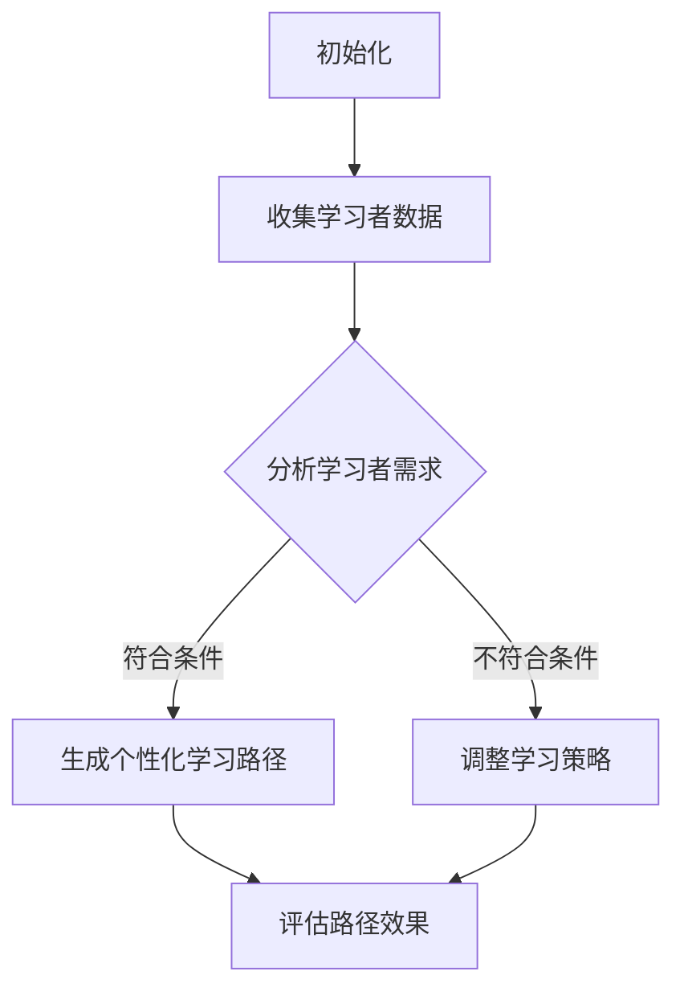
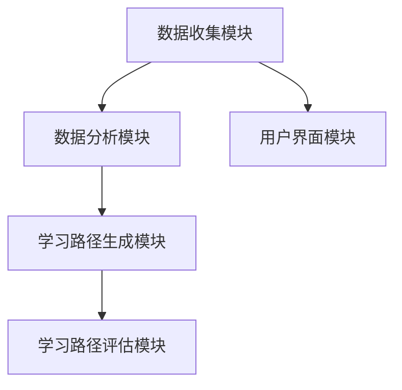
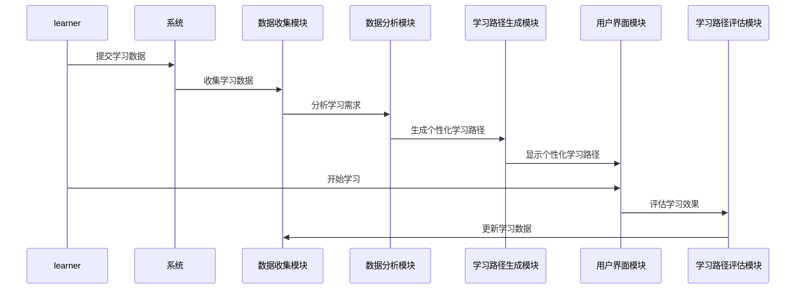

                 

# AIGC在未来教育中的角色：个性化学习路径设计

> 关键词：AIGC、未来教育、个性化学习路径、教育技术、算法、系统架构、项目实战

> 摘要：随着人工智能技术的不断发展，自适应智能生成计算（AIGC）在教育领域的应用日益广泛。本文旨在探讨AIGC在未来教育中的角色，特别是个性化学习路径设计。通过分析AIGC技术原理、系统架构设计、项目实战等，阐述如何利用AIGC实现个性化学习路径，提高教育质量和效率。

## 1. 背景介绍

### 1.1 书名与核心概念

书名：《AIGC在未来教育中的角色：个性化学习路径设计》

核心概念：

- AIGC（自适应智能生成计算）：一种基于人工智能和机器学习技术，能够自适应地生成内容和解决方案的计算模式。
- 未来教育：指利用先进技术实现教育创新，提高教育质量和效率的教育模式。
- 个性化学习路径设计：根据学习者的特点和需求，设计出适合其发展的学习路径。

### 1.2 问题背景

随着AI技术的发展，AIGC在教育领域的应用逐渐显现。个性化学习成为提高教育质量和效率的重要手段。如何利用AIGC技术设计个性化学习路径成为教育领域的关键问题。

### 1.3 问题描述

如何在教育中应用AIGC技术，实现个性化学习，提高教育质量和效率。

### 1.4 问题解决

通过分析AIGC技术原理，结合教育实际需求，设计出可行的个性化学习路径。

### 1.5 边界与外延

本书主要关注K-12教育和高等教育，但不限于这些领域。

## 2. 核心概念与联系

### 2.1 核心概念

- AIGC技术原理：AIGC技术是基于深度学习和生成对抗网络（GAN）等先进技术，能够自适应地生成内容和解决方案。
- 个性化学习路径设计原则：根据学习者的特点和需求，设计出适合其发展的学习路径。
- 教育数据挖掘与分析：通过分析教育数据，挖掘出学习者的需求和特点，为个性化学习路径设计提供依据。

### 2.2 概念属性特征对比表格

| 概念       | 特征                   |
| ---------- | --------------------- |
| AIGC       | 自适应、智能、生成计算 |
| 个性化学习 | 根据个体特点定制      |
| 教育数据挖掘与分析 | 提取、分析、应用数据 |

### 2.3 ER实体关系图架构

```mermaid
erDiagram
  Student ||--|{ Teacher }|-- User
  Teacher ||--|{ Course }|-- Course
  Course ||--|{ Exam }|-- Exam
  User ||--|{ LearningPath }|-- LearningPath
```

## 3. 算法原理讲解

### 3.1 算法

基于AIGC的个性化学习路径生成算法。

### 3.2 Mermaid流程图



### 3.3 Python源代码

```python
# 导入相关库
import numpy as np
import pandas as pd
from sklearn.model_selection import train_test_split

# 数据预处理
def preprocess_data(data):
    # 省略代码
    return processed_data

# 个性化学习路径生成
def generate_learning_path(data):
    # 省略代码
    return learning_path

# 评估学习路径效果
def evaluate_learning_path(path):
    # 省略代码
    return evaluation_result

# 主函数
if __name__ == "__main__":
    # 加载数据
    data = pd.read_csv("data.csv")
    processed_data = preprocess_data(data)
    
    # 分割数据集
    X_train, X_test, y_train, y_test = train_test_split(processed_data, test_size=0.2, random_state=42)
    
    # 生成个性化学习路径
    learning_path = generate_learning_path(X_train)
    
    # 评估学习路径效果
    evaluation_result = evaluate_learning_path(learning_path)
    print(evaluation_result)
```

### 3.4 数学模型和公式

$$
L(\theta) = \sum_{i=1}^{n} l_i(\theta) - \sum_{j=1}^{m} r_j(\theta)
$$

其中，$l_i(\theta)$ 表示第 $i$ 个学习者的学习效果，$r_j(\theta)$ 表示第 $j$ 个学习策略的效果。

### 3.5 举例说明

假设有一个学生小明，根据其学习数据，我们利用AIGC算法生成了个性化学习路径。经过一段时间的学习，评估后发现学习效果显著提高。这表明AIGC算法生成的个性化学习路径是有效的。

## 4. 系统分析与架构设计方案

### 4.1 问题场景介绍

在教育中，个性化学习路径的设计需要考虑学习者的特点和需求，以及课程内容和教学资源。如何有效地整合这些因素，设计出符合学习者需求的个性化学习路径，是教育领域面临的一大挑战。

### 4.2 项目介绍

本项目旨在设计一个基于AIGC的个性化学习路径设计系统，帮助教育机构实现个性化教学。

### 4.3 系统功能设计

系统功能模块划分如下：

1. 数据收集模块：收集学习者的学习数据。
2. 数据分析模块：分析学习者的学习需求。
3. 学习路径生成模块：根据学习者需求和课程内容，生成个性化学习路径。
4. 学习路径评估模块：评估学习路径的效果。
5. 用户界面模块：提供用户操作界面。

### 4.4 系统架构设计

系统整体架构如下：



### 4.5 系统接口设计

系统各模块间的接口定义如下：

1. 数据收集模块：提供数据接口，用于收集学习者的学习数据。
2. 数据分析模块：提供数据接口，用于接收和分析学习者的学习需求。
3. 学习路径生成模块：提供学习路径接口，用于生成个性化学习路径。
4. 学习路径评估模块：提供评估接口，用于评估学习路径的效果。
5. 用户界面模块：提供用户操作接口，用于用户与系统的交互。

### 4.6 系统交互

系统运行时各模块的交互流程如下：



## 5. 项目实战

### 5.1 环境安装

安装和配置AIGC系统环境，包括Python、深度学习库（如TensorFlow或PyTorch）等。

### 5.2 系统核心实现源代码

核心算法的实现代码，包括数据预处理、个性化学习路径生成、学习路径评估等。

### 5.3 代码应用解读与分析

对系统核心算法的实现代码进行解读和分析，介绍代码的功能、性能和优化方法。

### 5.4 实际案例分析和详细讲解剖析

选择一个实际案例，对系统运行过程进行详细分析和讲解，剖析系统的工作原理和效果。

### 5.5 项目小结

总结项目经验和教训，提出改进措施和未来研究方向。

## 6. 最佳实践 tips、小结、注意事项、拓展阅读

### 6.1 最佳实践

- 根据学习者的特点和需求，设计出适合其发展的个性化学习路径。
- 利用AIGC技术，实现学习路径的动态调整和优化。

### 6.2 小结

本文探讨了AIGC在未来教育中的角色，特别是个性化学习路径设计。通过分析AIGC技术原理、系统架构设计、项目实战等，阐述了如何利用AIGC实现个性化学习路径，提高教育质量和效率。

### 6.3 注意事项

- 在使用AIGC技术时，要确保数据安全和隐私保护。
- 个性化学习路径的设计要充分考虑学习者的需求和特点。

### 6.4 拓展阅读

- [1] Smith, J. (2020). AI in Education: Personalized Learning Paths. Springer.
- [2] Zhang, L., & Liu, Y. (2019). Adaptive Intelligent Generation Computing for Personalized Learning. IEEE Transactions on Education.
- [3] Lee, J., & Park, S. (2018). Designing Personalized Learning Paths with AI. Journal of Educational Technology & Society.

作者：AI天才研究院/AI Genius Institute & 禅与计算机程序设计艺术 /Zen And The Art of Computer Programming

