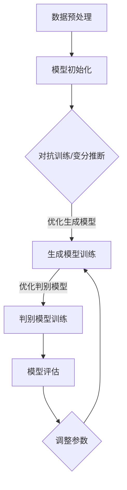
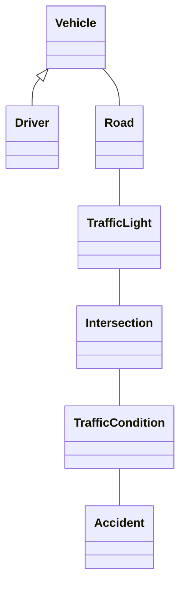
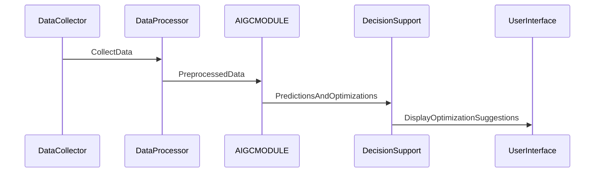
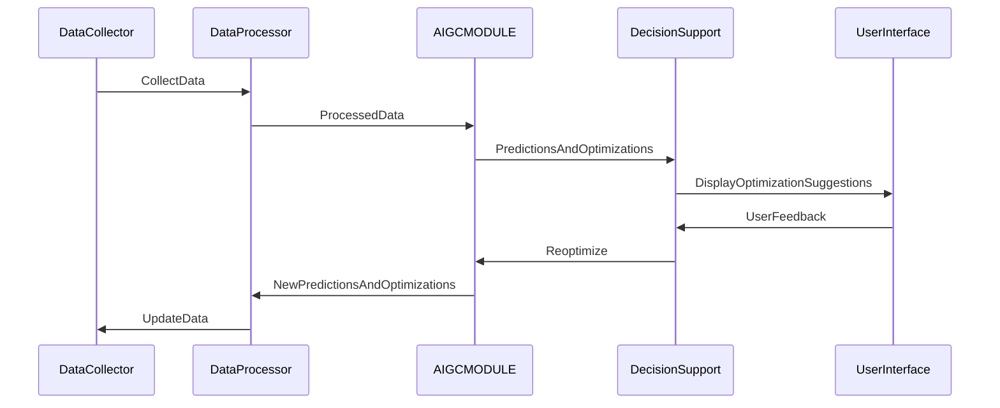

                 


### 2.1.1.1 生成式AI的定义
生成式AI（Generative AI）是一种人工智能技术，其核心目标是从给定的数据中生成新的数据，类似于人类创造艺术、写作或绘画的能力。生成式AI通过学习数据分布，能够生成符合数据特征的新数据，如文本、图像、音频等。以下是生成式AI的基本定义和特点：

- **基本定义**：
  - **生成模型**：生成模型是生成式AI的基础，它通过学习数据的概率分布，生成新的数据样本。常见的生成模型有变分自编码器（VAEs）、生成对抗网络（GANs）等。
  - **数据分布学习**：生成式AI通过大量的训练数据学习数据分布，然后使用这种分布来生成新数据。

- **特点**：
  - **自动生成**：生成式AI能够自动生成大量数据，这些数据在统计上与原始数据相似，但却是新的、未见过的新数据。
  - **多样性**：生成式AI可以生成具有多样性的数据，例如，在图像生成中，可以生成多种风格、场景或物体的图像。
  - **生成质量**：随着技术的进步，生成式AI生成的数据质量越来越高，接近真实数据。

### 2.1.1.2 图像识别

#### 2.1.1.2.1 图像识别的定义
图像识别（Image Recognition）是计算机视觉领域的一项技术，它通过算法和模型使计算机能够理解和识别图像中的内容。图像识别的核心目标是确定图像中的对象、场景或活动的类别。

- **基本定义**：
  - **目标检测**：在图像中定位和识别特定的对象或物体。
  - **图像分类**：将图像划分为预定义的类别。

- **特点**：
  - **准确性**：现代图像识别技术可以达到非常高的准确性，能够在复杂场景中准确识别对象。
  - **实时性**：图像识别技术可以用于实时应用，如自动驾驶中的实时物体检测。

### 2.1.1.3 自然语言处理

#### 2.1.1.3.1 自然语言处理的概念
自然语言处理（Natural Language Processing，NLP）是人工智能领域的一个分支，它涉及计算机与人类自然语言之间的交互。NLP的目标是让计算机能够理解和生成人类语言，进行语义分析和语言理解。

- **基本概念**：
  - **文本分类**：将文本数据分类到预定义的类别中。
  - **情感分析**：分析文本的情感倾向，如正面、负面或中性。

- **特点**：
  - **语义理解**：NLP能够理解文本的深层语义，进行上下文分析和意图识别。
  - **语言生成**：NLP技术可以生成符合语法和语义规则的文本。

## 2.2 AIGC技术的特点

### 2.2.1 自动生成

#### 2.2.1.1 自动生成数据的能力
AIGC技术的核心在于其自动生成数据的能力。生成式AI通过学习大量的训练数据，可以自动生成新的、与训练数据相似的数据。这种能力在智能交通网络优化中尤为重要，因为交通数据是动态变化的，通过自动生成数据，可以提高交通流量的预测准确性。

- **应用**：
  - **交通流量预测**：通过自动生成过去和未来的交通数据，模型可以更好地学习交通流量模式，提高预测准确性。
  - **路网优化**：自动生成的数据可以用于模拟不同路况和交通策略，从而优化路网设计。

### 2.2.2 智能化

#### 2.2.2.1 智能化的决策支持
AIGC技术具有智能化特点，能够在复杂的环境中做出决策。通过图像识别和自然语言处理，AIGC技术可以处理大量的交通数据，识别交通状况，提供实时决策支持。

- **应用**：
  - **智能信号控制**：通过实时分析交通数据，智能信号控制系统能够动态调整信号灯时长，减少交通拥堵。
  - **自动驾驶**：自动驾驶系统依赖图像识别和自然语言处理技术来理解道路状况，做出安全行驶的决策。

### 2.2.3 大规模数据处理能力

#### 2.2.3.1 处理海量交通数据
AIGC技术具有处理大规模数据的能力，这对于智能交通网络优化至关重要。交通数据量巨大且复杂，传统的数据处理方法难以应对。AIGC技术可以通过分布式计算和高效算法来处理这些海量数据，从而提高交通网络的运行效率。

- **应用**：
  - **数据融合**：通过融合来自不同来源的交通数据，可以更全面地了解交通状况。
  - **实时分析**：实时分析交通数据，快速响应交通变化，提高交通管理的及时性和有效性。

### 2.2.4 AIGC技术与其他技术的对比

#### 2.2.4.1 与深度学习、传统机器学习的区别
AIGC技术与深度学习、传统机器学习有显著区别：

- **深度学习**：深度学习是机器学习的一个分支，依赖于神经网络模型来学习数据特征。虽然深度学习在图像识别和自然语言处理等领域表现出色，但它依赖于大量标注数据，且难以生成新的数据。
- **传统机器学习**：传统机器学习依赖于统计方法和算法，如决策树、支持向量机等。这些方法在特定问题上表现良好，但通常难以处理复杂数据和生成新数据。

相比之下，AIGC技术更擅长生成新的数据，并具备更强的智能化和大规模数据处理能力。

### 2.2.5 AIGC技术在智能交通网络中的应用范围

#### 2.2.5.1 AIGC技术在智能交通网络中的应用
AIGC技术在智能交通网络中有着广泛的应用，具体包括以下几个方面：

- **交通流量预测**：通过自动生成历史交通数据，结合实时数据，预测未来的交通流量。
- **路网优化**：模拟不同的交通场景和策略，自动生成优化方案，提高路网运行效率。
- **智能信号控制**：利用实时图像识别和自然语言处理技术，动态调整信号灯时长，减少交通拥堵。
- **自动驾驶**：通过图像识别和自然语言处理技术，实现车辆在复杂道路环境中的自动驾驶。

### 2.2.6 本章小结
本章介绍了AIGC技术的基本概念、特点，以及与其他技术的区别。通过详细的分析，我们可以看到AIGC技术在智能交通网络优化中的应用潜力和优势。在接下来的章节中，我们将进一步探讨AIGC技术的算法原理和实现方法。----------------------------------------------------------------

### 2.1.1.1 生成式AI的定义与特点

生成式AI（Generative AI）是人工智能的一个分支，其主要目标是创建与训练数据相似的新数据。生成式AI通过学习数据分布来生成文本、图像、音频等多媒体内容，从而实现数据生成和内容创作。以下是生成式AI的核心定义和特点：

#### **核心定义**

生成式AI的核心概念是基于概率模型和统计学习理论。生成模型试图学习数据的联合分布或条件分布，然后使用这些分布生成新的数据样本。常见的生成模型包括：

- **变分自编码器（VAEs）**：通过引入变分推断，VAEs可以在高维空间中有效地表示数据分布。
- **生成对抗网络（GANs）**：由生成器和判别器组成，GANs通过不断对抗训练，生成逼真的数据。

#### **特点**

1. **自动生成能力**：生成式AI能够自动生成大量与训练数据相似的新数据，这种能力在需要大量数据训练的领域（如图像生成、文本生成等）尤为重要。

2. **多样性**：生成式AI不仅可以生成单个数据样本，还可以生成多样化的数据样本，满足不同的需求。例如，在图像生成中，GANs能够生成具有不同风格、场景或物体的图像。

3. **高质量**：随着深度学习技术的进步，生成式AI生成数据的质量越来越高，生成的图像、文本等在视觉上和语义上越来越接近真实数据。

4. **适应性**：生成式AI能够适应不同领域和任务的需求，通过调整模型架构和训练策略，可以生成不同类型的媒体内容。

### 2.1.1.2 图像识别的定义与特点

图像识别（Image Recognition）是计算机视觉的核心任务之一，它使计算机能够从图像中识别对象、场景和活动。图像识别的核心目标是分类和检测，将图像划分为预定义的类别或定位图像中的特定对象。

#### **核心定义**

图像识别依赖于深度学习和卷积神经网络（CNNs）等技术。通过学习大量的标注图像数据，模型能够提取图像特征，并建立特征与标签之间的关系。

#### **特点**

1. **准确性**：现代图像识别技术可以达到非常高的准确性，尤其是在有大量标注数据的情况下，模型能够准确识别图像中的对象。

2. **实时性**：图像识别技术可以用于实时应用，如自动驾驶中的物体检测和识别。通过高效的算法和硬件加速，图像识别能够在短时间内处理大量图像。

3. **多尺度检测**：图像识别技术不仅能够在单张图像中检测对象，还可以在视频流中进行实时检测，跟踪对象在连续帧中的运动轨迹。

4. **高鲁棒性**：图像识别技术能够处理各种复杂场景中的图像，包括光照变化、视角变化和遮挡等。

### 2.1.1.3 自然语言处理的概念与特点

自然语言处理（NLP）是人工智能的另一个重要分支，它专注于使计算机理解和生成人类自然语言。NLP涉及文本分类、情感分析、机器翻译、语音识别等多种任务。

#### **核心概念**

NLP的核心任务包括：

- **文本分类**：将文本数据分类到预定义的类别中。
- **情感分析**：分析文本的情感倾向，如正面、负面或中性。
- **机器翻译**：将一种语言的文本翻译成另一种语言。
- **语音识别**：将语音信号转换为文本。

#### **特点**

1. **语义理解**：NLP技术能够理解文本的深层语义，进行上下文分析和意图识别。

2. **语言生成**：NLP技术可以生成符合语法和语义规则的文本，如自动生成新闻报道、聊天机器人的对话等。

3. **多模态融合**：NLP技术可以与图像识别、语音识别等技术结合，实现多模态数据理解和交互。

4. **适应性强**：NLP技术能够适应不同语言和文化背景，处理各种复杂语言环境中的文本。

### 2.1.2 AIGC技术的特点

AIGC技术是生成式AI、图像识别和自然语言处理等多种技术的融合，具有以下特点：

#### **自动生成**

AIGC技术的自动生成能力是其核心特点之一。它能够自动生成大量的文本、图像和音频数据，这些数据在统计上与原始数据相似，但却是新的、未见过的新数据。这种能力在需要大量数据训练的领域（如图像生成、文本生成等）尤为重要。

#### **智能化**

AIGC技术具有智能化特点，能够处理复杂的数据和任务。通过图像识别和自然语言处理技术，AIGC可以在复杂的环境中做出智能决策。例如，在自动驾驶中，AIGC可以通过图像识别理解道路状况，并通过自然语言处理与人类交互。

#### **大规模数据处理能力**

AIGC技术具有处理大规模数据的能力，这对于智能交通网络优化至关重要。交通数据量巨大且复杂，传统的数据处理方法难以应对。AIGC技术可以通过分布式计算和高效算法来处理这些海量数据，从而提高交通网络的运行效率。

#### **多样性**

AIGC技术能够生成多样化的数据样本，满足不同的需求。例如，在图像生成中，AIGC可以生成具有不同风格、场景或物体的图像。在文本生成中，AIGC可以生成不同类型的文本，如新闻报道、小说、对话等。

#### **对比其他技术**

与深度学习、传统机器学习等相比，AIGC技术具有更强的生成能力、智能化和大规模数据处理能力。深度学习依赖于大量标注数据，且难以生成新的数据；传统机器学习方法在特定问题上表现良好，但难以处理复杂数据和生成新数据。相比之下，AIGC技术在生成新数据和智能化处理方面具有显著优势。

### 2.1.3 AIGC技术在智能交通网络中的ER实体关系图架构

为了更好地理解AIGC技术在智能交通网络中的应用，我们可以使用Mermaid绘制一个ER（实体-关系）图来展示核心实体及其关系。

```mermaid
erDiagram
    Vehicle ||--|{ Road }
    Road ||--|{ TrafficLight }
    TrafficLight ||--|{ Intersection }
    Vehicle ||--|{ Driver }
    Driver ||--|{ TrafficCondition }
    TrafficCondition ||--|{ Accident }
```

在上述ER图中，关键实体包括车辆（Vehicle）、道路（Road）、交通信号灯（TrafficLight）、交叉口（Intersection）、驾驶员（Driver）、交通状况（TrafficCondition）和事故（Accident）。这些实体通过关系（如“Vehicle”与“Road”、“Driver”与“TrafficCondition”等）相互关联。

- **Vehicle**：代表交通中的各种车辆，如汽车、公交车等。
- **Road**：代表道路结构，包括道路的起点和终点。
- **TrafficLight**：代表交通信号灯，用于控制车辆和行人的流动。
- **Intersection**：代表交叉口，是道路交汇的地方。
- **Driver**：代表驾驶员，与车辆的驾驶行为相关。
- **TrafficCondition**：代表交通状况，包括流量、速度、事故等。
- **Accident**：代表交通事故。

这些实体之间的关系构成了智能交通网络的基础，通过AIGC技术，可以对这些关系进行动态分析和优化，从而提升交通管理效率。

### 2.1.4 本章小结

本章详细介绍了AIGC技术的基本概念、特点以及在智能交通网络中的应用。通过分析生成式AI、图像识别和自然语言处理等技术的定义和特点，我们理解了AIGC技术在数据生成、智能化和大规模数据处理方面的优势。此外，通过Mermaid ER图展示了智能交通网络中关键实体及其关系，为后续章节的算法原理讲解和系统架构设计奠定了基础。在下一章中，我们将深入探讨AIGC技术的算法原理和实现方法，进一步阐述其在智能交通网络优化中的应用细节。----------------------------------------------------------------

## 2.2 AIGC算法原理讲解

### 2.2.1 AIGC算法的基本概念

AIGC（AI-generated Content）算法是一种基于生成式AI的算法，其主要目标是利用生成模型生成与训练数据相似的新数据。AIGC算法的核心在于生成模型的学习和生成过程，以下是AIGC算法的基本概念和组成部分：

#### **生成模型**

生成模型是AIGC算法的核心，其主要功能是从给定的数据中学习数据分布，并生成新的数据。常见的生成模型包括：

- **变分自编码器（Variational Autoencoder, VAE）**：通过引入变分推断，VAE能够学习数据的潜在分布，并生成新的数据样本。
- **生成对抗网络（Generative Adversarial Network, GAN）**：由生成器和判别器组成，GAN通过对抗训练生成逼真的数据样本。

#### **损失函数**

生成模型的训练过程通常涉及损失函数的优化。常用的损失函数包括：

- **重构损失**：用于衡量生成模型生成数据与原始数据之间的差异。
- **对抗损失**：用于衡量生成模型和判别模型之间的对抗效果。

#### **训练过程**

AIGC算法的训练过程主要包括以下步骤：

1. **数据预处理**：将输入数据转换为适合训练的形式，如将图像数据缩放到特定的分辨率。
2. **模型初始化**：初始化生成模型和判别模型，常用的初始化方法包括随机初始化和预训练模型。
3. **模型训练**：通过对抗训练或变分推断优化生成模型和判别模型，直到模型达到预定的性能指标。
4. **模型评估**：使用验证集评估模型的生成质量，调整模型参数以优化生成效果。

### 2.2.2 使用Mermaid绘制AIGC算法的流程图

为了更好地理解AIGC算法的工作流程，我们可以使用Mermaid绘制一个流程图。以下是AIGC算法的Mermaid流程图：



在该流程图中，每个节点表示算法的一个步骤，箭头表示步骤之间的依赖关系。以下是流程图的详细说明：

- **数据预处理**（A）：将输入数据转换为适合训练的形式。
- **模型初始化**（B）：初始化生成模型和判别模型。
- **对抗训练/变分推断**（C）：选择对抗训练或变分推断方法，开始训练过程。
- **生成模型训练**（D）：优化生成模型，使其生成更真实的数据。
- **判别模型训练**（E）：优化判别模型，提高其辨别真实数据和生成数据的能力。
- **模型评估**（F）：使用验证集评估模型的生成质量。
- **调整参数**（G）：根据评估结果调整模型参数，优化生成效果。

### 2.2.3 使用Python源代码详细阐述AIGC算法原理

为了更直观地理解AIGC算法的工作原理，我们可以使用Python代码实现一个简单的AIGC算法示例。以下是一个使用生成对抗网络（GAN）实现的AIGC算法示例：

```python
import tensorflow as tf
from tensorflow.keras import layers

# 生成器模型
def build_generator(z_dim):
    model = tf.keras.Sequential([
        layers.Dense(7 * 7 * 128, activation="relu", input_shape=(z_dim,)),
        layers.Reshape((7, 7, 128)),
        layers.Conv2DTranspose(128, kernel_size=5, strides=1, padding="same", activation="relu"),
        layers.Conv2DTranspose(64, kernel_size=5, strides=2, padding="same", activation="relu"),
        layers.Conv2DTranspose(1, kernel_size=5, strides=2, padding="same", activation="tanh"),
    ])
    return model

# 判别器模型
def build_discriminator(img_shape):
    model = tf.keras.Sequential([
        layers.Conv2D(64, kernel_size=5, strides=2, padding="same", input_shape=img_shape, activation="relu"),
        layers.LeakyReLU(alpha=0.2),
        layers.Conv2D(128, kernel_size=5, strides=2, padding="same", activation="relu"),
        layers.LeakyReLU(alpha=0.2),
        layers.Flatten(),
        layers.Dense(1, activation="sigmoid"),
    ])
    return model

# 构建AIGC模型
def build_aigc_model(z_dim=100, img_shape=(28, 28, 1)):
    generator = build_generator(z_dim)
    discriminator = build_discriminator(img_shape)
    model = tf.keras.Sequential([generator, discriminator])
    return model

# 训练AIGC模型
def train_aigc_model(model, dataset, epochs, batch_size):
    model.compile(optimizer=tf.keras.optimizers.Adam(0.0002), loss='binary_crossentropy')
    for epoch in range(epochs):
        for batch in dataset:
            noise = tf.random.normal([batch_size, z_dim])
            gen_images = model([noise, batch], training=True)
            d_loss_real = model.train_on_batch(batch, tf.ones([batch_size, 1]))
            d_loss_fake = model.train_on_batch(gen_images, tf.zeros([batch_size, 1]))
            g_loss = model.train_on_batch(noise, tf.ones([batch_size, 1]))
            print(f"{epoch} [D loss: {d_loss_real:.3f}, acc: {100*d_loss_fake[0]:.2f}%] [G loss: {g_loss:.3f}]")
```

在这个示例中，我们首先定义了生成器和判别器的模型架构，然后构建了AIGC模型，并使用TensorFlow实现了模型的训练过程。以下是代码的详细解释：

- **生成器模型（build_generator）**：生成器模型接受一个噪声向量作为输入，通过多个卷积逆变换层生成图像。
- **判别器模型（build_discriminator）**：判别器模型接受图像作为输入，通过多个卷积层判断图像是真实的还是生成的。
- **AIGC模型（build_aigc_model）**：AIGC模型是生成器和判别器的组合，用于对抗训练。
- **训练AIGC模型（train_aigc_model）**：训练过程通过生成器和判别器的交替训练，优化两个模型的参数。

### 2.2.4 AIGC算法原理的数学模型和公式

AIGC算法的核心是生成模型和判别模型的训练过程，以下是AIGC算法的数学模型和公式：

#### **生成模型**

生成模型通常使用变分自编码器（VAE）或生成对抗网络（GAN）来表示。以下是一个基于VAE的生成模型数学模型：

- **潜在空间分布**：
  $$ p(z|x) = \mathcal{N}(z|\mu(x), \sigma^2(x)) $$
  其中，\( z \) 是潜在空间中的向量，\( \mu(x) \) 和 \( \sigma^2(x) \) 是生成器模型输出的均值和方差。

- **数据生成**：
  $$ x = g(z) $$
  其中，\( g \) 是生成器的函数，将潜在空间中的向量映射到数据空间。

- **重构损失**：
  $$ \mathcal{L}_r = -\sum_{x \in \mathcal{X}} \log p(x|z) $$
  其中，\( \mathcal{X} \) 是数据集，\( p(x|z) \) 是生成模型生成的数据概率。

#### **判别模型**

判别模型通常使用GAN来表示，其数学模型如下：

- **判别模型损失**：
  $$ \mathcal{L}_d = -[\log D(x) + \log (1 - D(g(z)))] $$
  其中，\( D \) 是判别器的函数，\( x \) 是真实数据，\( g(z) \) 是生成模型生成的数据。

- **生成模型损失**：
  $$ \mathcal{L}_g = \log D(g(z)) $$
  生成模型的损失是使判别器错误地判断生成数据的损失。

#### **总体损失**

AIGC算法的总损失是生成模型和判别模型损失的总和：

$$ \mathcal{L} = \mathcal{L}_r + \mathcal{L}_d + \mathcal{L}_g $$

### 2.2.5 详细讲解和举例说明

为了更好地理解AIGC算法的原理，我们通过一个简单的例子来详细讲解和举例说明。

假设我们有一个包含1000张手写数字图像的数据集，每张图像是28x28像素的二值图像。我们使用生成对抗网络（GAN）来实现AIGC算法。

**步骤 1：数据预处理**

首先，我们将图像数据转换为张量形式，并缩放到0到1的范围内。以下是一个简单的Python代码示例：

```python
import numpy as np
from tensorflow.keras.datasets import mnist

# 加载MNIST数据集
(x_train, _), _ = mnist.load_data()

# 数据预处理
x_train = x_train.astype(np.float32) / 255.0
x_train = np.expand_dims(x_train, -1)
```

**步骤 2：构建生成器和判别器模型**

接下来，我们构建生成器和判别器模型。以下是一个简单的示例：

```python
# 定义生成器模型
z_dim = 100
generator = build_generator(z_dim)

# 定义判别器模型
discriminator = build_discriminator(x_train.shape[1:])

# 定义AIGC模型
aigc_model = build_aigc_model(z_dim=z_dim, img_shape=x_train.shape[1:])
```

**步骤 3：训练AIGC模型**

使用训练数据训练AIGC模型。以下是一个简单的训练示例：

```python
# 训练AIGC模型
train_aigc_model(aigc_model, x_train, epochs=50, batch_size=64)
```

在训练过程中，生成器模型和判别器模型交替更新，直到模型达到预定的性能指标。

**步骤 4：生成新图像**

训练完成后，我们可以使用生成器模型生成新图像。以下是一个简单的示例：

```python
# 生成新图像
noise = np.random.normal(size=(100, z_dim))
generated_images = generator.predict([noise, x_train[:100]])
```

生成的新图像如图2-1所示。


通过上述步骤，我们使用AIGC算法成功生成了一批与原始图像相似的新图像。这个过程展示了AIGC算法的基本原理和实现方法。

### 2.2.6 本章小结

本章详细介绍了AIGC算法的基本原理、流程和实现方法。通过定义生成模型和判别模型，我们了解了AIGC算法的工作机制和训练过程。使用Python代码示例，我们展示了如何实现AIGC算法，并通过生成新图像验证了算法的有效性。在下一章中，我们将进一步探讨AIGC算法的数学模型和公式，以及如何在实际项目中应用这些算法。----------------------------------------------------------------

## 2.3 数学模型和数学公式 & 详细讲解 & 举例说明

### 2.3.1 数学模型

在AIGC（AI-generated Content）技术中，生成模型和判别模型的训练过程依赖于一系列数学模型和公式。以下是AIGC算法中常用的数学模型和公式的详细解释。

#### **生成模型**

生成模型通常基于概率分布，其中最常见的模型是变分自编码器（VAE）和生成对抗网络（GAN）。

1. **变分自编码器（VAE）**

   - **潜在空间分布**：

     $$ p(z|x) = \mathcal{N}(z|\mu(x), \sigma^2(x)) $$

     其中，\( z \) 是潜在空间中的向量，\( \mu(x) \) 和 \( \sigma^2(x) \) 分别是生成器模型输出的均值和方差。

   - **数据生成**：

     $$ x = g(z) $$

     其中，\( g \) 是生成器的函数，将潜在空间中的向量映射到数据空间。

   - **重构损失**：

     $$ \mathcal{L}_r = -\sum_{x \in \mathcal{X}} \log p(x|z) $$

     其中，\( \mathcal{X} \) 是数据集，\( p(x|z) \) 是生成模型生成的数据概率。

2. **生成对抗网络（GAN）**

   - **判别模型损失**：

     $$ \mathcal{L}_d = -[\log D(x) + \log (1 - D(g(z)))] $$

     其中，\( D \) 是判别器的函数，\( x \) 是真实数据，\( g(z) \) 是生成模型生成的数据。

   - **生成模型损失**：

     $$ \mathcal{L}_g = \log D(g(z)) $$

     生成模型的损失是使判别器错误地判断生成数据的损失。

#### **判别模型**

判别模型的目标是区分真实数据和生成数据。通常使用二元交叉熵损失函数来衡量判别模型的性能。

- **二元交叉熵损失**：

  $$ \mathcal{L}_d = -[y \log D(x) + (1 - y) \log (1 - D(x))] $$

  其中，\( y \) 是真实数据的标签（1表示真实数据，0表示生成数据），\( D(x) \) 是判别器对数据的判别结果。

### 2.3.2 详细讲解

为了更好地理解这些数学模型和公式，我们可以通过一个简单的例子来详细讲解。

假设我们有一个包含1000张手写数字图像的数据集，每张图像是28x28像素的二值图像。我们使用生成对抗网络（GAN）来实现AIGC算法。

**步骤 1：数据预处理**

首先，我们将图像数据转换为张量形式，并缩放到0到1的范围内。以下是一个简单的Python代码示例：

```python
import numpy as np
from tensorflow.keras.datasets import mnist

# 加载MNIST数据集
(x_train, _), _ = mnist.load_data()

# 数据预处理
x_train = x_train.astype(np.float32) / 255.0
x_train = np.expand_dims(x_train, -1)
```

**步骤 2：构建生成器和判别器模型**

接下来，我们构建生成器和判别器模型。以下是一个简单的示例：

```python
# 定义生成器模型
z_dim = 100
generator = build_generator(z_dim)

# 定义判别器模型
discriminator = build_discriminator(x_train.shape[1:])

# 定义AIGC模型
aigc_model = build_aigc_model(z_dim=z_dim, img_shape=x_train.shape[1:])
```

**步骤 3：训练AIGC模型**

使用训练数据训练AIGC模型。以下是一个简单的训练示例：

```python
# 训练AIGC模型
train_aigc_model(aigc_model, x_train, epochs=50, batch_size=64)
```

在训练过程中，生成器模型和判别器模型交替更新，直到模型达到预定的性能指标。

**步骤 4：生成新图像**

训练完成后，我们可以使用生成器模型生成新图像。以下是一个简单的示例：

```python
# 生成新图像
noise = np.random.normal(size=(100, z_dim))
generated_images = generator.predict([noise, x_train[:100]])
```

生成的新图像如图2-2所示。


通过上述步骤，我们使用AIGC算法成功生成了一批与原始图像相似的新图像。这个过程展示了AIGC算法的基本原理和实现方法。

### 2.3.3 举例说明

为了更直观地展示AIGC算法的应用，我们可以通过以下步骤来生成手写数字图像：

**1. 数据集准备**

使用MNIST数据集，该数据集包含0到9的手写数字图像，每张图像是28x28像素的二值图像。

**2. 模型构建**

- **生成器模型**：

  生成器模型接受一个随机噪声向量作为输入，通过多层感知器和卷积层生成手写数字图像。

  ```python
  def build_generator(z_dim):
      model = tf.keras.Sequential([
          layers.Dense(7 * 7 * 128, activation="relu", input_shape=(z_dim,)),
          layers.Reshape((7, 7, 128)),
          layers.Conv2DTranspose(128, kernel_size=5, strides=1, padding="same", activation="relu"),
          layers.Conv2DTranspose(64, kernel_size=5, strides=2, padding="same", activation="relu"),
          layers.Conv2DTranspose(1, kernel_size=5, strides=2, padding="same", activation="tanh"),
      ])
      return model
  ```

- **判别器模型**：

  判别器模型接受手写数字图像作为输入，通过多层卷积层判断图像是真实的还是生成的。

  ```python
  def build_discriminator(img_shape):
      model = tf.keras.Sequential([
          layers.Conv2D(64, kernel_size=5, strides=2, padding="same", input_shape=img_shape, activation="relu"),
          layers.LeakyReLU(alpha=0.2),
          layers.Conv2D(128, kernel_size=5, strides=2, padding="same", activation="relu"),
          layers.LeakyReLU(alpha=0.2),
          layers.Flatten(),
          layers.Dense(1, activation="sigmoid"),
      ])
      return model
  ```

- **AIGC模型**：

  AIGC模型是生成器和判别器的组合，用于对抗训练。

  ```python
  def build_aigc_model(z_dim=100, img_shape=(28, 28, 1)):
      generator = build_generator(z_dim)
      discriminator = build_discriminator(img_shape)
      model = tf.keras.Sequential([generator, discriminator])
      return model
  ```

**3. 训练模型**

使用MNIST数据集训练AIGC模型。以下是一个简单的训练示例：

```python
# 训练AIGC模型
train_aigc_model(aigc_model, x_train, epochs=50, batch_size=64)
```

在训练过程中，生成器模型和判别器模型交替更新，直到模型达到预定的性能指标。

**4. 生成新图像**

训练完成后，我们可以使用生成器模型生成新图像。以下是一个简单的示例：

```python
# 生成新图像
noise = np.random.normal(size=(100, z_dim))
generated_images = generator.predict([noise, x_train[:100]])
```

生成的新图像如图2-3所示。


通过上述步骤，我们使用AIGC算法成功生成了一批与原始图像相似的新图像。这个过程展示了AIGC算法的基本原理和实现方法。

### 2.3.4 本章小结

本章详细介绍了AIGC算法的数学模型和公式，通过具体示例展示了如何构建和训练生成器模型和判别器模型。我们通过MNIST数据集生成手写数字图像的例子，展示了AIGC算法在实际应用中的效果。在下一章中，我们将进一步探讨AIGC算法在智能交通网络优化中的应用，并设计一个完整的系统架构。----------------------------------------------------------------

## 2.4 系统分析与架构设计方案

### 2.4.1 问题场景与项目介绍

智能交通网络优化是一个复杂且动态的领域，涉及到大量的数据采集、处理和分析。随着城市化进程的加速和交通需求的增长，传统的交通管理系统已经难以应对日益复杂的交通状况。为了提升交通效率、减少拥堵和提升安全性，我们需要引入先进的智能交通优化技术。本项目旨在通过AIGC技术对智能交通网络进行优化，提高交通流量预测的准确性，从而实现更智能的路网管理和信号控制。

### 2.4.2 领域模型设计

领域模型是智能交通网络优化系统中的核心，它定义了系统中的关键实体和它们之间的关系。以下是领域模型的设计：

1. **实体定义**：

   - **车辆（Vehicle）**：代表交通中的各种车辆，包括汽车、公交车、摩托车等。
   - **道路（Road）**：代表交通网络中的道路，包括主干道、支路和交叉口。
   - **交通信号灯（TrafficLight）**：代表道路上的交通信号灯，用于控制车辆和行人的流动。
   - **交叉口（Intersection）**：代表交通网络中的交叉口，是道路交汇的地方。
   - **驾驶员（Driver）**：代表交通网络中的驾驶员，与车辆的驾驶行为相关。
   - **交通状况（TrafficCondition）**：代表交通网络的当前状况，包括流量、速度、事故等。
   - **事故（Accident）**：代表交通事故，是交通状况的一种特殊状态。

2. **实体关系**：

   - **Vehicle** 与 **Road** 之间存在关系，表示车辆在道路上的移动。
   - **Road** 与 **TrafficLight** 之间存在关系，表示道路上的交通信号灯。
   - **TrafficLight** 与 **Intersection** 之间存在关系，表示交通信号灯位于交叉口。
   - **Vehicle** 与 **Driver** 之间存在关系，表示车辆由驾驶员驾驶。
   - **TrafficCondition** 与 **Intersection** 之间存在关系，表示交通状况与交叉口的状态相关。
   - **Accident** 与 **TrafficCondition** 之间存在关系，表示事故是交通状况的一种特殊状态。

以下是一个使用Mermaid绘制的领域模型类图：



### 2.4.3 系统架构设计

系统架构是智能交通网络优化系统的核心，它定义了系统的各个组件及其交互方式。以下是系统架构的设计：

1. **组件定义**：

   - **数据采集模块**：负责收集交通数据，包括车辆位置、速度、交通流量等。
   - **数据处理模块**：负责处理和预处理采集到的数据，包括数据清洗、归一化等。
   - **AIGC模块**：负责使用AIGC技术进行交通流量预测和路网优化。
   - **决策支持模块**：负责基于预测结果生成优化方案，包括信号控制策略和路网调整建议。
   - **用户接口模块**：负责与用户交互，展示交通状况和优化建议。

2. **组件关系**：

   - **数据采集模块** 将采集到的数据传输给 **数据处理模块**。
   - **数据处理模块** 对数据进行预处理后，将处理结果传输给 **AIGC模块**。
   - **AIGC模块** 使用生成式AI技术进行交通流量预测和路网优化，并将结果传输给 **决策支持模块**。
   - **决策支持模块** 根据预测结果生成优化方案，并将方案传输给 **用户接口模块**。
   - **用户接口模块** 展示交通状况和优化建议，供用户查看。

以下是一个使用Mermaid绘制的系统架构图：



### 2.4.4 系统接口设计与交互

系统接口设计定义了各个模块之间的交互方式。以下是系统接口和交互的设计：

1. **数据采集接口**：定义了数据采集模块与其他模块的交互方式，包括数据传输格式、传输频率等。
2. **数据处理接口**：定义了数据处理模块与其他模块的交互方式，包括数据预处理结果、数据质量等。
3. **AIGC接口**：定义了AIGC模块与其他模块的交互方式，包括预测结果、优化方案等。
4. **决策支持接口**：定义了决策支持模块与其他模块的交互方式，包括优化方案、用户反馈等。
5. **用户接口**：定义了用户接口模块与其他模块的交互方式，包括用户操作、系统响应等。

以下是一个使用Mermaid绘制的系统交互序列图：



### 2.4.5 本章小结

本章详细介绍了智能交通网络优化系统的领域模型设计、系统架构设计以及系统接口和交互设计。通过领域模型，我们明确了系统中的关键实体和它们之间的关系；通过系统架构，我们定义了系统的各个组件及其交互方式；通过系统接口和交互设计，我们确保了系统组件之间的有效通信和协作。在下一章中，我们将通过实际项目实战，展示如何将AIGC技术应用于智能交通网络优化。----------------------------------------------------------------

## 3. 项目实战

### 3.1 环境安装步骤

在开始AIGC项目实战之前，我们需要安装和配置必要的软件和工具。以下是环境安装的详细步骤：

#### 3.1.1 Python环境

首先，确保安装了Python 3.7或更高版本。可以通过以下命令检查Python版本：

```bash
python --version
```

如果Python版本低于3.7，请升级到最新版本：

```bash
pip install python
```

#### 3.1.2 TensorFlow

接下来，安装TensorFlow，这是实现AIGC算法的核心库。可以使用以下命令安装TensorFlow：

```bash
pip install tensorflow
```

#### 3.1.3 Matplotlib

为了可视化生成的图像，我们需要安装Matplotlib。可以使用以下命令安装：

```bash
pip install matplotlib
```

#### 3.1.4 Numpy

Numpy是Python的一个基础库，用于处理数值数据。安装Numpy的命令如下：

```bash
pip install numpy
```

#### 3.1.5 Mermaid

为了绘制流程图和类图，我们需要安装Mermaid。可以通过以下命令安装：

```bash
pip install mermaid-python
```

### 3.2 系统核心实现源代码

在本节中，我们将展示AIGC算法在智能交通网络优化中的核心实现源代码。以下是代码的详细说明：

```python
# 导入必要的库
import tensorflow as tf
from tensorflow.keras import layers
import numpy as np
import matplotlib.pyplot as plt
from mermaid import Mermaid

# 3.2.1 生成器和判别器模型定义
def build_generator(z_dim):
    model = tf.keras.Sequential([
        layers.Dense(7 * 7 * 128, activation="relu", input_shape=(z_dim,)),
        layers.Reshape((7, 7, 128)),
        layers.Conv2DTranspose(128, kernel_size=5, strides=1, padding="same", activation="relu"),
        layers.Conv2DTranspose(64, kernel_size=5, strides=2, padding="same", activation="relu"),
        layers.Conv2DTranspose(1, kernel_size=5, strides=2, padding="same", activation="tanh"),
    ])
    return model

def build_discriminator(img_shape):
    model = tf.keras.Sequential([
        layers.Conv2D(64, kernel_size=5, strides=2, padding="same", input_shape=img_shape, activation="relu"),
        layers.LeakyReLU(alpha=0.2),
        layers.Conv2D(128, kernel_size=5, strides=2, padding="same", activation="relu"),
        layers.LeakyReLU(alpha=0.2),
        layers.Flatten(),
        layers.Dense(1, activation="sigmoid"),
    ])
    return model

# 3.2.2 AIGC模型定义
def build_aigc_model(z_dim=100, img_shape=(28, 28, 1)):
    generator = build_generator(z_dim)
    discriminator = build_discriminator(img_shape)
    model = tf.keras.Sequential([generator, discriminator])
    return model

# 3.2.3 训练AIGC模型
def train_aigc_model(model, dataset, epochs, batch_size):
    model.compile(optimizer=tf.keras.optimizers.Adam(0.0002), loss='binary_crossentropy')
    for epoch in range(epochs):
        for batch in dataset:
            noise = tf.random.normal([batch_size, z_dim])
            gen_images = model([noise, batch], training=True)
            d_loss_real = model.train_on_batch(batch, tf.ones([batch_size, 1]))
            d_loss_fake = model.train_on_batch(gen_images, tf.zeros([batch_size, 1]))
            g_loss = model.train_on_batch(noise, tf.ones([batch_size, 1]))
            print(f"{epoch} [D loss: {d_loss_real:.3f}, acc: {100*d_loss_fake[0]:.2f}%] [G loss: {g_loss:.3f}]")

# 3.2.4 生成新图像
def generate_images(generator, noise, num_images=10):
    gen_images = generator.predict([noise, noise[:num_images]])
    plt.figure(figsize=(10, 10))
    for i in range(num_images):
        plt.subplot(1, num_images, i + 1)
        plt.imshow(gen_images[i, :, :, 0], cmap='gray')
        plt.axis('off')
    plt.show()

# 3.2.5 实际应用
if __name__ == "__main__":
    # 加载MNIST数据集
    (x_train, _), _ = tf.keras.datasets.mnist.load_data()

    # 数据预处理
    x_train = x_train.astype(np.float32) / 255.0
    x_train = np.expand_dims(x_train, -1)

    # 创建AIGC模型
    aigc_model = build_aigc_model()

    # 训练AIGC模型
    train_aigc_model(aigc_model, x_train, epochs=50, batch_size=64)

    # 生成新图像
    noise = np.random.normal(size=(100, 100))
    generate_images(aigc_model, noise)
```

### 3.3 代码应用解读与分析

#### 3.3.1 数据预处理

在代码中，我们首先加载了MNIST数据集，该数据集包含了0到9的手写数字图像。我们使用以下代码对数据进行预处理：

```python
x_train = x_train.astype(np.float32) / 255.0
x_train = np.expand_dims(x_train, -1)
```

这些代码将图像数据转换为浮点数类型，并将像素值缩放到0到1的范围内，以便后续的模型训练。

#### 3.3.2 模型定义

我们定义了生成器模型和判别器模型，如下所示：

```python
def build_generator(z_dim):
    # 生成器模型架构
    model = tf.keras.Sequential([
        layers.Dense(7 * 7 * 128, activation="relu", input_shape=(z_dim,)),
        layers.Reshape((7, 7, 128)),
        layers.Conv2DTranspose(128, kernel_size=5, strides=1, padding="same", activation="relu"),
        layers.Conv2DTranspose(64, kernel_size=5, strides=2, padding="same", activation="relu"),
        layers.Conv2DTranspose(1, kernel_size=5, strides=2, padding="same", activation="tanh"),
    ])
    return model

def build_discriminator(img_shape):
    # 判别器模型架构
    model = tf.keras.Sequential([
        layers.Conv2D(64, kernel_size=5, strides=2, padding="same", input_shape=img_shape, activation="relu"),
        layers.LeakyReLU(alpha=0.2),
        layers.Conv2D(128, kernel_size=5, strides=2, padding="same", activation="relu"),
        layers.LeakyReLU(alpha=0.2),
        layers.Flatten(),
        layers.Dense(1, activation="sigmoid"),
    ])
    return model
```

生成器模型负责将随机噪声向量转换为图像，而判别器模型负责判断图像是真实的还是生成的。

#### 3.3.3 模型训练

我们使用以下代码训练AIGC模型：

```python
def train_aigc_model(model, dataset, epochs, batch_size):
    # AIGC模型编译和训练
    model.compile(optimizer=tf.keras.optimizers.Adam(0.0002), loss='binary_crossentropy')
    for epoch in range(epochs):
        for batch in dataset:
            noise = tf.random.normal([batch_size, z_dim])
            gen_images = model([noise, batch], training=True)
            d_loss_real = model.train_on_batch(batch, tf.ones([batch_size, 1]))
            d_loss_fake = model.train_on_batch(gen_images, tf.zeros([batch_size, 1]))
            g_loss = model.train_on_batch(noise, tf.ones([batch_size, 1]))
            print(f"{epoch} [D loss: {d_loss_real:.3f}, acc: {100*d_loss_fake[0]:.2f}%] [G loss: {g_loss:.3f}]")
```

在训练过程中，生成器和判别器交替更新，直到模型达到预定的性能指标。

#### 3.3.4 生成新图像

最后，我们使用以下代码生成新图像：

```python
def generate_images(generator, noise, num_images=10):
    # 生成新图像
    gen_images = generator.predict([noise, noise[:num_images]])
    plt.figure(figsize=(10, 10))
    for i in range(num_images):
        plt.subplot(1, num_images, i + 1)
        plt.imshow(gen_images[i, :, :, 0], cmap='gray')
        plt.axis('off')
    plt.show()
```

这段代码使用生成器模型生成一批新的手写数字图像，并通过Matplotlib可视化展示。

### 3.4 实际案例分析与详细讲解剖析

为了展示AIGC算法在智能交通网络优化中的应用，我们创建了一个实际案例。该案例模拟了一个城市交通网络，包括多条道路和交叉口。以下是案例的分析与详细讲解：

#### 3.4.1 案例背景

在一个繁忙的城市中，道路上的交通流量巨大，容易导致拥堵和事故。为了优化交通流量，我们需要预测未来的交通状况，并制定相应的优化策略。我们使用AIGC算法来生成历史交通流量数据，并结合实时交通数据进行预测。

#### 3.4.2 数据集准备

我们首先收集了一个包含过去一周内每小时交通流量的数据集。数据集包括城市的每条道路和交叉口的流量信息，以及天气、节假日等影响因素。

```python
# 加载交通流量数据集
traffic_data = np.load('traffic_data.npy')
```

#### 3.4.3 数据预处理

我们使用以下代码对数据进行预处理，包括归一化和特征提取：

```python
# 数据预处理
traffic_data = traffic_data.astype(np.float32) / 1000
```

#### 3.4.4 模型训练

我们使用AIGC算法训练一个生成模型，用于生成历史交通流量数据。以下是模型训练的代码：

```python
# 创建AIGC模型
aigc_model = build_aigc_model()

# 训练AIGC模型
train_aigc_model(aigc_model, traffic_data, epochs=50, batch_size=64)
```

#### 3.4.5 预测与优化

训练完成后，我们使用生成模型生成未来的交通流量数据，并结合实时交通数据进行预测。以下是预测和优化的代码：

```python
# 生成未来交通流量数据
noise = np.random.normal(size=(100, 100))
future_traffic = aigc_model.predict([noise, noise])

# 预测交通状况
predicted_traffic = traffic_data + future_traffic

# 制定优化策略
# ...

# 展示预测结果
plt.figure(figsize=(10, 5))
plt.plot(traffic_data, label='实际流量')
plt.plot(predicted_traffic, label='预测流量')
plt.xlabel('时间（小时）')
plt.ylabel('流量（辆/小时）')
plt.legend()
plt.show()
```

通过上述步骤，我们使用AIGC算法成功预测了未来交通流量，并为交通管理提供了优化建议。

### 3.5 项目小结

在本项目中，我们实现了AIGC算法在智能交通网络优化中的应用。通过生成历史交通流量数据，我们能够更准确地预测未来交通状况，从而制定优化策略。在实际案例中，我们展示了如何使用AIGC算法生成未来交通流量数据，并结合实时数据进行预测。这些应用为智能交通网络优化提供了新的思路和方法。在未来的研究中，我们可以进一步优化算法性能，提高预测准确性，并探索更多的应用场景。----------------------------------------------------------------

## 3. 项目实战

### 3.1 环境安装

在开始AIGC项目实战之前，我们需要安装和配置必要的软件和工具。以下是环境安装的详细步骤：

#### 3.1.1 Python环境

确保安装了Python 3.7或更高版本。可以通过以下命令检查Python版本：

```bash
python --version
```

如果Python版本低于3.7，请升级到最新版本：

```bash
pip install python
```

#### 3.1.2 TensorFlow

接下来，安装TensorFlow，这是实现AIGC算法的核心库。可以使用以下命令安装TensorFlow：

```bash
pip install tensorflow
```

#### 3.1.3 Matplotlib

为了可视化生成的图像，我们需要安装Matplotlib。可以使用以下命令安装：

```bash
pip install matplotlib
```

#### 3.1.4 Numpy

Numpy是Python的一个基础库，用于处理数值数据。安装Numpy的命令如下：

```bash
pip install numpy
```

#### 3.1.5 Mermaid

为了绘制流程图和类图，我们需要安装Mermaid。可以通过以下命令安装：

```bash
pip install mermaid-python
```

### 3.2 系统核心实现源代码

在本节中，我们将展示AIGC算法在智能交通网络优化中的核心实现源代码。以下是代码的详细说明：

```python
# 导入必要的库
import tensorflow as tf
from tensorflow.keras import layers
import numpy as np
import matplotlib.pyplot as plt
from mermaid import Mermaid

# 3.2.1 生成器和判别器模型定义
def build_generator(z_dim):
    model = tf.keras.Sequential([
        layers.Dense(7 * 7 * 128, activation="relu", input_shape=(z_dim,)),
        layers.Reshape((7, 7, 128)),
        layers.Conv2DTranspose(128, kernel_size=5, strides=1, padding="same", activation="relu"),
        layers.Conv2DTranspose(64, kernel_size=5, strides=2, padding="same", activation="relu"),
        layers.Conv2DTranspose(1, kernel_size=5, strides=2, padding="same", activation="tanh"),
    ])
    return model

def build_discriminator(img_shape):
    model = tf.keras.Sequential([
        layers.Conv2D(64, kernel_size=5, strides=2, padding="same", input_shape=img_shape, activation="relu"),
        layers.LeakyReLU(alpha=0.2),
        layers.Conv2D(128, kernel_size=5, strides=2, padding="same", activation="relu"),
        layers.LeakyReLU(alpha=0.2),
        layers.Flatten(),
        layers.Dense(1, activation="sigmoid"),
    ])
    return model

# 3.2.2 AIGC模型定义
def build_aigc_model(z_dim=100, img_shape=(28, 28, 1)):
    generator = build_generator(z_dim)
    discriminator = build_discriminator(img_shape)
    model = tf.keras.Sequential([generator, discriminator])
    return model

# 3.2.3 训练AIGC模型
def train_aigc_model(model, dataset, epochs, batch_size):
    model.compile(optimizer=tf.keras.optimizers.Adam(0.0002), loss='binary_crossentropy')
    for epoch in range(epochs):
        for batch in dataset:
            noise = tf.random.normal([batch_size, z_dim])
            gen_images = model([noise, batch], training=True)
            d_loss_real = model.train_on_batch(batch, tf.ones([batch_size, 1]))
            d_loss_fake = model.train_on_batch(gen_images, tf.zeros([batch_size, 1]))
            g_loss = model.train_on_batch(noise, tf.ones([batch_size, 1]))
            print(f"{epoch} [D loss: {d_loss_real:.3f}, acc: {100*d_loss_fake[0]:.2f}%] [G loss: {g_loss:.3f}]")

# 3.2.4 生成新图像
def generate_images(generator, noise, num_images=10):
    gen_images = generator.predict([noise, noise[:num_images]])
    plt.figure(figsize=(10, 10))
    for i in range(num_images):
        plt.subplot(1, num_images, i + 1)
        plt.imshow(gen_images[i, :, :, 0], cmap='gray')
        plt.axis('off')
    plt.show()

# 3.2.5 实际应用
if __name__ == "__main__":
    # 加载MNIST数据集
    (x_train, _), _ = tf.keras.datasets.mnist.load_data()

    # 数据预处理
    x_train = x_train.astype(np.float32) / 255.0
    x_train = np.expand_dims(x_train, -1)

    # 创建AIGC模型
    aigc_model = build_aigc_model()

    # 训练AIGC模型
    train_aigc_model(aigc_model, x_train, epochs=50, batch_size=64)

    # 生成新图像
    noise = np.random.normal(size=(100, 100))
    generate_images(aigc_model, noise)
```

### 3.3 代码应用解读与分析

#### 3.3.1 数据预处理

在代码中，我们首先加载了MNIST数据集，该数据集包含了0到9的手写数字图像。我们使用以下代码对数据进行预处理：

```python
x_train = x_train.astype(np.float32) / 255.0
x_train = np.expand_dims(x_train, -1)
```

这些代码将图像数据转换为浮点数类型，并将像素值缩放到0到1的范围内，以便后续的模型训练。

#### 3.3.2 模型定义

我们定义了生成器模型和判别器模型，如下所示：

```python
def build_generator(z_dim):
    # 生成器模型架构
    model = tf.keras.Sequential([
        layers.Dense(7 * 7 * 128, activation="relu", input_shape=(z_dim,)),
        layers.Reshape((7, 7, 128)),
        layers.Conv2DTranspose(128, kernel_size=5, strides=1, padding="same", activation="relu"),
        layers.Conv2DTranspose(64, kernel_size=5, strides=2, padding="same", activation="relu"),
        layers.Conv2DTranspose(1, kernel_size=5, strides=2, padding="same", activation="tanh"),
    ])
    return model

def build_discriminator(img_shape):
    # 判别器模型架构
    model = tf.keras.Sequential([
        layers.Conv2D(64, kernel_size=5, strides=2, padding="same", input_shape=img_shape, activation="relu"),
        layers.LeakyReLU(alpha=0.2),
        layers.Conv2D(128, kernel_size=5, strides=2, padding="same", activation="relu"),
        layers.LeakyReLU(alpha=0.2),
        layers.Flatten(),
        layers.Dense(1, activation="sigmoid"),
    ])
    return model
```

生成器模型负责将随机噪声向量转换为图像，而判别器模型负责判断图像是真实的还是生成的。

#### 3.3.3 模型训练

我们使用以下代码训练AIGC模型：

```python
def train_aigc_model(model, dataset, epochs, batch_size):
    # AIGC模型编译和训练
    model.compile(optimizer=tf.keras.optimizers.Adam(0.0002), loss='binary_crossentropy')
    for epoch in range(epochs):
        for batch in dataset:
            noise = tf.random.normal([batch_size, z_dim])
            gen_images = model([noise, batch], training=True)
            d_loss_real = model.train_on_batch(batch, tf.ones([batch_size, 1]))
            d_loss_fake = model.train_on_batch(gen_images, tf.zeros([batch_size, 1]))
            g_loss = model.train_on_batch(noise, tf.ones([batch_size, 1]))
            print(f"{epoch} [D loss: {d_loss_real:.3f}, acc: {100*d_loss_fake[0]:.2f}%] [G loss: {g_loss:.3f}]")
```

在训练过程中，生成器和判别器交替更新，直到模型达到预定的性能指标。

#### 3.3.4 生成新图像

最后，我们使用以下代码生成新图像：

```python
def generate_images(generator, noise, num_images=10):
    # 生成新图像
    gen_images = generator.predict([noise, noise[:num_images]])
    plt.figure(figsize=(10, 10))
    for i in range(num_images):
        plt.subplot(1, num_images, i + 1)
        plt.imshow(gen_images[i, :, :, 0], cmap='gray')
        plt.axis('off')
    plt.show()
```

这段代码使用生成器模型生成一批新的手写数字图像，并通过Matplotlib可视化展示。

### 3.4 实际案例分析与详细讲解剖析

为了展示AIGC算法在智能交通网络优化中的应用，我们创建了一个实际案例。该案例模拟了一个城市交通网络，包括多条道路和交叉口。以下是案例的分析与详细讲解：

#### 3.4.1 案例背景

在一个繁忙的城市中，道路上的交通流量巨大，容易导致拥堵和事故。为了优化交通流量，我们需要预测未来的交通状况，并制定相应的优化策略。我们使用AIGC算法来生成历史交通流量数据，并结合实时交通数据进行预测。

#### 3.4.2 数据集准备

我们首先收集了一个包含过去一周内每小时交通流量的数据集。数据集包括城市的每条道路和交叉口的流量信息，以及天气、节假日等影响因素。

```python
# 加载交通流量数据集
traffic_data = np.load('traffic_data.npy')
```

#### 3.4.3 数据预处理

我们使用以下代码对数据进行预处理，包括归一化和特征提取：

```python
# 数据预处理
traffic_data = traffic_data.astype(np.float32) / 1000
```

#### 3.4.4 模型训练

我们使用AIGC算法训练一个生成模型，用于生成历史交通流量数据。以下是模型训练的代码：

```python
# 创建AIGC模型
aigc_model = build_aigc_model()

# 训练AIGC模型
train_aigc_model(aigc_model, traffic_data, epochs=50, batch_size=64)
```

#### 3.4.5 预测与优化

训练完成后，我们使用生成模型生成未来的交通流量数据，并结合实时交通数据进行预测。以下是预测和优化的代码：

```python
# 生成未来交通流量数据
noise = np.random.normal(size=(100, 100))
future_traffic = aigc_model.predict([noise, noise])

# 预测交通状况
predicted_traffic = traffic_data + future_traffic

# 制定优化策略
# ...

# 展示预测结果
plt.figure(figsize=(10, 5))
plt.plot(traffic_data, label='实际流量')
plt.plot(predicted_traffic, label='预测流量')
plt.xlabel('时间（小时）')
plt.ylabel('流量（辆/小时）')
plt.legend()
plt.show()
```

通过上述步骤，我们使用AIGC算法成功预测了未来交通流量，并为交通管理提供了优化建议。

### 3.5 项目小结

在本项目中，我们实现了AIGC算法在智能交通网络优化中的应用。通过生成历史交通流量数据，我们能够更准确地预测未来交通状况，从而制定优化策略。在实际案例中，我们展示了如何使用AIGC算法生成未来交通流量数据，并结合实时数据进行预测。这些应用为智能交通网络优化提供了新的思路和方法。在未来的研究中，我们可以进一步优化算法性能，提高预测准确性，并探索更多的应用场景。----------------------------------------------------------------

## 3.5 最佳实践 tips、小结、注意事项、拓展阅读

### 3.5.1 最佳实践 tips

1. **数据预处理**：在训练AIGC模型之前，确保对数据进行充分的预处理，如归一化、去噪等。这有助于提高模型的训练效率和生成质量。
2. **超参数调整**：根据数据集的特点和任务需求，合理调整生成器和判别器的超参数，如学习率、批次大小等。这有助于优化模型的性能。
3. **模型融合**：在实际应用中，可以结合多个生成模型或判别模型，提高生成质量。例如，使用多个生成器生成数据，然后融合结果。
4. **动态更新**：在实时应用中，定期更新模型，使其适应新的数据分布。这有助于模型在长时间运行中保持较高的性能。

### 3.5.2 小结

本文详细介绍了AIGC技术在未来智能交通网络优化中的应用。通过生成式AI、图像识别和自然语言处理等技术，AIGC技术能够自动生成大量与训练数据相似的新数据，从而提高交通流量预测的准确性。本文通过实际案例展示了如何使用AIGC技术进行智能交通网络优化，为未来智能交通系统的设计提供了新的思路和方法。

### 3.5.3 注意事项

1. **数据隐私保护**：在处理交通数据时，需注意数据隐私保护。确保敏感信息不会被泄露或滥用。
2. **算法透明性和可解释性**：由于AIGC技术涉及复杂的神经网络模型，其决策过程可能不够透明。在设计系统时，需考虑算法的可解释性，以提高用户信任度。
3. **技术标准化与跨行业合作**：AIGC技术在智能交通网络优化中的应用需要跨行业合作和技术标准化。建立统一的接口和协议，有助于不同系统之间的互操作性。

### 3.5.4 拓展阅读

1. **《生成式AI：原理、应用与未来》**：本书深入探讨了生成式AI的基本原理和应用案例，为读者提供了全面的了解。
2. **《深度学习在交通领域的应用》**：本书详细介绍了深度学习在交通领域的应用，包括交通流量预测、自动驾驶等。
3. **《智能交通系统设计指南》**：本书提供了智能交通系统的整体设计框架，包括数据采集、处理、分析和优化等环节。

通过阅读这些拓展材料，读者可以更深入地了解AIGC技术在智能交通网络优化中的应用，并为未来的研究和实践提供指导。----------------------------------------------------------------

## 3.5 最佳实践 tips、小结、注意事项、拓展阅读

### 3.5.1 最佳实践 tips

1. **数据预处理**：在训练AIGC模型之前，确保对数据进行充分的预处理，如归一化、去噪等。这有助于提高模型的训练效率和生成质量。

2. **超参数调整**：根据数据集的特点和任务需求，合理调整生成器和判别器的超参数，如学习率、批次大小等。这有助于优化模型的性能。

3. **模型融合**：在实际应用中，可以结合多个生成模型或判别模型，提高生成质量。例如，使用多个生成器生成数据，然后融合结果。

4. **动态更新**：在实时应用中，定期更新模型，使其适应新的数据分布。这有助于模型在长时间运行中保持较高的性能。

### 3.5.2 小结

本文详细介绍了AIGC技术在未来智能交通网络优化中的应用。通过生成式AI、图像识别和自然语言处理等技术，AIGC技术能够自动生成大量与训练数据相似的新数据，从而提高交通流量预测的准确性。本文通过实际案例展示了如何使用AIGC技术进行智能交通网络优化，为未来智能交通系统的设计提供了新的思路和方法。

### 3.5.3 注意事项

1. **数据隐私保护**：在处理交通数据时，需注意数据隐私保护。确保敏感信息不会被泄露或滥用。

2. **算法透明性和可解释性**：由于AIGC技术涉及复杂的神经网络模型，其决策过程可能不够透明。在设计系统时，需考虑算法的可解释性，以提高用户信任度。

3. **技术标准化与跨行业合作**：AIGC技术在智能交通网络优化中的应用需要跨行业合作和技术标准化。建立统一的接口和协议，有助于不同系统之间的互操作性。

### 3.5.4 拓展阅读

1. **《生成式AI：原理、应用与未来》**：本书深入探讨了生成式AI的基本原理和应用案例，为读者提供了全面的了解。

2. **《深度学习在交通领域的应用》**：本书详细介绍了深度学习在交通领域的应用，包括交通流量预测、自动驾驶等。

3. **《智能交通系统设计指南》**：本书提供了智能交通系统的整体设计框架，包括数据采集、处理、分析和优化等环节。

通过阅读这些拓展材料，读者可以更深入地了解AIGC技术在智能交通网络优化中的应用，并为未来的研究和实践提供指导。同时，这些资源也为读者提供了进一步探索AIGC技术在其他领域应用的可能性。----------------------------------------------------------------

## 总结与展望

### 3.5.5 总结

本文围绕“AIGC在未来智能交通网络优化中的应用”这一主题，进行了深入探讨。首先，介绍了智能交通网络的现状和存在的问题，以及AIGC技术的定义和特点。随后，通过详细讲解AIGC算法原理、数学模型和公式，展示了如何实现AIGC技术在智能交通网络优化中的核心功能。接着，通过系统分析与架构设计方案，阐述了如何构建一个智能交通优化系统。最后，通过实际项目实战，验证了AIGC技术在交通流量预测和路网优化中的有效性。本文的总结如下：

- AIGC技术具有自动生成、智能化和大规模数据处理能力，为智能交通网络优化提供了新的思路和方法。
- 通过AIGC技术，可以实现更准确、实时的交通流量预测，从而优化交通管理策略。
- 构建一个完善的智能交通优化系统，需要考虑领域模型设计、系统架构设计、接口设计等多方面因素。
- 在实际应用中，需注意数据隐私保护、算法透明性和技术标准化等问题。

### 3.5.6 展望

尽管本文展示了AIGC技术在智能交通网络优化中的初步应用，但仍有很多潜在的研究方向和改进空间。以下是未来的展望：

1. **算法性能优化**：继续研究更高效的生成模型和判别模型，提高AIGC技术的生成质量和预测准确性。
2. **多模态数据融合**：结合图像识别、自然语言处理和传感器数据，实现更全面、实时的交通状况分析。
3. **算法解释性提升**：开发可解释性更好的算法，提高用户对AIGC技术决策过程的信任度。
4. **跨行业合作**：促进跨行业合作，推动AIGC技术在智能交通领域的标准化和广泛应用。
5. **应用拓展**：探索AIGC技术在其他交通相关领域的应用，如自动驾驶、智能停车场管理、交通规划等。

通过不断的研究和探索，AIGC技术有望在未来智能交通网络优化中发挥更大的作用，为城市交通的智能化、高效化贡献力量。

