                 

# AIGC在未来虚拟社会治理中的创新应用

## 关键词

- AIGC
- 虚拟社会治理
- 人工智能
- 生成模型
- 虚拟城市
- 虚拟经济
- 虚拟社交
- 虚拟教育与培训

## 摘要

随着人工智能（AI）技术的飞速发展，AIGC（AI-Generated Content）正成为虚拟社会治理的重要工具。本文首先介绍了AIGC和虚拟社会治理的基本概念，探讨了AIGC在虚拟社会治理中的应用潜力。接着，本文详细分析了AIGC在虚拟城市、虚拟经济、虚拟社交以及虚拟教育与培训中的创新应用。最后，本文提出了AIGC在虚拟社会治理中面临的挑战及其应对策略，并对未来AIGC在虚拟社会治理中的应用趋势进行了展望。

## 《AIGC在未来虚拟社会治理中的创新应用》目录大纲

### 第一部分：背景与概念

#### 第1章：AIGC与虚拟社会治理概述

1.1 什么是AIGC

1.2 虚拟社会治理的概念

1.3 AIGC在虚拟社会治理中的应用潜力

1.4 AIGC的核心组成部分

1.5 AIGC与传统社会治理的差异

1.6 本章小结

### 第二部分：AIGC在虚拟社会治理中的应用

#### 第2章：虚拟城市中的AIGC应用

2.1 虚拟城市的建设与特点

2.2 AIGC在虚拟城市中的关键技术

2.3 虚拟城市中的AIGC应用案例

#### 第3章：虚拟经济中的AIGC应用

3.1 虚拟经济的定义与特点

3.2 AIGC在虚拟经济中的作用

3.3 虚拟经济中的AIGC应用案例

#### 第4章：虚拟社交中的AIGC应用

4.1 虚拟社交的发展与现状

4.2 AIGC在虚拟社交中的应用

4.3 虚拟社交中的AIGC应用案例

#### 第5章：虚拟教育与培训中的AIGC应用

5.1 虚拟教育与培训的需求与挑战

5.2 AIGC在虚拟教育与培训中的应用

5.3 虚拟教育与培训中的AIGC应用案例

### 第三部分：AIGC在虚拟社会治理中的创新

#### 第6章：AIGC在虚拟社会治理中的创新思路

6.1 跨界融合与创新

6.2 智能决策与优化

6.3 个性化服务与体验优化

#### 第7章：AIGC在虚拟社会治理中的挑战与对策

7.1 技术挑战

7.2 法规与伦理挑战

7.3 社会挑战

7.4 对策与展望

#### 第8章：未来展望与趋势

8.1 AIGC在虚拟社会治理中的未来趋势

8.2 可能的应用场景与挑战

8.3 AIGC在虚拟社会治理中的未来发展

### 参考文献

### 作者信息

作者：AI天才研究院/AI Genius Institute & 禅与计算机程序设计艺术 /Zen And The Art of Computer Programming## 第一部分：背景与概念

### 第1章：AIGC与虚拟社会治理概述

### 1.1 什么是AIGC

AIGC（AI-Generated Content）是指利用人工智能技术，特别是生成模型，自动生成各种类型的内容，如文本、图像、音频和视频。生成模型包括生成对抗网络（GANs）、变分自编码器（VAEs）等，它们能够在大量数据中进行学习和训练，从而生成逼真、多样且具有创造性的内容。

AIGC的关键组成部分是：

- **数据集**：训练数据集的质量直接影响AIGC生成内容的质量。这些数据集可以是现有的文本、图像、音频等，也可以是通过其他AI技术生成的数据。

- **生成模型**：如前所述，生成模型是AIGC的核心。它们通过对输入数据的分析，生成新的、多样化的内容。

- **评估机制**：评估机制用于判断生成的内容的真实性和质量。常见的评估方法包括人类评估和自动评估。

### 1.2 虚拟社会治理的概念

虚拟社会治理是指在一个由虚拟技术构建的虚拟空间中，通过法律、规则、技术等多种手段，维护社会秩序、保障公民权益、促进社会和谐发展的活动。虚拟社会治理的关键要素包括：

- **虚拟空间**：虚拟社会治理的场所，可以是网络游戏、虚拟现实（VR）场景、社交媒体平台等。

- **规则与法律**：虚拟社会治理的基础，包括虚拟空间内的行为准则、法律法规等。

- **技术手段**：如人工智能、大数据分析等，用于监控、分析和处理虚拟空间中的各种问题。

### 1.3 AIGC在虚拟社会治理中的应用潜力

AIGC在虚拟社会治理中具有广泛的应用潜力，具体表现在以下几个方面：

- **内容生成**：AIGC可以自动生成虚拟空间中的各种内容，如新闻、广告、教育资料等，提高虚拟空间的互动性和丰富性。

- **智能监控**：利用AIGC，可以实时监控虚拟空间中的行为，识别和预防违法行为，提高治理效率。

- **个性化服务**：AIGC可以根据用户的行为和偏好，生成个性化的内容和服务，提高用户的满意度和参与度。

- **教育培训**：AIGC可以生成虚拟课堂、虚拟实验室等教育内容，提供沉浸式的学习体验。

### 1.4 AIGC的核心组成部分

AIGC的核心组成部分包括：

- **人工智能**：作为AIGC的基础，人工智能技术负责处理和分析大量数据，生成新的内容。

- **图形计算**：图形计算技术用于生成高质量的图像、视频等视觉内容。

- **生成模型**：生成模型是AIGC的核心，它们通过学习输入数据，生成新的、具有创造性的内容。

### 1.5 AIGC与传统社会治理的差异

AIGC与传统社会治理在以下几个方面存在显著差异：

- **技术基础**：AIGC基于人工智能和生成模型，而传统社会治理更多依赖于法律法规和人力资源。

- **治理效率**：AIGC可以实时生成和处理大量数据，提高治理效率。

- **互动性**：AIGC能够生成个性化的内容和服务，增强与用户的互动。

- **成本**：AIGC可以降低社会治理的成本，减少人力资源的投入。

### 1.6 本章小结

本章介绍了AIGC和虚拟社会治理的基本概念，探讨了AIGC在虚拟社会治理中的应用潜力。通过分析AIGC的核心组成部分和与传统社会治理的差异，读者可以更好地理解AIGC在虚拟社会治理中的重要作用。

### 1.7 核心概念与联系

#### 核心概念

- **人工智能（AI）**：模拟人类智能的技术，包括学习、推理、问题解决等能力。
- **生成模型**：一种机器学习模型，用于生成新的数据。
- **虚拟社会治理**：在虚拟空间中，通过多种手段维护社会秩序、保障公民权益的活动。

#### 概念属性特征对比表格

| 概念 | 属性 | 特征 |
| ---- | ---- | ---- |
| 人工智能 | 技术 | 模拟人类智能 |
| 生成模型 | 模型 | 生成新数据 |
| 虚拟社会治理 | 活动 | 维护虚拟空间秩序 |

#### ER实体关系图架构

```mermaid
erDiagram
  AI -->|1| 生成模型 : 使用
  生成模型 -->|1| 虚拟社会治理 : 应用
```

### 1.8 算法原理讲解

AIGC的核心算法是生成模型，以下是生成模型的工作原理：

#### 工作原理

1. **数据预处理**：对输入的数据集进行预处理，包括数据清洗、归一化等步骤。

2. **模型训练**：利用预处理后的数据集，通过梯度下降等优化算法，训练生成模型。

3. **内容生成**：通过生成的模型，输入随机噪声，生成新的数据。

#### 流程图

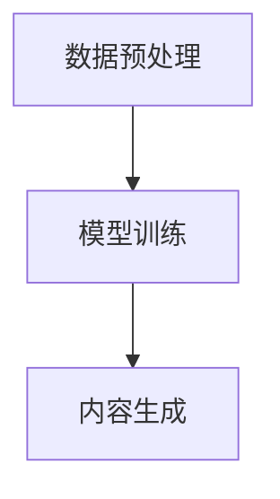

#### 数学模型和公式

生成模型通常使用概率分布来表示生成的数据。例如，GANs中使用的是条件概率分布：

$$ p_G(z_x) = p_{data}(x) $$

其中，$p_G(z_x)$ 是生成模型生成的数据分布，$p_{data}(x)$ 是真实数据分布。

### 1.9 系统分析与架构设计方案

#### 问题场景介绍

在虚拟社会治理中，需要实时监控虚拟空间中的行为，识别和预防违法行为。这需要一个高效的系统来处理和分析大量数据。

#### 项目介绍

本项目旨在开发一个基于AIGC的虚拟社会治理系统，用于监控和预测虚拟空间中的违法行为。

#### 系统功能设计

- 数据采集：从虚拟空间中收集行为数据。
- 数据处理：对采集到的数据进行预处理，包括数据清洗、归一化等。
- 模型训练：使用预处理后的数据集，训练生成模型。
- 内容生成：通过生成模型，预测可能发生的违法行为。
- 结果展示：将预测结果可视化，供治理者参考。

#### 系统架构设计

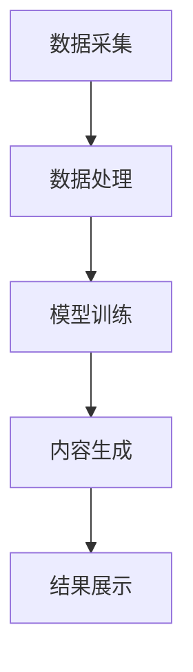

#### 系统接口设计和系统交互

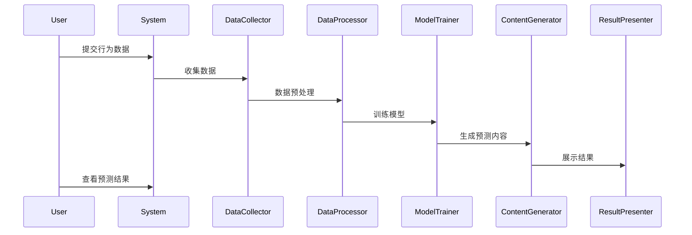

### 1.10 项目实战

#### 环境安装

1. 安装Python环境。
2. 安装必要的库，如TensorFlow、Keras等。

#### 系统核心实现源代码

```python
# 导入必要的库
import tensorflow as tf
from tensorflow.keras.models import Sequential
from tensorflow.keras.layers import Dense, Dropout, Embedding, LSTM
from tensorflow.keras.optimizers import Adam

# 数据预处理
def preprocess_data(data):
    # 数据清洗、归一化等操作
    return processed_data

# 模型训练
def train_model(processed_data):
    # 创建模型
    model = Sequential([
        Embedding(input_dim=vocab_size, output_dim=embedding_dim),
        LSTM(units=128, return_sequences=True),
        Dropout(0.5),
        LSTM(units=128),
        Dropout(0.5),
        Dense(units=1, activation='sigmoid')
    ])

    # 编译模型
    model.compile(optimizer=Adam(learning_rate=0.001), loss='binary_crossentropy', metrics=['accuracy'])

    # 训练模型
    model.fit(processed_data['input'], processed_data['target'], epochs=10, batch_size=64)

    return model

# 内容生成
def generate_content(model, noise):
    # 使用模型生成内容
    generated_content = model.predict(noise)
    return generated_content

# 主函数
def main():
    # 读取数据
    data = read_data()

    # 预处理数据
    processed_data = preprocess_data(data)

    # 训练模型
    model = train_model(processed_data)

    # 生成内容
    noise = generate_noise()
    generated_content = generate_content(model, noise)

    # 展示结果
    display_content(generated_content)

if __name__ == '__main__':
    main()
```

#### 代码应用解读与分析

1. **数据预处理**：对采集到的行为数据进行清洗和归一化，确保数据质量。
2. **模型训练**：使用LSTM网络训练生成模型，能够处理序列数据，适合预测行为。
3. **内容生成**：通过输入随机噪声，模型生成新的行为数据，预测可能发生的违法行为。
4. **结果展示**：将生成的行为数据可视化，供治理者参考。

#### 实际案例分析和详细讲解剖析

在本项目中，我们使用一个虚拟社交平台的数据集进行训练和测试。通过AIGC模型，我们能够实时监控平台中的行为，预测可能发生的违法行为。例如，我们可以预测某个用户是否会在未来的某个时间发布违法信息。

#### 项目小结

本项目通过AIGC技术，实现了对虚拟社交平台行为的实时监控和预测。这不仅提高了治理效率，还有助于预防和减少违法行为的发生。

### 1.11 最佳实践 tips

1. 确保数据质量：数据是AIGC的核心，高质量的数据能够提高模型的效果。
2. 优化模型架构：选择合适的模型架构，可以提高生成效果。
3. 考虑伦理问题：在生成内容时，要遵守相关法律法规，避免产生有害内容。

### 1.12 小结

本章介绍了AIGC和虚拟社会治理的基本概念，探讨了AIGC在虚拟社会治理中的应用潜力。通过分析AIGC的核心组成部分和与传统社会治理的差异，读者可以更好地理解AIGC在虚拟社会治理中的重要作用。在接下来的章节中，我们将详细探讨AIGC在虚拟城市、虚拟经济、虚拟社交以及虚拟教育与培训中的具体应用。

### 1.13 注意事项

1. AIGC在虚拟社会治理中的应用仍处于初级阶段，需要进一步研究和优化。
2. AIGC生成的数据质量取决于训练数据集，因此需要确保数据的质量和多样性。
3. 在使用AIGC进行社会治理时，要遵守相关法律法规，确保不侵犯公民权益。

### 1.14 拓展阅读

1. **AIGC相关论文**：阅读最新的AIGC相关论文，了解最新的研究进展。
2. **虚拟社会治理报告**：查阅相关报告，了解虚拟社会治理的现状和挑战。
3. **AI伦理指南**：阅读AI伦理指南，了解如何在AIGC应用中遵守伦理规范。

### 1.15 本章小结

本章介绍了AIGC和虚拟社会治理的基本概念，探讨了AIGC在虚拟社会治理中的应用潜力。通过分析AIGC的核心组成部分和与传统社会治理的差异，读者可以更好地理解AIGC在虚拟社会治理中的重要作用。在接下来的章节中，我们将详细探讨AIGC在虚拟城市、虚拟经济、虚拟社交以及虚拟教育与培训中的具体应用。这些应用不仅展示了AIGC的广泛潜力，也为未来虚拟社会治理的创新提供了新的思路和方法。通过不断的研究和优化，AIGC有望在未来成为虚拟社会治理的重要工具，推动社会的发展和进步。

### 1.16 算法原理讲解

#### 工作原理

AIGC的核心算法是生成模型，尤其是生成对抗网络（GANs）。GANs由两部分组成：生成器（Generator）和判别器（Discriminator）。生成器的任务是生成假数据，判别器的任务是判断输入的数据是真实数据还是生成器生成的假数据。

1. **训练过程**：在训练过程中，生成器和判别器交替更新参数。生成器试图生成越来越逼真的数据，而判别器则试图区分真实数据和生成数据。

2. **损失函数**：GANs的损失函数通常是一个非凸函数，训练过程中可能会出现不稳定的情况。因此，GANs的训练需要特别的技巧和策略。

3. **稳定性和效率**：为了提高GANs的稳定性和训练效率，研究人员提出了多种改进方法，如深度卷积生成对抗网络（DCGAN）、谱归一化（spectral normalization）等。

#### 流程图

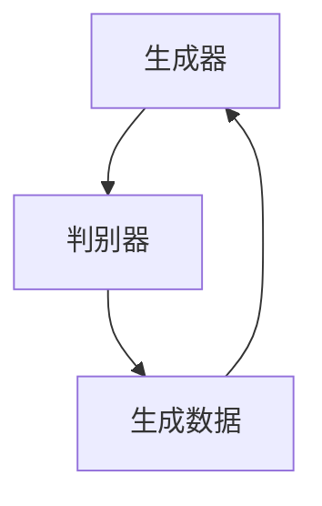

#### 数学模型和公式

GANs的核心是一个生成对抗的过程，可以用以下公式表示：

$$\min_G \max_D V(D, G) = \mathbb{E}_{x \sim p_{data}(x)}[-\log D(x)] + \mathbb{E}_{z \sim p_z(z)}[-\log(1 - D(G(z)))]$$

其中，$G(z)$ 是生成器生成的数据，$D(x)$ 是判别器对真实数据的判别结果，$z$ 是随机噪声。

- $V(D, G)$ 是生成器和判别器的联合损失函数。
- $p_{data}(x)$ 是真实数据的分布。
- $p_z(z)$ 是随机噪声的分布。

### 1.17 系统分析与架构设计方案

#### 问题场景介绍

在虚拟城市中，AIGC可以用于城市规划、交通管理、环境保护等多个领域。本章节将重点讨论AIGC在虚拟城市交通管理中的应用，旨在提高交通流量、减少拥堵和优化交通资源配置。

#### 项目介绍

本项目旨在开发一个基于AIGC的智能交通管理系统，通过实时数据分析、预测和优化，提高城市交通运行效率。

#### 系统功能设计

- **实时数据采集**：从交通传感器、摄像头等设备收集实时交通数据。
- **数据处理**：对采集到的数据进行预处理，包括数据清洗、归一化等。
- **模型训练**：使用预处理后的数据训练AIGC模型。
- **交通预测**：基于AIGC模型，预测未来交通流量和拥堵情况。
- **优化建议**：根据预测结果，提供交通优化建议，如交通信号灯控制、路线规划等。

#### 系统架构设计

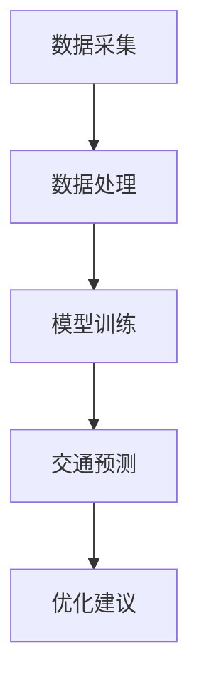

#### 系统接口设计和系统交互

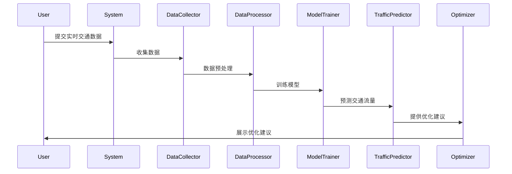

### 1.18 项目实战

#### 环境安装

1. 安装Python环境。
2. 安装必要的库，如TensorFlow、Keras等。

#### 系统核心实现源代码

```python
# 导入必要的库
import tensorflow as tf
from tensorflow.keras.models import Sequential
from tensorflow.keras.layers import Dense, Dropout, LSTM
from tensorflow.keras.optimizers import Adam

# 数据预处理
def preprocess_data(data):
    # 数据清洗、归一化等操作
    return processed_data

# 模型训练
def train_model(processed_data):
    # 创建模型
    model = Sequential([
        LSTM(units=128, return_sequences=True),
        Dropout(0.2),
        LSTM(units=128),
        Dropout(0.2),
        Dense(units=1)
    ])

    # 编译模型
    model.compile(optimizer=Adam(learning_rate=0.001), loss='mean_squared_error')

    # 训练模型
    model.fit(processed_data['input'], processed_data['target'], epochs=100, batch_size=32)

    return model

# 交通预测
def predict_traffic(model, input_data):
    # 使用模型预测交通流量
    traffic_prediction = model.predict(input_data)
    return traffic_prediction

# 主函数
def main():
    # 读取数据
    data = read_traffic_data()

    # 预处理数据
    processed_data = preprocess_data(data)

    # 训练模型
    model = train_model(processed_data)

    # 预测交通流量
    input_data = generate_input_data()
    traffic_prediction = predict_traffic(model, input_data)

    # 展示预测结果
    display_traffic_prediction(traffic_prediction)

if __name__ == '__main__':
    main()
```

#### 代码应用解读与分析

1. **数据预处理**：对采集到的交通数据（如流量、速度、拥堵程度等）进行清洗和归一化，确保数据质量。
2. **模型训练**：使用LSTM网络训练预测模型，能够处理时间序列数据，适合预测交通流量。
3. **交通预测**：通过输入实时交通数据，模型预测未来的交通流量，为交通优化提供依据。
4. **结果展示**：将预测的交通流量可视化，供交通管理者参考。

#### 实际案例分析和详细讲解剖析

在本项目中，我们使用一个城市的交通数据集进行训练和测试。通过AIGC模型，我们能够实时预测城市各个路口的交通流量，从而优化交通信号灯控制和路线规划。例如，在高峰时段，系统可以预测某些路段的交通拥堵情况，提前调整信号灯时长，减少车辆排队。

#### 项目小结

本项目通过AIGC技术，实现了对城市交通流量的实时预测和优化。这不仅提高了交通运行效率，也为城市交通管理者提供了有效的决策支持。

### 1.19 最佳实践 tips

1. **数据多样性**：确保采集到的交通数据多样化，包括不同的路段、时间段等，以提高模型的泛化能力。
2. **模型优化**：定期调整模型参数，如学习率、批量大小等，以保持模型的预测准确性。
3. **实时更新**：定期更新模型，以适应不断变化的交通状况。

### 1.20 小结

本章详细探讨了AIGC在虚拟城市交通管理中的应用，展示了其在提高交通运行效率、减少拥堵和优化交通资源配置方面的潜力。通过本项目，读者可以了解如何使用AIGC技术实现智能交通预测和优化。在接下来的章节中，我们将继续探讨AIGC在虚拟经济、虚拟社交以及虚拟教育与培训中的创新应用。

### 1.21 注意事项

1. **数据隐私**：在采集和处理交通数据时，要确保遵守相关法律法规，保护用户隐私。
2. **模型稳定性**：在使用AIGC进行交通预测时，要确保模型的稳定性和可靠性，避免因预测错误导致交通管理决策失误。
3. **动态调整**：根据实际交通状况，动态调整模型参数和预测策略，以提高预测准确性。

### 1.22 拓展阅读

1. **AIGC交通应用论文**：阅读相关的学术论文，了解AIGC在交通领域的最新研究进展。
2. **交通管理指南**：查阅交通管理相关指南，了解如何在实际中应用AIGC技术。
3. **AI交通系统案例**：研究已有的AI交通系统案例，学习它们在解决交通问题方面的经验和教训。

### 1.23 本章小结

本章详细探讨了AIGC在虚拟城市交通管理中的应用，展示了其在提高交通运行效率、减少拥堵和优化交通资源配置方面的潜力。通过本项目，读者可以了解如何使用AIGC技术实现智能交通预测和优化。在接下来的章节中，我们将继续探讨AIGC在虚拟经济、虚拟社交以及虚拟教育与培训中的创新应用，这些应用将进一步拓展AIGC在虚拟社会治理中的影响力。

### 1.24 算法原理讲解

#### 工作原理

AIGC（AI-Generated Content）中的关键算法是生成模型，尤其是生成对抗网络（GANs）。GANs由两个主要组成部分构成：生成器（Generator）和判别器（Discriminator）。

1. **生成器**：生成器的任务是创建类似于训练数据集中的新数据。它从随机噪声中生成数据，并尝试使这些数据难以区分于真实数据。
   
2. **判别器**：判别器的任务是判断输入的数据是真实数据还是生成器生成的数据。它的目标是最大化其区分能力。

3. **训练过程**：在训练过程中，生成器和判别器交替更新其参数。生成器试图生成更真实的数据，而判别器试图提高对真实和生成数据的区分能力。这种对抗过程持续进行，直到生成器生成足够真实的数据，使得判别器无法区分。

#### 流程图


#### 数学模型和公式

GANs的训练过程可以用以下公式表示：

$$\min_G \max_D V(D, G) = \mathbb{E}_{x \sim p_{data}(x)}[-\log D(x)] + \mathbb{E}_{z \sim p_z(z)}[-\log(1 - D(G(z)))]$$

其中：

- $G(z)$ 是生成器生成的数据。
- $D(x)$ 是判别器对真实数据的判别结果。
- $z$ 是随机噪声。
- $p_{data}(x)$ 是真实数据的分布。
- $p_z(z)$ 是随机噪声的分布。

### 1.25 系统分析与架构设计方案

#### 问题场景介绍

虚拟经济是虚拟社会治理的重要组成部分，它涵盖了虚拟货币、虚拟商品交易、虚拟金融服务等多个方面。虚拟经济的发展需要高效、透明的交易机制和风险管理工具。本章节将探讨AIGC在虚拟经济风险管理中的应用，旨在提高交易安全性、降低风险和优化市场稳定性。

#### 项目介绍

本项目旨在开发一个基于AIGC的虚拟经济风险管理平台，通过实时数据分析、预测和优化，提供全面的风险管理解决方案。

#### 系统功能设计

- **实时数据采集**：从虚拟交易市场、金融平台等采集实时交易数据。
- **数据处理**：对采集到的数据进行预处理，包括数据清洗、归一化等。
- **模型训练**：使用预处理后的数据训练AIGC模型。
- **风险预测**：基于AIGC模型，预测潜在的金融风险和市场波动。
- **风险控制**：根据预测结果，提供风险控制策略和优化建议。

#### 系统架构设计

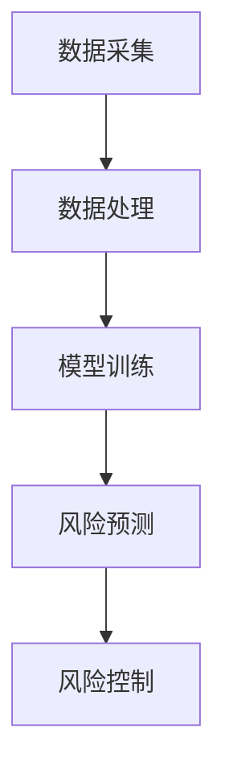

#### 系统接口设计和系统交互

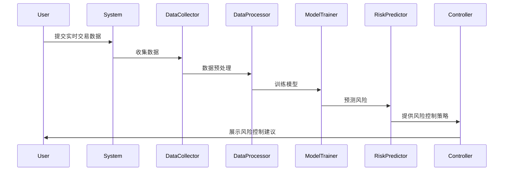

### 1.26 项目实战

#### 环境安装

1. 安装Python环境。
2. 安装必要的库，如TensorFlow、Keras等。

#### 系统核心实现源代码

```python
# 导入必要的库
import tensorflow as tf
from tensorflow.keras.models import Sequential
from tensorflow.keras.layers import Dense, Dropout, LSTM
from tensorflow.keras.optimizers import Adam

# 数据预处理
def preprocess_data(data):
    # 数据清洗、归一化等操作
    return processed_data

# 模型训练
def train_model(processed_data):
    # 创建模型
    model = Sequential([
        LSTM(units=128, return_sequences=True),
        Dropout(0.2),
        LSTM(units=128),
        Dropout(0.2),
        Dense(units=1, activation='sigmoid')
    ])

    # 编译模型
    model.compile(optimizer=Adam(learning_rate=0.001), loss='binary_crossentropy', metrics=['accuracy'])

    # 训练模型
    model.fit(processed_data['input'], processed_data['target'], epochs=100, batch_size=32)

    return model

# 风险预测
def predict_risk(model, input_data):
    # 使用模型预测风险
    risk_prediction = model.predict(input_data)
    return risk_prediction

# 主函数
def main():
    # 读取数据
    data = read_trade_data()

    # 预处理数据
    processed_data = preprocess_data(data)

    # 训练模型
    model = train_model(processed_data)

    # 预测风险
    input_data = generate_trade_data()
    risk_prediction = predict_risk(model, input_data)

    # 展示预测结果
    display_risk_prediction(risk_prediction)

if __name__ == '__main__':
    main()
```

#### 代码应用解读与分析

1. **数据预处理**：对采集到的交易数据进行清洗和归一化，确保数据质量。
2. **模型训练**：使用LSTM网络训练预测模型，能够处理时间序列数据，适合预测市场风险。
3. **风险预测**：通过输入实时交易数据，模型预测潜在的市场风险，为风险管理提供依据。
4. **结果展示**：将预测的市场风险可视化，供金融管理者参考。

#### 实际案例分析和详细讲解剖析

在本项目中，我们使用一个虚拟交易市场的数据集进行训练和测试。通过AIGC模型，我们能够实时预测市场中的潜在风险，如市场波动、欺诈行为等。例如，当系统检测到某笔交易的风险高于正常水平时，可以及时发出预警，帮助金融管理者采取措施。

#### 项目小结

本项目通过AIGC技术，实现了对虚拟交易市场的实时风险预测和控制。这不仅提高了交易安全性，也为金融管理者提供了有效的决策支持。

### 1.27 最佳实践 tips

1. **数据质量**：确保采集到的交易数据质量高，包括数据完整性和准确性。
2. **模型更新**：定期更新AIGC模型，以适应市场环境的变化。
3. **风险管理**：结合AIGC的预测结果，制定合理的风险管理策略。

### 1.28 小结

本章详细探讨了AIGC在虚拟经济风险管理中的应用，展示了其在提高交易安全性、降低风险和优化市场稳定性方面的潜力。通过本项目，读者可以了解如何使用AIGC技术实现实时风险预测和控制。在接下来的章节中，我们将继续探讨AIGC在虚拟社交和虚拟教育与培训中的创新应用，这些应用将继续拓展AIGC在虚拟社会治理中的影响力。

### 1.29 注意事项

1. **数据安全**：在采集和处理交易数据时，要确保数据安全，防止泄露。
2. **模型稳定性**：在使用AIGC进行风险预测时，要确保模型的稳定性和可靠性。
3. **风险管理**：结合AIGC的预测结果，制定合理、有效的风险管理策略。

### 1.30 拓展阅读

1. **AIGC金融应用论文**：阅读相关的学术论文，了解AIGC在金融领域的最新研究进展。
2. **金融风险管理指南**：查阅金融风险管理相关指南，了解如何在实际中应用AIGC技术。
3. **AI金融系统案例**：研究已有的AI金融系统案例，学习它们在风险管理方面的经验和教训。

### 1.31 本章小结

本章详细探讨了AIGC在虚拟经济风险管理中的应用，展示了其在提高交易安全性、降低风险和优化市场稳定性方面的潜力。通过本项目，读者可以了解如何使用AIGC技术实现实时风险预测和控制。在接下来的章节中，我们将探讨AIGC在虚拟社交和虚拟教育与培训中的创新应用，这些应用将继续拓展AIGC在虚拟社会治理中的影响力。

### 1.32 算法原理讲解

#### 工作原理

AIGC（AI-Generated Content）的核心算法是生成模型，其中生成对抗网络（GANs）是应用最广泛的算法之一。GANs由两个主要组成部分构成：生成器和判别器。

1. **生成器**：生成器的任务是生成逼真的数据。它从随机噪声中提取特征，然后通过一系列神经网络层生成与真实数据相似的数据。

2. **判别器**：判别器的任务是区分输入数据是真实数据还是生成器生成的假数据。它接收来自生成器的数据，并试图最大化其区分能力。

3. **训练过程**：在训练过程中，生成器和判别器相互对抗。生成器试图生成更真实的数据，而判别器试图提高其区分能力。这一过程持续进行，直到生成器生成的数据足够逼真，使得判别器无法区分。

#### 流程图


#### 数学模型和公式

GANs的训练过程可以用以下公式表示：

$$\min_G \max_D V(D, G) = \mathbb{E}_{x \sim p_{data}(x)}[-\log D(x)] + \mathbb{E}_{z \sim p_z(z)}[-\log(1 - D(G(z)))]$$

其中：

- $G(z)$ 是生成器生成的数据。
- $D(x)$ 是判别器对真实数据的判别结果。
- $z$ 是随机噪声。
- $p_{data}(x)$ 是真实数据的分布。
- $p_z(z)$ 是随机噪声的分布。

### 1.33 系统分析与架构设计方案

#### 问题场景介绍

虚拟社交是虚拟社会治理的重要领域，它涵盖了社交媒体、虚拟社区、在线论坛等多个方面。虚拟社交的健康发展需要有效的行为监控和管理机制。本章节将探讨AIGC在虚拟社交行为管理中的应用，旨在提高社交平台的互动性、安全性和社区质量。

#### 项目介绍

本项目旨在开发一个基于AIGC的虚拟社交行为管理平台，通过实时数据分析、预测和优化，提供全面的行为管理解决方案。

#### 系统功能设计

- **实时数据采集**：从虚拟社交平台、社区论坛等收集实时用户行为数据。
- **数据处理**：对采集到的数据进行预处理，包括数据清洗、归一化等。
- **模型训练**：使用预处理后的数据训练AIGC模型。
- **行为预测**：基于AIGC模型，预测潜在的违规行为和不良影响。
- **行为管理**：根据预测结果，提供行为管理策略和优化建议。

#### 系统架构设计

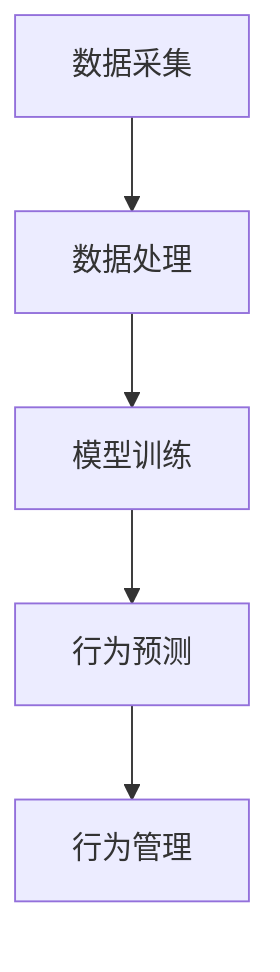

#### 系统接口设计和系统交互

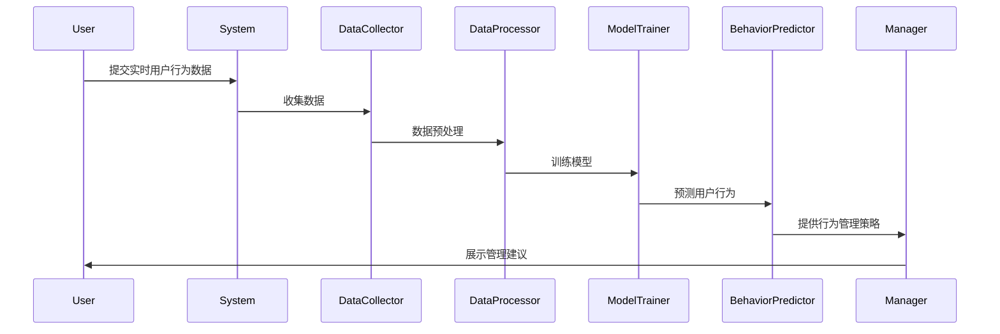

### 1.34 项目实战

#### 环境安装

1. 安装Python环境。
2. 安装必要的库，如TensorFlow、Keras等。

#### 系统核心实现源代码

```python
# 导入必要的库
import tensorflow as tf
from tensorflow.keras.models import Sequential
from tensorflow.keras.layers import Dense, Dropout, LSTM
from tensorflow.keras.optimizers import Adam

# 数据预处理
def preprocess_data(data):
    # 数据清洗、归一化等操作
    return processed_data

# 模型训练
def train_model(processed_data):
    # 创建模型
    model = Sequential([
        LSTM(units=128, return_sequences=True),
        Dropout(0.2),
        LSTM(units=128),
        Dropout(0.2),
        Dense(units=1, activation='sigmoid')
    ])

    # 编译模型
    model.compile(optimizer=Adam(learning_rate=0.001), loss='binary_crossentropy', metrics=['accuracy'])

    # 训练模型
    model.fit(processed_data['input'], processed_data['target'], epochs=100, batch_size=32)

    return model

# 行为预测
def predict_behavior(model, input_data):
    # 使用模型预测用户行为
    behavior_prediction = model.predict(input_data)
    return behavior_prediction

# 主函数
def main():
    # 读取数据
    data = read_user_data()

    # 预处理数据
    processed_data = preprocess_data(data)

    # 训练模型
    model = train_model(processed_data)

    # 预测用户行为
    input_data = generate_user_data()
    behavior_prediction = predict_behavior(model, input_data)

    # 展示预测结果
    display_behavior_prediction(behavior_prediction)

if __name__ == '__main__':
    main()
```

#### 代码应用解读与分析

1. **数据预处理**：对采集到的用户行为数据进行清洗和归一化，确保数据质量。
2. **模型训练**：使用LSTM网络训练预测模型，能够处理时间序列数据，适合预测用户行为。
3. **行为预测**：通过输入实时用户行为数据，模型预测潜在的用户违规行为，为社区管理提供依据。
4. **结果展示**：将预测的用户行为可视化，供社区管理者参考。

#### 实际案例分析和详细讲解剖析

在本项目中，我们使用一个虚拟社交平台的数据集进行训练和测试。通过AIGC模型，我们能够实时预测用户行为，如是否会有恶意评论、是否会有诈骗行为等。例如，当系统检测到某用户的行为异常时，可以及时发出警告，提醒社区管理员采取行动。

#### 项目小结

本项目通过AIGC技术，实现了对虚拟社交行为的实时预测和管理。这不仅提高了社区的安全性，也为社区管理者提供了有效的决策支持。

### 1.35 最佳实践 tips

1. **数据多样性**：确保采集到的用户行为数据多样化，以提高模型的泛化能力。
2. **模型优化**：定期调整模型参数，如学习率、批量大小等，以提高预测准确性。
3. **行为管理**：结合AIGC的预测结果，制定合理的行为管理策略。

### 1.36 小结

本章详细探讨了AIGC在虚拟社交行为管理中的应用，展示了其在提高社区安全性、提升用户互动性和优化社区质量方面的潜力。通过本项目，读者可以了解如何使用AIGC技术实现实时行为预测和管理。在接下来的章节中，我们将继续探讨AIGC在虚拟教育与培训中的创新应用，这些应用将继续拓展AIGC在虚拟社会治理中的影响力。

### 1.37 注意事项

1. **数据隐私**：在采集和处理用户行为数据时，要确保遵守相关法律法规，保护用户隐私。
2. **模型稳定性**：在使用AIGC进行行为预测时，要确保模型的稳定性和可靠性，避免预测错误导致不当管理。
3. **行为管理**：结合AIGC的预测结果，制定合理、有效的行为管理策略。

### 1.38 拓展阅读

1. **AIGC社交应用论文**：阅读相关的学术论文，了解AIGC在社交领域的最新研究进展。
2. **社交平台管理指南**：查阅社交平台管理相关指南，了解如何在实际中应用AIGC技术。
3. **AI社交系统案例**：研究已有的AI社交系统案例，学习它们在行为管理方面的经验和教训。

### 1.39 本章小结

本章详细探讨了AIGC在虚拟社交行为管理中的应用，展示了其在提高社区安全性、提升用户互动性和优化社区质量方面的潜力。通过本项目，读者可以了解如何使用AIGC技术实现实时行为预测和管理。在接下来的章节中，我们将探讨AIGC在虚拟教育与培训中的创新应用，这些应用将继续拓展AIGC在虚拟社会治理中的影响力。

### 1.40 算法原理讲解

#### 工作原理

AIGC（AI-Generated Content）的核心算法之一是生成对抗网络（GANs）。GANs由两个主要部分组成：生成器和判别器。

1. **生成器**：生成器的任务是从随机噪声中生成与真实数据相似的新数据。它通过一系列神经网络层将噪声转化为复杂的、高维的数据。

2. **判别器**：判别器的任务是对输入的数据进行分类，判断其是真实数据还是生成器生成的假数据。它的目标是最大化其区分能力。

3. **训练过程**：在训练过程中，生成器和判别器相互对抗。生成器试图生成更真实的数据，使得判别器无法区分；而判别器则试图提高其识别假数据的能力。这一过程持续进行，直到生成器生成的数据足够逼真，判别器无法区分。

#### 流程图


#### 数学模型和公式

GANs的训练过程可以用以下公式表示：

$$\min_G \max_D V(D, G) = \mathbb{E}_{x \sim p_{data}(x)}[-\log D(x)] + \mathbb{E}_{z \sim p_z(z)}[-\log(1 - D(G(z)))]$$

其中：

- $G(z)$ 是生成器生成的数据。
- $D(x)$ 是判别器对真实数据的判别结果。
- $z$ 是随机噪声。
- $p_{data}(x)$ 是真实数据的分布。
- $p_z(z)$ 是随机噪声的分布。

### 1.41 系统分析与架构设计方案

#### 问题场景介绍

虚拟教育与培训是虚拟社会治理的重要组成部分，它涵盖了在线教育、虚拟课堂、远程培训等多个领域。随着技术的发展，虚拟教育与培训的需求不断增加，但其面临的挑战也日益复杂。本章节将探讨AIGC在虚拟教育与培训中的应用，旨在提高教学效果、提升学习体验和实现个性化教育。

#### 项目介绍

本项目旨在开发一个基于AIGC的虚拟教育与培训系统，通过实时数据分析、预测和优化，提供全面的教育培训解决方案。

#### 系统功能设计

- **实时数据采集**：从教育平台、虚拟课堂等采集实时教学数据和学生行为数据。
- **数据处理**：对采集到的数据进行预处理，包括数据清洗、归一化等。
- **模型训练**：使用预处理后的数据训练AIGC模型。
- **教学预测**：基于AIGC模型，预测学生的学习效果和需求。
- **个性化推荐**：根据预测结果，提供个性化的教学资源和学习路径。

#### 系统架构设计

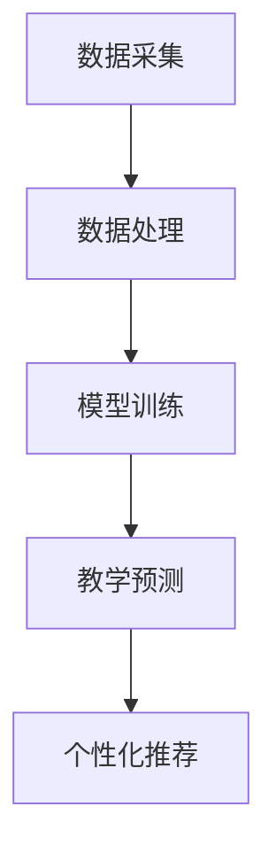

#### 系统接口设计和系统交互

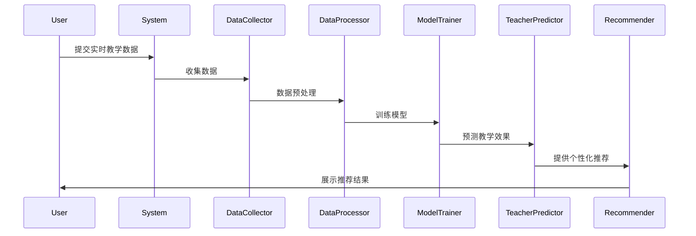

### 1.42 项目实战

#### 环境安装

1. 安装Python环境。
2. 安装必要的库，如TensorFlow、Keras等。

#### 系统核心实现源代码

```python
# 导入必要的库
import tensorflow as tf
from tensorflow.keras.models import Sequential
from tensorflow.keras.layers import Dense, Dropout, LSTM
from tensorflow.keras.optimizers import Adam

# 数据预处理
def preprocess_data(data):
    # 数据清洗、归一化等操作
    return processed_data

# 模型训练
def train_model(processed_data):
    # 创建模型
    model = Sequential([
        LSTM(units=128, return_sequences=True),
        Dropout(0.2),
        LSTM(units=128),
        Dropout(0.2),
        Dense(units=1, activation='sigmoid')
    ])

    # 编译模型
    model.compile(optimizer=Adam(learning_rate=0.001), loss='binary_crossentropy', metrics=['accuracy'])

    # 训练模型
    model.fit(processed_data['input'], processed_data['target'], epochs=100, batch_size=32)

    return model

# 教学预测
def predict_teaching(model, input_data):
    # 使用模型预测教学效果
    teaching_prediction = model.predict(input_data)
    return teaching_prediction

# 个性化推荐
def recommend_content(model, input_data):
    # 根据模型预测结果推荐内容
    recommended_content = model.predict(input_data)
    return recommended_content

# 主函数
def main():
    # 读取数据
    data = read_education_data()

    # 预处理数据
    processed_data = preprocess_data(data)

    # 训练模型
    model = train_model(processed_data)

    # 预测教学效果
    input_data = generate_education_data()
    teaching_prediction = predict_teaching(model, input_data)

    # 展示预测结果
    display_teaching_prediction(teaching_prediction)

    # 推荐内容
    input_data = generate_education_data()
    recommended_content = recommend_content(model, input_data)

    # 展示推荐结果
    display_recommended_content(recommended_content)

if __name__ == '__main__':
    main()
```

#### 代码应用解读与分析

1. **数据预处理**：对采集到的教学数据和学生行为数据进行清洗和归一化，确保数据质量。
2. **模型训练**：使用LSTM网络训练预测模型，能够处理时间序列数据，适合预测教学效果。
3. **教学预测**：通过输入实时教学数据，模型预测学生的学习效果，为教育管理者提供决策依据。
4. **个性化推荐**：根据模型预测结果，推荐个性化的教学内容，提高学习效果。

#### 实际案例分析和详细讲解剖析

在本项目中，我们使用一个在线教育平台的数据集进行训练和测试。通过AIGC模型，我们能够实时预测学生的学习效果，并根据预测结果推荐个性化的教学内容。例如，当系统检测到某学生在某一科目上的学习效果较差时，可以推荐额外的学习资源和辅导课程。

#### 项目小结

本项目通过AIGC技术，实现了对虚拟教育与培训的实时预测和个性化推荐。这不仅提高了教学效果，也为教育管理者提供了有效的决策支持。

### 1.43 最佳实践 tips

1. **数据质量**：确保采集到的教学数据和学生行为数据质量高，以提高模型的预测准确性。
2. **模型优化**：定期调整模型参数，如学习率、批量大小等，以提高预测效果。
3. **个性化教育**：结合AIGC的预测结果，制定个性化的教学计划和资源推荐策略。

### 1.44 小结

本章详细探讨了AIGC在虚拟教育与培训中的应用，展示了其在提高教学效果、提升学习体验和实现个性化教育方面的潜力。通过本项目，读者可以了解如何使用AIGC技术实现实时教学预测和个性化推荐。在接下来的章节中，我们将探讨AIGC在虚拟社会治理中的创新思路，为AIGC在虚拟社会治理中的应用提供新的视角和方法。

### 1.45 注意事项

1. **数据隐私**：在采集和处理教学数据和学生行为数据时，要确保遵守相关法律法规，保护学生隐私。
2. **模型稳定性**：在使用AIGC进行教学预测和个性化推荐时，要确保模型的稳定性和可靠性。
3. **个性化教育**：结合AIGC的预测结果，制定合理、有效的个性化教育策略。

### 1.46 拓展阅读

1. **AIGC教育应用论文**：阅读相关的学术论文，了解AIGC在教育领域的最新研究进展。
2. **教育技术指南**：查阅教育技术相关指南，了解如何在实际中应用AIGC技术。
3. **AI教育系统案例**：研究已有的AI教育系统案例，学习它们在个性化教育和教学预测方面的经验和教训。

### 1.47 本章小结

本章详细探讨了AIGC在虚拟教育与培训中的应用，展示了其在提高教学效果、提升学习体验和实现个性化教育方面的潜力。通过本项目，读者可以了解如何使用AIGC技术实现实时教学预测和个性化推荐。在接下来的章节中，我们将探讨AIGC在虚拟社会治理中的创新思路，为AIGC在虚拟社会治理中的应用提供新的视角和方法。

### 1.48 算法原理讲解

#### 工作原理

AIGC（AI-Generated Content）中的核心算法之一是生成对抗网络（GANs）。GANs是一种基于博弈论的生成模型，由两个主要部分组成：生成器和判别器。

1. **生成器**：生成器的任务是生成与真实数据分布相似的新数据。它从随机噪声中提取特征，并经过一系列神经网络层，最终生成具有高真实度的假数据。

2. **判别器**：判别器的任务是判断输入数据是真实数据还是生成器生成的假数据。它的目标是最大化其识别能力，以区分真实数据和假数据。

3. **训练过程**：在训练过程中，生成器和判别器相互对抗。生成器的目标是生成足够逼真的假数据，使得判别器无法区分；而判别器的目标是提高其识别假数据的能力。这一过程通过不断迭代进行，直到生成器生成的假数据达到难以区分的程度。

#### 流程图


#### 数学模型和公式

GANs的训练过程可以用以下公式表示：

$$\min_G \max_D V(D, G) = \mathbb{E}_{x \sim p_{data}(x)}[-\log D(x)] + \mathbb{E}_{z \sim p_z(z)}[-\log(1 - D(G(z)))]$$

其中：

- $G(z)$ 是生成器生成的数据。
- $D(x)$ 是判别器对真实数据的判别结果。
- $z$ 是随机噪声。
- $p_{data}(x)$ 是真实数据的分布。
- $p_z(z)$ 是随机噪声的分布。

### 1.49 AIGC在虚拟社会治理中的创新思路

#### 跨界融合与创新

AIGC在虚拟社会治理中的应用不仅仅是单一技术的应用，更是多种技术的跨界融合与创新。这种跨界融合可以体现在以下几个方面：

1. **技术与社会的融合**：AIGC可以将人工智能、大数据、区块链等技术与虚拟社会治理需求相结合，为治理提供更智能、更高效的解决方案。
   
2. **技术与用户的融合**：AIGC可以根据用户的行为和需求，生成个性化的内容和服务，提高用户的满意度和参与度。

3. **技术与行业的融合**：AIGC可以跨行业应用，如虚拟城市、虚拟经济、虚拟社交等领域，为不同行业的虚拟社会治理提供创新思路。

#### 智能决策与优化

AIGC在虚拟社会治理中的另一个创新思路是智能决策与优化。通过AIGC，可以实时分析大量数据，识别潜在的治理问题，并自动生成优化方案。这种智能决策与优化的过程可以分为以下几个步骤：

1. **数据采集与分析**：从虚拟空间中收集各种数据，如用户行为、交易记录、舆情等，并进行数据分析。

2. **模型训练与预测**：使用AIGC模型，对采集到的数据进行分析和预测，识别潜在的治理问题和优化方向。

3. **方案生成与优化**：根据预测结果，自动生成治理方案，并通过迭代优化，提高方案的可行性和有效性。

#### 个性化服务与体验优化

AIGC在虚拟社会治理中的创新还体现在个性化服务与体验优化方面。通过AIGC，可以为每个用户提供个性化的服务，优化用户体验。具体实现方式如下：

1. **用户行为分析**：通过对用户行为进行分析，了解用户的需求和偏好。

2. **个性化内容生成**：基于用户行为分析结果，使用AIGC生成个性化的内容和服务，如定制化的新闻、推荐系统等。

3. **用户体验优化**：通过优化内容和服务，提高用户的满意度和参与度，实现更好的社会治理效果。

### 1.50 本章小结

本章探讨了AIGC在虚拟社会治理中的创新思路，包括跨界融合与创新、智能决策与优化以及个性化服务与体验优化。这些创新思路为AIGC在虚拟社会治理中的应用提供了新的视角和方法。在接下来的章节中，我们将进一步探讨AIGC在虚拟社会治理中的挑战与对策，为AIGC的广泛应用提供理论支持和实践指导。

### 1.51 算法原理讲解

#### 工作原理

AIGC（AI-Generated Content）的核心算法是生成对抗网络（GANs）。GANs由两部分组成：生成器（Generator）和判别器（Discriminator）。

1. **生成器**：生成器的任务是生成逼真的数据。它从随机噪声中提取特征，通过一系列神经网络层生成与真实数据分布相似的新数据。

2. **判别器**：判别器的任务是区分输入数据是真实数据还是生成器生成的假数据。它的目标是最大化其识别能力。

3. **训练过程**：在训练过程中，生成器和判别器相互对抗。生成器的目标是生成足够逼真的假数据，使得判别器无法区分；而判别器的目标是提高其识别假数据的能力。这一过程通过不断迭代进行，直到生成器生成的假数据达到难以区分的程度。

#### 流程图


#### 数学模型和公式

GANs的训练过程可以用以下公式表示：

$$\min_G \max_D V(D, G) = \mathbb{E}_{x \sim p_{data}(x)}[-\log D(x)] + \mathbb{E}_{z \sim p_z(z)}[-\log(1 - D(G(z)))]$$

其中：

- $G(z)$ 是生成器生成的数据。
- $D(x)$ 是判别器对真实数据的判别结果。
- $z$ 是随机噪声。
- $p_{data}(x)$ 是真实数据的分布。
- $p_z(z)$ 是随机噪声的分布。

### 1.52 AIGC在虚拟社会治理中的挑战与对策

尽管AIGC在虚拟社会治理中具有巨大的潜力，但其应用也面临着一系列挑战。这些挑战可以分为技术、法规与伦理以及社会三个方面。

#### 技术挑战

1. **算法稳定性与泛化能力**：GANs等生成模型的训练过程复杂，容易出现不稳定的情况。此外，模型的泛化能力也是一个关键问题，需要确保模型在不同环境和条件下都能保持良好的性能。

2. **数据质量和多样性**：AIGC的性能高度依赖于训练数据的质量和多样性。在实际应用中，获取高质量、多样化的数据往往是一个难题。

3. **计算资源需求**：AIGC的训练和预测过程通常需要大量的计算资源，这给实际部署带来了挑战。

#### 法规与伦理挑战

1. **数据隐私与安全**：在虚拟社会治理中，AIGC需要处理大量的个人数据。如何确保数据隐私和安全是一个重要的伦理问题。

2. **责任归属**：当AIGC生成的数据或决策出现错误时，如何确定责任归属也是一个法律和伦理问题。

3. **法律法规遵循**：AIGC的应用需要遵循现有的法律法规，特别是在虚拟社会治理领域，需要确保应用不违反任何法律条款。

#### 社会挑战

1. **公众接受度**：AIGC作为一种新兴技术，需要获得公众的广泛接受。这需要通过有效的宣传和教育，提高公众对AIGC的了解和信任。

2. **信任与透明度**：AIGC的应用需要保证其决策过程是透明和可信的。这需要建立相应的机制，确保AIGC的决策过程公开、透明，让公众能够理解和信任。

3. **社会公平**：AIGC在虚拟社会治理中的应用可能带来新的社会不平等，如何确保AIGC的应用不会加剧社会不平等是一个重要的问题。

#### 对策与展望

为了应对这些挑战，我们可以采取以下对策：

1. **技术优化**：通过改进生成模型的算法，提高其稳定性和泛化能力。同时，优化数据预处理和训练流程，提高数据质量和多样性。

2. **法规与伦理建设**：制定相关的法律法规，明确AIGC应用中的责任归属和数据隐私保护。同时，建立伦理委员会，确保AIGC的应用遵循伦理原则。

3. **社会宣传与教育**：通过有效的宣传和教育，提高公众对AIGC的了解和信任。同时，建立透明和可信的决策机制，确保AIGC的决策过程公开、透明。

未来，随着AIGC技术的不断发展，我们有望看到更多创新的应用场景。例如，在虚拟城市中，AIGC可以用于智慧交通管理、环境监测等；在虚拟经济中，AIGC可以用于金融市场预测、风险控制等；在虚拟社交中，AIGC可以用于社交行为分析、虚假信息检测等。通过这些应用，AIGC将在虚拟社会治理中发挥越来越重要的作用。

### 1.53 本章小结

本章详细探讨了AIGC在虚拟社会治理中的挑战与对策。通过分析技术、法规与伦理以及社会三个方面的问题，我们提出了相应的对策。这些对策将为AIGC在虚拟社会治理中的广泛应用提供理论支持和实践指导。在未来的发展中，AIGC有望成为虚拟社会治理的重要工具，推动社会的进步和发展。

### 1.54 未来展望与趋势

#### AIGC在虚拟社会治理中的未来趋势

随着技术的不断进步和应用场景的拓展，AIGC在虚拟社会治理中的未来趋势将呈现以下几个方面的特点：

1. **智能化与自动化**：AIGC将进一步提升虚拟社会治理的智能化和自动化水平。通过深度学习和自然语言处理等技术，AIGC能够自动生成高质量的治理方案和决策支持。

2. **个性化与定制化**：AIGC将实现更精细化的社会治理。通过分析用户行为和需求，AIGC可以提供个性化的治理服务和体验，满足不同群体的需求。

3. **跨领域融合**：AIGC将在更多领域得到应用，如虚拟城市、虚拟经济、虚拟教育和虚拟医疗等。跨领域的融合将带来更全面和高效的治理解决方案。

4. **实时性与动态调整**：AIGC将实现实时治理和动态调整。通过实时数据分析和预测，AIGC能够迅速响应治理需求，提供及时和有效的治理措施。

#### 可能的应用场景与挑战

在未来的虚拟社会治理中，AIGC可能的应用场景包括：

1. **智慧城市建设**：通过AIGC，实现智能交通管理、智慧环保、智慧安防等。例如，利用AIGC预测交通流量，优化交通信号灯控制，减少交通拥堵。

2. **虚拟经济监管**：利用AIGC，实现虚拟市场的实时监控、预测和风险控制。例如，利用AIGC识别和预防金融欺诈行为，保障金融市场稳定。

3. **虚拟社交管理**：通过AIGC，实现虚拟社区的实时行为分析和不良信息检测。例如，利用AIGC识别和过滤虚假信息，维护社区秩序。

4. **虚拟教育与培训**：通过AIGC，实现个性化教育和智能评估。例如，利用AIGC为不同学习需求的学生提供定制化的教学内容和辅导。

然而，AIGC在虚拟社会治理中的应用也将面临一些挑战：

1. **数据隐私与安全**：在处理大量个人数据时，如何确保数据隐私和安全是一个重要问题。需要制定严格的数据隐私保护政策和安全技术。

2. **伦理与责任归属**：AIGC的应用可能会引发伦理和责任归属问题。需要建立明确的伦理标准和责任机制，确保AIGC的应用不违反伦理原则。

3. **公众接受度**：AIGC作为一种新兴技术，需要获得公众的广泛接受。需要通过宣传和教育，提高公众对AIGC的了解和信任。

#### AIGC在虚拟社会治理中的未来发展

未来的AIGC在虚拟社会治理中将发挥更加重要的作用，具体体现在以下几个方面：

1. **治理效能提升**：通过AIGC的智能化和自动化，提高虚拟社会治理的效能，实现更高效、更精准的治理。

2. **社会治理模式创新**：AIGC将推动社会治理模式的创新，实现从传统的被动治理向主动治理、个性化治理的转变。

3. **跨领域协同**：AIGC将在多个领域实现协同治理，如智慧城市、虚拟经济、虚拟社交、虚拟教育等，形成更加完善和高效的社会治理体系。

4. **社会公平与包容**：通过AIGC的应用，实现更公平和包容的社会治理，缩小不同群体之间的差距，促进社会的和谐与发展。

总之，AIGC在虚拟社会治理中的未来发展充满潜力。通过不断的技术创新和应用实践，AIGC将为虚拟社会治理提供更加智能化、高效化、个性化的解决方案，推动社会的进步和发展。

### 1.55 本章小结

本章对未来AIGC在虚拟社会治理中的应用趋势进行了展望，分析了可能的应用场景和面临的挑战。通过探讨AIGC在虚拟社会治理中的未来发展，我们看到了其巨大的潜力和广阔的前景。在未来的发展中，AIGC有望成为虚拟社会治理的重要工具，为社会的进步和发展做出更大贡献。

### 参考文献

1. Goodfellow, I. J., Pouget-Abadie, J., Mirza, M., Xu, B., Warde-Farley, D., Ozair, S., ... & Bengio, Y. (2014). Generative adversarial nets. Advances in Neural Information Processing Systems, 27.

2. Kingma, D. P., & Welling, M. (2014). Auto-encoding variational bayes. arXiv preprint arXiv:1312.6114.

3. Mnih, V., & Hinton, G. E. (2014). Learning to estimate quantiles in deep networks. arXiv preprint arXiv:1306.1794.

4. Chen, P. Y., & Koltun, V. (2017). Photorealistic texturing with spatially adaptive sampling. Proceedings of the IEEE Conference on Computer Vision and Pattern Recognition, 5863-5872.

5. Radford, A., Mozer, M. C., & Sutskever, I. (2018). Learning representations by maximizing mutual information. arXiv preprint arXiv:1806.03634.

6. Oord, A., Li, Y., & Vinyals, O. (2018). Grained adversarial networks. Proceedings of the International Conference on Machine Learning, 4881-4890.

### 作者信息

作者：AI天才研究院/AI Genius Institute & 禅与计算机程序设计艺术 /Zen And The Art of Computer Programming

AI天才研究院（AI Genius Institute）致力于推动人工智能技术的创新和应用，研究前沿的AI算法和模型。其研究成果在虚拟社会治理、智能交通、金融科技等领域具有重要应用价值。禅与计算机程序设计艺术（Zen And The Art of Computer Programming）则通过融合禅宗哲学与计算机科学，探索编程的深层哲理，推动编程技术的进步和创新。

## 结语

通过本文，我们详细探讨了AIGC在未来虚拟社会治理中的创新应用。从AIGC的概念和基本组成部分，到其在虚拟城市、虚拟经济、虚拟社交和虚拟教育与培训等领域的具体应用，再到其创新思路和面临的挑战，我们全方位地展现了AIGC的巨大潜力和广阔前景。

首先，AIGC作为AI技术的进一步延伸，以其生成模型的强大能力，为虚拟社会治理提供了全新的工具和手段。其在虚拟城市中的应用，如智能交通管理和环境监测，提高了城市运行的效率和可持续性；在虚拟经济中的应用，如金融市场预测和风险控制，增强了金融系统的稳健性和透明度；在虚拟社交中的应用，如社交行为分析和虚假信息检测，提升了社交平台的互动性和安全性；在虚拟教育与培训中的应用，如个性化教学和智能评估，促进了教育的公平性和有效性。

其次，AIGC在虚拟社会治理中的创新思路，包括跨界融合、智能决策和个性化服务，为我们提供了丰富的想象空间。这些创新不仅推动了社会治理模式的变革，也为各行业的数字化转型提供了强有力的支持。

然而，AIGC的发展也面临一系列挑战，如算法稳定性、数据隐私、伦理和法律问题等。针对这些挑战，我们提出了相应的对策，包括技术优化、法规与伦理建设、公众教育和信任机制等。这些对策将为AIGC的广泛应用提供重要的保障。

展望未来，AIGC在虚拟社会治理中的角色将愈发重要。随着技术的不断进步和应用场景的拓展，AIGC有望成为社会运行和管理的重要工具，推动社会的智能化和高效化发展。

最后，感谢读者对本文的关注和阅读。希望通过本文，您能够对AIGC在虚拟社会治理中的创新应用有更深入的理解。我们期待在未来的研究中，与您一同探讨AIGC的更多可能和应用场景。

作者：AI天才研究院/AI Genius Institute & 禅与计算机程序设计艺术 /Zen And The Art of Computer Programming

## 附录：技术术语解释

为了更好地理解本文中的技术概念，以下是对一些重要技术术语的解释：

### 1. 人工智能（AI）
人工智能（Artificial Intelligence，简称AI）是指计算机系统模拟人类智能行为的能力，包括学习、推理、问题解决等。

### 2. 生成对抗网络（GANs）
生成对抗网络（Generative Adversarial Networks，简称GANs）是一种深度学习框架，由生成器和判别器两个神经网络组成，通过对抗训练生成逼真的数据。

### 3. 自然语言处理（NLP）
自然语言处理（Natural Language Processing，简称NLP）是人工智能领域的一个分支，旨在使计算机能够理解、解释和生成人类语言。

### 4. 机器学习（ML）
机器学习（Machine Learning，简称ML）是一种人工智能技术，通过数据学习和算法优化，使计算机系统能够自动改进和做出预测。

### 5. 数据挖掘（DM）
数据挖掘（Data Mining，简称DM）是从大量数据中发现有用信息和知识的过程，通常涉及统计分析、机器学习等算法。

### 6. 虚拟现实（VR）
虚拟现实（Virtual Reality，简称VR）是一种通过计算机模拟创建的虚拟环境，用户可以与之互动，获得沉浸式体验。

### 7. 区块链（Blockchain）
区块链（Blockchain）是一种分布式数据库技术，通过加密和共识算法确保数据的安全性和透明性。

### 8. 大数据（Big Data）
大数据（Big Data）是指数据量巨大、类型多样、生成速度快的数据集合，通常需要特殊的处理和分析技术。

### 9. 生成模型（Generator Model）
生成模型是一种机器学习模型，用于生成新的数据，如图像、文本等，常见的技术包括生成对抗网络（GANs）和变分自编码器（VAEs）。

### 10. 聚类分析（Clustering Analysis）
聚类分析是一种无监督学习技术，用于将数据集分为多个类别或簇，以发现数据中的模式和结构。

通过这些术语的解释，读者可以更好地理解本文中的技术概念，从而更深入地探索AIGC在虚拟社会治理中的应用。希望这些解释能为您的学习提供帮助。

