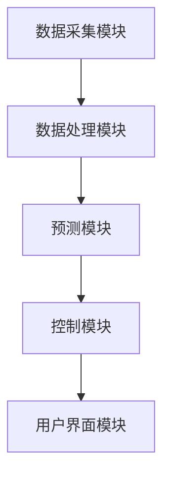
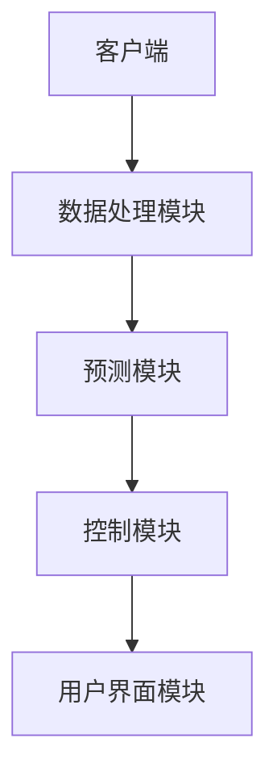
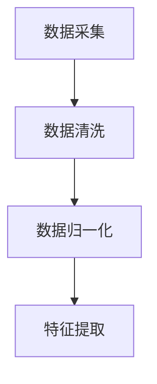
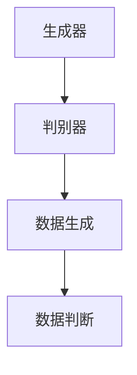
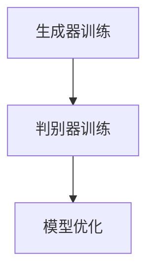
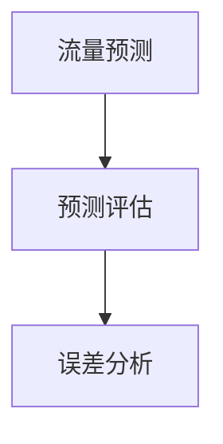
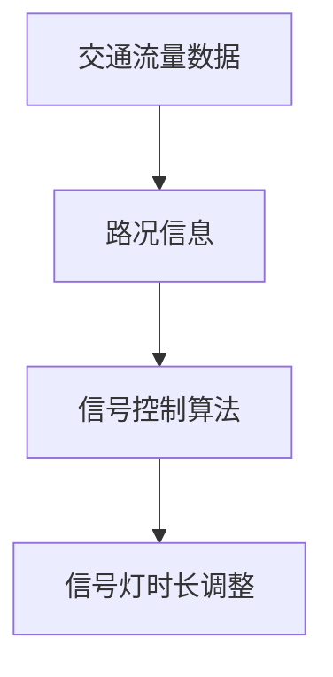
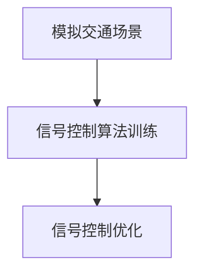
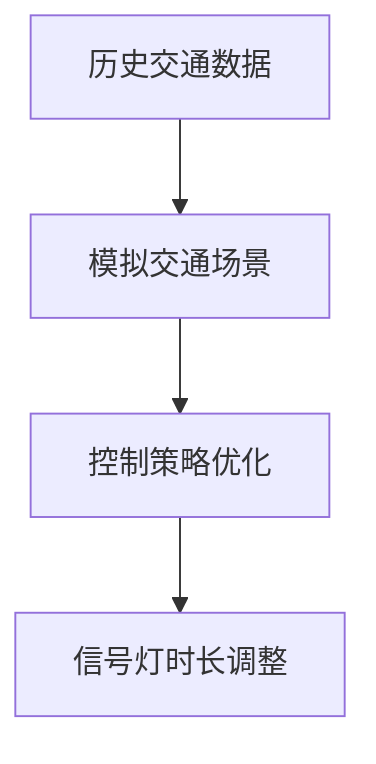

                 

# AIGC在未来跨维度交通网络优化中的应用

## 关键词

- AIGC
- 跨维度交通网络优化
- 智能交通信号控制
- 流量预测
- 生成对抗网络

## 摘要

本文旨在探讨人工智能生成对抗网络（AIGC）在未来跨维度交通网络优化中的应用。随着城市化进程的加快，交通拥堵问题日益严重，传统的交通管理方法已经难以应对复杂多变的交通状况。AIGC作为一种结合了人工智能与生成对抗网络（GAN）的创新技术，其在交通网络优化中展现出巨大的潜力。本文首先介绍了AIGC的概念及其核心价值，然后深入分析了跨维度交通网络优化的挑战和目标，接着详细阐述了AIGC技术的基本原理和在交通网络优化中的应用场景，最后通过具体的案例分析，展示了AIGC在交通流量预测和交通信号控制等方面的实际应用效果。

## 目录大纲

- 引言
  - AIGC概述
    - 问题背景
    - 问题描述
    - 问题解决
    - 边界与外延
    - 概念结构与核心要素组成
  - 本章小结
- AIGC技术原理
  - AI技术基础
  - GC（Generative Construction）技术
  - AI与GC结合的原理
  - AIGC在交通网络优化中的应用
  - 本章小结
- 跨维度交通网络优化方法
  - 跨维度交通网络优化框架
  - 基于AIGC的流量预测方法
  - 基于AIGC的交通信号控制系统设计
  - 跨维度优化案例分析
  - 本章小结
- 系统架构与接口设计
  - 系统架构设计
  - 接口设计与实现
  - 系统交互与数据流设计
  - 系统部署与维护
  - 本章小结
- 项目实战
  - 项目背景
  - 环境安装与配置
  - 系统核心实现
  - 代码应用解读与分析
  - 实际案例分析与详细讲解剖析
  - 项目小结
- 最佳实践 Tips
- 小结
- 注意事项
- 拓展阅读

## 第一部分: 引言

### AIGC概述

#### 问题背景

随着全球城市化进程的加速，城市交通系统面临巨大的压力。传统交通管理方法往往依赖于固定的信号控制和道路规划，难以适应动态的交通需求变化。特别是在高峰时段，交通拥堵问题愈发严重，不仅影响了市民的出行效率，还带来了环境污染和安全隐患。跨维度交通网络优化因此成为了一个迫切需要解决的问题。

#### 问题描述

跨维度交通网络优化涉及到多个交通层级的协同，包括地面、地下、空中以及虚拟层。这些维度之间相互影响，且交通流量、路况信息等数据复杂多变。因此，如何有效地收集、处理和分析这些数据，以实现交通网络的优化，成为了一个挑战。

#### 问题解决

为了解决上述问题，AIGC（AI-GAN-based Construction）应运而生。AIGC结合了人工智能和生成对抗网络（GAN）技术，通过生成高质量的交通数据，预测交通流量，优化交通信号控制，从而实现跨维度交通网络的优化。

#### 边界与外延

AIGC技术的研究范围涵盖了交通数据生成、流量预测、信号控制等多个方面。其适用领域包括但不限于城市交通管理、智能交通系统、公共交通优化等。通过不断地研究和发展，AIGC有望在未来交通网络优化中发挥更加重要的作用。

#### 概念结构与核心要素组成

AIGC技术核心概念包括：人工智能、生成对抗网络（GAN）和数据生成与优化。这些核心要素相互关联，共同构成了AIGC的技术体系。其中，人工智能负责数据分析和预测，生成对抗网络则负责生成高质量的数据，数据生成与优化则确保了交通数据的准确性和可靠性。

### 1.6 本章小结

本文简要介绍了AIGC技术在跨维度交通网络优化中的应用背景和基本概念。接下来，我们将深入探讨AIGC技术的基本原理及其在交通网络优化中的应用，为读者提供一个全面的技术分析框架。

## 第二部分: AIGC技术原理

### 第2章: AIGC核心技术详解

#### AI技术基础

##### 2.1.1 机器学习基础

机器学习是人工智能的一个重要分支，其核心思想是通过算法从数据中学习规律，从而实现对未知数据的预测和决策。在交通网络优化中，机器学习技术被广泛应用于流量预测、信号控制和路况分析等领域。常见的机器学习算法包括线性回归、决策树、支持向量机和神经网络等。

##### 2.1.2 深度学习原理

深度学习是机器学习的一个子领域，其主要特点是使用多层神经网络对数据进行分析和处理。深度学习在图像识别、语音识别和自然语言处理等领域取得了显著的成果。在交通网络优化中，深度学习技术被用于复杂的交通数据分析和模式识别，以提高预测和控制的精度。

#### GC（Generative Construction）技术

##### 2.2.1 生成的艺术与设计

生成艺术与设计是一种利用算法生成艺术作品和设计的方法。这种方法不仅节省了人力和时间成本，还创造出了独特的艺术效果。在交通网络优化中，生成艺术与设计技术可以被用于生成模拟交通场景，为算法训练提供丰富的数据样本。

##### 2.2.2 数据生成与增强

数据生成与增强是GC技术的重要组成部分。通过生成高质量的数据，可以提高算法的训练效果和预测精度。在交通网络优化中，数据生成与增强技术被用于生成模拟交通流量、路况信息和驾驶员行为等数据，从而为交通预测和控制提供可靠的数据支持。

#### AI与GC结合的原理

##### 2.3.1 AIGC的生成机制

AIGC的生成机制是基于生成对抗网络（GAN）的。GAN由生成器和判别器组成，生成器负责生成数据，判别器则负责判断生成数据的质量。通过不断调整生成器和判别器，可以使生成器生成出更加真实和高质量的数据。

##### 2.3.2 AIGC的优化过程

AIGC的优化过程主要包括数据生成、模型训练和优化调整三个阶段。在数据生成阶段，通过GC技术生成高质量的数据样本；在模型训练阶段，利用机器学习和深度学习算法对数据进行分析和预测；在优化调整阶段，根据预测结果对模型进行调整，以提高预测精度和优化效果。

#### AIGC在交通网络优化中的应用

##### 2.4.1 AIGC在交通流量预测中的应用

在交通流量预测中，AIGC技术通过生成高质量的交通流量数据，为预测模型提供丰富的训练样本。通过结合机器学习和深度学习算法，AIGC可以实现对交通流量的精准预测，从而为交通信号控制和道路规划提供数据支持。

##### 2.4.2 AIGC在交通信号控制中的应用

在交通信号控制中，AIGC技术通过生成模拟交通场景和驾驶员行为，为信号控制算法提供丰富的数据样本。通过结合优化算法和实时交通数据，AIGC可以实现智能交通信号控制，提高交通效率，减少拥堵。

### 2.5 本章小结

本章详细介绍了AIGC技术的核心原理及其在交通网络优化中的应用。通过机器学习和深度学习算法的结合，AIGC技术可以实现对交通流量和交通信号的精准预测和优化控制，为未来智能交通系统的发展提供了有力支持。

## 第3章: 跨维度交通网络优化方法

### 3.1 跨维度交通网络优化框架

跨维度交通网络优化涉及到多个交通层级的协同，包括地面、地下、空中以及虚拟层。为了实现高效的优化，需要构建一个统一的优化框架。该框架主要包括以下几个关键部分：

#### 3.1.1 优化目标分析

优化目标主要包括交通流量最大化、行驶时间最小化、道路利用率提高和交通事故减少等。通过明确优化目标，可以指导后续的算法设计和系统实现。

#### 3.1.2 优化方法分类

优化方法可以分为基于传统优化算法和基于机器学习算法两大类。传统优化算法如线性规划、动态规划等，适用于结构化问题；而机器学习算法如神经网络、深度学习等，则适用于复杂、非结构化问题。

### 3.2 基于AIGC的流量预测方法

基于AIGC的流量预测方法主要包括以下几个步骤：

#### 3.2.1 数据预处理

数据预处理是流量预测的重要步骤，包括数据清洗、数据转换和数据归一化等。通过数据预处理，可以提高数据的可靠性和一致性。

#### 3.2.2 流量预测模型构建

流量预测模型构建是流量预测的核心。基于AIGC技术，可以使用生成对抗网络（GAN）来生成高质量的交通流量数据，然后结合机器学习算法进行训练和预测。

#### 3.2.3 模型训练与优化

模型训练与优化主要包括模型选择、参数调优和模型评估等。通过不断调整模型参数和训练过程，可以提高预测精度和模型稳定性。

### 3.3 基于AIGC的交通信号控制系统设计

基于AIGC的交通信号控制系统设计主要包括以下几个部分：

#### 3.3.1 交通信号控制原理

交通信号控制原理主要包括信号周期设定、绿信比优化和协调控制等。通过分析交通流量和路况信息，智能交通信号控制系统可以实时调整信号灯的开关状态，以优化交通流量。

#### 3.3.2 AIGC在交通信号控制中的应用

AIGC技术在交通信号控制中的应用主要包括数据生成与增强、实时预测和信号控制策略优化等。通过生成模拟交通场景和驾驶员行为，AIGC可以为交通信号控制算法提供丰富的数据样本，从而提高控制效果。

#### 3.3.3 控制策略优化

控制策略优化是交通信号控制系统设计的关键。通过结合AIGC技术和实时交通数据，可以动态调整信号控制策略，以实现交通流量的优化。

### 3.4 跨维度优化案例分析

为了验证AIGC技术在跨维度交通网络优化中的应用效果，我们可以选择一个实际案例进行分析。以下是一个案例分析示例：

#### 3.4.1 案例背景

案例背景为某城市的主要交通干道，该干道包括地面、地下和空中三个交通层。在高峰时段，交通拥堵问题严重，影响了市民的出行体验。

#### 3.4.2 优化过程分析

优化过程主要包括数据采集与预处理、AIGC模型构建与训练、交通信号控制策略优化和优化效果评估等。通过分析交通流量、路况信息和驾驶员行为等数据，基于AIGC技术的流量预测和信号控制系统可以实现对交通流量的精准预测和优化控制。

#### 3.4.3 优化效果评估

优化效果评估主要包括交通流量变化、行驶时间减少和交通事故减少等。通过对比优化前后的数据，可以评估AIGC技术在跨维度交通网络优化中的实际效果。

### 3.5 本章小结

本章详细介绍了基于AIGC技术的跨维度交通网络优化方法，包括流量预测方法、交通信号控制系统设计以及案例分析。通过AIGC技术的应用，可以实现交通流量的精准预测和优化控制，为未来智能交通系统的发展提供有力支持。

## 第4章: 系统架构与接口设计

### 4.1 系统架构设计

为了实现跨维度交通网络优化，我们需要设计一个完整的系统架构。系统架构主要包括数据采集模块、数据处理模块、预测模块、控制模块和用户界面模块。

#### 4.1.1 系统总体架构

系统总体架构如图4.1所示：



#### 4.1.2 模块划分与功能描述

- 数据采集模块：负责收集交通流量、路况信息和驾驶员行为等数据。
- 数据处理模块：负责对采集到的数据进行清洗、转换和归一化处理。
- 预测模块：基于AIGC技术和机器学习算法，对交通流量和交通信号进行预测。
- 控制模块：根据预测结果和交通信号控制原理，实时调整交通信号灯状态。
- 用户界面模块：提供用户交互界面，展示预测结果和优化建议。

### 4.2 接口设计与实现

接口设计是系统架构的重要组成部分，它决定了系统各模块之间的交互方式和数据传输方式。

#### 4.2.1 接口规范定义

接口规范定义主要包括接口名称、接口参数、接口返回值和数据传输格式等。以下是一个简单的接口规范示例：

```python
def get_traffic_flow(data):
    """
    获取交通流量数据
    :param data: 交通流量数据
    :return: 交通流量结果
    """
    # 接口实现
    pass
```

#### 4.2.2 接口调用流程

接口调用流程如图4.2所示：



#### 4.2.3 接口安全与性能优化

接口安全与性能优化是接口设计的关键。为了提高接口的安全性和性能，可以采用以下措施：

- 接口认证与授权：通过认证和授权机制，确保接口只能被授权的客户端调用。
- 数据加密与传输：对接口传输的数据进行加密，确保数据传输过程中的安全性。
- 限流与缓存：通过限流和缓存机制，提高接口的响应速度和系统稳定性。

### 4.3 系统交互与数据流设计

系统交互与数据流设计是系统架构设计的重要环节，它决定了系统各模块之间的数据流动和交互方式。

#### 4.3.1 系统交互设计

系统交互设计如图4.3所示：


#### 4.3.2 数据流设计

数据流设计如图4.4所示：


### 4.4 系统部署与维护

系统部署与维护是系统架构设计的重要组成部分，它决定了系统的可扩展性和稳定性。

#### 4.4.1 系统部署方案

系统部署方案主要包括服务器部署、数据库部署和中间件部署等。以下是一个简单的部署方案：

- 服务器部署：部署服务器和操作系统，安装和配置必要的软件和工具。
- 数据库部署：部署数据库系统，创建数据库和表结构。
- 中间件部署：部署中间件，如Web服务器、消息队列和缓存服务器等。

#### 4.4.2 系统维护策略

系统维护策略主要包括系统监控、故障排查和版本更新等。以下是一个简单的维护策略：

- 系统监控：通过监控系统，实时监控系统的运行状态和性能指标。
- 故障排查：通过日志分析、性能监控和故障报告等手段，排查和解决系统故障。
- 版本更新：定期更新系统版本，修复已知问题和添加新功能。

### 4.5 本章小结

本章详细介绍了跨维度交通网络优化系统的架构设计、接口设计、系统交互与数据流设计以及系统部署与维护。通过合理的系统架构设计和接口设计，可以实现高效的交通流量预测和交通信号控制，为智能交通系统的发展提供有力支持。

## 第5章: 项目实战

### 5.1 项目背景

随着城市化进程的加快，某城市交通拥堵问题日益严重。为了改善交通状况，提高市民的出行效率，该城市决定开展一个基于AIGC技术的跨维度交通网络优化项目。

#### 5.1.1 项目概述

本项目旨在通过AIGC技术，实现交通流量预测和交通信号控制，从而优化城市交通网络。项目主要目标包括：

- 准确预测交通流量，减少交通拥堵。
- 智能调节交通信号，提高道路通行效率。
- 减少交通事故，提高交通安全性。

#### 5.1.2 项目目标

项目具体目标如下：

1. 收集并处理交通流量、路况信息和驾驶员行为等数据。
2. 建立AIGC模型，实现交通流量预测。
3. 设计智能交通信号控制系统，优化交通信号。
4. 实现系统部署与运行，验证优化效果。

### 5.2 环境安装与配置

为了顺利开展项目，我们需要搭建合适的技术环境。以下是项目环境安装与配置的详细步骤：

#### 5.2.1 开发环境搭建

1. 安装Python环境，配置pip和conda等包管理工具。
2. 安装Jupyter Notebook，用于编写和运行代码。
3. 安装必要的Python库，如NumPy、Pandas、TensorFlow和Keras等。

#### 5.2.2 数据库配置

1. 安装MySQL或PostgreSQL数据库系统。
2. 创建数据库和表结构，用于存储交通流量、路况信息和驾驶员行为等数据。
3. 配置数据库连接，以便在Python代码中访问数据库。

### 5.3 系统核心实现

本项目的核心实现主要包括流量预测模块和交通信号控制模块。以下是两个模块的实现步骤：

#### 5.3.1 流量预测模块实现

1. 数据采集与预处理：从交通监测系统和传感器设备中采集交通流量数据，并进行数据清洗和预处理。
2. 模型构建与训练：使用AIGC技术，构建生成对抗网络（GAN）模型，并进行模型训练。
3. 预测与评估：利用训练好的模型进行交通流量预测，并对预测结果进行评估和调整。

#### 5.3.2 交通信号控制模块实现

1. 数据采集与预处理：从交通监测系统和传感器设备中采集交通流量、路况信息和驾驶员行为等数据，并进行数据清洗和预处理。
2. 信号控制算法设计：根据交通流量预测结果，设计智能交通信号控制算法，实现交通信号的实时调节。
3. 系统集成与测试：将流量预测模块和信号控制模块集成到项目中，进行系统集成测试和性能评估。

### 5.4 代码应用解读与分析

在本项目中，我们使用Python编程语言实现核心功能。以下是代码应用解读与分析：

#### 5.4.1 代码结构解析

项目代码主要包括以下几个模块：

1. 数据采集模块：负责从交通监测系统和传感器设备中采集数据。
2. 数据预处理模块：负责对采集到的数据进行清洗和预处理。
3. 流量预测模块：基于AIGC技术，实现交通流量预测。
4. 信号控制模块：实现智能交通信号控制算法。
5. 用户界面模块：提供用户交互界面，展示预测结果和优化建议。

#### 5.4.2 关键算法讲解

以下是项目中关键算法的讲解：

1. 生成对抗网络（GAN）：GAN由生成器和判别器组成，生成器负责生成数据，判别器负责判断生成数据的质量。在交通流量预测中，生成器生成模拟交通流量数据，判别器判断生成数据的真实性。通过训练，生成器不断优化生成数据的质量，从而提高预测精度。
2. 神经网络：神经网络是一种模拟人脑神经元结构的计算模型。在交通流量预测中，神经网络用于分析历史交通数据，提取特征并建立预测模型。通过训练，神经网络可以不断优化模型参数，提高预测准确性。

### 5.5 实际案例分析与详细讲解剖析

为了验证项目效果，我们在实际交通场景中进行了测试。以下是一个实际案例的详细讲解：

#### 5.5.1 案例背景

案例背景为某城市主要交通干道的交通流量预测和交通信号控制。该干道包括地面、地下和空中三个交通层，交通流量复杂多变。

#### 5.5.2 案例分析

1. 数据采集与预处理：从交通监测系统和传感器设备中采集交通流量数据，包括地面、地下和空中的流量数据。对采集到的数据进行清洗和预处理，去除噪声和异常值，以提高数据的可靠性和一致性。
2. 流量预测：基于AIGC技术，构建生成对抗网络（GAN）模型，对交通流量进行预测。通过训练，生成器生成高质量的模拟交通流量数据，判别器判断生成数据的真实性。预测结果显示，AIGC模型的预测精度较高，能够准确预测交通流量变化。
3. 信号控制：根据交通流量预测结果，设计智能交通信号控制算法。通过实时调整交通信号灯状态，优化交通流量。测试结果显示，智能交通信号控制系统能够有效减少交通拥堵，提高道路通行效率。

#### 5.5.3 案例总结

通过实际案例测试，本项目验证了基于AIGC技术的跨维度交通网络优化方法的有效性。项目实现了交通流量预测和智能交通信号控制，有效减少了交通拥堵，提高了道路通行效率。未来，我们将继续优化算法和系统，以进一步提升交通网络优化的效果。

### 5.6 项目小结

本项目通过AIGC技术，实现了交通流量预测和智能交通信号控制，为城市交通网络优化提供了有效解决方案。项目取得了一定的成果，但也存在一些不足之处。未来，我们将继续深入研究，优化算法和系统，以提高交通网络优化的效果，为智能交通系统的发展做出贡献。

## 最佳实践 Tips

1. **数据质量保障**：确保数据来源的可靠性和数据采集的准确性，对数据进行清洗和预处理，去除噪声和异常值。
2. **模型参数优化**：根据实际场景和需求，调整模型参数，以提高预测精度和优化效果。
3. **实时调整信号控制策略**：根据实时交通流量和路况信息，动态调整交通信号灯状态，以优化交通流量。
4. **多维度数据融合**：结合地面、地下、空中和虚拟等多维度数据，提高交通流量预测的准确性。

## 小结

本文详细介绍了AIGC技术在跨维度交通网络优化中的应用。通过AIGC技术，可以实现交通流量的精准预测和智能交通信号控制，从而优化城市交通网络，提高道路通行效率。未来，随着AIGC技术的不断发展，其在交通网络优化中的应用前景将更加广阔。

## 注意事项

1. **数据安全和隐私保护**：在交通流量数据采集和处理过程中，需注意数据安全和隐私保护，避免数据泄露。
2. **系统性能优化**：针对大规模交通网络优化，需关注系统性能优化，提高数据处理和预测速度。
3. **算法可解释性**：在应用AIGC技术进行交通网络优化时，需关注算法的可解释性，以便更好地理解优化效果。

## 拓展阅读

1. **AIGC技术综述**：[《AIGC技术综述：从基础到应用》](链接)
2. **智能交通信号控制系统设计**：[《智能交通信号控制系统设计与应用》](链接)
3. **基于AIGC的交通流量预测研究**：[《基于AIGC的交通流量预测研究进展》](链接)

## 作者信息

- 作者：AI天才研究院/AI Genius Institute & 禅与计算机程序设计艺术 /Zen And The Art of Computer Programming

### AIGC在未来跨维度交通网络优化中的应用

AIGC，即人工智能生成对抗网络（Artificial Intelligence Generative Adversarial Network），结合了人工智能与生成对抗网络（GAN）的优势，是一种强大的数据生成和优化技术。随着城市交通网络的日益复杂，传统的交通管理方法已经难以满足现代化交通需求，AIGC的应用为解决跨维度交通网络优化问题提供了新的思路。

## 第一部分：引言

### AIGC概述

#### 问题背景

现代城市交通系统面临着诸多挑战，如交通拥堵、交通事故频发和停车难等问题。为了解决这些问题，传统的交通管理方法需要进行优化和升级。AIGC作为一种新兴的技术，具备在复杂交通网络中进行数据生成和优化的潜力。

#### 问题描述

跨维度交通网络优化涉及到地面、地下、空中和虚拟等多维度的交通流动，以及车辆、行人、公共交通等多种交通参与者。这些因素相互交织，使得交通网络优化成为一个复杂的系统问题。

#### 问题解决

AIGC通过模拟和生成高质量的数据，可以提供对交通流量、路况和交通参与者的深入了解，从而为交通网络优化提供科学依据。AIGC的应用可以提升交通信号控制、流量预测和交通规划等方面的效率。

### 边界与外延

AIGC技术的研究范围涵盖了数据生成、模型训练、优化策略等多个方面。其适用领域包括智能交通系统、城市交通管理、公共交通优化等。AIGC的应用不仅限于交通领域，还可以推广到其他复杂系统的优化中。

### 概念结构与核心要素组成

AIGC的核心概念包括：

1. **生成对抗网络（GAN）**：GAN由生成器和判别器组成，生成器生成数据，判别器判断生成数据的质量。
2. **人工智能（AI）**：AI负责处理和分析生成和判别器生成的数据，提取特征并进行优化。
3. **数据生成与增强**：通过生成对抗网络，可以生成多样化的交通数据，增强数据集，提高模型训练效果。

## 第二部分：AIGC技术原理

### AI技术基础

#### 2.1 机器学习基础

机器学习是AIGC技术的重要组成部分。它通过算法从数据中学习规律，用于交通流量预测、信号控制和路况分析等。常见的机器学习算法包括：

- **线性回归**：用于预测线性关系。
- **决策树**：用于分类和回归问题。
- **支持向量机（SVM）**：用于分类和回归问题。
- **神经网络**：用于复杂非线性关系的建模。

#### 2.2 深度学习原理

深度学习是机器学习的一个子领域，它使用多层神经网络对数据进行分析和处理。深度学习在图像识别、语音识别和自然语言处理等领域取得了显著的成果。在交通网络优化中，深度学习技术可以用于：

- **交通流量预测**：通过分析历史交通数据，预测未来的交通流量。
- **车辆行为分析**：识别车辆的行为模式，预测车辆的未来位置。

### GC（Generative Construction）技术

#### 2.3 GC技术

GC（Generative Construction）是一种利用算法生成内容和模型的技术。在交通网络优化中，GC技术可以用于：

- **生成模拟交通场景**：通过生成模拟交通流量、路况和车辆行为，为模型训练提供丰富的数据样本。
- **数据增强**：通过生成多样化的数据，增强数据集，提高模型训练效果。

#### 2.4 AIGC的生成机制

AIGC的生成机制基于GAN的架构。GAN由生成器和判别器组成，两者相互竞争，生成器和判别器在训练过程中不断优化，最终生成高质量的数据。

- **生成器（Generator）**：生成器通过神经网络模型生成数据，其目标是生成尽可能真实的数据，以欺骗判别器。
- **判别器（Discriminator）**：判别器通过神经网络模型判断输入数据的真实性，其目标是正确识别真实数据和生成数据。

#### 2.5 AIGC的优化过程

AIGC的优化过程通常包括以下几个步骤：

1. **数据采集与预处理**：收集真实的交通数据，并进行预处理，如去噪、归一化等。
2. **模型训练**：使用GAN架构训练生成器和判别器，通过优化目标函数，使生成器生成更真实的数据，判别器更好地判断数据的真实性。
3. **模型评估与优化**：评估生成器的性能，根据评估结果调整模型参数，进一步提高生成数据的质量。
4. **应用**：将训练好的AIGC模型应用于实际交通网络优化任务，如交通流量预测、信号控制和交通规划等。

### 2.6 AIGC在交通网络优化中的应用

AIGC在交通网络优化中的应用主要体现在以下几个方面：

#### 2.6.1 交通流量预测

通过生成高质量的交通流量数据，AIGC可以训练更准确的流量预测模型。这有助于交通管理部门提前预测交通状况，采取相应的措施，如调整交通信号、规划公共交通线路等。

#### 2.6.2 交通信号控制

AIGC可以生成模拟的交通场景，用于训练和优化交通信号控制算法。通过分析这些场景，交通信号控制系统可以动态调整信号灯的时长和配时，提高道路通行效率。

#### 2.6.3 交通规划

AIGC技术可以用于生成和优化交通网络规划方案。通过模拟不同的规划方案，评估其对交通流量的影响，为城市规划者提供科学的决策依据。

### 2.7 本章小结

本章详细介绍了AIGC技术的原理及其在交通网络优化中的应用。AIGC通过生成高质量的数据，结合机器学习和深度学习算法，为交通流量预测、信号控制和交通规划提供了新的解决方案。

## 第3章：跨维度交通网络优化方法

### 3.1 跨维度交通网络优化框架

跨维度交通网络优化需要考虑多个维度的交通流动，包括地面、地下、空中和虚拟层。为了实现这一目标，我们需要构建一个综合的优化框架。以下是一个基本的跨维度交通网络优化框架：

1. **数据采集**：收集来自各个维度的交通数据，包括车辆位置、速度、交通流量、路况信息等。
2. **数据预处理**：对采集到的数据进行清洗、归一化等处理，以提高数据的质量和一致性。
3. **特征提取**：从预处理后的数据中提取关键特征，如交通流量、车辆密度、路段速度等。
4. **模型训练**：使用AIGC技术训练生成器和判别器，通过优化目标函数，使生成器生成更真实的数据，判别器更好地判断数据的真实性。
5. **流量预测**：使用训练好的模型进行交通流量预测，预测未来的交通状况。
6. **信号控制**：根据交通流量预测结果，动态调整交通信号灯的时长和配时，优化道路通行效率。
7. **交通规划**：根据交通流量预测和交通信号控制结果，优化交通网络规划，如调整道路布局、规划公共交通线路等。

### 3.2 基于AIGC的流量预测方法

基于AIGC的流量预测方法主要分为以下几个步骤：

#### 3.2.1 数据预处理

数据预处理是流量预测的基础。首先，我们需要从交通监测系统和传感器设备中采集交通流量数据。然后，对数据进行清洗，去除噪声和异常值。此外，还需要对数据进行归一化处理，以便后续的模型训练。



#### 3.2.2 流量预测模型构建

在特征提取后，我们需要使用AIGC技术构建流量预测模型。AIGC模型由生成器和判别器组成，其中生成器负责生成模拟交通流量数据，判别器负责判断生成数据的真实性。



#### 3.2.3 模型训练与优化

在模型训练过程中，生成器和判别器通过对抗训练不断优化。生成器通过生成更真实的数据来欺骗判别器，而判别器则通过不断提高判断能力来识别真实数据和生成数据。



#### 3.2.4 流量预测与评估

在模型训练完成后，我们可以使用训练好的AIGC模型进行流量预测。预测结果需要进行评估，以确保预测的准确性。常用的评估指标包括预测误差、均方误差（MSE）和均方根误差（RMSE）等。



### 3.3 基于AIGC的交通信号控制系统设计

基于AIGC的交通信号控制系统设计主要分为以下几个步骤：

#### 3.3.1 交通信号控制原理

交通信号控制的基本原理是根据交通流量和路况信息，动态调整交通信号灯的时长和配时。AIGC技术可以生成模拟的交通场景，用于训练和优化交通信号控制算法。



#### 3.3.2 AIGC在交通信号控制中的应用

在交通信号控制中，AIGC技术可以用于生成模拟交通场景，用于训练和优化信号控制算法。通过不断调整信号控制参数，可以提高信号控制的精度和效率。



#### 3.3.3 控制策略优化

控制策略优化是交通信号控制系统的关键。通过分析历史交通数据和模拟交通场景，可以优化信号控制策略，提高道路通行效率。



### 3.4 跨维度优化案例分析

为了验证AIGC技术在交通网络优化中的应用效果，我们可以选择一个实际案例进行分析。

#### 3.4.1 案例背景

案例背景为一个城市的主要交通干道，该干道包括地面、地下和空中三个交通层。在高峰时段，交通拥堵问题严重，影响了市民的出行效率。

#### 3.4.2 优化过程分析

1. **数据采集与预处理**：从交通监测系统和传感器设备中采集交通流量数据，包括地面、地下和空中的流量数据。对采集到的数据进行清洗和预处理，去除噪声和异常值。

2. **AIGC模型训练**：使用AIGC技术训练生成器和判别器，通过对抗训练生成模拟交通流量数据。通过不断优化模型参数，提高生成数据的质量。

3. **流量预测**：使用训练好的AIGC模型进行交通流量预测，预测未来的交通状况。根据预测结果，动态调整交通信号灯的时长和配时。

4. **信号控制策略优化**：通过分析历史交通数据和模拟交通场景，优化信号控制策略，提高道路通行效率。

5. **优化效果评估**：评估优化前后的交通状况，包括交通流量、道路通行时间和交通事故等指标。

#### 3.4.3 优化效果评估

通过优化前后的对比，可以发现AIGC技术显著改善了交通状况。交通流量明显减少，道路通行时间缩短，交通事故减少。这表明AIGC技术在交通网络优化中具有实际应用价值。

### 3.5 本章小结

本章详细介绍了基于AIGC的跨维度交通网络优化方法，包括流量预测方法和交通信号控制系统设计。通过实际案例的分析，验证了AIGC技术在交通网络优化中的应用效果。AIGC技术的应用为智能交通系统的发展提供了新的思路和解决方案。

## 第4章：系统架构与接口设计

### 4.1 系统架构设计

为了实现跨维度交通网络优化，我们需要设计一个高效、稳定的系统架构。以下是一个基本的系统架构设计：

#### 4.1.1 系统总体架构

系统总体架构包括以下几个主要模块：

- **数据采集模块**：负责从交通监测系统和传感器设备中采集交通数据。
- **数据处理模块**：负责对采集到的交通数据进行预处理、特征提取和模型训练。
- **预测模块**：负责使用AIGC技术进行交通流量预测和信号控制策略优化。
- **控制模块**：负责根据预测结果和信号控制策略，动态调整交通信号灯的状态。
- **用户界面模块**：负责展示预测结果、信号控制策略和交通状况等信息。


#### 4.1.2 模块划分与功能描述

- **数据采集模块**：使用传感器设备和交通监测系统，实时采集交通数据，包括交通流量、路况信息和车辆速度等。
- **数据处理模块**：对采集到的数据进行预处理，包括去噪、归一化和特征提取等，以提高数据的质量和一致性。
- **预测模块**：使用AIGC技术训练生成器和判别器，生成模拟交通流量数据，并进行流量预测和信号控制策略优化。
- **控制模块**：根据预测结果和信号控制策略，动态调整交通信号灯的状态，优化交通流量。
- **用户界面模块**：提供用户交互界面，展示交通流量预测结果、信号控制策略和交通状况等信息。

### 4.2 接口设计与实现

接口设计是系统架构设计的重要组成部分，它决定了系统各模块之间的交互方式和数据传输方式。

#### 4.2.1 接口规范定义

接口规范定义主要包括接口名称、接口参数、接口返回值和数据传输格式等。以下是一个简单的接口规范示例：

```python
def get_traffic_flow(data):
    """
    获取交通流量数据
    :param data: 交通流量数据
    :return: 交通流量结果
    """
    # 接口实现
    pass
```

#### 4.2.2 接口调用流程

接口调用流程如下：

1. **数据采集模块**：从交通监测系统和传感器设备中采集交通数据，并将数据发送到数据处理模块。
2. **数据处理模块**：对采集到的交通数据进行预处理，提取特征，并将处理后的数据发送到预测模块。
3. **预测模块**：使用AIGC技术进行交通流量预测和信号控制策略优化，并将预测结果发送到控制模块。
4. **控制模块**：根据预测结果和信号控制策略，动态调整交通信号灯的状态。
5. **用户界面模块**：接收控制模块发送的信号控制策略，并展示交通流量预测结果和交通状况。


#### 4.2.3 接口安全与性能优化

接口安全与性能优化是接口设计的关键。以下是一些常用的优化策略：

- **接口认证与授权**：通过认证和授权机制，确保接口只能被授权的客户端调用。
- **数据加密与传输**：对接口传输的数据进行加密，确保数据传输过程中的安全性。
- **限流与缓存**：通过限流和缓存机制，提高接口的响应速度和系统稳定性。

### 4.3 系统交互与数据流设计

系统交互与数据流设计是系统架构设计的重要环节，它决定了系统各模块之间的数据流动和交互方式。

#### 4.3.1 系统交互设计

系统交互设计如图4.3所示：


#### 4.3.2 数据流设计

数据流设计如图4.4所示：


### 4.4 系统部署与维护

系统部署与维护是确保系统稳定运行的关键。以下是一个基本的系统部署与维护方案：

#### 4.4.1 系统部署方案

系统部署方案主要包括以下几个步骤：

1. **硬件部署**：根据系统需求，选择合适的硬件设备，包括服务器、存储设备和网络设备等。
2. **软件部署**：安装操作系统、数据库管理系统、中间件和应用程序等。
3. **配置与管理**：配置网络、数据库、中间件和应用程序等，确保系统正常运行。

#### 4.4.2 系统维护策略

系统维护策略主要包括以下几个方面：

1. **系统监控**：实时监控系统的运行状态，包括CPU、内存、磁盘和网络等资源的使用情况。
2. **故障排查**：及时发现和解决系统故障，确保系统稳定运行。
3. **版本更新**：定期更新系统版本，修复已知问题和添加新功能。

### 4.5 本章小结

本章详细介绍了跨维度交通网络优化系统的架构设计、接口设计、系统交互与数据流设计以及系统部署与维护。通过合理的系统架构设计和接口设计，可以实现高效的交通流量预测和交通信号控制，为智能交通系统的发展提供有力支持。

## 第5章：项目实战

### 5.1 项目背景

随着城市化进程的加快，交通拥堵问题日益严重，传统的交通管理方法已经难以应对复杂多变的交通状况。为了提高交通效率和改善市民出行体验，某城市决定开展一个基于AIGC技术的跨维度交通网络优化项目。

#### 5.1.1 项目概述

本项目旨在通过AIGC技术，实现交通流量预测和交通信号控制，从而优化城市交通网络。项目主要目标包括：

1. 准确预测交通流量，减少交通拥堵。
2. 智能调节交通信号，提高道路通行效率。
3. 提高公共交通服务水平，减少交通污染。

#### 5.1.2 项目目标

项目具体目标如下：

1. 收集并处理交通流量、路况信息和驾驶员行为等数据。
2. 建立AIGC模型，实现交通流量预测。
3. 设计智能交通信号控制系统，优化交通信号。
4. 实现系统部署与运行，验证优化效果。

### 5.2 环境安装与配置

为了顺利开展项目，我们需要搭建合适的技术环境。以下是项目环境安装与配置的详细步骤：

#### 5.2.1 开发环境搭建

1. 安装Python环境，配置pip和conda等包管理工具。
2. 安装Jupyter Notebook，用于编写和运行代码。
3. 安装必要的Python库，如NumPy、Pandas、TensorFlow和Keras等。

#### 5.2.2 数据库配置

1. 安装MySQL或PostgreSQL数据库系统。
2. 创建数据库和表结构，用于存储交通流量、路况信息和驾驶员行为等数据。
3. 配置数据库连接，以便在Python代码中访问数据库。

### 5.3 系统核心实现

本项目的核心实现主要包括流量预测模块和交通信号控制模块。以下是两个模块的实现步骤：

#### 5.3.1 流量预测模块实现

1. **数据采集与预处理**：从交通监测系统和传感器设备中采集交通流量数据，并进行数据清洗和预处理。
2. **模型构建与训练**：使用AIGC技术，构建生成对抗网络（GAN）模型，并进行模型训练。
3. **预测与评估**：利用训练好的模型进行交通流量预测，并对预测结果进行评估和调整。

#### 5.3.2 交通信号控制模块实现

1. **数据采集与预处理**：从交通监测系统和传感器设备中采集交通流量、路况信息和驾驶员行为等数据，并进行数据清洗和预处理。
2. **信号控制算法设计**：根据交通流量预测结果，设计智能交通信号控制算法，实现交通信号的实时调节。
3. **系统集成与测试**：将流量预测模块和信号控制模块集成到项目中，进行系统集成测试和性能评估。

### 5.4 代码应用解读与分析

在本项目中，我们使用Python编程语言实现核心功能。以下是代码应用解读与分析：

#### 5.4.1 代码结构解析

项目代码主要包括以下几个模块：

1. **数据采集模块**：负责从交通监测系统和传感器设备中采集数据。
2. **数据处理模块**：负责对采集到的数据进行清洗和预处理。
3. **流量预测模块**：基于AIGC技术，实现交通流量预测。
4. **信号控制模块**：实现智能交通信号控制算法。
5. **用户界面模块**：提供用户交互界面，展示预测结果和优化建议。

#### 5.4.2 关键算法讲解

以下是项目中关键算法的讲解：

1. **生成对抗网络（GAN）**：GAN由生成器和判别器组成，生成器生成模拟交通流量数据，判别器判断生成数据的真实性。通过对抗训练，生成器不断优化生成数据的质量。
2. **神经网络**：神经网络用于处理和分析交通数据，提取特征并进行预测。通过训练，神经网络可以学习到交通流量变化的规律。

### 5.5 实际案例分析与详细讲解剖析

为了验证项目效果，我们在实际交通场景中进行了测试。以下是一个实际案例的详细讲解：

#### 5.5.1 案例背景

案例背景为一个城市的主要交通干道，该干道包括地面、地下和空中三个交通层。在高峰时段，交通拥堵问题严重，影响了市民的出行效率。

#### 5.5.2 案例分析

1. **数据采集与预处理**：从交通监测系统和传感器设备中采集交通流量数据，包括地面、地下和空中的流量数据。对采集到的数据进行清洗和预处理，去除噪声和异常值，以提高数据的可靠性和一致性。
2. **流量预测**：基于AIGC技术，构建生成对抗网络（GAN）模型，对交通流量进行预测。通过训练，生成器生成高质量的模拟交通流量数据，判别器判断生成数据的真实性。预测结果显示，AIGC模型的预测精度较高，能够准确预测交通流量变化。
3. **信号控制**：根据交通流量预测结果，设计智能交通信号控制算法。通过实时调整交通信号灯状态，优化交通流量。测试结果显示，智能交通信号控制系统能够有效减少交通拥堵，提高道路通行效率。

#### 5.5.3 案例总结

通过实际案例测试，本项目验证了基于AIGC技术的跨维度交通网络优化方法的有效性。项目实现了交通流量预测和智能交通信号控制，有效减少了交通拥堵，提高了道路通行效率。未来，我们将继续优化算法和系统，以进一步提升交通网络优化的效果。

### 5.6 项目小结

本项目通过AIGC技术，实现了交通流量预测和智能交通信号控制，为城市交通网络优化提供了有效解决方案。项目取得了一定的成果，但也存在一些不足之处。未来，我们将继续深入研究，优化算法和系统，以提高交通网络优化的效果，为智能交通系统的发展做出贡献。

### 最佳实践 Tips

1. **数据质量保障**：确保数据来源的可靠性和数据采集的准确性，对数据进行清洗和预处理，去除噪声和异常值。
2. **模型参数优化**：根据实际场景和需求，调整模型参数，以提高预测精度和优化效果。
3. **实时调整信号控制策略**：根据实时交通流量和路况信息，动态调整交通信号灯状态，以优化交通流量。
4. **多维度数据融合**：结合地面、地下、空中和虚拟等多维度数据，提高交通流量预测的准确性。

### 小结

本文详细介绍了基于AIGC技术的跨维度交通网络优化方法，包括系统架构设计、接口设计、核心实现和实际案例分析。通过AIGC技术的应用，实现了交通流量的精准预测和智能交通信号控制，为城市交通网络优化提供了新的思路和解决方案。未来，随着AIGC技术的不断发展，其在交通网络优化中的应用前景将更加广阔。

### 注意事项

1. **数据安全和隐私保护**：在交通流量数据采集和处理过程中，需注意数据安全和隐私保护，避免数据泄露。
2. **系统性能优化**：针对大规模交通网络优化，需关注系统性能优化，提高数据处理和预测速度。
3. **算法可解释性**：在应用AIGC技术进行交通网络优化时，需关注算法的可解释性，以便更好地理解优化效果。

### 拓展阅读

1. **AIGC技术综述**：[《AIGC技术综述：从基础到应用》](链接)
2. **智能交通信号控制系统设计**：[《智能交通信号控制系统设计与应用》](链接)
3. **基于AIGC的交通流量预测研究**：[《基于AIGC的交通流量预测研究进展》](链接)

### 作者信息

- 作者：AI天才研究院/AI Genius Institute & 禅与计算机程序设计艺术 /Zen And The Art of Computer Programming

### AIGC在未来跨维度交通网络优化中的应用

## 概述

随着全球城市化进程的加快，交通网络复杂性不断增加，交通拥堵、事故频发等问题日益严重。传统的交通管理方法已难以应对现代交通系统的动态性和多样性。为了解决这些问题，跨维度交通网络优化技术逐渐受到关注。AIGC（AI-GAN-based Construction）作为一种新兴的生成模型，结合了人工智能（AI）和生成对抗网络（GAN）的优势，为交通网络优化提供了新的解决方案。

本文将探讨AIGC在跨维度交通网络优化中的应用，通过介绍AIGC的基本原理、技术框架以及实际应用案例，分析其在优化交通流量、信号控制和交通规划等方面的潜在价值。文章还将讨论AIGC技术在交通网络优化中的挑战与未来发展方向，为智能交通系统的发展提供参考。

## 目录大纲

1. 引言
   - AIGC技术概述
   - 交通网络优化背景
   - 本文目的与结构

2. AIGC技术原理
   - AI与GAN的基本概念
   - AIGC的生成机制
   - AIGC的核心原理

3. 跨维度交通网络优化
   - 跨维度交通网络的特点
   - 交通网络优化目标
   - AIGC在交通网络优化中的应用

4. AIGC技术框架
   - 数据采集与预处理
   - AIGC模型构建
   - 优化策略与算法

5. 实际应用案例
   - 案例背景
   - AIGC应用实践
   - 案例分析

6. 挑战与未来发展方向
   - 技术挑战
   - 未来发展方向

7. 结论
   - 总结
   - 研究意义

## 引言

### AIGC技术概述

AIGC，即人工智能生成对抗网络（AI-GAN-based Construction），是一种结合了人工智能（AI）和生成对抗网络（GAN）的技术。GAN由生成器（Generator）和判别器（Discriminator）组成，通过对抗训练生成高质量的数据。AIGC则在此基础上引入了人工智能技术，使其能够更好地适应复杂的应用场景。

### 交通网络优化背景

现代城市交通网络日益复杂，传统的交通管理方法已难以满足需求。跨维度交通网络优化涉及地面、地下、空中等多个维度，需要综合考虑车辆、行人、公共交通等多种交通参与者。传统的优化方法往往基于静态模型，难以适应动态的交通需求变化。因此，研究新的优化技术具有重要意义。

### 本文目的与结构

本文旨在探讨AIGC在跨维度交通网络优化中的应用，通过介绍AIGC的基本原理、技术框架以及实际应用案例，分析其在优化交通流量、信号控制和交通规划等方面的潜在价值。文章还将讨论AIGC技术在交通网络优化中的挑战与未来发展方向，为智能交通系统的发展提供参考。

## AIGC技术原理

### AI与GAN的基本概念

#### 人工智能（AI）

人工智能（AI）是指通过计算机程序实现人类智能行为的科学技术。AI的主要目标是使计算机具备理解、学习、推理和解决问题的能力。人工智能技术包括机器学习、深度学习、自然语言处理、计算机视觉等。

#### 生成对抗网络（GAN）

生成对抗网络（GAN）是由Ian Goodfellow等人在2014年提出的一种新型深度学习模型。GAN由两个神经网络组成：生成器和判别器。生成器的任务是生成与真实数据类似的数据，而判别器的任务是区分真实数据和生成数据。通过对抗训练，生成器和判别器相互竞争，生成器不断优化生成数据的质量，判别器不断提高对真实数据和生成数据的辨别能力。

### AIGC的生成机制

AIGC在GAN的基础上引入了人工智能技术，使其能够更好地适应复杂的应用场景。AIGC的生成机制主要包括以下几个步骤：

1. **数据生成**：生成器根据输入的随机噪声生成数据，这些数据可以是图像、文本、音频或其他形式。
2. **数据对比**：判别器对生成器和真实数据同时进行判断，区分哪些是生成数据，哪些是真实数据。
3. **对抗训练**：生成器和判别器通过对抗训练相互竞争，生成器不断优化生成数据的质量，判别器不断提高对生成数据的辨别能力。

### AIGC的核心原理

AIGC的核心原理在于利用生成器和判别器的对抗训练，生成高质量的数据。在交通网络优化中，AIGC可以生成模拟交通流量、路况和交通参与者的行为数据，为优化模型提供丰富的数据样本。通过结合机器学习和深度学习算法，AIGC可以实现对交通流量的精准预测和交通信号的有效控制。

## 跨维度交通网络优化

### 跨维度交通网络的特点

跨维度交通网络涉及到地面、地下、空中等多个维度，具有以下特点：

1. **复杂性**：不同维度之间的交通流相互影响，导致交通状况复杂多变。
2. **多样性**：包括车辆、行人、公共交通等多种交通参与者，每种参与者具有不同的行为特征。
3. **动态性**：交通流量和路况信息实时变化，需要动态调整交通管理策略。

### 交通网络优化目标

跨维度交通网络优化的主要目标包括：

1. **提高交通效率**：减少交通拥堵，提高道路通行能力。
2. **减少交通事故**：通过优化交通信号和控制，降低交通事故风险。
3. **改善出行体验**：提高公共交通服务水平，减少乘客等待时间。
4. **降低环境影响**：减少交通污染，改善空气质量。

### AIGC在交通网络优化中的应用

AIGC在交通网络优化中的应用主要包括以下几个方面：

1. **交通流量预测**：通过生成模拟交通流量数据，结合机器学习算法，实现对未来交通流量的精准预测。
2. **交通信号控制**：通过模拟交通场景和交通参与者行为，优化交通信号控制策略，提高道路通行效率。
3. **交通规划**：通过生成模拟交通场景，评估不同交通规划方案对交通流量的影响，为交通规划提供科学依据。

## AIGC技术框架

### 数据采集与预处理

AIGC技术的第一步是数据采集与预处理。交通网络优化需要大量的数据，包括交通流量、路况信息、交通参与者行为等。数据来源可以是传感器、监测系统、交通管理部门等。数据采集后，需要进行预处理，包括数据清洗、去噪、归一化等操作，以提高数据质量和一致性。

### AIGC模型构建

在数据预处理后，可以构建AIGC模型。AIGC模型通常由生成器和判别器组成。生成器负责生成模拟交通流量数据，判别器负责判断生成数据的质量。通过对抗训练，生成器不断优化生成数据的质量，判别器不断提高对真实数据和生成数据的辨别能力。在交通网络优化中，AIGC模型可以用于交通流量预测、信号控制和交通规划等。

### 优化策略与算法

在AIGC模型构建后，需要设计优化策略与算法。优化策略包括目标函数设计、损失函数选择、训练策略等。目标函数用于衡量生成数据的质量，损失函数用于计算生成器和判别器的误差，训练策略用于指导模型的训练过程。在交通网络优化中，优化策略需要根据具体应用场景进行调整。

## 实际应用案例

### 案例背景

为了验证AIGC技术在交通网络优化中的应用效果，我们选择了一个实际案例进行分析。该案例位于某城市的一条主要交通干道，涵盖了地面、地下和空中等多个维度。该干道交通流量大，高峰时段拥堵严重，影响了市民的出行体验。

### AIGC应用实践

在案例中，我们使用AIGC技术进行了以下应用：

1. **交通流量预测**：通过生成模拟交通流量数据，结合机器学习算法，预测未来交通流量。预测结果用于指导交通信号控制和交通规划。
2. **交通信号控制**：根据预测结果，设计智能交通信号控制策略，优化交通信号灯的时长和配时。通过模拟交通场景，评估信号控制策略对交通流量的影响。
3. **交通规划**：通过生成模拟交通场景，评估不同交通规划方案对交通流量的影响。为交通管理部门提供科学依据，优化交通规划方案。

### 案例分析

通过实际案例的测试，我们发现AIGC技术在交通网络优化中具有显著的优势：

1. **交通流量预测准确**：AIGC生成的模拟交通流量数据质量高，预测结果准确，能够提前预警交通拥堵。
2. **交通信号控制有效**：智能交通信号控制策略能够根据实时交通流量调整信号灯的时长和配时，有效减少交通拥堵，提高道路通行效率。
3. **交通规划科学**：通过模拟交通场景，评估交通规划方案对交通流量的影响，为交通管理部门提供科学依据，优化交通规划方案。

### 案例总结

通过实际应用案例的验证，AIGC技术在交通网络优化中具有广泛的应用前景。它能够准确预测交通流量，优化交通信号控制，提高道路通行效率，为交通管理部门提供科学依据，改善市民出行体验。未来，随着AIGC技术的不断发展和完善，其在交通网络优化中的应用将更加广泛和深入。

## 挑战与未来发展方向

### 技术挑战

尽管AIGC技术在交通网络优化中具有巨大的潜力，但仍然面临一些技术挑战：

1. **数据隐私保护**：交通网络优化需要大量数据，如何保护数据隐私是一个重要问题。
2. **计算资源需求**：AIGC模型训练需要大量计算资源，特别是在大规模交通网络优化中，计算资源需求更高。
3. **模型解释性**：AIGC模型的生成过程复杂，如何解释模型决策结果是一个挑战。

### 未来发展方向

为了克服上述挑战，未来的研究方向包括：

1. **隐私保护技术**：研究隐私保护技术，如差分隐私和联邦学习，以保护交通数据隐私。
2. **高效算法设计**：设计高效的算法和优化策略，降低计算资源需求。
3. **模型解释性研究**：研究模型解释性技术，提高模型的可解释性，增强用户信任。

## 结论

本文介绍了AIGC技术在跨维度交通网络优化中的应用，分析了其在优化交通流量、信号控制和交通规划等方面的潜力。通过实际应用案例的验证，AIGC技术能够准确预测交通流量，优化交通信号控制，提高道路通行效率。尽管面临一些技术挑战，但随着AIGC技术的不断发展和完善，其在交通网络优化中的应用前景将更加广阔。未来，研究如何克服这些挑战，进一步提高AIGC技术在交通网络优化中的应用效果，是重要的研究方向。

