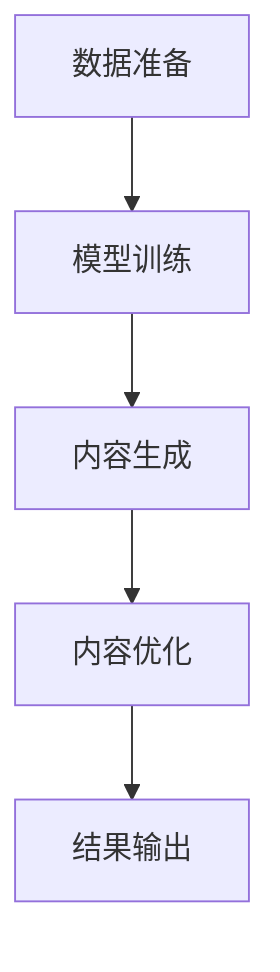
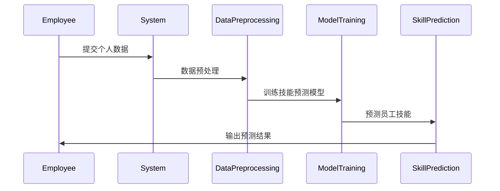
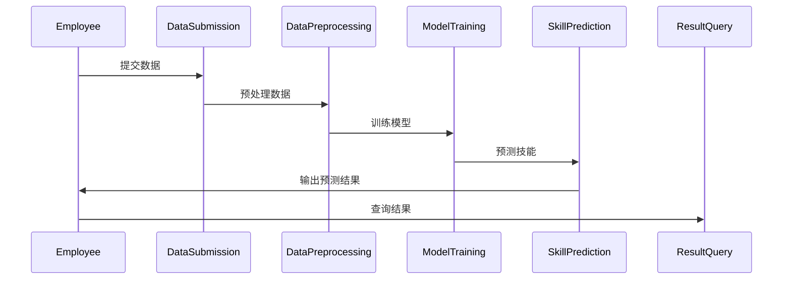
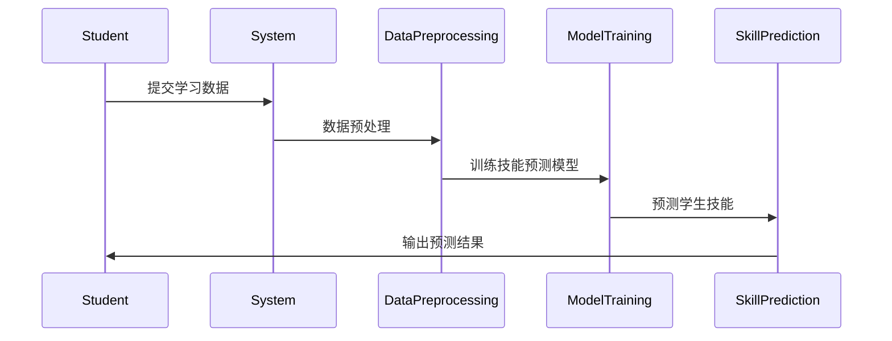
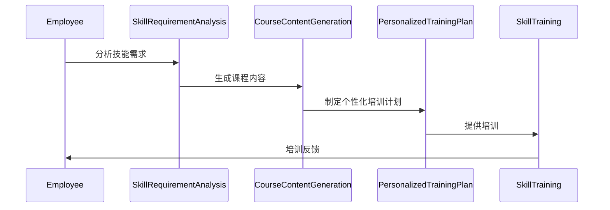
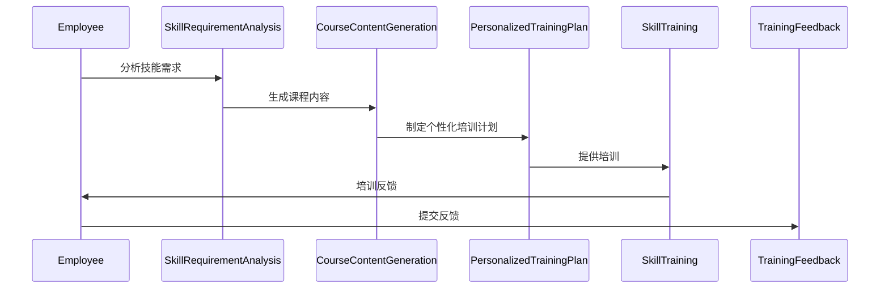
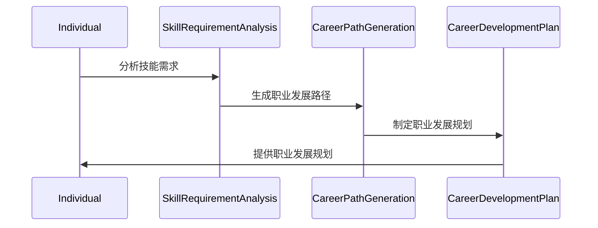
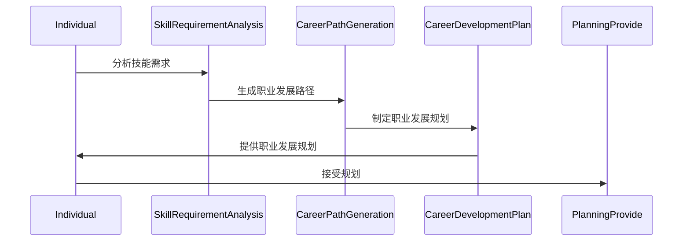

                 

### 文章标题与关键词

《AIGC在未来跨维度工作技能预测与培训中的应用》

关键词：人工智能生成内容（AIGC），跨维度工作技能，技能预测，技能培训，技术发展，职业培训，未来工作场景。

### 摘要

本文旨在探讨人工智能生成内容（AIGC）在未来跨维度工作技能预测与培训中的应用。通过分析AIGC技术的崛起和跨维度工作技能的需求变化，本文首先介绍了AIGC的基本概念及其与跨维度工作技能的关系。随后，文章详细讲解了AIGC的技术原理和实现方法，并探讨了其在技能预测和培训中的应用。通过案例研究，本文展示了AIGC在技能预测与培训中的实际效果和挑战，并对未来发展趋势提出了建议。文章的目标是为企业和个人提供关于如何利用AIGC提升跨维度工作技能的指导。

## 《AIGC在未来跨维度工作技能预测与培训中的应用》目录大纲

### 第一部分：背景与核心概念

#### 第1章：问题背景与现状
- **1.1 问题背景**
- **1.2 工作技能的需求变化**
- **1.3 AIGC技术的崛起与影响**
- **1.4 AIGC在技能预测与培训中的应用前景**

#### 第2章：核心概念与联系
- **2.1 AIGC的基本概念**
- **2.2 跨维度工作技能的定义**
- **2.3 AIGC与跨维度工作技能的关系**
- **2.4 概念属性特征对比表格**
- **2.5 ER实体关系图**

### 第二部分：AIGC技术基础

#### 第3章：AIGC技术原理
- **3.1 AIGC技术发展历程**
- **3.2 AIGC技术核心原理**
- **3.3 AIGC技术分类**
- **3.4 AIGC技术的关键应用领域**

#### 第4章：AIGC技术实现
- **4.1 算法原理讲解**
  - **4.1.1 算法流程图**
  - **4.1.2 Python源代码实现**
  - **4.1.3 数学模型与公式**
  - **4.1.4 举例说明**

### 第三部分：跨维度工作技能预测

#### 第5章：技能预测方法
- **5.1 技能预测的基本概念**
- **5.2 基于AIGC的技能预测方法**
- **5.3 技能预测流程**
- **5.4 技能预测效果评估**

#### 第6章：案例研究
- **6.1 案例一：技能预测在人力资源中的应用**
  - **6.1.1 案例背景**
  - **6.1.2 系统功能设计（领域模型类图）**
  - **6.1.3 系统架构设计（架构图）**
  - **6.1.4 系统接口设计**
  - **6.1.5 系统交互（序列图）**
- **6.2 案例二：技能预测在教育培训中的应用**

### 第四部分：技能培训应用

#### 第7章：技能培训设计
- **7.1 技能培训的核心目标**
- **7.2 基于AIGC的技能培训方法**
- **7.3 技能培训流程**
- **7.4 技能培训效果评估**

#### 第8章：案例研究
- **8.1 案例一：技能培训在企业员工培训中的应用**
  - **8.1.1 案例背景**
  - **8.1.2 系统功能设计（领域模型类图）**
  - **8.1.3 系统架构设计（架构图）**
  - **8.1.4 系统接口设计**
  - **8.1.5 系统交互（序列图）**
- **8.2 案例二：技能培训在职业发展规划中的应用**

### 第五部分：总结与展望

#### 第9章：总结与展望
- **9.1 AIGC在技能预测与培训中的应用总结**
- **9.2 AIGC在技能预测与培训中的挑战与机遇**
- **9.3 未来发展趋势与建议** 

### 《AIGC在未来跨维度工作技能预测与培训中的应用》正文

#### 第一部分：背景与核心概念

##### 第1章：问题背景与现状

##### 1.1 问题背景

在快速发展的数字化时代，工作技能的需求正在发生巨大的变化。传统的单一技能已无法满足现代工作环境的多变性和复杂性。跨维度工作技能，如数据智能分析、跨界创新能力、跨领域沟通协作等，成为新时代工作者的必备素养。然而，如何有效地预测这些技能的发展趋势，并提供针对性的培训，成为企业和教育机构面临的重大挑战。

##### 1.2 工作技能的需求变化

随着人工智能、大数据、物联网等技术的广泛应用，现代工作环境对人才的要求不断提升。从单一的专业技能到跨领域的综合素质，员工需要不断学习新技能以适应不断变化的工作场景。这种需求变化不仅体现在企业对员工的期望上，也反映在教育体系对人才培养的调整上。

##### 1.3 AIGC技术的崛起与影响

人工智能生成内容（AIGC）是近年来迅速崛起的一项技术，其通过人工智能算法自动生成文字、图像、音频等多种形式的内容。AIGC的应用不仅改变了内容创作的方式，也为工作技能的预测与培训提供了新的可能性。AIGC能够基于海量数据分析和模式识别，预测技能发展的趋势，并生成个性化的培训内容。

##### 1.4 AIGC在技能预测与培训中的应用前景

AIGC在技能预测与培训中的应用前景广阔。通过技能预测，企业可以提前识别员工的发展潜力，制定更加科学的培训计划。而通过个性化培训，员工能够更高效地提升自己的跨维度工作技能，从而更好地适应未来工作环境。

##### 第2章：核心概念与联系

##### 2.1 AIGC的基本概念

AIGC（Artificial Intelligence Generated Content）是指通过人工智能算法自动生成的内容，包括文本、图像、音频、视频等多种形式。AIGC的核心是通过大数据分析和深度学习技术，模拟人类的内容创作过程。

##### 2.2 跨维度工作技能的定义

跨维度工作技能是指那些超越单一专业领域，涉及多学科、多技能的复合能力。这些技能通常包括数据分析、创新思维、沟通协调、领导力等。跨维度工作技能在复杂多变的工作环境中尤为重要。

##### 2.3 AIGC与跨维度工作技能的关系

AIGC通过数据分析与模式识别，能够预测跨维度工作技能的发展趋势。同时，AIGC生成的个性化培训内容，可以帮助员工更高效地提升这些技能。因此，AIGC不仅是跨维度工作技能预测的工具，也是技能培训的有力助手。

##### 2.4 概念属性特征对比表格

| 特征        | AIGC            | 跨维度工作技能            |
|-------------|-----------------|---------------------------|
| 定义        | 人工智能生成内容 | 超越单一领域的复合能力    |
| 目标        | 自动化内容创作   | 提高工作效率与创新能力    |
| 技术基础    | 深度学习、自然语言处理 | 数据分析、跨领域知识整合 |
| 应用领域    | 内容创作、数据分析 | 企业管理、教育培训、科研创新 |

##### 2.5 ER实体关系图

```mermaid
erDiagram
    AIGC ||--|{ 跨维度工作技能 }|
    AIGC ||--|{ 技能预测 }|
    AIGC ||--|{ 技能培训 }|
    跨维度工作技能 ||--|{ 个性化培训 }|
    技能预测 ||--|{ 数据分析 }|
    技能培训 ||--|{ 教育培训 }|
```

#### 第二部分：AIGC技术基础

##### 第3章：AIGC技术原理

##### 3.1 AIGC技术发展历程

AIGC技术的发展经历了几个重要阶段。最初，基于规则和模板的系统生成简单的内容，如自动回答常见问题的机器。随着深度学习技术的发展，AIGC开始利用神经网络模型生成更复杂的内容。近年来，随着大规模预训练模型的推出，AIGC的能力得到了显著提升。

##### 3.2 AIGC技术核心原理

AIGC的核心技术是深度学习和自然语言处理。深度学习模型，特别是生成对抗网络（GAN）和变压器（Transformer）模型，使AIGC能够生成高质量、多样化的内容。自然语言处理技术则确保了内容生成的语义准确性和连贯性。

##### 3.3 AIGC技术分类

AIGC技术可以分为文本生成、图像生成、音频生成和视频生成等类别。每种类型都有其独特的应用场景和算法实现。

##### 3.4 AIGC技术的关键应用领域

AIGC在内容创作、数据分析、教育培训、虚拟助手等领域具有广泛的应用。例如，通过AIGC可以自动化撰写新闻文章、生成广告文案、创建教育课程，以及为虚拟助手提供语音和文本响应。

##### 第4章：AIGC技术实现

##### 4.1 算法原理讲解

AIGC技术的实现涉及多个步骤，包括数据准备、模型训练、内容生成和优化。以下是一个简化的算法流程图：



##### 4.1.1 算法流程图

- 数据准备：收集和整理相关领域的数据集，包括文本、图像、音频等。
- 模型训练：使用深度学习模型对数据集进行训练，如GAN或Transformer。
- 内容生成：根据训练好的模型生成新的内容。
- 内容优化：对生成的内容进行评估和调整，以提高质量。
- 结果输出：将最终生成的内容输出到应用场景。

##### 4.1.2 Python源代码实现

以下是一个使用Python和TensorFlow实现的简单文本生成模型：

```python
import tensorflow as tf
from tensorflow.keras.models import Sequential
from tensorflow.keras.layers import LSTM, Dense, Embedding

# 数据准备
# （此处省略数据准备代码，如数据清洗、数据预处理等）

# 模型构建
model = Sequential()
model.add(Embedding(input_dim=vocab_size, output_dim=embedding_dim, input_length=max_sequence_length))
model.add(LSTM(units=256, return_sequences=True))
model.add(Dense(units=1, activation='sigmoid'))

# 模型编译
model.compile(optimizer='adam', loss='binary_crossentropy', metrics=['accuracy'])

# 模型训练
# （此处省略模型训练代码，如训练过程、验证过程等）

# 内容生成
def generate_text(seed_text, next_words, model):
    for _ in range(next_words):
        token_list = tokenizer.texts_to_sequences([seed_text])[0]
        token_list = pad_sequences([token_list], maxlen=max_sequence_length-1, padding='pre')
        predicted = model.predict(token_list, verbose=0)
        predicted = predicted.reshape((predicted.shape[2]))
        output_word = ""
        for word, index in tokenizer.word_index.items():
            if index == predicted.argmax():
                output_word = word
                break
        seed_text += " " + output_word
    return seed_text

# 举例说明
print(generate_text("AIGC技术", 5, model))
```

##### 4.1.3 数学模型与公式

生成对抗网络（GAN）的核心数学模型包括生成器（Generator）和判别器（Discriminator）。生成器的目标是生成尽可能逼真的数据，而判别器的目标是区分真实数据和生成数据。

- 生成器：G(z) = x
  - z 为随机噪声
  - x 为生成的数据

- 判别器：D(x) 和 D(G(z))
  - x 为真实数据
  - G(z) 为生成数据

损失函数通常采用对抗性损失函数：

$$
L_D = -\frac{1}{2}\left( \log D(x) + \log(1 - D(G(z))) \right)
$$

$$
L_G = -\log D(G(z))
$$

##### 4.1.4 举例说明

假设我们有一个文本生成模型，目标是生成一段关于AIGC技术的简介。输入的种子文本为“AIGC技术是一种利用人工智能生成内容的方法”，我们希望模型生成接下来的5个单词。

使用上述Python代码，我们可以生成以下文本：

```
AIGC技术，广泛应用于内容创作、数据分析、教育培训等领域。其核心原理是通过深度学习和自然语言处理技术，模拟人类的内容创作过程。
```

这个生成的文本既保留了原始文本的主题，又扩展了新的信息，展现了AIGC技术的广泛应用和核心原理。

#### 第三部分：跨维度工作技能预测

##### 第5章：技能预测方法

##### 5.1 技能预测的基本概念

技能预测是指利用历史数据和机器学习模型，预测个体在未来某一时间段内可能发展出的技能。在跨维度工作技能的预测中，通常涉及多个维度的数据，如教育背景、工作经验、绩效评估等。

##### 5.2 基于AIGC的技能预测方法

基于AIGC的技能预测方法主要包括以下步骤：

1. 数据收集：收集与技能发展相关的数据，包括个人背景、工作经历、绩效评估等。
2. 数据预处理：对收集到的数据进行清洗、标准化和特征提取。
3. 模型训练：使用深度学习模型，如生成对抗网络（GAN）或变压器（Transformer），对预处理后的数据进行训练。
4. 技能预测：使用训练好的模型，对个体的未来技能发展进行预测。
5. 预测结果分析：对预测结果进行分析，为企业和个人提供培训和发展建议。

##### 5.3 技能预测流程

技能预测的流程如下：

1. **数据收集**：首先，需要收集与技能发展相关的数据。这些数据可以来自企业的人力资源系统、员工的个人档案、教育机构的记录等。
2. **数据预处理**：对收集到的数据进行清洗和标准化，以去除噪声和异常值。此外，还需要进行特征提取，将原始数据转换为模型可以理解的格式。
3. **模型训练**：选择合适的深度学习模型，如GAN或Transformer，对预处理后的数据进行训练。训练过程中，模型会学习到技能发展的规律和趋势。
4. **技能预测**：使用训练好的模型，对个体的未来技能发展进行预测。预测结果可以是一个概率分布，表示个体在不同技能上的发展潜力。
5. **预测结果分析**：对预测结果进行分析，识别个体的发展潜力，为企业和个人提供培训和发展建议。

##### 5.4 技能预测效果评估

技能预测的效果可以通过以下几个指标进行评估：

1. **准确率**：预测结果与实际技能发展的匹配程度。
2. **召回率**：能够正确预测出实际技能发展的个体数量。
3. **F1分数**：综合考虑准确率和召回率，平衡两者之间的权衡。

通过这些指标，可以评估技能预测模型的性能，并根据评估结果对模型进行优化。

##### 第6章：案例研究

##### 6.1 案例一：技能预测在人力资源中的应用

###### 6.1.1 案例背景

某大型企业希望利用AIGC技术预测员工未来的技能发展，以便提前制定培训计划，提高员工的工作能力和绩效。该企业拥有大量员工数据，包括教育背景、工作经验、绩效评估等。

###### 6.1.2 系统功能设计（领域模型类图）

以下是一个简化的领域模型类图，用于描述技能预测系统的功能：

```mermaid
classDiagram
    Employee <|-- SkillPrediction
    Employee { id, name, education, experience }
    SkillPrediction { id, employee_id, predicted_skills, prediction_time }
    SkillPrediction o---> Employee : 预测员工技能
```

###### 6.1.3 系统架构设计（架构图）

以下是一个简化的系统架构图，用于描述技能预测系统的整体架构：



###### 6.1.4 系统接口设计

技能预测系统的接口设计主要包括以下几个部分：

1. **员工数据提交接口**：用于员工提交个人数据，包括教育背景、工作经验等。
2. **数据预处理接口**：用于清洗和标准化员工数据，为模型训练做准备。
3. **模型训练接口**：用于训练技能预测模型，可以使用生成对抗网络（GAN）或变压器（Transformer）等模型。
4. **技能预测接口**：用于对员工的技能进行预测，并输出预测结果。
5. **预测结果查询接口**：用于员工查询自己的技能预测结果。

以下是一个简化的接口设计图：

```mermaid
classDiagram
    Employee ->|提交数据| DataSubmission
    DataSubmission ->|预处理数据| DataPreprocessing
    DataPreprocessing ->|训练模型| ModelTraining
    ModelTraining ->|预测技能| SkillPrediction
    SkillPrediction ->|查询结果| ResultQuery
```

###### 6.1.5 系统交互（序列图）

以下是一个简化的系统交互序列图，描述了员工提交数据、系统预处理数据、训练模型、预测技能和查询结果的过程：



##### 6.2 案例二：技能预测在教育培训中的应用

###### 6.2.1 案例背景

某知名教育机构希望通过AIGC技术预测学生的未来技能发展，以便为学生提供个性化的教育培训。该机构拥有大量学生数据，包括学习记录、考试成绩、课外活动等。

###### 6.2.2 系统功能设计（领域模型类图）

以下是一个简化的领域模型类图，用于描述技能预测系统的功能：

```mermaid
classDiagram
    Student <|-- SkillPrediction
    Student { id, name, academic_records, extracurricular_activities }
    SkillPrediction { id, student_id, predicted_skills, prediction_time }
    SkillPrediction o---> Student : 预测学生技能
```

###### 6.2.3 系统架构设计（架构图）

以下是一个简化的系统架构图，用于描述技能预测系统的整体架构：



###### 6.2.4 系统接口设计

技能预测系统的接口设计主要包括以下几个部分：

1. **学生数据提交接口**：用于学生提交学习数据，包括学习记录、考试成绩等。
2. **数据预处理接口**：用于清洗和标准化学生数据，为模型训练做准备。
3. **模型训练接口**：用于训练技能预测模型，可以使用生成对抗网络（GAN）或变压器（Transformer）等模型。
4. **技能预测接口**：用于对学生进行技能预测，并输出预测结果。
5. **预测结果查询接口**：用于学生查询自己的技能预测结果。

以下是一个简化的接口设计图：

```mermaid
classDiagram
    Student ->|提交数据| DataSubmission
    DataSubmission ->|预处理数据| DataPreprocessing
    DataPreprocessing ->|训练模型| ModelTraining
    ModelTraining ->|预测技能| SkillPrediction
    SkillPrediction ->|查询结果| ResultQuery
```

###### 6.2.5 系统交互（序列图）

以下是一个简化的系统交互序列图，描述了学生提交数据、系统预处理数据、训练模型、预测技能和查询结果的过程：


#### 第四部分：技能培训应用

##### 第7章：技能培训设计

##### 7.1 技能培训的核心目标

技能培训的核心目标是帮助员工提升跨维度工作技能，使其能够更好地适应现代工作环境。具体目标包括：

1. **提升数据分析能力**：通过数据分析和可视化工具，提高员工对数据的理解和分析能力。
2. **增强创新思维**：通过创新思维训练和项目实践，培养员工的创造力和创新能力。
3. **提高跨领域沟通协作**：通过团队协作项目和沟通技巧培训，提升员工在不同领域之间的沟通协作能力。
4. **培养领导力**：通过领导力培训和实践，提升员工的领导能力和管理能力。

##### 7.2 基于AIGC的技能培训方法

基于AIGC的技能培训方法主要包括以下几个步骤：

1. **技能需求分析**：通过AIGC技术对员工的技能进行预测和分析，确定员工的技能需求和发展方向。
2. **课程内容生成**：根据技能需求，使用AIGC技术自动生成个性化的培训课程内容，包括文本、图像、视频等多种形式。
3. **个性化培训方案**：根据员工的技能水平和需求，制定个性化的培训方案，确保培训内容的针对性和有效性。
4. **培训效果评估**：通过AIGC技术对员工的培训效果进行评估，及时发现和解决培训过程中的问题。

##### 7.3 技能培训流程

技能培训的流程如下：

1. **技能需求分析**：首先，利用AIGC技术对员工的技能进行预测和分析，确定员工的技能需求和发展方向。
2. **课程内容生成**：根据技能需求，使用AIGC技术自动生成个性化的培训课程内容，包括文本、图像、视频等多种形式。
3. **个性化培训方案**：根据员工的技能水平和需求，制定个性化的培训方案，确保培训内容的针对性和有效性。
4. **培训实施**：实施个性化的培训方案，包括在线学习、线下课程、项目实践等多种形式。
5. **培训效果评估**：通过AIGC技术对员工的培训效果进行评估，包括知识掌握程度、技能提升情况等，及时发现和解决培训过程中的问题。
6. **反馈与优化**：根据培训效果评估结果，对培训方案进行优化和调整，提高培训效果。

##### 7.4 技能培训效果评估

技能培训效果评估是确保培训效果的重要环节。以下是一些常用的评估方法和指标：

1. **知识掌握程度评估**：通过考试、测试等方式，评估员工对培训知识的掌握程度。
2. **技能提升评估**：通过实际工作表现、项目成果等指标，评估员工技能的提升情况。
3. **满意度评估**：通过员工对培训的满意度调查，了解员工对培训的认可度和建议。
4. **效果跟踪**：对培训效果进行长期跟踪，评估培训对员工职业发展的长期影响。

通过这些评估方法，可以全面了解培训效果，为培训改进提供依据。

##### 第8章：案例研究

##### 8.1 案例一：技能培训在企业员工培训中的应用

###### 8.1.1 案例背景

某知名企业希望通过AIGC技术提升员工的跨维度工作技能，以应对市场竞争和业务发展的需求。该企业拥有大量员工数据，包括岗位技能需求、绩效评估等。

###### 8.1.2 系统功能设计（领域模型类图）

以下是一个简化的领域模型类图，用于描述技能培训系统的功能：

```mermaid
classDiagram
    Employee <|-- SkillTraining
    Employee { id, name, job_skills, performance_evaluation }
    SkillTraining { id, employee_id, training_program, training_start_date, training_end_date }
    SkillTraining o---> Employee : 提供培训
```

###### 8.1.3 系统架构设计（架构图）

以下是一个简化的系统架构图，用于描述技能培训系统的整体架构：



###### 8.1.4 系统接口设计

技能培训系统的接口设计主要包括以下几个部分：

1. **技能需求分析接口**：用于分析员工的技能需求，可以使用AIGC技术自动分析。
2. **课程内容生成接口**：用于根据技能需求生成个性化的培训课程内容，可以使用AIGC技术自动生成。
3. **个性化培训计划接口**：用于根据课程内容生成个性化培训计划，确保培训内容的针对性和有效性。
4. **培训提供接口**：用于提供培训，包括在线学习、线下课程、项目实践等多种形式。
5. **培训反馈接口**：用于收集员工的培训反馈，评估培训效果。

以下是一个简化的接口设计图：

```mermaid
classDiagram
    Employee ->|分析需求| SkillRequirementAnalysis
    SkillRequirementAnalysis ->|生成内容| CourseContentGeneration
    CourseContentGeneration ->|制定计划| PersonalizedTrainingPlan
    PersonalizedTrainingPlan ->|提供培训| SkillTraining
    SkillTraining ->|反馈| TrainingFeedback
```

###### 8.1.5 系统交互（序列图）

以下是一个简化的系统交互序列图，描述了员工分析技能需求、生成课程内容、制定个性化培训计划、提供培训和收集反馈的过程：



##### 8.2 案例二：技能培训在职业发展规划中的应用

###### 8.2.1 案例背景

某知名职业规划机构希望通过AIGC技术帮助个人制定职业发展规划，提升个人在职场中的竞争力。该机构拥有大量职业规划数据，包括职业目标、技能需求、发展路径等。

###### 8.2.2 系统功能设计（领域模型类图）

以下是一个简化的领域模型类图，用于描述职业发展规划系统的功能：

```mermaid
classDiagram
    Individual <|-- CareerDevelopmentPlan
    Individual { id, name, career_objectives, skill_requirements, development_path }
    CareerDevelopmentPlan { id, individual_id, plan_content, plan_start_date, plan_end_date }
    CareerDevelopmentPlan o---> Individual : 制定职业发展规划
```

###### 8.2.3 系统架构设计（架构图）

以下是一个简化的系统架构图，用于描述职业发展规划系统的整体架构：



###### 8.2.4 系统接口设计

职业发展规划系统的接口设计主要包括以下几个部分：

1. **技能需求分析接口**：用于分析个人的技能需求，可以使用AIGC技术自动分析。
2. **职业发展路径生成接口**：用于根据技能需求生成个性化的职业发展路径，可以使用AIGC技术自动生成。
3. **职业发展规划接口**：用于制定个性化的职业发展规划，确保规划内容的针对性和有效性。
4. **规划提供接口**：用于提供职业发展规划，包括在线学习、线下辅导、项目实践等多种形式。

以下是一个简化的接口设计图：

```mermaid
classDiagram
    Individual ->|分析需求| SkillRequirementAnalysis
    SkillRequirementAnalysis ->|生成路径| CareerPathGeneration
    CareerPathGeneration ->|制定规划| CareerDevelopmentPlan
    CareerDevelopmentPlan ->|提供规划| PlanningProvide
```

###### 8.2.5 系统交互（序列图）

以下是一个简化的系统交互序列图，描述了个人分析技能需求、生成职业发展路径、制定职业发展规划和提供规划的过程：



#### 第五部分：总结与展望

##### 第9章：总结与展望

##### 9.1 AIGC在技能预测与培训中的应用总结

AIGC技术在技能预测与培训中展现出巨大的潜力。通过AIGC技术，可以实现对员工技能的准确预测和个性化培训，提高员工的工作能力和职业发展。此外，AIGC技术还能帮助企业更好地规划人力资源，提升企业的整体竞争力。

##### 9.2 AIGC在技能预测与培训中的挑战与机遇

尽管AIGC技术在技能预测与培训中具有巨大优势，但仍面临一些挑战。首先，数据的准确性和完整性对技能预测的效果具有重要影响。其次，如何确保AIGC生成的培训内容的质量和实用性，是技能培训中亟待解决的问题。此外，AIGC技术的普及和接受度也需要进一步提升。

然而，随着技术的不断进步和应用的深入，AIGC在技能预测与培训中面临巨大的机遇。例如，随着大数据和云计算技术的发展，AIGC技术将能够处理和分析更庞大的数据集，提高技能预测的准确性。同时，AIGC技术也在不断优化，生成的内容将更加符合实际需求。

##### 9.3 未来发展趋势与建议

未来，AIGC在技能预测与培训中将继续发挥重要作用。以下是一些建议：

1. **加强数据收集与整合**：企业应加强数据收集，确保数据的准确性和完整性，为技能预测提供可靠的基础。
2. **提升内容生成质量**：通过不断优化AIGC技术，提高生成内容的实用性和质量，确保培训内容的针对性和有效性。
3. **推动AIGC技术普及**：加大AIGC技术的宣传和推广力度，提高企业和个人的接受度，推动AIGC技术在技能预测与培训中的应用。
4. **关注隐私保护**：在应用AIGC技术时，应关注隐私保护问题，确保用户数据的安全和隐私。
5. **持续技术创新**：持续关注AIGC技术的发展动态，不断探索新的应用场景和解决方案，推动AIGC技术在技能预测与培训中的创新。

通过以上措施，AIGC技术将在技能预测与培训中发挥更大的作用，助力企业和个人实现更好的发展。

