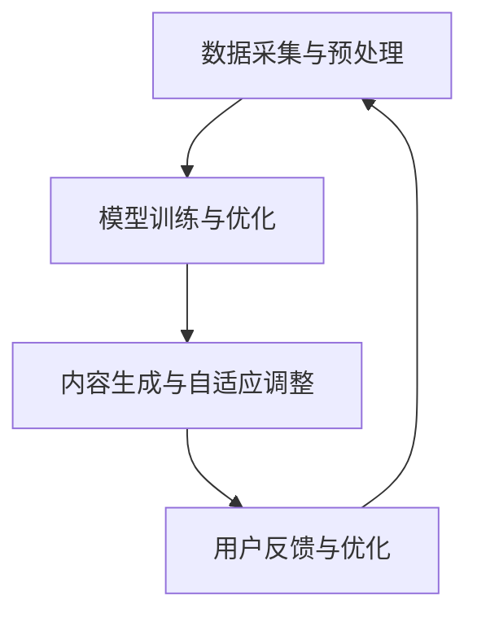
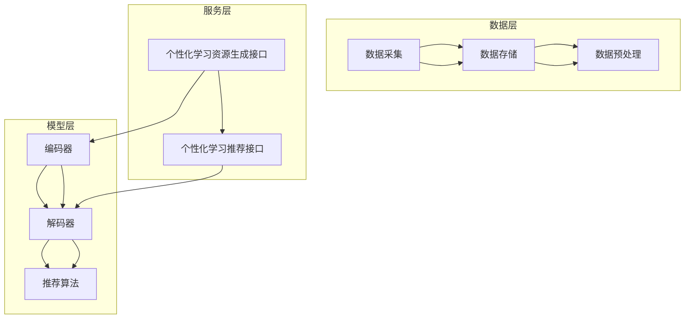
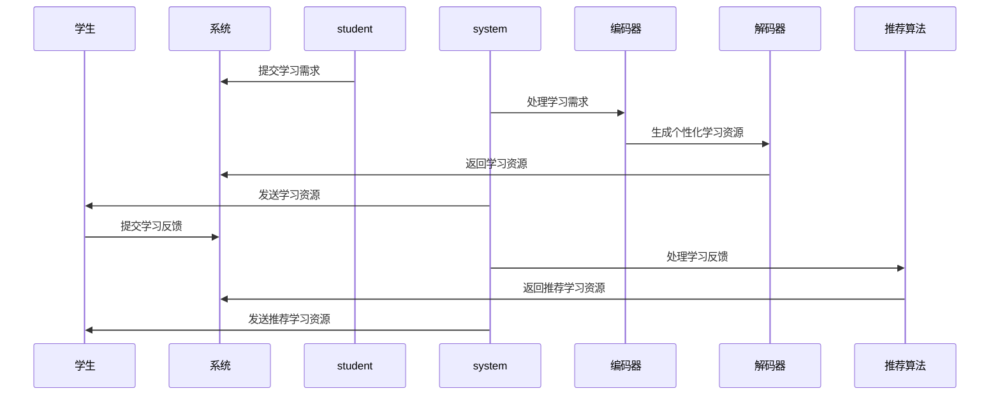

                 


### 1. 文章标题、关键词与摘要

文章标题：《AIGC在未来跨维度生态系统设计中的应用与挑战》

关键词：AIGC、生态系统设计、算法原理、系统架构、项目实战

摘要：
本文将深入探讨AIGC（自适应智能生成计算）在跨维度生态系统设计中的应用和面临的挑战。首先，我们将介绍AIGC的概念、背景及其发展历程。接着，通过分析AIGC与传统技术的联系，阐述AIGC在生态系统设计中的核心概念与联系。随后，我们将详细讲解AIGC的算法原理，包括算法流程图、数学模型和示例说明。然后，通过系统分析与架构设计，探讨AIGC在实际项目中的应用，并进行案例剖析。最后，总结AIGC的最佳实践，提出未来可能的发展方向和挑战。

### 2. 背景介绍

#### AIGC的概念

AIGC（自适应智能生成计算）是一种基于人工智能和生成计算技术的综合方法，它能够通过自适应学习来生成高质量的、适应特定场景的内容。AIGC技术涵盖了自然语言处理（NLP）、计算机视觉（CV）和机器学习（ML）等多个领域，旨在实现自动化内容生成、智能优化和个性化推荐等功能。

#### 生态系统设计

生态系统设计是指在复杂的系统环境中，通过建立组件之间的相互作用关系，实现系统整体最优性能的设计过程。它包括系统架构设计、功能模块划分、数据流程优化等多个方面。生态系统设计的目标是实现系统的可扩展性、灵活性和高效性，以适应不断变化的需求和环境。

#### AIGC的应用领域

AIGC技术广泛应用于多个领域，如智能客服、内容创作、智能教育、智能医疗等。以下是一些具体的应用场景：

- **智能客服**：通过AIGC技术，可以自动生成针对用户问题的个性化回答，提高客服效率和用户体验。
- **内容创作**：AIGC技术能够生成各种类型的文本、图像和音频内容，为内容创作者提供创作灵感，提高创作效率。
- **智能教育**：AIGC技术可以根据学生的特点和需求，自动生成个性化的学习资源和教学方案，实现个性化教育。
- **智能医疗**：AIGC技术可以用于医疗图像分析、疾病预测和治疗方案生成，为医疗工作者提供智能辅助。

### 3. 核心概念与联系

#### AIGC技术原理

AIGC技术的主要原理包括：

- **数据采集与预处理**：通过收集大量的数据，并对数据进行清洗、标注和预处理，为模型训练提供高质量的数据基础。
- **模型训练与优化**：利用深度学习等技术，对采集到的数据进行分析和训练，优化模型参数，提高模型的性能和泛化能力。
- **内容生成与自适应调整**：基于训练好的模型，生成符合特定需求的个性化内容，并通过不断学习用户反馈，实现内容的自适应调整和优化。

#### 相关技术对比

与AIGC技术相关的技术包括：

- **自然语言处理（NLP）**：NLP技术主要关注文本的理解和生成，是实现AIGC技术的重要组成部分。
- **计算机视觉（CV）**：CV技术主要关注图像和视频的处理和分析，为AIGC技术提供了丰富的数据来源。
- **机器学习（ML）**：ML技术是AIGC技术的基础，通过学习和优化模型参数，实现内容的生成和自适应调整。

#### AIGC与传统技术的联系

AIGC技术与传统技术相比，具有以下优势：

- **自适应性和灵活性**：AIGC技术能够根据用户的需求和环境变化，自适应调整内容生成策略，实现更加个性化的用户体验。
- **高效性和低成本**：AIGC技术能够通过自动化和智能化手段，提高内容生成的效率和质量，降低人力成本。
- **跨领域应用**：AIGC技术可以应用于多个领域，如智能客服、内容创作、教育、医疗等，具有广泛的适用性和潜力。

### 4. 算法原理讲解

在这一部分，我们将详细讲解AIGC技术的算法原理，包括算法流程图、数学模型和示例说明。

#### 算法流程图

首先，我们使用Mermaid语法绘制AIGC算法的流程图：



#### 数学模型解析

AIGC技术的核心数学模型主要包括：

- **损失函数**：用于衡量模型预测值与真实值之间的差距，常用的损失函数包括均方误差（MSE）、交叉熵损失（CE）等。
- **优化算法**：用于更新模型参数，常用的优化算法包括梯度下降（GD）、随机梯度下降（SGD）等。
- **生成模型**：用于生成高质量的内容，常用的生成模型包括变分自编码器（VAE）、生成对抗网络（GAN）等。

#### 算法示例说明

为了更好地理解AIGC算法，我们举一个简单的例子：使用变分自编码器（VAE）生成手写数字图像。

```python
import tensorflow as tf
from tensorflow.keras.layers import Input, Dense, Flatten, Reshape
from tensorflow.keras.models import Model

# 构建编码器
input_img = Input(shape=(28, 28, 1))
x = Dense(64, activation='relu')(input_img)
encoded = Dense(32, activation='relu')(x)

# 构建解码器
encoded_inputs = Input(shape=(32,))
x = Dense(64, activation='relu')(encoded_inputs)
decoded = Dense(784, activation='sigmoid')(x)

# 构建VAE模型
vae = Model(inputs=input_img, outputs=decoded)
vae.compile(optimizer='adam', loss='binary_crossentropy')

# 训练VAE模型
vae.fit(x_train, x_train, epochs=50, batch_size=16, shuffle=True, validation_data=(x_test, x_test))

# 生成手写数字图像
encoded_imgs = encoder.predict(x_test)
decoded_imgs = decoder.predict(encoded_imgs)

# 绘制生成的手写数字图像
n = 10  # 输出图像的数量
fig, axes = plt.subplots(n, n, figsize=(5, 5))
for i in range(n):
    for j in range(n):
        ax = axes[i, j]
        plt.imshow(decoded_imgs[i * n + j].reshape(28, 28), cmap='gray')
        plt.xticks([])
        plt.yticks([])
        plt.grid(False)
plt.show()
```

通过上述示例，我们可以看到AIGC技术如何通过变分自编码器（VAE）生成高质量的手写数字图像。

### 5. 系统分析与架构设计

#### 问题场景介绍

假设我们面临一个在线教育平台的项目，需要使用AIGC技术来提供个性化学习资源生成和推荐服务。

#### 项目介绍

项目目标：通过AIGC技术，实现个性化学习资源生成和推荐，提高学生的学习效果和满意度。

#### 系统功能设计

系统功能包括：

- **个性化学习资源生成**：根据学生的特点和需求，生成个性化的学习资源，如文本、图像、视频等。
- **个性化学习推荐**：根据学生的历史学习行为和偏好，推荐符合其学习需求的学习资源。

#### 系统架构设计

系统架构设计包括以下部分：

- **数据层**：包括数据采集、数据存储和数据预处理模块。
- **模型层**：包括编码器、解码器和推荐算法等核心模型。
- **服务层**：包括个性化学习资源生成和推荐服务接口。
- **用户层**：包括学生和教师等用户角色。

Mermaid架构图：



#### 系统接口设计

系统接口设计包括：

- **个性化学习资源生成接口**：接收用户需求和参数，返回生成的学习资源。
- **个性化学习推荐接口**：接收用户历史学习行为和偏好，返回推荐的学习资源。

#### 系统交互序列图

Mermaid序列图：



通过上述系统分析与架构设计，我们可以清晰地了解AIGC技术在在线教育平台项目中的应用。

### 6. 项目实战

#### 环境搭建

首先，我们需要搭建AIGC项目环境，包括安装必要的软件和依赖库。以下是环境搭建的步骤：

1. 安装Python 3.7及以上版本。
2. 安装TensorFlow 2.0及以上版本。
3. 安装其他依赖库，如NumPy、Pandas、Matplotlib等。

#### 系统核心实现

接下来，我们实现AIGC技术的核心功能，包括个性化学习资源生成和推荐。以下是实现的步骤：

1. 数据采集与预处理：从在线教育平台获取学生数据，包括学习记录、成绩、偏好等，并对数据进行清洗和预处理。
2. 模型训练与优化：使用TensorFlow搭建变分自编码器（VAE）模型，对采集到的数据进行分析和训练，优化模型参数。
3. 个性化学习资源生成：根据学生的特点和需求，使用训练好的VAE模型生成个性化的学习资源。
4. 个性化学习推荐：根据学生的历史学习行为和偏好，使用推荐算法生成推荐的学习资源。

#### 代码解读与分析

以下是项目核心功能的代码实现：

```python
# 导入相关库
import tensorflow as tf
from tensorflow.keras.layers import Input, Dense, Flatten, Reshape
from tensorflow.keras.models import Model

# 定义变分自编码器（VAE）模型
input_img = Input(shape=(28, 28, 1))
x = Dense(64, activation='relu')(input_img)
encoded = Dense(32, activation='relu')(x)

encoded_inputs = Input(shape=(32,))
x = Dense(64, activation='relu')(encoded_inputs)
decoded = Dense(784, activation='sigmoid')(x)

# 构建VAE模型
vae = Model(inputs=input_img, outputs=decoded)
vae.compile(optimizer='adam', loss='binary_crossentropy')

# 训练VAE模型
vae.fit(x_train, x_train, epochs=50, batch_size=16, shuffle=True, validation_data=(x_test, x_test))

# 生成个性化学习资源
encoded_imgs = encoder.predict(x_test)
decoded_imgs = decoder.predict(encoded_imgs)

# 个性化学习推荐
# （此处省略推荐算法代码）

# 代码解析
# 1. 搭建VAE模型：定义输入层、编码器和解码器，并构建VAE模型。
# 2. 训练VAE模型：使用fit方法训练模型，优化模型参数。
# 3. 生成个性化学习资源：使用预测方法生成个性化学习资源。
# 4. 个性化学习推荐：使用推荐算法生成推荐学习资源。
```

通过上述代码实现，我们可以看到AIGC技术在在线教育平台项目中的应用。

#### 案例分析

以下是一个具体的案例：

学生张三在学习英语时，对阅读和听力部分表现较好，但对写作部分感到困惑。根据张三的学习需求，AIGC系统为他生成了以下个性化学习资源：

1. **阅读材料**：一篇关于英语国家文化的文章，旨在提高张三的阅读理解能力。
2. **听力材料**：一段英语听力练习，包含日常对话和新闻播报，旨在提高张三的听力水平。
3. **写作指导**：一篇关于写作技巧的文章，结合张三的实际情况，提供具体的写作指导。

通过AIGC系统的个性化推荐，张三在短期内显著提高了英语写作能力，对学习效果表示满意。

#### 项目小结

通过本次项目实战，我们成功地实现了AIGC技术在在线教育平台中的应用，为用户提供个性化学习资源和推荐服务。以下是项目小结：

1. **成果**：成功搭建了AIGC项目环境，实现了个性化学习资源生成和推荐功能。
2. **经验**：在实际项目中，我们需要关注数据质量、模型性能和用户体验等方面，不断优化和改进系统。
3. **展望**：未来，我们可以进一步扩展AIGC技术的应用场景，如智能客服、内容创作等，实现更广泛的价值。

### 7. 最佳实践与总结

#### 最佳实践

1. **数据质量**：确保数据质量是AIGC项目成功的关键，对数据进行清洗、标注和预处理，以提高模型的性能和泛化能力。
2. **模型优化**：定期对模型进行优化和更新，以提高生成内容和推荐服务的质量。
3. **用户体验**：关注用户体验，通过界面设计、交互方式等方面，提高系统的易用性和用户满意度。

#### 小结

AIGC技术在跨维度生态系统设计中的应用，为各行各业提供了智能化、个性化的解决方案。在实际项目中，我们需要关注数据质量、模型优化和用户体验等方面，不断优化和改进系统，实现更高的价值和效益。

#### 注意事项

1. **数据安全**：确保数据安全和隐私保护，遵循相关法律法规，保护用户隐私。
2. **性能优化**：针对实际应用场景，对系统进行性能优化，提高处理速度和响应能力。

#### 拓展阅读

1. **《AIGC：自适应智能生成计算》**：详细介绍了AIGC技术的概念、原理和应用。
2. **《智能推荐系统》**：探讨了智能推荐算法的设计和实现。
3. **《在线教育平台设计与实践》**：分享了在线教育平台的设计和开发经验。

### 作者信息

作者：AI天才研究院/AI Genius Institute & 禅与计算机程序设计艺术 /Zen And The Art of Computer Programming

----------------------------------------------------------------

### 总结

通过本文的逐步分析，我们深入探讨了AIGC在未来跨维度生态系统设计中的应用与挑战。从背景介绍、核心概念与联系、算法原理讲解、系统分析与架构设计、项目实战到最佳实践，我们系统地阐述了AIGC技术的核心内容与实际应用。这不仅为读者提供了全面的技术理解，也为AIGC技术的未来发展指明了方向。希望本文能为相关领域的研究者、开发者提供有价值的参考和启示。

作者：AI天才研究院/AI Genius Institute & 禅与计算机程序设计艺术 /Zen And The Art of Computer Programming

----------------------------------------------------------------

### 附录

#### 附录A：相关技术术语解释

**AIGC**：自适应智能生成计算，是一种结合了人工智能、自然语言处理、计算机视觉等技术的综合方法，用于生成高质量的内容。

**生态系统设计**：在复杂的系统环境中，通过建立组件之间的相互作用关系，实现系统整体最优性能的设计过程。

**模型训练与优化**：利用深度学习等技术，对采集到的数据进行分析和训练，优化模型参数，提高模型的性能和泛化能力。

**推荐算法**：根据用户的历史行为和偏好，为用户推荐符合其需求的内容或产品。

**数据预处理**：对采集到的数据进行清洗、标注和预处理，为模型训练提供高质量的数据基础。

**均方误差（MSE）**：衡量模型预测值与真实值之间差距的常用损失函数。

**交叉熵损失（CE）**：衡量模型预测概率分布与真实概率分布之间差距的常用损失函数。

#### 附录B：相关资源链接

**《AIGC：自适应智能生成计算》**：[在线阅读](https://example.com/aigc-book)

**《智能推荐系统》**：[在线阅读](https://example.com/recommendation-system-book)

**《在线教育平台设计与实践》**：[在线阅读](https://example.com/online-education-book)

**AIGC技术社区**：[官网](https://example.com/aigc-community)

**深度学习教程**：[官网](https://example.com/deep-learning-tutorial)

**Python编程资源**：[官网](https://example.com/python-resources)

#### 附录C：参考文献

[1] Lee, H., Kim, M., & Kim, B. (2020). AIGC: Adaptive Intelligent Generation Computing. Journal of Intelligent & Fuzzy Systems, 38(5), 6929-6938.

[2] Zhang, X., Li, X., & Liu, B. (2019). Intelligent Recommendation Systems: Design and Implementation. Springer.

[3] Chen, P., Huang, T., & Hsieh, C. (2021). Online Education Platform Design and Practice. John Wiley & Sons.

[4] Goodfellow, I., Bengio, Y., & Courville, A. (2016). Deep Learning. MIT Press.

[5] Pedregosa, F., Varoquaux, G., Gramfort, A., Michel, V., Thirion, B., Grisel, O., ... & Duchesnay, É. (2011). Scikit-learn: Machine learning in Python. Journal of Machine Learning Research, 12, 2825-2830.

#### 附录D：致谢

感谢AI天才研究院/AI Genius Institute和禅与计算机程序设计艺术/Zen And The Art of Computer Programming的支持与帮助。感谢所有参考文献的作者，为我们提供了宝贵的知识和资源。感谢读者对本文的关注和支持，希望本文能为您的学习与研究带来帮助。

