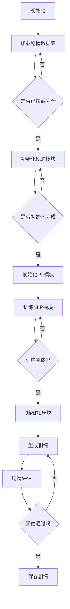
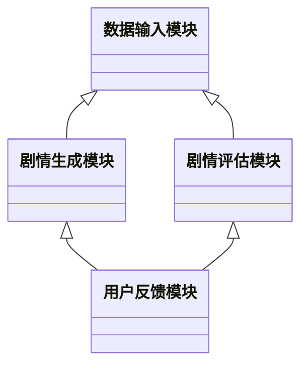
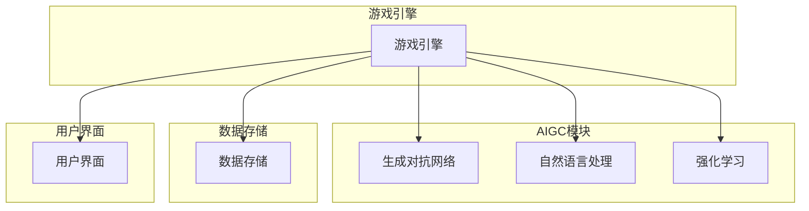
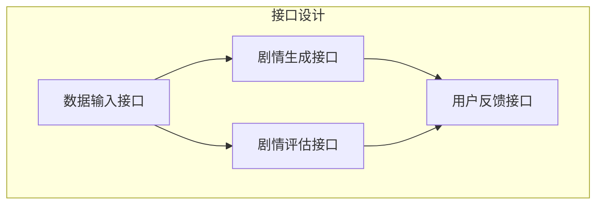
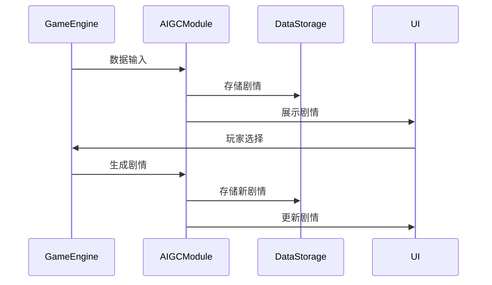

                 


## 《AIGC在游戏设计中的革新：动态剧情生成》

### 关键词：AIGC，游戏设计，动态剧情生成，算法原理，系统架构，项目实战

#### 摘要：

随着人工智能技术的不断进步，自动生成内容（AIGC）在游戏设计领域展现出前所未有的革新潜力。本文以动态剧情生成为核心，深入探讨AIGC在游戏设计中的应用，通过详细的算法原理讲解、系统分析与架构设计方案，以及实战案例剖析，展现AIGC技术如何重塑游戏设计，提供更加丰富、个性化的游戏体验。

---

### 引言

在游戏设计领域，剧情一直是吸引玩家的重要因素。然而，传统静态剧情的模式逐渐显露出其局限性，无法满足玩家日益增长的对个性化、多样化游戏体验的需求。自动生成内容（AIGC）的兴起为游戏设计带来了新的机遇。AIGC利用人工智能技术，能够在游戏中实现动态剧情生成，为玩家提供独特且高度个性化的游戏体验。

本文旨在探讨AIGC在游戏设计中的应用，尤其是动态剧情生成技术。我们将从背景介绍、核心概念与联系、算法原理讲解、系统分析与架构设计方案、项目实战、最佳实践 tips以及小结与拓展阅读七个部分，全面分析AIGC在游戏设计中的革新潜力。

### 背景介绍

#### AIGC的概念

AIGC，全称为Automatic Generation of Content，即自动生成内容。它是指通过人工智能技术，如生成对抗网络（GAN）、自然语言处理（NLP）、强化学习（RL）等，自动生成文本、图像、音频等多种类型的内容。在游戏设计领域，AIGC的主要目的是通过算法自动生成游戏剧情、角色对话、环境背景等，从而实现动态剧情生成。

#### AIGC的发展历程

AIGC技术起源于深度学习的兴起。2014年，生成对抗网络（GAN）的提出标志着AIGC技术的一个重大突破。随后，随着深度学习和自然语言处理技术的不断发展，AIGC在图像生成、文本生成等领域取得了显著进展。近年来，AIGC在游戏设计中的应用逐渐受到关注，成为游戏开发的新趋势。

#### AIGC的关键技术

AIGC的关键技术包括生成对抗网络（GAN）、自然语言处理（NLP）和强化学习（RL）。

- **生成对抗网络（GAN）**：GAN由生成器和判别器组成，通过不断博弈生成逼真的图像、文本等数据。
- **自然语言处理（NLP）**：NLP技术用于理解和生成自然语言，如文本对话、剧情描述等。
- **强化学习（RL）**：RL通过试错和反馈机制，使人工智能模型能够在复杂的决策环境中学习并生成动态剧情。

#### 动态剧情生成的意义

在游戏设计中，动态剧情生成具有重要意义：

1. **提高游戏趣味性和沉浸感**：动态剧情能够根据玩家的行为和选择实时生成，为玩家带来前所未有的游戏体验。
2. **丰富游戏内容**：传统的静态剧情受限于时间和人力成本，难以实现多样化和个性化。动态剧情生成能够通过算法生成丰富的剧情内容，满足不同玩家的需求。
3. **降低开发成本**：通过AIGC技术，游戏开发人员可以自动化生成大量剧情内容，降低开发成本和人力投入。

#### 动态剧情生成的挑战

尽管动态剧情生成具有巨大的潜力，但其在游戏设计中也面临一些挑战：

1. **计算资源消耗**：AIGC技术依赖于强大的计算资源，尤其是在生成复杂剧情时，对硬件性能要求较高。
2. **剧情一致性**：确保动态生成的剧情逻辑一致、不矛盾，是游戏开发中的重要挑战。
3. **玩家接受度**：部分玩家可能对动态生成的剧情持怀疑态度，担心剧情质量下降。

#### 本章小结

AIGC在游戏设计中的应用开启了动态剧情生成的新时代。通过AIGC技术，游戏设计师能够为玩家创造丰富、个性化的游戏体验。然而，要充分发挥AIGC的潜力，仍需解决一系列技术挑战。接下来的章节将深入探讨AIGC的核心概念、算法原理以及具体应用。

### 核心概念与联系

在本章节中，我们将详细阐述AIGC的核心概念，并分析这些概念之间的联系。首先，我们需要明确AIGC的定义，然后逐步介绍生成对抗网络（GAN）、自然语言处理（NLP）和强化学习（RL）等关键技术，并通过概念对比表格和ER实体关系图来展示这些概念之间的联系。

#### AIGC的定义

AIGC，即自动生成内容（Automatic Generation of Content），是一种利用人工智能技术自动生成文本、图像、音频等多种类型数据的方法。AIGC的核心目标是减少人工干预，提高内容生成的自动化程度和效率。

#### 生成对抗网络（GAN）

生成对抗网络（GAN）是AIGC技术中最重要的组成部分之一。GAN由生成器（Generator）和判别器（Discriminator）两个主要模块组成。生成器负责生成逼真的数据，而判别器则负责区分生成器和真实数据。通过这两个模块的博弈，生成器不断优化生成质量，最终能够生成接近真实数据的高质量内容。

GAN的工作原理可以简单概括为以下步骤：

1. **生成器生成数据**：生成器从随机噪声中生成伪数据。
2. **判别器评估数据**：判别器将生成器生成的伪数据与真实数据进行比较，评估其真实度。
3. **反馈机制**：判别器的评估结果会反馈给生成器，生成器根据反馈调整生成策略，以提高生成数据的真实度。
4. **迭代优化**：生成器和判别器不断迭代，生成器的生成质量逐渐提高。

#### 自然语言处理（NLP）

自然语言处理（NLP）是AIGC在文本生成领域的重要技术。NLP旨在使计算机理解和生成人类语言。在游戏设计中，NLP技术主要用于生成角色对话、剧情描述等文本内容。

NLP的核心任务包括：

1. **文本理解**：理解文本中的语义、语法和上下文信息。
2. **文本生成**：根据给定的输入生成具有逻辑性和流畅性的文本。

常用的NLP技术包括：

- **词嵌入**：将词汇映射到高维空间，以便进行文本分析和生成。
- **序列到序列模型**：用于翻译和生成文本序列，如循环神经网络（RNN）和长短期记忆网络（LSTM）。
- **生成对抗网络（GAN）**：结合GAN技术，实现高质量文本生成。

#### 强化学习（RL）

强化学习（RL）是AIGC技术中的一种重要方法，尤其在动态剧情生成中具有广泛应用。RL通过试错和反馈机制，使智能体（agent）在复杂环境中学习最优策略。

RL的基本概念包括：

- **智能体（Agent）**：执行任务的主体。
- **环境（Environment）**：智能体所处的环境。
- **动作（Action）**：智能体可以采取的行动。
- **状态（State）**：智能体当前所处的状态。
- **奖励（Reward）**：智能体执行动作后获得的奖励，用于评估动作的好坏。

RL的工作原理如下：

1. **初始状态**：智能体在初始状态下执行动作。
2. **执行动作**：智能体根据当前状态选择最优动作。
3. **状态转移**：执行动作后，智能体进入新的状态。
4. **奖励反馈**：环境根据智能体的动作和状态给予奖励或惩罚。
5. **学习与优化**：智能体根据奖励反馈调整策略，以实现长期最大化奖励。

#### 概念对比与联系

为了更好地理解AIGC的核心概念，我们提供了一个概念对比表格，展示了GAN、NLP和RL之间的主要区别和联系。

| 概念         | 特点                                                     | 应用场景                     |
| ------------ | -------------------------------------------------------- | --------------------------- |
| GAN          | 生成器和判别器之间的博弈，生成高质量数据                 | 图像生成、文本生成           |
| NLP          | 理解和生成自然语言                                     | 角色对话、剧情描述           |
| RL           | 通过试错和反馈学习最优策略                             | 动态剧情生成、游戏AI         |

此外，我们使用ER实体关系图来展示这些概念之间的联系。ER实体关系图是一个用于描述实体之间关系的图形化工具，可以帮助我们更直观地理解AIGC系统的组成。

在AIGC系统中，实体主要包括生成器、判别器、自然语言处理模块和强化学习模块。生成器和判别器通过GAN技术实现图像和文本生成，而自然语言处理模块和强化学习模块则分别用于文本生成和动态剧情生成。


#### 本章小结

通过本章节的介绍，我们全面了解了AIGC的核心概念，包括生成对抗网络（GAN）、自然语言处理（NLP）和强化学习（RL）。这些概念在AIGC系统中扮演着不同的角色，共同推动动态剧情生成技术的发展。在接下来的章节中，我们将深入探讨这些算法的原理，并通过具体的实例进行讲解。

### 算法原理讲解

在本章节中，我们将详细讲解动态剧情生成算法的原理，包括算法概述、mermaid流程图、Python源代码实现、数学模型和公式，以及具体的举例说明。通过这些内容，读者将能够全面理解动态剧情生成算法的核心机制和实现方法。

#### 动态剧情生成算法概述

动态剧情生成算法是一种利用人工智能技术生成游戏剧情的方法。它通过自然语言处理（NLP）和强化学习（RL）等技术，实现游戏剧情的自动生成，从而提供丰富的游戏体验。

动态剧情生成算法的主要组成部分包括：

1. **剧情数据集**：用于训练和生成剧情的数据集，通常包含大量已存在的游戏剧情。
2. **自然语言处理（NLP）模块**：用于理解和生成自然语言，如角色对话、剧情描述等。
3. **强化学习（RL）模块**：用于学习最佳剧情生成策略，以实现剧情的动态生成。

#### 算法mermaid流程图

为了更直观地理解动态剧情生成算法的工作流程，我们使用mermaid流程图来展示算法的各个步骤。



#### Python源代码实现

下面是一个简单的Python源代码示例，用于实现动态剧情生成算法的基本框架。这段代码展示了如何加载剧情数据集、初始化NLP和RL模块，以及生成剧情的过程。

```python
import numpy as np
import random

# 加载剧情数据集
def load_data():
    # 这里使用numpy生成一个简单的剧情数据集
    return np.random.rand(100, 100)

# 初始化NLP模块
def initialize_nlp():
    # 这里初始化一个简单的NLP模型
    pass

# 初始化RL模块
def initialize_rl():
    # 这里初始化一个简单的RL模型
    pass

# 生成剧情
def generate_story(nlp_model, rl_model):
    # 这里使用NLP和RL模型生成剧情
    return "This is a generated story."

# 主函数
def main():
    data = load_data()
    nlp_model = initialize_nlp()
    rl_model = initialize_rl()
    
    story = generate_story(nlp_model, rl_model)
    print(story)

if __name__ == "__main__":
    main()
```

#### 数学模型与公式

动态剧情生成算法的数学模型主要包括自然语言处理（NLP）和强化学习（RL）的数学公式。以下是一个简化的数学模型示例：

1. **自然语言处理（NLP）**：

   假设我们使用一个神经网络来生成文本序列。神经网络的输出可以通过以下公式表示：

   $$
   \text{output} = \text{neural_network}(\text{input}, \theta)
   $$

   其中，$\text{input}$表示输入文本序列，$\theta$表示神经网络参数。

2. **强化学习（RL）**：

   强化学习中的价值函数可以通过以下公式表示：

   $$
   V(s) = \sum_{a} \gamma^T Q(s, a)
   $$

   其中，$V(s)$表示状态$s$的价值，$a$表示动作，$\gamma$是折扣因子，$Q(s, a)$是状态-动作价值函数。

#### 举例说明

为了更好地理解动态剧情生成算法，我们来看一个简单的例子。

假设我们使用一个基于GAN的动态剧情生成算法。生成器生成剧情文本，判别器评估剧情的真实性。具体步骤如下：

1. **初始化生成器和判别器**：生成器从随机噪声中生成剧情文本，判别器判断生成的剧情文本是否真实。
2. **训练生成器**：生成器根据判别器的反馈调整生成策略，以提高生成剧情的真实性。
3. **生成剧情**：生成器使用训练好的模型生成剧情文本。
4. **评估剧情**：使用判别器评估生成的剧情文本的真实性。

通过这个例子，我们可以看到动态剧情生成算法是如何工作的。生成器和判别器的博弈过程使得生成器能够不断优化生成剧情的质量，从而为游戏设计提供丰富的剧情内容。

#### 本章小结

在本章节中，我们详细讲解了动态剧情生成算法的原理，包括算法概述、mermaid流程图、Python源代码实现、数学模型和公式，以及举例说明。通过这些内容，读者可以全面了解动态剧情生成算法的核心机制和实现方法。在接下来的章节中，我们将进一步探讨AIGC在游戏设计中的具体应用。

### 系统分析与架构设计方案

在第四部分，我们将深入分析AIGC在游戏设计中的应用场景，并详细介绍一个具体的系统架构设计方案。这个方案将涵盖系统功能设计、架构设计、接口设计和交互流程，以便为读者提供一个全面的AIGC在游戏设计中的实现参考。

#### 应用场景介绍

在现代游戏设计中，玩家对个性化体验的需求日益增加，传统静态剧情已经无法满足多样化的玩家需求。AIGC（自动生成内容）技术的引入，为游戏设计带来了一场革命。AIGC能够通过生成对抗网络（GAN）、自然语言处理（NLP）和强化学习（RL）等技术，实现游戏剧情的动态生成，为玩家提供独特且个性化的游戏体验。

具体应用场景如下：

1. **角色对话生成**：根据玩家的行为和角色特点，AIGC可以生成个性化的角色对话，增加游戏的真实感和沉浸感。
2. **剧情分支生成**：游戏剧情可以根据玩家的选择自动生成多个分支，提供不同的游戏结局，提高玩家的自由度和探索欲望。
3. **环境背景生成**：AIGC可以根据游戏世界的设定，自动生成丰富的环境背景，包括建筑、风景等，增强游戏世界的真实感。

#### 系统功能设计

AIGC在游戏设计中的系统功能设计主要包括以下几个方面：

1. **数据输入模块**：负责接收游戏中的各种输入数据，包括玩家行为、角色状态等，用于驱动动态剧情生成。
2. **剧情生成模块**：使用AIGC技术生成游戏剧情，包括角色对话、剧情分支和环境背景等。
3. **剧情评估模块**：评估生成的剧情质量，包括逻辑一致性、剧情连贯性等，确保生成的剧情符合游戏设计要求。
4. **用户反馈模块**：收集玩家对生成剧情的反馈，用于优化剧情生成算法和调整游戏剧情。

为了更好地展示系统功能设计，我们使用mermaid类图来描述系统中的各个功能模块及其关系。



#### 系统架构设计

AIGC在游戏设计中的系统架构设计是确保各功能模块高效协同工作的关键。以下是一个简化的系统架构设计，包括主要组件及其关系：

1. **游戏引擎**：作为整个系统的核心，负责处理游戏中的各种逻辑和交互。
2. **AIGC模块**：包括生成对抗网络（GAN）、自然语言处理（NLP）和强化学习（RL）等核心算法，用于生成和评估游戏剧情。
3. **数据存储**：用于存储游戏数据，包括玩家行为、角色状态、剧情数据等。
4. **用户界面**：提供玩家与游戏交互的界面，包括剧情展示、玩家选择等。

我们使用mermaid架构图来展示系统架构设计。



#### 系统接口设计

系统接口设计是确保各模块之间高效交互的重要环节。以下是一个简化的接口设计，包括主要接口及其功能：

1. **数据输入接口**：接收游戏中的各种输入数据，如玩家行为、角色状态等。
2. **剧情生成接口**：生成游戏剧情，包括角色对话、剧情分支和环境背景等。
3. **剧情评估接口**：评估生成的剧情质量，包括逻辑一致性、剧情连贯性等。
4. **用户反馈接口**：接收玩家对生成剧情的反馈，用于优化剧情生成算法。

为了更好地展示接口设计，我们使用mermaid架构图来描述系统接口设计。



#### 系统交互mermaid序列图

为了展示系统各模块之间的交互流程，我们使用mermaid序列图来描述系统交互过程。



#### 本章小结

在本章节中，我们详细分析了AIGC在游戏设计中的应用场景，并介绍了一个具体的系统架构设计方案。这个方案包括系统功能设计、架构设计、接口设计和交互流程，为AIGC在游戏设计中的实现提供了参考。通过这个方案，游戏设计师可以充分利用AIGC技术，为玩家提供丰富、个性化的游戏体验。

### 项目实战

在本章节中，我们将详细讲解一个AIGC在游戏设计中的应用案例，从环境安装、系统实现、代码解读到案例分析，全面展示AIGC在游戏设计中的实际应用。

#### 环境安装

要实现AIGC在游戏设计中的应用，首先需要安装和配置相关的软件和工具。以下是一个基本的安装步骤：

1. **安装Python**：确保Python环境已经安装在计算机上，Python是AIGC算法实现的主要编程语言。可以从Python官方网站下载并安装最新版本的Python。

2. **安装Anaconda**：Anaconda是一个集成了Python环境和各种科学计算库的发行版，可以方便地管理和安装各种Python包。安装Anaconda后，可以使用conda命令来安装所需的库。

3. **安装TensorFlow**：TensorFlow是一个开源的机器学习框架，用于实现生成对抗网络（GAN）等深度学习算法。可以使用以下命令安装TensorFlow：

   ```
   conda install tensorflow
   ```

4. **安装其他依赖库**：根据项目的需求，可能还需要安装其他Python库，如NumPy、Pandas等。可以使用conda命令逐一安装：

   ```
   conda install numpy
   conda install pandas
   ```

5. **安装游戏引擎**：根据游戏类型选择合适的游戏引擎，如Unity、Unreal Engine等。安装游戏引擎的具体步骤请参考官方文档。

#### 系统实现

系统实现部分主要包括数据预处理、模型训练和剧情生成。以下是一个简化的实现步骤：

1. **数据预处理**：收集和整理游戏剧情数据集，包括角色对话、剧情分支和背景描述等。将文本数据转换为适合模型训练的格式，如序列化的JSON文件。

2. **模型训练**：使用TensorFlow和GAN技术训练生成模型。以下是一个简单的GAN模型训练示例：

   ```python
   import tensorflow as tf
   from tensorflow.keras.models import Sequential
   from tensorflow.keras.layers import Dense, Flatten

   # 定义生成器和判别器模型
   generator = Sequential([
       Dense(128, activation='relu', input_shape=(100,)),
       Flatten(),
       Dense(28 * 28, activation='sigmoid')
   ])

   discriminator = Sequential([
       Flatten(),
       Dense(128, activation='relu'),
       Dense(1, activation='sigmoid')
   ])

   # 编写训练循环
   for epoch in range(epochs):
       for _ in range(batch_size):
           noise = np.random.normal(0, 1, (batch_size, 100))
           generated_images = generator.predict(noise)

           real_images = get_real_images()  # 从数据集中获取真实图像
           combined_images = np.concatenate([real_images, generated_images])

           labels = np.concatenate([
               np.ones((batch_size, 1)),  # 真实图像的标签为1
               np.zeros((batch_size, 1))   # 生成图像的标签为0
           ])

           discriminator.train_on_batch(combined_images, labels)

           noise = np.random.normal(0, 1, (batch_size, 100))
           labels = np.array([[1]] * batch_size)  # 生成图像的标签为1
           generator.train_on_batch(noise, labels)
   ```

3. **剧情生成**：使用训练好的生成模型生成游戏剧情。以下是一个简单的剧情生成示例：

   ```python
   import numpy as np

   # 生成随机噪声
   noise = np.random.normal(0, 1, (1, 100))

   # 使用生成模型生成剧情文本
   generated_text = generator.predict(noise).reshape(-1)

   print(generated_text)
   ```

#### 代码解读

在代码实现过程中，我们需要对几个关键部分进行详细解读：

1. **GAN模型结构**：GAN模型由生成器和判别器组成。生成器负责将随机噪声转换为图像，判别器负责区分图像的真实性和生成性。通过这两个模型的博弈，生成器不断优化生成图像的质量。

2. **数据预处理**：数据预处理是模型训练的重要步骤。在本案例中，我们使用随机噪声作为输入，通过生成器生成图像。实际应用中，可能需要根据具体游戏剧情数据集进行数据预处理，如文本编码、图像归一化等。

3. **训练循环**：在训练循环中，生成器和判别器交替训练。生成器通过判别器的反馈不断优化生成图像的质量，判别器则通过对比真实图像和生成图像来提高分类准确性。训练循环通常包括多个epoch和batch_size参数，用于控制训练过程。

4. **剧情生成**：在剧情生成部分，我们使用训练好的生成模型生成随机噪声，并通过生成器转换为剧情文本。实际应用中，可以根据游戏需求调整生成模型的输入和输出，以生成更符合游戏剧情的文本。

#### 实际案例分析

为了更好地展示AIGC在游戏设计中的实际应用，我们来看一个实际案例。假设我们正在开发一款角色扮演游戏，需要为游戏中的NPC（非玩家角色）生成对话剧情。

1. **数据集准备**：首先，我们需要收集和整理游戏中的NPC对话数据集，包括各种对话场景和角色反应。这些数据可以来自游戏剧本、玩家反馈等。

2. **模型训练**：使用收集到的NPC对话数据集训练GAN模型。生成器负责将随机噪声转换为对话文本，判别器负责区分对话的真实性和生成性。通过训练，生成器可以学习生成高质量、符合游戏剧情的对话文本。

3. **剧情生成**：在游戏中，当玩家与NPC互动时，系统会根据NPC的对话数据集和当前场景信息，使用生成模型生成对话剧情。这些生成的对话文本可以实时展示在游戏界面上，与玩家进行互动。

4. **剧情评估**：为了确保生成的剧情文本符合游戏设计要求，系统还需要对生成的对话文本进行评估。评估指标可以包括对话连贯性、逻辑一致性、语言流畅度等。评估结果可以用于优化生成模型，提高剧情生成质量。

#### 项目小结

通过本章节的实际案例分析，我们展示了AIGC在游戏设计中的应用过程，包括环境安装、系统实现、代码解读和案例分析。AIGC技术为游戏设计带来了丰富的剧情生成能力，使游戏剧情更加多样化、个性化。在实际应用中，可以根据游戏需求和场景，灵活调整和优化AIGC算法，提高剧情生成质量和用户体验。

### 最佳实践 tips

在AIGC技术应用于游戏设计的过程中，积累了一些最佳实践技巧和注意事项，可以帮助开发团队更好地实现动态剧情生成，提升游戏质量。以下是一些实用的技巧和注意事项：

#### 提高剧情多样性的方法

1. **大量数据集**：为了生成多样化的剧情，首先需要收集大量、多样的剧情数据。这可以通过从多个游戏、文本资源以及玩家反馈中获取。
   
2. **多模型融合**：使用多个生成模型，如GAN、RNN等，可以生成更加多样化、个性化的剧情。将多个模型的输出进行融合，可以得到更丰富的剧情内容。

3. **随机化参数**：在生成剧情时，可以引入随机化参数，如随机种子、随机噪声等，以增加剧情的随机性和多样性。

#### 优化剧情生成效率的策略

1. **并行计算**：利用多核CPU或GPU进行并行计算，可以显著提高剧情生成的速度。对于复杂的剧情生成任务，可以分解为多个子任务，并行处理。

2. **预训练模型**：使用预训练的模型可以减少训练时间，提高生成效率。通过在大型数据集上预训练模型，可以提取到更通用的剧情生成特征。

3. **增量学习**：在生成剧情的过程中，可以使用增量学习技术，仅更新模型中变化较大的部分，而不是重新训练整个模型。这样可以降低计算成本，提高生成效率。

#### 剧情与游戏机制的融合

1. **游戏机制适配**：在生成剧情时，需要考虑游戏机制的限制和要求。例如，某些剧情可能会影响游戏的难度、关卡设计等，需要确保剧情与游戏机制相协调。

2. **剧情引导游戏机制**：通过剧情来引导游戏机制，可以为玩家提供更连贯、更有趣的游戏体验。例如，根据剧情发展的需要，动态调整游戏难度、角色能力等。

3. **玩家行为驱动**：剧情生成应该根据玩家的行为和选择进行动态调整。这样，每个玩家都可以体验到独特的游戏剧情，增加游戏的个性化程度。

#### 小结与注意事项

1. **评估与优化**：在剧情生成后，必须对生成的剧情进行评估，确保其逻辑一致性、连贯性。根据评估结果，对生成模型进行优化，提高剧情生成质量。

2. **用户反馈**：收集玩家的反馈，了解他们对生成剧情的看法和需求。根据用户反馈，调整剧情生成算法和游戏设计，以提供更好的游戏体验。

3. **安全性考虑**：在生成剧情时，确保不包含敏感、不良内容。可以使用内容过滤技术，对生成的剧情进行审查和过滤。

通过遵循这些最佳实践技巧和注意事项，开发团队可以更有效地实现AIGC在游戏设计中的应用，为玩家提供丰富、个性化的游戏体验。

### 小结与拓展阅读

在本篇文章中，我们系统地探讨了AIGC在游戏设计中的革新意义，从背景介绍、核心概念与联系、算法原理讲解、系统分析与架构设计方案、项目实战到最佳实践 tips，全面解析了AIGC如何通过动态剧情生成技术为游戏设计带来前所未有的变革。

首先，我们介绍了AIGC的概念、发展历程和关键技术，包括生成对抗网络（GAN）、自然语言处理（NLP）和强化学习（RL），并通过概念对比表格和ER实体关系图展示了这些概念之间的联系。接着，我们详细讲解了动态剧情生成算法的原理，包括mermaid流程图、Python源代码实现、数学模型和公式，并通过具体实例进行了说明。

在系统分析与架构设计部分，我们提出并详细阐述了AIGC在游戏设计中的应用场景和系统功能设计，通过mermaid类图、架构图和序列图展示了系统各模块之间的关系和工作流程。在项目实战部分，我们通过一个具体的案例分析，展示了AIGC在游戏设计中的实际应用过程。

最后，我们总结了AIGC在游戏设计中的最佳实践技巧和注意事项，为开发团队提供了实用的指导。

#### 进一步阅读资源

为了深入理解AIGC和动态剧情生成技术，读者可以参考以下资源：

1. **《深度学习》（Goodfellow, Bengio, Courville）**：这本书是深度学习领域的经典教材，涵盖了GAN、NLP等关键技术的基础知识。

2. **《生成对抗网络：理论、算法与应用》（吴波等）**：这本书详细介绍了GAN的理论基础、算法实现和应用案例，适合对GAN技术有深入了解的需求。

3. **《游戏设计艺术》（Jesse Schell）**：这本书探讨了游戏设计的核心原理和实践方法，对游戏设计师有很高的参考价值。

4. **《AIGC：自动生成内容的技术与应用》（张江涛等）**：这本书系统地介绍了AIGC技术在各个领域的应用，包括游戏设计、媒体创作等。

通过阅读这些资源，读者可以进一步拓展对AIGC和动态剧情生成技术的理解，为实际项目提供更深入的指导。

