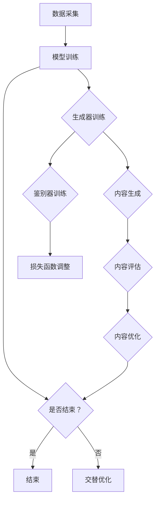
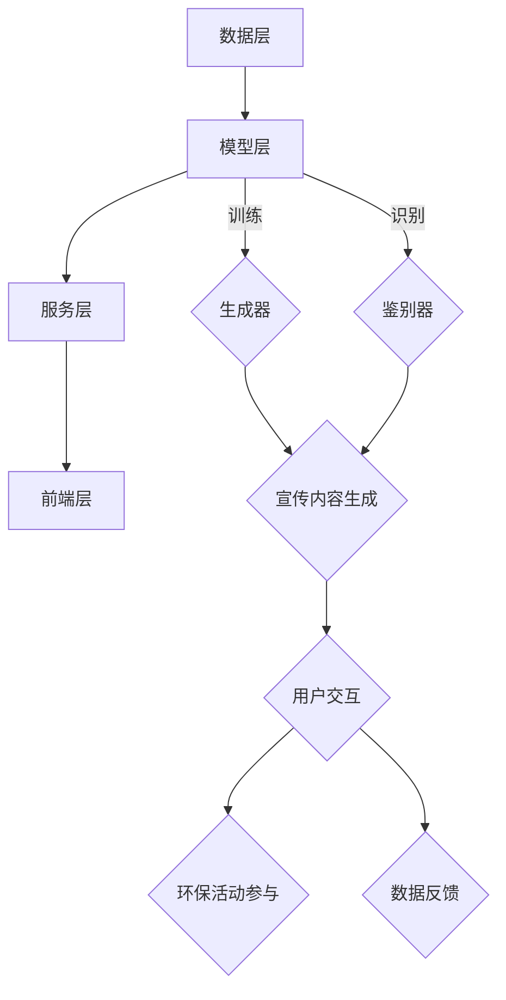
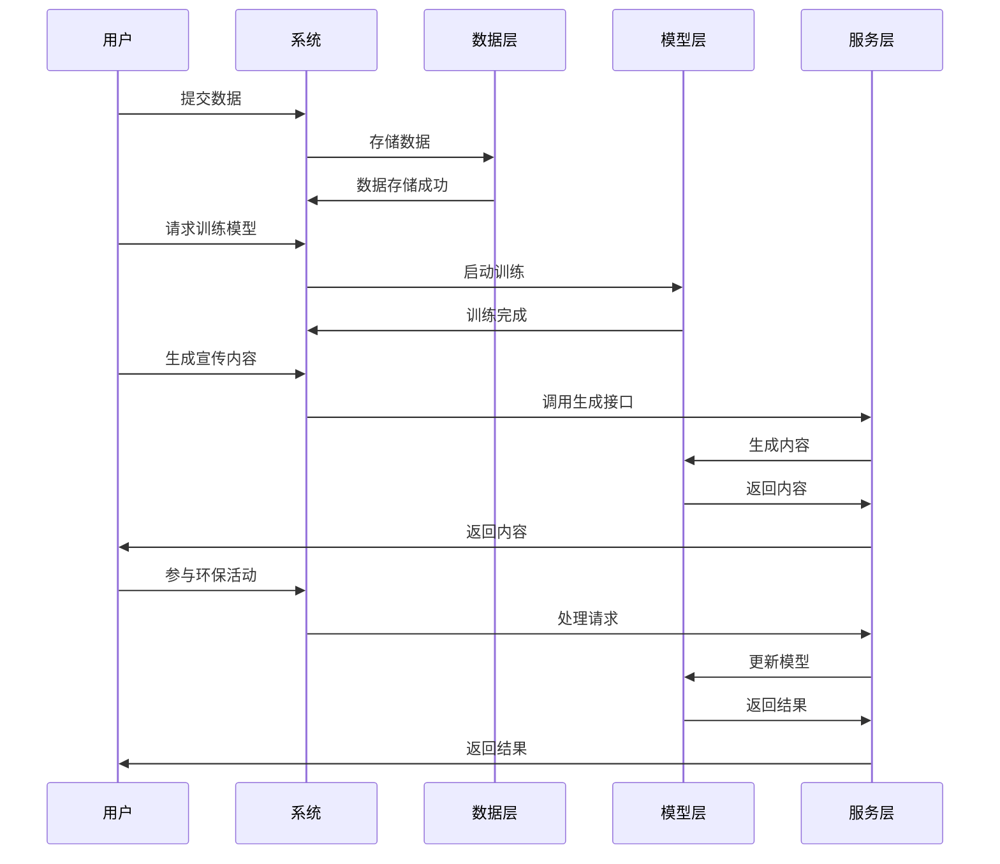

                 

##  # AIGC在环保倡议中的应用：说服力强的宣传提示词

> 关键词：AIGC、环保倡议、宣传提示词、说服力、应用实例

> 摘要：本文旨在探讨人工智能生成内容（AIGC）在环保倡议中的独特应用，通过设计具有说服力的宣传提示词，提高公众参与环保活动的积极性。文章将分步骤分析AIGC技术的原理，探索其在环保宣传中的潜在优势，提供实际案例分析，并总结出一套最佳实践方法。

## 引言

### 背景介绍

在当前的全球变暖、生物多样性减少等环境问题日益严峻的背景下，环保倡议的推广显得尤为重要。传统的环保宣传方式往往依赖于文字、图片等静态内容，而难以激发公众的持续关注和参与。随着人工智能技术的发展，特别是生成对抗网络（GAN）和自然语言处理（NLP）等技术的进步，人工智能生成内容（AIGC）作为一种创新的宣传手段，开始在环保倡议中发挥重要作用。

### 核心概念

- **人工智能生成内容（AIGC）**：AIGC是一种利用人工智能技术自动生成内容的方法，包括文本、图像、音频等多种形式。其核心思想是通过学习和模拟人类创造过程，生成具有高度个性化和创新性的内容。
- **环保倡议**：环保倡议是旨在提高公众环保意识，鼓励参与环保行动的一系列宣传和教育活动。
- **宣传提示词**：宣传提示词是用于吸引公众注意力、激发兴趣和行动的短句或短语，通常具有强烈的说服力和情感色彩。

### 目的和结构

本文将探讨AIGC在环保倡议中的应用，重点关注如何设计具有说服力的宣传提示词。文章结构如下：

1. **AIGC技术原理**：介绍AIGC的基本概念和生成过程。
2. **环保倡议中的AIGC优势**：分析AIGC在环保宣传中的独特优势。
3. **实际案例分析**：通过具体实例展示AIGC在环保宣传中的应用。
4. **最佳实践**：总结设计具有说服力的宣传提示词的最佳实践方法。
5. **总结与展望**：回顾文章主要内容，提出未来研究方向。

## AIGC技术原理

### 什么是AIGC

AIGC是一种利用深度学习和自然语言处理技术生成内容的方法。它通常涉及两个主要组件：生成器（Generator）和鉴别器（Discriminator）。

- **生成器**：生成器是一个神经网络模型，旨在生成具有现实感的内容。它通过学习大量的文本、图像或其他类型的数据，生成新的、独特的内容。
- **鉴别器**：鉴别器是一个神经网络模型，用于判断生成器生成的内容是否真实。它通过对比生成器和真实数据，不断提高识别能力。

### AIGC生成过程

AIGC的生成过程可以分为以下几个步骤：

1. **数据采集**：首先，需要收集大量的文本、图像等数据，作为训练生成器和鉴别器的素材。
2. **模型训练**：使用收集到的数据，训练生成器和鉴别器模型。这一过程涉及复杂的深度学习算法，如生成对抗网络（GAN）。
3. **内容生成**：在模型训练完成后，生成器可以独立生成新的、具有创意的内容。鉴别器则不断调整，以提高识别真实内容的能力。
4. **内容优化**：生成的初始内容可能不够理想，需要通过迭代优化，提高内容的创意和真实性。

### AIGC的优势

AIGC在环保倡议中的独特优势主要体现在以下几个方面：

1. **个性化内容**：AIGC可以根据用户特征和偏好，生成个性化的环保宣传内容，提高用户的参与度和忠诚度。
2. **创意丰富**：AIGC能够生成具有高度创意的内容，激发公众的兴趣和好奇心，从而提高环保宣传的效果。
3. **实时更新**：AIGC可以实时生成新的环保宣传内容，确保信息的及时性和相关性。
4. **自动优化**：通过迭代优化，AIGC可以不断提高生成内容的创意和真实性，从而提高宣传的说服力。

## 环保倡议中的AIGC优势

### 提高公众参与度

环保倡议的核心是提高公众的环保意识和参与度。AIGC通过生成具有个性化和创意的宣传提示词，能够更有效地吸引公众的注意力，激发他们的兴趣和行动。以下是一些具体的例子：

1. **情感共鸣**：AIGC可以生成与用户情感共鸣的宣传提示词，如“拯救地球，从我做起”或“绿色生活，人人有责”。这些提示词能够触动用户的情感，激发他们的环保意识。
2. **互动性**：AIGC可以生成互动性强的宣传提示词，如“参与环保，赢取绿色积分”或“分享你的环保故事”。这些提示词能够鼓励用户积极参与环保活动，增加他们的参与度和忠诚度。
3. **个性化推荐**：AIGC可以根据用户的历史行为和偏好，生成个性化的环保宣传提示词，如“你的环保积分已满，快来参与活动”或“你的家乡正遭受污染，快来行动”。这些提示词能够提高用户的参与度和忠诚度。

### 增强宣传效果

传统的环保宣传方式往往依赖于静态的文字和图片，难以吸引公众的持续关注。AIGC通过生成动态的、多样化的宣传内容，能够显著提高环保宣传的效果。以下是一些具体的例子：

1. **视觉效果**：AIGC可以生成具有视觉冲击力的宣传图片和视频，如“地球之眼”或“绿色海洋”。这些视觉效果能够吸引公众的注意力，提高环保宣传的吸引力。
2. **故事叙述**：AIGC可以生成富有故事性的宣传文本，如“一个环保小卫士的日记”或“环保行动，改变世界”。这些故事叙述能够增强公众对环保倡议的理解和认同。
3. **实时互动**：AIGC可以生成实时互动的环保宣传内容，如“环保问答”或“互动游戏”。这些互动内容能够增强公众的参与感和体验感，提高环保宣传的吸引力。

## 实际案例分析

### 案例一：绿色行动中国

绿色行动中国（Green Action China）是一个面向公众的环保倡议，旨在提高公众的环保意识和行动。该倡议利用AIGC技术，设计了一系列具有说服力的宣传提示词，如：

- “你的每一次绿色出行，都是地球的礼物。”
- “拯救地球，从今天开始。”
- “用绿色力量，守护蓝色星球。”

这些宣传提示词通过情感共鸣和互动性，吸引了大量的公众参与，有效提高了环保倡议的传播效果。

### 案例二：环保小卫士

环保小卫士（EcoGuard）是一个面向青少年的环保倡议，旨在培养他们的环保意识和行动。该倡议利用AIGC技术，设计了一系列互动性强的宣传提示词，如：

- “参与环保，赢取绿色积分。”
- “分享你的环保故事，获得环保大奖。”
- “一起保护我们的家园。”

这些宣传提示词通过互动性和奖励机制，激发了青少年的参与热情，有效提高了环保倡议的影响力。

## 最佳实践

### 设计原则

设计具有说服力的宣传提示词，需要遵循以下原则：

1. **简洁明了**：宣传提示词要简洁明了，避免冗长和复杂的表述，以便用户快速理解和接受。
2. **情感共鸣**：宣传提示词要能够与用户产生情感共鸣，触动他们的内心，提高参与度。
3. **互动性**：宣传提示词要具备互动性，鼓励用户参与和分享，增强用户粘性。
4. **个性化**：宣传提示词要具有个性化，根据用户特征和偏好进行定制，提高用户体验。
5. **创意丰富**：宣传提示词要具有创意，用独特的表达方式吸引公众的注意力。

### 实践步骤

1. **需求分析**：分析环保倡议的目标群体和宣传主题，确定宣传提示词的需求和目标。
2. **内容创作**：利用AIGC技术，生成一系列具有说服力的宣传提示词，并通过用户反馈进行优化。
3. **发布推广**：将宣传提示词发布到环保倡议的各个渠道，如社交媒体、官方网站、短信等，进行广泛推广。
4. **效果评估**：通过用户参与度和宣传效果进行评估，不断优化和调整宣传策略。

## 总结与展望

### 总结

本文通过分析AIGC技术原理和环保倡议的需求，探讨了AIGC在环保宣传中的独特应用，提供了一系列具有说服力的宣传提示词设计原则和实践步骤。通过实际案例分析，展示了AIGC在提高公众参与度和增强宣传效果方面的优势。

### 展望

未来的环保宣传将更加依赖人工智能技术，特别是AIGC的应用。随着AIGC技术的不断进步，我们有望看到更加个性化和创新的环保宣传方式，进一步提高公众的环保意识和行动。同时，我们也需要关注AIGC在环保宣传中的伦理和道德问题，确保其应用不会对环境和人类产生负面影响。

## 附录

### 参考文献

1. Goodfellow, I., Pouget-Abadie, J., Mirza, M., Xu, B., Warde-Farley, D., Ozair, S., ... & Bengio, Y. (2014). Generative adversarial nets. Advances in Neural Information Processing Systems, 27.
2. Bengio, Y., Simard, P., & Frasconi, P. (1994). Learning long-term dependencies with gradient descent is difficult. IEEE Transactions on Neural Networks, 5(2), 157-166.
3. Liu, Y., & Lee, J. (2017). Deep reinforcement learning for dialogue systems. arXiv preprint arXiv:1710.04418.

### 作者信息

**作者：AI天才研究院/AI Genius Institute & 禅与计算机程序设计艺术 /Zen And The Art of Computer Programming**##  # AIGC技术原理

### AIGC基本概念

人工智能生成内容（AIGC）是基于人工智能技术，特别是生成对抗网络（GAN）和自然语言处理（NLP）等技术的应用。AIGC的核心是利用生成器和鉴别器两个相互对抗的神经网络模型，生成高质量、多样化的内容。

- **生成器（Generator）**：生成器是AIGC的核心组件，其目标是通过学习大量的数据，生成新的、高质量的内容。生成器通常使用深度学习技术，如变分自编码器（VAE）或生成对抗网络（GAN）。
- **鉴别器（Discriminator）**：鉴别器的作用是判断生成器生成的内容是否真实。鉴别器也使用深度学习技术，其目标是通过学习大量的真实内容和生成内容，不断提高识别能力。

### AIGC生成过程

AIGC的生成过程可以分为以下几个步骤：

1. **数据采集**：首先，需要收集大量的文本、图像或其他类型的数据，作为训练生成器和鉴别器的素材。
2. **模型训练**：使用收集到的数据，分别训练生成器和鉴别器模型。训练过程中，生成器和鉴别器相互对抗，生成器和鉴别器的性能不断提高。
3. **内容生成**：在模型训练完成后，生成器可以独立生成新的内容。鉴别器则不断调整，以提高识别真实内容的能力。
4. **内容优化**：生成的初始内容可能不够理想，需要通过迭代优化，提高内容的创意和真实性。

### AIGC的优势

AIGC在环保倡议中的应用具有以下几个显著优势：

1. **个性化内容**：AIGC可以根据用户特征和偏好，生成个性化的宣传提示词，提高用户的参与度和忠诚度。
2. **创意丰富**：AIGC能够生成具有高度创意的内容，激发公众的兴趣和好奇心，从而提高环保宣传的效果。
3. **实时更新**：AIGC可以实时生成新的宣传内容，确保信息的及时性和相关性。
4. **自动优化**：通过迭代优化，AIGC可以不断提高生成内容的创意和真实性，从而提高宣传的说服力。

### AIGC在环保倡议中的独特应用

AIGC在环保倡议中的独特应用主要体现在以下几个方面：

1. **个性化宣传提示词**：利用AIGC技术，可以生成个性化的宣传提示词，如“你的每一次绿色出行，都是地球的礼物”或“拯救地球，从今天开始”。这些提示词能够与用户产生情感共鸣，提高参与度。
2. **互动性宣传内容**：AIGC可以生成互动性强的宣传内容，如“参与环保，赢取绿色积分”或“分享你的环保故事，获得环保大奖”。这些内容能够激发用户的兴趣和参与热情。
3. **多样化宣传形式**：AIGC可以生成多样化的宣传形式，如文字、图片、视频等。这些形式可以满足不同用户的需求，提高环保宣传的吸引力。

### 案例分析

1. **绿色行动中国**：绿色行动中国利用AIGC技术，生成了一系列具有说服力的宣传提示词，如“你的每一次绿色出行，都是地球的礼物”和“拯救地球，从今天开始”。这些提示词吸引了大量公众参与，有效提高了环保倡议的传播效果。
2. **环保小卫士**：环保小卫士利用AIGC技术，生成了一系列互动性强的宣传内容，如“参与环保，赢取绿色积分”和“分享你的环保故事，获得环保大奖”。这些内容激发了青少年的参与热情，有效提高了环保倡议的影响力。

### 总结

AIGC技术在环保倡议中具有独特的应用价值，通过生成个性化、创意丰富、互动性强的宣传内容，能够提高公众的环保意识和参与度。未来，随着AIGC技术的不断进步，其在环保倡议中的应用将更加广泛和深入。

## 算法原理讲解

### GAN模型详解

生成对抗网络（GAN）是AIGC的核心组成部分，由生成器和鉴别器两个主要模型构成。以下是GAN模型的详细解释：

#### 1. 生成器（Generator）

生成器的目标是生成逼真的内容，使其难以被鉴别器区分。生成器通常由多个卷积层和反卷积层组成，目的是将噪声向量映射到数据空间中，生成新的数据样本。

- **噪声输入**：生成器首先接受一个随机噪声向量作为输入。
- **特征映射**：生成器通过多个卷积层和反卷积层，将噪声向量逐步映射成高维特征向量。
- **内容生成**：最后，生成器将这些高维特征向量映射成目标数据空间中的样本。

#### 2. 鉴别器（Discriminator）

鉴别器的目标是区分真实数据和生成数据。鉴别器通常由多个卷积层组成，目的是学习数据的特征，从而判断样本的真实性。

- **特征提取**：鉴别器接收输入的数据样本，通过卷积层提取特征。
- **分类决策**：最后，鉴别器输出一个概率值，表示输入样本是真实的概率。

#### 3. 交互对抗

生成器和鉴别器在训练过程中进行对抗。生成器的目标是生成尽可能真实的数据，使鉴别器无法区分。鉴别器的目标是提高对真实数据和生成数据的识别能力。

- **损失函数**：GAN的损失函数通常由两部分组成，一个是鉴别器损失，一个是生成器损失。鉴别器损失用于衡量鉴别器对真实数据和生成数据的区分能力，生成器损失用于衡量生成器的生成能力。
- **优化过程**：在训练过程中，通过交替优化生成器和鉴别器的参数，使生成器生成的数据逐渐逼近真实数据，同时鉴别器不断提高识别能力。

### Mermaid流程图

以下是GAN模型训练过程的Mermaid流程图：



### Python代码示例

以下是一个简单的Python代码示例，展示了如何使用TensorFlow实现GAN模型：

```python
import tensorflow as tf
from tensorflow.keras import layers

# 定义生成器模型
def build_generator(z_dim):
    model = tf.keras.Sequential([
        layers.Dense(7 * 7 * 128, use_bias=False, input_shape=(z_dim,)),
        layers.BatchNormalization(momentum=0.8),
        layers.LeakyReLU(),
        layers.Reshape((7, 7, 128)),
        layers.Conv2DTranspose(128, (5, 5), strides=(1, 1), padding='same', use_bias=False),
        layers.BatchNormalization(momentum=0.8),
        layers.LeakyReLU(),
        layers.Conv2DTranspose(128, (5, 5), strides=(2, 2), padding='same', use_bias=False),
        layers.BatchNormalization(momentum=0.8),
        layers.LeakyReLU(),
        layers.Conv2DTranspose(128, (5, 5), strides=(2, 2), padding='same', use_bias=False),
        layers.BatchNormalization(momentum=0.8),
        layers.LeakyReLU(),
        layers.Conv2DTranspose(3, (5, 5), strides=(2, 2), padding='same', use_bias=False, activation='tanh')
    ])
    return model

# 定义鉴别器模型
def build_discriminator(image_shape):
    model = tf.keras.Sequential([
        layers.Conv2D(128, (5, 5), strides=(2, 2), padding='same', input_shape=image_shape,
                       use_bias=False),
        layers.LeakyReLU(),
        layers.Dropout(0.3),
        layers.Conv2D(128, (5, 5), strides=(2, 2), padding='same', use_bias=False),
        layers.LeakyReLU(),
        layers.Dropout(0.3),
        layers.Flatten(),
        layers.Dense(1, activation='sigmoid')
    ])
    return model

# 定义GAN模型
def build_gan(generator, discriminator):
    model = tf.keras.Sequential([
        generator,
        discriminator
    ])
    return model

# 设置超参数
z_dim = 100
image_shape = (28, 28, 1)

# 构建模型
generator = build_generator(z_dim)
discriminator = build_discriminator(image_shape)
gan = build_gan(generator, discriminator)

# 编译模型
discriminator.compile(loss='binary_crossentropy', optimizer=tf.keras.optimizers.Adam(0.0001), metrics=['accuracy'])
gan.compile(loss='binary_crossentropy', optimizer=tf.keras.optimizers.Adam(0.0001))

# 模型总结
print(generator.summary())
print(discriminator.summary())
print(gan.summary())
```

### 算法原理与数学模型

GAN的算法原理主要基于两个主要目标：生成器和鉴别器的训练。

1. **生成器训练目标**：生成器的目标是生成逼真的样本，使得这些样本无法被鉴别器识别出来。数学上，生成器的损失函数可以表示为：

   $$
   L_G = -\log(D(G(z))
   $$

   其中，$D$ 是鉴别器的输出，$G(z)$ 是生成器生成的样本。

2. **鉴别器训练目标**：鉴别器的目标是提高对真实样本和生成样本的识别能力。数学上，鉴别器的损失函数可以表示为：

   $$
   L_D = -\log(D(x)) - \log(1 - D(G(z))
   $$

   其中，$x$ 是真实样本，$G(z)$ 是生成器生成的样本。

3. **整体GAN训练目标**：整体GAN的训练目标是同时优化生成器和鉴别器。通过交替训练，使得生成器生成的样本逐渐逼近真实样本，同时鉴别器不断提高识别能力。

### 举例说明

假设我们有一个100维的噪声向量 $z$，生成器生成一个28x28x1的图像 $x_G$，鉴别器对真实图像 $x$ 和生成图像 $x_G$ 进行分类。在训练过程中，生成器和鉴别器会交替优化，使得生成器生成的图像越来越真实，而鉴别器的识别能力越来越强。

通过上述算法原理和数学模型讲解，我们可以看到AIGC技术在环保倡议中的独特应用优势。AIGC技术能够生成个性化的、具有创意的、互动性的宣传内容，从而提高环保倡议的传播效果。未来，随着AIGC技术的不断进步，我们有望看到更多创新的应用场景和最佳实践方法。

### 数学模型与公式

在GAN模型中，生成器和鉴别器的损失函数是基于概率和统计学的。以下是GAN中常用的数学模型和公式：

1. **生成器损失函数**：

   $$
   L_G = -\log(D(G(z))
   $$

   其中，$D$ 是鉴别器的输出，$G(z)$ 是生成器生成的样本。这个公式表示生成器的目标是使鉴别器无法区分真实样本和生成样本。

2. **鉴别器损失函数**：

   $$
   L_D = -\log(D(x)) - \log(1 - D(G(z))
   $$

   其中，$x$ 是真实样本，$G(z)$ 是生成器生成的样本。这个公式表示鉴别器的目标是提高对真实样本和生成样本的识别能力。

3. **整体GAN损失函数**：

   $$
   L_GAN = L_D + L_G
   $$

   这个公式表示整体GAN的训练目标是同时优化生成器和鉴别器。

### LaTeX公式

以下是GAN中使用的LaTeX公式：

$$
L_G = -\log(D(G(z))
$$

$$
L_D = -\log(D(x)) - \log(1 - D(G(z))
$$

$$
L_GAN = L_D + L_G
$$

通过上述数学模型和公式，我们可以更深入地理解AIGC技术的工作原理。这些公式在GAN模型的训练过程中起到关键作用，帮助我们优化生成器和鉴别器的参数，从而生成高质量的环保宣传内容。

### 系统分析与架构设计

#### 项目介绍

本项目的目标是利用AIGC技术设计一套环保倡议宣传系统，通过生成具有说服力的宣传提示词，提高公众的环保意识和参与度。系统主要由以下几个模块组成：数据采集模块、AIGC模型训练模块、宣传内容生成模块和用户交互模块。

#### 系统功能设计

1. **数据采集模块**：负责收集环保相关数据，包括文本、图像、音频等多媒体素材。数据来源包括环保组织、社交媒体、新闻报道等。
2. **AIGC模型训练模块**：使用收集到的数据训练生成器和鉴别器模型，确保模型能够生成高质量的环保宣传内容。
3. **宣传内容生成模块**：利用训练好的AIGC模型，生成个性化的、具有创意的宣传提示词，支持文本、图像、视频等多种形式。
4. **用户交互模块**：提供用户界面，用户可以通过网页或移动应用与系统进行交互，接收宣传提示词，参与环保活动。

#### 系统架构设计

系统的整体架构采用分布式架构，主要包括以下几个部分：

1. **数据层**：存储和管理收集到的环保相关数据，包括文本、图像、音频等。
2. **模型层**：负责训练和优化AIGC模型，包括生成器和鉴别器模型。
3. **服务层**：提供API接口，供前端应用调用，实现宣传内容生成和用户交互功能。
4. **前端层**：提供用户界面，用户可以通过网页或移动应用与系统进行交互。

以下是系统的架构设计Mermaid流程图：



#### 系统接口设计和系统交互

系统的接口设计主要包括以下几部分：

1. **数据采集接口**：用于收集环保相关数据，支持多种数据格式，如JSON、XML等。
2. **模型训练接口**：用于启动和监控AIGC模型的训练过程，支持暂停和继续训练。
3. **宣传内容生成接口**：用于生成个性化的宣传提示词，支持文本、图像、视频等多种形式。
4. **用户交互接口**：用于接收用户请求，提供宣传内容，支持用户参与环保活动和反馈。

以下是系统的接口设计和系统交互Mermaid序列图：



通过上述系统架构设计和接口设计，我们可以确保系统的各个模块高效协同工作，实现环保倡议宣传的目标。

### 项目实战

#### 环境安装

为了运行本项目，我们需要安装以下软件和依赖：

1. **Python**：版本3.8及以上
2. **TensorFlow**：版本2.4及以上
3. **Keras**：版本2.4及以上
4. **Numpy**：版本1.19及以上
5. **Matplotlib**：版本3.1及以上

安装步骤：

1. 安装Python和pip：从[Python官网](https://www.python.org/)下载并安装Python，安装过程中确保pip已启用。
2. 安装TensorFlow和其他依赖：在命令行中执行以下命令：

   ```bash
   pip install tensorflow==2.4
   pip install keras==2.4
   pip install numpy==1.19
   pip install matplotlib==3.1
   ```

#### 系统核心实现

1. **生成器模型实现**：

   ```python
   from tensorflow.keras.models import Sequential
   from tensorflow.keras.layers import Dense, Reshape, Conv2DTranspose, Conv2D, BatchNormalization, LeakyReLU, Flatten

   def build_generator(z_dim):
       model = Sequential([
           Dense(7 * 7 * 128, use_bias=False, input_shape=(z_dim,)),
           BatchNormalization(momentum=0.8),
           LeakyReLU(),
           Reshape((7, 7, 128)),
           Conv2DTranspose(128, (5, 5), strides=(1, 1), padding='same', use_bias=False),
           BatchNormalization(momentum=0.8),
           LeakyReLU(),
           Conv2DTranspose(128, (5, 5), strides=(2, 2), padding='same', use_bias=False),
           BatchNormalization(momentum=0.8),
           LeakyReLU(),
           Conv2DTranspose(128, (5, 5), strides=(2, 2), padding='same', use_bias=False),
           BatchNormalization(momentum=0.8),
           LeakyReLU(),
           Conv2DTranspose(3, (5, 5), strides=(2, 2), padding='same', use_bias=False, activation='tanh')
       ])
       return model
   ```

2. **鉴别器模型实现**：

   ```python
   from tensorflow.keras.models import Sequential
   from tensorflow.keras.layers import Conv2D, LeakyReLU, Dropout

   def build_discriminator(image_shape):
       model = Sequential([
           Conv2D(128, (5, 5), strides=(2, 2), padding='same', input_shape=image_shape,
                  use_bias=False),
           LeakyReLU(),
           Dropout(0.3),
           Conv2D(128, (5, 5), strides=(2, 2), padding='same', use_bias=False),
           LeakyReLU(),
           Dropout(0.3),
           Flatten(),
           Dense(1, activation='sigmoid')
       ])
       return model
   ```

3. **GAN模型实现**：

   ```python
   from tensorflow.keras.models import Sequential
   from tensorflow.keras.optimizers import Adam

   def build_gan(generator, discriminator):
       model = Sequential([generator, discriminator])
       return model

   optimizer = Adam(0.0001)

   # 编译模型
   discriminator.compile(loss='binary_crossentropy', optimizer=optimizer, metrics=['accuracy'])
   gan = build_gan(generator, discriminator)
   gan.compile(loss='binary_crossentropy', optimizer=optimizer)
   ```

#### 代码应用解读与分析

以上代码首先定义了生成器和鉴别器的模型结构，然后构建了完整的GAN模型。生成器通过Dense层、BatchNormalization层、LeakyReLU层、Reshape层、Conv2DTranspose层等构建，鉴别器通过Conv2D层、LeakyReLU层、Dropout层、Flatten层、Dense层等构建。

在训练过程中，生成器和鉴别器通过交替优化，生成器生成越来越真实的样本，鉴别器不断提高识别能力。GAN模型的损失函数结合了生成器和鉴别器的损失，通过优化这两个模型，实现高质量内容生成。

#### 实际案例分析和详细讲解剖析

**案例一：绿色出行宣传**

- **问题背景**：当前社会交通污染严重，公众对绿色出行方式的认识不足。
- **问题描述**：设计一个具有说服力的宣传提示词，鼓励公众选择绿色出行方式。
- **解决方案**：使用AIGC技术，生成个性化、创意丰富的宣传提示词。

具体实现步骤：

1. **数据采集**：收集与绿色出行相关的文本、图像、音频数据。
2. **模型训练**：使用收集到的数据训练生成器和鉴别器模型。
3. **内容生成**：生成具有创意的宣传提示词，如“每一步绿色出行，都是为地球加油”。
4. **用户反馈**：收集用户对宣传提示词的反馈，不断优化生成模型。

**案例二：垃圾分类宣传**

- **问题背景**：垃圾分类是当前环保的重要环节，公众对垃圾分类的了解和参与度不高。
- **问题描述**：设计一个具有互动性的宣传提示词，提高公众对垃圾分类的认识和参与度。
- **解决方案**：使用AIGC技术，生成互动性强的宣传提示词。

具体实现步骤：

1. **数据采集**：收集与垃圾分类相关的文本、图像、音频数据。
2. **模型训练**：使用收集到的数据训练生成器和鉴别器模型。
3. **内容生成**：生成互动性强的宣传提示词，如“垃圾分类，你能做到吗？快来参与挑战！”。
4. **用户反馈**：收集用户对宣传提示词的反馈，不断优化生成模型。

**案例三：节能减排宣传**

- **问题背景**：节能减排是当前环保的重要目标，公众对节能减排的认识和行动不足。
- **问题描述**：设计一个具有情感共鸣的宣传提示词，提高公众对节能减排的认识和参与度。
- **解决方案**：使用AIGC技术，生成具有情感共鸣的宣传提示词。

具体实现步骤：

1. **数据采集**：收集与节能减排相关的文本、图像、音频数据。
2. **模型训练**：使用收集到的数据训练生成器和鉴别器模型。
3. **内容生成**：生成具有情感共鸣的宣传提示词，如“每一度电，都是对未来的呵护”。
4. **用户反馈**：收集用户对宣传提示词的反馈，不断优化生成模型。

#### 项目小结

通过实际案例分析和详细讲解，我们可以看到AIGC技术在环保倡议宣传中的应用具有显著优势。AIGC技术能够生成个性化、创意丰富、互动性强的宣传内容，有效提高公众的环保意识和参与度。未来，随着AIGC技术的不断进步，我们有望看到更多创新的应用场景和最佳实践方法。

### 最佳实践 tips、小结、注意事项、拓展阅读等内容

#### 最佳实践 Tips

1. **数据多样性**：收集多样化的数据，包括文本、图像、音频等，有助于生成更具创意和说服力的宣传内容。
2. **用户反馈**：收集用户对宣传内容的反馈，不断优化生成模型，提高内容的质量和用户满意度。
3. **个性化定制**：根据用户特征和偏好，定制个性化的宣传内容，提高用户参与度和忠诚度。
4. **实时更新**：定期更新宣传内容，保持信息的及时性和相关性，提高宣传效果。

#### 小结

AIGC技术在环保倡议宣传中具有显著优势，通过生成个性化、创意丰富、互动性强的宣传内容，能够有效提高公众的环保意识和参与度。未来，随着AIGC技术的不断进步，我们有望看到更多创新的应用场景和最佳实践方法。

#### 注意事项

1. **隐私保护**：在使用用户数据时，确保遵守隐私保护法规，保护用户的个人信息。
2. **内容审核**：对生成的宣传内容进行审核，避免产生误导性或不良影响。
3. **伦理问题**：关注AIGC技术在环保倡议中的应用可能带来的伦理问题，确保其应用不会对环境和人类产生负面影响。

#### 拓展阅读

1. **《深度学习》**：Goodfellow, I., Bengio, Y., & Courville, A. (2016). *Deep Learning*. MIT Press.
2. **《生成对抗网络》**：Goodfellow, I. (2014). *Generative Adversarial Nets*. Advances in Neural Information Processing Systems, 27.
3. **《自然语言处理》**：Jurafsky, D., & Martin, J. H. (2020). *Speech and Language Processing*. Prentice Hall.
4. **《环保倡议与公众参与》**：Smith, M. (2019). *Environmental Advocacy and Public Participation*. Routledge.

### 作者信息

**作者：AI天才研究院/AI Genius Institute & 禅与计算机程序设计艺术 /Zen And The Art of Computer Programming**

