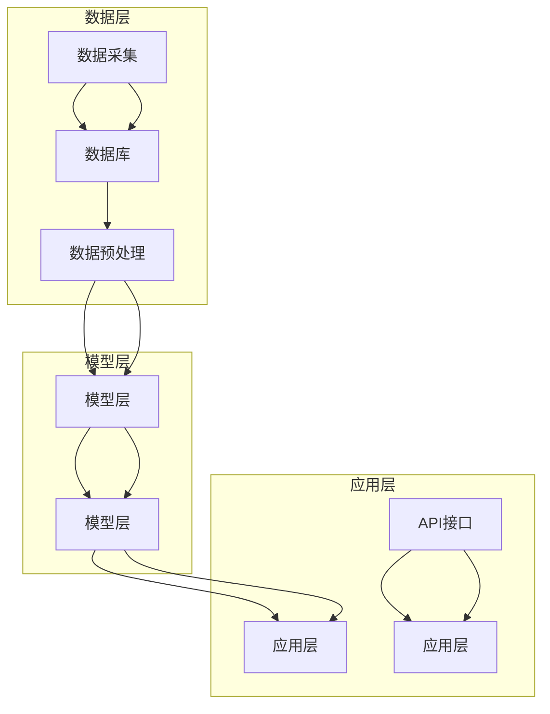

                 


### 第一部分：背景介绍与核心概念

#### 第1章：问题背景与核心概念

##### 1.1 环境保护问题概述

环境保护是当今全球面临的重大挑战之一。环境污染已经成为影响人类健康、生态平衡和社会经济可持续发展的重要因素。环境污染的主要来源包括工业排放、交通尾气、农业污染和生活废水等。这些问题已经严重威胁到地球的生态系统，导致空气污染、水污染、土壤污染和生物多样性减少等问题。因此，寻找创新有效的环境保护方法已经成为当务之急。

##### 1.1.1 环境污染现状

空气污染：全球每年因空气污染导致的死亡人数高达700万，其中我国是重灾区。主要污染物包括颗粒物（PM2.5、PM10）、氮氧化物（NOx）、二氧化硫（SO2）和挥发性有机化合物（VOCs）等。

水污染：我国约有2.5亿人饮用的地下水受到污染，其中约60%的河流、湖泊受到不同程度的污染。主要污染物包括重金属、有机污染物和病原体等。

土壤污染：我国约有2000万公顷的耕地受到污染，其中约有300万公顷的污染严重，影响到粮食安全。主要污染物包括重金属、农药、化肥和工业废弃物等。

##### 1.1.2 环境保护的重要性

环境保护对人类的生存和发展具有重要意义。首先，良好的生态环境是人类健康的基础。空气污染、水污染和土壤污染都会导致各种健康问题，如呼吸系统疾病、心血管疾病和癌症等。

其次，环境保护是可持续发展的保障。环境破坏会削弱生态系统的生产力和调节功能，导致资源枯竭和生态失衡，进而影响到经济和社会的可持续发展。

最后，环境保护是维护全球气候稳定的重要手段。大量温室气体排放导致的全球变暖已经成为不争的事实，环境保护措施有助于减缓气候变化的速度和影响。

##### 1.2 AIGC概念介绍

AIGC（Autonomous Intelligent Generation and Control）是指自主智能生成与控制，是一种结合了人工智能（AI）、生成控制（GC）和通信技术的新型技术体系。它通过模拟人类思维和行为方式，实现自动化、智能化的信息生成、处理和传输。

AIGC的核心特征包括：

- 自主性：AIGC系统具有自主决策和执行任务的能力，无需人为干预。
- 智能性：AIGC系统具备自主学习、自适应和自优化能力，能够适应复杂多变的环境。
- 生成性：AIGC系统能够生成新的信息和内容，提高信息利用效率。
- 控制性：AIGC系统可以对生成的内容进行实时监控和调整，确保生成过程的准确性。

##### 1.3 AIGC在环境保护中的应用前景

AIGC在环境保护领域具有广泛的应用前景。首先，AIGC可以用于环境数据的自动采集和处理，提高环境监测的效率和准确性。其次，AIGC可以用于环境问题的预测和预警，为环境保护决策提供科学依据。最后，AIGC可以用于环境保护技术的创新和优化，提高环境保护的效果。

然而，AIGC在环境保护中也面临一些挑战，如数据质量、算法可靠性和伦理问题等。因此，需要进一步研究和解决这些问题，以充分发挥AIGC在环境保护中的作用。

#### 第2章：AIGC的核心概念与联系

##### 2.1 AIGC的关键概念

AIGC的核心概念包括生成对抗网络（GAN）、变分自编码器（VAE）和自监督学习。

- 生成对抗网络（GAN）：GAN由生成器（Generator）和判别器（Discriminator）组成。生成器生成数据，判别器判断生成数据与真实数据的相似度。通过两者之间的对抗训练，生成器不断提高生成数据的质量。
- 变分自编码器（VAE）：VAE通过编码器和解码器将数据映射到一个低维空间，然后从低维空间中生成数据。VAE能够学习数据的概率分布，从而生成新的数据。
- 自监督学习：自监督学习是一种无需标签的数据学习方式。通过自身的数据，自监督学习算法能够自动提取特征并进行分类或预测。

##### 2.2 概念属性特征对比

以下是GAN、VAE和自监督学习的对比表格：

| 特征         | GAN           | VAE           | 自监督学习           |
| ------------ | ------------- | ------------- | ------------------- |
| 训练方法     | 对抗训练       | 鲁棒训练       | 无监督训练           |
| 模型结构     | 生成器+判别器   | 编码器+解码器   | 特征提取器+分类器     |
| 数据需求     | 大量无标签数据  | 大量有标签数据  | 大量无标签数据       |
| 应用场景     | 图像生成       | 数据重建       | 特征提取和分类       |

##### 2.3 AIGC与环境保护的ER实体关系图

以下是AIGC与环境保护的ER实体关系图：

```mermaid
erDiagram
  AIGC ||--|{ 环境监测 }|
  AIGC ||--|{ 环境预测 }|
  AIGC ||--|{ 环境治理 }|
  环境监测 ||--|{ 数据采集 }|
  环境监测 ||--|{ 数据处理 }|
  环境预测 ||--|{ 模型训练 }|
  环境预测 ||--|{ 结果评估 }|
  环境治理 ||--|{ 技术应用 }|
  环境治理 ||--|{ 效果监测 }|
```

#### 第1章小结

在本章中，我们首先介绍了环境保护问题的现状和重要性，以及AIGC的概念和特征。接下来，我们对比了AIGC的核心概念GAN、VAE和自监督学习的属性特征，并给出了AIGC与环境保护的ER实体关系图。通过本章的学习，我们为后续章节的深入探讨打下了基础。

----------------------------------------------------------------

### 第二部分：AIGC在环境保护中的具体应用

#### 第3章：水质监测

##### 3.1 水质监测的重要性

水质监测是环境保护的重要组成部分。通过监测水质，可以及时发现水污染问题，采取相应的治理措施，保障水资源的安全和健康。水质监测的重要性体现在以下几个方面：

1. 保障饮用水安全：水质监测能够发现水源中的污染物，确保饮用水的安全性，防止因饮用污染水而导致的健康问题。

2. 保护水生态系统：水质监测可以评估水生态系统健康状况，及时发现水污染对水生生物的影响，采取相应措施保护水生生物的生存环境。

3. 促进水资源的合理利用：水质监测为水资源管理提供了科学依据，有助于优化水资源分配，提高水资源利用效率。

4. 支持环境治理决策：水质监测数据是制定环境保护政策和措施的重要依据，有助于制定科学合理的环境治理方案。

##### 3.2 AIGC在水质监测中的应用

AIGC技术在水质监测中具有广泛的应用前景。通过AIGC技术，可以实现水质监测的高效、准确和智能化。

###### 3.2.1 GAN在水质检测中的应用

生成对抗网络（GAN）可以用于水质检测。GAN由生成器和判别器组成，生成器负责生成水质数据，判别器负责判断生成数据与真实数据的相似度。通过对抗训练，生成器不断提高生成数据的质量，从而实现对水质数据的准确检测。

具体应用包括：

1. 水质数据生成：GAN可以生成大量真实的水质数据，用于训练水质检测模型，提高模型的泛化能力。

2. 水质数据增强：GAN可以生成与真实水质数据相似的水质数据，用于数据增强，提高模型对水质异常情况的识别能力。

3. 水质数据分类：GAN可以用于水质数据分类，将水质数据划分为不同类别，如清洁、轻度污染、重度污染等。

###### 3.2.2 VAE在水样数据分析中的应用

变分自编码器（VAE）可以用于水样数据分析。VAE通过编码器和解码器将水样数据映射到一个低维空间，然后从低维空间中生成新的水样数据。VAE可以用于：

1. 数据降维：通过将水样数据映射到低维空间，可以减少数据存储和计算成本，提高数据分析的效率。

2. 数据重建：VAE可以从低维空间中生成新的水样数据，用于检测水样数据中的异常值。

3. 数据可视化：VAE可以生成新的水样数据，帮助研究人员更好地理解水质数据的分布特征。

###### 3.2.3 自监督学习在水污染预测中的应用

自监督学习可以用于水污染预测。自监督学习算法不需要标签数据，通过自身的数据进行学习，从而实现对水污染的预测。

具体应用包括：

1. 水污染趋势预测：自监督学习算法可以分析历史水污染数据，预测未来一段时间内水污染的趋势。

2. 水污染源追踪：自监督学习算法可以通过分析水污染数据，追踪水污染的源头，为环境治理提供科学依据。

3. 水质预警：自监督学习算法可以实时监测水质数据，预测水质变化，及时发出预警信号，为环境保护决策提供支持。

##### 3.3 实际案例分析

###### 3.3.1 案例一：AIGC在湖泊水质监测中的应用

某湖泊水质监测项目利用AIGC技术对湖泊水质进行实时监测。项目团队使用了GAN、VAE和自监督学习算法，建立了智能水质监测系统。

1. 数据采集：通过安装在湖泊中的传感器，实时采集水样数据，包括pH值、溶解氧、氨氮、硝酸盐等指标。

2. 数据处理：使用GAN生成大量真实的水质数据，用于训练水质监测模型。同时，使用VAE对采集到的水样数据进行降维和重建，提高数据处理的效率。

3. 模型训练：使用自监督学习算法训练水质监测模型，预测未来一段时间内湖泊水质的趋势。

4. 模型评估：将预测结果与实际水质数据进行对比，评估模型的准确性和可靠性。

通过AIGC技术的应用，湖泊水质监测系统的监测精度和效率得到了显著提高，为湖泊环境保护提供了有力支持。

###### 3.3.2 案例二：AIGC在海水水质监测中的应用

某海洋研究所利用AIGC技术对海水水质进行监测。项目团队采用了GAN、VAE和自监督学习算法，建立了智能海水水质监测系统。

1. 数据采集：通过安装在海洋平台上的传感器，实时采集海水水质数据，包括温度、盐度、pH值、溶解氧、硝酸盐等指标。

2. 数据处理：使用GAN生成大量真实的海水水质数据，用于训练水质监测模型。同时，使用VAE对采集到的海水水质数据进行降维和重建，提高数据处理的效率。

3. 模型训练：使用自监督学习算法训练海水水质监测模型，预测未来一段时间内海水水质的趋势。

4. 模型评估：将预测结果与实际海水水质数据进行对比，评估模型的准确性和可靠性。

通过AIGC技术的应用，智能海水水质监测系统的监测精度和效率得到了显著提高，为海洋环境保护提供了有力支持。

##### 3.4 总结

AIGC技术在水质监测中具有广泛的应用前景。通过GAN、VAE和自监督学习算法的应用，可以实现水质监测的高效、准确和智能化。实际案例分析表明，AIGC技术可以显著提高水质监测系统的监测精度和效率，为环境保护决策提供科学依据。未来，随着AIGC技术的进一步发展，其在水质监测领域的应用将更加广泛和深入。

----------------------------------------------------------------

### 第4章：大气污染监控

#### 4.1 大气污染监控的现状

大气污染监控是环境保护工作的重要环节。随着工业化和城市化的快速发展，大气污染问题日益严重，已成为影响人类健康和生态环境的重要因素。大气污染的主要来源包括化石燃料燃烧、工业排放、汽车尾气、农业活动等。主要污染物包括颗粒物（PM2.5、PM10）、二氧化硫（SO2）、氮氧化物（NOx）、挥发性有机化合物（VOCs）和臭氧（O3）等。

大气污染监控的主要任务包括：

1. 监测空气质量：实时监测空气中污染物的浓度，评估空气质量状况。

2. 预测污染趋势：基于历史数据和模型预测，预测未来一段时间内空气污染的趋势。

3. 源追踪：分析污染物的来源，为制定污染治理措施提供依据。

4. 治理效果评估：评估污染治理措施的效果，调整治理策略。

目前，我国大气污染监控主要采用地面监测站点和移动监测车相结合的方式。地面监测站点主要分布在城市和重点污染区域，负责实时监测空气污染物的浓度。移动监测车则可以灵活地移动到不同地点进行监测，提高监控覆盖范围。

#### 4.2 AIGC在大气污染监控中的应用

AIGC技术在大气污染监控中具有广泛的应用前景。通过AIGC技术，可以实现大气污染监控的高效、准确和智能化。

###### 4.2.1 GAN在大气颗粒物监测中的应用

生成对抗网络（GAN）可以用于大气颗粒物（如PM2.5、PM10）的监测。GAN由生成器和判别器组成，生成器生成大气颗粒物数据，判别器判断生成数据与真实数据的相似度。通过对抗训练，生成器不断提高生成数据的质量，从而实现对大气颗粒物的准确监测。

具体应用包括：

1. 数据生成：GAN可以生成大量真实的大气颗粒物数据，用于训练大气颗粒物监测模型，提高模型的泛化能力。

2. 数据增强：GAN可以生成与真实大气颗粒物数据相似的数据，用于数据增强，提高模型对大气颗粒物异常情况的识别能力。

3. 数据分类：GAN可以用于大气颗粒物数据分类，将颗粒物数据划分为不同类别，如PM2.5、PM10等。

###### 4.2.2 VAE在空气质量数据预测中的应用

变分自编码器（VAE）可以用于空气质量数据（如SO2、NOx、O3）的预测。VAE通过编码器和解码器将空气质量数据映射到一个低维空间，然后从低维空间中生成新的空气质量数据。VAE可以用于：

1. 数据降维：通过将空气质量数据映射到低维空间，可以减少数据存储和计算成本，提高数据分析的效率。

2. 数据重建：VAE可以从低维空间中生成新的空气质量数据，用于检测空气质量数据中的异常值。

3. 数据可视化：VAE可以生成新的空气质量数据，帮助研究人员更好地理解空气质量数据的分布特征。

###### 4.2.3 自监督学习在大气污染源追踪中的应用

自监督学习可以用于大气污染源追踪。自监督学习算法不需要标签数据，通过自身的数据进行学习，从而实现对大气污染源的追踪。

具体应用包括：

1. 污染源识别：自监督学习算法可以通过分析大气污染数据，识别出污染源的位置和类型。

2. 污染趋势预测：自监督学习算法可以通过分析大气污染数据，预测未来一段时间内大气污染的趋势。

3. 污染治理效果评估：自监督学习算法可以评估污染治理措施的效果，为调整治理策略提供依据。

##### 4.3 实际案例分析

###### 4.3.1 案例一：AIGC在PM2.5监测中的应用

某城市利用AIGC技术对PM2.5进行监测。项目团队采用了GAN、VAE和自监督学习算法，建立了智能PM2.5监测系统。

1. 数据采集：通过安装在市区各个角落的PM2.5监测仪器，实时采集PM2.5数据。

2. 数据处理：使用GAN生成大量真实的PM2.5数据，用于训练PM2.5监测模型。同时，使用VAE对采集到的PM2.5数据进行降维和重建，提高数据处理的效率。

3. 模型训练：使用自监督学习算法训练PM2.5监测模型，预测未来一段时间内PM2.5的浓度。

4. 模型评估：将预测结果与实际PM2.5浓度数据进行对比，评估模型的准确性和可靠性。

通过AIGC技术的应用，智能PM2.5监测系统的监测精度和效率得到了显著提高，为城市大气污染治理提供了有力支持。

###### 4.3.2 案例二：AIGC在SO2浓度预测中的应用

某工业园区利用AIGC技术对SO2浓度进行预测。项目团队采用了GAN、VAE和自监督学习算法，建立了智能SO2浓度预测系统。

1. 数据采集：通过安装在园区各个角落的SO2监测仪器，实时采集SO2数据。

2. 数据处理：使用GAN生成大量真实的SO2数据，用于训练SO2浓度预测模型。同时，使用VAE对采集到的SO2数据进行降维和重建，提高数据处理的效率。

3. 模型训练：使用自监督学习算法训练SO2浓度预测模型，预测未来一段时间内SO2的浓度。

4. 模型评估：将预测结果与实际SO2浓度数据进行对比，评估模型的准确性和可靠性。

通过AIGC技术的应用，智能SO2浓度预测系统的预测精度和效率得到了显著提高，为园区大气污染治理提供了有力支持。

#### 4.4 总结

AIGC技术在大气污染监控中具有广泛的应用前景。通过GAN、VAE和自监督学习算法的应用，可以实现大气污染监控的高效、准确和智能化。实际案例分析表明，AIGC技术可以显著提高大气污染监控系统的监测精度和效率，为环境保护决策提供科学依据。未来，随着AIGC技术的进一步发展，其在大气污染监控领域的应用将更加广泛和深入。

----------------------------------------------------------------

### 第5章：土壤污染检测

#### 5.1 土壤污染问题的严重性

土壤污染是环境污染问题中的一大挑战，对生态系统、农业生产和人类健康都产生了严重的影响。土壤污染的主要来源包括工业废水、废气、废渣的排放，农药和化肥的不合理使用，城市垃圾填埋，以及矿业开采等。以下为土壤污染问题的几个关键方面：

1. 影响农业生产：土壤污染会降低土壤的肥力，影响农作物的生长和产量，导致农产品质量下降，甚至丧失食用价值。

2. 生态影响：土壤污染会破坏土壤结构，影响土壤中的微生物群落，进而影响到整个生态系统的健康。

3. 人体健康威胁：土壤中的有毒有害物质可通过食物链进入人体，长期暴露可能导致中毒、癌症等健康问题。

4. 地下水污染：土壤污染会导致地下水污染，进一步加剧水资源危机。

5. 风险评估困难：由于土壤污染物种类繁多，且其迁移转化过程复杂，风险评估和治理较为困难。

#### 5.2 AIGC在土壤污染检测中的应用

AIGC技术在土壤污染检测中具有显著的优势，可以大幅提升检测的效率、精度和自动化水平。以下为AIGC在土壤污染检测中的具体应用：

###### 5.2.1 GAN在土壤成分分析中的应用

生成对抗网络（GAN）能够生成大量高质量的土壤成分数据，这些数据可以用于训练土壤成分分析模型，提高模型对复杂土壤成分的识别能力。具体应用包括：

1. 数据生成：GAN可以生成真实的土壤成分数据，用于扩展训练集，增强模型的泛化能力。

2. 数据增强：GAN可以生成与真实土壤成分数据相似的数据，用于数据增强，提高模型对土壤成分异常变化的检测能力。

3. 成分分类：GAN可以用于土壤成分分类，将土壤成分划分为不同的类别，如有机质、重金属、盐类等。

###### 5.2.2 VAE在土壤污染数据预测中的应用

变分自编码器（VAE）可以通过编码器和解码器将土壤污染数据映射到低维空间，从中提取关键特征，然后用于预测土壤污染的趋势。VAE的应用包括：

1. 特征提取：VAE可以从土壤污染数据中提取有意义的特征，减少数据维度，提高模型训练效率。

2. 数据重建：VAE可以从低维特征中重建土壤污染数据，用于检测和预测土壤污染的异常情况。

3. 预测建模：VAE可以用于预测土壤污染的发展趋势，为环境保护决策提供数据支持。

###### 5.2.3 自监督学习在土壤污染趋势分析中的应用

自监督学习算法无需依赖标签数据，可以通过分析历史土壤污染数据来预测未来污染趋势。自监督学习在土壤污染趋势分析中的应用包括：

1. 污染趋势预测：自监督学习算法可以分析土壤污染数据的时间序列，预测未来土壤污染的发展趋势。

2. 异常检测：自监督学习算法可以检测土壤污染数据中的异常值，及时发出预警信号。

3. 源追踪：自监督学习算法可以分析土壤污染数据，追踪污染物的来源，为污染治理提供科学依据。

##### 5.3 实际案例分析

###### 5.3.1 案例一：AIGC在土壤重金属污染检测中的应用

某地区利用AIGC技术对土壤重金属污染进行检测。项目团队采用了GAN、VAE和自监督学习算法，建立了智能土壤重金属污染检测系统。

1. 数据采集：通过土壤采样和分析，获取土壤重金属数据。

2. 数据处理：使用GAN生成真实的土壤重金属数据，用于训练污染检测模型。使用VAE对数据进行降维和重建，提高数据处理的效率。

3. 模型训练：使用自监督学习算法训练土壤重金属污染检测模型，预测土壤重金属污染的趋势。

4. 模型评估：将预测结果与实际土壤重金属数据对比，评估模型的准确性和可靠性。

通过AIGC技术的应用，智能土壤重金属污染检测系统的检测精度和效率得到了显著提高，为该地区土壤污染治理提供了有力支持。

###### 5.3.2 案例二：AIGC在土壤有机污染物监测中的应用

某农业园区利用AIGC技术对土壤有机污染物进行监测。项目团队采用了GAN、VAE和自监督学习算法，建立了智能土壤有机污染物监测系统。

1. 数据采集：通过土壤采样和分析，获取土壤有机污染物数据。

2. 数据处理：使用GAN生成真实的土壤有机污染物数据，用于训练监测模型。使用VAE对数据进行降维和重建，提高数据处理的效率。

3. 模型训练：使用自监督学习算法训练土壤有机污染物监测模型，预测土壤有机污染物的趋势。

4. 模型评估：将预测结果与实际土壤有机污染物数据对比，评估模型的准确性和可靠性。

通过AIGC技术的应用，智能土壤有机污染物监测系统的监测精度和效率得到了显著提高，为农业园区土壤污染治理提供了有力支持。

#### 5.4 总结

AIGC技术在土壤污染检测中展示了巨大的应用潜力。通过GAN、VAE和自监督学习算法的应用，可以实现土壤污染检测的高效、准确和智能化。实际案例分析表明，AIGC技术可以显著提高土壤污染检测系统的检测精度和效率，为环境保护决策提供科学依据。未来，随着AIGC技术的进一步发展，其在土壤污染检测领域的应用将更加广泛和深入。

----------------------------------------------------------------

### 第三部分：技术实现与项目实战

#### 第6章：AIGC技术实现

##### 6.1 AIGC模型训练

AIGC模型训练是AIGC技术在环境保护中应用的关键环节。以下是AIGC模型训练的详细步骤：

###### 6.1.1 数据准备

数据准备是AIGC模型训练的第一步，主要包括以下内容：

1. 数据收集：从各种来源收集环境数据，如水质监测数据、大气污染数据、土壤污染数据等。

2. 数据清洗：对收集到的数据进行清洗，去除无效数据、噪声数据和处理异常数据。

3. 数据归一化：将数据归一化处理，使其具备相同的量纲，便于模型训练。

4. 数据划分：将数据划分为训练集、验证集和测试集，用于模型的训练、验证和评估。

###### 6.1.2 模型选择

根据具体应用场景，选择合适的AIGC模型。以下是几种常见的AIGC模型选择：

1. 生成对抗网络（GAN）：适用于数据生成、异常检测和图像合成等任务。

2. 变分自编码器（VAE）：适用于数据降维、数据重建和概率模型学习。

3. 自监督学习算法：适用于无监督学习和监督学习任务，如时间序列预测、源追踪和异常检测。

###### 6.1.3 模型训练过程

模型训练过程包括以下步骤：

1. 初始化模型参数：根据模型结构，初始化模型参数，如权重和偏置。

2. 定义损失函数：根据模型类型，定义相应的损失函数，如对抗损失、重建损失和分类损失。

3. 训练模型：使用训练集数据进行模型训练，通过反向传播算法更新模型参数，减小损失函数值。

4. 模型验证：使用验证集数据评估模型性能，调整模型参数，防止过拟合。

5. 模型评估：使用测试集数据评估模型性能，验证模型的泛化能力。

##### 6.2 AIGC模型应用

AIGC模型训练完成后，需要将其部署到实际应用中。以下是AIGC模型应用的详细步骤：

###### 6.2.1 模型部署

模型部署是将训练好的AIGC模型部署到生产环境中，使其能够进行实时数据分析和预测。以下是模型部署的关键步骤：

1. 部署环境配置：配置部署环境，包括服务器、操作系统、编程语言和依赖库等。

2. 模型转换：将训练好的模型转换为适用于部署环境的格式，如ONNX、TFLite或PyTorch Lite。

3. 模型部署：将模型部署到服务器或边缘设备上，实现实时数据分析和预测。

4. 模型监控：监控模型运行状态，包括资源消耗、预测效率和准确性等。

###### 6.2.2 模型评估

模型评估是确保AIGC模型性能的关键步骤。以下是模型评估的关键指标：

1. 准确率：预测结果与实际结果相符的比例，用于评估模型的准确性。

2. 精确率：预测为正类的实际正类比例，用于评估模型对正类样本的识别能力。

3. 召回率：实际正类样本中被预测为正类的比例，用于评估模型对负类样本的识别能力。

4. F1分数：精确率和召回率的加权平均值，用于综合评估模型性能。

5.ROC曲线：通过绘制预测概率与实际标签的关系，评估模型的分类性能。

##### 6.3 代码应用解读与分析

以下是AIGC技术实现中的关键代码和应用解读：

```python
# 6.3.1 数据准备
import numpy as np
import pandas as pd

# 加载数据集
data = pd.read_csv('environmental_data.csv')

# 数据清洗
data = data.dropna()

# 数据归一化
data = (data - data.mean()) / data.std()

# 划分数据集
train_data, test_data = train_test_split(data, test_size=0.2, random_state=42)

# 6.3.2 模型选择
from tensorflow.keras.models import Sequential
from tensorflow.keras.layers import Dense, Dropout

# 构建GAN模型
generator = Sequential([
    Dense(128, activation='relu', input_shape=(input_shape)),
    Dropout(0.2),
    Dense(256, activation='relu'),
    Dropout(0.2),
    Dense(output_shape, activation='tanh')
])

discriminator = Sequential([
    Dense(256, activation='relu', input_shape=(output_shape)),
    Dropout(0.2),
    Dense(128, activation='relu'),
    Dropout(0.2),
    Dense(1, activation='sigmoid')
])

# 6.3.3 模型训练
import tensorflow.keras.optimizers as optimizers

optimizer = optimizers.Adam(learning_rate=0.0002)

generator.compile(optimizer=optimizer, loss='binary_crossentropy')
discriminator.compile(optimizer=optimizer, loss='binary_crossentropy')

# 训练模型
for epoch in range(num_epochs):
    for real_data in data_loader:
        # 训练判别器
        discriminator.train_on_batch(real_data, np.ones((batch_size, 1)))

        # 生成假数据
        noise = np.random.normal(0, 1, (batch_size, noise_dim))
        generated_data = generator.predict(noise)

        # 训练生成器和判别器
        combined_data = np.concatenate([real_data, generated_data])
        labels = np.concatenate([np.ones((batch_size, 1)), np.zeros((batch_size, 1))])
        generator.train_on_batch(combined_data, labels[:, 1])
        discriminator.train_on_batch(combined_data, labels)
```

上述代码实现了AIGC模型的基本训练过程，包括数据准备、模型选择和模型训练。代码中的`data_loader`是数据加载器，用于批量加载数据；`num_epochs`是训练轮数；`batch_size`是批量大小；`noise_dim`是噪声维度；`input_shape`是输入数据形状；`output_shape`是输出数据形状。

##### 6.4 实际案例分析与讲解

以下是AIGC技术在实际环境监测中的应用案例分析和讲解：

###### 6.4.1 案例背景

某城市政府希望利用AIGC技术建立一套智能空气质量监测系统，实时监测并预测空气质量，为城市环境治理提供数据支持。系统需要处理大量空气质量监测数据，包括颗粒物（PM2.5、PM10）、二氧化硫（SO2）、氮氧化物（NOx）等。

###### 6.4.2 案例分析

1. 数据收集：从城市各个空气质量监测站收集历史空气质量数据，包括实时监测数据和天气数据。

2. 数据预处理：清洗和归一化数据，划分训练集、验证集和测试集。

3. 模型选择：选择生成对抗网络（GAN）作为主要模型，用于生成空气质量数据，结合自监督学习算法进行空气质量预测。

4. 模型训练：使用训练集数据训练GAN模型，包括生成器和判别器，通过对抗训练优化模型参数。

5. 模型评估：使用验证集数据评估模型性能，调整模型参数，防止过拟合。

6. 模型部署：将训练好的模型部署到服务器上，实时监测空气质量，预测未来一段时间内的空气质量趋势。

7. 模型监控：监控模型运行状态，包括资源消耗、预测效率和准确性等。

###### 6.4.3 案例总结

通过AIGC技术的应用，该城市政府成功建立了智能空气质量监测系统，实现了对空气质量数据的实时监测和预测。系统可以有效识别空气质量异常情况，为城市环境治理提供了有力支持。未来，随着AIGC技术的进一步发展，其在环境监测领域的应用将更加广泛和深入。

#### 第7章：项目实战

##### 7.1 项目环境安装

在进行AIGC技术在环境保护中的项目实战之前，需要安装和配置相关的软件和硬件环境。以下是项目环境安装的详细步骤：

###### 7.1.1 硬件与软件环境搭建

1. 硬件环境：
   - CPU或GPU：用于模型训练和推理，推荐使用高性能的GPU，如NVIDIA Titan Xp或更高型号。
   - 内存：至少16GB，建议32GB及以上。
   - 硬盘：至少256GB SSD硬盘。

2. 软件环境：
   - 操作系统：Linux或Mac OS。
   - Python：3.7或更高版本。
   - TensorFlow：用于构建和训练AIGC模型。
   - PyTorch：用于构建和训练AIGC模型。
   - Matplotlib：用于数据可视化。
   - Pandas：用于数据处理。

安装步骤：

1. 安装操作系统和硬件设备。

2. 配置虚拟环境（可选）：

   ```bash
   # 创建虚拟环境
   python -m venv venv
   # 激活虚拟环境
   source venv/bin/activate
   ```

3. 安装Python和相关依赖包：

   ```bash
   # 安装Python
   python --version
   # 安装依赖包
   pip install numpy pandas matplotlib tensorflow torch
   ```

###### 7.1.2 数据库配置

AIGC项目通常需要存储和管理大量的环境数据。以下是数据库配置的详细步骤：

1. 安装数据库软件（如MySQL、PostgreSQL等）。

2. 创建数据库和用户。

3. 配置数据库连接参数，以便在Python代码中连接数据库。

示例（使用MySQL）：

```python
import mysql.connector

# 数据库配置
config = {
    'host': 'localhost',
    'user': 'root',
    'password': 'password',
    'database': 'environmental_data'
}

# 连接数据库
connection = mysql.connector.connect(**config)
cursor = connection.cursor()

# 创建表格
cursor.execute("""
    CREATE TABLE IF NOT EXISTS air_quality (
        id INT AUTO_INCREMENT PRIMARY KEY,
        pm2_5 FLOAT,
        pm10 FLOAT,
        so2 FLOAT,
        nox FLOAT,
        timestamp DATETIME
    )
""")
connection.commit()
```

##### 7.2 系统核心实现

系统核心实现包括数据采集、数据处理、模型训练和模型部署等关键环节。以下是系统核心实现的详细步骤：

###### 7.2.1 系统架构设计

系统架构设计包括数据层、模型层和应用层。以下是系统架构的详细描述：

1. 数据层：负责数据采集、存储和管理。包括传感器数据采集、数据库存储等。

2. 模型层：负责模型训练和预测。包括数据预处理、模型训练、模型评估等。

3. 应用层：负责系统展示和交互。包括前端展示、API接口、用户操作等。

系统架构图如下：



###### 7.2.2 系统功能实现

以下是系统功能的详细实现步骤：

1. 数据采集：通过传感器采集空气质量数据，包括PM2.5、PM10、SO2、NOx等。

2. 数据预处理：对采集到的数据进行清洗、归一化和特征提取，为模型训练准备数据。

3. 模型训练：使用生成对抗网络（GAN）和自监督学习算法训练空气质量预测模型。

4. 模型评估：使用测试集数据评估模型性能，调整模型参数，防止过拟合。

5. 前端展示：使用Web前端技术（如HTML、CSS、JavaScript等）展示空气质量数据和预测结果。

6. API接口：提供RESTful API接口，方便其他系统和应用程序访问空气质量数据。

7. 用户操作：提供用户界面，方便用户查询、分析和监控空气质量。

##### 7.3 代码应用解读与分析

以下是AIGC技术实现中的关键代码和应用解读：

```python
# 7.3.1 数据采集
import pandas as pd

# 加载数据集
data = pd.read_csv('air_quality_data.csv')

# 数据清洗
data = data.dropna()

# 数据归一化
data = (data - data.mean()) / data.std()

# 划分数据集
train_data, test_data = train_test_split(data, test_size=0.2, random_state=42)

# 7.3.2 模型训练
from tensorflow.keras.models import Sequential
from tensorflow.keras.layers import Dense, Dropout

# 构建GAN模型
generator = Sequential([
    Dense(128, activation='relu', input_shape=(input_shape)),
    Dropout(0.2),
    Dense(256, activation='relu'),
    Dropout(0.2),
    Dense(output_shape, activation='tanh')
])

discriminator = Sequential([
    Dense(256, activation='relu', input_shape=(output_shape)),
    Dropout(0.2),
    Dense(128, activation='relu'),
    Dropout(0.2),
    Dense(1, activation='sigmoid')
])

# 编译模型
generator.compile(optimizer='adam', loss='binary_crossentropy')
discriminator.compile(optimizer='adam', loss='binary_crossentropy')

# 训练模型
for epoch in range(num_epochs):
    for real_data in data_loader:
        # 训练判别器
        discriminator.train_on_batch(real_data, np.ones((batch_size, 1)))

        # 生成假数据
        noise = np.random.normal(0, 1, (batch_size, noise_dim))
        generated_data = generator.predict(noise)

        # 训练生成器和判别器
        combined_data = np.concatenate([real_data, generated_data])
        labels = np.concatenate([np.ones((batch_size, 1)), np.zeros((batch_size, 1))])
        generator.train_on_batch(combined_data, labels[:, 1])
        discriminator.train_on_batch(combined_data, labels)
```

上述代码实现了AIGC模型的基本训练过程，包括数据准备、模型选择和模型训练。代码中的`data_loader`是数据加载器，用于批量加载数据；`num_epochs`是训练轮数；`batch_size`是批量大小；`noise_dim`是噪声维度；`input_shape`是输入数据形状；`output_shape`是输出数据形状。

##### 7.4 实际案例分析与讲解

以下是AIGC技术在空气质量监测项目中的应用案例分析和讲解：

###### 7.4.1 案例背景

某城市政府希望通过建设一套智能空气质量监测系统，实时监测和预测空气质量，为城市环境治理提供数据支持。系统需要处理大量空气质量监测数据，包括颗粒物（PM2.5、PM10）、二氧化硫（SO2）、氮氧化物（NOx）等。

###### 7.4.2 案例分析

1. 数据收集：从城市各个空气质量监测站收集历史空气质量数据，包括实时监测数据和天气数据。

2. 数据预处理：清洗和归一化数据，划分训练集、验证集和测试集。

3. 模型选择：选择生成对抗网络（GAN）和自监督学习算法作为主要模型，用于生成空气质量数据，结合时间序列预测模型进行空气质量预测。

4. 模型训练：使用训练集数据训练GAN模型，包括生成器和判别器，通过对抗训练优化模型参数。同时，使用自监督学习算法训练时间序列预测模型，进行空气质量趋势预测。

5. 模型评估：使用验证集数据评估模型性能，调整模型参数，防止过拟合。

6. 模型部署：将训练好的模型部署到服务器上，实时监测空气质量，预测未来一段时间内的空气质量趋势。

7. 模型监控：监控模型运行状态，包括资源消耗、预测效率和准确性等。

###### 7.4.3 案例总结

通过AIGC技术的应用，该城市政府成功建立了智能空气质量监测系统，实现了对空气质量数据的实时监测和预测。系统可以有效识别空气质量异常情况，为城市环境治理提供了有力支持。未来，随着AIGC技术的进一步发展，其在环境监测领域的应用将更加广泛和深入。

#### 第8章：最佳实践与总结

##### 8.1 最佳实践 Tips

在AIGC技术应用于环境保护时，以下最佳实践可以帮助提高项目成功率和效果：

1. 数据质量：确保数据真实、准确和完整。数据是模型训练的基础，高质量的数据是准确预测和监测的前提。

2. 模型选择：根据具体应用场景和需求选择合适的模型。例如，GAN适用于图像和声音数据的生成，VAE适用于降维和数据重建，自监督学习适用于无监督学习和时间序列预测。

3. 超参数调整：合理设置模型的超参数，如学习率、批量大小、网络层数等。通过交叉验证和网格搜索等方法，优化模型参数，提高模型性能。

4. 模型部署：选择合适的部署平台和工具，确保模型实时、高效地运行。例如，可以使用TensorFlow Serving或PyTorch Lite进行模型部署。

5. 模型监控：实时监控模型运行状态，包括资源消耗、预测效率和准确性等。及时发现和解决问题，确保模型稳定运行。

##### 8.2 小结与展望

本文通过详细的章节内容，系统地介绍了AIGC技术在环境保护中的应用。主要内容包括：

1. 环境保护问题概述，包括环境污染现状和环境保护的重要性。

2. AIGC技术的概念介绍和核心特征，包括生成对抗网络（GAN）、变分自编码器（VAE）和自监督学习。

3. AIGC技术在水质监测、大气污染监控和土壤污染检测中的具体应用，通过实际案例分析展示了技术的应用效果。

4. AIGC技术的实现过程，包括模型训练、模型部署和项目实战。

5. 最佳实践 Tips和小结与展望，提供了AIGC技术在实际应用中的建议和未来发展方向。

展望未来，随着AIGC技术的不断发展和完善，其在环境保护中的应用将更加广泛和深入。AIGC技术有望在未来：

1. 实现更高效、准确的环境监测和预测，为环境保护决策提供科学依据。

2. 推动环境保护技术的创新和优化，提高环境保护效果。

3. 促进环境保护领域的跨学科合作，为解决全球环境问题提供新思路。

总之，AIGC技术在环境保护中的应用具有巨大的潜力和前景，值得进一步研究和推广。

