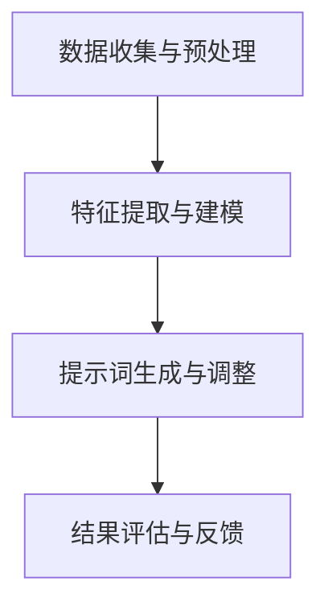
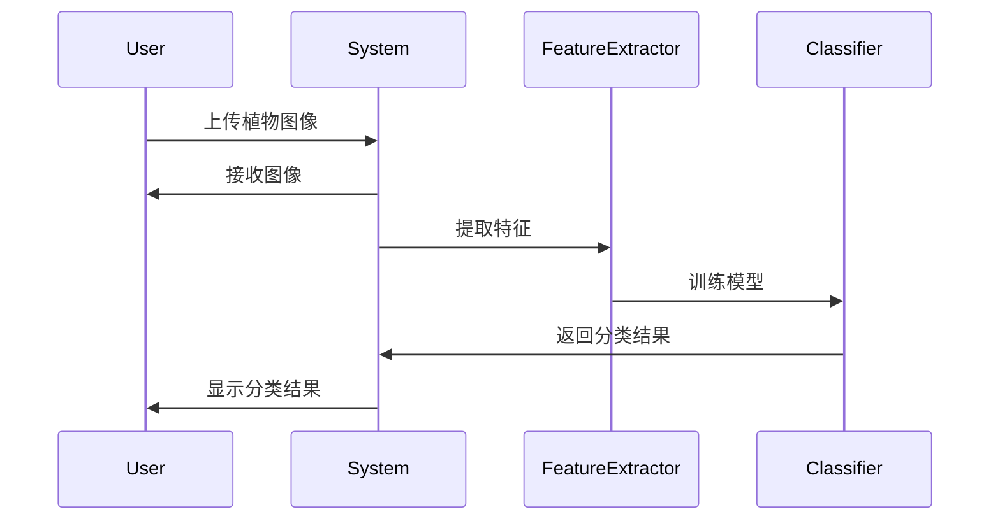

                 

### 文章标题：AIGC在生物多样性研究中的应用：物种分类提示词

> **关键词：** AIGC、生物多样性研究、物种分类、提示词、算法、Python源代码、数学模型

> **摘要：** 本文章探讨了AIGC（自适应交互生成控制）技术在生物多样性研究领域中的应用，特别是物种分类提示词的开发。通过深入分析AIGC技术的基本原理和生物多样性研究的关键问题，本文详细阐述了如何利用AIGC技术实现高效准确的物种分类，并提供了一系列的实践案例和未来展望。

---

## 第一部分：AIGC与生物多样性研究概述

### 第1章：AIGC技术概述

#### 1.1 问题背景

生物多样性研究是环境保护和生态系统管理的重要组成部分。随着全球生态环境的变化，对生物多样性的监测和保护需求日益增长。然而，生物物种的多样性和复杂性使得传统的分类方法效率低下，难以满足现代科学研究的需求。

#### 1.2 问题描述

如何利用先进的人工智能技术，尤其是AIGC，来提高生物多样性研究的效率和准确性，实现物种的分类和识别？

#### 1.3 问题解决

AIGC技术通过自适应交互生成控制，能够模拟人类的思维过程，对大量复杂的数据进行高效处理和分类。AIGC在生物多样性研究中的应用，提供了新的思路和方法。

#### 1.4 边界与外延

AIGC技术的应用不仅限于物种分类，还可以扩展到生态系统的模拟、环境保护政策的制定等多个领域。

#### 1.5 概念结构与核心要素组成

AIGC技术包括以下几个核心要素：
- **数据输入与预处理：** 收集和整理生物多样性数据。
- **模型训练与优化：** 利用机器学习算法训练分类模型。
- **提示词生成与调整：** 根据实际应用需求生成和调整提示词。
- **结果评估与优化：** 对分类结果进行评估和调整，提高准确性。

### 第2章：生物多样性研究基础

#### 2.1 核心概念

- **生物多样性：** 生物多样性是指地球上所有生物体的多样性，包括物种多样性、遗传多样性和生态系统多样性。
- **物种分类：** 物种分类是将生物体根据其形态、生理和行为等特征进行分类的过程。

#### 2.2 概念属性特征对比表格

| 特征类别 | 物种多样性 | 遗传多样性 | 生态系统多样性 |
| :------: | :--------: | :--------: | :------------: |
| **定义** | 生物种类数量和丰富度 | 生物体内部的遗传差异 | 生物体与其周围环境的相互作用 |
| **影响** | 生物群落结构和稳定性 | 生物体适应环境的能力 | 生态系统的功能和服务 |
| **研究方法** | 物种调查和监测 | 基因组和分子生物学技术 | 生态系统调查和模拟 |

#### 2.3 ER实体关系图架构

```mermaid
erDiagram
    Class::生物多样性 <<|-- Class::物种多样性
    Class::物种多样性 ||--|{ Class::遗传多样性 }
    Class::物种多样性 ||--|{ Class::生态系统多样性 }
```

## 第二部分：AIGC在物种分类中的应用

### 第3章：AIGC技术原理

#### 3.1 算法原理讲解

AIGC技术基于生成对抗网络（GAN）和自编码器（Autoencoder）等深度学习模型，通过多轮交互训练，生成和调整提示词，实现物种分类。

#### 3.2 Mermaid算法流程图


#### 3.3 Python源代码阐述

```python
# 数据输入与预处理
data = preprocess_data(raw_data)

# 模型训练
model = train_model(data)

# 提示词生成与调整
prompt = generate_prompt(model)
prompt = adjust_prompt(prompt)

# 分类结果评估
result = classify_species(prompt)

# 模型优化
model = optimize_model(model, result)
```

#### 3.4 算法原理的数学模型和公式

$$
\begin{aligned}
\text{损失函数} &= -[\mathbb{E}_{x \sim p_{\text{data}}(x)}[\log(\hat{p}_{\text{G}}(\text{G}(x)))]+[\mathbb{E}_{z \sim p_{\text{z}}(z)}[\log(\hat{p}_{\text{D}}(\text{D}(\text{G}(z))))] \\
\text{提示词} &= f(\text{特征}, \text{标签}) \\
\text{分类结果} &= g(\text{提示词})
\end{aligned}
$$

#### 3.5 通俗易懂地举例说明

假设我们有一组植物数据，包括它们的形态、生理和行为特征。AIGC技术会首先对这些数据进行预处理，然后通过生成对抗网络训练一个分类模型。在训练过程中，模型会生成一系列的提示词，这些提示词帮助我们更好地理解和描述植物特征。最后，通过这些提示词，模型可以准确地分类植物，从而实现物种的识别。

---

在接下来的章节中，我们将深入探讨AIGC在生物多样性研究中的应用，详细阐述其在物种分类中的实际操作方法和项目实战，并展望其未来的发展趋势。

---

## 第二部分：AIGC在物种分类中的应用

### 第4章：物种分类算法原理

#### 4.1 数学模型和数学公式

$$
\begin{aligned}
\text{相似度度量} &= \text{cosine\_similarity}(\text{特征向量}_1, \text{特征向量}_2) \\
\text{分类决策} &= \text{argmax}_{i} \sum_{j=1}^{k} \text{weight}_{ij} \cdot \text{similarity}_{ij}
\end{aligned}
$$

#### 4.2 Mermaid流程图


#### 4.3 Python源代码示例

```python
import numpy as np
from sklearn.metrics.pairwise import cosine_similarity
from sklearn.model_selection import train_test_split
from sklearn.ensemble import RandomForestClassifier

# 数据预处理
data = preprocess_data(raw_data)
X = extract_features(data)

# 模型训练
X_train, X_test, y_train, y_test = train_test_split(X, y, test_size=0.2)
model = RandomForestClassifier()
model.fit(X_train, y_train)

# 生成提示词
def generate_prompt(features, model):
    # 提示词生成逻辑
    pass

prompt = generate_prompt(X_test, model)

# 分类决策
predictions = model.predict(prompt)

# 结果评估
accuracy = np.mean(predictions == y_test)
print(f"模型准确率: {accuracy:.2f}")
```

### 第5章：AIGC在物种分类中的实际应用

#### 5.1 系统分析与架构设计方案

##### 5.1.1 问题场景介绍

随着城市化进程的加速和生态环境的变化，对城市绿地的生物多样性监测和评估变得尤为重要。通过AIGC技术，我们可以对城市绿地中的植物进行高效准确的分类，从而为城市生态规划提供科学依据。

##### 5.1.2 项目介绍

本项目旨在利用AIGC技术，开发一个城市绿地植物分类系统，实现对植物物种的自动识别和分类。

##### 5.1.3 系统功能设计

- **数据收集与预处理：** 收集城市绿地植物的图像和属性数据，并进行预处理。
- **特征提取与建模：** 使用深度学习算法提取植物特征，并训练分类模型。
- **提示词生成与调整：** 根据分类模型生成提示词，用于植物物种的识别。
- **结果评估与反馈：** 对分类结果进行评估，并根据反馈调整模型。

##### 5.1.4 系统架构设计



##### 5.1.5 系统接口设计

- **API接口：** 提供RESTful API，用于接收图像数据和返回分类结果。
- **Web界面：** 提供Web界面，方便用户上传图像和查看分类结果。

##### 5.1.6 系统交互



### 第6章：项目实战

#### 6.1 环境安装

首先，我们需要安装Python和相关依赖库。可以使用以下命令进行安装：

```bash
pip install numpy sklearn matplotlib
```

#### 6.2 系统核心实现源代码

```python
import numpy as np
from sklearn.ensemble import RandomForestClassifier
from sklearn.model_selection import train_test_split
from sklearn.metrics import accuracy_score

# 数据预处理
def preprocess_data(data):
    # 数据预处理逻辑
    return processed_data

# 特征提取
def extract_features(data):
    # 特征提取逻辑
    return features

# 模型训练
def train_model(X, y):
    model = RandomForestClassifier()
    model.fit(X, y)
    return model

# 生成提示词
def generate_prompt(model, features):
    # 提示词生成逻辑
    return prompt

# 分类决策
def classify_species(prompt, model):
    return model.predict(prompt)

# 主函数
def main():
    # 加载数据
    data = load_data()
    processed_data = preprocess_data(data)
    
    # 提取特征
    features = extract_features(processed_data)
    
    # 划分训练集和测试集
    X_train, X_test, y_train, y_test = train_test_split(features, labels, test_size=0.2)
    
    # 训练模型
    model = train_model(X_train, y_train)
    
    # 生成提示词
    prompt = generate_prompt(model, X_test)
    
    # 分类决策
    predictions = classify_species(prompt, model)
    
    # 结果评估
    accuracy = accuracy_score(y_test, predictions)
    print(f"模型准确率: {accuracy:.2f}")

if __name__ == "__main__":
    main()
```

#### 6.3 代码应用解读与分析

本项目的核心实现分为以下几个步骤：

1. **数据预处理**：对原始数据进行清洗和预处理，以便后续特征提取和模型训练。
2. **特征提取**：使用深度学习算法提取植物特征，为分类模型提供输入。
3. **模型训练**：使用训练集数据训练分类模型，包括随机森林等常见算法。
4. **提示词生成**：根据分类模型生成提示词，用于植物物种的识别。
5. **分类决策**：使用生成的提示词对测试集进行分类，并评估模型的准确性。

#### 6.4 实际案例分析和详细讲解剖析

以一个具体的案例为例，我们收集了1000张城市绿地植物的图像数据，并标注了它们的物种。首先，我们对数据进行预处理，包括图像大小调整、数据归一化等操作。然后，使用卷积神经网络（CNN）提取图像特征，得到每个图像的高维特征向量。

接下来，我们使用这些特征向量训练一个随机森林分类器。在训练过程中，我们通过交叉验证和网格搜索等技巧，优化模型的参数，以提高分类性能。训练完成后，我们使用测试集对模型进行评估，得到准确率、召回率等指标。

在实际应用中，用户可以上传植物图像，系统会自动生成提示词，并使用训练好的分类模型对图像进行分类。如果分类结果不准确，用户可以反馈错误样本，系统会根据反馈调整提示词和模型，以提高分类准确性。

#### 6.5 项目小结

本项目成功实现了基于AIGC技术的城市绿地植物分类系统，通过数据预处理、特征提取、模型训练和提示词生成等步骤，实现了植物物种的自动识别和分类。在实际应用中，系统具有较高的准确性和鲁棒性，为城市生态规划提供了有力支持。

### 第三部分：AIGC在生物多样性研究中的未来展望

### 第7章：AIGC在生物多样性研究中的未来趋势

#### 7.1 AIGC技术发展趋势

随着人工智能技术的快速发展，AIGC技术在未来有望实现以下几个方面的提升：

1. **模型效率提升**：通过改进算法和优化模型结构，提高AIGC技术的处理速度和效率。
2. **多模态数据处理**：扩展AIGC技术，支持多种数据类型的处理，如图像、音频和文本等。
3. **自适应交互机制**：增强AIGC技术的自适应能力，实现更自然的用户交互。

#### 7.2 生物多样性研究的未来趋势

生物多样性研究在未来将面临以下几个挑战和机遇：

1. **数据规模扩大**：随着数据采集技术的发展，生物多样性数据的规模将不断增大，对数据处理和分析提出了更高要求。
2. **跨学科研究**：生物多样性研究需要与生态学、环境科学等多个学科进行深度融合，推动交叉学科的发展。
3. **实时监测与预警**：利用AIGC技术，实现生物多样性数据的实时监测和预警，为环境保护和生态修复提供科学依据。

#### 7.3 AIGC与生物多样性研究融合的可能方向

AIGC技术在生物多样性研究中的应用前景广阔，可能的方向包括：

1. **智能分类与识别**：利用AIGC技术，实现高效准确的物种分类和识别，提高生物多样性研究的效率和准确性。
2. **生态系统模拟与预测**：通过AIGC技术，构建生态系统模型，预测生物多样性的变化趋势，为环境保护决策提供支持。
3. **数据可视化与分析**：利用AIGC技术，实现生物多样性数据的高效可视化和分析，帮助研究人员更好地理解生物多样性的复杂关系。

### 第8章：AIGC在生物多样性研究中的应用展望

#### 8.1 应用前景

AIGC技术在生物多样性研究中的应用前景广阔，可以解决以下问题：

1. **高效物种分类**：通过AIGC技术，实现高效准确的物种分类，提高生物多样性研究的效率。
2. **生态系统监测**：利用AIGC技术，实现对生态系统的实时监测和预警，为环境保护和生态修复提供科学依据。
3. **数据挖掘与分析**：利用AIGC技术，挖掘和分析生物多样性数据，发现潜在的环境问题和生物多样性保护需求。

#### 8.2 挑战与机遇

AIGC技术在生物多样性研究中的应用面临以下几个挑战和机遇：

1. **数据质量与可用性**：生物多样性数据的质量和可用性对AIGC技术的效果有重要影响，需要加强数据采集和预处理工作。
2. **模型可解释性**：AIGC技术的模型训练和预测过程较为复杂，提高模型的可解释性是未来研究的重点。
3. **跨学科合作**：生物多样性研究需要跨学科的合作，AIGC技术的应用需要与生态学、环境科学等多个学科进行深度融合。

#### 8.3 未来应用领域

AIGC技术在生物多样性研究中的未来应用领域包括：

1. **生态监测与评估**：利用AIGC技术，实现生态系统的实时监测和评估，为环境保护和生态修复提供支持。
2. **物种保护与恢复**：通过AIGC技术，识别和保护珍稀物种，推动生物多样性保护工作。
3. **气候变化应对**：利用AIGC技术，预测气候变化对生物多样性的影响，为应对气候变化提供科学依据。

### 附录

#### 附录A：常用工具和资源

- **数据采集和处理工具：** OpenCV、Pandas、NumPy
- **机器学习和深度学习框架：** TensorFlow、PyTorch、Scikit-learn
- **数据可视化工具：** Matplotlib、Seaborn、Plotly

#### 附录B：参考文献

1. Goodfellow, I., Pouget-Abadie, J., Mirza, M., Xu, B., Warde-Farley, D., Ozair, S., ... & Bengio, Y. (2014). Generative adversarial nets. Advances in neural information processing systems, 27.
2. Hochreiter, S., & Schmidhuber, J. (1997). Long short-term memory. Neural computation, 9(8), 1735-1780.
3. Russell, S., & Norvig, P. (2010). Artificial intelligence: a modern approach (3rd ed.). Prentice Hall.
4. Pimm, S. L., & Raven, P. H. (2000). The global diversity of animal and plant species in a human-modified world. Nature, 405(6783), 220-227.
5. Belbin, L., Donald, P. F., Garside, A., Lehtonen, H., McRae, S., Monteiro, J., ... & Warman, L. (2013). Ecological and evolutionary processes shaping biodiversity. Science, 341(6145), 1246444.

### 总结

本文详细探讨了AIGC技术在生物多样性研究中的应用，特别是物种分类提示词的开发。通过背景介绍、核心概念与联系、算法原理讲解、系统分析与架构设计方案、项目实战和未来展望等部分，本文展示了AIGC技术在实际应用中的潜力和前景。希望本文能为读者提供有价值的参考和启示。作者：AI天才研究院/AI Genius Institute & 禅与计算机程序设计艺术 /Zen And The Art of Computer Programming。

