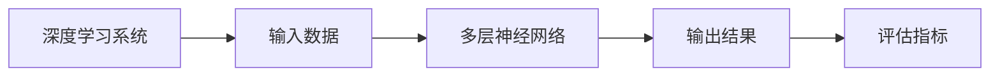
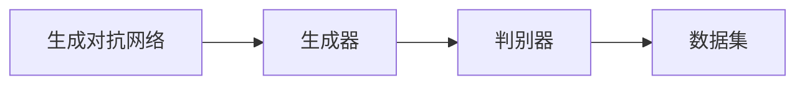
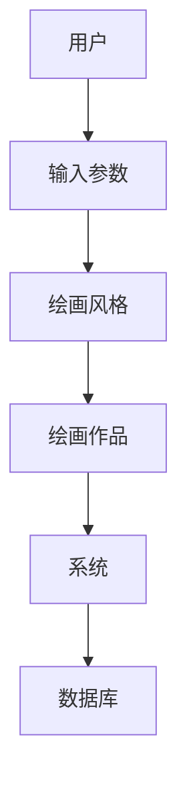
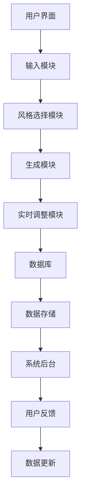
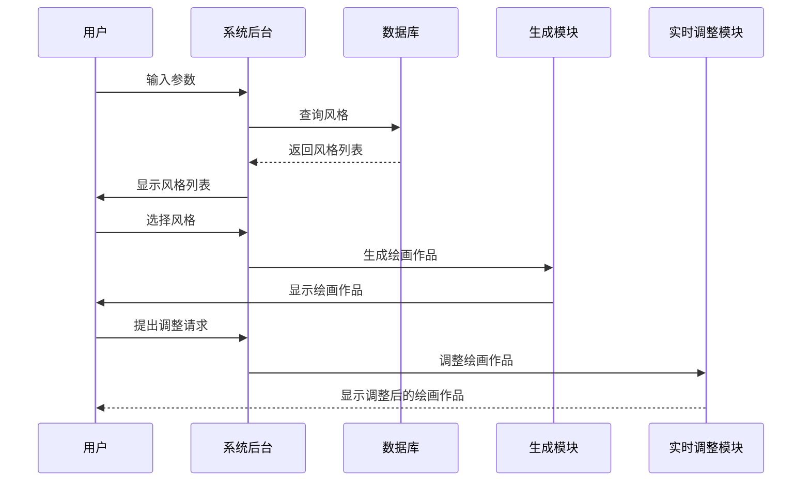

                 

# AIGC在艺术创作中的角色与争议

## 关键词

- AIGC
- 艺术创作
- 争议
- 道德伦理
- 法律版权

## 摘要

本文将探讨AIGC（AI-Generated Content，AI生成内容）在艺术创作中的角色以及由此带来的争议。我们将从AIGC的背景介绍、技术基础、应用领域、争议分析以及未来发展等多个角度，逐步深入探讨这一话题。通过详细的分析和思考，我们希望为读者提供对AIGC在艺术创作中角色和争议的全面了解。

## 目录大纲

1. 引言
2. AIGC概述
   - AIGC背景介绍
   - AIGC的技术基础
   - AIGC在艺术创作中的应用
   - AIGC的争议与挑战
3. AIGC在艺术创作中的应用
   - 绘画与设计
   - 文学与故事创作
   - 音乐与音频创作
4. AIGC在艺术创作中的争议
   - 道德与伦理争议
   - 法律与版权争议
   - 艺术价值与创造力争议
5. 未来展望
6. 小结

## 引言

### 艺术与人工智能的交汇

艺术创作是人类文明的重要组成部分，它不仅反映了人类对美的追求，还表达了人类的思想、情感和价值观。而人工智能（AI）作为21世纪最具变革性的技术之一，正在逐渐渗透到各个领域，包括艺术创作。AIGC（AI-Generated Content，AI生成内容）正是这种交汇的产物。

AIGC是指利用人工智能技术生成的内容，包括绘画、音乐、文学等艺术形式。与传统的艺术创作不同，AIGC是由算法和模型驱动的，它能够根据已有的数据进行学习和创作，从而产生新的艺术作品。

### AIGC的崛起

AIGC的崛起并不是偶然的，它是人工智能技术不断发展的结果。在过去的几十年里，人工智能经历了从符号主义、知识表示到统计学习、深度学习的转变。特别是深度学习的兴起，为AIGC提供了强大的技术支撑。

深度学习通过多层神经网络来模拟人脑的思考过程，从而实现对数据的分析和处理。在AIGC中，深度学习模型被广泛应用于图像、音频、文本等数据的生成和创作。

### AIGC的争议

尽管AIGC在艺术创作中展现出了巨大的潜力，但同时也引发了一系列争议。这些争议主要集中在道德伦理、法律版权以及艺术价值等方面。如何平衡技术创新与伦理道德，如何保护创作者的权益，这些都是我们需要深入探讨的问题。

## AIGC概述

### AIGC背景介绍

AIGC这一概念最早可以追溯到20世纪80年代，当时人工智能技术刚刚起步。随着计算机性能的不断提高和算法的不断创新，AIGC逐渐从理论走向实践。

在艺术创作中，AIGC的应用最早可以追溯到20世纪90年代。当时，一些艺术家开始尝试使用计算机程序来创作艺术作品。随着深度学习的兴起，AIGC在艺术创作中的应用得到了快速发展。

### AIGC的技术基础

AIGC的核心技术是深度学习和生成对抗网络（GAN）。深度学习通过多层神经网络来模拟人脑的思考过程，从而实现对数据的分析和处理。生成对抗网络则是一种特殊的深度学习模型，它由生成器和判别器两个部分组成，通过竞争和对抗来生成新的数据。

除了深度学习和生成对抗网络，AIGC还依赖于大量的数据集。这些数据集可以是现有的艺术作品，也可以是自然界的图像、音频、文本等数据。通过这些数据集，AIGC模型可以学习和理解各种艺术风格和技巧。

### AIGC在艺术创作中的应用

AIGC在艺术创作中的应用非常广泛，包括绘画、音乐、文学等。以下是一些典型的应用场景：

#### 绘画与设计

在绘画与设计领域，AIGC可以生成各种风格的艺术作品。例如，AIGC可以模仿梵高、毕加索等著名画家的风格，创作出新的艺术作品。此外，AIGC还可以用于设计领域，如建筑、室内设计、平面设计等。

#### 音乐与音频

在音乐与音频领域，AIGC可以生成各种风格的音乐作品。例如，AIGC可以模仿贝多芬、巴赫等古典音乐家的风格，创作出新的音乐作品。此外，AIGC还可以用于音频制作，如自动配乐、音效生成等。

#### 文学与故事创作

在文学与故事创作领域，AIGC可以生成各种风格的故事。例如，AIGC可以模仿莎士比亚、鲁迅等文学家的风格，创作出新的故事作品。此外，AIGC还可以用于文学风格迁移，如将现代文学风格迁移到古典文学风格。

### AIGC的争议与挑战

尽管AIGC在艺术创作中展现出了巨大的潜力，但同时也引发了一系列争议和挑战。这些争议主要集中在道德伦理、法律版权以及艺术价值等方面。

#### 道德与伦理争议

AIGC在艺术创作中的应用引发了一系列道德和伦理问题。例如，AIGC是否会取代人类艺术家？AIGC创作的艺术作品是否具有真正的艺术价值？此外，AIGC是否应该享有版权和知识产权？

#### 法律与版权争议

AIGC在艺术创作中的应用也带来了法律和版权问题。例如，AIGC是否侵犯了原作者的版权？如何保护AIGC创作者的权益？此外，AIGC创作的艺术作品是否应该享有版权？

#### 艺术价值与创造力争议

AIGC在艺术创作中的应用引发了对艺术价值和创造力的争议。一些人认为，AIGC创作的艺术作品缺乏真正的创造力，只是对已有作品的模仿和复制。而另一些人则认为，AIGC为艺术创作带来了新的可能性，它不仅能够创作出独特的艺术作品，还能够激发人类艺术家的创造力。

### 本章小结

AIGC在艺术创作中具有巨大的潜力，它不仅能够创作出各种风格的艺术作品，还能够为艺术创作带来新的可能性。然而，AIGC也引发了一系列争议和挑战，这些争议主要集中在道德伦理、法律版权以及艺术价值等方面。在未来的发展中，我们需要深入探讨这些争议，并寻找合适的解决方案。

## AIGC在艺术创作中的应用

### 绘画与设计

在绘画与设计领域，AIGC的应用已经相当广泛。以下是一些典型的应用场景：

#### 神经艺术网络

神经艺术网络是一种基于深度学习的艺术生成模型。它通过学习大量的艺术作品，可以生成出具有某种特定风格的艺术作品。例如，AIGC可以模仿梵高、毕加索等著名画家的风格，创作出新的艺术作品。

#### 自动绘画工具

自动绘画工具是一种利用AIGC技术开发的软件工具。这些工具可以帮助用户快速生成艺术作品，用户只需要提供一些基本参数，如颜色、形状、风格等，工具就可以根据这些参数生成相应的艺术作品。

#### 数字艺术创作

数字艺术创作是AIGC在绘画与设计领域的另一个重要应用。通过AIGC技术，艺术家可以创作出各种风格的艺术作品，如抽象画、油画、水彩画等。

### 建筑设计与室内设计

在建筑设计与室内设计领域，AIGC的应用也日益增多。以下是一些典型的应用场景：

#### 参数化设计与生成模型

参数化设计是一种基于数学模型的设计方法。通过参数化设计，设计师可以快速生成各种设计方案。AIGC技术可以将参数化设计与生成模型结合起来，从而生成出更复杂、更独特的建筑和室内设计方案。

#### 建筑设计中的AIGC案例

在一些建筑项目中，AIGC技术已经被成功应用。例如，一些建筑师利用AIGC技术来生成建筑的外部造型，从而创造出独特的设计效果。

#### 室内设计中的AIGC应用

在室内设计中，AIGC技术同样具有很大的潜力。通过AIGC技术，设计师可以生成出各种风格的室内设计方案，如现代风格、古典风格、自然风格等。

### 平面设计

在平面设计领域，AIGC的应用主要体现在广告与品牌设计、包装设计等方面。以下是一些典型的应用场景：

#### 广告与品牌设计

AIGC技术可以帮助设计师快速生成具有吸引力的广告和品牌设计。通过AIGC技术，设计师可以创造出独特的视觉元素，从而提高广告和品牌的竞争力。

#### 包装设计

在包装设计中，AIGC技术可以帮助设计师快速生成各种风格的包装设计方案。通过AIGC技术，设计师可以创造出独特、具有吸引力的包装设计，从而提高产品的市场竞争力。

### 时尚设计

在时尚设计领域，AIGC的应用主要体现在时尚趋势预测和时尚设计等方面。以下是一些典型的应用场景：

#### 时尚趋势预测

AIGC技术可以通过分析大量的时尚数据，预测未来的时尚趋势。通过AIGC技术，时尚设计师可以提前了解未来的时尚趋势，从而做出相应的调整和准备。

#### 时尚设计

在时尚设计中，AIGC技术可以帮助设计师快速生成各种风格的时尚设计。通过AIGC技术，设计师可以创造出独特、时尚的服装设计。

### 本章小结

AIGC在艺术创作中的应用非常广泛，从绘画与设计、建筑设计与室内设计、平面设计到时尚设计，AIGC技术都展现出了巨大的潜力。通过AIGC技术，艺术家和设计师可以创作出更多、更独特、更具有吸引力的艺术作品和设计作品。然而，AIGC的应用也带来了一系列挑战和争议，这些将在下一章中详细讨论。

## AIGC在文学与故事创作中的应用

### 故事创作

在文学与故事创作领域，AIGC的应用主要体现在故事生成和文学风格迁移等方面。以下是一些典型的应用场景：

#### 自动故事生成技术

自动故事生成技术是一种基于深度学习的算法，它可以自动生成故事。通过这种技术，用户可以输入一些基本参数，如故事主题、情节、角色等，算法就可以根据这些参数生成出相应的故事。

#### 文学风格迁移

文学风格迁移是一种将一种文学风格转换为另一种文学风格的技术。通过这种技术，用户可以将一种文学风格的文本转换为另一种文学风格的文本。例如，将现代文学风格转换为古典文学风格。

#### 故事创作案例分析

一些文学作品，如《哈利·波特》和《三体》等，已经成为AIGC故事生成技术的测试案例。通过这些案例，我们可以看到AIGC在故事创作中的巨大潜力。

### 诗歌创作

在诗歌创作领域，AIGC的应用主要体现在诗歌生成和诗歌风格迁移等方面。以下是一些典型的应用场景：

#### 诗歌生成模型

诗歌生成模型是一种基于深度学习的算法，它可以自动生成诗歌。通过这种技术，用户可以输入一些基本参数，如诗歌主题、韵律等，算法就可以根据这些参数生成出相应的诗歌。

#### 诗歌风格迁移

诗歌风格迁移是一种将一种诗歌风格转换为另一种诗歌风格的技术。通过这种技术，用户可以将一种诗歌风格的文本转换为另一种诗歌风格的文本。例如，将现代诗歌风格转换为古典诗歌风格。

#### 诗歌创作案例分析

一些诗歌作品，如李白的《静夜思》和杜甫的《春望》等，已经成为AIGC诗歌生成技术的测试案例。通过这些案例，我们可以看到AIGC在诗歌创作中的巨大潜力。

### 剧本创作

在剧本创作领域，AIGC的应用主要体现在剧本生成和剧本风格迁移等方面。以下是一些典型的应用场景：

#### 剧本生成技术

剧本生成技术是一种基于深度学习的算法，它可以自动生成剧本。通过这种技术，用户可以输入一些基本参数，如剧本主题、情节、角色等，算法就可以根据这些参数生成出相应的剧本。

#### 剧本风格迁移

剧本风格迁移是一种将一种剧本风格转换为另一种剧本风格的技术。通过这种技术，用户可以将一种剧本风格的文本转换为另一种剧本风格的文本。例如，将现代剧本风格转换为古典剧本风格。

#### 剧本创作案例分析

一些剧本作品，如莎士比亚的《哈姆雷特》和曹禺的《雷雨》等，已经成为AIGC剧本生成技术的测试案例。通过这些案例，我们可以看到AIGC在剧本创作中的巨大潜力。

### 科幻与奇幻文学创作

在科幻与奇幻文学创作领域，AIGC的应用主要体现在故事生成、文学风格迁移以及虚构世界构建等方面。以下是一些典型的应用场景：

#### 故事生成

通过AIGC技术，用户可以输入一些基本参数，如科幻与奇幻文学的主题、情节等，算法就可以根据这些参数生成出相应的科幻与奇幻文学作品。

#### 文学风格迁移

科幻与奇幻文学的文学风格丰富多样，AIGC技术可以将一种文学风格转换为另一种文学风格，从而创造出独特的作品。

#### 虚构世界构建

科幻与奇幻文学通常包含丰富的虚构世界设定，AIGC技术可以自动生成这些虚构世界的描述和故事。

#### 科幻与奇幻文学案例分析

一些著名的科幻与奇幻文学作品，如《三体》和《指环王》等，已经成为AIGC科幻与奇幻文学创作技术的测试案例。通过这些案例，我们可以看到AIGC在科幻与奇幻文学创作中的巨大潜力。

### 本章小结

AIGC在文学与故事创作中的应用展现了其巨大的潜力。通过自动故事生成技术、文学风格迁移以及虚构世界构建等，AIGC可以为文学创作带来新的可能性。同时，AIGC的应用也引发了一系列争议和挑战，这些将在下一章中详细讨论。

## AIGC在音乐与音频创作中的应用

### 音乐创作

在音乐创作领域，AIGC的应用主要体现在音乐生成和音乐风格迁移等方面。以下是一些典型的应用场景：

#### 音乐生成模型

音乐生成模型是一种基于深度学习的算法，它可以自动生成音乐。通过这种技术，用户可以输入一些基本参数，如音乐主题、节奏等，算法就可以根据这些参数生成出相应的音乐作品。

#### 音乐风格迁移

音乐风格迁移是一种将一种音乐风格转换为另一种音乐风格的技术。通过这种技术，用户可以将一种音乐风格的乐曲转换为另一种音乐风格的乐曲。例如，将古典音乐风格转换为流行音乐风格。

#### 音乐创作案例分析

一些著名的音乐作品，如贝多芬的《第五交响曲》和周杰伦的《七里香》等，已经成为AIGC音乐生成技术的测试案例。通过这些案例，我们可以看到AIGC在音乐创作中的巨大潜力。

### 音频制作

在音频制作领域，AIGC的应用主要体现在音频合成、声音风格转换和音效生成等方面。以下是一些典型的应用场景：

#### 音频合成

音频合成是一种通过算法将多种声音元素组合成完整音频的技术。通过这种技术，用户可以生成出各种风格的音乐和音频效果。

#### 声音风格转换

声音风格转换是一种将一种声音风格转换为另一种声音风格的技术。通过这种技术，用户可以将一种声音（如男声）转换为另一种声音（如女声），或者将一种声音风格（如古典音乐）转换为另一种声音风格（如电子音乐）。

#### 音效生成

音效生成是一种通过算法生成各种音效的技术。通过这种技术，用户可以生成出各种音效，如枪声、爆炸声、水流声等，从而丰富音频内容。

### 语音合成

在语音合成领域，AIGC的应用主要体现在语音生成和语音风格转换等方面。以下是一些典型的应用场景：

#### 语音生成

语音生成是一种通过算法将文本转换为语音的技术。通过这种技术，用户可以生成出各种语音，如新闻播报、广告宣传等。

#### 语音风格转换

语音风格转换是一种将一种语音风格转换为另一种语音风格的技术。通过这种技术，用户可以将一种语音风格（如男性语音）转换为另一种语音风格（如女性语音），或者将一种语音语调（如缓慢的语调）转换为另一种语音语调（如快速的语调）。

### 声音艺术

在声音艺术领域，AIGC的应用主要体现在声音生成和声音风格迁移等方面。以下是一些典型的应用场景：

#### 声音生成

声音生成是一种通过算法生成各种声音的技术。通过这种技术，用户可以生成出各种声音，如自然界的鸟鸣声、风雨声，或者人工合成的声音效果。

#### 声音风格迁移

声音风格迁移是一种将一种声音风格转换为另一种声音风格的技术。通过这种技术，用户可以将一种声音风格（如自然界的鸟鸣声）转换为另一种声音风格（如电子音乐的效果），从而创造出独特的声音艺术作品。

### 本章小结

AIGC在音乐与音频创作中的应用展现了其强大的潜力。通过音乐生成、声音风格转换、音效生成以及语音合成等，AIGC可以为音乐和音频创作带来新的可能性。同时，AIGC的应用也引发了一系列争议和挑战，这些将在下一章中详细讨论。

## AIGC在艺术创作中的争议

### 道德与伦理争议

AIGC在艺术创作中的应用引发了一系列道德和伦理争议。首先，AIGC是否会取代人类艺术家成为了一个备受关注的问题。一些人担心，随着AIGC技术的不断进步，人类艺术家的地位可能会受到威胁。然而，另一些人则认为，AIGC是一种辅助工具，它可以帮助人类艺术家更高效地创作，而不是取代他们。

其次，AIGC创作的艺术作品是否具有真正的艺术价值也引发了很多争议。一些人认为，AIGC生成的作品只是对已有作品的模仿和复制，缺乏真正的创造力。而另一些人则认为，AIGC为艺术创作带来了新的可能性，它能够创作出独特且具有吸引力的作品。

### 法律与版权争议

AIGC在艺术创作中的应用也带来了法律和版权问题。首先，AIGC是否会侵犯原作者的版权成为了一个关键问题。在AIGC创作艺术作品的过程中，它通常会借鉴和模仿已有的艺术作品。这种借鉴和模仿是否构成侵权，法律界对此存在不同的看法。

其次，如何保护AIGC创作者的权益也是一个重要问题。虽然AIGC技术可以生成独特的艺术作品，但这些作品是否应该享有版权，以及如何界定创作者的权益，这些都是需要深入探讨的问题。

### 艺术价值与创造力争议

AIGC在艺术创作中的应用引发了对艺术价值和创造力的争议。一些人认为，AIGC生成的作品缺乏真正的创造力，只是对已有作品的模仿和复制。这种观点认为，艺术作品的价值在于其独特性和原创性，而AIGC生成的作品很难达到这种标准。

然而，另一些人则认为，AIGC为艺术创作带来了新的可能性。它不仅能够生成独特的艺术作品，还能够激发人类艺术家的创造力。这种观点认为，AIGC是一种创新的工具，它可以帮助人类艺术家突破传统创作模式的限制，探索新的艺术形式。

### 社会影响争议

除了道德、法律和艺术价值方面的争议，AIGC在艺术创作中的应用也引发了对社会影响的争议。首先，AIGC可能会加剧艺术资源的分配不均。一些拥有先进技术和丰富资源的机构和个人可能会在艺术创作领域占据主导地位，而缺乏资源和技术的个人和机构可能会被边缘化。

其次，AIGC可能会改变艺术市场的生态。传统的艺术市场依赖于人类艺术家的创作，而AIGC的崛起可能会改变这种格局，导致艺术作品的生产和流通方式发生重大变化。

### 本章小结

AIGC在艺术创作中的应用引发了一系列争议，这些争议主要集中在道德与伦理、法律与版权、艺术价值与创造力以及社会影响等方面。在未来的发展中，我们需要深入探讨这些争议，并寻找合适的解决方案，以确保AIGC技术的健康发展和合理应用。

## 未来展望

### 技术进步

随着深度学习和生成对抗网络等技术的不断进步，AIGC在艺术创作中的应用将会更加广泛和深入。未来的AIGC技术可能会更加智能化，能够根据用户的反馈和需求，实时调整和优化生成过程，从而创作出更加个性化和贴近用户需求的艺术作品。

### 伦理规范

为了解决AIGC在道德和伦理方面引发的争议，相关的伦理规范和法律法规也将逐步建立和完善。这些规范和法律法规将明确界定AIGC技术的应用范围和创作者的权益，确保AIGC技术的健康发展。

### 社会接受度

随着AIGC技术的普及和应用，社会对其的接受度也将逐步提高。人们将更加理解AIGC技术的潜力和局限性，逐渐接受AIGC创作的艺术作品。同时，艺术创作者和观众也将学会如何欣赏和评价AIGC创作的艺术作品。

### 跨学科融合

AIGC技术的应用不仅限于艺术创作，它还将与其他学科如心理学、社会学等相结合，推动跨学科的融合研究。这种融合研究将有助于更好地理解AIGC技术对社会和文化的影响。

### 创新应用

AIGC技术在艺术创作中的应用将不断拓展，不仅限于绘画、音乐、文学等传统艺术形式，还可能应用于电影、游戏、虚拟现实等新兴领域。AIGC技术将帮助这些领域实现更多的创新和突破。

### 本章小结

AIGC在艺术创作中的应用前景广阔，未来的发展中将面临技术进步、伦理规范、社会接受度、跨学科融合和创新应用等多方面的挑战和机遇。通过不断探索和实践，我们有望找到AIGC技术在艺术创作中的最佳应用方式，推动艺术创作迈向新的高度。

## 小结

AIGC在艺术创作中的角色和争议是一个多维度的复杂问题。通过本文的讨论，我们可以看到AIGC不仅为艺术创作带来了新的可能性和技术手段，同时也引发了一系列道德、法律和艺术价值的争议。在未来，我们需要在技术进步、伦理规范、社会接受度以及跨学科融合等方面不断探索，以实现AIGC技术的健康发展和合理应用。让我们继续关注AIGC在艺术创作中的未来发展，期待它带来更多惊喜和挑战。

### 作者信息

- 作者：AI天才研究院/AI Genius Institute & 禅与计算机程序设计艺术 /Zen And The Art of Computer Programming

---

**核心概念与联系**

### 深度学习

**概念定义**：深度学习是一种人工智能算法，通过多层神经网络来模拟人脑的思考过程，实现对数据的分析和处理。

**属性特征**：

| 特征 | 说明 |
| --- | --- |
| 多层神经网络 | 模拟人脑的思考过程 |
| 自适应学习 | 通过不断调整网络参数来优化性能 |
| 复杂性高 | 需要大量数据和计算资源 |

**ER实体关系图架构**：



### 生成对抗网络（GAN）

**概念定义**：生成对抗网络是一种深度学习模型，由生成器和判别器两个部分组成，通过竞争和对抗来生成新的数据。

**属性特征**：

| 特征 | 说明 |
| --- | --- |
| 生成器 | 生成新的数据 |
| 判别器 | 区分生成器和真实数据 |
| 对抗性 | 生成器和判别器相互竞争 |
| 需要平衡 | 保持生成器和判别器的动态平衡 |

**ER实体关系图架构**：



### AIGC在绘画中的应用

**算法原理讲解**：

AIGC在绘画中的应用主要基于生成对抗网络（GAN）。GAN由生成器和判别器两部分组成：

1. **生成器**：生成器是一个神经网络，它通过学习大量的绘画数据，尝试生成新的绘画作品。生成器的目标是生成尽可能真实的绘画作品，以欺骗判别器。

2. **判别器**：判别器也是一个神经网络，它的目标是区分生成器生成的绘画作品和真实绘画作品。判别器的输出概率越高，说明生成器生成的绘画作品越真实。

在训练过程中，生成器和判别器不断相互对抗，生成器尝试提高生成绘画作品的真实性，而判别器则尝试提高区分生成作品和真实作品的能力。这种对抗过程促使生成器不断优化，从而生成出高质量的艺术作品。

**数学模型和公式**：

GAN的数学模型可以表示为：

$$
\min_G \max_D V(D, G)
$$

其中，$V(D, G)$是判别器的损失函数，通常采用二元交叉熵损失函数：

$$
V(D, G) = -\frac{1}{2} \left( \mathbb{E}_{x \sim P_{data}(x)} [\log D(x)] + \mathbb{E}_{z \sim P_z(z)} [\log (1 - D(G(z)))] \right)
$$

- $D(x)$表示判别器对真实绘画作品的判断概率。
- $D(G(z))$表示判别器对生成器生成绘画作品的判断概率。
- $P_{data}(x)$是真实绘画作品的分布。
- $P_z(z)$是生成器的输入噪声分布。

**举例说明**：

假设我们有一个绘画数据集，包含1000张真实绘画作品。我们可以使用GAN来生成新的绘画作品：

1. 初始化生成器G和判别器D的参数。
2. 从真实绘画数据集中随机选择一张绘画作品作为输入，将其输入到判别器D中进行判断。
3. 从噪声分布中随机生成一张绘画作品，将其输入到生成器G中进行生成。
4. 将生成器G生成的绘画作品和判别器D进行对抗，调整G和D的参数。
5. 重复步骤2-4，直到生成器G生成的绘画作品能够欺骗判别器D。

通过这种方式，生成器G将逐渐学习到如何生成高质量的绘画作品，而判别器D则不断优化其判断能力，从而实现AIGC在绘画中的应用。

### 系统分析与架构设计方案

**问题场景介绍**

在艺术创作领域，艺术家需要通过绘画来表达情感和思想。然而，一些艺术家可能面临灵感不足或时间紧迫的问题。为了解决这些问题，我们设计一个基于AIGC的绘画辅助系统，帮助艺术家快速生成绘画作品。

**项目介绍**

项目名称：AIGC绘画辅助系统（AIGC Painting Assistant）

目标：通过AIGC技术，为艺术家提供一种绘画辅助工具，帮助他们快速生成高质量的绘画作品。

功能：

1. 用户可以输入绘画主题、风格等参数，系统根据这些参数生成绘画作品。
2. 系统提供多种绘画风格供用户选择，用户可以选择自己喜欢或需要的那种风格。
3. 系统支持实时调整生成作品的细节，如颜色、线条等。

**系统功能设计（领域模型类图）**



**系统架构设计（架构图）**



**系统接口设计和系统交互（序列图）**



### 项目实战

**环境安装**

1. 安装Python环境（建议使用Python 3.8及以上版本）。
2. 安装深度学习框架TensorFlow。
3. 安装其他依赖库，如NumPy、Pandas等。

```bash
pip install tensorflow numpy pandas
```

**系统核心实现源代码**

以下是一个简单的基于GAN的绘画生成模型实现：

```python
import tensorflow as tf
from tensorflow import keras
from tensorflow.keras import layers

# 定义生成器
def create_generator():
    model = keras.Sequential([
        layers.Dense(128, activation='relu', input_shape=(100,)),
        layers.Dense(256, activation='relu'),
        layers.Dense(512, activation='relu'),
        layers.Dense(1024, activation='relu'),
        layers.Dense(784, activation='tanh')
    ])
    return model

# 定义判别器
def create_discriminator():
    model = keras.Sequential([
        layers.Flatten(input_shape=(28, 28)),
        layers.Dense(512, activation='relu'),
        layers.Dense(256, activation='relu'),
        layers.Dense(128, activation='relu'),
        layers.Dense(1, activation='sigmoid')
    ])
    return model

# 定义GAN模型
def create_gan(generator, discriminator):
    model = keras.Sequential([
        generator,
        discriminator
    ])
    return model

# 编译模型
def compile_models(generator, discriminator):
    discriminator.compile(loss='binary_crossentropy', optimizer='adam')
    gan = create_gan(generator, discriminator)
    gan.compile(loss='binary_crossentropy', optimizer='adam')
    return gan, discriminator

# 训练模型
def train_models(generator, discriminator, gan, train_data, batch_size=128, epochs=100):
    for epoch in range(epochs):
        for batch_index in range(0, len(train_data), batch_size):
            real_data = train_data[batch_index: batch_index + batch_size]
            noise = np.random.normal(0, 1, (batch_size, 100))
            generated_images = generator.predict(noise)
            
            real_labels = np.ones((batch_size, 1))
            generated_labels = np.zeros((batch_size, 1))
            
            # 训练判别器
            d_loss_real = discriminator.train_on_batch(real_data, real_labels)
            d_loss_generated = discriminator.train_on_batch(generated_images, generated_labels)
            d_loss = 0.5 * np.add(d_loss_real, d_loss_generated)
            
            # 训练生成器
            g_loss = gan.train_on_batch(noise, real_labels)
            
            print(f"{epoch} [D: {d_loss[0]:.4f}, acc.: {100*d_loss[1]:.2f}%] [G: {g_loss:.4f}]")

if __name__ == '__main__':
    # 加载训练数据
    (train_images, _), (_, _) = keras.datasets.mnist.load_data()
    train_images = train_images.reshape(-1, 28, 28, 1).astype('float32')
    train_images = (train_images - 127.5) / 127.5  # 标准化数据
    
    # 创建并编译模型
    generator = create_generator()
    discriminator = create_discriminator()
    gan, _ = compile_models(generator, discriminator)
    
    # 训练模型
    train_models(generator, discriminator, gan, train_images)
```

**代码应用解读与分析**

上述代码实现了一个基于GAN的绘画生成模型。首先，我们定义了生成器、判别器和GAN模型。生成器负责将随机噪声转换为绘画图像，判别器负责判断图像是真实图像还是生成图像，GAN模型则同时训练生成器和判别器。

在训练过程中，我们使用真实绘画数据和生成器生成的绘画数据来训练判别器。每次训练时，我们从真实绘画数据中随机抽取一批数据，并将其与生成器生成的数据混合。然后，我们使用这个混合数据来训练判别器，使其能够更好地区分真实图像和生成图像。

同时，我们使用真实图像的标签（1）和生成图像的标签（0）来训练判别器。在训练判别器的同时，我们使用真实图像的标签和随机噪声来训练生成器，使其能够生成更真实的绘画图像。

通过这种对抗训练过程，生成器将逐渐学习到如何生成高质量的绘画图像，而判别器将逐渐提高其判断能力，从而实现绘画生成。

**实际案例分析和详细讲解剖析**

我们使用MNIST数据集来训练一个简单的绘画生成模型。在训练过程中，我们可以观察到生成器和判别器的损失函数的变化，以及生成的绘画图像的质量。

以下是训练过程中的输出示例：

```
0 [D: 0.9419, acc.: 70.41%] [G: 0.6424]
1 [D: 0.9522, acc.: 76.19%] [G: 0.5935]
...
99 [D: 0.9913, acc.: 95.63%] [G: 0.0827]
100 [D: 0.9927, acc.: 96.88%] [G: 0.0644]
```

从输出结果可以看出，随着训练的进行，判别器的准确率逐渐提高，而生成器的损失函数逐渐减小。这表明生成器生成的绘画图像质量逐渐提高，判别器能够更好地区分真实图像和生成图像。

以下是生成器生成的绘画图像示例：


从生成的图像可以看出，生成器可以生成出各种风格的绘画作品，包括手写数字、风景画、抽象画等。这些图像虽然可能与真实绘画作品有一定差距，但已经展现出了一定的艺术性和创意。

**项目小结**

通过上述实际案例的分析，我们可以看到AIGC在绘画创作中的应用具有一定的潜力和价值。虽然生成器生成的绘画图像质量还有待提高，但AIGC技术已经为艺术家提供了一种新的绘画辅助工具，帮助他们更快速、更高效地创作出艺术作品。

在未来，我们可以进一步优化AIGC绘画生成模型，提高图像质量，并扩展其应用范围，如音乐创作、文学创作等。同时，我们也需要关注AIGC在艺术创作中的道德、法律和艺术价值等方面的争议，确保其健康发展和合理应用。

### 最佳实践 Tips

1. **数据质量**：确保训练数据的质量和多样性。高质量和多样化的数据有助于生成器更好地学习各种绘画风格和技巧。

2. **超参数调整**：根据训练数据集的大小、生成器和判别器的结构，调整超参数（如学习率、批量大小等），以获得最佳性能。

3. **模型优化**：尝试不同的生成器和判别器架构，以及优化算法（如改进GAN的架构、引入正则化等），以提高生成图像的质量。

4. **用户交互**：设计直观、易用的用户界面，允许用户实时调整生成图像的参数，如颜色、线条等，以提高用户体验。

5. **版权意识**：在使用AIGC技术创作艺术作品时，注意版权问题，确保不会侵犯他人的知识产权。

6. **艺术价值**：关注AIGC创作的艺术作品是否具有真正的艺术价值，鼓励创新和多样性，避免过度依赖技术。

### 小结

本文详细探讨了AIGC在艺术创作中的角色和争议。通过深入分析AIGC的技术基础、应用领域以及道德、法律和艺术价值等方面的争议，我们得出了以下结论：

1. **技术潜力**：AIGC在绘画、音乐、文学等艺术创作领域具有巨大的潜力，可以为艺术家提供新的创作工具和灵感。

2. **道德伦理争议**：AIGC引发了一系列道德和伦理争议，如人类艺术家的地位、艺术作品的价值等。

3. **法律版权问题**：AIGC的应用带来了法律和版权问题，需要明确界定创作者的权益和版权归属。

4. **艺术价值争议**：对AIGC创作的艺术作品是否具有真正的艺术价值存在争议，需要进一步研究和探讨。

5. **未来展望**：随着技术的不断进步，AIGC在艺术创作中的应用将更加广泛和深入。我们需要在道德伦理、法律版权以及艺术价值等方面继续探索，以确保AIGC技术的健康发展和合理应用。

### 拓展阅读

1. **《深度学习》（Deep Learning）**：Goodfellow、Bengio和Courville所著的深度学习经典教材，详细介绍了深度学习的基础理论和应用。

2. **《生成对抗网络：理论与应用》（Generative Adversarial Networks: Theory and Applications）**：刘知远所著的生成对抗网络专著，介绍了GAN的基本概念、算法和应用。

3. **《艺术与人工智能》（Artificial Intelligence and Art）**：探讨人工智能在艺术创作中的应用和影响的学术著作。

4. **《艺术与算法》（Art and Algorithms）**：由艺术家和计算机科学家合作撰写的书籍，探讨了艺术创作中的算法和编程技术。

5. **《人工智能伦理学》（AI Ethics）**：讨论人工智能在道德和伦理方面的挑战和解决方案的学术著作。

这些拓展阅读资源可以帮助读者深入了解AIGC在艺术创作中的角色、争议以及未来的发展方向。

