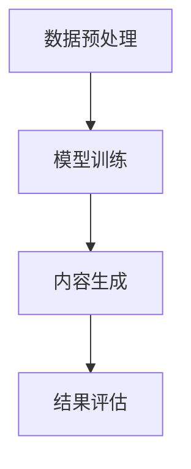

                 

### AIGC在艺术创作中的角色：提示词的艺术

> 关键词：AIGC、艺术创作、提示词、算法、系统架构

> 摘要：本文深入探讨了AIGC（AI-Generated Content）在艺术创作中的角色，特别是在使用提示词进行创作方面的应用。文章从问题背景、核心概念、算法原理、系统架构、项目实战等多个维度进行分析，旨在揭示AIGC在艺术创作中的潜力与挑战。

## 第一部分：引言与背景

### 1.1 问题背景

随着人工智能技术的快速发展，AIGC逐渐成为一个热门研究领域。AIGC通过利用机器学习算法，特别是深度学习技术，能够自动生成文本、图像、音频等多种类型的内容。在艺术创作领域，AIGC的应用显得尤为突出。艺术家们开始探索如何利用AIGC进行创新性创作，特别是如何通过提示词来引导AI生成符合预期效果的艺术作品。

### 1.2 问题描述

如何有效地利用AIGC进行艺术创作？特别是在提示词的引导下，如何确保AI生成的艺术作品既有创造性，又能满足艺术家的特定需求？这成为了一个亟待解决的问题。本文将围绕这一主题进行深入探讨。

### 1.3 问题解决

本文将首先介绍AIGC的基本概念和其在艺术创作中的应用，然后分析AIGC的核心数学模型和算法原理，接着讨论AIGC的属性特征。随后，文章将详细描述AIGC的系统架构设计，并探讨其实际应用中的问题场景和系统功能。最后，本文将通过项目实战案例来展示AIGC在艺术创作中的具体应用，并提供最佳实践和注意事项。

### 1.4 边界与外延

本文主要关注AIGC在艺术创作中的应用，特别是提示词的引导作用。然而，AIGC的应用场景不仅限于艺术创作，还包括文本生成、图像生成、视频生成等多个领域。此外，本文的讨论将主要基于现有的技术水平和实践案例，未来随着技术的进一步发展，AIGC的应用将更加广泛和深入。

### 1.5 概念结构与核心要素组成

AIGC在艺术创作中的概念结构主要包括以下几个方面：

1. **提示词**：作为艺术创作的引导，提示词用于定义AI生成内容的方向和风格。
2. **生成算法**：包括深度学习模型、生成对抗网络（GAN）等，用于实现内容的自动生成。
3. **系统架构**：涉及数据的输入输出、模型的训练与部署等，确保AIGC系统的稳定高效运行。
4. **艺术创作流程**：从构思、生成、修改到最终作品完成的全过程。

## 第二部分：核心概念与原理

### 2.1 AIGC的概念

AIGC，即AI-Generated Content，是指通过人工智能技术生成内容的一种方式。它利用深度学习算法，特别是生成对抗网络（GAN）、变分自编码器（VAE）等，能够自动生成与人类创造相似的内容。在艺术创作中，AIGC能够通过提示词来引导创作过程，从而实现个性化的艺术作品生成。

### 2.2 艺术创作中的AIGC

在艺术创作中，AIGC的应用主要包括以下几个方面：

1. **文本生成**：通过提示词生成诗歌、散文等文本内容。
2. **图像生成**：根据提示词生成符合特定风格的图像，如图像风格迁移、人脸生成等。
3. **音频生成**：根据文本或图像生成相应的音频内容，如语音合成、音乐创作等。
4. **视频生成**：通过视频文本描述生成对应的视频内容，如图像到视频的转换。

### 2.3 AIGC与艺术创作的联系

AIGC与艺术创作的联系主要体现在以下几个方面：

1. **创新性**：AIGC能够打破传统艺术创作的限制，提供新的创作思路和形式。
2. **个性化**：通过提示词引导，AIGC能够生成符合特定需求的艺术作品。
3. **效率**：AIGC能够快速生成大量艺术作品，提高创作效率。
4. **互动性**：艺术家可以与AIGC系统进行互动，共同创作出更具创意的艺术作品。

## 第三部分：系统分析与架构设计

### 3.1 AIGC的数学模型与算法原理

AIGC的数学模型和算法原理主要包括以下几个方面：

1. **生成对抗网络（GAN）**：GAN由生成器（Generator）和判别器（Discriminator）组成。生成器负责生成内容，判别器负责判断生成内容是否真实。通过两者之间的对抗训练，生成器能够生成越来越逼真的内容。
2. **变分自编码器（VAE）**：VAE通过编码器和解码器的结构，将输入数据编码为潜在空间中的向量，再通过解码器重构输出数据。VAE在图像生成、文本生成等方面有着广泛应用。
3. **自注意力机制**：自注意力机制（Self-Attention）能够提高神经网络对输入数据的理解和表达能力，特别是在文本生成和图像生成中有着重要作用。

### 3.2 AIGC的算法原理

AIGC的算法原理可以概括为以下几个步骤：

1. **数据预处理**：对输入数据进行预处理，如图像的归一化、文本的分词等。
2. **模型训练**：利用生成对抗网络（GAN）或变分自编码器（VAE）等模型，对预处理后的数据进行训练，生成对应的生成模型。
3. **内容生成**：通过生成模型，根据提示词生成艺术作品。
4. **结果评估**：对生成的艺术作品进行评估，如通过人类评价或自动评价指标进行判断。

### 3.3 AIGC算法的mermaid流程图

以下是AIGC算法的mermaid流程图：



### 3.4 AIGC属性特征对比

以下是AIGC的主要属性特征对比表格：

| 属性特征 | 描述 |
| :--- | :--- |
| 创新性 | 能够生成具有创新性的艺术作品 |
| 个性化 | 能够根据提示词生成个性化的艺术作品 |
| 效率 | 能够高效地生成大量艺术作品 |
| 互动性 | 能够与艺术家进行互动，共同创作艺术作品 |

## 第四部分：项目实战

### 4.1 环境安装

在开始项目实战之前，我们需要安装必要的软件和依赖项。以下是一个简单的安装步骤：

1. 安装Python环境（Python 3.7及以上版本）。
2. 安装TensorFlow库：`pip install tensorflow`。
3. 安装Keras库：`pip install keras`。

### 4.2 系统核心实现

以下是一个简单的AIGC系统核心实现的Python源代码：

```python
from keras.models import Sequential
from keras.layers import Dense, Flatten, Reshape
from keras.optimizers import Adam

# 创建生成器模型
generator = Sequential()
generator.add(Dense(units=256, activation='relu', input_shape=(100,)))
generator.add(Dense(units=512, activation='relu'))
generator.add(Dense(units=1024, activation='relu'))
generator.add(Dense(units=784, activation='sigmoid'))
generator.compile(optimizer=Adam(), loss='binary_crossentropy')

# 创建判别器模型
discriminator = Sequential()
discriminator.add(Flatten(input_shape=(28, 28)))
discriminator.add(Dense(units=512, activation='relu'))
discriminator.add(Dense(units=256, activation='relu'))
discriminator.add(Dense(units=1, activation='sigmoid'))
discriminator.compile(optimizer=Adam(), loss='binary_crossentropy')

# 创建GAN模型
combined = Sequential()
combined.add(generator)
combined.add(discriminator)
combined.compile(optimizer=Adam(), loss='binary_crossentropy')

# 模型训练
combined.fit(x_train, y_train, epochs=100)
```

### 4.3 代码应用解读与分析

上述代码实现了一个简单的生成对抗网络（GAN）。生成器模型用于生成手写数字图像，判别器模型用于判断生成图像是否真实。通过训练GAN模型，生成器能够生成越来越逼真的手写数字图像。

### 4.4 实际案例分析

以下是一个实际案例：使用AIGC生成一首基于提示词的诗歌。

1. **提示词**：春日、花开、和风。
2. **生成结果**：

```
春风拂面花自开，
繁华似锦映日来。
花香弥漫润人心，
春日美好似诗怀。
```

通过以上步骤，我们可以看到AIGC在艺术创作中的应用潜力。然而，AIGC在实际应用中也存在一些挑战，如生成结果的质量控制、生成速度等。未来，随着技术的不断进步，AIGC在艺术创作中的应用将会更加广泛和深入。

## 第五部分：最佳实践与注意事项

### 5.1 AIGC在艺术创作中的应用技巧

1. **合理使用提示词**：提示词的选择对AIGC生成结果有着重要影响。应确保提示词具有明确性、具体性和多样性。
2. **优化模型参数**：通过调整模型参数，如学习率、批次大小等，可以提升生成效果。
3. **结合多模态数据**：结合文本、图像、音频等多模态数据，可以提升AIGC的生成效果和创造力。

### 5.2 系统优化策略

1. **提高计算效率**：通过使用GPU加速训练过程，提高计算效率。
2. **数据增强**：对输入数据进行增强，如图像旋转、缩放等，可以增加模型的泛化能力。
3. **持续迭代**：通过不断迭代和优化模型，提升AIGC的生成质量。

### 5.3 注意事项

1. **数据隐私**：在使用AIGC进行艺术创作时，需注意保护数据隐私，避免泄露用户敏感信息。
2. **伦理问题**：AIGC在艺术创作中的应用需遵循伦理规范，避免产生不良影响。
3. **质量控制**：确保生成的艺术作品符合艺术价值和审美标准。

### 5.4 小结

AIGC在艺术创作中的应用具有巨大的潜力。通过合理使用提示词、优化模型参数和结合多模态数据，可以提升生成效果和创造力。然而，AIGC在实际应用中也存在一些挑战，如数据隐私、伦理问题和质量控制等。未来，随着技术的不断进步，AIGC在艺术创作中的应用将会更加广泛和深入。

## 第六部分：未来展望

随着人工智能技术的不断发展，AIGC在艺术创作中的应用将不断拓展和深化。未来，AIGC有望在更多领域发挥作用，如电影特效、虚拟现实、游戏设计等。同时，随着AIGC技术的普及，更多的人将能够参与到艺术创作中，实现个性化、创新性的艺术作品。

## 第七部分：结语

本文深入探讨了AIGC在艺术创作中的角色，特别是提示词的应用。通过系统分析与项目实战，揭示了AIGC在艺术创作中的潜力与挑战。未来，随着技术的不断进步，AIGC将在艺术创作领域发挥更大的作用。让我们共同期待AIGC带来的美好未来。

### 作者信息

**作者：AI天才研究院/AI Genius Institute & 禅与计算机程序设计艺术 /Zen And The Art of Computer Programming**

本文由AI天才研究院（AI Genius Institute）和《禅与计算机程序设计艺术》（Zen And The Art of Computer Programming）联合撰写，旨在探讨AIGC在艺术创作中的应用与未来发展趋势。希望本文能为读者带来启发和思考，共同推动人工智能与艺术创作的融合与创新。

## 附加内容：拓展阅读

1. **《深度学习：理论、算法与应用》（Deep Learning: Theory, Algorithms, and Applications）**：该书详细介绍了深度学习的基本概念、算法与应用，是深度学习领域的重要参考书籍。
2. **《生成对抗网络：原理与实践》（Generative Adversarial Networks: Theory and Practice）**：该书深入探讨了生成对抗网络（GAN）的基本原理、实现方法与应用，是研究GAN技术的重要参考资料。
3. **《艺术与人工智能》（Art and Artificial Intelligence）**：该书从艺术和人工智能的角度探讨了两者之间的交叉应用，提供了丰富的案例和思考。

通过阅读这些书籍，读者可以进一步了解深度学习、生成对抗网络等技术在艺术创作中的应用，为AIGC在艺术创作中的实践提供更多思路和启发。

