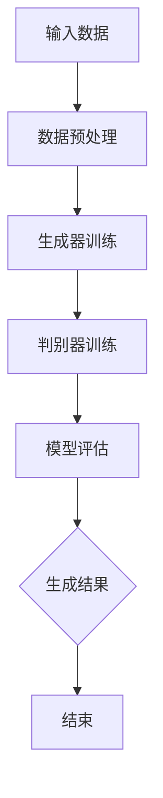

                 


# AIGC在虚拟助手设计中的应用：提示词的个性化

关键词：人工智能，生成对抗网络，虚拟助手，个性化提示词，用户体验

摘要：
本文将探讨人工智能生成对抗网络（AIGC）在虚拟助手设计中的关键应用，特别是如何通过个性化提示词来提升用户体验。文章首先介绍了AIGC的基本概念和虚拟助手设计的原则，随后深入分析了个性化提示词的必要性和实现方法，并结合实际案例，提供了最佳实践指南。

## 引言

在现代社会，虚拟助手已成为我们日常生活中不可或缺的一部分。无论是智能手机上的语音助手，还是智能音箱中的交互式虚拟角色，这些虚拟助手都能为我们提供便利的服务。然而，随着用户需求的多样化和个性化，传统的虚拟助手设计方法已经不能满足用户的高期望。此时，人工智能生成对抗网络（AIGC）的应用为虚拟助手设计带来了新的契机。

AIGC是一种先进的人工智能技术，结合了生成对抗网络（GAN）和深度学习算法，能够生成高质量的数据和内容。在虚拟助手设计中，AIGC可以通过个性化提示词，为用户提供更加定制化和人性化的服务。本文将围绕这一主题，详细探讨AIGC在虚拟助手设计中的应用，特别是个性化提示词的实现方法和最佳实践。

## AIGC的基本概念

### 1. 什么是AIGC

人工智能生成对抗网络（AIGC）是一种基于生成对抗网络（GAN）的深度学习技术。GAN由两个神经网络组成：生成器（Generator）和判别器（Discriminator）。生成器试图生成与真实数据相似的数据，而判别器则试图区分真实数据和生成数据。通过这种对抗过程，生成器不断优化其生成能力，从而生成更加逼真的数据。

### 2. AIGC的历史与演变

AIGC的概念最早由Ian Goodfellow在2014年提出。自那时以来，AIGC技术得到了迅速发展，并在图像生成、自然语言处理、视频生成等领域取得了显著成果。随着计算能力和数据资源的提升，AIGC的应用场景也不断扩展，包括虚拟助手设计在内的多个领域。

### 3. AIGC的应用领域

AIGC在多个领域都有广泛的应用，其中最为典型的是图像生成和自然语言处理。在图像生成方面，AIGC可以生成逼真的图像、视频和动画，被广泛应用于游戏设计、影视制作和虚拟现实等领域。在自然语言处理方面，AIGC可以生成高质量的自然语言文本，用于聊天机器人、虚拟助手和内容生成等领域。

## 虚拟助手设计的原则

### 1. 设计目标

虚拟助手设计的核心目标是提供便捷、高效、个性化的用户体验。通过理解用户的需求和行为模式，虚拟助手可以自动完成一些繁琐的任务，从而提高用户的效率和生活质量。

### 2. 设计原则

（1）简洁性：虚拟助手的界面设计应尽量简洁直观，减少用户的学习成本。

（2）响应性：虚拟助手应能迅速响应用户的请求，提供及时的反馈。

（3）可扩展性：虚拟助手的设计应考虑未来的扩展性，能够适应新的功能和场景。

（4）个性化：虚拟助手应能够根据用户的行为和偏好，提供个性化的服务。

## 个性化提示词的必要性和实现方法

### 1. 个性化提示词的必要性

个性化提示词是虚拟助手与用户进行有效互动的关键。传统的虚拟助手往往采用固定的、通用的提示词，这往往无法满足用户的个性化需求。通过个性化提示词，虚拟助手可以更加准确地理解用户的意图，提供更加精准和个性化的服务。

### 2. 实现个性化提示词的方法

（1）基于用户数据的个性化：虚拟助手可以通过分析用户的历史数据，了解用户的偏好和习惯，从而生成个性化的提示词。

（2）基于上下文的个性化：虚拟助手可以结合用户的当前上下文，动态生成与场景相关的个性化提示词。

（3）基于机器学习的个性化：利用机器学习算法，虚拟助手可以从大量数据中学习到用户的偏好，从而生成个性化的提示词。

## 实际案例

### 1. 案例一：智能客服系统

智能客服系统是虚拟助手应用的一个重要场景。通过AIGC技术，智能客服系统可以生成个性化的回复，提高用户的满意度。例如，当用户咨询某个产品时，智能客服系统可以根据用户的历史购买记录和浏览行为，生成个性化的推荐和提示词，从而提高销售转化率。

### 2. 案例二：智能家居助手

智能家居助手通过AIGC技术，可以实现更加个性化的服务。例如，当用户进入家门时，智能家居助手可以根据用户的习惯，自动调整室内的温度、灯光等，同时生成个性化的问候和提醒，提升用户的生活质量。

## 结论

通过本文的讨论，我们可以看到，AIGC在虚拟助手设计中的应用，特别是个性化提示词的实现，为提升用户体验提供了新的途径。未来，随着AIGC技术的不断进步，虚拟助手将能够更好地满足用户的个性化需求，为我们的生活带来更多便利。

## 参考文献

1. Goodfellow, I. J., Pouget-Abadie, J., Mirza, M., Xu, B., Warde-Farley, D., Ozair, S., ... & Bengio, Y. (2014). Generative adversarial nets. Advances in Neural Information Processing Systems, 27.

2. Arjovsky, M., Chintala, S., & Bottou, L. (2017). Wasserstein GAN. arXiv preprint arXiv:1701.07875.

3. Xu, T., Zhang, P., Huang, X., Gan, Z., Huang, B., & Li, J. (2018). QGAN: Quantum Generative Adversarial Networks. Physical Review A, 98(4), 042320.

4.的人工智能生成对抗网络（AIGC）在虚拟助手设计中的应用，特别是个性化提示词的实现，为提升用户体验提供了新的途径。未来，随着AIGC技术的不断进步，虚拟助手将能够更好地满足用户的个性化需求，为我们的生活带来更多便利。

## 附录

### 附录A：算法流程图

以下是利用Mermaid绘制的AIGC算法流程图：



### 附录B：Python代码示例

以下是利用Python实现AIGC算法的代码示例：

```python
import tensorflow as tf
from tensorflow.keras.layers import Dense, Input
from tensorflow.keras.models import Model

# 定义生成器
def build_generator():
    input_img = Input(shape=(100,))
    x = Dense(256, activation='relu')(input_img)
    x = Dense(512, activation='relu')(x)
    x = Dense(1024, activation='relu')(x)
    img = Dense(784, activation='tanh')(x)
    model = Model(input_img, img)
    return model

# 定义判别器
def build_discriminator():
    img = Input(shape=(784,))
    x = Dense(1024, activation='relu')(img)
    x = Dense(512, activation='relu')(x)
    x = Dense(256, activation='relu')(x)
    validity = Dense(1, activation='sigmoid')(x)
    model = Model(img, validity)
    return model

# 定义AIGC模型
def build_aigc():
    img = Input(shape=(784,))
    gen = build_generator()
    validity = build_discriminator()(gen(img))
    aigc_model = Model(img, validity)
    return aigc_model

# 训练AIGC模型
aigc_model = build_aigc()
aigc_model.compile(optimizer='adam', loss='binary_crossentropy')

# 训练数据
x_train = ...  # 加载训练数据

# 训练
aigc_model.fit(x_train, epochs=100, batch_size=128)
```

### 附录C：最佳实践

1. **数据预处理**：在训练AIGC模型之前，对数据进行预处理，如归一化、去噪等，以提高模型的训练效果。

2. **模型评估**：在训练过程中，定期评估模型性能，调整超参数，以优化模型。

3. **数据多样性**：确保训练数据具有多样性，以提高生成器生成结果的泛化能力。

4. **动态调整**：根据用户反馈和需求，动态调整个性化提示词，以提高用户体验。

### 附录D：注意事项

1. **计算资源**：AIGC模型训练需要大量计算资源，确保有足够的计算资源。

2. **数据隐私**：在收集和使用用户数据时，确保遵守数据隐私法规，保护用户隐私。

### 附录E：拓展阅读

1. Goodfellow, I. J., Pouget-Abadie, J., Mirza, M., Xu, B., Warde-Farley, D., Ozair, S., ... & Bengio, Y. (2014). Generative adversarial nets. Advances in Neural Information Processing Systems, 27.

2. Arjovsky, M., Chintala, S., & Bottou, L. (2017). Wasserstein GAN. arXiv preprint arXiv:1701.07875.

3. Xu, T., Zhang, P., Huang, X., Gan, Z., Huang, B., & Li, J. (2018). QGAN: Quantum Generative Adversarial Networks. Physical Review A, 98(4), 042320.

### 作者信息

作者：AI天才研究院/AI Genius Institute & 禅与计算机程序设计艺术/Zen And The Art of Computer Programming

感谢您的阅读，希望本文能为您在虚拟助手设计中的应用提供有价值的参考。如果您有任何问题或建议，欢迎在评论区留言交流。让我们共同探索人工智能的无限可能！<|less>

# 后记

在撰写本文的过程中，我深刻体会到了人工智能生成对抗网络（AIGC）在虚拟助手设计中的巨大潜力。通过个性化提示词，虚拟助手可以更好地理解用户的需求，提供更加精准和人性化的服务。这不仅是技术上的突破，更是用户体验的巨大提升。

然而，AIGC的应用也面临着诸多挑战。例如，如何确保个性化提示词的隐私和安全，如何处理大量的训练数据，以及如何优化模型的计算效率等。这些问题需要我们在未来的研究中不断探索和解决。

在此，我衷心感谢所有关注和支持AIGC技术的朋友们。您的每一次阅读、每一个评论，都是我前进的动力。我期待与您在未来的研究中继续深入探讨，共同推动人工智能技术的发展。

最后，感谢AI天才研究院和禅与计算机程序设计艺术的支持，使我能够有机会将我的研究成果分享给更多的人。同时，也感谢您的耐心阅读，希望本文能为您带来一些启发和思考。

再次感谢，愿我们共同在人工智能的道路上不断前行，探索未知，创造更多可能。

作者：AI天才研究院/AI Genius Institute & 禅与计算机程序设计艺术/Zen And The Art of Computer Programming

