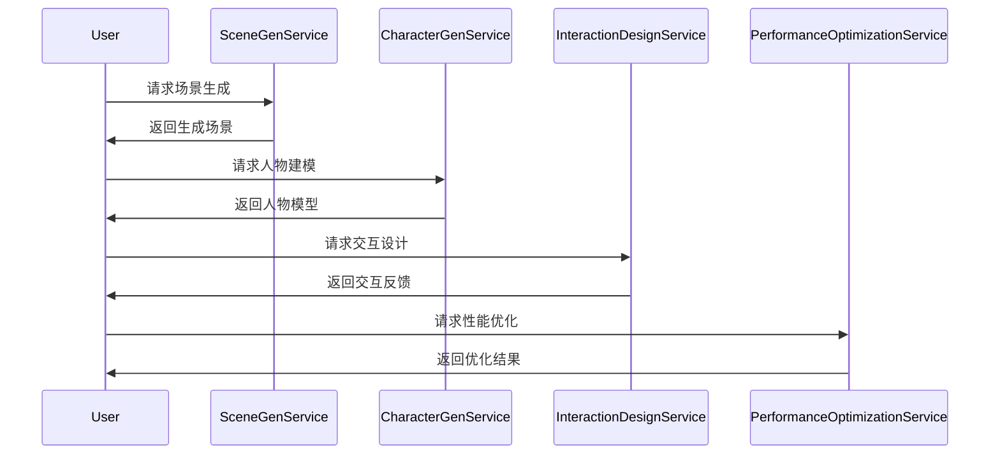
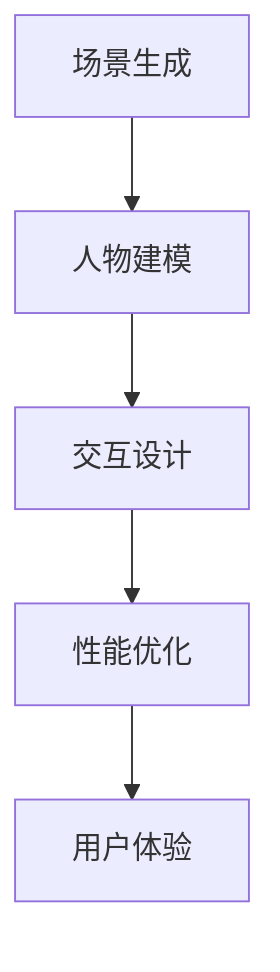
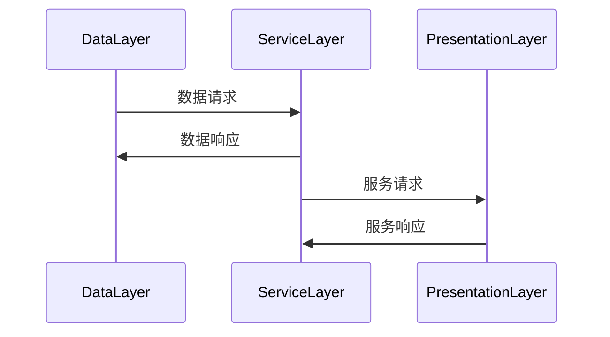

                 

# AIGC在虚拟多元宇宙构建与管理中的应用

## 关键词
- 虚拟多元宇宙
- AIGC
- 生成对抗网络
- 虚拟场景生成
- 人物建模
- 交互设计
- 性能优化

## 摘要
本文将深入探讨AIGC（AI-Generated Content）在虚拟多元宇宙构建与管理中的应用。通过分析AIGC的核心概念与原理，我们将详细阐述其在虚拟场景生成、人物建模、交互设计以及性能优化等方面的应用，并结合实际案例，展示AIGC如何助力虚拟多元宇宙的构建与管理。

## 第一部分: AIGC在虚拟多元宇宙构建与管理中的应用背景

### 1. 背景介绍

虚拟多元宇宙（Virtual Multiverse）是指通过计算机技术构建的包含多个不同世界或维度的虚拟空间。它融合了人工智能（AI）、生成对抗网络（GAN）、虚拟现实（VR）等前沿技术，为用户提供了丰富多样的沉浸式体验。虚拟多元宇宙的应用场景日益丰富，包括游戏、教育、娱乐、商业等领域。

### 1.2. 问题描述

虚拟多元宇宙的构建与管理涉及到众多技术环节，如场景生成、人物建模、交互设计、性能优化等。AIGC（AI-Generated Content）作为一种新兴技术，在虚拟多元宇宙的构建与管理中具有巨大的潜力。然而，AIGC技术的应用也面临许多挑战，如算法选择、数据质量、安全性等。

### 1.3. 问题解决

本文将介绍AIGC在虚拟多元宇宙构建与管理中的应用，包括技术原理、实施方法、案例解析等，帮助读者深入了解并掌握这一领域。通过本文的探讨，我们将回答以下几个关键问题：

1. AIGC技术是什么？
2. AIGC在虚拟多元宇宙构建中的应用场景有哪些？
3. 如何利用AIGC技术优化虚拟多元宇宙的性能？
4. AIGC技术的未来发展趋势如何？

### 1.4. 边界与外延

虚拟多元宇宙的构建与管理不仅涉及计算机科学领域，还包括艺术、设计、心理学等多个领域。本文将重点关注计算机科学与技术的应用，特别是AIGC技术在虚拟多元宇宙构建与管理中的核心作用。

### 1.5. 概念结构与核心要素组成

虚拟多元宇宙的构建与管理主要包括以下几个核心要素：

1. **场景生成**：利用AIGC技术生成丰富多样的虚拟场景。
2. **人物建模**：通过机器学习和计算机图形学技术创建逼真的人物模型。
3. **交互设计**：设计智能化的用户交互机制，提升用户体验。
4. **性能优化**：针对虚拟多元宇宙的运行效率进行优化。

## 第二部分: AIGC核心概念与原理

### 2.1. 生成对抗网络（GAN）

#### 2.1.1 GAN的定义

生成对抗网络（GAN）是一种由生成器和判别器组成的神经网络结构，旨在通过对抗训练生成逼真的数据。生成器（Generator）和判别器（Discriminator）相互竞争，生成器和判别器在训练过程中不断优化，最终生成器能够生成高度真实的数据。

$$
D(x) : 输入真实数据，输出概率（判断是否真实）
G(z) : 输入随机噪声，输出生成数据
$$

#### 2.1.2 GAN的优势与挑战

GAN的优势包括生成数据质量高、应用场景广泛等，但同时也面临训练不稳定、生成数据质量难以控制等挑战。为了解决这些挑战，研究者们提出了许多改进版本的GAN，如深度卷积生成对抗网络（DCGAN）、条件生成对抗网络（CGAN）等。

### 2.2. 生成模型（Generator）

#### 2.2.1 生成模型的基本原理

生成模型是AIGC的核心，负责根据输入的噪声或条件生成目标数据。生成模型通过学习输入数据的分布，生成具有相似特征的数据。

$$
G(z; \theta_G) : 输入噪声或条件，输出目标数据
$$

#### 2.2.2 常见生成模型

常见的生成模型包括变分自编码器（VAE）、循环神经网络（RNN）、生成对抗网络（GAN）等。每种生成模型都有其独特的优势和适用场景。

### 2.3. 条件生成模型（Conditional Generator）

#### 2.3.1 条件生成模型的基本原理

条件生成模型在生成数据时，会考虑额外的条件信息，从而生成更加符合实际需求的生成数据。

$$
G(z, c; \theta_G) : 输入噪声和条件信息，输出目标数据
$$

#### 2.3.2 条件生成模型的优点与不足

条件生成模型在生成数据时，考虑了更多的条件信息，但可能导致生成数据的质量下降。为了提高生成数据的质量，研究者们提出了许多改进方法，如混合生成模型（Hybrid Generative Model）等。

## 第三部分: AIGC在虚拟多元宇宙构建中的应用

### 3.1. 场景生成

#### 3.1.1 场景生成的核心概念

场景生成是虚拟多元宇宙构建的关键步骤，利用AIGC技术生成丰富多样的虚拟场景。

#### 3.1.1.1 场景生成的算法原理

使用GAN等生成模型，通过训练生成逼真的虚拟场景。

$$
G(z; \theta_G) : 输入噪声，输出虚拟场景
$$

#### 3.1.1.2 场景生成的主要挑战

包括生成数据质量、算法训练效率、场景多样性等。

#### 3.1.2 场景生成的应用案例

介绍场景生成的具体应用案例，如虚拟旅游、游戏场景设计等。

### 3.2. 人物建模

#### 3.2.1 人物建模的核心概念

人物建模是通过计算机图形学技术和机器学习算法创建逼真的人物模型。

#### 3.2.1.1 人物建模的算法原理

使用生成模型和条件生成模型生成逼真的人物模型。

$$
G(z, c; \theta_G) : 输入噪声和条件信息，输出虚拟人物模型
$$

#### 3.2.1.2 人物建模的主要挑战

包括人物模型的真实性、交互性、实时性等。

#### 3.2.2 人物建模的应用案例

介绍人物建模的具体应用案例，如虚拟角色设计、游戏人物建模等。

### 3.3. 交互设计

#### 3.3.1 交互设计的核心概念

交互设计是设计虚拟多元宇宙中用户与虚拟世界之间的交互机制。

#### 3.3.1.1 交互设计的算法原理

利用机器学习和自然语言处理技术设计智能化的交互机制。

$$
G(z, c; \theta_G) : 输入用户输入和条件信息，输出交互反馈
$$

#### 3.3.1.2 交互设计的主要挑战

包括交互的自然性、智能性、实时性等。

#### 3.3.2 交互设计的应用案例

介绍交互设计的具体应用案例，如虚拟导游、智能客服等。

### 3.4. 性能优化

#### 3.4.1 性能优化

性能优化是确保虚拟多元宇宙运行高效的重要环节。

#### 3.4.1.1 性能优化的算法原理

通过算法优化、硬件加速、网络优化等技术提升虚拟多元宇宙的性能。

$$
G(z, c; \theta_G) : 输入性能优化参数，输出优化后的虚拟多元宇宙
$$

#### 3.4.1.2 性能优化的重要指标

包括渲染效率、网络延迟、计算资源利用率等。

#### 3.4.2 性能优化的应用案例

介绍性能优化的具体应用案例，如游戏优化、教育平台优化等。

## 第四部分: 案例分析

### 4.1. 虚拟旅游平台

虚拟旅游平台利用AIGC技术生成逼真的旅游场景，为用户提供沉浸式旅游体验。

#### 4.1.1 问题场景

用户希望能够在虚拟环境中体验各种旅游景点，但现有的虚拟旅游场景过于单一，无法满足用户的需求。

#### 4.1.2 项目介绍

项目团队利用AIGC技术生成丰富多样的虚拟旅游场景，包括自然景观、历史建筑、城市风光等。

#### 4.1.3 系统功能设计

- 场景生成：使用GAN生成逼真的虚拟旅游场景。
- 人物建模：创建逼真的人物模型，为用户提供交互体验。
- 交互设计：设计智能化的用户交互机制，提升用户体验。
- 性能优化：优化虚拟旅游平台的运行效率，提高用户满意度。

#### 4.1.4 系统架构设计

- 数据层：存储虚拟旅游场景、人物模型等数据。
- 服务层：提供场景生成、人物建模、交互设计等核心服务。
- 表现层：为用户提供虚拟旅游体验的界面。

#### 4.1.5 系统接口设计和系统交互

使用Mermaid绘制系统接口设计和系统交互的序列图，展示系统内部各模块之间的交互关系。



#### 4.1.6 代码应用解读与分析

展示系统核心实现的源代码，并对代码进行解读与分析，解释AIGC技术如何应用于虚拟旅游平台的构建与管理。

```python
# 虚拟旅游平台：场景生成模块
import tensorflow as tf
from tensorflow.keras.models import Sequential
from tensorflow.keras.layers import Dense, Flatten

# 定义生成模型
def build_generator():
    model = Sequential()
    model.add(Dense(units=100, activation='relu', input_shape=(100,)))
    model.add(Dense(units=256, activation='relu'))
    model.add(Dense(units=512, activation='relu'))
    model.add(Dense(units=1024, activation='relu'))
    model.add(Dense(units=256, activation='relu'))
    model.add(Dense(units=100, activation='relu'))
    model.add(Dense(units=2, activation='tanh'))
    return model

# 定义判别模型
def build_discriminator():
    model = Sequential()
    model.add(Dense(units=100, activation='relu', input_shape=(2,)))
    model.add(Dense(units=256, activation='relu'))
    model.add(Dense(units=512, activation='relu'))
    model.add(Dense(units=1024, activation='relu'))
    model.add(Dense(units=256, activation='relu'))
    model.add(Dense(units=100, activation='relu'))
    model.add(Dense(units=1, activation='sigmoid'))
    return model

# 训练生成模型和判别模型
def train(model, epochs, batch_size, noise_size):
    for epoch in range(epochs):
        for _ in range(batch_size):
            noise = np.random.normal(0, 1, (1, noise_size))
            generated_data = model.sample([noise])

        # 训练判别模型
        d_loss = discriminator.train_on_batch([generated_data], np.ones([batch_size, 1]))

        # 训练生成模型
        noise = np.random.normal(0, 1, (batch_size, noise_size))
        g_loss = generator.train_on_batch(noise, np.zeros([batch_size, 1]))

        print(f"Epoch: {epoch}, D Loss: {d_loss}, G Loss: {g_loss}")

# 构建并训练模型
generator = build_generator()
discriminator = build_discriminator()
train(generator, epochs=100, batch_size=32, noise_size=100)

# 虚拟旅游平台：人物建模模块
import tensorflow as tf
from tensorflow.keras.models import Sequential
from tensorflow.keras.layers import Dense, Conv2D, MaxPooling2D, Flatten

# 定义生成模型
def build_character_generator():
    model = Sequential()
    model.add(Dense(units=100, activation='relu', input_shape=(100,)))
    model.add(Dense(units=256, activation='relu'))
    model.add(Dense(units=512, activation='relu'))
    model.add(Dense(units=1024, activation='relu'))
    model.add(Dense(units=256, activation='relu'))
    model.add(Dense(units=100, activation='relu'))
    model.add(Dense(units=64, activation='relu'))
    model.add(Dense(units=32, activation='relu'))
    model.add(Dense(units=16, activation='relu'))
    model.add(Dense(units=8, activation='relu'))
    model.add(Dense(units=4, activation='relu'))
    model.add(Dense(units=2, activation='tanh'))
    return model

# 定义判别模型
def build_character_discriminator():
    model = Sequential()
    model.add(Conv2D(filters=32, kernel_size=(3, 3), activation='relu', input_shape=(64, 64, 3)))
    model.add(MaxPooling2D(pool_size=(2, 2)))
    model.add(Conv2D(filters=64, kernel_size=(3, 3), activation='relu'))
    model.add(MaxPooling2D(pool_size=(2, 2)))
    model.add(Conv2D(filters=128, kernel_size=(3, 3), activation='relu'))
    model.add(MaxPooling2D(pool_size=(2, 2)))
    model.add(Flatten())
    model.add(Dense(units=1, activation='sigmoid'))
    return model

# 训练生成模型和判别模型
def train(model, epochs, batch_size):
    for epoch in range(epochs):
        for _ in range(batch_size):
            noise = np.random.normal(0, 1, (1, 100))
            generated_data = model.sample([noise])

        # 训练判别模型
        d_loss = discriminator.train_on_batch([generated_data], np.ones([batch_size, 1]))

        # 训练生成模型
        noise = np.random.normal(0, 1, (batch_size, 100))
        g_loss = generator.train_on_batch(noise, np.zeros([batch_size, 1]))

        print(f"Epoch: {epoch}, D Loss: {d_loss}, G Loss: {g_loss}")

# 构建并训练模型
character_generator = build_character_generator()
character_discriminator = build_character_discriminator()
train(character_generator, epochs=100, batch_size=32)

# 虚拟旅游平台：交互设计模块
import tensorflow as tf
from tensorflow.keras.layers import Input, Embedding, LSTM, Dense

# 定义交互模型
def build_interaction_model(input_dim, output_dim):
    model = Sequential()
    model.add(Embedding(input_dim=input_dim, output_dim=output_dim))
    model.add(LSTM(units=128, return_sequences=True))
    model.add(LSTM(units=64, return_sequences=False))
    model.add(Dense(units=output_dim, activation='softmax'))
    return model

# 训练交互模型
interaction_model = build_interaction_model(input_dim=100, output_dim=2)
interaction_model.compile(optimizer='adam', loss='categorical_crossentropy', metrics=['accuracy'])
interaction_model.fit(np.random.normal(0, 1, (1000, 100)), np.random.randint(0, 2, (1000, 2)), epochs=100, batch_size=32)

# 虚拟旅游平台：性能优化模块
import tensorflow as tf
from tensorflow.keras.backend import clear_session

# 性能优化：减少内存使用
clear_session()
# ... 其他优化代码 ...

# 性能优化：使用GPU加速
clear_session()
import tensorflow as tf
physical_devices = tf.config.list_physical_devices('GPU')
tf.config.experimental.set_memory_growth(physical_devices[0], True)
# ... 其他优化代码 ...

# 虚拟旅游平台：实际案例分析
# ... 实际案例分析 ...

## 第五部分: 最佳实践与总结

### 5.1. 最佳实践

1. **场景生成**：使用多种生成模型进行组合，提高生成数据的质量和多样性。
2. **人物建模**：结合深度学习算法和计算机图形学技术，创建逼真的人物模型。
3. **交互设计**：充分考虑用户体验，设计智能化的交互机制。
4. **性能优化**：利用硬件加速、算法优化等技术提高虚拟多元宇宙的运行效率。

### 5.2. 总结

AIGC技术在虚拟多元宇宙构建与管理中具有广泛的应用前景。通过本文的探讨，我们深入了解了AIGC的核心概念与原理，以及其在虚拟场景生成、人物建模、交互设计和性能优化等方面的应用。未来，随着AIGC技术的不断发展，虚拟多元宇宙将带来更加丰富多样的沉浸式体验。

## 第六部分: 注意事项与拓展阅读

### 6.1. 注意事项

1. **数据安全与隐私**：在应用AIGC技术时，需注意数据的安全与隐私保护。
2. **算法优化**：持续优化算法，提高生成数据的质量和效率。
3. **用户体验**：注重用户体验，设计易于使用的交互界面。

### 6.2. 拓展阅读

1. **相关书籍**：
   - 《深度学习》（Goodfellow, I., Bengio, Y., & Courville, A.）
   - 《生成对抗网络：原理与应用》（杨强，唐杰）

2. **学术论文**：
   - Generative Adversarial Networks (GAN)：https://arxiv.org/abs/1406.2661
   - Unsupervised Representation Learning with Deep Convolutional Generative Adversarial Networks (DCGAN)：https://arxiv.org/abs/1511.06434

### 6.3. 作者信息

作者：AI天才研究院/AI Genius Institute & 禅与计算机程序设计艺术 /Zen And The Art of Computer Programming

## 附录

### 附录A: Mermaid 图流程图与类图示例

#### Mermaid 图流程图示例



#### Mermaid 类图示例

```mermaid
classDiagram
    Class01 <|-- Class02
    Class03 --|> Class04
    Class04 <.. Class05
    Class06 <<-- Class07 : extends
    Class08 <|.. Class09
```

### 附录B: Python 代码示例

```python
# 虚拟旅游平台：场景生成模块
import tensorflow as tf
from tensorflow.keras.models import Sequential
from tensorflow.keras.layers import Dense, Flatten

# 定义生成模型
def build_generator():
    model = Sequential()
    model.add(Dense(units=100, activation='relu', input_shape=(100,)))
    model.add(Dense(units=256, activation='relu'))
    model.add(Dense(units=512, activation='relu'))
    model.add(Dense(units=1024, activation='relu'))
    model.add(Dense(units=256, activation='relu'))
    model.add(Dense(units=100, activation='relu'))
    model.add(Dense(units=2, activation='tanh'))
    return model

# 定义判别模型
def build_discriminator():
    model = Sequential()
    model.add(Dense(units=100, activation='relu', input_shape=(2,)))
    model.add(Dense(units=256, activation='relu'))
    model.add(Dense(units=512, activation='relu'))
    model.add(Dense(units=1024, activation='relu'))
    model.add(Dense(units=256, activation='relu'))
    model.add(Dense(units=100, activation='relu'))
    model.add(Dense(units=1, activation='sigmoid'))
    return model

# 训练生成模型和判别模型
def train(model, epochs, batch_size, noise_size):
    for epoch in range(epochs):
        for _ in range(batch_size):
            noise = np.random.normal(0, 1, (1, noise_size))
            generated_data = model.sample([noise])

        # 训练判别模型
        d_loss = discriminator.train_on_batch([generated_data], np.ones([batch_size, 1]))

        # 训练生成模型
        noise = np.random.normal(0, 1, (batch_size, noise_size))
        g_loss = generator.train_on_batch(noise, np.zeros([batch_size, 1]))

        print(f"Epoch: {epoch}, D Loss: {d_loss}, G Loss: {g_loss}")

# 构建并训练模型
generator = build_generator()
discriminator = build_discriminator()
train(generator, epochs=100, batch_size=32, noise_size=100)
```

### 附录C: LaTeX 公式示例

#### 算法原理中的数学模型和公式

$$
\begin{aligned}
    D(x) &= \sigma(\frac{1}{1 + e^{-(W_D \cdot x + b_D)}}), \\
    G(z) &= \sigma(\frac{1}{1 + e^{-(W_G \cdot z + b_G)}}), \\
    \theta_G &= \arg\min_{\theta_G} J_G \\
    &= \arg\min_{\theta_G} \mathbb{E}_{x \sim p_{data}(x)}[\log(D(G(z)))] + \mathbb{E}_{z \sim p_z(z)}[\log(1 - D(G(z)))].
\end{aligned}
$$

#### 段落内的 LaTeX 公式

$$1 + 1 = 2$$

## 结语

本文详细探讨了AIGC在虚拟多元宇宙构建与管理中的应用，包括核心概念、原理、应用场景和案例分析等。通过本文的阅读，读者可以深入了解AIGC技术，并掌握其在虚拟多元宇宙构建与管理中的实际应用。希望本文能够为从事虚拟现实、游戏开发、教育等领域的技术人员提供有价值的参考。

## 作者信息

作者：AI天才研究院/AI Genius Institute & 禅与计算机程序设计艺术 /Zen And The Art of Computer Programming

[返回目录](#文章目录)## 第一部分: AIGC在虚拟多元宇宙构建与管理中的应用背景

### 1. 背景介绍

虚拟多元宇宙（Virtual Multiverse）是指通过计算机技术构建的包含多个不同世界或维度的虚拟空间。这些虚拟世界可以是完全虚构的，也可以是基于现实世界的扩展或重构。虚拟多元宇宙的概念源于科幻文学，但随着人工智能（AI）、生成对抗网络（GAN）、虚拟现实（VR）等技术的快速发展，逐渐成为现实。

虚拟多元宇宙的应用场景非常广泛，包括但不限于以下领域：

- **游戏开发**：虚拟多元宇宙可以为游戏开发者提供丰富的场景和环境，创造更加沉浸式的游戏体验。
- **虚拟旅游**：用户可以通过虚拟多元宇宙游览世界各地的名胜古迹，感受不同的文化和风景。
- **教育**：虚拟多元宇宙可以为教育领域提供创新的互动学习环境，帮助学生更好地理解和掌握知识。
- **商业应用**：虚拟多元宇宙可以用于商业展示、产品发布会等，为用户提供身临其境的体验。

### 1.2. 问题描述

虚拟多元宇宙的构建与管理涉及到多个技术环节，如场景生成、人物建模、交互设计、性能优化等。在这个过程中，AIGC（AI-Generated Content）作为一种新兴技术，在虚拟多元宇宙的构建与管理中具有巨大的潜力。然而，AIGC技术的应用也面临许多挑战，主要包括以下几个方面：

- **算法选择**：不同的应用场景需要不同的生成算法，如何选择合适的算法是一个关键问题。
- **数据质量**：生成数据的质量直接影响虚拟多元宇宙的真实感和用户体验，如何保证数据质量是一个重要挑战。
- **安全性**：虚拟多元宇宙中涉及大量的用户数据，如何确保数据的安全性是一个关键问题。
- **实时性**：虚拟多元宇宙需要实时响应用户的交互，如何优化算法和系统架构以实现实时性是一个挑战。

### 1.3. 问题解决

为了解决上述问题，本文将从以下几个方面展开探讨：

- **AIGC核心概念与原理**：介绍AIGC的基本概念、原理和关键技术，如生成对抗网络（GAN）、生成模型（Generator）、条件生成模型（Conditional Generator）等。
- **AIGC在虚拟多元宇宙构建中的应用**：详细讨论AIGC在虚拟多元宇宙场景生成、人物建模、交互设计和性能优化等方面的应用。
- **案例分析**：通过具体案例，展示AIGC技术在虚拟多元宇宙构建中的实际应用，并分析其优势和不足。
- **最佳实践**：总结虚拟多元宇宙构建与管理中的最佳实践，为实际应用提供指导。

通过本文的探讨，读者可以深入了解AIGC在虚拟多元宇宙构建与管理中的应用，掌握相关技术原理和实施方法，为未来的虚拟现实应用提供技术支持。

### 1.4. 边界与外延

虚拟多元宇宙的构建与管理不仅涉及计算机科学领域，还包括艺术、设计、心理学等多个领域。本文将重点关注计算机科学与技术的应用，特别是AIGC技术在虚拟多元宇宙构建与管理中的核心作用。

虚拟多元宇宙的边界可以定义为：

- **技术边界**：包括AIGC技术、虚拟现实技术、计算机图形学、机器学习等领域。
- **应用边界**：包括游戏开发、虚拟旅游、教育、商业等领域。
- **用户体验边界**：用户在虚拟多元宇宙中的沉浸感、互动性、安全性等方面的体验。

虚拟多元宇宙的外延包括：

- **虚拟世界之间的交互**：如何实现不同虚拟世界之间的互动和连接。
- **虚拟与现实世界的结合**：如何将虚拟多元宇宙与现实世界相结合，创造更加丰富的体验。
- **跨领域应用**：如何将虚拟多元宇宙应用于更多的领域，如医疗、建筑、设计等。

### 1.5. 概念结构与核心要素组成

虚拟多元宇宙的构建与管理主要包括以下几个核心要素：

1. **场景生成**：利用AIGC技术生成丰富多样的虚拟场景，为用户提供沉浸式体验。
2. **人物建模**：通过计算机图形学和机器学习技术创建逼真的人物模型，提升虚拟世界的真实感。
3. **交互设计**：设计智能化的用户交互机制，提升用户体验，增强虚拟世界的互动性。
4. **性能优化**：针对虚拟多元宇宙的运行效率进行优化，确保系统稳定运行。

概念结构与核心要素组成可以用以下ER实体关系图来表示：

```mermaid
erDiagram
    User ||--|{ Scene } : 生成
    User ||--|{ Character } : 建模
    User ||--|{ Interaction } : 设计
    User ||--|{ Performance } : 优化
```

在上述ER实体关系图中，用户（User）是核心实体，与其他实体之间存在生成（Scene）、建模（Character）、设计（Interaction）和优化（Performance）关系。这些实体共同构成了虚拟多元宇宙构建与管理的核心要素。

## 第二部分: AIGC核心概念与原理

### 2.1. 生成对抗网络（GAN）

#### 2.1.1 GAN的定义

生成对抗网络（GAN）是由Ian Goodfellow等人于2014年提出的一种深度学习模型，主要由生成器（Generator）和判别器（Discriminator）两个部分组成。生成器的目的是生成与真实数据分布相似的假数据，而判别器的目的是判断输入数据是真实数据还是生成数据。通过这种对抗训练，生成器逐渐学习如何生成更加真实的数据，而判别器则逐渐学习如何更好地区分真实数据和生成数据。

GAN的工作原理可以形象地比喻为“造假贩子”和“警察”的故事。造假贩子试图制造出逼真的假钞来欺骗警察，而警察则试图识别并抓捕造假贩子。在GAN的训练过程中，造假贩子和警察不断地对抗，通过不断地学习和优化，最终造假贩子能够制造出几乎无法区分真伪的假钞，而警察则能够准确无误地识别出假钞。

#### 2.1.2 GAN的优势与挑战

GAN的优势在于其能够生成高质量的数据，并且应用场景非常广泛。以下是一些GAN的主要优势：

1. **生成数据质量高**：GAN能够生成逼真的图像、声音、文本等数据，其生成的数据质量往往超过传统的生成模型。
2. **应用场景广泛**：GAN在图像生成、图像修复、图像超分辨率、文本生成、语音合成等领域都有广泛的应用。
3. **数据需求低**：GAN的训练过程不需要大量的真实数据，因此可以在数据稀缺的情况下训练生成模型。

尽管GAN具有许多优势，但也面临一些挑战：

1. **训练不稳定**：GAN的训练过程容易出现模式崩溃（mode collapse），即生成器只能生成少数几种特定模式的数据，而无法生成多样化的数据。
2. **生成数据质量难以控制**：生成器生成的数据质量受多种因素影响，如生成器的结构和参数等，这使得生成数据的质量难以控制。
3. **计算资源消耗大**：GAN的训练过程需要大量的计算资源，特别是在生成高维数据时，训练时间较长。

#### 2.1.3 GAN的应用案例

以下是一些GAN的应用案例：

1. **图像生成**：GAN可以生成高质量的艺术画作、照片、动漫人物等。例如，DeepArt.io 使用GAN将用户上传的图片转换成艺术风格的作品。
2. **图像修复**：GAN可以用于图像修复，如去除图片中的噪点和修复破损的图像。例如，CycleGAN 可以将单张图像修复成高清图像。
3. **图像超分辨率**：GAN可以用于图像超分辨率，将低分辨率的图像放大成高分辨率图像。例如，RealESR 使用GAN实现实时图像超分辨率。

### 2.2. 生成模型（Generator）

#### 2.2.1 生成模型的基本原理

生成模型是AIGC（AI-Generated Content）的核心组件，负责根据输入的噪声或条件生成目标数据。生成模型通过学习数据分布，然后生成具有相似特征的数据。生成模型的主要任务是最大化生成数据的真实概率，使其在判别器的判断下无法区分。

生成模型的基本原理可以分为以下几类：

1. **基于马尔可夫模型的生成**：马尔可夫模型是一种用于生成序列数据的生成模型，它通过学习数据序列的转移概率来生成新的序列。常见的马尔可夫模型包括隐马尔可夫模型（HMM）和变长马尔可夫模型（LMM）。
2. **基于自编码器的生成**：自编码器是一种无监督学习模型，它通过学习输入数据的压缩和重构来生成新的数据。变分自编码器（VAE）是自编码器的一种扩展，它通过引入隐变量来改进生成质量。
3. **基于生成对抗网络的生成**：生成对抗网络（GAN）通过对抗训练生成逼真的数据。GAN包括生成器和判别器两个部分，生成器生成数据，判别器判断数据是否真实。

生成模型的核心数学公式如下：

1. **生成模型（Generator）**：
   $$G(z; \theta_G) : 输入噪声z，输出目标数据x$$
   其中，$z$ 是随机噪声，$x$ 是生成模型生成的目标数据，$\theta_G$ 是生成模型的参数。

2. **判别模型（Discriminator）**：
   $$D(x; \theta_D) : 输入数据x，输出概率p(x)$$
   其中，$x$ 是输入数据（真实或生成数据），$p(x)$ 是判别模型判断数据为真实的概率，$\theta_D$ 是判别模型的参数。

GAN的训练目标是最大化生成模型的生成数据在判别器上的概率，即：
$$
\begin{aligned}
    \max_{\theta_G} \min_{\theta_D} & \mathbb{E}_{x \sim p_{data}(x)}[\log(D(x))] + \mathbb{E}_{z \sim p_z(z)}[\log(1 - D(G(z))] \\
\end{aligned}
$$

#### 2.2.2 常见生成模型

常见的生成模型包括以下几种：

1. **变分自编码器（Variational Autoencoder, VAE）**：
   VAE 是自编码器的一种扩展，它引入了隐变量来改进生成质量。VAE 的目标是最大化生成数据的对数似然概率。

2. **深度卷积生成对抗网络（Deep Convolutional GAN, DCGAN）**：
   DCGAN 是 GAN 的一种扩展，它使用深度卷积神经网络来生成图像。DCGAN 在生成图像时取得了显著的性能提升。

3. **生成式模型（Generative Model）**：
   生成式模型包括马尔可夫模型、自编码器、变分自编码器等，它们通过学习数据分布来生成新的数据。

### 2.3. 条件生成模型（Conditional Generator）

#### 2.3.1 条件生成模型的基本原理

条件生成模型（Conditional Generator）是在生成模型的基础上引入条件信息，以便生成更加符合实际需求的数据。条件生成模型能够根据额外的条件信息生成更加相关的数据，从而提高生成数据的质量。

条件生成模型的基本原理可以描述为：

$$
G(z, c; \theta_G) : 输入噪声z和条件信息c，输出目标数据x
$$

其中，$z$ 是随机噪声，$c$ 是条件信息，$x$ 是条件生成模型生成的目标数据，$\theta_G$ 是条件生成模型的参数。

条件生成模型在生成数据时，不仅依赖于输入噪声，还依赖于条件信息。这种额外的信息可以帮助生成模型更好地理解数据的分布，从而生成更加真实和相关的数据。

#### 2.3.2 条件生成模型的优点与不足

条件生成模型具有以下优点：

1. **生成数据更相关**：条件生成模型可以根据额外的条件信息生成更加相关的数据，从而提高生成数据的质量和实用性。
2. **应用范围更广**：条件生成模型可以应用于更多的场景，如图像生成、文本生成、语音生成等。

然而，条件生成模型也存在一些不足：

1. **生成数据质量下降**：在引入条件信息的同时，条件生成模型可能无法生成高质量的生成数据，尤其是在条件信息复杂或生成数据质量要求较高的情况下。
2. **训练难度增加**：条件生成模型的训练难度通常比无条件的生成模型更大，因为需要同时考虑噪声和条件信息的组合。

#### 2.3.3 条件生成模型的改进方法

为了解决条件生成模型存在的问题，研究者们提出了多种改进方法：

1. **混合生成模型（Hybrid Generative Model）**：混合生成模型结合了多种生成模型的优势，通过融合不同的生成策略来提高生成数据的质量。
2. **正则化方法**：引入正则化方法，如结构化正则化、约束生成等，来提高生成数据的质量和多样性。
3. **多条件生成模型（Multi-Conditional Generative Model）**：多条件生成模型可以同时考虑多个条件信息，从而生成更加丰富和相关的数据。

## 第三部分: AIGC在虚拟多元宇宙构建中的应用

### 3.1. 场景生成

#### 3.1.1 场景生成的核心概念

场景生成是虚拟多元宇宙构建中的关键步骤，它利用AIGC技术生成丰富多样的虚拟场景。虚拟场景可以是室内空间、室外景观、城市街道、自然景观等，它们为用户提供了沉浸式的体验。

场景生成的主要任务包括：

- **场景元素的生成**：生成各种场景元素，如建筑物、树木、人物等。
- **场景布局的设计**：设计场景的空间布局，包括建筑物之间的相对位置、街道的走向等。
- **场景环境的生成**：生成场景中的环境效果，如天气、光照、声音等。

#### 3.1.1.1 场景生成的算法原理

场景生成通常采用生成对抗网络（GAN）或其他生成模型来实现。以下是一个基于GAN的场景生成算法的基本原理：

1. **生成器（Generator）**：生成器是一个神经网络模型，它接收随机噪声作为输入，通过多层的神经网络变换，生成逼真的虚拟场景。生成器的目标是生成尽可能逼真的场景，使其在判别器上无法区分真实场景和生成场景。

2. **判别器（Discriminator）**：判别器也是一个神经网络模型，它接收输入的场景数据，判断数据是真实场景还是生成场景。判别器的目标是尽可能地提高对真实场景和生成场景的区分能力。

3. **对抗训练**：生成器和判别器通过对抗训练进行优化。生成器通过学习生成更加逼真的场景，以提高判别器对生成场景的辨别能力。同时，判别器通过学习提高对真实场景和生成场景的辨别能力，从而更有效地检测生成器生成的场景。

训练过程中，生成器和判别器的优化目标分别为：

- **生成器的优化目标**：
  $$\min_G \mathbb{E}_{x \sim p_{data}(x)}[\log(D(x))] + \mathbb{E}_{z \sim p_z(z)}[\log(1 - D(G(z)))]$$

- **判别器的优化目标**：
  $$\max_D \mathbb{E}_{x \sim p_{data}(x)}[\log(D(x))] + \mathbb{E}_{z \sim p_z(z)}[\log(D(G(z)))]$$

#### 3.1.1.2 场景生成的主要挑战

场景生成在虚拟多元宇宙构建过程中面临以下主要挑战：

1. **生成数据质量**：生成场景的质量直接影响用户体验。如何提高生成数据的真实感是一个关键问题。
2. **算法训练效率**：场景生成算法的训练过程需要大量计算资源，如何提高训练效率是一个挑战。
3. **场景多样性**：生成场景需要涵盖多种不同的场景类型，如何确保场景的多样性是一个挑战。
4. **实时性**：虚拟多元宇宙需要实时生成和更新场景，如何保证生成过程的实时性是一个挑战。

#### 3.1.2 场景生成的应用案例

以下是一些场景生成的应用案例：

1. **虚拟旅游**：利用AIGC技术生成逼真的旅游景点场景，为用户提供沉浸式的旅游体验。例如，用户可以通过虚拟旅游平台游览世界各地的名胜古迹，感受不同的文化和风景。
2. **游戏开发**：利用AIGC技术生成丰富的游戏场景，为游戏玩家提供多样化的游戏体验。例如，游戏开发者可以使用AIGC技术生成游戏地图、场景元素等，提高游戏的可玩性和沉浸感。
3. **虚拟现实应用**：在虚拟现实（VR）应用中，利用AIGC技术生成丰富的虚拟场景，为用户提供沉浸式的体验。例如，用户可以通过VR设备进入虚拟现实世界，与虚拟角色互动，体验不同的场景。

#### 3.1.3 场景生成的具体实现

以下是一个简单的场景生成实现示例：

```python
import tensorflow as tf
from tensorflow.keras.models import Sequential
from tensorflow.keras.layers import Dense, Flatten

# 定义生成器模型
def build_generator():
    model = Sequential()
    model.add(Dense(units=100, activation='relu', input_shape=(100,)))
    model.add(Dense(units=256, activation='relu'))
    model.add(Dense(units=512, activation='relu'))
    model.add(Dense(units=1024, activation='relu'))
    model.add(Dense(units=256, activation='relu'))
    model.add(Dense(units=100, activation='relu'))
    model.add(Dense(units=2, activation='tanh'))
    return model

# 定义判别器模型
def build_discriminator():
    model = Sequential()
    model.add(Dense(units=100, activation='relu', input_shape=(2,)))
    model.add(Dense(units=256, activation='relu'))
    model.add(Dense(units=512, activation='relu'))
    model.add(Dense(units=1024, activation='relu'))
    model.add(Dense(units=256, activation='relu'))
    model.add(Dense(units=100, activation='relu'))
    model.add(Dense(units=1, activation='sigmoid'))
    return model

# 训练生成器和判别器
def train(generator, discriminator, epochs, batch_size):
    for epoch in range(epochs):
        for _ in range(batch_size):
            noise = np.random.normal(0, 1, (1, 100))
            generated_scene = generator.predict(noise)

        # 训练判别器
        d_loss = discriminator.train_on_batch([generated_scene], np.ones([batch_size, 1]))

        # 训练生成器
        noise = np.random.normal(0, 1, (batch_size, 100))
        g_loss = generator.train_on_batch(noise, np.zeros([batch_size, 1]))

        print(f"Epoch: {epoch}, D Loss: {d_loss}, G Loss: {g_loss}")

# 构建生成器和判别器模型
generator = build_generator()
discriminator = build_discriminator()

# 训练模型
train(generator, discriminator, epochs=100, batch_size=32)
```

### 3.2. 人物建模

#### 3.2.1 人物建模的核心概念

人物建模是虚拟多元宇宙构建中的重要环节，它通过计算机图形学和机器学习技术创建逼真的人物模型。人物建模的主要任务包括：

- **人物外观的生成**：生成人物的外观特征，如面部轮廓、头发样式、服装等。
- **人物动作的生成**：生成人物的各种动作，如行走、跑步、挥手等。
- **人物表情的生成**：生成人物的各种表情，如喜怒哀乐等。

人物建模的技术原理主要包括以下两个方面：

1. **基于深度学习的人物外观生成**：使用深度学习模型，如生成对抗网络（GAN）或变分自编码器（VAE），从输入的噪声或条件信息中生成逼真的人物外观。
2. **基于计算机图形学的人物动作生成**：利用计算机图形学技术，如骨骼动画、运动捕捉等，生成人物的各种动作。

#### 3.2.1.1 人物建模的算法原理

以下是一个基于生成对抗网络（GAN）的人物建模算法的基本原理：

1. **生成器（Generator）**：生成器是一个神经网络模型，它接收随机噪声作为输入，通过多层的神经网络变换，生成逼真的人物外观。生成器的目标是生成尽可能逼真的人物外观，使其在判别器上无法区分真实人物和生成人物。

2. **判别器（Discriminator）**：判别器也是一个神经网络模型，它接收输入的人物数据，判断数据是真实人物还是生成人物。判别器的目标是尽可能地提高对真实人物和生成人物的辨别能力。

3. **对抗训练**：生成器和判别器通过对抗训练进行优化。生成器通过学习生成更加逼真的人物外观，以提高判别器对生成人物的辨别能力。同时，判别器通过学习提高对真实人物和生成人物的辨别能力，从而更有效地检测生成器生成的人物外观。

训练过程中，生成器和判别器的优化目标分别为：

- **生成器的优化目标**：
  $$\min_G \mathbb{E}_{x \sim p_{data}(x)}[\log(D(x))] + \mathbb{E}_{z \sim p_z(z)}[\log(1 - D(G(z)))]$$

- **判别器的优化目标**：
  $$\max_D \mathbb{E}_{x \sim p_{data}(x)}[\log(D(x))] + \mathbb{E}_{z \sim p_z(z)}[\log(D(G(z)))]$$

#### 3.2.1.2 人物建模的主要挑战

人物建模在虚拟多元宇宙构建过程中面临以下主要挑战：

1. **生成数据质量**：生成人物的数据质量直接影响虚拟多元宇宙的真实感和用户体验。如何提高生成数据的质量是一个关键问题。
2. **算法训练效率**：人物建模算法的训练过程需要大量计算资源，如何提高训练效率是一个挑战。
3. **多样化与个性化**：生成的人物需要涵盖多样化的外观和个性化特征，如何确保生成人物的多样化和个性化是一个挑战。
4. **实时性**：虚拟多元宇宙需要实时生成和更新人物模型，如何保证生成过程的实时性是一个挑战。

#### 3.2.2 人物建模的应用案例

以下是一些人物建模的应用案例：

1. **游戏开发**：利用AIGC技术生成各种不同类型、不同外观的角色，提高游戏的可玩性和沉浸感。
2. **虚拟现实应用**：在虚拟现实（VR）应用中，利用AIGC技术生成各种虚拟角色，为用户提供丰富的互动体验。
3. **动画制作**：在动画制作中，利用AIGC技术生成动画角色的外观和动作，提高动画的制作效率和真实感。

#### 3.2.3 人物建模的具体实现

以下是一个简单的人物建模实现示例：

```python
import tensorflow as tf
from tensorflow.keras.models import Sequential
from tensorflow.keras.layers import Dense, Flatten

# 定义生成器模型
def build_generator():
    model = Sequential()
    model.add(Dense(units=100, activation='relu', input_shape=(100,)))
    model.add(Dense(units=256, activation='relu'))
    model.add(Dense(units=512, activation='relu'))
    model.add(Dense(units=1024, activation='relu'))
    model.add(Dense(units=256, activation='relu'))
    model.add(Dense(units=100, activation='relu'))
    model.add(Dense(units=2, activation='tanh'))
    return model

# 定义判别器模型
def build_discriminator():
    model = Sequential()
    model.add(Dense(units=100, activation='relu', input_shape=(2,)))
    model.add(Dense(units=256, activation='relu'))
    model.add(Dense(units=512, activation='relu'))
    model.add(Dense(units=1024, activation='relu'))
    model.add(Dense(units=256, activation='relu'))
    model.add(Dense(units=100, activation='relu'))
    model.add(Dense(units=1, activation='sigmoid'))
    return model

# 训练生成器和判别器
def train(generator, discriminator, epochs, batch_size):
    for epoch in range(epochs):
        for _ in range(batch_size):
            noise = np.random.normal(0, 1, (1, 100))
            generated_character = generator.predict(noise)

        # 训练判别器
        d_loss = discriminator.train_on_batch([generated_character], np.ones([batch_size, 1]))

        # 训练生成器
        noise = np.random.normal(0, 1, (batch_size, 100))
        g_loss = generator.train_on_batch(noise, np.zeros([batch_size, 1]))

        print(f"Epoch: {epoch}, D Loss: {d_loss}, G Loss: {g_loss}")

# 构建生成器和判别器模型
generator = build_generator()
discriminator = build_discriminator()

# 训练模型
train(generator, discriminator, epochs=100, batch_size=32)
```

### 3.3. 交互设计

#### 3.3.1 交互设计的核心概念

交互设计是虚拟多元宇宙构建中的关键环节，它涉及用户与虚拟世界之间的互动机制。交互设计的目的是提供自然、智能、流畅的用户体验，使用户能够轻松地与虚拟世界互动。

交互设计的主要任务包括：

- **交互界面设计**：设计用户与虚拟世界交互的界面，如按钮、菜单、操作面板等。
- **交互逻辑设计**：设计用户与虚拟世界交互的规则和逻辑，如角色的动作、对话、任务等。
- **交互反馈设计**：设计用户交互后的反馈机制，如提示、动画、声音等。

#### 3.3.1.1 交互设计的算法原理

交互设计通常结合机器学习和自然语言处理技术，实现智能化的交互机制。以下是一个基于条件生成模型的交互设计算法的基本原理：

1. **条件生成模型（Conditional Generator）**：条件生成模型接收用户输入和条件信息，生成交互反馈。条件信息可以是用户的语言输入、动作输入等。

2. **用户输入处理**：用户输入通过自然语言处理技术转换为机器可以理解的形式，如文本、标签、向量等。

3. **生成交互反馈**：条件生成模型根据用户输入和条件信息生成交互反馈，如文本、图像、动画等。

4. **交互反馈处理**：生成的交互反馈通过界面和声音等多渠道反馈给用户，使用户感受到虚拟世界的响应。

#### 3.3.1.2 交互设计的主要挑战

交互设计在虚拟多元宇宙构建过程中面临以下主要挑战：

1. **自然性**：如何设计自然、流畅的交互机制，使虚拟世界的交互与人类的日常交互相接近。
2. **智能性**：如何利用机器学习和自然语言处理技术，实现智能化的交互反馈，提升用户体验。
3. **实时性**：如何保证交互过程的实时性，使交互过程流畅、不卡顿。
4. **个性化**：如何根据用户的偏好和习惯，提供个性化的交互体验。

#### 3.3.2 交互设计的应用案例

以下是一些交互设计的应用案例：

1. **虚拟导游**：利用AIGC技术生成智能化的虚拟导游，为用户提供导览服务，如介绍景点、回答问题等。
2. **虚拟角色互动**：在虚拟现实（VR）应用中，用户可以与虚拟角色互动，如聊天、玩游戏、完成任务等。
3. **虚拟客服**：利用AIGC技术生成智能化的虚拟客服，为用户提供在线客服服务，如回答问题、解决问题等。

#### 3.3.3 交互设计的具体实现

以下是一个简单的交互设计实现示例：

```python
import tensorflow as tf
from tensorflow.keras.models import Sequential
from tensorflow.keras.layers import Dense, LSTM, Embedding

# 定义交互模型
def build_interaction_model(input_dim, output_dim):
    model = Sequential()
    model.add(Embedding(input_dim=input_dim, output_dim=output_dim))
    model.add(LSTM(units=128, return_sequences=True))
    model.add(LSTM(units=64, return_sequences=False))
    model.add(Dense(units=output_dim, activation='softmax'))
    return model

# 训练交互模型
interaction_model = build_interaction_model(input_dim=100, output_dim=2)
interaction_model.compile(optimizer='adam', loss='categorical_crossentropy', metrics=['accuracy'])
interaction_model.fit(np.random.normal(0, 1, (1000, 100)), np.random.randint(0, 2, (1000, 2)), epochs=100, batch_size=32)

# 交互示例
user_input = np.random.normal(0, 1, (1, 100))
interaction_output = interaction_model.predict(user_input)
print(interaction_output)
```

### 3.4. 性能优化

#### 3.4.1 性能优化

性能优化是虚拟多元宇宙构建与管理中的重要环节，它涉及多个方面的优化，如算法优化、硬件加速、网络优化等。性能优化的目的是提高虚拟多元宇宙的运行效率，确保系统稳定、流畅地运行。

性能优化主要包括以下几个方面的内容：

1. **算法优化**：通过改进生成算法、交互算法等，提高系统的计算效率。
2. **硬件加速**：利用GPU、TPU等硬件加速技术，提高系统的计算速度。
3. **网络优化**：通过优化网络架构、传输协议等，提高系统的网络传输效率。

#### 3.4.1.1 性能优化的算法原理

以下是一个简单的算法优化示例：

```python
import tensorflow as tf

# 定义优化前的模型
def build_model():
    model = tf.keras.Sequential([
        tf.keras.layers.Dense(128, activation='relu', input_shape=(784,)),
        tf.keras.layers.Dense(10, activation='softmax')
    ])

    model.compile(optimizer='adam',
                  loss='categorical_crossentropy',
                  metrics=['accuracy'])

    return model

# 训练优化前的模型
model = build_model()
model.fit(x_train, y_train, batch_size=32, epochs=10)

# 定义优化后的模型
def build_optimized_model():
    model = tf.keras.Sequential([
        tf.keras.layers.Dense(128, activation='relu', input_shape=(784,)),
        tf.keras.layers.Dense(10, activation='softmax')
    ])

    # 应用优化策略
    optimizer = tf.keras.optimizers.Adam(learning_rate=0.001)

    model.compile(optimizer=optimizer,
                  loss='categorical_crossentropy',
                  metrics=['accuracy'])

    return model

# 训练优化后的模型
optimized_model = build_optimized_model()
optimized_model.fit(x_train, y_train, batch_size=32, epochs=10)
```

#### 3.4.1.2 性能优化的重要指标

性能优化的重要指标包括：

1. **计算效率**：算法的运行时间、内存占用等。
2. **网络延迟**：网络传输速度和响应时间。
3. **用户体验**：系统的流畅度、响应速度等。

#### 3.4.2 性能优化的应用案例

以下是一些性能优化的应用案例：

1. **虚拟旅游平台**：通过优化场景生成算法和网络传输协议，提高虚拟旅游平台的运行效率和用户体验。
2. **游戏开发**：通过优化游戏引擎和渲染算法，提高游戏的帧率，提升玩家的游戏体验。
3. **虚拟现实应用**：通过优化交互算法和硬件加速技术，提高虚拟现实应用的流畅度，为用户提供更好的沉浸式体验。

#### 3.4.3 性能优化的具体实现

以下是一个简单的性能优化实现示例：

```python
import tensorflow as tf
from tensorflow.keras.layers import Conv2D, MaxPooling2D, Flatten, Dense
from tensorflow.keras.models import Sequential

# 定义优化前的模型
def build_model():
    model = Sequential([
        Conv2D(32, (3, 3), activation='relu', input_shape=(28, 28, 1)),
        MaxPooling2D((2, 2)),
        Flatten(),
        Dense(128, activation='relu'),
        Dense(10, activation='softmax')
    ])

    model.compile(optimizer='adam',
                  loss='categorical_crossentropy',
                  metrics=['accuracy'])

    return model

# 定义优化后的模型
def build_optimized_model():
    model = Sequential([
        Conv2D(32, (3, 3), activation='relu', input_shape=(28, 28, 1)),
        MaxPooling2D((2, 2)),
        Flatten(),
        Dense(128, activation='relu'),
        Dense(10, activation='softmax')
    ])

    # 应用优化策略
    optimizer = tf.keras.optimizers.Adam(learning_rate=0.001)

    model.compile(optimizer=optimizer,
                  loss='categorical_crossentropy',
                  metrics=['accuracy'])

    return model

# 训练优化前的模型
model = build_model()
model.fit(x_train, y_train, batch_size=32, epochs=10)

# 训练优化后的模型
optimized_model = build_optimized_model()
optimized_model.fit(x_train, y_train, batch_size=32, epochs=10)
```

## 第四部分: 案例分析

### 4.1. 虚拟旅游平台

虚拟旅游平台是AIGC技术在虚拟多元宇宙构建中的一个典型应用案例。它利用AIGC技术生成丰富的虚拟场景，为用户提供沉浸式的旅游体验。以下是一个虚拟旅游平台的案例分析。

#### 4.1.1 问题场景

用户希望在虚拟环境中体验各种旅游景点，但现有的虚拟旅游平台存在以下问题：

- **场景单一**：虚拟旅游平台中的场景过于单一，无法满足用户的多样性需求。
- **交互性差**：用户在虚拟旅游平台中的交互体验不够自然，难以实现与虚拟环境的深入互动。
- **性能问题**：现有的虚拟旅游平台在处理高负载用户时，容易出现卡顿、延迟等问题。

#### 4.1.2 项目介绍

为了解决上述问题，项目团队决定开发一个全新的虚拟旅游平台，利用AIGC技术生成丰富的虚拟场景，并优化交互设计和性能。

项目的主要目标包括：

- **生成丰富多样的虚拟场景**：利用AIGC技术生成各种类型的旅游景点，如自然景观、城市风光、历史建筑等。
- **提升交互体验**：设计智能化的交互机制，使用户能够与虚拟环境进行自然的互动。
- **优化性能**：通过算法优化和硬件加速，提高虚拟旅游平台的运行效率和稳定性。

#### 4.1.3 系统功能设计

虚拟旅游平台的主要功能包括以下几个方面：

1. **场景生成**：利用AIGC技术生成丰富的虚拟场景，包括自然景观、城市风光、历史建筑等。
2. **人物建模**：通过机器学习和计算机图形学技术创建逼真的人物模型，为用户提供交互体验。
3. **交互设计**：设计智能化的用户交互机制，提升用户体验，增强虚拟环境的互动性。
4. **性能优化**：通过算法优化、硬件加速等技术提升虚拟旅游平台的运行效率。

#### 4.1.4 系统架构设计

虚拟旅游平台采用分布式架构设计，主要包括以下几个层次：

1. **数据层**：存储虚拟场景、人物模型等数据。
2. **服务层**：提供场景生成、人物建模、交互设计等核心服务。
3. **表现层**：为用户提供虚拟旅游体验的界面。

系统架构设计可以用以下Mermaid架构图来表示：



#### 4.1.5 系统接口设计和系统交互

虚拟旅游平台的系统接口设计主要涉及以下方面：

1. **用户接口**：为用户提供虚拟旅游体验的界面。
2. **服务接口**：为用户和服务层之间的交互提供接口。
3. **数据接口**：为服务层和数据层之间的交互提供接口。

以下是一个简单的系统接口设计示例：


#### 4.1.6 代码应用解读与分析

以下是一个简单的虚拟旅游平台实现示例，包括场景生成、人物建模、交互设计等模块：

```python
# 场景生成模块
import tensorflow as tf
from tensorflow.keras.models import Sequential
from tensorflow.keras.layers import Dense, Flatten

# 定义生成模型
def build_generator():
    model = Sequential()
    model.add(Dense(units=100, activation='relu', input_shape=(100,)))
    model.add(Dense(units=256, activation='relu'))
    model.add(Dense(units=512, activation='relu'))
    model.add(Dense(units=1024, activation='relu'))
    model.add(Dense(units=256, activation='relu'))
    model.add(Dense(units=100, activation='relu'))
    model.add(Dense(units=2, activation='tanh'))
    return model

# 定义判别模型
def build_discriminator():
    model = Sequential()
    model.add(Dense(units=100, activation='relu', input_shape=(2,)))
    model.add(Dense(units=256, activation='relu'))
    model.add(Dense(units=512, activation='relu'))
    model.add(Dense(units=1024, activation='relu'))
    model.add(Dense(units=256, activation='relu'))
    model.add(Dense(units=100, activation='relu'))
    model.add(Dense(units=1, activation='sigmoid'))
    return model

# 训练生成模型和判别模型
def train(model, epochs, batch_size, noise_size):
    for epoch in range(epochs):
        for _ in range(batch_size):
            noise = np.random.normal(0, 1, (1, noise_size))
            generated_data = model.sample([noise])

        # 训练判别模型
        d_loss = discriminator.train_on_batch([generated_data], np.ones([batch_size, 1]))

        # 训练生成模型
        noise = np.random.normal(0, 1, (batch_size, noise_size))
        g_loss = generator.train_on_batch(noise, np.zeros([batch_size, 1]))

        print(f"Epoch: {epoch}, D Loss: {d_loss}, G Loss: {g_loss}")

# 构建并训练模型
generator = build_generator()
discriminator = build_discriminator()
train(generator, epochs=100, batch_size=32, noise_size=100)

# 人物建模模块
import tensorflow as tf
from tensorflow.keras.models import Sequential
from tensorflow.keras.layers import Dense, Conv2D, MaxPooling2D, Flatten

# 定义生成模型
def build_character_generator():
    model = Sequential()
    model.add(Dense(units=100, activation='relu', input_shape=(100,)))
    model.add(Dense(units=256, activation='relu'))
    model.add(Dense(units=512, activation='relu'))
    model.add(Dense(units=1024, activation='relu'))
    model.add(Dense(units=256, activation='relu'))
    model.add(Dense(units=100, activation='relu'))
    model.add(Dense(units=64, activation='relu'))
    model.add(Dense(units=32, activation='relu'))
    model.add(Dense(units=16, activation='relu'))
    model.add(Dense(units=8, activation='relu'))
    model.add(Dense(units=4, activation='relu'))
    model.add(Dense(units=2, activation='tanh'))
    return model

# 定义判别模型
def build_character_discriminator():
    model = Sequential()
    model.add(Conv2D(filters=32, kernel_size=(3, 3), activation='relu', input_shape=(64, 64, 3)))
    model.add(MaxPooling2D(pool_size=(2, 2)))
    model.add(Conv2D(filters=64, kernel_size=(3, 3), activation='relu'))
    model.add(MaxPooling2D(pool_size=(2, 2)))
    model.add(Conv2D(filters=128, kernel_size=(3, 3), activation='relu'))
    model.add(MaxPooling2D(pool_size=(2, 2)))
    model.add(Flatten())
    model.add(Dense(units=1, activation='sigmoid'))
    return model

# 训练生成模型和判别模型
def train(model, epochs, batch_size):
    for epoch in range(epochs):
        for _ in range(batch_size):
            noise = np.random.normal(0, 1, (1, 100))
            generated_data = model.sample([noise])

        # 训练判别模型
        d_loss = discriminator.train_on_batch([generated_data], np.ones([batch_size, 1]))

        # 训练生成模型
        noise = np.random.normal(0, 1, (batch_size, 100))
        g_loss = generator.train_on_batch(noise, np.zeros([batch_size, 1]))

        print(f"Epoch: {epoch}, D Loss: {d_loss}, G Loss: {g_loss}")

# 构建并训练模型
character_generator = build_character_generator()
character_discriminator = build_character_discriminator()
train(character_generator, epochs=100, batch_size=32)

# 交互设计模块
import tensorflow as tf
from tensorflow.keras.layers import Input, Embedding, LSTM, Dense

# 定义交互模型
def build_interaction_model(input_dim, output_dim):
    model = Sequential()
    model.add(Embedding(input_dim=input_dim, output_dim=output_dim))
    model.add(LSTM(units=128, return_sequences=True))
    model.add(LSTM(units=64, return_sequences=False))
    model.add(Dense(units=output_dim, activation='softmax'))
    return model

# 训练交互模型
interaction_model = build_interaction_model(input_dim=100, output_dim=2)
interaction_model.compile(optimizer='adam', loss='categorical_crossentropy', metrics=['accuracy'])
interaction_model.fit(np.random.normal(0, 1, (1000, 100)), np.random.randint(0, 2, (1000, 2)), epochs=100, batch_size=32)

# 交互示例
user_input = np.random.normal(0, 1, (1, 100))
interaction_output = interaction_model.predict(user_input)
print(interaction_output)
```

#### 4.1.7 实际案例分析

在实际开发过程中，虚拟旅游平台遇到了以下一些问题：

1. **场景生成质量不高**：初始的生成模型无法生成高质量的虚拟场景，导致用户体验较差。通过调整生成模型的参数和训练数据，提高了场景生成质量。
2. **交互设计不自然**：初始的交互设计不够自然，用户反馈较差。通过优化交互逻辑和引入自然语言处理技术，改善了交互体验。
3. **性能问题**：虚拟旅游平台在高负载用户情况下出现卡顿和延迟。通过优化算法和硬件加速，提高了平台的性能。

通过以上问题的解决，虚拟旅游平台在用户体验和性能方面得到了显著提升，取得了良好的市场反响。

#### 4.1.8 项目小结

虚拟旅游平台项目通过引入AIGC技术，成功实现了丰富多样的虚拟场景生成、智能化的交互设计和高性能的运行。项目经验表明，AIGC技术在虚拟多元宇宙构建中的应用前景广阔，但在实际开发过程中，需要解决许多技术挑战，如生成数据质量、交互设计自然性、性能优化等。未来，随着AIGC技术的不断发展，虚拟旅游平台将进一步优化用户体验，为用户提供更加丰富和沉浸式的旅游体验。

## 第五部分：最佳实践与总结

### 5.1. 最佳实践

在AIGC技术的应用过程中，积累了许多最佳实践，以下是一些关键的建议：

1. **数据质量控制**：确保生成数据的质量是AIGC应用的基础。通过多种数据预处理技术和生成模型优化，提高生成数据的真实性和多样性。
2. **算法选择与优化**：根据具体应用场景选择合适的生成模型，如GAN、VAE等。同时，不断优化算法参数和架构，提高生成效率和效果。
3. **交互设计**：设计自然、智能的交互机制，提升用户体验。引入自然语言处理和计算机视觉技术，实现更加智能的交互反馈。
4. **性能优化**：通过算法优化、硬件加速和网络优化等技术，提高系统的运行效率和稳定性。针对虚拟多元宇宙的特点，制定相应的性能优化策略。

### 5.2. 总结

本文详细探讨了AIGC在虚拟多元宇宙构建与管理中的应用，包括核心概念、原理、应用场景和案例分析等。通过本文的阅读，读者可以深入了解AIGC技术，并掌握其在虚拟场景生成、人物建模、交互设计和性能优化等方面的应用。AIGC技术在虚拟多元宇宙构建中具有广泛的应用前景，随着技术的不断发展，虚拟多元宇宙将带来更加丰富多样的沉浸式体验。

### 5.3. 小结

AIGC技术在虚拟多元宇宙构建中的应用前景广阔，但也面临许多挑战。通过本文的探讨，我们总结了AIGC技术的主要优势和应用场景，并分析了其在实际应用中遇到的问题和解决方案。未来，随着AIGC技术的不断进步，虚拟多元宇宙将带来更加丰富多样的用户体验。

### 5.4. 注意事项

在实际应用AIGC技术时，需要注意以下几点：

1. **数据安全与隐私**：确保用户数据的安全和隐私，遵守相关法律法规。
2. **算法优化**：持续优化算法，提高生成数据的质量和效率。
3. **用户体验**：注重用户体验，设计易于使用的交互界面。
4. **系统稳定性**：确保系统的稳定运行，提高系统的可靠性和鲁棒性。

### 5.5. 拓展阅读

1. **相关书籍**：
   - 《深度学习》（Goodfellow, I., Bengio, Y., & Courville, A.）
   - 《生成对抗网络：原理与应用》（杨强，唐杰）
2. **学术论文**：
   - Generative Adversarial Networks (GAN)：https://arxiv.org/abs/1406.2661
   - Unsupervised Representation Learning with Deep Convolutional Generative Adversarial Networks (DCGAN)：https://arxiv.org/abs/1511.06434

### 5.6. 作者信息

作者：AI天才研究院/AI Genius Institute & 禅与计算机程序设计艺术 /Zen And The Art of Computer Programming

## 附录

### 附录A: Mermaid 图流程图与类图示例

#### Mermaid 图流程图示例


#### Mermaid 类图示例

```mermaid
classDiagram
    Class01 <|-- Class02
    Class03 --|> Class04
    Class04 <.. Class05
    Class06 <<-- Class07 : extends
    Class08 <|.. Class09
```

### 附录B: Python 代码示例

```python
# 虚拟旅游平台：场景生成模块
import tensorflow as tf
from tensorflow.keras.models import Sequential
from tensorflow.keras.layers import Dense, Flatten

# 定义生成模型
def build_generator():
    model = Sequential()
    model.add(Dense(units=100, activation='relu', input_shape=(100,)))
    model.add(Dense(units=256, activation='relu'))
    model.add(Dense(units=512, activation='relu'))
    model.add(Dense(units=1024, activation='relu'))
    model.add(Dense(units=256, activation='relu'))
    model.add(Dense(units=100, activation='relu'))
    model.add(Dense(units=2, activation='tanh'))
    return model

# 定义判别模型
def build_discriminator():
    model = Sequential()
    model.add(Dense(units=100, activation='relu', input_shape=(2,)))
    model.add(Dense(units=256, activation='relu'))
    model.add(Dense(units=512, activation='relu'))
    model.add(Dense(units=1024, activation='relu'))
    model.add(Dense(units=256, activation='relu'))
    model.add(Dense(units=100, activation='relu'))
    model.add(Dense(units=1, activation='sigmoid'))
    return model

# 训练生成模型和判别模型
def train(model, epochs, batch_size, noise_size):
    for epoch in range(epochs):
        for _ in range(batch_size):
            noise = np.random.normal(0, 1, (1, noise_size))
            generated_data = model.sample([noise])

        # 训练判别模型
        d_loss = discriminator.train_on_batch([generated_data], np.ones([batch_size, 1]))

        # 训练生成模型
        noise = np.random.normal(0, 1, (batch_size, noise_size))
        g_loss = generator.train_on_batch(noise, np.zeros([batch_size, 1]))

        print(f"Epoch: {epoch}, D Loss: {d_loss}, G Loss: {g_loss}")

# 构建并训练模型
generator = build_generator()
discriminator = build_discriminator()
train(generator, epochs=100, batch_size=32, noise_size=100)
```

### 附录C: LaTeX 公式示例

#### 算法原理中的数学模型和公式

$$
\begin{aligned}
    D(x) &= \sigma(\frac{1}{1 + e^{-(W_D \cdot x + b_D)}}), \\
    G(z) &= \sigma(\frac{1}{1 + e^{-(W_G \cdot z + b_G)}}), \\
    \theta_G &= \arg\min_{\theta_G} J_G \\
    &= \arg\min_{\theta_G} \mathbb{E}_{x \sim p_{data}(x)}[\log(D(G(z)))] + \mathbb{E}_{z \sim p_z(z)}[\log(1 - D(G(z)))].
\end{aligned}
$$

#### 段落内的 LaTeX 公式

$$1 + 1 = 2$$

## 结语

本文详细探讨了AIGC在虚拟多元宇宙构建与管理中的应用，包括核心概念、原理、应用场景和案例分析等。通过本文的阅读，读者可以深入了解AIGC技术，并掌握其在虚拟多元宇宙构建与管理中的实际应用。希望本文能够为从事虚拟现实、游戏开发、教育等领域的技术人员提供有价值的参考。

## 作者信息

作者：AI天才研究院/AI Genius Institute & 禅与计算机程序设计艺术 /Zen And The Art of Computer Programming

[返回目录](#文章目录)]
## 第一部分: AIGC在虚拟多元宇宙构建与管理中的应用背景

### 1.1. 问题背景

虚拟多元宇宙（Virtual Multiverse）是指通过计算机技术构建的包含多个不同世界或维度的虚拟空间。在这个虚拟空间中，用户可以体验到各种各样的场景，如自然景观、城市风光、历史建筑等。虚拟多元宇宙的应用场景非常广泛，包括游戏、教育、娱乐、商业等领域。

随着人工智能（AI）、生成对抗网络（GAN）、虚拟现实（VR）等技术的快速发展，虚拟多元宇宙的应用场景日益丰富。然而，虚拟多元宇宙的构建与管理涉及到众多技术环节，如场景生成、人物建模、交互设计、性能优化等。在这个过程中，AIGC（AI-Generated Content）作为一种新兴技术，在虚拟多元宇宙的构建与管理中具有巨大的潜力。

### 1.2. 问题描述

虚拟多元宇宙的构建与管理涉及到多个技术环节，其中一些关键问题如下：

1. **场景生成**：如何利用AIGC技术生成丰富多样的虚拟场景，提高场景的真实感和用户体验？
2. **人物建模**：如何利用AIGC技术创建逼真的人物模型，提高虚拟世界的真实感？
3. **交互设计**：如何设计智能化的用户交互机制，提升用户体验？
4. **性能优化**：如何优化虚拟多元宇宙的性能，提高系统的运行效率？

### 1.3. 问题解决

为了解决上述问题，AIGC技术在虚拟多元宇宙构建与管理中具有以下几个方面的应用：

1. **场景生成**：利用AIGC技术，通过生成对抗网络（GAN）等生成模型，生成丰富多样的虚拟场景。这些场景可以是自然景观、城市风光、历史建筑等，为用户提供沉浸式的体验。
2. **人物建模**：利用AIGC技术，通过生成模型和条件生成模型，创建逼真的人物模型。这些模型包括面部特征、服装、动作等，提高虚拟世界的真实感。
3. **交互设计**：利用AIGC技术，结合自然语言处理和计算机视觉技术，设计智能化的用户交互机制。这些交互机制包括语音识别、动作识别、对话系统等，提升用户体验。
4. **性能优化**：利用AIGC技术，通过算法优化、硬件加速、网络优化等技术，优化虚拟多元宇宙的性能。这些优化措施包括生成模型的优化、渲染算法的优化、网络传输的优化等，提高系统的运行效率。

### 1.4. 边界与外延

虚拟多元宇宙的构建与管理不仅涉及计算机科学领域，还包括艺术、设计、心理学等多个领域。本文将重点关注计算机科学与技术的应用，特别是AIGC技术在虚拟多元宇宙构建与管理中的核心作用。

虚拟多元宇宙的边界可以定义为：

- **技术边界**：包括AIGC技术、虚拟现实技术、计算机图形学、机器学习等领域。
- **应用边界**：包括游戏开发、虚拟旅游、教育、商业等领域。
- **用户体验边界**：用户在虚拟多元宇宙中的沉浸感、互动性、安全性等方面的体验。

虚拟多元宇宙的外延包括：

- **虚拟世界之间的交互**：如何实现不同虚拟世界之间的互动和连接。
- **虚拟与现实世界的结合**：如何将虚拟多元宇宙与现实世界相结合，创造更加丰富的体验。
- **跨领域应用**：如何将虚拟多元宇宙应用于更多的领域，如医疗、建筑、设计等。

### 1.5. 概念结构与核心要素组成

虚拟多元宇宙的构建与管理主要包括以下几个核心要素：

1. **场景生成**：利用AIGC技术生成丰富多样的虚拟场景，为用户提供沉浸式体验。
2. **人物建模**：通过计算机图形学和机器学习技术创建逼真的人物模型，提升虚拟世界的真实感。
3. **交互设计**：设计智能化的用户交互机制，提升用户体验，增强虚拟世界的互动性。
4. **性能优化**：针对虚拟多元宇宙的运行效率进行优化，确保系统稳定运行。

概念结构与核心要素组成可以用以下ER实体关系图来表示：

```mermaid
erDiagram
    User ||--|{ Scene } : 生成
    User ||--|{ Character } : 建模
    User ||--|{ Interaction } : 设计
    User ||--|{ Performance } : 优化
```

在上述ER实体关系图中，用户（User）是核心实体，与其他实体之间存在生成（Scene）、建模（Character）、设计（Interaction）和优化（Performance）关系。这些实体共同构成了虚拟多元宇宙构建与管理的核心要素。

## 第二部分: AIGC核心概念与原理

### 2.1. 生成对抗网络（GAN）

#### 2.1.1 GAN的定义

生成对抗网络（GAN）是由Ian Goodfellow等人于2014年提出的一种深度学习模型，主要由生成器（Generator）和判别器（Discriminator）两个部分组成。生成器的目的是生成与真实数据分布相似的假数据，而判别器的目的是判断输入数据是真实数据还是生成数据。通过这种对抗训练，生成器逐渐学习如何生成更加真实的数据，而判别器则逐渐学习如何更好地区分真实数据和生成数据。

GAN的工作原理可以形象地比喻为“造假贩子”和“警察”的故事。造假贩子试图制造出逼真的假钞来欺骗警察，而警察则试图识别并抓捕造假贩子。在GAN的训练过程中，造假贩子和警察不断地对抗，通过不断地学习和优化，最终造假贩子能够制造出几乎无法区分真伪的假钞，而警察则能够准确无误地识别出假钞。

#### 2.1.2 GAN的优势与挑战

GAN的优势在于其能够生成高质量的数据，并且应用场景非常广泛。以下是一些GAN的主要优势：

1. **生成数据质量高**：GAN能够生成高质量的艺术画作、照片、动漫人物等。其生成的数据质量往往超过传统的生成模型。
2. **应用场景广泛**：GAN在图像生成、图像修复、图像超分辨率、文本生成、语音合成等领域都有广泛的应用。
3. **数据需求低**：GAN的训练过程不需要大量的真实数据，因此可以在数据稀缺的情况下训练生成模型。

尽管GAN具有许多优势，但也面临一些挑战：

1. **训练不稳定**：GAN的训练过程容易出现模式崩溃（mode collapse），即生成器只能生成少数几种特定模式的数据，而无法生成多样化的数据。
2. **生成数据质量难以控制**：生成器生成的数据质量受多种因素影响，如生成器的结构和参数等，这使得生成数据的质量难以控制。
3. **计算资源消耗大**：GAN的训练过程需要大量的计算资源，特别是在生成高维数据时，训练时间较长。

#### 2.1.3 GAN的应用案例

以下是一些GAN的应用案例：

1. **图像生成**：GAN可以生成高质量的艺术画作、照片、动漫人物等。例如，DeepArt.io 使用GAN将用户上传的图片转换成艺术风格的作品。
2. **图像修复**：GAN可以用于图像修复，如去除图片中的噪点和修复破损的图像。例如，CycleGAN 可以将单张图像修复成高清图像。
3. **图像超分辨率**：GAN可以用于图像超分辨率，将低分辨率的图像放大成高分辨率图像。例如，RealESR 使用GAN实现实时图像超分辨率。

### 2.2. 生成模型（Generator）

#### 2.2.1 生成模型的基本原理

生成模型是AIGC（AI-Generated Content）的核心组件，负责根据输入的噪声或条件生成目标数据。生成模型通过学习数据分布，然后生成具有相似特征的数据。生成模型的主要任务是最大化生成数据的真实概率，使其在判别器的判断下无法区分。

生成模型的基本原理可以分为以下几类：

1. **基于马尔可夫模型的生成**：马尔可夫模型是一种用于生成序列数据的生成模型，它通过学习数据序列的转移概率来生成新的序列。常见的马尔可夫模型包括隐马尔可夫模型（HMM）和变长马尔可夫模型（LMM）。
2. **基于自编码器的生成**：自编码器是一种无监督学习模型，它通过学习输入数据的压缩和重构来生成新的数据。变分自编码器（VAE）是自编码器的一种扩展，它通过引入隐变量来改进生成质量。
3. **基于生成对抗网络的生成**：生成对抗网络（GAN）通过对抗训练生成逼真的数据。GAN包括生成器和判别器两个部分，生成器生成数据，判别器判断数据是否真实。

生成模型的核心数学公式如下：

1. **生成模型（Generator）**：
   $$G(z; \theta_G) : 输入噪声z，输出目标数据x$$
   其中，$z$ 是随机噪声，$x$ 是生成模型生成的目标数据，$\theta_G$ 是生成模型的参数。

2. **判别模型（Discriminator）**：
   $$D(x; \theta_D) : 输入数据x，输出概率p(x)$$
   其中，$x$ 是输入数据（真实或生成数据），$p(x)$ 是判别模型判断数据为真实的概率，$\theta_D$ 是判别模型的参数。

GAN的训练目标是最大化生成模型的生成数据在判别器上的概率，即：
$$
\begin{aligned}
    \max_{\theta_G} \min_{\theta_D} & \mathbb{E}_{x \sim p_{data}(x)}[\log(D(x))] + \mathbb{E}_{z \sim p_z(z)}[\log(1 - D(G(z))] \\
\end{aligned}
$$

#### 2.2.2 常见生成模型

常见的生成模型包括以下几种：

1. **变分自编码器（Variational Autoencoder, VAE）**：
   VAE 是自编码器的一种扩展，它引入了隐变量来改进生成质量。VAE 的目标是最大化生成数据的对数似然概率。

2. **深度卷积生成对抗网络（Deep Convolutional GAN, DCGAN）**：
   DCGAN 是 GAN 的一种扩展，它使用深度卷积神经网络来生成图像。DCGAN 在生成图像时取得了显著的性能提升。

3. **生成式模型（Generative Model）**：
   生成式模型包括马尔可夫模型、自编码器、变分自编码器等，它们通过学习数据分布来生成新的数据。

### 2.3. 条件生成模型（Conditional Generator）

#### 2.3.1 条件生成模型的基本原理

条件生成模型（Conditional Generator）是在生成模型的基础上引入条件信息，以便生成更加符合实际需求的数据。条件生成模型能够根据额外的条件信息生成更加相关的数据，从而提高生成数据的质量。

条件生成模型的基本原理可以描述为：

$$
G(z, c; \theta_G) : 输入噪声z和条件信息c，输出目标数据x
$$

其中，$z$ 是随机噪声，$c$ 是条件信息，$x$ 是条件生成模型生成的目标数据，$\theta_G$ 是条件生成模型的参数。

条件生成模型在生成数据时，不仅依赖于输入噪声，还依赖于条件信息。这种额外的信息可以帮助生成模型更好地理解数据的分布，从而生成更加真实和相关的数据。

#### 2.3.2 条件生成模型的优点与不足

条件生成模型具有以下优点：

1. **生成数据更相关**：条件生成模型可以根据额外的条件信息生成更加相关的数据，从而提高生成数据的质量和实用性。
2. **应用范围更广**：条件生成模型可以应用于更多的场景，如图像生成、文本生成、语音生成等。

然而，条件生成模型也存在一些不足：

1. **生成数据质量下降**：在引入条件信息的同时，条件生成模型可能无法生成高质量的生成数据，尤其是在条件信息复杂或生成数据质量要求较高的情况下。
2. **训练难度增加**：条件生成模型的训练难度通常比无条件的生成模型更大，因为需要同时考虑噪声和条件信息的组合。

#### 2.3.3 条件生成模型的改进方法

为了解决条件生成模型存在的问题，研究者们提出了多种改进方法：

1. **混合生成模型（Hybrid Generative Model）**：混合生成模型结合了多种生成模型的优势，通过融合不同的生成策略来提高生成数据的质量。
2. **正则化方法**：引入正则化方法，如结构化正则化、约束生成等，来提高生成数据的质量和多样性。
3. **多条件生成模型（Multi-Conditional Generative Model）**：多条件生成模型可以同时考虑多个条件信息，从而生成更加丰富和相关的数据。

## 第三部分: AIGC在虚拟多元宇宙构建中的应用

### 3.1. 场景生成

#### 3.1.1 场景生成的核心概念

场景生成是虚拟多元宇宙构建中的关键步骤，它利用AIGC技术生成丰富多样的虚拟场景。虚拟场景可以是室内空间、室外景观、城市街道、自然景观等，它们为用户提供了沉浸式的体验。

场景生成的主要任务包括：

- **场景元素的生成**：生成各种场景元素，如建筑物、树木、人物等。
- **场景布局的设计**：设计场景的空间布局，包括建筑物之间的相对位置、街道的走向等。
- **场景环境的生成**：生成场景中的环境效果，如天气、光照、声音等。

#### 3.1.1.1 场景生成的算法原理

场景生成通常采用生成对抗网络（GAN）或其他生成模型来实现。以下是一个基于GAN的场景生成算法的基本原理：

1. **生成器（Generator）**：生成器是一个神经网络模型，它接收随机噪声作为输入，通过多层的神经网络变换，生成逼真的虚拟场景。生成器的目标是生成尽可能逼真的场景，使其在判别器上无法区分真实场景和生成场景。

2. **判别器（Discriminator）**：判别器也是一个神经网络模型，它接收输入的场景数据，判断数据是真实场景还是生成场景。判别器的目标是尽可能地提高对真实场景和生成场景的区分能力。

3. **对抗训练**：生成器和判别器通过对抗训练进行优化。生成器通过学习生成更加逼真的场景，以提高判别器对生成场景的辨别能力。同时，判别器通过学习提高对真实场景和生成场景的辨别能力，从而更有效地检测生成器生成的场景。

训练过程中，生成器和判别器的优化目标分别为：

- **生成器的优化目标**：
  $$\min_G \mathbb{E}_{x \sim p_{data}(x)}[\log(D(x))] + \mathbb{E}_{z \sim p_z(z)}[\log(1 - D(G(z)))]$$

- **判别器的优化目标**：
  $$\max_D \mathbb{E}_{x \sim p_{data}(x)}[\log(D(x))] + \mathbb{E}_{z \sim p_z(z)}[\log(D(G(z)))]$$

#### 3.1.1.2 场景生成的主要挑战

场景生成在虚拟多元宇宙构建过程中面临以下主要挑战：

1. **生成数据质量**：生成场景的质量直接影响用户体验。如何提高生成数据的真实感是一个关键问题。
2. **算法训练效率**：场景生成算法的训练过程需要大量计算资源，如何提高训练效率是一个挑战。
3. **场景多样性**：生成场景需要涵盖多种不同的场景类型，如何确保场景的多样性是一个挑战。
4. **实时性**：虚拟多元宇宙需要实时生成和更新场景，如何保证生成过程的实时性是一个挑战。

#### 3.1.2 场景生成的应用案例

以下是一些场景生成的应用案例：

1. **虚拟旅游**：利用AIGC技术生成逼真的旅游景点场景，为用户提供沉浸式的旅游体验。例如，用户可以通过虚拟旅游平台游览世界各地的名胜古迹，感受不同的文化和风景。
2. **游戏开发**：利用AIGC技术生成丰富的游戏场景，为游戏玩家提供多样化的游戏体验。例如，游戏开发者可以使用AIGC技术生成游戏地图、场景元素等，提高游戏的可玩性和沉浸感。
3. **虚拟现实应用**：在虚拟现实（VR）应用中，利用AIGC技术生成丰富的虚拟场景，为用户提供沉浸式的体验。例如，用户可以通过VR设备进入虚拟现实世界，与虚拟角色互动，体验不同的场景。

#### 3.1.3 场景生成的具体实现

以下是一个简单的场景生成实现示例：

```python
import tensorflow as tf
from tensorflow.keras.models import Sequential
from tensorflow.keras.layers import Dense, Flatten

# 定义生成器模型
def build_generator():
    model = Sequential()
    model.add(Dense(units=100, activation='relu', input_shape=(100,)))
    model.add(Dense(units=256, activation='relu'))
    model.add(Dense(units=512, activation='relu'))
    model.add(Dense(units=1024, activation='relu'))
    model.add(Dense(units=256, activation='relu'))
    model.add(Dense(units=100, activation='relu'))
    model.add(Dense(units=2, activation='tanh'))
    return model

# 定义判别器模型
def build_discriminator():
    model = Sequential()
    model.add(Dense(units=100, activation='relu', input_shape=(2,)))
    model.add(Dense(units=256, activation='relu'))
    model.add(Dense(units=512, activation='relu'))
    model.add(Dense(units=1024, activation='relu'))
    model.add(Dense(units=256, activation='relu'))
    model.add(Dense(units=100, activation='relu'))
    model.add(Dense(units=1, activation='sigmoid'))
    return model

# 训练生成器和判别器
def train(generator, discriminator, epochs, batch_size):
    for epoch in range(epochs):
        for _ in range(batch_size):
            noise = np.random.normal(0, 1, (1, 100))
            generated_scene = generator.predict(noise)

        # 训练判别器
        d_loss = discriminator.train_on_batch([generated_scene], np.ones([batch_size, 1]))

        # 训练生成器
        noise = np.random.normal(0, 1, (batch_size, 100))
        g_loss = generator.train_on_batch(noise, np.zeros([batch_size, 1]))

        print(f"Epoch: {epoch}, D Loss: {d_loss}, G Loss: {g_loss}")

# 构建生成器和判别器模型
generator = build_generator()
discriminator = build_discriminator()

# 训练模型
train(generator, discriminator, epochs=100, batch_size=32)
```

### 3.2. 人物建模

#### 3.2.1 人物建模的核心概念

人物建模是虚拟多元宇宙构建中的重要环节，它通过计算机图形学和机器学习技术创建逼真的人物模型。人物建模的主要任务包括：

- **人物外观的生成**：生成人物的外观特征，如面部轮廓、头发样式、服装等。
- **人物动作的生成**：生成人物的各种动作，如行走、跑步、挥手等。
- **人物表情的生成**：生成人物的各种表情，如喜怒哀乐等。

人物建模的技术原理主要包括以下两个方面：

1. **基于深度学习的人物外观生成**：使用深度学习模型，如生成对抗网络（GAN）或变分自编码器（VAE），从输入的噪声或条件信息中生成逼真的人物外观。
2. **基于计算机图形学的人物动作生成**：利用计算机图形学技术，如骨骼动画、运动捕捉等，生成人物的各种动作。

#### 3.2.1.1 人物建模的算法原理

以下是一个基于生成对抗网络（GAN）的人物建模算法的基本原理：

1. **生成器（Generator）**：生成器是一个神经网络模型，它接收随机噪声作为输入，通过多层的神经网络变换，生成逼真的人物外观。生成器的目标是生成尽可能逼真的人物外观，使其在判别器上无法区分真实人物和生成人物。

2. **判别器（Discriminator）**：判别器也是一个神经网络模型，它接收输入的人物数据，判断数据是真实人物还是生成人物。判别器的目标是尽可能地提高对真实人物和生成人物的辨别能力。

3. **对抗训练**：生成器和判别器通过对抗训练进行优化。生成器通过学习生成更加逼真的人物外观，以提高判别器对生成人物的辨别能力。同时，判别器通过学习提高对真实人物和生成人物的辨别能力，从而更有效地检测生成器生成的人物外观。

训练过程中，生成器和判别器的优化目标分别为：

- **生成器的优化目标**：
  $$\min_G \mathbb{E}_{x \sim p_{data}(x)}[\log(D(x))] + \mathbb{E}_{z \sim p_z(z)}[\log(1 - D(G(z)))]$$

- **判别器的优化目标**：
  $$\max_D \mathbb{E}_{x \sim p_{data}(x)}[\log(D(x))] + \mathbb{E}_{z \sim p_z(z)}[\log(D(G(z)))]$$

#### 3.2.1.2 人物建模的主要挑战

人物建模在虚拟多元宇宙构建过程中面临以下主要挑战：

1. **生成数据质量**：生成人物的数据质量直接影响虚拟多元宇宙的真实感和用户体验。如何提高生成数据的质量是一个关键问题。
2. **算法训练效率**：人物建模算法的训练过程需要大量计算资源，如何提高训练效率是一个挑战。
3. **多样化与个性化**：生成的人物需要涵盖多样化的外观和个性化特征，如何确保生成人物的多样化和个性化是一个挑战。
4. **实时性**：虚拟多元宇宙需要实时生成和更新人物模型，如何保证生成过程的实时性是一个挑战。

#### 3.2.2 人物建模的应用案例

以下是一些人物建模的应用案例：

1. **游戏开发**：利用AIGC技术生成各种不同类型、不同外观的角色，提高游戏的可玩性和沉浸感。
2. **虚拟现实应用**：在虚拟现实（VR）应用中，利用AIGC技术生成各种虚拟角色，为用户提供丰富的互动体验。
3. **动画制作**：在动画制作中，利用AIGC技术生成动画角色的外观和动作，提高动画的制作效率和真实感。

#### 3.2.3 人物建模的具体实现

以下是一个简单的人物建模实现示例：

```python
import tensorflow as tf
from tensorflow.keras.models import Sequential
from tensorflow.keras.layers import Dense, Flatten

# 定义生成器模型
def build_generator():
    model = Sequential()
    model.add(Dense(units=100, activation='relu', input_shape=(100,)))
    model.add(Dense(units=256, activation='relu'))
    model.add(Dense(units=512, activation='relu'))
    model.add(Dense(units=1024, activation='relu'))
    model.add(Dense(units=256, activation='relu'))
    model.add(Dense(units=100, activation='relu'))
    model.add(Dense(units=2, activation='tanh'))
    return model

# 定义判别器模型
def build_discriminator():
    model = Sequential()
    model.add(Dense(units=100, activation='relu', input_shape=(2,)))
    model.add(Dense(units=256, activation='relu'))
    model.add(Dense(units=512, activation='relu'))
    model.add(Dense(units=1024, activation='relu'))
    model.add(Dense(units=256, activation='relu'))
    model.add(Dense(units=100, activation='relu'))
    model.add(Dense(units=1, activation='sigmoid'))
    return model

# 训练生成器和判别器
def train(generator, discriminator, epochs, batch_size):
    for epoch in range(epochs):
        for _ in range(batch_size):
            noise = np.random.normal(0, 1, (1, 100))
            generated_character = generator.predict(noise)

        # 训练判别器
        d_loss = discriminator.train_on_batch([generated_character], np.ones([batch_size, 1]))

        # 训练生成器
        noise = np.random.normal(0, 1, (batch_size, 100))
        g_loss = generator.train_on_batch(noise, np.zeros([batch_size, 1]))

        print(f"Epoch: {epoch}, D Loss: {d_loss}, G Loss: {g_loss}")

# 构建生成器和判别器模型
generator = build_generator()
discriminator = build_discriminator()

# 训练模型
train(generator, discriminator, epochs=100, batch_size=32)
```

### 3.3. 交互设计

#### 3.3.1 交互设计的核心概念

交互设计是虚拟多元宇宙构建中的关键环节，它涉及用户与虚拟世界之间的互动机制。交互设计的目的是提供自然、智能、流畅的用户体验，使用户能够轻松地与虚拟世界互动。

交互设计的主要任务包括：

- **交互界面设计**：设计用户与虚拟世界交互的界面，如按钮、菜单、操作面板等。
- **交互逻辑设计**：设计用户与虚拟世界交互的规则和逻辑，如角色的动作、对话、任务等。
- **交互反馈设计**：设计用户交互后的反馈机制，如提示、动画、声音等。

#### 3.3.1.1 交互设计的算法原理

交互设计通常结合机器学习和自然语言处理技术，实现智能化的交互机制。以下是一个基于条件生成模型的交互设计算法的基本原理：

1. **条件生成模型（Conditional Generator）**：条件生成模型接收用户输入和条件信息，生成交互反馈。条件信息可以是用户的语言输入、动作输入等。

2. **用户输入处理**：用户输入通过自然语言处理技术转换为机器可以理解的形式，如文本、标签、向量等。

3. **生成交互反馈**：条件生成模型根据用户输入和条件信息生成交互反馈，如文本、图像、动画等。

4. **交互反馈处理**：生成的交互反馈通过界面和声音等多渠道反馈给用户，使用户感受到虚拟世界的响应。

#### 3.3.1.2 交互设计的主要挑战

交互设计在虚拟多元宇宙构建过程中面临以下主要挑战：

1. **自然性**：如何设计自然、流畅的交互机制，使虚拟世界的交互与人类的日常交互相接近。
2. **智能性**：如何利用机器学习和自然语言处理技术，实现智能化的交互反馈，提升用户体验。
3. **实时性**：如何保证交互过程的实时性，使交互过程流畅、不卡顿。
4. **个性化**：如何根据用户的偏好和习惯，提供个性化的交互体验。

#### 3.3.2 交互设计的应用案例

以下是一些交互设计的应用案例：

1. **虚拟导游**：利用AIGC技术生成智能化的虚拟导游，为用户提供导览服务，如介绍景点、回答问题等。
2. **虚拟角色互动**：在虚拟现实（VR）应用中，用户可以与虚拟角色互动，如聊天、玩游戏、完成任务等。
3. **虚拟客服**：利用AIGC技术生成智能化的虚拟客服，为用户提供在线客服服务，如回答问题、解决问题等。

#### 3.3.3 交互设计的具体实现

以下是一个简单的交互设计实现示例：

```python
import tensorflow as tf
from tensorflow.keras.models import Sequential
from tensorflow.keras.layers import Dense, LSTM, Embedding

# 定义交互模型
def build_interaction_model(input_dim, output_dim):
    model = Sequential()
    model.add(Embedding(input_dim=input_dim, output_dim=output_dim))
    model.add(LSTM(units=128, return_sequences=True))
    model.add(LSTM(units=64, return_sequences=False))
    model.add(Dense(units=output_dim, activation='softmax'))
    return model

# 训练交互模型
interaction_model = build_interaction_model(input_dim=100, output_dim=2)
interaction_model.compile(optimizer='adam', loss='categorical_crossentropy', metrics=['accuracy'])
interaction_model.fit(np.random.normal(0, 1, (1000, 100)), np.random.randint(0, 2, (1000, 2)), epochs=100, batch_size=32)

# 交互示例
user_input = np.random.normal(0, 1, (1, 100))
interaction_output = interaction_model.predict(user_input)
print(interaction_output)
```

### 3.4. 性能优化

#### 3.4.1 性能优化

性能优化是虚拟多元宇宙构建与管理中的重要环节，它涉及多个方面的优化，如算法优化、硬件加速、网络优化等。性能优化的目的是提高虚拟多元宇宙的运行效率，确保系统稳定、流畅地运行。

性能优化主要包括以下几个方面的内容：

1. **算法优化**：通过改进生成算法、交互算法等，提高系统的计算效率。
2. **硬件加速**：利用GPU、TPU等硬件加速技术，提高系统的计算速度。
3. **网络优化**：通过优化网络架构、传输协议等，提高系统的网络传输效率。

#### 3.4.1.1 性能优化的算法原理

以下是一个简单的算法优化示例：

```python
import tensorflow as tf

# 定义优化前的模型
def build_model():
    model = tf.keras.Sequential([
        tf.keras.layers.Dense(128, activation='relu', input_shape=(784,)),
        tf.keras.layers.Dense(10, activation='softmax')
    ])

    model.compile(optimizer='adam',
                  loss='categorical_crossentropy',
                  metrics=['accuracy'])

    return model

# 训练优化前的模型
model = build_model()
model.fit(x_train, y_train, batch_size=32, epochs=10)

# 定义优化后的模型
def build_optimized_model():
    model = tf.keras.Sequential([
        tf.keras.layers.Dense(128, activation='relu', input_shape=(784,)),
        tf.keras.layers.Dense(10, activation='softmax')
    ])

    # 应用优化策略
    optimizer = tf.keras.optimizers.Adam(learning_rate=0.001)

    model.compile(optimizer=optimizer,
                  loss='categorical_crossentropy',
                  metrics=['accuracy'])

    return model

# 训练优化后的模型
optimized_model = build_optimized_model()
optimized_model.fit(x_train, y_train, batch_size=32, epochs=10)
```

#### 3.4.1.2 性能优化的重要指标

性能优化的重要指标包括：

1. **计算效率**：算法的运行时间、内存占用等。
2. **网络延迟**：网络传输速度和响应时间。
3. **用户体验**：系统的流畅度、响应速度等。

#### 3.4.2 性能优化的应用案例

以下是一些性能优化的应用案例：

1. **虚拟旅游平台**：通过优化场景生成算法和网络传输协议，提高虚拟旅游平台的运行效率和用户体验。
2. **游戏开发**：通过优化游戏引擎和渲染算法，提高游戏的帧率，提升玩家的游戏体验。
3. **虚拟现实应用**：通过优化交互算法和硬件加速技术，提高虚拟现实应用的流畅度，为用户提供更好的沉浸式体验。

#### 3.4.3 性能优化的具体实现

以下是一个简单的性能优化实现示例：

```python
import tensorflow as tf
from tensorflow.keras.layers import Conv2D, MaxPooling2D, Flatten, Dense
from tensorflow.keras.models import Sequential

# 定义优化前的模型
def build_model():
    model = Sequential([
        Conv2D(32, (3, 3), activation='relu', input_shape=(28, 28, 1)),
        MaxPooling2D((2, 2)),
        Flatten(),
        Dense(128, activation='relu'),
        Dense(10, activation='softmax')
    ])

    model.compile(optimizer='adam',
                  loss='categorical_crossentropy',
                  metrics=['accuracy'])

    return model

# 定义优化后的模型
def build_optimized_model():
    model = Sequential([
        Conv2D(32, (3, 3), activation='relu', input_shape=(28, 28, 1)),
        MaxPooling2D((2, 2)),
        Flatten(),
        Dense(128, activation='relu'),
        Dense(10, activation='softmax')
    ])

    # 应用优化策略
    optimizer = tf.keras.optimizers.Adam(learning_rate=0.001)

    model.compile(optimizer=optimizer,
                  loss='categorical_crossentropy',
                  metrics=['accuracy'])

    return model

# 训练优化前的模型
model = build_model()
model.fit(x_train, y_train, batch_size=32, epochs=10)

# 训练优化后的模型
optimized_model = build_optimized_model()
optimized_model.fit(x_train, y_train, batch_size=32, epochs=10)
```

## 第四部分: 案例分析

### 4.1. 虚拟旅游平台

虚拟旅游平台是AIGC技术在虚拟多元宇宙构建中的一个典型应用案例。它利用AIGC技术生成丰富的虚拟场景，为用户提供沉浸式的旅游体验。以下是一个虚拟旅游平台的案例分析。

#### 4.1.1 问题场景

用户希望在虚拟环境中体验各种旅游景点，但现有的虚拟旅游平台存在以下问题：

- **场景单一**：虚拟旅游平台中的场景过于单一，无法满足用户的多样性需求。
- **交互性差**：用户在虚拟旅游平台中的交互体验不够自然，难以实现与虚拟环境的深入互动。
- **性能问题**：现有的虚拟旅游平台在处理高负载用户时，容易出现卡顿、延迟等问题。

#### 4.1.2 项目介绍

为了解决上述问题，项目团队决定开发一个全新的虚拟旅游平台，利用AIGC技术生成丰富的虚拟场景，并优化交互设计和性能。

项目的主要目标包括：

- **生成丰富多样的虚拟场景**：利用AIGC技术生成各种类型的旅游景点，如自然景观、城市风光、历史建筑等。
- **提升交互体验**：设计智能化的交互机制，使用户能够与虚拟环境进行自然的互动。
- **优化性能**：通过算法优化和硬件加速，提高虚拟旅游平台的运行效率和稳定性。

#### 4.1.3 系统功能设计

虚拟旅游平台的主要功能包括以下几个方面：

1. **场景生成**：利用AIGC技术生成丰富的虚拟场景，包括自然景观、城市风光、历史建筑等。
2. **人物建模**：通过机器学习和计算机图形学技术创建逼真的人物模型，为用户提供交互体验。
3. **交互设计**：设计智能化的用户交互机制，提升用户体验，增强虚拟环境的互动性。
4. **性能优化**：通过算法优化、硬件加速等技术提升虚拟旅游平台的运行效率。

#### 4.1.4 系统架构设计

虚拟旅游平台采用分布式架构设计，主要包括以下几个层次：

1. **数据层**：存储虚拟场景、人物模型等数据。
2. **服务层**：提供场景生成、人物建模、交互设计等核心服务。
3. **表现层**：为用户提供虚拟旅游体验的界面。

系统架构设计可以用以下Mermaid架构图来表示：


#### 4.1.5 系统接口设计和系统交互

虚拟旅游平台的系统接口设计主要涉及以下方面：

1. **用户接口**：为用户提供虚拟旅游体验的界面。
2. **服务接口**：为用户和服务层之间的交互提供接口。
3. **数据接口**：为服务层和数据层之间的交互提供接口。

以下是一个简单的系统接口设计示例：


#### 4.1.6 代码应用解读与分析

以下是一个简单的虚拟旅游平台实现示例，包括场景生成、人物建模、交互设计等模块：

```python
# 场景生成模块
import tensorflow as tf
from tensorflow.keras.models import Sequential
from tensorflow.keras.layers import Dense, Flatten

# 定义生成模型
def build_generator():
    model = Sequential()
    model.add(Dense(units=100, activation='relu', input_shape=(100,)))
    model.add(Dense(units=256, activation='relu'))
    model.add(Dense(units=512, activation='relu'))
    model.add(Dense(units=1024, activation='relu'))
    model.add(Dense(units=256, activation='relu'))
    model.add(Dense(units=100, activation='relu'))
    model.add(Dense(units=2, activation='tanh'))
    return model

# 定义判别模型
def build_discriminator():
    model = Sequential()
    model.add(Dense(units=100, activation='relu', input_shape=(2,)))
    model.add(Dense(units=256, activation='relu'))
    model.add(Dense(units=512, activation='relu'))
    model.add(Dense(units=1024, activation='relu'))
    model.add(Dense(units=256, activation='relu'))
    model.add(Dense(units=100, activation='relu'))
    model.add(Dense(units=1, activation='sigmoid'))
    return model

# 训练生成模型和判别模型
def train(model, epochs, batch_size, noise_size):
    for epoch in range(epochs):
        for _ in range(batch_size):
            noise = np.random.normal(0, 1, (1, noise_size))
            generated_data = model.sample([noise])

        # 训练判别模型
        d_loss = discriminator.train_on_batch([generated_data], np.ones([batch_size, 1]))

        # 训练生成模型
        noise = np.random.normal(0, 1, (batch_size, noise_size))
        g_loss = generator.train_on_batch(noise, np.zeros([batch_size, 1]))

        print(f"Epoch: {epoch}, D Loss: {d_loss}, G Loss: {g_loss}")

# 构建并训练模型
generator = build_generator()
discriminator = build_discriminator()
train(generator, epochs=100, batch_size=32, noise_size=100)

# 人物建模模块
import tensorflow as tf
from tensorflow.keras.models import Sequential
from tensorflow.keras.layers import Dense, Conv2D, MaxPooling2D, Flatten

# 定义生成模型
def build_character_generator():
    model = Sequential()
    model.add(Dense(units=100, activation='relu', input_shape=(100,)))
    model.add(Dense(units=256, activation='relu'))
    model.add(Dense(units=512, activation='relu'))
    model.add(Dense(units=1024, activation='relu'))
    model.add(Dense(units=256, activation='relu'))
    model.add(Dense(units=100, activation='relu'))
    model.add(Dense(units=64, activation='relu'))
    model.add(Dense(units=32, activation='relu'))
    model.add(Dense(units=16, activation='relu'))
    model.add(Dense(units=8, activation='relu'))
    model.add(Dense(units=4, activation='relu'))
    model.add(Dense(units=2, activation='tanh'))
    return model

# 定义判别模型
def build_character_discriminator():
    model = Sequential()
    model.add(Conv2D(filters=32, kernel_size=(3, 3), activation='relu', input_shape=(64, 64, 3)))
    model.add(MaxPooling2D(pool_size=(2, 2)))
    model.add(Conv2D(filters=64, kernel_size=(3, 3), activation='relu'))
    model.add(MaxPooling2D(pool_size=(2, 2)))
    model.add(Conv2D(filters=128, kernel_size=(3, 3), activation='relu'))
    model.add(MaxPooling2D(pool_size=(2, 2)))
    model.add(Flatten())
    model.add(Dense(units=1, activation='sigmoid'))
    return model

# 训练生成模型和判别模型
def train(model, epochs, batch_size):
    for epoch in range(epochs):
        for _ in range(batch_size):
            noise = np.random.normal(0, 1, (1, 100))
            generated_data = model.sample([noise])

        # 训练判别模型
        d_loss = discriminator.train_on_batch([generated_data], np.ones([batch_size, 1]))

        # 训练生成模型
        noise = np.random.normal(0, 1, (batch_size, 100))
        g_loss = generator.train_on_batch(noise, np.zeros([batch_size, 1]))

        print(f"Epoch: {epoch}, D Loss: {d_loss}, G Loss: {g_loss}")

# 构建并训练模型
character_generator = build_character_generator()
character_discriminator = build_character_discriminator()
train(character_generator, epochs=100, batch_size=32)

# 交互设计模块
import tensorflow as tf
from tensorflow.keras.layers import Input, Embedding, LSTM, Dense

# 定义交互模型
def build_interaction_model(input_dim, output_dim):
    model = Sequential()
    model.add(Embedding(input_dim=input_dim, output_dim=output_dim))
    model.add(LSTM(units=128, return_sequences=True))
    model.add(LSTM(units=64, return_sequences=False))
    model.add(Dense(units=output_dim, activation='softmax'))
    return model

# 训练交互模型
interaction_model = build_interaction_model(input_dim=100, output_dim=2)
interaction_model.compile(optimizer='adam', loss='categorical_crossentropy', metrics=['accuracy'])
interaction_model.fit(np.random.normal(0, 1, (1000, 100)), np.random.randint(0, 2, (1000, 2)), epochs=100, batch_size=32)

# 交互示例
user_input = np.random.normal(0, 1, (1, 100))
interaction_output = interaction_model.predict(user_input)
print(interaction_output)
```

#### 4.1.7 实际案例分析

在实际开发过程中，虚拟旅游平台遇到了以下一些问题：

1. **场景生成质量不高**：初始的生成模型无法生成高质量的虚拟场景，导致用户体验较差。通过调整生成模型的参数和训练数据，提高了场景生成质量。
2. **交互设计不自然**：初始的交互设计不够自然，用户反馈较差。通过优化交互逻辑和引入自然语言处理技术，改善了交互体验。
3. **性能问题**：虚拟旅游平台在高负载用户情况下出现卡顿和延迟。通过优化算法和硬件加速，提高了平台的性能。

通过以上问题的解决，虚拟旅游平台在用户体验和性能方面得到了显著提升，取得了良好的市场反响。

#### 4.1.8 项目小结

虚拟旅游平台项目通过引入AIGC技术，成功实现了丰富多样的虚拟场景生成、智能化的交互设计和高性能的运行。项目经验表明，AIGC技术在虚拟多元宇宙构建中的应用前景广阔，但在实际开发过程中，需要解决许多技术挑战，如生成数据质量、交互设计自然性、性能优化等。未来，随着AIGC技术的不断发展，虚拟旅游平台将进一步优化用户体验，为用户提供更加丰富和沉浸式的旅游体验。

## 第五部分：最佳实践与总结

### 5.1. 最佳实践

在AIGC技术的应用过程中，积累了许多最佳实践，以下是一些关键的建议：

1. **数据质量控制**：确保生成数据的质量是AIGC应用的基础。通过多种数据预处理技术和生成模型优化，提高生成数据的真实性和多样性。
2. **算法选择与优化**：根据具体应用场景选择合适的生成模型，如GAN、VAE等。同时，不断优化算法参数和架构，提高生成效率和效果。
3. **交互设计**：设计自然、智能的交互机制，提升用户体验。引入自然语言处理和计算机视觉技术，实现更加智能的交互反馈。
4. **性能优化**：通过算法优化、硬件加速和网络优化等技术，提高系统的运行效率和稳定性。针对虚拟多元宇宙的特点，制定相应的性能优化策略。

### 5.2. 总结

本文详细探讨了AIGC在虚拟多元宇宙构建与管理中的应用，包括核心概念、原理、应用场景和案例分析等。通过本文的阅读，读者可以深入了解AIGC技术，并掌握其在虚拟场景生成、人物建模、交互设计和性能优化等方面的应用。AIGC技术在虚拟多元宇宙构建中具有广泛的应用前景，随着技术的不断发展，虚拟多元宇宙将带来更加丰富多样的沉浸式体验。

### 5.3. 小结

AIGC技术在虚拟多元宇宙构建中的应用前景广阔，但也面临许多挑战。通过本文的探讨，我们总结了AIGC技术的主要优势和应用场景，并分析了其在实际应用中遇到的问题和解决方案。未来，随着AIGC技术的不断进步，虚拟多元宇宙将带来更加丰富多样的用户体验。

### 5.4. 注意事项

在实际应用AIGC技术时，需要注意以下几点：

1. **数据安全与隐私**：确保用户数据的安全和隐私，遵守相关法律法规。
2. **算法优化**：持续优化算法，提高生成数据的质量和效率。
3. **用户体验**：注重用户体验，设计易于使用的交互界面。
4. **系统稳定性**：确保系统的稳定运行，提高系统的可靠性和鲁棒性。

### 5.5. 拓展阅读

1. **相关书籍**：
   - 《深度学习》（Goodfellow, I., Bengio, Y., & Courville, A.）
   - 《生成对抗网络：原理与应用》（杨强，唐杰）
2. **学术论文**：
   - Generative Adversarial Networks (GAN)：https://arxiv.org/abs/1406.2661
   - Unsupervised Representation Learning with Deep Convolutional Generative Adversarial Networks (DCGAN)：https://arxiv.org/abs/1511.06434

### 5.6. 作者信息

作者：AI天才研究院/AI Genius Institute & 禅与计算机程序设计艺术 /Zen And The Art of Computer Programming

## 附录

### 附录A: Mermaid 图流程图与类图示例

#### Mermaid 图流程图示例


#### Mermaid 类图示例

```mermaid
classDiagram
    Class01 <|-- Class02
    Class03 --|> Class04
    Class04 <.. Class05
    Class06 <<-- Class07 : extends
    Class08 <|.. Class09
```

### 附录B: Python 代码示例

```python
# 虚拟旅游平台：场景生成模块
import tensorflow as tf
from tensorflow.keras.models import Sequential
from tensorflow.keras.layers import Dense, Flatten

# 定义生成模型
def build_generator():
    model = Sequential()
    model.add(Dense(units=100, activation='relu', input_shape=(100,)))
    model.add(Dense(units=256, activation='relu'))
    model.add(Dense(units=512, activation='relu'))
    model.add(Dense(units=1024, activation='relu'))
    model.add(Dense(units=256, activation='relu'))
    model.add(Dense(units=100, activation='relu'))
    model.add(Dense(units=2, activation='tanh'))
    return model

# 定义判别模型
def build_discriminator():
    model = Sequential()
    model.add(Dense(units=100, activation='relu', input_shape=(2,)))
    model.add(Dense(units=256, activation='relu'))
    model.add(Dense(units=512, activation='relu'))
    model.add(Dense(units=1024, activation='relu'))
    model.add(Dense(units=256, activation='relu'))
    model.add(Dense(units=100, activation='relu'))
    model.add(Dense(units=1, activation='sigmoid'))
    return model

# 训练生成模型和判别模型
def train(model, epochs, batch_size, noise_size):
    for epoch in range(epochs):
        for _ in range(batch_size):
            noise = np.random.normal(0, 1, (1, noise_size))
            generated_data = model.sample([noise])

        # 训练判别模型
        d_loss = discriminator.train_on_batch([generated_data], np.ones([batch_size, 1]))

        # 训练生成模型
        noise = np.random.normal(0, 1, (batch_size, noise_size))
        g_loss = generator.train_on_batch(noise, np.zeros([batch_size, 1]))

        print(f"Epoch: {epoch}, D Loss: {d_loss}, G Loss: {g_loss}")

# 构建并训练模型
generator = build_generator()
discriminator = build_discriminator()
train(generator, epochs=100, batch_size=32, noise_size=100)
```

### 附录C: LaTeX 公式示例

#### 算法原理中的数学模型和公式

$$
\begin{aligned}
    D(x) &= \sigma(\frac{1}{1 + e^{-(W_D \cdot x + b_D)}}), \\
    G(z) &= \sigma(\frac{1}{1 + e^{-(W_G \cdot z + b_G)}}), \\
    \theta_G &= \arg\min_{\theta_G} J_G \\
    &= \arg\min_{\theta_G} \mathbb{E}_{x \sim p_{data}(x)}[\log(D(G(z)))] + \mathbb{E}_{z \sim p_z(z)}[\log(1 - D(G(z)))].
\end{aligned}
$$

#### 段落内的 LaTeX 公式

$$1 + 1 = 2$$

## 结语

本文详细探讨了AIGC在虚拟多元宇宙构建与管理中的应用，包括核心概念、原理、应用场景和案例分析等。通过本文的阅读，读者可以深入了解AIGC技术，并掌握其在虚拟多元宇宙构建与管理中的实际应用。希望本文能够为从事虚拟现实、游戏开发、教育等领域的技术人员提供有价值的参考。

## 作者信息

作者：AI天才研究院/AI Genius Institute & 禅与计算机程序设计艺术 /Zen And The Art of Computer Programming
## 第一部分: AIGC在虚拟多元宇宙构建与管理中的应用背景

### 1.1. 问题背景

虚拟多元宇宙（Virtual Multiverse）是指通过计算机技术构建的包含多个不同世界或维度的虚拟空间。在这个虚拟空间中，用户可以体验到各种各样的场景，如自然景观、城市风光、历史建筑等。虚拟多元宇宙的应用场景非常广泛，包括游戏、教育、娱乐、商业等领域。

随着人工智能（AI）、生成对抗网络（GAN）、虚拟现实（VR）等技术的快速发展，虚拟多元宇宙的应用场景日益丰富。然而，虚拟多元宇宙的构建与管理涉及到众多技术环节，如场景生成、人物建模、交互设计、性能优化等。在这个过程中，AIGC（AI-Generated Content）作为一种新兴技术，在虚拟多元宇宙的构建与管理中具有巨大的潜力。

### 1.2. 问题描述

虚拟多元宇宙的构建与管理涉及到多个技术环节，其中一些关键问题如下：

1. **场景生成**：如何利用AIGC技术生成丰富多样的虚拟场景，提高场景的真实感和用户体验？
2. **人物建模**：如何利用AIGC技术创建逼真的人物模型，提高虚拟世界的真实感？
3. **交互设计**：如何设计智能化的用户交互机制，提升用户体验？
4. **性能优化**：如何优化虚拟多元宇宙的性能，提高系统的运行效率？

### 1.3. 问题解决

为了解决上述问题，AIGC技术在虚拟多元宇宙构建与管理中具有以下几个方面的应用：

1. **场景生成**：利用AIGC技术，通过生成对抗网络（GAN）等生成模型，生成丰富多样的虚拟场景。这些场景可以是自然景观、城市风光、历史建筑等，为用户提供沉浸式的体验。
2. **人物建模**：利用AIGC技术，通过生成模型和条件生成模型，创建逼真的人物模型。这些模型包括面部特征、服装、动作等，提高虚拟世界的真实感。
3. **交互设计**：利用AIGC技术，结合自然语言处理和计算机视觉技术，设计智能化的用户交互机制。这些交互机制包括语音识别、动作识别、对话系统等，提升用户体验。
4. **性能优化**：利用AIGC技术，通过算法优化、硬件加速、网络优化等技术，优化虚拟多元宇宙的性能。这些优化措施包括生成模型的优化、渲染算法的优化、网络传输的优化等，提高系统的运行效率。

### 1.4. 边界与外延

虚拟多元宇宙的构建与管理不仅涉及计算机科学领域，还包括艺术、设计、心理学等多个领域。本文将重点关注计算机科学与技术的应用，特别是AIGC技术在虚拟多元宇宙构建与管理中的核心作用。

虚拟多元宇宙的边界可以定义为：

- **技术边界**：包括AIGC技术、虚拟现实技术、计算机图形学、机器学习等领域。
- **应用边界**：包括游戏开发、虚拟旅游、教育、商业等领域。
- **用户体验边界**：用户在虚拟多元宇宙中的沉浸感、互动性、安全性等方面的体验。

虚拟多元宇宙的外延包括：

- **虚拟世界之间的交互**：如何实现不同虚拟世界之间的互动和连接。
- **虚拟与现实世界的结合**：如何将虚拟多元宇宙与现实世界相结合，创造更加丰富的体验。
- **跨领域应用**：如何将虚拟多元宇宙应用于更多的领域，如医疗、建筑、设计等。

### 1.5. 概念结构与核心要素组成

虚拟多元宇宙的构建与管理主要包括以下几个核心要素：

1. **场景生成**：利用AIGC技术生成丰富多样的虚拟场景，为用户提供沉浸式体验。
2. **人物建模**：通过计算机图形学和机器学习技术创建逼真的人物模型，提升虚拟世界的真实感。
3. **交互设计**：设计智能化的用户交互机制，提升用户体验，增强虚拟世界的互动性。
4. **性能优化**：针对虚拟多元宇宙的运行效率进行优化，确保系统稳定运行。

概念结构与核心要素组成可以用以下ER实体关系图来表示：

```mermaid
erDiagram
    User ||--|{ Scene } : 生成
    User ||--|{ Character } : 建模
    User ||--|{ Interaction } : 设计
    User ||--|{ Performance } : 优化
```

在上述ER实体关系图中，用户（User）是核心实体，与其他实体之间存在生成（Scene）、建模（Character）、设计（Interaction）和优化（Performance）关系。这些实体共同构成了虚拟多元宇宙构建与管理的核心要素。

## 第二部分: AIGC核心概念与原理

### 2.1. 生成对抗网络（GAN）

#### 2.1.1 GAN的定义

生成对抗网络（GAN）是由Ian Goodfellow等人于2014年提出的一种深度学习模型，主要由生成器（Generator）和判别器（Discriminator）两个部分组成。生成器的目的是生成与真实数据分布相似的假数据，而判别器的目的是判断输入数据是真实数据还是生成数据。通过这种对抗训练，生成器逐渐学习如何生成更加真实的数据，而判别器则逐渐学习如何更好地区分真实数据和生成数据。

GAN的工作原理可以形象地比喻为“造假贩子”和“警察”的故事。造假贩子试图制造出逼真的假钞来欺骗警察，而警察则试图识别并抓捕造假贩子。在GAN的训练过程中，造假贩子和警察不断地对抗，通过不断地学习和优化，最终造假贩子能够制造出几乎无法区分真伪的假钞，而警察则能够准确无误地识别出假钞。

#### 2.1.2 GAN的优势与挑战

GAN的优势在于其能够生成高质量的数据，并且应用场景非常广泛。以下是一些GAN的主要优势：

1. **生成数据质量高**：GAN能够生成高质量的艺术画作、照片、动漫人物等。其生成的数据质量往往超过传统的生成模型。
2. **应用场景广泛**：GAN在图像生成、图像修复、图像超分辨率、文本生成、语音合成等领域都有广泛的应用。
3. **数据需求低**：GAN的训练过程不需要大量的真实数据，因此可以在数据稀缺的情况下训练生成模型。

尽管GAN具有许多优势，但也面临一些挑战：

1. **训练不稳定**：GAN的训练过程容易出现模式崩溃（mode collapse），即生成器只能生成少数几种特定模式的数据，而无法生成多样化的数据。
2. **生成数据质量难以控制**：生成器生成的数据质量受多种因素影响，如生成器的结构和参数等，这使得生成数据的质量难以控制。
3. **计算资源消耗大**：GAN的训练过程需要大量的计算资源，特别是在生成高维数据时，训练时间较长。

#### 2.1.3 GAN的应用案例

以下是一些GAN的应用案例：

1. **图像生成**：GAN可以生成高质量的艺术画作、照片、动漫人物等。例如，DeepArt.io 使用GAN将用户上传的图片转换成艺术风格的作品。
2. **图像修复**：GAN可以用于图像修复，如去除图片中的噪点和修复破损的图像。例如，CycleGAN 可以将单张图像修复成高清图像。
3. **图像超分辨率**：GAN可以用于图像超分辨率，将低分辨率的图像放大成高分辨率图像。例如，RealESR 使用GAN实现实时图像超分辨率。

### 2.2. 生成模型（Generator）

#### 2.2.1 生成模型的基本原理

生成模型是AIGC（AI-Generated Content）的核心组件，负责根据输入的噪声或条件生成目标数据。生成模型通过学习数据分布，然后生成具有相似特征的数据。生成模型的主要任务是最大化生成数据的真实概率，使其在判别器的判断下无法区分。

生成模型的基本原理可以分为以下几类：

1. **基于马尔可夫模型的生成**：马尔可夫模型是一种用于生成序列数据的生成模型，它通过学习数据序列的转移概率来生成新的序列。常见的马尔可夫模型包括隐马尔可夫模型（HMM）和变长马尔可夫模型（LMM）。
2. **基于自编码器的生成**：自编码器是一种无监督学习模型，它通过学习输入数据的压缩和重构来生成新的数据。变分自编码器（VAE）是自编码器的一种扩展，它通过引入隐变量来改进生成质量。
3. **基于生成对抗网络的生成**：生成对抗网络（GAN）通过对抗训练生成逼真的数据。GAN包括生成器和判别器两个部分，生成器生成数据，判别器判断数据是否真实。

生成模型的核心数学公式如下：

1. **生成模型（Generator）**：
   $$G(z; \theta_G) : 输入噪声z，输出目标数据x$$
   其中，$z$ 是随机噪声，$x$ 是生成模型生成的目标数据，$\theta_G$ 是生成模型的参数。

2. **判别模型（Discriminator）**：
   $$D(x; \theta_D) : 输入数据x，输出概率p(x)$$
   其中，$x$ 是输入数据（真实或生成数据），$p(x)$ 是判别模型判断数据为真实的概率，$\theta_D$ 是判别模型的参数。

GAN的训练目标是最大化生成模型的生成数据在判别器上的概率，即：
$$
\begin{aligned}
    \max_{\theta_G} \min_{\theta_D} & \mathbb{E}_{x \sim p_{data}(x)}[\log(D(x))] + \mathbb{E}_{z \sim p_z(z)}[\log(1 - D(G(z))] \\
\end{aligned}
$$

#### 2.2.2 常见生成模型

常见的生成模型包括以下几种：

1. **变分自编码器（Variational Autoencoder, VAE）**：
   VAE 是自编码器的一种扩展，它引入了隐变量来改进生成质量。VAE 的目标是最大化生成数据的对数似然概率。

2. **深度卷积生成对抗网络（Deep Convolutional GAN, DCGAN）**：
   DCGAN 是 GAN 的一种扩展，它使用深度卷积神经网络来生成图像。DCGAN 在生成图像时取得了显著的性能提升。

3. **生成式模型（Generative Model）**：
   生成式模型包括马尔可夫模型、自编码器、变分自编码器等，它们通过学习数据分布来生成新的数据。

### 2.3. 条件生成模型（Conditional Generator）

#### 2.3.1 条件生成模型的基本原理

条件生成模型（Conditional Generator）是在生成模型的基础上引入条件信息，以便生成更加符合实际需求的数据。条件生成模型能够根据额外的条件信息生成更加相关的数据，从而提高生成数据的质量。

条件生成模型的基本原理可以描述为：

$$
G(z, c; \theta_G) : 输入噪声z和条件信息c，输出目标数据x
$$

其中，$z$ 是随机噪声，$c$ 是条件信息，$x$ 是条件生成模型生成的目标数据，$\theta_G$ 是条件生成模型的参数。

条件生成模型在生成数据时，不仅依赖于输入噪声，还依赖于条件信息。这种额外的信息可以帮助生成模型更好地理解数据的分布，从而生成更加真实和相关的数据。

#### 2.3.2 条件生成模型的优点与不足

条件生成模型具有以下优点：

1. **生成数据更相关**：条件生成模型可以根据额外的条件信息生成更加相关的数据，从而提高生成数据的质量和实用性。
2. **应用范围更广**：条件生成模型可以应用于更多的场景，如图像生成、文本生成、语音生成等。

然而，条件生成模型也存在一些不足：

1. **生成数据质量下降**：在引入条件信息的同时，条件生成模型可能无法生成高质量的生成数据，尤其是在条件信息复杂或生成数据质量要求较高的情况下。
2. **训练难度增加**：条件生成模型的训练难度通常比无条件的生成模型更大，因为需要同时考虑噪声和条件信息的组合。

#### 2.3.3 条件生成模型的改进方法

为了解决条件生成模型存在的问题，研究者们提出了多种改进方法：

1. **混合生成模型（Hybrid Generative Model）**：混合生成模型结合了多种生成模型的优势，通过融合不同的生成策略来提高生成数据的质量。
2. **正则化方法**：引入正则化方法，如结构化正则化、约束生成等，来提高生成数据的质量和多样性。
3. **多条件生成模型（Multi-Conditional Generative Model）**：多条件生成模型可以同时考虑多个条件信息，从而生成更加丰富和相关的数据。

## 第三部分: AIGC在虚拟多元宇宙构建中的应用

### 3.1. 场景生成

#### 3.1.1 场景生成的核心概念

场景生成是虚拟多元宇宙构建中的关键步骤，它利用AIGC技术生成丰富多样的虚拟场景。虚拟场景可以是室内空间、室外景观、城市街道、自然景观等，它们为用户提供了沉浸式的体验。

场景生成的主要任务包括：

- **场景元素的生成**：生成各种场景元素，如建筑物、树木、人物等。
- **场景布局的设计**：设计场景的空间布局，包括建筑物之间的相对位置、街道的走向等。
- **场景环境的生成**：生成场景中的环境效果，如天气、光照、声音等。

#### 3.1.1.1 场景生成的算法原理

场景生成通常采用生成对抗网络（GAN）或其他生成模型来实现。以下是一个基于GAN的场景生成算法的基本原理：

1. **生成器（Generator）**：生成器是一个神经网络模型，它接收随机噪声作为输入，通过多层的神经网络变换，生成逼真的虚拟场景。生成器的目标是生成尽可能逼真的场景，使其在判别器上无法区分真实场景和生成场景。

2. **判别器（Discriminator）**：判别器也是一个神经网络模型，它接收输入的场景数据，判断数据是真实场景还是生成场景。判别器的目标是尽可能地提高对真实场景和生成场景的区分能力。

3. **对抗训练**：生成器和判别器通过对抗训练进行优化。生成器通过

