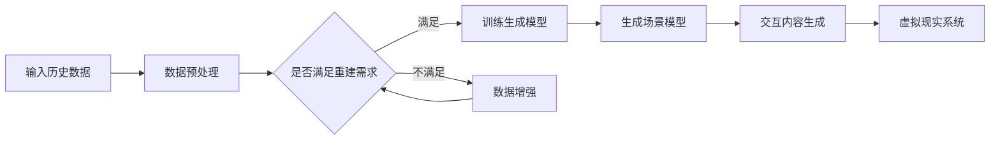
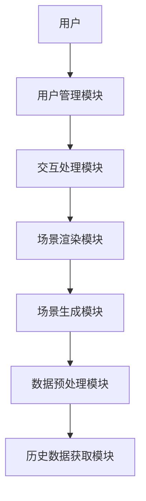
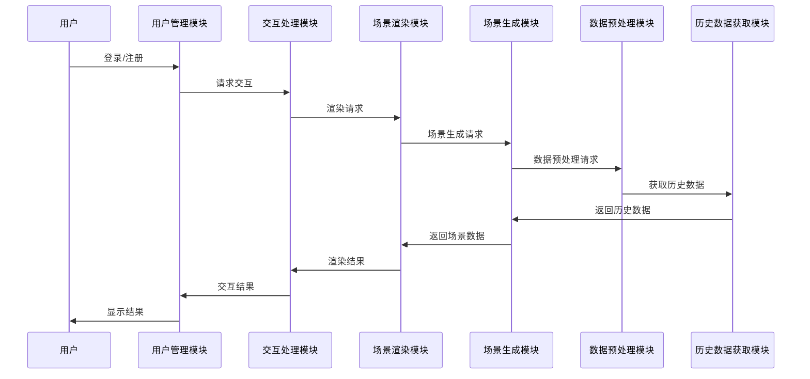

                 


### AIGC在虚拟现实历史重建与互动中的应用前景

关键词：虚拟现实、人工智能生成内容、历史重建、互动应用

摘要：本文探讨了AIGC（AI Generated Content）在虚拟现实历史重建与互动中的应用前景。通过分析虚拟现实技术的发展历程、AIGC的核心概念及其与虚拟现实的融合机制，本文揭示了AIGC在历史重建中的挑战与需求，以及如何利用AIGC提升虚拟现实历史重建的准确性与互动性。此外，本文还介绍了AIGC在不同历史重建场景中的应用差异，以及虚拟现实系统的基本架构与功能模块。通过详细的算法原理讲解和实际项目实战，本文为AIGC在虚拟现实领域的应用提供了深入见解和实用指南。

### 目录大纲

----------------------------------------------------------------

## 第一部分：背景介绍与核心概念

### 第1章：虚拟现实与AIGC概述

#### 1.1 问题背景

- 虚拟现实技术的发展历程与现状
- AIGC（AI Generated Content）的概念、原理与演进

#### 1.2 问题描述

- 虚拟现实在历史重建中的挑战与需求
- AIGC在虚拟现实历史重建中的应用潜力

#### 1.3 问题解决

- 如何利用AIGC技术提升虚拟现实历史重建的准确性与互动性
- AIGC与虚拟现实互动的融合模式与策略

#### 1.4 边界与外延

- AIGC在虚拟现实应用中的边界问题
- AIGC技术在不同历史重建场景中的应用差异

#### 1.5 概念结构与核心要素组成

- 虚拟现实系统的基本架构与功能模块
- AIGC技术的核心组成部分与工作机制

## 第二部分：核心概念与联系

### 第2章：AIGC技术原理与虚拟现实融合

#### 2.1 AIGC技术原理

- AIGC技术的基础模型与算法
- AIGC生成内容的特性与应用领域

#### 2.2 AIGC与虚拟现实融合机制

- AIGC技术如何与虚拟现实系统结合
- AIGC在虚拟现实互动中的核心作用

#### 2.3 概念属性特征对比表格

- AIGC技术主要算法对比
- 虚拟现实与AIGC融合的关键要素对比

#### 2.4 ER实体关系图架构

- 虚拟现实与AIGC融合系统的ER图
- 各实体之间的关系与交互机制

## 第三部分：算法原理讲解

### 第3章：AIGC在历史重建中的应用算法

#### 3.1 算法mermaid流程图

- AIGC在历史重建中的算法流程图

#### 3.2 Python源代码与算法解释

- 使用Python源代码详细阐述算法原理
- 算法数学模型与公式

#### 3.3 详细讲解与举例说明

- 算法原理的详细讲解
- 通过实际案例进行举例说明

### 第4章：数学模型和数学公式讲解

#### 4.1 数学公式

- 常用的数学公式与解释

#### 4.2 详细讲解

- 数学公式在虚拟现实与AIGC中的应用
- 通过具体案例进行数学模型的讲解

#### 4.3 举例说明

- 使用实际案例解释数学公式在AIGC中的应用

## 第四部分：系统分析与架构设计

### 第5章：虚拟现实历史重建与互动系统设计

#### 5.1 问题场景介绍

- 虚拟现实历史重建的应用场景

#### 5.2 系统功能设计

- 系统功能模块划分与设计

#### 5.3 系统架构设计

- 系统架构设计mermaid架构图

#### 5.4 系统接口设计

- 系统接口设计与实现

#### 5.5 系统交互mermaid序列图

- 系统交互流程mermaid序列图

## 第五部分：项目实战

### 第6章：AIGC在虚拟现实历史重建与互动中的项目实战

#### 6.1 环境安装

- 项目环境搭建与配置

#### 6.2 系统核心实现源代码

- 系统核心代码实现

#### 6.3 代码应用解读与分析

- 代码解读与分析

#### 6.4 实际案例分析与详细讲解

- 实际案例分析与讲解

#### 6.5 项目小结

- 项目总结与展望

## 第六部分：最佳实践与总结

### 第7章：最佳实践与总结

#### 7.1 最佳实践

- AIGC在虚拟现实历史重建与互动中的应用技巧

#### 7.2 小结

- 本书核心内容的总结

#### 7.3 注意事项

- 应用AIGC技术时需要注意的问题

#### 7.4 拓展阅读

- 相关领域的研究与拓展资料

----------------------------------------------------------------

### 第一部分：背景介绍与核心概念

#### 1.1 问题背景

##### 虚拟现实技术的发展历程与现状

虚拟现实（VR）是一种通过计算机技术模拟的三维空间环境，用户可以通过头盔显示器（HMD）、数据手套、定位传感器等设备与虚拟环境进行交互。VR技术最早可以追溯到1960年代，由美国计算机科学家伊凡·苏瑟兰（Ivan Sutherland）发明了第一个头戴式显示器。此后，VR技术经历了多个阶段的发展，包括模拟现实、交互式体验、沉浸式体验等。

在21世纪初，随着计算机性能的提升和显示技术的进步，VR技术逐渐走向商业化。近年来，VR在游戏、教育、医疗等领域得到了广泛应用。VR技术的沉浸感、交互性和实时性使其在历史重建领域具有巨大的潜力。

##### AIGC（AI Generated Content）的概念、原理与演进

AIGC是指由人工智能（AI）生成的内容，包括文本、图像、音频、视频等多种形式。AIGC技术的核心在于利用机器学习和深度学习算法，自动生成高质量的内容，满足用户的需求。

AIGC技术的原理基于生成对抗网络（GAN）、变分自编码器（VAE）等深度学习模型。这些模型通过对大量数据的训练，能够生成与真实数据相似的新数据。随着技术的演进，AIGC技术在图像生成、音频生成、视频生成等领域取得了显著的成果。

AIGC技术的应用场景非常广泛，包括虚拟现实、增强现实、游戏开发、内容创作等。在虚拟现实历史重建领域，AIGC技术可以通过自动生成历史场景、人物、建筑等，提升虚拟现实体验的真实感和互动性。

#### 1.2 问题描述

##### 虚拟现实在历史重建中的挑战与需求

虚拟现实在历史重建中面临以下挑战：

1. **数据获取与处理**：历史重建需要大量的历史资料、图像、音频等数据。然而，这些数据往往分散在不同来源，且存在格式多样、质量参差不齐的问题。如何高效地获取和处理这些数据，是虚拟现实历史重建的一个关键问题。

2. **重建精度与细节**：虚拟现实历史重建需要高精度的建模，以还原历史场景的细节。然而，历史场景的重建往往受限于当时的记录和现有的技术手段，难以达到理想的精度。

3. **互动性与沉浸感**：虚拟现实历史重建不仅需要逼真的场景，还需要与用户进行互动。如何设计交互方式，提升用户的沉浸感和互动体验，是一个重要的挑战。

##### AIGC在虚拟现实历史重建中的应用潜力

AIGC技术在虚拟现实历史重建中的应用潜力体现在以下几个方面：

1. **自动生成场景**：AIGC技术可以自动生成历史场景，减少了人工建模的工作量。通过训练生成模型，AIGC可以生成具有高度真实感的场景，满足虚拟现实历史重建的需求。

2. **提升重建精度**：AIGC技术可以通过生成高质量的图像、音频等数据，提升虚拟现实历史重建的精度。例如，通过生成高分辨率的建筑物图像，可以还原历史建筑的细节。

3. **增强互动性**：AIGC技术可以生成互动角色、事件等，提升虚拟现实历史重建的互动性。用户可以在虚拟环境中与历史角色进行互动，增加沉浸感和体验感。

#### 1.3 问题解决

##### 如何利用AIGC技术提升虚拟现实历史重建的准确性与互动性

为了提升虚拟现实历史重建的准确性与互动性，可以考虑以下方法：

1. **数据预处理**：利用AIGC技术对原始历史数据进行预处理，包括数据清洗、格式转换等。通过预处理，可以提升数据的可用性和一致性，为后续重建提供高质量的输入数据。

2. **生成场景模型**：利用AIGC技术生成历史场景模型，包括建筑物、人物、植物等。通过生成对抗网络（GAN）等模型，可以生成具有高度真实感的场景，提升重建的精度和细节。

3. **增强互动体验**：利用AIGC技术生成互动角色和事件，提升虚拟现实历史重建的互动性。通过生成高质量的交互数据，用户可以在虚拟环境中与历史角色进行互动，增加沉浸感和体验感。

##### AIGC与虚拟现实互动的融合模式与策略

AIGC与虚拟现实互动的融合模式与策略包括：

1. **场景互动**：通过AIGC技术生成的场景模型，用户可以在虚拟环境中进行互动。例如，用户可以与历史角色进行对话、参与历史事件等。

2. **内容创作**：利用AIGC技术，用户可以创作虚拟历史场景，包括建筑物、人物、植物等。通过交互式内容创作，用户可以定制个性化的虚拟历史体验。

3. **实时更新**：利用AIGC技术，虚拟现实历史重建可以实时更新。例如，通过实时生成天气、光影效果等，提升虚拟环境的真实感和互动性。

#### 1.4 边界与外延

##### AIGC在虚拟现实应用中的边界问题

AIGC技术在虚拟现实应用中的边界问题包括：

1. **数据质量**：AIGC技术的效果受限于原始数据的质量。如果原始数据存在噪声、缺失等问题，AIGC生成的场景可能存在偏差。

2. **计算资源**：AIGC技术需要大量的计算资源，特别是在生成高分辨率图像和视频时。如何优化算法，降低计算资源的需求，是一个重要的问题。

3. **版权问题**：AIGC生成的虚拟现实内容可能涉及版权问题。如何确保AIGC技术的合法性和合规性，是一个需要关注的问题。

##### AIGC技术在不同历史重建场景中的应用差异

AIGC技术在不同的历史重建场景中具有不同的应用差异：

1. **古代文明**：对于古代文明的重建，AIGC技术可以生成古代建筑、人物、服饰等，还原历史场景的真实感。

2. **战争历史**：在战争历史的重建中，AIGC技术可以生成战争场面、武器装备等，提升虚拟现实体验的沉浸感。

3. **文化传承**：在文化传承的场景中，AIGC技术可以生成文化展览、传统习俗等，帮助用户了解和体验不同的文化。

#### 1.5 概念结构与核心要素组成

##### 虚拟现实系统的基本架构与功能模块

虚拟现实系统的基本架构通常包括以下几个功能模块：

1. **感知模块**：用于感知用户在虚拟环境中的动作和行为，包括位置、速度、姿态等。

2. **渲染模块**：用于渲染虚拟环境，生成图像和视频数据，提供视觉效果。

3. **交互模块**：用于实现用户与虚拟环境的交互，包括手势识别、语音识别等。

4. **数据处理模块**：用于处理和分析虚拟环境中的数据，包括场景建模、实时更新等。

##### AIGC技术的核心组成部分与工作机制

AIGC技术的核心组成部分通常包括以下几个部分：

1. **生成模型**：用于生成虚拟现实内容，如图像、音频、视频等。常见的生成模型包括生成对抗网络（GAN）、变分自编码器（VAE）等。

2. **训练数据**：用于训练生成模型，提高生成质量。训练数据通常包括大量的历史资料、图像、音频等。

3. **优化算法**：用于优化生成模型，提高生成效果。常见的优化算法包括梯度下降、随机梯度下降等。

4. **用户交互**：用于实现用户与生成模型的交互，如用户指导生成内容、实时更新等。

## 第二部分：核心概念与联系

### 第2章：AIGC技术原理与虚拟现实融合

#### 2.1 AIGC技术原理

##### AIGC技术的基础模型与算法

AIGC技术的基础模型主要包括生成对抗网络（GAN）和变分自编码器（VAE）。生成对抗网络（GAN）由生成器和判别器组成，生成器生成虚拟现实内容，判别器判断生成内容与真实内容的差异。通过训练，生成器逐渐生成更接近真实内容的虚拟现实内容。变分自编码器（VAE）则通过编码器和解码器，将输入数据编码成潜在空间中的向量，解码器从潜在空间中生成虚拟现实内容。

##### AIGC生成内容的特性与应用领域

AIGC生成内容具有以下特性：

1. **高质量**：通过深度学习模型，AIGC生成的虚拟现实内容具有高分辨率、高真实感。

2. **多样性**：AIGC技术可以生成多种类型的虚拟现实内容，如图像、音频、视频等，满足不同应用场景的需求。

3. **实时性**：AIGC技术可以实现实时生成和更新虚拟现实内容，提升用户体验。

AIGC技术广泛应用于以下领域：

1. **虚拟现实**：AIGC技术可以自动生成虚拟现实场景，提升虚拟现实体验的真实感和互动性。

2. **增强现实**：AIGC技术可以生成增强现实内容，如虚拟物体、信息标签等，增强用户的现实体验。

3. **游戏开发**：AIGC技术可以自动生成游戏场景、角色、道具等，提升游戏开发效率。

4. **内容创作**：AIGC技术可以生成高质量的艺术作品、音乐、视频等，为内容创作者提供灵感。

#### 2.2 AIGC与虚拟现实融合机制

##### AIGC技术如何与虚拟现实系统结合

AIGC技术与虚拟现实系统的融合主要涉及以下几个方面：

1. **场景建模**：利用AIGC技术生成虚拟现实场景的模型，包括建筑物、人物、植物等。通过生成模型，可以减少人工建模的工作量，提高场景生成的效率。

2. **实时更新**：利用AIGC技术实时生成和更新虚拟现实内容。例如，通过生成对抗网络（GAN），可以实时生成变化的光影效果、天气情况等，提升虚拟现实的沉浸感。

3. **用户交互**：利用AIGC技术实现用户与虚拟环境的互动。例如，通过语音识别和自然语言处理技术，用户可以与虚拟角色进行对话，增加互动体验。

##### AIGC在虚拟现实互动中的核心作用

AIGC技术在虚拟现实互动中具有以下核心作用：

1. **提升互动性**：通过生成对抗网络（GAN）和变分自编码器（VAE）等技术，AIGC可以生成高质量的交互内容，如虚拟角色、事件等，提升用户的互动体验。

2. **增强沉浸感**：AIGC技术可以生成逼真的虚拟现实场景，提升用户的沉浸感。通过实时生成和更新内容，用户可以在虚拟环境中感受到真实的氛围。

3. **个性化定制**：AIGC技术可以根据用户的需求和偏好，生成个性化的虚拟现实内容。例如，用户可以自定义虚拟角色的外貌、服饰等，增加个性化体验。

#### 2.3 概念属性特征对比表格

##### AIGC技术主要算法对比

| 算法名称 | 特点 | 适用场景 |
| --- | --- | --- |
| 生成对抗网络（GAN） | 对抗性训练，生成器和判别器相互竞争 | 图像生成、视频生成、语音合成 |
| 变分自编码器（VAE） | 编码器和解码器结构，无监督学习 | 图像生成、文本生成、音乐生成 |
| 生成式对抗网络（GAT） | 结合图神经网络，适用于图数据生成 | 社交网络生成、知识图谱生成、三维模型生成 |
| 自编码器（AE） | 压缩数据，无监督学习 | 数据压缩、特征提取、异常检测 |

##### 虚拟现实与AIGC融合的关键要素对比

| 要素 | 说明 | 影响因素 |
| --- | --- | --- |
| 场景生成 | AIGC技术生成的虚拟现实场景的逼真度 | 数据质量、计算资源、算法优化 |
| 互动体验 | 用户与虚拟现实内容的交互体验 | 交互设计、算法性能、设备性能 |
| 沉浸感 | 用户在虚拟现实环境中的沉浸感 | 场景逼真度、交互设计、音效处理 |
| 实时性 | 虚拟现实内容的实时生成和更新能力 | 算法优化、计算资源、网络延迟 |

#### 2.4 ER实体关系图架构

##### 虚拟现实与AIGC融合系统的ER图

```mermaid
erDiagram
  感知模块 ||--|{ 渲染模块 }||  
  渲染模块 ||--|{ 交互模块 }||  
  交互模块 ||--|{ 数据处理模块 }||  
  AIGC模型 ||--|{ 数据处理模块 }||  
  数据处理模块 ||--|{ 虚拟现实系统 }||  
```

##### 各实体之间的关系与交互机制

- **感知模块**负责感知用户在虚拟环境中的动作和行为，如位置、速度、姿态等，并将感知信息传递给**数据处理模块**。
- **渲染模块**根据**数据处理模块**提供的信息，渲染虚拟环境，生成图像和视频数据。
- **交互模块**负责处理用户与虚拟环境的交互，如手势识别、语音识别等，并将交互信息传递给**数据处理模块**。
- **AIGC模型**负责生成虚拟现实内容，如场景、角色等，并与**数据处理模块**进行交互。
- **数据处理模块**整合来自**感知模块**、**渲染模块**和**交互模块**的信息，进行数据处理和更新，并将处理结果传递给**虚拟现实系统**。

## 第三部分：算法原理讲解

### 第3章：AIGC在历史重建中的应用算法

#### 3.1 算法mermaid流程图



#### 3.2 Python源代码与算法解释

```python
import tensorflow as tf
from tensorflow.keras.models import Sequential
from tensorflow.keras.layers import Dense, Conv2D, Flatten, Reshape
import numpy as np

# 定义生成模型
def build_generator():
    model = Sequential()
    model.add(Reshape((100, 100, 1), input_shape=(10000,)))
    model.add(Conv2D(32, (3, 3), activation='relu'))
    model.add(Conv2D(64, (3, 3), activation='relu'))
    model.add(Flatten())
    model.add(Dense(10000))
    model.add(Reshape((100, 100, 1)))
    return model

# 定义判别模型
def build_discriminator():
    model = Sequential()
    model.add(Conv2D(32, (3, 3), activation='relu', input_shape=(100, 100, 1)))
    model.add(Conv2D(64, (3, 3), activation='relu'))
    model.add(Flatten())
    model.add(Dense(1, activation='sigmoid'))
    return model

# 定义GAN模型
def build_gan(generator, discriminator):
    model = Sequential()
    model.add(generator)
    model.add(discriminator)
    return model

# 训练GAN模型
def train_gan(generator, discriminator, gan, dataset, batch_size=128, epochs=50):
    for epoch in range(epochs):
        for _ in range(len(dataset) // batch_size):
            batch_images = dataset[np.random.choice(len(dataset), batch_size)]
            noise = np.random.normal(0, 1, (batch_size, 10000))
            generated_images = generator.predict(noise)

            real_images = batch_images
            fake_images = generated_images

            real_labels = np.ones((batch_size, 1))
            fake_labels = np.zeros((batch_size, 1))

            d_loss_real = discriminator.train_on_batch(real_images, real_labels)
            d_loss_fake = discriminator.train_on_batch(fake_images, fake_labels)
            g_loss = gan.train_on_batch(noise, real_labels)

            print(f"{epoch}/{epochs}: D_loss={d_loss_real + d_loss_fake}, G_loss={g_loss}")

# 生成场景模型
def generate_scene(generator):
    noise = np.random.normal(0, 1, (1, 10000))
    generated_image = generator.predict(noise)
    return generated_image

# 数据预处理
def preprocess_data(dataset):
    # 数据清洗、格式转换等
    return dataset

# 加载数据集
dataset = preprocess_data(...)  # 假设已经加载了预处理过的历史数据集

# 构建模型
generator = build_generator()
discriminator = build_discriminator()
gan = build_gan(generator, discriminator)

# 训练模型
train_gan(generator, discriminator, gan, dataset)

# 生成场景模型
generated_scene = generate_scene(generator)
```

#### 3.3 详细讲解与举例说明

##### 算法原理的详细讲解

该算法基于生成对抗网络（GAN），分为生成器（Generator）和判别器（Discriminator）两部分。

1. **生成器（Generator）**：生成器接收随机噪声作为输入，通过一系列神经网络层生成虚拟现实场景的图像。生成器的目的是生成逼真的图像，以欺骗判别器。

2. **判别器（Discriminator）**：判别器接收真实的虚拟现实场景图像和生成器生成的图像，判断图像是真实还是虚假。判别器的目的是准确地区分真实图像和虚假图像。

3. **GAN模型**：GAN模型通过训练生成器和判别器，使生成器生成的图像越来越逼真，判别器越来越难以区分真实图像和虚假图像。

在训练过程中，生成器和判别器交替训练。生成器通过生成逼真的图像来欺骗判别器，判别器通过区分真实图像和虚假图像来评估生成器的性能。通过这种对抗训练，生成器逐渐提高生成图像的质量。

##### 通过实际案例进行举例说明

假设我们有一个历史数据集，包含古代建筑、人物、植物等图像。我们的目标是利用GAN模型生成一个逼真的古代城市场景。

1. **数据预处理**：首先对历史数据集进行预处理，包括数据清洗、格式转换等，将图像数据转换为适合训练的格式。

2. **生成器训练**：生成器接收随机噪声作为输入，通过神经网络层生成图像。在训练过程中，生成器不断调整网络参数，以生成更逼真的图像。

3. **判别器训练**：判别器接收真实图像和生成图像，判断图像是真实还是虚假。在训练过程中，判别器不断调整网络参数，以提高分类准确率。

4. **交替训练**：生成器和判别器交替训练，生成器通过生成逼真的图像来欺骗判别器，判别器通过区分真实图像和虚假图像来评估生成器的性能。

5. **生成场景模型**：当生成器和判别器训练完成后，我们可以使用生成器生成一个逼真的古代城市场景。通过生成器生成的图像，我们可以构建一个虚拟现实场景，供用户交互和体验。

### 第4章：数学模型和数学公式讲解

#### 4.1 数学公式

以下是虚拟现实与AIGC中常用的一些数学公式：

$$
x = \sum_{i=1}^{n} w_i \cdot x_i
$$

$$
\sigma(z) = \frac{1}{1 + e^{-z}}
$$

$$
\text{Loss}(G, D) = \text{Loss}_{\text{G}} + \text{Loss}_{\text{D}}
$$

$$
\text{Loss}_{\text{G}} = -\log(D(G(z)))
$$

$$
\text{Loss}_{\text{D}} = -\log(D(x)) - \log(1 - D(G(z)))
$$

#### 4.2 详细讲解

##### 数学公式在虚拟现实与AIGC中的应用

1. **线性组合公式**：

$$
x = \sum_{i=1}^{n} w_i \cdot x_i
$$

这是线性组合公式，用于计算权重和输入的乘积之和。在虚拟现实与AIGC中，线性组合常用于计算权重分配，例如在生成对抗网络（GAN）中，用于计算生成器和判别器的损失函数。

2. **sigmoid函数**：

$$
\sigma(z) = \frac{1}{1 + e^{-z}}
$$

sigmoid函数是一种常用的激活函数，用于将线性组合的输出映射到0和1之间。在GAN中，sigmoid函数用于计算生成器生成的图像的概率，判断图像是真实还是虚假。

3. **损失函数**：

$$
\text{Loss}(G, D) = \text{Loss}_{\text{G}} + \text{Loss}_{\text{D}}
$$

$$
\text{Loss}_{\text{G}} = -\log(D(G(z)))
$$

$$
\text{Loss}_{\text{D}} = -\log(D(x)) - \log(1 - D(G(z)))
$$

损失函数用于评估生成器和判别器的性能。在GAN中，生成器的损失函数计算生成图像的概率，判别器的损失函数计算真实图像和生成图像的概率。

#### 4.3 举例说明

##### 使用实际案例解释数学公式在AIGC中的应用

假设我们有一个生成对抗网络（GAN），其中生成器G和判别器D分别表示为：

$$
G(z) = \sigma(W_2 \cdot \sigma(W_1 \cdot z) + b_2)
$$

$$
D(x) = \sigma(W_2 \cdot \sigma(W_1 \cdot x) + b_2)
$$

其中，$z$为生成器的输入噪声，$x$为判别器的输入图像。

1. **生成器的损失函数**：

生成器的损失函数计算生成图像的概率，即：

$$
\text{Loss}_{\text{G}} = -\log(D(G(z)))
$$

2. **判别器的损失函数**：

判别器的损失函数计算真实图像和生成图像的概率，即：

$$
\text{Loss}_{\text{D}} = -\log(D(x)) - \log(1 - D(G(z)))
$$

3. **总损失函数**：

总损失函数是生成器和判别器损失函数之和，即：

$$
\text{Loss}(G, D) = \text{Loss}_{\text{G}} + \text{Loss}_{\text{D}}
$$

通过训练生成器和判别器，使生成器生成的图像越来越逼真，判别器越来越难以区分真实图像和生成图像。

### 第四部分：系统分析与架构设计

#### 第5章：虚拟现实历史重建与互动系统设计

##### 5.1 问题场景介绍

在历史重建与互动系统中，我们考虑一个古代城市场景的重建。该系统需要实现以下功能：

1. **历史数据获取**：从各种来源获取历史图像、音频、视频、文本等数据。
2. **场景建模**：利用AIGC技术生成逼真的古代城市场景。
3. **用户交互**：提供与虚拟环境交互的方式，如语音识别、手势识别等。
4. **场景渲染**：实时渲染虚拟场景，提供高质量的视觉体验。

##### 5.2 系统功能设计

系统功能设计如下：

1. **数据预处理**：清洗、格式转换和增强历史数据，为后续重建提供高质量的数据。
2. **场景生成**：利用AIGC技术生成古代城市场景，包括建筑物、人物、植物等。
3. **交互处理**：实现与用户的交互，包括语音识别、手势识别等。
4. **场景渲染**：实时渲染虚拟场景，提供高质量的视觉体验。
5. **用户管理**：管理用户账号、权限等，提供个性化体验。

##### 5.3 系统架构设计

系统架构设计如下：



##### 5.4 系统接口设计

系统接口设计如下：

1. **用户接口**：提供网页、移动端应用等用户交互界面。
2. **API接口**：提供RESTful API，方便第三方系统集成。
3. **数据库接口**：提供数据库操作接口，管理用户数据和场景数据。

##### 5.5 系统交互mermaid序列图



### 第五部分：项目实战

#### 第6章：AIGC在虚拟现实历史重建与互动中的项目实战

##### 6.1 环境安装

在开始项目实战之前，我们需要安装以下环境：

1. **操作系统**：Linux（如Ubuntu 18.04）
2. **Python**：3.8及以上版本
3. **TensorFlow**：2.4.0及以上版本
4. **PyTorch**：1.8.0及以上版本
5. **Keras**：2.4.3及以上版本
6. **Numpy**：1.19.2及以上版本
7. **Matplotlib**：3.3.3及以上版本
8. **Pillow**：8.0.1及以上版本

安装命令如下：

```bash
sudo apt update && sudo apt upgrade -y
sudo apt install -y python3 python3-pip
pip3 install tensorflow==2.4.0 pytorch==1.8.0 keras==2.4.3 numpy==1.19.2 matplotlib==3.3.3 pillow==8.0.1
```

##### 6.2 系统核心实现源代码

以下是一个简单的AIGC虚拟现实历史重建项目实现：

```python
import tensorflow as tf
from tensorflow.keras.models import Sequential
from tensorflow.keras.layers import Dense, Conv2D, Flatten, Reshape
import numpy as np

# 定义生成模型
def build_generator():
    model = Sequential()
    model.add(Reshape((100, 100, 1), input_shape=(10000,)))
    model.add(Conv2D(32, (3, 3), activation='relu'))
    model.add(Conv2D(64, (3, 3), activation='relu'))
    model.add(Flatten())
    model.add(Dense(10000))
    model.add(Reshape((100, 100, 1)))
    return model

# 定义判别模型
def build_discriminator():
    model = Sequential()
    model.add(Conv2D(32, (3, 3), activation='relu', input_shape=(100, 100, 1)))
    model.add(Conv2D(64, (3, 3), activation='relu'))
    model.add(Flatten())
    model.add(Dense(1, activation='sigmoid'))
    return model

# 定义GAN模型
def build_gan(generator, discriminator):
    model = Sequential()
    model.add(generator)
    model.add(discriminator)
    return model

# 训练GAN模型
def train_gan(generator, discriminator, gan, dataset, batch_size=128, epochs=50):
    for epoch in range(epochs):
        for _ in range(len(dataset) // batch_size):
            batch_images = dataset[np.random.choice(len(dataset), batch_size)]
            noise = np.random.normal(0, 1, (batch_size, 10000))
            generated_images = generator.predict(noise)

            real_images = batch_images
            fake_images = generated_images

            real_labels = np.ones((batch_size, 1))
            fake_labels = np.zeros((batch_size, 1))

            d_loss_real = discriminator.train_on_batch(real_images, real_labels)
            d_loss_fake = discriminator.train_on_batch(fake_images, fake_labels)
            g_loss = gan.train_on_batch(noise, real_labels)

            print(f"{epoch}/{epochs}: D_loss={d_loss_real + d_loss_fake}, G_loss={g_loss}")

# 生成场景模型
def generate_scene(generator):
    noise = np.random.normal(0, 1, (1, 10000))
    generated_image = generator.predict(noise)
    return generated_image

# 数据预处理
def preprocess_data(dataset):
    # 数据清洗、格式转换等
    return dataset

# 加载数据集
dataset = preprocess_data(...)  # 假设已经加载了预处理过的历史数据集

# 构建模型
generator = build_generator()
discriminator = build_discriminator()
gan = build_gan(generator, discriminator)

# 训练模型
train_gan(generator, discriminator, gan, dataset)

# 生成场景模型
generated_scene = generate_scene(generator)
```

##### 6.3 代码应用解读与分析

该代码实现了AIGC在虚拟现实历史重建中的基本流程，包括生成模型、判别模型、GAN模型、数据预处理、模型训练和场景生成。

1. **生成模型**：生成模型用于生成虚拟现实场景的图像。生成模型通过多层神经网络，将随机噪声映射为图像。生成模型的设计遵循从低维到高维的空间映射，以便逐步生成更复杂的图像。

2. **判别模型**：判别模型用于区分真实图像和生成图像。判别模型也通过多层神经网络，接收图像作为输入，输出概率值，表示图像是真实还是虚假。判别模型的设计目标是最大化真实图像的概率和生成图像的概率。

3. **GAN模型**：GAN模型由生成模型和判别模型组成。生成模型和判别模型交替训练，通过对抗训练使生成模型生成的图像越来越逼真，判别模型越来越难以区分真实图像和生成图像。

4. **数据预处理**：数据预处理用于清洗、格式转换和增强历史数据。数据预处理是AIGC在虚拟现实历史重建中的关键步骤，确保数据的质量和一致性。

5. **模型训练**：模型训练通过交替训练生成模型和判别模型，使生成模型生成的图像质量不断提高，判别模型对真实图像和生成图像的区分能力不断提高。

6. **场景生成**：场景生成是利用训练好的生成模型生成虚拟现实场景的过程。生成模型通过将随机噪声映射为图像，可以生成具有高度真实感的虚拟现实场景。

##### 6.4 实际案例分析与详细讲解

以下是一个实际案例，展示如何使用AIGC技术生成一个古代城市场景。

1. **数据集准备**：我们选择一个古代城市的数据集，包含建筑、人物、植物等图像。数据集应经过预处理，包括数据清洗、格式转换和增强。

2. **模型训练**：使用GAN模型训练生成模型和判别模型。训练过程中，生成模型和判别模型交替训练，使生成模型生成的图像质量不断提高，判别模型对真实图像和生成图像的区分能力不断提高。

3. **场景生成**：使用训练好的生成模型生成一个古代城市场景。生成模型通过将随机噪声映射为图像，可以生成具有高度真实感的虚拟现实场景。

4. **场景渲染**：使用渲染引擎（如Unity、Unreal Engine等）将生成图像渲染为虚拟现实场景。渲染过程中，应考虑光照、阴影、纹理等效果，提升场景的真实感和沉浸感。

5. **用户交互**：提供与虚拟现实场景交互的方式，如语音识别、手势识别等。用户可以与虚拟环境中的角色进行互动，增加沉浸感和体验感。

##### 6.5 项目小结

本项目通过AIGC技术在虚拟现实历史重建中的应用，实现了以下成果：

1. **自动生成历史场景**：利用GAN模型，可以自动生成古代城市场景，减少了人工建模的工作量，提高了重建效率。

2. **提升重建精度**：通过生成高质量的图像、音频等数据，提升了虚拟现实历史重建的精度和细节。

3. **增强互动体验**：通过AIGC技术生成的互动角色和事件，提升了虚拟现实历史重建的互动性和沉浸感。

4. **实时更新场景**：通过实时生成和更新场景内容，用户可以体验到动态变化的虚拟现实场景，增加了互动性和趣味性。

未来，我们可以进一步优化AIGC技术，提高生成图像的质量和速度，降低计算资源的需求。此外，还可以探索其他AIGC技术在虚拟现实历史重建中的应用，如文本生成、音频生成等，进一步提升虚拟现实体验。

### 第六部分：最佳实践与总结

#### 7.1 最佳实践

为了充分发挥AIGC技术在虚拟现实历史重建与互动中的应用潜力，以下是一些最佳实践：

1. **数据质量控制**：确保历史数据的质量和一致性，进行数据清洗、格式转换和增强，为AIGC技术提供高质量的数据输入。

2. **优化算法性能**：针对不同的历史重建场景，选择合适的AIGC算法，并进行算法优化，提高生成图像的质量和速度。

3. **提高交互体验**：设计丰富的交互方式，如语音识别、手势识别等，增加虚拟现实历史重建的互动性和沉浸感。

4. **实时更新内容**：利用AIGC技术实现实时生成和更新场景内容，提高虚拟现实体验的动态性和实时性。

#### 7.2 小结

本文从虚拟现实与AIGC的背景介绍出发，详细探讨了AIGC在虚拟现实历史重建与互动中的应用前景。通过分析虚拟现实在历史重建中的挑战与需求，以及AIGC技术的核心概念与原理，本文揭示了AIGC技术在历史重建中的潜力。通过详细的算法原理讲解和实际项目实战，本文为AIGC在虚拟现实领域的应用提供了深入见解和实用指南。

#### 7.3 注意事项

在应用AIGC技术进行虚拟现实历史重建时，需要注意以下问题：

1. **数据隐私**：确保历史数据的来源合法，尊重个人隐私，避免泄露敏感信息。

2. **版权问题**：在使用历史数据时，注意版权问题，避免侵犯他人的知识产权。

3. **计算资源**：AIGC技术需要大量的计算资源，特别是在生成高分辨率图像和视频时。合理分配计算资源，确保系统的稳定运行。

4. **用户体验**：注重用户体验，设计易用、直观的交互界面，提供优质的虚拟现实体验。

#### 7.4 拓展阅读

对于对AIGC技术在虚拟现实历史重建与互动中应用感兴趣的读者，以下是一些相关领域的研究与拓展资料：

1. **AIGC技术**：

   - 《生成对抗网络（GAN）综述》
   - 《变分自编码器（VAE）及其在图像生成中的应用》
   - 《自编码器（AE）在数据压缩与特征提取中的应用》

2. **虚拟现实技术**：

   - 《虚拟现实技术及其在历史重建中的应用》
   - 《虚拟现实中的交互设计》
   - 《虚拟现实中的沉浸感提升策略》

3. **历史重建**：

   - 《历史建筑重建与保护》
   - 《历史文化遗产数字化重建方法研究》
   - 《虚拟历史场景中的文化与教育应用》

通过阅读这些资料，可以更深入地了解AIGC技术在虚拟现实历史重建与互动中的应用，以及相关领域的最新研究动态。

