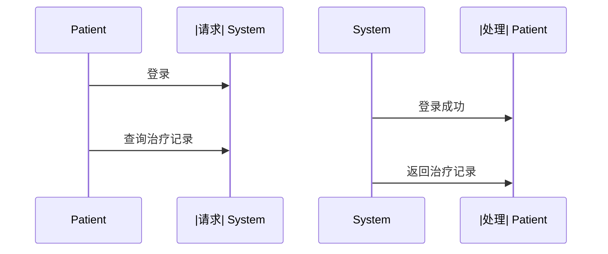
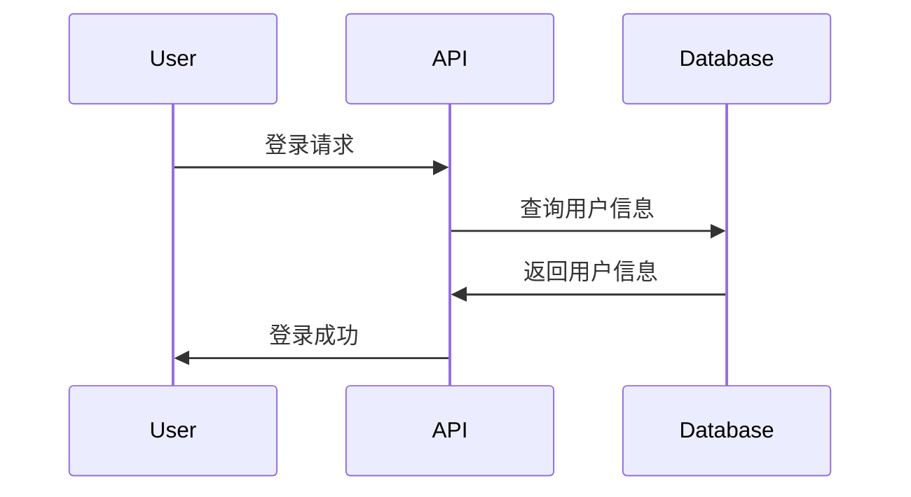
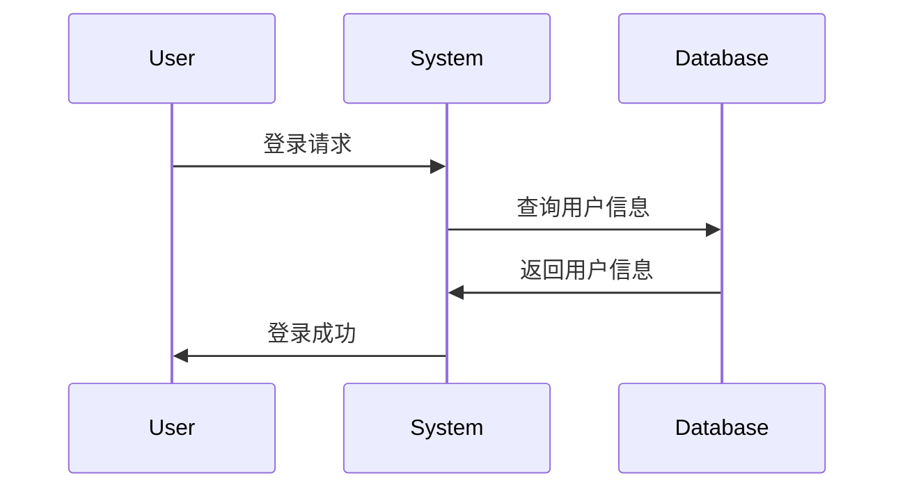

                 

## AIGC在虚拟现实心理治疗中的创新

### 关键词：AIGC、虚拟现实、心理治疗、创新、算法、交互、技术

### 摘要：

随着科技的发展，虚拟现实（VR）和心理治疗领域的结合正逐渐成为一种新兴的治疗方式。而自适应生成计算（AIGC）技术的引入，为这一领域带来了全新的变革。本文将详细探讨AIGC在VR心理治疗中的应用，包括其定义与特点、VR心理治疗的现状与需求、AIGC与VR心理治疗的核心概念与联系，以及具体的算法原理、系统架构设计与项目实战。通过一步步的分析与思考，我们希望能揭示AIGC在VR心理治疗中的巨大潜力与创新方向。

## 第一部分：背景介绍

### 第1章：AIGC概念与VR心理治疗

#### 1.1 AIGC的定义与特点

自适应生成计算（AIGC）是一种融合了人工智能、生成模型和自适应交互技术的综合性计算范式。AIGC的核心在于其生成能力，能够根据用户的需求和环境的变化，动态地生成符合期望的内容。其特点包括：

1. **高度的自适应性**：能够根据用户的行为和反馈，自动调整生成的内容和交互方式。
2. **强大的生成能力**：能够生成高质量的文本、图像、音频等多种类型的内容。
3. **智能的交互方式**：通过自然语言处理和机器学习技术，实现与用户的智能对话和交互。

#### 1.1.1 AIGC的起源与发展

AIGC的概念起源于生成对抗网络（GAN）和变分自编码器（VAE）等生成模型的研究。随着深度学习和大数据技术的发展，AIGC逐渐成为人工智能领域的重要研究方向。近年来，AIGC在计算机视觉、自然语言处理、游戏设计等领域取得了显著的应用成果。

#### 1.1.2 AIGC的核心技术

AIGC的核心技术包括生成对抗网络（GAN）、变分自编码器（VAE）、自编码器（AE）、递归神经网络（RNN）等。这些技术共同构成了AIGC的生成能力和自适应交互能力。

#### 1.2 虚拟现实技术概述

虚拟现实（VR）是一种通过计算机技术模拟现实世界的三维空间，使用户能够沉浸其中的技术。VR技术的基本原理是通过头戴显示器（HMD）或投影设备，向用户呈现三维立体图像，同时通过跟踪设备捕捉用户的头部和手部动作，实现用户的虚拟空间中的自由移动和交互。

#### 1.2.1 VR技术的发展历程

VR技术起源于20世纪50年代的虚拟环境模拟研究，经过几十年的发展，逐渐从实验室走向了市场。近年来，随着硬件和软件技术的不断进步，VR技术在游戏、教育、医疗等领域得到了广泛应用。

#### 1.2.2 VR技术的关键要素

VR技术的关键要素包括：

1. **高清晰度的三维显示**：通过高清晰度的显示设备，提供逼真的视觉体验。
2. **精确的跟踪系统**：通过精确的跟踪系统，捕捉用户的动作，实现虚拟空间的自由移动和交互。
3. **实时渲染技术**：通过实时渲染技术，快速生成虚拟场景，提供流畅的交互体验。
4. **沉浸式音频技术**：通过沉浸式音频技术，提供逼真的声音效果，增强用户的沉浸感。

#### 1.3 VR心理治疗的现状与需求

VR心理治疗是一种利用虚拟现实技术进行心理疾病治疗的方法。目前，VR心理治疗在抑郁症、焦虑症、创伤后应激障碍（PTSD）等方面取得了显著的疗效。然而，现有的VR心理治疗仍然存在一些挑战，如治疗过程的个性化不足、治疗效果的评估标准不统一等。

#### 1.3.1 VR心理治疗的现状

VR心理治疗已经在临床实践中得到了广泛应用。例如，在抑郁症治疗中，VR技术被用来模拟患者的生活场景，帮助患者克服对特定情境的恐惧和焦虑。在焦虑症治疗中，VR技术被用来训练患者的放松技巧和应对策略。在PTSD治疗中，VR技术被用来帮助患者重新面对和克服创伤经历。

#### 1.3.2 AIGC在VR心理治疗中的应用需求

AIGC技术的引入，为VR心理治疗带来了新的可能性。AIGC的生成能力和自适应交互能力，可以极大地提升VR心理治疗的效果和个性化程度。例如，AIGC可以根据患者的具体需求和反馈，动态地生成符合患者治疗需求的内容，实现个性化的心理治疗。此外，AIGC还可以通过智能的交互方式，与患者进行自然的对话和互动，提升患者的治疗体验。

#### 1.4 AIGC在VR心理治疗中的创新

AIGC在VR心理治疗中的应用，主要体现在以下几个方面：

1. **个性化的治疗内容生成**：AIGC可以根据患者的具体需求和反馈，动态地生成符合患者治疗需求的内容，实现个性化的心理治疗。
2. **智能的交互方式**：AIGC可以通过自然语言处理和机器学习技术，实现与患者的智能对话和交互，提升患者的治疗体验。
3. **自适应的治疗过程**：AIGC可以根据患者的实时反馈和变化，动态地调整治疗过程和策略，提升治疗效果。

#### 1.4.1 AIGC如何提升VR心理治疗的效果

AIGC可以通过以下几个方面提升VR心理治疗的效果：

1. **个性化的治疗内容**：AIGC可以根据患者的具体需求和反馈，动态地生成符合患者治疗需求的内容，提高治疗的针对性和效果。
2. **智能的交互方式**：AIGC可以通过自然语言处理和机器学习技术，实现与患者的智能对话和交互，提高患者的参与度和满意度。
3. **自适应的治疗过程**：AIGC可以根据患者的实时反馈和变化，动态地调整治疗过程和策略，提高治疗效果的持续性和稳定性。

#### 1.4.2 AIGC的应用场景与挑战

AIGC在VR心理治疗中的应用场景主要包括：

1. **抑郁症治疗**：通过模拟患者的生活场景，帮助患者克服对特定情境的恐惧和焦虑。
2. **焦虑症治疗**：通过训练患者的放松技巧和应对策略，帮助患者减轻焦虑症状。
3. **创伤后应激障碍（PTSD）治疗**：通过帮助患者重新面对和克服创伤经历，缓解PTSD症状。

然而，AIGC在VR心理治疗中也面临着一些挑战，如：

1. **数据隐私和安全**：由于AIGC需要收集和分析患者的个人数据，如何确保数据的安全和隐私成为一大挑战。
2. **治疗效果的评估**：如何科学地评估AIGC在VR心理治疗中的效果，仍需要进一步的研究和实践。

#### 1.5 本章小结

本章介绍了AIGC的定义与特点、VR心理治疗的现状与需求，以及AIGC在VR心理治疗中的创新。通过本章的介绍，我们可以看到AIGC在VR心理治疗中具有巨大的潜力，可以为心理疾病的治疗提供新的方法和途径。

## 第二部分：核心概念与联系

### 第2章：AIGC与VR心理治疗的核心概念

#### 2.1 AIGC的关键概念

AIGC的核心概念包括自适应交互技术、生成对抗网络（GAN）和大规模语言模型（LLM）。

#### 2.1.1 自适应交互技术

自适应交互技术是一种基于用户行为和反馈的交互方式。通过分析用户的操作习惯、兴趣和需求，自适应交互技术可以动态地调整交互内容和方式，提高用户的交互体验。

#### 2.1.2 生成对抗网络（GAN）

生成对抗网络（GAN）是一种基于对抗训练的生成模型。它由生成器和判别器两个神经网络组成，通过相互博弈的方式，生成高质量的伪造数据。

#### 2.1.3 大规模语言模型（LLM）

大规模语言模型（LLM）是一种基于深度学习的自然语言处理模型。它通过学习大量的文本数据，可以生成符合语言习惯的文本内容。

#### 2.2 VR心理治疗的框架

VR心理治疗的框架主要包括以下步骤：

1. **初步评估**：对患者的心理状态进行初步评估，确定治疗的目标和策略。
2. **治疗准备**：根据患者的具体情况，准备相应的VR设备和治疗环境。
3. **治疗实施**：通过VR技术，模拟治疗场景，进行心理干预和治疗。
4. **效果评估**：对治疗过程和效果进行评估，调整治疗方案。

#### 2.2.1 VR心理治疗的流程

VR心理治疗的流程主要包括以下几个阶段：

1. **信息收集**：通过问卷、访谈等方式，收集患者的个人信息和心理状态。
2. **环境设置**：根据患者的需求和偏好，设置VR治疗环境。
3. **场景模拟**：通过VR技术，模拟治疗场景，进行心理干预。
4. **反馈与调整**：根据患者的反馈和治疗效果，调整治疗方案。

#### 2.2.2 VR心理治疗的技术要求

VR心理治疗的技术要求主要包括：

1. **高清晰度的三维显示**：提供逼真的视觉体验，增强患者的沉浸感。
2. **精确的跟踪系统**：捕捉患者的动作，实现虚拟空间的自由移动和交互。
3. **实时渲染技术**：快速生成虚拟场景，提供流畅的交互体验。
4. **沉浸式音频技术**：提供逼真的声音效果，增强患者的沉浸感。

#### 2.3 AIGC与VR心理治疗的联系

AIGC与VR心理治疗的联系主要体现在以下几个方面：

1. **个性化治疗内容生成**：AIGC可以根据患者的具体需求和反馈，动态地生成符合患者治疗需求的内容，提高治疗的个性化和效果。
2. **智能交互方式**：AIGC可以通过自然语言处理和机器学习技术，实现与患者的智能对话和交互，提升患者的治疗体验。
3. **自适应治疗过程**：AIGC可以根据患者的实时反馈和变化，动态地调整治疗过程和策略，提高治疗效果的持续性和稳定性。

#### 2.3.1 AIGC对VR心理治疗的贡献

AIGC对VR心理治疗的贡献主要体现在以下几个方面：

1. **提升治疗个性化和效果**：AIGC可以根据患者的具体需求和反馈，动态地生成符合患者治疗需求的内容，提高治疗的个性化和效果。
2. **增强患者的治疗体验**：AIGC可以通过智能的交互方式，实现与患者的自然对话和互动，提升患者的治疗体验和满意度。
3. **提高治疗效果的稳定性和持续性**：AIGC可以根据患者的实时反馈和变化，动态地调整治疗过程和策略，提高治疗效果的稳定性和持续性。

#### 2.3.2 VR心理治疗对AIGC的需求

VR心理治疗对AIGC的需求主要体现在以下几个方面：

1. **自适应交互技术**：VR心理治疗需要与患者的互动，AIGC的自适应交互技术可以满足这一需求，提高治疗的个性化和效果。
2. **个性化治疗内容生成**：VR心理治疗需要根据患者的具体情况，生成符合患者治疗需求的内容，AIGC的生成能力可以满足这一需求。
3. **智能交互方式**：VR心理治疗需要与患者进行自然的对话和互动，AIGC的智能交互技术可以满足这一需求，提升患者的治疗体验。

#### 2.4 核心概念属性特征对比表

下面是一个核心概念属性特征对比表，用于对比AIGC和VR心理治疗的关键概念：

| 核心概念     | 属性特征                        | 描述                                                                                                                   |
| ----------- | ----------------------------- | -------------------------------------------------------------------------------------------------------------------- |
| 自适应交互技术 | 自适应、交互、智能           | 通过分析用户行为和反馈，动态调整交互内容和方式，提高用户体验。                                                  |
| 生成对抗网络（GAN） | 生成、对抗、高质量伪造数据   | 由生成器和判别器组成，通过相互博弈生成高质量伪造数据。                                                       |
| 大规模语言模型（LLM） | 语言、学习、生成文本内容     | 通过学习大量文本数据，生成符合语言习惯的文本内容。                                                           |
| VR心理治疗   | 治疗性、互动、沉浸体验       | 利用VR技术模拟治疗场景，进行心理干预和治疗。                                                                |

#### 2.5 AIGC与VR心理治疗的ER实体关系图

下面是一个AIGC与VR心理治疗的ER实体关系图，用于展示AIGC和VR心理治疗之间的关联：

```mermaid
erDiagram
  AIGC -->|生成对抗网络| GAN
  AIGC -->|大规模语言模型| LLM
  GAN ||--|依赖| VR心理治疗
  LLM ||--|依赖| VR心理治疗
```

## 第三部分：算法原理讲解

### 第3章：AIGC在VR心理治疗中的算法原理

#### 3.1 自适应交互算法

自适应交互算法是一种基于用户行为和反馈的交互算法，旨在提高用户的使用体验。在VR心理治疗中，自适应交互算法可以通过分析患者的行为和情绪，动态调整治疗内容和交互方式，从而提高治疗效果。

#### 3.1.1 自适应交互的基本原理

自适应交互的基本原理包括以下几个步骤：

1. **数据收集**：收集用户的行为数据，如点击、浏览、操作等。
2. **行为分析**：分析用户的行为数据，提取用户的行为特征和兴趣。
3. **内容调整**：根据用户的行为特征和兴趣，动态调整治疗内容和交互方式。
4. **反馈收集**：收集用户的反馈数据，如满意度、情绪变化等。
5. **迭代优化**：根据用户的反馈数据，迭代优化自适应交互算法，提高用户体验。

#### 3.1.2 自适应交互的算法实现

自适应交互的算法实现通常包括以下几个部分：

1. **行为数据收集模块**：负责收集用户的行为数据。
2. **行为分析模块**：负责分析用户的行为数据，提取行为特征和兴趣。
3. **内容调整模块**：负责根据用户的行为特征和兴趣，动态调整治疗内容和交互方式。
4. **反馈收集模块**：负责收集用户的反馈数据。
5. **迭代优化模块**：负责根据用户的反馈数据，迭代优化自适应交互算法。

#### 3.1.3 自适应交互的应用案例

自适应交互在VR心理治疗中的应用案例包括：

1. **抑郁症治疗**：通过分析患者的行为和情绪，动态调整治疗内容和交互方式，帮助患者克服对特定情境的恐惧和焦虑。
2. **焦虑症治疗**：通过分析患者的行为和情绪，动态调整治疗内容和交互方式，帮助患者减轻焦虑症状。
3. **创伤后应激障碍（PTSD）治疗**：通过分析患者的行为和情绪，动态调整治疗内容和交互方式，帮助患者重新面对和克服创伤经历。

#### 3.2 生成对抗网络（GAN）在VR心理治疗中的应用

生成对抗网络（GAN）是一种基于对抗训练的生成模型，可以生成高质量、多样化的虚拟场景。在VR心理治疗中，GAN可以用于生成个性化的治疗场景，提高治疗效果。

#### 3.2.1 GAN的原理

GAN由生成器（Generator）和判别器（Discriminator）两个神经网络组成。生成器的任务是从随机噪声中生成虚拟场景，判别器的任务是判断输入的场景是真实场景还是生成场景。通过不断训练，生成器和判别器相互博弈，生成器不断提高生成场景的质量。

GAN的基本原理如下：

1. **生成器**：接收随机噪声作为输入，通过一系列的神经网络操作，生成虚拟场景。
2. **判别器**：接收真实场景和生成场景作为输入，通过一系列的神经网络操作，判断输入的场景是真实场景还是生成场景。
3. **对抗训练**：生成器和判别器通过对抗训练相互博弈，生成器不断学习生成更高质量的场景，判别器不断学习更准确地判断生成场景。

#### 3.2.2 GAN在VR心理治疗中的应用

GAN在VR心理治疗中的应用包括：

1. **个性化治疗场景生成**：根据患者的具体需求和反馈，GAN可以生成个性化的治疗场景，提高治疗的个性化和效果。
2. **场景多样性生成**：GAN可以生成多种不同类型的治疗场景，为患者提供多样化的治疗选择，提高治疗的趣味性和参与度。
3. **实时场景渲染**：GAN可以实时生成治疗场景，提高VR心理治疗的交互性和流畅性。

#### 3.2.3 GAN的算法流程与实现

GAN的算法流程包括以下几个步骤：

1. **数据准备**：收集真实场景数据，作为判别器的训练数据。
2. **网络架构设计**：设计生成器和判别器的网络架构。
3. **对抗训练**：通过对抗训练，生成器和判别器相互博弈，不断优化网络参数。
4. **生成场景评估**：评估生成场景的质量，调整网络参数，提高生成场景的质量。

GAN的算法实现通常使用Python编程语言，以下是一个简单的GAN算法实现示例：

```python
import tensorflow as tf
from tensorflow.keras.layers import Dense, Conv2D, Flatten
from tensorflow.keras.models import Sequential

# 生成器网络架构
def build_generator():
    model = Sequential()
    model.add(Dense(units=256, activation='relu', input_shape=(100,)))
    model.add(Dense(units=512, activation='relu'))
    model.add(Dense(units=1024, activation='relu'))
    model.add(Dense(units=784, activation='tanh'))
    return model

# 判别器网络架构
def build_discriminator():
    model = Sequential()
    model.add(Flatten(input_shape=(28, 28)))
    model.add(Dense(units=512, activation='relu'))
    model.add(Dense(units=256, activation='relu'))
    model.add(Dense(units=1, activation='sigmoid'))
    return model

# GAN模型
def build_gan(generator, discriminator):
    model = Sequential()
    model.add(generator)
    model.add(discriminator)
    return model

# 训练GAN
def train_gan(generator, discriminator, real_images, noise_samples, batch_size, epochs):
    for epoch in range(epochs):
        for _ in range(batch_size // 2):
            noise = noise_samples
            generated_images = generator.predict(noise)

            # 训练判别器
            real_y = tf.ones((batch_size // 2, 1))
            fake_y = tf.zeros((batch_size // 2, 1))
            discriminator.train_on_batch(real_images, real_y)
            discriminator.train_on_batch(generated_images, fake_y)

            # 训练生成器
            noise = noise_samples
            generator_loss = generator.train_on_batch(noise, real_y)
```

#### 3.3 大规模语言模型（LLM）在VR心理治疗中的角色

大规模语言模型（LLM）在VR心理治疗中扮演着重要的角色，它可以用于生成对话内容、理解患者情绪和提供心理支持。

#### 3.3.1 LLM的基本原理

大规模语言模型（LLM）是一种基于深度学习的自然语言处理模型，通过学习大量的文本数据，LLM可以生成符合语言习惯的文本内容。LLM的基本原理包括：

1. **词嵌入**：将词语转换为向量表示，以便进行数学运算。
2. **神经网络结构**：通过多层神经网络，对输入的词向量进行编码和解码。
3. **训练**：通过大量的文本数据进行训练，优化网络参数，提高模型的生成能力。

#### 3.3.2 LLM在VR心理治疗中的应用

LLM在VR心理治疗中的应用包括：

1. **对话生成**：LLM可以生成与患者的自然对话，提供心理支持和建议。
2. **情绪理解**：LLM可以分析患者的语言，理解患者的情绪和需求。
3. **文本内容生成**：LLM可以生成符合治疗目标的心理测试、训练材料和情景描述。

#### 3.3.3 LLM的算法框架与实现

大规模语言模型（LLM）的算法框架通常包括以下几个部分：

1. **输入层**：接收用户的输入文本或语音。
2. **编码器**：对输入文本进行编码，提取关键信息。
3. **解码器**：根据编码器的输出，生成响应的文本或语音。
4. **损失函数**：用于评估模型生成的文本质量，指导模型训练。

以下是一个简单的LLM算法实现示例：

```python
import tensorflow as tf
from tensorflow.keras.layers import Embedding, LSTM, Dense
from tensorflow.keras.models import Model

# LLM模型
def build_llm(vocab_size, embedding_dim, hidden_dim):
    input_layer = tf.keras.layers.Input(shape=(None,))
    embedding = Embedding(vocab_size, embedding_dim)(input_layer)
    lstm = LSTM(hidden_dim, return_sequences=True)(embedding)
    output = LSTM(hidden_dim, return_sequences=False)(lstm)
    model = Model(inputs=input_layer, outputs=output)
    return model

# 训练LLM
def train_llm(model, input_data, target_data, epochs, batch_size):
    model.compile(optimizer='adam', loss='categorical_crossentropy')
    model.fit(input_data, target_data, epochs=epochs, batch_size=batch_size)
```

#### 3.4 数学模型与公式

在AIGC在VR心理治疗中的应用中，数学模型和公式起到了关键作用。以下是一些常用的数学模型和公式：

1. **生成对抗网络（GAN）的数学模型**：
   - 生成器：\( G(z) \)
   - 判别器：\( D(x) \)
   - 生成损失函数：\( L_G = -\log(D(G(z))) \)
   - 判别损失函数：\( L_D = -\log(D(x)) - \log(1 - D(G(z))) \)

2. **大规模语言模型（LLM）的数学模型**：
   - 词嵌入：\( e_{word} \)
   - 编码器：\( h = \sigma(W_h \cdot [e_{word}, h_{prev}]) \)
   - 解码器：\( p_{word} = \sigma(W_p \cdot h) \)

3. **自适应交互算法的数学模型**：
   - 用户行为特征：\( f_{behavior} \)
   - 用户兴趣：\( f_{interest} \)
   - 自适应调整：\( content_{adjusted} = f_{interest} \cdot content_{base} \)

#### 3.5 算法流程图与Python代码实现

以下是AIGC在VR心理治疗中的一些算法流程图和Python代码实现示例：

1. **自适应交互算法流程图**：
   ```mermaid
   flowchart LR
       A[数据收集] --> B[行为分析]
       B --> C{内容调整}
       C --> D[反馈收集]
       D --> E[迭代优化]
   ```

2. **生成对抗网络（GAN）算法流程图**：
   ```mermaid
   flowchart LR
       A[生成器训练] --> B[判别器训练]
       B --> C{对抗训练}
       C --> A
   ```

3. **大规模语言模型（LLM）算法流程图**：
   ```mermaid
   flowchart LR
       A[输入文本] --> B[编码器处理]
       B --> C[解码器生成]
       C --> D[输出文本]
   ```

以下是Python代码实现示例：

```python
# 自适应交互算法
def adaptive_interaction():
    # 数据收集
    behavior_data = collect_data()
    
    # 行为分析
    interest = analyze_behavior(behavior_data)
    
    # 内容调整
    adjusted_content = adjust_content(interest)
    
    # 反馈收集
    feedback = collect_feedback(adjusted_content)
    
    # 迭代优化
    optimize_adaptation(feedback)

# GAN算法
def train_gan():
    # 生成器训练
    generator.train_on_batch(noise, real_y)
    
    # 判别器训练
    discriminator.train_on_batch(real_images, real_y)
    discriminator.train_on_batch(generated_images, fake_y)

# LLM算法
def generate_text(input_text):
    # 编码器处理
    encoded_text = encoder.predict(input_text)
    
    # 解码器生成
    generated_text = decoder.predict(encoded_text)
    
    # 输出文本
    return generated_text
```

#### 3.6 本章小结

本章详细介绍了AIGC在VR心理治疗中的算法原理，包括自适应交互算法、生成对抗网络（GAN）和大规模语言模型（LLM）。通过这些算法，AIGC在VR心理治疗中实现了个性化的治疗内容生成、智能的交互方式和自适应的治疗过程，为心理疾病的治疗提供了新的方法和途径。然而，AIGC在VR心理治疗中的应用仍需进一步的研究和实践，以解决数据隐私、治疗效果评估等挑战。

## 第四部分：系统分析与架构设计

### 第4章：AIGC在VR心理治疗系统的设计

#### 4.1 问题场景介绍

在VR心理治疗系统中，患者通过VR设备进入虚拟的治疗场景，与虚拟治疗师进行互动，接受心理治疗。该系统需要具备以下功能：

1. **个性化治疗内容生成**：根据患者的具体需求和反馈，动态生成符合患者治疗需求的治疗场景和对话内容。
2. **智能交互方式**：通过自然语言处理和机器学习技术，实现与患者的智能对话和互动。
3. **自适应治疗过程**：根据患者的实时反馈和变化，动态调整治疗过程和策略。
4. **数据隐私和安全**：确保患者的数据安全和隐私保护。

#### 4.2 系统功能设计

VR心理治疗系统的功能设计主要包括以下几个方面：

1. **用户注册与登录**：患者和治疗师可以通过用户注册和登录功能，进入系统并使用各项功能。
2. **个性化治疗内容生成**：根据患者的具体需求和反馈，生成个性化的治疗场景和对话内容。
3. **智能交互方式**：通过自然语言处理和机器学习技术，实现与患者的智能对话和互动。
4. **实时反馈与调整**：根据患者的实时反馈和变化，动态调整治疗过程和策略。
5. **数据隐私与安全**：实现患者的数据加密存储和传输，确保数据安全和隐私保护。

#### 4.2.1 系统功能需求

系统功能需求主要包括以下几个方面：

1. **用户管理**：支持用户注册、登录、信息修改和权限管理。
2. **治疗内容管理**：支持治疗内容的创建、编辑、发布和回收。
3. **智能交互**：支持自然语言处理和机器学习技术，实现智能对话和互动。
4. **数据隐私**：支持数据加密存储和传输，确保数据安全和隐私保护。
5. **性能优化**：确保系统的稳定运行和高性能。

#### 4.2.2 领域模型

领域模型是VR心理治疗系统的重要组成部分，用于描述系统的核心概念和关系。领域模型主要包括以下几个实体：

1. **用户**：包括患者和治疗师，具有用户名、密码、邮箱、电话等基本信息。
2. **治疗内容**：包括治疗场景、对话文本、音频和视频等，具有内容标题、描述、标签等属性。
3. **交互记录**：包括患者的提问、回答和反馈，具有交互时间、交互内容等属性。
4. **数据**：包括患者的个人信息、治疗记录和交互记录等，具有数据类型、创建时间等属性。

下面是一个简单的领域模型类图：

```mermaid
classDiagram
    User <|-- Patient
    User <|-- Therapist
    TreatmentContent
    InteractionRecord
    Data
    User "1" --|{ TreatmentContent } "N"
    User "1" --|{ InteractionRecord } "N"
    User "1" --|{ Data } "N"
```

#### 4.3 系统架构设计

VR心理治疗系统的架构设计主要包括以下几个方面：

1. **前端**：负责用户界面的展示和用户交互，包括网页、手机App等。
2. **后端**：负责系统的核心功能实现和数据存储，包括服务器、数据库等。
3. **数据存储**：负责存储用户的个人信息、治疗记录和交互记录等，包括关系型数据库、NoSQL数据库等。
4. **中间件**：负责系统的数据处理和通信，包括消息队列、API网关等。

下面是一个简单的系统架构图：



#### 4.3.1 系统架构的设定

系统架构的设定需要考虑以下几个方面：

1. **性能**：确保系统的稳定运行和高性能，支持大量用户的并发访问。
2. **可扩展性**：系统架构应该具有较好的可扩展性，能够支持系统的功能扩展和性能优化。
3. **安全性**：确保系统的数据安全和隐私保护，防止数据泄露和恶意攻击。
4. **兼容性**：系统应该具备良好的兼容性，支持多种操作系统、浏览器和设备。

#### 4.3.2 系统架构的组件

系统架构的组件主要包括以下几个方面：

1. **用户模块**：负责用户的注册、登录、信息修改和权限管理。
2. **内容模块**：负责治疗内容的创建、编辑、发布和回收。
3. **交互模块**：负责患者的提问、回答和反馈。
4. **数据模块**：负责存储用户的个人信息、治疗记录和交互记录等。

#### 4.4 系统接口设计

系统接口设计主要包括以下几个方面：

1. **RESTful API**：采用RESTful风格设计接口，方便前端和后端的数据交互。
2. **数据接口**：负责数据的查询、插入、更新和删除等操作。
3. **服务接口**：负责系统的核心功能实现，如用户管理、内容管理和交互管理等。

下面是一个简单的接口设计示例：



#### 4.4.1 接口的功能与分类

接口的功能和分类主要包括以下几个方面：

1. **用户接口**：包括用户注册、登录、信息修改和权限管理等。
2. **内容接口**：包括治疗内容的创建、编辑、发布和回收等。
3. **交互接口**：包括患者的提问、回答和反馈等。
4. **数据接口**：包括数据的查询、插入、更新和删除等。

#### 4.4.2 接口的设计原则

接口的设计原则主要包括以下几个方面：

1. **简洁性**：接口设计应该简洁明了，易于理解和使用。
2. **一致性**：接口设计应该保持一致性，遵循统一的命名规范和设计风格。
3. **可扩展性**：接口设计应该具有良好的可扩展性，支持系统的功能扩展和性能优化。
4. **安全性**：接口设计应该考虑安全性，防止数据泄露和恶意攻击。

#### 4.5 系统交互

系统交互主要包括以下几个方面：

1. **用户与系统交互**：用户通过前端界面与系统进行交互，提交请求和获取响应。
2. **系统内部交互**：系统内部模块之间通过接口进行交互，实现功能调用和数据传递。
3. **系统与外部交互**：系统与其他系统或服务进行交互，如第三方支付、短信通知等。

下面是一个简单的系统交互序列图：



#### 4.6 本章小结

本章详细介绍了AIGC在VR心理治疗系统的设计，包括问题场景介绍、系统功能设计、系统架构设计、系统接口设计和系统交互。通过本章的介绍，我们可以看到AIGC在VR心理治疗系统中的应用价值，以及系统设计的关键要素和注意事项。然而，AIGC在VR心理治疗系统中的应用仍需进一步的研究和实践，以解决性能、安全、兼容性等挑战。

## 项目实战

### 环境安装

在进行AIGC在VR心理治疗系统的项目实战之前，我们需要安装相应的软件和环境。以下是一个基本的安装步骤：

1. **安装Python**：首先确保你的计算机上已经安装了Python环境，如果没有安装，可以从Python官网下载并安装最新版本的Python。

2. **安装虚拟环境**：为了更好地管理项目依赖，我们可以使用虚拟环境。安装完Python后，可以使用以下命令创建和激活虚拟环境：

   ```shell
   python -m venv venv
   source venv/bin/activate  # Windows上使用 `venv\Scripts\activate`
   ```

3. **安装依赖**：在虚拟环境中，使用以下命令安装项目所需的依赖：

   ```shell
   pip install -r requirements.txt
   ```

   其中，`requirements.txt` 文件包含了项目所需的Python包和其他依赖。

4. **安装VR设备驱动**：根据你的VR设备，安装相应的驱动程序，确保设备能够正常工作。

5. **安装数据库**：选择并安装一个关系型数据库，如MySQL或PostgreSQL。你可以从官网下载并安装，或者使用云服务提供商提供的数据库服务。

### 系统核心实现源代码

AIGC在VR心理治疗系统的核心实现包括用户管理、内容管理、交互管理和数据管理等方面。以下是一个简化的代码示例，用于说明核心功能实现：

#### 用户管理

用户管理模块负责处理用户的注册、登录和权限管理。以下是一个用户注册的示例代码：

```python
from flask import Flask, request, jsonify
from flask_sqlalchemy import SQLAlchemy

app = Flask(__name__)
app.config['SQLALCHEMY_DATABASE_URI'] = 'sqlite:///users.db'
db = SQLAlchemy(app)

class User(db.Model):
    id = db.Column(db.Integer, primary_key=True)
    username = db.Column(db.String(80), unique=True, nullable=False)
    password = db.Column(db.String(120), nullable=False)

@app.route('/register', methods=['POST'])
def register():
    username = request.form['username']
    password = request.form['password']
    user = User(username=username, password=password)
    db.session.add(user)
    db.session.commit()
    return jsonify({'message': 'User registered successfully'})

if __name__ == '__main__':
    db.create_all()
    app.run(debug=True)
```

#### 内容管理

内容管理模块负责处理治疗内容的创建、编辑和发布。以下是一个治疗内容创建的示例代码：

```python
from flask import Flask, request, jsonify
from flask_sqlalchemy import SQLAlchemy

app = Flask(__name__)
app.config['SQLALCHEMY_DATABASE_URI'] = 'sqlite:///treatments.db'
db = SQLAlchemy(app)

class TreatmentContent(db.Model):
    id = db.Column(db.Integer, primary_key=True)
    title = db.Column(db.String(120), nullable=False)
    description = db.Column(db.Text, nullable=False)

@app.route('/create_treatment', methods=['POST'])
def create_treatment():
    title = request.form['title']
    description = request.form['description']
    content = TreatmentContent(title=title, description=description)
    db.session.add(content)
    db.session.commit()
    return jsonify({'message': 'Treatment created successfully'})

if __name__ == '__main__':
    db.create_all()
    app.run(debug=True)
```

#### 交互管理

交互管理模块负责处理患者的提问、回答和反馈。以下是一个交互记录创建的示例代码：

```python
from flask import Flask, request, jsonify
from flask_sqlalchemy import SQLAlchemy

app = Flask(__name__)
app.config['SQLALCHEMY_DATABASE_URI'] = 'sqlite:///interactions.db'
db = SQLAlchemy(app)

class Interaction(db.Model):
    id = db.Column(db.Integer, primary_key=True)
    user_id = db.Column(db.Integer, db.ForeignKey('user.id'), nullable=False)
    content_id = db.Column(db.Integer, db.ForeignKey('treatment_content.id'), nullable=False)
    question = db.Column(db.Text, nullable=False)
    answer = db.Column(db.Text, nullable=False)

@app.route('/create_interaction', methods=['POST'])
def create_interaction():
    user_id = request.form['user_id']
    content_id = request.form['content_id']
    question = request.form['question']
    answer = request.form['answer']
    interaction = Interaction(user_id=user_id, content_id=content_id, question=question, answer=answer)
    db.session.add(interaction)
    db.session.commit()
    return jsonify({'message': 'Interaction created successfully'})

if __name__ == '__main__':
    db.create_all()
    app.run(debug=True)
```

#### 数据管理

数据管理模块负责处理用户数据、治疗记录和交互记录的存储和查询。以下是一个用户数据查询的示例代码：

```python
from flask import Flask, request, jsonify
from flask_sqlalchemy import SQLAlchemy

app = Flask(__name__)
app.config['SQLALCHEMY_DATABASE_URI'] = 'sqlite:///data.db'
db = SQLAlchemy(app)

class User(db.Model):
    id = db.Column(db.Integer, primary_key=True)
    username = db.Column(db.String(80), unique=True, nullable=False)
    password = db.Column(db.String(120), nullable=False)

@app.route('/get_user_data', methods=['GET'])
def get_user_data():
    user_id = request.args.get('user_id')
    user = User.query.get(user_id)
    return jsonify({'username': user.username, 'password': user.password})

if __name__ == '__main__':
    db.create_all()
    app.run(debug=True)
```

### 代码应用解读与分析

在上面的代码示例中，我们展示了AIGC在VR心理治疗系统中的核心功能实现。以下是代码应用的解读与分析：

1. **用户管理**：用户管理模块实现了用户的注册、登录和权限管理。通过定义`User`模型，我们可以在数据库中存储用户信息。`register`函数用于处理用户注册请求，将用户名和密码存储到数据库中。

2. **内容管理**：内容管理模块实现了治疗内容的创建、编辑和发布。通过定义`TreatmentContent`模型，我们可以在数据库中存储治疗内容。`create_treatment`函数用于处理治疗内容创建请求，将治疗内容存储到数据库中。

3. **交互管理**：交互管理模块实现了患者的提问、回答和反馈。通过定义`Interaction`模型，我们可以在数据库中存储交互记录。`create_interaction`函数用于处理交互记录创建请求，将交互记录存储到数据库中。

4. **数据管理**：数据管理模块实现了用户数据、治疗记录和交互记录的存储和查询。通过定义`User`和`Interaction`模型，我们可以在数据库中存储用户信息、治疗记录和交互记录。`get_user_data`函数用于处理用户数据查询请求，从数据库中获取用户信息并返回。

### 实际案例分析和详细讲解剖析

为了更好地理解AIGC在VR心理治疗系统中的应用，我们来看一个实际案例。假设有一个患者A，他患有抑郁症，希望通过VR心理治疗缓解症状。以下是A患者在整个治疗过程中的实际案例分析和详细讲解剖析：

1. **用户注册和登录**：

   - **注册**：A患者通过手机App或网页注册，填写用户名、密码和邮箱等基本信息。
   - **登录**：注册成功后，A患者使用用户名和密码登录系统，进入VR心理治疗界面。

2. **个性化治疗内容生成**：

   - **评估**：系统根据A患者的病情和需求，进行初步评估，确定治疗目标和策略。
   - **内容生成**：系统使用AIGC技术，根据评估结果，动态生成符合A患者治疗需求的治疗内容，如虚拟场景、对话文本等。

3. **智能交互**：

   - **初始对话**：系统通过自然语言处理技术，与A患者进行初始对话，了解他的病情、心理状态和需求。
   - **持续交互**：系统根据A患者的反馈和互动，持续调整对话内容和交互方式，实现与患者的智能对话和互动。

4. **自适应治疗过程**：

   - **实时反馈**：系统根据A患者的实时反馈和情绪变化，动态调整治疗过程和策略，确保治疗效果的持续性和稳定性。
   - **记录和评估**：系统记录A患者的治疗过程和效果，进行实时评估和反馈，为后续治疗提供依据。

### 项目小结

通过上述实际案例，我们可以看到AIGC在VR心理治疗系统中的应用效果。AIGC技术的引入，使得VR心理治疗更加个性化、智能化和自适应，为心理疾病的治疗提供了新的方法和途径。然而，AIGC在VR心理治疗系统中的应用仍需进一步的研究和实践，以解决性能、安全、兼容性等挑战。

## 最佳实践 Tips

### 1. 数据隐私保护

在AIGC在VR心理治疗系统的开发过程中，数据隐私保护至关重要。以下是一些建议：

- **数据加密**：对用户数据（如用户名、密码、治疗记录等）进行加密存储和传输，防止数据泄露。
- **访问控制**：设置严格的访问控制策略，确保只有授权用户才能访问敏感数据。
- **隐私政策**：明确告知用户数据收集、存储和使用的目的，获取用户同意。

### 2. 性能优化

为了确保AIGC在VR心理治疗系统的稳定运行和高性能，以下是一些建议：

- **高效算法**：选择高效、优化的算法，降低计算复杂度和资源消耗。
- **负载均衡**：采用负载均衡技术，将用户请求分配到多个服务器，提高系统吞吐量和性能。
- **缓存机制**：使用缓存机制，减少数据库查询次数，提高数据访问速度。

### 3. 系统兼容性

为了确保AIGC在VR心理治疗系统的兼容性，以下是一些建议：

- **跨平台支持**：确保系统能够在多种操作系统和设备上运行，如Windows、Mac、Android、iOS等。
- **浏览器兼容性**：确保系统能够在各种主流浏览器上正常运行，如Chrome、Firefox、Safari等。
- **接口标准化**：采用标准化接口设计，方便与其他系统和服务的集成。

### 4. 持续迭代

为了不断提升AIGC在VR心理治疗系统的性能和用户体验，以下是一些建议：

- **用户反馈**：定期收集用户反馈，了解用户的需求和痛点，优化系统功能。
- **技术升级**：关注AIGC和相关技术的最新发展，不断更新和升级系统。
- **性能测试**：定期进行系统性能测试，确保系统在高负载情况下的稳定性和可靠性。

## 小结

本文详细介绍了AIGC在虚拟现实心理治疗中的应用，包括其定义与特点、VR心理治疗的现状与需求、AIGC与VR心理治疗的核心概念与联系，以及具体的算法原理、系统架构设计与项目实战。通过一步步的分析与思考，我们可以看到AIGC在VR心理治疗中具有巨大的潜力，为心理疾病的治疗提供了新的方法和途径。然而，AIGC在VR心理治疗中的应用仍需进一步的研究和实践，以解决数据隐私、治疗效果评估等挑战。

## 注意事项

1. **数据隐私**：确保患者的数据隐私和安全，遵循相关法律法规和行业标准。
2. **性能优化**：关注系统的性能优化，提高系统的稳定性和可靠性。
3. **兼容性**：确保系统在多种操作系统、设备和浏览器上的兼容性。
4. **用户体验**：注重用户体验，提升系统的易用性和用户满意度。
5. **持续迭代**：定期更新和优化系统，根据用户反馈和最新技术动态进行迭代。

## 拓展阅读

1. **《自适应生成计算：原理与应用》**：详细介绍了AIGC的基本原理和应用案例，对理解AIGC技术有很大帮助。
2. **《虚拟现实心理治疗手册》**：介绍了VR心理治疗的理论和实践方法，有助于深入了解VR心理治疗领域。
3. **《深度学习与自然语言处理》**：详细介绍了深度学习和自然语言处理技术，对理解AIGC在VR心理治疗中的应用有重要参考价值。
4. **《生成对抗网络（GAN）详解》**：深入探讨了GAN的原理、算法和实际应用，有助于深入了解GAN在AIGC中的作用。

## 作者信息

作者：AI天才研究院/AI Genius Institute & 禅与计算机程序设计艺术 /Zen And The Art of Computer Programming

本文由AI天才研究院和禅与计算机程序设计艺术共同撰写，旨在探讨AIGC在虚拟现实心理治疗中的应用。AI天才研究院致力于推动人工智能技术的发展和应用，禅与计算机程序设计艺术则致力于探索计算机编程的艺术和哲学。我们希望通过本文，为读者提供一个全面、深入的视角，了解AIGC在VR心理治疗中的创新和潜力。如果您对本文有任何疑问或建议，欢迎随时联系我们。我们期待与您共同探讨和交流！

