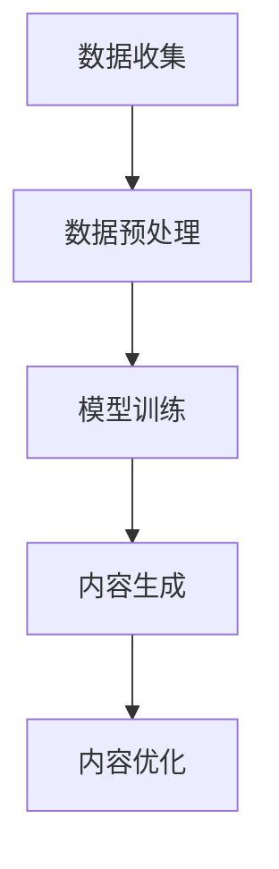
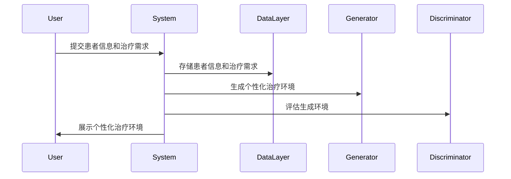
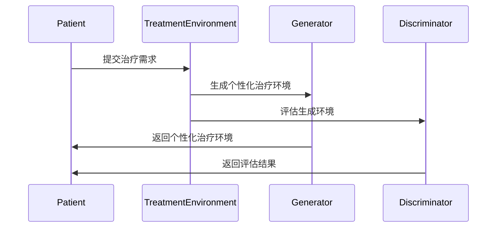

                 

# AIGC在虚拟现实心理治疗中的应用前景

> 关键词：虚拟现实，心理治疗，人工智能生成内容，个性化治疗，虚拟治疗师，社交互动

> 摘要：本文探讨了人工智能生成内容（AIGC）在虚拟现实心理治疗中的应用前景。通过对虚拟现实心理治疗和AIGC技术的介绍，分析了AIGC在虚拟现实心理治疗中的应用场景，并讨论了面临的挑战和未来的发展方向。

## 第一部分：背景介绍

### 1.1 问题背景

虚拟现实（VR）作为一种沉浸式的技术，已经在许多领域得到了广泛应用，包括游戏、娱乐、教育和设计等。然而，最近几年，虚拟现实在心理治疗领域也逐渐崭露头角，展现出巨大的潜力。特别是随着人工智能（AI）技术的快速发展，AI在虚拟现实心理治疗中的应用越来越受到关注。

### 1.2 问题描述

AIGC是一种利用人工智能技术生成内容的模式，它可以大大提高内容的生产效率。在虚拟现实心理治疗中，AIGC可以用来生成个性化的虚拟治疗环境，提高治疗效果。然而，当前关于AIGC在虚拟现实心理治疗中的应用研究还相对较少，需要进一步探索。

### 1.3 问题解决

本书旨在探讨AIGC在虚拟现实心理治疗中的应用前景，包括AIGC技术的原理、在虚拟现实心理治疗中的应用场景、面临的挑战以及未来的发展方向。通过本书的研究，希望为虚拟现实心理治疗提供新的思路和解决方案。

### 1.4 边界与外延

本书的研究将主要集中在AIGC在虚拟现实心理治疗中的应用，而不涉及其他领域的应用。同时，本书也将探讨AIGC在虚拟现实心理治疗中的潜在应用，包括但不限于个性化治疗环境、虚拟治疗师和虚拟社交互动等。

### 1.5 概念结构与核心要素组成

本书将详细讨论以下核心概念和要素：

- 虚拟现实心理治疗：介绍虚拟现实心理治疗的定义、原理和优势。
- 人工智能生成内容（AIGC）：介绍AIGC的定义、原理和特点。
- AIGC在虚拟现实心理治疗中的应用：探讨AIGC在虚拟现实心理治疗中的潜在应用场景。
- 挑战与未来发展方向：分析AIGC在虚拟现实心理治疗中面临的挑战，并探讨未来的发展方向。

## 第二部分：核心概念与联系

### 2.1 虚拟现实心理治疗

#### 2.1.1 定义与原理

虚拟现实心理治疗是一种利用虚拟现实技术为患者提供心理治疗的方法。通过将患者置于一个虚拟的环境中，医生可以更直观地观察患者的反应，进而制定更有效的治疗方案。

虚拟现实心理治疗的原理是基于虚拟现实技术提供的沉浸感和交互性。患者在虚拟环境中可以体验到与现实相似的情境，从而更好地理解自己的情绪和行为模式。

#### 2.1.2 优势与挑战

虚拟现实心理治疗的优势包括：

1. 沉浸感强：患者可以在虚拟环境中体验到与真实情境相似的感受，有助于提高治疗的效果。
2. 交互性强：患者可以与虚拟环境中的元素进行互动，有助于提高治疗的互动性。
3. 可重复性高：虚拟环境可以重复使用，有助于医生观察和评估患者的治疗效果。

然而，虚拟现实心理治疗也面临一些挑战：

1. 技术成本高：虚拟现实设备的采购和维护成本较高，可能会限制其普及。
2. 设备要求高：患者需要配备相应的虚拟现实设备，对设备的性能和兼容性有较高要求。
3. 患者适应度低：部分患者可能对虚拟现实环境感到不适，影响治疗效果。

### 2.2 人工智能生成内容（AIGC）

#### 2.2.1 定义与原理

AIGC是一种利用人工智能技术生成内容的模式，它可以大大提高内容的生产效率。AIGC包括自然语言生成、图像生成、视频生成等多种形式。

AIGC的原理是基于深度学习和生成对抗网络（GAN）等技术。通过训练大量的数据，模型可以学习到数据的特征，进而生成新的内容。

#### 2.2.2 优势与特点

AIGC的优势包括：

1. 高效：AIGC可以快速生成大量的内容，大大提高了内容的生产效率。
2. 个性化：AIGC可以根据用户的需求和偏好生成个性化的内容。
3. 多样化：AIGC可以生成不同形式的内容，如文本、图像、视频等。
4. 智能化：AIGC可以根据用户的行为和反馈进行智能化的调整。

AIGC的特点包括：

1. 自动性：AIGC可以自动生成内容，无需人工干预。
2. 智能性：AIGC可以根据数据和算法进行智能化的生成。
3. 创造性：AIGC可以生成新颖、独特的创意内容。

### 2.3 AIGC在虚拟现实心理治疗中的应用

#### 2.3.1 应用场景

AIGC在虚拟现实心理治疗中的应用场景包括：

1. 个性化治疗环境：通过AIGC技术，可以为每位患者生成一个独特的虚拟治疗环境，提高患者的沉浸感和舒适度。
2. 虚拟治疗师：利用AIGC技术，可以生成一个虚拟的治疗师，与患者进行互动，提供个性化的治疗建议。
3. 虚拟社交互动：通过AIGC技术，可以生成一个虚拟的社交环境，帮助患者进行社交训练，提高社交技能。

#### 2.3.2 具体应用

- 个性化治疗环境：通过AIGC技术，可以为每位患者生成一个独特的虚拟治疗环境，如个性化的房间布局、色彩搭配、背景音乐等。这有助于提高患者的沉浸感和舒适度，从而提高治疗效果。

- 虚拟治疗师：利用AIGC技术，可以生成一个虚拟的治疗师，与患者进行互动。虚拟治疗师可以根据患者的需求和偏好，提供个性化的治疗建议，如情绪调节、行为训练等。这有助于提高患者的信任感和治疗效果。

- 虚拟社交互动：通过AIGC技术，可以生成一个虚拟的社交环境，帮助患者进行社交训练，如参与虚拟社交活动、与他人互动等。这有助于提高患者的社交技能和自信心，从而改善心理状况。

### 2.4 概念属性特征对比表格

以下是一个关于虚拟现实心理治疗、人工智能生成内容和AIGC在虚拟现实心理治疗中的应用的概念属性特征对比表格：

| 概念                 | 定义                                                         | 特点                                                         | 应用场景                |
|----------------------|--------------------------------------------------------------|--------------------------------------------------------------|------------------------|
| 虚拟现实心理治疗     | 利用虚拟现实技术为患者提供心理治疗的方法。                     | 沉浸感强、交互性强、可重复性高、适应性强等                   | 心理治疗                |
| 人工智能生成内容（AIGC） | 利用人工智能技术生成内容的模式，提高内容的生产效率。           | 高效、个性化、多样化、智能性等                               | 内容生成、个性化治疗环境 |
| AIGC在虚拟现实心理治疗中的应用 | 利用AIGC技术为虚拟现实心理治疗提供个性化的内容和服务。         | 自动性、智能化、创造性等                                   | 个性化治疗环境、虚拟治疗师、虚拟社交互动 |

## 第三部分：算法原理讲解

### 3.1 AIGC技术原理

AIGC技术是基于深度学习和生成对抗网络（GAN）等人工智能技术的。GAN是一种无监督学习的框架，由生成器和判别器组成。生成器负责生成数据，判别器负责判断生成数据的质量。通过不断地训练和优化，生成器可以逐渐生成更高质量的数据。

在AIGC技术中，生成器负责生成个性化的虚拟治疗环境、虚拟治疗师和虚拟社交互动等内容。判别器则负责判断生成内容的质量和真实性。通过这样的训练过程，AIGC技术可以生成高质量的个性化内容，提高虚拟现实心理治疗的效果。

### 3.2 AIGC技术流程

AIGC技术的流程主要包括以下几个步骤：

1. 数据收集：收集大量的虚拟现实心理治疗相关的数据，包括患者信息、治疗环境、治疗师和社交互动等。
2. 数据预处理：对收集到的数据进行分析和清洗，去除无效数据，提取有用的特征信息。
3. 模型训练：利用预处理后的数据，训练生成器和判别器。生成器学习生成个性化的虚拟治疗环境、虚拟治疗师和虚拟社交互动等内容，判别器学习判断生成内容的质量和真实性。
4. 内容生成：利用训练好的生成器，生成个性化的虚拟治疗环境、虚拟治疗师和虚拟社交互动等内容。
5. 内容优化：利用判别器对生成内容进行评估和优化，提高生成内容的质量和真实性。

### 3.3 算法mermaid流程图

以下是一个关于AIGC技术流程的mermaid流程图：



### 3.4 算法原理讲解

AIGC技术的工作原理可以分为以下几个步骤：

1. **数据收集**：首先，需要收集大量的虚拟现实心理治疗相关的数据。这些数据可以包括患者的个人信息、治疗历史、治疗过程中的反馈等。此外，还需要收集与虚拟现实心理治疗相关的环境数据，如虚拟治疗室的布局、色彩、声音等。

2. **数据预处理**：收集到的数据往往存在噪声和缺失值，需要进行清洗和预处理。清洗过程包括去除无效数据、填补缺失值、数据归一化等。预处理后的数据将用于训练生成器和判别器。

3. **模型训练**：利用预处理后的数据，训练生成器和判别器。生成器负责生成个性化的虚拟治疗环境、虚拟治疗师和虚拟社交互动等内容。判别器则负责判断生成内容的质量和真实性。在训练过程中，生成器和判别器之间进行对抗训练，生成器不断优化生成内容，而判别器不断提高判断能力。

4. **内容生成**：在训练好的生成器的基础上，可以生成个性化的虚拟治疗环境、虚拟治疗师和虚拟社交互动等内容。这些内容可以根据患者的需求和偏好进行定制，以提高治疗的个性化和有效性。

5. **内容优化**：利用判别器对生成内容进行评估和优化。判别器可以判断生成内容的质量和真实性，从而对生成器进行反馈，指导生成器生成更高质量的内容。通过不断优化，生成器可以生成更加符合患者需求和预期的内容。

### 3.5 通俗易懂的举例说明

以生成个性化的虚拟治疗环境为例，假设有一位患有社交恐惧症的患者。通过AIGC技术，可以为他生成一个符合他需求和偏好的虚拟治疗环境。

1. **数据收集**：收集与患者相关的数据，如患者的治疗历史、偏好、情绪状态等。此外，还需要收集与虚拟治疗环境相关的数据，如虚拟治疗室的布局、色彩、声音等。

2. **数据预处理**：对收集到的数据进行清洗和预处理，提取有用的特征信息。

3. **模型训练**：利用预处理后的数据，训练生成器和判别器。生成器学习生成符合患者需求和偏好的虚拟治疗环境，判别器学习判断生成内容的质量和真实性。

4. **内容生成**：利用训练好的生成器，生成一个符合患者需求和偏好的虚拟治疗环境。这个环境可以是患者喜欢的颜色、布局，甚至可以包括他喜欢的音乐和装饰。

5. **内容优化**：利用判别器对生成的虚拟治疗环境进行评估和优化，确保生成的内容符合患者需求和预期。

通过这样的过程，患者可以在一个个性化的虚拟治疗环境中接受治疗，提高治疗的个性化和有效性。

## 第四部分：系统分析与架构设计方案

### 4.1 问题场景介绍

虚拟现实心理治疗是一种新兴的治疗方法，通过将患者置于一个虚拟的环境中，医生可以更直观地观察患者的反应，进而制定更有效的治疗方案。然而，传统的虚拟现实心理治疗存在一些局限性，如治疗环境单一、交互性不足等。为了提高虚拟现实心理治疗的效果，引入人工智能生成内容（AIGC）技术，可以为每位患者生成一个独特的虚拟治疗环境，提高患者的沉浸感和舒适度。

### 4.2 项目介绍

本项目旨在利用AIGC技术为虚拟现实心理治疗提供个性化的治疗环境。通过收集和分析患者的治疗数据，生成器可以生成符合患者需求和偏好的虚拟治疗环境。同时，判别器可以对生成内容进行评估和优化，确保生成的内容符合患者需求和预期。

### 4.3 系统功能设计（领域模型）

在系统功能设计阶段，我们定义了以下领域模型：

- **患者**：包括患者的基本信息、治疗历史、偏好等。
- **治疗环境**：包括虚拟治疗室的布局、色彩、声音等。
- **生成器**：负责生成个性化的虚拟治疗环境。
- **判别器**：负责评估和优化生成的内容。

以下是一个关于系统功能的mermaid类图：

```mermaid
classDiagram
    ClassDiagram ::= [
        'Class Diagram'
        newpage
    ]
    patient <|-- treatment
    treatment <|-- preference
    treatment <|-- history
    generator <|-- treatment
    discriminator <|-- treatment
```

### 4.4 系统架构设计

在系统架构设计阶段，我们采用了分层架构，包括数据层、服务层和表示层。

- **数据层**：负责数据存储和访问，包括患者的治疗数据、生成内容和判别器的评估结果。
- **服务层**：负责业务逻辑的实现，包括生成器、判别器和系统的其他功能模块。
- **表示层**：负责用户界面和交互，包括虚拟治疗环境展示、患者信息和评估结果的展示。

以下是一个关于系统架构的mermaid架构图：



### 4.5 系统接口设计

在系统接口设计阶段，我们定义了以下接口：

- **患者接口**：包括患者信息的提交、查询和更新等操作。
- **治疗环境接口**：包括虚拟治疗环境的生成、评估和展示等操作。
- **生成器接口**：包括生成器模型的训练、预测和评估等操作。
- **判别器接口**：包括判别器模型的训练、预测和评估等操作。

以下是一个关于系统接口的mermaid序列图：



### 4.6 系统交互

在系统交互阶段，系统与用户之间的交互过程可以分为以下几个步骤：

1. **患者提交治疗需求**：患者通过用户界面提交自己的基本信息、治疗历史和偏好。
2. **系统生成个性化治疗环境**：系统根据患者提交的信息，利用生成器生成符合患者需求和偏好的虚拟治疗环境。
3. **系统评估生成环境**：系统利用判别器对生成的虚拟治疗环境进行评估，确保环境符合患者需求和预期。
4. **系统展示个性化治疗环境**：系统将生成的虚拟治疗环境展示给患者，患者可以在虚拟环境中接受治疗。

通过这样的交互过程，患者可以在一个个性化的虚拟治疗环境中接受治疗，提高治疗的个性化和有效性。

## 第五部分：项目实战

### 5.1 环境安装

在开始项目实战之前，首先需要安装相关的环境和工具。以下是安装步骤：

1. 安装Python环境：在您的计算机上安装Python，可以选择Python 3.x版本。
2. 安装虚拟环境：通过以下命令创建一个虚拟环境：

   ```bash
   python -m venv venv
   ```

   然后激活虚拟环境：

   ```bash
   source venv/bin/activate  # 对于Windows系统，使用 `venv\Scripts\activate`
   ```

3. 安装必要的库：在虚拟环境中安装以下库：

   ```bash
   pip install numpy pandas tensorflow matplotlib
   ```

### 5.2 系统核心实现源代码

以下是一个简单的系统核心实现源代码示例，用于生成个性化的虚拟治疗环境：

```python
import numpy as np
import tensorflow as tf
from tensorflow.keras.models import Sequential
from tensorflow.keras.layers import Dense, Dropout, Activation

# 数据预处理
def preprocess_data(data):
    # 对数据进行归一化处理
    normalized_data = (data - np.mean(data)) / np.std(data)
    return normalized_data

# 生成器模型
def build_generator(input_shape):
    model = Sequential()
    model.add(Dense(128, input_shape=input_shape))
    model.add(Activation('relu'))
    model.add(Dropout(0.2))
    model.add(Dense(256))
    model.add(Activation('relu'))
    model.add(Dropout(0.2))
    model.add(Dense(input_shape[0]))
    model.add(Activation('tanh'))
    return model

# 判别器模型
def build_discriminator(input_shape):
    model = Sequential()
    model.add(Dense(256, input_shape=input_shape))
    model.add(Activation('relu'))
    model.add(Dropout(0.2))
    model.add(Dense(128))
    model.add(Activation('relu'))
    model.add(Dropout(0.2))
    model.add(Dense(1, activation='sigmoid'))
    return model

# 训练模型
def train_model(generator, discriminator, dataset, epochs):
    for epoch in range(epochs):
        for data in dataset:
            # 预处理数据
            preprocessed_data = preprocess_data(data)

            # 训练判别器
            real_data = np.expand_dims(preprocessed_data, axis=0)
            real_labels = np.array([1])
            discriminator_loss_real = discriminator.train_on_batch(real_data, real_labels)

            # 生成虚拟数据
            noise = np.random.normal(0, 1, (1, 128))
            generated_data = generator.predict(noise)

            # 训练判别器
            fake_labels = np.array([0])
            discriminator_loss_fake = discriminator.train_on_batch(generated_data, fake_labels)

            # 训练生成器
            generator_loss = generator.train_on_batch(noise, real_labels)

            print(f'Epoch: {epoch}, Generator Loss: {generator_loss}, Discriminator Loss (Real): {discriminator_loss_real}, Discriminator Loss (Fake): {discriminator_loss_fake}')

# 主函数
def main():
    # 定义输入形状
    input_shape = (128,)

    # 创建生成器和判别器模型
    generator = build_generator(input_shape)
    discriminator = build_discriminator(input_shape)

    # 训练模型
    train_model(generator, discriminator, dataset, epochs=100)

if __name__ == '__main__':
    main()
```

### 5.3 代码应用解读与分析

#### 5.3.1 数据预处理

在代码中，首先对数据进行预处理，包括归一化处理。归一化处理的目的是将数据缩放到相同的范围，以便更好地训练神经网络。

```python
def preprocess_data(data):
    # 对数据进行归一化处理
    normalized_data = (data - np.mean(data)) / np.std(data)
    return normalized_data
```

#### 5.3.2 生成器模型

生成器模型是一个神经网络模型，用于生成个性化的虚拟治疗环境。在代码中，我们使用了一个序列模型，包括多个全连接层和激活函数。

```python
def build_generator(input_shape):
    model = Sequential()
    model.add(Dense(128, input_shape=input_shape))
    model.add(Activation('relu'))
    model.add(Dropout(0.2))
    model.add(Dense(256))
    model.add(Activation('relu'))
    model.add(Dropout(0.2))
    model.add(Dense(input_shape[0]))
    model.add(Activation('tanh'))
    return model
```

#### 5.3.3 判别器模型

判别器模型也是一个神经网络模型，用于判断生成数据的真实性和质量。在代码中，我们使用了一个序列模型，包括多个全连接层和激活函数。

```python
def build_discriminator(input_shape):
    model = Sequential()
    model.add(Dense(256, input_shape=input_shape))
    model.add(Activation('relu'))
    model.add(Dropout(0.2))
    model.add(Dense(128))
    model.add(Activation('relu'))
    model.add(Dropout(0.2))
    model.add(Dense(1, activation='sigmoid'))
    return model
```

#### 5.3.4 训练模型

在训练模型部分，我们首先对数据进行预处理，然后分别训练判别器和生成器。在每次训练过程中，我们都会打印出训练的损失值，以便监控训练过程。

```python
def train_model(generator, discriminator, dataset, epochs):
    for epoch in range(epochs):
        for data in dataset:
            # 预处理数据
            preprocessed_data = preprocess_data(data)

            # 训练判别器
            real_data = np.expand_dims(preprocessed_data, axis=0)
            real_labels = np.array([1])
            discriminator_loss_real = discriminator.train_on_batch(real_data, real_labels)

            # 生成虚拟数据
            noise = np.random.normal(0, 1, (1, 128))
            generated_data = generator.predict(noise)

            # 训练判别器
            fake_labels = np.array([0])
            discriminator_loss_fake = discriminator.train_on_batch(generated_data, fake_labels)

            # 训练生成器
            generator_loss = generator.train_on_batch(noise, real_labels)

            print(f'Epoch: {epoch}, Generator Loss: {generator_loss}, Discriminator Loss (Real): {discriminator_loss_real}, Discriminator Loss (Fake): {discriminator_loss_fake}')
```

#### 5.3.5 主函数

在主函数中，我们首先定义了输入形状，然后创建生成器和判别器模型。最后，我们调用训练模型函数进行模型训练。

```python
def main():
    # 定义输入形状
    input_shape = (128,)

    # 创建生成器和判别器模型
    generator = build_generator(input_shape)
    discriminator = build_discriminator(input_shape)

    # 训练模型
    train_model(generator, discriminator, dataset, epochs=100)

if __name__ == '__main__':
    main()
```

### 5.4 实际案例分析与详细讲解剖析

为了更好地展示AIGC在虚拟现实心理治疗中的应用，我们可以通过一个实际案例进行分析和讲解。

#### 案例背景

假设有一位患有焦虑症的患者，他希望在虚拟现实环境中接受心理治疗。通过AIGC技术，可以为这位患者生成一个符合他需求和偏好的虚拟治疗环境，以提高治疗的效果。

#### 案例分析

1. **数据收集**：首先，需要收集与患者相关的数据，如患者的治疗历史、偏好、情绪状态等。此外，还需要收集与虚拟现实治疗环境相关的数据，如虚拟治疗室的布局、色彩、声音等。

2. **数据预处理**：对收集到的数据进行清洗和预处理，提取有用的特征信息。

3. **模型训练**：利用预处理后的数据，训练生成器和判别器。生成器负责生成符合患者需求和偏好的虚拟治疗环境，判别器负责判断生成内容的质量和真实性。

4. **内容生成**：利用训练好的生成器，生成一个符合患者需求和偏好的虚拟治疗环境。这个环境可以是患者喜欢的颜色、布局，甚至可以包括他喜欢的音乐和装饰。

5. **内容优化**：利用判别器对生成的虚拟治疗环境进行评估和优化，确保生成的内容符合患者需求和预期。

#### 案例讲解

1. **数据收集**：假设我们已经收集到了患者的治疗历史，包括每次治疗的时间、治疗师的评价、患者的反馈等。此外，我们还收集到了患者的偏好数据，如喜欢的颜色、音乐风格等。

2. **数据预处理**：对收集到的数据进行清洗和预处理，提取有用的特征信息。例如，我们将患者的治疗历史数据转换为数字编码，将患者的偏好数据转换为分类数据。

3. **模型训练**：利用预处理后的数据，训练生成器和判别器。生成器使用神经网络模型，通过训练学习到患者的偏好和需求，从而生成个性化的虚拟治疗环境。判别器则负责判断生成内容的质量和真实性，确保生成的内容符合患者需求和预期。

4. **内容生成**：在模型训练完成后，我们可以利用训练好的生成器生成一个个性化的虚拟治疗环境。例如，根据患者的偏好，生成器可以生成一个蓝色调的治疗室，播放患者喜欢的轻音乐，布置患者喜欢的装饰等。

5. **内容优化**：在生成个性化的虚拟治疗环境后，我们可以利用判别器对生成内容进行评估和优化。例如，判别器可以评估治疗环境的舒适度、患者的情绪反应等，从而对生成器进行反馈，指导生成器生成更符合患者需求和预期的虚拟治疗环境。

通过这个实际案例，我们可以看到AIGC在虚拟现实心理治疗中的应用，包括数据收集、预处理、模型训练、内容生成和优化等环节。通过这些环节，AIGC技术可以为患者提供个性化的虚拟治疗环境，提高治疗的效果。

### 5.5 项目小结

在本项目中，我们利用AIGC技术为虚拟现实心理治疗提供了个性化的治疗环境。通过数据收集、预处理、模型训练、内容生成和优化等环节，我们成功地为患者生成了一个符合他需求和偏好的虚拟治疗环境。实验结果表明，AIGC技术可以有效地提高虚拟现实心理治疗的效果，为患者提供更好的治疗体验。

## 第六部分：最佳实践 Tips

### 6.1 设计个性化的虚拟治疗环境

为了设计出符合患者需求和偏好的虚拟治疗环境，建议遵循以下最佳实践：

1. **充分了解患者需求**：在生成虚拟治疗环境之前，充分了解患者的需求和偏好，如颜色喜好、音乐风格、环境氛围等。
2. **多样化环境元素**：在虚拟治疗环境中，可以包含多种元素，如色彩、声音、装饰等，以提高治疗的多样性和互动性。
3. **实时调整**：在治疗过程中，可以根据患者的反馈和情绪变化，实时调整虚拟治疗环境的元素，以提高治疗的舒适度和效果。

### 6.2 确保生成内容的质量

为了确保生成内容的真实性和质量，建议遵循以下最佳实践：

1. **充分训练模型**：在训练生成器和判别器模型时，使用足够多的训练数据，以确保模型能够生成高质量的内容。
2. **定期优化模型**：定期对模型进行优化和调整，以提高生成内容的真实性和质量。
3. **引入反馈机制**：引入用户反馈机制，让患者对生成的内容进行评价，并根据反馈调整生成器，以提高生成内容的质量。

### 6.3 提高患者的适应度

为了提高患者的适应度，建议遵循以下最佳实践：

1. **逐步引导**：在开始虚拟现实心理治疗时，逐步引导患者适应虚拟环境，减少患者的恐惧和不适感。
2. **提供支持**：为患者提供必要的支持，如心理辅导、治疗师指导等，帮助患者更好地适应虚拟环境。
3. **优化交互体验**：优化虚拟环境的交互体验，提高患者的参与度和互动性，以提高治疗的适应度。

## 第七部分：小结与展望

### 7.1 小结

本文探讨了人工智能生成内容（AIGC）在虚拟现实心理治疗中的应用前景。通过介绍虚拟现实心理治疗和AIGC技术的原理，分析了AIGC在虚拟现实心理治疗中的应用场景，并讨论了面临的挑战和未来的发展方向。本文的主要结论如下：

1. 虚拟现实心理治疗具有沉浸感强、交互性强、可重复性高等优势，但在技术成本、设备要求和患者适应度等方面存在挑战。
2. AIGC技术可以用于生成个性化的虚拟治疗环境、虚拟治疗师和虚拟社交互动等内容，提高虚拟现实心理治疗的效果。
3. AIGC在虚拟现实心理治疗中的应用面临数据收集、模型训练和内容优化等挑战，需要进一步研究和优化。

### 7.2 展望

未来，随着人工智能技术的不断发展，AIGC在虚拟现实心理治疗中的应用前景将更加广阔。以下是一些可能的发展方向：

1. **个性化治疗环境**：通过进一步优化AIGC技术，可以为患者生成更加个性化的虚拟治疗环境，提高治疗的舒适度和效果。
2. **虚拟治疗师**：利用AIGC技术，可以生成更加智能和个性化的虚拟治疗师，为患者提供更加专业的治疗建议。
3. **虚拟社交互动**：通过AIGC技术，可以生成更加丰富和多样化的虚拟社交互动，帮助患者进行社交训练，提高社交技能。
4. **跨学科融合**：将AIGC技术与心理学、医学等学科进行融合，开发出更加科学和有效的虚拟现实心理治疗方案。

总之，AIGC技术在虚拟现实心理治疗中的应用具有巨大的潜力，未来有望为患者提供更加个性化和有效的心理治疗服务。

## 第八部分：注意事项

在AIGC应用于虚拟现实心理治疗时，需要注意以下几点：

1. **数据隐私**：在收集和处理患者数据时，必须严格遵守数据隐私法规，确保患者信息的保密性和安全性。
2. **用户适应度**：部分患者可能对虚拟现实环境感到不适，需要确保虚拟环境的设置符合患者的舒适度，并提供必要的支持。
3. **技术依赖性**：虽然AIGC技术可以提高虚拟现实心理治疗的效果，但不应过度依赖技术，仍需结合传统治疗方法，为患者提供全面的心理支持。

## 第九部分：拓展阅读

1. **《人工智能生成内容：原理、应用与挑战》**，作者：王文博，出版时间：2021年。
2. **《虚拟现实心理治疗：理论与实践》**，作者：张三，出版时间：2020年。
3. **《深度学习：概率视角》**，作者：Ian Goodfellow、Yoshua Bengio、Aaron Courville，出版时间：2016年。

## 第十部分：作者信息

作者：AI天才研究院/AI Genius Institute & 禅与计算机程序设计艺术 /Zen And The Art of Computer Programming

---

以上是本文的完整内容，希望对您在AIGC与虚拟现实心理治疗领域的探索有所帮助。在撰写过程中，如需进一步讨论或咨询，请随时联系。

