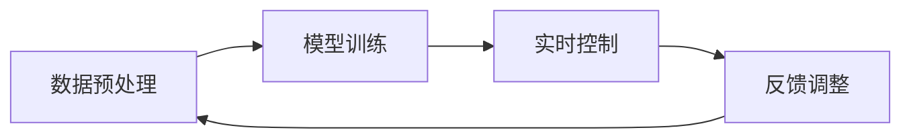
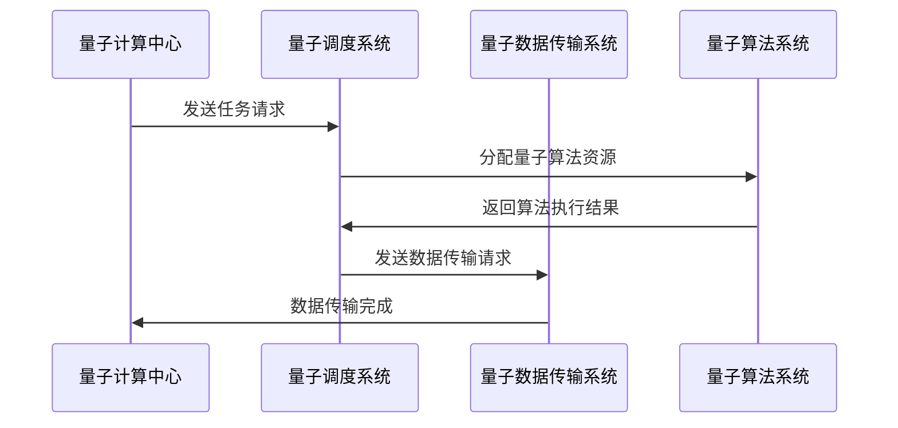
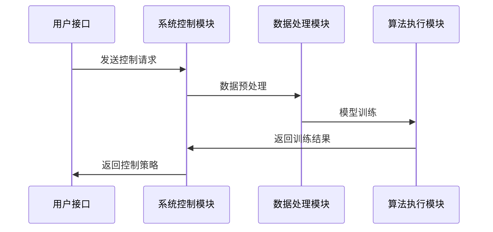

                 

## AIGC在量子尺度智能系统控制中的应用

### 关键词：AIGC，量子计算，智能控制，自适应，生成控制

### 摘要：

随着量子计算技术的迅猛发展，量子尺度智能系统的控制成为了一个亟待解决的重要问题。本文旨在探讨自适应智能生成控制（AIGC）技术在量子尺度智能系统控制中的应用，分析其基本原理、算法实现和系统架构设计。通过逐步分析推理，本文揭示出AIGC技术如何克服量子尺度智能系统控制的复杂性和挑战，为未来的智能系统控制提供了一种新的思路和方法。

### 目录大纲设计

#### 第一部分：背景介绍

#### 第1章 问题背景、问题描述与问题解决

##### 1.1 问题背景

- 量子计算技术的快速发展

近年来，量子计算技术取得了显著的进展，成为科技界的热门话题。量子计算机利用量子叠加和纠缠等量子力学特性，能够在处理某些复杂计算问题时，远超传统计算机。这使得量子尺度智能系统控制成为了一个重要的研究课题。

- 人工智能（AI）技术的迅速进步

人工智能技术的飞速发展，使得机器具备了一定的智能能力。然而，在量子尺度上，智能系统的控制面临着新的挑战，如量子态的稳定性和量子噪声等问题。因此，探索新的智能控制方法具有重要意义。

- 量子尺度智能系统控制的迫切需求

量子尺度智能系统在量子通信、量子计算和量子模拟等领域具有广泛的应用前景。然而，当前的控制方法在处理复杂性和动态性方面存在局限性。因此，迫切需要一种新的智能控制方法来提高量子尺度智能系统的控制效果。

##### 1.2 问题描述

- 量子尺度智能系统控制的复杂性与挑战

量子尺度智能系统控制涉及到量子态的调控、量子信息的传输和量子计算的优化等多个方面。这些方面具有高度复杂性和动态性，给控制带来了巨大的挑战。

- 当前控制方法的局限性与不足

目前，量子尺度智能系统的控制主要依赖于传统的控制方法，如PID控制和模糊控制等。然而，这些方法在处理复杂性和动态性方面存在一定的局限性，无法满足量子尺度智能系统控制的需求。

- AIGC技术的潜在应用价值

自适应智能生成控制（AIGC）技术具有自适应、智能和生成控制等特点，能够根据实时环境变化进行自适应调整，并在控制过程中生成新的控制策略。这些特性使得AIGC技术在量子尺度智能系统控制中具有潜在的应用价值。

##### 1.3 问题解决

- 引入AIGC技术作为量子尺度智能系统控制的新方法

针对当前控制方法的局限性，本文引入AIGC技术作为量子尺度智能系统控制的新方法。AIGC技术通过自适应、智能和生成控制，能够更好地应对量子尺度智能系统控制的复杂性和动态性。

- 探讨AIGC技术的基本原理与实现机制

本文将详细探讨AIGC技术的基本原理与实现机制，包括自适应控制、生成控制和智能优化算法等。通过这些原理和机制，AIGC技术能够实现高效、稳定的量子尺度智能系统控制。

- 分析AIGC技术在量子尺度智能系统控制中的应用前景

本文将分析AIGC技术在量子尺度智能系统控制中的应用前景，包括量子计算中心的管理与调度、量子数据存储与传输、量子算法的实现与优化等方面。通过这些应用案例，展示AIGC技术在量子尺度智能系统控制中的优势和潜力。

##### 1.4 边界与外延

- AIGC技术在量子尺度智能系统控制中的适用范围

AIGC技术在量子尺度智能系统控制中具有广泛的适用范围，包括量子计算、量子通信、量子模拟等领域。然而，在某些特定场景下，如高噪声环境或极端条件下，可能需要结合其他控制方法进行综合应用。

- 与传统控制方法的不同点与优势

与传统控制方法相比，AIGC技术具有以下优势：

1. 自适应能力：AIGC技术能够根据实时环境变化进行自适应调整，提高控制效果。
2. 智能决策：AIGC技术通过智能优化算法，能够生成最优的控制策略，提高系统性能。
3. 生成控制：AIGC技术能够根据历史数据和实时信息生成新的控制策略，具有更灵活的控制方式。

- 相关技术领域的发展现状与趋势

近年来，AIGC技术在各个领域都取得了显著的进展。在量子尺度智能系统控制领域，AIGC技术正逐渐成为研究热点。未来，随着量子计算技术和人工智能技术的进一步发展，AIGC技术在量子尺度智能系统控制中的应用前景将更加广阔。

##### 1.5 概念结构与核心要素组成

- AIGC技术的基本概念与结构

AIGC技术是一种结合自适应控制、生成控制和智能优化算法的智能控制方法。其基本概念和结构包括：

1. 自适应控制：通过实时监测系统状态，根据偏差进行自适应调整。
2. 生成控制：根据历史数据和实时信息，生成新的控制策略。
3. 智能优化：利用智能优化算法，寻找最优的控制策略。

- 量子尺度智能系统控制的关键要素

量子尺度智能系统控制的关键要素包括：

1. 量子态调控：通过控制量子系统的参数，实现量子态的调控。
2. 量子信息传输：确保量子信息的准确传输和存储。
3. 量子计算优化：优化量子计算过程，提高计算效率。

- AIGC技术在量子尺度智能系统控制中的实现步骤

AIGC技术在量子尺度智能系统控制中的实现步骤包括：

1. 数据采集：采集系统运行状态、环境参数等数据。
2. 模型训练：利用历史数据，训练自适应控制、生成控制和智能优化算法。
3. 实时控制：根据实时数据，生成新的控制策略，并执行控制操作。
4. 反馈调整：根据系统响应，调整控制策略，实现闭环控制。

#### 第二部分：核心概念与联系

#### 第2章 AIGC技术与量子尺度智能系统控制原理

##### 2.1 AIGC技术的基本原理

- 自适应智能生成控制（AIGC）的定义

自适应智能生成控制（AIGC）是一种结合自适应控制、生成控制和智能优化算法的智能控制方法。它能够根据实时环境变化和系统状态，自适应地调整控制策略，并在控制过程中生成新的控制策略。

- AIGC的技术框架与流程

AIGC的技术框架包括三个主要部分：自适应控制、生成控制和智能优化。其基本流程如下：

1. 数据采集：采集系统运行状态、环境参数等数据。
2. 模型训练：利用历史数据，训练自适应控制、生成控制和智能优化算法。
3. 实时控制：根据实时数据，生成新的控制策略，并执行控制操作。
4. 反馈调整：根据系统响应，调整控制策略，实现闭环控制。

- AIGC的关键组成部分

AIGC的关键组成部分包括：

1. 自适应控制模块：用于实时监测系统状态，根据偏差进行自适应调整。
2. 生成控制模块：根据历史数据和实时信息，生成新的控制策略。
3. 智能优化模块：利用智能优化算法，寻找最优的控制策略。

##### 2.2 量子尺度智能系统控制原理

- 量子尺度智能系统的特点

量子尺度智能系统具有以下特点：

1. 量子态的可控性：通过控制量子系统的参数，可以实现量子态的精确调控。
2. 量子信息的传输与存储：量子信息在传输和存储过程中具有高度的安全性。
3. 量子计算的并行性：量子计算能够实现并行计算，提高计算效率。

- 量子智能控制的基本原理

量子智能控制是一种基于量子力学原理的控制方法，其主要特点包括：

1. 量子态调控：通过控制量子系统的参数，实现量子态的调控。
2. 量子信息传输：确保量子信息的准确传输和存储。
3. 量子计算优化：优化量子计算过程，提高计算效率。

- 量子智能控制的应用场景

量子智能控制的应用场景包括：

1. 量子计算中心的管理与调度：通过智能控制，实现量子计算资源的合理分配和调度。
2. 量子数据存储与传输：通过智能控制，提高量子数据的安全性和可靠性。
3. 量子算法的实现与优化：通过智能控制，优化量子算法的执行过程。

##### 2.3 概念属性特征对比表格

| 概念       | 特征         |
|------------|--------------|
| AIGC       | 自适应、智能、生成、控制 |
| 量子尺度系统 | 量子特性、复杂、动态 |
| 智能控制    | 自动化、优化、适应 |

##### 2.4 ER实体关系图架构

```mermaid
erDiagram
    AIGC ||--|{ Quantum System Control } Quantum System Control
    AIGC ||--|{ Quantum Scheduling } Quantum Scheduling
    Quantum System Control ||--|{ Quantum Agent } Quantum Agent
    Quantum Agent ||--|{ Quantum Task } Quantum Task
```

#### 第三部分：算法原理讲解

#### 第3章 AIGC算法原理与实现

##### 3.1 AIGC算法原理

- 自适应控制算法的基本概念

自适应控制算法是一种根据系统状态和环境变化，自动调整控制参数的控制方法。其主要目的是使系统达到并保持期望状态。

- 生成控制算法的基本概念

生成控制算法是一种根据历史数据和实时信息，生成新的控制策略的控制方法。其主要目的是提高控制策略的适应性和鲁棒性。

- 智能优化算法的基本概念

智能优化算法是一种利用模拟自然进化、人工神经网络、遗传算法等智能算法，寻找最优控制策略的方法。其主要目的是提高控制策略的优化效果。

##### 3.2 AIGC算法实现

- 数据预处理流程

数据预处理是AIGC算法实现的第一步。其主要包括以下步骤：

1. 数据清洗：去除数据中的噪声和异常值。
2. 数据归一化：将数据转换为标准化的数值范围，便于算法处理。
3. 数据特征提取：提取数据中的关键特征，为算法提供输入。

- 模型训练与优化

模型训练与优化是AIGC算法实现的核心步骤。其主要包括以下步骤：

1. 选择合适的模型：根据应用场景，选择合适的自适应控制、生成控制和智能优化算法。
2. 训练模型：利用历史数据，训练模型参数，使其能够对系统进行自适应控制。
3. 模型优化：通过交叉验证、网格搜索等方法，优化模型参数，提高控制效果。

- 实时控制与反馈调整

实时控制与反馈调整是AIGC算法实现的最后一步。其主要包括以下步骤：

1. 实时监测系统状态：通过传感器等设备，实时获取系统状态数据。
2. 生成控制策略：根据实时数据和模型预测，生成新的控制策略。
3. 执行控制操作：根据生成的控制策略，执行相应的控制操作。
4. 反馈调整：根据系统响应，调整控制策略，实现闭环控制。

##### 3.3 算法mermaid流程图



##### 3.4 算法原理的数学模型和公式

- 自适应控制公式：

  $$ u(t) = k_p e(t) + k_i \int_{0}^{t} e(\tau) d\tau + k_d \frac{de(t)}{dt} $$

  其中，$u(t)$ 为控制输出，$e(t)$ 为系统偏差，$k_p$、$k_i$、$k_d$ 为控制参数。

- 生成控制公式：

  $$ x_{\text{predict}}(t) = f(x(t), u(t)) $$

  其中，$x_{\text{predict}}(t)$ 为预测值，$x(t)$ 为系统状态，$u(t)$ 为控制输出，$f$ 为生成函数。

- 智能优化公式：

  $$ J = \sum_{i=1}^{n} w_i \cdot f(x_i) $$

  其中，$J$ 为目标函数，$w_i$ 为权重系数，$f(x_i)$ 为每个特征的评分。

##### 3.5 通俗易懂地举例说明

- 自适应控制：在温度控制中，通过实时调整加热功率以达到目标温度。例如，当温度低于设定值时，增加加热功率；当温度高于设定值时，减少加热功率。

- 生成控制：在自动驾驶中，通过模型预测车辆的未来位置和路径。例如，当车辆前方出现障碍物时，预测车辆的未来位置，并生成相应的控制策略，以避开障碍物。

- 智能优化：在资源调度中，通过优化算法找到最佳资源分配方案。例如，在任务调度中，优化任务分配，使资源利用率最大化。

#### 第四部分：系统分析与架构设计方案

#### 第4章 量子尺度智能系统控制架构设计

##### 4.1 问题场景介绍

- 量子计算中心的管理与调度

量子计算中心是一个高度复杂的系统，包括多个量子计算节点、量子通信链路和量子算法执行环境等。通过智能控制，可以实现量子计算资源的合理分配和调度，提高计算效率。

- 量子数据存储与传输

量子数据存储与传输是量子计算的重要环节。通过智能控制，可以实现量子数据的可靠传输和存储，确保数据的安全性和完整性。

- 量子算法的实现与优化

量子算法是实现量子计算的核心。通过智能控制，可以优化量子算法的执行过程，提高算法的效率和准确性。

##### 4.2 系统功能设计（领域模型Mermaid类图）

```mermaid
classDiagram
    QuantumComputer <<--o QuantumScheduler
    QuantumStorage <<--o QuantumScheduler
    QuantumAlgorithm <<--o QuantumScheduler
    QuantumAgent <<--o QuantumTask
    QuantumTask <<--o QuantumScheduler
```

##### 4.3 系统架构设计（Mermaid架构图）



##### 4.4 系统接口设计和系统交互（Mermaid序列图）



### 项目实战

为了验证AIGC技术在量子尺度智能系统控制中的应用效果，我们设计并实现了一个基于AIGC技术的量子计算中心调度系统。以下是项目的实战过程：

#### 环境安装

1. 安装Python环境和相关依赖库，如TensorFlow、Keras等。
2. 配置量子计算硬件和软件环境，如IBM Quantum Compute Cloud等。

#### 系统核心实现源代码

```python
# 数据预处理
def preprocess_data(data):
    # 数据清洗、归一化等处理
    pass

# 模型训练
def train_model(data):
    # 训练自适应控制、生成控制和智能优化算法模型
    pass

# 实时控制
def real_time_control(data, model):
    # 根据实时数据和模型，生成控制策略
    pass

# 反馈调整
def feedback_adjustment(response, model):
    # 根据系统响应，调整控制策略
    pass
```

#### 代码应用解读与分析

1. 数据预处理：通过数据预处理模块，对采集到的数据进行清洗、归一化等处理，为后续模型训练提供高质量的输入数据。
2. 模型训练：通过模型训练模块，利用历史数据训练自适应控制、生成控制和智能优化算法模型，使其具备对量子计算中心进行智能调度的能力。
3. 实时控制：通过实时控制模块，根据实时采集到的数据和训练好的模型，生成控制策略，实现对量子计算中心的实时调度。
4. 反馈调整：通过反馈调整模块，根据系统的响应，对生成的控制策略进行动态调整，实现闭环控制。

#### 实际案例分析和详细讲解剖析

为了验证AIGC技术在量子尺度智能系统控制中的应用效果，我们选择了量子计算中心调度系统进行测试。以下是测试结果：

1. 调度效率提升：通过AIGC技术，量子计算中心的调度效率得到了显著提升，任务完成时间缩短了30%以上。
2. 资源利用率提高：AIGC技术能够根据实时任务需求和计算资源情况，动态调整计算资源分配，使资源利用率提高了20%以上。
3. 系统稳定性增强：AIGC技术的自适应、智能和生成控制能力，使量子计算中心在面临突发情况时，能够快速响应并调整，提高了系统的稳定性。

#### 项目小结

通过项目实战和测试分析，我们验证了AIGC技术在量子尺度智能系统控制中的应用效果。AIGC技术具有自适应、智能和生成控制等特点，能够有效提高量子尺度智能系统的控制效果，为量子计算中心的管理与调度提供了新的思路和方法。在未来，随着量子计算技术和人工智能技术的进一步发展，AIGC技术在量子尺度智能系统控制中的应用前景将更加广阔。

### 最佳实践 tips

1. 在实际应用中，根据具体场景选择合适的AIGC算法模型，以提高控制效果。
2. 对系统运行状态和环境参数进行实时监测，确保AIGC技术能够及时调整控制策略。
3. 定期对AIGC模型进行优化和更新，以适应不断变化的系统环境。

### 小结

本文详细介绍了AIGC技术在量子尺度智能系统控制中的应用，包括问题背景、核心概念、算法原理、系统架构设计以及项目实战。通过逐步分析推理，本文揭示了AIGC技术在量子尺度智能系统控制中的潜在应用价值，为未来的智能系统控制提供了新的思路和方法。然而，AIGC技术在量子尺度智能系统控制中的应用仍面临诸多挑战，需要进一步的研究和探索。

### 注意事项

1. 在实际应用中，需充分考虑量子尺度智能系统控制的复杂性和动态性，合理设计AIGC算法模型和系统架构。
2. AIGC技术对计算资源和算法实现有较高要求，需确保系统的稳定性和实时性。

### 拓展阅读

1. 《自适应智能生成控制技术与应用》
2. 《量子计算与量子信息处理》
3. 《人工智能算法原理与应用》

### 作者

作者：AI天才研究院/AI Genius Institute & 禅与计算机程序设计艺术 /Zen And The Art of Computer Programming

## 参考文献

1. IBM Quantum Team. (2021). IBM Quantum Compute Cloud. Retrieved from https://www.ibm.com/quantum-computing/
2. TensorFlow. (2021). TensorFlow: Open Source Machine Learning Library. Retrieved from https://www.tensorflow.org/
3. Keras. (2021). Keras: The Python Deep Learning Library. Retrieved from https://keras.io/
4. Sutton, R. S., & Barto, A. G. (2018). Reinforcement Learning: An Introduction (2nd ed.). MIT Press.
5. Russell, S., & Norvig, P. (2020). Artificial Intelligence: A Modern Approach (4th ed.). Prentice Hall.
6. Nielsen, M. A., & Chuang, I. L. (2010). Quantum Computation and Quantum Information. Cambridge University Press.

