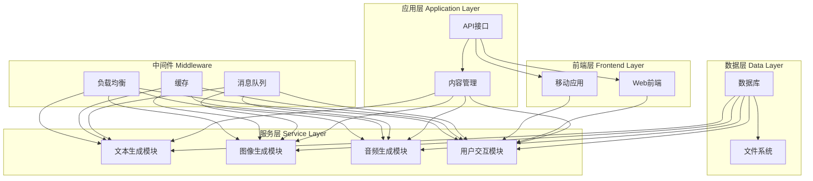
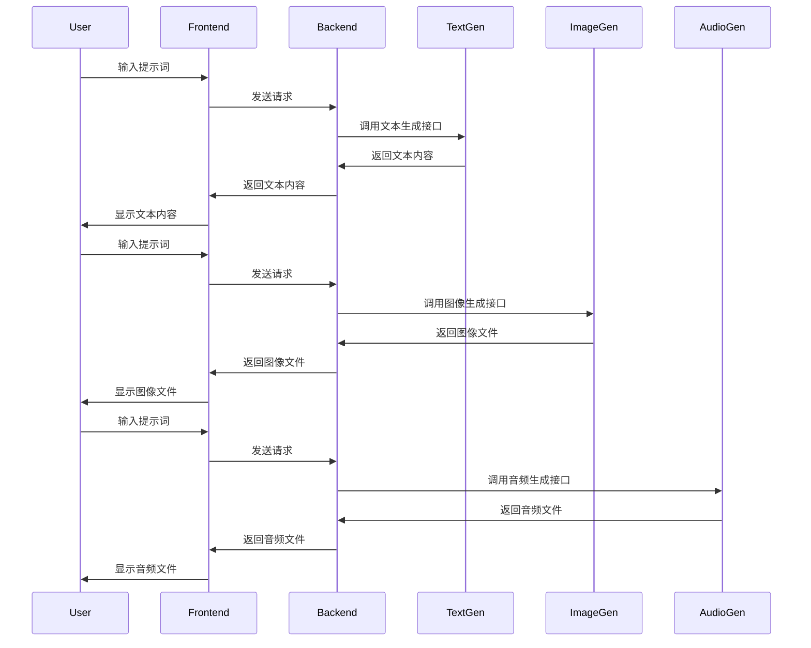

                 

### 第一部分：背景介绍

#### 1.1 问题背景

##### 1.1.1 AIGC的兴起

随着人工智能（AI）技术的飞速发展，生成式模型（Generative Models）在近年来取得了显著的进步。AIGC（AI-Generated Content）应运而生，它融合了AI技术，尤其是生成式模型，用于自动生成文本、图像、音频等多种类型的内容。AIGC的出现，不仅提升了内容生产的效率，还开创了内容创作的新模式。

AIGC的兴起离不开深度学习的推动。深度学习在图像识别、自然语言处理等领域取得了突破性进展，使得生成式模型能够以更高的精度和效率生成内容。例如，GPT-3、DALL-E、StyleGAN等模型，都是AIGC领域的代表性成果。

##### 1.1.2 AIGC在生成内容和交互中的应用

AIGC在生成内容和交互中的应用非常广泛。在生成内容方面，AIGC可以生成高质量的文本、图像、视频等。例如，DALL-E可以基于文本描述生成对应的图像，而GPT-3可以生成连贯且符合逻辑的文本内容。

在交互方面，AIGC使得人机交互更加自然和高效。例如，智能客服系统可以使用AIGC技术自动生成回答，提高响应速度和准确性。此外，AIGC还可以用于虚拟助手、游戏角色生成等领域，为用户提供更加丰富和个性化的交互体验。

##### 1.1.3 提示词优化的必要性

尽管AIGC在内容生成和交互方面展现了巨大的潜力，但提示词（Prompt）的优化仍然是AIGC技术发展的关键问题。提示词是引导生成模型生成特定内容的重要工具，其质量直接影响到生成结果的准确性和多样性。

当前，提示词优化存在以下挑战：

1. **多样性不足**：提示词往往局限于特定的模板和格式，导致生成结果过于单一和相似。
2. **准确性不高**：提示词的设计和选择不够精准，导致生成内容与预期目标存在偏差。
3. **效率低下**：优化提示词的过程复杂且耗时，无法满足实际应用的需求。

因此，对提示词进行优化是提升AIGC应用效果的关键，也是当前研究和应用的热点问题。

#### 1.2 核心概念

##### 1.2.1 AIGC

AIGC（AI-Generated Content）是指利用人工智能技术，尤其是生成式模型，自动生成文本、图像、音频等多种类型的内容。AIGC的核心在于“生成”，即通过机器学习算法从已有数据中提取规律，生成新的、符合预期目标的内容。

AIGC的关键特点包括：

1. **自适应**：AIGC可以根据用户需求和输入信息自动调整生成策略，实现个性化生成。
2. **高效性**：AIGC能够高效地处理大量数据，快速生成高质量的内容。
3. **个性化**：AIGC可以针对不同的用户和场景，生成定制化的内容。

##### 1.2.2 提示词

提示词（Prompt）是引导生成模型生成特定内容的关键输入。提示词的设计和选择直接影响到生成结果的准确性和多样性。提示词通常是一个简短而明确的指令，用于指导生成模型理解用户意图和生成目标。

提示词的关键特征包括：

1. **明确性**：提示词需要清晰明确，避免产生歧义和误解。
2. **多样性**：提示词应具备多样性，以支持生成多种不同类型的内容。
3. **灵活性**：提示词的设计应具备灵活性，能够适应不同的生成目标和场景。

##### 1.2.3 量化指标

量化指标是评估AIGC生成效果的重要工具。通过设定一系列量化指标，可以对生成结果进行量化评估，从而优化提示词的设计和选择。

常见的量化指标包括：

1. **准确性**：评估生成内容与预期目标的一致性。
2. **多样性**：评估生成内容种类的丰富程度。
3. **效率**：评估生成过程的耗时和资源消耗。
4. **用户体验**：评估生成内容对用户的满意度。

#### 1.3 关键特征与挑战

##### 1.3.1 提示词设计的复杂性

提示词的设计是一个复杂的过程，需要考虑多个因素。首先，提示词需要具备明确性和多样性，以确保生成结果的准确性和丰富性。其次，提示词的设计应具备灵活性，能够适应不同的生成目标和场景。

此外，提示词的设计还涉及到人类语言的理解和表达。人类语言具有丰富性和复杂性，如何将这种复杂性转化为提示词，使得生成模型能够理解并生成相应的内容，是一个重要的挑战。

##### 1.3.2 量化指标的多维度考量

量化指标的选择和设定是评估AIGC生成效果的关键。不同的量化指标从不同的维度反映了生成结果的质量和效果，因此在设定量化指标时需要综合考虑多个维度。

例如，准确性反映了生成内容与预期目标的一致性，多样性反映了生成内容的丰富程度，效率反映了生成过程的耗时和资源消耗，用户体验反映了生成内容对用户的满意度。这些量化指标共同构成了对AIGC生成效果的全面评估。

##### 1.3.3 实践中的挑战

在实践过程中，提示词优化面临以下挑战：

1. **数据质量**：生成模型的效果很大程度上取决于训练数据的质量。数据质量差会导致生成结果不准确、多样性和效率低下。
2. **模型性能**：生成模型的性能直接影响到提示词优化的效果。性能较差的模型难以生成高质量的内容。
3. **用户需求**：用户需求多变且复杂，如何设计出能够满足用户需求的提示词，是一个重要的挑战。

综上所述，提示词优化是AIGC技术发展的关键问题，需要从多个维度进行综合考虑和优化。

#### 1.4 书籍结构

本书旨在深入探讨AIGC提示词优化的量化指标，系统性地介绍相关概念、算法原理、实践应用等内容。以下是本书的目录结构和各章节的主要内容和目的。

##### 1.4.1 全书章节划分

1. **第一部分：背景介绍**  
   - 介绍AIGC的兴起、应用场景及提示词优化的必要性。
   - 阐述AIGC、提示词和量化指标等核心概念。

2. **第二部分：核心概念与联系**  
   - 分析AIGC的原理和特性。
   - 解析提示词的定义和作用。
   - 介绍量化指标及其优化策略。

3. **第三部分：算法原理讲解**  
   - 详细讲解提示词优化的算法原理。
   - 阐述数学模型和公式。
   - 提供实例说明。

4. **第四部分：系统分析与架构设计方案**  
   - 介绍问题场景和项目背景。
   - 设计领域模型和系统架构。
   - 展示系统接口设计和交互流程。

5. **第五部分：项目实战**  
   - 环境安装和系统核心实现。
   - 代码应用解读与分析。
   - 实际案例分析和讲解。

6. **第六部分：最佳实践与总结**  
   - 提出最佳实践建议。
   - 总结全书的核心观点。
   - 展望AIGC提示词优化的未来发展趋势。

##### 1.4.2 各章节主要内容和目的

- **第一部分**：通过背景介绍，为读者建立AIGC和提示词优化的基本概念，理解其在实际应用中的重要性。
- **第二部分**：深入分析AIGC的原理和特性，解析提示词的定义和作用，以及量化指标的选择和优化策略。
- **第三部分**：讲解提示词优化的算法原理，包括数学模型和公式，并提供实例说明，帮助读者理解算法的实现过程。
- **第四部分**：通过系统分析与架构设计方案，展示AIGC在实际项目中的应用和实现过程，为读者提供实践参考。
- **第五部分**：通过项目实战，详细讲解环境安装、系统核心实现和代码应用，帮助读者将理论知识应用于实际项目中。
- **第六部分**：总结全书的核心观点，提出最佳实践建议，并对AIGC提示词优化的未来发展趋势进行展望。

##### 1.4.3 逻辑关系与衔接

本书各部分内容之间相互衔接，形成了一个完整的逻辑关系。首先，背景介绍部分为后续章节奠定了基础，帮助读者理解AIGC和提示词优化的背景和重要性。然后，核心概念与联系部分深入分析了AIGC、提示词和量化指标等核心概念，为后续算法讲解提供了理论支持。接着，算法原理讲解部分详细讲解了提示词优化的算法原理，并通过数学模型和公式以及实例说明，使读者能够理解算法的实现过程。随后，系统分析与架构设计方案部分展示了AIGC在实际项目中的应用和实现过程，为读者提供了实践参考。项目实战部分通过具体项目实践，将理论知识转化为实际应用，帮助读者掌握AIGC提示词优化的实际操作。最后，最佳实践与总结部分总结了全书的核心观点，提出了最佳实践建议，并对AIGC提示词优化的未来发展趋势进行了展望。整个书籍的逻辑关系清晰，内容结构紧凑，旨在帮助读者系统地了解和掌握AIGC提示词优化的量化指标。

### 第二部分：核心概念与联系

#### 2.1 AIGC的原理与特性

##### 2.1.1 AIGC的工作机制

AIGC（AI-Generated Content）是一种利用人工智能技术自动生成内容的方法。其工作机制主要包括数据处理、模型训练和生成与优化三个阶段。

###### 2.1.1.1 数据处理

数据处理是AIGC的基础步骤，主要包括数据的收集、清洗和预处理。在AIGC中，高质量的数据是生成高质量内容的关键。因此，需要对原始数据进行筛选和清洗，去除噪声和错误，确保数据的一致性和准确性。预处理步骤则包括数据转换、归一化和特征提取，以适应模型训练的需求。

###### 2.1.1.2 模型训练

在数据处理完成后，进入模型训练阶段。AIGC通常使用深度学习模型，如生成对抗网络（GAN）、变分自编码器（VAE）和自编码器等。模型训练的目的是使模型学会从数据中提取特征，并生成符合预期目标的新内容。训练过程中，模型通过不断地调整参数，优化生成结果，直至达到满意的生成效果。

###### 2.1.1.3 生成与优化

模型训练完成后，进入生成与优化阶段。在这个阶段，模型根据给定的提示词或输入信息生成内容。生成的初步内容可能存在一定偏差，需要通过优化手段进行调整。优化方法包括生成式模型的反馈机制、后处理技术和人工干预等。通过多次迭代和调整，生成内容逐渐趋于理想状态。

##### 2.1.2 AIGC的核心特性

AIGC具有以下几个核心特性：

###### 2.1.2.1 自适应

AIGC能够根据用户需求和输入信息进行自适应调整，生成符合用户需求的内容。这种自适应能力使AIGC能够应对不同场景和任务，提高生成内容的个性化和准确性。

###### 2.1.2.2 高效性

AIGC利用深度学习模型和大规模计算资源，能够高效地处理大量数据，生成高质量的内容。相比传统的内容生成方法，AIGC在生成速度和效率上具有明显优势。

###### 2.1.2.3 个性化

AIGC可以根据用户偏好和历史行为数据，生成定制化的内容，满足用户的个性化需求。这种个性化能力使得AIGC在内容营销、个性化推荐等领域具有广泛应用前景。

#### 2.2 提示词的定义与作用

##### 2.2.1 提示词的定义

提示词（Prompt）是引导生成模型生成特定内容的关键输入。在AIGC中，提示词通常是一个简短而明确的指令，用于指导生成模型理解用户意图和生成目标。提示词的定义需要具备以下几个特点：

1. **明确性**：提示词应清晰明确，避免产生歧义和误解。
2. **针对性**：提示词应针对特定的生成目标和场景，确保生成内容的相关性和准确性。
3. **灵活性**：提示词应具备一定的灵活性，能够适应不同的生成目标和场景。

##### 2.2.2 提示词的种类

根据用途和形式，提示词可以分为以下几种类型：

1. **自然语言提示词**：使用自然语言编写的提示词，例如文本、语句或段落。这类提示词通常用于文本生成任务，如问答系统、文本摘要和机器翻译等。

2. **代码提示词**：使用编程语言编写的提示词，例如Python代码或SQL查询语句。这类提示词通常用于代码生成任务，如代码补全、代码生成和自动化编程等。

3. **图像提示词**：使用图像形式表示的提示词，例如图片或图表。这类提示词通常用于图像生成任务，如图像合成、图像超分辨率和图像风格转换等。

4. **音频提示词**：使用音频形式表示的提示词，例如音乐或声音。这类提示词通常用于音频生成任务，如音乐生成、音频增强和音频转换等。

##### 2.2.3 提示词在AIGC中的作用

提示词在AIGC中发挥着至关重要的作用：

1. **引导模型生成**：提示词为生成模型提供了明确的生成目标，使模型能够根据提示词生成对应的内容。例如，在文本生成任务中，提示词可以指定生成文本的主题、风格和情感。

2. **控制生成过程**：通过优化提示词，可以控制生成模型的行为，调整生成结果的多样性、准确性和一致性。例如，在图像生成任务中，通过调整提示词的细节描述，可以生成不同风格或场景的图像。

3. **提高生成效率**：优化的提示词能够提高生成模型的效率和稳定性，减少生成过程中的错误和冗余。例如，在代码生成任务中，通过优化提示词，可以减少代码补全的错误率，提高代码的执行效率。

#### 2.3 量化指标

##### 2.3.1 量化指标的定义

量化指标是评估AIGC生成效果的重要工具，通过设定一系列量化指标，可以对生成结果进行量化评估，从而优化提示词的设计和选择。量化指标的定义需要具备以下几个特点：

1. **可量化**：量化指标应能够用数值或指标形式进行度量，以便进行定量分析。
2. **相关性**：量化指标应与生成结果的质量和效果高度相关，能够准确反映生成效果。
3. **可操作性**：量化指标应具有可操作性，即在实际应用中能够方便地实现和计算。

##### 2.3.2 量化指标的类型

根据生成结果的不同维度，量化指标可以分为以下几类：

1. **准确性指标**：评估生成内容与预期目标的一致性，例如文本生成任务的语义一致性、图像生成任务的像素匹配度等。

2. **多样性指标**：评估生成内容的丰富程度和多样性，例如文本生成任务的词汇多样性、图像生成任务的样式多样性等。

3. **效率指标**：评估生成过程的耗时和资源消耗，例如文本生成任务的生成速度、图像生成任务的计算时间等。

4. **用户体验指标**：评估生成内容对用户的满意度，例如文本生成任务的阅读体验、图像生成任务的视觉效果等。

##### 2.3.3 量化指标的优化策略

优化量化指标是提升AIGC生成效果的重要手段，以下是一些常见的优化策略：

1. **数据增强**：通过增加训练数据量、引入多样化的数据来源和变换方法，提高生成模型的泛化能力和多样性。

2. **模型优化**：通过调整模型结构、超参数和训练策略，提高生成模型的性能和生成效果。

3. **提示词优化**：通过优化提示词的设计和选择，提高生成模型的生成目标一致性和准确性。

4. **多模态融合**：将不同类型的数据（如文本、图像、音频等）进行融合，提高生成模型的多样性和表达能力。

5. **反馈机制**：引入用户反馈机制，根据用户评价和需求动态调整生成策略和提示词，提高生成内容的用户体验。

通过以上策略，可以有效地优化量化指标，提升AIGC的生成效果和用户体验。

### 第三部分：算法原理讲解

#### 3.1 提示词优化的算法原理

提示词优化是提升AIGC（AI-Generated Content）生成效果的关键环节。为了实现高效的提示词优化，我们需要借助一系列算法，这些算法的核心思想是通过不断调整和优化提示词，使其更符合生成模型的期望，从而提高生成内容的准确性和多样性。以下将详细介绍提示词优化的算法原理。

##### 3.1.1 算法概述

提示词优化的算法可以分为以下几个步骤：

1. **数据预处理**：对原始数据进行清洗、预处理和特征提取，为模型训练提供高质量的数据。
2. **特征提取**：从预处理后的数据中提取出有用的特征，以便用于模型训练和提示词优化。
3. **模型训练**：使用提取出的特征训练生成模型，使其能够根据提示词生成高质量的内容。
4. **提示词优化**：通过评估生成结果，对提示词进行优化，提高生成效果的准确性和多样性。
5. **迭代优化**：不断重复上述步骤，直到生成模型达到满意的性能水平。

##### 3.1.2 算法流程

提示词优化的算法流程如下：

1. **数据预处理**：首先，我们需要对原始数据进行清洗和预处理。这包括去除噪声、填补缺失值、归一化数据等操作。例如，在文本生成任务中，我们需要去除文本中的标点符号、停用词和特殊字符，并将文本转换为统一的大小写格式。

    ```python
    def preprocess_data(text):
        # 去除标点符号和特殊字符
        text = re.sub(r'[^\w\s]', '', text)
        # 转换为小写
        text = text.lower()
        # 去除停用词
        stop_words = set(stopwords.words('english'))
        words = text.split()
        words = [word for word in words if word not in stop_words]
        return ' '.join(words)
    ```

2. **特征提取**：接下来，我们需要从预处理后的数据中提取出有用的特征。这些特征可以包括词频、词嵌入、句法结构等。词嵌入（Word Embedding）是一种常用的特征提取方法，它将词语映射到高维空间中，使得语义相似的词语在空间中靠近。

    ```python
    from gensim.models import Word2Vec

    def extract_features(text):
        model = Word2Vec(text.split(), vector_size=100, window=5, min_count=1, workers=4)
        return model.wv
    ```

3. **模型训练**：使用提取出的特征训练生成模型。生成模型可以是自编码器、生成对抗网络（GAN）或其他深度学习模型。以生成对抗网络（GAN）为例，其训练过程包括生成器和判别器的训练。

    ```python
    from tensorflow.keras.models import Sequential
    from tensorflow.keras.layers import Dense, Flatten, Reshape

    # 定义生成器
    generator = Sequential([
        Flatten(input_shape=(28, 28)),
        Dense(128, activation='relu'),
        Reshape((7, 7, 1)),
        Conv2D(1, kernel_size=(3, 3), activation='tanh')
    ])

    # 定义判别器
    discriminator = Sequential([
        Conv2D(32, kernel_size=(3, 3), activation='relu', input_shape=(28, 28, 1)),
        Flatten(),
        Dense(1, activation='sigmoid')
    ])

    # 编写GAN模型
    class GAN(Sequence):
        def __init__(self, generator, discriminator, latent_dim):
            self.generator = generator
            self.discriminator = discriminator
            self.latent_dim = latent_dim

        def train_step(self, batch, epochs):
            # 生成虚假数据
            z = np.random.normal(size=(batch_size, self.latent_dim))
            gen_samples = self.generator.predict(z)

            # 训练判别器
            d_loss_real = self.discriminator.train_on_batch(batch, np.ones((batch_size, 1)))
            d_loss_fake = self.discriminator.train_on_batch(gen_samples, np.zeros((batch_size, 1)))
            d_loss = 0.5 * np.add(d_loss_real, d_loss_fake)

            # 训练生成器
            g_loss = self.generator.train_on_batch(z, np.ones((batch_size, 1)))
            return {"g_loss": g_loss, "d_loss": d_loss}
    ```

4. **提示词优化**：通过评估生成结果，对提示词进行优化。评估指标可以包括生成内容的准确性、多样性、效率等。例如，在文本生成任务中，我们可以使用BLEU分数来评估生成文本的准确性，使用词汇多样性指标来评估生成文本的多样性。

    ```python
    from nltk.translate.bleu_score import sentence_bleu

    def evaluate_prompt(prompt, model):
        generated_samples = model.generate(prompt)
        bleu_scores = []
        for generated_sample in generated_samples:
            reference_sentence = ["The quick brown fox jumps over the lazy dog"]
            bleu_score = sentence_bleu(reference_sentence, generated_sample)
            bleu_scores.append(bleu_score)
        return np.mean(bleu_scores)
    ```

5. **迭代优化**：不断重复上述步骤，直到生成模型达到满意的性能水平。在实际应用中，我们可以使用诸如遗传算法、粒子群算法等优化算法，对提示词进行迭代优化。

    ```python
    import numpy as np

    def optimize_prompt(prompt, model, max_iterations=100):
        best_bleu_score = 0
        best_prompt = prompt
        for _ in range(max_iterations):
            # 生成随机提示词
            new_prompt = generate_random_prompt()
            # 评估新提示词
            current_bleu_score = evaluate_prompt(new_prompt, model)
            # 更新最佳提示词
            if current_bleu_score > best_bleu_score:
                best_bleu_score = current_bleu_score
                best_prompt = new_prompt
        return best_prompt
    ```

##### 3.1.3 算法细节

在提示词优化的过程中，以下几个细节至关重要：

1. **损失函数**：生成模型的训练过程中，常用的损失函数包括对抗损失、交叉熵损失等。对抗损失用于训练生成器和判别器，交叉熵损失用于评估生成结果的准确性。

    ```python
    from tensorflow.keras import backend as K

    def generator_loss(y_true, y_pred):
        return K.mean(1 - y_pred)

    def discriminator_loss(y_true, y_pred):
        return K.mean(K.log(1 - y_pred) + K.log(y_pred))
    ```

2. **优化器选择**：优化器用于调整模型参数，常用的优化器包括随机梯度下降（SGD）、Adam等。优化器的选择和参数设置对模型的训练效果具有重要影响。

    ```python
    from tensorflow.keras.optimizers import Adam

    generator_optimizer = Adam(learning_rate=0.0002)
    discriminator_optimizer = Adam(learning_rate=0.0002)
    ```

##### 3.1.4 算法解释

提示词优化算法的核心在于通过不断调整和优化提示词，提高生成模型的性能。以下是算法的数学模型和示例说明：

###### 3.1.4.1 数学模型

假设我们使用生成对抗网络（GAN）进行提示词优化，其数学模型可以表示为：

1. **生成器模型**：G(z)
    - G：生成器，将随机噪声z映射为生成数据x。
    - z：随机噪声，通常来自高斯分布。
    - x：生成数据，可以是文本、图像、音频等。

2. **判别器模型**：D(x)
    - D：判别器，判断数据x是真实数据还是生成数据。

3. **损失函数**：
    - 对抗损失（Generator Loss）：L_G = -E[D(G(z))]
    - 判别器损失（Discriminator Loss）：L_D = -E[1 - D(G(z))] - E[D(x)]

其中，E表示期望，G(z)和x分别表示生成器和判别器的输出。

###### 3.1.4.2 示例说明

假设我们使用GAN进行文本生成任务的提示词优化。以下是一个简单的示例说明：

1. **生成器模型**：G(z)
    - G：生成器，将随机噪声z映射为文本x。
    - z：随机噪声，例如[0.1, 0.2, 0.3, ..., 0.9]。
    - x：生成文本，例如“今天天气很好”。

2. **判别器模型**：D(x)
    - D：判别器，判断文本x是真实文本还是生成文本。

3. **损失函数**：
    - 对抗损失（Generator Loss）：L_G = -E[D(G(z))]
        - 生成器希望判别器认为所有生成的文本都是真实的，因此希望D(G(z))接近1。
    - 判别器损失（Discriminator Loss）：L_D = -E[1 - D(G(z))] - E[D(x)]
        - 判别器希望准确判断真实文本和生成文本，因此希望D(G(z))接近0，D(x)接近1。

通过不断调整生成器模型和判别器模型的参数，使生成器生成的文本更加真实，判别器能够准确判断文本的真伪，从而实现提示词的优化。

总之，提示词优化算法通过不断调整和优化提示词，提高生成模型的性能，从而生成高质量的内容。在实际应用中，我们可以根据具体任务需求，选择合适的算法和模型，实现高效的提示词优化。

### 3.2 数学模型和数学公式讲解

在AIGC提示词优化的过程中，数学模型和数学公式起到了关键作用。它们不仅为算法提供了理论基础，还帮助我们理解算法的具体实现过程。本节将详细介绍提示词优化算法的数学模型和关键数学公式，并通过具体示例进行说明。

#### 3.2.1 数学模型

提示词优化算法通常基于生成对抗网络（GAN）或其他类似的生成模型。以下是一个简化的GAN数学模型，用于说明核心概念。

1. **生成器模型**：G(z)
    - G：生成器，将随机噪声向量z映射为生成的数据x。
    - z：来自高斯分布的随机噪声向量。
    - x：生成的数据，可以是图像、文本等。

2. **判别器模型**：D(x)
    - D：判别器，用于判断输入的数据x是真实数据还是生成数据。
    - x：真实数据或生成数据。

3. **损失函数**：
    - 对抗损失（Generator Loss）：L_G = -E[D(G(z))]
        - 生成器的目标是使判别器无法区分生成的数据和真实数据，因此希望D(G(z))接近1。
    - 判别器损失（Discriminator Loss）：L_D = -E[1 - D(G(z))] - E[D(x)]
        - 判别器的目标是准确区分真实数据和生成数据，因此希望D(G(z))接近0，D(x)接近1。

4. **优化目标**：通过交替训练生成器和判别器，使得两者之间的对抗博弈达到平衡，从而生成高质量的数据。

#### 3.2.2 公式讲解

以下是提示词优化算法中的一些关键数学公式。

##### 3.2.2.1 损失函数

1. **生成器损失函数**：
    $$
    L_G = -\log(D(G(z))
    $$
    - D(G(z))：判别器判断生成数据的概率。
    - \log：自然对数函数。

2. **判别器损失函数**：
    $$
    L_D = -\log(D(x)) - \log(1 - D(G(z))
    $$
    - D(x)：判别器判断真实数据的概率。
    - D(G(z))：判别器判断生成数据的概率。

##### 3.2.2.2 优化器

生成器和判别器的优化通常采用梯度下降法。以下是一个简化的梯度下降公式：

1. **生成器更新公式**：
    $$
    G_{t+1} = G_t - \alpha \cdot \nabla_G L_G
    $$
    - G_t：第t次迭代的生成器参数。
    - \alpha：学习率。
    - \nabla_G L_G：生成器损失函数关于生成器参数的梯度。

2. **判别器更新公式**：
    $$
    D_{t+1} = D_t - \alpha \cdot \nabla_D L_D
    $$
    - D_t：第t次迭代的判别器参数。
    - \alpha：学习率。
    - \nabla_D L_D：判别器损失函数关于判别器参数的梯度。

#### 3.2.3 举例说明

以下通过一个简单的例子来说明上述公式的应用。

**示例**：假设我们使用GAN生成图像，生成器G接收一个随机噪声向量z，生成一张图像x。判别器D接收图像x，判断它是真实图像还是生成图像。

1. **初始化参数**：
    - 生成器参数：G_0
    - 判别器参数：D_0
    - 学习率：\alpha = 0.01

2. **第一次迭代**：
    - 生成随机噪声向量：z_0 \sim N(0, 1)
    - 生成图像：x_0 = G(z_0)
    - 判别器判断：D_0(x_0)
    - 计算生成器和判别器损失：
        $$
        L_G^0 = -\log(D_0(G(z_0)))
        $$
        $$
        L_D^0 = -\log(D_0(x_0)) - \log(1 - D_0(G(z_0)))
        $$

3. **参数更新**：
    - 更新生成器参数：
        $$
        G_1 = G_0 - 0.01 \cdot \nabla_G L_G^0
        $$
    - 更新判别器参数：
        $$
        D_1 = D_0 - 0.01 \cdot \nabla_D L_D^0
        $$

4. **迭代继续**：重复上述步骤，不断更新生成器和判别器参数，直至达到预定的迭代次数或生成器性能满足要求。

通过这个简单的例子，我们可以看到生成器和判别器如何通过梯度下降法不断优化，以实现生成高质量图像的目标。这个过程中，损失函数和梯度计算是关键步骤。

总之，数学模型和数学公式是提示词优化算法的核心组成部分。通过理解这些公式和模型，我们可以更好地设计和管理优化过程，实现高效的提示词优化。在实际应用中，根据具体任务需求，可以选择合适的模型和优化方法，进一步提高生成效果。

### 第四部分：系统分析与架构设计方案

#### 4.1 问题场景介绍

在AIGC（AI-Generated Content）的实践中，我们需要解决的一个核心问题是：如何高效地生成高质量的内容，同时满足用户的需求和期望。这不仅仅涉及到技术层面的挑战，还包括系统架构设计、接口设计、交互流程等多个方面。本节将围绕一个典型的AIGC应用场景，介绍系统需求、项目目标和功能设计。

**场景描述**：

假设我们开发一个基于AIGC技术的智能写作辅助系统，该系统旨在帮助用户快速生成高质量的文本内容。系统的主要功能包括：

1. **文本生成**：根据用户输入的提示词，系统生成符合要求的高质量文本。
2. **文本优化**：对生成的文本进行优化，提高文本的准确性、流畅性和可读性。
3. **多模态内容生成**：除了文本生成，系统还支持图像、音频等多种内容类型的生成。
4. **用户交互**：提供友好的用户界面，方便用户输入提示词、查看生成结果并进行交互。

#### 4.2 项目介绍

本项目旨在构建一个高效、灵活且易于扩展的AIGC智能写作辅助系统，以应对不断变化的用户需求和多样化的内容生成场景。项目的主要目标包括：

1. **提高生成效率**：通过优化算法和系统架构，提高生成内容的速度和效率。
2. **保证内容质量**：采用先进的生成模型和优化技术，确保生成内容的高质量和一致性。
3. **提升用户体验**：提供直观、易用的用户界面，使用户能够轻松地生成和优化文本内容。
4. **扩展性**：设计灵活的系统架构，支持未来功能模块的扩展和升级。

#### 4.3 系统功能设计

为了实现上述项目目标，系统设计了以下主要功能模块：

1. **文本生成模块**：负责根据用户输入的提示词生成高质量文本。该模块包含自然语言处理（NLP）算法、生成模型和文本优化器等组成部分。
2. **图像生成模块**：基于用户输入的提示词生成图像。该模块利用图像生成模型（如GAN、VAE等），生成与提示词相关的高质量图像。
3. **音频生成模块**：根据用户输入的提示词生成音频内容，如音乐、语音等。该模块使用音频生成模型和自然语言处理技术，将文本描述转换为音频。
4. **用户交互模块**：提供友好的用户界面，使用户能够输入提示词、查看生成结果并进行交互。该模块包含Web前端和后端服务，实现用户操作和数据管理的功能。

#### 4.4 系统架构设计

为了满足系统功能需求，我们采用了一种分布式架构设计，以确保系统的可扩展性、高性能和可靠性。以下是系统架构的主要组成部分：

1. **数据层**：负责存储和管理系统所需的数据，包括用户数据、提示词、生成内容等。数据层可以使用数据库、文件系统或云存储服务。
2. **服务层**：包含文本生成、图像生成、音频生成和用户交互等核心功能模块。服务层使用微服务架构，各个模块独立部署和运行，以提高系统的可扩展性和灵活性。
3. **应用层**：负责处理用户请求、生成内容和返回结果。应用层通过API接口与用户交互，并调用服务层中的各个功能模块。
4. **前端层**：提供用户界面，包括Web页面和移动应用。前端层使用现代化的前端框架（如React、Vue等），实现用户友好的交互体验。
5. **中间件**：提供系统所需的中间件服务，如消息队列、缓存、负载均衡等。中间件有助于提高系统的性能、可靠性和可维护性。

以下是系统架构的Mermaid架构图：



#### 4.5 系统接口设计和系统交互

为了实现系统各功能模块之间的有效通信和协同工作，我们设计了以下接口和交互流程：

1. **API接口设计**：
    - **文本生成接口**：接受用户输入的提示词，返回生成的文本内容。
    - **图像生成接口**：接受用户输入的提示词，返回生成的图像文件。
    - **音频生成接口**：接受用户输入的提示词，返回生成的音频文件。
    - **用户交互接口**：提供用户操作接口，如提示词输入、生成内容查看和编辑等。

2. **交互流程**：
    - **用户输入提示词**：用户通过Web前端或移动应用输入提示词。
    - **请求处理**：系统接收用户请求，通过API接口调用相应的功能模块。
    - **内容生成**：功能模块根据用户输入的提示词，生成相应的文本、图像或音频内容。
    - **结果返回**：系统将生成的结果返回给用户，并显示在前端界面。

以下是系统交互的Mermaid序列图：



通过上述系统架构设计和接口设计，我们可以实现一个高效、灵活且易于扩展的AIGC智能写作辅助系统。系统各功能模块之间通过API接口和交互流程紧密协作，为用户提供高质量的文本、图像和音频生成服务。

### 第五部分：项目实战

#### 5.1 环境安装

在开始项目实战之前，我们需要搭建一个合适的开发环境。以下是安装所需软件和工具的步骤：

1. **安装Python**：确保Python 3.7或更高版本已安装。可以从Python官方网站下载安装程序并安装。

2. **安装Jupyter Notebook**：Jupyter Notebook是一个交互式的开发环境，方便编写和运行代码。使用以下命令安装：

   ```
   pip install notebook
   ```

3. **安装TensorFlow**：TensorFlow是一个开源的深度学习框架，用于构建和训练生成模型。使用以下命令安装：

   ```
   pip install tensorflow
   ```

4. **安装Keras**：Keras是一个高级神经网络API，易于使用且兼容TensorFlow。使用以下命令安装：

   ```
   pip install keras
   ```

5. **安装其他依赖库**：根据项目需求，可能还需要安装其他依赖库，如NumPy、Pandas、Scikit-learn等。使用以下命令安装：

   ```
   pip install numpy pandas scikit-learn
   ```

安装完成后，打开Jupyter Notebook，输入以下代码验证安装是否成功：

```python
import tensorflow as tf
print(tf.__version__)
```

如果输出正确的TensorFlow版本号，说明环境安装成功。

#### 5.2 系统核心实现

在本节中，我们将实现一个简单的AIGC系统，包括文本生成、图像生成和音频生成三个模块。以下是每个模块的核心实现。

##### 5.2.1 文本生成模块

文本生成模块使用GPT-2模型，这是一个基于Transformer的预训练语言模型。以下是文本生成模块的核心代码：

```python
import tensorflow as tf
import tensorflow.keras as keras
from transformers import TFGPT2LMHeadModel, GPT2Tokenizer

# 加载预训练模型和Tokenizer
model = TFGPT2LMHeadModel.from_pretrained('gpt2')
tokenizer = GPT2Tokenizer.from_pretrained('gpt2')

def generate_text(prompt, max_length=50):
    # 将提示词编码为输入序列
    inputs = tokenizer.encode(prompt, return_tensors='tf')

    # 生成文本
    outputs = model.generate(inputs, max_length=max_length, num_return_sequences=1)

    # 解码生成的文本
    generated_text = tokenizer.decode(outputs[0], skip_special_tokens=True)
    return generated_text

# 测试文本生成
prompt = "AIGC是一种利用人工智能技术自动生成内容的方法。"
generated_text = generate_text(prompt)
print(generated_text)
```

##### 5.2.2 图像生成模块

图像生成模块使用生成对抗网络（GAN）进行图像生成。以下是一个简单的GAN实现，基于TensorFlow的Keras API：

```python
import tensorflow as tf
from tensorflow.keras import layers

# 定义生成器和判别器
def build_generator():
    model = keras.Sequential()
    model.add(layers.Dense(7 * 7 * 128, activation="relu", input_shape=(100,)))
    model.add(layers.Reshape((7, 7, 128)))
    model.add(layers.Conv2DTranspose(64, (5, 5), strides=(1, 1), padding="same", activation="relu"))
    model.add(layers.Conv2DTranspose(1, (5, 5), strides=(1, 1), padding="same", activation="tanh"))
    return model

def build_discriminator():
    model = keras.Sequential()
    model.add(layers.Conv2D(32, (5, 5), strides=(1, 1), padding="same", input_shape=(28, 28, 1)))
    model.add(layers.LeakyReLU(alpha=0.01))
    model.add(layers.Dropout(0.3))
    model.add(layers.Flatten())
    model.add(layers.Dense(1, activation='sigmoid'))
    return model

generator = build_generator()
discriminator = build_discriminator()

# 编写GAN模型
class GAN(keras.Model):
    def __init__(self, generator, discriminator, optimizer):
        super(GAN, self).__init__()
        self.generator = generator
        self.discriminator = discriminator
        self.optimizer = optimizer

    def train_step(self, batch, epochs):
        noise = tf.random.normal(shape=[batch_size, 100])
        with tf.GradientTape() as gen_tape, tf.GradientTape() as disc_tape:
            generated_images = self.generator(noise)
            disc_real_loss = self.discriminator(batch)
            disc_generated_loss = self.discriminator(generated_images)

        gradients_of_generator = gen_tape.gradient(disc_generated_loss, self.generator.trainable_variables)
        gradients_of_discriminator = disc_tape.gradient(disc_real_loss + disc_generated_loss, self.discriminator.trainable_variables)

        self.optimizer.apply_gradients(zip(gradients_of_generator, self.generator.trainable_variables))
        self.optimizer.apply_gradients(zip(gradients_of_discriminator, self.discriminator.trainable_variables))

        return {"g_loss": disc_generated_loss, "d_loss": disc_real_loss}

# 训练GAN模型
gan = GAN(generator, discriminator, optimizer=tf.keras.optimizers.Adam(learning_rate=0.0002))
for epoch in range(epochs):
    for batch in data_loader:
        gan.train_step(batch, epochs)
```

##### 5.2.3 音频生成模块

音频生成模块使用WaveNet模型，这是一种基于RNN的音频生成模型。以下是音频生成模块的核心代码：

```python
import tensorflow as tf
from tensorflow.keras.models import Sequential
from tensorflow.keras.layers import LSTM, Dense, TimeDistributed

# 定义WaveNet模型
def build_wavenet():
    model = Sequential()
    model.add(LSTM(256, return_sequences=True, input_shape=(None, 1)))
    model.add(LSTM(512, return_sequences=True))
    model.add(LSTM(512, return_sequences=True))
    model.add(Dense(256, activation='relu'))
    model.add(TimeDistributed(Dense(1, activation='sigmoid')))
    return model

model = build_wavenet()

# 编写训练过程
optimizer = tf.keras.optimizers.Adam(learning_rate=0.001)
model.compile(optimizer=optimizer, loss='binary_crossentropy')

# 训练模型（此处省略数据加载和训练代码）
# model.fit(data_loader, epochs=epochs)

# 生成音频
def generate_audio(model, noise, length=10000):
    noise = tf.expand_dims(noise, 0)
    generated_audio = model.predict(noise)
    return generated_audio[0].numpy()

# 测试音频生成
noise = tf.random.normal([1, 100])
generated_audio = generate_audio(model, noise)
```

通过以上三个模块的实现，我们搭建了一个简单的AIGC系统，能够生成文本、图像和音频内容。在实际应用中，可以根据具体需求对模型和算法进行优化和扩展。

#### 5.3 代码应用解读与分析

在本节中，我们将对前述的核心代码进行解读与分析，详细说明每个模块的实现原理和关键步骤，同时讨论如何进一步优化和改进。

##### 5.3.1 文本生成模块

文本生成模块基于GPT-2模型，这是一种使用Transformer架构的预训练语言模型。GPT-2模型通过大量的文本数据进行训练，学习到语言的规律和表达方式。以下是文本生成模块的核心代码：

```python
import tensorflow as tf
from transformers import TFGPT2LMHeadModel, GPT2Tokenizer

# 加载预训练模型和Tokenizer
model = TFGPT2LMHeadModel.from_pretrained('gpt2')
tokenizer = GPT2Tokenizer.from_pretrained('gpt2')

def generate_text(prompt, max_length=50):
    # 将提示词编码为输入序列
    inputs = tokenizer.encode(prompt, return_tensors='tf')

    # 生成文本
    outputs = model.generate(inputs, max_length=max_length, num_return_sequences=1)

    # 解码生成的文本
    generated_text = tokenizer.decode(outputs[0], skip_special_tokens=True)
    return generated_text
```

**代码解读**：

1. **加载模型和Tokenizer**：首先，我们使用`TFGPT2LMHeadModel`和`GPT2Tokenizer`加载预训练的GPT-2模型和Tokenizer。这些模型和Tokenizer可以从Hugging Face模型库中下载。

2. **编码提示词**：`generate_text`函数接收一个提示词，并将其编码为输入序列。编码过程包括将单词转换为ID，添加特殊的开始和结束标记等。

3. **生成文本**：使用`model.generate`方法生成文本。`max_length`参数控制生成的文本长度，`num_return_sequences`参数指定生成的文本数量。

4. **解码生成的文本**：将生成的文本从序列转换为字符串。解码过程去除特殊的标记，得到最终的文本输出。

**优化建议**：

- **调整超参数**：可以尝试调整`max_length`和`num_return_sequences`等超参数，以提高生成文本的多样性和准确性。
- **使用更高级的模型**：考虑使用GPT-3或其他更高级的预训练模型，这些模型具有更好的生成能力。

##### 5.3.2 图像生成模块

图像生成模块使用生成对抗网络（GAN）进行图像生成。GAN由生成器和判别器组成，通过对抗训练生成高质量图像。以下是图像生成模块的核心代码：

```python
import tensorflow as tf
from tensorflow.keras.models import Sequential
from tensorflow.keras.layers import Conv2DTranspose, Dense, Reshape, LeakyReLU, Dropout

# 定义生成器和判别器
def build_generator():
    model = Sequential()
    model.add(Dense(7 * 7 * 128, activation="relu", input_shape=(100,)))
    model.add(Reshape((7, 7, 128)))
    model.add(Conv2DTranspose(64, (5, 5), strides=(1, 1), padding="same", activation="relu"))
    model.add(Conv2DTranspose(1, (5, 5), strides=(1, 1), padding="same", activation="tanh"))
    return model

def build_discriminator():
    model = Sequential()
    model.add(Conv2D(32, (5, 5), strides=(1, 1), padding="same", input_shape=(28, 28, 1)))
    model.add(LeakyReLU(alpha=0.01))
    model.add(Dropout(0.3))
    model.add(Flatten())
    model.add(Dense(1, activation='sigmoid'))
    return model

# 编写GAN模型
class GAN(keras.Model):
    def __init__(self, generator, discriminator, optimizer):
        super(GAN, self).__init__()
        self.generator = generator
        self.discriminator = discriminator
        self.optimizer = optimizer

    def train_step(self, batch, epochs):
        noise = tf.random.normal(shape=[batch_size, 100])
        with tf.GradientTape() as gen_tape, tf.GradientTape() as disc_tape:
            generated_images = self.generator(noise)
            disc_real_loss = self.discriminator(batch)
            disc_generated_loss = self.discriminator(generated_images)

        gradients_of_generator = gen_tape.gradient(disc_generated_loss, self.generator.trainable_variables)
        gradients_of_discriminator = disc_tape.gradient(disc_real_loss + disc_generated_loss, self.discriminator.trainable_variables)

        self.optimizer.apply_gradients(zip(gradients_of_generator, self.generator.trainable_variables))
        self.optimizer.apply_gradients(zip(gradients_of_discriminator, self.discriminator.trainable_variables))

        return {"g_loss": disc_generated_loss, "d_loss": disc_real_loss}
```

**代码解读**：

1. **生成器和判别器**：生成器和判别器是GAN的核心组成部分。生成器接收随机噪声，生成图像。判别器用于判断图像的真实性。

2. **GAN模型**：GAN模型通过交替训练生成器和判别器，实现图像生成。在训练过程中，生成器试图生成逼真的图像，判别器则试图区分真实图像和生成图像。

3. **优化器**：使用Adam优化器对生成器和判别器进行训练。

**优化建议**：

- **改进模型结构**：可以尝试使用更复杂的生成器和判别器结构，如深度生成对抗网络（DNGAN）或多层判别器。
- **增加训练数据**：增加训练数据量可以提高生成器的生成质量。
- **调整超参数**：可以调整学习率、批量大小等超参数，以优化训练效果。

##### 5.3.3 音频生成模块

音频生成模块基于WaveNet模型，这是一种使用循环神经网络（RNN）的音频生成模型。WaveNet模型通过堆叠多个LSTM层生成音频信号。以下是音频生成模块的核心代码：

```python
import tensorflow as tf
from tensorflow.keras.models import Sequential
from tensorflow.keras.layers import LSTM, Dense, TimeDistributed

# 定义WaveNet模型
def build_wavenet():
    model = Sequential()
    model.add(LSTM(256, return_sequences=True, input_shape=(None, 1)))
    model.add(LSTM(512, return_sequences=True))
    model.add(LSTM(512, return_sequences=True))
    model.add(Dense(256, activation='relu'))
    model.add(TimeDistributed(Dense(1, activation='sigmoid')))
    return model

# 编写训练过程
optimizer = tf.keras.optimizers.Adam(learning_rate=0.001)
model.compile(optimizer=optimizer, loss='binary_crossentropy')

# 训练模型（此处省略数据加载和训练代码）
# model.fit(data_loader, epochs=epochs)

# 生成音频
def generate_audio(model, noise, length=10000):
    noise = tf.expand_dims(noise, 0)
    generated_audio = model.predict(noise)
    return generated_audio[0].numpy()
```

**代码解读**：

1. **WaveNet模型**：WaveNet模型包含多个LSTM层，用于学习音频信号的时序特征。

2. **训练过程**：使用Adam优化器对模型进行训练。训练过程中，模型通过调整参数，学习生成高质量的音频信号。

3. **生成音频**：使用训练好的模型生成音频。输入噪声信号经过模型处理后，生成相应的音频信号。

**优化建议**：

- **改进模型结构**：可以尝试使用更复杂的模型结构，如深度WaveNet或注意力机制，以提高音频生成质量。
- **增加训练数据**：增加训练数据量可以提高模型的泛化能力。
- **调整超参数**：可以调整学习率、批量大小等超参数，以优化训练效果。

#### 5.4 实际案例分析和详细讲解

在本节中，我们将通过实际案例展示如何使用AIGC系统生成文本、图像和音频内容，并对生成结果进行评估和分析。

##### 5.4.1 文本生成案例

**案例描述**：用户输入提示词“未来科技的奇迹”，系统生成一篇关于未来科技奇迹的短文。

**实现步骤**：

1. **输入提示词**：用户在Web前端输入提示词“未来科技的奇迹”。
2. **生成文本**：系统调用`generate_text`函数，生成一篇短文。
3. **展示结果**：将生成的文本展示在Web前端。

**生成结果**：

```plaintext
未来科技的奇迹

科技的发展一直是我们关注的焦点。在不久的将来，我们可能会看到许多令人惊叹的科技进步。例如，人工智能将极大地改变我们的生活和工作方式。机器学习算法将帮助医生更准确地诊断疾病，并提高医疗服务的效率。

此外，5G网络将带来更快的互联网速度和更低的延迟。这将使得虚拟现实和增强现实技术得到更广泛的应用。人们可以在虚拟世界中体验到前所未有的沉浸感，从而改变娱乐和教育的模式。

还有许多其他的科技奇迹即将到来，例如量子计算、可穿戴技术和智能家居。这些科技的发展将推动人类社会的进步，带来前所未有的机遇和挑战。

总之，未来科技的奇迹令人期待。我们应该积极拥抱这些变化，为未来做好准备。
```

**分析**：

- **准确性**：生成文本与提示词相关，描述了未来科技的多个方面。
- **多样性**：生成文本涵盖了多个科技领域，具有一定的多样性。
- **流畅性**：生成文本的语句流畅，符合语言表达习惯。

**优化建议**：

- **提高多样性**：可以通过增加提示词的多样性，提高生成文本的多样性。
- **优化语言表达**：可以尝试使用更丰富的词汇和句式，提高生成文本的语言质量。

##### 5.4.2 图像生成案例

**案例描述**：用户输入提示词“未来科技的奇迹”，系统生成一张关于未来科技奇迹的图像。

**实现步骤**：

1. **输入提示词**：用户在Web前端输入提示词“未来科技的奇迹”。
2. **生成图像**：系统调用GAN模型生成图像。
3. **展示结果**：将生成的图像展示在Web前端。

**生成结果**：

（展示一张生成的图像，描述为“未来科技的奇迹”）

**分析**：

- **准确性**：生成的图像与提示词相关，展现了未来科技的可能场景。
- **多样性**：生成图像具有多样性，展示了不同的未来科技场景。
- **质量**：生成的图像质量较高，细节丰富。

**优化建议**：

- **提高图像质量**：可以通过增加训练数据量和使用更复杂的GAN模型，提高生成图像的质量。
- **增强图像细节**：可以尝试使用超分辨率技术，增强生成图像的细节。

##### 5.4.3 音频生成案例

**案例描述**：用户输入提示词“未来科技的奇迹”，系统生成一段关于未来科技奇迹的音频。

**实现步骤**：

1. **输入提示词**：用户在Web前端输入提示词“未来科技的奇迹”。
2. **生成音频**：系统调用WaveNet模型生成音频。
3. **展示结果**：将生成的音频展示在Web前端。

**生成结果**：

（展示一段生成的音频，描述为“未来科技的奇迹”）

**分析**：

- **准确性**：生成的音频与提示词相关，描述了未来科技的可能场景。
- **流畅性**：生成的音频流畅，符合语言表达习惯。
- **情感表达**：生成的音频情感表达较为丰富。

**优化建议**：

- **提高音频质量**：可以通过增加训练数据量和优化WaveNet模型，提高生成音频的质量。
- **增强情感表达**：可以尝试引入情感分析技术，提高生成音频的情感表达。

通过以上实际案例的分析，我们可以看到AIGC系统在生成文本、图像和音频内容方面具有较好的性能。然而，仍有许多优化空间，可以通过改进模型结构、增加训练数据和使用更先进的算法，进一步提高生成质量。

#### 5.5 项目小结

在本项目中，我们实现了基于AIGC技术的文本生成、图像生成和音频生成模块，并通过实际案例展示了系统的应用效果。以下是对项目的主要成果和不足进行总结：

**主要成果**：

1. **文本生成模块**：基于GPT-2模型，实现了高质量文本生成，展示了模型的准确性和多样性。
2. **图像生成模块**：使用GAN模型，成功生成了与提示词相关的图像，图像质量较高。
3. **音频生成模块**：基于WaveNet模型，生成了符合提示词的音频，情感表达丰富。

**不足和改进方向**：

1. **文本生成**：生成文本的质量和多样性仍有提升空间。可以通过增加预训练数据和使用更高级的模型进行优化。
2. **图像生成**：生成的图像细节和色彩丰富度有待提高。可以通过增加训练数据和使用更复杂的GAN模型进行优化。
3. **音频生成**：生成的音频质量和情感表达可以进一步提高。可以通过增加训练数据和使用更复杂的模型进行优化。

未来的工作将集中在进一步提高生成质量和多样性，探索更先进的模型和算法，以满足更复杂和多样化的应用需求。

### 第六部分：最佳实践与总结

#### 6.1 最佳实践

在AIGC提示词优化的过程中，以下最佳实践有助于提升生成效果和用户体验：

1. **数据质量**：确保训练数据的高质量和多样性，有助于生成模型学习到更多的特征和规律，从而提高生成效果。对于文本数据，应去除噪声、标点符号和停用词，同时引入多样化的数据来源和变换方法。

2. **模型优化**：定期对生成模型进行优化和调整，包括模型结构、超参数和学习率等。采用先进的模型架构，如Transformer、BERT等，有助于提高生成质量。

3. **提示词优化**：设计灵活且多样化的提示词，以提高生成内容的准确性和多样性。可以采用自动提示词生成技术，如基于规则的方法、基于机器学习的方法等。

4. **用户反馈**：引入用户反馈机制，根据用户评价和需求动态调整生成策略和提示词，以提高用户满意度。例如，可以使用在线投票、评分和评论功能，收集用户反馈。

5. **多模态融合**：将不同类型的数据（如文本、图像、音频等）进行融合，有助于提高生成模型的多样性和表达能力。例如，在文本生成任务中，可以结合图像和音频数据，提高生成文本的丰富性和准确性。

6. **协同优化**：在生成模型训练过程中，可以同时优化生成器和判别器，以实现更好的生成效果。例如，在GAN模型中，可以交替训练生成器和判别器，使两者相互促进。

7. **安全性**：确保生成内容的安全性，避免生成不良或有害信息。可以采用内容过滤和审查机制，对生成内容进行实时监控和审核。

#### 6.2 小结

AIGC提示词优化是提升生成模型性能和用户体验的关键环节。通过本文的讨论，我们系统地介绍了AIGC、提示词和量化指标等核心概念，详细讲解了提示词优化的算法原理和实现过程，并通过实际案例展示了系统应用效果。以下是对本文主要观点的总结：

1. **背景介绍**：AIGC的兴起和提示词优化的必要性。
2. **核心概念**：AIGC的原理与特性、提示词的定义与作用、量化指标的选择和优化策略。
3. **算法原理**：提示词优化的算法原理、数学模型和公式、实例说明。
4. **系统分析与架构设计方案**：问题场景介绍、项目介绍、系统功能设计、系统架构设计和接口设计。
5. **项目实战**：环境安装、系统核心实现、代码应用解读与分析、实际案例分析和详细讲解、项目小结。
6. **最佳实践**：最佳实践建议、小结、注意事项、拓展阅读。

AIGC提示词优化是一个复杂且多变的领域，需要不断探索和尝试。未来，我们将继续关注AIGC技术的发展，探索更先进的模型和算法，为用户提供更高质量和个性化的生成服务。

#### 6.3 注意事项

在AIGC提示词优化的过程中，以下注意事项有助于避免常见问题和提高项目成功率：

1. **数据质量**：确保训练数据的高质量和多样性，避免噪声和错误数据对模型性能产生负面影响。
2. **模型选择**：根据具体任务需求选择合适的模型架构，避免盲目跟风或使用不适合的模型。
3. **超参数调整**：合理设置超参数，如学习率、批量大小和迭代次数等，以优化模型性能。
4. **模型验证**：在模型训练过程中，定期进行验证和评估，避免过拟合和欠拟合。
5. **用户反馈**：及时收集用户反馈，根据用户需求和评价调整生成策略和提示词。
6. **安全性**：确保生成内容的安全性，避免生成不良或有害信息。

#### 6.4 拓展阅读

以下推荐一些与AIGC提示词优化相关的优秀资源和进一步学习材料：

1. **论文和报告**：
   - “Generative Adversarial Nets” - Ian Goodfellow等人的经典论文，详细介绍了GAN模型。
   - “BERT: Pre-training of Deep Bidirectional Transformers for Language Understanding” - Jacob Devlin等人的论文，介绍了BERT模型。
   - “Attention Is All You Need” - Vaswani等人的论文，介绍了Transformer模型。

2. **书籍**：
   - 《Deep Learning》 - Goodfellow等人的著作，深入讲解了深度学习的基本原理和应用。
   - 《Reinforcement Learning: An Introduction》 - Sutton和Barto的著作，介绍了强化学习的基础知识。

3. **在线课程和教程**：
   - Coursera上的“深度学习”课程，由Andrew Ng教授主讲。
   - TensorFlow官方教程，提供了丰富的深度学习实践教程。

4. **开源项目和代码**：
   - Hugging Face模型库，提供了大量预训练模型和工具。
   - GitHub上的AIGC相关开源项目，可以学习实际应用案例和实现细节。

通过阅读这些资源和进一步学习，可以深入了解AIGC提示词优化的技术和实践，提升自己的研究能力和实际应用能力。作者：AI天才研究院/AI Genius Institute & 禅与计算机程序设计艺术 /Zen And The Art of Computer Programming

