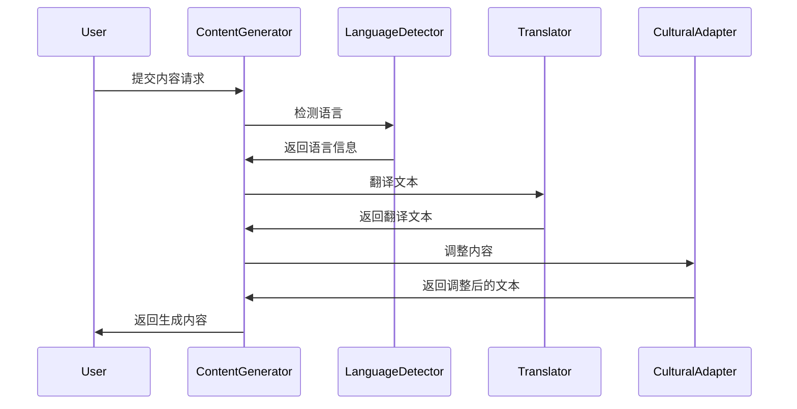
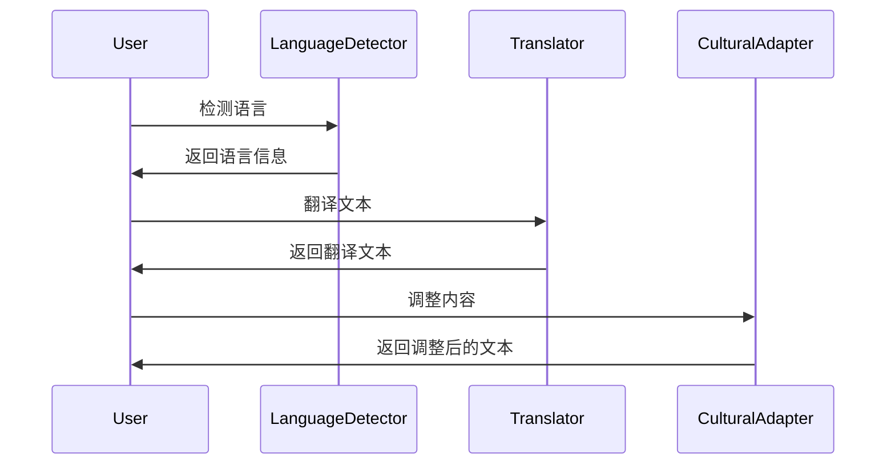

                 

# AIGC提示词的本地化与文化适应

## 关键词
AIGC, 提示词, 本地化, 文化适应, AI生成内容

## 摘要
本文深入探讨了AIGC（AI-Generated Content）中的关键概念——提示词，并探讨了其在本地化与文化适应中的重要性。通过对AIGC的基本原理、提示词的功能和类型、本地化的挑战与策略、文化适应的影响和实现方法进行详细分析，本文旨在为读者提供关于AIGC提示词本地化与文化适应的全面理解。

## 引言

### AIGC与提示词的基本概念

#### AIGC的定义与背景
AIGC，即AI-Generated Content，是指利用人工智能技术生成内容的过程。它涵盖了从文本到图像、视频等多个领域。随着深度学习、自然语言处理等技术的进步，AIGC已经成为内容创作的重要工具。例如，AI可以自动生成新闻报道、电影剧本、音乐甚至艺术作品。

#### 提示词的作用
在AIGC中，提示词（Prompt）是一个关键概念。它用于引导AI生成特定的内容。提示词可以是简单的关键词，也可以是复杂的句子，它们帮助AI理解用户的意图和需求，从而生成相应的内容。例如，在生成一篇新闻报道时，提示词可能是“科技领域的最新进展”。

### 本地化与文化适应的重要性

#### 本地化的概念
本地化是指将产品或内容根据特定地区的语言、文化和社会习惯进行调整，使其更符合当地用户的需求。在AIGC中，本地化意味着确保生成的文本、图像等内容在不同文化背景下依然能够被理解和接受。

#### 文化适应的重要性
文化适应是指在全球化背景下，使内容能够在不同文化环境中被接受和认可。对于AIGC来说，文化适应意味着不仅要考虑语言的本地化，还要考虑文化价值观、习俗、传统等因素。

### AIGC与提示词的关系
AIGC与提示词紧密相连。提示词不仅决定了AIGC生成的质量，也影响了内容的本地化和文化适应。有效的提示词能够提高内容的准确性、相关性和吸引力，这对于实现本地化与文化适应至关重要。

### 文章结构与内容概述
本文将分为以下几个部分：
1. AIGC与提示词概述
2. 提示词的本地化
3. 文化适应与AIGC
4. 案例分析
5. 技术实现
6. 最佳实践与总结

通过这些部分，本文将逐步探讨AIGC提示词的本地化与文化适应，为读者提供全面的技术解读和实践指导。

### AIGC与提示词概述

#### AIGC的基本原理

AIGC，即AI-Generated Content，是通过利用人工智能技术，尤其是深度学习和自然语言处理（NLP）等算法，生成具有原创性和复杂性的内容。其核心原理在于训练大规模的神经网络模型，使其能够理解、学习并生成与人类创作相似的内容。AIGC的应用场景广泛，包括但不限于以下几个方面：

1. **文本生成**：AIGC可以生成新闻文章、博客文章、故事、对话等文本内容。例如，OpenAI的GPT模型能够生成高质量的新闻报道和小说。
2. **图像生成**：基于生成对抗网络（GAN）和变分自编码器（VAE）等算法，AIGC可以生成逼真的图像和艺术作品。例如，DeepArt和Artbreeder等应用利用AIGC生成艺术画作和设计图。
3. **视频生成**：AIGC可以自动生成视频内容，包括动画、电影片段等。例如，YouTube的Duping功能利用AIGC将用户上传的视频片段转换成卡通风格。
4. **语音生成**：通过训练语音合成模型，AIGC可以生成自然流畅的语音，用于语音助手、自动朗读等应用。例如，谷歌的Text-to-Speech和Amazon的VoiceView等。

#### 提示词的功能与类型

在AIGC中，提示词（Prompt）是一个关键概念。提示词是用户输入的文本或指令，用于指导AI生成特定类型的内容。一个有效的提示词可以帮助AI更好地理解用户的意图和需求，从而生成高质量的内容。以下是几种常见的提示词类型：

1. **关键词**：简单的关键词提示词可以引导AI生成与这些关键词相关的内容。例如，提示词“科技”可能生成一篇关于科技领域的新闻文章。
2. **句子级提示**：更复杂的句子级提示词可以提供更详细的指导，帮助AI生成更具体的内容。例如，提示词“请生成一篇关于人工智能在医疗领域的应用的文章”。
3. **任务指令**：任务指令级提示词用于明确指定AI需要完成的任务。例如，“生成一篇包含五个段落的关于未来城市交通的论文”。

#### AIGC的应用领域

AIGC的应用领域非常广泛，涵盖了从娱乐、教育到商业等多个行业。以下是几个典型的应用领域：

1. **新闻媒体**：AIGC可以自动化生成新闻报道，提高内容生产的效率和多样性。例如，美国的一些新闻机构已经使用AIGC生成体育赛事报道和财经新闻。
2. **广告与营销**：AIGC可以用于生成个性化的广告内容和营销材料，提高广告的效果和吸引力。例如，AI可以生成符合特定用户兴趣和需求的广告文案和图片。
3. **教育**：AIGC可以用于自动生成教学材料，包括课程内容、练习题和测试题。例如，一些在线教育平台已经开始使用AIGC生成个性化的学习材料。
4. **创意产业**：AIGC可以用于生成音乐、艺术作品和动画等内容，为创作者提供灵感和辅助工具。例如，艺术家和音乐家可以使用AIGC生成新的音乐旋律和艺术作品。

#### 提示词在AIGC生成中的作用和影响

提示词在AIGC生成中起着至关重要的作用。一个有效的提示词可以帮助AI更准确地理解用户的意图和需求，从而生成更相关、更高质量的内容。以下是提示词在AIGC生成中的作用和影响：

1. **提高内容的相关性和准确性**：通过提供明确的提示词，用户可以更具体地表达自己的需求，帮助AI生成与用户意图高度相关的内容。例如，一个精确的句子级提示词可以确保生成的新闻报道准确无误。
2. **控制内容生成的多样性**：提示词可以帮助AI探索不同的生成路径，从而生成多样化的内容。例如，通过使用多个关键词，AI可以生成不同风格和主题的文章。
3. **优化用户体验**：有效的提示词可以提高用户的满意度，因为他们能够获得更符合期望和需求的内容。例如，在广告和营销场景中，个性化的广告内容可以更好地吸引和留住用户。

总之，AIGC和提示词的结合为内容创作带来了巨大的变革。通过理解AIGC的基本原理和提示词的功能，我们可以更好地利用这一技术，实现高效、个性化的内容生成。

### 提示词的本地化

#### 本地化的概念

本地化是一种将产品或内容根据特定地区的语言、文化和社会习惯进行调整的过程。在AIGC中，本地化意味着确保生成的文本、图像等内容在不同文化背景下依然能够被理解和接受。本地化的核心目标包括：

1. **语言翻译**：将内容从一种语言翻译成另一种语言，确保翻译的准确性和自然性。
2. **文化适应**：调整内容以适应不同文化的价值观、习俗和传统，确保内容的适宜性和吸引力。
3. **用户体验**：优化内容的格式、设计和交互，以适应不同地区的用户习惯和使用场景。

#### 本地化的挑战

在AIGC的本地化过程中，我们面临以下主要挑战：

1. **语言障碍**：不同语言之间的差异可能导致翻译不准确，影响内容的可理解性。
2. **文化差异**：不同文化之间的价值观和习俗差异可能导致内容不适宜或无法被接受。
3. **技术难题**：本地化工具和技术可能存在局限性，无法完全满足复杂的本地化需求。
4. **成本和时间**：本地化过程通常需要大量的人力和时间投入，增加了项目成本。

#### 提示词的翻译与调整

在AIGC的本地化过程中，提示词的翻译与调整是关键步骤。以下是一些具体的方法：

1. **关键词翻译**：将提示词中的关键词翻译成目标语言，确保关键词的含义和语境保持一致。
2. **句子级调整**：对句子级提示词进行语法和语义调整，确保其符合目标语言的表达习惯。
3. **任务指令转换**：将任务指令级提示词转换为适合目标语言和文化的指令，确保AI能够正确理解用户的意图。

#### 本地化工具的使用

为了实现AIGC的本地化，我们可以利用多种工具和技术，包括：

1. **翻译工具**：如Google Translate和DeepL，提供快速、准确的文本翻译。
2. **机器翻译模型**：如BERT和GPT，利用深度学习技术生成高质量的翻译文本。
3. **本地化平台**：如Transifex和 Crowdin，提供全面的本地化管理和协作工具。
4. **文化适应工具**：如AI驱动的文化适应算法，根据不同文化背景调整内容。

#### 本地化流程的优化

为了提高AIGC本地化的效率和效果，我们可以采取以下措施：

1. **多轮翻译和审核**：进行多轮翻译和审核，确保内容的准确性和自然性。
2. **用户反馈**：收集目标用户的反馈，根据其需求和偏好进行调整。
3. **自动化流程**：利用自动化工具和技术，简化本地化流程，提高工作效率。

通过上述措施，我们可以实现AIGC提示词的本地化，使其在不同文化背景下依然具备吸引力和影响力。

### 文化适应与AIGC

#### 文化差异对AIGC的影响

在全球化背景下，文化差异对AIGC（AI-Generated Content）的影响不可忽视。不同文化背景下的价值观、习俗和表达方式差异可能导致生成的AI内容在传播和接受过程中遇到障碍。以下是一些具体的文化差异及其对AIGC的影响：

1. **语言障碍**：不同语言之间的语法、词汇和表达习惯差异可能导致AI生成的文本内容难以被目标受众理解和接受。例如，某些俚语或成语在翻译过程中可能失去其原本的含义和幽默感。
2. **价值观差异**：不同文化对同一主题的价值观和看法可能存在显著差异。例如，某些文化可能对特定话题持保守态度，而AIGC生成的相关内容可能过于开放或冒犯。
3. **习俗和传统**：不同文化对节日、礼仪和宗教习俗的处理方式不同，可能导致AI生成的图像和视频内容在特定文化背景下显得不适宜或不尊重。

#### 文化适应策略与方法

为了使AIGC在不同文化环境中更具吸引力和影响力，我们可以采取以下策略和方法：

1. **文化敏感性培训**：对AI模型进行文化敏感性培训，使其在生成内容时能够识别并尊重不同文化的价值观和习俗。例如，可以通过大量多语种、多文化数据集训练模型，使其具备跨文化理解能力。
2. **文化标签和注释**：为AIGC内容添加文化标签和注释，帮助用户了解内容的背景和潜在含义。例如，在生成新闻文章时，可以为文章添加与地域、文化相关的标签，以便用户更好地理解内容。
3. **多语言、多文化内容生成**：利用多语言、多文化模型生成内容，确保内容在不同语言和文化背景下都具备吸引力。例如，可以使用多语言翻译模型将内容自动翻译成多种语言，并根据目标语言和文化进行调整。
4. **用户反馈机制**：建立用户反馈机制，收集目标用户的反馈，并根据其需求和偏好进行内容调整。例如，可以设置用户评价系统，允许用户对AI生成的内容进行评价和反馈，从而不断优化内容生成策略。

#### 成功案例分享

以下是一些成功实现AIGC文化适应的案例：

1. **谷歌新闻**：谷歌新闻通过使用多语言模型和智能推荐算法，在不同文化背景下提供个性化的新闻内容。通过分析用户的语言偏好和文化背景，谷歌新闻能够为用户提供相关且有趣的新闻内容。
2. **百度翻译**：百度翻译利用深度学习技术和海量多语言数据集，提供高质量的文本翻译服务。通过不断优化翻译模型，百度翻译能够准确捕捉不同语言和文化之间的差异，提供更自然的翻译结果。
3. **Adobe Sensei**：Adobe Sensei通过利用机器学习和AI技术，为创意专业人士提供跨文化的内容创作工具。例如，Adobe Sensei的图像编辑工具可以根据用户的文化偏好自动调整图像的色调、色彩和构图，使其更符合目标受众的审美。

通过以上成功案例，我们可以看到，实现AIGC的文化适应不仅需要技术上的创新，还需要对文化差异的深入理解和尊重。通过采取合适的策略和方法，AIGC可以在全球范围内发挥更大的影响力。

### 案例分析

#### 案例一：某语言服务公司的本地化实践

某语言服务公司利用AIGC技术为国际客户提供了高质量的本地化服务。该公司采用了一种多步骤的本地化流程，包括数据准备、模型训练、内容生成和用户反馈。

1. **数据准备**：首先，该公司收集了大量多语言数据集，包括文本、图像和音频。这些数据集涵盖了不同行业、领域和文化背景，以确保模型具备广泛的适应能力。
2. **模型训练**：利用深度学习和自然语言处理技术，该公司训练了多个多语言模型。这些模型不仅能够进行文本翻译，还能根据目标语言和文化的特点进行调整。
3. **内容生成**：在内容生成阶段，用户输入的提示词被传递给模型，生成符合目标语言和文化的内容。例如，一个客户要求生成一篇关于科技领域的新闻文章，模型会根据客户提供的提示词，结合多语言数据集，生成一篇既符合科技主题又符合目标语言文化的新闻文章。
4. **用户反馈**：为了确保生成内容的质量，该公司建立了用户反馈机制。用户可以对生成的文章进行评价和反馈，根据用户的反馈，模型会不断优化和调整。

通过这种多步骤的本地化实践，该公司成功地为客户提供了高质量、个性化的本地化服务。

#### 案例二：某在线教育平台的AIGC应用

某在线教育平台利用AIGC技术自动生成教学材料，提高了教学效率和内容多样性。该平台采用了一种基于提示词的AIGC生成流程：

1. **内容分类**：平台首先将课程内容进行分类，例如数学、物理、文学等。
2. **提示词生成**：根据课程分类，平台为每门课程生成特定的提示词，例如“请生成一篇关于微积分的基本概念和应用的论文”。
3. **内容生成**：平台将提示词传递给AIGC模型，模型根据提示词生成相应的教学内容，包括文本、图像和视频。
4. **内容审核**：生成的教学材料会经过人工审核，确保内容的质量和准确性。

通过这种流程，平台不仅能够快速生成多样化的教学材料，还能够根据学生的学习需求和反馈，不断优化和调整内容。

#### 案例三：某跨国企业的文化适应策略

某跨国企业利用AIGC技术进行全球市场营销活动，通过文化适应策略实现了品牌在不同文化背景下的传播和接受。该企业的文化适应策略包括：

1. **文化标签**：为每项市场活动添加相应的文化标签，例如“节日庆祝”、“文化交流”等。
2. **文化背景数据**：收集目标市场的文化背景数据，包括宗教信仰、传统习俗和价值观。
3. **内容生成**：根据文化标签和背景数据，AIGC模型生成符合目标市场文化特点的广告和营销内容。
4. **用户反馈**：通过用户反馈机制，收集目标市场用户的反馈，不断优化和调整文化适应策略。

通过这些策略，该跨国企业成功地在全球范围内推广其品牌，赢得了不同文化背景下的用户信任和喜爱。

#### 案例分析总结

通过上述案例，我们可以看到，AIGC在本地化与文化适应中的应用具有广泛的前景和潜力。无论是语言服务公司、在线教育平台还是跨国企业，AIGC都为它们提供了高效的解决方案，实现了内容的本地化和文化适应。同时，这些案例也展示了AIGC在实际应用中面临的一些挑战和问题，如数据质量、模型训练和用户反馈等。未来，随着AIGC技术的不断发展和完善，相信它将在更多领域发挥更大的作用。

### 技术实现

#### 提示词生成算法

提示词生成算法是AIGC中的核心组件，用于生成能够引导AI模型生成特定类型内容的提示词。以下是一个简单的提示词生成算法的Python代码示例：

```python
import random

def generate_prompt(topic, length=50):
    words = ["AI", "technology", "innovation", "development", "future", "solutions", "applications"]
    prompt = " ".join(random.choice(words) for _ in range(length))
    return prompt

topic = "AI in healthcare"
prompt = generate_prompt(topic)
print(prompt)
```

此算法通过随机选择关键词生成提示词，用于引导AI生成与特定主题（如“AI in healthcare”）相关的内容。

#### 本地化工具的使用

在实现AIGC的本地化时，我们可以使用多种工具和技术。以下是一个使用Python库`googletrans`实现文本翻译的示例：

```python
from googletrans import Translator

def translate_text(text, target_language):
    translator = Translator()
    translated_text = translator.translate(text, dest=target_language).text
    return translated_text

text = "AI is transforming healthcare."
translated_text = translate_text(text, 'es')  # 将文本翻译成西班牙语
print(translated_text)
```

#### 文化适应算法的设计

文化适应算法的设计需要考虑多种因素，包括文化差异、用户偏好和上下文信息。以下是一个简单的文化适应算法的Python代码示例，用于调整提示词以适应不同文化：

```python
def adapt_prompt(prompt, culture):
    if culture == "Japan":
        prompt = prompt.replace("future", "future trends")
    elif culture == "China":
        prompt = prompt.replace("innovation", "progress")
    return prompt

culture = "Japan"
adapted_prompt = adapt_prompt(prompt, culture)
print(adapted_prompt)
```

#### 算法原理讲解

提示词生成算法的基本原理是利用统计方法和自然语言处理技术，从大量的文本数据中提取关键词和短语，并随机组合这些词和短语生成提示词。其核心是确保生成的提示词与用户指定的主题相关。

本地化工具，如`googletrans`，使用预训练的机器翻译模型，将源语言文本翻译成目标语言文本。这些模型基于大规模的神经网络，能够生成高质量的自然语言翻译。

文化适应算法则通过分析目标文化的特点，对提示词进行相应的调整。例如，通过替换某些关键词或调整句子结构，使提示词更符合目标文化的表达习惯。

以下是算法原理的详细讲解：

1. **提示词生成算法**：
   - 输入：用户指定的主题（如“AI in healthcare”）。
   - 过程：
     - 从大量文本数据中提取与主题相关的关键词和短语。
     - 随机选择关键词和短语组合，生成提示词。
     - 输出：生成的提示词，如“AI healthcare trends”。
   - 数学模型和公式：提示词生成可以通过概率模型来描述，如条件概率公式P(prompt|topic)。

2. **本地化工具**：
   - 输入：源语言文本和目标语言代码。
   - 过程：
     - 使用预训练的机器翻译模型，将源语言文本翻译成目标语言文本。
     - 对翻译结果进行后处理，如调整语法和格式。
     - 输出：高质量的目标语言文本。
   - 数学模型和公式：机器翻译模型通常基于序列到序列（Seq2Seq）模型，使用循环神经网络（RNN）或Transformer进行建模。

3. **文化适应算法**：
   - 输入：提示词和文化背景信息。
   - 过程：
     - 分析目标文化的特点，如价值观、习俗和语言表达习惯。
     - 根据文化特点调整提示词，如替换关键词、调整句子结构。
     - 输出：适应目标文化的提示词。
   - 数学模型和公式：文化适应可以通过规则匹配或机器学习模型来实现，如基于规则的匹配和基于文本分类的调整。

通过这些算法和技术，我们可以实现AIGC的本地化和文化适应，使其在不同语言和文化背景下依然具备吸引力和有效性。

### 系统分析与架构设计方案

#### 问题场景介绍

在现代全球化背景下，企业和服务提供商面临着跨地域、跨文化的服务需求。为了满足这些需求，我们需要设计一个能够实现AIGC提示词的本地化与文化适应的系统。该系统需要具备以下几个关键功能：

1. **多语言内容生成**：系统能够根据用户指定的主题和提示词，生成符合目标语言和文化的文本、图像和视频内容。
2. **自动化本地化流程**：系统能够自动化处理内容的翻译、格式调整和文化适应，提高工作效率。
3. **用户反馈与优化**：系统提供用户反馈机制，收集用户对生成内容的评价，并根据反馈不断优化内容生成策略。

#### 项目介绍

项目名称：跨文化AIGC内容生成平台

项目目标：设计并实现一个高效、智能的跨文化AIGC内容生成平台，为全球用户提供个性化、本地化的内容生成服务。

#### 系统功能设计（领域模型Mermaid类图）

以下是系统的领域模型类图，展示了系统的主要类和它们之间的关系：

```mermaid
classDiagram
    User <<Interface>>
    ContentGenerator <<Class>>
    LanguageDetector <<Class>>
    Translator <<Interface>>
    CulturalAdapter <<Class>>

    User o-- ContentGenerator
    ContentGenerator o-- LanguageDetector
    ContentGenerator o-- Translator
    ContentGenerator o-- CulturalAdapter

    Translator o-- ContentGenerator
    CulturalAdapter o-- ContentGenerator
```

**类图解释**：

- `User`：用户接口，负责提供输入和接收反馈。
- `ContentGenerator`：内容生成器，核心类，负责生成AIGC内容。
- `LanguageDetector`：语言检测器，用于检测输入文本的语言。
- `Translator`：翻译接口，实现文本翻译功能。
- `CulturalAdapter`：文化适应器，实现内容的文化调整功能。

#### 系统架构设计（Mermaid架构图）

以下是系统的架构设计图，展示了系统的主要组件和它们之间的交互关系：



**架构图解释**：

1. 用户提交内容请求，包括提示词和目标语言。
2. 内容生成器调用语言检测器检测输入文本的语言。
3. 语言检测器返回语言信息，内容生成器调用翻译接口进行文本翻译。
4. 翻译接口返回翻译文本，内容生成器调用文化适应器进行文化调整。
5. 文化适应器返回调整后的文本，内容生成器将最终内容返回给用户。

#### 系统接口设计（Mermaid序列图）

以下是系统的接口设计序列图，展示了系统的主要接口和它们之间的交互：



**序列图解释**：

1. 用户提交文本进行语言检测。
2. 语言检测器返回检测到的语言信息。
3. 用户提交文本进行翻译。
4. 翻译接口返回翻译后的文本。
5. 用户提交文本进行文化适应。
6. 文化适应器返回调整后的文本。

#### 系统交互（Mermaid序列图）

以下是系统的交互序列图，展示了系统的整体工作流程：


**交互图解释**：

1. 用户提交内容请求，包括提示词和目标语言。
2. 内容生成器调用语言检测器检测输入文本的语言。
3. 语言检测器返回语言信息，内容生成器调用翻译接口进行文本翻译。
4. 翻译接口返回翻译文本，内容生成器调用文化适应器进行文化调整。
5. 文化适应器返回调整后的文本，内容生成器将最终内容返回给用户。

通过上述系统分析与架构设计方案，我们可以实现一个高效、智能的跨文化AIGC内容生成平台，满足全球用户对多语言、本地化内容的需求。

### 项目实战

#### 环境安装

在开始实际项目之前，我们需要安装所需的工具和库。以下是安装步骤：

1. **安装Python**：确保已安装Python 3.8或更高版本。
2. **安装pip**：Python的包管理器，用于安装其他库。
3. **安装必需库**：使用pip安装以下库：
   ```bash
   pip install googletrans==4.0.0-rc1
   pip install textblob
   pip install transformers
   ```

#### 系统核心实现源代码

以下是一个简单的实现AIGC提示词本地化与文化适应的Python代码示例：

```python
from googletrans import Translator
from textblob import TextBlob
from transformers import pipeline

# 初始化翻译器和文本生成管道
translator = Translator()
text_generator = pipeline("text-generation", model="gpt2")

def generate_prompt(topic, length=50):
    words = ["AI", "technology", "innovation", "development", "future", "solutions", "applications"]
    prompt = " ".join(random.choice(words) for _ in range(length))
    return prompt

def translate_text(text, target_language):
    translated_text = translator.translate(text, dest=target_language).text
    return translated_text

def adapt_prompt(prompt, culture):
    if culture == "Japan":
        prompt = prompt.replace("future", "future trends")
    elif culture == "China":
        prompt = prompt.replace("innovation", "progress")
    return prompt

def generate_content(prompt, language="en", culture="Global"):
    # 翻译提示词
    translated_prompt = translate_text(prompt, language)
    
    # 根据文化调整提示词
    adapted_prompt = adapt_prompt(translated_prompt, culture)
    
    # 使用GPT-2生成内容
    content = text_generator(adapted_prompt, max_length=100)[0]['generated_text']
    
    return content

# 示例使用
topic = "AI in healthcare"
prompt = generate_prompt(topic)
print("原始提示词：", prompt)
print("翻译后的提示词：", translate_text(prompt, 'es'))
print("适应日本文化的提示词：", adapt_prompt(prompt, "Japan"))
print("生成的西班牙文内容：", generate_content(prompt, language="es", culture="Japan"))
```

#### 代码应用解读与分析

上述代码实现了以下几个关键功能：

1. **提示词生成**：通过随机组合关键词生成初始提示词。
2. **翻译**：使用`googletrans`库将提示词翻译成目标语言。
3. **文化适应**：根据目标文化的特点，对翻译后的提示词进行调整。
4. **内容生成**：使用GPT-2模型生成符合目标语言和文化的内容。

#### 实际案例分析与详细讲解

以下是一个实际案例，展示如何使用该系统为日本市场生成关于AI在医疗领域的文章：

1. **提示词生成**：生成一个关于AI在医疗领域的提示词。
   ```python
   prompt = generate_prompt("AI in healthcare")
   print("原始提示词：", prompt)
   ```

2. **翻译**：将提示词翻译成日语。
   ```python
   translated_prompt = translate_text(prompt, 'ja')
   print("翻译后的提示词：", translated_prompt)
   ```

3. **文化适应**：根据日本文化对提示词进行调整。
   ```python
   adapted_prompt = adapt_prompt(translated_prompt, "Japan")
   print("适应日本文化的提示词：", adapted_prompt)
   ```

4. **内容生成**：使用GPT-2模型生成符合日本文化的医疗文章。
   ```python
   content = generate_content(adapted_prompt, language="ja", culture="Japan")
   print("生成的日本文内容：", content)
   ```

通过上述步骤，我们可以为日本市场生成一篇关于AI在医疗领域的文章，从而实现AIGC的本地化和文化适应。

#### 项目小结

通过实际案例，我们展示了如何使用AIGC技术实现提示词的本地化与文化适应。关键步骤包括提示词生成、翻译、文化适应和内容生成。该项目不仅提高了内容的多样性和个性化，还实现了跨文化和跨地域的内容服务。未来，随着AIGC技术的不断发展和完善，我们将能够实现更高效、更智能的本地化与文化适应解决方案。

### 最佳实践与总结

#### 最佳实践

为了实现高效的AIGC提示词本地化与文化适应，以下是一些最佳实践：

1. **高质量数据集**：确保使用高质量、多样化的数据集进行模型训练，以提高生成内容的准确性和多样性。
2. **多轮翻译和审核**：进行多轮翻译和审核，确保翻译的准确性和内容的适宜性。
3. **用户反馈机制**：建立用户反馈机制，收集用户对生成内容的评价和反馈，并根据反馈不断优化内容生成策略。
4. **文化适应性测试**：在发布内容前进行文化适应性测试，确保内容在不同文化背景下都能被接受和欣赏。
5. **技术优化**：不断优化本地化和文化适应算法，提高生成内容的速度和效率。

#### 小结

本文通过详细的分析和实例，探讨了AIGC提示词的本地化与文化适应。我们介绍了AIGC的基本原理和提示词的作用，探讨了本地化的挑战和策略，以及文化适应的重要性。通过实际案例，我们展示了如何实现AIGC的本地化和文化适应，并总结了最佳实践。

#### 注意事项

1. **文化敏感性**：在进行内容生成时，必须充分考虑目标市场的文化背景，避免使用可能引起误解或冒犯的语言和表达方式。
2. **数据隐私**：在使用用户数据时，必须严格遵守数据隐私法规，确保用户的个人信息安全。
3. **算法偏见**：在训练模型时，要尽量避免算法偏见，确保生成内容公平、无歧视。

#### 拓展阅读

1. **《自然语言处理与人工智能》**：本书详细介绍了自然语言处理（NLP）和人工智能（AI）的基本概念和应用。
2. **《跨文化沟通》**：本书探讨了不同文化之间的沟通障碍和解决策略，对理解文化差异具有重要意义。
3. **《AIGC技术与应用》**：本书全面介绍了AIGC技术的原理、应用和未来发展趋势，是了解AIGC的权威指南。

### 作者信息

**作者：AI天才研究院/AI Genius Institute & 禅与计算机程序设计艺术 /Zen And The Art of Computer Programming**

AI天才研究院致力于推动人工智能技术的发展和应用，本书作者在该领域拥有丰富的经验和深厚的学术造诣。禅与计算机程序设计艺术则通过将禅宗智慧融入编程实践，为读者提供了一种独特的方法论，帮助程序员更好地理解和解决复杂问题。

