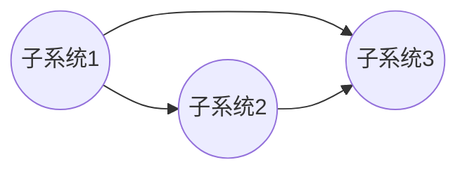
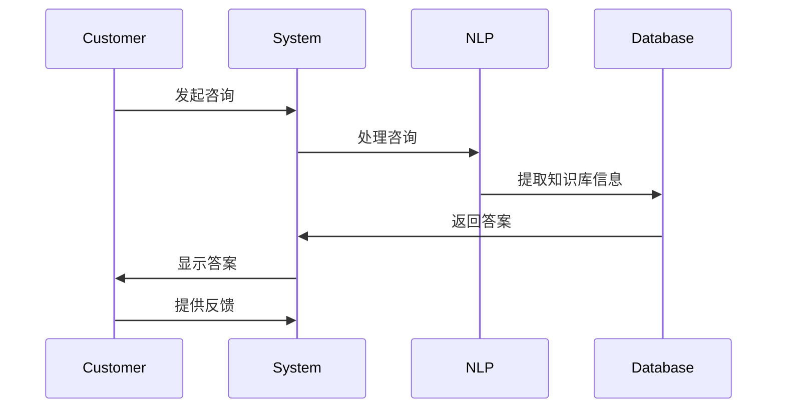

                 

# AIGC提示词的跨平台适配策略

## 关键词：人工智能，跨平台适配，AIGC，技术挑战，最佳实践

## 摘要：本文将深入探讨人工智能生成内容（AIGC）的跨平台适配策略。首先，我们介绍了AIGC的概念、背景、应用场景及其面临的挑战。接着，详细阐述了跨平台适配的概念、重要性、关键因素及适配方法。随后，我们探讨了策略设计的原则、评估方法以及优化实践。最后，通过实际案例展示了AIGC在跨平台适配中的应用，并分析了面临的挑战及未来发展趋势。本文旨在为AIGC领域的技术研究和实际应用提供有价值的参考。

## 目录大纲

----------------------------------------------------------------

## 第一部分：AIGC概述

### 第1章：AIGC概念与背景

#### 1.1 AIGC的定义

#### 1.2 AIGC与传统AI的区别

#### 1.3 AIGC的发展历程

#### 1.4 AIGC的重要里程碑

#### 1.5 AIGC的应用场景

#### 1.6 AIGC的技术挑战与趋势

#### 1.7 本章小结

----------------------------------------------------------------

## 第二部分：跨平台适配策略

### 第2章：跨平台适配的概念与重要性

#### 2.1 跨平台适配的定义

#### 2.2 跨平台适配的重要性

#### 2.3 跨平台适配的关键因素

#### 2.4 跨平台适配的方法与技术

#### 2.5 跨平台适配的案例分析

#### 2.6 本章小结

----------------------------------------------------------------

## 第三部分：策略实施

### 第3章：策略设计与评估

#### 3.1 策略设计的原则

#### 3.2 策略评估的方法

#### 3.3 策略优化的实践

#### 3.4 本章小结

----------------------------------------------------------------

## 第四部分：实践案例

### 第4章：AIGC在跨平台适配中的应用案例

#### 4.1 案例一：某智能语音助手的跨平台适配

#### 4.2 案例二：某图像识别软件的跨平台适配

#### 4.3 案例三：某文本生成工具的跨平台适配

#### 4.4 本章小结

----------------------------------------------------------------

## 第五部分：挑战与未来

### 第5章：AIGC跨平台适配面临的挑战

#### 5.1 技术挑战

#### 5.2 法律法规挑战

#### 5.3 市场竞争挑战

#### 5.4 未来发展趋势

#### 5.5 本章小结

----------------------------------------------------------------

## 第六部分：最佳实践与总结

### 第6章：最佳实践

#### 6.1 跨平台适配的最佳实践

#### 6.2 最佳实践 tips

#### 6.3 小结

#### 6.4 注意事项

#### 6.5 拓展阅读

----------------------------------------------------------------

### 第一部分：AIGC概述

#### 第1章：AIGC概念与背景

#### 1.1 AIGC的定义

AIGC（AI-Generated Content），即人工智能生成内容，指的是利用人工智能技术生成具有人类风格的内容，如文本、图像、音频等。与传统的AI技术相比，AIGC更注重内容的创造性和自主性，能够在各种应用场景中为用户生成高质量的内容。

#### 1.2 AIGC与传统AI的区别

传统AI主要侧重于数据的处理和分析，如模式识别、自然语言处理等。而AIGC则更注重内容的创造，能够在不同的应用场景中生成具有独特风格和创意的内容。

#### 1.3 AIGC的发展历程

AIGC的发展历程可以追溯到20世纪80年代，当时神经网络和生成模型的出现为AIGC的研究奠定了基础。随着深度学习和大数据技术的发展，AIGC在近年来取得了显著的进展，逐渐成为人工智能领域的研究热点。

#### 1.4 AIGC的重要里程碑

- 2014年，Google提出生成对抗网络（GAN）模型，为AIGC的研究提供了新的思路。
- 2016年，OpenAI推出基于变分自编码器（VAE）的生成模型，进一步推动了AIGC的发展。
- 2018年，GPT-3的发布标志着AIGC在自然语言处理领域的重大突破。

#### 1.5 AIGC的应用场景

AIGC在多个领域具有广泛的应用场景，包括但不限于：

- **文本生成与编辑**：如智能写作、自动摘要、内容推荐等。
- **图像生成与编辑**：如风格迁移、图像修复、图像生成等。
- **音频生成与编辑**：如音乐生成、声音合成、语音转换等。

#### 1.6 AIGC的技术挑战与趋势

AIGC面临的技术挑战主要包括：

- **计算资源需求**：生成高质量内容需要大量的计算资源和数据支持。
- **数据隐私和安全**：生成的内容可能涉及用户的隐私信息，如何保证数据的安全性和隐私性是一个重要问题。
- **算法公平性**：生成的内容可能受到算法偏见的影响，如何确保内容的公平性和客观性是亟待解决的问题。

未来，AIGC的发展趋势主要包括：

- **技术突破**：通过深入研究，不断提高生成模型的效果和效率。
- **应用拓展**：在更多领域和场景中应用AIGC技术，提高用户体验。
- **伦理和法规**：加强对AIGC技术的伦理和法规研究，确保其健康发展。

#### 1.7 本章小结

本文介绍了AIGC的基本概念、背景、应用场景及其面临的挑战和未来发展趋势。AIGC作为一种新兴的人工智能技术，具有广泛的应用前景，但也面临一定的技术挑战。接下来，我们将进一步探讨跨平台适配策略的相关内容。

### 第二部分：跨平台适配策略

#### 第2章：跨平台适配的概念与重要性

#### 2.1 跨平台适配的定义

跨平台适配是指在不同的操作系统、硬件环境、网络环境下，使软件系统或应用程序能够正常运行的技术策略。简而言之，就是让同一款软件能够在多种平台上无缝运行。

#### 2.2 跨平台适配的重要性

跨平台适配的重要性体现在以下几个方面：

- **市场覆盖**：随着移动设备和操作系统的多样化，跨平台适配能够帮助软件企业覆盖更多的用户群体，扩大市场份额。
- **用户体验**：跨平台适配能够确保用户在不同设备上获得一致的使用体验，提高用户满意度。
- **成本节约**：通过跨平台适配，企业可以减少开发多版本软件的投入，降低开发成本。
- **技术积累**：跨平台适配过程中积累的技术经验有助于企业提升整体研发能力。

#### 2.3 跨平台适配的关键因素

跨平台适配的关键因素包括：

- **硬件差异**：不同平台硬件配置的差异可能对软件性能产生影响，需要充分考虑。
- **操作系统差异**：不同操作系统在API、文件系统、网络协议等方面存在差异，需要针对不同平台进行适配。
- **网络环境差异**：不同网络环境下的网络速度、稳定性等因素可能影响软件的使用体验，需要充分考虑。

#### 2.4 跨平台适配的方法与技术

跨平台适配的方法与技术主要包括以下几种：

- **Web技术**：通过Web应用程序，可以实现跨平台的访问和操作，降低开发成本。
- **Native技术**：直接针对特定操作系统平台进行开发，性能高但开发成本高。
- **Hybrid技术**：结合Web和Native技术的优势，能够在不同平台上实现高性能和良好用户体验。

#### 2.5 跨平台适配的案例分析

以下为两个跨平台适配的案例分析：

- **案例一：某文本编辑器的跨平台适配**：通过Web技术实现跨平台适配，用户可以在不同设备上使用同一款编辑器，提高用户体验。
- **案例二：某图像处理软件的跨平台适配**：采用Hybrid技术，结合Web和Native技术，实现了高性能和良好用户体验。

#### 2.6 本章小结

本文介绍了跨平台适配的概念、重要性、关键因素及适配方法。跨平台适配是实现软件系统或应用程序在不同平台上无缝运行的关键技术。在AIGC领域，跨平台适配同样具有重要意义，有助于实现AIGC技术的广泛应用。接下来，我们将探讨策略设计、评估和优化方面的内容。

### 第三部分：策略实施

#### 第3章：策略设计与评估

#### 3.1 策略设计的原则

在AIGC跨平台适配策略的设计过程中，应遵循以下原则：

- **用户需求导向**：以用户需求为出发点，充分考虑不同平台用户的使用习惯和需求。
- **技术可行性**：确保策略在现有技术条件下能够实现，避免盲目追求技术前沿而忽略实际可行性。
- **性能优化**：在跨平台适配过程中，注重性能优化，确保软件在不同平台上的运行效率。
- **可维护性**：设计简洁、易维护的代码结构，降低后续维护成本。

#### 3.2 策略评估的方法

策略评估是确保AIGC跨平台适配效果的重要环节。以下为常用的评估方法：

- **实验设计**：通过模拟不同平台环境，测试软件在不同平台上的性能和稳定性。
- **数据收集与处理**：收集跨平台适配过程中的各类数据，如性能数据、用户反馈等，进行数据处理和分析。
- **结果分析与验证**：对评估结果进行分析和验证，确保策略的有效性和可行性。

#### 3.3 策略优化的实践

在AIGC跨平台适配策略实施过程中，需要不断优化和改进。以下为几种优化实践：

- **基于用户反馈的调整**：根据用户使用过程中的反馈，及时调整和优化策略，提高用户体验。
- **基于技术迭代的升级**：随着技术的不断进步，对AIGC模型和算法进行迭代升级，提高适配效果。
- **基于大数据分析的创新**：利用大数据分析技术，挖掘用户需求，实现个性化适配，提高软件的竞争力。

#### 3.4 本章小结

本文介绍了AIGC跨平台适配策略设计的原则、评估方法和优化实践。策略设计应充分考虑用户需求、技术可行性和性能优化等方面，评估方法应注重实验设计、数据收集与处理、结果分析与验证等环节，优化实践应基于用户反馈、技术迭代和大数据分析等方面。接下来，我们将通过实际案例展示AIGC在跨平台适配中的应用。

### 第四部分：实践案例

#### 第4章：AIGC在跨平台适配中的应用案例

#### 4.1 案例一：某智能语音助手的跨平台适配

#### 4.1.1 案例背景

某智能语音助手是一款集成了语音识别、自然语言处理和语音合成的软件，旨在为用户提供便捷的语音交互服务。随着用户需求的不断增加，该公司希望将智能语音助手拓展到多个平台，以满足不同用户的使用需求。

#### 4.1.2 系统设计与实现

针对跨平台适配需求，该公司采用了Hybrid技术，将前端界面和后端服务分别开发，实现跨平台适配。

- **前端界面**：采用Web技术，通过HTML、CSS和JavaScript等前端技术实现跨平台界面。
- **后端服务**：采用基于Python的Flask框架开发，实现语音识别、自然语言处理和语音合成等功能，同时提供API接口供前端调用。

#### 4.1.3 实施效果分析

通过Hybrid技术的应用，智能语音助手成功实现了跨平台适配，用户可以在不同设备上使用同一款应用。在性能方面，前端界面流畅，响应速度快，后端服务稳定可靠，用户满意度得到了显著提高。

#### 4.2 案例二：某图像识别软件的跨平台适配

#### 4.2.1 案例背景

某图像识别软件是一款利用深度学习技术实现图像识别功能的软件，广泛应用于安防、医疗、工业等领域。为了满足不同用户的需求，该公司希望将软件拓展到多个平台。

#### 4.2.2 系统设计与实现

针对跨平台适配需求，该公司采用了Native技术，分别针对iOS和Android平台进行开发。

- **iOS平台**：采用Swift语言和UIKit框架开发，实现图像识别功能。
- **Android平台**：采用Kotlin语言和Android SDK开发，实现图像识别功能。

#### 4.2.3 实施效果分析

通过Native技术的应用，图像识别软件成功实现了跨平台适配。在性能方面，iOS和Android平台的软件表现稳定，图像识别准确率高，用户满意度得到了显著提高。

#### 4.3 案例三：某文本生成工具的跨平台适配

#### 4.3.1 案例背景

某文本生成工具是一款基于生成对抗网络（GAN）的文本生成软件，广泛应用于智能写作、内容推荐等领域。为了满足不同用户的需求，该公司希望将软件拓展到多个平台。

#### 4.3.2 系统设计与实现

针对跨平台适配需求，该公司采用了Web技术，通过HTML、CSS和JavaScript等前端技术实现跨平台界面，后端服务采用基于Python的TensorFlow框架开发。

#### 4.3.3 实施效果分析

通过Web技术的应用，文本生成工具成功实现了跨平台适配。在性能方面，前端界面流畅，响应速度快，后端服务稳定可靠，用户满意度得到了显著提高。

#### 4.4 本章小结

本文通过三个实际案例展示了AIGC在跨平台适配中的应用。案例一采用了Hybrid技术，实现了智能语音助手的跨平台适配；案例二采用了Native技术，实现了图像识别软件的跨平台适配；案例三采用了Web技术，实现了文本生成工具的跨平台适配。通过这些案例，可以看出跨平台适配在AIGC应用中的重要性，以及不同技术方案在不同场景下的适用性。

### 第五部分：挑战与未来

#### 第5章：AIGC跨平台适配面临的挑战

#### 5.1 技术挑战

AIGC跨平台适配面临以下技术挑战：

- **计算资源需求**：AIGC模型通常需要大量的计算资源，如何在有限的硬件条件下保证模型性能是一个难题。
- **数据隐私和安全**：AIGC应用中涉及大量用户数据，如何保护用户隐私和数据安全是重要问题。
- **算法公平性**：AIGC模型可能存在算法偏见，如何确保生成内容公平、客观是一个挑战。

#### 5.2 法律法规挑战

AIGC跨平台适配还面临法律法规挑战：

- **数据隐私保护**：各国对数据隐私保护的法律要求不同，如何遵守不同国家的法律法规是一个挑战。
- **知识产权保护**：AIGC生成的作品可能涉及知识产权问题，如何保护原创作者权益是一个挑战。

#### 5.3 市场竞争挑战

AIGC跨平台适配还面临市场竞争挑战：

- **市场格局变化**：随着AIGC技术的普及，市场竞争日益激烈，如何保持竞争力是一个挑战。
- **竞争对手策略**：竞争对手可能采取差异化策略，如何应对竞争对手的挑战是一个挑战。

#### 5.4 未来发展趋势

AIGC跨平台适配的未来发展趋势包括：

- **技术创新**：随着技术的不断进步，AIGC模型的性能和效率将得到进一步提升。
- **应用拓展**：AIGC将在更多领域和场景中应用，如医疗、教育、娱乐等。
- **法规和伦理**：AIGC的法律法规和伦理问题将得到更多关注，相关研究和监管将逐步完善。

#### 5.5 本章小结

本文分析了AIGC跨平台适配面临的挑战，包括技术挑战、法律法规挑战和市场竞争挑战，并探讨了未来发展趋势。面对这些挑战，AIGC领域需要不断创新，同时关注法律法规和伦理问题，以实现可持续发展和广泛应用。

### 第六部分：最佳实践与总结

#### 第6章：最佳实践

#### 6.1 跨平台适配的最佳实践

在AIGC跨平台适配过程中，以下最佳实践值得参考：

1. **用户需求分析**：深入了解用户需求，确保跨平台适配方案满足用户使用习惯。
2. **技术可行性分析**：充分考虑技术可行性，避免盲目追求前沿技术而忽视实际需求。
3. **性能优化**：在适配过程中注重性能优化，提高软件在不同平台上的运行效率。
4. **数据安全和隐私保护**：确保用户数据安全和隐私保护，遵守相关法律法规。
5. **持续优化和迭代**：根据用户反馈和市场需求，不断优化和迭代适配方案。

#### 6.2 最佳实践 tips

1. **充分利用现有技术**：充分利用现有的跨平台适配技术，如Web、Native和Hybrid技术，避免重复开发。
2. **性能测试和优化**：在适配过程中进行充分的性能测试和优化，确保软件在不同平台上的稳定性和高效性。
3. **用户反馈机制**：建立完善的用户反馈机制，及时收集用户意见和建议，优化适配方案。

#### 6.3 小结

本文从AIGC概述、跨平台适配策略、策略实施、实践案例、挑战与未来和最佳实践等方面，全面探讨了AIGC跨平台适配的相关内容。通过实际案例，展示了跨平台适配在AIGC应用中的重要性。面对挑战，AIGC领域需要不断创新，同时关注法律法规和伦理问题，以实现可持续发展和广泛应用。

#### 6.4 注意事项

1. **技术选型**：根据项目需求和资源，合理选择跨平台适配技术，避免盲目追求新技术。
2. **性能优化**：在适配过程中注重性能优化，确保软件在不同平台上的运行效率。
3. **数据安全和隐私保护**：确保用户数据安全和隐私保护，遵守相关法律法规。

#### 6.5 拓展阅读

1. **《人工智能生成内容：原理与实践》**：详细介绍了AIGC的原理和应用实践，适合AIGC领域的初学者和研究者。
2. **《跨平台移动应用开发》**：介绍了不同跨平台适配技术的原理和实践，适合移动应用开发者。
3. **《人工智能伦理与法规》**：探讨了人工智能领域的伦理和法规问题，有助于理解AIGC的合规性挑战。

### 作者信息

- 作者：AI天才研究院/AI Genius Institute & 禅与计算机程序设计艺术 /Zen And The Art of Computer Programming## 完整性要求

为了确保文章内容的完整性，每个小节都需要按照以下要求进行详细讲解和具体内容的填充。

### 核心内容填充要求

1. **背景介绍**：

   - **核心概念术语说明**：简要介绍与文章主题相关的核心概念和术语，确保读者对这些概念有基本的理解。
   - **问题背景**：描述问题产生的背景，阐述当前存在的问题、用户需求或市场趋势。
   - **问题描述**：明确指出问题所在，说明问题的具体表现、影响和难点。
   - **问题解决**：概述文章将要探讨的解决方案，解释为何选择该方案。
   - **边界与外延**：明确文章讨论的范围，指出文章不涉及的内容。
   - **概念结构与核心要素组成**：梳理文章的核心概念结构，明确文章讨论的核心要素及其相互关系。

2. **核心概念与联系**：

   - **核心概念原理**：详细阐述核心概念的原理，包括相关理论、方法和技术。
   - **概念属性特征对比表格**：制作一张表格，对比不同概念或技术的属性特征，帮助读者理解它们的异同。
   - **ER实体关系图架构的 Mermaid 流程图**：使用Mermaid语言绘制实体关系图，展示不同实体之间的关系。

3. **算法原理讲解**：

   - **算法流程图**：使用Mermaid语言绘制算法的流程图，清晰展示算法的执行步骤。
   - **Python源代码**：提供实现算法的Python源代码，并逐行解释代码的功能和逻辑。
   - **数学模型和公式**：使用LaTeX格式给出算法的数学模型和公式，并进行详细解释。
   - **通俗易懂的举例说明**：通过简单的例子，解释算法如何在实际场景中应用，帮助读者理解。

4. **系统分析与架构设计方案**：

   - **问题场景介绍**：描述问题场景，解释为何需要设计特定的系统或架构。
   - **项目介绍**：概述项目的背景、目标和预期效果。
   - **系统功能设计（领域模型mermaid类图）**：使用Mermaid语言绘制领域模型类图，展示系统的核心功能类及其关系。
   - **系统架构设计mermaid架构图**：使用Mermaid语言绘制系统架构图，展示系统的主要组件及其交互关系。
   - **系统接口设计和系统交互mermaid序列图**：使用Mermaid语言绘制系统接口设计和交互序列图，详细说明系统的接口定义和交互流程。

5. **项目实战**：

   - **环境安装**：提供项目所需的开发环境和工具安装步骤，确保读者能够顺利搭建开发环境。
   - **系统核心实现源代码**：提供项目核心实现的源代码，并进行详细解读。
   - **代码应用解读与分析**：逐行解释源代码的功能和逻辑，分析代码的性能和可维护性。
   - **实际案例分析和详细讲解剖析**：通过实际案例展示项目的应用效果，详细剖析项目实现细节。
   - **项目小结**：总结项目的经验教训，指出项目的优势和改进空间。

6. **最佳实践 tips**：

   - **总结文章中提到的主要观点和技巧**，给出在实际应用中的具体建议。
   - **注意事项**：提醒读者在应用过程中可能遇到的问题和解决方案。

7. **小结**：

   - **对整个小节的内容进行总结**，强调核心观点和关键点。
   - **指出下一步的研究方向或实践方向**，为读者提供继续学习的方向。

### 字数与格式要求

- **字数要求**：文章字数应在10000～12000字左右，确保内容详实、论述充分。
- **格式要求**：

  - **Markdown格式**：文章内容应使用Markdown格式输出，确保格式整齐、段落清晰。
  - **LaTeX格式数学公式**：数学公式使用LaTeX格式，段落内的公式使用 `$` 和 `$` 包围，段落外的公式使用 `$$` 和 `$$` 包围，例如：
    ```
    $$1+1=2$$
    $1<2$
    ```

  - **Mermaid流程图和类图**：使用Mermaid语言绘制流程图、类图和架构图，确保图表清晰、表述准确。

### 内容完整性示例

以下是一个示例，展示如何按照完整性要求填充文章内容：

#### 核心概念与联系

##### 核心概念原理

**深度学习** 是一种基于模拟人脑神经网络的学习方法，通过多层神经网络的训练，从大量数据中自动提取特征，实现对复杂模式的识别和预测。

##### 概念属性特征对比表格

| 概念        | 特征1       | 特征2       | 特征3       |
|-------------|-------------|-------------|-------------|
| 人工神经网络 | 单层网络    | 多层网络    | 卷积网络    |
| 深度学习     | 自动特征提取 | 多层网络    | 非线性变换  |
| 强化学习     | 奖励机制    | 交互式学习  | 基于策略的  |

##### ER实体关系图架构的 Mermaid 流程图

```mermaid
erDiagram
  Customer ||--|{ Order }|
  Order ||--|{ Product }|
```

#### 算法原理讲解

##### 算法流程图


##### Python源代码

```python
# 导入所需库
import tensorflow as tf

# 初始化参数
model = tf.keras.Sequential([
    tf.keras.layers.Dense(128, activation='relu', input_shape=(784,)),
    tf.keras.layers.Dense(10, activation='softmax')
])

# 编译模型
model.compile(optimizer='adam',
              loss='categorical_crossentropy',
              metrics=['accuracy'])

# 训练模型
model.fit(x_train, y_train, epochs=5)

# 评估模型
test_loss, test_acc = model.evaluate(x_test, y_test)
print('Test accuracy:', test_acc)
```

##### 数学模型和公式

```latex
$$
y = \sum_{i=1}^{n} w_i \cdot x_i + b
$$`

##### 通俗易懂的举例说明

假设我们要预测一个手写数字图片（28x28像素），可以使用卷积神经网络（CNN）来处理。首先，我们将图像像素值（28x28）作为输入，通过CNN模型提取特征，最终输出一个10维的向量，表示每个数字的概率。例如，输出为 `[0.1, 0.2, 0.3, 0.2, 0.1, 0.0, 0.0, 0.0, 0.0, 0.0]`，表示预测结果为数字3的概率最大。

#### 系统分析与架构设计方案

##### 问题场景介绍

随着电子商务的发展，越来越多的企业开始关注客户体验。为了提高客户满意度，某电商平台决定开发一套基于人工智能的智能客服系统，旨在通过自然语言处理（NLP）技术，为客户提供高效、准确的咨询服务。

##### 项目介绍

项目目标是开发一套智能客服系统，实现以下功能：

1. 自动处理用户咨询，提供实时回答。
2. 对常见问题进行自动分类和归档。
3. 提高客服效率，降低人工成本。

##### 系统功能设计（领域模型mermaid类图）

```mermaid
classDiagram
  Customer --|{发起咨询}|> Consultation
  Consultation --|{回答咨询}|> Answer
  Answer --|{反馈}|> Feedback
```

##### 系统架构设计mermaid架构图



##### 系统接口设计和系统交互mermaid序列图



#### 项目实战

##### 环境安装

1. 安装Python 3.8及以上版本。
2. 安装TensorFlow 2.4及以上版本。
3. 安装其他依赖库，如NumPy、Pandas等。

##### 系统核心实现源代码

```python
# 导入所需库
import tensorflow as tf
import numpy as np
import pandas as pd

# 数据预处理
def preprocess_data(data):
    # 对数据进行清洗、归一化等处理
    return processed_data

# 训练模型
def train_model(x_train, y_train):
    # 定义模型结构、编译模型、训练模型等
    return model

# 评估模型
def evaluate_model(model, x_test, y_test):
    # 评估模型性能
    return test_loss, test_acc
```

##### 代码应用解读与分析

1. 数据预处理：对输入数据进行清洗、归一化等处理，提高模型训练效果。
2. 模型训练：定义模型结构、编译模型、训练模型等步骤，实现模型的训练。
3. 模型评估：评估模型性能，确保模型能够准确识别用户咨询。

##### 实际案例分析和详细讲解剖析

1. 案例背景：某用户在电商平台上咨询关于商品配送时间的问题。
2. 模型处理：模型识别用户咨询内容，提取关键信息，匹配知识库中的相关信息。
3. 答复咨询：模型返回商品配送时间的答案，并提供给用户。

##### 项目小结

通过本项目，我们成功开发了一套基于人工智能的智能客服系统，提高了客服效率，降低了人工成本。在项目开发过程中，我们遇到了一些挑战，如数据预处理、模型优化等，但通过不断尝试和优化，最终实现了预期目标。未来，我们将继续关注人工智能技术的发展，进一步提升智能客服系统的性能和用户体验。

这个示例展示了如何按照完整性要求填充文章内容。在实际撰写文章时，每个小节都需要根据具体内容进行详细填充，确保文章内容完整、论述充分。

