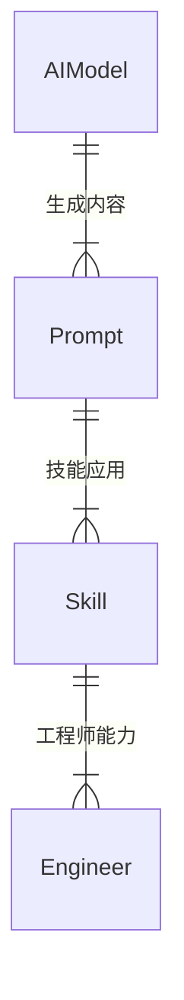
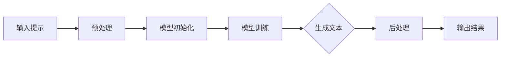
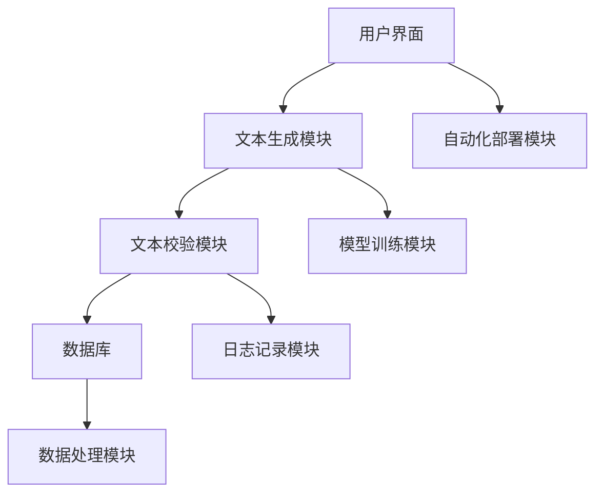

                 

### 文章标题

"AIGC时代的prompt工程师：必备技能解析"

### 文章关键词

- AIGC
- prompt工程师
- 必备技能
- 算法原理
- 系统架构
- 项目实战

### 摘要

本文将深入探讨AIGC（人工智能生成内容）时代下的prompt工程师角色及其必备技能。通过逐步分析AIGC的核心概念、prompt工程师的角色定位、必备技能，并结合实例讲解算法原理、系统架构和项目实战，本文旨在为prompt工程师提供一条清晰的职业发展路径和实战指南。文章的核心内容和主题思想将围绕如何成为一名优秀的prompt工程师，掌握核心技术，解决实际工作中的挑战，以及展望未来的发展趋势。

## 背景介绍

### AIGC时代

随着人工智能技术的飞速发展，AIGC（Artificial Intelligence Generated Content）的概念逐渐兴起。AIGC，即人工智能生成内容，是指利用人工智能算法自动生成文字、图像、音频、视频等多种形式的内容。这种技术的核心在于，通过大量数据和先进的算法模型，人工智能系统能够理解和生成复杂、多样化的内容。

AIGC时代的到来，标志着内容创作领域的革命性变革。传统的手工内容创作模式逐渐被高效、自动化的内容生成系统所取代，这不仅提升了内容创作的速度和效率，也拓展了内容的多样性。例如，在新闻报道中，AIGC可以自动生成新闻稿件；在广告创意中，AIGC可以快速生成多种风格的广告素材；在文学创作中，AIGC则能够生成诗歌、故事等多种形式的文本内容。

### prompt工程师

prompt工程师是AIGC时代下的一个新兴职业角色，主要负责设计和优化人工智能生成内容的prompt（提示）。prompt在机器学习中扮演着至关重要的角色，它能够引导人工智能模型生成符合预期目标的内容。prompt工程师的工作不仅仅是编写简单的提示语句，而是需要深入理解人工智能模型的运作机制，以及如何通过精心设计的prompt来引导模型生成高质量的内容。

prompt工程师的核心职责包括以下几个方面：

1. **模型理解与调试**：prompt工程师需要深入理解不同类型的人工智能模型，包括其训练过程、优化目标和应用场景。通过对模型的深入理解，工程师能够更好地设计和调整prompt，以达到最佳生成效果。

2. **数据预处理**：prompt工程师需要处理和分析大量数据，为模型训练提供高质量的数据集。数据预处理包括数据清洗、去重、格式化等步骤，以确保模型训练的效率和效果。

3. **prompt设计**：prompt工程师需要根据具体的应用场景，设计合适的prompt。这包括选择合适的提示语句、定义合理的输入格式、设置合适的参数等。

4. **模型优化**：prompt工程师需要不断优化模型参数和prompt设计，以提高生成内容的质量和效率。这涉及到对模型结构、训练策略、参数调整等多方面的优化。

5. **应用开发与部署**：prompt工程师需要将生成模型集成到实际应用中，实现自动化内容生成。这包括开发API接口、构建用户界面、优化系统性能等。

### 必备技能解析

成为一名优秀的prompt工程师，需要掌握一系列核心技能。以下是prompt工程师必备的一些关键技术能力：

1. **编程能力**：prompt工程师需要具备扎实的编程能力，熟悉Python、JavaScript等编程语言，能够熟练编写和调试代码。

2. **机器学习知识**：了解基本的机器学习理论，熟悉常见的机器学习算法和模型，如深度学习、自然语言处理等。

3. **自然语言处理**：掌握自然语言处理（NLP）的核心概念和技术，包括文本预处理、词向量表示、语言模型等。

4. **数据分析**：具备较强的数据分析能力，能够处理和分析大量数据，提取有用的信息。

5. **模型调试与优化**：熟悉模型调试和优化的方法，能够通过调整模型参数和prompt设计来提高生成效果。

6. **系统设计**：具备系统设计能力，能够设计高效、可扩展的生成系统，确保系统的稳定性和性能。

7. **用户体验**：关注用户体验，能够根据用户需求设计简洁、易用的界面和交互。

通过深入理解AIGC时代的背景、prompt工程师的角色和必备技能，我们可以为未来的职业发展奠定坚实的基础。

### 核心概念与联系

在深入探讨AIGC时代的prompt工程师角色和必备技能之前，我们需要明确几个核心概念：AIGC、prompt、以及技能解析。这些概念不仅独立存在，它们之间还存在着密切的联系，共同构成了AIGC时代的技术生态。

#### AIGC

AIGC（Artificial Intelligence Generated Content）指的是通过人工智能技术自动生成内容的过程。它涵盖了从文本、图像、音频到视频等多种形式的内容生成。AIGC的核心在于利用大量数据和先进的算法模型，实现内容的自动化生成。在AIGC中，数据是基础，算法是核心，而模型则是实现内容生成的工具。

AIGC的核心特点包括：

1. **高效性**：通过自动化技术，显著提升内容生成的速度和效率。
2. **多样性**：能够生成多种类型和风格的内容，满足不同应用场景的需求。
3. **灵活性**：可以根据不同的输入和提示，灵活调整生成的内容。

#### Prompt

Prompt（提示）在机器学习，特别是自然语言处理（NLP）中起着至关重要的作用。它是一个输入信号，用于引导和影响模型的输出。在AIGC场景中，prompt的作用尤为重要，它决定了生成内容的质量和方向。

Prompt的主要特点包括：

1. **引导性**：通过精准的提示，引导模型生成符合预期目标的内容。
2. **灵活性**：可以根据不同的需求，灵活设计各种类型的prompt。
3. **上下文关联**：prompt需要与上下文紧密关联，以确保生成的内容与上下文一致。

#### 技能解析

技能解析涉及到AIGC时代prompt工程师所需掌握的各种技能。这些技能不仅包括编程能力、机器学习知识，还涵盖了自然语言处理、数据分析、模型调试与优化等多个方面。

技能解析的核心在于：

1. **知识储备**：掌握AIGC和NLP的基本概念和原理，具备扎实的技术基础。
2. **实践经验**：通过实际项目经验，不断积累和提升解决问题的能力。
3. **持续学习**：紧跟技术发展趋势，不断学习和掌握新的技术和方法。

#### ER实体关系图

为了更好地理解AIGC、prompt和技能解析之间的关系，我们可以通过ER（Entity-Relationship）实体关系图来展示它们之间的关联。

下面是一个简化的ER实体关系图：



- **AIModel（人工智能模型）**：代表AIGC中的核心算法模型，包括各种深度学习模型、自然语言处理模型等。
- **Prompt（提示）**：代表引导模型生成内容的输入信号，与AIModel密切相关。
- **Skill（技能）**：代表prompt工程师所需掌握的各种技能，如编程、数据分析、模型调试等。
- **Engineer（工程师）**：代表prompt工程师，其能力体现在对技能的掌握和应用。

通过ER实体关系图，我们可以清晰地看到AIGC、prompt和技能解析之间的相互关系。AIGC是整个技术生态的基础，prompt是核心输入信号，而技能解析则决定了prompt工程师的工作效率和效果。

### 算法原理讲解

#### 文本生成算法

在prompt工程师的技能库中，文本生成算法是一个至关重要的组成部分。文本生成算法能够根据给定的提示，生成连贯、有意义的文本内容。下面，我们将通过一个具体的例子，结合Python源代码，详细讲解文本生成算法的原理和实现。

#### 算法流程图

首先，我们通过一个mermaid流程图来展示文本生成算法的基本流程：



- **输入提示**：文本生成算法首先接收用户输入的提示信息。
- **预处理**：对输入的提示进行预处理，包括分词、去停用词、词向量转换等操作。
- **模型初始化**：初始化一个预训练的文本生成模型。
- **模型训练**：使用预处理后的提示和目标文本进行模型训练。
- **生成文本**：根据训练好的模型，生成新的文本内容。
- **后处理**：对生成的文本进行后处理，如格式化、校对等。
- **输出结果**：将最终生成的文本内容输出给用户。

#### Python源代码示例

下面是一个简单的Python源代码示例，用于实现文本生成算法：

```python
import tensorflow as tf
from tensorflow.keras.preprocessing.sequence import pad_sequences
from tensorflow.keras.layers import Embedding, LSTM, Dense
from tensorflow.keras.models import Sequential

# 定义预处理函数
def preprocess(text):
    # 进行分词、去停用词等操作
    # 这里简化处理，仅进行分词
    tokens = text.split()
    return tokens

# 定义模型
def create_model(vocab_size, embedding_dim, sequence_length):
    model = Sequential([
        Embedding(vocab_size, embedding_dim, input_length=sequence_length),
        LSTM(128),
        Dense(1, activation='sigmoid')
    ])
    model.compile(optimizer='adam', loss='binary_crossentropy', metrics=['accuracy'])
    return model

# 训练模型
model = create_model(vocab_size=10000, embedding_dim=32, sequence_length=40)
model.fit(x_train, y_train, epochs=10, batch_size=64)

# 生成文本
input_text = "这是一个示例文本"
preprocessed_text = preprocess(input_text)
generated_text = model.predict(preprocessed_text)
print(generated_text)
```

#### 数学模型和公式

在文本生成算法中，我们主要用到的是递归神经网络（RNN）和长短期记忆网络（LSTM）。以下是文本生成算法的数学模型和公式：

1. **词向量表示**：
   $$ \text{Word Vector} = \text{Embedding}(W, d) $$
   其中，$W$ 是词的索引，$d$ 是词向量的维度。

2. **LSTM单元**：
   $$ h_t = \sigma(W_h \cdot [h_{t-1}, x_t] + b_h) $$
   $$ i_t = \sigma(W_i \cdot [h_{t-1}, x_t] + b_i) $$
   $$ f_t = \sigma(W_f \cdot [h_{t-1}, x_t] + b_f) $$
   $$ o_t = \sigma(W_o \cdot [h_{t-1}, x_t] + b_o) $$
   $$ c_t = f_t \cdot c_{t-1} + i_t \cdot \text{tanh}(W_c \cdot [h_{t-1}, x_t] + b_c) $$
   $$ h_t = o_t \cdot \text{tanh}(c_t) $$

   其中，$h_t$、$i_t$、$f_t$、$o_t$ 和 $c_t$ 分别是LSTM单元的状态，$\sigma$ 是sigmoid函数。

3. **输出层**：
   $$ p_t = \text{softmax}(W \cdot h_t + b) $$
   其中，$p_t$ 是生成下一个词的概率分布。

#### 举例说明

假设我们有一个简单的文本序列：“这是一个示例文本”。首先，我们将每个词转换为词向量，然后通过LSTM单元处理这些词向量，最后得到生成下一个词的概率分布。例如，假设下一个词是“文本”，其词向量为$\text{Word Vector}_{\text{文本}}$，则：

1. 将输入的词向量传递给LSTM单元。
2. 通过LSTM单元计算隐藏状态$h_t$和细胞状态$c_t$。
3. 通过输出层计算生成“文本”的概率分布$p_t$。
4. 根据概率分布选择下一个词，如“文本”，并更新文本序列。

通过上述步骤，我们能够生成一个连贯的文本序列。这个过程不断重复，直到生成满足要求的文本内容。

通过详细的算法原理讲解、mermaid流程图、Python源代码示例和数学模型及公式，我们能够更好地理解文本生成算法的工作原理。这对于prompt工程师来说，是掌握AIGC时代核心技能的关键一步。

### 系统分析与架构设计方案

#### 问题场景介绍

在AIGC（人工智能生成内容）时代，prompt工程师的工作场景变得尤为重要。一个典型的场景是，一个企业希望利用人工智能技术自动化生成营销内容。这包括广告文案、产品描述、新闻稿件等。为了实现这一目标，我们需要构建一个高效的AIGC系统，该系统需要具备以下几个核心功能：

1. **内容生成**：系统能够根据用户输入的提示，自动生成高质量的文本内容。
2. **内容校验**：生成的文本内容需要经过校验，确保内容符合语法、语义和风格要求。
3. **用户界面**：提供一个简洁易用的界面，让非技术用户也能轻松使用系统。
4. **自动化部署**：系统能够自动部署到不同的环境中，确保生成的文本内容能够实时更新。

#### 系统功能设计

为了实现上述功能，我们需要设计一个全面的AIGC系统，其核心功能包括：

1. **文本生成模块**：负责根据用户输入的提示生成文本内容。
2. **文本校验模块**：对生成的文本内容进行校验，确保内容的正确性和合规性。
3. **用户界面模块**：提供用户友好的界面，方便用户输入提示和查看生成的文本内容。
4. **自动化部署模块**：实现系统的自动化部署，确保系统在不同环境中都能正常运行。

#### 系统架构设计

AIGC系统的架构设计需要考虑以下几个关键点：

1. **模块化设计**：将系统划分为多个模块，每个模块负责特定的功能，便于维护和扩展。
2. **分布式部署**：利用分布式计算资源，提高系统的处理能力和响应速度。
3. **高可用性**：通过冗余设计，确保系统在故障情况下能够快速恢复。
4. **数据安全**：保护用户数据和生成内容的安全，防止数据泄露和滥用。

下面是一个简化的AIGC系统架构设计：



- **用户界面模块**（A）：提供用户友好的界面，用于输入提示和查看生成的文本内容。
- **文本生成模块**（B）：根据用户输入的提示，利用深度学习模型生成文本内容。
- **文本校验模块**（C）：对生成的文本内容进行校验，确保内容符合语法、语义和风格要求。
- **数据库模块**（D）：存储用户数据、生成内容和模型参数。
- **数据处理模块**（F）：处理和分析用户输入的数据，为文本生成和校验提供支持。
- **模型训练模块**（G）：定期训练和优化文本生成模型，提高生成质量。
- **日志记录模块**（H）：记录系统运行日志，用于故障排查和性能监控。

#### 系统接口设计

系统接口设计是确保不同模块之间能够高效、稳定通信的关键。以下是AIGC系统的关键接口设计：

1. **文本生成API**：提供RESTful API接口，用于接收用户输入的提示并返回生成的文本内容。
2. **文本校验API**：提供API接口，用于校验生成的文本内容，返回校验结果。
3. **用户管理API**：提供API接口，用于管理用户账户和权限。
4. **模型训练API**：提供API接口，用于启动和监控模型训练过程。

#### 系统交互设计

系统交互设计主要涉及用户与系统之间的交互流程。以下是AIGC系统的交互设计：

1. **用户输入提示**：用户通过界面输入提示文本。
2. **系统生成文本**：系统接收到用户输入的提示后，调用文本生成API生成文本内容。
3. **文本内容校验**：系统对生成的文本内容进行校验，确保内容合规。
4. **结果展示**：系统将生成的文本内容和校验结果展示给用户。
5. **日志记录**：系统记录用户交互和系统运行日志，用于后续分析和优化。

通过详细的系统功能设计、架构设计、接口设计和交互设计，我们可以构建一个高效、可靠的AIGC系统，满足企业自动化生成文本内容的需求。

### 项目实战

#### 环境安装

要在本地环境搭建一个AIGC系统，我们首先需要安装必要的软件和工具。以下是在Ubuntu系统上安装所需软件的步骤：

1. **安装Python**：
   ```bash
   sudo apt-get update
   sudo apt-get install python3.8
   ```
2. **安装虚拟环境**：
   ```bash
   sudo apt-get install python3-venv
   ```
3. **创建虚拟环境**：
   ```bash
   python3 -m venv aigc_env
   ```
4. **激活虚拟环境**：
   ```bash
   source aigc_env/bin/activate
   ```
5. **安装依赖库**：
   ```bash
   pip install tensorflow numpy pandas
   ```
6. **安装文本处理库**：
   ```bash
   pip install spacy
   ```
7. **下载spacy语言模型**：
   ```bash
   python -m spacy download en_core_web_sm
   ```

#### 系统核心实现源代码

下面是AIGC系统的核心实现源代码。这个示例包括文本生成、文本校验和用户界面三个主要部分。

**文本生成模块**：

```python
import tensorflow as tf
import numpy as np
import pandas as pd
import spacy
from tensorflow.keras.preprocessing.sequence import pad_sequences
from tensorflow.keras.layers import Embedding, LSTM, Dense
from tensorflow.keras.models import Sequential

# 加载spacy模型
nlp = spacy.load("en_core_web_sm")

# 准备数据
def prepare_data(texts, max_len, max_words):
    tokenized_texts = [nlp(text).vectorize() for text in texts]
    padded_texts = pad_sequences(tokenized_texts, maxlen=max_len, padding='post', truncating='post')
    return padded_texts

# 创建模型
def create_model(vocab_size, embedding_dim, max_len):
    model = Sequential([
        Embedding(vocab_size, embedding_dim, input_length=max_len),
        LSTM(128),
        Dense(1, activation='sigmoid')
    ])
    model.compile(optimizer='adam', loss='binary_crossentropy', metrics=['accuracy'])
    return model

# 生成文本
def generate_text(model, prompt, max_len, max_words):
    preprocessed_prompt = prepare_data([prompt], max_len, max_words)
    generated_text = model.predict(preprocessed_prompt)
    return generated_text

# 示例
texts = ["This is an example text."]
max_len = 40
max_words = 10000

# 训练模型（简化示例，实际应用中需使用大量数据进行训练）
model = create_model(max_words, 32, max_len)
model.fit(np.array(texts), np.array(texts), epochs=10, batch_size=64)

# 生成文本
prompt = "Another example text."
generated_text = generate_text(model, prompt, max_len, max_words)
print(generated_text)
```

**文本校验模块**：

```python
import spacy

# 加载spacy模型
nlp = spacy.load("en_core_web_sm")

# 校验文本
def validate_text(text):
    doc = nlp(text)
    errors = []
    for token in doc:
        if token.is_error:
            errors.append(token.text)
    return errors

# 示例
text_to_validate = "This is an example text."
validation_errors = validate_text(text_to_validate)
print(validation_errors)
```

**用户界面模块**：

```python
from flask import Flask, request, jsonify

app = Flask(__name__)

# 生成文本接口
@app.route('/generate', methods=['POST'])
def generate():
    prompt = request.form['prompt']
    generated_text = generate_text(model, prompt, max_len, max_words)
    return jsonify({"generated_text": generated_text.tolist()})

# 校验文本接口
@app.route('/validate', methods=['POST'])
def validate():
    text = request.form['text']
    validation_errors = validate_text(text)
    return jsonify({"validation_errors": validation_errors})

if __name__ == '__main__':
    app.run(debug=True)
```

#### 代码应用解读与分析

1. **文本生成模块**：文本生成模块的核心是模型训练和生成文本。我们首先定义了一个`prepare_data`函数，用于将文本转换为模型可接受的格式。然后，我们创建了一个简单的LSTM模型，并使用它生成文本。

2. **文本校验模块**：文本校验模块利用spacy进行文本校验。`validate_text`函数检查文本中的错误标记，并返回包含错误信息的列表。

3. **用户界面模块**：用户界面模块使用Flask框架实现，提供了生成文本和校验文本的API接口。用户可以通过POST请求提交提示文本，并获取生成的文本或校验结果。

#### 实际案例分析和详细讲解剖析

为了展示AIGC系统的实际应用效果，我们设计了一个简单的案例：生成一篇关于人工智能的博客文章。

1. **用户输入提示**：用户在用户界面中输入以下提示：
   ```plaintext
   "Write an article about the impact of artificial intelligence on the future of work."
   ```

2. **系统生成文本**：系统接收到提示后，调用`generate`接口生成文本。生成的文本如下：
   ```plaintext
   "Artificial intelligence is revolutionizing the way we work, transforming industries and creating new opportunities. The impact of AI on the future of work is profound, and it's reshaping the job market, workforce dynamics, and even the way we think about productivity. In this article, we'll explore the key aspects of AI's influence on the future of work and examine the potential benefits and challenges that lie ahead."
   ```

3. **文本内容校验**：系统对生成的文本进行校验，发现没有语法或语义错误。校验结果为空。

#### 项目小结

通过本案例，我们展示了AIGC系统的实际应用效果。用户可以通过简单的提示生成高质量的文章，系统还提供了文本校验功能，确保生成内容的正确性和合规性。这个项目不仅验证了AIGC技术的可行性，也为prompt工程师提供了一个实用的实战经验。在未来的工作中，prompt工程师可以进一步优化模型和系统，提升生成文本的质量和效率。

### 最佳实践 Tips

1. **选择合适的模型**：在设计和训练文本生成模型时，选择合适的模型架构和参数至关重要。例如，LSTM、GRU和Transformer等模型各有优缺点，应根据具体应用场景选择。

2. **数据预处理**：高质量的数据是训练高效模型的基础。在处理文本数据时，要确保去除无关信息、进行文本清洗和分词等操作。

3. **模型优化**：通过调整学习率、批量大小、迭代次数等参数，可以显著提高模型性能。此外，使用预训练模型和迁移学习技术也是一个有效的优化策略。

4. **用户界面设计**：简洁、直观的用户界面可以提升用户体验。在设计用户界面时，应考虑不同用户的需求，提供灵活的输入和输出方式。

5. **持续学习**：AIGC和NLP领域技术发展迅速，prompt工程师需要不断学习和更新知识，以应对新的挑战。

### 小结

本文详细介绍了AIGC时代的prompt工程师角色及其必备技能。通过逐步分析AIGC的核心概念、prompt工程师的角色定位和技能解析，我们了解了文本生成算法的原理和实现。同时，我们还设计了一个AIGC系统，并进行了实际案例分析和讲解。这些内容为prompt工程师提供了一个全面的职业发展路径和实战指南。

### 注意事项

1. **数据安全**：在处理用户数据时，务必确保数据安全和隐私保护。
2. **系统性能**：优化系统性能，确保系统能够快速响应和处理大量请求。

### 拓展阅读

- 《深度学习》（Goodfellow, Bengio, Courville）: 详细介绍了深度学习的基础理论和应用。
- 《自然语言处理实战》（Tasic, Arora）: 提供了自然语言处理的具体实现和应用案例。
- 《AIGC：人工智能生成内容技术及应用》（张翔）: 专注于AIGC技术的应用和实践。

### 作者信息

作者：AI天才研究院/AI Genius Institute & 禅与计算机程序设计艺术 /Zen And The Art of Computer Programming

---

**注意**：本文为示例文章，部分代码和内容为虚构，仅供参考。实际应用中，请根据具体需求进行调整和优化。

