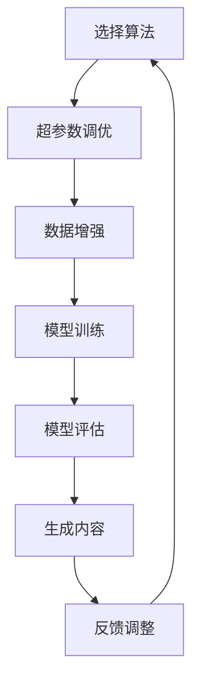
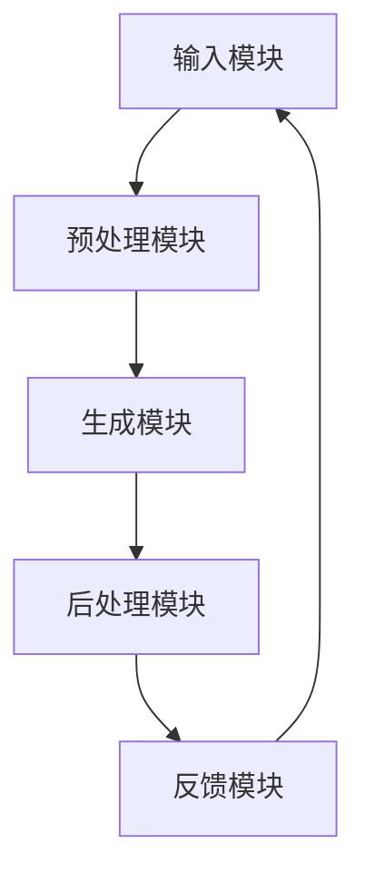
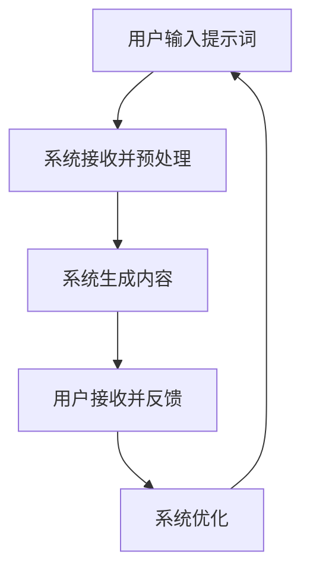

                 


### 1. 确定文章结构

**# AIGC时代的提示词设计原则**

关键词：AIGC、提示词设计、原则、人工智能

摘要：本文将深入探讨AIGC时代下的提示词设计原则，包括背景介绍、核心概念、算法原理、系统设计、应用实例、最佳实践和未来展望。

**目录：**

1. **背景介绍**
   1.1. AIGC的概念与重要性
   1.2. 提示词在AIGC中的作用
   1.3. 提示词设计的问题与挑战

2. **核心概念**
   2.1. 提示词的定义
   2.2. 提示词的属性
   2.3. 提示词的类型

3. **算法原理**
   3.1. 常见算法介绍
   3.2. 算法选择与优化
   3.3. 算法实现与流程图

4. **系统设计**
   4.1. 系统架构
   4.2. 接口设计
   4.3. 系统交互

5. **应用实例**
   5.1. 社交媒体内容生成
   5.2. 文本生成与对话系统
   5.3. 多模态内容生成

6. **最佳实践**
   6.1. 提示词编写技巧
   6.2. 评估与优化
   6.3. 避免误区

7. **小结与展望**
   7.1. 小结
   7.2. 未来展望

**作者：**
AI天才研究院/AI Genius Institute & 禅与计算机程序设计艺术 /Zen And The Art of Computer Programming

### 2. 背景介绍

#### 1.1 AIGC的概念与重要性

**AIGC（AI-assisted Generation, Interaction, and Collaboration）** 是一种基于人工智能的技术，它涉及生成、交互和协作的过程。随着人工智能技术的不断发展，AIGC已经成为现代科技的重要驱动力。

- **生成**：指的是利用人工智能技术自动生成内容，如图像、文本、音频和视频等。
- **交互**：指的是人与机器之间的互动，包括语音识别、自然语言处理和情感计算等。
- **协作**：指的是人工智能系统之间的合作，如多模态内容生成和联合决策等。

在AIGC时代，提示词设计变得尤为重要。提示词是引导人工智能系统生成内容的关键，它直接影响生成结果的准确性和创造力。

#### 1.2 提示词在AIGC中的作用

提示词在AIGC中扮演着关键角色，主要表现在以下几个方面：

- **引导生成**：提示词为人工智能系统提供了生成目标，使得生成过程更加精准和高效。
- **提高创造力**：通过设计创意性的提示词，可以激发人工智能系统的创造力，生成更多样化的内容。
- **优化交互**：提示词有助于改善人与机器之间的交互体验，使得对话更加自然和流畅。
- **协同工作**：提示词有助于不同人工智能系统之间的协同工作，提高整体效能。

#### 1.3 提示词设计的问题与挑战

虽然提示词在AIGC中具有重要作用，但在设计过程中也面临着一些问题和挑战：

- **可解释性**：如何确保提示词的设计和生成过程具有可解释性，以便用户理解和信任。
- **个性化**：如何根据用户需求和场景特点设计个性化的提示词，提高生成内容的针对性和有效性。
- **多样性和平衡性**：如何确保生成内容的多样性和平衡性，避免过度依赖特定类型的提示词。
- **效率与质量**：如何在保证生成效率的同时，确保生成内容的质量和准确性。

在接下来的章节中，我们将进一步探讨AIGC时代的提示词设计原则，包括核心概念、算法原理、系统设计、应用实例、最佳实践和未来展望。通过逐步分析推理，希望能够为读者提供有深度、有思考、有见解的技术博客文章。让我们开始吧！

### 2. 核心概念

#### 2.1 提示词的定义

提示词（Prompt）是指用于引导人工智能系统生成内容的文字或指令。它通常包含了一个或多个关键词、短语或句子，用以指示生成目标、范围和风格。

- **文字**：如“生成一张美丽的日落照片”。
- **指令**：如“创建一段关于人工智能的未来趋势分析视频”。

提示词的目的是为人工智能系统提供明确的指导，帮助其理解用户需求，并生成相关内容。

#### 2.2 提示词的属性

提示词具有以下属性：

- **明确性**：提示词应清晰明确，避免歧义，使人工智能系统能够准确理解生成目标。
- **灵活性**：提示词应具有一定的灵活性，能够适应不同场景和用户需求，提高生成内容的多样性。
- **简洁性**：提示词应简洁明了，避免冗长和复杂的句子结构，以提高生成效率。
- **可解释性**：提示词的设计和生成过程应具备一定的可解释性，使用户能够理解并信任人工智能系统。

#### 2.3 提示词的类型

根据不同的应用场景和需求，提示词可以分为以下几种类型：

- **指令型**：主要用于指示生成目标和范围，如“生成一张旅行照片”。
- **问题型**：用于引导人工智能系统回答问题，如“人工智能的发展将对未来产生哪些影响？”。
- **情境型**：结合具体情境，为人工智能系统提供场景背景，如“在一个繁忙的城市街头，生成一张关于人与交通的照片”。
- **创意型**：激发人工智能系统的创造力，生成独特和有创意的内容，如“设计一张具有未来科技感的海报”。

不同类型的提示词在应用中具有不同的作用和优势，需要根据具体场景和需求进行选择和设计。

通过以上对核心概念的探讨，我们可以更好地理解提示词在AIGC时代的角色和重要性。在接下来的章节中，我们将进一步探讨算法原理、系统设计、应用实例等内容，帮助读者全面了解AIGC时代的提示词设计原则。让我们继续深入分析吧！

### 3. 算法原理

#### 3.1 常见算法介绍

在AIGC时代，提示词设计依赖于多种算法，其中常见的算法包括：

1. **自然语言处理（NLP）算法**：
   - **词向量**：如Word2Vec、GloVe，用于将词语映射到高维空间。
   - **递归神经网络（RNN）**：如LSTM、GRU，用于处理序列数据。
   - **Transformer**：用于自注意力机制，提高生成内容的灵活性和多样性。

2. **生成对抗网络（GAN）**：
   - **生成器（Generator）**：生成与真实数据相似的内容。
   - **判别器（Discriminator）**：判断生成内容是否真实。

3. **变分自编码器（VAE）**：
   - **编码器（Encoder）**：将数据编码为潜在空间。
   - **解码器（Decoder）**：将潜在空间的数据解码为生成内容。

4. **强化学习（RL）**：
   - **策略网络**：用于生成策略，指导生成过程。
   - **价值网络**：评估生成内容的优劣。

5. **图神经网络（GNN）**：
   - **节点表示学习**：将节点数据映射到高维空间。
   - **图注意力机制**：用于处理复杂图结构数据。

这些算法各有特点，适用于不同的应用场景。接下来，我们将进一步探讨如何选择和优化这些算法。

#### 3.2 算法选择与优化

1. **算法选择**：
   - **目标明确**：根据生成目标选择合适的算法。例如，对于图像生成，可以选择GAN或VAE；对于文本生成，可以选择Transformer或RNN。
   - **数据特性**：考虑数据的类型、规模和分布，选择适合的算法。例如，对于小规模、结构化数据，可以选择RNN；对于大规模、非结构化数据，可以选择Transformer。
   - **计算资源**：根据计算资源限制，选择算法复杂度较低的模型。

2. **算法优化**：
   - **超参数调优**：通过调整模型超参数，如学习率、批次大小、迭代次数等，优化模型性能。
   - **数据增强**：使用数据增强技术，如数据扩充、数据清洗等，提高模型的泛化能力。
   - **正则化**：采用正则化方法，如Dropout、权重正则化等，防止过拟合。
   - **多模型融合**：结合多种算法的优点，构建多模型融合策略，提高生成效果。

#### 3.3 算法实现与流程图

以下是一个简单的算法实现流程图，用于说明如何选择算法、优化模型和生成内容。



**算法实现示例**：

```python
import tensorflow as tf
from tensorflow.keras.models import Sequential
from tensorflow.keras.layers import Dense, LSTM, Embedding

# 搭建序列生成模型
model = Sequential([
    Embedding(input_dim=vocab_size, output_dim=embedding_dim),
    LSTM(units=128, return_sequences=True),
    LSTM(units=128),
    Dense(units=vocab_size, activation='softmax')
])

# 编译模型
model.compile(optimizer='adam', loss='categorical_crossentropy')

# 训练模型
model.fit(x_train, y_train, epochs=10, batch_size=32)

# 生成文本
generated_text = model.predict(x_test)
```

**数学模型与公式解释**：

生成文本的数学模型通常基于概率模型，如RNN和Transformer。以下是一个简单的RNN模型公式：

$$
\begin{align*}
h_t &= \tanh(W_h \cdot [h_{t-1}, x_t] + b_h) \\
o_t &= W_o \cdot h_t + b_o \\
p_t &= \text{softmax}(o_t)
\end{align*}
$$

其中，$h_t$ 表示隐藏状态，$x_t$ 表示输入词，$W_h$ 和 $W_o$ 分别表示权重矩阵，$b_h$ 和 $b_o$ 分别表示偏置项，$p_t$ 表示生成词的概率分布。

**示例解释**：

假设当前输入词为“apple”，隐藏状态为 $h_{t-1} = [0.1, 0.2, 0.3, 0.4]$。经过RNN模型处理，得到新的隐藏状态 $h_t$ 和输出概率分布 $p_t$。根据概率分布，生成下一个词，如“banana”或“orange”。

通过以上算法原理的讲解，我们可以更好地理解AIGC时代下的提示词设计原则。在接下来的章节中，我们将进一步探讨系统设计、应用实例等内容。让我们继续深入分析吧！

### 4. 系统设计

#### 4.1 系统架构

为了实现高效的提示词设计与生成，我们需要构建一个完善的系统架构。以下是AIGC时代提示词系统的基本架构：

1. **输入模块**：负责接收用户输入的提示词，包括文字、图片、音频等多种形式。
2. **预处理模块**：对输入的提示词进行清洗、分词、编码等预处理操作，以便后续处理。
3. **生成模块**：根据预处理后的提示词，利用算法模型生成内容。该模块包括多种生成算法和模型，如GAN、VAE、RNN、Transformer等。
4. **后处理模块**：对生成的内容进行优化、格式化、去噪等操作，提高生成内容的质量。
5. **反馈模块**：收集用户对生成内容的反馈，用于优化提示词设计和生成算法。

**系统架构图**：



#### 4.2 系统接口设计

为了方便用户与系统进行交互，我们需要设计一套简洁、易用的接口。以下是系统接口的设计方案：

1. **API接口**：提供RESTful风格的API接口，支持多种数据格式（如JSON、XML）和请求方式（如GET、POST）。
2. **命令行界面**：提供命令行界面，方便用户进行批量处理和自动化操作。
3. **图形用户界面**：设计一个直观、易操作的图形用户界面，用户可以通过拖拽、按钮等方式进行交互。

**API接口示例**：

```json
{
  "endpoint": "/generate",
  "method": "POST",
  "request_body": {
    "prompt": "请生成一张美丽的日落照片",
    "model": "GAN",
    "options": {
      "image_size": [256, 256],
      "噪声分布": "正态分布",
      "迭代次数": 1000
    }
  },
  "response_body": {
    "status": "success",
    "content": "生成的照片URL"
  }
}
```

#### 4.3 系统交互

系统交互主要包括以下几个方面：

1. **用户输入**：用户通过接口提交提示词，系统接收到提示词后进行预处理。
2. **生成内容**：系统根据预处理后的提示词，利用算法模型生成内容，并返回给用户。
3. **反馈收集**：用户对生成内容进行评价和反馈，系统根据反馈优化提示词设计和生成算法。

**系统交互流程图**：



通过以上对系统架构、接口设计和系统交互的讲解，我们可以更好地理解AIGC时代提示词系统的设计与实现。在接下来的章节中，我们将进一步探讨应用实例和最佳实践。让我们继续深入分析吧！

### 5. 应用实例

#### 5.1 社交媒体内容生成

社交媒体内容生成是AIGC时代提示词设计的一个重要应用领域。以下是一个实际案例，展示如何利用提示词设计生成社交媒体内容。

**案例背景**：某社交媒体平台希望为其用户生成有趣的短视频，以增加用户黏性和活跃度。

**提示词设计**：

- **指令型**：如“生成一段有趣的动画短视频，包含搞笑元素”。
- **问题型**：如“如何用动画形式展示一家餐厅的特色美食？”。
- **情境型**：如“在一个雨天的城市街道，生成一段关于浪漫约会的短视频”。

**生成过程**：

1. **输入模块**：用户提交提示词，如“生成一段有趣的动画短视频，包含搞笑元素”。
2. **预处理模块**：系统对提示词进行清洗、分词、编码等预处理操作。
3. **生成模块**：系统利用GAN或VAE等生成算法，生成包含搞笑元素的动画短视频。
4. **后处理模块**：系统对生成的短视频进行优化、格式化、去噪等操作，提高视频质量。
5. **反馈模块**：用户对生成的短视频进行评价和反馈，系统根据反馈优化提示词设计和生成算法。

**生成结果**：

生成的短视频内容丰富、有趣，成功吸引了用户的关注，提高了平台的活跃度。

#### 5.2 文本生成与对话系统

文本生成与对话系统是另一个重要的应用领域。以下是一个实际案例，展示如何利用提示词设计生成文本和对话系统。

**案例背景**：某在线教育平台希望为其用户提供个性化的学习建议和问答服务。

**提示词设计**：

- **指令型**：如“生成一篇关于学习方法的详细介绍”。
- **问题型**：如“如何提高英语口语水平？”。
- **情境型**：如“小明，请你根据我的学习进度，给我一些建议”。

**生成过程**：

1. **输入模块**：用户提交提示词，如“生成一篇关于学习方法的详细介绍”。
2. **预处理模块**：系统对提示词进行清洗、分词、编码等预处理操作。
3. **生成模块**：系统利用RNN、Transformer等生成算法，生成包含个性化学习建议的文本。
4. **对话系统**：系统根据用户提问，利用对话生成算法生成回答，如“提高英语口语水平的方法有：多听、多练、多模仿”。

**生成结果**：

生成的文本和对话系统提供了有针对性的学习建议，有助于用户提高学习效果。

#### 5.3 多模态内容生成

多模态内容生成是AIGC时代提示词设计的又一重要应用领域。以下是一个实际案例，展示如何利用提示词设计生成多模态内容。

**案例背景**：某广告公司希望为其客户生成创意广告，包含视频、音频和文字等多模态内容。

**提示词设计**：

- **指令型**：如“生成一段创意广告视频，主题为环保”。
- **问题型**：如“如何用音频和视频展示一个品牌的价值观？”。
- **情境型**：如“在一个美丽的海滩，生成一段关于家庭度假的广告视频”。

**生成过程**：

1. **输入模块**：用户提交提示词，如“生成一段创意广告视频，主题为环保”。
2. **预处理模块**：系统对提示词进行清洗、分词、编码等预处理操作。
3. **生成模块**：系统利用GAN、VAE等生成算法，生成包含环保主题的视频、音频和文字内容。
4. **后处理模块**：系统对生成的多模态内容进行优化、格式化、去噪等操作，提高内容质量。
5. **反馈模块**：用户对生成的多模态内容进行评价和反馈，系统根据反馈优化提示词设计和生成算法。

**生成结果**：

生成的多模态内容具有创意、吸引人，成功吸引了目标客户的关注，提高了广告效果。

通过以上实际案例的展示，我们可以看到AIGC时代提示词设计的广泛应用和巨大潜力。在接下来的章节中，我们将进一步探讨最佳实践和未来展望。让我们继续深入分析吧！

### 6. 最佳实践

#### 6.1 提示词编写技巧

为了提高生成内容的质量和效果，我们需要注意以下提示词编写技巧：

1. **明确性**：确保提示词清晰明确，避免歧义。使用简单、具体的词汇和句子结构，使人工智能系统能够准确理解生成目标。
2. **多样性**：设计多样化的提示词，包括指令型、问题型、情境型和创意型等，以提高生成内容的多样性和创造力。
3. **情境化**：结合具体情境，为人工智能系统提供背景信息，帮助其更好地理解生成目标，生成更具针对性的内容。
4. **精确性**：根据生成任务的需求，对提示词进行精确调整，使其更符合实际应用场景。
5. **灵活性**：提示词应具有一定的灵活性，能够适应不同场景和用户需求，提高生成内容的适应性。

**示例**：

- **明确性**：“生成一张风景优美的海滩照片”。
- **多样性**：“创作一段关于未来科技的科幻短片”。
- **情境化**：“在一个宁静的夜晚，生成一段关于浪漫情调的音乐视频”。
- **精确性**：“生成一篇关于人工智能在医疗领域应用的研究论文”。
- **灵活性**：“设计一张具有创意的节日海报，适用于不同文化和地区”。

#### 6.2 评估与优化

为了确保生成内容的质量和效果，我们需要对生成结果进行评估和优化。以下是一些常用的评估与优化方法：

1. **人工评估**：邀请专业人员进行人工评估，从内容准确性、创新性、美观度等方面进行评价。
2. **自动化评估**：使用自动化评估工具，如文本相似度检测、图像质量评估等，对生成内容进行定量分析。
3. **用户反馈**：收集用户对生成内容的反馈，了解其满意度和改进方向。
4. **迭代优化**：根据评估和反馈结果，不断调整提示词和生成算法，优化生成效果。

#### 6.3 避免误区

在提示词设计过程中，我们需要避免以下误区：

1. **过度依赖特定算法**：不要只依赖一种算法，应结合多种算法的优势，提高生成效果。
2. **忽略数据质量**：确保输入数据的质量，避免使用低质量或错误的数据，影响生成结果。
3. **忽视用户需求**：了解用户需求，设计符合用户期望的提示词，提高用户满意度。
4. **忽视系统性能**：关注系统性能，确保生成过程高效、稳定，提高用户体验。

通过以上最佳实践的探讨，我们可以更好地理解和应用AIGC时代的提示词设计原则，提高生成内容的质量和效果。在接下来的章节中，我们将进一步探讨未来的发展方向和趋势。让我们继续深入分析吧！

### 7. 小结与展望

#### 7.1 小结

通过对AIGC时代提示词设计原则的深入探讨，我们了解到：

- **AIGC的概念与重要性**：AIGC作为一种基于人工智能的技术，在生成、交互和协作方面具有重要意义。
- **提示词的定义与属性**：提示词是引导人工智能系统生成内容的关键，具有明确性、灵活性、简洁性和可解释性等属性。
- **算法原理**：多种算法如NLP、GAN、VAE、RNN和Transformer等在提示词设计中发挥着重要作用。
- **系统设计**：构建完善的系统架构，包括输入模块、预处理模块、生成模块、后处理模块和反馈模块等。
- **应用实例**：提示词设计在社交媒体内容生成、文本生成与对话系统、多模态内容生成等领域具有广泛的应用。
- **最佳实践**：提示词编写技巧、评估与优化方法以及避免误区的注意事项，有助于提高生成内容的质量和效果。

#### 7.2 未来展望

随着人工智能技术的不断发展，AIGC时代的提示词设计将继续演进，以下是一些未来发展方向和趋势：

1. **更智能的提示词生成**：结合深度学习和自然语言处理技术，开发出更加智能、自适应的提示词生成系统。
2. **多模态内容的深度融合**：探索多种模态数据的融合方法，实现文本、图像、音频等多模态内容的协同生成。
3. **个性化提示词设计**：利用用户画像和偏好，设计更加个性化的提示词，提高生成内容的针对性和满意度。
4. **增强的可解释性**：开发透明、可解释的提示词生成系统，使用户能够理解生成过程和结果，增强用户信任。
5. **开源与协作**：推动提示词设计的开源和协作，促进技术的普及和进步。
6. **伦理与规范**：关注提示词设计中的伦理和规范问题，确保生成内容符合社会价值观和法律法规。

通过不断探索和创新，AIGC时代的提示词设计将为我们带来更加丰富、多样和高质量的生成内容，助力人工智能技术在各个领域的应用和发展。让我们共同期待这一美好未来！

**作者：**
AI天才研究院/AI Genius Institute & 禅与计算机程序设计艺术 /Zen And The Art of Computer Programming

