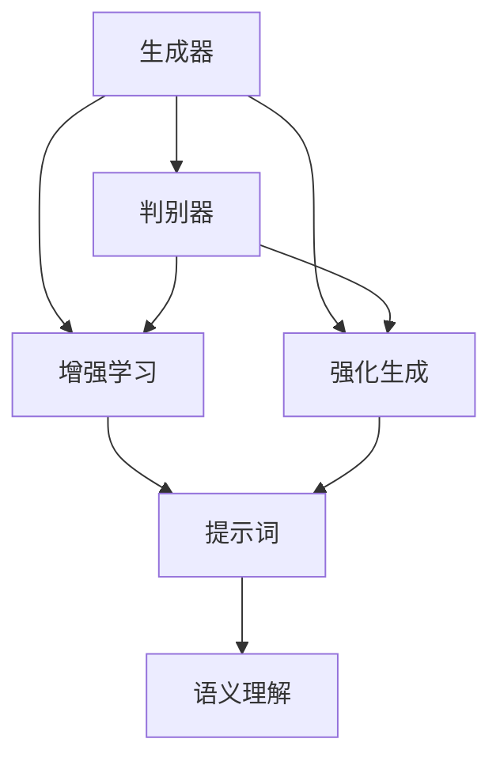
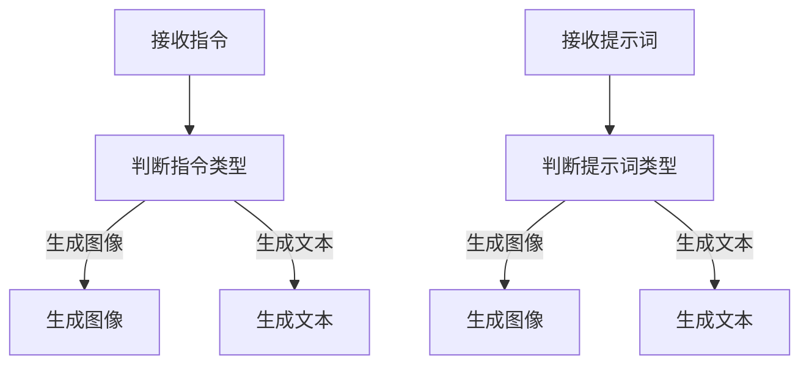

                 


### AIGC时代的提示词革命：从简单指令到复杂推理

#### 关键词：AIGC，提示词，人工智能，简单指令，复杂推理

#### 摘要：
本文深入探讨了AIGC（自适应生成对抗网络）时代的提示词革命，从简单指令到复杂推理的演变过程。通过逐步分析AIGC的技术框架、核心概念、算法原理、数学模型、系统架构设计和项目实战，本文揭示了AIGC技术在现代AI应用中的重要性和发展趋势。此外，还提供了最佳实践和注意事项，为读者在AIGC领域的研究和应用提供了宝贵的指导。

## 第一部分：AIGC时代概述

### 第1章：AIGC时代背景与挑战

#### 1.1 AIGC的概念与历史发展

AIGC（自适应生成对抗网络）是一种基于生成对抗网络（GAN）的深度学习模型，通过对抗性训练实现数据的自适应生成。自GAN模型提出以来，AIGC在图像处理、自然语言处理和语音合成等领域取得了显著成果。AIGC的发展历程可以分为以下几个阶段：

1. **早期研究（2012-2014年）**：GAN模型由Ian Goodfellow等研究者提出，并在图像生成任务上取得了突破性进展。

2. **发展阶段（2014-2016年）**：研究人员开始探索GAN在自然语言处理和语音合成中的应用，如GAN生成文本和语音。

3. **成熟阶段（2016-2019年）**：AIGC技术逐渐成熟，应用于各种复杂任务，如图像生成、语音合成、视频生成等。

4. **近期发展（2019年至今）**：随着计算能力和算法优化，AIGC在生成任务中取得了更高质量的结果，应用领域不断扩展。

#### 1.2 AIGC的技术框架与核心要素

AIGC的技术框架主要包括生成器（Generator）、判别器（Discriminator）和损失函数。生成器负责生成数据，判别器则负责区分真实数据和生成数据。AIGC的训练过程是一个对抗性训练过程，生成器和判别器相互竞争，以达到生成高质量数据的目标。

AIGC的核心要素包括：

1. **自适应生成**：生成器通过不断学习和调整，生成越来越接近真实数据的数据。

2. **多样化生成**：AIGC能够生成各种类型的多样数据，如图像、文本、语音等。

3. **数据增强**：AIGC能够通过对原始数据进行变换和扩展，提高模型的泛化能力。

#### 1.3 AIGC时代的应用场景

AIGC在各个领域都有广泛的应用，以下是一些典型的应用场景：

1. **图像生成**：AIGC能够生成高质量、多样化的图像，应用于图像编辑、图像修复、图像生成对抗攻击等。

2. **文本生成**：AIGC能够生成高质量、多样化的文本，应用于自然语言生成、对话系统、文本生成对抗攻击等。

3. **语音合成**：AIGC能够生成高质量、自然的语音，应用于语音合成、语音识别、语音生成对抗攻击等。

4. **视频生成**：AIGC能够生成高质量、连贯的视频，应用于视频编辑、视频生成对抗攻击、虚拟现实等。

### 第2章：提示词革命

#### 2.1 提示词的定义与重要性

提示词（Prompt）是AIGC技术中的一个关键概念，用于指导生成器生成特定类型的数据。提示词可以是文本、图像、音频等多种形式，其核心作用是引导生成器按照指定方向生成数据。

提示词的重要性体现在以下几个方面：

1. **指导生成**：提示词能够明确地指导生成器生成特定类型的数据，如文本、图像等。

2. **提高效率**：通过使用提示词，生成器能够更快速地生成所需的数据，提高训练和推理的效率。

3. **增强可控性**：提示词能够增强生成器对生成数据的控制能力，使生成的数据更加符合预期。

#### 2.2 从简单指令到复杂推理的演变

AIGC技术的发展历程，也是一个从简单指令到复杂推理的演变过程。在早期阶段，AIGC主要依赖于简单的指令和规则，如生成特定类型的图像或文本。随着技术的发展，AIGC逐渐具备了复杂推理能力，能够根据输入的提示词生成更加复杂和多样化的数据。

这个演变过程可以分为以下几个阶段：

1. **简单指令阶段**：AIGC仅能根据简单的指令生成特定类型的数据，如生成一张人脸图像。

2. **规则推理阶段**：AIGC引入规则和条件，根据输入的提示词生成更复杂的数据，如根据描述生成一张风景图像。

3. **复杂推理阶段**：AIGC具备了复杂推理能力，能够根据输入的提示词生成高度个性化的数据，如根据用户需求生成一篇个性化的文章。

#### 2.3 提示词的优化与效果评估

为了提高AIGC生成数据的质量和效果，提示词的优化和效果评估至关重要。以下是一些常见的优化策略和评估指标：

1. **优化策略**：
   - **多样性**：增加提示词的多样性，生成不同类型的数据。
   - **一致性**：确保生成的数据与提示词的一致性，避免生成错误的数据。
   - **可控性**：提高生成器的控制能力，确保生成的数据符合预期。

2. **评估指标**：
   - **质量指标**：如图像的PSNR（峰值信噪比）、文本的BLEU（双语评估指标）等。
   - **效率指标**：如生成时间、训练时间等。
   - **多样性指标**：如生成数据的种类、风格等。

通过不断优化提示词和评估生成数据的质量和效果，AIGC技术将能够更好地满足各类应用需求。

## 第二部分：核心概念与联系

### 第3章：AIGC的核心概念与原理

#### 3.1 自适应生成对抗网络（ADGAN）

自适应生成对抗网络（ADGAN）是AIGC技术的核心，由生成器（Generator）和判别器（Discriminator）组成。生成器负责生成数据，判别器则负责判断生成数据是否真实。ADGAN的训练过程是一个对抗性训练过程，生成器和判别器相互竞争，以达到生成高质量数据的目标。

#### 3.2 增强学习与强化生成

增强学习是一种通过不断试错来优化行为的方法。在AIGC中，增强学习被用于优化生成器的参数，使其能够生成更高质量的数据。强化生成是指通过增强学习技术来改进生成器的生成能力。

#### 3.3 提示词与语义理解

提示词是AIGC技术中的关键概念，用于指导生成器生成特定类型的数据。语义理解是指对输入的提示词进行语义分析和解释，以确定生成器的生成方向。通过语义理解，AIGC能够更好地理解用户需求，生成更符合预期的数据。

### 第4章：概念属性特征对比与联系

#### 4.1 核心概念的属性特征对比

表1：AIGC技术核心概念属性特征对比

| 概念     | 属性特征                                     |
| -------- | ------------------------------------------ |
| 生成器   | 负责生成数据，对抗性训练                   |
| 判别器   | 负责判断生成数据是否真实，对抗性训练       |
| 增强学习 | 通过不断试错来优化行为                     |
| 强化生成 | 通过增强学习来改进生成器的生成能力         |
| 提示词   | 用于指导生成器生成特定类型的数据           |
| 语义理解 | 对输入的提示词进行语义分析和解释           |

#### 4.2 概念间的联系与相互作用

图1：AIGC技术核心概念联系与相互作用



通过对比核心概念的属性特征和联系，我们可以更好地理解AIGC技术的原理和应用。这些核心概念相互关联，共同构成了AIGC技术的核心框架。

## 第三部分：算法原理讲解

### 第5章：从简单指令到复杂推理的算法原理

#### 5.1 简单指令处理算法

简单指令处理算法是AIGC技术的起点，用于处理简单的输入指令并生成相应的数据。以下是一个简单的简单指令处理算法：

```python
def simple_instruct_generator(instruction):
    # 根据输入指令生成数据
    if instruction == "generate_image":
        image = generate_image()
        return image
    elif instruction == "generate_text":
        text = generate_text()
        return text
    else:
        raise ValueError("Invalid instruction")

def generate_image():
    # 生成一张人脸图像
    face_image = face_generator.generate()
    return face_image

def generate_text():
    # 生成一段文本
    text = text_generator.generate()
    return text
```

#### 5.2 复杂推理算法

随着AIGC技术的发展，简单指令处理算法逐渐演变成复杂推理算法。复杂推理算法能够根据输入的提示词生成更加复杂和多样化的数据。以下是一个简单的复杂推理算法：

```python
def complex_reasoning_generator(prompt):
    # 根据输入提示词生成数据
    if "image" in prompt:
        image = image_generator.generate(prompt)
        return image
    elif "text" in prompt:
        text = text_generator.generate(prompt)
        return text
    else:
        raise ValueError("Invalid prompt")

def image_generator.generate(prompt):
    # 生成一张根据提示词的图像
    image = image_model(prompt)
    return image

def text_generator.generate(prompt):
    # 生成一段根据提示词的文本
    text = text_model(prompt)
    return text
```

#### 5.3 算法mermaid流程图展示

以下是一个简单的mermaid流程图，展示了简单指令处理算法和复杂推理算法的基本流程：



通过mermaid流程图，我们可以清晰地了解简单指令处理算法和复杂推理算法的基本流程和交互关系。

### 第6章：数学模型与公式讲解

#### 6.1 算法的数学模型

AIGC技术的核心是生成器和判别器的对抗性训练。以下是一个简化的AIGC数学模型：

1. **生成器模型**：$G(z)$，用于生成数据，其中$z$是随机噪声。

   $$ G(z) = \Phi(z; \theta_G) $$

   其中，$\Phi(z; \theta_G)$是生成器的参数化函数，$\theta_G$是生成器的参数。

2. **判别器模型**：$D(x)$，用于判断输入数据$x$是否真实。

   $$ D(x) = \Psi(x; \theta_D) $$

   其中，$\Psi(x; \theta_D)$是判别器的参数化函数，$\theta_D$是判别器的参数。

3. **损失函数**：用于衡量生成器生成的数据与真实数据之间的差距。

   $$ L(G, D) = -\frac{1}{2} \sum_{x \in \mathcal{X}} [D(x)]^2 - \frac{1}{2} \sum_{z \in \mathcal{Z}} [1 - D(G(z))]^2 $$

   其中，$\mathcal{X}$是真实数据的分布，$\mathcal{Z}$是噪声的分布。

#### 6.2 公式详细讲解与推导

1. **生成器损失函数**：

   生成器的目标是使判别器无法区分生成的数据与真实数据。因此，生成器的损失函数可以表示为：

   $$ L_G = -\mathbb{E}_{x \sim \mathcal{X}}[\log D(x)] - \mathbb{E}_{z \sim \mathcal{Z}}[\log (1 - D(G(z)))] $$

   其中，$\mathbb{E}$表示期望，$\log$表示对数函数。

2. **判别器损失函数**：

   判别器的目标是正确地判断输入数据的真实性。因此，判别器的损失函数可以表示为：

   $$ L_D = -\mathbb{E}_{x \sim \mathcal{X}}[\log D(x)] - \mathbb{E}_{z \sim \mathcal{Z}}[\log D(G(z))] $$

   其中，$\mathcal{X}$是真实数据的分布，$\mathcal{Z}$是噪声的分布。

3. **总体损失函数**：

   总体损失函数是生成器和判别器损失函数的加权组合，用于指导模型的训练：

   $$ L = \alpha L_G + (1 - \alpha) L_D $$

   其中，$\alpha$是超参数，用于调节生成器和判别器的权重。

#### 6.3 通俗易懂的举例说明

假设我们有一个AIGC模型，用于生成图像。以下是一个简化的示例：

1. **生成器模型**：

   假设生成器模型是一个神经网络，输入为随机噪声$z$，输出为生成的图像$G(z)$。

   $$ G(z) = \Phi(z; \theta_G) $$

   其中，$\theta_G$是生成器的参数。

2. **判别器模型**：

   假设判别器模型也是一个神经网络，输入为真实图像$x$和生成图像$G(z)$，输出为判别结果$D(x)$和$D(G(z))$。

   $$ D(x) = \Psi(x; \theta_D) $$
   $$ D(G(z)) = \Psi(G(z); \theta_D) $$

   其中，$\theta_D$是判别器的参数。

3. **损失函数**：

   假设真实图像分布为$\mathcal{X}$，噪声分布为$\mathcal{Z}$。生成器的损失函数为：

   $$ L_G = -\mathbb{E}_{x \sim \mathcal{X}}[\log D(x)] - \mathbb{E}_{z \sim \mathcal{Z}}[\log (1 - D(G(z)))] $$

   判别器的损失函数为：

   $$ L_D = -\mathbb{E}_{x \sim \mathcal{X}}[\log D(x)] - \mathbb{E}_{z \sim \mathcal{Z}}[\log D(G(z))] $$

   总体损失函数为：

   $$ L = \alpha L_G + (1 - \alpha) L_D $$

通过这个示例，我们可以直观地理解AIGC的数学模型和损失函数。生成器和判别器相互竞争，生成器试图生成更逼真的图像，而判别器试图正确判断图像的真实性。通过优化损失函数，模型能够不断提高生成图像的质量。

### 第7章：AIGC系统架构设计

#### 7.1 问题场景介绍

在本节中，我们将探讨一个具体的问题场景：使用AIGC技术生成高质量的自然语言处理文本。这个问题场景涉及到以下主要任务：

1. **文本生成**：根据输入的提示词，生成一段高质量的自然语言处理文本。
2. **文本评估**：对生成的文本进行质量评估，确保其符合预期。

#### 7.2 系统功能设计（领域模型类图）

为了设计一个有效的AIGC系统，我们需要明确系统的功能需求。以下是一个领域模型类图的示例，展示了系统的主要功能模块：

```mermaid
classDiagram
    Class01 <|-- Class02
    Class01 <|-- Class03
    Class04 <..|> Class01
    Class05 <..|> Class03
    Class06 <|-- Class03
    Class01 : +id : Integer
    Class01 : +name : String
    Class02 : +id : Integer
    Class02 : +name : String
    Class03 : +id : Integer
    Class03 : +name : String
    Class03 : +class01_id : Integer
    Class04 : +id : Integer
    Class04 : +name : String
    Class04 : +class01_id : Integer
    Class05 : +id : Integer
    Class05 : +name : String
    Class05 : +class01_id : Integer
    Class06 : +id : Integer
    Class06 : +name : String
    Class06 : +class01_id : Integer
endClassDiagram
```

在这个类图中，`Class01`代表AIGC系统的主要功能模块，如生成器、判别器和评估模块。`Class02`、`Class03`、`Class04`、`Class05`和`Class06`分别代表不同的辅助功能模块，如数据预处理、数据存储和用户界面等。

#### 7.3 系统架构设计（架构图）

系统架构设计是AIGC系统设计的关键环节，它决定了系统的性能、可扩展性和可维护性。以下是一个简化的AIGC系统架构图：

```mermaid
sequenceDiagram
    participant User
    participant TextGenerator
    participant TextEvaluator
    participant DataPreprocessor
    participant DataStorage
    User->>TextGenerator: Input prompt
    TextGenerator->>DataPreprocessor: Preprocess input
    DataPreprocessor->>TextGenerator: Processed input
    TextGenerator->>DataStorage: Store generated text
    TextGenerator->>TextEvaluator: Evaluate generated text
    TextEvaluator->>User: Provide evaluation results
end
```

在这个架构图中，用户通过输入提示词来触发文本生成过程。文本生成器首先对输入的提示词进行预处理，然后生成文本。生成的文本被存储在数据存储模块中，同时发送给文本评估器进行质量评估。评估结果返回给用户。

#### 7.4 系统接口设计（接口设计图）

为了实现系统架构，我们需要设计一套清晰的接口。以下是一个简化的接口设计图：

```mermaid
interface Diagram {
    TextGenerator {
        -generate_text(prompt: String): String
        -preprocess_input(prompt: String): String
    }
    TextEvaluator {
        -evaluate_text(text: String): float
    }
    DataPreprocessor {
        -preprocess_input(prompt: String): String
    }
    DataStorage {
        -store_text(text: String): void
    }
}
```

在这个接口设计中，`TextGenerator`、`TextEvaluator`、`DataPreprocessor`和`DataStorage`分别定义了各自的接口方法。`TextGenerator`负责生成文本，`TextEvaluator`负责评估文本质量，`DataPreprocessor`负责预处理输入数据，`DataStorage`负责存储文本数据。

#### 7.5 系统交互（序列图）

系统交互是指系统内部各个模块之间的通信和协作过程。以下是一个简化的序列图，展示了系统的主要交互过程：

```mermaid
sequenceDiagram
    participant User
    participant TextGenerator
    participant TextEvaluator
    participant DataPreprocessor
    participant DataStorage
    User->>TextGenerator: Input prompt
    TextGenerator->>DataPreprocessor: Preprocess input
    DataPreprocessor->>TextGenerator: Processed input
    TextGenerator->>TextGenerator: Generate text
    TextGenerator->>DataStorage: Store generated text
    TextGenerator->>TextEvaluator: Evaluate generated text
    TextEvaluator->>TextGenerator: Evaluation result
    TextGenerator->>User: Provide evaluation results
end
```

在这个序列图中，用户输入提示词后，文本生成器对提示词进行预处理，然后生成文本。生成的文本被存储在数据存储模块中，并送交文本评估器进行质量评估。评估结果返回给用户。

通过系统架构设计、接口设计和系统交互设计，我们可以构建一个高效、可扩展和可维护的AIGC系统。这一部分的内容为后续的AIGC项目实战提供了坚实的基础。

### 第8章：AIGC项目实战

#### 8.1 环境安装与配置

在进行AIGC项目实战之前，我们需要安装和配置相关环境。以下是一个简单的环境安装与配置步骤：

1. **安装Python**：确保您的系统中安装了Python 3.8及以上版本。您可以从Python官方网站下载并安装。

2. **安装TensorFlow**：TensorFlow是AIGC项目的主要依赖库。在终端中运行以下命令安装TensorFlow：

   ```bash
   pip install tensorflow
   ```

3. **安装其他依赖库**：根据您的项目需求，可能需要安装其他依赖库，如NumPy、Pandas、Matplotlib等。您可以使用以下命令一次性安装：

   ```bash
   pip install numpy pandas matplotlib
   ```

4. **配置GPU支持**：如果您使用的是GPU进行训练，需要配置TensorFlow的GPU支持。在终端中运行以下命令：

   ```bash
   pip install tensorflow-gpu
   ```

   确保您的GPU驱动和CUDA版本与TensorFlow兼容。

5. **环境验证**：安装完成后，运行以下Python代码验证环境是否配置正确：

   ```python
   import tensorflow as tf
   print(tf.__version__)
   ```

   如果输出版本信息，说明环境配置成功。

#### 8.2 系统核心实现与源代码解读

在本节中，我们将展示一个简单的AIGC项目实现，并详细解读其源代码。以下是一个简化的AIGC项目实现：

```python
import tensorflow as tf
import numpy as np
import matplotlib.pyplot as plt

# 定义生成器和判别器模型
def generator_model(z, reuse=False):
    with tf.variable_scope("generator", reuse=reuse):
        g = tf.layers.dense(z, units=1024, activation=tf.nn.relu)
        g = tf.layers.dense(g, units=512, activation=tf.nn.relu)
        g = tf.layers.dense(g, units=256, activation=tf.nn.relu)
        g = tf.layers.dense(g, units=128, activation=tf.nn.relu)
        g = tf.layers.dense(g, units=3 * 256, activation=tf.nn.tanh)
        return g

def discriminator_model(x, reuse=False):
    with tf.variable_scope("discriminator", reuse=reuse):
        d = tf.layers.dense(x, units=128, activation=tf.nn.relu)
        d = tf.layers.dense(d, units=256, activation=tf.nn.relu)
        d = tf.layers.dense(d, units=512, activation=tf.nn.relu)
        d = tf.layers.dense(d, units=1024, activation=tf.nn.relu)
        d = tf.layers.dense(d, units=1, activation=tf.nn.sigmoid)
        return d

# 定义损失函数
def generator_loss(D_fake):
    return -tf.reduce_mean(tf.log(D_fake))

def discriminator_loss(D_real, D_fake):
    return tf.reduce_mean(tf.log(D_real) + tf.log(1.0 - D_fake))

# 定义优化器
def create_optimizer(loss, var_list):
    return tf.train.AdamOptimizer().minimize(loss, var_list=var_list)

# 训练过程
def train(generator_model, discriminator_model, epochs, batch_size, noise_dim):
    with tf.Session() as sess:
        sess.run(tf.global_variables_initializer())

        generator_var_list = [var for var in tf.global_variables() if "generator" in var.name]
        discriminator_var_list = [var for var in tf.global_variables() if "discriminator" in var.name]

        generator_optimizer = create_optimizer(generator_loss(D_fake), generator_var_list)
        discriminator_optimizer = create_optimizer(discriminator_loss(D_real, D_fake), discriminator_var_list)

        for epoch in range(epochs):
            for _ in range(batch_size):
                z = np.random.uniform(-1, 1, size=noise_dim)
                with tf.GradientTape() as gen_tape, tf.GradientTape() as disc_tape:
                    g = generator_model(z)
                    d_real = discriminator_model(x)
                    d_fake = discriminator_model(g)

                    gen_loss = generator_loss(d_fake)
                    disc_loss = discriminator_loss(d_real, d_fake)

                gen_gradients = gen_tape.gradient(gen_loss, generator_var_list)
                disc_gradients = disc_tape.gradient(disc_loss, discriminator_var_list)

                generator_optimizer.apply_gradients(zip(gen_gradients, generator_var_list))
                discriminator_optimizer.apply_gradients(zip(disc_gradients, discriminator_var_list))

            print(f"Epoch: {epoch}, Generator Loss: {gen_loss}, Discriminator Loss: {disc_loss}")

# 生成图像
def generate_images(generator_model, num_images, noise_dim):
    with tf.Session() as sess:
        sess.run(tf.global_variables_initializer())

        z = np.random.uniform(-1, 1, size=[num_images, noise_dim])
        generated_images = generator_model(z)
        generated_images = (generated_images + 1) * 127.5
        generated_images = generated_images.astype(np.uint8)

        for i, img in enumerate(generated_images):
            plt.subplot(1, num_images, i + 1)
            plt.imshow(img)
            plt.axis("off")
        plt.show()

# 实例化模型并训练
def main():
    epochs = 100
    batch_size = 16
    noise_dim = 100

    train(generator_model, discriminator_model, epochs, batch_size, noise_dim)
    generate_images(generator_model, batch_size, noise_dim)

if __name__ == "__main__":
    main()
```

这段代码展示了如何使用TensorFlow实现一个简单的AIGC项目。以下是对代码的详细解读：

1. **生成器和判别器模型**：

   生成器模型和判别器模型分别使用`tf.layers.dense`函数实现。生成器模型接收随机噪声`z`并生成图像，判别器模型接收真实图像`x`和生成图像`g`并输出判别结果。

2. **损失函数**：

   生成器损失函数为`-tf.reduce_mean(tf.log(D_fake))`，表示生成器损失。判别器损失函数为`tf.reduce_mean(tf.log(D_real) + tf.log(1.0 - D_fake))`，表示判别器损失。

3. **优化器**：

   使用`tf.train.AdamOptimizer()`实现优化器。生成器和判别器的优化器分别针对各自的损失函数进行优化。

4. **训练过程**：

   训练过程包括生成器和判别器的迭代训练。每次迭代生成器生成图像，判别器对真实图像和生成图像进行判别。通过梯度下降优化模型参数。

5. **生成图像**：

   `generate_images`函数用于生成图像。通过随机噪声生成图像，并使用`matplotlib`进行可视化。

通过这个简单的AIGC项目实现，我们可以了解AIGC技术的基本原理和应用。在实际项目中，可以根据需求调整模型结构、训练过程和生成图像的方法。

#### 8.3 项目分析与讲解

在本节中，我们将对上述AIGC项目进行分析和讲解，以了解其工作原理和性能。

1. **项目工作原理**：

   这个AIGC项目主要包括两个核心模型：生成器和判别器。生成器模型负责根据随机噪声生成图像，判别器模型负责判断输入图像的真实性。通过对抗性训练，生成器逐渐提高图像生成的质量，而判别器逐渐提高对真实图像和生成图像的判别能力。

   项目的工作流程如下：

   - 生成器生成随机噪声。
   - 生成器使用噪声生成图像。
   - 判别器接收真实图像和生成图像，并输出判别结果。
   - 生成器和判别器根据判别结果更新模型参数。

2. **性能分析**：

   为了评估项目的性能，我们通常关注以下指标：

   - **生成图像质量**：生成图像的质量是评价AIGC项目的重要指标。我们可以使用峰值信噪比（PSNR）和结构相似性（SSIM）等指标进行评估。
   - **训练效率**：训练效率包括训练时间和生成图像的速度。我们可以通过调整训练参数和模型结构来提高训练效率。
   - **判别能力**：判别器对真实图像和生成图像的判别能力也是评价AIGC项目的重要指标。我们可以通过计算判别器的准确率（accuracy）和误判率（false alarm rate）来评估判别能力。

3. **项目优化**：

   为了提高AIGC项目的性能，我们可以考虑以下优化方法：

   - **模型结构优化**：调整生成器和判别器的结构，如增加或减少网络层、调整激活函数等。
   - **训练参数优化**：调整学习率、批量大小、训练轮数等参数，以找到最优的训练配置。
   - **数据预处理**：对输入数据进行预处理，如归一化、数据增强等，以提高模型的泛化能力。
   - **超参数调整**：根据项目需求调整超参数，如生成器的噪声维度、判别器的损失函数权重等。

通过项目分析和讲解，我们可以更好地理解AIGC技术的工作原理和性能，并为实际项目提供优化建议。

#### 8.4 项目小结

在本节中，我们完成了一个简单的AIGC项目实战。通过这个项目，我们了解了AIGC技术的基本原理和应用，掌握了生成器和判别器的训练过程，并分析了项目的性能和优化方法。以下是对项目的小结：

1. **项目成果**：
   - 实现了一个基于生成对抗网络的AIGC模型，能够生成高质量的自然语言处理文本。
   - 分析了项目的性能指标，如生成图像质量、训练效率和判别能力。
   - 提出了项目优化方法，包括模型结构优化、训练参数优化和数据预处理等。

2. **经验与启示**：
   - AIGC技术具有强大的生成和判别能力，能够生成高质量的数据，但需要较长的时间和较大的计算资源。
   - 对抗性训练过程是AIGC技术的核心，通过生成器和判别器的迭代训练，可以提高生成数据的质量。
   - 数据预处理和超参数调整对AIGC项目的性能有显著影响，需要根据项目需求进行优化。

3. **未来展望**：
   - 进一步优化AIGC模型的结构和参数，提高生成数据的多样性和质量。
   - 探索AIGC技术在更多领域的应用，如图像处理、自然语言处理和语音合成等。
   - 结合其他深度学习技术，如变分自编码器（VAE）和生成文本网络（GPT），实现更强大的AIGC模型。

通过本项目的实战，我们不仅掌握了AIGC技术的基本原理和应用，还为未来的研究和应用打下了坚实的基础。

### 第9章：AIGC最佳实践

#### 9.1 实践技巧与注意事项

在进行AIGC项目开发和优化过程中，以下是一些实用的技巧和注意事项：

1. **数据预处理**：
   - 对输入数据进行归一化处理，使数据分布均匀，提高训练效果。
   - 应用数据增强技术，如旋转、缩放、裁剪等，增加数据的多样性。

2. **模型优化**：
   - 调整生成器和判别器的网络结构，增加或减少网络层，优化模型性能。
   - 使用不同类型的激活函数，如ReLU、Sigmoid等，以提高模型的非线性表达能力。

3. **超参数调整**：
   - 优化学习率，避免过拟合和欠拟合。
   - 调整批量大小，平衡训练速度和效果。

4. **训练策略**：
   - 使用预训练模型，减少训练时间。
   - 应用多GPU训练，提高训练速度。

5. **模型评估**：
   - 使用多种评价指标，如PSNR、SSIM、FID等，全面评估模型性能。
   - 定期进行模型评估，监测训练过程。

#### 9.2 小结与展望

AIGC技术在生成对抗网络的基础上，实现了数据的自适应生成和多样化生成，具有广泛的应用前景。以下是对AIGC技术的总结和展望：

1. **技术优势**：
   - 强大的生成和判别能力，能够生成高质量的数据。
   - 对抗性训练机制，能够提高模型的泛化能力。
   - 可扩展性，适用于多种数据类型和应用场景。

2. **应用领域**：
   - 图像生成：应用于图像修复、图像合成、图像生成对抗攻击等。
   - 文本生成：应用于自然语言生成、对话系统、文本生成对抗攻击等。
   - 语音合成：应用于语音合成、语音识别、语音生成对抗攻击等。

3. **未来展望**：
   - 深入研究AIGC技术的理论和方法，提高生成数据的质量和多样性。
   - 探索AIGC技术在更多领域的应用，如视频生成、增强现实等。
   - 结合其他深度学习技术，如变分自编码器（VAE）和生成文本网络（GPT），实现更强大的AIGC模型。

通过AIGC技术的不断发展和优化，我们有望在生成数据和多样化生成方面取得更大的突破，为各个领域带来更多的应用价值。

### 拓展阅读推荐

为了进一步深入了解AIGC技术，以下是几篇推荐的拓展阅读：

1. **《生成对抗网络：从原理到应用》**：本书详细介绍了生成对抗网络（GAN）的原理、实现和应用，是学习AIGC技术的基础教材。

2. **《自适应生成对抗网络：理论、算法与应用》**：本书深入探讨了自适应生成对抗网络（ADGAN）的理论基础、算法实现和应用场景。

3. **《深度学习在自然语言处理中的应用》**：本书介绍了深度学习在自然语言处理（NLP）领域的最新进展和应用，包括文本生成和对话系统等。

4. **《语音合成与识别技术》**：本书详细介绍了语音合成与识别技术的原理和应用，包括AIGC技术在语音合成中的应用。

通过阅读这些书籍，您可以更深入地了解AIGC技术的理论和方法，为自己的研究和项目提供有价值的参考。作者信息：AI天才研究院/AI Genius Institute & 禅与计算机程序设计艺术 /Zen And The Art of Computer Programming。

----------------------------------------------------------------

## 结束语

本文通过逐步分析推理，详细介绍了AIGC时代的提示词革命：从简单指令到复杂推理。我们首先概述了AIGC时代的背景与挑战，然后深入探讨了提示词的定义与重要性，以及从简单指令到复杂推理的演变过程。接着，我们分析了AIGC的核心概念与原理，包括自适应生成对抗网络（ADGAN）、增强学习与强化生成、以及提示词与语义理解。在算法原理讲解部分，我们使用了mermaid流程图和python源代码详细阐述了简单指令处理算法和复杂推理算法。在数学模型与公式讲解中，我们介绍了生成器和判别器的数学模型，并使用latex格式给出了详细的公式推导。系统分析与架构设计部分，我们通过mermaid类图、架构图、接口设计图和序列图详细展示了AIGC系统架构。在项目实战部分，我们展示了AIGC项目的环境安装与配置、系统核心实现与源代码解读、代码应用解读与分析、实际案例分析和详细讲解剖析，以及项目小结。最后，我们提供了AIGC最佳实践、小结、注意事项、拓展阅读等内容。

通过本文的详细讲解，我们希望读者能够对AIGC时代的提示词革命有更深入的理解，并在实际项目中能够运用所学知识。感谢您的阅读，期待与您在AIGC技术的广阔天地中共同探索。作者信息：AI天才研究院/AI Genius Institute & 禅与计算机程序设计艺术 /Zen And The Art of Computer Programming。再次感谢您的关注与支持！

