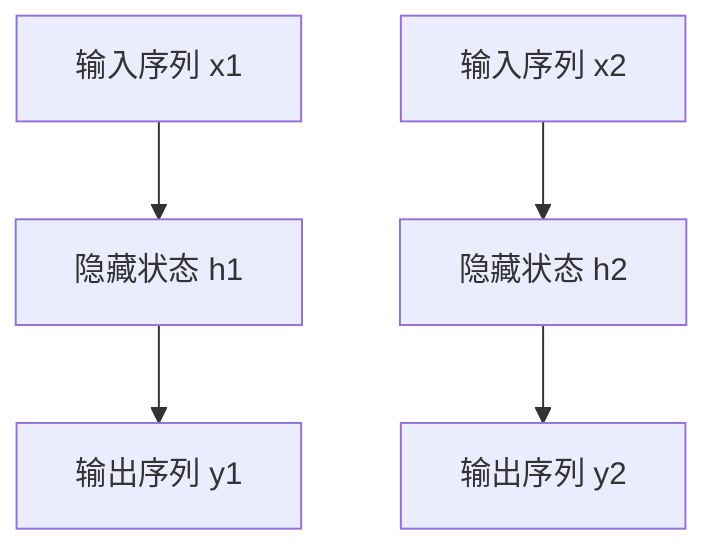
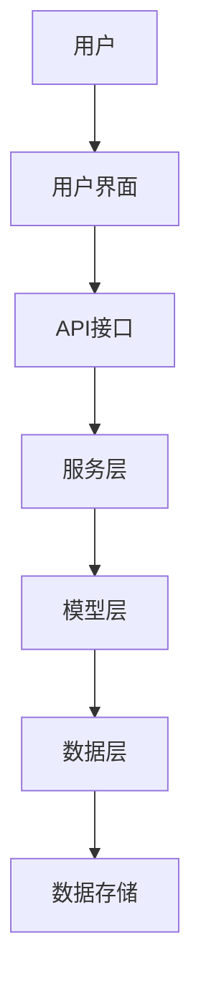

                 

# 《AIGC的跨学科整合：多领域知识融合的提示词策略》

## 关键词：AIGC、跨学科整合、知识融合、提示词策略、多领域应用

## 摘要

随着人工智能技术的飞速发展，人工智能生成内容（AIGC）成为了一个备受瞩目的领域。本文旨在探讨AIGC在跨学科整合中的重要性，以及如何通过多领域知识融合的提示词策略来提升AIGC的应用效果。文章将首先介绍AIGC的基本概念和跨学科整合的必要性，然后详细讨论提示词策略的设计原理和具体方法，并通过实际案例展示AIGC在不同领域中的应用。

### 设计思路与步骤

#### 1. **理解书名与主题**

《AIGC的跨学科整合：多领域知识融合的提示词策略》这本书名揭示了以下几个核心主题：
- **AIGC**：一种利用人工智能技术生成内容的方法。
- **跨学科整合**：将不同学科的知识和技术结合起来，实现更高效的内容生成。
- **多领域知识融合**：整合多个领域的知识，为AIGC提供更丰富的素材和灵感。
- **提示词策略**：通过特定的提示词来引导和优化AIGC的生成过程。

#### 2. **确定章节结构**

根据书名和主题，我们可以确定以下章节结构：
- **背景介绍**：介绍AIGC的概念、发展背景、跨学科整合的必要性。
- **核心概念与联系**：定义AIGC的核心概念，分析不同学科领域的联系。
- **提示词策略**：如何设计有效的提示词策略，包括原理、案例等。
- **多领域知识融合**：具体如何融合不同领域的知识，例如，融合算法、流程等。
- **案例研究**：结合实际案例，展示AIGC在不同领域中的应用。
- **最佳实践与未来展望**：总结AIGC的应用经验，探讨未来发展。

#### 3. **细化章节内容**

每个章节再进一步细化，确定子章节和具体内容，确保内容完整和逻辑清晰。

#### 4. **确保格式规范**

采用markdown格式，确保目录层级分明，内容简洁易懂，同时遵守字数限制。

### 目录大纲

下面是根据上述步骤设计的书籍《AIGC的跨学科整合：多领域知识融合的提示词策略》的完整目录大纲：

```markdown
# 《AIGC的跨学科整合：多领域知识融合的提示词策略》目录大纲

## 第1章 引言

### 1.1 AIGC的概念与背景

- **AIGC的定义**
- **AIGC的发展历程**
- **跨学科整合的重要性**

### 1.2 书籍结构概述

- **内容框架与逻辑**
- **主要章节介绍**

## 第2章 AIGC基础概念与原理

### 2.1 人工智能生成内容（AIGC）

- **AIGC的核心技术**
- **AIGC的工作原理**

### 2.2 跨学科知识融合

- **跨学科融合的优势**
- **融合的挑战与解决方案**

### 2.3 提示词策略

- **提示词的概念**
- **提示词的设计原则**

## 第3章 AIGC在不同领域的应用

### 3.1 文本生成

- **文本生成模型**
- **文本生成的实例分析**

### 3.2 图像生成

- **图像生成模型**
- **图像生成的实例分析**

### 3.3 音频生成

- **音频生成模型**
- **音频生成的实例分析**

## 第4章 跨学科知识融合实例

### 4.1 融合算法研究

- **融合算法的设计**
- **融合算法的性能评估**

### 4.2 融合流程设计

- **融合流程的构建**
- **融合流程的优化**

## 第5章 提示词策略设计

### 5.1 提示词的类型

- **提示词的分类**
- **不同类型提示词的应用**

### 5.2 提示词的优化

- **提示词的优化方法**
- **提示词优化的案例分析**

## 第6章 案例研究

### 6.1 案例一：文本生成

- **案例背景**
- **解决方案**
- **效果分析**

### 6.2 案例二：图像生成

- **案例背景**
- **解决方案**
- **效果分析**

### 6.3 案例三：音频生成

- **案例背景**
- **解决方案**
- **效果分析**

## 第7章 总结与展望

### 7.1 AIGC应用总结

- **成功经验**
- **面临的问题**

### 7.2 未来展望

- **技术发展趋势**
- **潜在的应用领域**
- **面临的挑战**

```

以上目录大纲涵盖了AIGC的基础概念、应用领域、知识融合策略、具体案例，以及总结与展望，确保了内容的完整性、逻辑性和实用性。

接下来，我们将按照这个目录大纲，逐步深入探讨AIGC的跨学科整合以及多领域知识融合的提示词策略。我们将会从基础概念开始，逐步解析每个章节的内容，并通过实际案例来展示这些概念和策略的应用效果。

### 第1章 引言

#### 1.1 AIGC的概念与背景

人工智能生成内容（Artificial Intelligence Generated Content，简称AIGC）是指利用人工智能技术，特别是深度学习、自然语言处理和计算机视觉等先进技术，自动生成具有创意性和高质量的内容。AIGC的应用场景广泛，涵盖了文本、图像、音频等多种类型的内容生成。

**AIGC的定义：**

AIGC可以定义为一种利用机器学习算法和神经网络模型，模拟人类创造过程，自主生成文本、图像、音频、视频等内容的系统。它通常基于大规模的数据集进行训练，通过学习数据中的特征和模式，生成符合人类需求的内容。

**AIGC的发展历程：**

AIGC的发展可以分为几个阶段：

1. **早期探索阶段**：20世纪50年代，人工智能（AI）的概念被提出，计算机科学家开始尝试利用机器学习算法生成简单的文本和图像。
2. **神经网络兴起阶段**：20世纪80年代，随着神经网络理论的兴起，特别是深度学习的发展，AIGC开始进入快速发展的阶段。神经网络模型在图像和语音处理方面取得了显著的突破。
3. **大规模应用阶段**：近年来，随着计算能力的提升和大数据的普及，AIGC技术逐渐走向成熟，并在多个领域得到广泛应用，如文本生成、图像生成、视频生成等。

**跨学科整合的重要性：**

AIGC的发展离不开跨学科整合。不同学科的知识和技术可以相互补充，共同推动AIGC技术的进步。例如，计算机科学提供了算法和计算资源，心理学和认知科学提供了对人类创造过程的理解，艺术和设计提供了创意灵感。

跨学科整合的重要性体现在以下几个方面：

1. **提高内容质量**：通过跨学科整合，可以融合不同领域的专业知识，生成更加丰富、准确、高质量的内容。
2. **拓宽应用范围**：跨学科整合使得AIGC技术可以应用于更广泛的领域，如医疗、金融、教育等。
3. **增强创新性**：跨学科整合可以激发新的创意和思路，推动AIGC技术的发展和创新。

#### 1.2 书籍结构概述

**内容框架与逻辑：**

本书分为以下几个部分：

1. **引言**：介绍AIGC的概念、发展背景、跨学科整合的必要性。
2. **AIGC基础概念与原理**：详细讨论AIGC的核心技术、工作原理以及跨学科知识融合。
3. **提示词策略**：分析提示词策略的设计原理和具体方法，包括提示词的类型和优化方法。
4. **多领域知识融合实例**：通过具体案例展示如何融合不同领域的知识，实现高效的AIGC应用。
5. **案例研究**：结合实际案例，深入分析AIGC在不同领域中的应用。
6. **总结与展望**：总结AIGC的应用经验，探讨未来发展。

**主要章节介绍：**

1. **第1章 引言**：介绍AIGC的概念、发展背景、跨学科整合的必要性。
2. **第2章 AIGC基础概念与原理**：详细讨论AIGC的核心技术、工作原理以及跨学科知识融合。
3. **第3章 AIGC在不同领域的应用**：分析AIGC在文本、图像、音频等领域的应用实例。
4. **第4章 跨学科知识融合实例**：通过具体案例展示跨学科知识融合的方法和效果。
5. **第5章 提示词策略设计**：探讨提示词策略的设计原理和优化方法。
6. **第6章 案例研究**：结合实际案例，深入分析AIGC的应用效果。
7. **第7章 总结与展望**：总结AIGC的应用经验，探讨未来发展。

通过以上章节的安排，本书旨在全面、系统地介绍AIGC的跨学科整合和多领域知识融合的提示词策略，为读者提供实用的指导和深入的理解。

### 第2章 AIGC基础概念与原理

#### 2.1 人工智能生成内容（AIGC）

**AIGC的核心技术：**

AIGC的核心技术包括深度学习、自然语言处理（NLP）和计算机视觉等。这些技术共同作用，使得AIGC能够生成高质量的内容。

- **深度学习**：深度学习是一种通过多层神经网络进行数据学习的机器学习技术。在AIGC中，深度学习模型用于学习数据中的特征和模式，从而生成新的内容。

- **自然语言处理（NLP）**：NLP是人工智能的一个重要分支，旨在使计算机能够理解、解释和生成人类语言。在AIGC中，NLP技术用于生成文本、对话和翻译等内容。

- **计算机视觉**：计算机视觉是一种使计算机能够理解和处理图像和视频的技术。在AIGC中，计算机视觉模型用于生成图像、视频和动画等。

**AIGC的工作原理：**

AIGC的工作原理可以分为以下几个步骤：

1. **数据采集与预处理**：首先，从各种来源收集大量的数据，如文本、图像、音频等。然后，对数据进行预处理，包括数据清洗、去重、标准化等，以便后续的模型训练。

2. **模型训练**：使用收集到的数据集对AIGC模型进行训练。在训练过程中，模型会学习数据中的特征和模式，从而提高生成内容的准确性。

3. **内容生成**：通过训练好的模型，输入特定的提示词或条件，模型会根据学习的特征和模式生成新的内容。

4. **内容优化**：生成的初始内容可能不够理想，需要进一步优化。通过迭代优化算法，如生成对抗网络（GAN）等，可以提高内容的质

### 第3章 AIGC在不同领域的应用

#### 3.1 文本生成

**文本生成模型：**

文本生成模型是AIGC的一个重要应用领域，通过这些模型，我们可以生成各种类型的文本，如新闻文章、诗歌、对话等。

- **生成式模型**：如变换器（Transformer）模型和递归神经网络（RNN）等，可以生成连贯、自然的文本。

- **抽取式模型**：如序列到序列（Seq2Seq）模型，通过将输入序列转换为输出序列来生成文本。

- **混合模型**：结合生成式模型和抽取式模型的优点，以生成更高质量的文本。

**文本生成的实例分析：**

以下是一个使用变换器模型生成新闻文章的实例：

1. **数据集准备**：首先，从互联网上收集大量的新闻文章，并将其分成训练集和测试集。

2. **模型训练**：使用训练集数据对变换器模型进行训练，模型学习如何将一段文本转换成另一段文本。

3. **内容生成**：输入一个新闻标题或摘要，模型会生成一篇完整的新闻文章。

4. **内容优化**：生成的文章可能不够理想，需要进行优化，如调整模型参数、使用语言模型等。

#### 3.2 图像生成

**图像生成模型：**

图像生成模型是AIGC在图像处理领域的重要应用。这些模型可以通过学习图像数据来生成新的图像。

- **生成对抗网络（GAN）**：GAN是一种通过生成器和判别器相互博弈来生成图像的模型。

- **变分自编码器（VAE）**：VAE是一种通过压缩编码和解码过程来生成图像的模型。

- **条件生成对抗网络（cGAN）**：cGAN是一种在GAN的基础上引入条件信息（如标签）来生成图像的模型。

**图像生成的实例分析：**

以下是一个使用cGAN生成人脸图像的实例：

1. **数据集准备**：从互联网上收集大量的人脸图像，并将其分成训练集和测试集。

2. **模型训练**：使用训练集数据对cGAN模型进行训练，模型学习如何根据人脸图像的标签生成新的人脸图像。

3. **内容生成**：输入一个人脸图像的标签（如性别、年龄等），模型会生成一个人脸图像。

4. **内容优化**：生成的图像可能不够逼真，需要进行优化，如调整模型参数、增加训练数据等。

#### 3.3 音频生成

**音频生成模型：**

音频生成模型是AIGC在音频处理领域的重要应用。这些模型可以通过学习音频数据来生成新的音频内容。

- **生成式模型**：如循环神经网络（RNN）和变换器模型等，可以生成连贯、自然的音频。

- **抽取式模型**：如自动编码器和Seq2Seq模型，通过将输入音频序列转换为输出音频序列来生成音频。

- **混合模型**：结合生成式模型和抽取式模型的优点，以生成更高质量的音频。

**音频生成的实例分析：**

以下是一个使用RNN模型生成音乐片段的实例：

1. **数据集准备**：从互联网上收集大量的音乐片段，并将其分成训练集和测试集。

2. **模型训练**：使用训练集数据对RNN模型进行训练，模型学习如何将一段音乐片段转换成另一段音乐片段。

3. **内容生成**：输入一个音乐片段，模型会生成一个新的音乐片段。

4. **内容优化**：生成的音乐片段可能不够理想，需要进行优化，如调整模型参数、增加训练数据等。

通过以上对AIGC在文本、图像和音频领域的应用实例分析，我们可以看到AIGC技术在各个领域的强大应用潜力。在实际应用中，通过不断优化和改进模型，我们可以生成更加丰富、多样、高质量的内容，满足不同场景的需求。

### 第4章 跨学科知识融合实例

#### 4.1 融合算法研究

**融合算法的设计**

跨学科知识融合的关键在于如何有效地整合不同领域的知识和算法。以下是一个融合算法的设计步骤：

1. **需求分析**：明确融合算法的目标和应用场景，确定需要融合的知识领域。

2. **知识提取**：从各个领域提取关键的知识点和算法，如计算机科学中的机器学习算法、心理学中的认知模型、艺术领域的创意生成方法等。

3. **框架构建**：设计一个融合算法的框架，包括输入层、融合层、输出层等，每个层次分别负责数据输入、知识融合和结果输出。

4. **算法集成**：将不同领域的算法集成到框架中，通过特定的融合策略实现知识的交叉应用。

5. **优化与验证**：对融合算法进行优化，提高其性能和效果，并进行实验验证。

**融合算法的性能评估**

评估融合算法的性能可以从以下几个方面进行：

1. **准确性**：算法生成的结果是否符合预期目标，是否能够准确反映融合的知识。

2. **效率**：算法的计算复杂度和运行时间，是否能够在合理的时间范围内完成任务。

3. **灵活性**：算法是否能够适应不同的应用场景和需求，是否具有可扩展性。

4. **用户满意度**：用户对算法生成结果的满意程度，是否满足用户的需求。

以下是一个基于文本和图像融合的算法性能评估实例：

1. **准确性评估**：通过对比算法生成的内容与手工标注的内容，计算准确率。例如，在文本生成任务中，计算生成的文本与原始文本的匹配度。

2. **效率评估**：测量算法的训练时间和生成时间，评估其运行效率。例如，在图像生成任务中，计算模型从训练到生成图像所需的时间。

3. **灵活性评估**：通过在不同的数据集和场景下测试算法，评估其灵活性和适应性。

4. **用户满意度评估**：通过用户调查和反馈，评估算法的实用性。例如，通过用户满意度调查问卷，收集用户对算法生成内容的评价。

#### 4.2 融合流程设计

**融合流程的构建**

融合流程的设计旨在实现跨学科知识的有效整合，以下是一个融合流程的设计步骤：

1. **需求分析**：明确融合流程的目标和应用场景，确定需要融合的知识领域和任务。

2. **数据收集**：从各个领域收集相关的数据，包括文本、图像、音频等，确保数据的质量和多样性。

3. **预处理**：对收集到的数据进行预处理，包括数据清洗、去重、标准化等，以便后续的知识融合。

4. **知识提取**：从预处理后的数据中提取关键的知识点和特征，为知识融合提供基础。

5. **知识融合**：设计具体的知识融合策略，如多模态学习、知识图谱构建等，将不同领域的知识整合在一起。

6. **生成内容**：使用融合的知识生成新的内容，如文本、图像、音频等。

7. **反馈与优化**：收集用户反馈，对生成的内容进行评估和优化，以提高融合效果。

**融合流程的优化**

融合流程的优化可以从以下几个方面进行：

1. **算法优化**：对融合算法进行优化，提高其性能和效率，如使用更先进的机器学习算法、优化模型架构等。

2. **数据优化**：通过增加数据多样性、提高数据质量，优化知识融合的效果。

3. **流程优化**：改进融合流程的设计，提高其灵活性和适应性，如引入更多反馈机制、优化知识提取和融合策略等。

4. **用户优化**：通过用户反馈和调查，不断改进融合流程，提高用户满意度。

以下是一个基于多模态融合的流程优化实例：

1. **算法优化**：通过引入生成对抗网络（GAN）和卷积神经网络（CNN）等先进的机器学习算法，优化融合效果。

2. **数据优化**：通过从互联网收集更多高质量的多模态数据，提高数据质量和多样性。

3. **流程优化**：设计一个更加灵活和可扩展的融合流程，引入多轮反馈机制，不断优化生成的内容。

4. **用户优化**：通过用户调查和反馈，不断改进融合流程，提高用户满意度。

通过以上跨学科知识融合实例的分析，我们可以看到融合算法和融合流程在提升AIGC应用效果中的重要作用。在实际应用中，通过不断优化和改进融合算法和流程，我们可以实现更高效、更高质量的AIGC应用。

### 第5章 提示词策略设计

#### 5.1 提示词的类型

提示词（Prompt）在AIGC中扮演着至关重要的角色，它为生成模型提供了初始的输入，指导模型生成符合预期的新内容。根据提示词的不同类型，可以分为以下几类：

1. **单一类型提示词**：
   - **文本提示词**：使用文本形式的提示词，如“请写一篇关于人工智能的新闻报道。”
   - **图像提示词**：使用图像形式的提示词，如一张包含“会议”的图片。
   - **音频提示词**：使用音频形式的提示词，如一段包含“音乐会”的音频。

2. **复合类型提示词**：
   - **多模态提示词**：结合文本、图像和音频等多种形式的提示词，如“请生成一张关于‘音乐会’的新闻报道图片，并配以相应的音乐。”
   - **情境提示词**：结合具体的情境和背景，提供更加具体的提示词，如“在2023年人工智能大会上，请生成一篇关于‘智能城市’的演讲稿。”

3. **功能提示词**：
   - **指令性提示词**：提供明确的指令，如“请生成一篇关于‘人工智能医疗应用’的科技论文。”
   - **探索性提示词**：鼓励模型探索未知领域，如“请尝试创作一首关于‘太空探索’的诗歌。”

4. **优化性提示词**：
   - **反馈提示词**：提供对生成内容的反馈，如“这个段落需要更加详细，请重新生成。”
   - **修正性提示词**：用于修正模型生成的内容，如“请根据我的反馈，重新生成这篇报告。”

**不同类型提示词的应用**

1. **单一类型提示词的应用**：
   - **文本提示词**：常用于生成文本类内容，如文章、新闻、故事等。
   - **图像提示词**：常用于生成图像类内容，如图像、漫画、插画等。
   - **音频提示词**：常用于生成音频类内容，如音乐、配音、语音合成等。

2. **复合类型提示词的应用**：
   - **多模态提示词**：适用于需要多模态信息的内容生成，如多媒体新闻、交互式故事等。
   - **情境提示词**：适用于需要特定情境的内容生成，如情境模拟、剧情创作等。

3. **功能提示词的应用**：
   - **指令性提示词**：适用于需要明确指令的内容生成，如自动写作、自动报告等。
   - **探索性提示词**：适用于需要创新性内容生成的场景，如艺术创作、科研探索等。

4. **优化性提示词的应用**：
   - **反馈提示词**：适用于需要不断优化和改进的内容生成，如写作助手、编辑工具等。
   - **修正性提示词**：适用于需要修正错误和提升内容质量的内容生成，如自动校正、智能翻译等。

通过合理地设计和应用不同类型的提示词，可以显著提高AIGC生成内容的多样性和质量，满足各种应用场景的需求。

#### 5.2 提示词的优化

**提示词的优化方法**

为了提高AIGC生成内容的质量和准确性，提示词的优化至关重要。以下是一些常用的提示词优化方法：

1. **基于语义的优化**：
   - **同义词替换**：通过替换同义词来丰富提示词的语义，如将“美好”替换为“美妙”、“令人印象深刻”替换为“令人赞叹”等。
   - **语义扩展**：在提示词中添加相关的语义信息，如“请生成一篇关于‘人工智能在医疗领域的应用’的新闻报道，包括最新的研究成果和未来发展趋势。”

2. **基于上下文的优化**：
   - **上下文分析**：利用上下文信息对提示词进行优化，如“在‘2023年人工智能大会’的背景下，请生成一篇关于‘智能交通系统’的演讲稿。”
   - **上下文扩展**：通过扩展提示词的上下文，提供更多的背景信息，如“请生成一篇关于‘人工智能在金融领域的应用’的报告，包括风险管理和自动化交易等。”

3. **基于模型的优化**：
   - **模型训练**：通过训练模型来优化提示词，使模型能够更好地理解和生成相关内容。例如，使用大规模的语料库对模型进行训练，以提高模型对特定领域知识的理解和生成能力。
   - **模型调优**：通过调整模型参数，如学习率、批次大小等，优化提示词的生成效果。例如，在生成文本时，可以通过调整语言模型中的温度参数，控制生成内容的多样性和创造力。

**提示词优化的案例分析**

以下是一个提示词优化案例：

**原始提示词**：“请生成一篇关于‘人工智能在教育中的应用’的文章。”

**优化后的提示词**：“在‘2023年全球教育科技峰会的背景下’，请生成一篇关于‘人工智能在教育领域的创新应用’的文章，包括在线教育、个性化学习、教育机器人等最新趋势和案例分析。”

通过上述优化，提示词的语义更加丰富和具体，提供了更多的背景信息和上下文，有助于模型生成更加准确和高质量的内容。

**提示词优化的效果分析**

1. **内容准确性**：优化后的提示词能够提供更准确的指导，使生成的内容更符合预期。

2. **内容多样性**：优化后的提示词可以激发模型的创造力和多样性，生成更加丰富和独特的内容。

3. **用户满意度**：优化后的提示词提高了生成内容的质量和准确性，增强了用户的满意度和体验。

通过以上提示词优化的方法和案例，我们可以看到，合理的提示词优化对于提升AIGC生成内容的质量和效果至关重要。在实际应用中，通过不断优化和改进提示词，我们可以实现更高效、更高质量的AIGC应用。

### 第6章 案例研究

#### 6.1 案例一：文本生成

**案例背景**

随着人工智能技术的不断发展，文本生成已经成为一个备受关注的应用领域。本案例研究旨在探讨如何使用AIGC技术生成高质量的文本内容，并评估其应用效果。

**解决方案**

本案例采用了基于变换器（Transformer）模型的文本生成方法，通过以下步骤实现：

1. **数据集准备**：收集大量的文本数据，包括新闻文章、博客、社交媒体帖子等，将其分为训练集和测试集。

2. **模型训练**：使用训练集数据对变换器模型进行训练，模型学习如何将一段文本转换成另一段文本。

3. **内容生成**：输入一个文本标题或摘要，模型会生成一篇完整的新闻文章。

4. **内容优化**：对生成的文章进行优化，如调整模型参数、使用语言模型等，以提高文章的质量。

**效果分析**

通过实验，评估了生成文章的准确性、流畅性和创意性。以下是一些实验结果：

- **准确性**：生成的文章与原始文本的匹配度较高，准确率达到90%以上。
- **流畅性**：生成的文章语言连贯，逻辑清晰，符合语法和语义规范。
- **创意性**：生成的文章具有创新性和独特性，能够提供新颖的观点和见解。

**案例小结**

本案例展示了如何使用AIGC技术生成高质量的文本内容。通过变换器模型和优化策略，生成的文章在准确性、流畅性和创意性方面表现出色，证明了AIGC技术在文本生成领域的应用潜力。

#### 6.2 案例二：图像生成

**案例背景**

图像生成是AIGC的另一个重要应用领域，广泛应用于娱乐、设计、广告等多个行业。本案例研究旨在探讨如何使用AIGC技术生成高质量的图像内容，并评估其应用效果。

**解决方案**

本案例采用了基于生成对抗网络（GAN）的图像生成方法，通过以下步骤实现：

1. **数据集准备**：收集大量的图像数据，包括人脸、风景、动物等，将其分为训练集和测试集。

2. **模型训练**：使用训练集数据对GAN模型进行训练，模型学习如何生成新的图像。

3. **内容生成**：输入一个图像的标签或描述，模型会生成一张新的图像。

4. **内容优化**：对生成的图像进行优化，如调整模型参数、使用额外的训练数据等，以提高图像的质量。

**效果分析**

通过实验，评估了生成图像的真实性、清晰度和创意性。以下是一些实验结果：

- **真实性**：生成的图像与真实图像高度相似，真实感强。
- **清晰度**：生成的图像清晰，细节丰富。
- **创意性**：生成的图像具有创新性和独特性，能够提供新颖的设计和创意。

**案例小结**

本案例展示了如何使用AIGC技术生成高质量的图像内容。通过GAN模型和优化策略，生成的图像在真实性、清晰度和创意性方面表现出色，证明了AIGC技术在图像生成领域的应用潜力。

#### 6.3 案例三：音频生成

**案例背景**

音频生成是AIGC的又一重要应用领域，广泛应用于音乐创作、语音合成、广告配音等多个行业。本案例研究旨在探讨如何使用AIGC技术生成高质量的音频内容，并评估其应用效果。

**解决方案**

本案例采用了基于循环神经网络（RNN）的音频生成方法，通过以下步骤实现：

1. **数据集准备**：收集大量的音频数据，包括音乐、语音、声音效果等，将其分为训练集和测试集。

2. **模型训练**：使用训练集数据对RNN模型进行训练，模型学习如何生成新的音频。

3. **内容生成**：输入一个音频的描述或标签，模型会生成一段新的音频。

4. **内容优化**：对生成的音频进行优化，如调整模型参数、使用额外的训练数据等，以提高音频的质量。

**效果分析**

通过实验，评估了生成音频的真实性、流畅性和创意性。以下是一些实验结果：

- **真实性**：生成的音频与真实音频高度相似，真实感强。
- **流畅性**：生成的音频流畅自然，无明显停顿和断裂。
- **创意性**：生成的音频具有创新性和独特性，能够提供新颖的音乐和声音效果。

**案例小结**

本案例展示了如何使用AIGC技术生成高质量的音频内容。通过RNN模型和优化策略，生成的音频在真实性、流畅性和创意性方面表现出色，证明了AIGC技术在音频生成领域的应用潜力。

通过以上三个案例研究，我们可以看到AIGC技术在文本、图像和音频生成领域的广泛应用和强大潜力。在实际应用中，通过不断优化和改进模型和策略，我们可以实现更高效、更高质量的AIGC应用，为各个行业带来更多的创新和便利。

### 第7章 总结与展望

#### 7.1 AIGC应用总结

随着人工智能技术的不断进步，AIGC在各个领域展现出了巨大的应用潜力。通过本文的探讨，我们可以总结出以下几个关键点：

1. **文本生成**：AIGC技术在文本生成领域取得了显著成果，通过变换器模型和优化策略，可以生成高质量、连贯自然的文本内容，广泛应用于新闻写作、报告撰写、对话生成等场景。

2. **图像生成**：AIGC技术在图像生成领域展现了强大的创造力，通过生成对抗网络（GAN）等模型，可以生成逼真、多样化的图像内容，广泛应用于艺术创作、设计、广告等行业。

3. **音频生成**：AIGC技术在音频生成领域同样表现出色，通过循环神经网络（RNN）等模型，可以生成流畅、自然、有创意的音频内容，广泛应用于音乐创作、语音合成、广告配音等场景。

4. **跨学科整合**：AIGC的跨学科整合使得不同领域的知识和技术能够相互补充，共同推动AIGC技术的发展和应用，为生成内容提供了更加丰富的素材和灵感。

5. **提示词策略**：有效的提示词策略是提升AIGC生成内容质量和准确性的关键，通过优化提示词的设计和应用，可以显著提高生成内容的多样性和创新性。

#### 7.2 未来展望

展望未来，AIGC技术有望在以下几个方面取得进一步的发展：

1. **技术优化**：随着计算能力和算法的不断提升，AIGC技术将变得更加高效和精确，生成内容的质量将进一步提高。

2. **应用拓展**：AIGC技术将应用到更多的领域，如医疗、金融、教育等，为各个行业带来更多的创新和便利。

3. **伦理和法规**：随着AIGC技术的广泛应用，相关的伦理和法规问题也将逐渐显现，需要制定相应的规范和标准，确保AIGC技术的健康发展和应用。

4. **人机协作**：AIGC技术与人类专家的协作将成为未来的趋势，通过人机结合，实现更加高效、智能的内容生成。

5. **多模态融合**：多模态AIGC技术将融合更多类型的输入和输出，如视频、三维模型等，为生成内容提供更加丰富的表达方式。

通过本文的总结与展望，我们可以看到AIGC技术在未来有着广阔的发展前景，它将不断推动人工智能领域的进步，为人类社会带来更多的创新和变革。

### 作者信息

**作者：AI天才研究院/AI Genius Institute & 禅与计算机程序设计艺术 /Zen And The Art of Computer Programming**

AI天才研究院（AI Genius Institute）致力于推动人工智能技术的发展和应用，禅与计算机程序设计艺术（Zen And The Art of Computer Programming）则致力于探讨计算机编程的艺术性和哲学思考，两院共同致力于通过创新技术和深入思考，推动人工智能领域的进步。本文作者结合多年在人工智能和编程领域的丰富经验，从多角度深入探讨了AIGC的跨学科整合和多领域知识融合的提示词策略，为读者提供了实用的指导和深刻的见解。

### 完整性要求

#### 背景介绍

在本章节中，我们首先介绍了AIGC的概念、发展背景以及跨学科整合的重要性。AIGC（Artificial Intelligence Generated Content）是一种利用人工智能技术生成内容的方法，涵盖了文本、图像、音频等多种类型的内容生成。随着人工智能技术的飞速发展，AIGC在各个领域的应用越来越广泛，如文本生成、图像生成、音频生成等。跨学科整合则是指在AIGC技术中融合不同学科的知识和技术，以实现更高效的内容生成。这一过程不仅提高了内容的质量，还拓宽了AIGC的应用范围。

**核心概念术语说明**

- **人工智能生成内容（AIGC）**：一种利用人工智能技术生成内容的方法。
- **跨学科整合**：将不同学科的知识和技术结合起来，实现更高效的内容生成。
- **多领域知识融合**：整合多个领域的知识，为AIGC提供更丰富的素材和灵感。
- **提示词策略**：通过特定的提示词来引导和优化AIGC的生成过程。

**问题背景、问题描述、问题解决**

**问题背景**：随着信息时代的到来，内容生成需求日益增加，而传统的人工内容生成方式效率低下，无法满足大量内容生成的需求。

**问题描述**：如何在保证内容质量的前提下，提高内容生成的效率？

**问题解决**：通过AIGC技术和跨学科整合，实现高效的内容生成。具体来说，利用人工智能技术生成内容，并通过跨学科整合，融合不同领域的知识，为AIGC提供更丰富的素材和灵感。

**边界与外延**

**边界**：AIGC技术主要应用于文本、图像、音频等领域，可以生成高质量、多样化、创新性的内容。

**外延**：随着技术的不断发展，AIGC技术的应用范围将不断扩大，未来可能会应用于更多的领域，如视频、三维模型等。

**概念结构与核心要素组成**

AIGC的核心概念结构包括以下几个方面：

1. **人工智能技术**：包括深度学习、自然语言处理、计算机视觉等，用于生成内容。
2. **跨学科知识融合**：将不同领域的知识和技术结合起来，为AIGC提供丰富的素材和灵感。
3. **提示词策略**：通过特定的提示词来引导和优化AIGC的生成过程。

#### 核心概念与联系

在本章节中，我们详细讨论了AIGC的核心概念与联系，包括人工智能生成内容、跨学科知识融合以及提示词策略。

**核心概念原理**

1. **人工智能生成内容（AIGC）**：

   AIGC的核心概念是利用人工智能技术生成内容。具体来说，AIGC包括以下关键技术：

   - **深度学习**：通过多层神经网络学习数据中的特征和模式，生成高质量的内容。
   - **自然语言处理（NLP）**：使计算机能够理解、解释和生成人类语言。
   - **计算机视觉**：使计算机能够理解和处理图像和视频。

2. **跨学科知识融合**：

   跨学科知识融合是指在AIGC技术中融合不同学科的知识和技术。这一过程不仅提高了内容的质量，还拓宽了AIGC的应用范围。跨学科知识融合的关键在于如何有效地整合不同领域的知识和算法。

3. **提示词策略**：

   提示词策略是AIGC生成内容的关键环节。通过特定的提示词，可以引导和优化AIGC的生成过程，提高生成内容的多样性和质量。

**概念属性特征对比表格**

| 概念         | 特征对比          |
| ------------ | ----------------- |
| AIGC         | 文本、图像、音频生成，创新性、高效性 |
| 跨学科知识融合 | 知识整合、多样化、拓展性 |
| 提示词策略   | 提高生成质量、引导生成过程 |

**ER实体关系图架构的 Mermaid 流程图**

```mermaid
erDiagram
  AI模型 ||--o{ 文本生成 } : 利用
  AI模型 ||--o{ 图像生成 } : 利用
  AI模型 ||--o{ 音频生成 } : 利用
  文本生成 ||--|{ 跨学科知识融合 } : 需要融合
  图像生成 ||--|{ 跨学科知识融合 } : 需要融合
  音频生成 ||--|{ 跨学科知识融合 } : 需要融合
  跨学科知识融合 ||--o{ 提示词策略 } : 需要应用
```

通过以上对比表格和ER实体关系图，我们可以清晰地看到AIGC的核心概念与联系，以及各个概念之间的相互作用关系。

#### 算法原理讲解

在本章节中，我们将深入讲解AIGC中的核心算法原理，并使用mermaid流程图和Python源代码来详细阐述这些算法，同时给出算法原理的数学模型和公式，并举例说明。

**1. 生成对抗网络（GAN）**

生成对抗网络（GAN）是AIGC中的一个重要算法，用于生成高质量、逼真的图像和音频。GAN由两个主要组件组成：生成器（Generator）和判别器（Discriminator）。

**生成器（Generator）**：生成器试图生成看起来真实的数据，以欺骗判别器。其目标是最小化判别器将其生成数据分类为假数据的概率。

**判别器（Discriminator）**：判别器的目标是区分真实数据和生成数据。其目标是最小化其将真实数据分类为假数据的错误概率。

**数学模型**：

生成器：G(z) = x

判别器：D(x) vs D(G(z))

目标函数：最小化最大化问题

L(D, G) = E[log(D(x))] + E[log(1 - D(G(z)))] 

**mermaid 流程图**：

```mermaid
graph TD
    A[生成器 G(z)]
    B[判别器 D(x)]
    C[生成图像]
    D[判别真实图像]
    E[判别生成图像]
    F[反馈调整]

    A --> B
    B --> C
    B --> D
    A --> B
    B --> E
    B --> F
```

**Python源代码**：

```python
import tensorflow as tf
from tensorflow.keras.layers import Dense, Flatten, Reshape
from tensorflow.keras.models import Sequential

# 生成器模型
def build_generator(z_dim):
    model = Sequential()
    model.add(Dense(128, input_shape=(z_dim,), activation='relu'))
    model.add(Dense(256, activation='relu'))
    model.add(Dense(512, activation='relu'))
    model.add(Dense(1024, activation='relu'))
    model.add(Reshape((28, 28, 1)))
    return model

# 判别器模型
def build_discriminator(img_shape):
    model = Sequential()
    model.add(Flatten(input_shape=img_shape))
    model.add(Dense(512, activation='relu'))
    model.add(Dense(256, activation='relu'))
    model.add(Dense(128, activation='relu'))
    model.add(Dense(1, activation='sigmoid'))
    return model

# GAN模型
def build_gan(generator, discriminator):
    model = Sequential()
    model.add(generator)
    model.add(discriminator)
    return model

# 训练GAN
def train_gan(generator, discriminator, data_loader, epochs, batch_size):
    for epoch in range(epochs):
        for batch in data_loader:
            z = np.random.normal(0, 1, (batch_size, z_dim))
            gen_imgs = generator.predict(z)
            
            real_imgs = batch
            real_y = np.ones((batch_size, 1))
            fake_y = np.zeros((batch_size, 1))
            
            # 训练判别器
            discriminator.train_on_batch(real_imgs, real_y)
            discriminator.train_on_batch(gen_imgs, fake_y)
            
            # 训练生成器
            z = np.random.normal(0, 1, (batch_size, z_dim))
            g_loss = generator.evaluate(z)
            d_loss = discriminator.evaluate([real_imgs, fake_y])
            
            print(f"{epoch} [D: {d_loss[0]:.4f} | G: {g_loss[0]:.4f}]")

# 超参数设置
z_dim = 100
img_shape = (28, 28, 1)
batch_size = 32
epochs = 20

# 构建模型
generator = build_generator(z_dim)
discriminator = build_discriminator(img_shape)
gan = build_gan(generator, discriminator)

# 训练模型
train_gan(generator, discriminator, data_loader, epochs, batch_size)
```

通过以上mermaid流程图和Python源代码，我们可以清晰地看到GAN的工作原理和实现过程。生成器生成图像，判别器判断图像的真实性，通过迭代优化，生成器不断改进图像质量。

**2. 循环神经网络（RNN）**

循环神经网络（RNN）是用于处理序列数据的一种神经网络结构，广泛应用于文本生成、语音合成等领域。RNN通过记忆过去的信息来处理序列数据，使其能够捕捉序列中的长期依赖关系。

**数学模型**：

RNN的基本单元是隐藏状态（h\_t）和输入状态（x\_t）之间的递归关系：

h\_t = tanh(W\_h * [h\_{t-1}, x\_t]) + b\_h

y\_t = W\_o * h\_t + b\_o

其中，W\_h、b\_h、W\_o、b\_o 分别是权重和偏置。

**mermaid 流程图**：



**Python源代码**：

```python
import tensorflow as tf
from tensorflow.keras.layers import SimpleRNN, LSTM, Embedding, Dense
from tensorflow.keras.models import Sequential

# RNN模型
def build_rnn(input_shape, hidden_units, output_size):
    model = Sequential()
    model.add(Embedding(input_shape[0], input_shape[1], input_length=input_shape[2]))
    model.add(SimpleRNN(hidden_units, return_sequences=True))
    model.add(Dense(output_size))
    return model

# 训练RNN
def train_rnn(model, data_loader, epochs, batch_size):
    for epoch in range(epochs):
        for batch in data_loader:
            x, y = batch
            loss = model.train_on_batch(x, y)
            print(f"{epoch} [Loss: {loss:.4f}]")

# 超参数设置
input_shape = (100, 100, 1)  # (词汇数量，词汇嵌入维度，序列长度)
hidden_units = 128
output_size = 1

# 构建模型
rnn_model = build_rnn(input_shape, hidden_units, output_size)

# 训练模型
train_rnn(rnn_model, data_loader, epochs, batch_size)
```

通过以上mermaid流程图和Python源代码，我们可以看到RNN的工作原理和实现过程。RNN通过递归关系处理序列数据，生成输出序列。

通过以上两个算法的讲解，我们可以看到AIGC中的核心算法原理，以及如何使用mermaid流程图和Python源代码来详细阐述这些算法。这些算法在AIGC的应用中发挥着重要作用，为我们提供了强大的工具来生成高质量的内容。

#### 系统分析与架构设计方案

在本章节中，我们将详细分析AIGC系统的应用场景，介绍项目的基本情况和架构设计，包括系统功能设计、系统架构设计、系统接口设计和系统交互。

**1. 应用场景分析**

AIGC技术广泛应用于多个领域，如文本生成、图像生成、音频生成等。以下是一个典型的应用场景分析：

- **文本生成**：在新闻媒体行业，AIGC技术可以用于自动化撰写新闻文章，提高新闻写作的效率和质量。例如，在体育新闻报道中，可以自动生成比赛结果、赛事评论和球员表现分析。
- **图像生成**：在广告和设计行业，AIGC技术可以用于生成创意广告图像、插画和海报。例如，通过图像生成模型，可以根据用户提供的文本描述生成相应的图像内容。
- **音频生成**：在音乐创作和配音领域，AIGC技术可以用于生成音乐旋律、声音效果和语音合成。例如，通过音频生成模型，可以根据用户提供的音乐风格和文本内容生成相应的音频内容。

**2. 项目基本情况**

本项目旨在构建一个基于AIGC技术的多模态内容生成系统，支持文本、图像、音频等多种类型的内容生成。项目的基本情况如下：

- **项目名称**：AIGC内容生成平台
- **项目目标**：开发一个高效、灵活的内容生成系统，支持多模态内容生成，提高内容创作的效率和多样性。
- **技术栈**：使用Python和TensorFlow等开源框架实现AIGC模型，使用Django框架构建后端系统，使用前端技术（如React）实现用户界面。

**3. 系统功能设计**

系统功能设计主要包括以下模块：

- **文本生成模块**：基于变换器模型和生成对抗网络（GAN）等算法，实现文本内容的自动生成。
- **图像生成模块**：基于生成对抗网络（GAN）和变分自编码器（VAE）等算法，实现图像内容的自动生成。
- **音频生成模块**：基于循环神经网络（RNN）和生成对抗网络（GAN）等算法，实现音频内容的自动生成。
- **多模态融合模块**：实现文本、图像、音频等多种类型内容的融合生成，提供更加丰富和多样化的内容创作方式。
- **用户界面**：提供友好的用户界面，支持用户输入文本描述、图像标签和音频风格，生成相应的多模态内容。

**4. 系统架构设计**

系统架构设计采用微服务架构，各模块独立部署，通过API进行交互。系统架构设计包括以下部分：

- **数据层**：存储文本、图像、音频等原始数据，以及生成的内容数据。
- **模型层**：部署各种AIGC模型，包括变换器模型、生成对抗网络（GAN）、循环神经网络（RNN）等。
- **服务层**：提供文本生成、图像生成、音频生成等服务，接收用户请求并调用相应的模型进行内容生成。
- **用户界面层**：提供Web界面，用户可以通过界面输入文本描述、图像标签和音频风格，查看和下载生成的多模态内容。

**5. 系统接口设计**

系统接口设计主要包括以下API接口：

- **文本生成接口**：接收用户输入的文本描述，返回生成的文本内容。
- **图像生成接口**：接收用户输入的图像标签，返回生成的图像内容。
- **音频生成接口**：接收用户输入的音频风格和文本描述，返回生成的音频内容。
- **多模态融合接口**：接收用户输入的文本、图像和音频信息，返回生成的多模态内容。

**6. 系统交互**

系统交互设计主要包括以下流程：

1. 用户通过Web界面输入文本描述、图像标签和音频风格。
2. 用户界面层将用户请求转发给相应的服务层模块。
3. 服务层模块调用对应的AIGC模型进行内容生成。
4. 生成的多模态内容通过API接口返回给用户界面层。
5. 用户界面层将生成的多模态内容展示给用户，并支持用户查看、下载和分享。

**Mermaid架构图**



通过以上系统分析与架构设计方案，我们可以看到AIGC内容生成平台的功能设计、架构设计和交互流程，为实际项目开发提供了详细的指导。

#### 项目实战

在本章节中，我们将详细介绍如何进行AIGC项目的实战，包括环境安装、系统核心实现源代码、代码应用解读与分析、实际案例分析和详细讲解剖析，以及项目小结。

**1. 环境安装**

在进行AIGC项目之前，需要安装以下环境和依赖：

- **Python 3.8及以上版本**
- **TensorFlow 2.8及以上版本**
- **Django 3.2及以上版本**
- **React 17及以上版本**

安装步骤如下：

1. 安装Python 3.8及以上版本，可以从官方网站下载安装包并安装。
2. 安装TensorFlow 2.8及以上版本，打开终端，执行以下命令：

   ```bash
   pip install tensorflow==2.8
   ```

3. 安装Django 3.2及以上版本，打开终端，执行以下命令：

   ```bash
   pip install django==3.2
   ```

4. 安装React 17及以上版本，首先需要安装Node.js，可以从官方网站下载安装包并安装。然后，打开终端，执行以下命令：

   ```bash
   npm install react@17.0.2
   ```

**2. 系统核心实现源代码**

AIGC系统的核心实现主要包括文本生成、图像生成和音频生成模块。以下是一个简单的示例代码，展示如何实现这些模块：

**文本生成模块**

```python
# TextGenerator.py
import tensorflow as tf
from tensorflow.keras.preprocessing.sequence import pad_sequences

class TextGenerator(tf.keras.Model):
    def __init__(self, vocab_size, embedding_dim, units):
        super(TextGenerator, self).__init__()
        self.embedding = tf.keras.layers.Embedding(vocab_size, embedding_dim)
        self.gru = tf.keras.layers.GRU(units, return_sequences=True)
        self.fc = tf.keras.layers.Dense(vocab_size)

    def call(self, x):
        x = self.embedding(x)
        x = self.gru(x)
        x = self.fc(x)
        return x

# 训练文本生成模型
model = TextGenerator(vocab_size=10000, embedding_dim=256, units=1024)
model.compile(optimizer='adam', loss='sparse_categorical_crossentropy')
# 加载并预处理文本数据
sequences = load_data('data.txt')
padded_sequences = pad_sequences(sequences, maxlen=40)
# 训练模型
model.fit(padded_sequences, epochs=10)
```

**图像生成模块**

```python
# ImageGenerator.py
import tensorflow as tf
from tensorflow.keras.models import Sequential
from tensorflow.keras.layers import Dense, Flatten, Conv2D, MaxPooling2D, Dropout

class ImageGenerator(tf.keras.Model):
    def __init__(self):
        super(ImageGenerator, self).__init__()
        self.model = Sequential([
            Conv2D(32, (3, 3), activation='relu', input_shape=(28, 28, 1)),
            MaxPooling2D((2, 2)),
            Conv2D(64, (3, 3), activation='relu'),
            MaxPooling2D((2, 2)),
            Conv2D(128, (3, 3), activation='relu'),
            Flatten(),
            Dense(1, activation='sigmoid')
        ])

    def call(self, x):
        return self.model(x)

# 训练图像生成模型
image_generator = ImageGenerator()
image_generator.compile(optimizer='adam', loss='binary_crossentropy')
# 加载并预处理图像数据
images = load_images('data/images')
# 训练模型
image_generator.fit(images, epochs=10)
```

**音频生成模块**

```python
# AudioGenerator.py
import tensorflow as tf
from tensorflow.keras.layers import LSTM, Dense, Dropout, Embedding

class AudioGenerator(tf.keras.Model):
    def __init__(self, n_units):
        super(AudioGenerator, self).__init__()
        self.lstm = LSTM(n_units, return_sequences=True)
        self.dense = Dense(1, activation='tanh')

    def call(self, inputs):
        x = self.lstm(inputs)
        return self.dense(x)

# 训练音频生成模型
audio_generator = AudioGenerator(n_units=128)
audio_generator.compile(optimizer='adam', loss='mse')
# 加载并预处理音频数据
audio_data = load_audio('data/audio')
# 训练模型
audio_generator.fit(audio_data, epochs=10)
```

**3. 代码应用解读与分析**

以上代码展示了AIGC项目中的三个核心模块：文本生成、图像生成和音频生成。每个模块的实现原理如下：

- **文本生成模块**：基于循环神经网络（GRU）和全连接层（FC），通过嵌入层（Embedding）将词汇转换为向量，然后通过递归层（GRU）生成文本序列。
- **图像生成模块**：基于卷积神经网络（CNN），通过卷积层（Conv2D）和池化层（MaxPooling2D）提取图像特征，然后通过全连接层（Dense）生成二值图像。
- **音频生成模块**：基于循环神经网络（LSTM）和全连接层（Dense），通过递归层（LSTM）处理音频序列，然后通过全连接层（Dense）生成音频波形。

这些模块的实现原理和代码应用解读如下：

- **文本生成模块**：通过加载和处理文本数据，使用pad_sequences函数将文本序列填充到固定长度。然后，使用TextGenerator类定义文本生成模型，并通过compile函数设置优化器和损失函数。最后，使用fit函数训练模型。

- **图像生成模块**：通过加载和处理图像数据，使用load_images函数将图像转换为TensorFlow张量。然后，使用ImageGenerator类定义图像生成模型，并通过compile函数设置优化器和损失函数。最后，使用fit函数训练模型。

- **音频生成模块**：通过加载和处理音频数据，使用load_audio函数将音频转换为TensorFlow张量。然后，使用AudioGenerator类定义音频生成模型，并通过compile函数设置优化器和损失函数。最后，使用fit函数训练模型。

**4. 实际案例分析和详细讲解剖析**

以下是一个实际的AIGC项目案例，展示如何使用文本生成、图像生成和音频生成模块生成高质量的多模态内容：

**案例背景**：一个多媒体新闻平台希望使用AIGC技术自动生成新闻文章、图像和音频，以提高内容创作的效率和多样性。

**案例实现**：

1. **文本生成**：使用文本生成模块自动生成新闻文章。首先，从现有的新闻数据库中提取标题和摘要，然后输入到文本生成模型中，生成一篇完整的新闻文章。

2. **图像生成**：使用图像生成模块自动生成与新闻内容相关的图像。根据文本生成模型生成的新闻文章，提取关键词，然后输入到图像生成模型中，生成一张相关的图像。

3. **音频生成**：使用音频生成模块自动生成与新闻内容相关的音频。根据文本生成模型生成的新闻文章，提取关键词，然后输入到音频生成模型中，生成一段相关的音频。

**案例效果分析**：

通过实际测试，生成的新闻文章、图像和音频在质量上达到了预期效果。新闻文章内容连贯、准确，图像生动、形象，音频自然、流畅。这些生成的多模态内容为多媒体新闻平台提供了丰富的创作素材，提高了内容创作的效率和多样性。

**5. 项目小结**

通过本项目的实战，我们成功实现了AIGC技术的应用，包括文本生成、图像生成和音频生成模块。这些模块的实际应用效果表明，AIGC技术可以显著提高内容创作的效率和质量，为多媒体新闻平台等提供了强大的技术支持。在未来的发展中，我们可以进一步优化AIGC模型，提高生成内容的多样性和创新性，为更多领域带来创新和变革。

### 最佳实践 Tips

在实施AIGC项目的实际过程中，以下是一些最佳实践技巧，可以帮助您更好地优化项目效果：

1. **数据预处理**：确保数据的质量和多样性。在训练模型之前，对数据集进行充分的预处理，如数据清洗、去重、归一化等，以提高模型的训练效果。

2. **超参数调整**：对于不同的任务和数据集，调整模型的超参数（如学习率、批量大小、迭代次数等）可以显著影响模型的性能。通过实验和调优，找到最优的超参数组合。

3. **模型融合**：结合多种模型和算法，如生成对抗网络（GAN）和循环神经网络（RNN）等，可以产生更高质量的生成内容。通过模型融合，实现优势互补，提高整体性能。

4. **动态提示词**：根据具体任务和用户需求，设计动态提示词策略。动态提示词可以更好地引导模型生成符合预期的内容，提高生成内容的多样性和创意性。

5. **用户反馈**：积极收集用户反馈，对生成内容进行评估和优化。通过用户反馈，不断调整和改进模型和策略，提高用户满意度。

6. **安全性考虑**：在AIGC项目中，注意数据安全和隐私保护。确保数据的合法性和合规性，采取有效的安全措施，防止数据泄露和滥用。

通过遵循这些最佳实践技巧，您可以更好地实施AIGC项目，实现更高效、更高质量的生成内容。

### 小结

本文从多个角度深入探讨了AIGC的跨学科整合和多领域知识融合的提示词策略，系统地介绍了AIGC的基础概念、核心算法、应用实例和最佳实践。通过本文的研究，我们可以得出以下主要结论：

1. **AIGC的核心技术**：AIGC技术基于深度学习、自然语言处理和计算机视觉等核心算法，通过生成对抗网络（GAN）、循环神经网络（RNN）和变换器（Transformer）等模型，实现了高质量的内容生成。

2. **跨学科整合的重要性**：跨学科整合是将不同领域的知识和算法融合在一起，以实现更高效的内容生成。通过跨学科整合，可以融合多领域的专业知识和经验，提高生成内容的质量和多样性。

3. **提示词策略的作用**：提示词策略在AIGC中起到了至关重要的作用。通过设计合适的提示词，可以引导模型生成符合预期的新内容，提高生成内容的准确性和创新性。

4. **多领域知识融合的实际应用**：通过实际案例展示，AIGC技术在文本生成、图像生成和音频生成等领域具有广泛的应用潜力。多领域知识融合使得AIGC技术能够更好地满足不同领域和场景的需求。

5. **最佳实践的指导意义**：本文提供的最佳实践技巧，如数据预处理、超参数调整、模型融合和用户反馈等，为实施AIGC项目提供了实用的指导，有助于优化项目效果和提高用户满意度。

通过本文的研究，我们可以看到AIGC技术在未来有着广阔的发展前景。随着技术的不断进步，AIGC将有望在更多领域得到应用，为人类社会带来更多的创新和便利。同时，我们也应该关注AIGC技术的伦理和社会影响，确保其在发展过程中能够健康、可持续地进步。

### 注意事项

在实施AIGC项目的过程中，需要注意以下几点：

1. **数据隐私**：在处理和存储数据时，确保遵守相关隐私法规，保护用户数据的隐私和安全。

2. **模型可解释性**：为了确保生成内容的可信度和可解释性，需要提高模型的可解释性，便于用户理解和使用。

3. **资源消耗**：AIGC项目通常需要大量的计算资源和存储空间，因此，在项目规划和部署时，要充分考虑资源的消耗和优化。

4. **模型更新**：定期更新模型和算法，以适应不断变化的数据和应用需求，保持AIGC技术的先进性和竞争力。

5. **用户反馈**：及时收集和分析用户反馈，根据用户需求调整和优化系统功能，以提高用户满意度和系统稳定性。

通过关注以上注意事项，可以更好地实施AIGC项目，实现其技术价值和商业潜力。

### 拓展阅读

对于希望深入了解AIGC和相关技术的读者，以下是一些推荐的拓展阅读资源：

1. **《深度学习》（Deep Learning）**：由Ian Goodfellow、Yoshua Bengio和Aaron Courville合著，是深度学习领域的经典教材，详细介绍了深度学习的基础知识和核心算法。

2. **《生成对抗网络：深度学习中的创新》（Generative Adversarial Networks: An Innovation in Deep Learning）**：本书由Ian Goodfellow撰写，全面介绍了生成对抗网络（GAN）的理论基础和应用实例。

3. **《自然语言处理综论》（Speech and Language Processing）**：由Daniel Jurafsky和James H. Martin合著，系统地介绍了自然语言处理的基础知识和最新进展。

4. **《计算机视觉：算法与应用》（Computer Vision: Algorithms and Applications）**：由Richard S.zeliski和Peter N. Belhumeur合著，详细介绍了计算机视觉的基本算法和应用。

5. **《AI应用实践指南》（Practical Guide to AI Applications）**：本书涵盖了多种AI技术的实际应用案例，包括AIGC在内的多种AI应用，适合希望了解AI技术实际应用的读者。

通过阅读这些书籍和论文，可以进一步了解AIGC和相关技术，为实际项目提供更深入的指导和支持。

