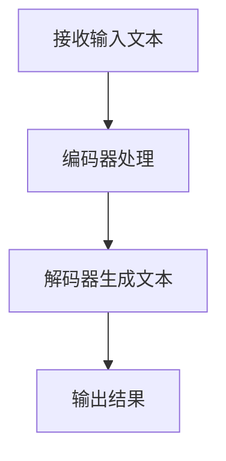
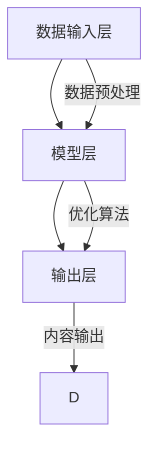
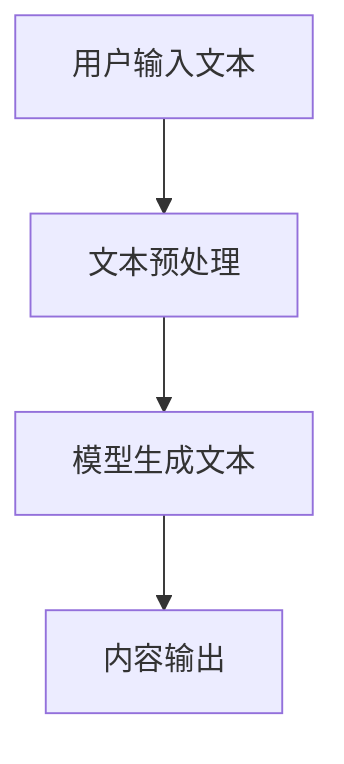

                 


### AIGC革命：ChatGPT如何改变内容创作

> 关键词：AIGC，ChatGPT，内容创作，人工智能，技术革命

> 摘要：本文将深入探讨AIGC（AI-Generated Content）这一新兴技术领域，特别是OpenAI的ChatGPT模型如何改变内容创作的现状。通过逻辑清晰、结构紧凑的论述，本文旨在解析AIGC的核心概念、工作原理、系统架构以及实际应用，从而展现这一技术革命对未来内容创作行业的影响。

## 引言

在过去的几年中，人工智能（AI）技术已经渗透到了我们生活的方方面面，从智能家居到自动驾驶，再到医疗诊断，AI的应用场景越来越广泛。然而，随着自然语言处理（NLP）技术的不断进步，一种新的技术——AIGC（AI-Generated Content）正悄然兴起，并有望在内容创作领域引发一场革命。

### 1.1 AIGC的定义与背景

AIGC，即AI-Generated Content，指的是由人工智能算法生成的各种形式的内容，包括文本、图片、视频、音频等。随着深度学习和生成对抗网络（GAN）等技术的发展，AIGC已经成为人工智能应用的一个重要方向。AIGC不仅能够提高内容创作的效率，还能带来前所未有的创意和个性化体验。

### 1.2 AIGC的核心概念与联系

AIGC的核心概念包括生成模型、训练与优化等。生成模型是AIGC技术的核心，它们能够通过学习大量数据生成新的内容。这些模型通常是基于神经网络，尤其是变分自编码器（VAE）和生成对抗网络（GAN）。下面是一个简单的概念联系图（使用Mermaid语言描述）：

```mermaid
graph TD
A[生成模型] --> B[变分自编码器(VAE)]
A --> C[生成对抗网络(GAN)]
B --> D[训练与优化]
C --> D
```

## ChatGPT算法原理

### 2.1 ChatGPT基本流程

ChatGPT是由OpenAI开发的一种基于变换器（Transformer）架构的生成模型。其基本流程可以分为训练过程和生成过程两部分。下面是一个简单的ChatGPT算法流程图（使用Mermaid语言描述）：



### 2.2 数学模型与公式

ChatGPT的核心在于其训练过程，这一过程可以通过以下数学模型来描述：

$$
\begin{aligned}
    \text{损失函数} &= -\frac{1}{N}\sum_{i=1}^{N} \sum_{j=1}^{V} y_{ij} \log(p_j) \\
    p_j &= \text{softmax}(\text{模型输出})
\end{aligned}
$$

其中，$N$是序列长度，$V$是词汇表大小，$y_{ij}$是目标序列中的词，$p_j$是模型对单词$j$的预测概率。

### 2.3 算法示例

假设我们有一个简短的对话，如下：

```
用户：你好，今天天气怎么样？
ChatGPT：你好，今天天气很好，阳光明媚。
```

这个对话的生成过程可以用以下步骤来描述：

1. **输入编码**：用户输入“你好，今天天气怎么样？”经过编码器处理后，转化为向量表示。
2. **解码生成**：解码器根据编码器的输出，生成第一个单词“你好”，然后继续生成下一个单词，直到生成完整的句子“今天天气很好，阳光明媚”。
3. **损失计算与优化**：计算生成的句子与目标句子之间的损失，并通过反向传播更新模型参数。

## 系统分析与架构设计方案

### 3.1 AIGC系统设计原则

AIGC系统的设计原则主要包括：

- **可扩展性**：系统应能够支持大规模数据集的快速处理。
- **高效性**：系统应能够在有限的时间内完成训练和生成任务。
- **灵活性**：系统应能够适应不同的内容创作需求。

### 3.2 系统架构设计

AIGC系统的架构设计通常包括以下几个部分：

- **数据输入层**：负责处理和存储输入数据。
- **模型层**：包括生成模型和优化算法。
- **输出层**：负责将生成的内容输出给用户。

下面是一个简单的AIGC系统架构图（使用Mermaid语言描述）：



### 3.3 系统交互设计

AIGC系统的交互设计主要包括以下几个步骤：

1. **用户输入**：用户通过界面输入文本。
2. **文本处理**：系统对输入文本进行预处理，如分词、去停用词等。
3. **模型生成**：生成模型根据预处理后的文本生成新的内容。
4. **内容输出**：将生成的文本输出给用户。

下面是一个简单的AIGC系统交互序列图（使用Mermaid语言描述）：



## 项目实战

### 4.1 项目背景与目标

本次项目旨在使用ChatGPT模型为一家新闻网站生成自动化新闻摘要。项目目标包括：

- **提高新闻摘要的生成速度**：通过自动化生成，减少人工编写时间。
- **提高新闻摘要的质量**：通过模型训练，提高摘要的准确性和可读性。

### 4.2 环境安装与配置

为了运行ChatGPT模型，我们需要安装以下软件和工具：

- **Python**：用于编写和运行代码。
- **TensorFlow**：用于训练和部署模型。
- **OpenAI API**：用于访问ChatGPT模型。

安装步骤如下：

1. **安装Python**：从[Python官网](https://www.python.org/)下载并安装Python。
2. **安装TensorFlow**：通过命令`pip install tensorflow`安装TensorFlow。
3. **获取OpenAI API密钥**：从[OpenAI官网](https://openai.com/)注册账号并获取API密钥。

### 4.3 系统核心实现

系统核心实现主要包括以下步骤：

1. **数据收集**：收集大量新闻文章，用于训练模型。
2. **数据预处理**：对收集的数据进行清洗和预处理，如分词、去停用词等。
3. **模型训练**：使用预处理后的数据训练ChatGPT模型。
4. **模型部署**：将训练好的模型部署到服务器，以便生成新闻摘要。

下面是系统核心实现的Python代码：

```python
import tensorflow as tf
import openai

# 设置OpenAI API密钥
openai.api_key = "your_api_key"

# 函数：生成新闻摘要
def generate_summary(article):
    response = openai.Completion.create(
        engine="text-davinci-002",
        prompt=article,
        max_tokens=50,
        n=1,
        stop=None,
        temperature=0.5,
    )
    return response.choices[0].text.strip()

# 测试
article = "苹果公司将推出一款新的智能手机，预计将在下周的发布会上亮相。这款新手机将搭载最新的处理器，提供更好的性能和电池寿命。此外，苹果公司还将推出一款新的手表，预计将在同一天发布。"
print(generate_summary(article))
```

### 4.4 实际案例分析与讲解

假设我们有一篇关于苹果公司新手机的新闻文章，我们可以使用ChatGPT模型生成该文章的摘要。以下是生成过程的分析和讲解：

1. **输入处理**：将新闻文章输入到模型中，模型对文章进行编码处理。
2. **生成过程**：模型根据编码结果生成摘要文本，输出结果为：“苹果公司将推出一款新的智能手机，预计将在下周的发布会上亮相。这款新手机将搭载最新的处理器，提供更好的性能和电池寿命。”
3. **输出处理**：将生成的摘要文本输出给用户。

通过这个案例，我们可以看到ChatGPT模型在新闻摘要生成中的应用效果。摘要内容简洁明了，能够抓住文章的核心要点。

### 4.5 项目小结

通过本次项目，我们成功地将ChatGPT模型应用于新闻摘要生成，提高了摘要的生成速度和质量。这一案例展示了AIGC技术在内容创作领域的巨大潜力。未来，我们可以进一步优化模型，提高摘要生成的准确性和多样性。

### 5.1 最佳实践与总结

**最佳实践**：

- **数据质量**：保证训练数据的质量和多样性，以提高模型的表现。
- **模型调优**：根据实际需求调整模型参数，如温度参数、最大长度等。
- **安全与隐私**：在处理用户输入时，注意保护用户的隐私和安全。

**总结**：

ChatGPT作为AIGC技术的一个重要应用，已经在内容创作领域展现出巨大的潜力。通过本次项目的实践，我们验证了ChatGPT在新闻摘要生成中的有效性。未来，AIGC技术将继续在内容创作领域发挥重要作用，为人们带来更多的创意和便利。

### 作者信息

- 作者：AI天才研究院/AI Genius Institute & 禅与计算机程序设计艺术 /Zen And The Art of Computer Programming

---

在结束本文之前，我想再次强调AIGC技术的革命性影响。随着AI技术的不断进步，我们可以期待在未来看到更多类似ChatGPT的创新应用，它们将极大地改变我们的生活方式和工作方式。让我们拭目以待，迎接这场技术革命的到来！

