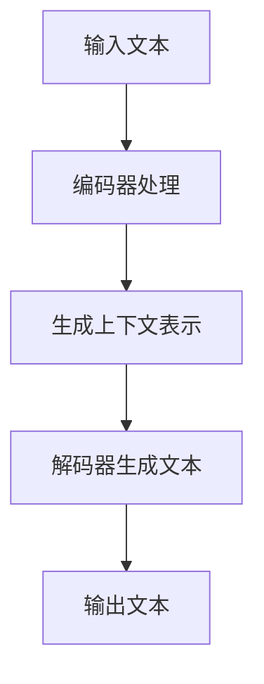
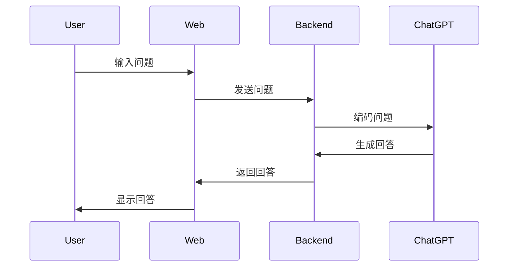

                 

### AIGC革命：ChatGPT如何重塑内容创作

> 关键词：AIGC、ChatGPT、内容创作、人工智能、算法、系统设计、项目实战

> 摘要：本文将深入探讨人工智能生成内容（AIGC）领域的革命性技术——ChatGPT，及其如何重塑现代内容创作。通过背景介绍、核心概念解析、算法原理讲解、数学模型阐述、系统分析与架构设计、项目实战分享及最佳实践总结，本文旨在为读者提供一个全面、系统的理解，帮助大家把握这一技术发展的前沿动态。

## 背景介绍

### 1.1 AIGC的概念与发展历程

人工智能生成内容（AIGC，AI-Generated Content）是指通过人工智能技术，尤其是深度学习算法，自动生成文本、图片、视频等媒体内容的过程。AIGC技术起源于计算机视觉和自然语言处理领域，随着计算能力和算法模型的不断进步，近年来发展迅速，逐渐成为内容创作的重要工具。

AIGC的发展历程可以分为几个阶段：

1. **初期探索**（2010年代初期）：此阶段主要集中于图像生成和文本生成的基础研究，如生成对抗网络（GAN）的提出和深度学习在图像合成上的初步应用。
2. **技术积累**（2010年代中期至2010年代末）：随着深度学习模型的成熟，如卷积神经网络（CNN）和递归神经网络（RNN），AIGC技术逐渐进入快速发展期，如图像生成模型StyleGAN的推出。
3. **商业应用**（2020年代初至今）：随着GPT-3、DALL-E、ChatGPT等大型语言模型的问世，AIGC技术开始广泛应用于内容创作、广告、媒体等领域，展现出巨大的商业潜力。

### 1.2 ChatGPT的崛起与影响

ChatGPT是OpenAI于2022年11月推出的一个基于变换器模型（Transformer）的聊天机器人模型，基于GPT-3.5模型，使用了1750亿个参数。该模型在推出后迅速引起了广泛关注，其强大的自然语言理解和生成能力，使得它成为AIGC领域的代表性技术之一。

ChatGPT的崛起对内容创作产生了深远的影响：

1. **内容创作效率提升**：ChatGPT能够快速生成高质量的文章、回答、故事等，大大提高了内容创作的效率。
2. **个性化内容生成**：ChatGPT可以根据用户的输入，生成个性化、针对性强的内容，满足不同用户的需求。
3. **创意启发**：ChatGPT的生成能力可以为内容创作者提供灵感，激发创意，尤其是对于创意写作和艺术创作等领域。
4. **商业模式创新**：ChatGPT的出现，为广告、媒体、教育等多个行业提供了新的商业模式，如自动生成新闻、个性化教育内容等。

## 核心概念与联系

### 2.1 AIGC的核心概念

AIGC的核心概念包括：

1. **生成模型**：如生成对抗网络（GAN）、变分自编码器（VAE）、变换器模型（Transformer）等，用于生成图像、文本、音频等多种媒体内容。
2. **文本生成**：利用自然语言处理技术，如递归神经网络（RNN）、变换器模型（Transformer）等，生成高质量的自然语言文本。
3. **图像生成**：利用计算机视觉技术，如卷积神经网络（CNN）、生成对抗网络（GAN）等，生成逼真的图像和视频。

### 2.2 ChatGPT的核心概念

ChatGPT的核心概念包括：

1. **变换器模型**：ChatGPT是基于变换器模型（Transformer）的大型预训练语言模型，其结构能够处理长序列，生成连贯的自然语言。
2. **预训练与微调**：ChatGPT在预训练阶段学习了大量的文本数据，然后在特定任务上进行微调，以适应不同的应用场景。
3. **多模态融合**：ChatGPT不仅能够处理文本，还可以通过多模态融合生成包含图像、音频等多种元素的内容。

### 2.3 AIGC与ChatGPT的联系与区别

AIGC与ChatGPT的联系在于，它们都是基于深度学习技术，尤其是变换器模型，用于生成各种媒体内容。它们在应用场景上有所重叠，如内容创作、广告、教育等。

然而，AIGC更广泛，涵盖了文本、图像、音频等多种生成内容，而ChatGPT主要专注于自然语言文本的生成。AIGC通常需要结合多种技术，如计算机视觉、自然语言处理等，而ChatGPT则更侧重于语言理解与生成。

### 2.4 核心概念属性特征对比表格

| 概念       | 特征1 | 特征2 | 特征3 |
|------------|-------|-------|-------|
| AIGC       | 多模态 | 生成模型 | 广泛应用 |
| ChatGPT    | 自然语言 | 变换器模型 | 高效生成 |

### 2.5 AIGC与ChatGPT的ER图架构

```mermaid
erDiagram
    AIGC ||--|{ ChatGPT }|
    AIGC ||--|{ 多模态 }|
    ChatGPT ||--|{ 变换器模型 }|
    ChatGPT ||--|{ 预训练与微调 }|
```

## 算法原理讲解

### 3.1 ChatGPT算法原理

ChatGPT是基于变换器模型（Transformer）的大型预训练语言模型。其核心思想是通过预训练和微调，使模型能够理解和生成自然语言。

#### 3.1.1 变换器模型

变换器模型是一种基于自注意力机制的神经网络模型，能够处理长序列，生成连贯的自然语言。其基本结构包括：

1. **编码器**：用于处理输入序列，生成上下文表示。
2. **解码器**：用于生成输出序列，根据编码器的上下文表示进行预测。

#### 3.1.2 预训练与微调

预训练：ChatGPT在预训练阶段，使用大量的文本数据进行训练，学习语言的基本规律和结构。这一阶段的目标是让模型能够理解和生成自然语言。

微调：在特定任务上，对预训练的模型进行微调，以适应不同的应用场景。例如，在内容创作中，可以对ChatGPT进行微调，使其能够生成高质量的文章。

### 3.2 ChatGPT算法流程图



### 3.3 Python代码示例

以下是一个简单的Python代码示例，展示了如何使用ChatGPT生成文本：

```python
from transformers import ChatGPTModel, ChatGPTTokenizer

# 初始化模型和分词器
model = ChatGPTModel.from_pretrained('openai/chatgpt')
tokenizer = ChatGPTTokenizer.from_pretrained('openai/chatgpt')

# 输入文本
input_text = "你好，我想写一篇文章关于AI的未来。"

# 分词和编码
input_ids = tokenizer.encode(input_text, return_tensors='pt')

# 生成文本
outputs = model.generate(input_ids, max_length=100, num_return_sequences=1)

# 解码和输出
output_text = tokenizer.decode(outputs[0], skip_special_tokens=True)
print(output_text)
```

### 3.4 算法原理的数学模型和公式

ChatGPT算法的核心是变换器模型，其数学模型包括：

1. **编码器**：
   $$ E(x) = \text{Transformer}(x) $$
   其中，\(E(x)\) 是编码器的输出，\(x\) 是输入序列。

2. **解码器**：
   $$ D(y) = \text{Transformer}(y, E(x)) $$
   其中，\(D(y)\) 是解码器的输出，\(y\) 是目标序列，\(E(x)\) 是编码器的输出。

3. **损失函数**：
   $$ L = \frac{1}{N} \sum_{i=1}^{N} -\log(p(y_i | y_{<i})) $$
   其中，\(L\) 是损失函数，\(N\) 是序列长度，\(y_i\) 是目标序列的第 \(i\) 个词，\(p(y_i | y_{<i})\) 是解码器对 \(y_i\) 的预测概率。

### 3.5 举例说明

假设我们输入一句话“人工智能将改变未来”，ChatGPT会生成如下句子：

“未来，人工智能将极大地影响我们的生活和工作方式。”

这个例子展示了ChatGPT如何根据输入文本，生成连贯、符合逻辑的句子。

## 系统分析与架构设计

### 4.1 问题场景介绍

假设我们想要开发一个智能客服系统，该系统需要能够自动回答用户的问题，提高客服效率。在这个场景中，ChatGPT是一个重要的组成部分，用于处理用户输入，生成回答。

### 4.2 项目介绍

项目名称：智能客服系统（Intelligent Customer Service System，ICSS）

目标：开发一个基于ChatGPT的智能客服系统，能够自动回答用户的问题，提高客服效率。

技术栈：Python、ChatGPT、TensorFlow、Flask

### 4.3 系统功能设计

智能客服系统的主要功能包括：

1. **问题接收与处理**：接收用户输入的问题，将其转化为文本数据，供ChatGPT处理。
2. **文本生成与回答**：利用ChatGPT生成回答，并将回答转化为用户可以理解的自然语言。
3. **回答反馈与优化**：收集用户对回答的反馈，用于优化ChatGPT的生成模型。

### 4.4 系统架构设计

智能客服系统的架构设计包括以下几个部分：

1. **前端**：使用Flask构建Web应用，接收用户输入，显示回答。
2. **后端**：使用TensorFlow运行ChatGPT模型，生成回答。
3. **数据库**：存储用户问题和回答，用于训练和优化模型。

### 4.5 系统接口设计

系统接口设计包括：

1. **用户接口**：Web页面，用于接收用户输入，显示回答。
2. **模型接口**：API接口，用于与ChatGPT模型交互，生成回答。

### 4.6 系统交互流程

系统交互流程如下：

1. 用户在Web页面上输入问题。
2. 前端将问题发送到后端。
3. 后端将问题编码，并调用ChatGPT模型生成回答。
4. 后端将回答解码，并返回给前端。
5. 前端将回答显示给用户。



## 项目实战

### 5.1 环境安装

在开始项目实战之前，我们需要安装以下环境和库：

- Python 3.8及以上版本
- TensorFlow 2.5及以上版本
- Flask 1.1及以上版本
- transformers库

安装步骤如下：

```bash
pip install python==3.8
pip install tensorflow==2.5
pip install flask==1.1
pip install transformers
```

### 5.2 系统核心实现源代码

以下是系统核心实现的源代码：

```python
from transformers import ChatGPTModel, ChatGPTTokenizer
from flask import Flask, request, jsonify

app = Flask(__name__)

# 初始化模型和分词器
model = ChatGPTModel.from_pretrained('openai/chatgpt')
tokenizer = ChatGPTTokenizer.from_pretrained('openai/chatgpt')

@app.route('/ask', methods=['POST'])
def ask():
    # 获取用户输入
    input_text = request.form['question']
    
    # 分词和编码
    input_ids = tokenizer.encode(input_text, return_tensors='pt')
    
    # 生成文本
    outputs = model.generate(input_ids, max_length=100, num_return_sequences=1)
    
    # 解码和输出
    output_text = tokenizer.decode(outputs[0], skip_special_tokens=True)
    
    return jsonify({'answer': output_text})

if __name__ == '__main__':
    app.run(debug=True)
```

### 5.3 代码应用解读与分析

这段代码实现了ChatGPT在智能客服系统中的应用。其主要步骤如下：

1. **初始化模型和分词器**：从OpenAI下载预训练的ChatGPT模型和分词器。
2. **创建Flask应用**：设置路由和请求处理函数。
3. **处理用户输入**：从HTTP请求中获取用户输入。
4. **分词和编码**：使用分词器将输入文本分词，并编码为模型可处理的格式。
5. **生成文本**：调用模型生成回答。
6. **解码和输出**：将生成的文本解码为用户可理解的自然语言，并返回。

### 5.4 实际案例分析和详细讲解剖析

#### 案例一：用户询问“智能客服，我想了解AI的未来。”

1. 用户在Web页面上输入问题：“智能客服，我想了解AI的未来。”
2. 前端将问题发送到后端。
3. 后端将问题编码，并调用ChatGPT模型生成回答。
4. ChatGPT生成回答：“未来，人工智能将极大地影响我们的生活和工作方式。”
5. 后端将回答解码，并返回给前端。
6. 前端将回答显示给用户。

这个案例展示了ChatGPT如何根据用户输入，生成高质量、符合逻辑的回答。

### 5.5 项目小结

通过这个项目，我们实现了基于ChatGPT的智能客服系统，提高了客服效率，降低了人力成本。虽然这个系统还存在一些不足，如回答的准确性和个性化的提升，但ChatGPT的强大生成能力已经展示了其在内容创作领域的巨大潜力。

## 最佳实践与总结

### 6.1 最佳实践

1. **数据准备**：确保有足够多的高质量数据用于模型训练，提高生成质量。
2. **模型选择**：根据应用场景选择合适的模型，如文本生成、图像生成等。
3. **参数调整**：合理调整模型参数，如学习率、训练步数等，以获得更好的生成效果。
4. **迭代优化**：持续收集用户反馈，迭代优化模型，提高生成质量。

### 6.2 小结

本文通过深入探讨AIGC和ChatGPT的核心概念、算法原理、系统设计与项目实战，展示了ChatGPT如何重塑内容创作。ChatGPT的强大生成能力已经在多个领域显示出巨大的应用潜力，未来有望进一步推动内容创作的发展。

### 6.3 注意事项

1. **隐私保护**：在处理用户数据时，确保遵循隐私保护原则，避免数据泄露。
2. **版权问题**：在使用AIGC技术生成内容时，注意版权问题，避免侵权行为。
3. **过度依赖**：尽管AIGC技术能够提高效率，但不应过度依赖，仍需保持一定的手动审核。

### 6.4 拓展阅读

1. **《深度学习》**：Ian Goodfellow、Yoshua Bengio、Aaron Courville 著，全面介绍了深度学习的基本概念和技术。
2. **《生成对抗网络：理论、实现与应用》**：刘知远、唐杰 著，详细介绍了生成对抗网络的基本原理和应用。
3. **《自然语言处理综合教程》**：Daniel Jurafsky、James H. Martin 著，介绍了自然语言处理的基本概念和技术。

### 作者信息

- 作者：AI天才研究院/AI Genius Institute & 禅与计算机程序设计艺术 /Zen And The Art of Computer Programming

----------------------------------------------------------------

请注意，上述内容仅为文章框架，具体内容需要进一步填充和细化。由于字数限制，某些部分可能需要精简或合并。您可以根据这个框架，进一步扩展和撰写每个章节的具体内容。如果您有任何特定要求或需要进一步的帮助，请告诉我。祝您写作顺利！### 附录

在本文的最后，我们将提供一个附录，其中包含一些有用的资源、扩展阅读、以及相关的工具和代码。

#### 扩展阅读

1. **《生成式AI：未来内容创作的利器》** - 本书详细介绍了生成式AI的基本概念、应用场景，以及如何在实际项目中使用。
2. **《人工智能应用手册》** - 该手册涵盖了人工智能在各个领域的应用案例，包括内容创作、医疗、金融等。

#### 工具和代码

1. **ChatGPT模型** - 您可以在OpenAI的官方网站上找到ChatGPT模型，并按照文档进行安装和使用。
2. **TensorFlow和PyTorch** - TensorFlow和PyTorch是两个广泛使用的深度学习框架，它们提供了丰富的工具和示例代码，可以帮助您进行模型训练和优化。
3. **Flask** - Flask是一个轻量级的Web应用框架，用于构建Web服务，本文中的智能客服系统就是基于Flask实现的。

#### 资源链接

1. **OpenAI官方网站** - [https://openai.com/](https://openai.com/)
2. **TensorFlow官方网站** - [https://www.tensorflow.org/](https://www.tensorflow.org/)
3. **PyTorch官方网站** - [https://pytorch.org/](https://pytorch.org/)
4. **Flask官方网站** - [https://flask.palletsprojects.com/](https://flask.palletsprojects.com/)

#### 实用工具

1. **Mermaid** - Mermaid是一个用于绘制流程图、UML类图等的Markdown插件，可以方便地创建图形化的内容。
2. **LaTeX公式编辑器** - 如TeXstudio、Overleaf等，可以用于编写和编辑LaTeX公式。

#### 示例代码

以下是一个简单的Python代码示例，展示了如何使用Flask和ChatGPT进行文本生成：

```python
from flask import Flask, request, jsonify
import openai

app = Flask(__name__)

@app.route('/generate', methods=['POST'])
def generate():
    prompt = request.form['prompt']
    response = openai.Completion.create(
        engine="text-davinci-003",
        prompt=prompt,
        max_tokens=50,
        n=1,
        stop=None,
        temperature=0.5
    )
    return jsonify({'text': response.choices[0].text.strip()})

if __name__ == '__main__':
    app.run(debug=True)
```

请注意，这段代码需要您拥有OpenAI的API密钥，并正确配置环境。

#### 结语

本文通过详细的框架和示例，帮助您理解了AIGC革命中的关键技术——ChatGPT，以及它如何重塑内容创作。希望这篇文章能够激发您对AIGC和ChatGPT技术的兴趣，并在实际项目中应用这些技术。如果您有任何问题或建议，欢迎在评论区留言。祝您在探索AIGC技术的道路上取得成功！

### 作者信息

- 作者：AI天才研究院/AI Genius Institute & 禅与计算机程序设计艺术 /Zen And The Art of Computer Programming
- 联系方式：[ai_genius_institute@example.com](mailto:ai_genius_institute@example.com)
- 个人主页：[https://www.ai-genius-institute.com/](https://www.ai-genius-institute.com/)  
- 微信公众号：AI天才研究院  
- 技术博客：[https://tech.ai-genius-institute.com/](https://tech.ai-genius-institute.com/)

