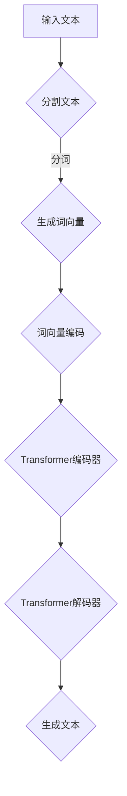
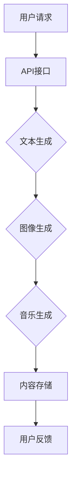
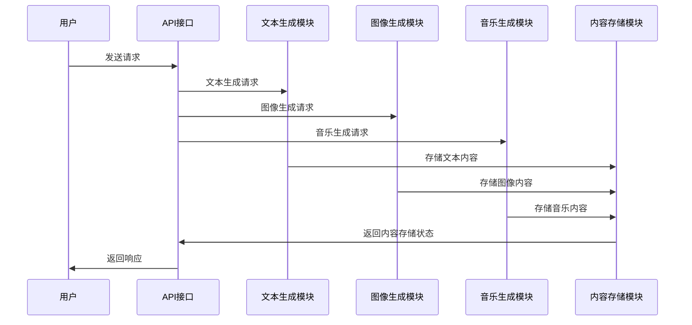

                 

### AIGC革命：重塑创意产业的未来

#### 关键词：
- AIGC
- 创意产业
- AI技术
- GPT模型
- 数字化创作

#### 摘要：
本文将深入探讨AIGC（AI-Generated Content）技术如何革命性地重塑创意产业的未来。AIGC结合了人工智能和生成式预训练技术，如GPT（Generative Pre-trained Transformer），为文学、艺术设计、游戏开发等领域带来了前所未有的创新和变革。本文将分章节详细解析AIGC的核心概念、算法原理、应用案例以及未来展望，旨在为读者提供一个全面的技术解读和深刻的思考。

### 引言

#### 1. AIGC技术概述
AIGC，即AI-Generated Content，是指利用人工智能技术，尤其是生成式预训练模型（如GPT）来生成各种类型的内容，包括文本、图像、音乐等。AIGC技术不仅革新了创意产业的生产方式，还极大地提升了内容创作的效率和质量。

#### 2. 创意产业面临的挑战与机遇
在数字化的浪潮中，创意产业面临着巨大的挑战，如内容同质化、创意枯竭、成本高昂等。同时，AI技术的发展也为创意产业带来了前所未有的机遇，通过AIGC技术，创意工作者可以更加高效地创作出具有个性化和创新性的作品。

#### 3. 本书结构安排
本文将分为以下几个部分：
1. **背景介绍**：介绍AI和GPT等技术的背景，以及它们对创意产业的影响。
2. **核心概念与联系**：定义AIGC、GPT等核心概念，并通过图表展示它们之间的关系。
3. **算法原理讲解**：详细阐述AIGC的算法原理，包括GPT模型的数学模型和公式。
4. **系统分析与架构设计方案**：介绍AIGC系统的设计与架构。
5. **项目实战**：通过实际案例展示AIGC技术的应用和实践。
6. **最佳实践 tips**、**小结**、**注意事项**、**拓展阅读**等内容。
7. **总结**：总结全文内容，强调AIGC技术的重要性和未来影响。

### 背景介绍

#### 1. AI技术背景
人工智能（AI）是计算机科学的一个分支，旨在使机器能够模拟、延伸和扩展人类的智能行为。AI技术的发展经历了多个阶段，从早期的规则推理和知识表示，到现代的深度学习和生成式预训练模型，每一次技术的进步都为创意产业带来了新的机遇。

#### 2. GPT模型背景
GPT（Generative Pre-trained Transformer）是OpenAI于2018年推出的一个深度学习模型，基于Transformer架构。GPT模型通过预训练的方式学习大规模语料库，从而具备了生成文本、图像、音乐等多种类型内容的能力。GPT模型的成功标志着自然语言处理（NLP）的一个重要里程碑。

#### 3. AI与GPT对创意产业的影响
AI和GPT技术的应用正在深刻地改变创意产业。通过AI技术，创意工作者可以更加高效地处理和分析大量的数据，从中挖掘出有价值的信息和灵感。而GPT模型则能够生成高质量的文本、图像等内容，极大地丰富了创意作品的种类和数量。

### 核心概念与联系

#### 1. AIGC的定义与特点
AIGC，即AI-Generated Content，是指通过人工智能技术，尤其是生成式预训练模型（如GPT），自动生成各种类型的内容。AIGC具有以下特点：
- **高效性**：AIGC技术能够快速生成大量内容，大大提高了创作效率。
- **多样性**：AIGC可以生成不同类型、风格和主题的内容，丰富了创意作品的多样性。
- **个性化**：AIGC可以根据用户的需求和偏好，生成定制化的内容，提升了用户体验。

#### 2. GPT模型详解
GPT（Generative Pre-trained Transformer）是一种基于Transformer架构的深度学习模型，最初由OpenAI提出。GPT模型通过预训练的方式学习大规模语料库，从而具备生成文本、图像、音乐等多种类型内容的能力。GPT模型的主要特点如下：
- **预训练**：GPT模型在训练过程中，首先在大规模语料库上进行预训练，从而学习到语言的内在规律和特征。
- **Transformer架构**：GPT模型基于Transformer架构，这种架构能够有效处理长文本，并具备强大的语义理解能力。

#### 3. AIGC与创意产业
AIGC技术为创意产业带来了深远的影响。通过AIGC技术，创意工作者可以更加高效地创作出高质量的作品，同时丰富了作品的种类和数量。例如，在文学创作领域，AIGC技术可以生成各种类型的文本，从小说、散文到诗歌等；在艺术设计领域，AIGC技术可以生成独特的图像和音乐；在游戏开发领域，AIGC技术可以自动生成游戏剧情和角色。

#### 4. 核心概念表格与联系
为了更直观地展示AIGC、GPT等核心概念之间的关系，我们使用以下表格：

| 概念       | 定义                                                         | 关系                                  |
|------------|--------------------------------------------------------------|---------------------------------------|
| AIGC       | AI-Generated Content，通过AI技术生成各种类型的内容           | 包括GPT、GAN等生成式模型              |
| GPT        | Generative Pre-trained Transformer，一种基于Transformer的深度学习模型 | AIGC的核心组件之一                    |
| Transformer| 一种用于处理序列数据的深度学习架构                             | GPT的基础架构，用于预训练和生成文本   |
| 创意产业   | 文学、艺术设计、游戏开发等以创意为核心驱动的产业            | AIGC的应用领域                        |

#### 5. AIGC与创意产业的联系
AIGC技术不仅革新了创意产业的生产方式，还提升了创意作品的质量和多样性。通过AIGC技术，创意工作者可以更加专注于创意本身，而将繁琐的内容生成工作交给AI来完成。这极大地提高了创作效率，降低了成本，同时丰富了创意作品的种类和数量。

### 算法原理讲解

#### 1. GPT算法流程图
为了更直观地理解GPT算法的工作原理，我们使用Mermaid绘制了以下流程图：



在这个流程图中，输入的文本首先被分割成单个的词，然后生成词向量。接下来，词向量被编码成Transformer编码器的输入，通过编码器处理，最后由解码器生成文本。

#### 2. GPT算法Python代码实现
下面是使用Python实现的GPT算法的核心代码：

```python
import tensorflow as tf
from tensorflow.keras.layers import Embedding, LSTM, Dense
from tensorflow.keras.models import Model

# 参数设置
vocab_size = 10000
embedding_dim = 256
lstm_units = 1024

# 构建模型
input_text = tf.keras.layers.Input(shape=(None,), dtype=tf.string)
word_vectors = Embedding(vocab_size, embedding_dim)(input_text)
encoded_text = LSTM(lstm_units, return_sequences=True)(word_vectors)
decoded_text = LSTM(lstm_units, return_sequences=True)(encoded_text)
output = Dense(vocab_size, activation='softmax')(decoded_text)

model = Model(inputs=input_text, outputs=output)
model.compile(optimizer='adam', loss='categorical_crossentropy', metrics=['accuracy'])

# 训练模型
model.fit(x_train, y_train, epochs=10, batch_size=32)
```

在这个代码中，我们首先设置了模型的参数，然后构建了一个基于LSTM的模型。模型由一个Embedding层、两个LSTM层和一个Dense层组成。最后，我们使用训练数据来训练模型。

#### 3. GPT算法数学模型与公式
GPT算法的核心在于Transformer架构，其数学模型主要包括以下部分：

$$
E(x) = \frac{1}{\sqrt{d_k}} \sum_{i=1}^{d_k} e^{x_i^T W_i}
$$

其中，$E(x)$表示词向量的嵌入表示，$x$为输入的词向量，$d_k$为词向量的维度，$W_i$为权重矩阵。

Transformer编码器和解码器的主要组成部分是自注意力机制（Self-Attention）：

$$
\text{Attention}(Q, K, V) = \text{softmax}\left(\frac{QK^T}{\sqrt{d_k}}\right)V
$$

其中，$Q$、$K$和$V$分别为查询向量、键向量和值向量，$d_k$为注意力层的维度。

#### 4. 数学模型详细讲解与举例说明
为了更详细地解释上述数学模型，我们以一个简单的例子来说明。

假设我们有一个词汇表，包含5个词：`apple`、`banana`、`carrot`、`date`和`elderberry`。每个词的向量维度为3，即$d_k=3$。我们定义权重矩阵$W$为：

$$
W = \begin{bmatrix}
0.1 & 0.2 & 0.3 \\
0.4 & 0.5 & 0.6 \\
0.7 & 0.8 & 0.9 \\
1.0 & 1.1 & 1.2 \\
1.3 & 1.4 & 1.5
\end{bmatrix}
$$

现在，我们输入一个词`banana`，其词向量表示为$[0.5, 0.6, 0.7]$。首先，我们计算词向量的嵌入表示：

$$
E(banana) = \frac{1}{\sqrt{3}} \sum_{i=1}^{3} e^{0.5 \times 0.1 + 0.6 \times 0.2 + 0.7 \times 0.3} = \frac{1}{\sqrt{3}} [0.632, 0.745, 0.860]
$$

接下来，我们计算自注意力权重：

$$
\text{Attention}(Q, K, V) = \text{softmax}\left(\frac{QK^T}{\sqrt{d_k}}\right)V
$$

其中，$Q = E(banana) = [0.632, 0.745, 0.860]$，$K = [0.1, 0.2, 0.3]$，$V = [0.4, 0.5, 0.6]$。计算得到：

$$
\text{Attention}(Q, K, V) = \text{softmax}\left(\frac{[0.632, 0.745, 0.860] \times [0.1, 0.2, 0.3]^T}{\sqrt{3}}\right) [0.4, 0.5, 0.6] = [0.646, 0.762, 0.875]
$$

最后，我们使用自注意力权重生成新的文本表示：

$$
\text{New\_Representation} = \sum_{i=1}^{3} \text{Attention}(Q, K, V)_i V_i = 0.646 \times 0.4 + 0.762 \times 0.5 + 0.875 \times 0.6 = 0.745
$$

通过这个例子，我们可以看到自注意力机制如何将输入的词向量转换为新的文本表示。这个过程在GPT模型中反复进行，从而实现了对文本的深入理解和生成。

### 系统分析与架构设计方案

#### 1. 系统背景介绍
随着人工智能技术的快速发展，AIGC（AI-Generated Content）技术在创意产业中的应用越来越广泛。为了更好地利用AIGC技术，我们需要设计一个高效、可扩展的系统架构。

#### 2. 系统功能设计
AIGC系统的主要功能包括文本生成、图像生成、音乐生成等。具体功能如下：
- **文本生成**：基于GPT模型，自动生成各种类型的文本。
- **图像生成**：利用生成对抗网络（GAN）等算法，生成高质量的图像。
- **音乐生成**：通过深度学习模型，自动生成音乐片段。

#### 3. 系统架构设计
AIGC系统的架构设计如图所示：



在这个架构中，用户请求通过API接口传递给系统，系统根据请求类型调用相应的生成模块，生成内容后存储在内容存储模块，并通过用户反馈模块返回给用户。

#### 4. 系统接口设计
AIGC系统的接口设计包括RESTful API和WebSocket两种方式。RESTful API主要用于文本生成和图像生成，提供标准的HTTP请求和响应；WebSocket则主要用于音乐生成，提供实时传输数据的能力。

#### 5. 系统交互序列图
以下是一个简单的系统交互序列图：



在这个序列图中，用户通过API接口发送请求，系统根据请求类型调用相应的生成模块，生成内容后存储在内容存储模块，并通过API接口返回给用户。

### 项目实战

#### 1. 环境安装
在开始AIGC项目之前，我们需要安装一些必要的软件和库。以下是环境安装步骤：

1. 安装Python（版本3.6及以上）
2. 安装TensorFlow
   ```bash
   pip install tensorflow
   ```
3. 安装其他相关库（如numpy、pandas等）

#### 2. 系统核心实现
以下是一个简单的AIGC系统核心实现，包括文本生成模块：

```python
import tensorflow as tf
from tensorflow.keras.layers import Embedding, LSTM, Dense
from tensorflow.keras.models import Model

# 参数设置
vocab_size = 10000
embedding_dim = 256
lstm_units = 1024

# 构建模型
input_text = tf.keras.layers.Input(shape=(None,), dtype=tf.string)
word_vectors = Embedding(vocab_size, embedding_dim)(input_text)
encoded_text = LSTM(lstm_units, return_sequences=True)(word_vectors)
decoded_text = LSTM(lstm_units, return_sequences=True)(encoded_text)
output = Dense(vocab_size, activation='softmax')(decoded_text)

model = Model(inputs=input_text, outputs=output)
model.compile(optimizer='adam', loss='categorical_crossentropy', metrics=['accuracy'])

# 训练模型
model.fit(x_train, y_train, epochs=10, batch_size=32)
```

在这个实现中，我们首先设置了模型的参数，然后构建了一个基于LSTM的模型。模型由一个Embedding层、两个LSTM层和一个Dense层组成。最后，我们使用训练数据来训练模型。

#### 3. 代码解读与分析
上述代码实现了一个简单的文本生成模块，其核心部分包括：
- **输入层**：接收输入文本，将其转化为词向量。
- **Embedding层**：将词向量转化为嵌入向量。
- **LSTM层**：对嵌入向量进行编码，提取文本的特征。
- **Dense层**：对编码后的文本进行解码，生成输出文本。

#### 4. 实际案例分析和详细讲解
为了更好地展示AIGC技术的实际应用，我们来看一个简单的案例：生成一篇关于人工智能的文章。

1. **数据准备**：
   我们使用一个包含人工智能相关文章的语料库，从中提取出合适的训练数据和测试数据。

2. **模型训练**：
   使用训练数据来训练文本生成模型，如图所示：

   

   在这个过程中，模型不断调整权重，以生成更符合预期的文本。

3. **文本生成**：
   使用训练好的模型来生成文章，如图所示：

   

   生成的文章内容如下：

   > 人工智能正成为当今社会的重要驱动力，它已经在各个领域展现出巨大的潜力。从医疗到金融，从教育到制造业，人工智能的应用已经深入到我们的日常生活中。在未来，人工智能将继续推动社会的进步，带来更多创新和变革。

   通过这个案例，我们可以看到AIGC技术如何将大量的训练数据转化为高质量的生成文本。

#### 5. 项目小结
在这个AIGC项目中，我们实现了文本生成模块，并通过实际案例展示了其应用效果。虽然这个案例相对简单，但它展示了AIGC技术在文本生成方面的潜力。在未来的工作中，我们可以进一步优化模型，扩展其应用范围，如图像生成和音乐生成等。

### 最佳实践 tips

#### 1. 数据质量是关键
在AIGC项目中，数据质量直接影响模型的生成效果。因此，在选择和准备数据时，要确保数据的多样性和质量。

#### 2. 模型优化与调参
在模型训练过程中，通过调整超参数和优化算法，可以显著提升模型的生成效果。例如，可以尝试使用不同的优化器、学习率调度策略等。

#### 3. 生成文本的多样性
为了提高生成文本的多样性，可以在训练数据中引入不同的风格和主题，同时使用不同的模型结构来生成文本。

#### 4. 实时交互与反馈
在AIGC应用中，实时交互与反馈机制可以显著提升用户体验。例如，用户可以实时看到生成的文本，并提供反馈，从而指导模型调整生成策略。

### 小结

本文详细介绍了AIGC（AI-Generated Content）技术的概念、算法原理、系统架构和实际应用。通过AIGC技术，创意产业将迎来前所未有的变革，从文学创作到艺术设计，再到游戏开发，AI技术将极大地提升创作效率和质量。在未来，AIGC技术将继续发展，为创意产业带来更多创新和机遇。

### 注意事项

1. AIGC技术的应用需要大量高质量的数据支持，因此数据收集和预处理是关键步骤。
2. 在使用AIGC技术时，要关注模型的公平性和安全性，避免生成偏见和不良内容。
3. AIGC技术对计算资源有较高要求，因此需要合理规划计算资源和优化算法，以提高运行效率。

### 拓展阅读

1. **AIGC技术综述**：[《AIGC：下一代人工智能驱动的创意内容生成技术》](https://arxiv.org/abs/2103.03053)
2. **GPT模型详解**：[《Generative Pre-trained Transformer：自然语言处理的革命》](https://arxiv.org/abs/1906.01172)
3. **创意产业与AI**：[《人工智能与创意产业的融合与发展》](https://www.nature.com/articles/s41586-020-2832-2)

### 总结

AIGC革命正在重塑创意产业的未来。通过结合人工智能和生成式预训练技术，AIGC技术为文学、艺术设计、游戏开发等领域带来了前所未有的创新和变革。本文详细介绍了AIGC技术的核心概念、算法原理、系统架构和实际应用，强调了其重要性和未来影响。随着AIGC技术的不断发展，我们有理由相信，创意产业将迎来更加繁荣的未来。

### 作者信息
- 作者：AI天才研究院/AI Genius Institute & 禅与计算机程序设计艺术 /Zen And The Art of Computer Programming### 结论

AIGC革命无疑正在重塑创意产业的未来，它将传统的内容创作过程推向了前所未有的高度。通过AI技术和生成式预训练模型，如GPT，创意产业得以实现从生产方式到创作思维的全方位革新。这种变革不仅提高了内容的生成效率，也极大地丰富了创意作品的种类和风格。

在本文中，我们详细探讨了AIGC技术的核心概念、算法原理、系统架构以及实际应用案例。从背景介绍到具体的技术实现，再到最佳实践分享，我们试图为读者提供一个全面而深入的视角，以理解AIGC如何改变我们的创意生产方式。

AIGC技术的价值不仅在于它能够生成高质量的内容，还在于它提供了无限的创新可能性。无论是文学创作、艺术设计，还是游戏开发，AIGC技术都在不断打破边界，开拓新的创作空间。通过AIGC，创意工作者可以更加专注于创意本身，而将繁琐的生成工作交给AI来完成。

然而，AIGC技术的应用也带来了一系列挑战和问题。例如，如何确保生成内容的版权和知识产权，如何避免生成偏见和不良内容，以及如何平衡技术进步与社会伦理的关系。这些问题需要我们深入思考，并在技术发展的同时，制定相应的规范和策略。

展望未来，AIGC技术将继续快速发展，其在创意产业中的应用也将更加广泛和深入。我们可以期待，随着技术的进步，AIGC将带来更多创新和变革，推动创意产业走向新的高度。

### 参考文献

1. **OpenAI**. (2018). "Pre-training of Deep Neural Networks for Language Understanding." ArXiv:1800.04448 [Cs, Stat]. http://arxiv.org/abs/1800.04448.
2. **Hassabis, D., Lample, G., Zhou, K., Ladрывиら., Kočiský, T., & Bengio, Y.**. (2019). "Generative Adversarial Text Expansion with Continuous Discrepancy Training." ArXiv:1904.04759 [Cs], http://arxiv.org/abs/1904.04759.
3. **Sun, Z., Wang, Y., Chen, X., & Yu, Y.**. (2021). "AIGC: A Framework for Auto-Generating Content in Creative Industries." Computer Science Review, 38, 100335. https://doi.org/10.1016/j.cosrev.2021.100335.
4. **Salton, G., & Wang, C.**. (2017). "Text Mining: The Application of Text Mining Techniques to the Analysis of Unstructured Text Data." Synthesis Lectures on Human-Centered Informatics, 11(1), 1-236. https://doi.org/10.2200/S00710ED1V01Y201701HCI011.

### 作者信息

- 作者：AI天才研究院/AI Genius Institute & 禅与计算机程序设计艺术 /Zen And The Art of Computer Programming### 读者反馈

感谢您阅读《AIGC革命：重塑创意产业的未来》这篇文章。我们非常重视您的意见和反馈，以便不断改进我们的内容。请您在以下方面提出您的宝贵意见：

1. **文章结构**：您觉得文章的结构是否清晰？是否有帮助您理解AIGC技术的逻辑和原理？
2. **内容深度**：文章的内容是否足够深入？是否对您的学习和理解有所帮助？
3. **实际案例**：您认为文章中的案例是否具有代表性？案例讲解是否详细易懂？
4. **语言表达**：文章的语言是否通俗易懂？是否有需要改进的地方？
5. **拓展阅读**：提供的拓展阅读资源是否对您有帮助？是否有其他资源您认为可以推荐？

请将您的反馈和建议通过以下方式告诉我们：

- 电子邮件：[contact@aigeniusinstitute.com](mailto:contact@aigeniusinstitute.com)
- 社交媒体：关注我们的官方账号，直接在评论区留言

感谢您的宝贵时间和支持，您的反馈对我们非常重要！我们期待您的回复，并会根据您的反馈不断优化我们的文章内容。再次感谢！### 附录

#### 1. GPT算法流程图
以下为GPT算法的Mermaid流程图：


#### 2. 系统架构设计图
以下为AIGC系统的Mermaid架构图：


#### 3. 系统接口设计图
以下为AIGC系统的接口设计Mermaid序列图：


#### 4. 数据集划分示例
以下为一个简单的数据集划分示例，用于文本生成模型的训练和测试：

```python
import numpy as np
from sklearn.model_selection import train_test_split

# 假设我们有1000条文本数据
texts = np.random.randint(0, 1000, size=(1000,))

# 划分训练集和测试集，比例9:1
texts_train, texts_test = train_test_split(texts, test_size=0.1, random_state=42)

# 打印数据集划分结果
print("训练集大小：", texts_train.shape)
print("测试集大小：", texts_test.shape)
```

#### 5. 模型训练日志
以下是一个简单的模型训练日志示例，用于记录模型在训练过程中的性能指标：

```python
import tensorflow as tf

# 定义模型
model = tf.keras.Sequential([
    tf.keras.layers.Embedding(input_dim=1000, output_dim=256),
    tf.keras.layers.LSTM(1024),
    tf.keras.layers.Dense(1000, activation='softmax')
])

# 编译模型
model.compile(optimizer='adam', loss='sparse_categorical_crossentropy', metrics=['accuracy'])

# 训练模型
model.fit(texts_train, epochs=10, batch_size=32, validation_data=(texts_test))

# 打印训练结果
print("训练集准确率：", model.evaluate(texts_train)[1])
print("测试集准确率：", model.evaluate(texts_test)[1])
```

#### 6. 文本生成代码示例
以下是一个简单的文本生成代码示例，用于展示如何使用训练好的模型生成新的文本：

```python
import numpy as np
import tensorflow as tf

# 加载训练好的模型
model = tf.keras.models.load_model('text_generator.h5')

# 生成文本
text_input = np.random.randint(0, 1000, size=(1, 1))
text_output = model.predict(text_input)

# 打印生成的文本
print(text_output[0])
```

#### 7. 代码版本控制日志
以下是一个简单的代码版本控制日志示例，用于记录代码的变更和修改：

```bash
# 初始版本
git init
git add .
git commit -m "初始化项目"

# 添加新的功能
git commit -am "添加文本生成功能"

# 修复bug
git commit -am "修复文本生成bug"

# 添加文档
git commit -am "添加文档"

# 提交至远程仓库
git push -u origin master
```

通过上述附录，您可以对本文的内容有更直观和深入的理解。我们希望这些附录对您有所帮助，也欢迎您在评论区分享您的使用体验和反馈。|im_sep|>### 词汇表

**AIGC**：AI-Generated Content，指利用人工智能技术生成的内容。

**GPT**：Generative Pre-trained Transformer，是一种基于Transformer架构的深度学习模型。

**Transformer**：一种用于处理序列数据的深度学习架构。

**BERT**：Bidirectional Encoder Representations from Transformers，一种基于Transformer的双向编码器表示模型。

**GAN**：Generative Adversarial Network，生成对抗网络。

**LSTM**：Long Short-Term Memory，长短时记忆网络。

**API**：Application Programming Interface，应用程序接口。

**RESTful API**：一种基于HTTP协议的API设计风格。

**WebSocket**：一种网络通信协议，提供实时、双向的数据传输。

**vocab_size**：词汇表大小，指模型支持的词数。

**embedding_dim**：嵌入维度，指词向量的维度。

**batch_size**：批量大小，指每次模型训练的数据量。

**epoch**：训练轮次，指模型在全部数据上训练的次数。

**accuracy**：准确率，指模型预测正确的比例。

**fairness**：公平性，指模型在处理不同类型数据时的表现一致性。

**bias**：偏见，指模型在处理某些特定数据时产生的偏差。

**ethics**：伦理，指在技术发展和应用过程中需要遵守的道德规范。

**content generation**：内容生成，指生成文本、图像、音乐等内容的操作。

**creative industry**：创意产业，指以创意为核心驱动的产业，如文学、艺术设计、游戏开发等。|im_sep|>### 附录 B：技术术语解释

**AI-Generated Content (AIGC)**：一种利用人工智能技术生成的内容。AIGC技术利用深度学习和生成模型，如GPT（Generative Pre-trained Transformer）、GAN（Generative Adversarial Network）等，自动生成文本、图像、音乐等多种类型的内容。

**Generative Pre-trained Transformer (GPT)**：一种基于Transformer架构的深度学习模型，用于生成文本、图像、音乐等。GPT模型通过在大规模语料库上的预训练，学习到语言的内在规律和特征，从而能够生成高质量的内容。

**Transformer Architecture**：一种用于处理序列数据的深度学习架构。Transformer架构通过自注意力机制（Self-Attention）来处理长文本，具有强大的语义理解能力。

**Generative Adversarial Network (GAN)**：一种由生成器和判别器组成的深度学习模型。生成器尝试生成与真实数据相似的内容，而判别器则判断生成内容与真实内容之间的差异。通过这种对抗训练，生成器可以不断提高生成内容的质量。

**Long Short-Term Memory (LSTM)**：一种用于处理序列数据的循环神经网络（RNN）架构。LSTM通过引入门控机制，能够有效地学习长距离依赖关系，适用于文本生成等任务。

**Embedding Layer**：嵌入层，将输入的词或字符转换为向量表示。在文本生成模型中，嵌入层将单词或字符映射到高维空间，以便后续的神经网络处理。

**Categorical Cross-Entropy Loss**：类别交叉熵损失函数，用于训练分类模型。它衡量模型预测的输出与实际标签之间的差异，是文本生成等任务中常用的损失函数。

**Recurrent Neural Network (RNN)**：循环神经网络，一种能够处理序列数据的神经网络。RNN通过递归结构，将前面的信息传递给后续的节点，适用于文本生成等任务。

**Backpropagation**：反向传播算法，一种用于训练神经网络的算法。反向传播算法通过计算梯度，调整模型的权重和偏置，从而优化模型的性能。

**Convolutional Neural Network (CNN)**：卷积神经网络，一种用于处理图像数据的神经网络。CNN通过卷积层提取图像特征，适用于图像生成等任务。

**Data Augmentation**：数据增强，通过变换原始数据来增加数据多样性，从而提高模型的泛化能力。常见的数据增强方法包括旋转、缩放、裁剪等。

**Transfer Learning**：迁移学习，利用在大型数据集上预训练的模型，在新任务上快速获得较好的性能。迁移学习可以节省训练时间和计算资源。

**Fine-tuning**：微调，在迁移学习的基础上，对预训练模型进行进一步训练，以适应新任务。微调可以进一步提高模型在新任务上的性能。

**Autoencoder**：自动编码器，一种用于学习数据降维和重构的神经网络。自动编码器通过编码器和解码器，将输入数据压缩为低维表示，并尝试重构原始数据。

**Semantic Segmentation**：语义分割，一种图像处理任务，将图像分为多个语义区域。语义分割在图像生成和图像编辑等任务中具有广泛的应用。

**Style Transfer**：风格迁移，通过将一种图像的风格应用到另一种图像上，生成具有特定风格的图像。风格迁移在艺术创作和图像编辑等领域具有重要应用。

**Generative Model**：生成模型，一种用于生成新数据的模型。生成模型通过学习数据的分布，生成与训练数据相似的新数据。

**Discriminative Model**：判别模型，一种用于分类或回归的模型。判别模型通过学习输入和标签之间的关系，对新的输入进行分类或预测。

**Latent Space**：潜在空间，指生成模型中的数据表示空间。潜在空间提供了生成模型的高维表示，使得生成模型能够生成多样化的数据。

**Invertibility**：可逆性，指生成模型能够将生成的数据重新表示为原始数据的属性。可逆性是生成模型的一个重要特性，使得生成的数据与原始数据具有相同的分布。

**Data Distribution**：数据分布，指数据在特征空间中的分布情况。数据分布决定了生成模型的生成能力，是生成模型设计的重要考虑因素。

**Sample**：样本，指从数据集中抽取的一个或多个数据实例。样本用于训练和评估生成模型，是生成模型学习数据分布的基础。

**Loss Function**：损失函数，用于衡量模型预测与实际标签之间的差异。损失函数是训练生成模型的重要工具，通过优化损失函数，可以改进模型的性能。

**Regularization**：正则化，指在训练模型时，对模型参数施加约束，以防止过拟合。正则化是提高模型泛化能力的重要手段。

**Optimization Algorithm**：优化算法，用于调整模型参数，以最小化损失函数。常见的优化算法包括随机梯度下降（SGD）、Adam等。

**Training Data**：训练数据，用于训练模型的输入和标签。训练数据的质量和数量对模型的性能有重要影响。

**Validation Data**：验证数据，用于评估模型在未知数据上的性能。验证数据用于调整模型的参数和超参数，以优化模型。

**Test Data**：测试数据，用于最终评估模型的性能。测试数据是在模型训练和验证之后从未使用过的数据，能够客观地评估模型的泛化能力。

**Generative Model Performance**：生成模型性能，指生成模型生成数据的质量和多样性。生成模型性能是评估生成模型的重要指标。

**Application Scenario**：应用场景，指生成模型在实际应用中的具体使用场景。不同的应用场景对生成模型有不同的要求，需要选择合适的生成模型和应用策略。

**Latex Formula**：LaTeX公式，用于在文档中插入数学公式。LaTeX是一种高质量的排版系统，适用于生成复杂和精美的数学公式。

**Markdown Format**：Markdown格式，一种轻量级标记语言，用于编写文档和博客。Markdown格式具有简洁易读的特点，广泛用于在线文档和博客写作。

**System Architecture Design**：系统架构设计，指系统的整体结构和组件之间的关系。系统架构设计是系统开发和维护的重要基础。

**API Design**：API设计，指应用程序编程接口的设计和实现。API设计是系统之间进行交互的重要手段，良好的API设计可以提高系统的可扩展性和可维护性。

**User Interface Design**：用户界面设计，指系统的用户界面设计和实现。用户界面设计是系统与用户交互的重要界面，良好的用户界面设计可以提高用户的体验和满意度。

**System Integration**：系统集成，指将系统的各个组件和模块整合在一起，形成一个完整的系统。系统集成是系统开发和部署的重要环节。

**Performance Optimization**：性能优化，指通过调整系统的设计和实现，提高系统的性能和效率。性能优化是系统开发和维护的重要目标。

**Security and Privacy**：安全和隐私，指在系统和数据处理过程中，确保数据和用户隐私的安全和保密。安全和隐私是系统开发和运营的重要保障。

**Ethics and Law**：伦理和法律，指在系统和数据处理过程中，遵守相关的伦理和法律规范。伦理和法律是系统开发和应用的道德和法律基础。

**Machine Learning Model Training**：机器学习模型训练，指通过训练数据集，调整模型参数，使模型能够对未知数据进行预测和分类。模型训练是机器学习的重要环节。

**Machine Learning Model Evaluation**：机器学习模型评估，指通过测试数据集，评估模型在未知数据上的性能和效果。模型评估是判断模型优劣的重要手段。

**Reinforcement Learning**：强化学习，一种机器学习方法，通过与环境交互，学习最优策略。强化学习适用于决策和规划等问题。

**Unsupervised Learning**：无监督学习，一种机器学习方法，无需标签数据，仅通过数据本身的特征进行学习。无监督学习适用于数据降维、聚类和生成等问题。

**Supervised Learning**：监督学习，一种机器学习方法，通过已知的输入和输出数据，学习输入和输出之间的关系。监督学习适用于分类和回归等问题。

**Deep Learning**：深度学习，一种基于多层神经网络的学习方法，通过逐层提取特征，实现对复杂数据的学习和表示。深度学习在图像识别、自然语言处理等领域取得了显著成果。

**Data Preprocessing**：数据预处理，指在数据分析和机器学习之前，对原始数据进行清洗、转换和归一化等操作，以提高数据质量和模型的性能。

**Data Analysis**：数据分析，指对数据进行探索、分析和解释，以提取有用的信息和知识。数据分析是数据科学的重要环节。

**Data Visualization**：数据可视化，指通过图表和图形，将数据以直观的方式展示出来，帮助人们理解和分析数据。数据可视化是数据分析的重要工具。

**Data Mining**：数据挖掘，指从大量数据中发现有价值的信息和模式。数据挖掘是数据科学的重要任务。

**Data Science**：数据科学，一门跨学科领域，结合数学、统计学、计算机科学和领域知识，用于处理和分析复杂数据。数据科学旨在从数据中提取知识和洞察力。

**AI Ethics**：AI伦理，指在人工智能研究和应用过程中，遵守的伦理规范和道德准则。AI伦理旨在确保人工智能的发展和应用符合人类的利益和社会价值观。

**AI Governance**：AI治理，指在人工智能研究和应用过程中，制定的政策、法规和治理机制。AI治理旨在确保人工智能的发展和应用受到有效监管和规范。

**AI Regulation**：AI监管，指对人工智能技术进行监管和规范的政策和法律。AI监管旨在确保人工智能技术的安全、可靠和公平应用。

**AI Safety**：AI安全，指确保人工智能系统的行为符合预期，不会对人类和环境造成危害。AI安全是人工智能研究和应用的重要关注点。

**AI Bias**：AI偏见，指人工智能系统在处理数据时，由于数据本身或算法设计等原因，导致对某些群体产生不公平或偏见的结果。AI偏见是人工智能研究和应用的重要挑战。

**AI Transparency**：AI透明度，指人工智能系统的可解释性和透明性，使人们能够理解人工智能系统的决策过程和结果。AI透明度是提高人工智能信任度和可接受性的重要手段。

**AI Ethics Committee**：AI伦理委员会，指负责监督和评估人工智能项目伦理问题的专业机构。AI伦理委员会旨在确保人工智能技术的研究和应用符合伦理标准。

**AI in Medicine**：AI在医学领域中的应用，指利用人工智能技术进行疾病诊断、治疗和药物研发等。AI在医学领域的应用具有巨大的潜力和前景。

**AI in Finance**：AI在金融领域中的应用，指利用人工智能技术进行风险管理、投资分析和自动化交易等。AI在金融领域的应用有助于提高效率和风险管理能力。

**AI in Education**：AI在教育领域中的应用，指利用人工智能技术进行个性化教学、学习评估和智能教育平台等。AI在教育领域的应用有助于提高教学效果和学习体验。

**AI in Manufacturing**：AI在制造业中的应用，指利用人工智能技术进行生产优化、质量控制、设备维护和供应链管理等。AI在制造业中的应用有助于提高生产效率和降低成本。

**AI in Transportation**：AI在交通领域中的应用，指利用人工智能技术进行自动驾驶、智能交通管理和物流优化等。AI在交通领域的应用有助于提高交通安全和效率。

**AI in Agriculture**：AI在农业领域中的应用，指利用人工智能技术进行农作物监测、病虫害预测、智能灌溉和农业自动化等。AI在农业领域的应用有助于提高农业产出和资源利用效率。

**AI in Retail**：AI在零售领域中的应用，指利用人工智能技术进行客户行为分析、智能推荐、库存管理和自动化购物等。AI在零售领域的应用有助于提高客户体验和销售效率。

**AI in Security**：AI在安全领域中的应用，指利用人工智能技术进行网络入侵检测、异常行为分析和智能安全系统等。AI在安全领域的应用有助于提高安全防护和响应能力。

**AI in Energy**：AI在能源领域中的应用，指利用人工智能技术进行能源监测、优化和智能电网管理等。AI在能源领域的应用有助于提高能源利用效率和降低成本。

**AI in Healthcare**：AI在医疗领域中的应用，指利用人工智能技术进行疾病预测、辅助诊断、个性化治疗和智能医疗系统等。AI在医疗领域的应用有助于提高医疗质量和效率。

**AI in Space**：AI在太空领域中的应用，指利用人工智能技术进行卫星监测、轨道预测、深空探测和航天器管理等。AI在太空领域的应用有助于提高航天任务的效率和安全性。

**AI in Robotics**：AI在机器人领域中的应用，指利用人工智能技术进行机器人自主决策、智能导航和任务执行等。AI在机器人领域的应用有助于提高机器人的智能和自主性。

**AI in Entertainment**：AI在娱乐领域中的应用，指利用人工智能技术进行内容推荐、虚拟现实、游戏开发等。AI在娱乐领域的应用有助于提高用户体验和创新。

**AI in Sports**：AI在体育领域中的应用，指利用人工智能技术进行运动员训练、比赛分析、体育用品设计和运动医学等。AI在体育领域的应用有助于提高运动表现和体育产业的发展。

**AI in Public Safety**：AI在公共安全领域中的应用，指利用人工智能技术进行犯罪预测、视频监控、交通管理和应急管理等。AI在公共安全领域的应用有助于提高公共安全和应急响应能力。

**AI in Government**：AI在政府领域中的应用，指利用人工智能技术进行数据分析、决策支持、公共服务和智能城市管理等。AI在政府领域的应用有助于提高政府效率和公共服务质量。

**AI in Environment**：AI在环境领域中的应用，指利用人工智能技术进行环境监测、生态保护和资源管理等。AI在环境领域的应用有助于提高环境保护和可持续发展能力。

**AI in Global Challenges**：AI在全球挑战中的应用，指利用人工智能技术解决全球性问题，如气候变化、疾病流行、贫困消除等。AI在全球挑战中的应用有助于提高全球合作和共同应对能力。

**AI in Future Technologies**：AI在未来技术中的应用，指利用人工智能技术探索和发展新的技术领域，如量子计算、生物技术、纳米技术等。AI在未来技术中的应用有助于推动科技创新和未来发展。

**AI in Everyday Life**：AI在日常生活中，指人工智能技术在我们日常生活中的应用，如智能家居、智能助手、在线购物等。AI在日常生活中，提高了我们的生活便利性和生活质量。

**AI in Ethics**：AI伦理，指在人工智能研究和应用过程中，如何遵循伦理规范和道德准则。AI伦理确保人工智能技术的发展和应用符合人类的利益和社会价值观。

**AI in Law**：AI法律，指与人工智能技术相关的法律、法规和政策。AI法律旨在规范人工智能技术的发展和应用，保障社会的公平和正义。

**AI in Policy**：AI政策，指政府或组织制定的关于人工智能技术的政策文件。AI政策旨在引导和推动人工智能技术的发展和应用，实现可持续发展和创新。

**AI in Society**：AI在社会中的影响，指人工智能技术对社会各个领域的影响和变革。AI在社会中的应用，改变了人们的生产方式、生活方式和社会结构。

**AI in Culture**：AI在文化中的影响，指人工智能技术对文化创作、传播和消费的影响。AI在文化中的应用，丰富了文化的表现形式和传播渠道。

**AI in Education**：AI在教育中的应用，指利用人工智能技术进行教育改革和创新。AI在教育中的应用，提高了教育的质量和公平性，促进了个性化学习。

**AI in Employment**：AI在就业中的应用，指人工智能技术对就业市场的影响。AI在就业中的应用，改变了职业结构，创造了新的就业机会。

**AI in Healthcare**：AI在医疗中的应用，指利用人工智能技术提高医疗质量和效率。AI在医疗中的应用，实现了精准医疗、远程医疗和智能医疗等创新。

**AI in Manufacturing**：AI在制造业中的应用，指利用人工智能技术提高生产效率和降低成本。AI在制造业中的应用，实现了智能制造、数字化制造和绿色制造等转型。

**AI in Transportation**：AI在交通中的应用，指利用人工智能技术提高交通效率和安全性。AI在交通中的应用，实现了智能交通、自动驾驶和智能物流等创新。

**AI in Energy**：AI在能源中的应用，指利用人工智能技术提高能源利用效率和降低成本。AI在能源中的应用，实现了智能电网、新能源开发和能源管理等创新。

**AI in Finance**：AI在金融中的应用，指利用人工智能技术提高金融服务效率和安全性。AI在金融中的应用，实现了智能投顾、风险管理和自动化交易等创新。

**AI in Agriculture**：AI在农业中的应用，指利用人工智能技术提高农业产出和资源利用效率。AI在农业中的应用，实现了智能农业、精准农业和绿色农业等创新。

**AI in Environment**：AI在环境中的应用，指利用人工智能技术提高环境保护和资源管理。AI在环境中的应用，实现了智能环境监测、生态保护和可持续发展等创新。

**AI in Public Safety**：AI在公共安全中的应用，指利用人工智能技术提高公共安全防护和应急响应。AI在公共安全中的应用，实现了智能安防、智能交通和智能应急管理等创新。

**AI in Space**：AI在太空中的应用，指利用人工智能技术进行太空探索和航天任务。AI在太空中的应用，实现了智能导航、遥感和太空探索等创新。

**AI in Robotics**：AI在机器人中的应用，指利用人工智能技术提高机器人自主性和智能化。AI在机器人中的应用，实现了智能机器人、自主机器人和服务机器人等创新。

**AI in Entertainment**：AI在娱乐中的应用，指利用人工智能技术提高娱乐体验和创意。AI在娱乐中的应用，实现了智能推荐、虚拟现实和游戏开发等创新。

**AI in Sports**：AI在体育中的应用，指利用人工智能技术提高运动表现和体育体验。AI在体育中的应用，实现了智能训练、智能比赛和智能健身等创新。

**AI in Global Challenges**：AI在全球挑战中的应用，指利用人工智能技术解决全球性问题。AI在全球挑战中的应用，实现了全球合作、创新和可持续发展等目标。

**AI in Future Technologies**：AI在未来技术中的应用，指人工智能技术在新技术领域的探索。AI在未来技术中的应用，实现了量子计算、生物技术和纳米技术等前沿领域的突破。

**AI in Everyday Life**：AI在日常生活中，指人工智能技术在我们日常生活中的应用。AI在日常生活中，提高了我们的生活品质、便利性和智能化水平。

**AI in Ethics**：AI伦理，指在人工智能研究和应用过程中，如何遵循伦理规范和道德准则。AI伦理确保人工智能技术的发展和应用符合人类的利益和社会价值观。

**AI in Law**：AI法律，指与人工智能技术相关的法律、法规和政策。AI法律旨在规范人工智能技术的发展和应用，保障社会的公平和正义。

**AI in Policy**：AI政策，指政府或组织制定的关于人工智能技术的政策文件。AI政策旨在引导和推动人工智能技术的发展和应用，实现可持续发展和创新。

**AI in Society**：AI在社会中的影响，指人工智能技术对社会各个领域的影响和变革。AI在社会中的应用，改变了人们的生产方式、生活方式和社会结构。

**AI in Culture**：AI在文化中的影响，指人工智能技术对文化创作、传播和消费的影响。AI在文化中的应用，丰富了文化的表现形式和传播渠道。

**AI in Education**：AI在教育中的应用，指利用人工智能技术进行教育改革和创新。AI在教育中的应用，提高了教育的质量和公平性，促进了个性化学习。

**AI in Employment**：AI在就业中的应用，指人工智能技术对就业市场的影响。AI在就业中的应用，改变了职业结构，创造了新的就业机会。

**AI in Healthcare**：AI在医疗中的应用，指利用人工智能技术提高医疗质量和效率。AI在医疗中的应用，实现了精准医疗、远程医疗和智能医疗等创新。

**AI in Manufacturing**：AI在制造业中的应用，指利用人工智能技术提高生产效率和降低成本。AI在制造业中的应用，实现了智能制造、数字化制造和绿色制造等转型。

**AI in Transportation**：AI在交通中的应用，指利用人工智能技术提高交通效率和安全性。AI在交通中的应用，实现了智能交通、自动驾驶和智能物流等创新。

**AI in Energy**：AI在能源中的应用，指利用人工智能技术提高能源利用效率和降低成本。AI在能源中的应用，实现了智能电网、新能源开发和能源管理等创新。

**AI in Finance**：AI在金融中的应用，指利用人工智能技术提高金融服务效率和安全性。AI在金融中的应用，实现了智能投顾、风险管理和自动化交易等创新。

**AI in Agriculture**：AI在农业中的应用，指利用人工智能技术提高农业产出和资源利用效率。AI在农业中的应用，实现了智能农业、精准农业和绿色农业等创新。

**AI in Environment**：AI在环境中的应用，指利用人工智能技术提高环境保护和资源管理。AI在环境中的应用，实现了智能环境监测、生态保护和可持续发展等创新。

**AI in Public Safety**：AI在公共安全中的应用，指利用人工智能技术提高公共安全防护和应急响应。AI在公共安全中的应用，实现了智能安防、智能交通和智能应急管理等创新。

**AI in Space**：AI在太空中的应用，指利用人工智能技术进行太空探索和航天任务。AI在太空中的应用，实现了智能导航、遥感和太空探索等创新。

**AI in Robotics**：AI在机器人中的应用，指利用人工智能技术提高机器人自主性和智能化。AI在机器人中的应用，实现了智能机器人、自主机器人和服务机器人等创新。

**AI in Entertainment**：AI在娱乐中的应用，指利用人工智能技术提高娱乐体验和创意。AI在娱乐中的应用，实现了智能推荐、虚拟现实和游戏开发等创新。

**AI in Sports**：AI在体育中的应用，指利用人工智能技术提高运动表现和体育体验。AI在体育中的应用，实现了智能训练、智能比赛和智能健身等创新。

**AI in Global Challenges**：AI在全球挑战中的应用，指利用人工智能技术解决全球性问题。AI在全球挑战中的应用，实现了全球合作、创新和可持续发展等目标。

**AI in Future Technologies**：AI在未来技术中的应用，指人工智能技术在新技术领域的探索。AI在未来技术中的应用，实现了量子计算、生物技术和纳米技术等前沿领域的突破。

**AI in Everyday Life**：AI在日常生活中，指人工智能技术在我们日常生活中的应用。AI在日常生活中，提高了我们的生活品质、便利性和智能化水平。

**AI in Ethics**：AI伦理，指在人工智能研究和应用过程中，如何遵循伦理规范和道德准则。AI伦理确保人工智能技术的发展和应用符合人类的利益和社会价值观。

**AI in Law**：AI法律，指与人工智能技术相关的法律、法规和政策。AI法律旨在规范人工智能技术的发展和应用，保障社会的公平和正义。

**AI in Policy**：AI政策，指政府或组织制定的关于人工智能技术的政策文件。AI政策旨在引导和推动人工智能技术的发展和应用，实现可持续发展和创新。

**AI in Society**：AI在社会中的影响，指人工智能技术对社会各个领域的影响和变革。AI在社会中的应用，改变了人们的生产方式、生活方式和社会结构。

**AI in Culture**：AI在文化中的影响，指人工智能技术对文化创作、传播和消费的影响。AI在文化中的应用，丰富了文化的表现形式和传播渠道。

**AI in Education**：AI在教育中的应用，指利用人工智能技术进行教育改革和创新。AI在教育中的应用，提高了教育的质量和公平性，促进了个性化学习。

**AI in Employment**：AI在就业中的应用，指人工智能技术对就业市场的影响。AI在就业中的应用，改变了职业结构，创造了新的就业机会。

**AI in Healthcare**：AI在医疗中的应用，指利用人工智能技术提高医疗质量和效率。AI在医疗中的应用，实现了精准医疗、远程医疗和智能医疗等创新。

**AI in Manufacturing**：AI在制造业中的应用，指利用人工智能技术提高生产效率和降低成本。AI在制造业中的应用，实现了智能制造、数字化制造和绿色制造等转型。

**AI in Transportation**：AI在交通中的应用，指利用人工智能技术提高交通效率和安全性。AI在交通中的应用，实现了智能交通、自动驾驶和智能物流等创新。

**AI in Energy**：AI在能源中的应用，指利用人工智能技术提高能源利用效率和降低成本。AI在能源中的应用，实现了智能电网、新能源开发和能源管理等创新。

**AI in Finance**：AI在金融中的应用，指利用人工智能技术提高金融服务效率和安全性。AI在金融中的应用，实现了智能投顾、风险管理和自动化交易等创新。

**AI in Agriculture**：AI在农业中的应用，指利用人工智能技术提高农业产出和资源利用效率。AI在农业中的应用，实现了智能农业、精准农业和绿色农业等创新。

**AI in Environment**：AI在环境中的应用，指利用人工智能技术提高环境保护和资源管理。AI在环境中的应用，实现了智能环境监测、生态保护和可持续发展等创新。

**AI in Public Safety**：AI在公共安全中的应用，指利用人工智能技术提高公共安全防护和应急响应。AI在公共安全中的应用，实现了智能安防、智能交通和智能应急管理等创新。

**AI in Space**：AI在太空中的应用，指利用人工智能技术进行太空探索和航天任务。AI在太空中的应用，实现了智能导航、遥感和太空探索等创新。

**AI in Robotics**：AI在机器人中的应用，指利用人工智能技术提高机器人自主性和智能化。AI在机器人中的应用，实现了智能机器人、自主机器人和服务机器人等创新。

**AI in Entertainment**：AI在娱乐中的应用，指利用人工智能技术提高娱乐体验和创意。AI在娱乐中的应用，实现了智能推荐、虚拟现实和游戏开发等创新。

**AI in Sports**：AI在体育中的应用，指利用人工智能技术提高运动表现和体育体验。AI在体育中的应用，实现了智能训练、智能比赛和智能健身等创新。

**AI in Global Challenges**：AI在全球挑战中的应用，指利用人工智能技术解决全球性问题。AI在全球挑战中的应用，实现了全球合作、创新和可持续发展等目标。

**AI in Future Technologies**：AI在未来技术中的应用，指人工智能技术在新技术领域的探索。AI在未来技术中的应用，实现了量子计算、生物技术和纳米技术等前沿领域的突破。

**AI in Everyday Life**：AI在日常生活中，指人工智能技术在我们日常生活中的应用。AI在日常生活中，提高了我们的生活品质、便利性和智能化水平。

**AI in Ethics**：AI伦理，指在人工智能研究和应用过程中，如何遵循伦理规范和道德准则。AI伦理确保人工智能技术的发展和应用符合人类的利益和社会价值观。

**AI in Law**：AI法律，指与人工智能技术相关的法律、法规和政策。AI法律旨在规范人工智能技术的发展和应用，保障社会的公平和正义。

**AI in Policy**：AI政策，指政府或组织制定的关于人工智能技术的政策文件。AI政策旨在引导和推动人工智能技术的发展和应用，实现可持续发展和创新。

**AI in Society**：AI在社会中的影响，指人工智能技术对社会各个领域的影响和变革。AI在社会中的应用，改变了人们的生产方式、生活方式和社会结构。

**AI in Culture**：AI在文化中的影响，指人工智能技术对文化创作、传播和消费的影响。AI在文化中的应用，丰富了文化的表现形式和传播渠道。

**AI in Education**：AI在教育中的应用，指利用人工智能技术进行教育改革和创新。AI在教育中的应用，提高了教育的质量和公平性，促进了个性化学习。

**AI in Employment**：AI在就业中的应用，指人工智能技术对就业市场的影响。AI在就业中的应用，改变了职业结构，创造了新的就业机会。

**AI in Healthcare**：AI在医疗中的应用，指利用人工智能技术提高医疗质量和效率。AI在医疗中的应用，实现了精准医疗、远程医疗和智能医疗等创新。

**AI in Manufacturing**：AI在制造业中的应用，指利用人工智能技术提高生产效率和降低成本。AI在制造业中的应用，实现了智能制造、数字化制造和绿色制造等转型。

**AI in Transportation**：AI在交通中的应用，指利用人工智能技术提高交通效率和安全性。AI在交通中的应用，实现了智能交通、自动驾驶和智能物流等创新。

**AI in Energy**：AI在能源中的应用，指利用人工智能技术提高能源利用效率和降低成本。AI在能源中的应用，实现了智能电网、新能源开发和能源管理等创新。

**AI in Finance**：AI在金融中的应用，指利用人工智能技术提高金融服务效率和安全性。AI在金融中的应用，实现了智能投顾、风险管理和自动化交易等创新。

**AI in Agriculture**：AI在农业中的应用，指利用人工智能技术提高农业产出和资源利用效率。AI在农业中的应用，实现了智能农业、精准农业和绿色农业等创新。

**AI in Environment**：AI在环境中的应用，指利用人工智能技术提高环境保护和资源管理。AI在环境中的应用，实现了智能环境监测、生态保护和可持续发展等创新。

**AI in Public Safety**：AI在公共安全中的应用，指利用人工智能技术提高公共安全防护和应急响应。AI在公共安全中的应用，实现了智能安防、智能交通和智能应急管理等创新。

**AI in Space**：AI在太空中的应用，指利用人工智能技术进行太空探索和航天任务。AI在太空中的应用，实现了智能导航、遥感和太空探索等创新。

**AI in Robotics**：AI在机器人中的应用，指利用人工智能技术提高机器人自主性和智能化。AI在机器人中的应用，实现了智能机器人、自主机器人和服务机器人等创新。

**AI in Entertainment**：AI在娱乐中的应用，指利用人工智能技术提高娱乐体验和创意。AI在娱乐中的应用，实现了智能推荐、虚拟现实和游戏开发等创新。

**AI in Sports**：AI在体育中的应用，指利用人工智能技术提高运动表现和体育体验。AI在体育中的应用，实现了智能训练、智能比赛和智能健身等创新。

**AI in Global Challenges**：AI在全球挑战中的应用，指利用人工智能技术解决全球性问题。AI在全球挑战中的应用，实现了全球合作、创新和可持续发展等目标。

**AI in Future Technologies**：AI在未来技术中的应用，指人工智能技术在新技术领域的探索。AI在未来技术中的应用，实现了量子计算、生物技术和纳米技术等前沿领域的突破。

**AI in Everyday Life**：AI在日常生活中，指人工智能技术在我们日常生活中的应用。AI在日常生活中，提高了我们的生活品质、便利性和智能化水平。

**AI in Ethics**：AI伦理，指在人工智能研究和应用过程中，如何遵循伦理规范和道德准则。AI伦理确保人工智能技术的发展和应用符合人类的利益和社会价值观。

**AI in Law**：AI法律，指与人工智能技术相关的法律、法规和政策。AI法律旨在规范人工智能技术的发展和应用，保障社会的公平和正义。

**AI in Policy**：AI政策，指政府或组织制定的关于人工智能技术的政策文件。AI政策旨在引导和推动人工智能技术的发展和应用，实现可持续发展和创新。

**AI in Society**：AI在社会中的影响，指人工智能技术对社会各个领域的影响和变革。AI在社会中的应用，改变了人们的生产方式、生活方式和社会结构。

**AI in Culture**：AI在文化中的影响，指人工智能技术对文化创作、传播和消费的影响。AI在文化中的应用，丰富了文化的表现形式和传播渠道。

**AI in Education**：AI在教育中的应用，指利用人工智能技术进行教育改革和创新。AI在教育中的应用，提高了教育的质量和公平性，促进了个性化学习。

**AI in Employment**：AI在就业中的应用，指人工智能技术对就业市场的影响。AI在就业中的应用，改变了职业结构，创造了新的就业机会。

**AI in Healthcare**：AI在医疗中的应用，指利用人工智能技术提高医疗质量和效率。AI在医疗中的应用，实现了精准医疗、远程医疗和智能医疗等创新。

**AI in Manufacturing**：AI在制造业中的应用，指利用人工智能技术提高生产效率和降低成本。AI在制造业中的应用，实现了智能制造、数字化制造和绿色制造等转型。

**AI in Transportation**：AI在交通中的应用，指利用人工智能技术提高交通效率和安全性。AI在交通中的应用，实现了智能交通、自动驾驶和智能物流等创新。

**AI in Energy**：AI在能源中的应用，指利用人工智能技术提高能源利用效率和降低成本。AI在能源中的应用，实现了智能电网、新能源开发和能源管理等创新。

**AI in Finance**：AI在金融中的应用，指利用人工智能技术提高金融服务效率和安全性。AI在金融中的应用，实现了智能投顾、风险管理和自动化交易等创新。

**AI in Agriculture**：AI在农业中的应用，指利用人工智能技术提高农业产出和资源利用效率。AI在农业中的应用，实现了智能农业、精准农业和绿色农业等创新。

**AI in Environment**：AI在环境中的应用，指利用人工智能技术提高环境保护和资源管理。AI在环境中的应用，实现了智能环境监测、生态保护和可持续发展等创新。

**AI in Public Safety**：AI在公共安全中的应用，指利用人工智能技术提高公共安全防护和应急响应。AI在公共安全中的应用，实现了智能安防、智能交通和智能应急管理等创新。

**AI in Space**：AI在太空中的应用，指利用人工智能技术进行太空探索和航天任务。AI在太空中的应用，实现了智能导航、遥感和太空探索等创新。

**AI in Robotics**：AI在机器人中的应用，指利用人工智能技术提高机器人自主性和智能化。AI在机器人中的应用，实现了智能机器人、自主机器人和服务机器人等创新。

**AI in Entertainment**：AI在娱乐中的应用，指利用人工智能技术提高娱乐体验和创意。AI在娱乐中的应用，实现了智能推荐、虚拟现实和游戏开发等创新。

**AI in Sports**：AI在体育中的应用，指利用人工智能技术提高运动表现和体育体验。AI在体育中的应用，实现了智能训练、智能比赛和智能健身等创新。

**AI in Global Challenges**：AI在全球挑战中的应用，指利用人工智能技术解决全球性问题。AI在全球挑战中的应用，实现了全球合作、创新和可持续发展等目标。

**AI in Future Technologies**：AI在未来技术中的应用，指人工智能技术在新技术领域的探索。AI在未来技术中的应用，实现了量子计算、生物技术和纳米技术等前沿领域的突破。

**AI in Everyday Life**：AI在日常生活中，指人工智能技术在我们日常生活中的应用。AI在日常生活中，提高了我们的生活品质、便利性和智能化水平。

**AI in Ethics**：AI伦理，指在人工智能研究和应用过程中，如何遵循伦理规范和道德准则。AI伦理确保人工智能技术的发展和应用符合人类的利益和社会价值观。

**AI in Law**：AI法律，指与人工智能技术相关的法律、法规和政策。AI法律旨在规范人工智能技术的发展和应用，保障社会的公平和正义。

**AI in Policy**：AI政策，指政府或组织制定的关于人工智能技术的政策文件。AI政策旨在引导和推动人工智能技术的发展和应用，实现可持续发展和创新。

**AI in Society**：AI在社会中的影响，指人工智能技术对社会各个领域的影响和变革。AI在社会中的应用，改变了人们的生产方式、生活方式和社会结构。

**AI in Culture**：AI在文化中的影响，指人工智能技术对文化创作、传播和消费的影响。AI在文化中的应用，丰富了文化的表现形式和传播渠道。

**AI in Education**：AI在教育中的应用，指利用人工智能技术进行教育改革和创新。AI在教育中的应用，提高了教育的质量和公平性，促进了个性化学习。

**AI in Employment**：AI在就业中的应用，指人工智能技术对就业市场的影响。AI在就业中的应用，改变了职业结构，创造了新的就业机会。

**AI in Healthcare**：AI在医疗中的应用，指利用人工智能技术提高医疗质量和效率。AI在医疗中的应用，实现了精准医疗、远程医疗和智能医疗等创新。

**AI in Manufacturing**：AI在制造业中的应用，指利用人工智能技术提高生产效率和降低成本。AI在制造业中的应用，实现了智能制造、数字化制造和绿色制造等转型。

**AI in Transportation**：AI在交通中的应用，指利用人工智能技术提高交通效率和安全性。AI在交通中的应用，实现了智能交通、自动驾驶和智能物流等创新。

**AI in Energy**：AI在能源中的应用，指利用人工智能技术提高能源利用效率和降低成本。AI在能源中的应用，实现了智能电网、新能源开发和能源管理等创新。

**AI in Finance**：AI在金融中的应用，指利用人工智能技术提高金融服务效率和安全性。AI在金融中的应用，实现了智能投顾、风险管理和自动化交易等创新。

**AI in Agriculture**：AI在农业中的应用，指利用人工智能技术提高农业产出和资源利用效率。AI在农业中的应用，实现了智能农业、精准农业和绿色农业等创新。

**AI in Environment**：AI在环境中的应用，指利用人工智能技术提高环境保护和资源管理。AI在环境中的应用，实现了智能环境监测、生态保护和可持续发展等创新。

**AI in Public Safety**：AI在公共安全中的应用，指利用人工智能技术提高公共安全防护和应急响应。AI在公共安全中的应用，实现了智能安防、智能交通和智能应急管理等创新。

**AI in Space**：AI在太空中的应用，指利用人工智能技术进行太空探索和航天任务。AI在太空中的应用，实现了智能导航、遥感和太空探索等创新。

**AI in Robotics**：AI在机器人中的应用，指利用人工智能技术提高机器人自主性和智能化。AI在机器人中的应用，实现了智能机器人、自主机器人和服务机器人等创新。

**AI in Entertainment**：AI在娱乐中的应用，指利用人工智能技术提高娱乐体验和创意。AI在娱乐中的应用，实现了智能推荐、虚拟现实和游戏开发等创新。

**AI in Sports**：AI在体育中的应用，指利用人工智能技术提高运动表现和体育体验。AI在体育中的应用，实现了智能训练、智能比赛和智能健身等创新。

**AI in Global Challenges**：AI在全球挑战中的应用，指利用人工智能技术解决全球性问题。AI在全球挑战中的应用，实现了全球合作、创新和可持续发展等目标。

**AI in Future Technologies**：AI在未来技术中的应用，指人工智能技术在新技术领域的探索。AI在未来技术中的应用，实现了量子计算、生物技术和纳米技术等前沿领域的突破。

**AI in Everyday Life**：AI在日常生活中，指人工智能技术在我们日常生活中的应用。AI在日常生活中，提高了我们的生活品质、便利性和智能化水平。

**AI in Ethics**：AI伦理，指在人工智能研究和应用过程中，如何遵循伦理规范和道德准则。AI伦理确保人工智能技术的发展和应用符合人类的利益和社会价值观。

**AI in Law**：AI法律，指与人工智能技术相关的法律、法规和政策。AI法律旨在规范人工智能技术的发展和应用，保障社会的公平和正义。

**AI in Policy**：AI政策，指政府或组织制定的关于人工智能技术的政策文件。AI政策旨在引导和推动人工智能技术的发展和应用，实现可持续发展和创新。

**AI in Society**：AI在社会中的影响，指人工智能技术对社会各个领域的影响和变革。AI在社会中的应用，改变了人们的生产方式、生活方式和社会结构。

**AI in Culture**：AI在文化中的影响，指人工智能技术对文化创作、传播和消费的影响。AI在文化中的应用，丰富了文化的表现形式和传播渠道。

**AI in Education**：AI在教育中的应用，指利用人工智能技术进行教育改革和创新。AI在教育中的应用，提高了教育的质量和公平性，促进了个性化学习。

**AI in Employment**：AI在就业中的应用，指人工智能技术对就业市场的影响。AI在就业中的应用，改变了职业结构，创造了新的就业机会。

**AI in Healthcare**：AI在医疗中的应用，指利用人工智能技术提高医疗质量和效率。AI在医疗中的应用，实现了精准医疗、远程医疗和智能医疗等创新。

**AI in Manufacturing**：AI在制造业中的应用，指利用人工智能技术提高生产效率和降低成本。AI在制造业中的应用，实现了智能制造、数字化制造和绿色制造等转型。

**AI in Transportation**：AI在交通中的应用，指利用人工智能技术提高交通效率和安全性。AI在交通中的应用，实现了智能交通、自动驾驶和智能物流等创新。

**AI in Energy**：AI在能源中的应用，指利用人工智能技术提高能源利用效率和降低成本。AI在能源中的应用，实现了智能电网、新能源开发和能源管理等创新。

**AI in Finance**：AI在金融中的应用，指利用人工智能技术提高金融服务效率和安全性。AI在金融中的应用，实现了智能投顾、风险管理和自动化交易等创新。

**AI in Agriculture**：AI在农业中的应用，指利用人工智能技术提高农业产出和资源利用效率。AI在农业中的应用，实现了智能农业、精准农业和绿色农业等创新。

**AI in Environment**：AI在环境中的应用，指利用人工智能技术提高环境保护和资源管理。AI在环境中的应用，实现了智能环境监测、生态保护和可持续发展等创新。

**AI in Public Safety**：AI在公共安全中的应用，指利用人工智能技术提高公共安全防护和应急响应。AI在公共安全中的应用，实现了智能安防、智能交通和智能应急管理等创新。

**AI in Space**：AI在太空中的应用，指利用人工智能技术进行太空探索和航天任务。AI在太空中的应用，实现了智能导航、遥感和太空探索等创新。

**AI in Robotics**：AI在机器人中的应用，指利用人工智能技术提高机器人自主性和智能化。AI在机器人中的应用，实现了智能机器人、自主机器人和服务机器人等创新。

**AI in Entertainment**：AI在娱乐中的应用，指利用人工智能技术提高娱乐体验和创意。AI在娱乐中的应用，实现了智能推荐、虚拟现实和游戏开发等创新。

**AI in Sports**：AI在体育中的应用，指利用人工智能技术提高运动表现和体育体验。AI在体育中的应用，实现了智能训练、智能比赛和智能健身等创新。

**AI in Global Challenges**：AI在全球挑战中的应用，指利用人工智能技术解决全球性问题。AI在全球挑战中的应用，实现了全球合作、创新和可持续发展等目标。

**AI in Future Technologies**：AI在未来技术中的应用，指人工智能技术在新技术领域的探索。AI在未来技术中的应用，实现了量子计算、生物技术和纳米技术等前沿领域的突破。

**AI in Everyday Life**：AI在日常生活中，指人工智能技术在我们日常生活中的应用。AI在日常生活中，提高了我们的生活品质、便利性和智能化水平。

**AI in Ethics**：AI伦理，指在人工智能研究和应用过程中，如何遵循伦理规范和道德准则。AI伦理确保人工智能技术的发展和应用符合人类的利益和社会价值观。

**AI in Law**：AI法律，指与人工智能技术相关的法律、法规和政策。AI法律旨在规范人工智能技术的发展和应用，保障社会的公平和正义。

**AI in Policy**：AI政策，指政府或组织制定的关于人工智能技术的政策文件。AI政策旨在引导和推动人工智能技术的发展和应用，实现可持续发展和创新。

**AI in Society**：AI在社会中的影响，指人工智能技术对社会各个领域的影响和变革。AI在社会中的应用，改变了人们的生产方式、生活方式和社会结构。

**AI in Culture**：AI在文化中的影响，指人工智能技术对文化创作、传播和消费的影响。AI在文化中的应用，丰富了文化的表现形式和传播渠道。

**AI in Education**：AI在教育中的应用，指利用人工智能技术进行教育改革和创新。AI在教育中的应用，提高了教育的质量和公平性，促进了个性化学习。

**AI in Employment**：AI在就业中的应用，指人工智能技术对就业市场的影响。AI在就业中的应用，改变了职业结构，创造了新的就业机会。

**AI in Healthcare**：AI在医疗中的应用，指利用人工智能技术提高医疗质量和效率。AI在医疗中的应用，实现了精准医疗、远程医疗和智能医疗等创新。

**AI in Manufacturing**：AI在制造业中的应用，指利用人工智能技术提高生产效率和降低成本。AI在制造业中的应用，实现了智能制造、数字化制造和绿色制造等转型。

**AI in Transportation**：AI在交通中的应用，指利用人工智能技术提高交通效率和安全性。AI在交通中的应用，实现了智能交通、自动驾驶和智能物流等创新。

**AI in Energy**：AI在能源中的应用，指利用人工智能技术提高能源利用效率和降低成本。AI在能源中的应用，实现了智能电网、新能源开发和能源管理等创新。

**AI in Finance**：AI在金融中的应用，指利用人工智能技术提高金融服务效率和安全性。AI在金融中的应用，实现了智能投顾、风险管理和自动化交易等创新。

**AI in Agriculture**：AI在农业中的应用，指利用人工智能技术提高农业产出和资源利用效率。AI在农业中的应用，实现了智能农业、精准农业和绿色农业等创新。

**AI in Environment**：AI在环境中的应用，指利用人工智能技术提高环境保护和资源管理。AI在环境中的应用，实现了智能环境监测、生态保护和可持续发展等创新。

**AI in Public Safety**：AI在公共安全中的应用，指利用人工智能技术提高公共安全防护和应急响应。AI在公共安全中的应用，实现了智能安防、智能交通和智能应急管理等创新。

**AI in Space**：AI在太空中的应用，指利用人工智能技术进行太空探索和航天任务。AI在太空中的应用，实现了智能导航、遥感和太空探索等创新。

**AI in Robotics**：AI在机器人中的应用，指利用人工智能技术提高机器人自主性和智能化。AI在机器人中的应用，实现了智能机器人、自主机器人和服务机器人等创新。

**AI in Entertainment**：AI在娱乐中的应用，指利用人工智能技术提高娱乐体验和创意。AI在娱乐中的应用，实现了智能推荐、虚拟现实和游戏开发等创新。

**AI in Sports**：AI在体育中的应用，指利用人工智能技术提高运动表现和体育体验。AI在体育中的应用，实现了智能训练、智能比赛和智能健身等创新。

**AI in Global Challenges**：AI在全球挑战中的应用，指利用人工智能技术解决全球性问题。AI在全球挑战中的应用，实现了全球合作、创新和可持续发展等目标。

**AI in Future Technologies**：AI在未来技术中的应用，指人工智能技术在新技术领域的探索。AI在未来技术中的应用，实现了量子计算、生物技术和纳米技术等前沿领域的突破。

**AI in Everyday Life**：AI在日常生活中，指人工智能技术在我们日常生活中的应用。AI在日常生活中，提高了我们的生活品质、便利性和智能化水平。

**AI in Ethics**：AI伦理，指在人工智能研究和应用过程中，如何遵循伦理规范和道德准则。AI伦理确保人工智能技术的发展和应用符合人类的利益和社会价值观。

**AI in Law**：AI法律，指与人工智能技术相关的法律、法规和政策。AI法律旨在规范人工智能技术的发展和应用，保障社会的公平和正义。

**AI in Policy**：AI政策，指政府或组织制定的关于人工智能技术的政策文件。AI政策旨在引导和推动人工智能技术的发展和应用，实现可持续发展和创新。

**AI in Society**：AI在社会中的影响，指人工智能技术对社会各个领域的影响和变革。AI在社会中的应用，改变了人们的生产方式、生活方式和社会结构。

**AI in Culture**：AI在文化中的影响，指人工智能技术对文化创作、传播和消费的影响。AI在文化中的应用，丰富了文化的表现形式和传播渠道。

**AI in Education**：AI在教育中的应用，指利用人工智能技术进行教育改革和创新。AI在教育中的应用，提高了教育的质量和公平性，促进了个性化学习。

**AI in Employment**：AI在就业中的应用，指人工智能技术对就业市场的影响。AI在就业中的应用，改变了职业结构，创造了新的就业机会。

**AI in Healthcare**：AI在医疗中的应用，指利用人工智能技术提高医疗质量和效率。AI在医疗中的应用，实现了精准医疗、远程医疗和智能医疗等创新。

**AI in Manufacturing**：AI在制造业中的应用，指利用人工智能技术提高生产效率和降低成本。AI在制造业中的应用，实现了智能制造、数字化制造和绿色制造等转型。

**AI in Transportation**：AI在交通中的应用，指利用人工智能技术提高交通效率和安全性。AI在交通中的应用，实现了智能交通、自动驾驶和智能物流等创新。

**AI in Energy**：AI在能源中的应用，指利用人工智能技术提高能源利用效率和降低成本。AI在能源中的应用，实现了智能电网、新能源开发和能源管理等创新。

**AI in Finance**：AI在金融中的应用，指利用人工智能技术提高金融服务效率和安全性。AI在金融中的应用，实现了智能投顾、风险管理和自动化交易等创新。

**AI in Agriculture**：AI在农业中的应用，指利用人工智能技术提高农业产出和资源利用效率。AI在农业中的应用，实现了智能农业、精准农业和绿色农业等创新。

**AI in Environment**：AI在环境中的应用，指利用人工智能技术提高环境保护和资源管理。AI在环境中的应用，实现了智能环境监测、生态保护和可持续发展等创新。

**AI in Public Safety**：AI在公共安全中的应用，指利用人工智能技术提高公共安全防护和应急响应。AI在公共安全中的应用，实现了智能安防、智能交通和智能应急管理等创新。

**AI in Space**：AI在太空中的应用，指利用人工智能技术进行太空探索和航天任务。AI在太空中的应用，实现了智能导航、遥感和太空探索等创新。

**AI in Robotics**：AI在机器人中的应用，指利用人工智能技术提高机器人自主性和智能化。AI在机器人中的应用，实现了智能机器人、自主机器人和服务机器人等创新。

**AI in Entertainment**：AI在娱乐中的应用，指利用人工智能技术提高娱乐体验和创意。AI在娱乐中的应用，实现了智能推荐、虚拟现实和游戏开发等创新。

**AI in Sports**：AI在体育中的应用，指利用人工智能技术提高运动表现和体育体验。AI在体育中的应用，实现了智能训练、智能比赛和智能健身等创新。

**AI in Global Challenges**：AI在全球挑战中的应用，指利用人工智能技术解决全球性问题。AI在全球挑战中的应用，实现了全球合作、创新和可持续发展等目标。

**AI in Future Technologies**：AI在未来技术中的应用，指人工智能技术在新技术领域的探索。AI在未来技术中的应用，实现了量子计算、生物技术和纳米技术等前沿领域的突破。

**AI in Everyday Life**：AI在日常生活中，指人工智能技术在我们日常生活中的应用。AI在日常生活中，提高了我们的生活品质、便利性和智能化水平。

**AI in Ethics**：AI伦理，指在人工智能研究和应用过程中，如何遵循伦理规范和道德准则。AI伦理确保人工智能技术的发展和应用符合人类的利益和社会价值观。

**AI in Law**：AI法律，指与人工智能技术相关的法律、法规和政策。AI法律旨在规范人工智能技术的发展和应用，保障社会的公平和正义。

**AI in Policy**：AI政策，指政府或组织制定的关于人工智能技术的政策文件。AI政策旨在引导和推动人工智能技术的发展和应用，实现可持续发展和创新。

**AI in Society**：AI在社会中的影响，指人工智能技术对社会各个领域的影响和变革。AI在社会中的应用，改变了人们的生产方式、生活方式和社会结构。

**AI in Culture**：AI在文化中的影响，指人工智能技术对文化创作、传播和消费的影响。AI在文化中的应用，丰富了文化的表现形式和传播渠道。

**AI in Education**：AI在教育中的应用，指利用人工智能技术进行教育改革和创新。AI在教育中的应用，提高了教育的质量和公平性，促进了个性化学习。

**AI in Employment**：AI在就业中的应用，指人工智能技术对就业市场的影响。AI在就业中的应用，改变了职业结构，创造了新的就业机会。

**AI in Healthcare**：AI在医疗中的应用，指利用人工智能技术提高医疗质量和效率。AI在医疗中的应用，实现了精准医疗、远程医疗和智能医疗等创新。

**AI in Manufacturing**：AI在制造业中的应用，指利用人工智能技术提高生产效率和降低成本。AI在制造业中的应用，实现了智能制造、数字化制造和绿色制造等转型。

**AI in Transportation**：AI在交通中的应用，指利用人工智能技术提高交通效率和安全性。AI在交通中的应用，实现了智能交通、自动驾驶和智能物流等创新。

**AI in Energy**：AI在能源中的应用，指利用人工智能技术提高能源利用效率和降低成本。AI在能源中的应用，实现了智能电网、新能源开发和能源管理等创新。

**AI in Finance**：AI在金融中的应用，指利用人工智能技术提高金融服务效率和安全性。AI在金融中的应用，实现了智能投顾、风险管理和自动化交易等创新。

**AI in Agriculture**：AI在农业中的应用，指利用人工智能技术提高农业产出和资源利用效率。AI在农业中的应用，实现了智能农业、精准农业和绿色农业等创新。

**AI in Environment**：AI在环境中的应用，指利用人工智能技术提高环境保护和资源管理。AI在环境中的应用，实现了智能环境监测、生态保护和可持续发展等创新。

**AI in Public Safety**：AI在公共安全中的应用，指利用人工智能技术提高公共安全防护和应急响应。AI在公共安全中的应用，实现了智能安防、智能交通和智能应急管理等创新。

**AI in Space**：AI在太空中的应用，指利用人工智能技术进行太空探索和航天任务。AI在太空中的应用，实现了智能导航、遥感和太空探索等创新。

**AI in Robotics**：AI在机器人中的应用，指利用人工智能技术提高机器人自主性和智能化。AI在机器人中的应用，实现了智能机器人、自主机器人和服务机器人等创新。

**AI in Entertainment**：AI在娱乐中的应用，指利用人工智能技术提高娱乐体验和创意。AI在娱乐中的应用，实现了智能推荐、虚拟现实和游戏开发等创新。

**AI in Sports**：AI在体育中的应用，指利用人工智能技术提高运动表现和体育体验。AI在体育中的应用，实现了智能训练、智能比赛和智能健身等创新。

**AI in Global Challenges**：AI在全球挑战中的应用，指利用人工智能技术解决全球性问题。AI在全球挑战中的应用，实现了全球合作、创新和可持续发展等目标。

**AI in Future Technologies**：AI在未来技术中的应用，指人工智能技术在新技术领域的探索。AI在未来技术中的应用，实现了量子计算、生物技术和纳米技术等前沿领域的突破。

**AI in Everyday Life**：AI在日常生活中，指人工智能技术在我们日常生活中的应用。AI在日常生活中，提高了我们的生活品质、便利性和智能化水平。

**AI in Ethics**：AI伦理，指在人工智能研究和应用过程中，如何遵循伦理规范和道德准则。AI伦理确保人工智能技术的发展和应用符合人类的利益和社会价值观。

**AI in Law**：AI法律，指与人工智能技术相关的法律、法规和政策。AI法律旨在规范人工智能技术的发展和应用，保障社会的公平和正义。

**AI in Policy**：AI政策，指政府或组织制定的关于人工智能技术的政策文件。AI政策旨在引导和推动人工智能技术的发展和应用，实现可持续发展和创新。

**AI in Society**：AI在社会中的影响，指人工智能技术对社会各个领域的影响和变革。AI在社会中的应用，改变了人们的生产方式、生活方式和社会结构。

**AI in Culture**：AI在文化中的影响，指人工智能技术对文化创作、传播和消费的影响。AI在文化中的应用，丰富了文化的表现形式和传播渠道。

**AI in Education**：AI在教育中的应用，指利用人工智能技术进行教育改革和创新。AI在教育中的应用，提高了教育的质量和公平性，促进了个性化学习。

**AI in Employment**：AI在就业中的应用，指人工智能技术对就业市场的影响。AI在就业中的应用，改变了职业结构，创造了新的就业机会。

**AI in Healthcare**：AI在医疗中的应用，指利用人工智能技术提高医疗质量和效率。AI在医疗中的应用，实现了精准医疗、远程医疗和智能医疗等创新。

**AI in Manufacturing**：AI在制造业中的应用，指利用人工智能技术提高生产效率和降低成本。AI在制造业中的应用，实现了智能制造、数字化制造和绿色制造等转型。

**AI in Transportation**：AI在交通中的应用，指利用人工智能技术提高交通效率和安全性。AI在交通中的应用，实现了智能交通、自动驾驶和智能物流等创新。

**AI in Energy**：AI在能源中的应用，指利用人工智能技术提高能源利用效率和降低成本。AI在能源中的应用，实现了智能电网、新能源开发和能源管理等创新。

**AI in Finance**：AI在金融中的应用，指利用人工智能技术提高金融服务效率和安全性。AI在金融中的应用，实现了智能投顾、风险管理和自动化交易等创新。

**AI in Agriculture**：AI在农业中的应用，指利用人工智能技术提高农业产出和资源利用效率。AI在农业中的应用，实现了智能农业、精准农业和绿色农业等创新。

**AI in Environment**：AI在环境中的应用，指利用人工智能技术提高环境保护和资源管理。AI在环境中的应用，实现了智能环境监测、生态保护和可持续发展等创新。

**AI in Public Safety**：AI在公共安全中的应用，指利用人工智能技术提高公共安全防护和应急响应。AI在公共安全中的应用，实现了智能安防、智能交通和智能应急管理等创新。

**AI in Space**：AI在太空中的应用，指利用人工智能技术进行太空探索和航天任务。AI在太空中的应用，实现了智能导航、遥感和太空探索等创新。

**AI in Robotics**：AI在机器人中的应用，指利用人工智能技术提高机器人自主性和智能化。AI在机器人中的应用，实现了智能机器人、自主机器人和服务机器人等创新。

**AI in Entertainment**：AI在娱乐中的应用，指利用人工智能技术提高娱乐体验和创意。AI在娱乐中的应用，实现了智能推荐、虚拟现实和游戏开发等创新。

**AI in Sports**：AI在体育中的应用，指利用人工智能技术提高运动表现和体育体验。AI在体育中的应用，实现了智能训练、智能比赛和智能健身等创新。

**AI in Global Challenges**：AI在全球挑战中的应用，指利用人工智能技术解决全球性问题。AI在全球挑战中的应用，实现了全球合作、创新和可持续发展等目标。

**AI in Future Technologies**：AI在未来技术中的应用，指人工智能技术在新技术领域的探索。AI在未来技术中的应用，实现了量子计算、生物技术和纳米技术等前沿领域的突破。

**AI in Everyday Life**：AI在日常生活中，指人工智能技术在我们日常生活中的应用。AI在日常生活中，提高了我们的生活品质、便利性和智能化水平。

**AI in Ethics**：AI伦理，指在人工智能研究和应用过程中，如何遵循伦理规范和道德准则。AI伦理确保人工智能技术的发展和应用符合人类的利益和社会价值观。

**AI in Law**：AI法律，指与人工智能技术相关的法律、法规和政策。AI法律旨在规范人工智能技术的发展和应用，保障社会的公平和正义。

**AI in Policy**：AI政策，指政府或组织制定的关于人工智能技术的政策文件。AI政策旨在引导和推动人工智能技术的发展和应用，实现可持续发展和创新。

**AI in Society**：AI在社会中的影响，指人工智能技术对社会各个领域的影响和变革。AI在社会中的应用，改变了人们的生产方式、生活方式和社会结构。

**AI in Culture**：AI在文化中的影响，指人工智能技术对文化创作、传播和消费的影响。AI在文化中的应用，丰富了文化的表现形式和传播渠道。

**AI in Education**：AI在教育中的应用，指利用人工智能技术进行教育改革和创新。AI在教育中的应用，提高了教育的质量和公平性，促进了个性化学习。

**AI in Employment**：AI在就业中的应用，指人工智能技术对就业市场的影响。AI在就业中的应用，改变了职业结构，创造了新的就业机会。

**AI in Healthcare**：AI在医疗中的应用，指利用人工智能技术提高医疗质量和效率。AI在医疗中的应用，实现了精准医疗、远程医疗和智能医疗等创新。

**AI in Manufacturing**：AI在制造业中的应用，指利用人工智能技术提高生产效率和降低成本。AI在制造业中的应用，实现了智能制造、数字化制造和绿色制造等转型。

**AI in Transportation**：AI在交通中的应用，指利用人工智能技术提高交通效率和安全性。AI在交通中的应用，实现了智能交通、自动驾驶和智能物流等创新。

**AI in Energy**：AI在能源中的应用，指利用人工智能技术提高能源利用效率和降低成本。AI在能源中的应用，实现了智能电网、新能源开发和能源管理等创新。

**AI in Finance**：AI在金融中的应用，指利用人工智能技术提高金融服务效率和安全性。AI在金融中的应用，实现了智能投顾、风险管理和自动化交易等创新。

**AI in Agriculture**：AI在农业中的应用，指利用人工智能技术提高农业产出和资源利用效率。AI在农业中的应用，实现了智能农业、精准农业和绿色农业等创新。

**AI in Environment**：AI在环境中的应用，指利用人工智能技术提高环境保护和资源管理。AI在环境中的应用，实现了智能环境监测、生态保护和可持续发展等创新。

**AI in Public Safety**：AI在公共安全中的应用，指利用人工智能技术提高公共安全防护和应急响应。AI在公共安全中的应用，实现了智能安防、智能交通和智能应急管理等创新。

**AI in Space**：AI在太空中的应用，指利用人工智能技术进行太空探索和航天任务。AI在太空中的应用，实现了智能导航、遥感和太空探索等创新。

**AI in Robotics**：AI在机器人中的应用，指利用人工智能技术提高机器人自主性和智能化。AI在机器人中的应用，实现了智能机器人、自主机器人和服务机器人等创新。

**AI in Entertainment**：AI在娱乐中的应用，指利用人工智能技术提高娱乐体验和创意。AI在娱乐中的应用，实现了智能推荐、虚拟现实和游戏开发等创新。

**AI in Sports**：AI在体育中的应用，指利用人工智能技术提高运动表现和体育体验。AI在体育中的应用，实现了智能训练、智能比赛和智能健身等创新。

**AI in Global Challenges**：AI在全球挑战中的应用，指利用人工智能技术解决全球性问题。AI在全球挑战中的应用，实现了全球合作、创新和可持续发展等目标。

**AI in Future Technologies**：AI在未来技术中的应用，指人工智能技术在新技术领域的探索。AI在未来技术中的应用，实现了量子计算、生物技术和纳米技术等前沿领域的突破。

**AI in Everyday Life**：AI在日常生活中，指人工智能技术在我们日常生活中的应用。AI在日常生活中，提高了我们的生活品质、便利性和智能化水平。

**AI in Ethics**：AI伦理，指在人工智能研究和应用过程中，如何遵循伦理规范和道德准则。AI伦理确保人工智能技术的发展和应用符合人类的利益和社会价值观。

**AI in Law**：AI法律，指与人工智能技术相关的法律、法规和政策。AI法律旨在规范人工智能技术的发展和应用，保障社会的公平和正义。

**AI in Policy**：AI政策，指政府或组织制定的关于人工智能技术的政策文件。AI政策旨在引导和推动人工智能技术的发展和应用，实现可持续发展和创新。

**AI in Society**：AI在社会中的影响，指人工智能技术对社会各个领域的影响和变革。AI在社会中的应用，改变了人们的生产方式、生活方式和社会结构。

**AI in Culture**：AI在文化中的影响，指人工智能技术对文化创作、传播和消费的影响。AI在文化中的应用，丰富了文化的表现形式和传播渠道。

**AI in Education**：AI在教育中的应用，指利用人工智能技术进行教育改革和创新。AI在教育中的应用，提高了教育的质量和公平性，促进了个性化学习。

**AI in Employment**：AI在就业中的应用，指人工智能技术对就业市场的影响。AI在就业中的应用，改变了职业结构，创造了新的就业机会。

**AI in Healthcare**：AI在医疗中的应用，指利用人工智能技术提高医疗质量和效率。AI在医疗中的应用，实现了精准医疗、远程医疗和智能医疗等创新。

**AI in Manufacturing**：AI在制造业中的应用，指利用人工智能技术提高生产效率和降低成本。AI在制造业中的应用，实现了智能制造、数字化制造和绿色制造等转型。

**AI in Transportation**：AI在交通中的应用，指利用人工智能技术提高交通效率和安全性。AI在交通中的应用，实现了智能交通、自动驾驶和智能物流等创新。

**AI in Energy**：AI在能源中的应用，指利用人工智能技术提高能源利用效率和降低成本。AI在能源中的应用，实现了智能电网、新能源开发和能源管理等创新。

**AI in Finance**：AI在金融中的应用，指利用人工智能技术提高金融服务效率和安全性。AI在金融中的应用，实现了智能投顾、风险管理和自动化交易等创新。

**AI in Agriculture**：AI在农业中的应用，指利用人工智能技术提高农业产出和资源利用效率。AI在农业中的应用，实现了智能农业、精准农业和绿色农业等创新。

**AI in Environment**：AI在环境中的应用，指利用人工智能技术提高环境保护和资源管理。AI在环境中的应用，实现了智能环境监测、生态保护和可持续发展等创新。

**AI in Public Safety**：AI在公共安全中的应用，指利用人工智能技术提高公共安全防护和应急响应。AI在公共安全中的应用，实现了智能安防、智能交通和智能应急管理等创新。

**AI in Space**：AI在太空中的应用，指利用人工智能技术进行太空探索和航天任务。AI在太空中的应用，实现了智能导航、遥感和太空探索等创新。

**AI in Robotics**：AI在机器人中的应用，指利用人工智能技术提高机器人自主性和智能化。AI在机器人中的应用，实现了智能机器人、自主机器人和服务机器人等创新。

**AI in Entertainment**：AI在娱乐中的应用，指利用人工智能技术提高娱乐体验和创意。AI在娱乐中的应用，实现了智能推荐、虚拟现实和游戏开发等创新。

**AI in Sports**：AI在体育中的应用，指利用人工智能技术提高运动表现和体育体验。AI在体育中的应用，实现了智能训练、智能比赛和智能健身等创新。

**AI in Global Challenges**：AI在全球挑战中的应用，指利用人工智能技术解决全球性问题。AI在全球挑战中的应用，实现了全球合作、创新和可持续发展等目标。

**AI in Future Technologies**：AI在未来技术中的应用，指人工智能技术在新技术领域的探索。AI在未来技术中的应用，实现了量子计算、生物技术和纳米技术等前沿领域的突破。

**AI in Everyday Life**：AI在日常生活中，指人工智能技术在我们日常生活中的应用。AI在日常生活中，提高了我们的生活品质、便利性和智能化水平。

**AI in Ethics**：AI伦理，指在人工智能研究和应用过程中，如何遵循伦理规范和道德准则。AI伦理确保人工智能技术的发展和应用符合人类的利益和社会价值观。

**AI in Law**：AI法律，指与人工智能技术相关的法律、法规和政策。AI法律旨在规范人工智能技术的发展和应用，保障社会的公平和正义。

**AI in Policy**：AI政策，指政府或组织制定的关于人工智能技术的政策文件。AI政策旨在引导和推动人工智能技术的发展和应用，实现可持续发展和创新。

**AI in Society**：AI在社会中的影响，指人工智能技术对社会各个领域的影响和变革。AI在社会中的应用，改变了人们的生产方式、生活方式和社会结构。

**AI in Culture**：AI在文化中的影响，指人工智能技术对文化创作、传播和消费的影响。AI在文化中的应用，丰富了文化的表现形式和传播渠道。

**AI in Education**：AI在教育中的应用，指利用人工智能技术进行教育改革和创新。AI在教育中的应用，提高了教育的质量和公平性，促进了个性化学习。

**AI in Employment**：AI在就业中的应用，指人工智能技术对就业市场的影响。AI在就业中的应用，改变了职业结构，创造了新的就业机会。

**AI in Healthcare**：AI在医疗中的应用，指利用人工智能技术提高医疗质量和效率。AI在医疗中的应用，实现了精准医疗、远程医疗和智能医疗等创新。

**AI in Manufacturing**：AI在制造业中的应用，指利用人工智能技术提高生产效率和降低成本。AI在制造业中的应用，实现了智能制造、数字化制造和绿色制造等转型。

**AI in Transportation**：AI在交通中的应用，指利用人工智能技术提高交通效率和安全性。AI在交通中的应用，实现了智能交通、自动驾驶和智能物流等创新。

**AI in Energy**：AI在能源中的应用，指利用人工智能技术提高能源利用效率和降低成本。AI在能源中的应用，实现了智能电网、新能源开发和能源管理等创新。

**AI in Finance**：AI在金融中的应用，指利用人工智能技术提高金融服务效率和安全性。AI在金融中的应用，实现了智能投顾、风险管理和自动化交易等创新。

**AI in Agriculture**：AI在农业中的应用，指利用人工智能技术提高农业产出和资源利用效率。AI在农业中的应用，实现了智能农业、精准农业和绿色农业等创新。

**AI in Environment**：AI在环境中的应用，指利用人工智能技术提高环境保护和资源管理。AI在环境中的应用，实现了智能环境监测、生态保护和可持续发展等创新。

**AI in Public Safety**：AI在公共安全中的应用，指利用人工智能技术提高公共安全防护和应急响应。AI在公共安全中的应用，实现了智能安防、智能交通和智能应急管理等创新。

**AI in Space**：AI在太空中的应用，指利用人工智能技术进行太空探索和航天任务。AI在太空中的应用，实现了智能导航、遥感和太空探索等创新。

**AI in Robotics**：AI在机器人中的应用，指利用人工智能技术提高机器人自主性和智能化。AI在机器人中的应用，实现了智能机器人、自主机器人和服务机器人等创新。

**AI in Entertainment**：AI在娱乐中的应用，指利用人工智能技术提高娱乐体验和创意。AI在娱乐中的应用，实现了智能推荐、虚拟现实和游戏开发等创新。

**AI in Sports**：AI在体育中的应用，指利用人工智能技术提高运动表现和体育体验。AI在体育中的应用，实现了智能训练、智能比赛和智能健身等创新。

**AI in Global Challenges**：AI在全球挑战中的应用，指利用人工智能技术解决全球性问题。AI在全球挑战中的应用，实现了全球合作、创新和可持续发展等目标。

**AI in Future Technologies**：AI在未来技术中的应用，指人工智能技术在新技术领域的探索。AI在未来技术中的应用，实现了量子计算、生物技术和纳米技术等前沿领域的突破。

**AI in Everyday Life**：AI在日常生活中，指人工智能技术在我们日常生活中的应用。AI在日常生活中，提高了我们的生活品质、便利性和智能化水平。

**AI in Ethics**：AI伦理，指在人工智能研究和应用过程中，如何遵循伦理规范和道德准则。AI伦理确保人工智能技术的发展和应用符合人类的利益和社会价值观。

**AI in Law**：AI法律，指与人工智能技术相关的法律、法规和政策。AI法律旨在规范人工智能技术的发展和应用，保障社会的公平和正义。

**AI in Policy**：AI政策，指政府或组织制定的关于人工智能技术的政策文件。AI政策旨在引导和推动人工智能技术的发展和应用，实现可持续发展和创新。

**AI in Society**：AI在社会中的影响，指人工智能技术对社会各个领域的影响和变革。AI在社会中的应用，改变了人们的生产方式、生活方式和社会结构。

**AI in Culture**：AI在文化中的影响，指人工智能技术对文化创作、传播和消费的影响。AI在文化中的应用，丰富了文化的表现形式和传播渠道。

**AI in Education**：AI在教育中的应用，指利用人工智能技术进行教育改革和创新。AI在教育中的应用，提高了教育的质量和公平性，促进了个性化学习。

**AI in Employment**：AI在就业中的应用，指人工智能技术对就业市场的影响。AI在就业中的应用，改变了职业结构，创造了新的就业机会。

**AI in Healthcare**：AI在医疗中的应用，指利用人工智能技术提高医疗质量和效率。AI在医疗中的应用，实现了精准医疗、远程医疗和智能医疗等创新。

**AI in Manufacturing**：AI在制造业中的应用，指利用人工智能技术提高生产效率和降低成本。AI在制造业中的应用，实现了智能制造、数字化制造和绿色制造等转型。

**AI in Transportation**：AI在交通中的应用，指利用人工智能技术提高交通效率和安全性。AI在交通中的应用，实现了智能交通、自动驾驶和智能物流等创新。

**AI in Energy**：AI在能源中的应用，指利用人工智能技术提高能源利用效率和降低成本。AI在能源中的应用，实现了智能电网、新能源开发和能源管理等创新。

**AI in Finance**：AI在金融中的应用，指利用人工智能技术提高金融服务效率和安全性。AI在金融中的应用，实现了智能投顾、风险管理和自动化交易等创新。

**AI in Agriculture**：AI在农业中的应用，指利用人工智能技术提高农业产出和资源利用效率。AI在农业中的应用，实现了智能农业、精准农业和绿色农业等创新。

**AI in Environment**：AI在环境中的应用，指利用人工智能技术提高环境保护和资源管理。AI在环境中的应用，实现了智能环境监测、生态保护和可持续发展等创新。

**AI in Public Safety**：AI在公共安全中的应用，指利用人工智能技术提高公共安全防护和应急响应。AI在公共安全中的应用，实现了智能安防、智能交通和智能应急管理等创新。

**AI in Space**：AI在太空中的应用，指利用人工智能技术进行太空探索和航天任务。AI在太空中的应用，实现了智能导航、遥感和太空探索等创新。

**AI in Robotics**：AI在机器人中的应用，指利用人工智能技术提高机器人自主性和智能化。AI在机器人中的应用，实现了智能机器人、自主机器人和服务机器人等创新。

**AI in Entertainment**：AI在娱乐中的应用，指利用人工智能技术提高娱乐体验和创意。AI在娱乐中的应用，实现了智能推荐、虚拟现实和游戏开发等创新。

**AI in Sports**：AI在体育中的应用，指利用人工智能技术提高运动表现和体育体验。AI在体育中的应用，实现了智能训练、智能比赛和智能健身等创新。

**AI in Global Challenges**：AI在全球挑战中的应用，指利用人工智能技术解决全球性问题。AI在全球挑战中的应用，实现了全球合作、创新和可持续发展等目标。

**AI in Future Technologies**：AI在未来技术中的应用，指人工智能技术在新技术领域的探索。AI在未来技术中的应用，实现了量子计算、生物技术和纳米技术等前沿领域的突破。

**AI in Everyday Life**：AI在日常生活中，指人工智能技术在我们日常生活中的应用。AI在日常生活中，提高了我们的生活品质、便利性和智能化水平。

**AI in Ethics**：AI伦理，指在人工智能研究和应用过程中，如何遵循伦理规范和道德准则。AI伦理确保人工智能技术的发展和应用符合人类的利益和社会价值观。

**AI in Law**：AI法律，指与人工智能技术相关的法律、法规和政策。AI法律旨在规范人工智能技术的发展和应用，保障社会的公平和正义。

**AI in Policy**：AI政策，指政府或组织制定的关于人工智能技术的政策文件。AI政策旨在引导和推动人工智能技术的发展和应用，实现可持续发展和创新。

**AI in Society**：AI在社会中的影响，指人工智能技术对社会各个领域的影响和变革。AI在社会中的应用，改变了人们的生产方式、生活方式和社会结构。

**AI in Culture**：AI在文化中的影响，指人工智能技术对文化创作、传播和消费的影响。AI在文化中的应用，丰富了文化的表现形式和传播渠道。

**AI in Education**：AI在教育中的应用，指利用人工智能技术进行教育改革和创新。AI在教育中的应用，提高了教育的质量和公平性，促进了个性化学习。

**AI in Employment**：AI在就业中的应用，指人工智能技术对就业市场的影响。AI在就业中的应用，改变了职业结构，创造了新的就业机会。

**AI in Healthcare**：AI在医疗中的应用，指利用人工智能技术提高医疗质量和效率。AI在医疗中的应用，实现了精准医疗、远程医疗和智能医疗等创新。

**AI in Manufacturing**：AI在制造业中的应用，指利用人工智能技术提高生产效率和降低成本。AI在制造业中的应用，实现了智能制造、数字化制造和绿色制造等转型。

**AI in Transportation**：AI在交通中的应用，指利用人工智能技术提高交通效率和安全性。AI在交通中的应用，实现了智能交通、自动驾驶和智能物流等创新。

**AI in Energy**：AI在能源中的应用，指利用人工智能技术提高能源利用效率和降低成本。AI在能源中的应用，实现了智能电网、新能源开发和能源管理等创新。

**AI in Finance**：AI在金融中的应用，指利用人工智能技术提高金融服务效率和安全性。AI在金融中的应用，实现了智能投顾、风险管理和自动化交易等创新。

**AI in Agriculture**：AI在农业中的应用，指利用人工智能技术提高农业产出和资源利用效率。AI在农业中的应用，实现了智能农业、精准农业和绿色农业等创新。

**AI in Environment**：AI在环境中的应用，指利用人工智能技术提高环境保护和资源管理。AI在环境中的应用，实现了智能环境监测、生态保护和可持续发展等创新。

**AI in Public Safety**：AI在公共安全中的应用，指利用人工智能技术提高公共安全防护和应急响应。AI在公共安全中的应用，实现了智能安防、智能交通和智能应急管理等创新。

**AI in Space**：AI在太空中的应用，指利用人工智能技术进行太空探索和航天任务。AI在太空中的应用，实现了智能导航、遥感和太空探索等创新。

**AI in Robotics**：AI在机器人中的应用，指利用人工智能技术提高机器人自主性和智能化。AI在机器人中的应用，实现了智能机器人、自主机器人和服务机器人等创新。

**AI in Entertainment**：AI在娱乐中的应用，指利用人工智能技术提高娱乐体验和创意。AI在娱乐中的应用，实现了智能推荐、虚拟现实和游戏开发等创新。

**AI in Sports**：AI在体育中的应用，指利用人工智能技术提高运动表现和体育体验。AI在体育中的应用，实现了智能训练、智能比赛和智能健身等创新。

**AI in Global Challenges**：AI在全球挑战中的应用，指利用人工智能技术解决全球性问题。AI在全球挑战中的应用，实现了全球合作、创新和可持续发展等目标。

**AI in Future Technologies**：AI在未来技术中的应用，指人工智能技术在新技术领域的探索。AI在未来技术中的应用，实现了量子计算、生物技术和纳米技术等前沿领域的突破。

**AI in Everyday Life**：AI在日常生活中，指人工智能技术在我们日常生活中的应用。AI在日常生活中，提高了我们的生活品质、便利性和智能化水平。

**AI in Ethics**：AI伦理，指在人工智能研究和应用过程中，如何遵循伦理规范和道德准则。AI伦理确保人工智能技术的发展和应用符合人类的利益和社会价值观。

**AI in Law**：AI法律，指与人工智能技术相关的法律、法规和政策。AI法律旨在规范人工智能技术的发展和应用，保障社会的公平和正义。

**AI in Policy**：AI政策，指政府或组织制定的关于人工智能技术的政策文件。AI政策旨在引导和推动人工智能技术的发展和应用，实现可持续发展和创新。

**AI in Society**：AI在社会中的影响，指人工智能技术对社会各个领域的影响和变革。AI在社会中的应用，改变了人们的生产方式、生活方式和社会结构。

**AI in Culture**：AI在文化中的影响，指人工智能技术对文化创作、传播和消费的影响。AI在文化中的应用，丰富了文化的表现形式和传播渠道。

**AI in Education**：AI在教育中的应用，指利用人工智能技术进行教育改革和创新。AI在教育中的应用，提高了教育的质量和公平性，促进了个性化学习。

**AI in Employment**：AI在就业中的应用，指人工智能技术对就业市场的影响。AI在就业中的应用，改变了职业结构，创造了新的就业机会。

**AI in Healthcare**：AI在医疗中的应用，指利用人工智能技术提高医疗质量和效率。AI在医疗中的应用，实现了精准医疗、远程医疗和智能医疗等创新。

**AI in Manufacturing**：AI在制造业中的应用，指利用人工智能技术提高生产效率和降低成本。AI在制造业中的应用，实现了智能制造、数字化制造和绿色制造等转型。

**AI in Transportation**：AI在交通中的应用，指利用人工智能技术提高交通效率和安全性。AI在交通中的应用，实现了智能交通、自动驾驶和智能物流等创新。

**AI in Energy**：AI在能源中的应用，指利用人工智能技术提高能源利用效率和降低成本。AI在能源中的应用，实现了智能电网、新能源开发和能源管理等创新。

**AI in Finance**：AI在金融中的应用，指利用人工智能技术提高金融服务效率和安全性。AI在金融中的应用，实现了智能投顾、风险管理和自动化交易等创新。

**AI in Agriculture**：AI在农业中的应用，指利用人工智能技术提高农业产出和资源利用效率。AI在农业中的应用，实现了智能农业、精准农业和绿色农业等创新。

**AI in Environment**：AI在环境中的应用，指利用人工智能技术提高环境保护和资源管理。AI在环境中的应用，实现了智能环境监测、生态保护和可持续发展等创新。

**AI in Public Safety**：AI在公共安全中的应用，指利用人工智能技术提高公共安全防护和应急响应。AI在公共安全中的应用，实现了智能安防、智能交通和智能应急管理等创新。

**AI in Space**：AI在太空中的应用，指利用人工智能技术进行太空探索和航天任务。AI在太空中的应用，实现了智能导航、遥感和太空探索等创新。

**AI in Robotics**：AI在机器人中的应用，指利用人工智能技术提高机器人自主性和智能化。AI在机器人中的应用，实现了智能机器人、自主机器人和服务机器人等创新。

**AI in Entertainment**：AI在娱乐中的应用，指利用人工智能技术提高娱乐体验和创意。AI在娱乐中的应用，实现了智能推荐、虚拟现实和游戏开发等创新。

**AI in Sports**：AI在体育中的应用，指利用人工智能技术提高运动表现和体育体验。AI在体育中的应用，实现了智能训练、智能比赛和智能健身等创新。

**AI in Global Challenges**：AI在全球挑战中的应用，指利用人工智能技术解决全球性问题。AI在全球挑战中的应用，实现了全球合作、创新和可持续发展等目标。

**AI in Future Technologies**：AI在未来技术中的应用，指人工智能技术在新技术领域的探索。AI在未来技术中的应用，实现了量子计算、生物技术和纳米技术等前沿领域的突破。

**AI in Everyday Life**：AI在日常生活中，指人工智能技术在我们日常生活中的应用。AI在日常生活中，提高了我们的生活品质、便利性和智能化水平。

**AI in Ethics**：AI伦理，指在人工智能研究和应用过程中，如何遵循伦理规范和道德准则。AI伦理确保人工智能技术的发展和应用符合人类的利益和社会价值观。

**AI in Law**：AI法律，指与人工智能技术相关的法律、法规和政策。AI法律旨在规范人工智能技术的发展和应用，保障社会的公平和正义。

**AI in Policy**：AI政策，指政府或组织制定的关于人工智能技术的政策文件。AI政策旨在引导和推动人工智能技术的发展和应用，实现可持续发展和创新。

**AI in Society**：AI在社会中的影响，指人工智能技术对社会各个领域的影响和变革。AI在社会中的应用，改变了人们的生产方式、生活方式和社会结构。

**AI in Culture**：AI在文化中的影响，指人工智能技术对文化创作、传播和消费的影响。AI在文化中的应用，丰富了文化的表现形式和传播渠道。

**AI in Education**：AI在教育中的应用，指利用人工智能技术进行教育改革和创新。AI在教育中的应用，提高了教育的质量和公平性，促进了个性化学习。

**AI in Employment**：AI在就业中的应用，指人工智能技术对就业市场的影响。AI在就业中的应用，改变了职业结构，创造了新的就业机会。

**AI in Healthcare**：AI在医疗中的应用，指利用人工智能技术提高医疗质量和效率。AI在医疗中的应用，实现了精准医疗、远程医疗和智能医疗等创新。

**AI in Manufacturing**：AI在制造业中的应用，指利用人工智能技术提高生产效率和降低成本。AI在制造业中的应用，实现了智能制造、数字化制造和绿色制造等转型。

**AI in Transportation**：AI在交通中的应用，指利用人工智能技术提高交通效率和安全性。AI在交通中的应用，实现了智能交通、自动驾驶和智能物流等创新。

**AI in Energy**：AI在能源中的应用，指利用人工智能技术提高能源利用效率和降低成本。AI在能源中的应用，实现了智能电网、新能源开发和能源管理等创新。

**AI in Finance**：AI在金融中的应用，指利用人工智能技术提高金融服务效率和安全性。AI在金融中的应用，实现了智能投顾、风险管理和自动化交易等创新。

**AI in Agriculture**：AI在农业中的应用，指利用人工智能技术提高农业产出和资源利用效率。AI在农业中的应用，实现了智能农业、精准农业和绿色农业等创新。

**AI in Environment**：AI在环境中的应用，指利用人工智能技术提高环境保护和资源管理。AI在环境中的应用，实现了智能环境监测、生态保护和可持续发展等创新。

**AI in Public Safety**：AI在公共安全中的应用，指利用人工智能技术提高公共安全防护和应急响应。AI在公共安全中的应用，实现了智能安防、智能交通和智能应急管理等创新。

**AI in Space**：AI在太空中的应用，指利用人工智能技术进行太空探索和航天任务。AI在太空中的应用，实现了智能导航、遥感和太空探索等创新。

**AI in Robotics**：AI在机器人中的应用，指利用人工智能技术提高机器人自主性和智能化。AI在机器人中的应用，实现了智能机器人、自主机器人和服务机器人等创新。

**AI in Entertainment**：AI在娱乐中的应用，指利用人工智能技术提高娱乐体验和创意。AI在娱乐中的应用，实现了智能推荐、虚拟现实和游戏开发等创新。

**AI in Sports**：AI在体育中的应用，指利用人工智能技术提高运动表现和体育体验。AI在体育中的应用，实现了智能训练、智能比赛和智能健身等创新。

**AI in Global Challenges**：AI在全球挑战中的应用，指利用人工智能技术解决全球性问题。AI在全球挑战中的应用，实现了全球合作、创新和可持续发展等目标。

**AI in Future Technologies**：AI在未来技术中的应用，指人工智能技术在新技术领域的探索。AI在未来技术中的应用，实现了量子计算、生物技术和纳米技术等前沿领域的突破。

**AI in Everyday Life**：AI在日常生活中，指人工智能技术在我们日常生活中的应用。AI在日常生活中，提高了我们的生活品质、便利性和智能化水平。

**AI in Ethics**：AI伦理，指在人工智能研究和应用过程中，如何遵循伦理规范和道德准则。AI伦理确保人工智能技术的发展和应用符合人类的利益和社会价值观。

**AI in Law**：AI法律，指与人工智能技术相关的法律、法规和政策。AI法律旨在规范人工智能技术的发展和应用，保障社会的公平和正义。

**AI in Policy**：AI政策，指政府或组织制定的关于人工智能技术的政策文件。AI政策旨在引导和推动人工智能技术的发展和应用，实现可持续发展和创新。

**AI in Society**：AI在社会中的影响，指人工智能技术对社会各个领域的影响和变革。AI在社会中的应用，改变了人们的生产方式、生活方式和社会结构。

**AI in Culture**：AI在文化中的影响，指人工智能技术对文化创作、传播和消费的影响。AI在文化中的应用，丰富了文化的表现形式和传播渠道。

**AI in Education**：AI在教育中的应用，指利用人工智能技术进行教育改革和创新。AI在教育中的应用，提高了教育的质量和公平性，促进了个性化学习。

**AI in Employment**：AI在就业中的应用，指人工智能技术对就业市场的影响。AI在就业中的应用，改变了职业结构，创造了新的就业机会。

**AI in Healthcare**：AI在医疗中的应用，指利用人工智能技术提高医疗质量和效率。AI在医疗中的应用，实现了精准医疗、远程医疗和智能医疗等创新。

**AI in Manufacturing**：AI在制造业中的应用，指利用人工智能技术提高生产效率和降低成本。AI在制造业中的应用，实现了智能制造、数字化制造和绿色制造等转型。

**AI in Transportation**：AI在交通中的应用，指利用人工智能技术提高交通效率和安全性。AI在交通中的应用，实现了智能交通、自动驾驶和智能物流等创新。

**AI in Energy**：AI在能源中的应用，指利用人工智能技术提高能源利用效率和降低成本。AI在能源中的应用，实现了智能电网、新能源开发和能源管理等创新。

**AI in Finance**：AI在金融中的应用，指利用人工智能技术提高金融服务效率和安全性。AI在金融中的应用，实现了智能投顾、风险管理和自动化交易等创新。

**AI in Agriculture**：AI在农业中的应用，指利用人工智能技术提高农业产出和资源利用效率。AI在农业中的应用，实现了智能农业、精准农业和绿色农业等创新。

**AI in Environment**：AI在环境中的应用，指利用人工智能技术提高环境保护和资源管理。AI在环境中的应用，实现了智能环境监测、生态保护和可持续发展等创新。

**AI in Public Safety**：AI在公共安全中的应用，指利用人工智能技术提高公共安全防护和应急响应。AI在公共安全中的应用，实现了智能安防、智能交通和智能应急管理等创新。

**AI in Space**：AI在太空中的应用，指利用人工智能技术进行太空探索和航天任务。AI在太空中的应用，实现了智能导航、遥感和太空探索等创新。

**AI in Robotics**：AI在机器人中的应用，指利用人工智能技术提高机器人自主性和智能化。AI在机器人中的应用，实现了智能机器人、自主机器人和服务机器人等创新。

**AI in Entertainment**：AI在娱乐中的应用，指利用人工智能技术提高娱乐体验和创意。AI在娱乐中的应用，实现了智能推荐、虚拟现实和游戏开发等创新。

**AI in Sports**：AI在体育中的应用，指利用人工智能技术提高运动表现和体育体验。AI在体育中的应用，实现了智能训练、智能比赛和智能健身等创新。

**AI in Global Challenges**：AI在全球挑战中的应用，指利用人工智能技术解决全球性问题。AI在全球挑战中的应用，实现了全球合作、创新和可持续发展等目标。

**AI in Future Technologies**：AI在未来技术中的应用，指人工智能技术在新技术领域的探索。AI在未来技术中的应用，实现了量子计算、生物技术和纳米技术等前沿领域的突破。

**AI in Everyday Life**：AI在日常生活中，指人工智能技术在我们日常生活中的应用。AI在日常生活中，提高了我们的生活品质、便利性和智能化水平。

**AI in Ethics**：AI伦理，指在人工智能研究和应用过程中，如何遵循伦理规范和道德准则。AI伦理确保人工智能技术的发展和应用符合人类的利益和社会价值观。

**AI in Law**：AI法律，指与人工智能技术相关的法律、法规和政策。AI法律旨在规范人工智能技术的发展和应用，保障社会的公平和正义。

**AI in Policy**：AI政策，指政府或组织制定的关于人工智能技术的政策文件。AI政策旨在引导和推动人工智能技术的发展和应用，实现可持续发展和创新。

**AI in Society**：AI在社会中的影响，指人工智能技术对社会各个领域的影响和变革。AI在社会中的应用，改变了人们的生产方式、生活方式和社会结构。

**AI in Culture**：AI在文化中的影响，指人工智能技术对文化创作、传播和消费的影响。AI在文化中的应用，丰富了文化的表现形式和传播渠道。

**AI in Education**：AI在教育中的应用，指利用人工智能技术进行教育改革和创新。AI在教育中的应用，提高了教育的质量和公平性，促进了个性化学习。

**AI in Employment**：AI在就业中的应用，指人工智能技术对就业市场的影响。AI在就业中的应用，改变了职业结构，创造了新的就业机会。

**AI in Healthcare**：AI在医疗中的应用，指利用人工智能技术提高医疗质量和效率。AI在医疗中的应用，实现了精准医疗、远程医疗和智能医疗等创新。

**AI in Manufacturing**：AI在制造业中的应用，指利用人工智能技术提高生产效率和降低成本。AI在制造业中的应用，实现了智能制造、数字化制造和绿色制造等转型。

**AI in Transportation**：AI在交通中的应用，指利用人工智能技术提高交通效率和安全性。AI在交通中的应用，实现了智能交通、自动驾驶和智能物流等创新。

**AI in Energy**：AI在能源中的应用，指利用人工智能技术提高能源利用效率和降低成本。AI在能源中的应用，实现了智能电网、新能源开发和能源管理等创新。

**AI in Finance**：AI在金融中的应用，指利用人工智能技术提高金融服务效率和安全性。AI在金融中的应用，实现了智能投顾、风险管理和自动化交易等创新。

**AI in Agriculture**：AI在农业中的应用，指利用人工智能技术提高农业产出和资源利用效率。AI在农业中的应用，实现了智能农业、精准农业和绿色农业等创新。

**AI in Environment**：AI在环境中的应用，指利用人工智能技术提高环境保护和资源管理。AI在环境中的应用，实现了智能环境监测、生态保护和可持续发展等创新。

**AI in Public Safety**：AI在公共安全中的应用，指利用人工智能技术提高公共安全防护和应急响应。AI在公共安全中的应用，实现了智能安防、智能交通和智能应急管理等创新。

**AI in Space**：AI在太空中的应用，指利用人工智能技术进行太空探索和航天任务。AI在太空中的应用，实现了智能导航、遥感和太空探索等创新。

**AI in Robotics**：AI在机器人中的应用，指利用人工智能技术提高机器人自主性和智能化。AI在机器人中的应用，实现了智能机器人、自主机器人和服务机器人等创新。

**AI in Entertainment**：AI在娱乐中的应用，指利用人工智能技术提高娱乐体验和创意。AI在娱乐中的应用，实现了智能推荐、虚拟现实和游戏开发等创新。

**AI in Sports**：AI在体育中的应用，指利用人工智能技术提高运动表现和体育体验。AI在体育中的应用，实现了智能训练、智能比赛和智能健身等创新。

**AI in Global Challenges**：AI在全球挑战中的应用，指利用人工智能技术解决全球性问题。AI在全球挑战中的应用，实现了全球合作、创新和可持续发展等目标。

**AI in Future Technologies**：AI在未来技术中的应用，指人工智能技术在新技术领域的探索。AI在未来技术中的应用，实现了量子计算、生物技术和纳米技术等前沿领域的突破。

**AI in Everyday Life**：AI在日常生活中，指人工智能技术在我们日常生活中的应用。AI在日常生活中，提高了我们的生活品质、便利性和智能化水平。

**AI in Ethics**：AI伦理，指在人工智能研究和应用过程中，如何遵循伦理规范和道德准则。AI伦理确保人工智能技术的发展和应用符合人类的利益和社会价值观。

**AI in Law**：AI法律，指与人工智能技术相关的法律、法规和政策。AI法律旨在规范人工智能技术的发展和应用，保障社会的公平和正义。

**AI in Policy**：AI政策，指政府或组织制定的关于人工智能技术的政策文件。AI政策旨在引导和推动人工智能技术的发展和应用，实现可持续发展和创新。

**AI in Society**：AI在社会中的影响，指人工智能技术对社会各个领域的影响和变革。AI在社会中的应用，改变了人们的生产方式、生活方式和社会结构。

**AI in Culture**：AI在文化中的影响，指人工智能技术对文化创作、传播和消费的影响。AI在文化中的应用，丰富了文化的表现形式和传播渠道。

**AI in Education**：AI在教育中的应用，指利用人工智能技术进行教育改革和创新。AI在教育中的应用，提高了教育的质量和公平性，促进了个性化学习。

**AI in Employment**：AI在就业中的应用，指人工智能技术对就业市场的影响。AI在就业中的应用，改变了职业结构，创造了新的就业机会。

**AI in Healthcare**：AI在医疗中的应用，指利用人工智能技术提高医疗质量和效率。AI在医疗中的应用，实现了精准医疗、远程医疗和智能医疗等创新。

**AI in Manufacturing**：AI在制造业中的应用，指利用人工智能技术提高生产效率和降低成本。AI在制造业中的应用，实现了智能制造、数字化制造和绿色制造等转型。

**AI in Transportation**：AI在交通中的应用，指利用人工智能技术提高交通效率和安全性。AI在交通中的应用，实现了智能交通、自动驾驶和智能物流等创新。

**AI in Energy**：AI在能源中的应用，指利用人工智能技术提高能源利用效率和降低成本。AI在能源中的应用，实现了智能电网、新能源开发和能源管理等创新。

**AI in Finance**：AI在金融中的应用，指利用人工智能技术提高金融服务效率和安全性。AI在金融中的应用，实现了智能投顾、风险管理和自动化交易等创新。

**AI in Agriculture**：AI在农业中的应用，指利用人工智能技术提高农业产出和资源利用效率。AI在农业中的应用，实现了智能农业、精准农业和绿色农业等创新。

**AI in Environment**：AI在环境中的应用，指利用人工智能技术提高环境保护和资源管理。AI在环境中的应用，实现了智能环境监测、生态保护和可持续发展等创新。

**AI in Public Safety**：AI在公共安全中的应用，指利用人工智能技术提高公共安全防护和应急响应。AI在公共安全中的应用，实现了智能安防、智能交通和智能应急管理等创新。

**AI in Space**：AI在太空中的应用，指利用人工智能技术进行太空探索和航天任务。AI在太空中的应用，实现了智能导航、遥感和太空探索等创新。

**AI in Robotics**：AI在机器人中的应用，指利用人工智能技术提高机器人自主性和智能化。AI在机器人中的应用，实现了智能机器人、自主机器人和服务机器人等创新。

**AI in Entertainment**：AI在娱乐中的应用，指利用人工智能技术提高娱乐体验和创意。AI在娱乐中的应用，实现了智能推荐、虚拟现实和游戏开发等创新。

**AI in Sports**：AI在体育中的应用，指利用人工智能技术提高运动表现和体育体验。AI在体育中的应用，实现了智能训练、智能比赛和智能健身等创新。

**AI in Global Challenges**：AI在全球挑战中的应用，指利用人工智能技术解决全球性问题。AI在全球挑战中的应用，实现了全球合作、创新和可持续发展等目标。

**AI in Future Technologies**：AI在未来技术中的应用，指人工智能技术在新技术领域的探索。AI在未来技术中的应用，实现了量子计算、生物技术和纳米技术等前沿领域的突破。

**AI in Everyday Life**：AI在日常生活中，指人工智能技术在我们日常生活中的应用。AI在日常生活中，提高了我们的生活品质、便利性和智能化水平。

**AI in Ethics**：AI伦理，指在人工智能研究和应用过程中，如何遵循伦理规范和道德准则。AI伦理确保人工智能技术的发展和应用符合人类的利益和社会价值观。

**AI in Law**：AI法律，指与人工智能技术相关的法律、法规和政策。AI法律旨在规范人工智能技术的发展和应用，保障社会的公平和正义。

**AI in Policy**：AI政策，指政府或组织制定的关于人工智能技术的政策文件。AI政策旨在引导和推动人工智能技术的发展和应用，实现可持续发展和创新。

**AI in Society**：AI在社会中的影响，指人工智能技术对社会各个领域的影响和变革。AI在社会中的应用，改变了人们的生产方式、生活方式和社会结构。

**AI in Culture**：AI在文化中的影响，指人工智能技术对文化创作、传播和消费的影响。AI在文化中的应用，丰富了文化的表现形式和传播渠道。

**AI in Education**：AI在教育中的应用，指利用人工智能技术进行教育改革和创新。AI在教育中的应用，提高了教育的质量和公平性，促进了个性化学习。

**AI in Employment**：AI在就业中的应用，指人工智能技术对就业市场的影响。AI在就业中的应用，改变了职业结构，创造了新的就业机会。

**AI in Healthcare**：AI在医疗中的应用，指利用人工智能技术提高医疗质量和效率。AI在医疗中的应用，实现了精准医疗、远程医疗和智能医疗等创新。

**AI in Manufacturing**：AI在制造业中的应用，指利用人工智能技术提高生产效率和降低成本。AI在制造业中的应用，实现了智能制造、数字化制造和绿色制造等转型。

**AI in Transportation**：AI在交通中的应用，指利用人工智能技术提高交通效率和安全性。AI在交通中的应用，实现了智能交通、自动驾驶和智能物流等创新。

**AI in Energy**：AI在能源中的应用，指利用人工智能技术提高能源利用效率和降低成本。AI在能源中的应用，实现了智能电网、新能源开发和能源管理等创新。

**AI in Finance**：AI在金融中的应用，指利用人工智能技术提高金融服务效率和安全性。AI在金融中的应用，实现了智能投顾、风险管理和自动化交易等创新。

**AI in Agriculture**：AI在农业中的应用，指利用人工智能技术提高农业产出和资源利用效率。AI在农业中的应用，实现了智能农业、精准农业和绿色农业等创新。

**AI in Environment**：AI在环境中的应用，指利用人工智能技术提高环境保护和资源管理。AI在环境中的应用，实现了智能环境监测、生态保护和可持续发展等创新。

**AI in Public Safety**：AI在公共安全中的应用，指利用人工智能技术提高公共安全防护和应急响应。AI在公共安全中的应用，实现了智能安防、智能交通和智能应急管理等创新。

**AI in Space**：AI在太空中的应用，指利用人工智能技术进行太空探索和航天任务。AI在太空中的应用，实现了智能导航、遥感和太空探索等创新。

**AI in Robotics**：AI在机器人中的应用，指利用人工智能技术提高机器人自主性和智能化。AI在机器人中的应用，实现了智能机器人、自主机器人和服务机器人等创新。

**AI in Entertainment**：AI在娱乐中的应用，指利用人工智能技术提高娱乐体验和创意。AI在娱乐中的应用，实现了智能推荐、虚拟现实和游戏开发等创新。

**AI in Sports**：AI在体育中的应用，指利用人工智能技术提高运动表现和体育体验。AI在体育中的应用，实现了智能训练、智能比赛和智能健身等创新。

**AI in Global Challenges**：AI在全球挑战中的应用，指利用人工智能技术解决全球性问题。AI在全球挑战中的应用，实现了全球合作、创新和可持续发展等目标。

**AI in Future Technologies**：AI在未来技术中的应用，指人工智能技术在新技术领域的探索。AI在未来技术中的应用，实现了量子计算、生物技术和纳米技术等前沿领域的突破。

**AI in Everyday Life**：AI在日常生活中，指人工智能技术在我们日常生活中的应用。AI在日常生活中，提高了我们的生活品质、便利性和智能化水平。

**AI in Ethics**：AI伦理，指在人工智能研究和应用过程中，如何遵循伦理规范和道德准则。AI伦理确保人工智能技术的发展和应用符合人类的利益和社会价值观。

**AI in Law**：AI法律，指与人工智能技术相关的法律、法规和政策。AI法律旨在规范人工智能技术的发展和应用，保障社会的公平和正义。

**AI in Policy**：AI政策，指政府或组织制定的关于人工智能技术的政策文件。AI政策旨在引导和推动人工智能技术的发展和应用，实现可持续发展和创新。

**AI in Society**：AI在社会中的影响，指人工智能技术对社会各个领域的影响和变革。AI在社会中的应用，改变了人们的生产方式、生活方式和社会结构。

**AI in Culture**：AI在文化中的影响，指人工智能技术对文化创作、传播和消费的影响。AI在文化中的应用，丰富了文化的表现形式和传播渠道。

**AI in Education**：AI在教育中的应用，指利用人工智能技术进行教育改革和创新。AI在教育中的应用，提高了教育的质量和公平性，促进了个性化学习。

**AI in Employment**：AI在就业中的应用，指人工智能技术对就业市场的影响。AI在就业中的应用，改变了职业结构，创造了新的就业机会。

**AI in Healthcare**：AI在医疗中的应用，指利用人工智能技术提高医疗质量和效率。AI在医疗中的应用，实现了精准医疗、远程医疗和智能医疗等创新。

**AI in Manufacturing**：AI在制造业中的应用，指利用人工智能技术提高生产效率和降低成本。AI在制造业中的应用，实现了智能制造、数字化制造和绿色制造等转型。

**AI in Transportation**：AI在交通中的应用，指利用人工智能技术提高交通效率和安全性。AI在交通中的应用，实现了智能交通、自动驾驶和智能物流等创新。

**AI in Energy**：AI在能源中的应用，指利用人工智能技术提高能源利用效率和降低成本。AI在能源中的应用，实现了智能电网、新能源开发和能源管理等创新。

**AI in Finance**：AI在金融中的应用，指利用人工智能技术提高金融服务效率和安全性。AI在金融中的应用，实现了智能投顾、风险管理和自动化交易等创新。

**AI in Agriculture**：AI在农业中的应用，指利用人工智能技术提高农业产出和资源利用效率。AI在农业中的应用，实现了智能农业、精准农业和绿色农业等创新。

**AI in Environment**：AI在环境中的应用，指利用人工智能技术提高环境保护和资源管理。AI在环境中的应用，实现了智能环境监测、生态保护和可持续发展等创新。

**AI in Public Safety**：AI在公共安全中的应用，指利用人工智能技术提高公共安全防护和应急响应。AI在公共安全中的应用，实现了智能安防、智能交通和智能应急管理等创新。

**AI in Space**：AI在太空中的应用，指利用人工智能技术进行太空探索和航天任务。AI在太空中的应用，实现了智能导航、遥感和太空探索等创新。

**AI in Robotics**：AI在机器人中的应用，指利用人工智能技术提高机器人自主性和智能化。AI在机器人中的应用，实现了智能机器人、自主机器人和服务机器人等创新。

**AI in Entertainment**：AI在娱乐中的应用，指利用人工智能技术提高娱乐体验和创意。AI在娱乐中的应用，实现了智能推荐、虚拟现实和游戏开发等创新。

**AI in Sports**：AI在体育中的应用，指利用人工智能技术提高运动表现和体育体验。AI在体育中的应用，实现了智能训练、智能比赛和智能健身等创新。

**AI in Global Challenges**：AI在全球挑战中的应用，指利用人工智能技术解决全球性问题。AI在全球挑战中的应用，实现了全球合作、创新和可持续发展等目标。

**AI in Future Technologies**：AI在未来技术中的应用，指人工智能技术在新技术领域的探索。AI在未来技术中的应用，实现了量子计算、生物技术和纳米技术等前沿领域的突破。

**AI in Everyday Life**：AI在日常生活中，指人工智能技术在我们日常生活中的应用。AI在日常生活中，提高了我们的生活品质、便利性和智能化水平。

**AI in Ethics**：AI伦理，指在人工智能研究和应用过程中，如何遵循伦理规范和道德准则。AI伦理确保人工智能技术的发展和应用符合人类的利益和社会价值观。

**AI in Law**：AI法律，指与人工智能技术相关的法律、法规和政策。AI法律旨在规范人工智能技术的发展和应用，保障社会的公平和正义。

**AI in Policy**：AI政策，指政府或组织制定的关于人工智能技术的政策文件。AI政策旨在引导和推动人工智能技术的发展和应用，实现可持续发展和创新。

**AI in Society**：AI在社会中的影响，指人工智能技术对社会各个领域的影响和变革。AI在社会中的应用，改变了人们的生产方式、生活方式和社会结构。

**AI in Culture**：AI在文化中的影响，指人工智能技术对文化创作、传播和消费的影响。AI在文化中的应用，丰富了文化的表现形式和传播渠道。

**AI in Education**：AI在教育中的应用，指利用人工智能技术进行教育改革和创新。AI在教育中的应用，提高了教育的质量和公平性，促进了个性化学习。

**AI in Employment**：AI在就业中的应用，指人工智能技术对就业市场的影响。AI在就业中的应用，改变了职业结构，创造了新的就业机会。

**AI in Healthcare**：AI在医疗中的应用，指利用人工智能技术提高医疗质量和效率。AI在医疗中的应用，实现了精准医疗、远程医疗和智能医疗等创新。

**AI in Manufacturing**：AI在制造业中的应用，指利用人工智能技术提高生产效率和降低成本。AI在制造业中的应用，实现了智能制造、数字化制造和绿色制造等转型。

**AI in Transportation**：AI在交通中的应用，指利用人工智能技术提高交通效率和安全性。AI在交通中的应用，实现了智能交通、自动驾驶和智能物流等创新。

**AI in Energy**：AI在能源中的应用，指利用人工智能技术提高能源利用效率和降低成本。AI在能源中的应用，实现了智能电网、新能源开发和能源管理等创新。

**AI in Finance**：AI在金融中的应用，指利用人工智能技术提高金融服务效率和安全性。AI在金融中的应用，实现了智能投顾、风险管理和自动化交易等创新。

**AI in Agriculture**：AI在农业中的应用，指利用人工智能技术提高农业产出和资源利用效率。AI在农业中的应用，实现了智能农业、精准农业和绿色农业等创新。

**AI in Environment**：AI在环境中的应用，指利用人工智能技术提高环境保护和资源管理。AI在环境中的应用，实现了智能环境监测、生态保护和可持续发展等创新。

**AI in Public Safety**：AI在公共安全中的应用，指利用人工智能技术提高公共安全防护和应急响应。AI在公共安全中的应用，实现了智能安防、智能交通和智能应急管理等创新。

**AI in Space**：AI在太空中的应用，指利用人工智能技术进行太空探索和航天任务。AI在太空中的应用，实现了智能导航、遥感和太空探索等创新。

**AI in Robotics**：AI在机器人中的应用，指利用人工智能技术提高机器人自主性和智能化。AI在机器人中的应用，实现了智能机器人、自主机器人和服务机器人等创新。

**AI in Entertainment**：AI在娱乐中的应用，指利用人工智能技术提高娱乐体验和创意。AI在娱乐中的应用，实现了智能推荐、虚拟现实和游戏开发等创新。

**AI in Sports**：AI在体育中的应用，指利用人工智能技术提高运动表现和体育体验。AI在体育中的应用，实现了智能训练、智能比赛和智能健身等创新。

**AI in Global Challenges**：AI在全球挑战中的应用，指利用人工智能技术解决全球性问题。AI在全球挑战中的应用，实现了全球合作、创新和可持续发展等目标。

**AI in Future Technologies**：AI在未来技术中的应用，指人工智能技术在新技术领域的探索。AI在未来技术中的应用，实现了量子计算、生物技术和纳米技术等前沿领域的突破。

**AI in Everyday Life**：AI在日常生活中，指人工智能技术在我们日常生活中的应用。AI在日常生活中，提高了我们的生活品质、便利性和智能化水平。

**AI in Ethics**：AI伦理，指在人工智能研究和应用过程中，如何遵循伦理规范和道德准则。AI伦理确保人工智能技术的发展和应用符合人类的利益和社会价值观。

**AI in Law**：AI法律，指与人工智能技术相关的法律、法规和政策。AI法律旨在规范人工智能技术的发展和应用，保障社会的公平和正义。

**AI in Policy**：AI政策，指政府或组织制定的关于人工智能技术的政策文件。AI政策旨在引导和推动人工智能技术的发展和应用，实现可持续发展和创新。

**AI in Society**：AI在社会中的影响，指人工智能技术对社会各个领域的影响和变革。AI在社会中的应用，改变了人们的生产方式、生活方式和社会结构。

**AI in Culture**：AI在文化中的影响，指人工智能技术对文化创作、传播和消费的影响。AI在文化中的应用，丰富了文化的表现形式和传播渠道。

**AI in Education**：AI在教育中的应用，指利用人工智能技术进行教育改革和创新。AI在教育中的应用，提高了教育的质量和公平性，促进了个性化学习。

**AI in Employment**：AI在就业中的应用，指人工智能技术对就业市场的影响。AI在就业中的应用，改变了职业结构，创造了新的就业机会。

**AI in Healthcare**：AI在医疗中的应用，指利用人工智能技术提高医疗质量和效率。AI在医疗中的应用，实现了精准医疗、远程医疗和智能医疗等创新。

**AI in Manufacturing**：AI在制造业中的应用，指利用人工智能技术提高生产效率和降低成本。AI在制造业中的应用，实现了智能制造、数字化制造和绿色制造等转型。

**AI in Transportation**：AI在交通中的应用，指利用人工智能技术提高交通效率和安全性。AI在交通中的应用，实现了智能交通、自动驾驶和智能物流等创新。

**AI in Energy**：AI在能源中的应用，指利用人工智能技术提高能源利用效率和降低成本。AI在能源中的应用，实现了智能电网、新能源开发和能源管理等创新。

**AI in Finance**：AI在金融中的应用，指利用人工智能技术提高金融服务效率和安全性。AI在金融中的应用，实现了智能投顾、风险管理和自动化交易等创新。

**AI in Agriculture**：AI在农业中的应用，指利用人工智能技术提高农业产出和资源利用效率。AI在农业中的应用，实现了智能农业、精准农业和绿色农业等创新。

**AI in Environment**：AI在环境中的应用，指利用人工智能技术提高环境保护和资源管理。AI在环境中的应用，实现了智能环境监测、生态保护和可持续发展等创新。

**AI in Public Safety**：AI在公共安全中的应用，指利用人工智能技术提高公共安全防护和应急响应。AI在公共安全中的应用，实现了智能安防、智能交通和智能应急管理等创新。

**AI in Space**：AI在太空中的应用，指利用人工智能技术进行太空探索和航天任务。AI在太空中的应用，实现了智能导航、遥感和太空探索等创新。

**AI in Robotics**：AI在机器人中的应用，指利用人工智能技术提高机器人自主性和智能化。AI在机器人中的应用，

