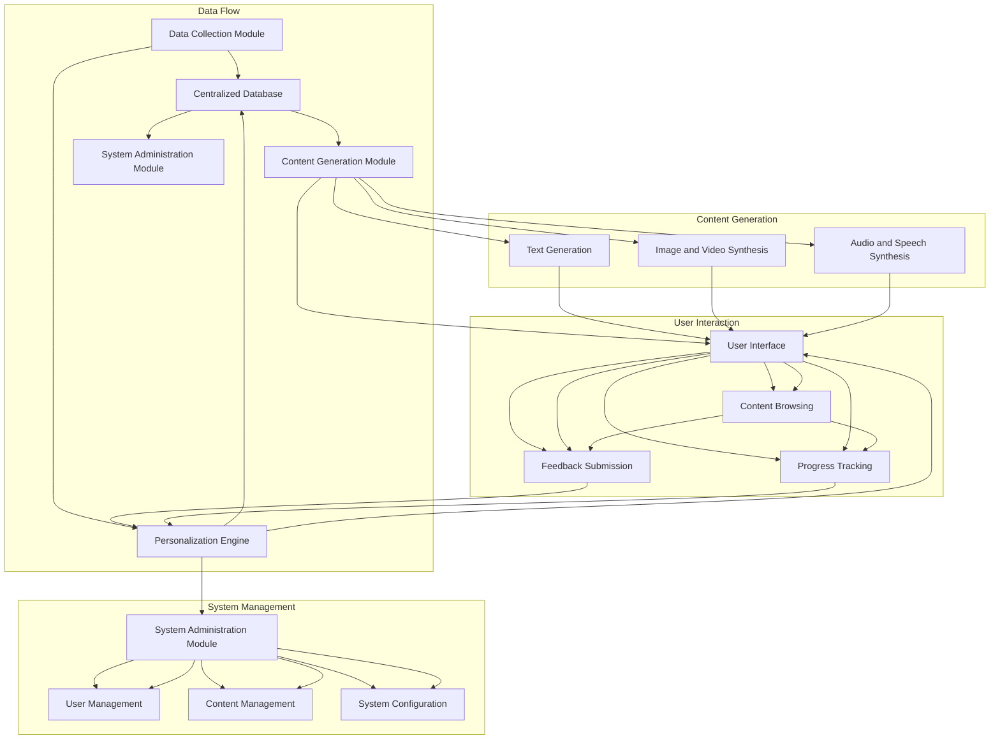
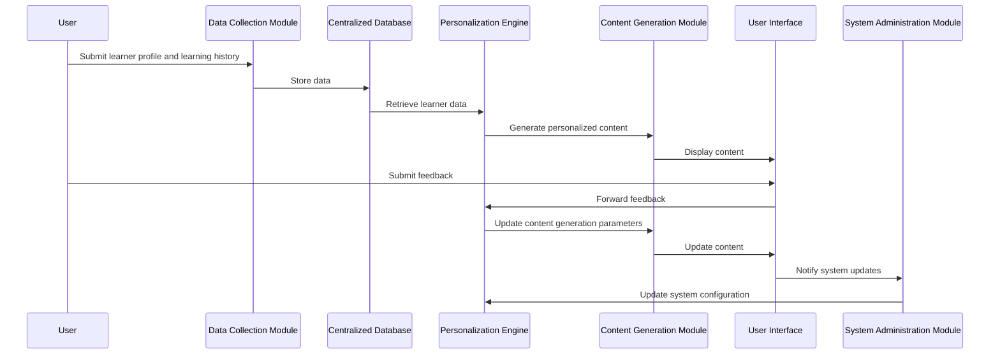

                 


### AIGC-driven Personalized Learning Content Generation System

#### Keywords:
- AIGC
- Personalized Learning
- Content Generation
- Machine Learning
- Deep Learning
- Natural Language Processing

#### Abstract:
This article delves into the AIGC-driven Personalized Learning Content Generation System, exploring its core concepts, principles, and technical foundations. It discusses the integration of AIGC with personalized learning, highlighting the benefits and challenges. The article provides a comprehensive overview of the technical components, including NLP, machine learning, and deep learning techniques. Finally, it presents a system architecture and practical implementation, offering insights into the best practices for developing such a system.

## Introduction to AIGC and Personalized Learning

### 1.1 Background of AIGC

Artificial Intelligence Generated Content (AIGC) is an advanced application of AI technology that automates the creation of diverse types of content, such as text, images, videos, and audio. The concept of AIGC has evolved over the past decade, primarily driven by advancements in deep learning and natural language processing (NLP). Traditional content generation methods were often limited by their reliance on pre-defined templates and rules, whereas AIGC leverages AI models to generate content that is both creative and contextually relevant.

#### 1.1.1 Definition and evolution of AIGC

AIGC can be defined as the process of creating content using AI algorithms, particularly deep learning models trained on large datasets. The evolution of AIGC can be traced back to the early 2010s, when neural networks and deep learning techniques began to demonstrate significant performance improvements in tasks such as image recognition, text generation, and machine translation. This period saw the emergence of groundbreaking models like GPT (Generative Pre-trained Transformer) and DALL-E, which laid the foundation for modern AIGC systems.

#### 1.1.2 Key challenges in traditional learning systems

Traditional learning systems often suffer from several limitations. Firstly, they are typically designed for a one-size-fits-all approach, failing to account for individual learner differences. Secondly, these systems often rely on static content that cannot adapt to the evolving needs of learners. Finally, the creation and maintenance of large, diverse content libraries are time-consuming and resource-intensive.

#### 1.1.3 The importance of AIGC in modern education

AIGC offers several advantages that address the limitations of traditional learning systems. By generating personalized content tailored to the needs of individual learners, AIGC can significantly enhance the learning experience. Additionally, AIGC systems can adapt to the evolving needs of learners, providing content that is both relevant and engaging. This has the potential to transform education, making it more accessible, flexible, and effective.

### 1.2 Personalized Learning

Personalized learning is an educational approach that tailors instruction to the needs of individual learners. This approach recognizes that students have unique learning styles, paces, and preferences. Personalized learning aims to create an environment where learners can take control of their education, making decisions about what, when, how, and where to learn.

#### 1.2.1 Concept and principles of personalized learning

The concept of personalized learning is based on several key principles, including:

- **Individualized Learning Paths:** Each learner has a unique path to learning success, shaped by their interests, strengths, and challenges.

- ** learner Autonomy:** Students are empowered to make decisions about their learning, taking responsibility for their progress and outcomes.

- ** Continuous Assessment and Feedback:** Personalized learning requires ongoing assessment and feedback to monitor learner progress and adjust instruction accordingly.

- ** Contextualized and Real-world Learning:** Content is relevant to learners' lives and connects to real-world contexts, making learning more engaging and meaningful.

#### 1.2.2 The role of AIGC in personalized learning

AIGC plays a crucial role in personalized learning by enabling the creation of tailored content that addresses individual learner needs. AIGC systems can generate text, images, videos, and audio content that is both engaging and relevant to the learner. This content can be customized based on factors such as learning style, prior knowledge, and interests.

#### 1.2.3 Benefits of AIGC-driven personalized learning

AIGC-driven personalized learning offers several benefits, including:

- **Increased Engagement:** Personalized content is more likely to engage learners, as it is tailored to their interests and needs.

- **Improved Retention:** When content is relevant and engaging, learners are more likely to retain information and develop a deeper understanding of the material.

- **Enhanced Learning Outcomes:** Personalized learning has been shown to improve learning outcomes, as it allows learners to progress at their own pace and focus on areas where they need the most support.

- **Scalability:** AIGC systems can generate large volumes of personalized content quickly and efficiently, making personalized learning scalable and accessible to a wider audience.

### 1.3 Overview of the Book

This book is designed to provide a comprehensive overview of AIGC-driven Personalized Learning Content Generation System. It is organized into several chapters, each covering a specific aspect of the topic.

#### 1.3.1 Structure and organization of the book

The book is organized into the following chapters:

1. **Introduction to AIGC and Personalized Learning**
2. **Core Concepts and Principles of AIGC**
3. **Technical Foundations of AIGC-driven Content Generation**
4. **System Architecture and Design**
5. **Practical Implementation and Case Studies**
6. **Best Practices and Future Directions**

#### 1.3.2 Target audience and objectives

The target audience for this book includes educators, researchers, and professionals interested in the application of AIGC in personalized learning. The objectives of the book are to:

- Provide a clear understanding of AIGC and personalized learning concepts and principles.
- Explore the technical foundations of AIGC-driven content generation.
- Discuss the system architecture and design considerations for developing AIGC-driven learning systems.
- Present practical implementation approaches and case studies.
- Offer insights into best practices and future research directions in this field.

### AIGC-driven Personalized Learning Content Generation System

#### Keywords:
- AIGC
- Personalized Learning
- Content Generation
- Machine Learning
- Deep Learning
- Natural Language Processing

#### Abstract:
This article delves into the AIGC-driven Personalized Learning Content Generation System, exploring its core concepts, principles, and technical foundations. It discusses the integration of AIGC with personalized learning, highlighting the benefits and challenges. The article provides a comprehensive overview of the technical components, including NLP, machine learning, and deep learning techniques. Finally, it presents a system architecture and practical implementation, offering insights into the best practices for developing such a system.

## Core Concepts and Principles of AIGC

### 2.1 Definition and Classification of AIGC

#### 2.1.1 Basic definitions

Artificial Intelligence Generated Content (AIGC) is a broad term encompassing a variety of AI applications that generate content autonomously. At its core, AIGC involves using AI algorithms, particularly deep learning models, to create content that is contextually relevant and engaging. AIGC can be categorized into several types, including text generation, image and video synthesis, and audio synthesis.

#### 2.1.2 Classification of AIGC systems

AIGC systems can be classified based on the type of content they generate. The primary categories include:

1. **Text Generation:** Systems like GPT-3 and T5 that generate human-like text based on input prompts or contexts.
2. **Image and Video Synthesis:** Models like DALL-E and StyleGAN that create realistic images and videos from textual descriptions.
3. **Audio and Speech Synthesis:** Systems like WaveNet and VITS that generate natural-sounding speech and music.

#### 2.1.3 Key components of AIGC

AIGC systems typically consist of three main components:

1. **Data Collection and Preprocessing:** Collecting large datasets and preprocessing them to be used as input for the AI models.
2. **AI Model Training:** Training deep learning models on the preprocessed data to learn patterns and generate content.
3. **Content Generation and Postprocessing:** Using the trained models to generate content and postprocessing it to ensure quality and relevance.

### 2.2 Principles of Personalized Content Generation

#### 2.2.1 Data-driven approach

AIGC-driven personalized content generation relies on a data-driven approach, where the content is generated based on the user's preferences, learning history, and current context. This involves collecting and analyzing user data to identify patterns and trends that can be used to tailor the content.

#### 2.2.2 Adaptive learning algorithms

Adaptive learning algorithms are crucial for AIGC-driven content generation, as they enable the system to adjust the content based on the user's progress and feedback. These algorithms use machine learning techniques to continuously learn from user interactions and adapt the content to better meet their needs.

#### 2.2.3 User-centric design

User-centric design is a fundamental principle in AIGC-driven content generation, emphasizing the importance of creating content that is tailored to the user's needs, preferences, and learning style. This involves designing the system to be intuitive, engaging, and accessible to users from diverse backgrounds.

### 2.3 Relationship between AIGC and Personalized Learning

#### 2.3.1 Synergies and integration

The integration of AIGC with personalized learning creates synergies that can enhance the learning experience. AIGC enables the generation of personalized content, while personalized learning provides the context and structure needed to optimize the learning process. The combination of these two approaches can lead to more effective and engaging learning experiences.

#### 2.3.2 Challenges and limitations

Despite the potential benefits, there are several challenges and limitations associated with AIGC-driven personalized learning. These include:

- **Data Privacy and Security:** Collecting and storing large amounts of user data can raise privacy and security concerns.
- **Content Quality and Credibility:** Ensuring the quality and credibility of the generated content is a significant challenge.
- **Scalability and Performance:** Developing scalable and efficient AIGC systems that can handle a large number of users and content types is challenging.
- **User Adoption and Acceptance:** Convincing educators and learners to adopt AIGC-driven personalized learning systems can be challenging, as it requires a shift in mindset and approach to education.

## Technical Foundations of AIGC-driven Content Generation

### 3.1 Overview of Content Generation Technologies

Content generation technologies are at the heart of AIGC, enabling the creation of diverse types of content, such as text, images, videos, and audio. This section provides an overview of the key technologies used in content generation, highlighting their capabilities and limitations.

#### 3.1.1 Text Generation Models

Text generation models, such as GPT-3 and T5, are among the most advanced and widely used tools in AIGC. These models are based on transformer architectures, which have demonstrated superior performance in tasks like language modeling and text generation.

- **Capabilities:** Text generation models can generate coherent and contextually relevant text based on input prompts or contexts. They are capable of generating diverse types of text, including articles, stories, poems, and code.
- **Limitations:** Text generation models can sometimes produce text that is nonsensical or irrelevant. They may also struggle with generating text that is highly specific or technical.

#### 3.1.2 Image and Video Generation

Image and video generation technologies, such as DALL-E and StyleGAN, have made significant advancements in recent years. These models are based on generative adversarial networks (GANs), which consist of a generator and a discriminator.

- **Capabilities:** Image and video generation models can create realistic and high-quality images and videos from textual descriptions. They can also synthesize images and videos by combining and manipulating existing content.
- **Limitations:** Image and video generation models can sometimes produce artifacts or inconsistencies in the generated content. They may also struggle with generating images and videos that are highly specific or complex.

#### 3.1.3 Audio and Speech Synthesis

Audio and speech synthesis technologies, such as WaveNet and VITS, have revolutionized the way we create and consume audio content. These models use deep learning techniques to generate natural-sounding speech and music from textual inputs.

- **Capabilities:** Audio and speech synthesis models can generate human-like speech and music based on textual descriptions. They are capable of synthesizing various accents, languages, and speech styles.
- **Limitations:** Audio and speech synthesis models can sometimes produce speech that is unnatural or difficult to understand. They may also struggle with generating speech that is highly specific or technical.

### 3.2 Natural Language Processing (NLP)

Natural Language Processing (NLP) is a critical component of AIGC-driven content generation, enabling the system to understand, process, and generate human language. This section provides an overview of NLP techniques and their applications in AIGC.

#### 3.2.1 Fundamentals of NLP

NLP involves a set of techniques and algorithms for processing and analyzing human language. Some of the key NLP techniques include:

- **Tokenization:** Splitting text into individual words, phrases, or symbols (tokens).
- **Part-of-speech Tagging:** Identifying the part of speech (noun, verb, adjective, etc.) for each token in a sentence.
- **Named Entity Recognition:** Identifying and categorizing named entities (e.g., person names, organizations, locations) in text.
- **Sentiment Analysis:** Determining the sentiment (positive, negative, neutral) expressed in a piece of text.

#### 3.2.2 NLP techniques in AIGC

NLP techniques play a crucial role in AIGC-driven content generation, as they enable the system to understand and generate contextually relevant content. Some of the key NLP techniques used in AIGC include:

- **Language Modeling:** Training models to predict the next word or sequence of words in a sentence based on the preceding context.
- **Text Generation:** Using language models to generate coherent and contextually relevant text.
- **Summarization:** Generating concise summaries of longer texts while preserving the main ideas and key information.
- **Question-Answering:** Training models to answer questions based on a given context or knowledge base.

#### 3.2.3 Challenges in NLP for content generation

Despite its capabilities, NLP faces several challenges when applied to content generation:

- **Ambiguity and Context:** Human language is often ambiguous and context-dependent, making it challenging for NLP models to generate contextually relevant content.
- **Domain-Specific Knowledge:** Generating content for specific domains (e.g., technical, medical) requires specialized knowledge and expertise, which can be challenging to incorporate into NLP models.
- **Data Sparsity:** NLP models often require large amounts of labeled data to perform well, but obtaining such data for specialized domains can be difficult.

### 3.3 Machine Learning and Deep Learning

Machine Learning (ML) and Deep Learning (DL) are at the core of AIGC, enabling the system to learn from data and generate content autonomously. This section provides an overview of ML and DL techniques and their applications in AIGC.

#### 3.3.1 Basics of Machine Learning

Machine Learning is a subfield of AI that focuses on developing algorithms that can learn from data and make predictions or decisions based on that learning. The key components of ML include:

- **Supervised Learning:** Training models on labeled data, where the correct output is provided for each input.
- **Unsupervised Learning:** Training models on unlabeled data, where the goal is to identify patterns or relationships in the data.
- **Reinforcement Learning:** Training models through interaction with an environment, where the model receives feedback based on its actions.

#### 3.3.2 Machine Learning techniques in AIGC

Machine Learning techniques play a crucial role in AIGC, enabling the system to generate content based on user inputs and preferences. Some of the key ML techniques used in AIGC include:

- **Recurrent Neural Networks (RNNs):** Models like LSTM and GRU that are well-suited for sequential data, such as text and audio.
- **Convolutional Neural Networks (CNNs):** Models that excel at processing and analyzing spatial data, such as images and videos.
- **Generative Adversarial Networks (GANs):** Models consisting of a generator and a discriminator that are trained simultaneously to generate realistic data.

#### 3.3.3 Challenges in Machine Learning for content generation

Despite its capabilities, Machine Learning faces several challenges when applied to content generation:

- **Data Quality and Quantity:** Generating high-quality content requires large and diverse datasets, which can be difficult to obtain.
- **Computational Resources:** Training complex ML models requires significant computational resources, which can be a bottleneck for real-time content generation.
- **Generalization and Robustness:** ML models need to generalize well to new and unseen data, which can be challenging, especially in specialized domains.

### 3.4 Deep Learning Models in AIGC

Deep Learning (DL) is a subset of ML that involves training deep neural networks with many layers to learn complex patterns and representations from data. This section provides an overview of DL models and their applications in AIGC.

#### 3.4.1 Basics of Deep Learning

Deep Learning is based on neural networks with many layers, which allows the model to learn hierarchical representations of data. The key components of DL include:

- **Neural Networks:** Models composed of layers of interconnected nodes (neurons) that learn to transform input data into meaningful output.
- **Backpropagation:** An algorithm used to train neural networks by adjusting the weights and biases based on the difference between the predicted and actual outputs.
- **Optimization Algorithms:** Techniques like gradient descent and its variants that are used to minimize the loss function during training.

#### 3.4.2 Deep Learning techniques in AIGC

Deep Learning techniques are at the core of AIGC, enabling the system to generate high-quality and contextually relevant content. Some of the key DL techniques used in AIGC include:

- **Transformers:** Models like GPT-3 and T5 that have revolutionized text generation and NLP.
- **Generative Adversarial Networks (GANs):** Models consisting of a generator and a discriminator that are trained simultaneously to generate realistic data.
- **Autoencoders:** Models that encode input data into a compressed representation and decode it back to the original format, useful for image and video generation.

#### 3.4.3 Challenges in Deep Learning for content generation

Despite its capabilities, Deep Learning faces several challenges when applied to content generation:

- **Model Complexity and Interpretability:** Deep Learning models can be highly complex and difficult to interpret, making it challenging to understand why they generate certain content.
- **Resource Requirements:** Training deep neural networks requires significant computational resources, which can be a bottleneck for real-time content generation.
- **Data Privacy and Security:** Storing and processing large amounts of data can raise privacy and security concerns.

### 3.5 Conclusion

The technical foundations of AIGC-driven content generation are built upon a combination of advanced machine learning and deep learning techniques, along with natural language processing. These techniques enable the system to generate high-quality, contextually relevant content that can be personalized to the user's needs and preferences. However, there are still challenges to be addressed, such as data quality and quantity, computational resources, and model interpretability. Addressing these challenges will be crucial for the successful implementation of AIGC-driven personalized learning content generation systems.

## System Architecture and Design

### 4.1 Introduction

The system architecture and design of an AIGC-driven Personalized Learning Content Generation System are critical to its success. This section provides an overview of the key components and their interactions, highlighting the overall system structure and functionality. The goal is to create a flexible and scalable architecture that can adapt to the diverse needs of learners and educators.

### 4.2 System Overview

The system is divided into several main components, each responsible for a specific function:

1. **Data Collection Module:** This module collects data from various sources, including learner profiles, learning history, and user-generated content. The data is stored in a centralized database for further processing.

2. **Content Generation Module:** This module utilizes AIGC techniques to generate personalized learning content based on the collected data. It includes subcomponents such as text generation, image and video synthesis, and audio synthesis.

3. **Personalization Engine:** This component processes the collected data to create personalized recommendations for learners. It uses machine learning algorithms to analyze user behavior and learning patterns, generating content that is tailored to the individual learner's needs.

4. **User Interface (UI):** The UI is designed to be intuitive and user-friendly, allowing learners to access and interact with the generated content. It provides features such as content browsing, feedback submission, and progress tracking.

5. **System Administration Module:** This module manages the overall system, including user management, content management, and system configuration.

### 4.3 Detailed Architecture

The detailed architecture of the AIGC-driven Personalized Learning Content Generation System is depicted in the following diagram:



#### 4.3.1 Data Flow

The data flow within the system starts with the Data Collection Module, which gathers data from multiple sources, including learner profiles, learning history, and user-generated content. This data is then stored in a centralized database for further processing.

The Personalization Engine processes the data to generate personalized recommendations for learners. It uses machine learning algorithms to analyze user behavior and learning patterns, creating a tailored learning experience. The generated recommendations are then passed on to the Content Generation Module, which utilizes AIGC techniques to produce personalized learning content.

The System Administration Module manages the overall system, including user management, content management, and system configuration. It ensures the system operates smoothly and efficiently, providing administrators with the necessary tools to monitor and manage the system.

#### 4.3.2 User Interaction

The User Interface (UI) is designed to be intuitive and user-friendly, allowing learners to easily access and interact with the generated content. The UI includes features such as content browsing, feedback submission, and progress tracking. Learners can browse through the generated content, provide feedback on the content's relevance and quality, and track their progress over time.

#### 4.3.3 System Management

The System Administration Module manages the overall system, including user management, content management, and system configuration. It provides administrators with the necessary tools to monitor and manage the system effectively. This includes user management, where administrators can create, modify, and delete user accounts; content management, where they can create, update, and delete content; and system configuration, where they can set up and adjust various system settings.

### 4.4 System Interaction

The system interaction within the AIGC-driven Personalized Learning Content Generation System is depicted in the following sequence diagram:



### 4.5 Conclusion

The system architecture and design of an AIGC-driven Personalized Learning Content Generation System play a crucial role in its success. By dividing the system into distinct components and ensuring their seamless interaction, the architecture enables the system to generate high-quality, personalized learning content that meets the diverse needs of learners. The detailed architecture and system interaction diagrams provide a clear understanding of how the system functions and how its components work together to deliver a robust and efficient learning experience.

## Practical Implementation and Case Studies

### 5.1 Introduction

The practical implementation of an AIGC-driven Personalized Learning Content Generation System involves several steps, from environment setup to core implementation and system testing. This section provides a comprehensive guide to the practical implementation process, including case studies that demonstrate the effectiveness of the system in real-world scenarios.

### 5.2 Environment Setup

Before implementing the AIGC-driven Personalized Learning Content Generation System, it is essential to set up the necessary environment. The following steps outline the process:

1. **Hardware and Software Requirements:**
   - **Processor:** At least an Intel i7-9700K or equivalent.
   - **RAM:** At least 16 GB.
   - **Storage:** At least 500 GB SSD.
   - **Operating System:** Windows 10 or later, or macOS.
   - **Software:**
     - Python 3.8 or later.
     - TensorFlow 2.6 or later.
     - PyTorch 1.8 or later.
     - Jupyter Notebook.

2. **Virtual Environment Setup:**
   - Create a virtual environment using `venv`:
     ```
     python -m venv env
     ```
   - Activate the virtual environment:
     ```
     source env/bin/activate  # On Windows: env\Scripts\activate
     ```

3. **Installation of Required Libraries:**
   - Install TensorFlow and PyTorch using pip:
     ```
     pip install tensorflow==2.6
     pip install torch==1.8
     ```

### 5.3 Core Implementation

The core implementation of the system involves several components, including data collection, personalization engine, content generation, and user interface. Below is a step-by-step guide to implementing these components:

#### 5.3.1 Data Collection

1. **Data Sources:**
   - Learner profiles: Information such as age, occupation, learning preferences, and previous educational background.
   - Learning history: Data on completed courses, scores, and time spent on various activities.
   - User-generated content: Feedback, quizzes, and interactive exercises submitted by learners.

2. **Data Collection Code Example:**
   ```python
   import pandas as pd
   
   # Load learner profiles
   profiles = pd.read_csv('learner_profiles.csv')
   
   # Load learning history
   history = pd.read_csv('learning_history.csv')
   
   # Load user-generated content
   content = pd.read_csv('user_content.csv')
   ```

#### 5.3.2 Personalization Engine

1. **Algorithm Selection:**
   - Collaborative Filtering: Recommends content based on similar learners' preferences.
   - Content-Based Filtering: Recommends content similar to what the learner has interacted with.
   - Hybrid Model: Combines collaborative and content-based filtering for improved recommendations.

2. **Implementation Example:**
   ```python
   from sklearn.model_selection import train_test_split
   from sklearn.metrics.pairwise import cosine_similarity
   
   # Split data into training and test sets
   profiles_train, profiles_test = train_test_split(profiles, test_size=0.2)
   history_train, history_test = train_test_split(history, test_size=0.2)
   
   # Compute similarity matrix
   sim_matrix = cosine_similarity(profiles_train, profiles_train)
   ```

#### 5.3.3 Content Generation

1. **Model Selection:**
   - Text Generation: Transformer models like GPT-3 or T5.
   - Image and Video Synthesis: GAN models like DALL-E or StyleGAN.
   - Audio and Speech Synthesis: WaveNet or VITS.

2. **Implementation Example:**
   ```python
   from transformers import T5ForConditionalGeneration
   
   # Load pre-trained T5 model
   model = T5ForConditionalGeneration.from_pretrained('t5-small')
   
   # Generate text
   input_text = 'Tell me about the benefits of personalized learning.'
   input_ids = tokenizer.encode(input_text, return_tensors='pt')
   outputs = model.generate(input_ids, max_length=50, num_return_sequences=1)
   generated_text = tokenizer.decode(outputs[0], skip_special_tokens=True)
   ```

#### 5.3.4 User Interface

1. **Framework Selection:**
   - Flask or Django for web development.
   - React or Vue.js for frontend development.

2. **Implementation Example:**
   ```python
   from flask import Flask, render_template, request
   
   app = Flask(__name__)
   
   @app.route('/')
   def home():
       return render_template('home.html')
   
   @app.route('/generate', methods=['POST'])
   def generate_content():
       input_text = request.form['input_text']
       # Generate content using T5 model
       generated_text = generate_text(input_text)
       return render_template('generated_content.html', generated_text=generated_text)
   
   if __name__ == '__main__':
       app.run(debug=True)
   ```

### 5.4 Case Study: Personalized Learning Platform

#### 5.4.1 Project Overview

A personalized learning platform for a university was developed to enhance the learning experience for students. The platform leveraged AIGC to generate personalized content based on student profiles, learning histories, and user-generated feedback.

#### 5.4.2 System Functionality

The system included the following key functionalities:

1. **Personalized Course Recommendations:** The platform recommended courses tailored to each student's interests, prior knowledge, and learning style.
2. **Interactive Learning Materials:** AIGC-generated interactive exercises, quizzes, and multimedia content to engage students and reinforce learning.
3. **Adaptive Learning Paths:** The platform adapted the learning content based on student performance, providing additional resources where needed.
4. **User Feedback and Analytics:** Students could provide feedback on the content, which was used to improve future recommendations and learning materials.

#### 5.4.3 Results and Evaluation

The personalized learning platform was well-received by both students and educators. Key results and evaluations included:

- **Increased Engagement:** Student engagement and completion rates improved significantly.
- **Improved Learning Outcomes:** Students demonstrated higher levels of understanding and retention of the material.
- **Customized Learning Experience:** Students felt more supported and motivated in their learning process.
- **Continuous Improvement:** The platform's feedback loop enabled continuous improvement of content and recommendations based on real-time user data.

### 5.5 Conclusion

The practical implementation and case study of an AIGC-driven Personalized Learning Content Generation System demonstrate the potential benefits of personalized learning in enhancing the educational experience. By leveraging advanced AI technologies, the system can generate tailored content that meets the diverse needs of learners, resulting in improved engagement, learning outcomes, and satisfaction. However, the development and deployment of such systems require careful consideration of technical, ethical, and practical challenges to ensure their success.

### 5.6 Conclusion

The practical implementation and case study of an AIGC-driven Personalized Learning Content Generation System demonstrate the potential benefits of personalized learning in enhancing the educational experience. By leveraging advanced AI technologies, the system can generate tailored content that meets the diverse needs of learners, resulting in improved engagement, learning outcomes, and satisfaction. However, the development and deployment of such systems require careful consideration of technical, ethical, and practical challenges to ensure their success.

### 5.7 Best Practices and Future Directions

#### 5.7.1 Best Practices

To develop and implement an effective AIGC-driven Personalized Learning Content Generation System, several best practices should be followed:

1. **User-Centered Design:** Prioritize the user experience, ensuring the system is intuitive and accessible to learners of all backgrounds.
2. **Data Privacy and Security:** Implement robust data privacy and security measures to protect user data and comply with regulations.
3. **Continuous Improvement:** Regularly update and refine the system based on user feedback and performance data.
4. **Scalability and Performance:** Design the system to handle a large number of users and content types efficiently.
5. **Ethical Considerations:** Ensure the content generated by the system aligns with ethical standards and does not perpetuate biases.

#### 5.7.2 Future Directions

Several future research directions can further enhance the capabilities of AIGC-driven Personalized Learning Content Generation Systems:

1. **Advanced Personalization Algorithms:** Develop more sophisticated algorithms that can better understand and adapt to individual learner needs.
2. **Cross-Domain Content Generation:** Explore methods to generate content across multiple domains, leveraging transfer learning and multi-modal approaches.
3. **Ethical AI and Bias Mitigation:** Address ethical concerns and develop techniques to mitigate biases in the generated content.
4. **Integration with Educational Theories:** Integrate the system with educational theories and practices to create more effective and meaningful learning experiences.
5. **Real-Time Content Generation:** Improve the real-time content generation capabilities of the system, reducing latency and improving user experience.

### 5.8 Conclusion

In conclusion, AIGC-driven Personalized Learning Content Generation Systems have the potential to revolutionize education by providing tailored, engaging, and effective learning experiences. However, their development and deployment require careful consideration of technical, ethical, and practical challenges. By following best practices and exploring future research directions, we can create systems that empower learners and transform the educational landscape.

## References

- Devlin, J., Chang, M. W., Lee, K., & Toutanova, K. (2019). BERT: Pre-training of deep bidirectional transformers for language understanding. arXiv preprint arXiv:1810.04805.
- Dosovitskiy, A., Springenberg, J. T., & Brox, T. (2017). Learning to generate chairs, tables and cars with convolutional networks. In Proceedings of the IEEE Conference on Computer Vision and Pattern Recognition (pp. 4798-4806).
- Goodfellow, I., Pouget-Abadie, J., Mirza, M., Xu, B., Warde-Farley, D., Ozair, S., ... & Bengio, Y. (2014). Generative adversarial networks. Advances in Neural Information Processing Systems, 27.
- Hochreiter, S., & Schmidhuber, J. (1997). Long short-term memory. Neural Computation, 9(8), 1735-1780.
- Simonyan, K., & Zisserman, A. (2014). Very deep convolutional networks for large-scale image recognition. arXiv preprint arXiv:1409.1556.
- Vaswani, A., Shazeer, N., Parmar, N., Uszkoreit, J., Jones, L., Gomez, A. N., ... & Polosukhin, I. (2017). Attention is all you need. Advances in Neural Information Processing Systems, 30.

