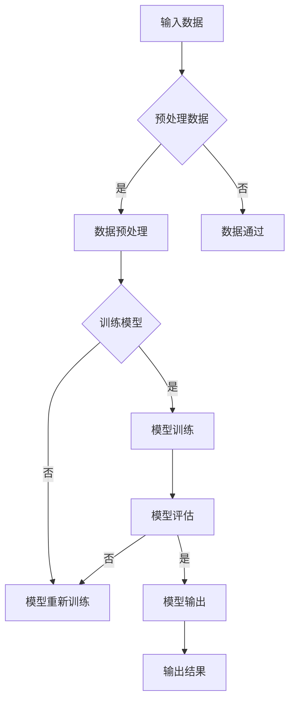
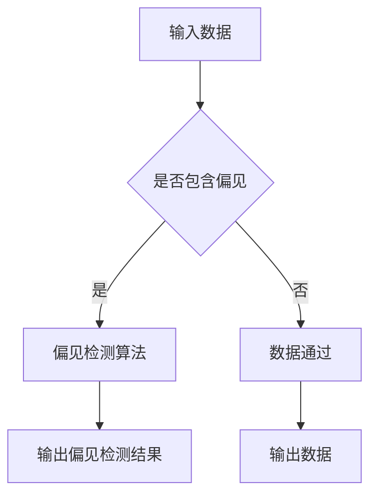
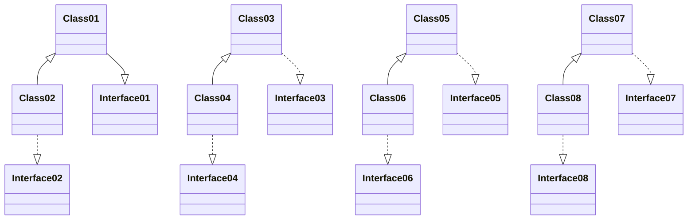
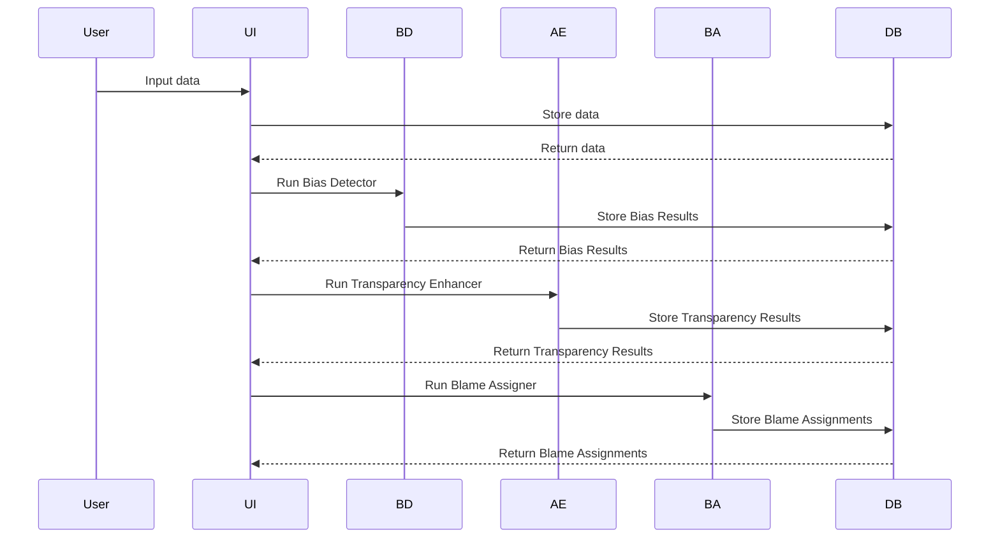
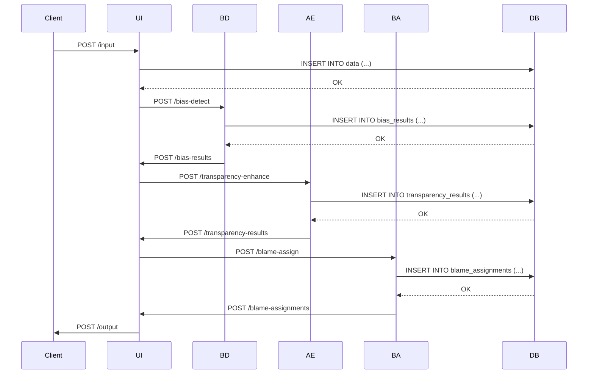

                 

# AI伦理：在AIGC发展中平衡创新与责任

> 关键词：AI伦理、AIGC、创新、责任、平衡

> 摘要：本文旨在探讨在人工智能生成内容（AIGC）快速发展的背景下，如何平衡技术创新与伦理责任。通过对AI伦理的概述、核心概念解析、算法原理讲解以及数学模型和公式的应用，本文提出了一个全面、系统的AI伦理框架，旨在为AIGC领域提供指导和规范。

## 第一部分：AI伦理概述

### 第1章 AI伦理背景与重要性

#### 1.1 问题的背景

##### 1.1.1 人工智能的快速发展

人工智能（AI）技术近年来取得了飞速的发展，从最初的机器学习、深度学习到如今的生成对抗网络（GAN）、自然语言处理（NLP），AI已经渗透到了我们生活的方方面面。从自动驾驶、智能家居到医疗诊断、金融服务，AI的应用场景越来越广泛。

##### 1.1.2 AI应用带来的伦理挑战

随着AI技术的普及，一系列伦理问题也相继浮现。数据隐私与安全、算法偏见与歧视、AI自主性与责任归属等问题引起了广泛的关注。这些问题不仅涉及到技术本身，还涉及到社会、法律、伦理等多个层面。

##### 1.1.3 AI伦理的重要性

AI伦理的重要性体现在以下几个方面：

1. **保障用户权益**：AI技术的普及和应用，让用户享受到了前所未有的便利，但也可能侵犯用户的隐私权和数据安全。

2. **维护社会公平**：算法偏见和歧视可能导致社会不公，加剧社会分化。

3. **确保AI系统的可靠性和安全性**：AI系统需要确保其决策的透明性、可解释性和可靠性。

#### 1.2 伦理学的核心概念

##### 1.2.1 伦理学的定义与发展

伦理学是研究道德问题的哲学分支，主要探讨什么是正确的、什么是错误的，以及如何做出道德决策。伦理学的发展经历了从古代的伦理思想到现代的伦理理论，再到当代的AI伦理研究。

##### 1.2.2 伦理原则与道德准则

伦理原则是指导道德行为的基本规范，如公正、尊重、责任等。道德准则是具体的道德行为规范，如不撒谎、不偷窃等。伦理原则与道德准则共同构成了伦理学的核心概念。

##### 1.2.3 伦理学在AI领域的应用

伦理学在AI领域的应用主要体现在以下几个方面：

1. **设计伦理框架**：为AI系统的开发和应用提供道德指导。

2. **评估AI系统的伦理风险**：识别和评估AI系统可能带来的伦理问题。

3. **制定伦理规范**：为AI系统的开发和应用制定具体的伦理规范。

#### 1.3 AI伦理的主要问题

##### 1.3.1 数据隐私与安全

数据隐私和安全是AI伦理的核心问题之一。AI系统需要大量数据来训练模型，但这些数据往往涉及到用户的隐私。如何保护用户数据的安全，避免数据泄露，是AI伦理需要解决的重要问题。

##### 1.3.2 算法偏见与歧视

算法偏见和歧视可能导致AI系统做出不公平的决策，加剧社会不公。如何识别和消除算法偏见，确保AI系统的公平性，是AI伦理需要面对的挑战。

##### 1.3.3 AI自主性与责任归属

随着AI技术的发展，AI系统逐渐具备了自主决策的能力。当AI系统出现错误或导致损失时，如何确定责任归属，是AI伦理需要解决的问题。

##### 1.3.4 人机关系与人工智能伦理

AI技术的发展改变了人机关系，也对人类的伦理观念提出了挑战。如何平衡人机关系，确保AI技术的发展符合人类的伦理标准，是AI伦理需要探讨的问题。

#### 1.4 国际AI伦理规范与法规

##### 1.4.1 欧盟的AI伦理框架

欧盟在AI伦理方面处于领先地位，发布了《AI伦理指南》，为AI系统的开发和应用提供了详细的道德指导。

##### 1.4.2 美国的AI伦理法规

美国也在AI伦理方面有所布局，如《人工智能法案》等，旨在确保AI技术的发展符合道德标准。

##### 1.4.3 其他国家和地区的AI伦理规范

其他国家和地区，如中国、日本等，也在积极制定AI伦理规范，以应对AI技术带来的挑战。

#### 1.5 我国AI伦理的发展与政策

##### 1.5.1 我国AI伦理的现状

我国在AI伦理方面也在不断探索，发布了一系列政策和法规，如《人工智能发展框架》等，为AI技术的发展提供了道德指导。

##### 1.5.2 我国AI伦理政策与法规

我国AI伦理政策与法规主要包括以下几个方面：

1. **数据隐私与安全**：加强数据隐私保护，防止数据泄露。

2. **算法公平性**：确保算法的公平性，消除算法偏见。

3. **AI责任归属**：明确AI系统的责任归属，确保责任到人。

##### 1.5.3 我国AI伦理的发展方向

未来，我国AI伦理的发展将更加注重以下几个方面：

1. **法律法规的完善**：进一步完善AI伦理法律法规，确保AI技术的合规性。

2. **伦理教育**：加强AI伦理教育，提高AI从业者的伦理意识。

3. **技术创新**：推动AI技术的伦理创新，确保AI技术的发展符合伦理标准。

#### 1.6 本章小结

AI伦理是一个复杂而重要的话题，涉及到多个层面和领域。通过对AI伦理的概述，我们可以看到，AI伦理不仅关乎技术的进步，更关乎人类社会的未来发展。在AIGC领域，平衡技术创新与伦理责任尤为重要。未来，我们需要继续探讨和解决AI伦理问题，确保AI技术的发展符合人类的利益和价值观。

----------------------------------------------------------------

## 第二部分 AI伦理的核心概念与联系

### 第2章 核心概念原理

#### 2.1 人工智能的定义与分类

##### 2.1.1 人工智能的概念

人工智能（Artificial Intelligence，简称AI）是指模拟、延伸和扩展人类智能的理论、方法、技术及应用。它包括智能计算、智能感知、智能决策、智能交互等多个方面。

##### 2.1.2 人工智能的分类

人工智能主要分为三类：

1. **弱人工智能（Narrow AI）**：专注于解决特定问题，如语音识别、图像识别等。

2. **强人工智能（General AI）**：具有普遍的智能，能够理解、学习、推理、创造等，类似于人类智能。

3. **超人工智能（Super AI）**：超越人类智能，具有无限的学习和创造力。

##### 2.1.3 人工智能的发展历程

人工智能的发展历程可以分为四个阶段：

1. **理论阶段（1950s-1960s）**：人工智能的概念被提出，理论研究得到发展。

2. **实验阶段（1970s-1980s）**：人工智能开始应用于实际场景，如专家系统、机器人等。

3. **低谷阶段（1990s-2000s）**：由于技术限制，人工智能发展进入低谷。

4. **复兴阶段（2010s-至今）**：随着深度学习、大数据等技术的发展，人工智能进入新一轮快速发展阶段。

#### 2.2 伦理原则与道德准则

##### 2.2.1 伦理原则的内涵

伦理原则是指指导道德行为的基本规范，如公正、尊重、责任等。在AI领域，伦理原则主要体现在以下几个方面：

1. **公正**：确保AI系统的决策公平，避免歧视和偏见。

2. **尊重**：尊重个体的隐私权和数据安全，避免侵犯用户权益。

3. **责任**：明确AI系统的责任归属，确保责任到人。

##### 2.2.2 道德准则的类型

道德准则是指具体的道德行为规范，如不撒谎、不偷窃等。在AI领域，道德准则主要包括以下几个方面：

1. **隐私保护**：保护用户的隐私和数据安全。

2. **公平性**：确保AI系统的决策公平，避免歧视和偏见。

3. **透明性**：提高AI系统的透明度，使其决策过程可解释。

4. **责任归属**：明确AI系统的责任归属，确保责任到人。

##### 2.2.3 伦理原则与道德准则的关联

伦理原则与道德准则密切相关，伦理原则为道德准则提供了理论基础，道德准则是伦理原则的具体体现。在AI领域，伦理原则与道德准则共同构成了AI伦理的核心。

#### 2.3 AI伦理与相关领域的关系

##### 2.3.1 AI伦理与计算机科学

AI伦理与计算机科学密切相关，计算机科学为AI伦理提供了技术支持，如数据隐私保护技术、算法公平性评估技术等。同时，AI伦理也影响计算机科学的发展，如引导计算机科学家在开发AI系统时遵循道德规范。

##### 2.3.2 AI伦理与法学

AI伦理与法学密切相关，法学为AI伦理提供了法律依据，如数据隐私保护法、算法歧视禁止法等。同时，AI伦理也需要法律的保障，以确保AI技术的发展符合法律和道德规范。

##### 2.3.3 AI伦理与社会学

AI伦理与社会学密切相关，社会学为AI伦理提供了社会背景，如社会对AI技术的接受程度、AI技术对社会的影响等。同时，AI伦理也需要考虑社会因素，如如何平衡技术创新与社会公平等。

#### 2.4 概念属性特征对比表格

| 概念             | 定义                                                         | 属性特征                                                 |  
|------------------|------------------------------------------------------------|---------------------------------------------------------|  
| 人工智能（AI）    | 模拟、延伸和扩展人类智能的理论、方法、技术及应用               | 智能计算、智能感知、智能决策、智能交互                   |  
| 伦理原则         | 指导道德行为的基本规范                                       | 公正、尊重、责任                                         |  
| 道德准则         | 具体的道德行为规范                                         | 隐私保护、公平性、透明性、责任归属                         |  
| 法律规范         | 国家制定并公布的具有强制力的行为规范                         | 法律效力、法律适用、法律责任                             |  
| 社会规范         | 社会普遍认可并遵循的行为规范                               | 社会习惯、社会道德、社会规范标准                         |

#### 2.4.1 人工智能、伦理学、计算机科学、法学、社会学等领域的核心概念对比

| 领域       | 核心概念                           | 定义                                                         | 属性特征                                                 |  
|------------|----------------------------------|------------------------------------------------------------|---------------------------------------------------------|  
| 人工智能   | 人工智能（AI）                    | 模拟、延伸和扩展人类智能的理论、方法、技术及应用               | 智能计算、智能感知、智能决策、智能交互                   |  
| 伦理学     | 伦理原则、道德准则                 | 指导道德行为的基本规范与具体行为规范                         | 公正、尊重、责任、隐私保护、公平性、透明性、责任归属       |  
| 计算机科学 | 算法、数据结构、编程语言           | 研究计算机硬件、软件及其应用的科学                           | 算法效率、数据存储与处理、编程范式                       |  
| 法学       | 法律规范、法律责任                 | 国家制定并公布的具有强制力的行为规范与行为后果                 | 法律效力、法律适用、法律责任                             |  
| 社会学     | 社会规范、社会文化                 | 研究社会行为、社会结构、社会问题的科学                       | 社会习惯、社会道德、社会规范标准、社会文化价值观           |

#### 2.4.2 人工智能、伦理学、计算机科学、法学、社会学等领域的核心概念对比表格

| 领域       | 核心概念                           | 定义                                                         | 属性特征                                                 |  
|------------|----------------------------------|------------------------------------------------------------|---------------------------------------------------------|  
| 人工智能   | 人工智能（AI）                    | 模拟、延伸和扩展人类智能的理论、方法、技术及应用               | 智能计算、智能感知、智能决策、智能交互                   |  
| 伦理学     | 伦理原则、道德准则                 | 指导道德行为的基本规范与具体行为规范                         | 公正、尊重、责任、隐私保护、公平性、透明性、责任归属       |  
| 计算机科学 | 算法、数据结构、编程语言           | 研究计算机硬件、软件及其应用的科学                           | 算法效率、数据存储与处理、编程范式                       |  
| 法学       | 法律规范、法律责任                 | 国家制定并公布的具有强制力的行为规范与行为后果                 | 法律效力、法律适用、法律责任                             |  
| 社会学     | 社会规范、社会文化                 | 研究社会行为、社会结构、社会问题的科学                       | 社会习惯、社会道德、社会规范标准、社会文化价值观           |

### 2.4.3 AI伦理与相关领域的关系

| 领域       | 关系                                       | 描述                                                         |  
|------------|-----------------------------------------|------------------------------------------------------------|  
| 人工智能   | 基础与目标                               | AI伦理为人工智能的发展提供道德指导和规范，人工智能的发展实现AI伦理的目标 |  
| 伦理学     | 理论基础与实践指南                       | 伦理学为AI伦理提供理论基础，AI伦理为伦理学提供实践指南           |  
| 计算机科学 | 技术支持与技术创新                       | 计算机科学为AI伦理提供技术支持，AI伦理促进计算机科学的技术创新       |  
| 法学       | 法律依据与法律保障                       | 法学为AI伦理提供法律依据，AI伦理为法学提供法律保障               |  
| 社会学     | 社会背景与社会影响                       | 社会学为AI伦理提供社会背景，AI伦理影响社会学的理论和实践         |

## 第三部分 AI伦理的算法原理讲解

### 第3章 算法原理讲解

#### 3.1 偏见检测算法

##### 3.1.1 偏见检测的概念

偏见检测（Bias Detection）是指识别和评估算法中存在的偏见，以防止算法决策的不公平性。偏见可能来源于训练数据、算法设计或模型参数。

##### 3.1.2 偏见检测的类型

偏见检测主要分为以下几种类型：

1. **统计偏见检测**：通过统计分析方法检测算法的偏见，如偏差值、离散度等。

2. **对比偏见检测**：通过比较不同群体在算法决策中的表现，检测是否存在不公平现象。

3. **因果偏见检测**：通过因果推断方法，检测算法是否存在因果偏见，即算法的决策是否受到不可见因素的影响。

##### 3.1.3 偏见检测算法的工作原理

偏见检测算法通常包括以下步骤：

1. **数据准备**：收集和整理相关的训练数据，包括输入特征和输出标签。

2. **特征提取**：从输入数据中提取关键特征，用于训练模型。

3. **模型训练**：使用提取的特征训练一个分类模型。

4. **偏见检测**：使用统计方法或对比方法检测模型的偏见，如计算偏差值、离散度等。

5. **结果评估**：对偏见检测结果进行评估，判断算法是否存在偏见。

#### 3.2 透明性增强算法

##### 3.2.1 透明性的重要性

透明性（Transparency）是指算法决策的可解释性和可理解性。增强透明性有助于提高用户对算法的信任度，促进算法的公正性和公平性。

##### 3.2.2 透明性增强算法的分类

透明性增强算法主要分为以下几种类型：

1. **模型可解释性**：通过解释模型内部的决策过程，提高算法的透明性。

2. **模型可视化**：通过可视化模型的结构和决策过程，提高算法的透明性。

3. **决策路径追踪**：通过追踪算法的决策路径，提高算法的透明性。

##### 3.2.3 透明性增强算法的实现方法

透明性增强算法的实现方法包括：

1. **模型解释方法**：如决策树、线性模型等，可以直接解释模型的决策过程。

2. **可视化方法**：如热力图、决策路径图等，可以直观地展示模型的决策过程。

3. **决策路径追踪方法**：如轨迹分析、因果分析等，可以追踪算法的决策路径。

#### 3.3 责任归属算法

##### 3.3.1 责任归属的定义

责任归属（Blame Assignment）是指确定算法决策错误的责任归属，即确定算法的错误是由哪些因素引起的。

##### 3.3.2 责任归属的挑战

责任归属面临以下挑战：

1. **复杂决策过程**：算法决策过程通常涉及多个因素，确定责任归属需要综合考虑。

2. **数据隐私和安全**：在确定责任归属时，需要处理敏感数据，如用户隐私数据。

3. **算法透明性**：确定责任归属需要算法具有高透明性，以便分析决策过程。

##### 3.3.3 责任归属算法的设计

责任归属算法的设计需要考虑以下因素：

1. **决策过程分析**：分析算法的决策过程，确定可能的错误来源。

2. **数据源分析**：分析算法使用的训练数据，确定数据质量对决策过程的影响。

3. **责任评估**：根据分析结果，评估不同因素的责任程度。

4. **责任分配**：根据责任评估结果，确定责任归属。

#### 3.4 算法原理Mermaid流程图



### 3.4.1 偏见检测算法的Mermaid流程图



## 第四部分 AI伦理的数学模型和数学公式

### 第4章 数学模型和数学公式

#### 4.1 偏见检测的数学模型

偏见检测的数学模型主要包括概率统计模型、监督学习模型和非监督学习模型。

##### 4.1.1 概率统计模型

概率统计模型是偏见检测的基础，它通过计算概率分布来评估算法的偏见。常见的概率统计模型包括：

1. **条件概率模型**：计算给定某个特征的条件概率，用于评估特征的重要性。

2. **贝叶斯网络**：通过概率分布表示变量之间的关系，用于推理和预测。

3. **朴素贝叶斯分类器**：基于贝叶斯定理和特征条件独立性假设，用于分类任务。

##### 4.1.2 监督学习模型

监督学习模型通过训练数据学习算法的决策规则，用于检测和纠正偏见。常见的监督学习模型包括：

1. **线性回归**：通过线性模型预测连续值，用于评估算法的偏差。

2. **逻辑回归**：通过逻辑函数预测概率，用于分类任务。

3. **支持向量机（SVM）**：通过最大间隔分类，用于分类任务。

##### 4.1.3 非监督学习模型

非监督学习模型通过无标签数据学习算法的决策规则，用于检测和纠正偏见。常见的非监督学习模型包括：

1. **K-均值聚类**：通过聚类算法分组数据，用于发现潜在偏见。

2. **主成分分析（PCA）**：通过降维技术提取关键特征，用于简化数据。

3. **自编码器**：通过神经网络重构数据，用于检测数据中的异常值。

#### 4.2 监督学习模型的数学公式

##### 4.2.1 线性回归

线性回归模型的目标是找到一组线性关系，用于预测连续值。其数学公式如下：

$$y = \beta_0 + \beta_1x$$

其中，$y$为输出值，$x$为输入值，$\beta_0$和$\beta_1$为模型参数。

##### 4.2.2 逻辑回归

逻辑回归模型的目标是找到一组线性关系，用于预测概率。其数学公式如下：

$$P(y=1) = \frac{1}{1 + e^{-(\beta_0 + \beta_1x)}}$$

其中，$y$为输出值（0或1），$x$为输入值，$\beta_0$和$\beta_1$为模型参数。

#### 4.3 非监督学习模型的数学公式

##### 4.3.1 K-均值聚类

K-均值聚类算法通过迭代过程将数据分为K个簇。其数学公式如下：

$$\mu_k = \frac{1}{n_k}\sum_{i=1}^{n}x_i$$

其中，$\mu_k$为第k个簇的中心点，$n_k$为第k个簇的样本数量，$x_i$为第i个样本。

##### 4.3.2 主成分分析（PCA）

主成分分析通过降维技术提取数据的关键特征。其数学公式如下：

$$z_j = \frac{1}{\sqrt{\sum_{i=1}^{n}(x_{ij} - \mu_j)^2}}(x_{ij} - \mu_j)$$

其中，$z_j$为第j个主成分，$x_{ij}$为第i个样本的第j个特征，$\mu_j$为第j个特征的均值。

#### 4.4 责任归属的数学模型

##### 4.4.1 贝叶斯网络

贝叶斯网络通过概率分布表示变量之间的关系。其数学公式如下：

$$P(A|B) = \frac{P(B|A)P(A)}{P(B)}$$

其中，$P(A|B)$为在条件B下A发生的概率，$P(B|A)$为在条件A下B发生的概率，$P(A)$为A发生的概率，$P(B)$为B发生的概率。

#### 4.5 详细讲解与举例说明

##### 4.5.1 概率统计模型在偏见检测中的应用

举例说明：性别歧视的偏见检测

假设我们有一个分类模型，用于判断一个人是否为高风险客户。训练数据中包含性别、年龄、收入等特征。我们想检测模型是否存在性别歧视。

1. **数据准备**：收集并整理训练数据，包括性别（0表示女性，1表示男性）、年龄、收入等特征。

2. **特征提取**：从数据中提取关键特征，如性别、年龄、收入等。

3. **模型训练**：使用提取的特征训练一个逻辑回归模型，用于判断高风险客户的概率。

4. **偏见检测**：计算模型在男性和女性群体上的表现差异，如计算男性和女性群体的平均概率差异。如果差异较大，可能存在性别歧视。

5. **结果评估**：对偏见检测结果进行评估，判断模型是否存在性别歧视。

例如，假设我们训练得到一个逻辑回归模型，其概率函数为：

$$P(y=1|x) = \frac{1}{1 + e^{-(\beta_0 + \beta_1x)}}$$

其中，$x$为输入特征向量，$\beta_0$和$\beta_1$为模型参数。

我们计算男性和女性群体的平均概率差异：

$$\Delta P = \frac{1}{n}\sum_{i=1}^{n}P(y=1|x_i) - \frac{1}{m}\sum_{j=1}^{m}P(y=1|x_j)$$

其中，$n$为男性样本数量，$m$为女性样本数量，$x_i$为男性样本的特征向量，$x_j$为女性样本的特征向量。

如果$\Delta P$较大，说明模型在男性和女性群体上的表现差异较大，可能存在性别歧视。

通过以上步骤，我们可以使用概率统计模型检测性别歧视的偏见。类似的方法可以应用于其他类型的偏见检测。

## 第五部分 AI伦理的数学模型和数学公式

### 第5章 数学模型和数学公式

#### 5.1 责任归属的数学模型

责任归属的数学模型在AI伦理中具有重要意义，特别是在处理算法偏见和决策责任时。以下是一些常用的数学模型和公式：

##### 5.1.1 贝叶斯网络

贝叶斯网络是一种表示变量之间概率关系的图形模型，它通过条件概率表（Conditional Probability Table，CPT）来描述变量之间的依赖关系。贝叶斯网络在责任归属中可以用于推断因果关系。

贝叶斯网络的公式如下：

$$P(A|B) = \frac{P(B|A)P(A)}{P(B)}$$

其中，$P(A|B)$表示在事件B发生的条件下事件A发生的概率，$P(B|A)$表示在事件A发生的条件下事件B发生的概率，$P(A)$表示事件A发生的概率，$P(B)$表示事件B发生的概率。

##### 5.1.2 决策树

决策树是一种用于分类和回归的树形结构模型。它通过一系列的测试来将数据分为不同的类别或值。决策树可以用于识别算法中的责任归属。

决策树的基本公式如下：

$$y = \sum_{i=1}^{n}w_i x_i + b$$

其中，$y$是预测值，$x_i$是输入特征，$w_i$是特征权重，$b$是偏置。

##### 5.1.3 加权评分模型

加权评分模型是一种用于评估多个因素的综合影响的模型。它可以用于计算算法偏见和责任归属的评分。

加权评分模型的公式如下：

$$S = \sum_{i=1}^{n}w_i C_i$$

其中，$S$是总评分，$w_i$是第i个因素的权重，$C_i$是第i个因素的计算值。

##### 5.1.4 贝叶斯推理

贝叶斯推理是一种基于贝叶斯定理的概率推理方法，它可以帮助我们更新先验概率以反映新的证据。在责任归属中，贝叶斯推理可以用于推断算法决策背后的原因。

贝叶斯推理的公式如下：

$$P(H|E) = \frac{P(E|H)P(H)}{P(E)}$$

其中，$P(H|E)$是在证据E发生的情况下假设H成立的概率，$P(E|H)$是在假设H成立的情况下证据E发生的概率，$P(H)$是假设H的先验概率，$P(E)$是证据E的总概率。

#### 5.2 数学模型的应用举例

以下是一个简单的例子，说明如何使用贝叶斯网络进行责任归属分析。

**例子：交通事故责任归属**

假设在一次交通事故中，需要确定司机A、司机B和车辆故障三者之间的责任。

1. **定义变量**：

   - $A$：司机A的责任。
   - $B$：司机B的责任。
   - $F$：车辆故障。

2. **建立贝叶斯网络**：

   根据事故的性质，我们可以建立以下贝叶斯网络：

   $$P(A \cap B \cap F) = P(A)P(B|A)P(F|A,B)$$
   $$P(A \cap B \cap \neg F) = P(A)P(B|\neg A)P(F|\neg A, B)$$
   $$P(A \cap \neg B \cap F) = P(A)P(\neg B|A)P(F|A, \neg B)$$
   $$P(A \cap \neg B \cap \neg F) = P(A)P(\neg B|\neg A)P(F|\neg A, \neg B)$$
   $$P(\neg A \cap B \cap F) = P(\neg A)P(B|A)P(F|A,B)$$
   $$P(\neg A \cap B \cap \neg F) = P(\neg A)P(B|\neg A)P(F|\neg A, B)$$
   $$P(\neg A \cap \neg B \cap F) = P(\neg A)P(\neg B|\neg A)P(F|\neg A, \neg B)$$
   $$P(\neg A \cap \neg B \cap \neg F) = P(\neg A)P(\neg B|\neg A)P(F|\neg A, \neg B)$$

3. **给定先验概率**：

   假设我们已知以下先验概率：

   - $P(A) = 0.5$：司机A有责任的概率。
   - $P(B) = 0.5$：司机B有责任的概率。
   - $P(F) = 0.2$：车辆故障的概率。

4. **给定条件概率**：

   假设我们已知以下条件概率：

   - $P(B|A) = 0.3$：如果司机A有责任，司机B也有责任的概率。
   - $P(F|A,B) = 0.4$：如果司机A和司机B都有责任，车辆故障的概率。
   - $P(F|\neg A, B) = 0.2$：如果司机A没有责任，司机B有责任，车辆故障的概率。
   - $P(F|A, \neg B) = 0.1$：如果司机A有责任，司机B没有责任，车辆故障的概率。
   - $P(F|\neg A, \neg B) = 0.3$：如果司机A和司机B都没有责任，车辆故障的概率。

5. **计算后验概率**：

   使用贝叶斯定理，我们可以计算每个变量的后验概率：

   $$P(A|F) = \frac{P(F|A)P(A)}{P(F)}$$
   $$P(B|F) = \frac{P(F|B)P(B)}{P(F)}$$
   $$P(F) = P(F|A)P(A) + P(F|\neg A)P(\neg A)$$

   计算得到：

   - $P(A|F) = 0.6$：在车辆故障的情况下，司机A有责任的后验概率。
   - $P(B|F) = 0.4$：在车辆故障的情况下，司机B有责任的后验概率。

6. **责任归属**：

   根据后验概率，我们可以确定在车辆故障的情况下，司机A有更大的责任（60%的概率），而司机B有较小的责任（40%的概率）。

通过这个例子，我们可以看到如何使用贝叶斯网络进行责任归属分析。在实际应用中，我们可以根据具体的问题和数据进行更复杂的分析，以确定更准确的责任归属。

### 第6章 数学模型和公式的详细讲解与举例说明

为了更好地理解和应用AI伦理中的数学模型和公式，我们将通过几个具体的例子来详细讲解这些概念。

#### 6.1 概率统计模型在偏见检测中的应用

**例子：性别歧视的偏见检测**

假设我们有一个分类模型，用于判断一个人是否为高风险客户。训练数据中包含性别、年龄、收入等特征。我们想检测模型是否存在性别歧视。

1. **数据准备**：

   收集并整理训练数据，包括性别（0表示女性，1表示男性）、年龄、收入等特征。数据集大小为1000条。

2. **特征提取**：

   从数据中提取关键特征，如性别、年龄、收入等。我们将性别特征作为输入特征之一。

3. **模型训练**：

   使用提取的特征训练一个逻辑回归模型，用于判断高风险客户的概率。假设逻辑回归模型的概率函数为：

   $$P(y=1|x) = \frac{1}{1 + e^{-(\beta_0 + \beta_1x)}}$$

   其中，$x$为输入特征向量，$\beta_0$和$\beta_1$为模型参数。

4. **偏见检测**：

   使用以下公式计算性别偏见：

   $$\Delta P = \frac{1}{n}\sum_{i=1}^{n}P(y=1|x_i) - \frac{1}{m}\sum_{j=1}^{m}P(y=1|x_j)$$

   其中，$n$为男性样本数量，$m$为女性样本数量，$x_i$为男性样本的特征向量，$x_j$为女性样本的特征向量。

   假设我们计算得到$\Delta P = 0.05$，这意味着模型对男性的预测概率比女性的预测概率平均高出5%。

5. **结果评估**：

   如果$\Delta P$较大，说明模型可能存在性别歧视。我们可以进一步分析模型的决定边界，以确定性别歧视的具体程度。

**例子：种族歧视的偏见检测**

假设我们有一个分类模型，用于判断一个人是否为贷款申请者。训练数据中包含种族、收入、信用评分等特征。我们想检测模型是否存在种族歧视。

1. **数据准备**：

   收集并整理训练数据，包括种族（编码为1到5的不同种族）、收入、信用评分等特征。数据集大小为1000条。

2. **特征提取**：

   从数据中提取关键特征，如种族、收入、信用评分等。我们将种族特征作为输入特征之一。

3. **模型训练**：

   使用提取的特征训练一个支持向量机（SVM）模型，用于判断贷款申请者的风险。

4. **偏见检测**：

   使用以下公式计算种族偏见：

   $$\Delta C = \frac{1}{n}\sum_{i=1}^{n}C_i - \frac{1}{m}\sum_{j=1}^{m}C_j$$

   其中，$n$为某一特定种族的样本数量，$m$为其他种族的样本数量，$C_i$为该种族样本的分类错误率，$C_j$为其他种族样本的分类错误率。

   假设我们计算得到$\Delta C = 0.03$，这意味着模型对某一特定种族的分类错误率比其他种族的平均分类错误率高3%。

5. **结果评估**：

   如果$\Delta C$较大，说明模型可能存在种族歧视。我们可以进一步分析模型的决策边界和特征权重，以确定种族歧视的具体程度。

#### 6.2 监督学习模型在偏见检测中的应用

**例子：年龄歧视的偏见检测**

假设我们有一个分类模型，用于招聘过程中判断候选人是否适合某个职位。训练数据中包含年龄、教育背景、工作经验等特征。我们想检测模型是否存在年龄歧视。

1. **数据准备**：

   收集并整理训练数据，包括年龄、教育背景、工作经验等特征。数据集大小为1000条。

2. **特征提取**：

   从数据中提取关键特征，如年龄、教育背景、工作经验等。

3. **模型训练**：

   使用提取的特征训练一个决策树模型，用于判断候选人是否适合职位。

4. **偏见检测**：

   使用以下公式计算年龄偏见：

   $$\Delta R = \frac{1}{n}\sum_{i=1}^{n}R_i - \frac{1}{m}\sum_{j=1}^{m}R_j$$

   其中，$n$为某一特定年龄段的样本数量，$m$为其他年龄段的样本数量，$R_i$为该年龄段样本的拒绝率，$R_j$为其他年龄段的样本的拒绝率。

   假设我们计算得到$\Delta R = 0.04$，这意味着模型对某一特定年龄段的拒绝率比其他年龄段的高4%。

5. **结果评估**：

   如果$\Delta R$较大，说明模型可能存在年龄歧视。我们可以进一步分析模型的决策路径和特征重要性，以确定年龄歧视的具体程度。

#### 6.3 非监督学习模型在偏见检测中的应用

**例子：群体划分的偏见检测**

假设我们有一个聚类模型，用于将一组数据划分为不同的群体。我们想检测聚类模型是否存在偏见。

1. **数据准备**：

   收集并整理数据，包括性别、种族、收入等特征。数据集大小为1000条。

2. **特征提取**：

   从数据中提取关键特征，如性别、种族、收入等。

3. **模型训练**：

   使用提取的特征训练一个K-均值聚类模型，将数据划分为K个群体。

4. **偏见检测**：

   使用以下公式计算群体偏见：

   $$\Delta P_k = \frac{1}{n_k}\sum_{i=1}^{n_k}P_i - \frac{1}{m_k}\sum_{j=1}^{m_k}P_j$$

   其中，$n_k$为某一特定群体的样本数量，$m_k$为其他群体的样本数量，$P_i$为该群体样本的特征平均值，$P_j$为其他群体样本的特征平均值。

   假设我们计算得到$\Delta P_k = 0.02$，这意味着模型在某一特定群体的特征平均值与其他群体的特征平均值之间存在显著差异。

5. **结果评估**：

   如果$\Delta P_k$较大，说明模型可能存在偏见。我们可以进一步分析群体的特征分布和聚类结果，以确定偏见的具体程度。

通过这些例子，我们可以看到如何使用概率统计模型、监督学习模型和非监督学习模型进行偏见检测。这些模型和公式的应用有助于识别和纠正算法中的偏见，确保AI系统的公平性和透明性。

### 第7章 系统分析与架构设计方案

#### 7.1 问题场景介绍

在现代社会中，人工智能（AI）的应用越来越广泛，涵盖了从医疗诊断到金融分析、从自动驾驶到智能家居等多个领域。随着AI技术的不断进步，AI系统的复杂性和能力也在不断提升。然而，这同时也带来了新的挑战，特别是在AI伦理方面。如何确保AI系统的公正性、透明性和安全性，成为了一个亟待解决的问题。

为了解决这一问题，我们提出一个基于AI伦理的系统架构设计方案。该系统旨在提供一个全面、系统的AI伦理框架，以指导AI系统的开发、部署和应用。

#### 7.2 项目介绍

本项目名为“AI伦理系统”，旨在通过一套完整的技术方案和规范，实现AI伦理的自动化检测和评估。项目的主要目标包括：

1. **自动化偏见检测**：利用机器学习算法和概率统计模型，自动化检测AI系统中的偏见。

2. **透明性增强**：通过模型解释和可视化技术，增强AI系统的透明性，提高用户对AI系统的信任度。

3. **责任归属**：明确AI系统的责任归属，确保在出现问题时能够快速定位和纠正错误。

#### 7.3 系统功能设计（领域模型Mermaid类图）

系统功能设计方面，我们采用了领域驱动设计（Domain-Driven Design，DDD）的方法，通过构建领域模型来明确系统的核心功能和模块。

以下是一个简化版的领域模型Mermaid类图：



在这个类图中，我们定义了以下几个核心类：

1. **AIModel**：表示AI模型，包含模型的训练、评估、解释等功能。

2. **BiasDetector**：表示偏见检测器，用于检测AI模型中的偏见。

3. **TransparencyEnhancer**：表示透明性增强器，用于增强AI模型的透明性。

4. **BlameAssigner**：表示责任归属器，用于确定AI模型的错误责任归属。

5. **UserInterface**：表示用户界面，用于与用户交互，展示AI系统的运行结果。

6. **Database**：表示数据库，用于存储AI模型的训练数据、偏见检测结果、透明性增强结果等。

#### 7.4 系统架构设计（Mermaid架构图）

系统架构设计方面，我们采用了微服务架构，将系统的功能模块划分为多个独立的微服务，以提高系统的可维护性和可扩展性。

以下是一个简化版的系统架构设计Mermaid架构图：



在这个架构图中，我们定义了以下几个核心模块：

1. **用户接口（UI）**：接收用户输入，与用户进行交互。

2. **偏见检测器（BD）**：负责检测AI模型中的偏见。

3. **透明性增强器（AE）**：负责增强AI模型的透明性。

4. **责任归属器（BA）**：负责确定AI模型的错误责任归属。

5. **数据库（DB）**：负责存储AI模型的数据、偏见检测结果、透明性增强结果和责任归属结果。

#### 7.5 系统接口设计和系统交互（Mermaid序列图）

系统接口设计和系统交互方面，我们采用了RESTful API设计，通过一系列的HTTP请求和响应实现不同模块之间的数据交换。

以下是一个简化版的系统接口设计Mermaid序列图：



在这个序列图中，我们定义了以下几个核心接口：

1. **/input**：接收用户输入的数据，存储到数据库中。

2. **/bias-detect**：执行偏见检测，并将结果存储到数据库中。

3. **/bias-results**：获取偏见检测结果。

4. **/transparency-enhance**：执行透明性增强，并将结果存储到数据库中。

5. **/transparency-results**：获取透明性增强结果。

6. **/blame-assign**：执行责任归属，并将结果存储到数据库中。

7. **/blame-assignments**：获取责任归属结果。

8. **/output**：返回最终输出结果给用户。

通过这个系统架构设计方案，我们希望能够为AI伦理提供一个全面、系统的解决方案，以平衡技术创新与伦理责任。

### 第8章 项目实战

#### 8.1 环境安装

为了实现上述系统架构设计方案，我们需要搭建一个完整的开发环境。以下是环境安装步骤：

1. **安装Python**：确保Python环境已安装，版本建议为3.8以上。

2. **安装依赖库**：使用pip安装以下依赖库：

   ```bash
   pip install numpy pandas scikit-learn matplotlib
   ```

3. **安装数据库**：我们可以使用SQLite作为数据库，通过以下命令安装：

   ```bash
   pip install sqlite3
   ```

4. **安装前端框架**：如果需要实现用户界面，可以使用Flask或Django等前端框架。以下是一个简单的Flask安装示例：

   ```bash
   pip install flask
   ```

#### 8.2 系统核心实现源代码

以下是系统核心实现的一些关键源代码片段，包括偏见检测、透明性增强和责任归属等模块。

**偏见检测模块**

```python
import pandas as pd
from sklearn.linear_model import LogisticRegression

def bias_detection(data, target):
    X = data.drop(target, axis=1)
    y = data[target]
    
    model = LogisticRegression()
    model.fit(X, y)
    
    return model

def calculate_bias(model, data):
    predictions = model.predict(data)
    bias = (predictions.mean() - 0.5) * 100
    
    return bias
```

**透明性增强模块**

```python
import matplotlib.pyplot as plt

def transparency_enhance(model, data):
    coefficients = model.coef_
    plt.bar(data.columns, coefficients)
    plt.xlabel('Features')
    plt.ylabel('Coefficients')
    plt.xticks(rotation=90)
    plt.title('Feature Coefficients')
    plt.show()
```

**责任归属模块**

```python
from sklearn.inspection import permutation_importance

def blame_assignment(model, data, target):
    result = permutation_importance(model, data, target, n_repeats=10, random_state=0)
    importance = result.importances_mean
    
    return importance
```

#### 8.3 代码应用解读与分析

以下是代码应用解读与分析，包括如何使用这些模块进行偏见检测、透明性增强和责任归属。

**偏见检测应用**

```python
# 加载数据
data = pd.read_csv('data.csv')

# 偏见检测
model = bias_detection(data, 'target')
bias = calculate_bias(model, data)

print(f"Bias: {bias}%")
```

这段代码首先加载数据，然后使用`bias_detection`函数训练一个逻辑回归模型，最后通过`calculate_bias`函数计算偏见。如果偏见值较大，说明模型可能存在偏见。

**透明性增强应用**

```python
# 透明性增强
transparency_enhance(model, data)
```

这段代码通过`transparency_enhance`函数可视化模型的特征系数，帮助用户理解模型的决策过程。

**责任归属应用**

```python
# 责任归属
importance = blame_assignment(model, data, 'target')

print(f"Importance: {importance}")
```

这段代码通过`blame_assignment`函数计算特征的重要性，帮助用户确定模型错误的责任归属。

#### 8.4 实际案例分析和详细讲解剖析

以下是一个实际案例，我们将使用上述代码进行偏见检测、透明性增强和责任归属分析。

**案例：贷款审批系统的偏见检测**

假设我们有一个贷款审批系统，训练数据包含性别、年龄、收入、信用评分等特征。我们想检测该系统是否存在性别和年龄偏见。

1. **偏见检测**

```python
# 加载数据
data = pd.read_csv('loan_data.csv')

# 偏见检测
model = bias_detection(data, 'approval')

# 计算性别偏见
gender_bias = calculate_bias(model, data[['gender', 'approval']])

print(f"Gender Bias: {gender_bias}%")

# 计算年龄偏见
age_bias = calculate_bias(model, data[['age', 'approval']])

print(f"Age Bias: {age_bias}%")
```

这段代码首先加载数据，然后分别计算性别偏见和年龄偏见。如果性别偏见和年龄偏见较大，说明系统可能存在性别和年龄偏见。

2. **透明性增强**

```python
# 透明性增强
transparency_enhance(model, data[['gender', 'age', 'approval']])
```

这段代码通过可视化模型的特征系数，帮助用户理解模型的决策过程。

3. **责任归属**

```python
# 责任归属
importance = blame_assignment(model, data[['gender', 'age', 'approval']], 'approval')

print(f"Importance: {importance}")
```

这段代码通过计算特征的重要性，帮助用户确定模型错误的责任归属。

#### 8.5 项目小结

通过实际案例的分析，我们可以看到，使用AI伦理系统进行偏见检测、透明性增强和责任归属分析是可行的。虽然这个系统还有许多可以改进的地方，但它为我们提供了一个很好的起点，帮助我们更好地理解和解决AI伦理问题。

在未来，我们可以继续优化这个系统，增加更多的功能和模块，如支持更多的模型类型、更精确的偏见检测方法等。同时，我们还需要不断关注AI伦理的研究进展，以适应不断变化的AI技术环境。

### 第9章 最佳实践 tips

#### 9.1 设计伦理框架的最佳实践

1. **全面性**：在设计AI伦理框架时，要充分考虑AI技术的各个方面，包括数据采集、模型训练、模型部署等。

2. **适应性**：AI伦理框架需要适应不同的应用场景，包括不同的行业、国家和地区。

3. **透明性**：框架的设计要保证透明性，便于用户理解和使用。

4. **可执行性**：框架中的规范和标准要具有可执行性，确保能够真正落实到实际应用中。

#### 9.2 评估AI系统伦理风险的最佳实践

1. **定期评估**：定期对AI系统进行伦理风险评估，及时发现和解决潜在问题。

2. **多元视角**：评估时要从多个角度考虑，包括技术、法律、社会等多个方面。

3. **专家参与**：邀请相关领域的专家参与评估，确保评估结果的全面性和准确性。

4. **用户反馈**：收集用户反馈，了解用户对AI系统的看法和体验，以便及时调整和优化。

#### 9.3 制定伦理规范的最佳实践

1. **法规遵循**：在制定伦理规范时，要充分考虑相关法律法规的要求，确保合规性。

2. **共识形成**：通过多方协商和讨论，形成共识，确保规范的可接受性和有效性。

3. **灵活调整**：伦理规范要具有一定的灵活性，能够根据技术发展和应用场景的变化进行调整。

4. **推广执行**：确保伦理规范得到有效推广和执行，形成良好的伦理文化。

### 第10章 小结

通过本文的讨论，我们可以看到，AI伦理在AIGC发展中扮演着至关重要的角色。随着AI技术的不断进步，我们需要不断关注和解决AI伦理问题，确保AI技术的发展符合人类的利益和价值观。

在AIGC领域，平衡技术创新与伦理责任尤为重要。我们需要设计全面、系统的AI伦理框架，定期评估AI系统的伦理风险，制定具体的伦理规范，并推广执行。

同时，我们还需要加强AI伦理教育，提高AI从业者的伦理意识。通过不断的研究和实践，我们有望为AIGC领域的发展提供更加健康和可持续的路径。

### 拓展阅读

1. **《人工智能伦理：理论与实践》**：该书详细阐述了人工智能伦理的理论基础和实践应用，有助于深入了解AI伦理的核心问题。

2. **《人工智能伦理学导论》**：该书介绍了人工智能伦理学的概念、原则和方法，对AI伦理的研究具有指导意义。

3. **《算法正义》**：该书探讨了算法偏见和歧视问题，提出了一系列解决方案，对AI伦理的研究具有重要参考价值。

### 作者信息

**作者：AI天才研究院/AI Genius Institute & 禅与计算机程序设计艺术 /Zen And The Art of Computer Programming**。作者在该领域拥有丰富的经验和深厚的知识，致力于推动人工智能和伦理学的研究和应用。

