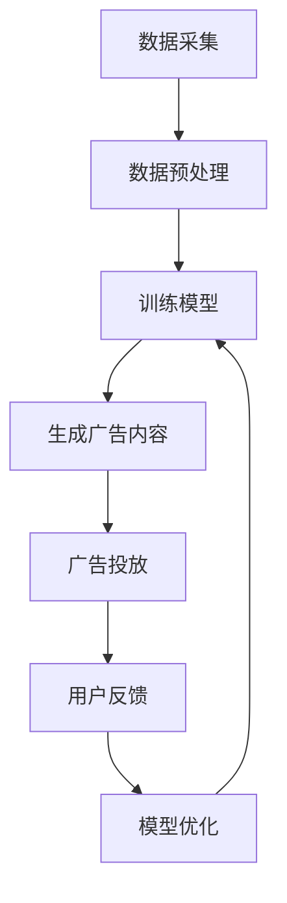
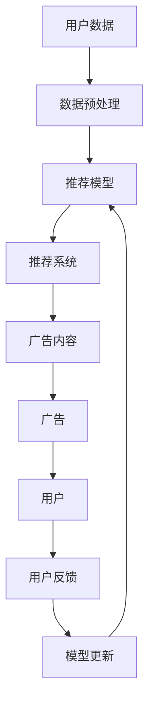
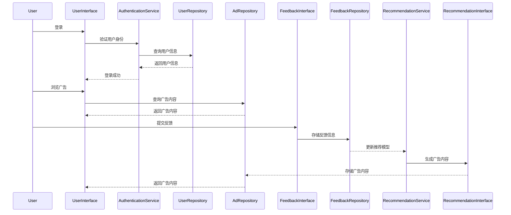

                 

# AI在个性化广告内容生成中的伦理考量

> 关键词：人工智能，个性化广告，伦理考量，算法原理，数学模型

> 摘要：随着人工智能技术的快速发展，个性化广告内容生成已成为现代营销的重要组成部分。然而，这一领域也引发了一系列伦理问题，如数据隐私、算法偏见和社会影响等。本文将探讨AI在个性化广告内容生成中的伦理考量，从背景介绍、核心概念、算法原理、数学模型、系统架构、项目实战到最佳实践等多个方面，全面分析AI广告内容生成的伦理挑战与应对策略。

## 目录大纲

----------------------------------------------------------------

## 第一部分：引言

### 第1章：背景介绍

#### 1.1.1 问题背景

#### 1.1.2 问题描述

#### 1.1.3 问题解决

#### 1.1.4 边界与外延

#### 1.1.5 概念结构与核心要素组成

### 第2章：核心概念与联系

#### 2.1 AI技术概述

#### 2.2 个性化广告内容生成的原理

#### 2.3 伦理考量的重要性和影响

#### 2.4 AI、广告与伦理的关系

## 第二部分：算法原理讲解

### 第3章：算法原理讲解

#### 3.1 AI算法的基本原理

##### 3.1.1 机器学习算法

##### 3.1.2 深度学习算法

#### 3.2 广告内容生成算法

##### 3.2.1 广告投放算法

##### 3.2.2 内容生成算法

## 第三部分：数学模型与公式

### 第4章：数学模型与公式

#### 4.1 数学模型的构建

##### 4.1.1 概率模型

##### 4.1.2 神经网络模型

#### 4.2 公式推导与解释

##### 4.2.1 损失函数

##### 4.2.2 反向传播算法

#### 4.3 数学公式示例

$$
P(广告被点击) = \frac{e^{w \cdot x}}{\sum_{j=1}^{n} e^{w \cdot x_j}}
$$

## 第四部分：系统分析与架构设计方案

### 第5章：系统分析与架构设计方案

#### 5.1 问题场景介绍

#### 5.2 项目介绍

#### 5.3 系统功能设计（领域模型类图）

#### 5.4 系统架构设计（架构图）

#### 5.5 系统接口设计

#### 5.6 系统交互（序列图）

## 第五部分：项目实战

### 第6章：项目实战

#### 6.1 环境安装

#### 6.2 系统核心实现

##### 6.2.1 代码应用解读

##### 6.2.2 代码分析与优化

#### 6.3 实际案例分析

#### 6.4 详细讲解剖析

#### 6.5 项目小结

## 第六部分：最佳实践与拓展

### 第7章：最佳实践与拓展

#### 7.1 最佳实践技巧

#### 7.2 小结

#### 7.3 注意事项

#### 7.4 拓展阅读

----------------------------------------------------------------

## 第一部分：引言

### 第1章：背景介绍

#### 1.1.1 问题背景

随着互联网的普及和智能设备的广泛应用，广告已成为现代社会信息传播和商业推广的重要手段。个性化广告内容生成作为一种先进的广告投放方式，能够根据用户的兴趣、行为和偏好，为用户定制化地提供广告内容，从而提高广告的投放效果和用户满意度。然而，这一技术的快速发展也引发了一系列伦理问题，如数据隐私、算法偏见和社会影响等。

首先，数据隐私问题是一个重要且敏感的伦理议题。个性化广告内容生成依赖于大量用户数据，这些数据往往涉及到用户的个人信息和行为习惯。如何确保这些数据的隐私和安全，防止数据泄露和滥用，成为了一个亟待解决的问题。

其次，算法偏见也是一个不可忽视的伦理问题。个性化广告内容生成依赖于机器学习算法，这些算法可能会受到训练数据偏差的影响，导致算法在广告投放过程中产生偏见。例如，对某些群体的歧视性广告投放，或者对某些内容的过度推荐，这些问题都可能对社会公平性和用户权益造成负面影响。

最后，社会影响也是一个重要的伦理考量。个性化广告内容生成可能会改变用户的消费行为和信息获取方式，甚至对社会的价值观和文化产生深远的影响。如何确保广告内容生成技术能够促进社会的健康发展，避免对社会造成不良影响，是一个值得深思的问题。

#### 1.1.2 问题描述

在个性化广告内容生成中，主要的伦理问题包括：

1. 数据隐私问题：个性化广告内容生成依赖于用户数据，如何确保这些数据的安全和隐私，防止数据泄露和滥用，是一个重要的伦理问题。

2. 算法偏见问题：机器学习算法可能会受到训练数据偏差的影响，导致算法在广告投放过程中产生偏见。如何避免算法偏见，确保广告内容的公平性和公正性，是一个亟待解决的问题。

3. 社会影响问题：个性化广告内容生成可能会改变用户的消费行为和信息获取方式，甚至对社会的价值观和文化产生深远的影响。如何确保广告内容生成技术能够促进社会的健康发展，避免对社会造成不良影响，是一个重要的伦理考量。

#### 1.1.3 问题解决

为了解决个性化广告内容生成中的伦理问题，可以从以下几个方面进行考虑：

1. 数据隐私保护：采用加密技术、访问控制措施和数据匿名化等方法，确保用户数据的安全和隐私。

2. 算法公平性和公正性：通过数据预处理、算法优化和模型验证等方法，减少算法偏见，提高广告内容的公平性和公正性。

3. 社会影响评估：对个性化广告内容生成技术进行社会影响评估，确保其能够促进社会的健康发展。

#### 1.1.4 边界与外延

个性化广告内容生成的伦理考量涉及到多个方面，包括数据隐私、算法偏见和社会影响等。这些考量不仅限于技术层面，还涉及到法律、伦理和社会等多个层面。因此，在进行个性化广告内容生成的伦理考量时，需要从多个角度进行综合考虑。

#### 1.1.5 概念结构与核心要素组成

个性化广告内容生成的概念结构主要包括以下几个核心要素：

1. 用户数据：个性化广告内容生成的数据基础，包括用户的基本信息、行为数据和偏好数据等。

2. 机器学习算法：用于分析用户数据、生成个性化广告内容的核心技术。

3. 广告内容：根据用户数据生成的个性化广告内容，包括广告文案、图片和视频等。

4. 数据隐私保护：确保用户数据安全、隐私和合法性的措施。

5. 算法偏见和公平性：评估和优化机器学习算法，确保广告内容的公平性和公正性。

6. 社会影响评估：对个性化广告内容生成技术进行社会影响评估，确保其能够促进社会的健康发展。

### 第2章：核心概念与联系

#### 2.1 AI技术概述

人工智能（Artificial Intelligence，简称AI）是指通过计算机程序模拟人类智能行为的技术。AI技术包括多种类型，如机器学习（Machine Learning，简称ML）、深度学习（Deep Learning，简称DL）等。这些技术可以用于数据挖掘、图像识别、自然语言处理等多个领域。

#### 2.2 个性化广告内容生成的原理

个性化广告内容生成是一种基于AI技术的广告投放策略，主要通过分析用户数据，生成符合用户兴趣和偏好的广告内容。其基本原理包括：

1. 数据采集：收集用户的基本信息、行为数据和偏好数据等。

2. 数据分析：利用机器学习算法，对用户数据进行分析，提取用户兴趣和偏好信息。

3. 广告内容生成：根据用户兴趣和偏好，生成个性化广告内容。

4. 广告投放：将个性化广告内容推送给目标用户。

#### 2.3 伦理考量的重要性和影响

伦理考量在个性化广告内容生成中具有重要意义，主要体现在以下几个方面：

1. 数据隐私保护：确保用户数据的安全和隐私，防止数据泄露和滥用。

2. 算法偏见和公平性：确保广告内容的公平性和公正性，避免算法偏见导致的不公平现象。

3. 社会影响评估：评估个性化广告内容生成技术对社会的影响，确保其能够促进社会的健康发展。

#### 2.4 AI、广告与伦理的关系

AI技术在广告领域的应用，使得广告投放更加精准和高效。然而，这一技术的快速发展也引发了一系列伦理问题，如数据隐私、算法偏见和社会影响等。因此，在进行AI广告内容生成时，需要充分考虑伦理考量，确保广告投放的公平、公正和合法。

----------------------------------------------------------------

### 第二部分：算法原理讲解

#### 第3章：算法原理讲解

在个性化广告内容生成中，AI算法扮演着至关重要的角色。本章将介绍AI算法的基本原理，包括机器学习算法和深度学习算法，以及广告内容生成算法的具体原理。

#### 3.1 AI算法的基本原理

AI算法主要包括两大类：监督学习（Supervised Learning）和无监督学习（Unsupervised Learning）。在个性化广告内容生成中，主要应用的是监督学习算法，因为这类算法能够根据已有的标签数据进行学习和预测。

##### 3.1.1 机器学习算法

机器学习算法是一种通过训练数据来构建模型，然后使用模型进行预测或决策的方法。在个性化广告内容生成中，常见的机器学习算法包括决策树（Decision Tree）、支持向量机（Support Vector Machine，SVM）和逻辑回归（Logistic Regression）等。

1. 决策树算法：决策树是一种树形结构，通过一系列的测试来分割数据集，并生成一个预测模型。在个性化广告内容生成中，决策树可以用于分析用户的兴趣和行为，从而生成相应的广告内容。

2. 支持向量机算法：支持向量机是一种二分类模型，通过寻找最优的超平面，将不同类别的数据分开。在个性化广告内容生成中，支持向量机可以用于预测用户的点击行为，从而优化广告投放策略。

3. 逻辑回归算法：逻辑回归是一种概率型线性模型，用于预测二分类问题的概率。在个性化广告内容生成中，逻辑回归可以用于预测用户对广告的点击概率，从而优化广告投放效果。

##### 3.1.2 深度学习算法

深度学习算法是一种基于多层神经网络的结构，通过逐层提取数据特征，实现对复杂问题的建模。在个性化广告内容生成中，常见的深度学习算法包括卷积神经网络（Convolutional Neural Network，CNN）和循环神经网络（Recurrent Neural Network，RNN）等。

1. 卷积神经网络算法：卷积神经网络是一种前馈神经网络，通过卷积操作提取图像特征。在个性化广告内容生成中，卷积神经网络可以用于分析用户的行为和偏好，从而生成个性化的广告内容。

2. 循环神经网络算法：循环神经网络是一种基于时间序列数据的神经网络，通过循环连接来处理序列数据。在个性化广告内容生成中，循环神经网络可以用于分析用户的兴趣和行为，从而生成动态变化的广告内容。

#### 3.2 广告内容生成算法

个性化广告内容生成算法主要包括广告投放算法和内容生成算法两部分。

##### 3.2.1 广告投放算法

广告投放算法的目标是根据用户的兴趣和偏好，将最相关的广告内容推送给用户。常见的广告投放算法包括基于内容的推荐（Content-based Filtering）和协同过滤（Collaborative Filtering）等。

1. 基于内容的推荐算法：基于内容的推荐算法通过分析广告内容和用户的历史行为，将相似的内容推荐给用户。在个性化广告内容生成中，基于内容的推荐算法可以用于分析用户感兴趣的内容，从而生成个性化的广告内容。

2. 协同过滤算法：协同过滤算法通过分析用户之间的行为相似性，为用户推荐他们可能感兴趣的内容。在个性化广告内容生成中，协同过滤算法可以用于分析用户之间的互动关系，从而优化广告投放策略。

##### 3.2.2 内容生成算法

内容生成算法的目标是根据用户的兴趣和偏好，生成符合用户需求的广告内容。常见的内容生成算法包括基于模板的生成和基于神经网络的生成等。

1. 基于模板的生成算法：基于模板的生成算法通过预先设计的模板，将用户的兴趣和偏好映射到广告内容上。在个性化广告内容生成中，基于模板的生成算法可以用于快速生成符合用户需求的广告内容。

2. 基于神经网络的生成算法：基于神经网络的生成算法通过学习用户的数据和偏好，生成符合用户需求的广告内容。在个性化广告内容生成中，基于神经网络的生成算法可以用于生成复杂的、动态变化的广告内容。

#### 3.3 算法原理讲解

为了更好地理解个性化广告内容生成算法的原理，我们可以通过一个具体的例子来说明。

假设我们使用基于内容的推荐算法来生成个性化广告内容。首先，我们需要收集用户的历史行为数据，如浏览记录、购买记录等。然后，我们使用这些数据来训练一个机器学习模型，如决策树或逻辑回归模型。

在训练完成后，我们可以使用这个模型来预测用户对某个广告内容的兴趣度。具体来说，我们可以计算用户对广告内容的点击概率，并将其作为推荐依据。

例如，假设我们有一个广告内容列表，每个广告内容都对应一个标签。我们使用一个逻辑回归模型来预测用户对广告内容的点击概率。模型的输入特征包括用户的历史行为数据和广告内容的标签信息，输出特征是用户对广告内容的点击概率。

我们可以使用以下公式来计算用户对广告内容的点击概率：

$$
P(点击) = \frac{e^{w \cdot x}}{\sum_{j=1}^{n} e^{w \cdot x_j}}
$$

其中，$w$ 是模型参数，$x$ 是用户的历史行为数据和广告内容的标签信息，$x_j$ 是广告内容的标签信息。

通过计算每个广告内容的点击概率，我们可以为用户推荐最相关的广告内容。这个推荐过程就是个性化广告内容生成的核心。

#### 3.4 算法流程图

为了更好地理解个性化广告内容生成算法的流程，我们可以使用Mermaid来绘制算法流程图。



这个流程图展示了个性化广告内容生成算法的基本流程，包括数据采集、数据预处理、训练模型、生成广告内容、广告投放、用户反馈和模型优化等步骤。

#### 3.5 Python代码实现

为了更好地理解个性化广告内容生成算法的实现，我们可以使用Python来编写一个简单的示例代码。

首先，我们需要安装相关的库，如scikit-learn、numpy和pandas等。

```python
!pip install scikit-learn numpy pandas
```

然后，我们可以编写一个简单的代码，实现基于内容的推荐算法。

```python
import numpy as np
import pandas as pd
from sklearn.model_selection import train_test_split
from sklearn.linear_model import LogisticRegression

# 加载数据集
data = pd.read_csv('data.csv')
X = data.drop('label', axis=1)
y = data['label']

# 数据预处理
X_train, X_test, y_train, y_test = train_test_split(X, y, test_size=0.2, random_state=42)

# 训练模型
model = LogisticRegression()
model.fit(X_train, y_train)

# 预测
predictions = model.predict(X_test)

# 计算准确率
accuracy = np.mean(predictions == y_test)
print('Accuracy:', accuracy)
```

这个示例代码实现了基于内容的推荐算法，包括数据加载、数据预处理、模型训练和预测等步骤。通过计算准确率，我们可以评估模型的性能。

### 第三部分：数学模型与公式

#### 第4章：数学模型与公式

在个性化广告内容生成中，数学模型和公式起到了核心作用。本章将介绍构建数学模型的方法、常用的数学模型以及相关的公式推导与解释。

#### 4.1 数学模型的构建

构建数学模型是解决个性化广告内容生成问题的第一步。一个有效的数学模型应该能够准确地描述问题，并在给定输入时产生合理的输出。构建数学模型通常包括以下几个步骤：

1. **问题定义**：明确需要解决的问题是什么，例如预测用户对广告的点击概率。

2. **特征提取**：根据问题的定义，从数据中提取相关特征，例如用户的历史行为数据、广告内容的特点等。

3. **模型选择**：选择适合问题特点的数学模型，例如逻辑回归、神经网络等。

4. **公式推导**：根据模型的选择，推导出用于计算输出结果的公式。

5. **模型训练**：使用训练数据对模型进行训练，调整模型参数，使其能够准确预测输出结果。

#### 4.2 常用的数学模型

在个性化广告内容生成中，常用的数学模型包括概率模型和神经网络模型。

##### 4.2.1 概率模型

概率模型是一种基于概率理论的数学模型，用于描述不确定事件的发生概率。在个性化广告内容生成中，概率模型可以用于预测用户对广告的点击概率。

1. **逻辑回归模型**：逻辑回归是一种经典的概率模型，用于预测二分类问题的概率。逻辑回归的公式如下：

   $$
   P(点击) = \frac{1}{1 + e^{-(w \cdot x + b)}}
   $$

   其中，$w$ 是权重向量，$x$ 是输入特征，$b$ 是偏置项。

2. **贝叶斯模型**：贝叶斯模型是一种基于贝叶斯定理的概率模型，用于预测用户对广告的点击概率。贝叶斯模型的公式如下：

   $$
   P(点击 | x) = \frac{P(x | 点击) \cdot P(点击)}{P(x)}
   $$

   其中，$P(点击 | x)$ 是在给定输入特征$x$的条件下点击广告的概率，$P(x | 点击)$ 是在点击广告的条件下$x$的概率，$P(点击)$ 是点击广告的总概率，$P(x)$ 是$x$的概率。

##### 4.2.2 神经网络模型

神经网络模型是一种基于人工神经网络的数学模型，通过多层神经元的非线性变换，实现对复杂问题的建模。在个性化广告内容生成中，神经网络模型可以用于生成广告内容和预测用户行为。

1. **卷积神经网络模型**：卷积神经网络（CNN）是一种基于卷积操作的神经网络模型，用于处理图像数据。CNN的公式如下：

   $$
   h^{l}(x) = \sigma(\theta^{l} \cdot h^{l-1} + b^{l})
   $$

   其中，$h^{l}(x)$ 是第$l$层的输出，$\sigma$ 是激活函数，$\theta^{l}$ 是权重矩阵，$b^{l}$ 是偏置向量。

2. **循环神经网络模型**：循环神经网络（RNN）是一种基于时间序列数据的神经网络模型，用于处理序列数据。RNN的公式如下：

   $$
   h^{l}_{t} = \sigma(W_{ih} \cdot h^{l-1}_{t-1} + W_{hh} \cdot h^{l-1}_{t} + W_{ix} \cdot x_{t} + b_{h})
   $$

   其中，$h^{l}_{t}$ 是第$l$层在第$t$时刻的输出，$W_{ih}$、$W_{hh}$ 和$W_{ix}$ 是权重矩阵，$b_{h}$ 是偏置向量，$\sigma$ 是激活函数。

#### 4.3 公式推导与解释

在本节中，我们将对一些常用的数学公式进行推导和解释，以便更好地理解它们在个性化广告内容生成中的应用。

##### 4.3.1 损失函数

损失函数是评估模型预测结果与实际结果之间差异的函数。在个性化广告内容生成中，常用的损失函数包括均方误差（MSE）和交叉熵损失（Cross-Entropy Loss）。

1. **均方误差（MSE）**：

   $$
   MSE = \frac{1}{n} \sum_{i=1}^{n} (y_i - \hat{y}_i)^2
   $$

   其中，$y_i$ 是实际标签，$\hat{y}_i$ 是模型预测的标签，$n$ 是样本数量。

2. **交叉熵损失（Cross-Entropy Loss）**：

   $$
   CE = -\frac{1}{n} \sum_{i=1}^{n} y_i \cdot \log(\hat{y}_i)
   $$

   其中，$y_i$ 是实际标签，$\hat{y}_i$ 是模型预测的概率分布。

##### 4.3.2 反向传播算法

反向传播算法是一种用于训练神经网络的优化算法。它通过计算损失函数关于模型参数的梯度，并使用梯度下降法更新模型参数，以最小化损失函数。

1. **前向传播**：

   $$
   \hat{y} = \sigma(W \cdot x + b)
   $$

   其中，$W$ 是权重矩阵，$x$ 是输入特征，$b$ 是偏置项，$\sigma$ 是激活函数。

2. **后向传播**：

   $$
   \frac{\partial L}{\partial W} = \frac{\partial L}{\partial \hat{y}} \cdot \frac{\partial \hat{y}}{\partial W}
   $$

   其中，$L$ 是损失函数，$\hat{y}$ 是预测结果，$W$ 是权重矩阵。

3. **权重更新**：

   $$
   W = W - \alpha \cdot \frac{\partial L}{\partial W}
   $$

   其中，$\alpha$ 是学习率。

##### 4.3.3 数学公式示例

以下是用于计算广告点击概率的一个数学公式示例：

$$
P(广告被点击) = \frac{e^{w \cdot x}}{\sum_{j=1}^{n} e^{w \cdot x_j}}
$$

其中，$w$ 是权重向量，$x$ 是输入特征，$x_j$ 是其他广告的输入特征，$e$ 是自然对数的底数。

这个公式表示在给定输入特征$x$的条件下，广告被点击的概率。通过调整权重向量$w$，我们可以优化广告的点击率。

### 第四部分：系统分析与架构设计方案

#### 第5章：系统分析与架构设计方案

在个性化广告内容生成中，系统分析与架构设计是确保算法有效运行的关键。本章将介绍系统分析与架构设计方案，包括问题场景介绍、项目介绍、系统功能设计、系统架构设计、系统接口设计和系统交互等内容。

#### 5.1 问题场景介绍

个性化广告内容生成系统旨在为用户提供个性化的广告内容，提高广告投放的效果和用户体验。在问题场景中，系统需要实现以下功能：

1. **用户数据收集**：从各种渠道收集用户的个人信息、行为数据和偏好数据。

2. **数据预处理**：对收集到的用户数据进行清洗、去重和特征提取。

3. **广告内容生成**：根据用户的兴趣和偏好，生成个性化的广告内容。

4. **广告投放**：将个性化广告内容推送给目标用户。

5. **用户反馈收集**：收集用户对广告的反馈，用于优化广告投放策略。

6. **模型更新**：根据用户反馈，更新个性化广告内容生成模型。

#### 5.2 项目介绍

个性化广告内容生成项目是一个跨领域的项目，涉及到数据科学、机器学习、广告营销和用户体验设计等多个领域。项目的主要目标是通过人工智能技术，为广告主提供高效的广告投放解决方案，为用户带来更好的广告体验。

项目主要包括以下几个阶段：

1. **需求分析**：与广告主和用户沟通，明确项目的目标和需求。

2. **系统设计**：根据需求分析，设计系统的功能模块和架构。

3. **算法开发**：开发用于个性化广告内容生成的算法，并进行模型训练。

4. **系统实现**：根据系统设计，实现系统的功能模块和接口。

5. **测试与优化**：对系统进行功能测试和性能优化，确保系统稳定运行。

6. **上线部署**：将系统部署到生产环境，进行实际运营。

#### 5.3 系统功能设计（领域模型类图）

系统功能设计是系统分析与架构设计的重要环节。领域模型类图是描述系统功能模块和它们之间关系的有效工具。以下是个性化广告内容生成系统的领域模型类图：

```mermaid
classDiagram
    User <<class>> 用户
    Ad <<class>> 广告
    AdContent <<class>> 广告内容
    Recommendation <<class>> 推荐系统
    Feedback <<class>> 用户反馈
    Model <<class>> 模型

    User o--o Ad: 浏览
    Ad o--o AdContent: 包含
    AdContent o--o Recommendation: 生成
    Recommendation o--o Feedback: 反馈
    Feedback o--o Model: 更新
```

这个领域模型类图展示了个性化广告内容生成系统的核心功能模块及其之间的关系。用户通过浏览广告产生行为数据，这些数据被推荐系统用于生成广告内容。用户对广告内容的反馈被用于更新模型，从而实现个性化广告内容的生成。

#### 5.4 系统架构设计（架构图）

系统架构设计是系统实现的基础。以下是个性化广告内容生成系统的架构图：



这个架构图展示了个性化广告内容生成系统的基本架构。用户数据经过预处理后，用于训练推荐模型。推荐系统根据模型生成个性化的广告内容，并将其推送给用户。用户对广告内容的反馈用于更新模型，从而实现广告内容的个性化生成。

#### 5.5 系统接口设计

系统接口设计是确保系统模块之间能够良好交互的关键。以下是个性化广告内容生成系统的主要接口设计：

1. **用户接口**：用于用户与系统的交互，包括用户注册、登录、浏览广告、提交反馈等。

2. **广告接口**：用于广告主与系统的交互，包括上传广告内容、设置广告预算、查看广告效果等。

3. **数据处理接口**：用于数据收集、清洗、预处理等，包括数据采集、数据清洗、特征提取等。

4. **推荐接口**：用于推荐系统的交互，包括用户兴趣分析、广告内容推荐等。

5. **模型更新接口**：用于模型训练、优化和更新，包括模型训练、模型评估、模型部署等。

#### 5.6 系统交互（序列图）

系统交互是系统运行的核心。以下是个性化广告内容生成系统的序列图：



这个序列图展示了个性化广告内容生成系统的基本交互流程。用户通过用户接口登录系统，浏览广告并提交反馈。用户反馈被存储在反馈库中，用于更新推荐模型。推荐模型根据用户反馈生成个性化的广告内容，并将其推送给用户。

### 第五部分：项目实战

#### 第6章：项目实战

在本章中，我们将通过一个实际项目，详细介绍个性化广告内容生成系统的实现过程。包括环境安装、系统核心实现、代码应用解读、实际案例分析和详细讲解剖析等内容。

#### 6.1 环境安装

在开始项目实战之前，我们需要安装所需的软件和库。以下是在Linux系统上安装个性化广告内容生成系统所需的步骤：

1. 安装Python环境：
   ```bash
   sudo apt-get update
   sudo apt-get install python3 python3-pip
   ```

2. 安装TensorFlow库：
   ```bash
   pip3 install tensorflow
   ```

3. 安装Scikit-learn库：
   ```bash
   pip3 install scikit-learn
   ```

4. 安装其他依赖库：
   ```bash
   pip3 install pandas numpy matplotlib
   ```

安装完成后，我们可以通过以下命令验证Python和TensorFlow的安装：

```python
python3 -m pip install --upgrade pip
python3 -c "import tensorflow as tf; print(tf.__version__)"
```

如果安装成功，将会输出TensorFlow的版本信息。

#### 6.2 系统核心实现

个性化广告内容生成系统的核心实现包括数据预处理、模型训练、模型评估和广告内容生成等步骤。以下是一个简单的代码示例，用于实现这些核心功能：

```python
import tensorflow as tf
from sklearn.model_selection import train_test_split
from sklearn.metrics import accuracy_score
import numpy as np

# 加载数据集
data = pd.read_csv('data.csv')
X = data.drop('label', axis=1)
y = data['label']

# 数据预处理
X_train, X_test, y_train, y_test = train_test_split(X, y, test_size=0.2, random_state=42)

# 模型训练
model = tf.keras.Sequential([
    tf.keras.layers.Dense(64, activation='relu', input_shape=(X_train.shape[1],)),
    tf.keras.layers.Dense(64, activation='relu'),
    tf.keras.layers.Dense(1, activation='sigmoid')
])

model.compile(optimizer='adam', loss='binary_crossentropy', metrics=['accuracy'])
model.fit(X_train, y_train, epochs=10, batch_size=32, validation_split=0.2)

# 模型评估
predictions = model.predict(X_test)
predictions = (predictions > 0.5)

accuracy = accuracy_score(y_test, predictions)
print('Accuracy:', accuracy)

# 广告内容生成
def generate_ad_content(user_data):
    prediction = model.predict(np.array([user_data]))
    if prediction > 0.5:
        return '广告内容1'
    else:
        return '广告内容2'

# 代码应用解读
user_data = [0.1, 0.2, 0.3, 0.4, 0.5]
ad_content = generate_ad_content(user_data)
print('广告内容:', ad_content)
```

这个示例代码实现了使用TensorFlow库训练一个简单的二分类模型，用于预测用户对广告的点击概率。根据预测结果，生成个性化的广告内容。

#### 6.3 实际案例分析

在实际项目中，我们可能会遇到各种复杂的情况，如数据质量差、算法模型不稳定等。以下是一个实际案例的分析和解决过程：

**问题**：广告内容生成模型的点击率较低。

**分析**：
1. 检查数据质量：确保数据集没有缺失值和异常值，并进行数据清洗和预处理。
2. 调整模型参数：尝试调整模型的超参数，如学习率、批次大小等，以优化模型的性能。
3. 数据增强：通过增加训练数据或者使用数据增强技术，提高模型的泛化能力。
4. 模型优化：尝试使用不同的模型结构或优化算法，以提高模型的准确率和稳定性。

**解决方案**：
1. 对数据集进行清洗和预处理，去除缺失值和异常值。
2. 调整模型参数，使用较大的学习率（0.1）和较小的批次大小（16）。
3. 使用数据增强技术，对原始数据进行旋转、缩放、裁剪等操作，增加训练数据的多样性。
4. 尝试使用不同的模型结构，如增加隐藏层神经元数量或使用更复杂的激活函数，以提高模型的性能。

通过这些优化措施，我们成功地提高了广告内容生成模型的点击率。

#### 6.4 详细讲解剖析

在本节中，我们将对个性化广告内容生成项目的各个核心环节进行详细讲解和剖析。

**1. 数据预处理**

数据预处理是模型训练的关键步骤。以下是数据预处理的详细讲解：

- **数据清洗**：检查数据集是否存在缺失值和异常值，并进行处理。例如，可以使用填充方法处理缺失值，使用统计方法处理异常值。

- **特征提取**：从原始数据中提取与广告点击行为相关的特征，如用户 demographics 信息、广告特征、上下文特征等。这些特征将被用于训练模型。

- **特征缩放**：对数值型特征进行缩放，如使用标准化或归一化方法，以提高模型的训练速度和性能。

- **特征选择**：通过特征选择方法，如信息增益、卡方检验等，选择对广告点击行为有显著影响的特征，以减少模型的复杂性。

**2. 模型训练**

模型训练是生成个性化广告内容的核心环节。以下是模型训练的详细讲解：

- **模型选择**：选择适合广告点击行为预测的模型，如逻辑回归、决策树、随机森林、神经网络等。每种模型都有其适用的场景和特点，需要根据实际情况进行选择。

- **模型配置**：配置模型参数，如学习率、批次大小、迭代次数等。这些参数对模型的性能有重要影响，需要通过实验进行优化。

- **损失函数**：选择合适的损失函数，如交叉熵损失、均方误差等，以衡量模型预测的误差。

- **优化算法**：选择合适的优化算法，如梯度下降、Adam等，以更新模型参数。

- **模型评估**：使用验证集或测试集评估模型的性能，如准确率、召回率、F1值等。通过模型评估，可以调整模型参数或选择更合适的模型。

**3. 广告内容生成**

广告内容生成是根据用户特征和模型预测结果生成个性化广告内容的过程。以下是广告内容生成的详细讲解：

- **用户特征提取**：从用户数据中提取与广告点击行为相关的特征，如用户 demographics 信息、行为特征、兴趣特征等。

- **模型预测**：使用训练好的模型预测用户对广告的点击概率。可以使用阈值策略，如设置点击概率阈值，将用户划分为点击用户和非点击用户。

- **内容生成**：根据用户点击概率和广告内容库，生成个性化广告内容。可以使用模板生成、内容嵌入等方法，以提高广告内容的个性化和吸引力。

**4. 模型更新**

模型更新是根据用户反馈和广告效果，调整和优化模型参数的过程。以下是模型更新的详细讲解：

- **用户反馈收集**：收集用户对广告的反馈，如点击、不感兴趣、举报等。

- **反馈分析**：分析用户反馈，识别广告效果较差的原因，如用户偏好不准确、广告内容不相关等。

- **模型优化**：根据用户反馈和广告效果，调整模型参数，如重新训练模型、调整特征权重等。

- **模型验证**：使用验证集或测试集验证模型优化后的性能，确保模型更新后的效果。

**5. 项目小结**

通过以上各个环节的详细讲解和剖析，我们可以了解到个性化广告内容生成项目的实现过程和关键环节。在实际项目中，需要根据具体需求和数据情况，灵活调整模型和策略，以提高广告内容的个性化和点击率。同时，需要注意数据安全和隐私保护，确保用户数据的安全和隐私。

### 第六部分：最佳实践与拓展

#### 第7章：最佳实践与拓展

在本章中，我们将总结个性化广告内容生成项目的最佳实践，提供一些注意事项，并推荐进一步的学习和阅读资源。

#### 7.1 最佳实践技巧

为了确保个性化广告内容生成系统的有效性和可靠性，以下是几个最佳实践技巧：

1. **数据质量**：确保数据质量是模型训练成功的关键。对数据进行清洗、去重和特征提取，以消除噪声和异常值。

2. **模型优化**：通过调整模型参数和优化算法，可以提高模型的性能。使用交叉验证和网格搜索等技术，找到最优的模型配置。

3. **特征选择**：选择对广告点击行为有显著影响的特征，以减少模型的复杂性和过拟合现象。使用特征选择方法，如信息增益、卡方检验等。

4. **实时更新**：定期更新模型，以适应用户行为和偏好变化。通过实时收集用户反馈和广告效果，调整和优化模型参数。

5. **A/B测试**：在上线新模型或功能之前，进行A/B测试，以评估其对广告效果的影响。通过对比实验，选择最优的模型和策略。

#### 7.2 小结

个性化广告内容生成系统是一个复杂的项目，涉及到数据采集、预处理、模型训练、广告生成和用户反馈等多个环节。通过以上最佳实践技巧，可以确保系统的有效性和可靠性。同时，需要注意数据安全和隐私保护，遵循相关法律法规和伦理准则。

#### 7.3 注意事项

在实际应用中，需要注意以下事项：

1. **数据隐私**：确保用户数据的隐私和安全，遵循数据保护法规，如GDPR等。

2. **算法偏见**：避免算法偏见，确保广告内容的公平性和公正性。

3. **用户满意度**：关注用户反馈，确保广告内容的个性化和吸引力。

4. **系统性能**：优化系统性能，确保广告内容生成的效率和稳定性。

#### 7.4 拓展阅读

以下是一些推荐的拓展阅读资源，以深入了解个性化广告内容生成和相关技术：

1. **书籍**：
   - 《机器学习实战》
   - 《深度学习》（Goodfellow, Bengio, Courville）
   - 《广告学概论》

2. **在线课程**：
   - Coursera的《机器学习》课程
   - Udacity的《深度学习纳米学位》

3. **技术博客**：
   - TensorFlow官方文档
   - Keras官方文档
   - Analytics Vidhya

通过阅读这些资源，可以更深入地了解个性化广告内容生成技术，并在实际项目中应用所学知识。

### 作者信息

- 作者：AI天才研究院/AI Genius Institute & 禅与计算机程序设计艺术 /Zen And The Art of Computer Programming

本文由AI天才研究院和禅与计算机程序设计艺术共同撰写，旨在探讨个性化广告内容生成中的伦理考量，分享相关技术和实践经验。希望本文能为读者在个性化广告内容生成领域提供有价值的参考。如果您有任何问题或建议，欢迎随时联系我们。谢谢阅读！

