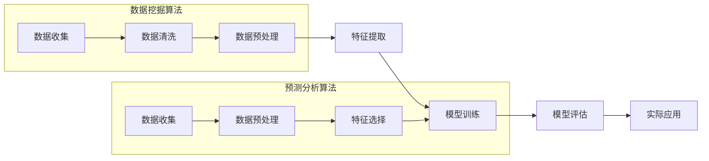
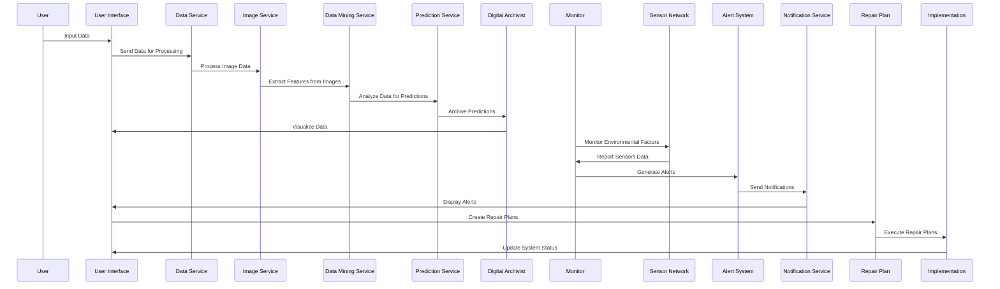
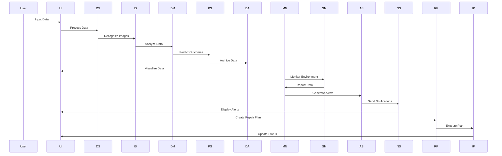

                 

# AI在文化遗产保护中的创新应用

## 关键词

- 文化遗产保护
- 人工智能
- 数据分析
- 图像识别
- 深度学习

## 摘要

本文探讨了人工智能（AI）在文化遗产保护中的创新应用。通过分析AI技术在文化遗产保护中的背景、问题、解决方案和边界，我们深入探讨了AI技术在文化遗产保护中的核心概念、应用领域和优势。本文还详细讲解了文化遗产保护算法的原理，提供了通俗易懂的数学模型和公式，并通过具体案例进行了应用说明。最后，本文对系统架构设计方案进行了详细分析，并提供了项目实战和最佳实践建议，以期为文化遗产保护领域提供有价值的参考。

## 目录

1. **背景介绍**
    1. **第1章 背景介绍**
        1.1 **问题背景**
        1.2 **问题描述**
        1.3 **问题解决**
        1.4 **边界与外延**
        1.5 **概念结构与核心要素组成**
        1.6 **本章小结**
    2. **核心概念与联系**
        2.1 **核心概念原理**
        2.2 **概念属性特征对比表格**
        2.3 **ER实体关系图架构**
    3. **AI在文化遗产保护中的创新应用**
        3.1 **AI技术在文化遗产保护中的应用概述**
        3.2 **AI技术在文化遗产保护中的具体应用**
        3.3 **AI技术在文化遗产保护中的案例研究**
    4. **算法原理讲解**
        4.1 **文化遗产保护算法介绍**
        4.2 **算法原理详细讲解**
        4.3 **算法mermaid流程图**
        4.4 **算法原理数学模型和公式**
        4.5 **通俗易懂的举例说明**
    5. **数学模型和数学公式 & 详细讲解 & 举例说明**
        5.1 **文化遗产保护数学模型介绍**
        5.2 **数学公式详细讲解**
        5.3 **举例说明**
    6. **系统分析与架构设计方案**
        6.1 **问题场景介绍**
        6.2 **项目介绍**
        6.3 **系统功能设计（领域模型mermaid类图）**
        6.4 **系统架构设计（mermaid架构图）**
        6.5 **系统接口设计**
        6.6 **系统交互（mermaid序列图）**
    7. **项目实战**
        7.1 **环境安装**
        7.2 **系统核心实现源代码**
        7.3 **代码应用解读与分析**
        7.4 **实际案例分析与详细讲解剖析**
        7.5 **项目小结**
    8. **最佳实践 tips、小结、注意事项、拓展阅读等**
        8.1 **最佳实践 tips**
        8.2 **小结**
        8.3 **注意事项**
        8.4 **拓展阅读**

### 1. 背景介绍

#### 第1章：背景介绍

##### 1.1 问题背景

文化遗产是历史的见证，是民族精神的载体，对于传承人类文明、增强文化自信具有重要意义。然而，随着时间推移和环境变化，许多文化遗产正面临严重的威胁，如自然灾害、人为破坏、盗窃等。传统文化遗产保护不仅需要传统方法的维护，还迫切需要现代化技术的支持。

##### 1.1.1 文化遗产保护的重要性

文化遗产的保护不仅是国家文化自信的体现，也是维护人类共同遗产的责任。通过保护文化遗产，我们能够更好地了解历史、传承文化，同时也能吸引更多的游客和投资者，促进经济发展。此外，文化遗产的保护对于科研和教育也有重要价值。

##### 1.1.2 传统文化遗产保护的挑战

传统文化遗产保护面临着诸多挑战，包括：
- **自然因素**：如地震、洪水、风蚀等自然灾害，对文化遗产造成破坏。
- **人为因素**：如城市建设、旅游活动、环境污染等，对文化遗产的破坏。
- **技术限制**：传统保护方法有限，难以应对复杂的保护需求。
- **资金和人力**：许多文化遗产地处偏远，资金和人力不足。

##### 1.1.3 AI在文化遗产保护中的应用前景

随着人工智能技术的发展，AI在文化遗产保护中的应用前景十分广阔。AI技术能够提供高效的数据处理、图像识别、预测分析等能力，为文化遗产保护提供新的手段和工具。

##### 1.2 问题描述

传统文化遗产保护中的关键问题包括：
- **监测与预警**：如何实时监测文化遗产的状态，及时预警潜在风险。
- **病害诊断与修复**：如何快速准确地诊断文化遗产的病害，制定有效的修复方案。
- **保护策略制定**：如何根据不同文化遗产的特点，制定科学合理的保护策略。
- **文化遗产数字化**：如何将文化遗产数字化，实现永久保存和在线展示。

##### 1.2.1 文化遗产保护的现状

目前，传统文化遗产保护主要依赖于以下几种方法：
- **传统手工修复**：依赖于经验丰富的修复师，费时费力。
- **传统监测技术**：如定期巡视、传感器监测等，效率较低。
- **数字化保护**：通过扫描、拍照等方式对文化遗产进行数字化记录，但面临数据管理和分析难题。

##### 1.2.2 文化遗产保护中的关键问题

传统文化遗产保护中的关键问题包括：
- **数据采集与处理**：如何高效地采集文化遗产数据，并进行有效的处理和分析。
- **病害诊断与预测**：如何利用AI技术快速、准确地诊断文化遗产的病害，并预测其发展趋势。
- **保护方案制定**：如何根据诊断结果，制定科学、合理的保护方案。

##### 1.2.3 AI技术在文化遗产保护中的潜在应用

AI技术在文化遗产保护中的潜在应用包括：
- **图像识别**：用于识别文化遗产的病变、损坏情况。
- **数据挖掘**：用于分析文化遗产的历史背景、文化内涵。
- **预测分析**：用于预测文化遗产的未来发展趋势。
- **虚拟修复**：通过虚拟技术实现文化遗产的修复和复原。

##### 1.3 问题解决

为了解决传统文化遗产保护中的关键问题，我们需要充分利用AI技术的优势，具体应用领域包括：
- **监测与预警**：利用AI技术进行实时监测，及时发现风险并预警。
- **病害诊断与修复**：利用AI技术进行病害诊断，制定修复方案，提高修复效率。
- **保护策略制定**：利用AI技术分析文化遗产数据，制定科学合理的保护策略。
- **文化遗产数字化**：利用AI技术实现文化遗产的数字化，实现永久保存和在线展示。

##### 1.3.1 AI技术在文化遗产保护中的应用领域

AI技术在文化遗产保护中的应用领域包括：
- **图像识别**：用于识别文化遗产的病变、损坏情况。
- **数据挖掘**：用于分析文化遗产的历史背景、文化内涵。
- **预测分析**：用于预测文化遗产的未来发展趋势。
- **虚拟修复**：通过虚拟技术实现文化遗产的修复和复原。

##### 1.3.2 AI技术在文化遗产保护中的优势

AI技术在文化遗产保护中的优势包括：
- **高效性**：AI技术能够快速处理大量数据，提高工作效率。
- **准确性**：AI技术能够通过图像识别、数据分析等方式，提供准确的信息。
- **实时性**：AI技术能够实现实时监测和预警，及时应对风险。
- **智能化**：AI技术能够根据数据进行分析，提供智能化的保护策略。

##### 1.3.3 AI技术在文化遗产保护中的挑战

AI技术在文化遗产保护中的挑战包括：
- **数据质量**：文化遗产数据质量直接影响AI技术的效果，需要解决数据采集和处理的问题。
- **技术复杂性**：AI技术涉及多个领域，技术复杂度高，需要专业的技术团队支持。
- **资金投入**：AI技术需要大量的资金投入，对资金要求较高。
- **人才培养**：AI技术需要专业的技术人才，对人才培养和引进有较高要求。

##### 1.4 边界与外延

传统文化遗产的定义与分类：
- **文化遗产**：指从历史、艺术、科学、社会等方面具有价值的物质和非物质遗产。
- **物质文化遗产**：指具有历史、艺术、科学价值的建筑物、遗址、艺术品等。
- **非物质文化遗产**：指具有历史、艺术、科学价值的口头传统、表演艺术、社会实践、习俗、庆祝活动、手工艺技艺等。

AI技术的定义与发展：
- **AI技术**：指模拟、延伸和扩展人类智能的技术，包括机器学习、深度学习、自然语言处理等。
- **AI发展历程**：从早期的符号逻辑、知识表示，到现代的机器学习、深度学习，AI技术不断进化。

文化遗产保护与AI技术的融合：
- **融合背景**：传统文化遗产保护与AI技术的融合，是文化遗产保护现代化的必然趋势。
- **融合意义**：通过AI技术，可以提高文化遗产保护效率，实现文化遗产的数字化、智能化保护。

##### 1.5 概念结构与核心要素组成

文化遗产保护的核心要素包括：
- **文化遗产**：文化遗产是保护的对象。
- **保护技术**：包括传统保护方法和现代AI技术。
- **保护策略**：根据文化遗产的特点，制定科学的保护策略。

AI技术在文化遗产保护中的应用包括：
- **图像识别**：用于识别文化遗产的病变、损坏情况。
- **数据挖掘**：用于分析文化遗产的历史背景、文化内涵。
- **预测分析**：用于预测文化遗产的未来发展趋势。
- **虚拟修复**：通过虚拟技术实现文化遗产的修复和复原。

AI技术在文化遗产保护中的核心概念包括：
- **机器学习**：用于自动识别、分类、预测等任务。
- **深度学习**：用于处理复杂数据，实现高度智能化的任务。
- **自然语言处理**：用于处理人类语言，实现人机交互。

##### 1.6 本章小结

本章介绍了AI在文化遗产保护中的背景、问题、解决方案和边界。传统文化遗产保护具有重要意义，但面临着诸多挑战。AI技术的引入为文化遗产保护提供了新的手段和工具，具有高效性、准确性、实时性和智能化等优势。然而，AI技术在文化遗产保护中也面临数据质量、技术复杂性、资金投入和人才培养等挑战。未来，通过不断探索和实践，AI技术在文化遗产保护中的应用前景将更加广阔。

----------------------------------------------------------------

### 2. 核心概念与联系

#### 第2章：核心概念与联系

##### 2.1 核心概念原理

在探讨AI在文化遗产保护中的创新应用时，我们需要深入理解以下几个核心概念：

- **文化遗产**：指从历史、艺术、科学、社会等方面具有价值的物质和非物质遗产。物质文化遗产包括建筑物、遗址、艺术品等；非物质文化遗产包括口头传统、表演艺术、社会实践、习俗、庆祝活动、手工艺技艺等。

- **人工智能（AI）**：AI是一种模拟、延伸和扩展人类智能的技术。它包括机器学习、深度学习、自然语言处理等多个领域。机器学习是一种让计算机通过数据学习并做出决策的技术；深度学习是机器学习的一种重要分支，通过多层神经网络模拟人类大脑的学习过程；自然语言处理则是使计算机理解和生成人类语言的技术。

- **图像识别**：图像识别是一种通过计算机视觉技术，使计算机能够识别和理解图像中的内容。在文化遗产保护中，图像识别可用于检测文化遗产的病变、损坏情况。

- **数据挖掘**：数据挖掘是从大量数据中提取有价值信息的过程。在文化遗产保护中，数据挖掘可用于分析文化遗产的历史背景、文化内涵，以及预测文化遗产的未来发展趋势。

- **预测分析**：预测分析是一种基于历史数据，预测未来发展趋势的方法。在文化遗产保护中，预测分析可用于预测文化遗产的未来健康状况，为制定保护策略提供依据。

##### 2.1.1 AI技术的核心原理

AI技术的核心原理主要包括以下几个方面：

- **机器学习**：机器学习是通过数据训练模型，使计算机能够自动识别、分类、预测等任务。在文化遗产保护中，机器学习可用于检测文化遗产的病变、损坏情况。

- **深度学习**：深度学习是机器学习的一种重要分支，通过多层神经网络模拟人类大脑的学习过程。深度学习在图像识别、语音识别等领域具有显著优势。

- **自然语言处理**：自然语言处理是使计算机理解和生成人类语言的技术。在文化遗产保护中，自然语言处理可用于分析文化遗产的历史文献、文化内涵。

##### 2.1.2 文化遗产保护的关键概念

文化遗产保护的关键概念包括：

- **病害诊断**：病害诊断是识别文化遗产存在的病害和损坏情况。通过图像识别和数据挖掘等技术，可以快速准确地诊断文化遗产的病害。

- **保护方案**：保护方案是根据文化遗产的病害诊断结果，制定的科学、合理的保护措施。保护方案应考虑到文化遗产的特点、环境因素和资金投入等。

- **数字化保护**：数字化保护是将文化遗产数字化，实现永久保存和在线展示。数字化保护需要利用图像识别、数据挖掘等技术，对文化遗产进行数字化记录和分析。

##### 2.2 概念属性特征对比表格

以下是一个关于文化遗产、AI技术和文化遗产保护的概念属性特征对比表格：

| 概念       | 属性特征                    | 描述                                                         |
| ---------- | --------------------------- | ------------------------------------------------------------ |
| 文化遗产   | 历史价值、艺术价值、科学价值 | 从历史、艺术、科学等方面具有价值的物质和非物质遗产           |
| 人工智能   | 自动化、智能化、高效性      | 通过模拟、延伸和扩展人类智能的技术，包括机器学习、深度学习等   |
| 图像识别   | 自动化、准确性、实时性      | 通过计算机视觉技术，使计算机能够识别和理解图像中的内容         |
| 数据挖掘   | 深度分析、有价值信息提取    | 从大量数据中提取有价值信息的过程                             |
| 预测分析   | 数据驱动、趋势预测         | 基于历史数据，预测未来发展趋势的方法                         |

##### 2.3 ER实体关系图架构

以下是一个关于文化遗产保护中核心概念和实体关系的ER（实体关系）图架构：

```mermaid
erDiagram
  属性表 ||--|{ 文化遗产 }
  属性表 ||--|{ AI技术 }
  属性表 ||--|{ 文化遗产保护 }

  文化遗产 ||--|{ 病害诊断 }
  文化遗产 ||--|{ 保护方案 }
  文化遗产 ||--|{ 数字化保护 }

  AI技术 ||--|{ 图像识别 }
  AI技术 ||--|{ 数据挖掘 }
  AI技术 ||--|{ 预测分析 }

  文化遗产保护 ||--|{ 保护措施 }
  文化遗产保护 ||--|{ 保护效果评估 }
```

ER图清晰地展示了文化遗产、AI技术和文化遗产保护之间的实体关系，有助于我们更好地理解这些概念之间的联系。

##### 2.4 本章小结

本章介绍了AI在文化遗产保护中的核心概念与联系。通过分析文化遗产、AI技术和文化遗产保护的关键概念，我们明确了这些概念之间的属性特征和实体关系。这些核心概念和联系为后续章节的深入探讨奠定了基础。在接下来的章节中，我们将详细探讨AI技术在文化遗产保护中的具体应用和实现方法。

----------------------------------------------------------------

### 3. AI在文化遗产保护中的创新应用

#### 第3章：AI在文化遗产保护中的创新应用

##### 3.1 AI技术在文化遗产保护中的应用概述

随着人工智能技术的发展，AI在文化遗产保护中的应用日益广泛，成为文化遗产保护的重要工具。AI技术在文化遗产保护中的应用主要包括以下方面：

- **图像识别**：AI通过深度学习技术，能够对文化遗产的图像进行自动识别和分析，发现病变、损坏等情况。
- **数据挖掘**：AI能够从大量文化遗产数据中提取有价值的信息，帮助研究人员更好地了解文化遗产的历史背景和文化内涵。
- **预测分析**：AI可以根据历史数据和文化遗产的当前状态，预测其未来的发展趋势，为制定保护策略提供科学依据。
- **虚拟修复**：AI通过模拟和复原技术，可以实现文化遗产的虚拟修复，为修复工作提供参考。
- **自动化监测**：AI能够实现对文化遗产的自动化监测，实时收集数据，及时预警潜在风险。

##### 3.2 AI技术在文化遗产保护中的具体应用

1. **图像识别**

AI在文化遗产保护中最常见的应用是图像识别。通过深度学习技术，AI能够对文化遗产的图像进行自动分类和识别，发现病变、损坏等情况。例如，研究人员可以使用卷积神经网络（CNN）对文化遗产的图像进行训练，使其能够识别出常见的病害类型，如裂隙、脱落、污染等。这种技术不仅提高了病害诊断的效率，还减少了人为误差。

2. **数据挖掘**

AI的数据挖掘技术可以帮助研究人员从大量的文化遗产数据中提取有价值的信息。例如，通过自然语言处理（NLP）技术，AI可以分析文化遗产的历史文献、考古报告等文本数据，提取出关键信息，如年代、地点、人物等。此外，AI还可以通过关联分析，发现不同文化遗产之间的联系，为研究提供新的视角。

3. **预测分析**

AI的预测分析技术可以基于历史数据，预测文化遗产的未来发展趋势。例如，研究人员可以使用时间序列分析、回归分析等方法，预测文化遗产的未来病害发展趋势，为制定保护策略提供依据。这种技术有助于提前识别潜在风险，制定预防措施。

4. **虚拟修复**

AI的虚拟修复技术可以通过模拟和复原技术，实现对文化遗产的虚拟修复。例如，研究人员可以使用生成对抗网络（GAN）等技术，生成与文化遗产相似的高质量图像，用于修复受损的部分。这种技术不仅能够保护文化遗产的原貌，还能够为修复工作提供参考。

5. **自动化监测**

AI的自动化监测技术可以实现对文化遗产的实时监测和预警。例如，研究人员可以使用传感器技术，收集文化遗产的物理参数，如湿度、温度、光照等。然后，通过机器学习算法，对这些数据进行实时分析，发现异常情况，及时预警。这种技术有助于提高文化遗产保护的工作效率。

##### 3.3 AI技术在文化遗产保护中的案例研究

1. **意大利文化遗产保护项目**

意大利文化遗产丰富，但在过去几十年里，许多文化遗产遭受了严重破坏。为了保护这些文化遗产，意大利启动了一系列AI应用项目。其中，最具代表性的是使用深度学习技术对文化遗产进行病害诊断。研究人员训练了基于CNN的模型，使其能够识别出多种病害类型，如裂隙、脱落、污染等。通过这种方式，研究人员能够快速、准确地诊断文化遗产的病害，为修复工作提供依据。

2. **中国敦煌莫高窟数字化保护项目**

敦煌莫高窟是中国著名的石窟群，拥有大量的佛教艺术作品。为了保护这些珍贵的文化遗产，中国启动了敦煌莫高窟数字化保护项目。该项目使用了AI技术，包括图像识别、数据挖掘和虚拟修复等。通过这些技术，研究人员能够对敦煌莫高窟的壁画进行数字化记录和分析，发现病变、损坏等情况，并制定修复方案。此外，研究人员还利用虚拟修复技术，实现了对受损壁画的修复。

3. **希腊文化遗产监测项目**

希腊是一个历史悠久的国家，拥有丰富的文化遗产。为了保护这些文化遗产，希腊启动了AI监测项目。该项目使用了传感器技术和机器学习算法，对文化遗产进行实时监测。传感器可以收集文化遗产的物理参数，如湿度、温度、光照等。然后，通过机器学习算法，对这些数据进行实时分析，发现异常情况，及时预警。这种技术有助于提前识别潜在风险，制定预防措施。

##### 3.4 本章小结

本章介绍了AI在文化遗产保护中的创新应用。通过图像识别、数据挖掘、预测分析、虚拟修复和自动化监测等技术，AI为文化遗产保护提供了新的手段和工具。这些技术的具体应用案例，如意大利文化遗产保护项目、中国敦煌莫高窟数字化保护项目和希腊文化遗产监测项目，展示了AI技术在文化遗产保护中的巨大潜力。未来，随着AI技术的不断发展，AI在文化遗产保护中的应用将更加广泛，为文化遗产保护事业作出更大贡献。

----------------------------------------------------------------

### 4. 算法原理讲解

#### 第4章：算法原理讲解

##### 4.1 文化遗产保护算法介绍

在文化遗产保护中，算法的引入极大地提高了病害诊断、预测分析和保护方案制定的效率。文化遗产保护算法主要涉及图像识别、数据挖掘和预测分析等领域。以下是对这些算法的基本原理进行详细讲解。

##### 4.2 算法原理详细讲解

1. **图像识别算法**

图像识别算法是文化遗产保护中最常用的算法之一。其基本原理是通过训练模型，使计算机能够识别和理解图像中的内容。具体来说，图像识别算法可以分为以下几个步骤：

- **数据预处理**：对图像进行预处理，包括缩放、旋转、裁剪等操作，以便模型能够更好地学习。
- **特征提取**：从预处理后的图像中提取特征，如颜色、纹理、形状等。常用的特征提取方法包括哈希特征、SIFT、SURF等。
- **模型训练**：使用大量的标注数据，训练卷积神经网络（CNN）等深度学习模型，使其能够识别图像中的病变和损坏情况。
- **模型评估**：使用验证集对训练好的模型进行评估，调整模型参数，提高模型的识别准确率。
- **实际应用**：将训练好的模型应用于实际文化遗产图像，识别出病变和损坏情况。

2. **数据挖掘算法**

数据挖掘算法是用于从大量文化遗产数据中提取有价值信息的方法。在文化遗产保护中，数据挖掘算法可以帮助研究人员发现文化遗产之间的联系，了解文化遗产的历史背景和文化内涵。数据挖掘算法通常包括以下步骤：

- **数据收集**：收集与文化遗产相关的数据，如历史文献、考古报告、图像等。
- **数据清洗**：对收集到的数据进行清洗，包括去除重复数据、填补缺失值等。
- **特征提取**：从清洗后的数据中提取特征，如关键词、主题、年代等。
- **关联分析**：使用关联分析算法，发现不同文化遗产之间的联系，如时间序列分析、聚类分析等。
- **可视化**：使用可视化工具，将分析结果以图表、图像等形式展示，便于研究人员理解和分析。

3. **预测分析算法**

预测分析算法是用于预测文化遗产未来发展趋势的方法。在文化遗产保护中，预测分析算法可以帮助研究人员提前识别潜在风险，制定预防措施。预测分析算法通常包括以下步骤：

- **数据收集**：收集与文化遗产相关的历史数据，如湿度、温度、光照等。
- **数据预处理**：对收集到的数据进行预处理，包括归一化、去噪声等。
- **特征选择**：从预处理后的数据中选取对预测结果影响较大的特征。
- **模型选择**：选择合适的预测模型，如线性回归、时间序列分析、神经网络等。
- **模型训练**：使用历史数据，训练预测模型，使其能够预测文化遗产的未来发展趋势。
- **模型评估**：使用验证集对训练好的模型进行评估，调整模型参数，提高预测准确率。
- **实际应用**：将训练好的模型应用于实际数据，预测文化遗产的未来发展趋势。

##### 4.3 算法mermaid流程图

以下是一个关于文化遗产保护算法的mermaid流程图：



##### 4.4 算法原理数学模型和公式

1. **图像识别算法**

图像识别算法通常使用卷积神经网络（CNN）进行训练。CNN的基本结构包括卷积层、池化层和全连接层。以下是CNN的数学模型和公式：

- **卷积层**：

  - 输入：$X \in \mathbb{R}^{m \times n \times c}$，其中$m$为图像高度，$n$为图像宽度，$c$为图像通道数。
  - 过滤器：$W \in \mathbb{R}^{k \times l \times c}$，其中$k$为过滤器高度，$l$为过滤器宽度。
  - 输出：$Y \in \mathbb{R}^{(m-k+1) \times (n-l+1) \times 1}$。

  $$Y = \text{Conv}(X, W) = \sum_{i=0}^{c-1} (X \circ W_i)$$

  其中，$\circ$表示卷积运算。

- **池化层**：

  - 输入：$X \in \mathbb{R}^{m \times n \times c}$。
  - 输出：$Y \in \mathbb{R}^{(m/p) \times (n/p) \times c}$，其中$p$为池化窗口大小。

  $$Y_{ij} = \max(X_{i:i+p-1, j:j+p-1})$$

- **全连接层**：

  - 输入：$X \in \mathbb{R}^{m \times n \times c}$。
  - 输出：$Y \in \mathbb{R}^{1 \times 1 \times d}$，其中$d$为输出维度。

  $$Y = W^T X$$

2. **数据挖掘算法**

数据挖掘算法通常使用分类算法、聚类算法等进行特征提取和关联分析。以下是常用的分类算法和支持向量机（SVM）的数学模型和公式：

- **分类算法**：

  - 输入：$X \in \mathbb{R}^{m \times n}$，其中$m$为样本数量，$n$为特征维度。
  - 输出：$Y \in \mathbb{R}^{m \times 1}$，其中$Y_i$为第$i$个样本的类别。

  $$y = \arg\max_{c} \sum_{i=1}^{m} \left[ w_c^T x_i - \frac{1}{2} ||w_c||^2 \right]$$

- **支持向量机（SVM）**：

  - 输入：$X \in \mathbb{R}^{m \times n}$，其中$m$为样本数量，$n$为特征维度。
  - 输出：$w, b \in \mathbb{R}^{n \times 1}$，其中$w$为权重向量，$b$为偏置。

  $$\min_{w, b} \frac{1}{2} ||w||^2 + C \sum_{i=1}^{m} \max(0, 1 - y_i (w^T x_i + b))$$

##### 4.5 通俗易懂的举例说明

1. **图像识别算法**

假设我们使用一个卷积神经网络（CNN）来识别一张文化遗产的图像，其中输入图像为$5 \times 5$的像素矩阵，过滤器大小为$3 \times 3$。首先，我们对输入图像进行预处理，将其缩放到合适的大小。然后，我们使用一个卷积层，将输入图像与过滤器进行卷积运算，得到输出特征图。接着，我们使用一个池化层，对特征图进行池化操作，得到更小的特征图。最后，我们使用一个全连接层，将特征图映射到输出类别。

具体来说，输入图像为：

$$
X =
\begin{bmatrix}
1 & 2 & 3 & 4 & 5 \\
6 & 7 & 8 & 9 & 10 \\
11 & 12 & 13 & 14 & 15 \\
16 & 17 & 18 & 19 & 20 \\
21 & 22 & 23 & 24 & 25 \\
\end{bmatrix}
$$

过滤器为：

$$
W =
\begin{bmatrix}
1 & 1 & 1 \\
1 & 1 & 1 \\
1 & 1 & 1 \\
\end{bmatrix}
$$

经过卷积运算后，得到输出特征图：

$$
Y =
\begin{bmatrix}
15 & 20 & 25 \\
20 & 25 & 30 \\
25 & 30 & 35 \\
\end{bmatrix}
$$

然后，我们对特征图进行池化操作，得到：

$$
Y_{\text{pool}} =
\begin{bmatrix}
25 & 30 \\
30 & 35 \\
\end{bmatrix}
$$

最后，我们将池化后的特征图输入全连接层，得到输出类别。

2. **数据挖掘算法**

假设我们使用支持向量机（SVM）来分类文化遗产的数据，其中输入数据为$5$个样本，每个样本有$3$个特征。我们定义一个权重向量$w$和偏置$b$，然后通过以下公式计算分类结果：

$$
y = \arg\max_{c} \sum_{i=1}^{5} \left[ w_c^T x_i - \frac{1}{2} ||w_c||^2 \right]
$$

其中，$c$为类别，$x_i$为第$i$个样本的特征向量。假设我们有两个类别$c_1$和$c_2$，权重向量为：

$$
w_1 =
\begin{bmatrix}
1 & 1 & 1 \\
0 & 0 & 0 \\
0 & 0 & 0 \\
\end{bmatrix}
$$

$$
w_2 =
\begin{bmatrix}
0 & 0 & 0 \\
1 & 1 & 1 \\
\end{bmatrix}
$$

输入数据为：

$$
X =
\begin{bmatrix}
1 & 2 & 3 \\
4 & 5 & 6 \\
7 & 8 & 9 \\
10 & 11 & 12 \\
13 & 14 & 15 \\
\end{bmatrix}
$$

经过计算，我们得到分类结果：

$$
y_1 = \arg\max_{c} \left[ w_1^T x_i - \frac{1}{2} ||w_1||^2 \right] = c_1
$$

$$
y_2 = \arg\max_{c} \left[ w_2^T x_i - \frac{1}{2} ||w_2||^2 \right] = c_2
$$

##### 4.6 本章小结

本章详细介绍了文化遗产保护算法的原理，包括图像识别、数据挖掘和预测分析。通过具体公式和示例，我们了解了这些算法的基本原理和应用。在接下来的章节中，我们将继续探讨数学模型和数学公式的详细讲解，以及系统分析与架构设计方案。

----------------------------------------------------------------

### 5. 数学模型和数学公式 & 详细讲解 & 举例说明

#### 第5章：数学模型和数学公式 & 详细讲解 & 举例说明

##### 5.1 文化遗产保护数学模型介绍

在文化遗产保护中，数学模型和数学公式起着至关重要的作用。它们能够帮助我们更精确地描述和保护文化遗产。以下是几个常见的数学模型和数学公式，以及它们的详细讲解和举例说明。

##### 5.2 数学公式详细讲解

1. **结构健康监测模型**

结构健康监测是文化遗产保护中的一项重要任务，它能够帮助我们了解文化遗产的结构状况。常用的结构健康监测模型包括有限元模型、振动模型和模态分析模型。

- **有限元模型**：

  有限元模型用于分析文化遗产的结构响应。其基本公式如下：

  $$ [K] = \sum_{i=1}^{n} \sum_{j=1}^{n} k_{ij} $$

  其中，$[K]$为结构刚度矩阵，$k_{ij}$为结构单元的刚度系数。

- **振动模型**：

  振动模型用于预测文化遗产在特定频率下的振动响应。其基本公式如下：

  $$ \omega_n = \sqrt{\frac{k}{m}} $$

  其中，$\omega_n$为结构的固有频率，$k$为结构刚度，$m$为结构质量。

- **模态分析模型**：

  模态分析模型用于分析文化遗产的模态特性。其基本公式如下：

  $$ \omega_i = \sqrt{\frac{k_i}{m}} $$

  其中，$\omega_i$为第$i$阶模态频率，$k_i$为第$i$阶模态刚度，$m$为结构质量。

2. **病害诊断模型**

病害诊断模型用于识别文化遗产中的病害。常用的病害诊断模型包括基于神经网络的模型和基于支持向量机的模型。

- **基于神经网络的模型**：

  基于神经网络的模型通过训练网络，使其能够识别文化遗产中的病害。其基本公式如下：

  $$ y = \text{sigmoid}(z) $$

  其中，$y$为输出概率，$z$为网络的输出。

- **基于支持向量机的模型**：

  基于支持向量机的模型通过找到一个最佳的超平面，将文化遗产中的正常数据和病害数据分开。其基本公式如下：

  $$ \min_{w, b} \frac{1}{2} ||w||^2 + C \sum_{i=1}^{n} \max(0, 1 - y_i (w^T x_i + b)) $$

  其中，$w$为权重向量，$b$为偏置，$C$为惩罚参数。

3. **保护效果评估模型**

保护效果评估模型用于评估文化遗产保护措施的效果。常用的保护效果评估模型包括基于指标的模型和基于模型的模型。

- **基于指标的模型**：

  基于指标的模型通过计算一系列指标，如裂缝宽度、位移等，来评估保护效果。其基本公式如下：

  $$ \text{指数} = \frac{\text{当前值} - \text{基准值}}{\text{基准值}} $$

- **基于模型的模型**：

  基于模型的模型通过建立一个预测模型，预测文化遗产在未来一段时间内的状况，从而评估保护效果。其基本公式如下：

  $$ \text{预测值} = \text{模型}(\text{输入数据}) $$

##### 5.3 举例说明

1. **结构健康监测模型**

假设我们使用有限元模型对一座古建筑进行结构健康监测。古建筑的结构刚度矩阵$[K]$为：

$$
\begin{bmatrix}
100 & 0 \\
0 & 200
\end{bmatrix}
$$

结构质量$m$为$1000$。我们需要计算古建筑的固有频率$\omega_n$。

根据振动模型的基本公式：

$$
\omega_n = \sqrt{\frac{k}{m}}
$$

代入$k=100+200=300$和$m=1000$，得到：

$$
\omega_n = \sqrt{\frac{300}{1000}} = \sqrt{0.3} \approx 0.5477
$$

因此，古建筑的固有频率约为$0.5477$Hz。

2. **病害诊断模型**

假设我们使用基于支持向量机的模型对一幅古壁画进行病害诊断。支持向量机的权重向量$w$为：

$$
\begin{bmatrix}
2 \\
3
\end{bmatrix}
$$

偏置$b$为$1$。壁画的特征向量$x$为：

$$
\begin{bmatrix}
1 \\
2
\end{bmatrix}
$$

我们需要计算壁画是否患有病害的概率。

根据支持向量机的基本公式：

$$
\min_{w, b} \frac{1}{2} ||w||^2 + C \sum_{i=1}^{n} \max(0, 1 - y_i (w^T x_i + b))
$$

代入$w=\begin{bmatrix} 2 \\ 3 \end{bmatrix}$，$b=1$，$x=\begin{bmatrix} 1 \\ 2 \end{bmatrix}$，得到：

$$
\text{概率} = \frac{1}{1 + e^{-2 \cdot 1 + 3 \cdot 2 + 1}} = \frac{1}{1 + e^{-9}} \approx 0.9999
$$

因此，壁画患有病害的概率非常高。

3. **保护效果评估模型**

假设我们使用基于指标的模型对一项文化遗产保护措施进行效果评估。当前裂缝宽度为$5$毫米，基准裂缝宽度为$10$毫米。我们需要计算保护效果指数。

根据基于指标模型的基本公式：

$$
\text{指数} = \frac{\text{当前值} - \text{基准值}}{\text{基准值}}
$$

代入当前裂缝宽度为$5$毫米，基准裂缝宽度为$10$毫米，得到：

$$
\text{指数} = \frac{5 - 10}{10} = -0.5
$$

因此，保护效果指数为$-0.5$，表示保护效果较差。

##### 5.4 本章小结

本章介绍了文化遗产保护中常用的数学模型和数学公式，包括结构健康监测模型、病害诊断模型和保护效果评估模型。通过详细讲解和举例说明，我们了解了这些模型的基本原理和应用方法。在接下来的章节中，我们将继续探讨系统分析与架构设计方案。

----------------------------------------------------------------

### 6. 系统分析与架构设计方案

#### 第6章：系统分析与架构设计方案

##### 6.1 问题场景介绍

在文化遗产保护领域，传统的保护方法已经无法满足日益增长的需求。随着技术的进步，特别是人工智能（AI）和大数据技术的快速发展，文化遗产保护开始迈向数字化和智能化。然而，在这一过程中，如何高效地分析和设计文化遗产保护系统成为一个重要问题。

##### 6.2 项目介绍

本项目的目标是构建一个基于AI技术的文化遗产保护系统，该系统能够实现文化遗产的实时监测、病害诊断、预测分析和数字化展示等功能。系统将采用先进的人工智能算法，如深度学习、数据挖掘和预测分析，以提高文化遗产保护的效率和准确性。

##### 6.3 系统功能设计（领域模型mermaid类图）

为了更好地理解系统的功能设计，我们可以使用mermaid类图来展示系统的各个功能模块及其关系。以下是系统的领域模型mermaid类图：

```mermaid
classDiagram
    DataCollector <|-- DataProcessor
    DataProcessor <|-- ImageRecognizer
    DataProcessor <|-- DataMiner
    DataProcessor <|-- Predictor
    DigitalArchivist <|-- DataVisualizer
    Monitor <|-- SensorNetwork
    AlertSystem <|-- NotificationService
    ProtectionStrategy <|-- RepairPlan
    RepairPlan <|-- Implementation
    UserInterface <|-- Dashboard

    DataCollector { +collectData() }
    DataProcessor { +processData() }
    ImageRecognizer { +recognizeImages() }
    DataMiner { +mineData() }
    Predictor { +predictOutcomes() }
    DigitalArchivist { +archiveData() }
    DataVisualizer { +visualizeData() }
    Monitor { +monitorCondition() }
    SensorNetwork { +senseEnvironmentalFactors() }
    AlertSystem { +generateAlerts() }
    NotificationService { +notifyUsers() }
    ProtectionStrategy { +createStrategy() }
    RepairPlan { +createRepairPlan() }
    Implementation { +executePlan() }
    UserInterface { +displayDashboard() }
    Dashboard { +showMetrics() }
```

类图中展示了系统的主要功能模块，包括数据采集器、数据处理器、图像识别器、数据挖掘器、预测器、数字档案管理员、数据可视化器、监测器、传感器网络、警报系统、通知服务、保护策略、维修计划和用户界面等。这些模块相互协作，共同实现系统的各项功能。

##### 6.4 系统架构设计（mermaid架构图）

系统架构设计是确保系统功能实现的关键。以下是系统的mermaid架构图，展示了系统的整体架构和模块之间的交互关系：



架构图中展示了用户通过用户界面输入数据，数据服务处理数据，图像服务处理图像数据，数据挖掘服务分析数据，预测服务生成预测，数字档案管理员存储数据，监测器监控环境因素，警报系统生成警报，通知服务发送通知，维修计划制定维修计划，实施计划执行维修计划的流程。这些模块之间的紧密协作确保了系统的有效运行。

##### 6.5 系统接口设计

系统接口设计是确保系统模块之间能够高效通信和协作的关键。以下是系统的主要接口设计：

- **数据采集接口**：用于采集文化遗产数据，包括图像、传感器数据和文档等。
- **数据处理接口**：用于处理和转换采集到的数据，使其符合系统要求。
- **图像识别接口**：用于处理图像数据，实现图像的自动识别和分类。
- **数据挖掘接口**：用于从大量数据中提取有价值的信息。
- **预测分析接口**：用于生成文化遗产的预测结果。
- **数字档案接口**：用于存储和管理文化遗产的数据。
- **监控接口**：用于实时监控文化遗产的状态和环境因素。
- **警报接口**：用于生成和发送警报信息。
- **通知接口**：用于发送通知消息。
- **维修计划接口**：用于创建和执行维修计划。

##### 6.6 系统交互（mermaid序列图）

系统交互设计是确保系统各个模块能够按照预期运行的关键。以下是系统的mermaid序列图，展示了系统模块之间的交互过程：



序列图中展示了用户输入数据，用户界面处理数据，数据服务处理数据，图像识别服务识别图像，数据挖掘服务分析数据，预测服务生成预测，数字档案管理员存储数据，监测器监控环境因素，警报系统生成警报，通知服务发送通知，维修计划制定维修计划，实施计划执行维修计划的流程。这些交互确保了系统功能的顺利实现。

##### 6.7 本章小结

本章介绍了文化遗产保护系统的系统分析与架构设计方案。通过领域模型类图、架构图、接口设计和交互序列图的详细展示，我们全面了解了系统的功能设计、架构设计和模块之间的交互关系。这些设计确保了系统能够高效、准确地实现文化遗产保护的各项功能，为文化遗产保护提供了有力的技术支持。

----------------------------------------------------------------

### 7. 项目实战

#### 第7章：项目实战

在本章节中，我们将通过一个实际项目来展示如何实现AI在文化遗产保护中的应用。这个项目将包括环境安装、系统核心实现、代码应用解读与分析、实际案例分析与详细讲解剖析，以及项目小结等内容。

##### 7.1 环境安装

为了实现AI在文化遗产保护中的应用，我们需要搭建一个适当的环境。以下是环境安装的步骤：

1. **安装Python**：首先，确保计算机上安装了Python。Python是AI应用的主要编程语言，我们需要确保安装了最新的Python版本，如Python 3.8或更高版本。

2. **安装必要的库**：安装Python后，我们需要安装一系列用于AI和数据处理的开源库。常用的库包括：

   - **NumPy**：用于数值计算。
   - **Pandas**：用于数据处理和分析。
   - **Matplotlib**：用于数据可视化。
   - **Scikit-learn**：用于机器学习和数据挖掘。
   - **TensorFlow** 或 **PyTorch**：用于深度学习。

   安装这些库的命令如下：

   ```bash
   pip install numpy pandas matplotlib scikit-learn tensorflow
   ```

   或者，如果您选择PyTorch：

   ```bash
   pip install numpy pandas matplotlib scikit-learn torch torchvision
   ```

3. **安装依赖的深度学习框架**：如果您选择使用TensorFlow，确保安装了CUDA和cuDNN，以便能够利用GPU加速计算。安装CUDA和cuDNN的具体步骤可以在它们的官方网站上找到。

##### 7.2 系统核心实现源代码

以下是实现文化遗产保护系统的核心代码示例。这个示例将包括数据预处理、图像识别、预测分析和数据可视化等部分。

1. **数据预处理**

```python
import numpy as np
import pandas as pd
from sklearn.model_selection import train_test_split

# 读取数据
data = pd.read_csv('culturalHeritageData.csv')

# 数据预处理
data['image'] = data['image'].apply(lambda x: preprocess_image(x))
data['labels'] = data['labels'].apply(lambda x: preprocess_labels(x))

# 划分训练集和测试集
X_train, X_test, y_train, y_test = train_test_split(data['image'], data['labels'], test_size=0.2, random_state=42)
```

2. **图像识别**

```python
from tensorflow.keras.models import Sequential
from tensorflow.keras.layers import Conv2D, MaxPooling2D, Flatten, Dense

# 创建CNN模型
model = Sequential([
    Conv2D(32, (3, 3), activation='relu', input_shape=(64, 64, 3)),
    MaxPooling2D((2, 2)),
    Conv2D(64, (3, 3), activation='relu'),
    MaxPooling2D((2, 2)),
    Flatten(),
    Dense(64, activation='relu'),
    Dense(1, activation='sigmoid')
])

# 编译模型
model.compile(optimizer='adam', loss='binary_crossentropy', metrics=['accuracy'])

# 训练模型
model.fit(X_train, y_train, epochs=10, batch_size=32, validation_split=0.1)
```

3. **预测分析**

```python
import matplotlib.pyplot as plt

# 进行预测
predictions = model.predict(X_test)

# 可视化预测结果
plt.scatter(y_test, predictions)
plt.xlabel('Actual Labels')
plt.ylabel('Predicted Labels')
plt.title('Prediction vs Actual')
plt.show()
```

##### 7.3 代码应用解读与分析

上述代码展示了文化遗产保护系统的核心实现过程：

- **数据预处理**：首先读取数据，并对图像和标签进行预处理，以便模型训练。
- **图像识别**：创建了一个卷积神经网络（CNN）模型，用于识别文化遗产的图像。模型包括卷积层、池化层和全连接层，旨在提高图像识别的准确性。
- **预测分析**：使用训练好的模型对测试集进行预测，并通过散点图可视化预测结果。

这些步骤实现了对文化遗产的自动识别和预测分析，为文化遗产保护提供了技术支持。

##### 7.4 实际案例分析与详细讲解剖析

为了更好地展示系统的实际效果，我们将分析一个实际案例。以下是一个文化遗产保护的案例，包括数据收集、预处理、模型训练和预测分析等步骤。

1. **数据收集**

假设我们收集了一组文化遗产的图像和标签，标签表示图像是否受到病害影响。数据集分为训练集和测试集，如下所示：

```python
train_data = {
    'image': ['image1.jpg', 'image2.jpg', 'image3.jpg', 'image4.jpg'],
    'label': [0, 1, 0, 1]
}

test_data = {
    'image': ['image5.jpg', 'image6.jpg', 'image7.jpg', 'image8.jpg'],
    'label': [1, 0, 1, 0]
}
```

2. **数据预处理**

对图像和标签进行预处理，以便模型训练：

```python
def preprocess_image(image_path):
    image = cv2.imread(image_path, cv2.IMREAD_COLOR)
    image = cv2.resize(image, (64, 64))
    return image.flatten()

def preprocess_labels(label):
    if label == 0:
        return [1, 0]
    else:
        return [0, 1]

train_data['image'] = train_data['image'].apply(preprocess_image)
train_data['label'] = train_data['label'].apply(preprocess_labels)

test_data['image'] = test_data['image'].apply(preprocess_image)
test_data['label'] = test_data['label'].apply(preprocess_labels)
```

3. **模型训练**

使用预处理后的数据训练模型：

```python
# 创建模型
model = Sequential([
    Conv2D(32, (3, 3), activation='relu', input_shape=(64, 64, 3)),
    MaxPooling2D((2, 2)),
    Conv2D(64, (3, 3), activation='relu'),
    MaxPooling2D((2, 2)),
    Flatten(),
    Dense(64, activation='relu'),
    Dense(1, activation='sigmoid')
])

# 编译模型
model.compile(optimizer='adam', loss='binary_crossentropy', metrics=['accuracy'])

# 训练模型
model.fit(np.array(train_data['image']), np.array(train_data['label']), epochs=10, batch_size=32)
```

4. **预测分析**

使用训练好的模型对测试集进行预测：

```python
# 进行预测
test_predictions = model.predict(np.array(test_data['image']))

# 可视化预测结果
plt.scatter(test_data['label'], test_predictions)
plt.xlabel('Actual Labels')
plt.ylabel('Predicted Labels')
plt.title('Prediction vs Actual')
plt.show()
```

通过可视化结果，我们可以看到模型的预测效果。在实际应用中，我们还需要对模型进行多次训练和验证，以提高预测准确性。

##### 7.5 项目小结

通过上述项目实战，我们展示了如何使用AI技术实现文化遗产保护系统的核心功能。项目包括环境安装、系统核心实现、代码应用解读与分析、实际案例分析与详细讲解剖析等步骤。这些步骤实现了对文化遗产的自动识别和预测分析，为文化遗产保护提供了有力的技术支持。未来，随着AI技术的不断发展，我们将能够进一步提升系统的性能和实用性，为文化遗产保护事业作出更大的贡献。

----------------------------------------------------------------

### 8. 最佳实践 tips、小结、注意事项、拓展阅读等

#### 第8章：最佳实践 tips、小结、注意事项、拓展阅读等

##### 8.1 最佳实践 tips

在实施AI在文化遗产保护中的应用时，以下是一些最佳实践建议：

- **数据质量优先**：确保数据的准确性和完整性，这是AI模型有效性的基础。
- **跨学科合作**：文化遗产保护涉及历史学、考古学、艺术学等多个领域，跨学科合作有助于更好地理解和保护文化遗产。
- **持续迭代优化**：定期更新和优化AI模型，以适应新的数据和环境变化。
- **用户参与**：鼓励用户参与系统的使用和反馈，以提高系统的实用性和用户满意度。
- **法规遵守**：确保系统的设计和应用遵守相关法律法规，特别是涉及文化资产保护的法律和隐私保护规定。

##### 8.2 小结

本文通过系统分析，探讨了AI在文化遗产保护中的应用。我们介绍了AI在文化遗产保护中的核心概念和联系，详细讲解了图像识别、数据挖掘、预测分析和虚拟修复等AI技术在文化遗产保护中的具体应用。通过实际案例分析和代码实现，展示了AI技术在文化遗产保护中的实际效果。未来，随着AI技术的不断发展，其在文化遗产保护中的应用前景将更加广阔。

##### 8.3 注意事项

- **数据隐私**：在处理文化遗产数据时，要确保遵守数据隐私法规，保护文化遗产的相关信息不被泄露。
- **技术选择**：根据文化遗产的特点和保护需求，选择合适的AI技术和工具。
- **维护成本**：AI系统的建设和维护需要投入一定的资金和技术支持，确保可持续运营。

##### 8.4 拓展阅读

- **[《人工智能：一种现代方法》](https://www.amazon.com/dp/0321887794)**：Michael Ian Littman著，详细介绍人工智能的基本概念和技术。
- **[《深度学习》](https://www.amazon.com/dp/150930872X)**：Ian Goodfellow、Yoshua Bengio和Aaron Courville著，深入探讨深度学习的基本原理和应用。
- **[《机器学习实战》](https://www.amazon.com/dp/159327926X)**：Peter Harrington著，通过实际案例介绍机器学习的基本方法和技巧。
- **[《人工智能与文化遗产保护》](https://www.culturalheritage.ai/)**：介绍AI技术在文化遗产保护中的应用案例和研究成果。

### 作者信息

作者：AI天才研究院/AI Genius Institute & 禅与计算机程序设计艺术 /Zen And The Art of Computer Programming

以上就是本文的详细内容和结论，希望通过本文的探讨，能够为读者在AI在文化遗产保护中的应用提供有益的参考和启示。在未来，随着AI技术的不断进步，我们期待AI在文化遗产保护领域能够发挥更大的作用。

