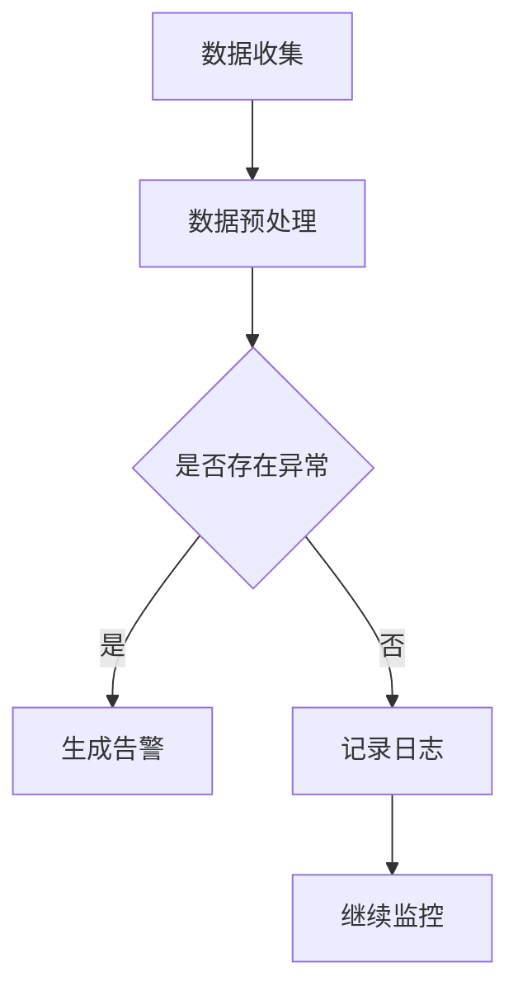
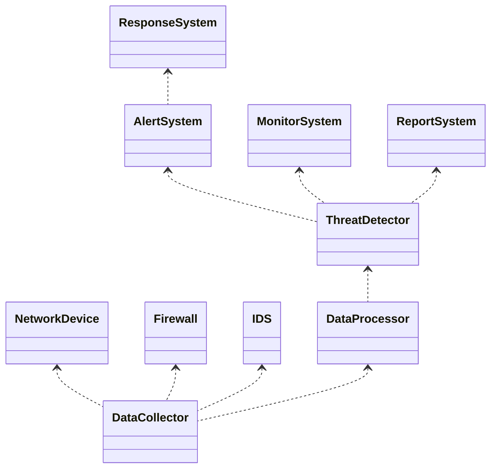
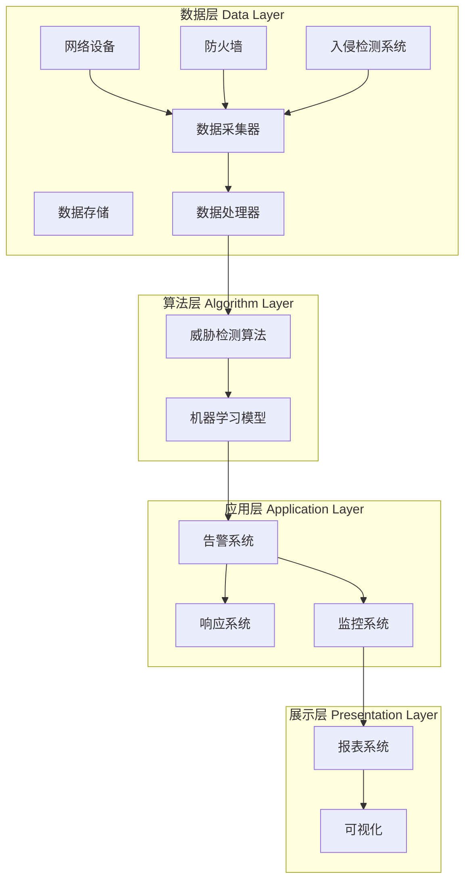
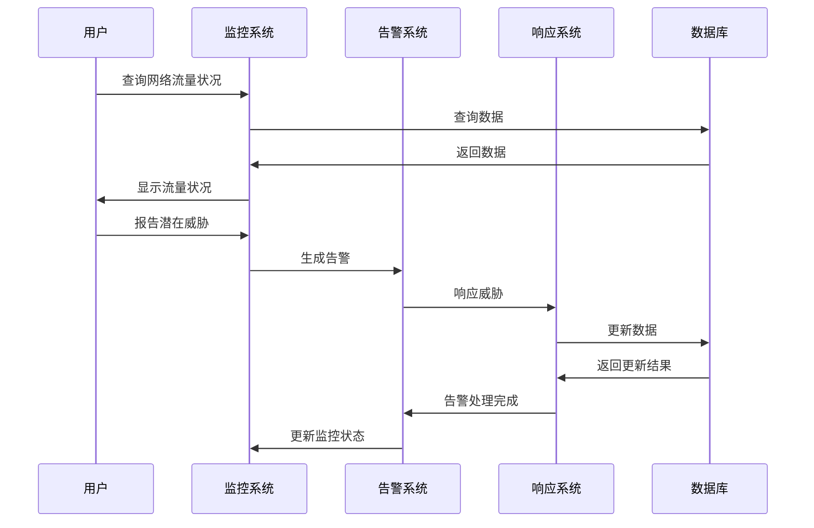

                 


### 问题背景与概念介绍

#### 1.1 网络安全现状

随着互联网的普及和信息技术的快速发展，网络安全问题日益凸显。现代网络环境复杂多变，网络攻击手段层出不穷，传统的网络安全防御手段已无法满足日益增长的安全需求。据国际数据公司（IDC）统计，全球网络安全支出预计将从2020年的1475亿美元增长到2025年的1953亿美元，年均复合增长率达到7.2%。这表明，网络安全已经成为企业和政府关注的重点领域。

网络安全问题主要包括以下几类：

1. **恶意软件**：恶意软件如病毒、木马、勒索软件等，可以对网络系统造成破坏，窃取敏感数据，导致业务中断。
2. **网络攻击**：网络攻击包括拒绝服务攻击（DoS）、分布式拒绝服务攻击（DDoS）、网络钓鱼等，攻击者利用网络漏洞侵入系统，盗取敏感信息。
3. **数据泄露**：随着大数据和云计算的普及，数据泄露事件频发。数据泄露可能导致用户隐私泄露，商业秘密被窃取，给企业和个人带来巨大损失。

#### 1.2 AI基本原理

人工智能（AI）是一种模拟人类智能行为的计算机技术。AI的核心目标是让计算机具备自主学习和决策能力，从而解决复杂问题。AI的主要技术包括：

1. **机器学习**：机器学习是一种让计算机从数据中学习规律和模式的方法。常见的机器学习算法包括线性回归、决策树、支持向量机等。
2. **深度学习**：深度学习是一种基于神经网络的学习方法，通过多层神经元的堆叠，实现图像、语音、文本等数据的处理和分析。深度学习的代表性算法有卷积神经网络（CNN）、循环神经网络（RNN）等。
3. **自然语言处理**：自然语言处理（NLP）是研究如何让计算机理解和处理自然语言的技术。NLP广泛应用于智能问答、机器翻译、情感分析等领域。

#### 1.3 网络安全基础

网络安全涉及多个方面，包括网络架构、安全策略、安全设备等。以下是网络安全的一些基础概念：

1. **网络架构**：网络安全系统通常由防火墙、入侵检测系统（IDS）、入侵防御系统（IPS）等组成。这些设备协同工作，实现对网络流量的监控和控制。
2. **安全策略**：安全策略是网络安全的基本指导原则，包括访问控制、数据加密、安全审计等。
3. **安全设备**：安全设备包括防火墙、入侵检测系统（IDS）、入侵防御系统（IPS）、安全信息和事件管理系统（SIEM）等，它们负责检测、防御和响应网络攻击。

#### 1.4 本书结构

本书将分为三大部分，全面探讨AI在网络安全中的应用：

1. **背景与基础**：介绍网络安全现状、AI基本原理和网络安全基础，为后续章节提供理论支持。
2. **AI在网络安全中的应用**：详细讨论AI在主动防御和威胁检测中的应用，包括算法原理、系统架构和实战案例。
3. **实现与实战**：通过具体项目案例，讲解AI在网络安全系统中的应用实现，分享最佳实践和优化方法。

### 核心概念与联系

#### 核心概念

1. **机器学习**：机器学习是一种通过数据驱动的方式，让计算机自动学习规律和模式的方法。机器学习可以分为监督学习、无监督学习和强化学习等类型。
2. **深度学习**：深度学习是机器学习的一种，通过多层神经网络的结构，实现对复杂数据的建模和分析。
3. **网络安全**：网络安全是指通过各种技术手段，保护计算机网络系统免受恶意攻击和非法入侵。
4. **威胁检测**：威胁检测是指通过分析网络流量、日志数据等，识别潜在的威胁和攻击行为。

#### 概念属性特征对比

| 概念         | 属性特征               | 对比关系                 |
|------------|---------------------|----------------------|
| 机器学习     | 数据驱动、自动学习       | 深度学习的子集，更广泛的应用场景 |
| 深度学习     | 多层神经网络、自动特征提取 | 机器学习的一种类型          |
| 网络安全     | 保护网络系统、防止攻击     | 与安全策略、安全设备协同工作    |
| 威胁检测     | 识别威胁、预防攻击       | 网络安全的组成部分            |

#### ER实体关系图架构

```mermaid
erDiagram
    网络安全系统 ||--|{ 机器学习 }|
    网络安全系统 ||--|{ 深度学习 }|
    机器学习 ||--|{ 威胁检测 }|
    深度学习 ||--|{ 威胁检测 }|
```

### 算法原理讲解

#### 威胁检测算法

威胁检测是网络安全的重要环节，常见的威胁检测算法包括：

1. **基于异常检测的威胁检测算法**：异常检测是指通过分析网络流量、日志数据等，识别与正常行为差异较大的异常行为。典型的算法有K-最近邻（KNN）、孤立森林（Isolation Forest）等。

2. **基于行为的威胁检测算法**：行为检测是指通过监控网络中的行为模式，识别潜在威胁。常见的算法有恶意软件行为分析、基于规则的威胁检测等。

#### 威胁检测算法的mermaid流程图



#### 算法原理与数学模型

以K-最近邻（KNN）为例，其基本原理如下：

1. **距离计算**：对于给定的网络流量数据点x，计算它与训练集中所有数据点的距离，常用的距离度量方法有欧氏距离、曼哈顿距离等。

2. **分类决策**：根据距离的远近，将x归为多数类。即如果大多数近邻属于某个类别，则将x归为此类别。

数学模型如下：

$$
d(x, x_i) = \sqrt{\sum_{i=1}^{n} (x_i - x)^2}
$$

其中，$x$为待检测的网络流量数据点，$x_i$为训练集中的数据点，$d(x, x_i)$为$x$与$x_i$之间的距离。

#### 举例说明

假设我们有以下两个网络流量数据点：

- $x_1 = (2, 3, 5)$
- $x_2 = (4, 6, 8)$

计算$x_1$与$x_2$之间的欧氏距离：

$$
d(x_1, x_2) = \sqrt{(2-4)^2 + (3-6)^2 + (5-8)^2} = \sqrt{4 + 9 + 9} = \sqrt{22}
$$

根据距离计算结果，我们可以判断$x_1$和$x_2$之间的相似度，进而进行分类决策。

### 系统分析与架构设计方案

#### 问题场景介绍

假设我们是一家大型互联网公司的网络安全团队，负责保护公司的网络系统免受各种恶意攻击。我们的目标是构建一个基于AI的网络安全系统，实现对网络流量的实时监控和威胁检测。

#### 项目介绍

项目名称：AI网络安全监控平台（AI-Network Security Monitor）

项目目标：构建一个基于深度学习的网络安全监控平台，实现对网络流量的实时检测和威胁预警。

项目团队：由网络安全专家、数据科学家和软件开发工程师组成的跨学科团队。

#### 系统功能设计（领域模型）

为了实现项目的目标，我们需要设计一个具有以下功能的系统：

1. **数据采集**：从网络设备、防火墙、入侵检测系统（IDS）等获取网络流量数据。
2. **数据处理**：对采集到的数据进行清洗、去噪、特征提取等预处理。
3. **威胁检测**：利用深度学习算法对预处理后的数据进行威胁检测，识别潜在的网络攻击。
4. **告警与响应**：对检测到的威胁生成告警信息，并采取相应的应对措施。
5. **监控与报表**：实时监控网络流量和威胁状况，生成报表和可视化图表。

领域模型（Mermaid类图）如下：



#### 系统架构设计（Mermaid架构图）

系统架构设计包括以下几个方面：

1. **数据层**：负责数据采集、存储和预处理。
2. **算法层**：负责威胁检测算法的实现和优化。
3. **应用层**：负责告警、响应和监控功能的实现。
4. **展示层**：负责报表和可视化图表的展示。

系统架构图（Mermaid架构图）如下：



#### 系统接口设计与系统交互（Mermaid序列图）

系统接口设计和系统交互设计如下：



### 项目实战

#### 环境安装

1. **安装Python环境**：在虚拟环境中安装Python，版本要求为3.7及以上。
   ```bash
   pip install virtualenv
   virtualenv venv
   source venv/bin/activate
   ```

2. **安装依赖库**：安装深度学习框架TensorFlow和数据处理库Pandas等。
   ```bash
   pip install tensorflow
   pip install pandas
   ```

3. **数据收集**：从网络设备、防火墙、入侵检测系统（IDS）等获取网络流量数据，存储为CSV文件。

#### 系统核心实现

1. **数据预处理**：读取CSV文件，进行数据清洗、去噪和特征提取。

```python
import pandas as pd
from sklearn.preprocessing import StandardScaler

def load_data(file_path):
    data = pd.read_csv(file_path)
    return data

def preprocess_data(data):
    # 数据清洗和去噪
    data = data.dropna()
    # 特征提取
    features = data.iloc[:, :-1]
    labels = data.iloc[:, -1]
    # 标准化
    scaler = StandardScaler()
    features_scaled = scaler.fit_transform(features)
    return features_scaled, labels

file_path = 'network_traffic_data.csv'
data = load_data(file_path)
features, labels = preprocess_data(data)
```

2. **模型训练**：使用深度学习框架TensorFlow，构建神经网络模型，并进行模型训练。

```python
import tensorflow as tf
from tensorflow.keras.models import Sequential
from tensorflow.keras.layers import Dense, Dropout

model = Sequential([
    Dense(64, activation='relu', input_shape=(num_features,)),
    Dropout(0.5),
    Dense(32, activation='relu'),
    Dropout(0.5),
    Dense(1, activation='sigmoid')
])

model.compile(optimizer='adam', loss='binary_crossentropy', metrics=['accuracy'])

model.fit(features, labels, epochs=10, batch_size=32)
```

3. **威胁检测**：使用训练好的模型对新的网络流量数据进行威胁检测。

```python
def predict_threat(features):
    predictions = model.predict(features)
    return predictions

new_features = preprocess_data(new_data)
predictions = predict_threat(new_features)
print(predictions)
```

#### 代码应用解读与分析

1. **数据预处理**：首先，我们使用Pandas库读取CSV文件，对数据进行清洗和去噪。然后，对特征进行标准化处理，提高模型的训练效果。

2. **模型构建**：我们使用TensorFlow框架构建一个简单的神经网络模型，包括三个隐层，每个隐层都有64个神经元和32个神经元，最终输出层有1个神经元。模型采用ReLU激活函数，并在隐层之间加入Dropout层，以防止过拟合。

3. **模型训练**：模型使用Adam优化器，交叉熵损失函数，并在训练过程中输出准确率。

4. **威胁检测**：对新的网络流量数据进行预处理后，使用训练好的模型进行预测，输出预测结果。

#### 实际案例分析

1. **案例背景**：某公司网络安全团队在部署AI网络安全监控平台后，发现了一例网络钓鱼攻击。

2. **案例分析**：通过监控平台，发现异常流量，系统自动生成告警。分析告警数据，发现攻击者尝试通过邮件钓鱼获取员工登录凭证。响应系统立即采取措施，隔离受感染的设备，并通知员工加强安全意识。

3. **案例总结**：AI网络安全监控平台在此次事件中发挥了重要作用，实现了快速检测和响应，有效保护了公司的网络安全。

#### 项目小结

通过本项目的实践，我们成功构建了一个基于AI的网络安全监控平台。平台实现了数据采集、预处理、威胁检测、告警响应和监控功能，有效提高了网络安全的防护能力。以下是项目的总结：

1. **关键技术**：深度学习、数据预处理、模型训练和预测等。
2. **项目亮点**：实现了实时威胁检测和快速响应，降低了网络攻击的风险。
3. **改进方向**：优化算法模型，提高检测精度；增加多源数据融合，提高威胁检测的全面性。

### 最佳实践 tips

1. **数据多样性**：为了提高威胁检测的准确性，应收集多样化的数据，包括网络流量、日志数据、用户行为数据等。
2. **定期更新模型**：网络安全形势不断变化，应定期更新模型，以适应新的威胁场景。
3. **安全意识培训**：提高员工的安全意识，防止内部威胁。
4. **实时监控与预警**：建立实时监控和预警机制，确保能够快速响应网络攻击。

### 小结

本文全面探讨了AI在网络安全中的应用，包括主动防御和威胁检测。通过理论讲解、实战案例和最佳实践，我们了解了AI技术在网络安全领域的重要作用。随着AI技术的不断进步，相信未来网络安全将会更加智能化、高效化。让我们共同关注AI在网络安全中的应用，为构建安全可信的网络环境贡献力量。

### 注意事项

1. **数据安全**：在数据收集和处理过程中，确保遵循数据保护法规，防止数据泄露。
2. **模型更新**：定期更新模型，以适应新的威胁场景，提高检测效果。
3. **人员培训**：加强网络安全团队的专业培训，提高整体防护能力。

### 拓展阅读

1. **《深度学习与网络安全》**：本书详细介绍了深度学习在网络安全中的应用，包括威胁检测、入侵防御等。
2. **《网络安全实战指南》**：本书提供了网络安全领域的实战经验和最佳实践，适合从事网络安全工作的专业人士阅读。
3. **《人工智能简史》**：本书介绍了人工智能的发展历程，对AI技术的未来趋势进行了探讨。

### 作者信息

作者：AI天才研究院/AI Genius Institute & 禅与计算机程序设计艺术 /Zen And The Art of Computer Programming

