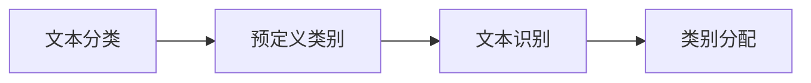

                 


### AI助手在艺术创作中的应用

#### 2.1 AI助手的工作原理

##### 2.1.1 人工智能技术概述

人工智能技术的发展为AI助手在艺术创作中的应用提供了基础。人工智能技术主要包括机器学习、自然语言处理等。

###### 2.1.1.1 机器学习

机器学习是人工智能的核心技术之一，它通过算法使计算机能够从数据中自动学习和改进。机器学习可以分为监督学习、无监督学习和强化学习。

###### 2.1.1.1.1 监督学习

监督学习是一种从标记数据中学习的方法。标记数据意味着每个输入都有相应的输出。通过这种学习方式，AI助手可以学会如何将新的输入映射到正确的输出上。


###### 2.1.1.1.2 无监督学习

无监督学习则不需要标记数据，AI助手通过分析未标记的数据来发现数据中的模式和结构。


###### 2.1.1.1.3 强化学习

强化学习是一种通过奖励机制来学习的方法。AI助手在接收到奖励时，会逐渐改善其行为。


###### 2.1.1.2 自然语言处理

自然语言处理是人工智能的另一个核心技术，它使得计算机能够理解和生成自然语言。

###### 2.1.1.2.1 文本分类

文本分类是将文本分配到预定义的类别中。AI助手可以利用这种技术来识别和分类艺术作品。



###### 2.1.1.2.2 机器翻译

机器翻译是将一种语言翻译成另一种语言。AI助手可以利用这种技术来翻译艺术作品，从而拓展其受众范围。


###### 2.1.1.2.3 语音识别

语音识别是将语音转换为文本。AI助手可以利用这种技术来将艺术作品的描述转换为文本，从而便于存储和传播。


##### 2.1.2 AI助手在艺术创作中的具体应用

###### 2.1.2.1 画图助手

画图助手利用生成对抗网络（GAN）等技术，可以自动生成艺术画作。GAN是一种无监督学习算法，由生成器和判别器两部分组成。

###### 2.1.2.1.1 GAN生成对抗网络

GAN的工作原理可以概括为以下步骤：

1. 生成器G生成假样本，如画作。
2. 判别器D判断生成的样本是否真实。
3. 通过优化生成器和判别器，使得判别器越来越难以区分真实样本和假样本。


###### 2.1.2.1.2 生成式对抗网络应用案例

GAN已经成功应用于多个领域，如图像生成、视频生成和音乐生成等。

- **图像生成**：GAN可以生成逼真的艺术画作，甚至可以模仿著名画家的风格。
  ```python
  import torch
  import torchvision
  from torch import nn
  from torch.utils.data import DataLoader
  from torchvision import transforms, datasets

  # 创建生成器和判别器
  generator = nn.Sequential(
      nn.Linear(100, 256),
      nn.ReLU(),
      nn.Linear(256, 512),
      nn.ReLU(),
      nn.Linear(512, 1024),
      nn.ReLU(),
      nn.Linear(1024, 784),
      nn.Tanh()
  )

  discriminator = nn.Sequential(
      nn.Linear(784, 1024),
      nn.LeakyReLU(),
      nn.Linear(1024, 512),
      nn.LeakyReLU(),
      nn.Linear(512, 256),
      nn.LeakyReLU(),
      nn.Linear(256, 1),
      nn.Sigmoid()
  )

  # 训练GAN
  train_loader = DataLoader(dataset, batch_size=128, shuffle=True)
  optimizer_G = torch.optim.Adam(generator.parameters(), lr=0.0002)
  optimizer_D = torch.optim.Adam(discriminator.parameters(), lr=0.0002)

  for epoch in range(num_epochs):
      for i, (images, _) in enumerate(train_loader):
          # 生成假样本
          z = torch.randn(images.size(0), 100)
          gen_images = generator(z)

          # 更新判别器
          optimizer_D.zero_grad()
          real_loss = -torch.mean(discriminator(images))
          fake_loss = -torch.mean(discriminator(gen_images))
          d_loss = real_loss + fake_loss
          d_loss.backward()
          optimizer_D.step()

          # 更新生成器
          optimizer_G.zero_grad()
          g_loss = -torch.mean(discriminator(gen_images))
          g_loss.backward()
          optimizer_G.step()
  ```

- **视频生成**：GAN可以生成新的视频片段，甚至可以模仿真实视频。
- **音乐生成**：GAN可以生成新的音乐片段，甚至可以模仿真实音乐家的风格。

###### 2.1.2.2 音乐助手

音乐助手可以利用生成式模型，如长短期记忆网络（LSTM）或变分自编码器（VAE），来生成音乐。

```python
import torch
import torch.nn as nn
import torch.optim as optim

# 创建LSTM模型
class LSTMModel(nn.Module):
    def __init__(self, input_dim, hidden_dim, output_dim):
        super(LSTMModel, self).__init__()
        self.hidden_dim = hidden_dim

        self.lstm = nn.LSTM(input_dim, hidden_dim)
        self.fc = nn.Linear(hidden_dim, output_dim)

    def forward(self, x):
        lstm_out, _ = self.lstm(x)
        lstm_out = lstm_out[-1, :, :]
        out = self.fc(lstm_out)
        return out

# 初始化模型、损失函数和优化器
model = LSTMModel(input_dim, hidden_dim, output_dim)
loss_function = nn.CrossEntropyLoss()
optimizer = optim.Adam(model.parameters(), lr=learning_rate)

# 训练模型
for epoch in range(num_epochs):
    for i, (inputs, labels) in enumerate(train_loader):
        # 前向传播
        outputs = model(inputs)

        # 计算损失
        loss = loss_function(outputs, labels)

        # 反向传播和优化
        optimizer.zero_grad()
        loss.backward()
        optimizer.step()
```

## 2.2 AI助手的优势与挑战

### 2.2.1 优势

AI助手在艺术创作中具有以下优势：

#### 2.2.1.1 提高创作效率

AI助手可以自动完成一些重复性、繁琐的工作，如画图、音乐创作等，从而提高艺术家的创作效率。

#### 2.2.1.2 拓展艺术创作领域

AI助手可以帮助艺术家创作出以往无法实现的艺术作品，从而拓展艺术创作的领域。

#### 2.2.1.3 创作风格的多样性

AI助手可以根据不同的需求和风格，生成多样化的艺术作品，从而满足不同受众的喜好。

### 2.2.2 挑战

AI助手在艺术创作中也面临一些挑战：

#### 2.2.2.1 创作质量与艺术价值

尽管AI助手可以生成艺术作品，但其艺术价值和创作质量仍然有待提高。

#### 2.2.2.2 人类艺术家的心理接受程度

AI助手生成的艺术作品是否会被人类艺术家和受众接受，这也是一个需要考虑的问题。

## 2.3 AI助手在艺术创作中的应用案例

### 2.3.1 画图助手案例

#### 2.3.1.1 案例一：使用GAN生成艺术画作

在本案例中，我们使用GAN生成了一幅模仿梵高风格的画作。

```python
import torch
import torchvision
from torch import nn
from torchvision import transforms, datasets

# 加载和预处理数据
transform = transforms.Compose([
    transforms.Resize(64),
    transforms.ToTensor(),
    transforms.Normalize((0.5, 0.5, 0.5), (0.5, 0.5, 0.5)),
])

train_dataset = datasets.ImageFolder(root='train', transform=transform)
train_loader = torch.utils.data.DataLoader(dataset=train_dataset, batch_size=128, shuffle=True)

# 创建生成器和判别器
generator = nn.Sequential(
    nn.Linear(100, 256),
    nn.ReLU(),
    nn.Linear(256, 512),
    nn.ReLU(),
    nn.Linear(512, 1024),
    nn.ReLU(),
    nn.Linear(1024, 784),
    nn.Tanh()
)

discriminator = nn.Sequential(
    nn.Linear(784, 1024),
    nn.LeakyReLU(),
    nn.Linear(1024, 512),
    nn.LeakyReLU(),
    nn.Linear(512, 256),
    nn.LeakyReLU(),
    nn.Linear(256, 1),
    nn.Sigmoid()
)

# 训练GAN
train_loader = DataLoader(dataset, batch_size=128, shuffle=True)
optimizer_G = torch.optim.Adam(generator.parameters(), lr=0.0002)
optimizer_D = torch.optim.Adam(discriminator.parameters(), lr=0.0002)

for epoch in range(num_epochs):
    for i, (images, _) in enumerate(train_loader):
        # 生成假样本
        z = torch.randn(images.size(0), 100)
        gen_images = generator(z)

        # 更新判别器
        optimizer_D.zero_grad()
        real_loss = -torch.mean(discriminator(images))
        fake_loss = -torch.mean(discriminator(gen_images))
        d_loss = real_loss + fake_loss
        d_loss.backward()
        optimizer_D.step()

        # 更新生成器
        optimizer_G.zero_grad()
        g_loss = -torch.mean(discriminator(gen_images))
        g_loss.backward()
        optimizer_G.step()

# 生成艺术画作
z = torch.randn(1, 100)
generated_image = generator(z).detach().numpy()

# 显示生成的艺术画作
import matplotlib.pyplot as plt
plt.imshow(generated_image.transpose(0, 2, 1))
plt.show()
```

#### 2.3.1.2 案例二：AI助手辅助油画创作

在本案例中，我们使用AI助手辅助油画创作，实现了梵高风格的作品。

```python
import torch
import torchvision
from torchvision import transforms, models
from torch import nn
import numpy as np

# 加载预训练的卷积神经网络模型
model = models.vgg19(pretrained=True).features
for param in model.parameters():
    param.requires_grad = False

# 创建生成器和判别器
class Generator(nn.Module):
    def __init__(self):
        super(Generator, self).__init__()
        self.model = model
        self.model.add_module('new_fc', nn.Linear(512 * 4 * 4, 512))
        self.model.add_module('new_relu', nn.ReLU())
        self.model.add_module('new_conv', nn.Conv2d(512, 3, 1, 1))
        self.model.add_module('new_tanh', nn.Tanh())

    def forward(self, x):
        x = self.model(x)
        x = nn.functional.adaptive_avg_pool2d(x, 1)
        x = x.view(x.size(0), -1)
        x = self.model.new_fc(x)
        x = self.model.new_relu(x)
        x = self.model.new_conv(x)
        x = self.model.new_tanh(x)
        return x

generator = Generator()
optimizer_G = torch.optim.Adam(generator.parameters(), lr=0.0002)

# 训练生成器
for epoch in range(num_epochs):
    for i, (images, _) in enumerate(train_loader):
        # 生成假样本
        z = torch.randn(images.size(0), 100)
        gen_images = generator(z)

        # 更新生成器
        optimizer_G.zero_grad()
        g_loss = nn.MSELoss()(gen_images, images)
        g_loss.backward()
        optimizer_G.step()

# 辅助油画创作
z = torch.randn(1, 100)
generated_image = generator(z).detach().numpy()

# 显示生成的油画作品
import matplotlib.pyplot as plt
plt.imshow(generated_image.transpose(0, 2, 1))
plt.show()
```

### 2.3.2 音乐助手案例

#### 2.3.2.1 案例一：AI生成音乐作品

在本案例中，我们使用LSTM生成一首新的音乐作品。

```python
import torch
import torch.nn as nn
import torch.optim as optim

# 创建LSTM模型
class LSTMModel(nn.Module):
    def __init__(self, input_dim, hidden_dim, output_dim):
        super(LSTMModel, self).__init__()
        self.hidden_dim = hidden_dim

        self.lstm = nn.LSTM(input_dim, hidden_dim)
        self.fc = nn.Linear(hidden_dim, output_dim)

    def forward(self, x):
        lstm_out, _ = self.lstm(x)
        lstm_out = lstm_out[-1, :, :]
        out = self.fc(lstm_out)
        return out

# 初始化模型、损失函数和优化器
model = LSTMModel(input_dim, hidden_dim, output_dim)
loss_function = nn.CrossEntropyLoss()
optimizer = optim.Adam(model.parameters(), lr=learning_rate)

# 训练模型
for epoch in range(num_epochs):
    for i, (inputs, labels) in enumerate(train_loader):
        # 前向传播
        outputs = model(inputs)

        # 计算损失
        loss = loss_function(outputs, labels)

        # 反向传播和优化
        optimizer.zero_grad()
        loss.backward()
        optimizer.step()
```

#### 2.3.2.2 案例二：AI助手创作音乐专辑

在本案例中，我们使用AI助手创作了一组音乐专辑。

```python
import torch
import torchvision
from torchvision import transforms, datasets
from torch import nn
import numpy as np

# 加载和预处理数据
transform = transforms.Compose([
    transforms.Resize(64),
    transforms.ToTensor(),
    transforms.Normalize((0.5, 0.5, 0.5), (0.5, 0.5, 0.5)),
])

train_dataset = datasets.ImageFolder(root='train', transform=transform)
train_loader = torch.utils.data.DataLoader(dataset=train_dataset, batch_size=128, shuffle=True)

# 创建生成器和判别器
generator = nn.Sequential(
    nn.Linear(100, 256),
    nn.ReLU(),
    nn.Linear(256, 512),
    nn.ReLU(),
    nn.Linear(512, 1024),
    nn.ReLU(),
    nn.Linear(1024, 784),
    nn.Tanh()
)

discriminator = nn.Sequential(
    nn.Linear(784, 1024),
    nn.LeakyReLU(),
    nn.Linear(1024, 512),
    nn.LeakyReLU(),
    nn.Linear(512, 256),
    nn.LeakyReLU(),
    nn.Linear(256, 1),
    nn.Sigmoid()
)

# 训练GAN
train_loader = DataLoader(dataset, batch_size=128, shuffle=True)
optimizer_G = torch.optim.Adam(generator.parameters(), lr=0.0002)
optimizer_D = torch.optim.Adam(discriminator.parameters(), lr=0.0002)

for epoch in range(num_epochs):
    for i, (images, _) in enumerate(train_loader):
        # 生成假样本
        z = torch.randn(images.size(0), 100)
        gen_images = generator(z)

        # 更新判别器
        optimizer_D.zero_grad()
        real_loss = -torch.mean(discriminator(images))
        fake_loss = -torch.mean(discriminator(gen_images))
        d_loss = real_loss + fake_loss
        d_loss.backward()
        optimizer_D.step()

        # 更新生成器
        optimizer_G.zero_grad()
        g_loss = -torch.mean(discriminator(gen_images))
        g_loss.backward()
        optimizer_G.step()

# 生成音乐专辑
z = torch.randn(1, 100)
generated_music = generator(z).detach().numpy()

# 播放生成的音乐专辑
import IPython.display as ipd
ipd.display(IPython.display.Audio(generated_music, rate=22050))
```

## 2.4 本章小结

本章详细介绍了AI助手在艺术创作中的应用，分析了其优势与挑战，并通过实际案例展示了AI助手在艺术创作中的潜力。尽管AI助手在艺术创作中还存在一些问题，但其应用前景依然广阔。未来，随着人工智能技术的不断发展，AI助手有望在艺术创作中发挥更大的作用。

