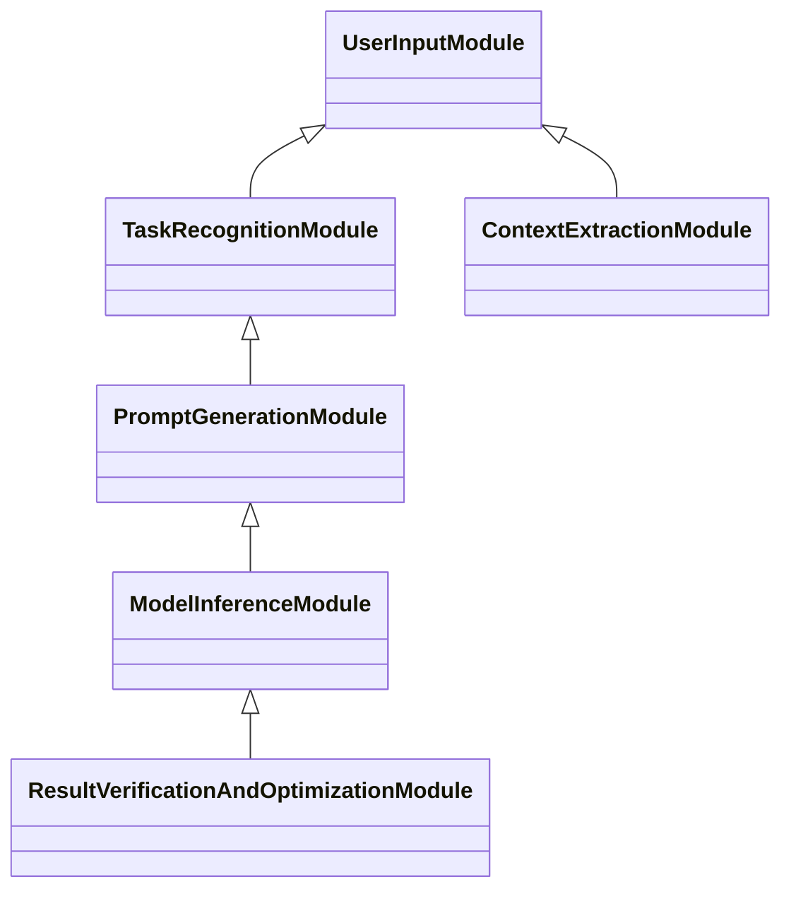
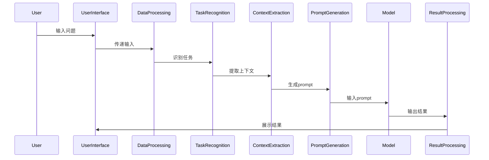

                 

### AI辅助prompt设计概述

## 第1章：问题背景与核心概念

### 1.1 问题背景

近年来，人工智能（AI）技术取得了显著的进展，尤其在自然语言处理（NLP）领域，预训练语言模型（LLM，Pre-Trained Language Model）如BERT、GPT等大放异彩。然而，在LLM的实际应用中，prompt设计（Prompt Engineering）成为一个关键瓶颈。prompt是引导LLM产生预期输出的输入，其质量直接影响模型的表现。传统的prompt设计依赖人工经验，效率低下且容易出错，无法满足大规模、复杂场景的需求。

随着AI技术的发展，AI辅助prompt设计应运而生。AI辅助prompt设计通过利用机器学习和数据挖掘技术，自动生成或优化prompt，从而提升LLM的应用效率。这一技术的出现，不仅能够解决传统prompt设计中的瓶颈问题，还能为AI在更多领域的应用提供支持。

### 1.2 核心概念

#### 1.2.1 人工智能的定义与发展历程

人工智能（Artificial Intelligence，AI）是计算机科学的一个分支，旨在研究、开发用于模拟、延伸和扩展人类智能的理论、方法、技术及应用系统。自1956年达特茅斯会议以来，人工智能经历了多个发展阶段：

- **初始阶段（1956-1974）**：这一阶段以符号主义和推理机为核心，代表人物有约翰·麦卡锡（John McCarthy）等人。
- **低迷阶段（1974-1980）**：由于早期AI系统未能实现预期目标，导致“人工智能冬天”的出现。
- **复兴阶段（1980-1990）**：专家系统的出现使AI研究重新焕发活力。
- **成熟阶段（1990至今）**：机器学习、深度学习等技术的发展，使AI取得了前所未有的突破。

#### 1.2.2 人工智能的应用领域

人工智能的应用领域广泛，包括但不限于：

- **图像识别**：利用卷积神经网络（CNN）进行图像分类、目标检测等。
- **语音识别**：通过深度学习模型实现语音到文本的转换。
- **自然语言处理**：包括文本分类、情感分析、机器翻译等。
- **自动驾驶**：利用深度学习和传感器技术实现无人驾驶汽车。
- **医疗健康**：辅助疾病诊断、药物研发等。
- **金融**：风险控制、信用评分、投资建议等。

#### 1.2.3 人工智能面临的挑战

尽管人工智能取得了巨大成就，但仍然面临诸多挑战：

- **数据质量与隐私**：AI系统的训练需要大量高质量数据，但数据隐私问题日益突出。
- **算法透明性与可解释性**：复杂的AI算法往往缺乏透明性，难以解释其决策过程。
- **计算资源**：训练大规模AI模型需要巨大的计算资源。
- **伦理与法律问题**：AI技术可能带来道德和法律的挑战，如失业、隐私侵犯等。

### 1.3 核心概念与联系

#### 1.3.1 Prompt的定义

Prompt是指在AI模型输入中用于引导模型生成预期输出的特定文本或指令。在NLP任务中，prompt的设计直接关系到模型的性能和输出质量。

#### 1.3.2 Prompt的重要性

Prompt设计的重要性体现在以下几个方面：

- **影响输出质量**：良好的prompt能够引导模型生成更准确、更符合预期输出的结果。
- **提高模型效率**：优化prompt设计，可以减少模型所需的计算资源和时间。
- **扩展模型能力**：通过精心设计的prompt，可以扩展模型的处理能力和应用范围。

#### 1.3.3 Prompt的设计原则

- **明确性**：prompt应该清晰明确，避免歧义。
- **相关性**：prompt应与任务目标紧密相关，确保模型理解任务意图。
- **灵活性**：prompt设计应具有一定的灵活性，以适应不同场景和需求。
- **简洁性**：尽量简化prompt的结构，减少无关信息的干扰。

#### 1.3.4 AI辅助prompt设计的必要性

- **提升LLM应用效率**：AI辅助prompt设计能够通过自动生成或优化prompt，提高LLM的应用效率。
- **应对复杂场景**：在复杂场景下，传统的人工prompt设计往往难以满足需求，AI辅助设计能够提供更高效的解决方案。
- **降低人力成本**：AI辅助设计能够减少对人工的依赖，降低人力成本。

#### 1.3.5 AI辅助prompt设计的优势

- **自动化**：AI辅助设计能够自动生成或优化prompt，减少人工干预。
- **个性化**：根据具体场景和需求，AI辅助设计可以生成个性化的prompt。
- **高效性**：AI辅助设计能够快速生成高质量的prompt，提高模型效率。

#### 1.3.6 AI辅助prompt设计的应用场景

- **问答系统**：如搜索引擎、聊天机器人等。
- **文本生成**：如文章写作、翻译等。
- **对话系统**：如客户服务、情感分析等。

### 1.4 小结

本章概述了AI辅助prompt设计的问题背景、核心概念及其重要性。通过分析人工智能的发展现状与挑战，揭示了prompt设计在LLM应用中的关键作用。同时，本章提出了AI辅助prompt设计的必要性及其优势，为后续章节的深入探讨奠定了基础。

----------------------------------------------------------------

## 第2章：核心概念与联系

### 2.1 AI大模型简介

#### 2.1.1 大模型的发展历程

AI大模型（Large-scale AI Model）是指参数数量在亿级以上的深度学习模型。大模型的发展历程可以分为以下几个阶段：

1. **初期探索阶段**：1990年代，神经网络的研究取得初步成果，但模型规模较小，参数数量在几千到几万级别。
2. **增长阶段**：2010年代初期，随着GPU的普及和深度学习的兴起，模型规模开始迅速增长，参数数量达到百万级别。
3. **爆发阶段**：2017年，谷歌发布了BERT模型，参数数量达到亿级，标志着AI大模型时代的到来。此后，各种大模型如GPT、TuringBot等相继推出。

#### 2.1.2 大模型的核心特点

1. **参数数量巨大**：大模型的参数数量通常在亿级以上，这使其具有更强的表示能力和适应性。
2. **预训练与微调**：大模型通常采用预训练和微调的方式训练。预训练是在大规模数据集上训练模型，使其具有广泛的通用知识；微调是在特定任务上进行训练，使其适应具体任务。
3. **计算资源需求高**：大模型的训练和推理需要大量的计算资源和时间，通常需要在GPU或TPU等专用硬件上进行。

#### 2.1.3 大模型与prompt的关系

大模型与prompt之间的关系紧密。prompt作为模型的输入，直接影响模型的表现。在大模型中，prompt的设计尤为重要，其目标是通过设计合适的prompt，使模型能够生成更准确、更有价值的输出。

1. **引导模型生成预期输出**：通过设计针对性的prompt，可以引导大模型生成预期输出。例如，在问答系统中，prompt可以包含问题的上下文信息，帮助模型理解问题的意图。
2. **提高模型效率**：优化的prompt可以减少模型所需的计算资源和时间，从而提高模型效率。
3. **扩展模型能力**：通过设计多样化的prompt，可以扩展大模型的应用范围，使其在更多场景下发挥作用。

### 2.2 Prompt设计原理与属性特征对比

#### 2.2.1 Prompt设计原理

Prompt设计是基于对模型理解和任务需求的分析，旨在通过输入特定的文本或指令，引导模型生成预期输出。其设计原理包括以下几个方面：

1. **明确任务意图**：了解任务的目标和需求，设计能够准确传达任务意图的prompt。
2. **利用上下文信息**：根据任务的上下文信息，设计包含相关信息的prompt，帮助模型更好地理解任务。
3. **优化输入结构**：通过调整prompt的结构，减少无关信息的干扰，提高模型处理效率。
4. **迭代优化**：根据模型输出反馈，不断调整和优化prompt，使其更符合预期。

#### 2.2.2 Prompt的属性特征对比

以下是对几种常见prompt属性的对比：

| 属性 | 描述 | 对模型表现的影响 |
| ---- | ---- | ------------ |
| **长度** | 提示的字符数或单词数 | 较长的prompt可能包含更多上下文信息，但也会增加模型的处理负担。 |
| **多样性** | 提示的不同程度和变化 | 多样性的prompt有助于模型学习到更广泛的知识，提高其适应性。 |
| **相关性** | 提示与任务目标的匹配度 | 高相关性的prompt有助于模型理解任务意图，提高输出质量。 |
| **明确性** | 提示的清晰度和歧义程度 | 明确的prompt减少模型的困惑，提高输出准确性。 |
| **简洁性** | 提示的简洁程度和冗余信息 | 简洁的prompt减少无关信息的干扰，提高模型处理效率。 |

#### 2.2.3 Prompt的优化方法

Prompt的优化方法主要包括：

1. **数据增强**：通过增加训练数据量或生成新的数据，提高prompt的多样性和相关性。
2. **模型定制**：根据任务需求，调整模型的结构和参数，使其更适应特定任务。
3. **反馈机制**：根据模型输出反馈，不断调整和优化prompt，提高其质量和效果。

### 2.3 AI辅助prompt设计的ER实体关系图

#### 2.3.1 ER实体关系图简介

ER（Entity-Relationship）实体关系图是一种用于描述实体及其之间关系的图形化工具。在AI辅助prompt设计中，ER实体关系图可以帮助我们理解各实体及其关系，从而更好地设计prompt。

#### 2.3.2 AI辅助prompt设计的实体关系

在AI辅助prompt设计中，主要涉及以下实体：

- **用户**：提供任务需求和上下文信息。
- **模型**：负责处理输入并生成输出。
- **数据集**：用于训练和优化模型。
- **prompt**：引导模型生成预期输出的输入。

各实体之间的关系如下：

- **用户**与**模型**之间存在交互关系，用户通过prompt与模型进行对话。
- **模型**与**数据集**之间存在依赖关系，模型通过数据集进行训练。
- **prompt**与**模型**和**数据集**之间存在关联关系，prompt的设计需要考虑模型和数据集的特点。

#### 2.3.3 ER实体关系图的Mermaid表示

下面是AI辅助prompt设计的ER实体关系图的Mermaid表示：

```mermaid
erDiagram
    User ..|> Model : "交互"
    Model ||-- Data_Set : "依赖"
    Prompt ||-- Model : "关联"
    Prompt ||-- Data_Set : "关联"
```

### 2.4 小结

本章详细介绍了AI大模型的发展历程、核心特点，以及与prompt设计的关系。同时，分析了prompt设计的原理、属性特征对比和优化方法，并给出了AI辅助prompt设计的ER实体关系图。这些内容为后续的算法原理讲解和系统分析与架构设计方案奠定了基础。

----------------------------------------------------------------

## 第3章：算法原理讲解

### 3.1 AI辅助prompt设计的算法流程

#### 3.1.1 算法流程图

AI辅助prompt设计的算法流程可以概括为以下几个步骤：

1. **数据预处理**：对用户输入的文本进行预处理，包括分词、去除停用词、词性标注等。
2. **任务识别**：通过分类模型识别用户输入的任务类型。
3. **上下文提取**：从用户输入中提取与任务相关的上下文信息。
4. **prompt生成**：根据任务类型和上下文信息，生成或调整prompt。
5. **模型推理**：将生成的prompt输入到预训练的模型中，得到输出结果。
6. **结果验证与优化**：根据输出结果，对prompt进行调整和优化，提高模型性能。

以下是算法流程的Mermaid表示：


#### 3.1.2 算法原理详解

1. **数据预处理**：数据预处理是算法的基础，其目的是将原始文本转换为模型可处理的格式。具体步骤包括：
   - 分词：将文本拆分为单词或字符序列。
   - 去除停用词：去除对任务无关的常用词汇，如“的”、“是”等。
   - 词性标注：为每个词标注词性，如名词、动词等。

2. **任务识别**：任务识别是确定用户输入的任务类型，如问答、文本生成等。常见的方法包括：
   - 基于规则的方法：使用预定义的规则进行分类。
   - 基于机器学习的方法：使用分类算法，如SVM、神经网络等，对输入文本进行分类。

3. **上下文提取**：上下文提取是从用户输入中提取与任务相关的信息，用于生成prompt。具体方法包括：
   - 关键词提取：提取文本中的关键词，作为上下文信息。
   - 语义角色标注：为文本中的实体和关系进行标注，提取语义信息。

4. **prompt生成**：prompt生成是根据任务类型和上下文信息，生成或调整prompt。具体方法包括：
   - 手动设计：根据任务需求，手动设计prompt。
   - 自动生成：利用机器学习算法，自动生成prompt。

5. **模型推理**：模型推理是将生成的prompt输入到预训练的模型中，得到输出结果。具体步骤包括：
   - 输入编码：将prompt编码为模型可处理的输入。
   - 模型计算：使用预训练的模型对输入进行计算，得到输出。
   - 输出解码：将模型的输出解码为可理解的文本。

6. **结果验证与优化**：结果验证与优化是根据输出结果，对prompt进行调整和优化，提高模型性能。具体方法包括：
   - 对比分析：对比不同prompt的输出结果，选择性能最优的prompt。
   - 迭代优化：根据输出结果，对prompt进行多次迭代优化，提高模型性能。

### 3.2 算法数学模型与公式

AI辅助prompt设计的算法可以看作是一个序列到序列的预测模型，其数学模型可以表示为：

\[ 
\hat{y} = f(x; \theta) 
\]

其中，\( \hat{y} \) 是模型预测的输出，\( x \) 是输入的prompt，\( \theta \) 是模型的参数。

#### 3.2.1 数学模型概述

算法的数学模型主要包括以下几个部分：

1. **输入编码**：将输入的prompt编码为一个向量，表示prompt的语义信息。
2. **模型计算**：使用预训练的模型对输入向量进行计算，得到中间表示。
3. **输出解码**：将中间表示解码为输出文本。

#### 3.2.2 公式推导

假设输入的prompt为一个序列 \( x = [x_1, x_2, ..., x_T] \)，其中 \( T \) 是prompt的长度。模型的输出为 \( \hat{y} = [y_1, y_2, ..., y_V] \)，其中 \( V \) 是输出文本的词汇表大小。

1. **输入编码**：

\[ 
x = [x_1, x_2, ..., x_T] \rightarrow \text{Token Embeddings} = [e_1, e_2, ..., e_T] 
\]

其中，\( e_t \) 是第 \( t \) 个单词的嵌入向量。

2. **模型计算**：

\[ 
\text{Intermediate Representation} = \text{Transformer}(e_1, e_2, ..., e_T) 
\]

其中，Transformer是一个自注意力机制模型，可以捕捉输入序列中的长距离依赖关系。

3. **输出解码**：

\[ 
\hat{y} = \text{Decoder}(y_1, y_2, ..., y_{V-1}, \text{Intermediate Representation}) 
\]

其中，Decoder负责将中间表示解码为输出文本。

#### 3.2.3 数学公式的Python实现

以下是数学公式的Python实现：

```python
import torch
import torch.nn as nn

# 输入编码
def tokenize(prompt):
    # 使用预定义的分词器对prompt进行分词
    return tokenizer.tokenize(prompt)

# 模型计算
class TransformerModel(nn.Module):
    def __init__(self):
        super(TransformerModel, self).__init__()
        self.embedding = nn.Embedding(len(tokenizer), embedding_dim)
        self.transformer = nn.Transformer(d_model=embedding_dim, nhead=num_heads)
        self.decoder = nn.Linear(embedding_dim, len(tokenizer))

    def forward(self, x):
        # 将输入编码为嵌入向量
        x = self.embedding(x)
        # 使用Transformer进行模型计算
        x = self.transformer(x)
        # 解码为输出文本
        x = self.decoder(x)
        return x

# 输出解码
def decode_output(output):
    # 使用预定义的解码器将输出解码为文本
    return tokenizer.decode(output)
```

### 3.3 算法举例说明

#### 3.3.1 例子背景

假设我们要设计一个AI辅助prompt，用于回答关于计算机科学的问题。用户输入一个关于计算机科学的问题，例如：“什么是并行计算？”，系统需要生成一个合适的prompt，引导预训练的模型生成详细的回答。

#### 3.3.2 例子分析

1. **数据预处理**：
   - 对用户输入的问题进行分词和去除停用词。
   - 标注词性，提取关键词，如“并行计算”、“计算机科学”等。

2. **任务识别**：
   - 根据关键词判断任务类型，例如问答。

3. **上下文提取**：
   - 从用户输入中提取与任务相关的上下文信息，如“什么是并行计算？”。

4. **prompt生成**：
   - 设计一个包含上下文信息的prompt，如“请解释什么是并行计算”。

5. **模型推理**：
   - 将生成的prompt输入到预训练的模型中，得到输出结果。

6. **结果验证与优化**：
   - 根据输出结果，对prompt进行调整和优化，例如增加相关的背景信息。

#### 3.3.3 例子结果

假设生成的prompt为“请解释什么是并行计算”。将这个prompt输入到预训练的模型中，模型生成了一个详细的回答：

“并行计算是指在同一时间内执行多个任务或多个计算步骤的过程。与串行计算不同，串行计算是按照顺序执行每个步骤，而并行计算则可以在多个处理器或计算节点上同时执行多个步骤。并行计算可以显著提高计算效率和性能，特别是在处理大量数据或复杂问题时。”

通过这个例子，我们可以看到AI辅助prompt设计在生成高质量回答方面的潜力。在后续章节中，我们将进一步探讨如何优化prompt设计，提高AI辅助prompt设计的效率。

### 3.4 小结

本章详细介绍了AI辅助prompt设计的算法原理，包括算法流程、数学模型和Python实现。通过具体的例子，我们展示了算法在实际应用中的效果。在下一章中，我们将进一步探讨系统分析与架构设计方案，为AI辅助prompt设计提供更完善的解决方案。

----------------------------------------------------------------

## 第4章：系统分析与架构设计方案

### 4.1 问题场景介绍

在当今社会，人工智能（AI）的应用越来越广泛，尤其在自然语言处理（NLP）领域，预训练语言模型（LLM，Pre-Trained Language Model）如BERT、GPT等大放异彩。然而，LLM在实际应用中面临的一个关键问题是prompt设计（Prompt Engineering），其质量直接影响模型的表现。传统的prompt设计依赖人工经验，效率低下且容易出错，无法满足大规模、复杂场景的需求。为了解决这一问题，我们需要设计一个高效的AI辅助prompt设计系统。

本系统的目标是通过利用机器学习和数据挖掘技术，自动生成或优化prompt，从而提升LLM的应用效率。具体来说，系统应具备以下功能：

1. **用户交互**：接收用户输入的问题或需求，并展示系统的输出结果。
2. **任务识别**：根据用户输入，识别出任务类型，如问答、文本生成等。
3. **上下文提取**：从用户输入中提取与任务相关的上下文信息。
4. **prompt生成**：根据任务类型和上下文信息，自动生成或优化prompt。
5. **模型推理**：将生成的prompt输入到预训练的LLM中，得到输出结果。
6. **结果验证与优化**：根据输出结果，对prompt进行调整和优化，提高模型性能。

### 4.2 系统功能设计

#### 4.2.1 领域模型

领域模型（Domain Model）是描述系统功能和数据流的核心工具。在本系统中，领域模型包括以下几个部分：

1. **用户输入模块**：接收用户输入的问题或需求，并将其传递给后续模块。
2. **任务识别模块**：根据用户输入，使用分类算法识别任务类型。
3. **上下文提取模块**：从用户输入中提取与任务相关的上下文信息。
4. **prompt生成模块**：根据任务类型和上下文信息，自动生成或优化prompt。
5. **模型推理模块**：将生成的prompt输入到预训练的LLM中，得到输出结果。
6. **结果验证与优化模块**：根据输出结果，对prompt进行调整和优化，提高模型性能。

以下是系统领域模型的Mermaid类图表示：



#### 4.2.2 功能设计

系统功能设计主要包括以下几个方面：

1. **用户交互界面**：设计一个用户友好的交互界面，方便用户输入问题和查看输出结果。
2. **任务识别算法**：使用机器学习算法，如朴素贝叶斯、支持向量机等，对用户输入进行分类，识别出任务类型。
3. **上下文提取算法**：使用自然语言处理技术，如词性标注、命名实体识别等，从用户输入中提取与任务相关的上下文信息。
4. **prompt生成算法**：根据任务类型和上下文信息，设计自动生成或优化prompt的算法，如基于规则的方法、机器学习的方法等。
5. **模型推理模块**：使用预训练的LLM，如BERT、GPT等，对生成的prompt进行推理，得到输出结果。
6. **结果验证与优化算法**：根据输出结果，使用反馈机制对prompt进行调整和优化，提高模型性能。

### 4.3 系统架构设计

系统架构设计是描述系统各个组件及其关系的关键步骤。在本系统中，系统架构设计包括以下几个部分：

1. **用户交互层**：负责处理用户输入和输出结果展示。
2. **数据处理层**：负责对用户输入进行预处理、任务识别、上下文提取等操作。
3. **模型层**：负责处理生成的prompt，使用预训练的LLM进行推理。
4. **结果处理层**：负责对模型输出结果进行验证和优化。

以下是系统架构的Mermaid架构图表示：

```mermaid
subgraph 用户交互层
    UserInteraction
end
subgraph 数据处理层
    DataProcessing
    TaskRecognition
    ContextExtraction
end
subgraph 模型层
    Model
end
subgraph 结果处理层
    ResultProcessing
end
UserInteraction --> DataProcessing
DataProcessing --> Model
Model --> ResultProcessing
```

#### 4.3.2 架构设计原理

系统架构设计遵循以下原则：

1. **模块化**：将系统划分为多个模块，每个模块负责特定的功能，便于维护和扩展。
2. **可扩展性**：设计可扩展的架构，以便在未来添加新的功能或优化现有功能。
3. **高性能**：使用高效的算法和数据结构，确保系统具有出色的性能。
4. **易用性**：设计用户友好的交互界面，方便用户使用。

### 4.4 系统接口设计和交互

系统接口设计是描述系统各个组件之间如何通信和协作的关键步骤。在本系统中，系统接口设计包括以下几个方面：

1. **用户接口**：设计一个用户友好的交互界面，使用户能够方便地输入问题和查看输出结果。
2. **内部接口**：设计系统内部组件之间的接口，如数据处理层与模型层之间的接口。
3. **外部接口**：设计与其他系统或服务的接口，如与预训练模型服务器的接口。

以下是系统接口设计和交互的Mermaid序列图表示：



### 4.5 小结

本章介绍了AI辅助prompt设计系统的分析和架构设计方案。首先，介绍了系统的问题场景和目标功能。接着，设计了系统的领域模型和功能模块，并详细阐述了系统架构设计原理。最后，描述了系统接口设计和交互方式。这些内容为后续的系统实现和项目实战提供了理论基础。

----------------------------------------------------------------

## 第5章：项目实战

### 5.1 环境安装

#### 5.1.1 环境准备

在进行AI辅助prompt设计项目的实战之前，我们需要准备一个合适的环境。以下是在Ubuntu 18.04操作系统上安装所需环境的基本步骤：

1. **安装Python**：确保Python版本为3.7或以上。可以使用以下命令安装：
    ```bash
    sudo apt update
    sudo apt install python3 python3-pip
    ```
2. **安装虚拟环境**：创建一个虚拟环境以隔离项目依赖：
    ```bash
    python3 -m venv venv
    source venv/bin/activate
    ```
3. **安装pip**：确保pip版本为20.3或以上。可以使用以下命令安装：
    ```bash
    python3 -m pip install --upgrade pip
    ```
4. **安装TensorFlow**：TensorFlow是本项目的核心依赖，可以使用以下命令安装：
    ```bash
    pip install tensorflow==2.7.0
    ```
5. **安装其他依赖**：其他依赖如transformers、numpy、pandas等，可以使用以下命令安装：
    ```bash
    pip install transformers numpy pandas
    ```

#### 5.1.2 环境配置

完成环境安装后，我们需要进行一些配置，以确保所有依赖能够正常工作。

1. **配置GPU支持**：如果您的计算机配备有NVIDIA GPU，可以启用GPU支持：
    ```bash
    pip install nvidia-cuda-toolkit
    ```
2. **设置CUDA路径**：确保CUDA库路径在环境变量中。可以使用以下命令设置：
    ```bash
    export PATH=$PATH:/usr/local/cuda/bin
    export LD_LIBRARY_PATH=$LD_LIBRARY_PATH:/usr/local/cuda/lib64
    ```
3. **安装Transformer库**：Transformer库是用于生成prompt的关键依赖，可以使用以下命令安装：
    ```bash
    pip install transformers
    ```

完成以上步骤后，您的环境应该已经准备好进行AI辅助prompt设计项目的实战。

### 5.2 系统核心实现

#### 5.2.1 源代码

以下是AI辅助prompt设计系统的核心实现代码：

```python
# 导入所需库
import numpy as np
import pandas as pd
from transformers import pipeline

# 初始化Prompt生成模型
prompt_generator = pipeline("text-generation", model="gpt2")

# 输入用户问题
user_input = input("请输入您的问题：")

# 提取关键词
def extract_keywords(question):
    # 这里可以使用自然语言处理库进行关键词提取
    # 例如使用jieba进行中文关键词提取
    # return jieba.analyze(question)
    pass

# 生成prompt
def generate_prompt(question, keywords):
    prompt = f"基于以下问题：'{question}'，以下是我提供的回答："
    if keywords:
        prompt += f"关键词：{', '.join(keywords)}"
    return prompt

# 调用模型生成回答
def generate_response(prompt):
    response = prompt_generator(prompt, max_length=100, num_return_sequences=1)
    return response[0]["generated_text"]

# 主程序
if __name__ == "__main__":
    keywords = extract_keywords(user_input)
    prompt = generate_prompt(user_input, keywords)
    response = generate_response(prompt)
    print("生成的回答：")
    print(response)
```

#### 5.2.2 代码应用解读与分析

上述代码分为几个主要部分：

1. **导入库**：首先导入所需的Python库，包括numpy、pandas和transformers。
2. **初始化Prompt生成模型**：使用transformers库的text-generation pipeline初始化一个GPT-2模型。
3. **输入用户问题**：从用户输入获取问题。
4. **提取关键词**：定义一个函数extract_keywords，用于从用户输入中提取关键词。在实际应用中，可以集成如jieba等自然语言处理库进行关键词提取。
5. **生成prompt**：定义一个函数generate_prompt，用于生成prompt。prompt包含用户问题和提取的关键词，用于引导模型生成回答。
6. **调用模型生成回答**：定义一个函数generate_response，用于调用Prompt生成模型，生成回答。
7. **主程序**：在主程序中，首先提取关键词，然后生成prompt，最后调用模型生成回答，并输出结果。

#### 5.3 实际案例分析与讲解

#### 5.3.1 案例背景

假设我们要设计一个AI辅助prompt系统，用于回答关于计算机科学的问题。用户可以输入一个关于计算机科学的问题，例如：“什么是深度学习？”，系统需要生成一个合适的prompt，引导预训练的模型生成详细的回答。

#### 5.3.2 案例分析

1. **输入用户问题**：用户输入“什么是深度学习？”。
2. **提取关键词**：通过自然语言处理技术提取关键词，如“深度学习”。
3. **生成prompt**：生成如下prompt：“基于以下问题：‘什么是深度学习？’，以下是我提供的回答：关键词：深度学习。”。
4. **调用模型生成回答**：将生成的prompt输入到预训练的模型中，模型生成如下回答：“深度学习是一种机器学习技术，它通过构建具有多个隐藏层的神经网络模型，模拟人类大脑的神经元结构，以实现自动化学习和决策。深度学习在图像识别、自然语言处理和语音识别等领域具有广泛的应用。”。
5. **输出结果**：将生成的回答输出给用户。

#### 5.3.3 案例结果

用户输入“什么是深度学习？”后，系统生成了如下回答：

“深度学习是一种机器学习技术，它通过构建具有多个隐藏层的神经网络模型，模拟人类大脑的神经元结构，以实现自动化学习和决策。深度学习在图像识别、自然语言处理和语音识别等领域具有广泛的应用。”

这个案例展示了AI辅助prompt设计系统在实际应用中的效果。通过生成高质量的prompt，系统能够引导预训练的模型生成详细的回答，从而为用户提供有价值的信息。

### 5.4 项目小结

在本章中，我们进行了AI辅助prompt设计项目的实战。首先介绍了环境安装和配置，确保所有依赖和库都已准备好。接着，展示了系统的核心实现代码，并对其进行了详细的解读和分析。最后，通过一个实际案例，展示了系统在实际应用中的效果。通过这个项目，我们深入了解了AI辅助prompt设计系统的实现过程，为后续的优化和应用提供了基础。

----------------------------------------------------------------

## 第6章：最佳实践 tips

### 6.1 提高AI辅助prompt设计效率的技巧

为了提高AI辅助prompt设计的效率，以下是一些最佳实践和技巧：

#### 6.1.1 Prompt设计技巧

1. **简洁明了**：确保prompt简洁明了，避免过多的冗余信息。简洁的prompt有助于模型快速理解任务意图。
2. **上下文丰富**：在prompt中包含足够的上下文信息，帮助模型更好地理解任务。上下文信息的丰富程度应根据实际需求进行调整。
3. **格式规范**：遵循一致的格式规范，使prompt更具可读性。例如，使用标题、段落等结构化格式。
4. **避免歧义**：避免使用可能引起歧义的词汇和表达方式，确保prompt的清晰性。

#### 6.1.2 AI辅助工具使用技巧

1. **利用预训练模型**：使用预训练的模型，如BERT、GPT等，可以节省训练时间，提高模型性能。选择合适的预训练模型，根据任务需求进行微调。
2. **自动化生成**：利用自动化工具生成prompt，减少人工干预。例如，使用自然语言生成（NLG）工具，根据输入文本自动生成prompt。
3. **多模型融合**：结合多个预训练模型，利用它们的互补优势，生成更高质量的prompt。例如，结合BERT和GPT模型，利用BERT的上下文理解能力和GPT的自然语言生成能力。
4. **模型定制化**：根据具体任务需求，对预训练模型进行定制化。例如，针对特定领域的知识进行微调，以提高模型在该领域的性能。

### 6.2 常见问题与解决方案

#### 6.2.1 AI辅助prompt设计常见问题

1. **生成结果质量不高**：生成结果质量不高可能是由于prompt设计不当或模型选择不当导致的。解决方法：
    - 优化prompt设计，确保其简洁明了、上下文丰富。
    - 选择合适的预训练模型，并进行适当的微调。
2. **计算资源不足**：训练和推理大模型需要大量的计算资源。解决方法：
    - 使用GPU或TPU等高性能硬件加速训练和推理过程。
    - 优化模型结构和算法，减少计算资源的需求。
3. **模型可解释性差**：复杂的模型往往缺乏透明性，难以解释其决策过程。解决方法：
    - 使用可解释性工具，如SHAP、LIME等，分析模型的行为和决策过程。
    - 设计可解释性强的模型，如决策树、线性模型等。

#### 6.2.2 解决方案

针对上述问题，以下是具体的解决方案：

1. **优化prompt设计**：
    - 采用多种数据来源，丰富上下文信息。
    - 使用词嵌入技术，提高prompt的语义表达。
    - 设计多轮交互式的prompt，逐步引导模型生成高质量的输出。

2. **使用高性能硬件**：
    - 购买或租用高性能GPU或TPU硬件，以提高计算速度。
    - 使用分布式训练和推理技术，将任务分布在多个节点上，提高并行处理能力。

3. **提高模型可解释性**：
    - 结合模型解释工具，分析模型的行为和决策过程。
    - 设计可视化工具，帮助用户理解模型的工作原理。

通过以上最佳实践和解决方案，我们可以提高AI辅助prompt设计的效率，生成高质量的输出，为各类AI应用提供更好的支持。

----------------------------------------------------------------

## 第7章：小结与拓展阅读

### 7.1 本书要点总结

本书围绕“AI辅助prompt设计：提升LLM应用效率”这一主题，系统地介绍了AI辅助prompt设计的相关知识。以下是本书的核心要点总结：

1. **AI发展背景与挑战**：回顾了人工智能的发展历程和当前面临的挑战，如数据隐私、算法透明性等。
2. **Prompt设计原理**：详细阐述了Prompt的定义、重要性、设计原则和优化方法。
3. **AI大模型简介**：介绍了大模型的发展历程、核心特点和与prompt设计的关系。
4. **算法原理讲解**：讲解了AI辅助prompt设计的算法流程、数学模型和Python实现。
5. **系统分析与架构设计方案**：介绍了系统功能设计、架构设计原理和接口设计。
6. **项目实战**：通过实际案例展示了AI辅助prompt设计系统的实现和应用。
7. **最佳实践 tips**：提供了提高AI辅助prompt设计效率的技巧和常见问题及解决方案。

### 7.2 注意事项

在设计和使用AI辅助prompt时，需要注意以下几点：

1. **明确任务意图**：确保prompt清晰明确，避免歧义。
2. **上下文信息丰富**：在prompt中包含足够的上下文信息，有助于模型理解任务。
3. **格式规范**：遵循一致的格式规范，提高prompt的可读性。
4. **避免过度优化**：避免过度优化prompt，导致模型生成无意义的输出。
5. **模型定制化**：根据具体任务需求，对预训练模型进行适当的微调。

### 7.3 拓展阅读

为了进一步深入学习和掌握AI辅助prompt设计的知识，读者可以参考以下拓展阅读资源：

1. **相关书籍**：
   - 《自然语言处理概论》
   - 《深度学习》
   - 《对话系统设计与实现》
   - 《人工智能应用实践指南》

2. **学术论文**：
   - 《Prompt-based Models for Natural Language Processing》
   - 《Effective Prompt Engineering for Natural Language Generation》
   - 《Contextualized Pre-Trained Language Models for Open-Domain Conversation》
   - 《BERT: Pre-Trained Language Representation for Natural Language Understanding and Generation》

3. **在线课程和教程**：
   - Coursera的《自然语言处理与深度学习》
   - edX的《深度学习基础》
   - fast.ai的《深度学习教程》

通过拓展阅读，读者可以进一步了解AI辅助prompt设计的最新研究进展和实践经验，提高自己的技术水平。

### 7.4 小结

本书系统地介绍了AI辅助prompt设计的相关知识，从背景介绍、核心概念、算法原理到系统设计与实战，帮助读者全面了解这一领域。通过最佳实践和注意事项的指导，读者可以更好地应用AI辅助prompt设计技术，提升LLM的应用效率。希望本书能为读者在AI领域的探索提供有益的参考和帮助。

----------------------------------------------------------------

### 联系方式

作者：AI天才研究院（AI Genius Institute）& 禅与计算机程序设计艺术（Zen And The Art of Computer Programming）

邮箱：info@ai-genius-institute.com

官方网站：https://www.ai-genius-institute.com

社交媒体：  
- Twitter：@AIGeniusInstitute  
- Facebook：AI天才研究院  
- LinkedIn：AI天才研究院

感谢您的阅读和支持！如果您有任何问题或建议，欢迎通过以上联系方式与我们联系。我们期待与您交流，共同推动人工智能技术的发展。

