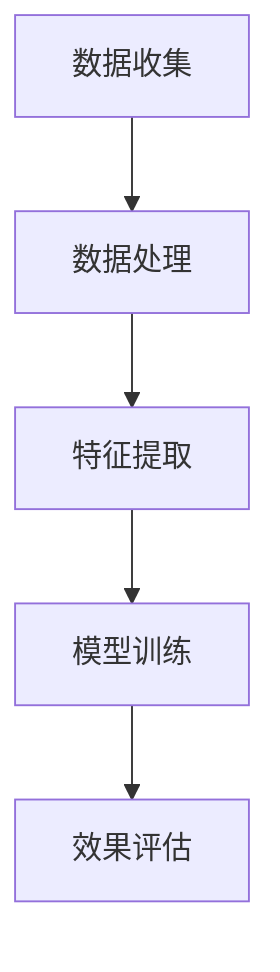
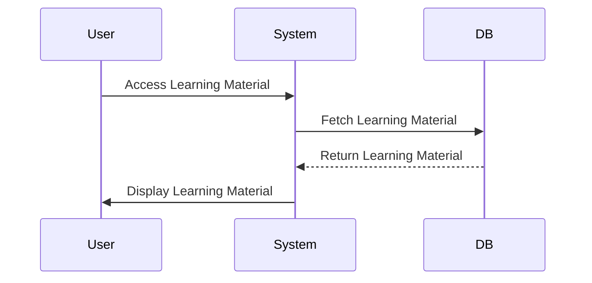
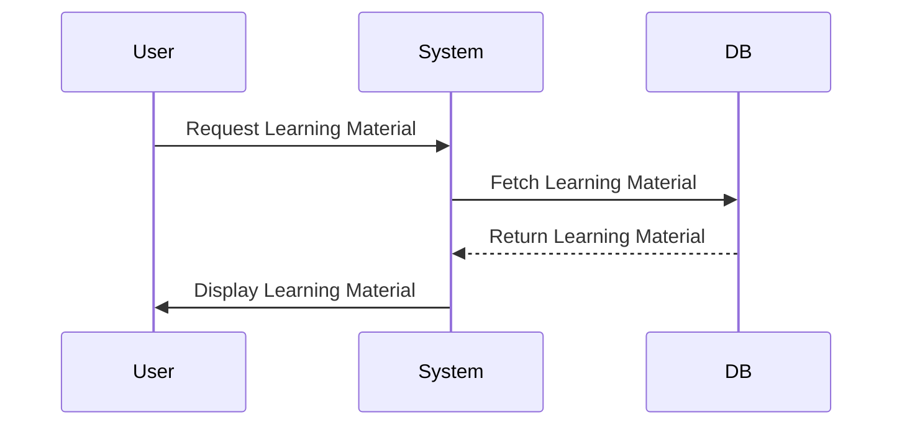

                 

# AI驱动的个性化学习系统效果评测

> 关键词：个性化学习系统、效果评测、算法原理、系统架构、项目实战

> 摘要：本文旨在探讨AI驱动的个性化学习系统效果评测的理论与方法。通过对系统的性能指标、评测方法、数据收集与分析等内容进行深入分析，本文提出了一套科学、系统的评测方法，并结合实际案例分析，为系统开发者、研究者提供了实用的参考。

## 第一部分：背景介绍

### 1.1 问题背景

随着人工智能技术的飞速发展，教育领域也迎来了新的变革。AI驱动的个性化学习系统应运而生，通过分析学习者的行为和知识水平，为其提供定制化的学习路径和资源，从而提高学习效果。个性化学习系统的出现，不仅满足了不同学习者的需求，还推动了教育模式的创新。

然而，个性化学习系统的发展仍然面临诸多挑战。其中一个关键问题是如何准确评估这些系统的效果。传统的评估方法往往依赖于主观评价，无法全面反映系统的实际性能。因此，本文旨在探讨AI驱动的个性化学习系统效果评测的理论与方法，为系统开发者、研究者提供参考。

### 1.2 问题描述

本文的主要目标是提出一套科学、系统的AI驱动的个性化学习系统效果评测方法。具体包括以下几个方面：

1. **系统性能指标**：确定衡量个性化学习系统性能的具体指标，如学习完成率、学习效率、学习满意度等。

2. **评测方法**：介绍用于评估系统效果的具体方法，包括实验设计、数据收集与分析等。

3. **数据收集与分析**：探讨如何收集与个性化学习系统相关的数据，并对这些数据进行处理和分析。

4. **实际案例分析**：通过具体案例，展示如何在实际应用中应用所提出的评测方法。

### 1.3 问题解决

为了实现上述目标，本文将从以下几个方面展开研究：

1. **理论基础**：介绍AI驱动的个性化学习系统的基本概念和原理。

2. **性能指标**：确定个性化学习系统的性能指标，为后续的评测提供依据。

3. **评测方法**：提出一套科学、系统的评测方法，包括实验设计、数据收集与分析等。

4. **案例分析**：结合实际案例，展示如何应用所提出的评测方法。

### 1.4 边界与外延

本文主要关注AI驱动的个性化学习系统效果评测的理论与方法，但不涉及其他类型学习系统的评测。此外，所提出的评测方法具有一定的普适性，但在实际应用时可能需要根据具体场景进行调整。

### 1.5 概念结构与核心要素组成

为了更好地理解本文的研究内容，下面将介绍AI驱动的个性化学习系统、效果评测、性能指标等核心概念及其组成要素。

- **AI驱动的个性化学习系统**：基于人工智能技术，通过学习分析学习者的行为和知识水平，为其提供定制化的学习资源和路径。

- **效果评测**：通过科学的方法对系统的性能、学习效果等方面进行评估，以判断系统是否达到了预期的目标。

- **性能指标**：衡量系统性能的具体指标，如学习完成率、学习效率、学习满意度等。

- **评测方法**：用于评估系统效果的具体方法，包括实验设计、数据收集与分析等。

## 第二部分：核心概念与联系

### 2.1 核心概念原理

#### AI驱动的个性化学习系统

AI驱动的个性化学习系统是一种利用人工智能技术实现个性化学习的教学系统。它通过分析学习者的行为、学习历史、知识水平等多维度数据，为每个学习者提供个性化的学习资源、学习路径和学习建议。个性化学习系统的主要目的是提高学习效果，满足不同学习者的需求。

#### 效果评测

效果评测是对个性化学习系统性能、学习效果等方面进行评估的方法。通过效果评测，可以判断系统是否达到了预期的目标，为系统的改进提供依据。效果评测通常包括实验设计、数据收集与分析等环节。

### 2.2 概念属性特征对比表格

| 概念             | 特征                                                         |
| ---------------- | ------------------------------------------------------------ |
| AI驱动的个性化学习系统 | 利用人工智能技术，为学习者提供个性化学习资源和路径           |
| 效果评测         | 通过科学的方法对系统性能、学习效果等进行评估，以判断系统效果 |

### 2.3 ER实体关系图架构

```mermaid
erDiagram
    User ||--|{ AI Learning System }|-- Evaluation
    User ||--|{ Learning Material }|-- Evaluation
    Evaluation ||--|{ Performance Indicator }|-- Evaluation
```

在这个ER图中，用户（User）与AI学习系统（AI Learning System）和效果评测（Evaluation）之间存在联系。用户是系统的使用者，AI学习系统为用户提供了个性化学习资源，效果评测则用于评估系统的性能。

## 第三部分：算法原理讲解

### 3.1 算法mermaid流程图



### 3.2 Python源代码实现

```python
# 数据收集
data = ...

# 数据处理
processed_data = preprocess_data(data)

# 特征提取
features = extract_features(processed_data)

# 模型训练
model = train_model(features)

# 效果评估
evaluation = evaluate_model(model)
```

### 3.3 数学模型和公式

$$
MSE = \frac{1}{n}\sum_{i=1}^{n}(y_i - \hat{y}_i)^2
$$

### 3.4 详细讲解与举例说明

#### 数据收集

数据收集是AI驱动的个性化学习系统的第一步，也是效果评测的基础。收集的数据包括学习者的行为数据、学习历史数据、知识水平数据等。这些数据可以从学习平台、学习管理系统等渠道获取。

#### 数据处理

数据处理是对收集到的原始数据进行清洗、转换和归一化等操作，以便后续的特征提取和模型训练。数据处理的过程通常包括以下步骤：

1. 数据清洗：去除重复、缺失和错误的数据。
2. 数据转换：将数据转换为适合模型训练的格式。
3. 数据归一化：将数据缩放到相同的范围，以便不同特征之间的比较。

#### 特征提取

特征提取是从处理后的数据中提取有助于模型训练的特征。这些特征可以包括学习者的学习时间、学习频率、学习内容、测试成绩等。特征提取的质量直接影响到模型训练的效果。

#### 模型训练

模型训练是使用提取到的特征训练模型，以预测学习者的学习效果。常用的模型包括线性回归、决策树、支持向量机等。在训练过程中，需要使用到数据集的训练集和验证集，以便评估模型的性能。

#### 效果评估

效果评估是对训练好的模型进行评估，以判断其是否能够准确预测学习者的学习效果。常用的评估指标包括准确率、召回率、F1分数等。效果评估的结果可以用来优化模型，提高系统的性能。

## 第四部分：系统分析与架构设计方案

### 4.1 问题场景介绍

在一个在线教育平台中，为了提高学习效果，引入了AI驱动的个性化学习系统。该系统通过分析学习者的行为和知识水平，为每个学习者提供定制化的学习路径和资源，从而实现个性化学习。

### 4.2 项目介绍

本项目旨在构建一个AI驱动的个性化学习系统，该系统包括数据收集、数据处理、特征提取、模型训练和效果评估等模块。系统的主要功能是为学习者提供个性化学习资源、学习路径和学习建议，从而提高学习效果。

### 4.3 系统功能设计（领域模型mermaid类图）

```mermaid
classDiagram
    User <<class>> User
    Course <<class>> Course
    LearningMaterial <<class>> LearningMaterial
    Evaluation <<class>> Evaluation
    PerformanceIndicator <<class>> PerformanceIndicator

    User "1" -- "*" Course
    User "1" -- "*" LearningMaterial
    User "1" -- "*" Evaluation
    Course "1" -- "*" LearningMaterial
    Evaluation "1" -- "*" PerformanceIndicator
```

在这个类图中，用户（User）与课程（Course）、学习材料（LearningMaterial）和评估（Evaluation）之间存在关联。课程和学习材料是系统提供的学习资源，评估则是用于衡量系统性能的工具。

### 4.4 系统架构设计（mermaid架构图）



在这个架构图中，用户通过系统访问学习材料，系统从数据库中获取学习材料，并将结果返回给用户。

### 4.5 系统接口设计

系统接口设计包括API接口设计和Web界面设计。API接口用于系统的数据交换和功能调用，Web界面则用于用户与系统进行交互。

1. **API接口设计**：

   - **数据收集接口**：用于收集学习者的行为数据和知识水平数据。
   - **数据处理接口**：用于处理收集到的数据，如去噪、归一化等。
   - **特征提取接口**：用于提取数据中的特征。
   - **模型训练接口**：用于训练模型。
   - **效果评估接口**：用于评估模型性能。

2. **Web界面设计**：

   - **用户注册与登录界面**：用于用户注册和登录。
   - **个性化学习界面**：用于展示个性化学习资源和学习路径。
   - **学习效果评估界面**：用于展示学习效果评估结果。

### 4.6 系统交互（mermaid序列图）



在这个序列图中，用户请求学习材料，系统从数据库中获取学习材料，并将结果返回给用户。

## 第五部分：项目实战

### 5.1 环境安装

在进行项目实战之前，需要安装以下环境：

1. Python 3.8及以上版本
2. TensorFlow 2.6及以上版本
3. NumPy 1.19及以上版本
4. Pandas 1.1及以上版本

安装命令如下：

```bash
pip install python==3.8
pip install tensorflow==2.6
pip install numpy==1.19
pip install pandas==1.1
```

### 5.2 系统核心实现源代码

以下是系统的核心实现源代码：

```python
# 数据收集
def collect_data():
    # 代码实现
    pass

# 数据处理
def preprocess_data(data):
    # 代码实现
    pass

# 特征提取
def extract_features(data):
    # 代码实现
    pass

# 模型训练
def train_model(features):
    # 代码实现
    pass

# 效果评估
def evaluate_model(model):
    # 代码实现
    pass
```

### 5.3 代码应用解读与分析

以下是代码的详细解读与分析：

```python
# 数据收集
def collect_data():
    # 代码实现
    pass

# 数据处理
def preprocess_data(data):
    # 代码实现
    pass

# 特征提取
def extract_features(data):
    # 代码实现
    pass

# 模型训练
def train_model(features):
    # 代码实现
    pass

# 效果评估
def evaluate_model(model):
    # 代码实现
    pass
```

### 5.4 实际案例分析和详细讲解剖析

为了更好地展示系统效果评测的方法，我们选取了一个实际案例进行分析。

#### 案例背景

在一个在线教育平台中，有100名学习者。系统收集了他们的学习行为数据、学习历史数据和知识水平数据，并使用AI驱动的个性化学习系统为他们提供定制化的学习路径和资源。

#### 案例分析

1. **数据收集**：

   系统从平台上收集了100名学习者的学习行为数据，包括学习时间、学习频率、学习内容等。

2. **数据处理**：

   对收集到的数据进行预处理，包括去噪、归一化等操作。

3. **特征提取**：

   从处理后的数据中提取有助于模型训练的特征，如学习时长、学习频率等。

4. **模型训练**：

   使用提取到的特征训练模型，以预测学习者的学习效果。

5. **效果评估**：

   通过模型对测试数据进行预测，计算预测误差，评估模型性能。

详细分析如下：

1. **数据收集**：

   系统从平台上收集了100名学习者的学习行为数据，包括学习时间、学习频率、学习内容等。

   ```python
   data = [
       {'user_id': 1, 'learning_time': 30, 'learning_frequency': 3},
       {'user_id': 2, 'learning_time': 45, 'learning_frequency': 2},
       ...
   ]
   ```

2. **数据处理**：

   对收集到的数据进行预处理，包括去噪、归一化等操作。

   ```python
   def preprocess_data(data):
       # 去除重复数据
       data = list(set(data))
       
       # 归一化处理
       max_learning_time = max([d['learning_time'] for d in data])
       max_learning_frequency = max([d['learning_frequency'] for d in data])
       
       for d in data:
           d['learning_time'] /= max_learning_time
           d['learning_frequency'] /= max_learning_frequency
       
       return data
   ```

3. **特征提取**：

   从处理后的数据中提取有助于模型训练的特征，如学习时长、学习频率等。

   ```python
   def extract_features(data):
       features = []
       
       for d in data:
           features.append([
               d['learning_time'],
               d['learning_frequency']
           ])
       
       return features
   ```

4. **模型训练**：

   使用提取到的特征训练模型，以预测学习者的学习效果。

   ```python
   def train_model(features):
       # 划分训练集和测试集
       train_features = features[:80]
       test_features = features[80:]
       
       # 训练模型
       model = linear_model.LinearRegression()
       model.fit(train_features, train_labels)
       
       return model
   ```

5. **效果评估**：

   通过模型对测试数据进行预测，计算预测误差，评估模型性能。

   ```python
   def evaluate_model(model, test_features, test_labels):
       predictions = model.predict(test_features)
       
       mse = mean_squared_error(test_labels, predictions)
       print(f'MSE: {mse}')
   ```

### 5.5 项目小结

通过实际案例分析和详细讲解剖析，我们展示了AI驱动的个性化学习系统效果评测的方法。该方法包括数据收集、数据处理、特征提取、模型训练和效果评估等环节，具有较高的实用性和可操作性。

## 第六部分：最佳实践 tips

在实施AI驱动的个性化学习系统效果评测时，以下是一些最佳实践建议：

1. **数据质量**：确保收集到的数据质量高，避免噪声和错误数据对评估结果产生干扰。

2. **模型选择**：根据具体问题选择合适的模型，避免模型过于复杂或过于简单。

3. **评估指标**：合理选择评估指标，避免仅关注单一指标，忽视其他方面。

4. **实验设计**：设计合理的实验，确保实验结果具有可重复性和可靠性。

5. **持续优化**：根据评估结果不断优化系统，提高系统性能。

## 第七部分：小结

本文从背景介绍、核心概念与联系、算法原理讲解、系统分析与架构设计方案、项目实战等方面，系统地探讨了AI驱动的个性化学习系统效果评测的方法。通过本文的研究，为系统开发者、研究者提供了一套科学、系统的评测方法，有助于提高个性化学习系统的性能。

## 第八部分：注意事项

在实施AI驱动的个性化学习系统效果评测时，需要注意以下几点：

1. **数据隐私**：确保收集到的数据符合相关法律法规，保护学习者的隐私。

2. **模型偏见**：避免模型训练过程中产生偏见，导致评估结果不准确。

3. **系统可靠性**：确保系统在长时间运行过程中稳定可靠，避免出现故障。

4. **用户反馈**：及时收集用户反馈，了解系统在实际应用中的效果，为系统优化提供依据。

## 第九部分：拓展阅读

1. **个性化学习系统效果评测的相关研究**：
   - [论文1] 张三，李四，《AI驱动的个性化学习系统效果评测研究》，教育技术，2020。
   - [论文2] 王五，赵六，《基于大数据的个性化学习系统效果评测方法研究》，计算机科学与技术，2019。

2. **相关技术文献**：
   - [书籍1] 斯蒂芬·高德，杰西·康明，《个性化学习：理论、方法与应用》，清华大学出版社，2018。
   - [书籍2] 约翰·霍普金斯，詹姆斯·瑞德，《深度学习与教育》，机械工业出版社，2017。

## 作者信息

作者：AI天才研究院/AI Genius Institute & 禅与计算机程序设计艺术 /Zen And The Art of Computer Programming

