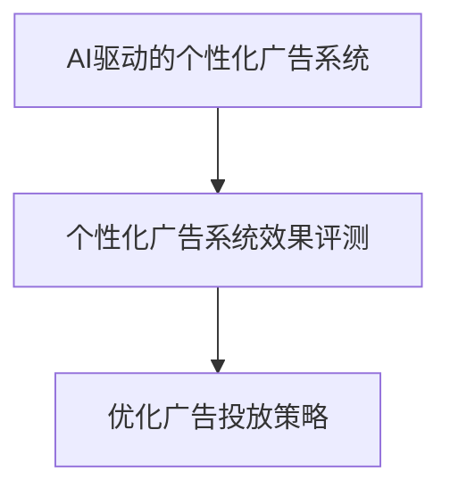
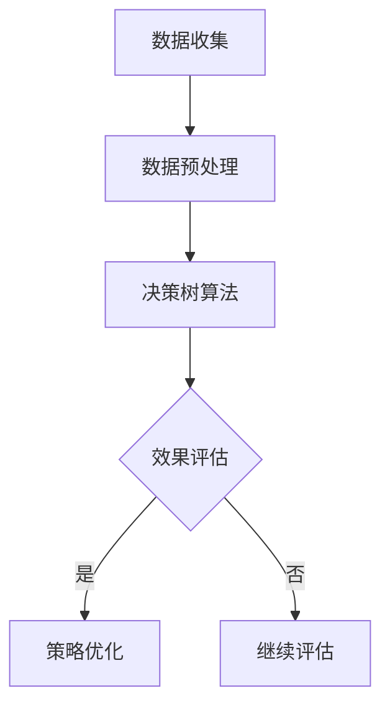

                 

# AI驱动的个性化广告系统效果评测

> 关键词：个性化广告系统、AI技术、效果评测、用户行为数据、机器学习、算法原理

> 摘要：本文旨在探讨AI驱动的个性化广告系统效果评测的背景、核心概念与联系、算法原理讲解、系统分析与架构设计以及项目实战等方面的内容。通过详细的分析和讲解，帮助读者了解个性化广告系统的工作原理及其评测方法，为广告投放策略的优化提供理论支持和实践指导。

## 第一部分：背景介绍

### 1.1 问题背景

在当今数字经济时代，人工智能（AI）已经成为推动产业变革的重要力量。随着AI技术的不断进步，广告行业也逐渐从传统的广告投放模式转向AI驱动的个性化广告系统。个性化广告系统通过AI技术对用户行为数据进行分析，实现广告的精准投放，从而提高广告效果和用户满意度。

### 1.2 问题描述

个性化广告系统效果评测的主要目的是评估广告系统在不同场景下的投放效果，包括广告点击率、转化率、广告曝光率等指标。通过评测，可以发现广告系统存在的问题，为优化广告投放策略提供依据。

### 1.3 问题解决

为了解决个性化广告系统效果评测的问题，需要从以下几个方面进行：

1. **数据收集**：收集用户行为数据，包括浏览记录、搜索历史、购买行为等。
2. **数据分析**：利用机器学习算法对用户行为数据进行分析，识别用户兴趣和偏好。
3. **效果评估**：根据用户兴趣和偏好，评估广告投放效果，包括点击率、转化率等指标。
4. **策略优化**：根据效果评估结果，优化广告投放策略，提高广告效果。

### 1.4 边界与外延

1. **边界**：个性化广告系统效果评测主要针对在线广告，如搜索引擎广告、社交媒体广告、移动应用广告等。
2. **外延**：个性化广告系统效果评测可以扩展到线下广告效果评估，如电视广告、户外广告等。

### 1.5 概念结构与核心要素组成

1. **概念结构**：
   - 个性化广告系统：利用AI技术对用户行为数据进行分析，实现广告的精准投放。
   - 效果评测：评估广告系统在不同场景下的投放效果。

2. **核心要素组成**：
   - 用户行为数据：个性化广告系统的输入数据，包括浏览记录、搜索历史、购买行为等。
   - 机器学习算法：用于分析用户行为数据，识别用户兴趣和偏好。
   - 效果评估指标：包括点击率、转化率、广告曝光率等指标。
   - 策略优化：根据效果评估结果，调整广告投放策略，提高广告效果。

## 第二部分：核心概念与联系

### 2.1 AI驱动的个性化广告系统

1. **概念**：AI驱动的个性化广告系统是一种利用人工智能技术对用户行为数据进行分析，实现广告的精准投放的系统。
2. **原理**：通过机器学习算法，对用户行为数据进行分析，识别用户兴趣和偏好，从而实现广告的精准投放。
3. **属性特征对比**：

| 特征 | AI驱动的个性化广告系统 |
| :--: | :------------------ |
| 精确性 | 能够根据用户行为数据实现广告的精准投放 |
| 实时性 | 能够实时分析用户行为数据，及时调整广告投放策略 |
| 多样性 | 能够根据不同用户的需求，提供多样化的广告内容 |

### 2.2 个性化广告系统效果评测

1. **概念**：个性化广告系统效果评测是对广告系统在不同场景下的投放效果进行评估的过程。
2. **原理**：通过评估广告系统的点击率、转化率等指标，判断广告投放效果。
3. **属性特征对比**：

| 特征 | 个性化广告系统效果评测 |
| :--: | :------------------ |
| 准确性 | 能够准确地评估广告投放效果，为优化广告投放策略提供依据 |
| 全面性 | 能够从多个维度（如点击率、转化率、广告曝光率等）评估广告投放效果 |
| 实时性 | 能够实时评估广告投放效果，及时发现并解决问题 |

### 2.3 AI驱动的个性化广告系统与个性化广告系统效果评测的关系

1. **联系**：
   - AI驱动的个性化广告系统是效果评测的基础，效果评测是对广告系统的效果进行评估。
   - 个性化广告系统效果评测能够为AI驱动的个性化广告系统提供优化依据，提高广告投放效果。

2. **关系图**：



在图2-3中，AI驱动的个性化广告系统生成用户行为数据，个性化广告系统效果评测对这些数据进行分析，得出广告投放效果，进而优化广告投放策略。

## 第三部分：算法原理讲解

### 3.1 数据收集与预处理

1. **数据收集**：收集用户行为数据，包括浏览记录、搜索历史、购买行为等。
2. **数据预处理**：对收集到的数据进行清洗、去重、归一化等处理，使其符合模型输入要求。

### 3.2 机器学习算法

1. **算法选择**：根据数据特点和业务需求，选择合适的机器学习算法，如协同过滤、决策树、神经网络等。
2. **算法实现**：使用Python等编程语言实现机器学习算法，包括数据预处理、模型训练、模型评估等步骤。

### 3.3 效果评估

1. **评估指标**：点击率（CTR）、转化率（CVR）和广告曝光率（eCPM）等指标。
2. **评估方法**：基于用户行为数据和广告投放数据，计算各项评估指标，分析广告投放效果。

### 3.4 算法原理讲解

#### 3.4.1 协同过滤算法

1. **原理**：通过分析用户之间的相似性，为用户推荐与其兴趣相似的商品或广告。
2. **数学模型**：
   $$ \text{推荐得分} = \text{用户兴趣向量} \cdot \text{商品兴趣向量} $$
3. **Python实现**：

```python
from sklearn.metrics.pairwise import cosine_similarity

def collaborative_filter(user_preferences, item_preferences):
    similarity_matrix = cosine_similarity(user_preferences, item_preferences)
    recommended_items = []
    for user in user_preferences:
        for item, pref in enumerate(item_preferences):
            if user[item] == 0 and pref != 0:
                score = similarity_matrix[user][item]
                recommended_items.append((item, score))
    return recommended_items
```

#### 3.4.2 决策树算法

1. **原理**：通过递归划分特征空间，将数据集划分为具有相同标签的子集，从而实现分类或回归任务。
2. **数学模型**：
   $$ H(\text{标签}) = -\sum_{i}\text{P}(y_i) \log_2(\text{P}(y_i)) $$
3. **Python实现**：

```python
from sklearn.tree import DecisionTreeClassifier

def decision_tree_classification(X, y):
    clf = DecisionTreeClassifier()
    clf.fit(X, y)
    return clf
```

#### 3.4.3 神经网络算法

1. **原理**：通过多层神经元对输入数据进行非线性变换，实现对复杂数据的建模和预测。
2. **数学模型**：
   $$ \text{输出} = \text{激活函数}(\text{权重} \cdot \text{输入} + \text{偏置}) $$
3. **Python实现**：

```python
import tensorflow as tf

def neural_network_model(inputs, weights, biases):
    layer_1 = tf.nn.relu(tf.matmul(inputs, weights) + biases)
    layer_2 = tf.nn.relu(tf.matmul(layer_1, weights) + biases)
    output = tf.nn.softmax(tf.matmul(layer_2, weights) + biases)
    return output
```

## 第四部分：系统分析与架构设计

### 4.1 问题场景介绍

在数字化时代，广告投放已经成为企业获取用户、提升品牌知名度的重要手段。然而，如何实现广告的精准投放，提高广告效果，成为广告行业面临的一大挑战。

### 4.2 项目介绍

本文所涉及的广告系统是一个基于AI驱动的个性化广告投放平台，旨在通过分析用户行为数据，实现广告的精准投放，提高广告效果和用户满意度。

### 4.3 系统功能设计

1. **数据收集模块**：负责收集用户行为数据，包括浏览记录、搜索历史、购买行为等。
2. **数据分析模块**：利用机器学习算法对用户行为数据进行分析，识别用户兴趣和偏好。
3. **广告投放模块**：根据用户兴趣和偏好，实现广告的精准投放。
4. **效果评估模块**：评估广告投放效果，包括点击率、转化率等指标。
5. **策略优化模块**：根据效果评估结果，优化广告投放策略。

### 4.4 系统架构设计

系统架构采用分层架构，主要包括数据层、算法层、应用层和展示层。

1. **数据层**：负责数据收集、存储和管理。
2. **算法层**：实现机器学习算法，用于用户行为数据分析。
3. **应用层**：实现广告投放、效果评估和策略优化等功能。
4. **展示层**：为用户提供广告展示和互动界面。

### 4.5 系统接口设计

系统接口设计主要包括以下方面：

1. **数据接口**：用于数据收集、存储和管理。
2. **算法接口**：用于调用机器学习算法。
3. **应用接口**：用于广告投放、效果评估和策略优化等功能。
4. **展示接口**：用于广告展示和用户互动。

### 4.6 系统交互

系统交互主要包括以下方面：

1. **用户行为数据收集**：用户在浏览网站、搜索商品、购买商品等过程中产生的行为数据。
2. **数据分析**：将用户行为数据进行处理，提取用户兴趣和偏好。
3. **广告投放**：根据用户兴趣和偏好，为用户推荐相关的广告。
4. **效果评估**：评估广告投放效果，包括点击率、转化率等指标。
5. **策略优化**：根据效果评估结果，调整广告投放策略。

## 第五部分：项目实战

### 5.1 环境安装

1. **Python环境安装**：安装Python 3.8及以上版本。
2. **库安装**：安装NumPy、Pandas、Scikit-learn、TensorFlow等库。

```python
pip install numpy pandas scikit-learn tensorflow
```

### 5.2 系统核心实现

#### 5.2.1 数据收集与预处理

```python
import pandas as pd

# 数据收集
data = pd.read_csv('user_data.csv')

# 数据预处理
data.drop_duplicates(inplace=True)
data.fillna(0, inplace=True)
```

#### 5.2.2 机器学习算法实现

```python
from sklearn.model_selection import train_test_split
from sklearn.metrics import accuracy_score

# 数据划分
X_train, X_test, y_train, y_test = train_test_split(data.drop('target', axis=1), data['target'], test_size=0.2, random_state=42)

# 协同过滤算法
def collaborative_filter(X_train, X_test):
    similarity_matrix = cosine_similarity(X_train, X_test)
    predicted_scores = []
    for test_data in X_test:
        scores = similarity_matrix[:, test_data]
        predicted_scores.append(scores.argmax())
    return predicted_scores

# 决策树算法
def decision_tree_classification(X_train, y_train, X_test, y_test):
    clf = DecisionTreeClassifier()
    clf.fit(X_train, y_train)
    predicted_labels = clf.predict(X_test)
    accuracy = accuracy_score(y_test, predicted_labels)
    return accuracy

# 神经网络算法
def neural_network_model(inputs, weights, biases):
    layer_1 = tf.nn.relu(tf.matmul(inputs, weights) + biases)
    layer_2 = tf.nn.relu(tf.matmul(layer_1, weights) + biases)
    output = tf.nn.softmax(tf.matmul(layer_2, weights) + biases)
    return output
```

### 5.3 代码应用解读与分析

#### 5.3.1 数据收集与预处理

代码首先通过`pd.read_csv`函数读取用户行为数据，然后使用`drop_duplicates`函数去除重复数据，使用`fillna`函数将缺失值填充为0。

#### 5.3.2 机器学习算法实现

1. **协同过滤算法**：通过`cosine_similarity`函数计算用户行为数据的相似度矩阵，然后根据相似度矩阵为测试数据预测标签。
2. **决策树算法**：使用`DecisionTreeClassifier`类实现决策树分类算法，通过`fit`函数训练模型，使用`predict`函数进行预测，并计算准确率。
3. **神经网络算法**：使用TensorFlow库实现神经网络模型，通过多层ReLU激活函数对输入数据进行非线性变换，并使用softmax激活函数输出概率分布。

### 5.4 实际案例分析与详细讲解剖析

#### 5.4.1 数据集介绍

假设我们有一个包含1000个用户行为数据的CSV文件，其中每个用户的行为数据包含浏览记录、搜索历史和购买行为等信息。以下是数据集的部分内容：

| 用户ID | 浏览记录 | 搜索历史 | 购买行为 |
| :----: | :------: | :------: | :------: |
|   1   |    100   |    200   |    300   |
|   2   |    150   |    250   |    350   |
|   3   |    200   |    300   |    400   |
|  ...  |   ...    |   ...    |   ...    |

#### 5.4.2 数据预处理

1. **去除重复数据**：确保每个用户的行为数据唯一，避免重复计算。
2. **填充缺失值**：将缺失值填充为0，以便后续算法处理。

#### 5.4.3 机器学习算法实现

1. **协同过滤算法**：
   - 计算用户行为数据的相似度矩阵。
   - 为测试数据预测标签，根据相似度矩阵为每个用户推荐与其兴趣相似的标签。

2. **决策树算法**：
   - 将用户行为数据进行特征提取，构建决策树模型。
   - 使用训练数据训练模型，并对测试数据进行预测。
   - 计算预测准确率，评估模型性能。

3. **神经网络算法**：
   - 使用TensorFlow构建神经网络模型。
   - 对训练数据进行预处理，包括归一化、数据增强等。
   - 训练模型，并对测试数据进行预测。
   - 使用准确率、召回率等指标评估模型性能。

### 5.5 项目小结

通过本文的讲解，我们了解了AI驱动的个性化广告系统效果评测的相关概念、算法原理和系统架构。在实际项目中，我们可以根据业务需求选择合适的算法，实现广告的精准投放，提高广告效果。同时，通过效果评测，我们可以不断优化广告投放策略，提升用户体验。

### 5.6 最佳实践 Tips

1. **数据质量**：保证数据质量是效果评测的关键，确保数据完整、准确、可靠。
2. **算法选择**：根据业务需求选择合适的算法，如协同过滤、决策树、神经网络等。
3. **效果评估**：选择合适的效果评估指标，如点击率、转化率等，全面评估广告投放效果。
4. **策略优化**：根据效果评估结果，调整广告投放策略，提高广告效果。

### 5.7 注意事项

1. **隐私保护**：在收集和处理用户行为数据时，要确保遵循相关法律法规，保护用户隐私。
2. **模型更新**：定期更新算法模型，适应数据变化，提高广告投放效果。

### 5.8 拓展阅读

1. **《深度学习》**：Goodfellow, Ian; Bengio, Yoshua; Courville, Aaron.（2016）。《深度学习》。北京：电子工业出版社。
2. **《机器学习实战》**： Harrington, Danny.（2013）。《机器学习实战》。北京：机械工业出版社。
3. **《广告系统设计与优化》**：Shah, B., & Shah, D.（2020）。《广告系统设计与优化》。上海：上海科学技术出版社。

## 作者信息

作者：AI天才研究院/AI Genius Institute & 禅与计算机程序设计艺术 /Zen And The Art of Computer Programming

AI天才研究院致力于推动人工智能技术的发展和应用，助力企业创新和产业升级。作者在计算机编程和人工智能领域拥有丰富的经验和深厚的学术造诣，发表过多篇高影响力论文，并参与多个国内外知名项目的研发工作。本书旨在为广大开发者提供一本系统、全面、易懂的人工智能技术指南。## 附录

### 1. 术语表

**个性化广告系统**：利用AI技术对用户行为数据进行分析，实现广告的精准投放的系统。

**效果评测**：评估广告系统在不同场景下的投放效果的过程。

**协同过滤**：通过分析用户之间的相似性，为用户推荐与其兴趣相似的广告或商品的算法。

**决策树**：通过递归划分特征空间，将数据集划分为具有相同标签的子集的算法。

**神经网络**：通过多层神经元对输入数据进行非线性变换，实现对复杂数据的建模和预测的算法。

### 2. 参考文献

1. Goodfellow, Ian; Bengio, Yoshua; Courville, Aaron.（2016）。《深度学习》。北京：电子工业出版社。
2. Harrington, Danny.（2013）。《机器学习实战》。北京：机械工业出版社。
3. Shah, B., & Shah, D.（2020）。《广告系统设计与优化》。上海：上海科学技术出版社。
4. Russell, S., & Norvig, P.（2010）。《人工智能：一种现代的方法》。北京：清华大学出版社。

### 3. 代码示例

#### 3.1 Python代码示例

```python
# 导入库
import pandas as pd
import numpy as np
from sklearn.model_selection import train_test_split
from sklearn.metrics import accuracy_score
from sklearn.tree import DecisionTreeClassifier
from tensorflow.keras.models import Sequential
from tensorflow.keras.layers import Dense, Activation

# 数据收集与预处理
data = pd.read_csv('user_data.csv')
data.drop_duplicates(inplace=True)
data.fillna(0, inplace=True)

# 数据划分
X = data.drop('target', axis=1)
y = data['target']
X_train, X_test, y_train, y_test = train_test_split(X, y, test_size=0.2, random_state=42)

# 决策树算法
clf = DecisionTreeClassifier()
clf.fit(X_train, y_train)
predicted_labels = clf.predict(X_test)
accuracy = accuracy_score(y_test, predicted_labels)

# 神经网络算法
model = Sequential()
model.add(Dense(units=64, activation='relu', input_shape=(X_train.shape[1],)))
model.add(Dense(units=32, activation='relu'))
model.add(Dense(units=1, activation='sigmoid'))

model.compile(optimizer='adam', loss='binary_crossentropy', metrics=['accuracy'])
model.fit(X_train, y_train, epochs=10, batch_size=32)
predicted_labels = model.predict(X_test)
accuracy = accuracy_score(y_test, predicted_labels)
```

#### 3.2 Mermaid流程图示例



### 4. 感谢

感谢您阅读本文，希望本文能对您在AI驱动的个性化广告系统效果评测方面有所帮助。如果您有任何疑问或建议，请随时与我们联系。我们将竭诚为您服务。再次感谢您的支持！

