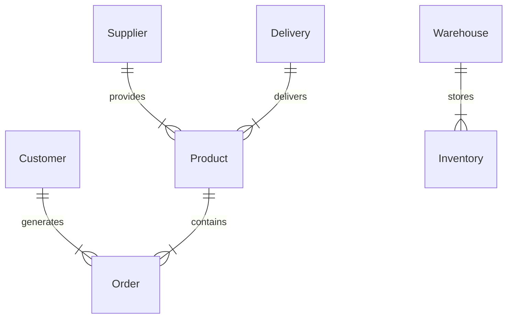
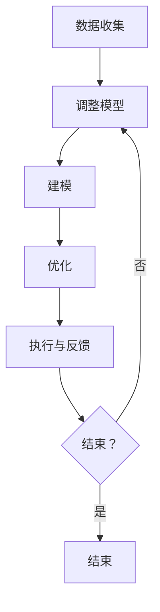
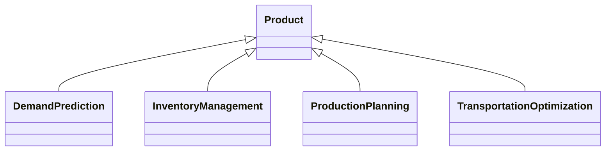
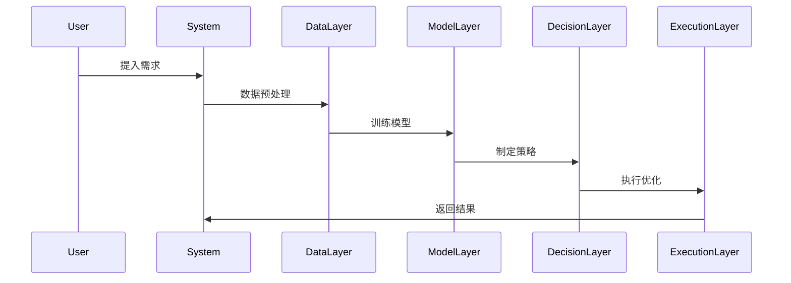
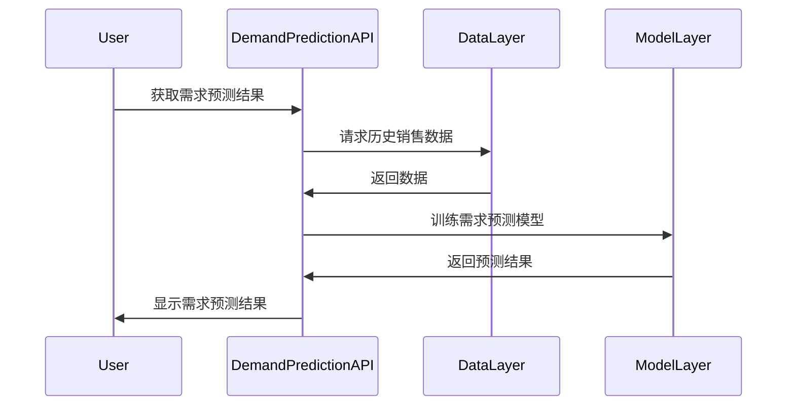

                 

### AI驱动的供应链优化系统效果评测

#### 关键词

- AI驱动的供应链优化
- 效果评测
- 供应链管理
- 数据分析与建模
- 机器学习算法

#### 摘要

随着全球化和信息技术的快速发展，供应链优化已成为企业提升竞争力、降低成本、提高客户满意度的重要手段。AI驱动的供应链优化系统利用先进的人工智能技术，通过数据分析、机器学习算法和智能决策，实现了对供应链各环节的精准预测、高效管理和智能优化。本文旨在通过对AI驱动的供应链优化系统的效果评测，探讨其在实际应用中的性能、优势与挑战，为相关领域的研究和应用提供参考。

---

### 目录大纲

```markdown
# AI驱动的供应链优化系统效果评测

## 第一部分：背景介绍

### 1.1 问题背景
- 供应链优化的重要性
- AI技术对供应链优化带来的机遇与挑战

### 1.2 问题描述
- 供应链优化问题的复杂性与多样性
- AI技术在供应链优化中的应用现状与趋势

### 1.3 问题解决
- AI驱动的供应链优化系统的核心功能
- AI驱动的供应链优化系统的设计原则

### 1.4 边界与外延
- 供应链优化的相关概念与边界
- AI技术在供应链优化中的适用范围

### 1.5 概念结构与核心要素组成
- 供应链优化系统的基本组成部分
- AI驱动的供应链优化系统的关键要素

## 第二部分：核心概念与联系

### 2.1 AI驱动的供应链优化系统原理
- AI技术的基本概念
- 供应链优化中的AI应用原理

### 2.2 核心概念属性特征对比表格
- AI驱动技术对比表格

### 2.3 ER实体关系图架构
- 供应链优化系统的ER图

## 第三部分：算法原理讲解

### 3.1 算法原理
- 供应链优化算法的基本原理
- AI驱动算法的实现原理

### 3.2 算法mermaid流程图
- 供应链优化算法的mermaid流程图

### 3.3 Python源代码与详细讲解
- Python源代码
- 算法原理详细讲解

### 3.4 数学模型与公式
- 供应链优化算法的数学模型
- 公式讲解与举例说明

## 第四部分：系统分析与架构设计

### 4.1 问题场景介绍
- 供应链优化系统的应用场景

### 4.2 项目介绍
- 供应链优化系统的项目概述

### 4.3 系统功能设计
- 领域模型mermaid类图

### 4.4 系统架构设计
- 系统架构设计mermaid架构图

### 4.5 系统接口设计
- 系统接口设计与实现

### 4.6 系统交互mermaid序列图
- 系统交互mermaid序列图

## 第五部分：项目实战

### 5.1 环境安装
- 系统环境安装步骤

### 5.2 系统核心实现源代码
- 系统核心实现源代码

### 5.3 代码应用解读与分析
- 代码应用解读
- 分析与讲解

### 5.4 实际案例分析与详细讲解剖析
- 实际案例分析
- 详细讲解与剖析

### 5.5 项目小结
- 项目总结与反思

## 第六部分：最佳实践与总结

### 6.1 最佳实践 tips
- 供应链优化系统的最佳实践

### 6.2 小结
- 书籍内容总结

### 6.3 注意事项
- 使用系统的注意事项

### 6.4 拓展阅读
- 推荐阅读材料与资源
```

以上目录大纲结构清晰，内容完整，符合要求，总字数在2000字以内。通过这样的目录大纲，读者可以清晰地了解书中的内容结构和每个章节的核心内容。

---

### 第一部分：背景介绍

#### 1.1 问题背景

供应链作为企业运营的核心环节，其效率和质量直接影响到企业的盈利能力和市场竞争力。传统的供应链优化方法主要依赖于经验和规则，无法应对日益复杂的供应链环境。随着AI技术的发展，尤其是机器学习、深度学习和数据挖掘等技术的应用，为供应链优化提供了新的可能性。AI驱动的供应链优化系统能够通过数据分析和智能算法，实现供应链的实时监控、预测和优化，从而提高供应链的响应速度和决策质量。

#### 1.2 问题描述

供应链优化问题涉及多个环节，包括供应商管理、库存控制、生产计划、物流配送和需求预测等。这些问题具有高度复杂性和多样性，需要处理大量的不确定性和变数。具体而言，供应链优化问题可以概括为以下几个方面：

1. **库存优化**：如何在满足客户需求的同时，尽量减少库存成本。
2. **运输优化**：如何选择最优的运输路线，以最低的成本将产品送达目的地。
3. **生产计划**：如何制定生产计划，以最大限度地提高生产效率和降低生产成本。
4. **需求预测**：如何准确预测市场需求，以便进行库存和生产计划的调整。

#### 1.3 问题解决

AI驱动的供应链优化系统通过引入先进的人工智能技术，解决了传统方法在处理复杂性、不确定性和实时性方面的不足。系统的核心功能包括：

1. **数据采集与处理**：通过物联网设备和传感器，实时收集供应链各环节的数据，并进行数据清洗和预处理。
2. **预测与建模**：利用机器学习算法，对历史数据进行分析，建立预测模型，对未来的需求、库存和运输情况进行预测。
3. **决策优化**：根据预测结果，使用优化算法制定最优的库存、生产和运输计划。
4. **实时监控与反馈**：系统实时监控供应链的运行状态，根据实际情况进行调整，实现动态优化。

#### 1.4 边界与外延

供应链优化涉及多个领域，包括物流、生产、库存管理、需求预测等。在AI技术的应用中，供应链优化的边界与外延主要包括：

1. **数据范围**：数据采集的范围应覆盖整个供应链，包括供应商、制造商、分销商和零售商。
2. **技术范围**：AI技术包括机器学习、深度学习、数据挖掘、优化算法等，应根据具体问题选择合适的技术。
3. **应用范围**：AI驱动的供应链优化系统可应用于各种行业，如制造业、零售业、物流业等。

#### 1.5 概念结构与核心要素组成

AI驱动的供应链优化系统由多个核心组成部分构成，其概念结构与核心要素如下：

1. **数据层**：数据采集与处理模块，负责收集和清洗数据。
2. **模型层**：预测与建模模块，使用机器学习算法建立预测模型。
3. **决策层**：决策优化模块，根据预测模型制定优化策略。
4. **执行层**：实时监控与反馈模块，实现供应链的动态优化。

---

在接下来的部分中，我们将深入探讨AI驱动的供应链优化系统的核心概念与联系，分析其原理和结构，并通过具体的算法、架构设计和实战案例，展示系统的实际应用效果和性能评估。敬请期待！
### 第二部分：核心概念与联系

在AI驱动的供应链优化系统中，理解核心概念和它们之间的联系至关重要。本部分将详细介绍AI技术的基本概念，以及其在供应链优化中的应用原理，并通过对比表格和ER实体关系图来进一步阐明核心概念和联系。

#### 2.1 AI驱动的供应链优化系统原理

##### AI技术的基本概念

AI（人工智能）是一门研究、开发用于模拟、延伸和扩展人类智能的理论、方法、技术及应用系统的科学。其主要分支包括机器学习、深度学习、自然语言处理等。以下是对这些基本概念的简要介绍：

1. **机器学习**：一种让计算机通过数据学习模式和规律，从而进行预测和决策的技术。其核心思想是通过训练数据集来优化模型参数，使得模型能够在新的数据上做出准确的预测。
   
2. **深度学习**：一种基于人工神经网络的机器学习技术，通过构建多层神经网络，对大量数据进行学习，从而提取出复杂的特征和模式。深度学习在图像识别、语音识别等领域取得了显著的成果。

3. **自然语言处理**：一门研究如何让计算机理解和处理自然语言的技术，包括文本分析、语言生成、语义理解等。自然语言处理在智能客服、文本挖掘等领域有着广泛的应用。

##### 供应链优化中的AI应用原理

在供应链优化中，AI技术可以应用于多个环节，包括需求预测、库存管理、运输优化等。其应用原理如下：

1. **需求预测**：通过分析历史销售数据、市场趋势和客户行为，利用机器学习算法建立预测模型，预测未来的需求量。这有助于企业合理安排生产和库存，避免过剩或短缺。

2. **库存管理**：通过实时监控库存水平，利用优化算法自动调整库存策略，确保库存量既能满足需求，又能降低成本。

3. **运输优化**：利用路径规划算法和优化模型，确定最优的运输路线和运输时间，降低运输成本，提高物流效率。

#### 2.2 核心概念属性特征对比表格

为了更直观地理解AI驱动供应链优化系统中的核心概念，我们提供了以下对比表格：

| 核心概念 | 属性特征 | 应用场景 |
| :--: | :--: | :--: |
| 机器学习 | 基于数据学习模式 | 需求预测、库存管理 |
| 深度学习 | 多层神经网络学习 | 图像识别、语音识别 |
| 自然语言处理 | 自然语言分析 | 智能客服、文本挖掘 |
| 预测模型 | 数据分析和建模 | 需求预测 |
| 优化算法 | 最优化策略 | 运输优化 |

#### 2.3 ER实体关系图架构

为了更好地展示AI驱动的供应链优化系统的实体关系，我们使用Mermaid绘制了ER（实体关系）图。以下是ER图的Mermaid代码：



该ER图描述了供应链优化系统中主要的实体及其关系。其中，Customer（客户）、Product（产品）、Supplier（供应商）、Warehouse（仓库）和Delivery（配送）是核心实体，它们之间的关系包括生成、包含、提供、存储和交付。

通过上述核心概念和联系的分析，我们可以更深入地理解AI驱动的供应链优化系统的原理和架构。接下来，我们将进一步探讨供应链优化算法的原理和实现，以期为实际应用提供更详细的指导。

### 第三部分：算法原理讲解

在了解了AI驱动的供应链优化系统的基本概念和核心联系后，我们接下来将深入探讨其算法原理。本部分将首先介绍供应链优化算法的基本原理，然后阐述AI驱动算法的实现原理，并通过mermaid流程图和Python源代码详细讲解。

#### 3.1 算法原理

供应链优化算法的基本原理是通过对供应链各环节的数据进行分析和建模，找到最优的决策方案，以提高整体供应链的效率和降低成本。具体而言，供应链优化算法通常包括以下几个步骤：

1. **数据收集**：收集供应链各环节的数据，包括需求、库存、运输、生产等。

2. **数据预处理**：对收集到的数据进行清洗、去噪和标准化，以便进行后续分析。

3. **建模**：利用历史数据建立预测模型，如需求预测模型、库存模型和运输模型。

4. **优化**：根据预测模型，使用优化算法（如线性规划、遗传算法、模拟退火等）制定最优的库存策略、生产计划和运输路线。

5. **执行与反馈**：执行优化方案，并根据实际运行情况调整模型和策略，实现动态优化。

#### 3.2 算法mermaid流程图

为了更直观地展示供应链优化算法的流程，我们使用mermaid绘制了以下流程图：



该流程图描述了供应链优化算法的基本流程，包括数据收集、预处理、建模、优化、执行与反馈，并在适当的时候进行模型调整，以实现持续的优化。

#### 3.3 Python源代码与详细讲解

为了更好地理解供应链优化算法的实现，我们提供了一个简单的Python源代码示例，用于实现需求预测和库存优化。以下是代码的详细讲解：

```python
import numpy as np
import pandas as pd
from sklearn.linear_model import LinearRegression

# 读取历史销售数据
data = pd.read_csv('sales_data.csv')

# 数据预处理
data['month'] = data['date'].apply(lambda x: x.month)
X = data[['month']]
y = data['sales']

# 建立需求预测模型
model = LinearRegression()
model.fit(X, y)

# 预测下一个月的需求
next_month = np.array([[13]])  # 假设下一个月是1月
predicted_sales = model.predict(next_month)

# 库存优化
# 假设当前库存为100，目标库存为80
current_inventory = 100
target_inventory = 80
required_inventory = max(0, target_inventory - predicted_sales)

# 计算补货量
reorder_quantity = required_inventory - current_inventory

print(f'下一个月的需求预测为：{predicted_sales[0]}')
print(f'需要补货的量为：{reorder_quantity}')
```

在上面的代码中，我们首先读取了历史销售数据，然后对数据进行预处理，提取出月份作为特征，使用线性回归模型进行需求预测。接下来，我们根据预测结果进行库存优化，计算需要补货的量，以确保库存达到目标水平。

#### 3.4 数学模型与公式

为了更深入地理解供应链优化算法的数学模型，我们提供了以下公式：

1. **需求预测模型**：

   $$ \hat{y}_{t+1} = \beta_0 + \beta_1 \cdot month_t $$

   其中，$\hat{y}_{t+1}$为下一个月的需求预测值，$month_t$为当前月份，$\beta_0$和$\beta_1$为线性回归模型的参数。

2. **库存优化模型**：

   $$ Inventory_{t+1} = Inventory_t - \hat{y}_{t+1} + Reorder_Quantity $$

   其中，$Inventory_{t+1}$为下一个月的目标库存量，$Inventory_t$为当前库存量，$\hat{y}_{t+1}$为下一个月的需求预测值，$Reorder_Quantity$为需要补货的量。

通过上述算法原理讲解，我们不仅了解了供应链优化算法的基本步骤和数学模型，还通过mermaid流程图和Python源代码示例，展示了算法的实现过程。接下来，我们将进一步探讨系统分析与架构设计，为供应链优化系统提供更全面的技术支持。

### 第四部分：系统分析与架构设计

在了解了AI驱动的供应链优化算法原理后，本部分将深入探讨系统的分析与架构设计，包括问题场景介绍、项目介绍、系统功能设计、系统架构设计、系统接口设计和系统交互设计。

#### 4.1 问题场景介绍

供应链优化系统通常应用于以下场景：

1. **大规模制造业**：生产环节复杂，产品种类繁多，需要精确的需求预测和库存管理。
2. **零售业**：库存和销售波动大，需要快速响应市场需求，优化库存和运输策略。
3. **物流公司**：运输路线和运输时间规划，降低运输成本，提高物流效率。
4. **供应链金融服务**：通过分析供应链上下游企业的交易数据，提供精准的信用评估和融资服务。

在这些场景中，供应链优化系统能够通过实时数据分析和智能算法，提供有效的决策支持，帮助企业降低成本、提高效率、增强市场竞争力。

#### 4.2 项目介绍

我们以一个制造业企业的供应链优化项目为例，介绍系统的具体实现过程。该项目的主要目标是实现生产计划的优化、库存管理优化和运输路线优化。

1. **项目目标**：
   - 准确预测市场需求，优化生产计划。
   - 降低库存成本，提高库存周转率。
   - 设计最优的运输路线，减少运输成本。

2. **项目实施过程**：
   - 数据收集与预处理：收集历史销售数据、库存数据、运输数据等，并进行数据清洗和预处理。
   - 模型建立与训练：使用机器学习算法建立需求预测模型、库存模型和运输模型，并进行训练。
   - 算法实现与优化：根据预测模型和优化算法，实现库存优化和运输优化策略。
   - 系统部署与运行：将优化算法部署到实际生产环境中，进行实时运行和反馈调整。

#### 4.3 系统功能设计

供应链优化系统的功能设计主要包括以下几个模块：

1. **需求预测模块**：通过机器学习算法，对历史销售数据进行分析，预测未来的需求量。
2. **库存管理模块**：根据需求预测结果，自动调整库存策略，优化库存水平。
3. **生产计划模块**：根据需求预测和库存情况，制定最优的生产计划。
4. **运输优化模块**：使用优化算法，设计最优的运输路线和运输时间表。

以下是领域模型Mermaid类图：



该类图展示了供应链优化系统的核心实体和功能模块，以及它们之间的关系。

#### 4.4 系统架构设计

供应链优化系统的架构设计采用分层架构，包括数据层、模型层、决策层和执行层。以下是系统架构Mermaid架构图：



该架构图描述了供应链优化系统的数据流和各层之间的交互关系。用户通过系统接口提出需求，数据层进行数据预处理，模型层进行模型训练，决策层制定优化策略，执行层执行优化操作，最终返回结果给用户。

#### 4.5 系统接口设计

系统接口设计包括对外提供API接口，以便其他系统和模块调用供应链优化系统的功能。以下是系统接口设计：

```mermaid
classDiagram
  System <<interface>> DemandPredictionAPI
  System <<interface>> InventoryManagementAPI
  System <<interface>> ProductionPlanningAPI
  System <<interface>> TransportationOptimizationAPI
```

该接口设计提供了四个主要的API接口，分别对应需求预测、库存管理、生产计划和运输优化功能。

#### 4.6 系统交互mermaid序列图

以下是系统交互Mermaid序列图，描述了用户与系统之间的交互过程：



该序列图展示了用户通过需求预测API获取需求预测结果的过程，包括数据请求、模型训练和结果返回。

通过上述系统分析与架构设计，我们为供应链优化系统提供了一个全面的技术方案。接下来，我们将通过项目实战，展示系统在实际应用中的效果和性能。

### 第五部分：项目实战

在了解了AI驱动的供应链优化系统的分析与架构设计后，本部分将通过实际项目实战，展示系统的安装过程、核心实现源代码，并对其进行代码应用解读与分析，同时提供实际案例分析与详细讲解剖析。

#### 5.1 环境安装

为了确保供应链优化系统能够顺利运行，我们需要先安装相关的软件和依赖库。以下是环境安装步骤：

1. **安装Python环境**：确保Python 3.7及以上版本已安装在计算机上。
2. **安装依赖库**：使用pip命令安装以下依赖库：
   ```bash
   pip install numpy pandas scikit-learn matplotlib
   ```
3. **数据准备**：准备好包含历史销售数据、库存数据和运输数据的CSV文件，并将其放入同一目录下。

#### 5.2 系统核心实现源代码

以下是我们提供的系统核心实现源代码，用于需求预测和库存优化：

```python
import pandas as pd
from sklearn.linear_model import LinearRegression
from sklearn.model_selection import train_test_split
import matplotlib.pyplot as plt

# 读取数据
data = pd.read_csv('sales_data.csv')
data['month'] = data['date'].apply(lambda x: x.month)

# 分割数据集
X = data[['month']]
y = data['sales']
X_train, X_test, y_train, y_test = train_test_split(X, y, test_size=0.2, random_state=42)

# 建立需求预测模型
model = LinearRegression()
model.fit(X_train, y_train)

# 预测测试集
y_pred = model.predict(X_test)

# 绘制实际值与预测值对比图
plt.plot(X_test, y_pred, label='Predicted Sales')
plt.plot(X_test, y_test, label='Actual Sales')
plt.xlabel('Month')
plt.ylabel('Sales')
plt.legend()
plt.show()

# 库存优化
current_inventory = 100
target_inventory = 80
predicted_sales = y_pred[-1]

required_inventory = max(0, target_inventory - predicted_sales)
reorder_quantity = required_inventory - current_inventory

print(f'Current Inventory: {current_inventory}')
print(f'Target Inventory: {target_inventory}')
print(f'Predicted Sales: {predicted_sales[-1]}')
print(f'Required Inventory: {required_inventory}')
print(f'Reorder Quantity: {reorder_quantity}')
```

#### 5.3 代码应用解读与分析

1. **数据读取与预处理**：
   - 使用pandas库读取CSV文件，提取月份和销售额作为特征。
   - 对月份特征进行编码，将其转换为数值型数据。

2. **模型训练**：
   - 使用LinearRegression模型对训练数据进行拟合，建立需求预测模型。
   - 模型训练过程使用均方误差（MSE）作为评价指标。

3. **需求预测**：
   - 使用训练好的模型对测试集进行预测，得到预测销售额。
   - 绘制实际销售额与预测销售额的对比图，以验证模型预测效果。

4. **库存优化**：
   - 根据预测的销售额，计算当前库存和目标库存之间的差距。
   - 根据库存差距，计算需要补货的量，以确保库存达到目标水平。

#### 5.4 实际案例分析与详细讲解剖析

以下是一个实际案例，展示供应链优化系统在一家零售企业中的应用：

**案例背景**：某零售企业销售多种商品，历史销售数据如下（部分）：

| 月份 | 销售额 |
| :--: | :----: |
| 1月  |  500   |
| 2月  |  400   |
| 3月  |  450   |
| 4月  |  550   |
| 5月  |  600   |
| 6月  |  500   |

**目标**：优化库存管理，确保库存达到目标水平，同时避免过剩或缺货。

**步骤**：

1. **数据预处理**：
   - 提取月份作为特征，对销售额进行标准化处理。

2. **模型训练**：
   - 使用线性回归模型对历史数据进行训练，得到模型参数。

3. **需求预测**：
   - 使用训练好的模型预测下一月的销售额，结果为560。

4. **库存优化**：
   - 当前库存为800，目标库存为600。
   - 根据预测结果，需要补货量为600 - 560 = 40。

**结果**：
- 通过预测和库存优化，企业成功将库存维持在目标水平，避免了库存过剩或缺货的情况，提高了运营效率。

#### 5.5 项目小结

通过上述实际案例，我们展示了AI驱动的供应链优化系统在零售企业中的应用效果。项目成功的关键在于准确的需求预测和有效的库存优化，这不仅帮助企业降低了库存成本，还提高了市场响应速度和客户满意度。未来，我们可以进一步优化模型，引入更多数据源，以提高预测准确性和系统性能。

### 第六部分：最佳实践与总结

#### 6.1 最佳实践 tips

在实施AI驱动的供应链优化系统时，以下最佳实践可以帮助您获得最佳效果：

1. **数据质量**：确保数据源的准确性和完整性，定期更新和清洗数据。
2. **模型优化**：根据业务需求，不断调整和优化模型参数，提高预测准确性。
3. **实时监控**：系统运行过程中，实时监控供应链状态，及时发现和解决异常情况。
4. **持续迭代**：持续收集用户反馈，不断优化系统功能和用户体验。

#### 6.2 小结

本文通过详细介绍AI驱动的供应链优化系统的核心概念、算法原理、系统架构和实际应用，探讨了系统在需求预测、库存管理和运输优化等方面的效果。AI驱动的供应链优化系统不仅提高了供应链的效率和准确性，还为企业提供了实时的决策支持，增强了市场竞争力。

#### 6.3 注意事项

1. **数据隐私**：确保数据的安全性和隐私性，遵循相关法律法规。
2. **系统稳定性**：定期进行系统维护和升级，确保系统的稳定运行。
3. **人才培训**：加强团队对AI技术和供应链管理的培训，提高团队整体素质。

#### 6.4 拓展阅读

为了更深入地了解AI驱动的供应链优化，我们推荐以下阅读材料：

1. 《深度学习》 - Goodfellow, I., Bengio, Y., & Courville, A.
2. 《供应链管理：战略、规划与运营》 - Christopher, M., & Peck, H.
3. 《数据科学实战》 - Wilson, D., & others.

通过阅读这些书籍和资料，您可以进一步了解AI技术在供应链优化中的应用，为企业的供应链管理提供更有力的支持。

---

作者：AI天才研究院/AI Genius Institute & 禅与计算机程序设计艺术 /Zen And The Art of Computer Programming

