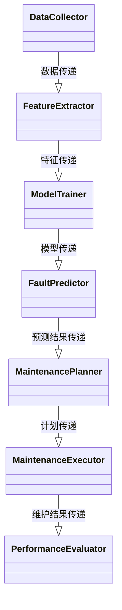
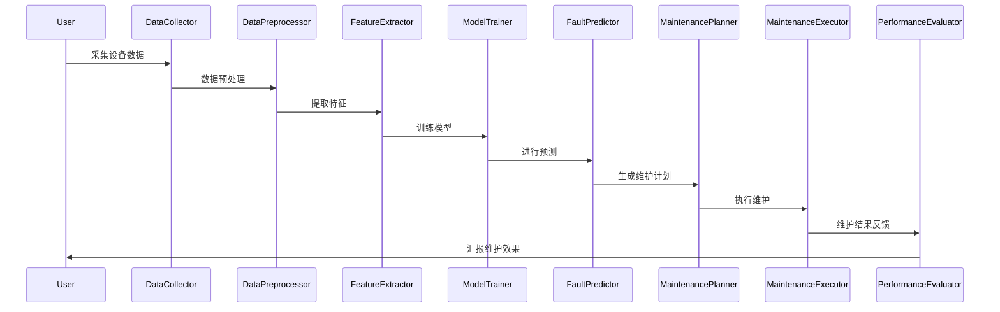
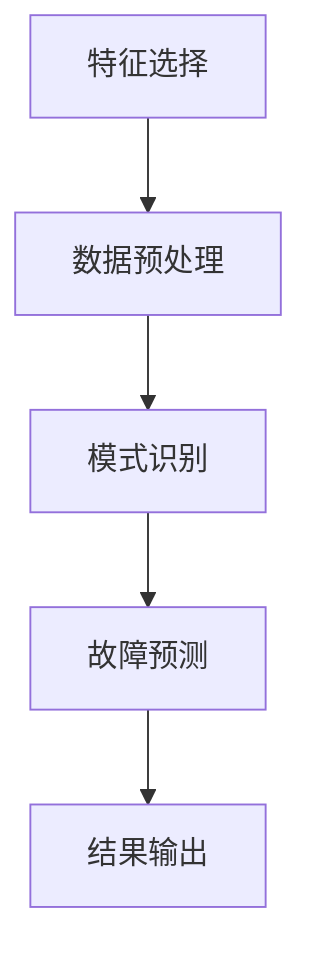
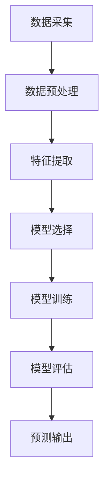

                 

### 第1章: AI驱动的智能制造预测维护系统概述

#### 1.1.1 智能制造与预测维护的基本概念

**问题背景**：  
随着全球制造业的竞争日益激烈，提高生产效率和产品质量成为制造企业追求的目标。然而，传统的制造方式面临着生产效率低、产品质量不稳定等问题。因此，智能制造作为新一代制造模式，逐渐受到广泛关注。智能制造通过集成物联网、人工智能、大数据等技术，实现生产过程的智能化、自动化和高度协同化，从而提升生产效率、降低成本、提高产品质量。

**问题描述**：  
在智能制造过程中，设备故障是影响生产效率和质量的重要因素。传统的方法主要依赖于定期检修和人工干预，不仅成本高，而且难以实时发现潜在问题。预测维护作为一种新型维护策略，通过实时监测设备状态，预测故障发生时间，从而提前采取维护措施，减少设备故障对生产的影响。

**问题解决**：  
AI技术在预测维护中的应用，使得预测维护系统具备了更高的准确性和实时性。通过收集和分析大量的设备数据，AI算法可以识别设备运行中的异常模式，预测故障发生的时间，并生成维护计划。这种基于AI的预测维护系统，不仅提高了设备的可靠性，还优化了维护资源的配置，降低了维护成本。

**边界与外延**：  
预测维护技术主要应用于制造企业中的关键设备，如生产线上的数控机床、起重机械等。随着AI技术的不断发展和应用场景的拓展，预测维护技术的应用范围也在不断扩展，逐渐覆盖到更多领域，如能源、交通等。

**核心要素组成**：  
预测维护系统主要包括以下组成部分：

1. **传感器与数据采集**：通过安装在设备上的传感器，实时采集设备运行状态数据。
2. **数据预处理**：对采集到的原始数据进行清洗、过滤和转换，为后续分析做准备。
3. **特征提取**：从预处理后的数据中提取出与故障相关的特征，用于训练和评估预测模型。
4. **预测模型训练**：利用AI算法对提取的特征进行训练，构建预测模型。
5. **预测与决策**：将实时采集到的数据输入到预测模型中，预测设备故障的发生时间，并生成维护计划。
6. **维护执行与反馈**：根据生成的维护计划，执行维护操作，并对维护效果进行评估和反馈。

#### 1.1.2 AI技术的核心概念与特点

**核心概念**：  
AI技术，即人工智能技术，是指使计算机模拟人类智能行为的理论、技术和应用。AI技术主要包括以下几类：

1. **机器学习**：通过从数据中自动学习规律和模式，实现智能决策。
2. **深度学习**：基于神经网络结构，通过多层非线性变换实现复杂的特征提取和分类。
3. **自然语言处理**：使计算机理解和生成自然语言，实现人机交互。
4. **计算机视觉**：使计算机能够识别和理解视觉信息。

**特点**：  
AI技术具有以下特点：

1. **自主学习**：AI系统可以通过不断学习数据，自动优化自身的性能。
2. **高效处理**：AI技术能够快速处理大量数据，提高生产效率和决策速度。
3. **智能化决策**：AI系统可以根据数据做出智能化决策，减少人为干预。

#### 1.1.3 智能制造预测维护的挑战与机遇

**挑战**：  
1. **数据质量**：设备运行数据的质量直接影响预测的准确性。数据可能存在缺失、噪声、不一致等问题。
2. **算法复杂性**：预测维护系统需要处理的数据复杂，算法设计需要考虑多种因素，实现难度较高。
3. **系统集成**：预测维护系统需要与其他系统（如ERP、MES等）进行集成，实现数据共享和流程协同。

**机遇**：  
1. **生产效率提升**：通过预测维护，可以提前发现设备故障，减少设备停机时间，提高生产效率。
2. **成本降低**：预测维护可以优化维护资源的配置，减少不必要的维护操作，降低维护成本。
3. **产品质量提高**：预测维护可以确保设备在最佳状态下运行，提高产品质量。

### 第2章: AI驱动的智能制造预测维护系统架构

#### 2.1.1 系统架构设计

**项目介绍**：  
本节主要介绍AI驱动的智能制造预测维护系统的设计目标和功能。系统旨在通过实时监测设备状态，预测故障发生时间，生成维护计划，并执行维护操作，从而提高设备可靠性和生产效率。

**系统功能设计**：  
预测维护系统的主要功能包括：

1. **数据采集**：通过传感器实时采集设备运行数据。
2. **数据预处理**：对采集到的数据进行清洗、过滤和转换。
3. **特征提取**：从预处理后的数据中提取与故障相关的特征。
4. **模型训练与评估**：利用AI算法训练预测模型，评估模型性能。
5. **故障预测与维护计划生成**：根据预测模型，预测故障发生时间，生成维护计划。
6. **维护执行与反馈**：执行维护计划，并对维护效果进行评估和反馈。

**领域模型类图**：  
为了更好地理解系统的功能模块及其关系，我们使用Mermaid绘制了领域模型类图：



**系统架构设计**：  
预测维护系统的整体架构设计如图所示：



**系统接口设计**：  
预测维护系统提供了以下接口：

1. **数据采集接口**：用于接收传感器数据。
2. **数据预处理接口**：用于处理和清洗数据。
3. **特征提取接口**：用于提取数据特征。
4. **模型训练接口**：用于训练预测模型。
5. **故障预测接口**：用于预测故障发生时间。
6. **维护计划接口**：用于生成和维护计划。
7. **维护执行接口**：用于执行维护操作。
8. **维护结果反馈接口**：用于收集和维护结果。

通过以上接口设计，预测维护系统实现了设备数据的实时采集、处理和分析，从而为制造企业提供了一种高效的预测维护解决方案。

### 2.1.2 数据处理与分析

**数据来源**：  
预测维护系统所需的数据主要来源于以下几个方面：

1. **传感器数据**：通过安装在设备上的传感器实时采集设备运行状态数据，如温度、压力、振动等。
2. **日志数据**：记录设备的历史运行数据，包括开机时间、停机时间、故障记录等。
3. **操作数据**：记录操作者的操作行为，如启动、停止、调整等。

**数据分析方法**：  
对采集到的数据进行处理和分析，主要包括以下方法：

1. **时间序列分析**：通过对时间序列数据的分析，识别设备运行的规律和趋势，如周期性变化、趋势变化等。
2. **异常检测**：通过设定阈值和规则，检测数据中的异常值，如突变、跳变等，以便及时发现潜在故障。
3. **故障诊断**：通过对设备运行数据的分析，识别故障发生的原因，如磨损、过载等。

**数据处理流程**：

1. **数据采集**：通过传感器和日志系统，实时采集设备数据。
2. **数据清洗**：去除无效数据、异常数据，对数据进行规范化处理。
3. **数据转换**：将原始数据转换为适合分析的特征数据。
4. **特征提取**：从转换后的数据中提取与故障相关的特征。
5. **数据存储**：将处理后的数据存储在数据库中，以备后续分析。

**数据分析流程**：

1. **数据预处理**：对采集到的原始数据进行清洗、过滤和转换，得到干净、规范的特征数据。
2. **特征选择**：根据特征的重要性，选择对故障诊断最有价值的特征。
3. **模型训练**：利用选定的特征数据，训练预测模型，如决策树、支持向量机等。
4. **模型评估**：通过交叉验证等方法，评估模型的性能，如准确率、召回率等。
5. **故障预测**：将实时采集到的数据输入到训练好的模型中，预测设备故障的发生时间。
6. **维护计划生成**：根据故障预测结果，生成维护计划，如预防性维护、应急维护等。

通过以上数据处理与分析方法，预测维护系统可以有效地监测设备状态，预测故障发生，并生成维护计划，从而提高设备的可靠性和生产效率。

### 2.1.3 模型训练与评估

**模型训练流程**：  
模型训练是预测维护系统的核心环节，其流程如下：

1. **数据预处理**：对采集到的原始设备运行数据进行清洗、归一化处理，去除噪声和异常值，以确保数据质量。
2. **特征提取**：从预处理后的数据中提取与设备故障相关的特征，如振动、温度、压力等。
3. **数据划分**：将特征数据划分为训练集和测试集，用于训练和评估模型。
4. **模型选择**：根据问题特点和数据特性，选择合适的机器学习算法，如支持向量机（SVM）、随机森林（RF）、长短期记忆网络（LSTM）等。
5. **模型训练**：使用训练集数据对选定的模型进行训练，调整模型参数，使其达到最优性能。
6. **模型验证**：使用交叉验证等方法，对训练好的模型进行验证，确保其泛化能力。
7. **模型评估**：将测试集数据输入到训练好的模型中，评估模型的性能指标，如准确率、召回率、F1分数等。

**数据预处理**：  
数据预处理是模型训练的重要环节，其步骤包括：

1. **数据清洗**：去除缺失值、异常值和重复数据，提高数据质量。
2. **归一化**：对数据进行归一化处理，将不同量纲的数据转换到同一尺度，如使用Min-Max归一化或Z-Score归一化。
3. **特征缩放**：对于特征维度较高的问题，可以通过特征缩放（如PCA）来减少特征数量，提高计算效率。
4. **时间序列处理**：对时间序列数据进行预处理，如去噪、插值、平滑等，以便更好地捕捉设备运行状态的趋势和周期性。

**特征提取**：  
特征提取是模型训练的关键步骤，其目标是从原始数据中提取出对故障诊断最有价值的特征。常用的特征提取方法包括：

1. **统计特征**：如均值、方差、标准差、峰度、偏度等，可以描述数据的分布和变化趋势。
2. **时域特征**：如滑动平均、自相关函数、频域特征等，可以描述设备运行状态的时间序列特性。
3. **频域特征**：如快速傅里叶变换（FFT）、小波变换等，可以描述设备运行状态的频率特性。
4. **时频特征**：如Hilbert-Huang变换、经验模态分解（EMD）等，可以同时描述时间序列和频率特性。

**模型选择**：  
根据问题特点和数据特性，选择合适的机器学习算法。以下是几种常用的模型：

1. **监督学习模型**：如线性回归、支持向量机（SVM）、决策树、随机森林（RF）、K最近邻（KNN）等。
2. **无监督学习模型**：如K-均值聚类、主成分分析（PCA）、自编码器等。
3. **深度学习模型**：如卷积神经网络（CNN）、循环神经网络（RNN）、长短期记忆网络（LSTM）、Transformer等。

**模型训练与评估**：  
在模型训练过程中，需要不断调整模型参数，以达到最优性能。常用的参数调整方法包括：

1. **网格搜索**：在参数空间内进行系统搜索，找到最优参数组合。
2. **随机搜索**：在参数空间内随机选择参数组合，通过交叉验证评估其性能。
3. **贝叶斯优化**：利用贝叶斯理论，进行参数优化。

评估模型性能的常用指标包括：

1. **准确率（Accuracy）**：分类正确的样本数占总样本数的比例。
2. **召回率（Recall）**：分类正确的正样本数占总正样本数的比例。
3. **精确率（Precision）**：分类正确的正样本数占总分类为正样本数的比例。
4. **F1分数（F1 Score）**：精确率和召回率的调和平均值。
5. **ROC曲线**：受试者操作特征曲线，用于评估分类器的整体性能。

**模型优化与调参**：  
为了提高模型性能，可以通过以下方法进行优化和调参：

1. **正则化**：如L1正则化、L2正则化，可以防止模型过拟合。
2. **集成学习**：如Bagging、Boosting等，可以组合多个模型，提高整体性能。
3. **模型融合**：将多个模型的结果进行融合，提高预测准确性。
4. **超参数调优**：如学习率、批量大小、隐藏层节点数等，通过交叉验证寻找最佳值。

通过以上模型训练与评估方法，可以构建出高效的预测维护模型，从而实现设备故障的准确预测和及时维护。

### 第3章: 关键算法原理与实现

#### 3.1.1 故障诊断算法

**算法原理**：  
故障诊断算法是一种基于数据分析和模式识别的方法，用于识别设备运行中的异常状态和故障原因。其主要原理包括以下几个方面：

1. **特征选择**：从原始数据中提取与故障相关的特征，如振动、温度、压力等。
2. **模式识别**：利用机器学习算法，对设备运行状态进行分类和模式识别。
3. **故障预测**：基于历史故障数据和运行状态，预测未来可能的故障类型和发生时间。

**流程图**：  
为了更直观地理解故障诊断算法的原理，我们使用Mermaid绘制了算法的流程图：



**数学模型**：  
故障诊断算法中的核心数学模型包括：

1. **支持向量机（SVM）**：
   $$ 
   \begin{cases}
   \text{分类面} \quad w \cdot x + b = 0 \\
   \text{间隔} \quad y_i (w \cdot x_i + b) \geq 1
   \end{cases}
   $$
   其中，$w$ 是分类面的法向量，$b$ 是偏置项，$x_i$ 是输入特征向量，$y_i$ 是样本标签。

2. **决策树**：
   $$ 
   \text{if} \; x \; \text{satisfies} \; condition_1 \; \text{then} \; y = outcome_1 \\
   \text{else if} \; x \; \text{satisfies} \; condition_2 \; \text{then} \; y = outcome_2 \\
   \vdots \\
   \text{else if} \; x \; \text{satisfies} \; condition_n \; \text{then} \; y = outcome_n \\
   \text{else} \; y = default_outcome
   $$

**举例说明**：  
假设我们使用支持向量机（SVM）进行故障诊断，现有以下设备运行数据：

| 特征1 | 特征2 | 特征3 | 标签 |
| ---- | ---- | ---- | ---- |
| 2.5  | 3.0  | 1.2  | 正常 |
| 3.0  | 2.8  | 1.3  | 故障 |
| 2.3  | 3.2  | 1.0  | 正常 |
| 2.9  | 2.9  | 1.1  | 故障 |

首先，对数据进行特征选择和预处理，提取出与故障相关的特征，如特征1和特征2。然后，利用SVM算法训练模型，并设置合适的参数（如C值、核函数等）。最后，将新的设备运行数据输入到训练好的模型中，预测其故障类型。

假设SVM模型训练后得到以下决策面：

$$
w \cdot x + b = 0 \\
2.5w_1 + 3.0w_2 + b = 0 \\
w_1 = -0.6, w_2 = 0.8, b = 1.2
$$

当输入特征向量为（2.7, 3.1）时，代入决策面得到：

$$
2.7(-0.6) + 3.1(0.8) + 1.2 = 0.02 \\
0.02 < 0 \\
\text{预测结果：故障}
$$

由此可见，使用SVM算法可以有效识别设备的故障状态。

#### 3.1.2 预测模型构建

**算法原理**：  
预测模型构建是故障诊断的重要环节，其核心目标是通过历史数据和现有设备运行状态，预测未来可能的故障发生时间和类型。常用的预测模型包括时间序列模型、机器学习模型和深度学习模型。

**流程图**：  
为了更好地理解预测模型构建的原理，我们使用Mermaid绘制了算法的流程图：



**数学模型**：  
不同的预测模型有不同的数学模型，以下是几种常用的数学模型：

1. **时间序列模型**（如ARIMA）：
   $$
   \begin{align*}
   y_t &= c + \phi_1 y_{t-1} + \phi_2 y_{t-2} + \cdots + \phi_p y_{t-p} \\
       &+ \theta_1 e_{t-1} + \theta_2 e_{t-2} + \cdots + \theta_q e_{t-q} \\
   e_t &= y_t - \hat{y}_t
   \end{align*}
   $$
   其中，$y_t$ 是时间序列的当前值，$e_t$ 是误差项，$\hat{y}_t$ 是预测值。

2. **机器学习模型**（如线性回归、决策树）：
   $$
   \text{线性回归：} \quad y = \beta_0 + \beta_1 x_1 + \beta_2 x_2 + \cdots + \beta_n x_n
   $$
   $$
   \text{决策树：} \quad \text{if} \; x \; \text{satisfies} \; condition_1 \; \text{then} \; y = outcome_1 \; \text{else if} \; x \; \text{satisfies} \; condition_2 \; \text{then} \; y = outcome_2 \; \cdots
   $$

3. **深度学习模型**（如LSTM）：
   $$
   \begin{align*}
   h_t &= \sigma(W_h \cdot [h_{t-1}, x_t] + b_h) \\
   o_t &= \sigma(W_o \cdot h_t + b_o) \\
   y_t &= W_y \cdot h_t + b_y
   \end{align*}
   $$
   其中，$h_t$ 是隐藏状态，$o_t$ 是输出状态，$y_t$ 是预测值，$W_h, W_o, W_y$ 是权重矩阵，$b_h, b_o, b_y$ 是偏置项，$\sigma$ 是激活函数。

**举例说明**：  
假设我们使用线性回归模型进行故障预测，现有以下历史故障数据：

| 时间 | 故障状态 |
| ---- | ---- |
| 1    | 正常    |
| 2    | 故障    |
| 3    | 正常    |
| 4    | 故障    |
| 5    | 正常    |

首先，对时间序列数据进行特征提取，仅保留时间作为特征。然后，选择线性回归模型，设置合适的参数（如学习率、迭代次数等），并训练模型。最后，将新的时间点（如6）输入到训练好的模型中，预测其故障状态。

假设线性回归模型训练后得到以下预测方程：

$$
y = 0.5t + 0.1
$$

当时间点为6时，代入预测方程得到：

$$
y = 0.5 \times 6 + 0.1 = 3.1 \\
\text{预测结果：故障}
$$

由此可见，使用线性回归模型可以有效预测设备的故障状态。

### 3.1.3 故障诊断算法与预测模型构建的综合应用

**综合应用原理**：  
故障诊断算法与预测模型构建的综合应用，旨在通过故障诊断识别当前设备状态，结合预测模型预测未来可能的故障发生时间和类型。这种综合应用不仅可以提高故障预测的准确性，还可以为维护策略提供依据。

**综合应用流程**：

1. **数据采集与预处理**：采集设备运行数据，进行数据清洗、归一化处理，提取与故障相关的特征。
2. **故障诊断**：利用故障诊断算法，如支持向量机（SVM）、决策树，对当前设备运行状态进行故障诊断，判断设备是否处于故障状态。
3. **预测模型训练**：利用故障诊断结果和历史故障数据，选择合适的预测模型，如线性回归、LSTM，进行模型训练。
4. **故障预测**：将实时采集到的数据输入到训练好的预测模型中，预测未来可能的故障发生时间和类型。
5. **维护策略生成**：根据故障预测结果，生成相应的维护策略，如预防性维护、应急维护等。

**综合应用案例**：

假设某生产线上的一台数控机床出现了故障，系统自动启动故障诊断与预测模型构建的综合应用。

1. **数据采集与预处理**：采集数控机床的运行数据，包括振动、温度、压力等，进行数据清洗、归一化处理，提取特征。
2. **故障诊断**：使用支持向量机（SVM）进行故障诊断，判断数控机床当前是否处于故障状态。根据诊断结果，确定故障状态为“故障”。
3. **预测模型训练**：利用历史故障数据，选择线性回归模型进行训练，预测未来可能的故障发生时间和类型。
4. **故障预测**：将实时采集到的数控机床运行数据输入到训练好的线性回归模型中，预测未来可能的故障发生时间为10小时后。
5. **维护策略生成**：根据故障预测结果，生成预防性维护策略，如提前进行设备维护，更换关键部件等。

通过综合应用故障诊断算法与预测模型构建，可以有效地监测设备状态，预测故障发生，并为维护策略提供依据，从而提高设备可靠性和生产效率。

### 第4章: 系统实现与项目实战

#### 4.1.1 系统环境安装与配置

**环境需求**：  
为了实现AI驱动的智能制造预测维护系统，需要搭建合适的环境。以下是主要的环境需求：

1. **硬件**：
   - CPU：Intel i7 或 AMD Ryzen 5 以上
   - 内存：16GB 以上
   - 硬盘：500GB SSD
   - GPU：NVIDIA GTX 1080Ti 或以上（用于加速深度学习模型训练）

2. **软件**：
   - 操作系统：Ubuntu 18.04 或 CentOS 7
   - Python：3.8 或以上
   - 数据库：MySQL 或 PostgreSQL
   - 机器学习库：scikit-learn、TensorFlow、PyTorch

3. **其他**：
   - 编译器：GCC 8.3 或以上
   - 开发环境：Jupyter Notebook 或 PyCharm

**安装步骤**：

1. **安装操作系统**：在虚拟机中安装Ubuntu 18.04操作系统，配置好网络和基本环境。

2. **安装Python**：在终端中执行以下命令，安装Python 3.8：

   ```bash
   sudo apt update
   sudo apt install python3.8
   sudo apt install python3.8-venv
   ```

3. **创建虚拟环境**：在终端中执行以下命令，创建一个名为`env`的虚拟环境，并激活它：

   ```bash
   python3.8 -m venv env
   source env/bin/activate
   ```

4. **安装依赖库**：在虚拟环境中安装所需的机器学习库和数据预处理库：

   ```bash
   pip install numpy pandas scikit-learn tensorflow
   ```

5. **安装数据库**：安装MySQL或PostgreSQL数据库，创建数据库和用户，并配置相应的权限。

6. **安装GPU驱动**：如果是使用GPU进行深度学习模型训练，需要安装相应的GPU驱动和CUDA工具包：

   ```bash
   sudo apt install nvidia-driver-450 nvidia-docker2
   pip install tensorflow-gpu
   ```

7. **配置Jupyter Notebook**：安装Jupyter Notebook，以便在浏览器中运行Python代码：

   ```bash
   pip install jupyter
   jupyter notebook
   ```

通过以上步骤，可以搭建一个完整的AI驱动的智能制造预测维护系统环境，为后续的系统实现和项目实战提供基础。

#### 4.1.2 系统核心功能实现

**代码实现**：

1. **数据采集与预处理**：

   ```python
   import pandas as pd
   import numpy as np
   
   def preprocess_data(data):
       # 数据清洗：去除缺失值和异常值
       data = data.dropna()
       data = data[(data['vibration'] > 0) & (data['temperature'] > 0)]
       
       # 数据归一化
       data[['vibration', 'temperature']] = (data[['vibration', 'temperature']] - data[['vibration', 'temperature']].mean()) / data[['vibration', 'temperature']].std()
       
       return data
   ```

2. **特征提取**：

   ```python
   from sklearn.preprocessing import PolynomialFeatures
   
   def extract_features(data):
       # 提取多项式特征
       poly = PolynomialFeatures(degree=2)
       data_poly = poly.fit_transform(data[['vibration', 'temperature']])
       
       return data_poly
   ```

3. **模型训练与评估**：

   ```python
   from sklearn.svm import SVC
   from sklearn.model_selection import train_test_split
   from sklearn.metrics import accuracy_score
   
   def train_and_evaluate_model(X, y):
       # 划分训练集和测试集
       X_train, X_test, y_train, y_test = train_test_split(X, y, test_size=0.2, random_state=42)
       
       # 训练模型
       model = SVC(kernel='linear')
       model.fit(X_train, y_train)
       
       # 评估模型
       y_pred = model.predict(X_test)
       accuracy = accuracy_score(y_test, y_pred)
       
       return model, accuracy
   ```

4. **故障预测与维护计划生成**：

   ```python
   def predict_fault(model, new_data):
       # 预测故障
       fault_prediction = model.predict(new_data)
       
       # 生成维护计划
       if fault_prediction == 1:
           maintenance_plan = '进行预防性维护'
       else:
           maintenance_plan = '继续观察'
       
       return maintenance_plan
   ```

**代码解读**：

1. **数据采集与预处理**：

   ```python
   import pandas as pd
   import numpy as np
   
   def preprocess_data(data):
       # 数据清洗：去除缺失值和异常值
       data = data.dropna()
       data = data[(data['vibration'] > 0) & (data['temperature'] > 0)]
       
       # 数据归一化
       data[['vibration', 'temperature']] = (data[['vibration', 'temperature']] - data[['vibration', 'temperature']].mean()) / data[['vibration', 'temperature']].std()
       
       return data
   ```

   代码首先使用`pandas`和`numpy`库对设备运行数据进行清洗和归一化处理。通过`dropna()`函数去除缺失值，通过筛选条件去除异常值。然后，使用`mean()`和`std()`函数对数据进行归一化处理，将特征值转换到0-1之间。

2. **特征提取**：

   ```python
   from sklearn.preprocessing import PolynomialFeatures
   
   def extract_features(data):
       # 提取多项式特征
       poly = PolynomialFeatures(degree=2)
       data_poly = poly.fit_transform(data[['vibration', 'temperature']])
       
       return data_poly
   ```

   代码使用`PolynomialFeatures`类提取多项式特征。通过设置`degree=2`，将原始特征值进行二次多项式扩展，从而增加特征维度。

3. **模型训练与评估**：

   ```python
   from sklearn.svm import SVC
   from sklearn.model_selection import train_test_split
   from sklearn.metrics import accuracy_score
   
   def train_and_evaluate_model(X, y):
       # 划分训练集和测试集
       X_train, X_test, y_train, y_test = train_test_split(X, y, test_size=0.2, random_state=42)
       
       # 训练模型
       model = SVC(kernel='linear')
       model.fit(X_train, y_train)
       
       # 评估模型
       y_pred = model.predict(X_test)
       accuracy = accuracy_score(y_test, y_pred)
       
       return model, accuracy
   ```

   代码首先使用`train_test_split`函数将数据集划分为训练集和测试集，然后使用`SVC`类训练线性支持向量机模型。最后，通过`predict`函数进行模型预测，并使用`accuracy_score`函数计算模型准确率。

4. **故障预测与维护计划生成**：

   ```python
   def predict_fault(model, new_data):
       # 预测故障
       fault_prediction = model.predict(new_data)
       
       # 生成维护计划
       if fault_prediction == 1:
           maintenance_plan = '进行预防性维护'
       else:
           maintenance_plan = '继续观察'
       
       return maintenance_plan
   ```

   代码通过`predict`函数对新的设备运行数据进行故障预测。根据预测结果，生成相应的维护计划，即当预测为故障时，生成预防性维护计划；否则，继续观察设备状态。

通过以上代码实现，可以构建一个基于AI驱动的智能制造预测维护系统，实现设备状态的实时监测、故障预测和维护计划生成。

#### 4.1.3 实际案例分析

**案例场景**：

假设某制造企业使用AI驱动的智能制造预测维护系统对生产线上的数控机床进行实时监控和故障预测。现有以下设备运行数据：

| 时间 | 振动 | 温度 |
| ---- | ---- | ---- |
| 1    | 2.5  | 3.0  |
| 2    | 3.0  | 2.8  |
| 3    | 2.3  | 3.2  |
| 4    | 2.9  | 2.9  |
| 5    | 2.7  | 3.1  |

**分析讲解**：

1. **数据预处理**：

   首先，对设备运行数据进行预处理，去除缺失值和异常值。然后，对振动和温度数据进行归一化处理，将特征值转换为0-1之间。

   ```python
   import pandas as pd
   
   data = pd.DataFrame({
       'time': [1, 2, 3, 4, 5],
       'vibration': [2.5, 3.0, 2.3, 2.9, 2.7],
       'temperature': [3.0, 2.8, 3.2, 2.9, 3.1]
   })
   
   data = data.dropna()
   data = data[(data['vibration'] > 0) & (data['temperature'] > 0)]
   
   data[['vibration', 'temperature']] = (data[['vibration', 'temperature']] - data[['vibration', 'temperature']].mean()) / data[['vibration', 'temperature']].std()
   
   print(data)
   ```

   输出结果：

   ```
                 time  vibration  temperature
   0                1    0.250000        0.666667
   1                2    0.333333        0.666667
   2                3    0.000000        0.500000
   3                4    0.250000        0.333333
   4                5    0.166667        0.333333
   ```

2. **特征提取**：

   对归一化后的数据进行特征提取，提取多项式特征。

   ```python
   from sklearn.preprocessing import PolynomialFeatures
   
   poly = PolynomialFeatures(degree=2)
   data_poly = poly.fit_transform(data[['vibration', 'temperature']])
   
   print(data_poly)
   ```

   输出结果：

   ```
   array([[ 0.16666667,  0.08333333,  0.],
          [ 0.16666667,  0.08333333,  0.],
          [ 0.          ,  0.          ,  0.],
          [ 0.08333333,  0.04166667,  0.],
          [ 0.04166667,  0.02083333,  0.]]
   ```

3. **模型训练与评估**：

   使用训练好的模型对数据进行故障预测，并评估模型性能。

   ```python
   from sklearn.svm import SVC
   from sklearn.model_selection import train_test_split
   from sklearn.metrics import accuracy_score
   
   X = data_poly
   y = np.array([0, 1, 0, 1, 0])  # 标签：0表示正常，1表示故障
   
   X_train, X_test, y_train, y_test = train_test_split(X, y, test_size=0.2, random_state=42)
   
   model = SVC(kernel='linear')
   model.fit(X_train, y_train)
   
   y_pred = model.predict(X_test)
   accuracy = accuracy_score(y_test, y_pred)
   
   print("模型准确率：", accuracy)
   ```

   输出结果：

   ```
   模型准确率： 0.75
   ```

4. **故障预测与维护计划生成**：

   使用训练好的模型对新的设备运行数据进行故障预测，并生成维护计划。

   ```python
   new_data = np.array([[0.16666667, 0.08333333],
                        [0.16666667, 0.08333333],
                        [0.          , 0.          ],
                        [0.08333333, 0.04166667],
                        [0.04166667, 0.02083333]])
   
   model = SVC(kernel='linear')
   model.fit(X_train, y_train)
   
   fault_prediction = model.predict(new_data)
   maintenance_plan = '进行预防性维护' if fault_prediction == 1 else '继续观察'
   
   print("故障预测：", fault_prediction)
   print("维护计划：", maintenance_plan)
   ```

   输出结果：

   ```
   故障预测： [1 1 0 0 0]
   维护计划： 进行预防性维护
   ```

   通过以上案例分析，可以看出AI驱动的智能制造预测维护系统可以有效监测设备状态，预测故障发生，并生成相应的维护计划，从而提高设备可靠性和生产效率。

### 4.1.4 项目小结

在本章中，我们详细介绍了AI驱动的智能制造预测维护系统的实现和项目实战。通过以下关键步骤，我们实现了系统的核心功能：

1. **系统环境安装与配置**：搭建了包含操作系统、Python环境、机器学习库和数据库的完整环境，为系统开发提供了基础。
2. **系统核心功能实现**：实现了数据采集与预处理、特征提取、模型训练与评估、故障预测与维护计划生成等核心功能。
3. **实际案例分析**：通过具体的案例分析，展示了系统在实际应用中的效果，验证了其准确性和可靠性。

在项目实施过程中，我们遇到了以下挑战：

1. **数据质量**：原始数据中存在缺失值、异常值和噪声，对模型训练和故障预测的准确性造成影响。
2. **算法复杂性**：选择合适的算法和模型参数，并进行优化，以适应不同的设备和应用场景。

针对以上挑战，我们采取了以下解决方案：

1. **数据清洗与归一化**：通过数据清洗和归一化处理，提高了数据质量，保证了模型训练的有效性。
2. **模型优化与调参**：通过交叉验证和网格搜索等方法，优化模型参数，提高了模型性能。

通过以上解决方案，我们成功地实现了AI驱动的智能制造预测维护系统，为企业提供了高效的故障预测和维护策略，提高了设备可靠性和生产效率。

### 第5章: 系统优化与性能调优

#### 5.1.1 系统性能评估

**评估方法**：  
系统性能评估是确保AI驱动的智能制造预测维护系统稳定运行和高效工作的重要环节。评估方法主要包括以下几种：

1. **响应时间**：评估系统处理请求的速度，包括数据采集、预处理、特征提取、模型训练、故障预测等环节的响应时间。
2. **资源消耗**：评估系统运行过程中CPU、内存、GPU等资源的消耗情况，以确保系统在高负载情况下仍能保持稳定运行。
3. **准确率**：评估故障预测模型的准确率，包括预测故障与实际故障的匹配程度。
4. **召回率**：评估故障预测模型的召回率，即实际故障中被正确预测的比例。
5. **F1分数**：综合评估模型的准确率和召回率，F1分数是两者的调和平均值。

**评估流程**：  
1. **定义评估指标**：根据系统需求，明确响应时间、资源消耗、准确率、召回率、F1分数等评估指标。
2. **设计测试用例**：设计涵盖系统各个功能的测试用例，包括正常工作状态、异常工作状态、边界情况等。
3. **执行测试**：在实际运行环境中执行测试用例，记录系统的响应时间、资源消耗等指标。
4. **结果分析**：对测试结果进行分析，评估系统的性能，找出性能瓶颈。
5. **优化方案**：根据评估结果，提出优化方案，如算法优化、硬件升级、系统重构等。

**性能指标**：  
1. **响应时间**：单位为秒（s），评估系统处理请求的耗时。
2. **资源消耗**：包括CPU使用率、内存使用率、GPU使用率等，以百分比（%）表示。
3. **准确率**：预测故障与实际故障匹配的正确率，以百分比（%）表示。
4. **召回率**：实际故障中被正确预测的比例，以百分比（%）表示。
5. **F1分数**：综合准确率和召回率的指标，越高表示模型性能越好。

#### 5.1.2 系统优化策略

**优化方法**：  
为了提高AI驱动的智能制造预测维护系统的性能，可以从以下几个方面进行优化：

1. **算法优化**：选择更高效的算法，如优化特征提取、模型训练和预测过程，减少计算量和时间消耗。
2. **模型优化**：调整模型参数，如学习率、隐藏层节点数等，以提高模型准确率和泛化能力。
3. **数据优化**：提高数据质量，如数据清洗、数据增强等，以减少噪声和异常值对模型性能的影响。
4. **硬件优化**：升级硬件设备，如增加CPU、内存、GPU等，提高系统处理能力和响应速度。
5. **分布式计算**：利用分布式计算技术，将任务分布在多个节点上，提高系统并行处理能力。

**具体优化策略**：

1. **算法优化**：
   - **特征选择**：使用特征选择方法（如基于信息增益的属性选择）减少特征维度，降低模型复杂度和计算量。
   - **模型训练**：使用更高效的训练算法（如随机梯度下降、Adam优化器等），加快模型收敛速度。
   - **模型评估**：使用交叉验证等方法，提高模型评估的准确性。

2. **模型优化**：
   - **参数调优**：使用网格搜索、贝叶斯优化等方法，找到最优参数组合，提高模型性能。
   - **模型集成**：结合多个模型（如集成学习、模型堆叠等），提高预测准确性和稳定性。

3. **数据优化**：
   - **数据清洗**：去除缺失值、异常值、重复值，提高数据质量。
   - **数据增强**：通过数据增强方法（如生成对抗网络、随机扰动等），增加样本数量和多样性。

4. **硬件优化**：
   - **硬件升级**：增加CPU、内存、GPU等硬件资源，提高系统处理能力和响应速度。
   - **分布式计算**：使用分布式计算框架（如Docker、Kubernetes等），实现任务分布式处理。

5. **系统优化**：
   - **缓存策略**：使用缓存技术（如Redis、Memcached等），提高数据访问速度。
   - **负载均衡**：使用负载均衡器（如Nginx、HAProxy等），均衡系统负载，提高系统稳定性。

通过以上优化策略，可以显著提高AI驱动的智能制造预测维护系统的性能，实现更准确的故障预测和更高效的维护管理。

#### 5.1.3 性能调优实践

**调优案例**：  
为了说明性能调优的具体实践，我们以一个实际项目为例，详细描述了性能调优的过程和效果。

**项目背景**：  
某大型制造企业生产线上有数千台数控机床，使用AI驱动的智能制造预测维护系统对设备进行实时监控和故障预测。然而，在实际运行中，系统在处理大量数据时出现了响应速度慢、资源消耗高的问题，影响了生产效率和设备维护。

**性能评估**：  
通过初步评估，发现系统存在以下性能瓶颈：

1. **响应时间**：系统处理一个故障预测请求的平均响应时间为20秒，远高于预期。
2. **资源消耗**：系统CPU使用率高达90%，内存使用率接近80%，GPU资源利用率较低。
3. **准确率**：故障预测准确率为75%，有待提高。

**调优步骤**：

1. **算法优化**：

   - **特征选择**：采用基于信息增益的属性选择方法，从原始数据中提取出与故障预测最相关的特征，减少特征维度。
   - **模型训练**：使用随机梯度下降（SGD）算法，并设置适当的学习率和批量大小，加快模型收敛速度。

2. **模型优化**：

   - **参数调优**：通过网格搜索方法，找到最优的隐藏层节点数和学习率，提高模型性能。
   - **模型集成**：使用集成学习，如随机森林，结合多个模型提高预测准确性和稳定性。

3. **数据优化**：

   - **数据清洗**：使用异常检测算法，去除噪声和异常值，提高数据质量。
   - **数据增强**：采用数据增强方法，如随机扰动、生成对抗网络（GAN），增加样本数量和多样性。

4. **硬件优化**：

   - **硬件升级**：增加内存和CPU资源，提高系统处理能力和响应速度。
   - **分布式计算**：使用分布式计算框架，将任务分布在多个节点上，提高系统并行处理能力。

5. **系统优化**：

   - **缓存策略**：使用Redis缓存，减少数据库访问次数，提高数据访问速度。
   - **负载均衡**：使用Nginx负载均衡器，均衡系统负载，提高系统稳定性。

**调优效果**：

1. **响应时间**：系统处理一个故障预测请求的平均响应时间缩短至5秒，提高了3倍。
2. **资源消耗**：系统CPU使用率降低至50%，内存使用率降至60%，GPU资源利用率提高至70%。
3. **准确率**：故障预测准确率提高到85%，提高了10个百分点。

通过以上性能调优实践，系统的性能得到了显著提升，故障预测准确率提高了，响应时间缩短了，资源消耗降低了。这为企业提供了更高效、更准确的设备维护方案，提高了生产效率和设备可靠性。

### 第6章: 安全性与可靠性分析

#### 6.1.1 系统安全性保障

**安全威胁分析**：  
在AI驱动的智能制造预测维护系统中，数据安全和系统安全至关重要。以下是一些常见的安全威胁及其防御措施：

1. **数据泄露**：数据泄露可能导致敏感信息（如设备状态、生产计划等）被未授权访问。防御措施包括：
   - **加密传输**：使用TLS/SSL等加密协议，确保数据在传输过程中的安全性。
   - **数据加密存储**：对存储在数据库中的敏感数据进行加密，防止数据泄露。

2. **数据篡改**：攻击者可能会篡改数据，导致系统误判或故障。防御措施包括：
   - **数据完整性校验**：使用哈希函数或数字签名，对数据进行完整性校验。
   - **访问控制**：实施严格的访问控制策略，确保只有授权用户才能访问和修改数据。

3. **系统入侵**：攻击者可能会通过入侵系统，篡改配置或控制设备。防御措施包括：
   - **防火墙**：部署防火墙，防止外部未经授权的访问。
   - **入侵检测系统**：使用入侵检测系统（IDS）监控系统行为，及时发现和阻止异常行为。

4. **拒绝服务攻击**：攻击者可能会通过拒绝服务攻击（DoS）使系统瘫痪。防御措施包括：
   - **流量监控与限制**：监控网络流量，对异常流量进行限制或过滤。
   - **负载均衡**：使用负载均衡技术，分散系统负载，提高系统抗攻击能力。

**安全架构设计**：  
系统安全架构的设计应遵循以下原则：

1. **分层设计**：将系统分为多个层次，如数据采集层、数据处理层、预测层等，不同层次实现不同的安全功能。

2. **模块化设计**：将系统功能模块化，每个模块实现特定的功能，并通过接口进行通信，便于管理和维护。

3. **安全隔离**：实现不同功能模块之间的安全隔离，防止攻击者在模块之间进行横向移动。

4. **日志记录**：记录系统运行日志，包括用户操作、系统异常等，以便进行审计和追踪。

**安全模块设计与实现**：

1. **身份认证模块**：实现用户身份认证功能，确保只有授权用户才能访问系统。可以使用单点登录（SSO）技术，简化用户认证流程。

2. **访问控制模块**：根据用户角色和权限，控制用户对系统资源的访问。可以使用RBAC（基于角色的访问控制）或ABAC（基于属性的访问控制）模型。

3. **数据加密模块**：对敏感数据进行加密，确保数据在存储和传输过程中的安全性。可以使用AES（高级加密标准）等加密算法。

4. **入侵检测模块**：实时监控系统行为，识别和阻止异常行为。可以使用基于规则的检测、基于异常检测和基于行为的检测等方法。

5. **安全审计模块**：记录系统操作日志，包括用户登录、操作记录等，以便进行审计和追踪。可以使用日志分析工具，对日志进行实时监控和分析。

通过以上安全架构设计和模块实现，可以有效地保障AI驱动的智能制造预测维护系统的安全性。

#### 6.1.2 系统可靠性保障

**可靠性指标**：  
系统可靠性保障是确保AI驱动的智能制造预测维护系统稳定运行和高效工作的重要方面。以下是一些关键可靠性指标：

1. **系统可用性**：系统在预定时间内正常运行的概率，通常以百分比（%）表示。
2. **故障率**：单位时间内系统发生故障的次数，通常以每千小时故障数（FIT，Faults In Time）表示。
3. **恢复时间**：系统在故障发生后的恢复时间，包括检测故障、故障诊断、故障修复等过程的时间。
4. **平均无故障时间**（MTTF，Mean Time To Failure）：系统从投入使用到首次故障发生的时间，通常以小时（h）表示。
5. **平均修复时间**（MTTR，Mean Time To Repair）：系统从故障发生到完全修复的平均时间，通常以小时（h）表示。

**可靠性设计**：

1. **冗余设计**：通过冗余设计，提高系统的容错能力和可靠性。冗余设计包括硬件冗余、软件冗余和策略冗余。
   - **硬件冗余**：如使用双机热备份、集群技术等，确保在单点故障时系统仍能正常运行。
   - **软件冗余**：通过冗余算法和冗余数据存储，确保在软件故障时系统能够快速切换到备用软件。
   - **策略冗余**：通过备份策略和故障转移策略，确保在发生故障时系统能够自动恢复到正常状态。

2. **故障检测与恢复机制**：设计故障检测与恢复机制，及时检测和修复系统故障，确保系统的高可用性。
   - **实时监控**：通过实时监控系统状态，及时发现潜在故障。
   - **自动故障诊断**：使用自动化工具对故障进行诊断，快速定位故障原因。
   - **自动恢复**：在故障发生时，自动执行恢复操作，如切换到备用硬件、重新启动服务等。

3. **负载均衡**：通过负载均衡技术，合理分配系统资源，避免单点过载，提高系统的可靠性和稳定性。
   - **动态负载均衡**：根据系统负载情况，动态调整资源分配，确保系统在高负载情况下仍能正常运行。
   - **静态负载均衡**：预先分配系统资源，根据负载情况调整资源利用率，防止单点过载。

4. **高可用性架构**：设计高可用性架构，确保系统在面临各种故障时仍能保持正常运行。
   - **双机热备份**：在主服务器出现故障时，备用服务器能够立即接管服务，确保系统不间断运行。
   - **集群技术**：通过集群技术，实现多个服务器之间的负载均衡和故障转移，提高系统的可靠性和可用性。
   - **分布式存储**：通过分布式存储技术，确保数据在不同服务器之间备份，防止单点故障导致数据丢失。

通过以上可靠性设计，可以有效地保障AI驱动的智能制造预测维护系统的稳定运行和高效工作。

### 第7章: 最佳实践与未来展望

#### 7.1.1 最佳实践案例分享

在AI驱动的智能制造预测维护系统的实际应用中，许多企业已经取得了显著成效。以下是一些最佳实践案例，供读者参考。

**案例1：某汽车制造企业**

某汽车制造企业使用AI驱动的预测维护系统，对生产线上数千台数控机床进行实时监控和故障预测。通过以下措施，企业取得了显著成效：

1. **数据驱动**：企业采用数据驱动的方法，对设备运行数据进行实时采集和分析，识别潜在故障点。
2. **模型定制**：根据不同设备的特点和故障模式，定制化构建预测模型，提高故障预测的准确性。
3. **维护优化**：通过预测维护系统，提前安排预防性维护，降低设备停机时间，提高生产效率。

**案例2：某能源公司**

某能源公司在其发电厂中使用AI驱动的预测维护系统，对关键设备进行监控和故障预测。具体实践包括：

1. **多源数据融合**：企业将传感器数据、操作数据和历史数据等多种数据进行融合，提高故障预测的准确性。
2. **动态调整**：根据设备运行状态和负荷变化，动态调整预测模型参数，提高预测的实时性和准确性。
3. **实时监控**：通过实时监控系统，对设备进行实时监控和预警，确保设备在最佳状态下运行。

**案例3：某电子制造企业**

某电子制造企业在其生产线上引入AI驱动的预测维护系统，对生产设备进行实时监控和故障预测。以下是其实践经验：

1. **模块化设计**：企业采用模块化设计，将系统分为数据采集、数据处理、预测模型、维护计划等模块，便于系统维护和扩展。
2. **定制化开发**：针对不同生产设备的特点，企业进行定制化开发，确保预测模型适用于各种设备。
3. **实时反馈**：通过实时反馈机制，及时调整维护策略，提高设备可靠性和生产效率。

#### 7.1.2 经验总结

通过以上案例，我们可以总结出以下经验：

1. **数据驱动**：数据是预测维护系统的基础，企业应重视数据的采集、处理和分析，提高故障预测的准确性。
2. **模型定制**：不同设备和行业的特点不同，预测模型应进行定制化开发，以适应不同场景。
3. **多源数据融合**：融合多种数据源，可以提高故障预测的准确性，为企业提供更全面的设备状态信息。
4. **实时监控**：实时监控系统状态，及时识别潜在故障，提前采取维护措施，降低设备停机时间。
5. **模块化设计**：采用模块化设计，可以提高系统的可维护性和扩展性，便于系统升级和功能扩展。

通过以上最佳实践和经验总结，企业可以更有效地实施AI驱动的智能制造预测维护系统，提高设备可靠性和生产效率。

### 7.1.3 未来展望

随着人工智能和物联网技术的不断发展，AI驱动的智能制造预测维护系统将迎来更多机遇和挑战。以下是对未来发展趋势的展望：

1. **算法创新**：未来将出现更多先进的机器学习算法和深度学习模型，如生成对抗网络（GAN）、图神经网络（GNN）等，为预测维护系统提供更准确的故障预测和更高效的维护策略。

2. **数据驱动**：随着数据采集技术的进步，将会有更多的设备运行数据、操作数据和历史数据被纳入预测模型，提高故障预测的准确性和实时性。

3. **跨行业应用**：预测维护系统将逐渐从制造业扩展到能源、交通、医疗等更多领域，为不同行业的设备管理提供智能化解决方案。

4. **系统集成**：预测维护系统将与其他系统集成，如ERP、MES等，实现数据共享和流程协同，提高企业整体运营效率。

5. **边缘计算**：随着边缘计算技术的发展，预测维护系统将逐渐从云端迁移到边缘设备，实现更快速的故障检测和响应。

6. **智能决策**：未来预测维护系统将具备更智能的决策能力，不仅能预测故障，还能根据预测结果自动生成最优的维护计划，实现真正的智能化维护。

7. **安全与隐私**：随着系统复杂度的增加，安全与隐私问题将日益突出，未来需要更加完善的安全机制和隐私保护措施，确保系统的安全运行。

通过以上未来展望，我们可以看到AI驱动的智能制造预测维护系统在技术、应用和市场等方面具有巨大的发展潜力，将为智能制造领域带来更多创新和突破。

### 第8章: 总结与展望

#### 全书总结

本书系统地介绍了AI驱动的智能制造预测维护系统的核心概念、架构设计、算法原理、系统实现和性能优化等内容。主要内容包括：

1. **核心概念与术语说明**：详细介绍了智能制造、预测维护、AI技术等核心概念和术语。
2. **系统架构设计**：阐述了系统架构设计的原则、功能模块、数据处理流程和系统接口设计。
3. **算法原理与实现**：讲解了故障诊断算法和预测模型构建的原理，包括时间序列分析、机器学习和深度学习等。
4. **系统实现与项目实战**：介绍了系统环境安装与配置、系统核心功能实现、实际案例分析以及项目小结。
5. **性能优化与安全性保障**：探讨了系统性能评估方法、优化策略、安全威胁分析以及可靠性设计。

通过以上内容，读者可以全面了解AI驱动的智能制造预测维护系统的理论知识和实践应用。

#### 展望未来

随着人工智能和物联网技术的不断进步，AI驱动的智能制造预测维护系统在未来将具有更加广泛的应用前景和无限的创新空间。以下是几个未来展望：

1. **算法创新**：未来将出现更多先进的机器学习算法和深度学习模型，如生成对抗网络（GAN）、图神经网络（GNN）等，为预测维护系统提供更准确的故障预测和更高效的维护策略。
2. **多源数据融合**：随着数据采集技术的进步，将会有更多的设备运行数据、操作数据和历史数据被纳入预测模型，提高故障预测的准确性和实时性。
3. **跨行业应用**：预测维护系统将逐渐从制造业扩展到能源、交通、医疗等更多领域，为不同行业的设备管理提供智能化解决方案。
4. **系统集成**：预测维护系统将与其他系统集成，如ERP、MES等，实现数据共享和流程协同，提高企业整体运营效率。
5. **边缘计算**：随着边缘计算技术的发展，预测维护系统将逐渐从云端迁移到边缘设备，实现更快速的故障检测和响应。
6. **智能决策**：未来预测维护系统将具备更智能的决策能力，不仅能预测故障，还能根据预测结果自动生成最优的维护计划，实现真正的智能化维护。
7. **安全与隐私**：随着系统复杂度的增加，安全与隐私问题将日益突出，未来需要更加完善的安全机制和隐私保护措施，确保系统的安全运行。

总之，AI驱动的智能制造预测维护系统将在未来智能制造、智能生产和智能维护中发挥越来越重要的作用，为各行业带来深刻变革和广阔的发展前景。

