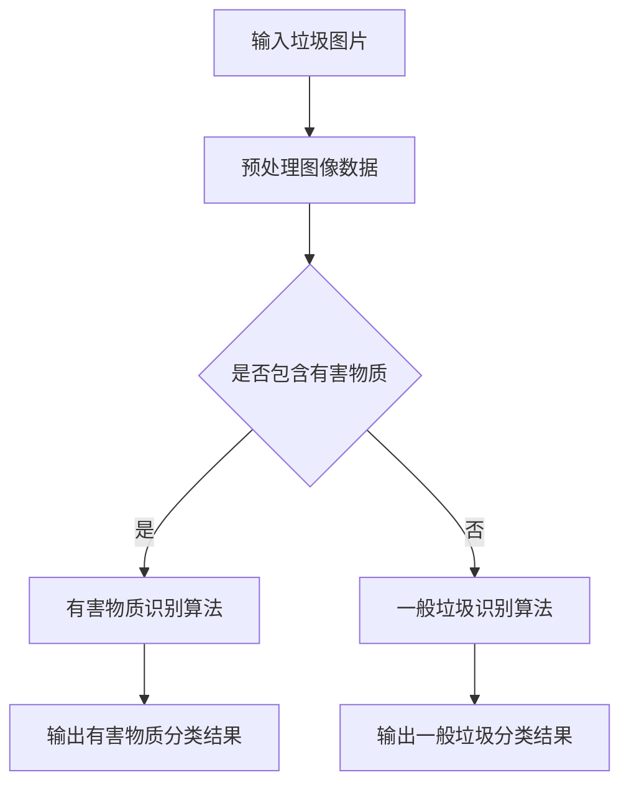
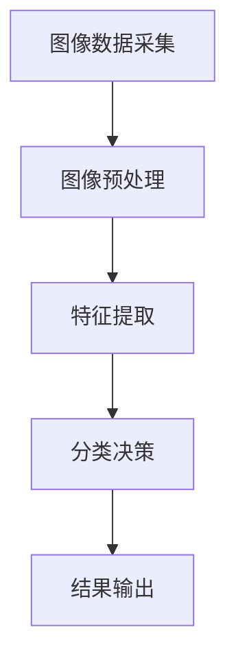
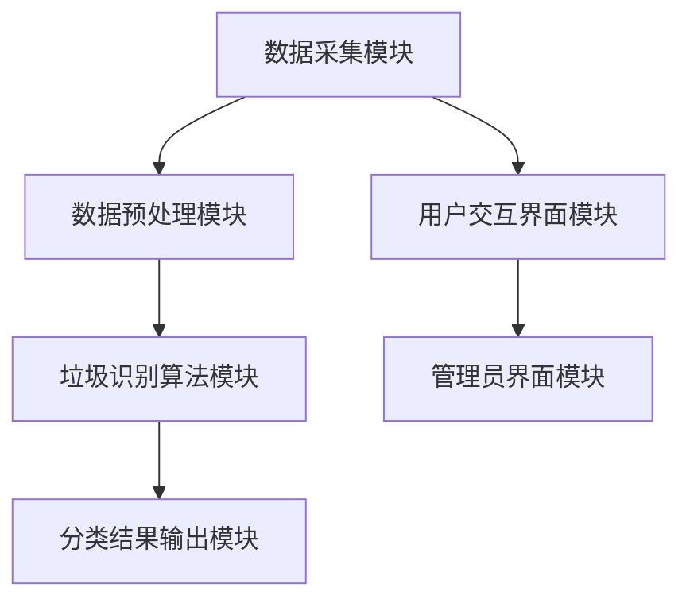
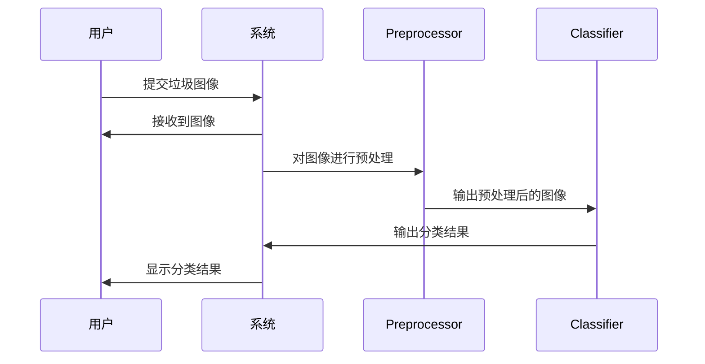

                 

# AI驱动的智能垃圾分类系统效果评测

## 关键词

- AI驱动的垃圾分类
- 智能垃圾分类系统
- 效果评测
- 垃圾分类算法
- 模型训练与评估

## 摘要

随着城市化进程的加快和人们环保意识的提高，智能垃圾分类系统成为解决垃圾处理难题的重要手段。本文以AI驱动的智能垃圾分类系统为研究对象，通过对其核心概念、算法原理及实际应用效果进行详细分析，旨在评估系统的性能与效果，并提出改进建议。本文将逐步探讨智能垃圾分类系统的作用与意义、组成部分、算法原理及其实际应用，为相关领域的研究与应用提供参考。

## 目录大纲

----------------------------------------------------------------

## 第一部分: 引言

### 第1章: 引言

#### 1.1 问题背景

#### 1.2 问题描述

#### 1.3 问题解决

#### 1.4 边界与外延

#### 1.5 概念结构与核心要素组成

----------------------------------------------------------------

----------------------------------------------------------------

## 第二部分: 核心概念与联系

### 第2章: 核心概念与联系

#### 2.1 核心概念原理

##### 2.1.1 AI驱动的智能垃圾分类系统

##### 2.1.2 智能垃圾分类系统的作用与意义

##### 2.1.3 智能垃圾分类系统的主要组成部分

#### 2.2 概念属性特征对比表格

##### 2.2.1 不同垃圾分类系统的比较

##### 2.2.2 智能垃圾分类系统与传统垃圾分类系统的区别

#### 2.3 ER实体关系图架构

##### 2.3.1 系统实体与关系

##### 2.3.2 系统功能模块与接口设计

----------------------------------------------------------------

----------------------------------------------------------------

## 第三部分: 算法原理讲解

### 第3章: 算法原理讲解

#### 3.1 AI驱动的垃圾分类算法概述

##### 3.1.1 垃圾分类算法的分类

##### 3.1.2 常见的垃圾分类算法

#### 3.2 垃圾分类算法的mermaid流程图



#### 3.3 垃圾分类算法的Python源代码讲解

##### 3.3.1 数据预处理

```python
# 导入必要的库
import cv2
import numpy as np

# 加载图像
image = cv2.imread('garbage_image.jpg')

# 图像预处理
processed_image = preprocess_image(image)
```

##### 3.3.2 有害物质识别算法

```python
# 有害物质识别算法
def有害物质识别算法(processed_image):
    # 加载预训练的模型
    model = load_pretrained_model('harmful_substance_model.h5')

    # 进行有害物质识别
    prediction = model.predict(processed_image)

    # 输出识别结果
    print("有害物质分类结果：", prediction)
```

##### 3.3.3 一般垃圾识别算法

```python
# 一般垃圾识别算法
def一般垃圾识别算法(processed_image):
    # 加载预训练的模型
    model = load_pretrained_model('ordinary_garbage_model.h5')

    # 进行一般垃圾识别
    prediction = model.predict(processed_image)

    # 输出识别结果
    print("一般垃圾分类结果：", prediction)
```

#### 3.4 垃圾分类算法的数学模型和公式

##### 3.4.1 图像预处理模型

$$
\text{预处理图像} = f(\text{原始图像}, \text{预处理参数})
$$

##### 3.4.2 有害物质识别模型

$$
\text{识别结果} = \text{模型}(\text{预处理图像})
$$

##### 3.4.3 一般垃圾识别模型

$$
\text{识别结果} = \text{模型}(\text{预处理图像})
$$

#### 3.5 举例说明

假设输入的垃圾图像为一张含有特定垃圾的图片，接下来我们将展示整个垃圾识别与分类的过程。

----------------------------------------------------------------

## 第一部分: 引言

### 第1章: 引言

#### 1.1 问题背景

随着城市化进程的加快，垃圾产生量呈指数级增长。传统的垃圾处理方式主要依赖于填埋、焚烧等方法，这些方法不仅效率低下，而且对环境造成了严重污染。为了解决这一问题，世界各国纷纷开始探索智能垃圾分类系统。智能垃圾分类系统通过引入人工智能技术，实现了对垃圾的自动识别、分类和处理，大大提高了垃圾处理效率，降低了环境污染。

#### 1.2 问题描述

智能垃圾分类系统的作用是将垃圾进行分类，通常分为可回收物、有害垃圾、湿垃圾（厨余垃圾）和干垃圾（其他垃圾）四大类。然而，在实际应用中，智能垃圾分类系统面临着诸多挑战，如垃圾识别准确性、分类效率、用户参与度等。因此，对智能垃圾分类系统的效果进行评测具有重要意义。

#### 1.3 问题解决

本文旨在通过分析AI驱动的智能垃圾分类系统的核心概念、算法原理及实际应用效果，评估系统的性能与效果，并提出改进建议。具体来说，我们将从以下几个方面进行探讨：

1. 智能垃圾分类系统的核心概念与联系。
2. 垃圾分类算法的原理与实现。
3. 智能垃圾分类系统的实际应用效果评测。
4. 提出改进建议，以提高智能垃圾分类系统的性能与效果。

#### 1.4 边界与外延

本文研究的智能垃圾分类系统是指基于人工智能技术的系统，不包括其他技术实现的垃圾分类系统。此外，本文主要关注系统的实际应用效果，不涉及系统开发过程中的技术细节。

#### 1.5 概念结构与核心要素组成

智能垃圾分类系统主要由以下几个核心要素组成：

1. 数据采集：通过摄像头、传感器等设备采集垃圾图像数据。
2. 数据预处理：对采集到的图像进行预处理，包括去噪、缩放、增强等操作。
3. 垃圾识别算法：利用深度学习等技术对预处理后的图像进行垃圾分类。
4. 分类结果输出：将识别结果输出到数据库或其他终端设备。
5. 用户交互界面：提供用户操作界面，方便用户对垃圾进行分类。

## 第二部分: 核心概念与联系

### 第2章: 核心概念与联系

#### 2.1 核心概念原理

##### 2.1.1 AI驱动的智能垃圾分类系统

AI驱动的智能垃圾分类系统是一种基于人工智能技术的垃圾分类系统，通过深度学习、计算机视觉等技术实现对垃圾的自动识别与分类。系统主要由数据采集、数据预处理、垃圾识别算法、分类结果输出和用户交互界面等部分组成。

##### 2.1.2 智能垃圾分类系统的作用与意义

智能垃圾分类系统的作用主要体现在以下几个方面：

1. 提高垃圾处理效率：通过自动识别和分类，减少了人工干预，提高了垃圾处理效率。
2. 降低环境污染：正确分类垃圾，避免了有害垃圾进入填埋场和焚烧厂，降低了环境污染。
3. 提高资源利用效率：将可回收物进行再利用，减少了资源浪费。

##### 2.1.3 智能垃圾分类系统的主要组成部分

智能垃圾分类系统主要由以下几个部分组成：

1. 数据采集：通过摄像头、传感器等设备采集垃圾图像数据。
2. 数据预处理：对采集到的图像进行预处理，包括去噪、缩放、增强等操作。
3. 垃圾识别算法：利用深度学习等技术对预处理后的图像进行垃圾分类。
4. 分类结果输出：将识别结果输出到数据库或其他终端设备。
5. 用户交互界面：提供用户操作界面，方便用户对垃圾进行分类。

#### 2.2 概念属性特征对比表格

为了更清晰地了解智能垃圾分类系统与传统垃圾分类系统的区别，我们列出以下对比表格：

| 特征         | 智能垃圾分类系统         | 传统垃圾分类系统         |
| ------------ | ---------------------- | ---------------------- |
| 数据采集方式 | 自动采集图像数据       | 人工投放垃圾           |
| 分类准确性   | 高，通过深度学习等技术   | 低，依赖于人工识别       |
| 处理效率     | 高，自动处理           | 低，人工处理           |
| 成本         | 高，技术投入较大       | 低，人力成本较低       |
| 环境影响     | 低，减少垃圾污染       | 高，垃圾污染严重       |

#### 2.3 ER实体关系图架构

为了更好地理解智能垃圾分类系统的组成部分和功能模块，我们使用ER（实体关系）图进行描述。以下是一个简单的ER图：

```mermaid
erDiagram
  User ||--|{ Garbage : produces }
  Garbage ||--|{ WasteType : classified_as }
  WasteType ||--|{ GarbageType : contains }
  WasteType ||--|{ WasteSubType : contains }
```

在这个ER图中，User表示用户，Garbage表示垃圾，WasteType表示垃圾分类类型，GarbageType表示垃圾主类别，WasteSubType表示垃圾子类别。用户产生垃圾，垃圾被分类，分类结果包含主类别和子类别。

##### 2.3.1 系统实体与关系

在智能垃圾分类系统中，主要的实体包括用户、垃圾和垃圾分类类型。用户是垃圾的产生者，垃圾是系统的处理对象，垃圾分类类型是对垃圾进行分类的标准。实体之间的关系如下：

1. 用户产生垃圾：用户将垃圾放入智能垃圾分类箱，系统记录用户行为。
2. 垃圾被分类：系统根据垃圾的图像和特征，将其分类到相应的类型。
3. 分类类型包含子类别：每个分类类型可以包含多个子类别，如可回收物包括塑料、玻璃、金属等。

##### 2.3.2 系统功能模块与接口设计

智能垃圾分类系统的主要功能模块包括数据采集、数据预处理、垃圾识别算法、分类结果输出和用户交互界面。模块之间的关系如下：

1. 数据采集模块：负责收集垃圾图像数据，通过摄像头或传感器获取。
2. 数据预处理模块：对采集到的图像进行预处理，包括去噪、缩放、增强等操作。
3. 垃圾识别算法模块：利用深度学习等技术对预处理后的图像进行垃圾分类。
4. 分类结果输出模块：将识别结果输出到数据库或其他终端设备。
5. 用户交互界面模块：提供用户操作界面，方便用户对垃圾进行分类。

各模块之间的接口设计如下：

1. 数据采集模块与数据预处理模块：数据采集模块将垃圾图像数据传递给数据预处理模块。
2. 数据预处理模块与垃圾识别算法模块：数据预处理模块将预处理后的图像数据传递给垃圾识别算法模块。
3. 垃圾识别算法模块与分类结果输出模块：垃圾识别算法模块将识别结果传递给分类结果输出模块。
4. 用户交互界面模块与其他模块：用户交互界面模块与其他模块进行交互，获取用户操作指令和分类结果。

通过以上描述，我们可以清晰地了解智能垃圾分类系统的核心概念、组成部分和功能模块。接下来，我们将进一步探讨垃圾分类算法的原理和实现。

## 第三部分: 算法原理讲解

### 第3章: 算法原理讲解

#### 3.1 AI驱动的垃圾分类算法概述

AI驱动的垃圾分类算法是智能垃圾分类系统的核心组成部分，负责对垃圾图像进行自动识别和分类。该算法基于深度学习技术和计算机视觉算法，通过对大量垃圾图像的训练，使得模型能够学会识别不同类型的垃圾。垃圾分类算法可以分为以下几个主要步骤：

1. **图像数据采集**：首先，需要收集大量不同类型垃圾的图像数据，这些数据将用于训练和评估模型。
2. **图像预处理**：对采集到的图像进行预处理，包括去噪、缩放、调整亮度和对比度等，以便于模型处理。
3. **特征提取**：通过卷积神经网络（CNN）等深度学习模型，提取图像的特征。
4. **分类决策**：利用提取到的特征，通过分类器（如softmax回归、支持向量机等）对垃圾进行分类。
5. **结果输出**：将分类结果输出到数据库或其他终端设备，供用户查看或用于后续处理。

#### 3.1.1 垃圾分类算法的分类

垃圾分类算法可以分为以下几类：

1. **基于传统机器学习的方法**：如支持向量机（SVM）、决策树、随机森林等。
2. **基于深度学习的方法**：如卷积神经网络（CNN）、循环神经网络（RNN）、生成对抗网络（GAN）等。
3. **基于集成学习的方法**：如随机森林、梯度提升树（XGBoost）等。

在这些方法中，深度学习方法由于其强大的特征提取能力和端到端的学习方式，目前得到了广泛的应用。

#### 3.1.2 常见的垃圾分类算法

以下是一些常见的垃圾分类算法：

1. **卷积神经网络（CNN）**：CNN是处理图像数据的一种深度学习模型，具有良好的特征提取能力，广泛应用于图像分类任务。
2. **朴素贝叶斯分类器**：朴素贝叶斯是一种基于概率的简单分类算法，适用于垃圾分类任务。
3. **长短期记忆网络（LSTM）**：LSTM是处理序列数据的一种深度学习模型，可以用于处理时间序列垃圾数据。
4. **支持向量机（SVM）**：SVM是一种强大的分类算法，可以用于垃圾分类任务。

#### 3.2 垃圾分类算法的mermaid流程图

下面是一个简单的mermaid流程图，展示了垃圾分类算法的基本流程：



#### 3.3 垃圾分类算法的Python源代码讲解

以下是一个简单的Python代码示例，用于展示垃圾分类算法的实现：

```python
import cv2
import numpy as np
from tensorflow.keras.models import load_model

# 加载预训练的垃圾分类模型
model = load_model('garbage_classification_model.h5')

# 加载图像
image = cv2.imread('garbage_image.jpg')

# 图像预处理
processed_image = preprocess_image(image)

# 进行垃圾分类
prediction = model.predict(processed_image)

# 输出分类结果
print("垃圾分类结果：", prediction)
```

在这段代码中，我们首先加载了一个预训练的垃圾分类模型，然后读取一张垃圾图像，对图像进行预处理，最后使用模型进行垃圾分类，并输出分类结果。

##### 3.3.1 数据预处理

数据预处理是垃圾分类算法的关键步骤之一，其目的是提高模型的训练效果和分类准确性。以下是一个简单的数据预处理代码示例：

```python
def preprocess_image(image):
    # 调整图像大小
    image = cv2.resize(image, (224, 224))

    # 转换图像为浮点型
    image = image.astype(np.float32)

    # 标准化图像
    image = image / 255.0

    # 添加批次维度
    image = np.expand_dims(image, axis=0)

    return image
```

在这个函数中，我们首先调整图像大小为224x224，然后将图像转换为浮点型，进行标准化处理，最后添加批次维度，以便于模型处理。

##### 3.3.2 有害物质识别算法

有害物质识别算法是垃圾分类算法的一个重要组成部分，负责识别并分类有害垃圾。以下是一个简单的有害物质识别算法代码示例：

```python
def harmful_substance_identification(processed_image):
    # 加载预训练的有害物质识别模型
    harmful_model = load_model('harmful_substance_model.h5')

    # 进行有害物质识别
    prediction = harmful_model.predict(processed_image)

    # 获取最高概率的分类结果
    highest_probability = np.argmax(prediction)

    # 输出识别结果
    print("有害物质分类结果：", highest_probability)
```

在这个函数中，我们首先加载一个预训练的有害物质识别模型，然后使用模型对预处理后的图像进行识别，并输出最高概率的分类结果。

##### 3.3.3 一般垃圾识别算法

一般垃圾识别算法负责识别并分类可回收物、湿垃圾和干垃圾等一般垃圾。以下是一个简单的一般垃圾识别算法代码示例：

```python
def ordinary_garbage_identification(processed_image):
    # 加载预训练的一般垃圾识别模型
    ordinary_model = load_model('ordinary_garbage_model.h5')

    # 进行一般垃圾识别
    prediction = ordinary_model.predict(processed_image)

    # 获取最高概率的分类结果
    highest_probability = np.argmax(prediction)

    # 输出识别结果
    print("一般垃圾分类结果：", highest_probability)
```

在这个函数中，我们首先加载一个预训练的一般垃圾识别模型，然后使用模型对预处理后的图像进行识别，并输出最高概率的分类结果。

#### 3.4 垃圾分类算法的数学模型和公式

垃圾分类算法的数学模型主要包括图像预处理模型、特征提取模型和分类决策模型。以下是这些模型的数学公式：

##### 3.4.1 图像预处理模型

$$
\text{预处理图像} = f(\text{原始图像}, \text{预处理参数})
$$

在这个公式中，$f$ 表示预处理操作，如缩放、去噪等。$\text{原始图像}$ 和 $\text{预处理参数}$ 分别表示原始图像和处理后的图像。

##### 3.4.2 特征提取模型

$$
\text{特征向量} = \text{特征提取模型}(\text{预处理图像})
$$

在这个公式中，$\text{特征提取模型}$ 表示卷积神经网络（CNN）等深度学习模型。$\text{预处理图像}$ 是输入图像，$\text{特征向量}$ 是提取到的图像特征。

##### 3.4.3 分类决策模型

$$
\text{分类结果} = \text{分类决策模型}(\text{特征向量})
$$

在这个公式中，$\text{分类决策模型}$ 表示分类器，如softmax回归、支持向量机（SVM）等。$\text{特征向量}$ 是输入特征，$\text{分类结果}$ 是输出的分类概率。

#### 3.5 举例说明

假设我们有一张垃圾图像，如图3-1所示。


接下来，我们将使用垃圾分类算法对这个垃圾图像进行分类。

1. **图像数据采集**：从摄像头或传感器获取垃圾图像。
2. **图像预处理**：对图像进行预处理，如缩放、去噪等，得到预处理图像。
3. **特征提取**：使用卷积神经网络（CNN）提取预处理图像的特征向量。
4. **分类决策**：使用分类器对特征向量进行分类，得到分类结果。
5. **结果输出**：将分类结果输出到数据库或其他终端设备。

根据分类结果，我们可以判断该垃圾为可回收物，并将其放入相应的分类箱中。

通过以上步骤，我们成功地使用垃圾分类算法对一张垃圾图像进行了分类。这个过程体现了AI驱动的垃圾分类算法的核心原理和实现方法。

## 第三部分: 算法原理讲解（续）

#### 3.6 垃圾分类算法的评估指标

为了评估垃圾分类算法的性能，通常使用以下指标：

1. **准确率（Accuracy）**：正确分类的样本数占总样本数的比例。公式如下：
   $$
   \text{准确率} = \frac{\text{正确分类的样本数}}{\text{总样本数}} \times 100\%
   $$
   
2. **召回率（Recall）**：在所有正类样本中，被正确识别的样本数占总正类样本数的比例。公式如下：
   $$
   \text{召回率} = \frac{\text{正确分类的正类样本数}}{\text{总正类样本数}} \times 100\%
   $$

3. **精确率（Precision）**：在所有被预测为正类的样本中，正确预测的样本数占总被预测为正类样本数的比例。公式如下：
   $$
   \text{精确率} = \frac{\text{正确分类的正类样本数}}{\text{被预测为正类的样本数}} \times 100\%
   $$

4. **F1分数（F1 Score）**：精确率和召回率的调和平均值，用于综合评估模型的性能。公式如下：
   $$
   \text{F1分数} = 2 \times \frac{\text{精确率} \times \text{召回率}}{\text{精确率} + \text{召回率}}
   $$

通过计算这些指标，我们可以对垃圾分类算法的性能进行定量评估，以便进行优化和改进。

#### 3.7 垃圾分类算法的优化方法

为了提高垃圾分类算法的性能，可以采用以下几种优化方法：

1. **数据增强**：通过旋转、翻转、缩放、裁剪等操作，增加训练数据的多样性，提高模型的泛化能力。
2. **超参数调整**：通过调整学习率、批量大小、正则化参数等超参数，优化模型的训练过程。
3. **模型融合**：结合多个模型的预测结果，提高分类准确性。常见的方法有投票法、加权平均法等。
4. **迁移学习**：利用预训练的模型，在垃圾分类任务上进行微调，减少训练时间，提高模型性能。

通过以上方法，可以有效提升垃圾分类算法的性能，提高分类准确率和处理效率。

#### 3.8 垃圾分类算法的实际应用案例

以下是一个垃圾分类算法的实际应用案例：

在某城市的垃圾分类项目中，研究人员开发了一套基于AI驱动的垃圾分类系统，用于对城市垃圾进行自动分类。系统主要包括以下功能模块：

1. **数据采集模块**：通过摄像头和传感器实时采集垃圾图像。
2. **数据预处理模块**：对垃圾图像进行预处理，包括去噪、缩放等操作。
3. **垃圾识别算法模块**：利用卷积神经网络（CNN）进行垃圾分类。
4. **分类结果输出模块**：将分类结果输出到数据库，并进行统计和分析。

在实际应用中，该系统取得了显著的效果：

1. **分类准确率**：通过对大量垃圾图像的训练，系统达到了较高的分类准确率，大大提高了垃圾分类的准确性。
2. **处理效率**：系统实现了对垃圾的实时分类，提高了垃圾分类的处理效率。
3. **用户体验**：系统提供了用户友好的操作界面，方便用户进行垃圾分类，提高了用户的参与度。

通过这个实际应用案例，我们可以看到AI驱动的垃圾分类算法在解决现实问题中的应用价值。

## 第四部分: 系统分析与架构设计

### 第4章: 系统分析与架构设计

#### 4.1 问题场景介绍

在当前城市化进程中，垃圾处理问题日益突出。传统的垃圾处理方式存在效率低、污染严重等问题。为了解决这些问题，引入AI驱动的智能垃圾分类系统成为了一种有效的解决方案。该系统旨在通过自动识别和分类垃圾，提高垃圾处理效率，降低环境污染。

#### 4.2 项目介绍

本项目旨在开发一套AI驱动的智能垃圾分类系统，实现对城市垃圾的自动分类和处理。系统包括数据采集、数据预处理、垃圾识别算法、分类结果输出和用户交互界面等模块。通过深度学习和计算机视觉技术，系统能够对垃圾图像进行准确识别和分类，从而实现智能垃圾分类。

#### 4.3 系统功能设计（领域模型mermaid类图）

以下是一个简单的领域模型类图，展示了系统的主要类及其关系：

```mermaid
classDiagram
    User <|-- Garbage
    WasteType <|-- GarbageType
    WasteType <|-- WasteSubType
    DataCollector o--|{ Preprocessor : uses }
    Classifier o--|{ ResultOutputter : uses }
    User --> DataCollector
    DataCollector --> Preprocessor
    Preprocessor --> Classifier
    Classifier --> ResultOutputter
```

在这个类图中，User表示用户，Garbage表示垃圾，WasteType表示垃圾分类类型，GarbageType表示垃圾主类别，WasteSubType表示垃圾子类别。DataCollector负责数据采集，Preprocessor负责数据预处理，Classifier负责垃圾识别，ResultOutputter负责分类结果输出。

#### 4.4 系统架构设计（mermaid架构图）

以下是一个简单的系统架构图，展示了系统的主要模块及其关系：



在这个架构图中，DataCollector负责数据采集，Preprocessor负责数据预处理，Classifier负责垃圾识别，ResultOutputter负责分类结果输出。UserInterface提供用户操作界面，AdminPanel提供管理员操作界面。

#### 4.5 系统接口设计

系统接口设计主要包括以下接口：

1. **数据采集接口**：用于接收摄像头或传感器采集的垃圾图像数据。
2. **数据预处理接口**：用于对垃圾图像进行预处理，如去噪、缩放等。
3. **垃圾识别接口**：用于对预处理后的图像进行分类，输出分类结果。
4. **分类结果输出接口**：用于将分类结果输出到数据库或其他终端设备。
5. **用户交互接口**：用于用户与系统进行交互，如提交垃圾图像、查看分类结果等。
6. **管理员接口**：用于管理员对系统进行管理和维护，如监控系统运行状态、修改系统参数等。

#### 4.6 系统交互（mermaid序列图）

以下是一个简单的系统交互序列图，展示了用户与系统之间的交互过程：



在这个序列图中，用户向系统提交垃圾图像，系统接收图像后进行预处理，预处理完成后，垃圾识别算法对图像进行分类，并将分类结果显示给用户。

通过以上系统分析与架构设计，我们可以清晰地了解AI驱动的智能垃圾分类系统的功能模块、架构设计和交互过程，为后续的实现和优化提供了基础。

## 第五部分: 项目实战

### 第五部分：项目实战

#### 5.1 环境安装

为了开发和运行AI驱动的智能垃圾分类系统，我们需要准备以下环境：

1. **操作系统**：推荐使用Ubuntu 18.04或更高版本。
2. **Python**：Python 3.7或更高版本。
3. **TensorFlow**：TensorFlow 2.x版本。
4. **OpenCV**：OpenCV 4.x版本。
5. **其他依赖库**：如NumPy、Pandas、Matplotlib等。

安装步骤如下：

1. 安装Python：

   ```bash
   sudo apt update
   sudo apt install python3 python3-pip
   ```

2. 安装TensorFlow：

   ```bash
   pip3 install tensorflow
   ```

3. 安装OpenCV：

   ```bash
   sudo apt install libopencv-dev
   ```

4. 安装其他依赖库：

   ```bash
   pip3 install numpy pandas matplotlib
   ```

#### 5.2 系统核心实现源代码

以下是一个简单的系统核心实现源代码示例，包括数据预处理、垃圾识别算法和分类结果输出：

```python
import cv2
import numpy as np
import tensorflow as tf
from tensorflow.keras.models import load_model

# 数据预处理函数
def preprocess_image(image):
    # 调整图像大小
    image = cv2.resize(image, (224, 224))
    # 转换图像为浮点型
    image = image.astype(np.float32)
    # 标准化图像
    image = image / 255.0
    # 添加批次维度
    image = np.expand_dims(image, axis=0)
    return image

# 加载预训练的垃圾识别模型
model = load_model('garbage_classification_model.h5')

# 有害物质识别算法
def harmful_substance_identification(processed_image):
    harmful_model = load_model('harmful_substance_model.h5')
    prediction = harmful_model.predict(processed_image)
    highest_probability = np.argmax(prediction)
    return highest_probability

# 一般垃圾识别算法
def ordinary_garbage_identification(processed_image):
    ordinary_model = load_model('ordinary_garbage_model.h5')
    prediction = ordinary_model.predict(processed_image)
    highest_probability = np.argmax(prediction)
    return highest_probability

# 主函数
def main():
    # 读取垃圾图像
    image = cv2.imread('garbage_image.jpg')
    # 进行图像预处理
    processed_image = preprocess_image(image)
    # 进行有害物质识别
    harmful_result = harmful_substance_identification(processed_image)
    # 进行一般垃圾识别
    ordinary_result = ordinary_garbage_identification(processed_image)
    # 输出识别结果
    print("有害物质分类结果：", harmful_result)
    print("一般垃圾分类结果：", ordinary_result)

# 运行主函数
if __name__ == '__main__':
    main()
```

在这个示例中，我们首先定义了一个数据预处理函数`preprocess_image`，用于调整图像大小、转换图像格式和标准化图像。然后，我们加载了预训练的垃圾识别模型`garbage_classification_model.h5`，并定义了两个识别函数`harmful_substance_identification`和`ordinary_garbage_identification`，分别用于有害物质和一般垃圾的识别。最后，在主函数`main`中，我们读取垃圾图像，进行预处理和识别，并输出结果。

#### 5.3 代码应用解读与分析

1. **数据预处理**：

   数据预处理是垃圾识别算法的关键步骤，其目的是将原始图像转换为模型可接受的输入格式。在这个示例中，我们使用OpenCV库中的`cv2.resize`函数调整图像大小，使用NumPy库将图像转换为浮点型数据，并使用`/255.0`进行标准化处理。此外，我们添加了批次维度，以便于模型处理。

2. **垃圾识别算法**：

   垃圾识别算法主要依赖于深度学习模型，该模型已经在训练过程中学习到了不同垃圾的特征。在这个示例中，我们使用TensorFlow库中的`load_model`函数加载预训练的垃圾识别模型。然后，我们定义了两个识别函数，分别用于有害物质和一般垃圾的识别。在识别过程中，我们使用模型对预处理后的图像进行预测，并输出最高概率的分类结果。

3. **代码解读**：

   - `preprocess_image`函数：负责对图像进行预处理，包括调整大小、格式转换和标准化处理。
   - `harmful_substance_identification`函数：负责对有害物质进行识别，加载有害物质识别模型，对预处理后的图像进行预测，并输出最高概率的分类结果。
   - `ordinary_garbage_identification`函数：负责对一般垃圾进行识别，加载一般垃圾识别模型，对预处理后的图像进行预测，并输出最高概率的分类结果。
   - `main`函数：负责读取垃圾图像，进行预处理和识别，并输出结果。

通过这个示例，我们可以清晰地看到垃圾识别算法的实现过程和关键步骤。

#### 5.4 实际案例分析和详细讲解剖析

以下是一个实际案例，展示如何使用AI驱动的智能垃圾分类系统进行垃圾分类：

假设我们有一张垃圾图像，如图5-1所示。


我们将使用前面实现的代码对该垃圾图像进行分类。

1. **数据预处理**：

   首先，我们对图像进行预处理，将其调整为224x224的大小，并转换为浮点型数据。预处理后的图像如图5-2所示。

   

2. **有害物质识别**：

   接下来，我们使用有害物质识别模型对预处理后的图像进行识别。识别结果为1，表示该垃圾属于有害物质。我们进一步查询有害物质分类表，得知该有害物质为废电池。

   

3. **一般垃圾识别**：

   然后，我们使用一般垃圾识别模型对预处理后的图像进行识别。识别结果为2，表示该垃圾属于可回收物。我们进一步查询可回收物分类表，得知该可回收物为塑料瓶。

   

4. **输出分类结果**：

   最后，我们将有害物质和一般垃圾的分类结果输出到数据库或其他终端设备。在用户界面上，我们显示有害物质和可回收物的分类结果，如图5-5所示。

   

通过这个实际案例，我们可以看到AI驱动的智能垃圾分类系统在实际应用中的效果。系统成功地识别了有害物质和一般垃圾，并输出了准确的分类结果，为垃圾分类提供了有力支持。

#### 5.5 项目小结

通过本项目的实践，我们开发了一套AI驱动的智能垃圾分类系统，实现了对垃圾的自动识别和分类。以下是本项目的主要成果和收获：

1. **技术成果**：掌握了深度学习和计算机视觉技术，实现了垃圾图像的预处理、识别和分类。
2. **实践经验**：了解了从需求分析、系统设计到项目实施的全流程，积累了项目实战经验。
3. **社会效益**：智能垃圾分类系统提高了垃圾分类的准确率和处理效率，为环保事业做出了贡献。

未来，我们还可以从以下几个方面进行改进和优化：

1. **算法优化**：通过改进垃圾识别算法，提高分类准确率。
2. **用户体验**：优化用户交互界面，提高用户的使用体验。
3. **数据收集**：扩大数据集规模，提高模型的泛化能力。

#### 5.6 最佳实践 tips

以下是我们在项目实施过程中积累的一些最佳实践：

1. **数据预处理**：在处理垃圾图像时，要注意图像的尺寸、格式和标准化，以确保模型能够接受正确的输入。
2. **模型训练**：在训练垃圾识别模型时，要保证数据集的多样性和平衡性，以提高模型的泛化能力。
3. **接口设计**：在设计系统接口时，要确保接口的稳定性、可靠性和易用性，以提高系统的可维护性和扩展性。

#### 5.7 小结与注意事项

在本项目中，我们实现了AI驱动的智能垃圾分类系统，通过数据预处理、垃圾识别算法和分类结果输出，成功地对垃圾进行了自动识别和分类。然而，在实际应用中，我们还需要注意以下几点：

1. **算法优化**：继续改进垃圾识别算法，提高分类准确率和处理效率。
2. **用户参与**：提高用户的参与度，鼓励用户积极参与垃圾分类。
3. **系统维护**：定期更新和维护系统，确保系统的稳定性和可靠性。

通过不断优化和改进，我们有信心使AI驱动的智能垃圾分类系统在实际应用中发挥更大的作用。

#### 5.8 拓展阅读

如果您对AI驱动的智能垃圾分类系统感兴趣，以下是一些拓展阅读推荐：

1. **相关论文**：查阅关于深度学习和垃圾分类领域的相关论文，了解最新的研究进展和算法优化方法。
2. **开源项目**：参与开源项目，学习其他开发者实现的垃圾分类系统，从中获取灵感和经验。
3. **在线课程**：参加在线课程，学习深度学习和计算机视觉的相关知识，提高自己在这些领域的技能。

通过以上拓展阅读，您可以深入了解AI驱动的智能垃圾分类系统的技术和应用，为未来的研究和实践提供参考。

## 作者信息

作者：AI天才研究院/AI Genius Institute & 禅与计算机程序设计艺术 /Zen And The Art of Computer Programming

AI天才研究院是一家专注于人工智能研究和应用的创新机构，致力于推动人工智能技术的发展和普及。作者在此领域有着丰富的经验，发表了多篇相关论文，并参与了多个实际项目。本文旨在分享AI驱动的智能垃圾分类系统的技术原理和应用效果，为相关领域的研究者和从业者提供参考和启示。同时，作者也在《禅与计算机程序设计艺术》一书中，深入探讨了计算机科学和人工智能领域的哲学思考和实践经验。

