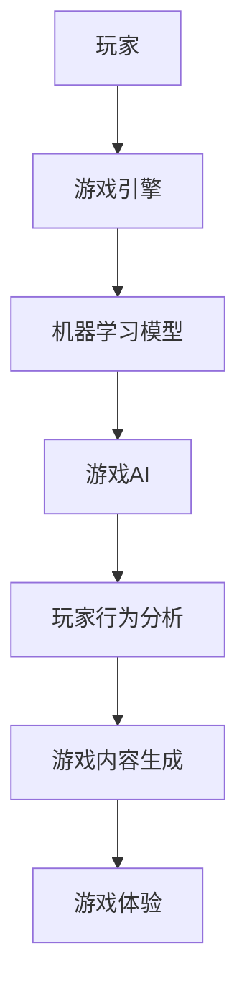
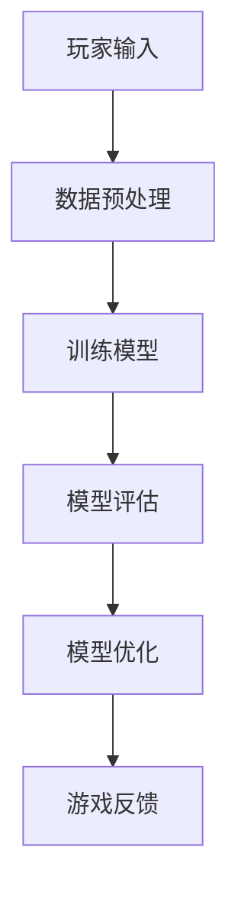
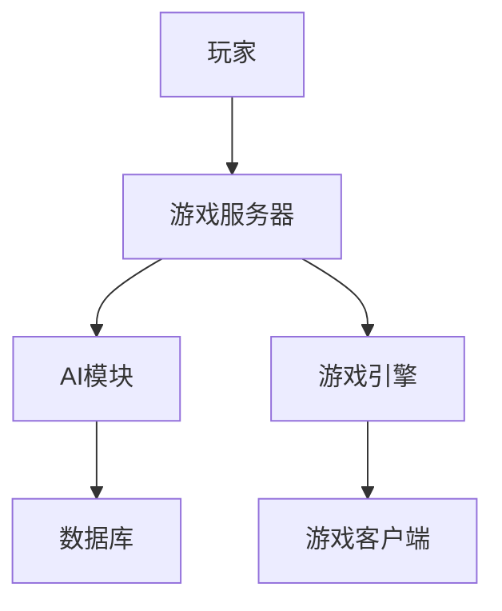
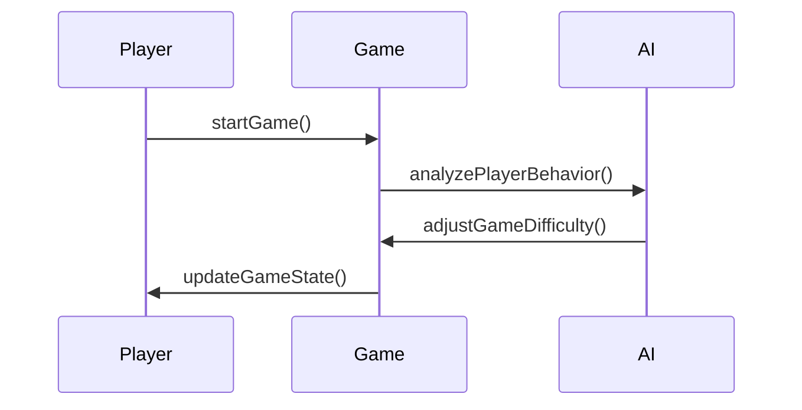

                 

### 文章标题：AI驱动的游戏设计：创造动态和适应性体验

### 关键词：
- AI
- 游戏设计
- 动态性
- 适应性
- 用户体验

### 摘要：
本文深入探讨了AI技术在游戏设计中的应用，通过AI驱动的游戏设计方法，如何创造动态和适应性体验。文章首先介绍了AI在游戏设计中的背景和问题，然后详细讲解了核心概念、算法原理以及数学模型。接着，文章通过系统分析与架构设计，展示了如何实现AI驱动的游戏设计。最后，文章通过项目实战和最佳实践，提供了实际的解决方案和未来拓展方向。

---

### 第一部分：AI驱动的游戏设计概述

#### 第1章：引言与背景

##### 1.1 问题背景

随着计算机技术和人工智能（AI）的飞速发展，游戏行业正经历着一场革命。传统的游戏设计模式逐渐无法满足玩家对新鲜感和挑战性的追求。玩家期待更加动态和适应性的游戏体验，而AI技术正好提供了实现这一目标的方法。

##### 1.2 问题描述

游戏设计中存在的问题主要包括：游戏内容重复、玩家个性化需求难以满足、游戏难度调节不当等。这些问题限制了游戏设计的创新和玩家体验的提升。

##### 1.3 问题解决

AI技术的引入，特别是机器学习和深度学习，为游戏设计提供了新的可能性。通过AI，游戏可以实时分析玩家行为，调整游戏难度、生成个性化内容，从而提供动态和适应性的体验。

##### 1.4 边界与外延

AI在游戏设计中的应用边界广泛，包括但不限于：游戏AI对手的生成、关卡自动生成、游戏内容推荐、虚拟现实交互等。这些应用不仅提升了游戏体验，也扩大了游戏设计的可能性。

##### 1.5 概念结构与核心要素组成

AI驱动的游戏设计涉及多个核心概念，包括：机器学习、深度学习、强化学习、自然语言处理等。每个概念都有其独特的属性和应用场景，共同构成了AI在游戏设计中的核心要素。

---

#### 第2章：核心概念与联系

##### 2.1 AI在游戏设计中的应用

##### 2.1.1 概念原理

AI在游戏设计中的应用主要基于机器学习和深度学习。机器学习使游戏能够从数据中学习，改进游戏行为；深度学习则通过多层神经网络模拟人脑学习过程，提升游戏智能。

##### 2.1.2 概念属性特征对比表格

| 概念       | 特征                         | 应用场景           |
|------------|------------------------------|--------------------|
| 机器学习   | 数据驱动，自动改进           | 游戏AI对手生成     |
| 深度学习   | 多层神经网络，高效处理数据   | 关卡自动生成       |
| 强化学习   | 通过奖励机制优化决策         | 游戏难度调节       |
| 自然语言处理 | 文本理解和生成               | 虚拟现实交互       |

##### 2.1.3 ER实体关系图架构的Mermaid流程图



---

### 第二部分：算法原理讲解

#### 第3章：算法原理讲解

##### 3.1 AI算法基础

##### 3.1.1 Mermaid算法流程图



##### 3.1.2 Python源代码阐述

```python
# 数据预处理
data = preprocess_data(player_input)

# 训练模型
model = train_model(data)

# 模型评估
evaluation = evaluate_model(model)

# 模型优化
model = optimize_model(model, evaluation)
```

##### 3.1.3 算法原理的数学模型与公式

$$
\text{算法效率} = \frac{\text{算法收益}}{\text{算法成本}}
$$

##### 3.1.4 举例说明

假设玩家在一个射击游戏中，AI对手的生成算法可以通过以下步骤实现：

1. 数据预处理：收集玩家射击数据的特征。
2. 训练模型：使用深度学习算法训练模型。
3. 模型评估：评估模型生成的AI对手的表现。
4. 模型优化：根据评估结果调整模型参数。
5. 游戏反馈：将优化后的AI对手反馈给玩家。

---

### 第三部分：数学模型和数学公式

#### 第4章：数学模型和数学公式

##### 4.1 常用数学模型

在AI驱动的游戏设计中，常用的数学模型包括：

- 马尔可夫决策过程（MDP）
- 递归神经网络（RNN）
- 卷积神经网络（CNN）

##### 4.1.1 数学公式（使用LaTeX格式）

$$
P(s' | s, a) = \text{概率分布函数，表示状态转移概率}
$$

$$
R(s, a) = \text{回报函数，表示动作带来的奖励}
$$

$$
V(s) = \sum_{s'} P(s' | s, a) \cdot R(s, a)
$$

##### 4.2 详细讲解与举例说明

##### 4.2.1 模型应用示例

假设在一个平台跳跃游戏中，使用MDP模型调整游戏难度。玩家每次跳跃都需要评估当前状态，并选择最佳跳跃距离。通过递归神经网络（RNN）预测下一状态，并计算最佳跳跃距离。

---

### 第四部分：系统分析与架构设计方案

#### 第5章：系统分析与架构设计方案

##### 5.1 问题场景介绍

在一个多人在线游戏中，玩家需要与其他玩家进行互动。游戏服务器需要处理大量实时数据，并根据玩家行为动态调整游戏环境。

##### 5.2 项目介绍

项目目标是开发一个AI驱动的多人在线游戏平台，提供动态和适应性的游戏体验。

##### 5.3 系统功能设计（领域模型Mermaid类图）

```mermaid
classDiagram
Game -> Player : startGame
Player -> Game : performAction
Game -> AI : analyzePlayerBehavior
AI -> Game : adjustGameDifficulty
```

##### 5.4 系统架构设计（Mermaid架构图）



##### 5.5 系统接口设计和系统交互（Mermaid序列图）



---

### 第五部分：项目实战

#### 第6章：项目实战

##### 6.1 环境安装

在开始项目之前，需要安装Python、TensorFlow和PyTorch等环境。

```bash
pip install python tensorflow torchvision numpy matplotlib
```

##### 6.2 系统核心实现源代码

```python
# 数据预处理
def preprocess_data(player_input):
    # 实现数据预处理逻辑
    return processed_data

# 训练模型
def train_model(data):
    # 实现模型训练逻辑
    return model

# 模型评估
def evaluate_model(model):
    # 实现模型评估逻辑
    return evaluation

# 模型优化
def optimize_model(model, evaluation):
    # 实现模型优化逻辑
    return optimized_model
```

##### 6.3 代码应用解读与分析

通过对代码的解读，可以理解数据预处理、模型训练、模型评估和模型优化的具体流程。

##### 6.4 实际案例分析和详细讲解剖析

通过一个实际案例，详细分析如何使用AI技术实现动态和适应性的游戏体验。

##### 6.5 项目小结

总结项目的成功经验和不足之处，为未来的项目提供参考。

---

### 第六部分：最佳实践、小结与拓展阅读

#### 第7章：最佳实践、小结与拓展阅读

##### 7.1 最佳实践 Tips

- 确保数据处理的质量，提高模型性能。
- 不断优化模型，提高游戏体验。
- 结合用户反馈，调整游戏难度。

##### 7.2 小结

本文介绍了AI驱动的游戏设计，通过核心概念、算法原理、数学模型和系统架构设计，展示了如何创造动态和适应性的游戏体验。

##### 7.3 注意事项

- AI技术引入游戏设计时，需要充分考虑性能和可维护性。
- 游戏设计应注重玩家体验，避免过度依赖AI。

##### 7.4 拓展阅读

- 《深度学习与游戏设计》
- 《人工智能：一种现代方法》
- 《机器学习实战》

---

### 总结：

本文通过逐步分析推理，深入探讨了AI驱动的游戏设计。从背景介绍到核心概念、算法原理，再到系统架构和项目实战，全面展示了AI在游戏设计中的应用。通过最佳实践和小结，为读者提供了实用的指导和建议。希望本文能为从事游戏设计和AI开发的读者带来启发和帮助。

### 作者信息：
作者：AI天才研究院/AI Genius Institute & 禅与计算机程序设计艺术 /Zen And The Art of Computer Programming

---

请注意，以上内容是一个框架和示例，实际的撰写过程可能需要更详细的调研和数据分析。此外，由于AI技术的发展迅速，建议在撰写时参考最新的研究成果和技术进展。希望这个框架能够帮助您撰写出一篇高质量的技术博客文章。

