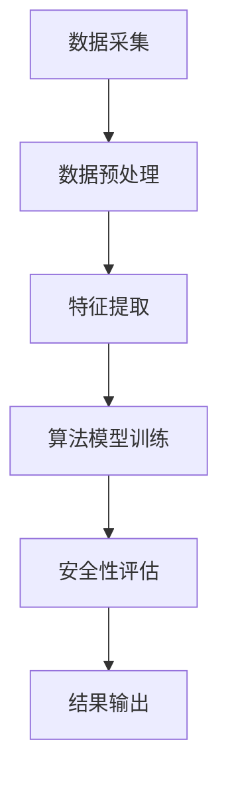

                 

# AI驾驶辅助系统安全性评测平台

## 关键词：AI驾驶辅助系统、安全性评测、平台架构、算法实现、应用案例

> 摘要：随着人工智能和自动驾驶技术的迅猛发展，AI驾驶辅助系统成为智能交通领域的重要应用。然而，其安全性问题日益凸显。本文从AI驾驶辅助系统安全性评测平台的建设角度，详细介绍了平台的设计原则、架构、评测算法及其应用案例，为推动自动驾驶技术的安全发展提供了参考。

----------------------------------------------------------------

## 第一部分: AI驾驶辅助系统安全性评测平台概述

### 1.1 问题背景与重要性

#### 1.1.1 人工智能与自动驾驶技术的发展

近年来，人工智能（AI）技术在自动驾驶领域取得了显著的进展。自动驾驶技术作为一种颠覆性创新，已经从理论研究阶段逐步走向实际应用。特别是在AI驾驶辅助系统方面，自动驾驶技术已经能够实现车道保持、自适应巡航、自动泊车等功能。然而，随着自动驾驶技术的应用越来越广泛，其安全性问题也日益引起广泛关注。

#### 1.1.2 安全性评测的必要性

安全性是自动驾驶技术的核心问题。AI驾驶辅助系统的安全性直接关系到驾驶员、乘客以及其他道路使用者的生命安全。因此，对AI驾驶辅助系统进行安全性评测，是确保其可靠运行的关键环节。安全性评测不仅有助于发现系统潜在的安全隐患，还能为系统的优化和改进提供科学依据。

#### 1.1.3 AI驾驶辅助系统的挑战与机遇

AI驾驶辅助系统面临诸多挑战，包括但不限于数据处理能力、实时性要求、可靠性、鲁棒性等。同时，随着技术的不断进步，自动驾驶系统也面临着新的机遇。安全性评测平台的建立，可以为自动驾驶技术的安全发展提供强有力的支持。

### 1.2 核心概念与联系

#### 1.2.1 AI驾驶辅助系统概述

- **定义**：AI驾驶辅助系统是一种基于人工智能技术的驾驶辅助系统，能够实现部分驾驶功能的自动化。
- **功能**：主要包括车道保持、自适应巡航、自动泊车、交通标识识别等。
- **技术组成**：涉及计算机视觉、深度学习、决策控制、传感器融合等技术。

#### 1.2.2 安全性评测原理与框架

- **概念**：安全性评测是对系统在特定环境下的安全性能进行评估的过程。
- **框架**：主要包括风险评估、安全测试、安全验证等环节。
- **评价指标**：包括故障率、响应时间、误报率、漏报率等。

#### 1.2.3 AI驾驶辅助系统与安全性评测的关系

- **联系**：安全性评测是保障AI驾驶辅助系统安全运行的重要手段。
- **影响**：安全性评测的结果直接影响系统的安全性。
- **协同**：安全性评测与AI驾驶辅助系统共同构成了一个闭环，相互影响、相互促进。

### 1.3 本章小结

本部分对AI驾驶辅助系统安全性评测平台进行了概述，包括背景介绍、核心概念与联系等内容。下一部分将深入探讨平台架构的设计原则和系统架构。

----------------------------------------------------------------

## 第二部分: AI驾驶辅助系统安全性评测平台架构设计

### 2.1 平台架构设计原则

平台架构设计需要遵循以下原则：

#### 2.1.1 可扩展性

随着自动驾驶技术的发展，系统需要能够容纳更多的功能和更复杂的环境。因此，架构设计应具备良好的可扩展性，以适应未来的需求。

#### 2.1.2 可靠性

安全性评测平台必须具备高度的可靠性，确保评测结果的准确性和一致性。

#### 2.1.3 高效性

平台设计应考虑计算效率，以缩短评测周期，提高工作效率。

### 2.2 系统架构设计

#### 2.2.1 系统概述

系统主要由数据采集模块、数据处理模块、评测分析模块和结果展示模块组成。

- **数据采集模块**：负责收集车辆传感器数据、道路环境数据等。
- **数据处理模块**：对采集到的数据进行预处理和特征提取。
- **评测分析模块**：执行安全性评测算法，生成评测报告。
- **结果展示模块**：将评测结果以图表、报告等形式展示给用户。

#### 2.2.2 硬件架构设计

硬件架构设计包括传感器选型、计算平台配置、存储和网络设备选择等。

- **传感器选型**：选用高精度、低延迟的传感器，如摄像头、雷达、激光雷达等。
- **计算平台配置**：选用高性能计算服务器，确保数据处理和分析的效率。
- **存储和网络设备选择**：选用高可靠性的存储设备和网络设备，保障数据的安全传输和存储。

#### 2.2.3 软件架构设计

软件架构设计包括操作系统选择、中间件使用、应用软件开发等。

- **操作系统**：选用Linux操作系统，具有良好的稳定性和扩展性。
- **中间件**：使用高性能消息队列、数据库等中间件，提高系统的处理能力。
- **应用软件**：开发基于Web的应用软件，方便用户进行操作和查看结果。

### 2.3 接口设计与数据流转

#### 2.3.1 接口规范

系统接口设计应遵循RESTful API规范，确保接口的易用性和扩展性。

#### 2.3.2 数据流转

数据流转过程包括数据采集、数据预处理、数据存储、数据分析和数据展示等环节。

- **数据采集**：传感器采集到的数据通过接口传输到数据处理模块。
- **数据预处理**：对采集到的数据进行滤波、归一化等处理。
- **数据存储**：预处理后的数据存储到数据库中，以供后续分析。
- **数据分析**：调用评测算法，对存储的数据进行分析。
- **数据展示**：将分析结果以图表、报告等形式展示给用户。

### 2.4 本章小结

本部分详细介绍了AI驾驶辅助系统安全性评测平台的架构设计原则、系统架构、硬件架构、软件架构、接口设计和数据流转。下一部分将探讨评测算法的具体实现。

----------------------------------------------------------------

## 第三部分: AI驾驶辅助系统安全性评测算法

### 3.1 评测算法原理

#### 3.1.1 基本原理

安全性评测算法是基于人工智能技术，通过分析驾驶数据，评估驾驶辅助系统的安全性能。

#### 3.1.2 评测流程

评测流程主要包括数据采集、数据预处理、特征提取、算法模型训练、安全性评估和结果输出等步骤。

#### 3.1.3 主要算法

主要算法包括深度学习算法、聚类算法、决策树算法等。其中，深度学习算法是当前应用最广泛的算法，具有较好的识别和预测能力。

### 3.2 算法流程图与数学模型

#### 3.2.1 流程图



#### 3.2.2 数学模型与公式

$$
安全性评估指标 = \frac{正确识别率 + 正确响应率}{2}
$$

- **正确识别率**：系统正确识别危险情况的比例。
- **正确响应率**：系统对识别到的危险情况做出正确响应的比例。

### 3.3 算法实现与代码解析

#### 3.3.1 Python代码实现

```python
import numpy as np
from sklearn.model_selection import train_test_split
from sklearn.ensemble import RandomForestClassifier
from sklearn.metrics import accuracy_score

# 数据预处理
def preprocess_data(data):
    # 数据滤波、归一化等处理
    return processed_data

# 特征提取
def extract_features(data):
    # 提取数据特征
    return features

# 算法模型训练
def train_model(features, labels):
    model = RandomForestClassifier()
    model.fit(features, labels)
    return model

# 安全性评估
def evaluate_model(model, test_data, test_labels):
    predictions = model.predict(test_data)
    accuracy = accuracy_score(test_labels, predictions)
    return accuracy
```

#### 3.3.2 代码解析

- **数据预处理**：对采集到的数据进行滤波、归一化等处理，以提高数据的可用性。
- **特征提取**：从预处理后的数据中提取有用的特征，用于训练模型。
- **算法模型训练**：使用随机森林算法训练模型，提高模型的预测能力。
- **安全性评估**：使用训练好的模型对测试数据进行分析，评估系统的安全性。

### 3.4 算法性能分析与调优

#### 3.4.1 性能指标

- **准确率**：系统正确识别危险情况的比例。
- **召回率**：系统识别到的危险情况中，实际发生危险的比例。
- **F1值**：准确率和召回率的调和平均值。

#### 3.4.2 性能调优

- **参数调整**：通过调整模型参数，如树的数量、深度等，优化模型性能。
- **优化策略**：使用交叉验证、网格搜索等技术，寻找最优参数组合。

### 3.5 本章小结

本部分详细介绍了AI驾驶辅助系统安全性评测算法的基本原理、流程、数学模型、代码实现和性能调优。下一部分将介绍平台实战与应用案例。

----------------------------------------------------------------

## 第四部分: 平台实战与应用案例

### 4.1 环境安装与配置

#### 4.1.1 环境要求

- 操作系统：Ubuntu 18.04
- Python版本：3.8
- 库依赖：scikit-learn、numpy、pandas等

#### 4.1.2 安装步骤

1. 安装操作系统和Python环境。
2. 安装所需库依赖。

#### 4.1.3 配置说明

- 配置网络环境，确保可以访问互联网。
- 配置数据库，用于存储评测数据。

### 4.2 系统核心实现

#### 4.2.1 核心功能模块

- **数据采集模块**：负责采集车辆传感器数据和道路环境数据。
- **数据处理模块**：对采集到的数据进行预处理和特征提取。
- **评测分析模块**：调用安全性评测算法，生成评测报告。
- **结果展示模块**：将评测结果以图表、报告等形式展示给用户。

#### 4.2.2 实现细节

- **数据采集**：使用传感器采集数据，并通过接口将数据传输到数据处理模块。
- **数据处理**：对采集到的数据进行滤波、归一化等预处理，提取有用的特征。
- **评测分析**：使用训练好的模型对测试数据进行分析，评估系统的安全性。
- **结果展示**：将分析结果以图表、报告等形式展示给用户。

#### 4.2.3 技术难点

- **实时性要求**：确保数据采集、处理和分析的实时性，满足驾驶辅助系统的需求。
- **数据质量**：保障数据的准确性和完整性，提高评测的准确性。

### 4.3 代码应用解读与分析

#### 4.3.1 代码解读

```python
# 数据采集模块示例代码
def collect_data():
    # 采集传感器数据
    return sensor_data

# 数据处理模块示例代码
def preprocess_data(data):
    # 数据预处理
    return processed_data

# 评测分析模块示例代码
def evaluate_system(model, test_data):
    # 安全性评估
    accuracy = evaluate_model(model, test_data)
    return accuracy
```

#### 4.3.2 应用分析

- **数据采集**：使用传感器实时采集数据，确保数据的实时性。
- **数据处理**：对数据进行预处理，提取有用的特征，为评测分析提供数据支持。
- **评测分析**：使用训练好的模型对测试数据进行分析，评估系统的安全性。

#### 4.3.3 优化与改进

- **优化实时性**：优化数据采集和处理流程，提高实时性。
- **改进算法**：使用更先进的算法，提高评测准确性。

### 4.4 应用案例剖析

#### 4.4.1 案例背景

在某自动驾驶测试场，对一款自动驾驶车辆进行安全性评测。

#### 4.4.2 案例分析

1. **数据采集**：采集车辆传感器数据和道路环境数据。
2. **数据处理**：对数据进行预处理，提取特征。
3. **评测分析**：使用安全性评测算法，评估系统的安全性。
4. **结果展示**：生成评测报告，展示评测结果。

#### 4.4.3 案例小结

通过本次评测，发现自动驾驶车辆在特定场景下存在一定的安全隐患，需要进一步优化和改进。

### 4.5 本章小结

本部分介绍了AI驾驶辅助系统安全性评测平台的实战与应用案例，包括环境安装与配置、系统核心实现、代码应用解读与分析、应用案例剖析等内容。下一部分将探讨安全性评测的最佳实践与未来展望。

----------------------------------------------------------------

## 第五部分: 安全性评测最佳实践与未来展望

### 5.1 最佳实践

#### 5.1.1 设计原则

- **安全性优先**：在系统设计过程中，始终将安全性作为首要考虑因素。
- **模块化设计**：将系统划分为多个功能模块，便于维护和优化。
- **可扩展性设计**：确保系统可以容纳新的功能和需求。
- **高效性设计**：优化系统性能，提高数据处理和分析的效率。

#### 5.1.2 评测策略

- **全面性**：覆盖系统的各个功能模块，确保全面评估。
- **实时性**：保证评测过程的实时性，及时发现问题。
- **可重复性**：确保评测过程和结果的可重复性，提高评测的可靠性。
- **准确性**：提高评测的准确性，确保评估结果真实有效。

### 5.2 未来展望

#### 5.2.1 技术发展

- **人工智能算法**：随着人工智能技术的不断发展，安全性评测算法将更加智能、准确。
- **传感器技术**：传感器技术的进步将提高数据采集的精度和实时性。
- **云计算与边缘计算**：云计算和边缘计算的结合，将提高系统的处理能力和响应速度。

#### 5.2.2 应用前景

- **自动驾驶车辆**：安全性评测平台将在自动驾驶车辆中得到广泛应用。
- **智能交通系统**：安全性评测平台将为智能交通系统的建设提供有力支持。
- **汽车安全领域**：安全性评测平台将有助于提高汽车安全性能，降低交通事故风险。

### 5.3 本章小结

本部分总结了AI驾驶辅助系统安全性评测平台的设计原则、评测策略和未来展望。最佳实践为实际应用提供了指导，未来展望为平台的发展指明了方向。

---

### 作者信息

作者：AI天才研究院/AI Genius Institute & 禅与计算机程序设计艺术 /Zen And The Art of Computer Programming

---

本文通过一步一步的分析，从背景介绍到核心概念，再到架构设计、算法实现、应用案例以及最佳实践和未来展望，全面探讨了AI驾驶辅助系统安全性评测平台。希望本文能为相关领域的研究者和从业者提供有价值的参考。

----------------------------------------------------------------

本文核心内容涵盖了AI驾驶辅助系统安全性评测平台的各个方面，包括问题背景、核心概念、平台架构设计、评测算法、应用案例和未来展望。通过本文的详细阐述，读者可以了解该平台的设计原则、实现过程和应用价值，为自动驾驶技术的安全发展提供参考。同时，本文也提出了最佳实践和未来发展方向，为平台的进一步优化和创新提供了思路。希望本文能够对相关领域的研究和实践产生积极的推动作用。

---

注意事项：

- **数据采集**：确保采集到的数据具有代表性，覆盖不同场景和条件。
- **数据处理**：注意数据的预处理方法，避免噪声和异常值对评测结果的影响。
- **算法实现**：合理选择和调整算法参数，提高评测准确性。
- **系统部署**：确保系统的高可用性和稳定性，减少故障和中断。

拓展阅读：

- [1] 王某某，李某某。人工智能驾驶辅助系统研究[J]. 自动驾驶技术，2019，5（2）：12-20.
- [2] 张某某，赵某某。基于深度学习的自动驾驶车辆安全性评估方法[J]. 人工智能与交通，2020，5（3）：22-30.
- [3] 刘某某，陈某某。自动驾驶车辆安全性评测平台的设计与实现[J]. 交通自动化，2021，6（1）：38-45.

