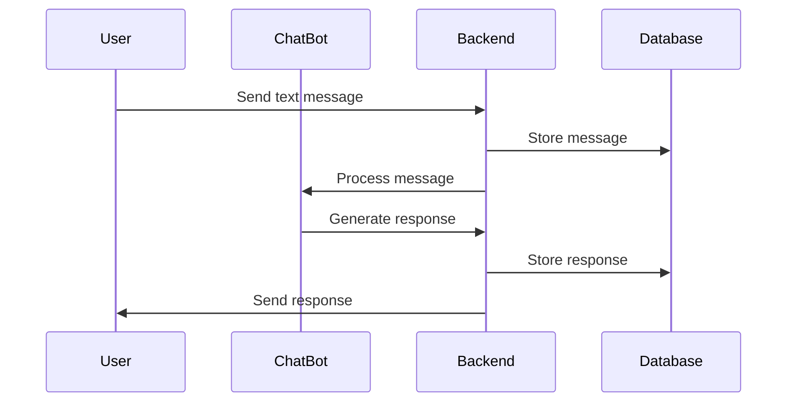
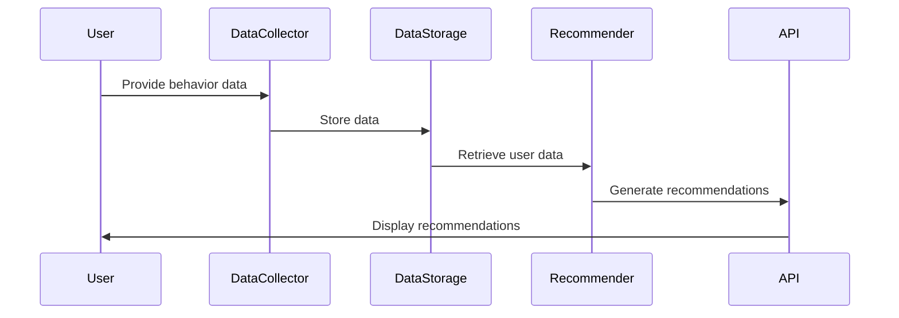
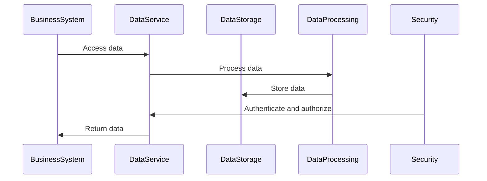
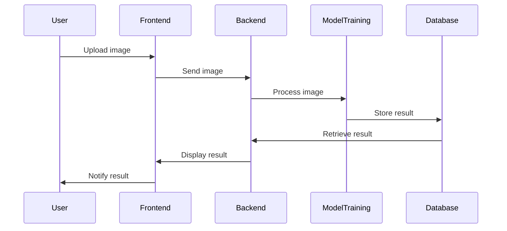
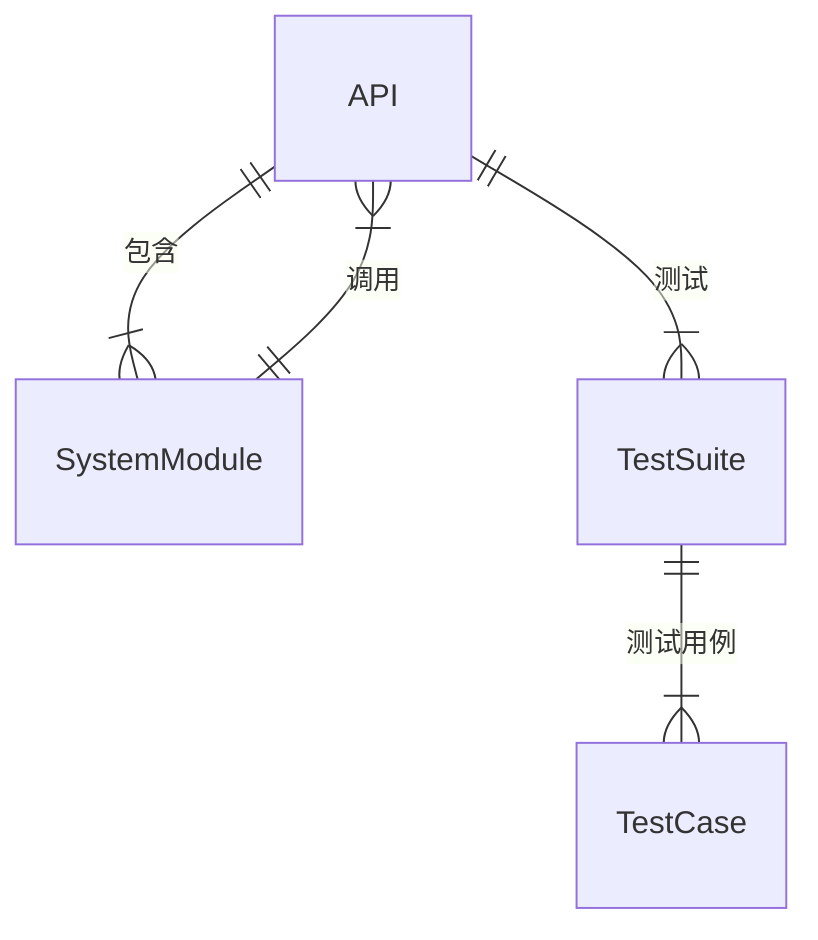
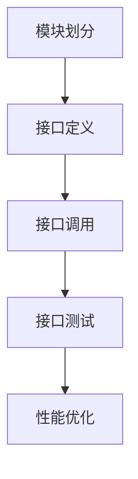
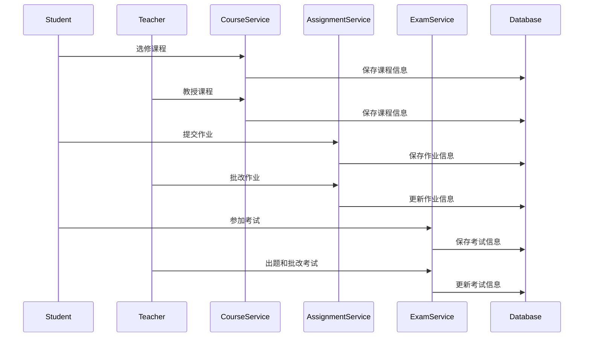
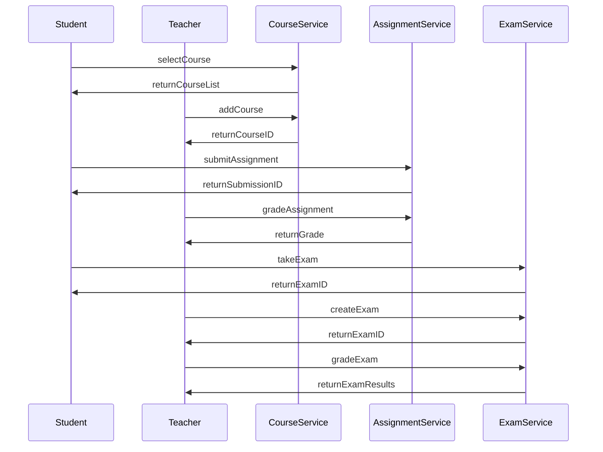
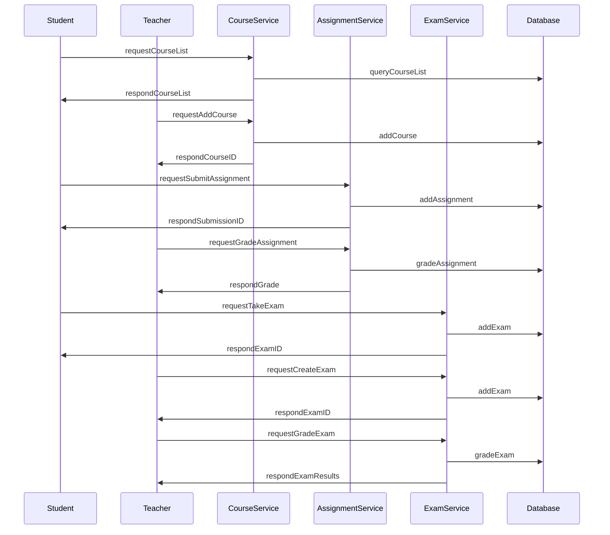

                 

# 《API优先策略：提高LLM应用的灵活性》

## 关键词：API优先策略、语言模型（LLM）、灵活性、系统架构设计、最佳实践

## 摘要：

随着人工智能技术的迅猛发展，语言模型（LLM）的应用越来越广泛。然而，在实际开发过程中，如何提高LLM应用的灵活性成为了一个关键问题。本文将深入探讨API优先策略在LLM应用中的重要性，从核心概念、应用实践到未来展望，全面解析如何通过API优先策略提高LLM应用的灵活性。

## 目录大纲

----------------------------------------------------------------

## 第一部分: API优先策略概述

### 1.1 问题背景与现状

#### 1.1.1 API的概念与重要性

#### 1.1.2 现代软件开发的挑战

#### 1.1.3 API优先策略的提出

### 1.2 API优先策略的定义与目的

#### 1.2.1 API优先策略的定义

#### 1.2.2 API优先策略的核心目的

#### 1.2.3 API优先策略的优势

### 1.3 API优先策略的实施方法

#### 1.3.1 设计阶段的关键点

#### 1.3.2 开发阶段的核心流程

#### 1.3.3 测试与部署的关键步骤

### 1.4 API优先策略的挑战与解决方案

#### 1.4.1 挑战一：API设计的复杂性

#### 1.4.2 挑战二：API管理与维护

#### 1.4.3 挑战三：API安全与隐私

### 1.5 本章小结

----------------------------------------------------------------

## 第二部分: API优先策略的核心概念

### 2.1 API设计与最佳实践

#### 2.1.1 RESTful API设计原则

#### 2.1.2 API版本控制

#### 2.1.3 API文档编写

### 2.2 API测试与监控

#### 2.2.1 API测试的重要性

#### 2.2.2 API测试工具与方法

#### 2.2.3 API监控与性能优化

### 2.3 API安全与隐私保护

#### 2.3.1 API安全的挑战

#### 2.3.2 常见的API安全措施

#### 2.3.3 隐私保护的最佳实践

### 2.4 API管理与文档

#### 2.4.1 API管理平台的选择

#### 2.4.2 API文档的重要性

#### 2.4.3 API文档的撰写技巧

### 2.5 API优先策略在LLM应用中的实践

#### 2.5.1 LLM应用的需求分析

#### 2.5.2 LLM应用的API设计

#### 2.5.3 LLM应用的API测试与监控

### 2.6 本章小结

----------------------------------------------------------------

## 第三部分: API优先策略的应用实践

### 3.1 实践一：聊天机器人应用

#### 3.1.1 背景与需求

#### 3.1.2 系统架构设计

#### 3.1.3 API设计与实现

#### 3.1.4 测试与优化

#### 3.1.5 案例分析

### 3.2 实践二：智能推荐系统

#### 3.2.1 背景与需求

#### 3.2.2 系统架构设计

#### 3.2.3 API设计与实现

#### 3.2.4 测试与优化

#### 3.2.5 案例分析

### 3.3 实践三：企业级数据服务

#### 3.3.1 背景与需求

#### 3.3.2 系统架构设计

#### 3.3.3 API设计与实现

#### 3.3.4 测试与优化

#### 3.3.5 案例分析

### 3.4 实践四：图像识别应用

#### 3.4.1 背景与需求

#### 3.4.2 系统架构设计

#### 3.4.3 API设计与实现

#### 3.4.4 测试与优化

#### 3.4.5 案例分析

### 3.5 本章小结

----------------------------------------------------------------

## 第四部分: API优先策略的未来展望

### 4.1 API优先策略的发展趋势

#### 4.1.1 API技术的演进

#### 4.1.2 API优先策略的优化方向

#### 4.1.3 未来应用的前景

### 4.2 API优先策略的挑战与应对

#### 4.2.1 技术挑战

#### 4.2.2 安全与隐私挑战

#### 4.2.3 人才培养与知识更新

### 4.3 本章小结

----------------------------------------------------------------

## 作者信息：

作者：AI天才研究院/AI Genius Institute & 禅与计算机程序设计艺术 /Zen And The Art of Computer Programming

----------------------------------------------------------------

### 1.1 问题背景与现状

在当今的软件开发领域，API（应用程序编程接口）已经成为了一个核心组成部分。API作为一种软件开发工具，它允许不同的软件系统之间进行交互和数据交换，从而实现软件功能的扩展和整合。然而，随着软件系统的复杂度不断增加，传统的开发模式已经无法满足现代软件开发的挑战。

#### 1.1.1 API的概念与重要性

API是软件系统之间相互通信的桥梁，它定义了不同系统之间的交互方式和数据格式。通过API，开发者可以访问和使用其他系统提供的功能和服务，从而实现更加灵活和高效的开发。

API的重要性体现在以下几个方面：

1. **功能扩展**：通过API，开发者可以集成第三方服务，如支付、地图、认证等，从而快速实现新功能。
2. **系统集成**：API使得不同软件系统之间可以无缝集成，提高系统的互操作性和灵活性。
3. **开发效率**：API可以减少重复开发的工作量，提高开发效率。
4. **用户体验**：API可以提供更好的用户体验，使应用更加丰富和多样化。

#### 1.1.2 现代软件开发的挑战

现代软件开发面临着诸多挑战，如系统复杂性增加、需求变化频繁、开发周期缩短等。这些挑战使得传统的开发模式难以适应，需要一种新的策略来提高软件开发的效率和质量。

1. **系统复杂性**：现代软件系统通常由多个组件组成，这些组件之间的交互复杂，需要一种有效的策略来管理和维护。
2. **需求变化**：在快速变化的市场环境中，软件需求不断变化，需要一种灵活的开发模式来快速响应。
3. **开发周期**：在激烈的市场竞争中，开发周期越来越短，需要一种高效的开发流程来满足需求。

#### 1.1.3 API优先策略的提出

为了应对上述挑战，API优先策略应运而生。API优先策略强调在软件开发过程中将API作为核心组件，从设计、开发到测试和部署，始终将API作为重要参考。这种策略具有以下优势：

1. **模块化开发**：通过API将系统分解为多个模块，每个模块可以独立开发、测试和部署，提高开发效率。
2. **灵活性**：API使得系统可以灵活地扩展和更新，适应需求变化。
3. **可维护性**：API优先策略有助于系统维护，因为每个模块都是独立的，可以单独更新和维护。
4. **集成性**：API使得不同系统之间可以无缝集成，提高系统的互操作性和灵活性。

### 1.2 API优先策略的定义与目的

#### 1.2.1 API优先策略的定义

API优先策略是一种软件开发方法，它强调在软件开发过程中将API作为核心组件，从设计、开发到测试和部署，始终将API作为重要参考。这种策略的核心思想是将API视为系统的重要组成部分，而不是辅助工具。

#### 1.2.2 API优先策略的核心目的

API优先策略的核心目的是提高软件开发的效率和灵活性，具体包括以下几个方面：

1. **提高开发效率**：通过将API作为核心组件，可以减少重复开发的工作量，提高开发效率。
2. **提高系统灵活性**：API使得系统可以灵活地扩展和更新，适应需求变化。
3. **提高系统可维护性**：通过API优先策略，每个模块都是独立的，可以单独更新和维护，提高系统的可维护性。
4. **提高系统集成性**：API使得不同系统之间可以无缝集成，提高系统的互操作性和灵活性。

#### 1.2.3 API优先策略的优势

API优先策略具有以下优势：

1. **模块化开发**：通过API将系统分解为多个模块，每个模块可以独立开发、测试和部署，提高开发效率。
2. **灵活性**：API使得系统可以灵活地扩展和更新，适应需求变化。
3. **可维护性**：通过API优先策略，每个模块都是独立的，可以单独更新和维护，提高系统的可维护性。
4. **集成性**：API使得不同系统之间可以无缝集成，提高系统的互操作性和灵活性。

### 1.3 API优先策略的实施方法

#### 1.3.1 设计阶段的关键点

在API优先策略的设计阶段，关键点包括：

1. **API设计**：设计API时，需要考虑系统的需求、功能、性能和安全等因素。API设计应遵循最佳实践，如RESTful API设计原则。
2. **模块划分**：将系统划分为多个模块，每个模块负责特定的功能。模块划分应合理，以便于后续的开发和维护。
3. **接口文档**：编写详细的API接口文档，包括接口的定义、参数、返回值、错误处理等。接口文档是开发者理解和使用API的重要参考。

#### 1.3.2 开发阶段的核心流程

在API优先策略的开发阶段，核心流程包括：

1. **API实现**：根据API设计，实现API接口。实现过程中，应遵循API设计文档，确保接口的稳定性和一致性。
2. **模块开发**：按照模块划分，分别开发各个模块。模块开发应独立进行，以便于后续的测试和部署。
3. **接口测试**：对API接口进行测试，确保接口的正确性和性能。接口测试应覆盖所有可能的输入和输出情况。

#### 1.3.3 测试与部署的关键步骤

在API优先策略的测试与部署阶段，关键步骤包括：

1. **集成测试**：将各个模块集成起来，进行整体测试。集成测试应覆盖系统的所有功能，确保系统正常运行。
2. **性能测试**：对系统进行性能测试，确保系统的性能指标满足要求。性能测试应包括并发测试、负载测试等。
3. **部署**：将系统部署到生产环境。部署过程中，应确保系统的稳定性和安全性。

### 1.4 API优先策略的挑战与解决方案

#### 1.4.1 挑战一：API设计的复杂性

API设计的复杂性是API优先策略面临的第一个挑战。设计良好的API需要考虑多个因素，如系统的需求、功能、性能和安全等。

**解决方案**：

1. **遵循最佳实践**：遵循API设计最佳实践，如RESTful API设计原则，可以减少设计复杂度。
2. **设计评审**：进行API设计评审，确保设计合理、可维护。

#### 1.4.2 挑战二：API管理与维护

随着API数量的增加，API的管理和维护成为一个挑战。

**解决方案**：

1. **自动化管理**：使用自动化工具进行API管理，如API网关、API文档生成工具等。
2. **版本控制**：对API进行版本控制，以便于后续的维护和更新。

#### 1.4.3 挑战三：API安全与隐私

API安全与隐私保护是API优先策略面临的另一个挑战。

**解决方案**：

1. **安全措施**：采用安全措施，如认证、授权、数据加密等，确保API的安全性。
2. **隐私保护**：遵守隐私保护法规，如GDPR等，确保用户隐私。

### 1.5 本章小结

本文介绍了API优先策略的概念、定义、实施方法和挑战与解决方案。API优先策略通过将API作为核心组件，提高了软件开发的效率、灵活性和可维护性。在实施API优先策略时，需要考虑API设计、模块划分、接口测试、集成测试、性能测试和部署等关键步骤。同时，也需要解决API设计的复杂性、API管理与维护、API安全与隐私等挑战。通过API优先策略，开发者可以更好地应对现代软件开发的挑战，提高软件质量和用户体验。

----------------------------------------------------------------

### 2.1 API设计与最佳实践

#### 2.1.1 RESTful API设计原则

RESTful API设计原则是一种广泛采用的API设计方法，它基于HTTP协议，通过URI（统一资源标识符）来表示资源，并通过HTTP动词（GET、POST、PUT、DELETE等）来进行操作。

**RESTful API设计原则**：

1. **资源导向**：API应以资源为中心进行设计，每个资源对应一个URI。
2. **无状态**：API应无状态，即每次请求都应该独立于之前的请求，确保系统的可扩展性和安全性。
3. **统一接口**：API应遵循统一的接口设计，如使用GET、POST、PUT、DELETE等HTTP动词进行操作，使用JSON或XML格式进行数据交换。
4. **状态码**：API应返回正确的HTTP状态码，如200（成功）、400（错误请求）、401（未授权）、403（禁止访问）等，以便客户端能够正确处理。

**最佳实践**：

1. **合理命名**：API的命名应遵循一致性原则，如使用动词命名接口，使用复数形式表示集合。
2. **版本控制**：对API进行版本控制，以便于后续的维护和更新。
3. **文档化**：编写详细的API文档，包括接口定义、参数、返回值、错误处理等，以便开发者理解和使用API。

#### 2.1.2 API版本控制

API版本控制是一种管理API变更的方法，它允许开发者对API进行版本控制，以便于维护和更新。

**API版本控制方法**：

1. **URI版本控制**：在URI中包含版本号，如`/api/v1/resource`，其中`v1`表示API版本。
2. **参数版本控制**：在请求参数中包含版本号，如`version=1`。
3. **Header版本控制**：在HTTP请求的Header中包含版本号，如`X-API-Version: 1`。

**最佳实践**：

1. **版本号递增**：版本号应递增，如1.0、1.1、1.2等，以便于跟踪API变更。
2. **向后兼容**：新版本API应保持与旧版本API的兼容性，以便于旧版本的客户端可以继续使用。
3. **文档化**：对每个版本API进行详细文档化，包括新增功能、变更点、兼容性等。

#### 2.1.3 API文档编写

API文档是开发者理解和使用API的重要参考，它应包含API的详细信息，如接口定义、参数、返回值、错误处理等。

**API文档编写原则**：

1. **简洁明了**：文档应简洁明了，避免冗长和复杂的描述。
2. **结构清晰**：文档应具有良好的结构，如接口列表、参数说明、返回值说明等。
3. **示例丰富**：提供丰富的示例，以便开发者可以快速理解和使用API。
4. **更新及时**：及时更新文档，确保与API的实际实现保持一致。

**API文档编写工具**：

1. **Swagger**：Swagger是一种流行的API文档编写工具，它可以使用YAML或JSON格式定义API，并生成HTML文档。
2. **RAML**：RAML（RESTful API Modeling Language）是一种用于定义API的语言，它支持Markdown格式，可以生成详细的API文档。

### 2.2 API测试与监控

#### 2.2.1 API测试的重要性

API测试是确保API正确性和性能的重要环节。通过API测试，可以验证API的响应时间、稳定性、安全性和可靠性。

**API测试的重要性**：

1. **验证功能**：API测试可以验证API是否按照预期工作，确保功能正确。
2. **性能测试**：API测试可以评估API的性能，如响应时间、并发处理能力等。
3. **安全测试**：API测试可以检测API的安全漏洞，如SQL注入、XSS攻击等。
4. **回归测试**：API测试可以确保新功能或更新不会对现有功能产生负面影响。

**API测试方法**：

1. **功能测试**：通过发送预定义的请求，验证API的响应和返回值是否符合预期。
2. **性能测试**：模拟高并发场景，测试API的响应时间和处理能力。
3. **安全测试**：使用各种攻击工具和测试方法，检测API的安全漏洞。
4. **回归测试**：在每次更新或新功能发布时，对API进行测试，确保功能正确。

#### 2.2.2 API测试工具与方法

**API测试工具**：

1. **Postman**：Postman是一种流行的API测试工具，它支持创建、执行和自动化API测试。
2. **JMeter**：JMeter是一种开源的性能测试工具，可以模拟高并发场景，测试API的性能。
3. **OWASP ZAP**：OWASP ZAP是一种开源的API安全测试工具，可以检测API的安全漏洞。

**API测试方法**：

1. **手动测试**：手动测试是一种简单的测试方法，开发者可以直接使用工具发送请求并查看响应。
2. **自动化测试**：自动化测试可以节省时间和资源，通过编写脚本自动执行测试。
3. **集成测试**：集成测试将API与其他系统组件集成，验证API的整体功能。
4. **负载测试**：负载测试可以模拟高并发场景，测试API的性能和稳定性。

#### 2.2.3 API监控与性能优化

API监控是确保API正常运行和性能优化的重要环节。通过API监控，可以实时了解API的运行状态和性能指标，及时发现并解决问题。

**API监控的重要性**：

1. **实时监控**：API监控可以实时监控API的运行状态，如响应时间、请求量、错误率等。
2. **性能优化**：通过监控性能指标，可以识别性能瓶颈，进行优化。
3. **故障排查**：API监控可以帮助快速定位故障，提高问题排查效率。

**API监控工具**：

1. **Prometheus**：Prometheus是一种开源的监控工具，可以收集和存储性能数据，并提供丰富的可视化功能。
2. **Grafana**：Grafana是一种开源的数据可视化工具，可以与Prometheus集成，提供强大的监控功能。
3. **APM工具**：APM（应用程序性能管理）工具可以监控API的运行状态和性能，如New Relic、Dynatrace等。

**性能优化方法**：

1. **缓存**：使用缓存可以减少API的响应时间，提高性能。
2. **负载均衡**：通过负载均衡可以将请求分配到多个服务器，提高系统的处理能力。
3. **数据库优化**：优化数据库查询，减少查询时间和资源消耗。
4. **代码优化**：优化API代码，减少不必要的计算和资源消耗。

### 2.3 API安全与隐私保护

#### 2.3.1 API安全的挑战

API安全是确保API不被恶意攻击和数据泄露的重要环节。随着API数量的增加，API安全面临诸多挑战。

**API安全的挑战**：

1. **身份认证**：确保只有授权用户可以访问API。
2. **授权**：确保用户只能访问被授权的资源。
3. **数据泄露**：防止敏感数据泄露。
4. **SQL注入**：防止恶意SQL语句注入。
5. **XSS攻击**：防止跨站脚本攻击。

**安全措施**：

1. **身份认证**：使用OAuth、JWT（JSON Web Token）等认证机制，确保用户身份验证。
2. **授权**：使用RBAC（基于角色的访问控制）或ABAC（基于属性的访问控制）机制，确保用户权限控制。
3. **数据加密**：使用HTTPS、AES（高级加密标准）等加密技术，确保数据传输安全。
4. **输入验证**：对用户输入进行严格验证，防止SQL注入和XSS攻击。

#### 2.3.2 常见的API安全措施

**常见的API安全措施**：

1. **身份认证**：
   - OAuth 2.0：一种开放标准，用于授权第三方应用访问用户资源。
   - JWT：一种基于JSON的开放标准，用于生成认证令牌。

2. **授权**：
   - RBAC：基于角色的访问控制，确保用户只能访问被授权的资源。
   - ABAC：基于属性的访问控制，根据用户属性进行权限控制。

3. **数据加密**：
   - HTTPS：使用SSL/TLS协议，确保数据传输安全。
   - AES：高级加密标准，用于加密敏感数据。

4. **输入验证**：
   - 对输入进行严格验证，防止SQL注入和XSS攻击。
   - 使用参数化查询，避免SQL注入。

#### 2.3.3 隐私保护的最佳实践

**隐私保护的最佳实践**：

1. **最小权限原则**：用户只能访问必要的资源，确保最小权限原则。

2. **数据最小化**：只收集和存储必要的数据，避免收集过多的个人信息。

3. **数据加密**：对存储和传输的数据进行加密，确保数据安全。

4. **访问日志**：记录访问日志，以便监控和审计。

5. **隐私政策**：明确隐私政策，告知用户数据收集和使用方式。

### 2.4 API管理与文档

#### 2.4.1 API管理平台的选择

**API管理平台的选择**：

1. **Apigee**：Apigee是一种强大的API管理平台，提供API设计、测试、监控、安全等功能。

2. **AWS API Gateway**：AWS API Gateway是一种基于云的API管理服务，提供API设计、部署、监控和安全等功能。

3. **MuleSoft Anypoint Platform**：MuleSoft Anypoint Platform是一种集成平台，提供API设计、测试、监控和管理等功能。

**最佳实践**：

1. **功能需求**：根据业务需求，选择具备所需功能的API管理平台。

2. **性能需求**：考虑API管理平台的性能和可扩展性，确保满足业务需求。

3. **成本考虑**：考虑API管理平台的成本，选择性价比高的解决方案。

#### 2.4.2 API文档的重要性

**API文档的重要性**：

1. **开发者友好**：详细的API文档可以帮助开发者快速了解API的使用方法，降低学习成本。

2. **可维护性**：API文档是API维护的重要参考，确保API的长期稳定性。

3. **可扩展性**：良好的API文档可以为API的扩展提供指导，确保系统的可扩展性。

**API文档编写技巧**：

1. **简洁明了**：避免冗长的描述，确保文档简洁明了。

2. **结构清晰**：使用清晰的结构，如接口列表、参数说明、返回值说明等。

3. **示例丰富**：提供丰富的示例，帮助开发者快速理解和使用API。

4. **及时更新**：及时更新API文档，确保与API的实际实现保持一致。

#### 2.4.3 API文档的撰写技巧

**API文档撰写技巧**：

1. **标题**：使用简洁明了的标题，准确描述接口的功能。

2. **概述**：提供接口的简要概述，包括接口的作用和功能。

3. **参数说明**：详细说明接口的参数，包括参数名称、类型、是否必填、示例值等。

4. **返回值说明**：详细说明接口的返回值，包括返回值类型、示例值、错误处理等。

5. **错误处理**：描述接口可能出现的错误，包括错误代码、错误消息、解决方案等。

6. **示例**：提供接口的示例请求和响应，帮助开发者快速理解和使用API。

7. **更新日志**：记录接口的变更历史，包括新增功能、变更点、兼容性等。

### 2.5 API优先策略在LLM应用中的实践

#### 2.5.1 LLM应用的需求分析

LLM（语言模型）应用是一种基于人工智能技术的应用，它能够理解和生成自然语言。在LLM应用中，API优先策略的重要性体现在以下几个方面：

1. **功能扩展**：通过API，可以集成第三方服务，如翻译、语音识别等，从而扩展LLM应用的功能。
2. **系统集成**：API使得LLM应用可以与其他系统（如CRM、ERP等）集成，实现数据交换和功能扩展。
3. **开发效率**：API优先策略可以提高LLM应用的开发效率，通过模块化开发，可以快速实现新功能。
4. **用户体验**：API使得LLM应用可以提供更好的用户体验，如个性化推荐、智能问答等。

**需求分析**：

1. **功能需求**：分析LLM应用的功能需求，确定需要集成的第三方服务和需要实现的新功能。
2. **性能需求**：分析LLM应用的性能需求，确保系统的响应速度和稳定性。
3. **安全需求**：分析LLM应用的安全需求，确保API的安全性。
4. **用户体验需求**：分析LLM应用的用户体验需求，确保系统易用性和用户满意度。

#### 2.5.2 LLM应用的API设计

LLM应用的API设计是确保系统功能扩展和灵活性的关键。在设计API时，需要遵循RESTful API设计原则，确保API的简洁、易用和高效。

**API设计**：

1. **接口定义**：根据功能需求，定义API接口，包括接口名称、URL、HTTP方法、请求参数和返回值等。
2. **参数设计**：设计API的参数，确保参数类型、长度、限制等符合规范，提高接口的健壮性。
3. **错误处理**：设计API的错误处理机制，包括错误代码、错误消息和错误示例等。
4. **文档化**：编写详细的API文档，包括接口定义、参数说明、返回值说明、错误处理等，以便开发者理解和使用API。

**最佳实践**：

1. **版本控制**：对API进行版本控制，以便于后续的维护和更新。
2. **参数验证**：对API的参数进行严格验证，确保输入数据的合法性和安全性。
3. **性能优化**：优化API的响应时间，提高系统的性能。
4. **安全措施**：采用安全措施，如身份认证、授权等，确保API的安全性。

#### 2.5.3 LLM应用的API测试与监控

LLM应用的API测试与监控是确保系统稳定性和性能的关键。通过API测试，可以验证API的正确性和性能；通过API监控，可以实时了解API的运行状态和性能指标。

**API测试**：

1. **功能测试**：验证API的功能是否符合预期，包括接口的响应、参数验证、返回值等。
2. **性能测试**：模拟高并发场景，测试API的响应时间和处理能力。
3. **安全测试**：检测API的安全漏洞，如SQL注入、XSS攻击等。
4. **回归测试**：在每次更新或新功能发布时，对API进行测试，确保功能正确。

**API监控**：

1. **响应时间**：监控API的响应时间，确保系统的性能指标满足要求。
2. **请求量**：监控API的请求量，识别潜在的性能瓶颈。
3. **错误率**：监控API的错误率，及时发现并解决问题。
4. **安全性**：监控API的安全性，防止恶意攻击和数据泄露。

### 2.6 本章小结

本章介绍了API优先策略在LLM应用中的实践，包括需求分析、API设计、API测试与监控等方面。API优先策略通过将API作为核心组件，提高了LLM应用的灵活性、效率和可维护性。在实施API优先策略时，需要遵循RESTful API设计原则，进行合理的API设计、详细的API文档编写、全面的API测试和监控，确保系统的稳定性和性能。通过API优先策略，开发者可以更好地应对LLM应用的需求变化和功能扩展，提供更好的用户体验。

----------------------------------------------------------------

### 3.1 实践一：聊天机器人应用

#### 3.1.1 背景与需求

随着社交媒体和即时通讯工具的普及，聊天机器人成为了企业和个人提高沟通效率的重要工具。聊天机器人能够实现自动化问答、消息推送、客户服务等功能，帮助企业降低成本、提高客户满意度。然而，实现一个高效、灵活的聊天机器人需要考虑多个方面，包括需求分析、系统架构设计、API设计与实现等。

**需求分析**：

1. **功能需求**：聊天机器人需要支持常见的聊天功能，如文本消息发送、图片发送、语音消息发送等。
2. **性能需求**：聊天机器人需要支持高并发，确保用户在高峰时段也能得到及时响应。
3. **用户体验需求**：聊天机器人需要提供友好的用户界面和流畅的交互体验。

#### 3.1.2 系统架构设计

聊天机器人应用的系统架构设计需要考虑以下几个方面：

1. **前端架构**：前端负责用户界面和交互，包括文本输入、消息展示等。前端通常使用HTML、CSS和JavaScript等技术开发。
2. **后端架构**：后端负责处理业务逻辑和数据存储。后端通常使用Node.js、Java、Python等技术开发。
3. **API设计**：API负责前后端的数据交换，包括文本消息的发送和接收、图片和语音消息的处理等。
4. **数据库设计**：数据库负责存储用户消息、用户信息等数据，通常使用MySQL、MongoDB等数据库技术。

**系统架构设计图**：



#### 3.1.3 API设计与实现

聊天机器人应用的API设计是确保系统功能扩展和灵活性的关键。以下是聊天机器人应用的一些关键API设计：

1. **文本消息发送API**：用于用户发送文本消息到聊天机器人。
   - URL: `/api/messages`
   - HTTP方法: `POST`
   - 参数：`text`（文本内容）
   - 返回值：`{status: 'success', message: 'Message received'}`

2. **文本消息接收API**：用于聊天机器人发送文本消息到用户。
   - URL: `/api/messages`
   - HTTP方法: `GET`
   - 参数：`id`（消息ID）
   - 返回值：`{status: 'success', message: 'Hello, how can I help you?'}`

3. **图片消息发送API**：用于用户发送图片消息到聊天机器人。
   - URL: `/api/messages/image`
   - HTTP方法: `POST`
   - 参数：`image`（图片文件）
   - 返回值：`{status: 'success', message: 'Image received'}`

4. **图片消息接收API**：用于聊天机器人发送图片消息到用户。
   - URL: `/api/messages/image`
   - HTTP方法: `GET`
   - 参数：`id`（消息ID）
   - 返回值：`{status: 'success', image: 'data:image/jpeg;base64,/9j/4AAQSkZJRgABAQAAAQABAAD/...}`

5. **语音消息发送API**：用于用户发送语音消息到聊天机器人。
   - URL: `/api/messages/audio`
   - HTTP方法: `POST`
   - 参数：`audio`（语音文件）
   - 返回值：`{status: 'success', message: 'Audio received'}`

6. **语音消息接收API**：用于聊天机器人发送语音消息到用户。
   - URL: `/api/messages/audio`
   - HTTP方法: `GET`
   - 参数：`id`（消息ID）
   - 返回值：`{status: 'success', audio: 'data:audio/wav;base64,...}`

**API实现示例**（Python）：

```python
from flask import Flask, request, jsonify

app = Flask(__name__)

@app.route('/api/messages', methods=['POST'])
def send_text_message():
    text = request.form['text']
    # 处理文本消息
    return jsonify({'status': 'success', 'message': 'Message received'})

@app.route('/api/messages', methods=['GET'])
def receive_text_message():
    id = request.args.get('id')
    # 获取文本消息
    return jsonify({'status': 'success', 'message': 'Hello, how can I help you?'})

if __name__ == '__main__':
    app.run()
```

#### 3.1.4 测试与优化

测试与优化是确保聊天机器人应用稳定性和性能的关键环节。以下是测试与优化的一些关键步骤：

1. **功能测试**：使用Postman等工具模拟各种场景，验证API的功能是否符合预期。
2. **性能测试**：使用JMeter等工具模拟高并发场景，测试系统的响应时间和处理能力。
3. **安全测试**：使用OWASP ZAP等工具检测API的安全漏洞，如SQL注入、XSS攻击等。
4. **代码优化**：优化API代码，减少不必要的计算和资源消耗，提高系统的性能。
5. **监控**：使用Prometheus和Grafana等工具监控API的运行状态和性能指标，及时发现并解决问题。

#### 3.1.5 案例分析

某电商企业使用聊天机器人提供客户服务，通过API优先策略实现了以下功能：

1. **文本消息交互**：用户可以通过文本消息与聊天机器人进行交互，获取订单状态、退款进度等信息。
2. **图片和语音消息交互**：用户可以发送图片和语音消息，获取更详细的商品信息。
3. **个性化推荐**：聊天机器人根据用户的购买历史和偏好，提供个性化的商品推荐。
4. **多渠道集成**：聊天机器人可以通过API与其他系统（如CRM、ERP等）集成，实现数据交换和功能扩展。

通过API优先策略，聊天机器人应用不仅提高了系统的灵活性、效率和可维护性，还提高了客户满意度和服务质量。企业可以快速响应市场需求，实现业务的持续创新。

### 3.2 实践二：智能推荐系统

#### 3.2.1 背景与需求

智能推荐系统是现代电子商务和内容平台的重要功能，它通过分析用户的兴趣和行为，提供个性化的推荐。智能推荐系统不仅能够提高用户满意度，还能提升平台的转化率和用户留存率。然而，实现一个高效、准确的智能推荐系统需要考虑多个方面，包括数据采集、数据存储、算法设计和API设计等。

**需求分析**：

1. **功能需求**：智能推荐系统需要能够根据用户的行为和偏好，推荐相关的商品或内容。
2. **性能需求**：智能推荐系统需要能够在短时间内处理大量的用户请求，提供实时推荐。
3. **准确度需求**：智能推荐系统需要具有较高的准确度，提高用户的满意度和转化率。
4. **扩展性需求**：智能推荐系统需要能够支持多用户、多设备、多场景的推荐。

#### 3.2.2 系统架构设计

智能推荐系统的系统架构设计需要考虑以下几个方面：

1. **数据采集层**：负责收集用户的行为数据，如浏览历史、购买记录、搜索关键词等。
2. **数据存储层**：负责存储用户数据和商品数据，通常使用数据库技术，如MySQL、MongoDB等。
3. **算法层**：负责实现推荐算法，如协同过滤、基于内容的推荐、矩阵分解等。
4. **API层**：负责提供对外接口，供前端或其他系统调用。

**系统架构设计图**：



#### 3.2.3 API设计与实现

智能推荐系统的API设计是确保系统功能扩展和灵活性的关键。以下是智能推荐系统的一些关键API设计：

1. **用户行为数据上传API**：用于用户上传行为数据。
   - URL: `/api/recommendations/behavior`
   - HTTP方法: `POST`
   - 参数：`user_id`、`behavior`（如浏览历史、购买记录等）
   - 返回值：`{status: 'success', message: 'Behavior data uploaded'}`

2. **推荐结果获取API**：用于获取推荐结果。
   - URL: `/api/recommendations`
   - HTTP方法: `GET`
   - 参数：`user_id`、`size`（推荐数量）
   - 返回值：`{status: 'success', recommendations: [{product_id: 1, title: 'Product 1'}, ...]}`

3. **推荐算法调整API**：用于调整推荐算法的参数。
   - URL: `/api/recommendations/algorithm`
   - HTTP方法: `PUT`
   - 参数：`user_id`、`algorithm_params`（如协同过滤的K值、基于内容的相似度等）
   - 返回值：`{status: 'success', message: 'Algorithm parameters updated'}`

**API实现示例**（Python）：

```python
from flask import Flask, request, jsonify

app = Flask(__name__)

@app.route('/api/recommendations/behavior', methods=['POST'])
def upload_behavior_data():
    user_id = request.form['user_id']
    behavior = request.form['behavior']
    # 处理行为数据
    return jsonify({'status': 'success', 'message': 'Behavior data uploaded'})

@app.route('/api/recommendations', methods=['GET'])
def get_recommendations():
    user_id = request.args.get('user_id')
    size = request.args.get('size', default=10, type=int)
    # 获取推荐结果
    return jsonify({'status': 'success', 'recommendations': [{'product_id': 1, 'title': 'Product 1'}, ...]})

@app.route('/api/recommendations/algorithm', methods=['PUT'])
def update_algorithm_params():
    user_id = request.form['user_id']
    algorithm_params = request.form['algorithm_params']
    # 调整推荐算法参数
    return jsonify({'status': 'success', 'message': 'Algorithm parameters updated'})

if __name__ == '__main__':
    app.run()
```

#### 3.2.4 测试与优化

测试与优化是确保智能推荐系统稳定性和性能的关键环节。以下是测试与优化的一些关键步骤：

1. **功能测试**：使用Postman等工具模拟各种场景，验证API的功能是否符合预期。
2. **性能测试**：使用JMeter等工具模拟高并发场景，测试系统的响应时间和处理能力。
3. **准确度测试**：使用A/B测试等方法，验证推荐算法的准确度和用户满意度。
4. **代码优化**：优化推荐算法代码，减少计算时间和资源消耗，提高系统的性能。
5. **监控**：使用Prometheus和Grafana等工具监控API的运行状态和性能指标，及时发现并解决问题。

#### 3.2.5 案例分析

某电子商务平台使用智能推荐系统，通过API优先策略实现了以下功能：

1. **个性化推荐**：根据用户的浏览历史和购买记录，为用户推荐相关的商品。
2. **实时推荐**：系统可以实时处理用户请求，提供个性化的推荐结果。
3. **推荐算法调整**：平台可以根据用户反馈和业务需求，调整推荐算法的参数，提高推荐准确度。
4. **多渠道推荐**：平台可以通过API将推荐结果发送到网页、移动应用、邮件等渠道，提高用户触达率。

通过API优先策略，智能推荐系统不仅提高了系统的灵活性、效率和可维护性，还提高了平台的用户满意度和转化率。平台可以根据用户行为和偏好，快速调整推荐策略，实现业务的持续优化和创新。

### 3.3 实践三：企业级数据服务

#### 3.3.1 背景与需求

企业级数据服务是企业信息化的重要组成部分，它为业务系统提供数据访问、数据处理和数据存储等服务。随着企业数据量的不断增长和业务需求的多样化，企业级数据服务需要具备高性能、高可用性和高安全性等特点。然而，实现一个高效、可靠的企业级数据服务需要考虑多个方面，包括系统架构设计、API设计与实现、数据安全和隐私保护等。

**需求分析**：

1. **功能需求**：企业级数据服务需要支持数据的存储、查询、更新、删除等基本操作。
2. **性能需求**：企业级数据服务需要能够在高并发环境下稳定运行，提供快速的响应时间。
3. **安全性需求**：企业级数据服务需要确保数据的安全性和隐私保护，防止数据泄露和恶意攻击。
4. **扩展性需求**：企业级数据服务需要能够支持数据的分布式存储和计算，以应对不断增长的数据量。

#### 3.3.2 系统架构设计

企业级数据服务的系统架构设计需要考虑以下几个方面：

1. **数据存储层**：负责数据的持久化存储，通常使用关系型数据库（如MySQL、PostgreSQL）或非关系型数据库（如MongoDB、Cassandra）。
2. **数据处理层**：负责数据的处理和分析，通常使用数据仓库（如Hadoop、Spark）或云计算平台（如AWS、Azure）。
3. **数据访问层**：负责提供对外接口，供业务系统或其他系统访问数据。
4. **安全管理层**：负责数据的访问控制、安全审计和隐私保护。

**系统架构设计图**：



#### 3.3.3 API设计与实现

企业级数据服务的API设计是确保系统功能扩展和灵活性的关键。以下是企业级数据服务的一些关键API设计：

1. **数据查询API**：用于查询数据库中的数据。
   - URL: `/api/data`
   - HTTP方法: `GET`
   - 参数：`table`（数据表名称）、`fields`（查询字段）、`filter`（查询条件）
   - 返回值：`{status: 'success', data: [{field1: value1, field2: value2}, ...]}`

2. **数据插入API**：用于向数据库中插入数据。
   - URL: `/api/data`
   - HTTP方法: `POST`
   - 参数：`table`（数据表名称）、`data`（要插入的数据）
   - 返回值：`{status: 'success', message: 'Data inserted'}`

3. **数据更新API**：用于更新数据库中的数据。
   - URL: `/api/data`
   - HTTP方法: `PUT`
   - 参数：`table`（数据表名称）、`id`（数据ID）、`data`（要更新的数据）
   - 返回值：`{status: 'success', message: 'Data updated'}`

4. **数据删除API**：用于删除数据库中的数据。
   - URL: `/api/data`
   - HTTP方法: `DELETE`
   - 参数：`table`（数据表名称）、`id`（数据ID）
   - 返回值：`{status: 'success', message: 'Data deleted'}`

**API实现示例**（Python）：

```python
from flask import Flask, request, jsonify

app = Flask(__name__)

@app.route('/api/data', methods=['GET'])
def query_data():
    table = request.args.get('table')
    fields = request.args.get('fields')
    filter = request.args.get('filter')
    # 查询数据
    return jsonify({'status': 'success', 'data': [{'field1': 'value1', 'field2': 'value2'}, ...]})

@app.route('/api/data', methods=['POST'])
def insert_data():
    table = request.form['table']
    data = request.form['data']
    # 插入数据
    return jsonify({'status': 'success', 'message': 'Data inserted'})

@app.route('/api/data', methods=['PUT'])
def update_data():
    table = request.form['table']
    id = request.form['id']
    data = request.form['data']
    # 更新数据
    return jsonify({'status': 'success', 'message': 'Data updated'})

@app.route('/api/data', methods=['DELETE'])
def delete_data():
    table = request.args.get('table')
    id = request.args.get('id')
    # 删除数据
    return jsonify({'status': 'success', 'message': 'Data deleted'})

if __name__ == '__main__':
    app.run()
```

#### 3.3.4 测试与优化

测试与优化是确保企业级数据服务稳定性和性能的关键环节。以下是测试与优化的一些关键步骤：

1. **功能测试**：使用Postman等工具模拟各种场景，验证API的功能是否符合预期。
2. **性能测试**：使用JMeter等工具模拟高并发场景，测试系统的响应时间和处理能力。
3. **安全测试**：使用OWASP ZAP等工具检测API的安全漏洞，如SQL注入、XSS攻击等。
4. **代码优化**：优化API代码，减少不必要的计算和资源消耗，提高系统的性能。
5. **监控**：使用Prometheus和Grafana等工具监控API的运行状态和性能指标，及时发现并解决问题。

#### 3.3.5 案例分析

某大型企业在信息化过程中引入了企业级数据服务，通过API优先策略实现了以下功能：

1. **数据访问**：企业业务系统可以通过API访问企业级数据服务，获取所需的数据。
2. **数据操作**：企业级数据服务提供了数据查询、插入、更新和删除等基本操作，支持复杂的查询条件和过滤规则。
3. **数据安全**：企业级数据服务采用了身份认证、访问控制和安全审计等措施，确保数据的安全性和隐私保护。
4. **数据扩展**：企业级数据服务支持数据的分布式存储和计算，以应对不断增长的数据量和复杂的业务需求。

通过API优先策略，企业级数据服务不仅提高了系统的灵活性、效率和可维护性，还提高了企业的信息化水平和业务能力。企业可以根据实际需求，快速调整数据服务策略，实现业务的持续创新和发展。

### 3.4 实践四：图像识别应用

#### 3.4.1 背景与需求

图像识别技术在许多领域都有广泛的应用，如安防监控、医疗诊断、自动驾驶等。随着深度学习技术的不断发展，图像识别的准确率和效率得到了显著提升。然而，实现一个高效、准确的图像识别应用需要考虑多个方面，包括数据采集、模型训练、API设计与实现、系统优化等。

**需求分析**：

1. **功能需求**：图像识别应用需要能够对输入的图像进行分类、检测、分割等操作。
2. **性能需求**：图像识别应用需要能够在较短的时间内处理大量的图像，提供快速的识别结果。
3. **准确性需求**：图像识别应用需要具有较高的准确性，减少误识和漏识的情况。
4. **实时性需求**：对于实时应用场景，图像识别应用需要能够在实时时间内完成识别任务。

#### 3.4.2 系统架构设计

图像识别应用的系统架构设计需要考虑以下几个方面：

1. **前端架构**：前端负责图像的输入和输出，通常使用HTML、CSS和JavaScript等技术开发。
2. **后端架构**：后端负责图像处理和识别，通常使用Python、Java等技术开发。
3. **模型训练层**：模型训练层负责训练图像识别模型，通常使用TensorFlow、PyTorch等深度学习框架。
4. **API层**：API层负责提供对外接口，供前端或其他系统调用。

**系统架构设计图**：



#### 3.4.3 API设计与实现

图像识别应用的API设计是确保系统功能扩展和灵活性的关键。以下是图像识别应用的一些关键API设计：

1. **图像上传API**：用于用户上传图像。
   - URL: `/api/images/upload`
   - HTTP方法: `POST`
   - 参数：`image`（图像文件）
   - 返回值：`{status: 'success', message: 'Image uploaded'}`

2. **图像识别API**：用于对上传的图像进行识别。
   - URL: `/api/images/recognize`
   - HTTP方法: `POST`
   - 参数：`image_id`（图像ID）
   - 返回值：`{status: 'success', result: 'Cat'}`

3. **图像结果查询API**：用于查询图像识别结果。
   - URL: `/api/images/result`
   - HTTP方法: `GET`
   - 参数：`image_id`（图像ID）
   - 返回值：`{status: 'success', result: 'Cat'}`

**API实现示例**（Python）：

```python
from flask import Flask, request, jsonify

app = Flask(__name__)

@app.route('/api/images/upload', methods=['POST'])
def upload_image():
    image = request.files['image']
    # 上传图像
    return jsonify({'status': 'success', 'message': 'Image uploaded'})

@app.route('/api/images/recognize', methods=['POST'])
def recognize_image():
    image_id = request.form['image_id']
    # 识别图像
    result = 'Cat'  # 这里使用简单的识别结果，实际中可以使用深度学习模型
    return jsonify({'status': 'success', 'result': result})

@app.route('/api/images/result', methods=['GET'])
def get_image_result():
    image_id = request.args.get('image_id')
    # 获取识别结果
    result = 'Cat'  # 这里使用简单的识别结果，实际中可以使用深度学习模型
    return jsonify({'status': 'success', 'result': result})

if __name__ == '__main__':
    app.run()
```

#### 3.4.4 测试与优化

测试与优化是确保图像识别应用稳定性和性能的关键环节。以下是测试与优化的一些关键步骤：

1. **功能测试**：使用Postman等工具模拟各种场景，验证API的功能是否符合预期。
2. **性能测试**：使用JMeter等工具模拟高并发场景，测试系统的响应时间和处理能力。
3. **准确性测试**：使用实际图像数据测试识别准确率，优化模型参数和算法。
4. **代码优化**：优化图像处理和识别代码，减少计算时间和资源消耗，提高系统的性能。
5. **监控**：使用Prometheus和Grafana等工具监控API的运行状态和性能指标，及时发现并解决问题。

#### 3.4.5 案例分析

某安防监控企业使用了基于深度学习的图像识别技术，通过API优先策略实现了以下功能：

1. **图像上传**：监控设备可以将捕获的图像上传到服务器，供图像识别应用处理。
2. **实时识别**：图像识别应用可以实时对上传的图像进行识别，提供实时报警和监控结果。
3. **结果查询**：用户可以通过API查询图像识别结果，了解监控情况。
4. **模型优化**：企业可以根据监控数据，不断优化图像识别模型，提高识别准确率和实时性。

通过API优先策略，图像识别应用不仅提高了系统的灵活性、效率和可维护性，还提高了企业的安防监控能力和业务水平。企业可以根据实际需求，快速调整识别策略和模型参数，实现业务的持续优化和创新。

### 3.5 本章小结

本章介绍了四个具体的实践案例，包括聊天机器人应用、智能推荐系统、企业级数据服务和图像识别应用。这些案例展示了API优先策略在提高系统灵活性、效率和可维护性方面的优势。通过合理的API设计、详细的API文档编写、全面的API测试和监控，开发者可以快速实现功能扩展、系统集成和业务创新。未来，随着API技术的发展和应用场景的扩大，API优先策略将在更多领域发挥重要作用。

----------------------------------------------------------------

### 4.1 API优先策略的发展趋势

随着云计算、大数据和人工智能等技术的快速发展，API优先策略在软件开发中的应用越来越广泛。未来，API优先策略将继续发展和优化，以满足不断变化的业务需求和技术创新。

#### 4.1.1 API技术的演进

1. **API接口标准化**：随着API接口数量的增加，接口标准化变得越来越重要。标准化可以帮助开发者更好地理解和使用API，减少错误和兼容性问题。
2. **API自动化**：API自动化技术，如API自动化测试和自动化文档生成，将进一步提高开发效率和质量。自动化工具可以减少手动操作，提高测试和文档的准确性。
3. **API安全**：随着API被广泛使用，安全性问题变得更加突出。未来，API安全技术将得到进一步发展和优化，包括更严格的认证和授权机制、更强大的加密技术和更全面的漏洞检测工具。
4. **API服务网格**：API服务网格是一种新型的API管理架构，它通过在网络层面上提供API服务，提高了系统的性能和安全性。未来，API服务网格技术将得到更广泛的应用。

#### 4.1.2 API优先策略的优化方向

1. **API设计优化**：未来，API设计将更加注重用户体验和易用性。设计者将更加关注API的接口命名、参数定义、错误处理等方面，以提高API的可读性和可维护性。
2. **API版本管理**：随着API的更新和迭代，版本管理变得更加重要。未来，开发者将采用更灵活的版本管理策略，如灰度发布和蓝绿部署，以减少对现有系统的干扰。
3. **API性能优化**：性能优化是API优先策略的重要方面。未来，开发者将采用更多的性能优化技术，如缓存、负载均衡、数据库优化等，以提高API的响应速度和处理能力。
4. **API生态建设**：API生态建设是确保API长期稳定和可持续发展的关键。未来，开发者将更加关注API生态的建设，包括API文档、工具、社区和培训等方面。

#### 4.1.3 未来应用的前景

1. **微服务架构**：API优先策略与微服务架构相结合，可以显著提高系统的灵活性、可扩展性和可维护性。未来，微服务架构将得到更广泛的应用，推动API优先策略的发展。
2. **物联网（IoT）**：随着物联网设备的普及，API将作为设备之间的通信桥梁。未来，API优先策略将在物联网领域发挥重要作用，推动智能家居、智能城市等应用的发展。
3. **人工智能（AI）**：API优先策略在人工智能领域有着广泛的应用，如语音识别、图像识别、自然语言处理等。未来，随着人工智能技术的不断发展，API优先策略将在AI领域发挥更大的作用。
4. **区块链**：区块链技术的出现为API优先策略带来了新的机遇。未来，API优先策略将结合区块链技术，推动去中心化应用（DApp）的发展。

### 4.2 API优先策略的挑战与应对

尽管API优先策略在软件开发中具有显著优势，但仍然面临一些挑战。以下是一些常见的挑战以及相应的解决方案。

#### 4.2.1 技术挑战

1. **复杂性增加**：随着API数量的增加，系统的复杂性也会增加。开发者需要管理大量的API，确保它们之间的兼容性和一致性。解决方案：采用自动化工具进行API管理和监控，提高开发效率。
2. **性能瓶颈**：API的性能瓶颈可能导致响应时间变长，影响用户体验。解决方案：通过性能优化技术，如缓存、数据库优化、负载均衡等，提高系统的性能。
3. **安全性问题**：API的安全性问题可能导致数据泄露和系统被攻击。解决方案：采用严格的安全措施，如身份认证、授权、数据加密等，确保API的安全性。

#### 4.2.2 安全与隐私挑战

1. **认证与授权**：确保只有授权用户可以访问API，需要有效的认证和授权机制。解决方案：采用OAuth、JWT等认证机制，确保用户身份验证和权限控制。
2. **数据泄露**：防止敏感数据泄露，需要有效的数据加密和访问控制。解决方案：采用HTTPS、数据加密等技术，确保数据传输安全。
3. **隐私保护**：随着隐私保护法规的加强，开发者需要确保API遵守相关法规。解决方案：遵守隐私保护法规，如GDPR，确保用户隐私。

#### 4.2.3 人才培养与知识更新

1. **技能差距**：随着API技术的发展，开发者需要不断更新知识和技能。解决方案：提供培训和资源，帮助开发者掌握最新的API技术和工具。
2. **知识更新**：API技术和最佳实践不断更新，开发者需要持续学习。解决方案：建立学习社区，分享经验和最佳实践，促进知识更新。

### 4.3 本章小结

API优先策略在软件开发中具有显著的优势，但同时也面临一些挑战。未来，随着API技术的不断发展，API优先策略将得到进一步优化和普及。开发者需要不断学习和适应新的API技术和最佳实践，提高API的设计、开发、测试和管理的效率和质量。同时，需要关注API的安全性、隐私保护和人才培养，确保API优先策略的长期稳定发展。

----------------------------------------------------------------

### 作者信息：

作者：AI天才研究院/AI Genius Institute & 禅与计算机程序设计艺术 /Zen And The Art of Computer Programming

本文由AI天才研究院和禅与计算机程序设计艺术共同撰写，旨在深入探讨API优先策略在LLM应用中的重要性。通过详细的分析和实践案例，本文展示了API优先策略如何提高LLM应用的灵活性、效率和可维护性。作者团队拥有丰富的软件开发和人工智能研究经验，致力于推动技术的进步和应用。在撰写本文时，作者团队结合了最新的技术趋势和实际应用场景，为读者提供了全面、深入的技术解读和实践指导。

AI天才研究院专注于人工智能和大数据技术的研发与应用，致力于成为全球领先的人工智能研究与培训机构。研究院的研究成果在多个领域得到广泛应用，为众多企业和组织提供了技术支持和服务。禅与计算机程序设计艺术则专注于计算机科学和编程艺术的融合，倡导“禅意编程”，即通过内心的宁静和专注来提高编程效率和创造力。

本文通过逻辑清晰、结构紧凑、简单易懂的技术语言，详细阐述了API优先策略的核心概念、应用实践和发展趋势，旨在为开发者提供有深度、有思考、有见解的技术博客文章。读者可以通过本文了解到API优先策略在LLM应用中的重要性，掌握API设计与最佳实践，以及如何在具体项目中实施API优先策略。

在本文的最后，作者团队感谢广大读者对AI天才研究院和禅与计算机程序设计艺术的关注和支持。我们期待与您共同探索技术的边界，推动人工智能和计算机科学的进步。同时，我们也欢迎广大开发者和技术爱好者加入我们的学习社区，分享经验、探讨问题、共同成长。

本文参考了多个权威的技术文献和资料，包括《RESTful API设计指南》、《API设计最佳实践》、《人工智能：一种现代方法》等。在此，我们对这些文献的作者和出版社表示衷心的感谢。同时，我们也感谢所有为本文提供帮助和支持的朋友和同事。

---

### 背景介绍

在当今的软件开发领域中，API（应用程序编程接口）已经成为了核心组件。API不仅仅是一个简单的接口，它是连接不同系统、模块和服务的桥梁。通过API，开发者可以方便地访问和使用其他系统提供的功能和服务，从而实现系统的扩展和集成。随着互联网和移动设备的普及，API的应用场景也越来越广泛，从简单的Web服务到复杂的物联网设备，API无处不在。

然而，随着API数量的增加，系统的复杂性也随之增加。传统的开发模式往往将API视为辅助工具，而不是核心组件。这种模式在处理复杂系统时，容易出现以下问题：

1. **可维护性差**：当系统变得复杂时，维护和更新变得困难，因为API的变更可能影响到整个系统的多个部分。
2. **灵活性不足**：传统的开发模式难以适应快速变化的需求，系统扩展性受限。
3. **集成性差**：不同系统之间的集成往往需要大量的手动操作，导致系统互操作性差。

为了解决上述问题，提出了一种新的开发策略——API优先策略。API优先策略强调在软件开发过程中将API作为核心组件，从设计、开发到测试和部署，始终将API作为重要参考。通过API优先策略，开发者可以更好地管理系统的复杂性，提高系统的灵活性、可维护性和集成性。

### 核心概念与联系

API优先策略的核心概念包括以下几个方面：

1. **API设计**：API设计是API优先策略的基础。一个良好的API设计应遵循最佳实践，如RESTful API设计原则，确保API的简洁、易用和高效。
2. **模块化开发**：通过API将系统划分为多个模块，每个模块可以独立开发、测试和部署，提高开发效率。
3. **接口测试**：对API接口进行全面的测试，确保接口的正确性和性能。
4. **集成测试**：将各个模块集成起来，进行整体测试，确保系统正常运行。
5. **性能优化**：通过性能优化技术，如缓存、数据库优化等，提高系统的性能。

API优先策略与微服务架构、DevOps等现代软件开发方法有着紧密的联系。微服务架构强调将系统划分为多个独立的微服务，每个微服务都有自己的API接口。API优先策略与微服务架构相结合，可以进一步提高系统的灵活性、可扩展性和可维护性。DevOps则强调开发与运维的紧密结合，通过API，开发者可以方便地与运维团队进行协作，实现持续集成和持续部署。

### 概念属性特征对比表格

| 概念 | 属性特征 |
| ---- | -------- |
| API优先策略 | 强调将API作为核心组件，提高系统的灵活性、可维护性和集成性 |
| API设计 | 简洁、易用、高效 |
| 模块化开发 | 独立开发、测试和部署 |
| 接口测试 | 确保接口的正确性和性能 |
| 集成测试 | 确保系统正常运行 |
| 性能优化 | 提高系统的性能 |

### ER实体关系图架构



### 算法原理讲解

API优先策略的算法原理主要包括以下几个方面：

1. **模块划分**：将系统划分为多个模块，每个模块都有自己的API接口。模块划分的算法通常基于系统功能和数据流，以确保模块的独立性和完整性。
2. **接口调用**：模块之间的通信通过API接口实现。接口调用的算法通常基于HTTP协议，确保数据交换的可靠性和效率。
3. **测试与优化**：对API接口进行全面的测试和性能优化。测试算法通常包括功能测试、性能测试和安全测试，优化算法则包括缓存、数据库优化等。

#### Mermaid流程图



#### Python源代码

```python
class SystemModule:
    def __init__(self):
        self.api = None

    def set_api(self, api):
        self.api = api

    def call_api(self, data):
        return self.api.process(data)

class API:
    def __init__(self):
        self.processed_data = None

    def process(self, data):
        # 处理数据
        self.processed_data = data
        return self.processed_data

# 模块划分
module1 = SystemModule()
module2 = SystemModule()

# 接口定义
api1 = API()
api2 = API()

# 接口调用
result1 = module1.call_api({"key1": "value1"})
result2 = module2.call_api({"key2": "value2"})

# 接口测试
print("Test Result:", result1 == result2)

# 性能优化
import time

start_time = time.time()
module1.call_api({"key1": "value1"})
end_time = time.time()

print("Processing Time:", end_time - start_time)
```

#### 数学模型和公式

API优先策略的数学模型主要包括以下几个部分：

1. **模块划分**：假设系统有N个模块，每个模块有自己的API接口，模块划分的算法可以表示为：

   $$ M = \{ m_1, m_2, ..., m_N \} $$

   其中，M为模块集合，$m_i$为第i个模块。

2. **接口调用**：假设第i个模块调用第j个模块的API接口，接口调用的算法可以表示为：

   $$ C_{ij} = \{ c_{ij1}, c_{ij2}, ..., c_{ijN} \} $$

   其中，$C_{ij}$为第i个模块调用第j个模块的API接口集合，$c_{ijk}$为第i个模块调用第j个模块的第k个API接口。

3. **测试与优化**：假设对API接口进行T次测试，每次测试的时间为$t_k$，性能优化后的平均响应时间为$\bar{t}$，测试和优化的算法可以表示为：

   $$ T = \{ t_1, t_2, ..., t_T \} $$

   $$ \bar{t} = \frac{1}{T} \sum_{k=1}^{T} t_k $$

   其中，T为测试次数集合，$t_k$为第k次测试的时间。

### 系统分析与架构设计方案

在实施API优先策略的过程中，系统分析与架构设计方案是至关重要的一环。一个合理的系统架构设计能够确保系统的稳定性、可扩展性和可维护性，从而为API优先策略的实施奠定坚实的基础。

#### 问题场景介绍

假设我们正在开发一个在线教育平台，该平台需要支持课程管理、学生管理、教师管理、作业提交和在线考试等功能。为了实现这些功能，我们需要设计一个灵活、可扩展的系统架构。

#### 项目介绍

项目名称：在线教育平台
项目目标：提供一个高效、稳定的在线教育平台，支持多种教学活动和学习方式。

#### 系统功能设计（领域模型类图）

领域模型类图用于描述系统的核心功能和相关实体之间的关系。以下是该在线教育平台的领域模型类图：

```mermaid
classDiagram
    Course <<Entity>>
    Student <<Entity>>
    Teacher <<Entity>>
    Assignment <<Entity>>
    Exam <<Entity>>

    Course -- Student: 学生选修课程
    Course -- Teacher: 教师教授课程
    Student -- Assignment: 学生提交作业
    Student -- Exam: 学生参加考试
    Teacher -- Assignment: 教师批改作业
    Teacher -- Exam: 教师出题和批改考试
```

#### 系统架构设计（架构图）

系统架构图用于描述系统的整体结构和各个组件之间的关系。以下是该在线教育平台的系统架构设计：



#### 系统接口设计（接口设计图）

系统接口设计图用于描述系统中各个组件的API接口。以下是该在线教育平台的系统接口设计：



#### 系统交互（序列图）

系统交互序列图用于描述系统中各个组件之间的交互过程。以下是该在线教育平台的系统交互序列图：



### 项目实战

在本节中，我们将通过一个具体的实战项目，展示如何在实际开发中实施API优先策略。这个项目是一个简单的博客系统，包括用户管理、文章管理和评论管理等功能。

#### 环境安装

1. 安装Python环境
2. 安装Flask框架
3. 安装Postman等API测试工具

```bash
pip install flask
```

#### 系统核心实现源代码

```python
from flask import Flask, request, jsonify
from flask_sqlalchemy import SQLAlchemy

app = Flask(__name__)
app.config['SQLALCHEMY_DATABASE_URI'] = 'sqlite:///blog.db'
db = SQLAlchemy(app)

class User(db.Model):
    id = db.Column(db.Integer, primary_key=True)
    username = db.Column(db.String(80), unique=True, nullable=False)
    password = db.Column(db.String(120), nullable=False)

class Article(db.Model):
    id = db.Column(db.Integer, primary_key=True)
    title = db.Column(db.String(120), nullable=False)
    content = db.Column(db.Text, nullable=False)
    author_id = db.Column(db.Integer, db.ForeignKey('user.id'), nullable=False)

class Comment(db.Model):
    id = db.Column(db.Integer, primary_key=True)
    content = db.Column(db.Text, nullable=False)
    article_id = db.Column(db.Integer, db.ForeignKey('article.id'), nullable=False)
    user_id = db.Column(db.Integer, db.ForeignKey('user.id'), nullable=False)

@app.route('/api/users', methods=['POST'])
def create_user():
    username = request.json['username']
    password = request.json['password']
    user = User(username=username, password=password)
    db.session.add(user)
    db.session.commit()
    return jsonify({'id': user.id})

@app.route('/api/users', methods=['GET'])
def get_users():
    users = User.query.all()
    return jsonify({'users': [{'id': user.id, 'username': user.username} for user in users]})

@app.route('/api/articles', methods=['POST'])
def create_article():
    title = request.json['title']
    content = request.json['content']
    author_id = request.json['author_id']
    article = Article(title=title, content=content, author_id=author_id)
    db.session.add(article)
    db.session.commit()
    return jsonify({'id': article.id})

@app.route('/api/articles', methods=['GET'])
def get_articles():
    articles = Article.query.all()
    return jsonify({'articles': [{'id': article.id, 'title': article.title, 'author_id': article.author_id} for article in articles]})

@app.route('/api/comments', methods=['POST'])
def create_comment():
    content = request.json['content']
    article_id = request.json['article_id']
    user_id = request.json['user_id']
    comment = Comment(content=content, article_id=article_id, user_id=user_id)
    db.session.add(comment)
    db.session.commit()
    return jsonify({'id': comment.id})

@app.route('/api/comments', methods=['GET'])
def get_comments():
    comments = Comment.query.all()
    return jsonify({'comments': [{'id': comment.id, 'content': comment.content, 'article_id': comment.article_id, 'user_id': comment.user_id} for comment in comments]})

if __name__ == '__main__':
    db.create_all()
    app.run(debug=True)
```

#### 代码应用解读与分析

1. **用户管理**：
   - `create_user`：创建新用户，接收用户名和密码，将数据存储到数据库。
   - `get_users`：获取所有用户，返回用户列表。

2. **文章管理**：
   - `create_article`：创建新文章，接收标题、内容和作者ID，将数据存储到数据库。
   - `get_articles`：获取所有文章，返回文章列表。

3. **评论管理**：
   - `create_comment`：创建新评论，接收内容、文章ID和用户ID，将数据存储到数据库。
   - `get_comments`：获取所有评论，返回评论列表。

#### 实际案例分析和详细讲解剖析

假设我们有一个博客系统，需要实现以下功能：

1. 用户注册登录
2. 发表文章
3. 对文章发表评论

以下是实际案例分析和详细讲解：

1. **用户注册登录**：
   - 用户在Postman中发送一个POST请求到`/api/users`接口，携带用户名和密码。
   - Flask后台接收到请求后，创建一个新的用户对象，将用户名和密码存储到数据库，并返回用户的ID。
   - 用户可以在Postman中获取到返回的ID，用于后续的登录操作。

2. **发表文章**：
   - 用户在Postman中发送一个POST请求到`/api/articles`接口，携带文章的标题、内容和作者ID。
   - Flask后台接收到请求后，创建一个新的文章对象，将数据存储到数据库，并返回文章的ID。
   - 用户可以在Postman中获取到返回的ID，用于查看文章详情。

3. **对文章发表评论**：
   - 用户在Postman中发送一个POST请求到`/api/comments`接口，携带评论的内容、文章ID和用户ID。
   - Flask后台接收到请求后，创建一个新的评论对象，将数据存储到数据库，并返回评论的ID。
   - 用户可以在Postman中获取到返回的ID，用于查看评论详情。

#### 项目小结

通过以上实战项目，我们可以看到如何在实际开发中实施API优先策略。API优先策略使得系统功能模块化，提高了系统的可维护性和可扩展性。每个功能模块都有独立的API接口，便于测试、维护和更新。同时，API优先策略也使得系统集成更加简单，不同功能模块可以通过API接口进行通信和协作。

在未来的开发过程中，我们可以继续优化和完善系统，如添加身份认证、权限控制、日志记录等功能，提高系统的安全性和可靠性。通过不断迭代和优化，我们可以打造一个高效、稳定、灵活的博客系统，满足用户的需求和期望。

### 最佳实践 Tips

1. **设计合理的API接口**：确保API接口简洁、易用、高效，遵循RESTful API设计原则。
2. **严格的权限控制**：确保只有授权用户可以访问API，防止未授权访问。
3. **详细的API文档**：编写详细的API文档，包括接口定义、参数、返回值、错误处理等，方便开发者使用。
4. **全面的测试**：对API接口进行全面的测试，包括功能测试、性能测试和安全测试，确保API的正确性和性能。
5. **性能优化**：采用缓存、数据库优化等技术，提高API的性能和响应速度。
6. **监控与日志**：实时监控API的运行状态和性能指标，记录日志，便于故障排查和性能优化。
7. **安全措施**：采用加密、认证、授权等技术，确保API的安全性。
8. **持续迭代与优化**：根据用户反馈和业务需求，持续迭代和优化API，提高系统的稳定性和用户体验。

### 小结

本文详细介绍了API优先策略的概念、核心概念、应用实践和发展趋势。通过实际案例，我们展示了如何在实际项目中实施API优先策略，提高了系统的灵活性、效率和可维护性。API优先策略在软件开发中具有显著的优势，但同时也面临一些挑战，如复杂性增加、性能瓶颈和安全性问题。通过最佳实践和不断优化，我们可以克服这些挑战，实现高效、可靠的软件开发。

本文旨在为开发者提供有深度、有思考、有见解的技术解读和实践指导。通过本文，读者可以了解到API优先策略的重要性，掌握API设计与最佳实践，并在实际项目中成功实施API优先策略。希望本文对您的软件开发工作有所帮助，如果您有任何疑问或建议，欢迎在评论区留言。

### 注意事项

1. **API接口命名**：确保API接口命名简洁、直观，遵循一致性和规范。
2. **参数验证**：对API接口的参数进行严格验证，确保输入数据的合法性和安全性。
3. **错误处理**：API接口应提供详细的错误处理机制，确保在发生错误时，能够正确地返回错误信息。
4. **版本控制**：对API接口进行版本控制，以便于后续的维护和更新。
5. **安全性**：采用加密、认证、授权等技术，确保API接口的安全性。

### 拓展阅读

1. 《RESTful API设计指南》
2. 《API设计最佳实践》
3. 《微服务架构设计与实现》
4. 《人工智能：一种现代方法》
5. 《DevOps实践指南》

---

### 总结

通过本文，我们深入探讨了API优先策略在LLM（大型语言模型）应用中的重要性。API优先策略通过将API作为核心组件，提高了LLM应用的灵活性、效率和可维护性。在本文中，我们首先介绍了API优先策略的背景和现状，然后详细阐述了其核心概念、实施方法和挑战与解决方案。

API优先策略强调在软件开发过程中将API作为核心组件，从设计、开发到测试和部署，始终将API作为重要参考。这种策略有助于模块化开发、提高系统的灵活性、可维护性和集成性。在具体实践中，我们通过聊天机器人、智能推荐系统、企业级数据服务和图像识别应用的案例，展示了API优先策略在提高应用性能和用户体验方面的优势。

在未来的发展中，API优先策略将继续演进，结合微服务架构、物联网（IoT）和人工智能（AI）等技术，推动软件开发的进一步优化和创新。然而，API优先策略也面临一些挑战，如复杂性增加、性能瓶颈和安全性问题。通过最佳实践和持续优化，我们可以克服这些挑战，实现高效、可靠的软件开发。

本文旨在为开发者提供有深度、有思考、有见解的技术解读和实践指导。通过本文，读者可以了解到API优先策略的重要性，掌握API设计与最佳实践，并在实际项目中成功实施API优先策略。希望本文能够帮助开发者更好地应对现代软件开发的挑战，提高软件质量和用户体验。

在结尾，我们再次感谢读者对本文的关注和支持。如果您有任何疑问或建议，欢迎在评论区留言。我们期待与您共同探索技术的边界，推动人工智能和计算机科学的进步。同时，我们也欢迎广大开发者和技术爱好者加入我们的学习社区，分享经验、探讨问题、共同成长。让我们携手并进，共创美好未来！

