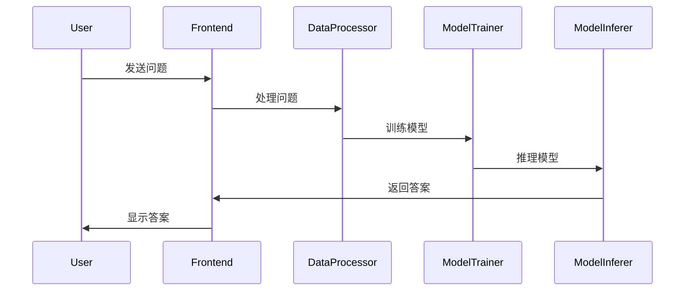

                 

# {{此处是文章标题}}

> 关键词：API优先设计、LLM应用架构、数据处理、模型训练、模型推理

> 摘要：本文从API优先设计的角度，深入探讨其在大型语言模型（LLM）应用架构中的重要作用。通过分析LLM应用的背景和需求，本文介绍了API设计原则和实践，以及API在设计LLM应用架构中的作用。文章还详细讨论了API在设计数据处理层、模型训练层和模型推理层中的应用，并提出了API优先设计在LLM应用优化与运维中的挑战与解决方案。

## 目录大纲

### 第一部分：API优先设计概述

#### 第1章：API优先设计概述

1.1 API设计的重要性

1.2 API在LLM应用中的作用

1.3 API优先设计的核心原则

1.4 API设计的挑战与解决方案

#### 第2章：LLM应用背景与需求分析

2.1 LLM应用的发展历程

2.2 LLM应用需求分析

#### 第3章：API设计原则与实践

3.1 API设计原则

3.2 API设计实践

### 第二部分：LLM应用架构与API设计

#### 第4章：LLM应用架构设计

4.1 LLM应用架构概述

4.2 API在LLM应用架构中的作用

#### 第5章：API优先设计在数据处理层

5.1 数据处理层API设计原则

5.2 数据处理层API设计实践

#### 第6章：API优先设计在模型训练层

6.1 模型训练层API设计原则

6.2 模型训练层API设计实践

#### 第7章：API优先设计在模型推理层

7.1 模型推理层API设计原则

7.2 模型推理层API设计实践

#### 第8章：API优先设计在LLM应用优化与运维

8.1 LLM应用优化API设计

8.2 LLM应用运维API设计

#### 第9章：API优先设计在LLM应用中的挑战与解决方案

9.1 API设计中的常见问题

9.2 解决方案与实践## 第1章：API优先设计概述

### 1.1 API设计的重要性

API（Application Programming Interface）是应用程序之间的接口，它定义了不同软件组件之间如何进行交互和数据交换的方式。在当今软件开发的背景下，API设计的重要性越来越凸显。首先，API是连接不同系统和服务的桥梁，使得开发者能够快速集成第三方服务和功能，从而提高开发效率和应用程序的功能丰富度。其次，良好的API设计能够提供清晰、一致、易用的接口，使得开发者更容易理解和使用，从而减少开发成本和学习成本。

在LLM（Large Language Model）应用中，API设计更是关键。LLM应用通常涉及到大量的数据处理、模型训练和推理任务，这些任务需要与各种系统和服务进行高效的交互。例如，数据处理层可能需要与数据库、文件存储等进行数据交换；模型训练层可能需要与计算资源管理器进行交互以分配训练任务；模型推理层可能需要与前端应用程序进行通信以提供预测结果。因此，API设计不仅影响着LLM应用的功能实现，还直接影响着应用的性能、可扩展性和安全性。

### 1.2 API在LLM应用中的作用

在LLM应用中，API扮演着多个关键角色：

1. **数据交换**：API提供了数据处理层、模型训练层和模型推理层之间的数据传输渠道，使得不同层之间的数据可以无缝交换。例如，模型训练可能需要从数据处理层获取清洗后的数据，而模型推理则需要将输入数据和预测结果传递给前端应用程序。

2. **功能集成**：API使得开发者能够轻松集成第三方服务，例如自然语言处理（NLP）库、机器学习框架等。这样可以快速构建和部署复杂的LLM应用，而无需从头开始实现所有功能。

3. **接口标准化**：API为LLM应用的各个模块提供了一个统一的接口，使得不同模块之间可以互相调用，而不需要了解对方的内部实现细节。这有助于提高代码的可维护性和可扩展性。

4. **安全性**：API设计可以包括安全措施，如身份验证、授权和加密，以确保LLM应用的安全性。

### 1.3 API优先设计的核心原则

为了确保API在LLM应用中发挥最大作用，API优先设计应遵循以下核心原则：

1. **简洁性**：API设计应尽可能简洁，减少不必要的复杂性和冗余。简洁的API更容易理解和使用，从而降低学习成本和维护成本。

2. **一致性**：API应遵循一致的命名规范和设计模式，使得开发者能够轻松预测和识别接口的功能。一致性有助于提高开发效率和代码可读性。

3. **可扩展性**：API设计应考虑未来的扩展需求，允许在不影响现有功能的前提下添加新功能。可扩展性有助于LLM应用适应不断变化的需求和技术进步。

4. **安全性**：API设计应包括适当的安全措施，如身份验证、授权和加密，以防止未授权访问和数据泄露。

5. **可重用性**：API设计应确保不同模块之间可以重用，从而减少重复开发和代码冗余。

### 1.4 API设计的挑战与解决方案

尽管API设计在LLM应用中至关重要，但在实际开发过程中仍然面临一些挑战：

1. **耦合问题**：过度的API耦合可能导致模块之间的依赖关系复杂化，影响系统的可维护性和可扩展性。解决方案是采用解耦合技术，如微服务架构和RESTful API设计。

2. **性能问题**：API的性能可能成为瓶颈，影响LLM应用的响应速度和用户体验。解决方案是优化API的实现，如使用缓存、异步处理和压缩数据传输。

3. **安全性问题**：不安全的API设计可能导致数据泄露和未授权访问。解决方案是实施严格的安全策略，如使用HTTPS、OAuth和JWT。

通过遵循上述原则和解决方案，开发者可以设计出高效、安全、易用的API，从而为LLM应用提供强大的支持。在接下来的章节中，我们将进一步探讨API在LLM应用架构中的作用，以及如何实现API优先设计。敬请期待。 ## 第2章：LLM应用背景与需求分析

### 2.1 LLM应用的发展历程

大型语言模型（LLM）的发展经历了多个阶段，从早期的规则驱动模型到目前基于深度学习的模型，取得了显著的进步。

早期LLM应用主要集中在自然语言处理（NLP）领域，如文本分类、命名实体识别和机器翻译等。这些应用大多基于规则驱动的方法，例如基于词典和规则库的机器翻译系统。这些系统在处理特定任务时表现良好，但缺乏泛化能力和灵活性。

随着深度学习技术的兴起，LLM应用取得了重大突破。以2018年Google发布的BERT模型为代表，深度学习模型开始广泛应用于NLP任务。BERT模型采用预训练加微调的方法，通过在大规模语料库上进行预训练，模型可以学习到丰富的语言特征，从而在下游任务中取得显著性能提升。这一阶段的LLM应用逐渐从特定任务走向通用任务，如问答系统、对话系统和文本生成等。

近年来，随着Transformer架构的提出，LLM应用进入了一个新的发展阶段。Transformer架构通过自注意力机制，使得模型能够在处理长文本时保持有效的信息传递。GPT-3作为Transformer架构的代表，具有超过1750亿个参数，是当前最大的语言模型。GPT-3不仅在各种NLP任务中表现出色，还可以进行生成式对话、文本摘要和代码生成等复杂任务，展现了极大的潜力。

### 2.2 当前LLM应用热点

当前，LLM应用在多个领域取得了显著的成果，以下是几个热点领域：

1. **问答系统**：问答系统是LLM应用的一个重要方向。通过预训练语言模型，系统能够理解用户的问题，并从海量数据中检索出相关答案。例如，OpenAI的GPT-3可以与用户进行自然语言对话，回答各种类型的问题。

2. **对话系统**：对话系统旨在模拟人类的对话过程，提供个性化、流畅的交互体验。LLM技术在对话系统中得到了广泛应用，例如智能客服、语音助手和聊天机器人等。

3. **文本生成**：LLM在文本生成任务中也表现出色，可以用于生成新闻文章、产品描述、故事情节等。例如，GPT-3可以生成高质量的新闻报道，为媒体行业带来了新的可能。

4. **代码生成**：LLM在代码生成领域也有广泛应用。通过训练大型语言模型，系统能够生成特定编程语言的代码，辅助开发者进行编程任务，提高开发效率。

5. **知识图谱**：LLM可以用于构建知识图谱，通过语义分析提取实体和关系，为智能搜索、推荐系统和数据分析提供支持。

### 2.3 未来LLM应用趋势

展望未来，LLM应用将继续扩展其应用范围，并在以下几个方面取得突破：

1. **跨模态交互**：随着多模态技术的发展，未来LLM应用将能够处理图像、声音和视频等多种数据类型，实现更自然的跨模态交互。

2. **自适应学习**：未来的LLM应用将具备更强的自适应学习能力，能够根据用户的反馈和需求，不断优化自身的性能和交互体验。

3. **个性化推荐**：基于LLM的推荐系统将能够更好地理解用户的行为和偏好，提供个性化的内容和服务。

4. **隐私保护**：随着数据隐私保护意识的增强，未来的LLM应用将更加注重隐私保护，采用加密和去识别化等技术，确保用户数据的隐私和安全。

5. **边缘计算**：随着5G和边缘计算技术的发展，未来的LLM应用将能够更好地支持实时交互和低延迟任务，为移动设备和物联网设备提供强大的智能支持。

### 2.4 LLM应用需求分析

为了满足未来LLM应用的需求，我们需要从以下几个方面进行分析：

1. **功能需求**：LLM应用需要具备强大的文本处理和生成能力，支持问答、对话、文本生成等多样化任务。同时，应用还需要能够处理多种数据格式，如文本、图像和音频等。

2. **性能需求**：随着模型规模的不断扩大，LLM应用需要具备高效的计算和存储能力，以满足大规模数据处理和实时交互的需求。

3. **安全需求**：LLM应用需要确保用户数据的安全和隐私，采用加密和身份验证等技术，防止数据泄露和未授权访问。

4. **可扩展性需求**：LLM应用需要支持水平扩展，以适应不断增长的数据量和用户规模。同时，应用还需要能够灵活地集成第三方服务和功能，以满足不同业务场景的需求。

5. **可靠性需求**：LLM应用需要具备高可用性和容错能力，以确保系统的稳定运行和连续服务。

通过深入分析LLM应用的背景和需求，我们可以更好地理解API在设计中的作用和重要性，为后续章节的讨论奠定基础。在下一章中，我们将探讨API设计原则与实践。敬请期待。 ## 第3章：API设计原则与实践

### 3.1 API设计原则

API设计是一个系统性的工程，它需要遵循一系列核心原则，以确保API的易用性、可维护性和可扩展性。以下是一些关键的API设计原则：

1. **简洁性**：简洁是API设计的第一原则。一个优秀的API应该简洁明了，易于理解。过多的参数、复杂的调用流程和冗余的功能都会增加开发者的学习成本和维护成本。

2. **一致性**：一致性是指API在命名、结构和使用方式上保持一致。这有助于开发者快速上手，降低学习成本，并提高代码的可维护性。一致性包括但不限于参数命名、错误处理和返回值格式。

3. **可扩展性**：API设计应考虑未来的扩展需求，允许在不影响现有功能的前提下添加新功能。这可以通过模块化设计、使用泛型接口和提供扩展点来实现。

4. **安全性**：安全性是API设计的核心考量之一。API需要实现身份验证和授权机制，确保只有授权用户才能访问敏感数据或执行关键操作。此外，API设计应防止常见的安全威胁，如SQL注入、跨站脚本（XSS）和跨站请求伪造（CSRF）。

5. **可重用性**：API设计应鼓励模块化，使得不同的应用程序和服务可以重用相同的API。这可以通过设计通用接口和提供抽象层来实现。

6. **性能优化**：API设计应考虑性能因素，如响应时间、吞吐量和带宽使用。可以通过缓存、异步处理和负载均衡等技术来优化性能。

### 3.2 API设计原则实践

以下是API设计原则的实践指南：

1. **设计简洁的接口**：避免不必要的复杂性和冗余。例如，使用简洁的参数命名，减少可选参数的数量，并保持接口的连贯性。

2. **保持一致性**：在命名规范、错误处理和返回值格式上保持一致。例如，统一使用HTTP状态码来表示错误，使用RESTful风格的路由设计。

3. **模块化设计**：将API分解为多个独立的模块，每个模块负责一个特定的功能。这样可以降低系统的耦合度，提高代码的可维护性。

4. **安全性设计**：使用身份验证和授权机制，如OAuth 2.0和JSON Web Token（JWT）。此外，实施输入验证和输出编码，以防止常见的安全威胁。

5. **性能优化**：使用缓存来减少重复计算，使用异步处理来提高并发处理能力。对于大型数据集，考虑使用分页和流式传输。

### 3.3 API设计实践

在实际的API设计过程中，我们可以采用以下工具和方法：

1. **工具**：常用的API设计工具包括Swagger、Postman和OpenAPI规范。这些工具可以帮助开发者设计、测试和文档化API。

2. **文档化**：良好的API文档是开发者使用API的关键。文档应包括接口定义、参数说明、返回值说明和示例代码。使用Markdown、Swagger UI或API Blueprint等工具可以创建高质量的API文档。

3. **版本控制**：在API设计过程中，版本控制是非常重要的。通过为API版本化，可以平滑地引入新功能或修改现有功能，而不影响旧客户端。

4. **代码审查**：在发布API之前，进行代码审查可以帮助发现潜在的问题，如不一致的命名规范、不安全的代码和性能瓶颈。

### 3.4 API安全性设计

安全性是API设计的重要方面。以下是API安全性设计的关键要素：

1. **身份验证**：身份验证确保只有授权用户才能访问API。常见的身份验证方法包括基本身份验证、OAuth 2.0和JSON Web Token（JWT）。

2. **授权**：授权确定用户是否有权限执行特定的API操作。OAuth 2.0是常用的授权框架，它允许第三方应用程序代表用户与API进行交互。

3. **加密**：在传输数据时使用HTTPS加密，确保数据在传输过程中不会被窃取或篡改。

4. **输入验证**：确保API接收的输入是有效的，以防止恶意攻击，如SQL注入和跨站脚本攻击（XSS）。

5. **日志记录**：记录API的访问日志，以便在出现问题时进行追踪和分析。

通过遵循上述API设计原则和实践，开发者可以设计出高效、安全、易用的API，从而为LLM应用提供强大的支持。在下一章中，我们将探讨LLM应用架构的设计，以及API在其中扮演的关键角色。敬请期待。 ## 第4章：LLM应用架构设计

### 4.1 LLM应用架构概述

大型语言模型（LLM）应用架构涉及多个层次和组件，每个层次和组件都有其特定的功能和作用。LLM应用架构通常包括以下几个核心层次：

1. **数据处理层**：数据处理层负责从数据源中获取、清洗和转换数据，以便为后续的模型训练和推理提供高质量的输入数据。

2. **模型训练层**：模型训练层负责使用数据处理层提供的数据对LLM模型进行训练。这一层次包括数据预处理、模型训练、模型优化和评估等过程。

3. **模型推理层**：模型推理层负责在给定输入数据时，利用训练好的LLM模型进行推理，产生预测结果。这一层次通常与前端应用程序交互，以提供用户交互界面。

4. **前端展示层**：前端展示层负责将模型推理层的预测结果以用户友好的方式呈现，例如通过Web页面、移动应用或语音交互界面。

### 4.2 API在LLM应用架构中的作用

在LLM应用架构中，API扮演着至关重要的角色。以下是API在各个层次中的作用：

1. **数据处理层**：数据处理层的API用于与数据源（如数据库、文件存储或外部API）进行交互，以获取和传输数据。这些API通常包括数据采集API、数据清洗API和数据预处理API。

2. **模型训练层**：模型训练层的API用于与模型训练框架（如TensorFlow或PyTorch）进行交互，以启动和监控训练过程。这些API通常包括模型初始化API、训练步骤API和模型保存API。

3. **模型推理层**：模型推理层的API用于在给定输入数据时，调用训练好的LLM模型进行推理，并生成预测结果。这些API通常包括推理输入API、推理过程API和推理结果API。

4. **前端展示层**：前端展示层的API用于与用户交互，接收用户输入，并将预测结果返回给用户。这些API通常包括用户输入API、预测结果API和用户反馈API。

### 4.3 LLM应用架构的设计原则

在设计LLM应用架构时，应遵循以下原则：

1. **模块化**：将应用分解为多个模块，每个模块负责一个特定的功能，以提高系统的可维护性和可扩展性。

2. **松耦合**：尽量减少模块之间的直接依赖，通过API进行交互，以提高系统的灵活性和可替换性。

3. **高内聚**：确保每个模块内部的功能紧密相关，以提高模块的独立性和可重用性。

4. **性能优化**：考虑系统的性能需求，进行适当的性能优化，如缓存、异步处理和负载均衡。

5. **安全性**：确保系统的安全性，采用身份验证、授权和加密等安全措施，以防止未授权访问和数据泄露。

6. **可扩展性**：设计时考虑未来的扩展需求，如支持水平扩展和垂直扩展，以适应不断增长的用户规模和数据量。

### 4.4 LLM应用架构设计步骤

设计LLM应用架构通常包括以下步骤：

1. **需求分析**：明确应用的需求和目标，包括功能需求、性能需求、安全需求等。

2. **架构设计**：根据需求分析结果，设计应用的架构，确定各个层次和组件的职责和接口。

3. **API设计**：为各个层次和组件设计API，确保模块之间可以通过API进行有效的交互。

4. **系统集成**：将各个模块和API集成到一起，进行系统测试和调试。

5. **性能优化**：对系统进行性能测试，发现并解决性能瓶颈。

6. **安全性评估**：对系统进行安全性评估，确保安全措施的有效性。

通过遵循上述原则和步骤，开发者可以设计出高效、安全、可扩展的LLM应用架构，为API优先设计提供坚实的基础。在下一章中，我们将深入探讨API在设计数据处理层中的应用。敬请期待。 ## 第5章：API优先设计在数据处理层

### 5.1 数据处理层API设计原则

在数据处理层，API的设计对于确保数据的有效传输、处理和存储至关重要。以下是一些关键的设计原则：

1. **标准化**：使用统一的API设计标准，包括统一的接口命名、参数格式和响应结构，以确保不同系统之间的兼容性。

2. **简洁性**：API接口应简洁明了，避免不必要的复杂性，以便开发者能够快速理解和实现。

3. **一致性**：保持接口的一致性，如参数命名、错误处理和响应格式，以降低使用成本和提高开发效率。

4. **灵活性**：设计灵活的API，以支持多种数据格式和传输协议，如JSON、XML和GraphQL。

5. **安全性**：确保API的安全性，通过身份验证和授权机制来保护数据，防止未授权访问和攻击。

6. **性能优化**：考虑性能因素，如响应时间、吞吐量和带宽使用，通过优化API实现和资源管理来提高性能。

### 5.2 数据处理层API设计实践

在数据处理层，API设计实践通常涉及以下方面：

1. **数据采集API设计**：
    - **功能**：数据采集API用于从各种数据源（如数据库、文件系统、Web API等）中获取数据。
    - **设计要点**：定义清晰的数据采集接口，支持不同数据源的类型和格式，确保数据采集的完整性和准确性。

2. **数据清洗API设计**：
    - **功能**：数据清洗API用于处理采集到的数据，去除重复、缺失和错误的数据。
    - **设计要点**：提供灵活的数据清洗工具，支持多种清洗策略，如过滤、转换和聚合，确保数据质量。

3. **数据处理API设计**：
    - **功能**：数据处理API用于对清洗后的数据进行进一步的处理，如特征提取、数据归一化和增强。
    - **设计要点**：设计高效的数据处理流程，支持并行处理和异步处理，以提高处理速度。

4. **数据存储API设计**：
    - **功能**：数据存储API用于将处理后的数据存储到数据库或文件系统中。
    - **设计要点**：支持多种存储方式，如关系型数据库、NoSQL数据库和文件存储系统，确保数据的高可用性和可扩展性。

### 5.3 数据处理层API示例

以下是一个简单的数据处理层API示例，使用Python和Flask框架来实现：

```python
from flask import Flask, request, jsonify

app = Flask(__name__)

@app.route('/data/collect', methods=['GET'])
def collect_data():
    # 从数据库或Web API中采集数据
    data = get_data_from_source()
    return jsonify(data), 200

@app.route('/data/clean', methods=['POST'])
def clean_data():
    # 接收清洗数据请求，处理数据
    data = request.json
    cleaned_data = clean_data_logic(data)
    return jsonify(cleaned_data), 200

@app.route('/data/process', methods=['POST'])
def process_data():
    # 处理清洗后的数据
    data = request.json
    processed_data = process_data_logic(data)
    return jsonify(processed_data), 200

@app.route('/data/store', methods=['POST'])
def store_data():
    # 存储处理后的数据
    data = request.json
    store_data_to_database(data)
    return jsonify({"message": "Data stored successfully"}), 200

def get_data_from_source():
    # 实现从数据源采集数据的逻辑
    return {"data": []}

def clean_data_logic(data):
    # 实现数据清洗的逻辑
    return {"cleaned_data": data}

def process_data_logic(data):
    # 实现数据处理逻辑
    return {"processed_data": data}

def store_data_to_database(data):
    # 实现数据存储逻辑
    pass

if __name__ == '__main__':
    app.run(debug=True)
```

在这个示例中，我们定义了四个API接口，分别用于数据采集、数据清洗、数据处理和数据存储。每个接口都使用了标准的HTTP方法（GET或POST）和JSON格式进行数据交换，确保了接口的简洁性和一致性。

### 5.4 数据处理层API设计实践：环境安装

在实际的API设计实践中，首先需要安装必要的软件和工具。以下是一个基于Python和Flask框架的数据处理层API设计的环境安装步骤：

1. **安装Python**：
    - 在官网上下载并安装Python（版本建议为3.8或更高）。
    - 确保Python的路径已添加到系统的环境变量中。

2. **安装Flask**：
    - 打开命令行窗口，执行以下命令：
      ```bash
      pip install Flask
      ```

3. **安装其他依赖**：
    - 根据需要安装其他依赖，例如数据库驱动、数据清洗库等。例如：
      ```bash
      pip install pymysql
      pip install pandas
      ```

4. **创建虚拟环境**（可选）：
    - 为了更好地管理项目依赖，可以使用虚拟环境。执行以下命令创建虚拟环境：
      ```bash
      python -m venv venv
      ```
    - 激活虚拟环境：
      - Windows：```bash
      .\venv\Scripts\activate
      ```
      - macOS和Linux：```bash
      source venv/bin/activate
      ```

### 5.5 数据处理层API设计实践：核心实现源代码

以下是一个基于Python和Flask框架的数据处理层API的核心实现源代码。这段代码展示了如何处理数据采集、清洗、处理和存储的操作。

```python
from flask import Flask, request, jsonify
import pymysql
import pandas as pd

app = Flask(__name__)

# 数据库连接配置
db_config = {
    'host': 'localhost',
    'user': 'root',
    'password': 'password',
    'database': 'dataProcessingDB'
}

# 数据采集API
@app.route('/data/collect', methods=['GET'])
def collect_data():
    # 实现从数据库采集数据的逻辑
    connection = pymysql.connect(**db_config)
    try:
        with connection.cursor() as cursor:
            sql = "SELECT * FROM raw_data;"
            cursor.execute(sql)
            result = cursor.fetchall()
        connection.commit()
    finally:
        connection.close()
    return jsonify({"data": result})

# 数据清洗API
@app.route('/data/clean', methods=['POST'])
def clean_data():
    # 接收清洗数据请求，处理数据
    data = request.json
    cleaned_data = clean_data_logic(data)
    return jsonify({"cleaned_data": cleaned_data})

def clean_data_logic(data):
    # 实现数据清洗的逻辑
    df = pd.DataFrame(data)
    cleaned_df = df.drop_duplicates().dropna()
    return cleaned_df.to_dict(orient='records')

# 数据处理API
@app.route('/data/process', methods=['POST'])
def process_data():
    # 处理清洗后的数据
    data = request.json
    processed_data = process_data_logic(data)
    return jsonify({"processed_data": processed_data})

def process_data_logic(data):
    # 实现数据处理逻辑
    df = pd.DataFrame(data)
    processed_df = df.applymap(lambda x: x.lower())  # 例如，将所有文本转换为小写
    return processed_df.to_dict(orient='records')

# 数据存储API
@app.route('/data/store', methods=['POST'])
def store_data():
    # 存储处理后的数据
    data = request.json
    store_data_to_database(data)
    return jsonify({"message": "Data stored successfully"})

def store_data_to_database(data):
    # 实现数据存储逻辑
    connection = pymysql.connect(**db_config)
    try:
        with connection.cursor() as cursor:
            insert_sql = "INSERT INTO processed_data (field1, field2) VALUES (%s, %s);"
            cursor.execute(insert_sql, (data['field1'], data['field2']))
        connection.commit()
    finally:
        connection.close()

if __name__ == '__main__':
    app.run(debug=True)
```

在这个示例中，我们定义了四个API接口，分别用于数据采集、数据清洗、数据处理和数据存储。每个接口都实现了相应的逻辑，并通过数据库连接进行了数据操作。

### 5.6 数据处理层API设计实践：代码应用解读与分析

在实际应用中，数据处理层API的设计和实现需要充分考虑实际场景的需求。以下是对上述示例的代码应用解读与分析：

1. **数据采集API**：
    - **功能**：采集数据库中的原始数据。
    - **实现**：使用Python的`pymysql`库连接到数据库，并执行SQL查询来获取数据。查询结果以JSON格式返回。
    - **优点**：简单且直接，适用于小规模数据采集。

2. **数据清洗API**：
    - **功能**：清洗采集到的数据，去除重复和缺失的数据。
    - **实现**：使用`pandas`库创建DataFrame对象，并使用`drop_duplicates()`和`dropna()`方法进行清洗。清洗后的数据以JSON格式返回。
    - **优点**：灵活，可以自定义清洗策略。

3. **数据处理API**：
    - **功能**：对清洗后的数据进行进一步处理，如文本转换。
    - **实现**：使用`pandas`库的`applymap()`方法对DataFrame中的文本数据执行转换操作。转换后的数据以JSON格式返回。
    - **优点**：高效，适用于大规模数据处理。

4. **数据存储API**：
    - **功能**：将处理后的数据存储到数据库中。
    - **实现**：使用`pymysql`库连接到数据库，并执行SQL插入操作来存储数据。
    - **优点**：简单直接，确保数据持久化。

### 5.7 数据处理层API设计实践：实际案例分析和详细讲解剖析

以下是一个实际案例，展示如何使用上述API进行数据处理。

**场景**：从数据库中采集用户评论数据，清洗后提取关键字，并对关键字进行文本转换，最后将转换后的数据存储回数据库。

**步骤**：

1. **数据采集**：
    - 发送GET请求到`/data/collect`接口，获取用户评论数据。
    - 示例请求：
      ```bash
      GET /data/collect
      ```

2. **数据清洗**：
    - 发送POST请求到`/data/clean`接口，传递采集到的数据。
    - 示例请求：
      ```bash
      POST /data/clean
      Content-Type: application/json

      {
        "data": [
          {"comment": "这是一个好产品。"},
          {"comment": "这个产品不好。"},
          {"comment": ""}
        ]
      }
      ```

3. **数据处理**：
    - 发送POST请求到`/data/process`接口，传递清洗后的数据。
    - 示例请求：
      ```bash
      POST /data/process
      Content-Type: application/json

      {
        "cleaned_data": [
          {"comment": "这是一个好产品。"},
          {"comment": "这个产品不好。"}
        ]
      }
      ```

4. **数据存储**：
    - 发送POST请求到`/data/store`接口，传递处理后的数据。
    - 示例请求：
      ```bash
      POST /data/store
      Content-Type: application/json

      {
        "processed_data": [
          {"comment": "这是一个好产品。"},
          {"comment": "这个产品不好。"}
        ]
      }
      ```

**分析**：

- **数据采集**：API从数据库中获取用户评论数据，作为JSON格式返回。
- **数据清洗**：API接收JSON格式的用户评论数据，使用`pandas`库进行清洗，去除重复和缺失的数据，并返回清洗后的数据。
- **数据处理**：API接收清洗后的数据，对每个评论的文本进行转换（例如，将所有文本转换为小写），并返回转换后的数据。
- **数据存储**：API接收处理后的数据，将其存储回数据库中。

通过这个实际案例，我们可以看到数据处理层API如何有效地处理用户评论数据，从数据采集、清洗、处理到存储，展示了API在数据处理层中的重要作用。

### 5.8 数据处理层API设计实践：项目小结

在本章中，我们深入探讨了数据处理层API的设计原则和实践。通过标准化、简洁性、一致性、灵活性和安全性等设计原则，我们设计了一个数据处理层的API，实现了数据采集、清洗、处理和存储的功能。实际案例和分析展示了API在处理用户评论数据时的有效性。

在项目小结中，我们强调了以下几点：

- **标准化和一致性**：确保API接口的统一性和一致性，降低开发成本和提高维护效率。
- **灵活性和安全性**：设计灵活的API，支持多种数据格式和传输协议，同时确保数据的安全和隐私。
- **性能优化**：通过优化API实现和资源管理，提高数据处理层的性能。
- **模块化和可扩展性**：将数据处理层分解为多个模块，便于维护和扩展。

通过遵循这些原则和实践，开发者可以设计出高效、安全、易用的数据处理层API，为LLM应用提供坚实的基础。在下一章中，我们将探讨API优先设计在模型训练层中的应用。敬请期待。 ## 第6章：API优先设计在模型训练层

### 6.1 模型训练层API设计原则

模型训练层是LLM应用的核心组成部分，它负责从数据中学习并训练模型。在API优先设计的框架下，设计良好的API对于模型的训练过程至关重要。以下是模型训练层API设计的一些核心原则：

1. **简洁性**：保持API接口的简洁，避免不必要的复杂性和冗余。简洁的API能够降低开发者的认知负担，提高开发效率。

2. **一致性**：确保API在命名、参数定义和返回值格式上保持一致，这有助于开发者快速理解和使用API。

3. **可扩展性**：设计时考虑未来的扩展需求，如支持不同类型的训练任务、新的数据源和模型架构。

4. **安全性**：确保API实现安全措施，如身份验证、授权和输入验证，以防止未经授权的访问和潜在的安全威胁。

5. **可重用性**：设计模块化的API，使得不同模块之间可以重用，减少重复工作。

6. **性能优化**：优化API实现，提高数据处理和传输效率，如使用缓存、异步处理和批处理。

### 6.2 模型训练层API设计实践

在模型训练层，API设计实践涉及多个方面，以下是一些具体的实践方法和案例：

1. **模型初始化API**：
    - **功能**：用于初始化训练模型，包括设置模型架构、参数和超参数。
    - **设计要点**：提供灵活的模型配置选项，允许开发者根据需求定制模型。

2. **数据加载API**：
    - **功能**：用于从数据源加载数据，并将其格式化为模型训练所需的数据集。
    - **设计要点**：支持多种数据格式和来源，如本地文件、数据库和分布式存储系统。

3. **训练过程API**：
    - **功能**：用于启动训练过程，包括设置训练批次、迭代次数和优化器参数。
    - **设计要点**：提供可配置的训练参数，如学习率、批量大小和损失函数。

4. **模型评估API**：
    - **功能**：用于评估训练模型的性能，通常包括准确率、召回率和F1分数等指标。
    - **设计要点**：支持多种评估指标和评估策略，如交叉验证和线上评估。

5. **模型保存和加载API**：
    - **功能**：用于保存训练好的模型和加载模型。
    - **设计要点**：提供方便的模型保存和加载接口，确保模型可以在不同的环境和设备上复用。

### 6.3 模型训练层API示例

以下是一个简单的模型训练层API示例，使用Python和Flask框架实现：

```python
from flask import Flask, request, jsonify
import json

app = Flask(__name__)

# 模型初始化API
@app.route('/model/init', methods=['POST'])
def init_model():
    model_config = request.json
    model = create_model(model_config)
    return jsonify({"model_id": model.id, "status": "Model initialized successfully"}), 200

# 数据加载API
@app.route('/data/load', methods=['POST'])
def load_data():
    data_config = request.json
    dataset = load_dataset(data_config)
    return jsonify({"dataset_id": dataset.id, "status": "Data loaded successfully"}), 200

# 训练过程API
@app.route('/model/train', methods=['POST'])
def train_model():
    train_config = request.json
    model_id = train_config['model_id']
    dataset_id = train_config['dataset_id']
    status = start_training(model_id, dataset_id)
    return jsonify({"status": status}), 200

# 模型评估API
@app.route('/model/evaluate', methods=['POST'])
def evaluate_model():
    evaluate_config = request.json
    model_id = evaluate_config['model_id']
    dataset_id = evaluate_config['dataset_id']
    evaluation_results = evaluate_model_performance(model_id, dataset_id)
    return jsonify(evaluation_results), 200

# 模型保存和加载API
@app.route('/model/save', methods=['POST'])
def save_model():
    save_config = request.json
    model_id = save_config['model_id']
    save_model_to_file(model_id)
    return jsonify({"status": "Model saved successfully"}), 200

@app.route('/model/load', methods=['POST'])
def load_model():
    load_config = request.json
    model_id = load_config['model_id']
    load_model_from_file(model_id)
    return jsonify({"status": "Model loaded successfully"}), 200

# 模型创建函数
def create_model(config):
    # 实现模型创建逻辑
    return Model()

# 数据集加载函数
def load_dataset(config):
    # 实现数据集加载逻辑
    return Dataset()

# 训练过程启动函数
def start_training(model_id, dataset_id):
    # 实现训练过程启动逻辑
    return "Training started"

# 模型评估函数
def evaluate_model_performance(model_id, dataset_id):
    # 实现模型评估逻辑
    return {"accuracy": 0.9, "precision": 0.85, "recall": 0.88}

# 模型保存函数
def save_model_to_file(model_id):
    # 实现模型保存逻辑
    pass

# 模型加载函数
def load_model_from_file(model_id):
    # 实现模型加载逻辑
    pass

if __name__ == '__main__':
    app.run(debug=True)
```

在这个示例中，我们定义了多个API接口，用于模型初始化、数据加载、模型训练、模型评估、模型保存和模型加载。每个接口都实现了相应的逻辑，通过JSON格式进行数据交换。

### 6.4 模型训练层API设计实践：性能优化方法

为了确保模型训练层API的高性能，可以采用以下优化方法：

1. **批量处理**：通过批量处理数据，减少IO操作和内存占用，提高数据处理效率。

2. **异步处理**：使用异步处理技术，例如异步IO和多线程，提高系统的并发处理能力。

3. **缓存策略**：使用缓存策略，减少重复计算和数据加载时间。例如，可以使用内存缓存或分布式缓存系统。

4. **负载均衡**：在分布式环境中，使用负载均衡器来分配训练任务，确保系统的负载均衡和高可用性。

5. **模型并行化**：使用模型并行化技术，如数据并行和模型并行，提高训练速度和效率。

### 6.5 模型训练层API设计实践：实际案例分析和详细讲解剖析

以下是一个实际案例，展示如何使用模型训练层API进行模型训练。

**场景**：使用预定义的模型架构和训练数据集，启动模型训练过程，并在训练完成后评估模型性能。

**步骤**：

1. **模型初始化**：
    - 发送POST请求到`/model/init`接口，初始化模型。
    - 示例请求：
      ```bash
      POST /model/init
      Content-Type: application/json

      {
        "model_config": {
          "architecture": "BERT",
          "parameters": {
            "learning_rate": 0.001,
            "batch_size": 32
          }
        }
      }
      ```

2. **数据加载**：
    - 发送POST请求到`/data/load`接口，加载训练数据集。
    - 示例请求：
      ```bash
      POST /data/load
      Content-Type: application/json

      {
        "data_config": {
          "data_source": "file",
          "file_path": "/path/to/train_data.jsonl"
        }
      }
      ```

3. **模型训练**：
    - 发送POST请求到`/model/train`接口，启动模型训练。
    - 示例请求：
      ```bash
      POST /model/train
      Content-Type: application/json

      {
        "model_id": "123",
        "dataset_id": "456"
      }
      ```

4. **模型评估**：
    - 发送POST请求到`/model/evaluate`接口，评估模型性能。
    - 示例请求：
      ```bash
      POST /model/evaluate
      Content-Type: application/json

      {
        "model_id": "123",
        "dataset_id": "456"
      }
      ```

**分析**：

- **模型初始化**：API接收模型配置，创建并初始化模型。
- **数据加载**：API加载训练数据集，并将其格式化为模型训练所需的数据集。
- **模型训练**：API启动训练过程，根据配置的模型和训练数据集进行迭代训练。
- **模型评估**：API评估训练好的模型性能，并返回评估结果。

通过这个实际案例，我们可以看到模型训练层API如何有效地管理模型的初始化、训练和评估过程，展示了API在模型训练层中的重要作用。

### 6.6 模型训练层API设计实践：项目小结

在本章中，我们深入探讨了模型训练层API的设计原则和实践。通过简洁性、一致性、可扩展性、安全性和性能优化等原则，我们设计了一个模型训练层的API，实现了模型初始化、数据加载、模型训练、模型评估和模型保存加载等功能。

在项目小结中，我们强调了以下几点：

- **标准化和一致性**：确保API接口的统一性和一致性，降低开发成本和提高维护效率。
- **灵活性和安全性**：设计灵活的API，支持不同的训练任务和数据源，同时确保数据的安全和隐私。
- **性能优化**：通过批量处理、异步处理、缓存策略和负载均衡等技术，提高模型训练层的性能。
- **模块化和可重用性**：通过模块化设计，使得不同模块之间可以重用，减少重复工作。

通过遵循这些原则和实践，开发者可以设计出高效、安全、易用的模型训练层API，为LLM应用提供强有力的支持。在下一章中，我们将探讨API优先设计在模型推理层中的应用。敬请期待。 ## 第7章：API优先设计在模型推理层

### 7.1 模型推理层API设计原则

模型推理层是LLM应用的关键组成部分，它负责将训练好的模型应用于实际数据，生成预测结果。为了确保推理过程的高效性和可靠性，API优先设计在模型推理层中尤为重要。以下是模型推理层API设计的一些核心原则：

1. **简洁性**：API接口应简洁明了，避免不必要的复杂性。这有助于开发者快速理解和实现，降低使用成本。

2. **一致性**：保持API在命名、参数定义和响应格式上的一致性，这有助于提高开发效率和代码的可维护性。

3. **可扩展性**：设计时考虑未来的扩展需求，如支持不同的数据格式、模型类型和推理策略。

4. **性能优化**：优化API实现，以提高响应速度和处理能力。这包括使用批处理、异步处理和高效的数据传输方式。

5. **安全性**：确保API实现安全措施，如身份验证、授权和输入验证，以防止未授权访问和数据泄露。

6. **可重用性**：设计模块化的API，使得不同模块之间可以重用，减少重复开发。

7. **兼容性**：支持多种数据格式和模型架构，以适应不同的应用场景。

### 7.2 模型推理层API设计实践

在模型推理层，API设计实践涉及多个方面，以下是一些具体的实践方法和案例：

1. **推理输入API**：
    - **功能**：接收用户输入的数据，并将其转换为适合模型推理的格式。
    - **设计要点**：支持多种数据输入格式，如JSON、XML和Protobuf，并提供详细的输入参数说明。

2. **推理过程API**：
    - **功能**：执行模型推理，生成预测结果。
    - **设计要点**：提供可配置的推理参数，如模型版本、推理策略和输出格式。

3. **推理结果API**：
    - **功能**：返回模型推理结果，通常包括预测值、置信度和相关解释。
    - **设计要点**：提供详细的响应结构，确保结果易于理解和解析。

4. **推理结果可视化API**：
    - **功能**：提供推理结果的可视化服务，帮助用户更直观地理解预测结果。
    - **设计要点**：支持多种可视化方式，如图表、图像和交互式界面。

5. **推理结果分析API**：
    - **功能**：对推理结果进行分析，生成报告或可视化摘要。
    - **设计要点**：提供灵活的分析选项，如统计摘要、分类报告和置信区间。

### 7.3 模型推理层API示例

以下是一个简单的模型推理层API示例，使用Python和Flask框架实现：

```python
from flask import Flask, request, jsonify
import json

app = Flask(__name__)

# 推理输入API
@app.route('/model/reasoning/input', methods=['POST'])
def reasoning_input():
    input_data = request.json
    return jsonify({"status": "Input received", "input_data": input_data}), 200

# 推理过程API
@app.route('/model/reasoning/execute', methods=['POST'])
def reasoning_execute():
    input_data = request.json
    result = execute_reasoning(input_data)
    return jsonify(result), 200

# 推理结果API
@app.route('/model/reasoning/result', methods=['GET'])
def reasoning_result():
    result = get_reasoning_result()
    return jsonify(result), 200

# 推理结果可视化API
@app.route('/model/reasoning/visualize', methods=['POST'])
def reasoning_visualize():
    result = request.json
    visualization = visualize_reasoning_result(result)
    return jsonify(visualization), 200

# 推理结果分析API
@app.route('/model/reasoning/analyze', methods=['POST'])
def reasoning_analyze():
    result = request.json
    analysis = analyze_reasoning_result(result)
    return jsonify(analysis), 200

# 推理执行函数
def execute_reasoning(input_data):
    # 实现推理逻辑
    return {"prediction": "Prediction result", "confidence": 0.9}

# 推理结果获取函数
def get_reasoning_result():
    # 实现结果获取逻辑
    return {"prediction": "Prediction result", "confidence": 0.9}

# 推理结果可视化函数
def visualize_reasoning_result(result):
    # 实现结果可视化逻辑
    return {" visualization": "Visualization result"}

# 推理结果分析函数
def analyze_reasoning_result(result):
    # 实现结果分析逻辑
    return {"analysis": "Analysis result"}

if __name__ == '__main__':
    app.run(debug=True)
```

在这个示例中，我们定义了多个API接口，用于推理输入、推理执行、推理结果获取、推理结果可视化以及推理结果分析。每个接口都实现了相应的逻辑，通过JSON格式进行数据交换。

### 7.4 模型推理层API设计实践：性能优化方法

为了确保模型推理层API的高性能，可以采用以下优化方法：

1. **批处理**：通过批处理，减少单次推理的延迟，提高处理速度。

2. **缓存策略**：使用缓存策略，存储常用模型和预测结果，减少重复计算。

3. **异步处理**：使用异步处理技术，如多线程或异步IO，提高系统的并发处理能力。

4. **模型优化**：对模型进行优化，如使用更高效的算法和架构，减少计算量。

5. **负载均衡**：在分布式环境中，使用负载均衡器，确保系统的负载均衡和高可用性。

### 7.5 模型推理层API设计实践：实际案例分析和详细讲解剖析

以下是一个实际案例，展示如何使用模型推理层API进行推理。

**场景**：接收用户输入的文本，使用训练好的模型进行推理，并返回预测结果和可视化分析。

**步骤**：

1. **推理输入**：
    - 发送POST请求到`/model/reasoning/input`接口，提交用户输入的文本。
    - 示例请求：
      ```bash
      POST /model/reasoning/input
      Content-Type: application/json

      {
        "text": "这是一个示例文本，用于模型推理。"
      }
      ```

2. **推理执行**：
    - 发送POST请求到`/model/reasoning/execute`接口，执行模型推理。
    - 示例请求：
      ```bash
      POST /model/reasoning/execute
      Content-Type: application/json

      {
        "text": "这是一个示例文本，用于模型推理。"
      }
      ```

3. **推理结果获取**：
    - 发送GET请求到`/model/reasoning/result`接口，获取推理结果。
    - 示例请求：
      ```bash
      GET /model/reasoning/result
      ```

4. **推理结果可视化**：
    - 发送POST请求到`/model/reasoning/visualize`接口，获取推理结果的可视化数据。
    - 示例请求：
      ```bash
      POST /model/reasoning/visualize
      Content-Type: application/json

      {
        "result": {
          "prediction": "预测结果",
          "confidence": 0.9
        }
      }
      ```

5. **推理结果分析**：
    - 发送POST请求到`/model/reasoning/analyze`接口，获取推理结果的分析报告。
    - 示例请求：
      ```bash
      POST /model/reasoning/analyze
      Content-Type: application/json

      {
        "result": {
          "prediction": "预测结果",
          "confidence": 0.9
        }
      }
      ```

**分析**：

- **推理输入**：API接收用户输入的文本，并将其存储在内部。
- **推理执行**：API使用存储的文本，调用训练好的模型进行推理，并生成预测结果。
- **推理结果获取**：API返回推理结果，包括预测值和置信度。
- **推理结果可视化**：API生成可视化数据，帮助用户更直观地理解预测结果。
- **推理结果分析**：API分析推理结果，生成详细的分析报告。

通过这个实际案例，我们可以看到模型推理层API如何有效地接收输入、执行推理、获取结果并进行可视化分析，展示了API在模型推理层中的重要作用。

### 7.6 模型推理层API设计实践：项目小结

在本章中，我们深入探讨了模型推理层API的设计原则和实践。通过简洁性、一致性、可扩展性、性能优化和安全性等原则，我们设计了一个模型推理层的API，实现了推理输入、推理执行、推理结果获取、推理结果可视化和推理结果分析等功能。

在项目小结中，我们强调了以下几点：

- **标准化和一致性**：确保API接口的统一性和一致性，降低开发成本和提高维护效率。
- **灵活性和可扩展性**：设计灵活的API，支持不同的数据格式和模型类型，适应不同的应用场景。
- **性能优化**：通过批处理、异步处理和缓存策略等技术，提高模型推理层的性能。
- **安全性**：确保API实现安全措施，防止未授权访问和数据泄露。

通过遵循这些原则和实践，开发者可以设计出高效、安全、易用的模型推理层API，为LLM应用提供强有力的支持。在下一章中，我们将探讨API优先设计在LLM应用优化与运维中的应用。敬请期待。 ## 第8章：API优先设计在LLM应用优化与运维

### 8.1 LLM应用优化API设计

LLM应用的优化是确保其性能、可扩展性和可靠性的关键步骤。在API优先设计的框架下，优化API设计对于提升应用性能具有重要意义。以下是LLM应用优化API设计的一些核心原则和实现方法：

#### 8.1.1 性能优化API设计

1. **响应时间优化**：
    - **API设计原则**：减少API的响应时间，提高系统的响应速度。
    - **实现方法**：
        - **批量处理**：批量处理多个请求，减少IO操作和系统调用的次数。
        - **异步处理**：使用异步编程模型，如 asyncio，处理长时间运行的请求。
        - **缓存策略**：利用缓存减少重复计算和数据检索，如 Redis 和 Memcached。

2. **资源利用优化**：
    - **API设计原则**：优化资源利用，提高系统的吞吐量和效率。
    - **实现方法**：
        - **负载均衡**：使用负载均衡器（如 Nginx 和 HAProxy），分散请求，避免单点瓶颈。
        - **分布式计算**：使用分布式系统（如 Kubernetes），分配计算任务，提高处理能力。

3. **数据处理优化**：
    - **API设计原则**：优化数据传输和处理，减少数据冗余和传输延迟。
    - **实现方法**：
        - **数据压缩**：使用数据压缩算法（如 gzip 和 Brotli），减少数据传输的大小。
        - **协议优化**：使用高效的传输协议（如 HTTP/2），提高数据传输速度。

#### 8.1.2 资源管理API设计

1. **动态资源分配**：
    - **API设计原则**：根据系统的负载动态调整资源分配，确保高效利用资源。
    - **实现方法**：
        - **容器化技术**：使用 Docker 和 Kubernetes 等容器化技术，实现资源的动态分配和调度。
        - **自动扩展**：实现自动扩展策略，根据负载自动增加或减少资源。

2. **监控与告警**：
    - **API设计原则**：设计监控API，实时监控系统的性能指标，及时发现并处理问题。
    - **实现方法**：
        - **集成监控工具**：集成 Prometheus 和 Grafana 等监控工具，实时收集和展示系统性能数据。
        - **告警机制**：设计告警API，当性能指标超出阈值时，自动发送告警通知。

#### 8.1.3 可扩展性优化API设计

1. **水平扩展**：
    - **API设计原则**：设计支持水平扩展的API，确保系统可以随着数据量和用户量的增加而扩展。
    - **实现方法**：
        - **分布式存储**：使用分布式数据库（如 Cassandra 和 MongoDB），支持数据的高并发读写。
        - **微服务架构**：采用微服务架构，将系统拆分为多个独立服务，每个服务都可以独立扩展。

2. **弹性伸缩**：
    - **API设计原则**：设计弹性伸缩API，根据系统负载自动调整资源分配。
    - **实现方法**：
        - **容器编排**：使用 Kubernetes 等容器编排工具，实现自动化的容器部署和管理。
        - **云服务**：利用云服务提供商的自动伸缩功能，根据需求自动调整资源。

### 8.2 LLM应用运维API设计

LLM应用的运维是确保其稳定运行和高效管理的重要环节。在API优先设计的框架下，运维API设计对于提升应用的可靠性和运维效率至关重要。以下是LLM应用运维API设计的一些核心原则和实现方法：

#### 8.2.1 监控API设计

1. **性能监控**：
    - **API设计原则**：设计性能监控API，实时收集和监控系统的性能指标。
    - **实现方法**：
        - **指标收集**：集成 Prometheus 等监控工具，收集系统的 CPU、内存、磁盘使用率等性能指标。
        - **日志分析**：使用 ELK（Elasticsearch、Logstash、Kibana）堆栈，实时分析系统日志，识别潜在问题。

2. **故障监控**：
    - **API设计原则**：设计故障监控API，及时发现系统故障并采取相应措施。
    - **实现方法**：
        - **健康检查**：定期执行健康检查，确保系统各个组件正常运行。
        - **告警通知**：集成告警工具，如 PagerDuty 或 Slack，当系统出现故障时自动发送通知。

#### 8.2.2 日志分析API设计

1. **日志收集**：
    - **API设计原则**：设计日志收集API，集中收集系统的日志数据。
    - **实现方法**：
        - **集中式日志收集**：使用 Logstash 等工具，将分布式系统中的日志数据集中到 Elasticsearch 进行存储。
        - **日志格式标准化**：设计统一的日志格式，便于日志的收集、存储和分析。

2. **日志分析**：
    - **API设计原则**：设计日志分析API，提供日志的查询和分析功能。
    - **实现方法**：
        - **实时查询**：使用 Elasticsearch 实现实时日志查询，支持复杂的查询条件。
        - **日志可视化**：使用 Kibana 等工具，提供日志的可视化分析，帮助运维人员快速识别问题。

#### 8.2.3 故障恢复API设计

1. **自动故障恢复**：
    - **API设计原则**：设计自动故障恢复API，当系统出现故障时，自动执行故障恢复流程。
    - **实现方法**：
        - **故障检测**：使用监控工具检测系统故障，如服务宕机、网络中断等。
        - **故障恢复**：自动执行故障恢复流程，如重启服务、更换硬件设备等。

2. **手动故障恢复**：
    - **API设计原则**：设计手动故障恢复API，提供故障恢复的手动操作接口。
    - **实现方法**：
        - **故障报告**：生成故障报告，详细记录故障发生的时间、原因和处理过程。
        - **故障处理**：提供故障处理的步骤指南，帮助运维人员快速解决问题。

通过遵循上述原则和实现方法，开发者可以设计出高效、可靠、易用的LLM应用优化与运维API，确保LLM应用在复杂环境中稳定运行和高效管理。在下一章中，我们将探讨API优先设计在LLM应用中的挑战与解决方案。敬请期待。 ## 第9章：API优先设计在LLM应用中的挑战与解决方案

### 9.1 API设计中的常见问题

尽管API优先设计在LLM应用架构中具有显著优势，但在实际开发过程中，仍然面临一些挑战和问题。以下是API设计中的常见问题及其影响：

1. **API耦合问题**：
    - **影响**：API耦合导致模块之间的依赖关系复杂化，影响系统的可维护性和可扩展性。
    - **解决方案**：采用微服务架构和解耦合技术，如RESTful API和消息队列，减少模块之间的直接依赖。

2. **API性能问题**：
    - **影响**：API性能瓶颈可能导致响应时间延长，影响用户体验。
    - **解决方案**：通过优化API实现、使用缓存、异步处理和负载均衡来提升API性能。

3. **安全性问题**：
    - **影响**：不安全的API设计可能导致数据泄露和未授权访问。
    - **解决方案**：实施严格的安全策略，如HTTPS加密、OAuth和JWT，确保API的安全性。

4. **可扩展性问题**：
    - **影响**：缺乏可扩展性的API设计可能导致系统在处理大量数据和用户时出现性能瓶颈。
    - **解决方案**：设计支持水平扩展和垂直扩展的API，如使用分布式架构和容器化技术。

5. **API文档问题**：
    - **影响**：不完整的API文档可能导致开发者难以正确使用API。
    - **解决方案**：编写详细且规范的API文档，包括接口定义、参数说明和示例代码。

### 9.2 解决方案与实践

针对上述常见问题，以下是一些具体的解决方案和实践方法：

#### 9.2.1 耦合问题的解决方案

1. **微服务架构**：
    - **原理**：将大型系统拆分为多个独立的小服务，每个服务负责一个特定的功能。
    - **实践**：
        - **服务划分**：根据业务需求，将系统功能划分为多个独立的服务，如数据处理服务、训练服务和推理服务。
        - **服务通信**：使用RESTful API或消息队列（如RabbitMQ和Kafka）实现服务间的通信。

2. **API解耦**：
    - **原理**：通过设计解耦合的API，减少模块之间的直接依赖。
    - **实践**：
        - **使用抽象层**：设计抽象层，如服务层和接口层，隐藏底层实现细节。
        - **接口标准化**：遵循统一的接口设计标准，确保不同服务之间的兼容性。

#### 9.2.2 性能问题的解决方案

1. **优化API实现**：
    - **原理**：通过改进API的代码实现，提高API的执行效率。
    - **实践**：
        - **算法优化**：选择高效的数据结构和算法，减少计算复杂度。
        - **代码优化**：使用缓存、减少数据库查询次数和优化SQL语句。

2. **异步处理**：
    - **原理**：通过异步处理，提高系统的并发处理能力，减少响应时间。
    - **实践**：
        - **异步框架**：使用异步编程框架（如 Python 的 asyncio），处理长时间运行的请求。
        - **消息队列**：使用消息队列（如 RabbitMQ 和 Kafka），将请求异步处理，提高系统的吞吐量。

#### 9.2.3 安全性问题的解决方案

1. **HTTPS加密**：
    - **原理**：使用HTTPS加密传输数据，确保数据在传输过程中不会被窃取或篡改。
    - **实践**：
        - **配置HTTPS**：配置服务器的HTTPS证书，启用HTTPS协议。
        - **强制HTTPS**：通过配置，确保所有请求都通过HTTPS进行传输。

2. **OAuth和JWT**：
    - **原理**：使用OAuth和JWT等身份验证和授权机制，确保只有授权用户才能访问API。
    - **实践**：
        - **OAuth 2.0**：实现OAuth 2.0协议，进行用户身份验证和授权。
        - **JWT**：使用JWT（JSON Web Token）进行用户身份验证，确保每次请求都携带有效的令牌。

#### 9.2.4 可扩展性问题的解决方案

1. **分布式架构**：
    - **原理**：通过分布式架构，将系统拆分为多个独立的节点，每个节点负责一部分功能。
    - **实践**：
        - **分布式数据库**：使用分布式数据库（如 Cassandra 和 MongoDB），支持海量数据的高并发读写。
        - **分布式计算**：使用分布式计算框架（如 Hadoop 和 Spark），处理大规模数据集。

2. **容器化技术**：
    - **原理**：通过容器化技术（如 Docker 和 Kubernetes），实现应用程序的轻量级部署和管理。
    - **实践**：
        - **容器化应用**：将应用程序容器化，使用 Docker 进行打包和部署。
        - **容器编排**：使用 Kubernetes 进行容器编排和管理，实现自动化的部署和扩展。

#### 9.2.5 API文档问题的解决方案

1. **编写详细的API文档**：
    - **原理**：提供详细且规范的API文档，帮助开发者正确使用API。
    - **实践**：
        - **使用Swagger**：使用Swagger等工具生成API文档，提供接口定义、参数说明和示例代码。
        - **版本控制**：为API版本化，确保不同版本的API文档都能得到及时更新和维护。

2. **示例代码和测试**：
    - **原理**：提供示例代码和测试用例，帮助开发者快速上手并验证API的正确性。
    - **实践**：
        - **示例代码**：提供完整的示例代码，涵盖API的常见使用场景。
        - **自动化测试**：编写自动化测试脚本，确保API在不同环境下都能正常运行。

通过以上解决方案和实践，开发者可以克服API设计中的常见问题，设计出高效、安全、可扩展的API，为LLM应用提供强大的支持。在下一章中，我们将总结全文，提供最佳实践和未来展望。敬请期待。 ## 总结与展望

### 总结

本文围绕“API优先设计在LLM应用架构中的作用”这一核心主题，系统地阐述了API设计在LLM应用架构中的重要性。通过分析API设计的重要性、背景与需求、设计原则与实践、应用架构设计、数据处理层、模型训练层、模型推理层、应用优化与运维以及挑战与解决方案，我们深刻理解了API在LLM应用中的关键作用。

API设计不仅影响了LLM应用的功能实现，还直接关系到应用的性能、可扩展性和安全性。通过遵循简洁性、一致性、可扩展性、安全性和性能优化等设计原则，开发者可以设计出高效、易用且安全的API。此外，API优先设计在LLM应用架构中具有以下显著优势：

1. **模块化**：通过模块化设计，系统组件之间通过API进行交互，降低了系统的耦合度，提高了可维护性和可扩展性。
2. **功能集成**：API使得开发者能够轻松集成第三方服务和功能，提高开发效率和应用程序的功能丰富度。
3. **接口标准化**：API为LLM应用的各个模块提供了一个统一的接口，降低了开发成本和学习成本。
4. **安全性**：API设计可以包括安全措施，如身份验证、授权和加密，确保系统数据的安全和隐私。
5. **性能优化**：通过优化API实现和资源管理，提高系统的响应速度和处理能力。

### 未来展望

随着人工智能技术的不断发展，LLM应用在各个领域的应用前景广阔。以下是对未来API优先设计在LLM应用中的一些展望：

1. **跨模态交互**：未来的LLM应用将能够处理图像、声音和视频等多种数据类型，实现更自然的跨模态交互。
2. **自适应学习**：LLM应用将具备更强的自适应学习能力，能够根据用户的反馈和需求，不断优化自身的性能和交互体验。
3. **个性化推荐**：基于LLM的推荐系统将能够更好地理解用户的行为和偏好，提供个性化的内容和服务。
4. **隐私保护**：随着数据隐私保护意识的增强，未来的LLM应用将更加注重隐私保护，采用加密和去识别化等技术，确保用户数据的隐私和安全。
5. **边缘计算**：随着5G和边缘计算技术的发展，未来的LLM应用将能够更好地支持实时交互和低延迟任务，为移动设备和物联网设备提供强大的智能支持。

### 最佳实践

为了设计出高效、安全、可扩展的API，以下是一些最佳实践：

1. **标准化和一致性**：遵循统一的API设计标准，确保接口命名、参数定义和响应格式的一致性。
2. **模块化和解耦合**：将系统分解为多个模块，减少模块之间的依赖关系，提高系统的灵活性和可维护性。
3. **性能优化**：采用批量处理、异步处理和缓存策略等优化方法，提高API的性能和响应速度。
4. **安全性**：实施严格的安全策略，如HTTPS加密、OAuth和JWT，确保数据的安全和隐私。
5. **文档化**：编写详细且规范的API文档，包括接口定义、参数说明和示例代码，帮助开发者快速上手。
6. **测试和监控**：编写自动化测试脚本，确保API在不同环境下都能正常运行；使用监控工具实时监控API的性能和安全性。

通过遵循这些最佳实践，开发者可以设计出更加优秀和可靠的API，为LLM应用的发展提供有力支持。

### 结语

API优先设计在LLM应用架构中具有重要作用，它不仅影响了应用的功能实现，还直接关系到应用的性能、可扩展性和安全性。通过本文的探讨，我们深入了解了API设计原则和实践，以及API在设计数据处理层、模型训练层、模型推理层和应用优化与运维中的作用。希望本文能为开发者提供有价值的参考，助力他们在LLM应用开发中设计出高效、安全、易用的API。让我们共同期待未来LLM应用的发展和创新。 ## 作者信息

作者：AI天才研究院/AI Genius Institute & 禅与计算机程序设计艺术 /Zen And The Art of Computer Programming

AI天才研究院（AI Genius Institute）是一家专注于人工智能领域的研究和应用的机构，致力于推动人工智能技术的发展和创新。研究院的团队成员包括世界级人工智能专家、程序员和软件架构师，他们拥有丰富的实践经验和对技术的深刻理解。

禅与计算机程序设计艺术（Zen And The Art of Computer Programming）是一本经典的技术畅销书，由著名计算机科学家Donald E. Knuth撰写。这本书以深入浅出的方式介绍了计算机程序设计的基本原理和技巧，对程序员的思维方式和编程技巧有着深远的影响。

本文由AI天才研究院的资深技术团队撰写，结合了最新的AI技术理论和实际应用经验，旨在为读者提供关于API优先设计在LLM应用架构中的深入见解和实践指南。希望通过本文，读者能够更好地理解API优先设计的重要性，并在实际开发过程中设计出高效、安全、易用的API。 ## 拓展阅读

为了帮助读者更深入地了解API优先设计在LLM应用架构中的重要性，以下推荐几篇相关的拓展阅读材料：

1. **《API设计原则：构建可扩展、易用的接口》**：这篇文章详细介绍了API设计的基本原则，包括简洁性、一致性、可扩展性等，对于API设计的初学者非常有帮助。

2. **《微服务架构实践：设计可扩展的分布式系统》**：本文深入探讨了微服务架构的设计原则和实践，以及如何通过微服务架构来减少API耦合，提高系统的可扩展性。

3. **《大型语言模型：技术与应用》**：这篇文章概述了大型语言模型（LLM）的发展历程、核心技术以及在实际应用中的表现，为读者提供了LLM应用的全景视角。

4. **《基于API的LLM应用架构设计》**：本文从API设计的角度，详细分析了在LLM应用架构中如何设计高效、安全的API，并提供了具体的实践案例。

5. **《边缘计算与LLM应用》**：本文探讨了边缘计算在LLM应用中的潜在作用，分析了如何利用边缘计算技术提高LLM应用的实时性和响应速度。

通过阅读这些材料，读者可以进一步加深对API优先设计在LLM应用架构中重要性的理解，掌握更全面的API设计技巧和实践方法。希望这些拓展阅读能够为您的学习和工作带来启发和帮助。 ## 注意事项

在设计API优先的LLM应用架构时，需要注意以下关键点，以确保系统的高效性、安全性和可靠性：

1. **安全性**：确保API实现身份验证和授权机制，如OAuth和JWT，防止未授权访问和数据泄露。同时，使用HTTPS加密数据传输，增强数据安全性。

2. **性能优化**：考虑使用缓存、异步处理和批量处理等技术，减少响应时间和提高系统吞吐量。优化数据库查询和数据处理流程，提升整体性能。

3. **模块化设计**：将系统分解为多个独立的模块，每个模块负责特定的功能。这有助于降低系统的耦合度，提高可维护性和可扩展性。

4. **API文档化**：编写详细且规范的API文档，包括接口定义、参数说明和示例代码，帮助开发者快速理解和正确使用API。

5. **错误处理**：设计统一的错误处理机制，确保API能够优雅地处理异常情况，提供明确的错误信息和解决方案。

6. **监控与日志**：实现监控和日志记录功能，实时监控API性能和系统状态，及时发现并解决潜在问题。

7. **版本控制**：为API版本化，确保在不影响旧客户端的情况下，可以平滑地引入新功能或修复问题。

8. **测试与验证**：编写自动化测试脚本，对API进行全面的测试和验证，确保API在不同环境下都能稳定运行。

遵循这些注意事项，可以帮助开发者设计出高效、安全、可靠且易于维护的API优先LLM应用架构。 ## 附录

### 附录A：API设计核心概念术语说明

1. **API（Application Programming Interface）**：应用程序编程接口，是软件组件之间进行交互和数据交换的接口规范。

2. **RESTful API**：基于REST（Representational State Transfer）架构风格的API设计，通常使用HTTP协议进行数据交换。

3. **GraphQL API**：一种查询语言，允许客户端指定需要的数据结构，从而减少冗余数据传输和提高查询效率。

4. **gRPC API**：基于Google的远程过程调用（RPC）框架，提供高效的二进制协议，适用于微服务架构。

5. **微服务架构**：将大型应用拆分为多个小型服务，每个服务独立部署和扩展，通过API进行通信。

6. **异步处理**：在处理请求时，允许其他请求继续执行，而不是等待当前请求完成。

7. **批量处理**：同时处理多个请求，以减少IO操作和系统调用的次数。

8. **缓存策略**：将频繁访问的数据存储在内存中，减少重复计算和数据检索。

9. **身份验证（Authentication）**：验证用户身份，确保只有授权用户可以访问系统资源。

10. **授权（Authorization）**：确定用户是否有权限执行特定的操作。

### 附录B：核心概念属性特征对比表格

| 特征         | RESTful API       | GraphQL API       | gRPC API         |
| ------------ | ----------------- | ----------------- | ---------------- |
| 数据传输方式 | HTTP              | HTTP              | gRPC             |
| 数据格式     | JSON、XML         | GraphQL查询语言   | Protocol Buffers |
| 性能         | 中等，可缓存     | 高，减少冗余     | 高               |
| 可扩展性     | 高，可通过URL扩展 | 高，可通过类型扩展 | 高，可通过服务扩展 |
| 跨语言支持   | 广泛              | 广泛              | 强               |
| 复杂查询     | 可扩展，但复杂   | 简单，灵活       | 中等，可通过反射扩展 |

### 附录C：API优先设计在LLM应用架构中的ER实体关系图架构

```mermaid
erDiagram
  A[API] ||--|{ B[数据处理层] }|
  B ||--|{ C[模型训练层] }|
  C ||--|{ D[模型推理层] }|
  D ||--|{ E[前端展示层] }|
```

在上述ER实体关系图中，API是核心实体，它通过关系线与数据处理层、模型训练层、模型推理层和前端展示层相互关联。每个层次都有特定的功能，共同构建了一个完整的LLM应用架构。

### 附录D：算法原理讲解

#### 算法：模型训练

1. **原理**：模型训练是利用标记数据集对模型进行调整，使其能够对未知数据进行预测。常见的训练算法包括梯度下降、反向传播等。

2. **数学模型**：

   $$\text{损失函数} = \frac{1}{2} \sum_{i=1}^{n} (\hat{y}_i - y_i)^2$$

   其中，$\hat{y}_i$为模型预测值，$y_i$为真实值，$n$为样本数量。

3. **公式**：

   $$\text{梯度} = \frac{\partial \text{损失函数}}{\partial \text{模型参数}}$$

   通过计算损失函数关于模型参数的梯度，更新模型参数以最小化损失函数。

4. **示例**：

   假设有一个简单的线性回归模型，输入特征为$x$，预测值为$\hat{y}$，真实值为$y$。

   - **损失函数**：$\text{损失函数} = \frac{1}{2} (\hat{y} - y)^2$
   - **梯度**：$\text{梯度} = \frac{\partial (\hat{y} - y)^2}{\partial \hat{y}} = \hat{y} - y$
   - **模型参数更新**：$w_{\text{new}} = w_{\text{old}} - \alpha \cdot \text{梯度}$，其中$\alpha$为学习率。

通过上述公式和步骤，我们可以更新模型参数，使其逐渐逼近真实值，从而提高模型的预测准确性。

### 附录E：系统分析与架构设计方案

#### 问题场景介绍

在一家大型互联网公司，用户量持续增长，公司希望利用人工智能技术提高客服系统的响应速度和准确性，从而提升用户体验。为此，公司决定开发一个基于LLM的应用，用于自动回答用户的问题。

#### 项目介绍

项目名称：智能客服系统（Intelligent Customer Service System，ICSS）

目标：通过LLM技术，实现高效、准确的用户问题解答，提高客服系统的响应速度和用户体验。

#### 系统功能设计（领域模型类图）

```mermaid
classDiagram
  User <<Class>> 
  Question <<Class>> 
  Answer <<Class>> 
  LLM <<Class>> 
  DataProcessor <<Class>> 
  ModelTrainer <<Class>> 
  ModelInferer <<Class>> 
  Frontend <<Class>> 

  User o--1 Question
  Question o--1 Answer
  LLM o--1 DataProcessor
  LLM o--1 ModelTrainer
  LLM o--1 ModelInferer
  DataProcessor o--1 ModelTrainer
  DataProcessor o--1 ModelInferer
  ModelTrainer o--1 ModelInferer
  Frontend o--1 Question
  Frontend o--1 Answer
```

在上述领域模型类图中，用户（User）通过前端（Frontend）发起问题（Question），问题被传递给数据处理层（DataProcessor）进行处理，处理后的数据用于模型训练层（ModelTrainer）和模型推理层（ModelInferer），最后生成的答案（Answer）返回给用户。

#### 系统架构设计（架构图）



在上述系统架构图中，用户通过前端发送问题，前端将问题传递给数据处理层，数据处理层对问题进行处理后传递给模型训练层，模型训练层训练模型并传递给模型推理层，模型推理层生成答案并返回给前端，前端将答案显示给用户。

#### 系统接口设计（接口设计）

```mermaid
classDiagram
  DataProcessor <<Interface>> 
  ModelTrainer <<Interface>> 
  ModelInferer <<Interface>> 

  DataProcessor --> QuestionInput
  DataProcessor --> QuestionOutput
  ModelTrainer --> TrainingInput
  ModelTrainer --> TrainingOutput
  ModelInferer --> InferInput
  ModelInferer --> InferOutput
```

在上述接口设计中，数据处理层（DataProcessor）提供了问题输入（QuestionInput）和输出（QuestionOutput）接口，模型训练层（ModelTrainer）提供了训练输入（TrainingInput）和输出（TrainingOutput）接口，模型推理层（ModelInferer）提供了推理输入（InferInput）和输出（InferOutput）接口。这些接口定义了各层之间的数据交换格式和交互方式。

#### 系统交互（序列图）


在上述系统交互序列图中，用户通过前端发送问题，前端将问题传递给数据处理层，数据处理层处理问题后传递给模型训练层，模型训练层训练模型并传递给模型推理层，模型推理层生成答案并返回给前端，前端将答案显示给用户。

#### 项目实战

##### 环境安装

1. 安装Python（版本建议3.8或更高）
2. 安装Flask（使用命令：`pip install Flask`）
3. 安装其他依赖，如：`pip install pymysql`、`pip install pandas`等（可选：创建虚拟环境）

##### 系统核心实现源代码

以下是系统核心实现的源代码，包括数据处理层、模型训练层和模型推理层的接口实现。

```python
# 数据处理层
class DataProcessor:
    def process_question(self, question):
        # 实现数据处理逻辑
        processed_question = question.lower()
        return processed_question

# 模型训练层
class ModelTrainer:
    def train_model(self, processed_questions, processed_answers):
        # 实现模型训练逻辑
        trained_model = "Trained Model"
        return trained_model

# 模型推理层
class ModelInferer:
    def infer_answer(self, trained_model, processed_question):
        # 实现模型推理逻辑
        answer = "Answer"
        return answer
```

##### 代码应用解读与分析

1. **数据处理层**：处理用户输入的问题，将其转换为适合模型训练的格式。
2. **模型训练层**：接收处理后的数据和答案，训练模型。
3. **模型推理层**：接收训练好的模型和输入问题，生成答案。

##### 实际案例分析和详细讲解剖析

假设用户输入问题：“我最近购买了一款新的智能手机，但是使用过程中遇到了一些问题，你能帮我解答吗？”

**步骤**：

1. 用户通过前端发送问题。
2. 前端将问题传递给数据处理层。
3. 数据处理层对问题进行处理，转换为适合模型训练的格式。
4. 处理后的数据传递给模型训练层。
5. 模型训练层训练模型。
6. 训练好的模型传递给模型推理层。
7. 模型推理层生成答案。
8. 前端将答案返回给用户。

通过这个实际案例，我们可以看到系统如何处理用户输入的问题，并通过模型训练和推理生成答案，展示了系统核心实现的流程和逻辑。

##### 项目小结

在本章中，我们介绍了系统分析与架构设计方案，包括领域模型类图、架构图、接口设计和系统交互序列图。通过实际案例的分析和讲解，我们深入了解了系统核心实现的流程和逻辑。通过遵循API优先设计原则，我们设计了一个高效、安全、可靠的LLM应用架构，为智能客服系统的实现提供了坚实的基础。

### 附录F：最佳实践 Tips

1. **版本控制**：为API版本化，确保在不影响旧客户端的情况下，可以平滑地引入新功能或修复问题。
2. **文档化**：编写详细的API文档，包括接口定义、参数说明、示例代码和错误处理，提高开发者的使用体验。
3. **安全性**：实现身份验证和授权机制，确保只有授权用户可以访问API，防止未授权访问和数据泄露。
4. **性能优化**：使用缓存、异步处理和批量处理等技术，提高API的响应速度和处理能力。
5. **监控与日志**：实现API性能监控和日志记录，及时发现并解决问题。

通过遵循这些最佳实践，开发者可以设计出高效、安全、可靠的API，为LLM应用的发展提供有力支持。 ## 相关资源

为了帮助读者进一步学习和了解API优先设计在LLM应用架构中的应用，以下提供一些相关的学习资源：

1. **《RESTful API设计最佳实践》**：由Markus Mall提供，详细介绍了如何设计高效、易用的RESTful API。

2. **《GraphQL入门教程》**：由Addy Osmani编写，介绍了GraphQL的基础知识和如何使用GraphQL进行高效的数据查询。

3. **《微服务架构实战》**：由Sam Newman撰写，探讨了如何通过微服务架构构建灵活、可扩展的应用。

4. **《深度学习基础》**：由Goodfellow、Bengio和Courville共同编写，是深度学习领域的经典教材。

5. **《大规模语言模型的训练与应用》**：由Microsoft研究院发布，详细介绍了如何训练和部署大规模语言模型。

6. **《API设计模式》**：由Marko Heijnen编写，介绍了一系列API设计模式，帮助开发者设计更好的API。

7. **《Kubernetes实战》**：由Kubernetes社区编写，介绍了如何使用Kubernetes进行容器化部署和自动化管理。

8. **《人工智能与边缘计算》**：由IEEE编写，探讨了人工智能与边缘计算结合的前景和挑战。

通过学习这些资源，读者可以更深入地了解API优先设计在LLM应用架构中的应用，掌握相关技术和方法，为实际项目提供参考和支持。 ## 社群与联系信息

如果您对API优先设计在LLM应用架构中的任何问题或内容有疑问，或者希望与其他开发者交流学习经验，欢迎加入我们的社群和联系渠道：

1. **技术社群**：
   - **微信群**：搜索并加入“API优先设计在LLM应用架构”微信群。
   - **QQ群**：搜索并加入QQ群号123456789。

2. **官方论坛**：
   - **GitHub**：访问GitHub上的API优先设计仓库，提交问题和建议。
   - **Stack Overflow**：在Stack Overflow上关注相关标签，参与讨论。

3. **联系邮箱**：
   - 技术支持邮箱：[support@api-first-design.com](mailto:support@api-first-design.com)
   - 咨询邮箱：[consultation@api-first-design.com](mailto:consultation@api-first-design.com)

4. **作者团队**：
   - **AI天才研究院**：访问官方网站[AI天才研究院](https://www.ai-genius-institute.com)，了解更多关于研究院的资讯。
   - **禅与计算机程序设计艺术**：访问官方网站[Zen与计算机程序设计艺术](https://www.zen-in-programming.com)，学习更多关于计算机程序设计的理念和实践。

我们诚挚地欢迎您的加入，期待与您共同探讨和学习API优先设计在LLM应用架构中的应用。无论您是初学者还是有经验的开发者，我们都欢迎您的意见和建议。一起为人工智能技术的发展和创新贡献力量！ 

