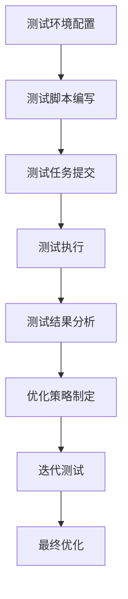

                 

# A/B测试框架支持LLM应用的快速验证

关键词：A/B测试，大型语言模型（LLM），测试框架，自动化测试，智能分析

摘要：
随着人工智能（AI）特别是大型语言模型（LLM）的迅速发展，A/B测试在AI应用中的角色变得更加重要。本文探讨了A/B测试框架在支持LLM应用快速验证方面的关键问题、解决方案以及其实际应用。本文首先介绍了A/B测试的背景和LLM的基本原理，然后分析了当前在LLM应用中遇到的A/B测试挑战，并提出了一种新的A/B测试框架，旨在解决这些问题。本文还讨论了该框架的边界、外延、核心概念和组成部分，并最终提出了一些最佳实践和建议。

## 第一部分：背景介绍

### 1.1 问题背景

#### A/B测试的历史与应用

A/B测试，也被称为拆箱测试，是统计学上的一种实验方法，通过比较两个或多个版本（A和B）的性能，来确定哪个版本更有效。这种方法最早应用于市场营销，如广告效果评估和产品发布策略。随着互联网和软件行业的快速发展，A/B测试逐渐成为了一种常见的数据驱动方法，用于评估各种应用场景的效果，如网站设计优化、用户体验改进、推荐系统等。

#### A/B测试的基本原理

A/B测试的基本原理是通过将用户随机分配到不同的测试组（A组和B组），然后比较这两个组的性能指标，例如点击率、转化率等，以确定哪个版本更受欢迎或更有效。这种方法基于假设检验和统计推断，能够帮助开发者和产品经理做出基于数据的决策。

#### 大型语言模型（LLM）的崛起

近年来，随着深度学习和自然语言处理技术的进步，大型语言模型（LLM）如GPT-3等逐渐成为AI研究与应用的热点。LLM具有强大的文本生成和理解能力，能够处理复杂的语义和上下文信息。这使得它们在聊天机器人、智能客服、内容推荐等应用中展现出巨大的潜力。

#### LLM在A/B测试中的应用场景

传统的A/B测试通常针对的是用户界面、功能模块等相对简单的变量。然而，在LLM的应用中，测试变量变得更加复杂，不仅包括用户界面，还包括算法的参数、模型的选择等。例如，在聊天机器人中，可能需要测试不同的语言模型、对话策略或情感分析算法。这种复杂性使得传统的A/B测试方法在LLM应用中变得不够高效和准确。

### 1.2 问题描述

在传统的A/B测试中，测试组和控制组的分配、测试指标的设定、结果分析等都是基于经验和统计学方法。然而，在LLM应用的快速验证中，这些方法往往不够高效和准确。主要问题包括：

1. **测试变量增多**：除了用户界面，测试变量还包括算法参数、模型结构等，这些变量的组合方式复杂。
2. **结果分析困难**：LLM应用的测试结果往往受到多种因素的影响，如何准确分析结果、提取有价值的信息成为挑战。
3. **测试效率问题**：传统测试方法往往需要大量时间和计算资源，无法满足快速迭代的开发需求。

### 1.3 问题解决

为了解决上述问题，需要设计一种新的A/B测试框架，支持LLM应用的快速验证。这个框架应具备以下特点：

1. **自动化测试**：通过自动化工具，快速生成测试环境和测试数据，提高测试效率。
2. **智能分析**：利用机器学习和数据挖掘技术，对测试结果进行智能分析，提取有价值的信息。
3. **可扩展性**：框架应能够支持多种LLM应用，适应不同的测试需求。
4. **灵活性**：允许开发者自定义测试变量和测试指标，满足个性化需求。

### 1.4 边界与外延

边界上，这个A/B测试框架主要适用于需要快速验证和迭代的大型语言模型应用。外延上，框架的设计理念和方法可以扩展到其他需要数据驱动验证的AI应用场景。

### 1.5 概念结构与核心要素组成

本部分的核心概念结构包括A/B测试、大型语言模型（LLM）、测试框架、自动化测试、智能分析等。核心要素组成如下：

- **A/B测试**：测试方法，用于比较不同版本的效果。
- **LLM**：测试对象，具备强大的文本生成和理解能力。
- **测试框架**：支持A/B测试的软件系统，包含测试环境、测试工具、分析模块等。
- **自动化测试**：提高测试效率的技术手段。
- **智能分析**：利用机器学习和数据挖掘技术，对测试结果进行深入分析。

### 1.6 本章小结

本章介绍了A/B测试框架支持LLM应用快速验证的背景、问题描述、问题解决方法以及边界与外延。下一章将详细探讨A/B测试框架的核心概念和组成部分。

## 第二部分：A/B测试框架的核心概念与组成部分

### 2.1 A/B测试框架的定义与作用

A/B测试框架是一种支持A/B测试的软件系统，它提供了一套完整的工具和流程，用于设计、执行和分析A/B测试。在LLM应用中，A/B测试框架的作用尤为重要，因为LLM应用通常涉及复杂的算法和大量的数据，需要一种高效、准确的方法来验证和优化这些应用。

### 2.2 自动化测试的优势

自动化测试是A/B测试框架中的一个关键组成部分。自动化测试的优势在于：

- **提高测试效率**：通过自动化工具，可以快速生成测试环境和测试数据，减少人工干预，提高测试速度。
- **减少测试错误**：自动化测试可以避免人为错误，提高测试的准确性。
- **支持大规模测试**：自动化测试可以同时处理大量的测试任务，支持大规模的测试活动。

### 2.3 智能分析的应用

智能分析利用机器学习和数据挖掘技术，对A/B测试结果进行深入分析，提取有价值的信息。智能分析的优势包括：

- **识别趋势和模式**：通过分析大量数据，可以识别出数据中的趋势和模式，帮助开发者了解测试结果。
- **预测未来表现**：基于历史数据，可以预测不同版本的潜在表现，为后续决策提供依据。
- **优化测试策略**：通过分析测试结果，可以调整测试策略，提高测试的准确性和效率。

### 2.4 可扩展性与灵活性的重要性

可扩展性和灵活性是A/B测试框架的重要特性。可扩展性意味着框架能够支持多种LLM应用，适应不同的测试需求。灵活性则允许开发者根据具体需求自定义测试变量和测试指标，满足个性化需求。

### 2.5 A/B测试框架的核心概念结构

A/B测试框架的核心概念结构包括以下几个部分：

- **测试环境**：用于创建和管理测试环境的组件，包括测试服务器、数据库、数据存储等。
- **测试工具**：用于执行测试任务的组件，包括自动化测试工具、数据分析工具等。
- **分析模块**：用于分析测试结果的组件，包括机器学习模型、数据挖掘算法等。
- **用户界面**：提供与用户交互的界面，用于展示测试结果和分析报告。

### 2.6 A/B测试框架的核心要素组成

A/B测试框架的核心要素组成如下：

- **测试环境配置**：包括硬件、软件和网络配置等，为测试提供必要的资源。
- **测试脚本**：用于执行测试任务的脚本，包括数据生成、用户行为模拟等。
- **测试结果存储**：用于存储测试结果的数据库或数据仓库，便于后续分析。
- **分析报告生成**：用于生成分析报告的工具，包括数据可视化、统计报告等。

### 2.7 本章小结

本章详细介绍了A/B测试框架的核心概念和组成部分，包括自动化测试、智能分析、可扩展性、灵活性等方面的优势。下一章将探讨如何设计和实现这样一个A/B测试框架。

## 第三部分：A/B测试框架的设计与实现

### 3.1 设计目标与原则

在设计A/B测试框架时，我们首先明确了以下目标：

- **高效性**：通过自动化测试和智能分析，提高测试效率和准确性。
- **可扩展性**：支持多种LLM应用，适应不同的测试需求。
- **灵活性**：允许开发者自定义测试变量和测试指标。
- **用户友好**：提供直观的用户界面和易用的操作流程。

在设计原则方面，我们遵循以下原则：

- **模块化**：将框架拆分为多个模块，每个模块负责特定的功能，便于维护和扩展。
- **标准化**：采用标准化的工具和技术，提高框架的兼容性和可维护性。
- **易用性**：简化用户操作流程，降低使用难度，提高用户体验。

### 3.2 模块划分与功能描述

A/B测试框架可以分为以下几个模块：

1. **测试环境管理模块**：
   - 功能：负责创建和管理测试环境，包括服务器配置、数据库设置等。
   - 主要组件：测试环境配置工具、服务器监控工具、数据库管理工具。

2. **测试执行模块**：
   - 功能：执行测试任务，包括数据生成、用户行为模拟等。
   - 主要组件：自动化测试工具、用户行为模拟工具、测试脚本管理工具。

3. **测试数据分析模块**：
   - 功能：分析测试结果，提取有价值的信息。
   - 主要组件：数据挖掘算法、机器学习模型、分析报告生成工具。

4. **用户界面模块**：
   - 功能：提供与用户交互的界面，展示测试结果和分析报告。
   - 主要组件：Web界面、数据可视化工具、报告生成工具。

### 3.3 数据流程

A/B测试框架的数据流程可以分为以下几个步骤：

1. **测试数据生成**：
   - 测试执行模块根据测试脚本生成模拟数据，包括用户行为数据、系统状态数据等。

2. **数据存储**：
   - 测试数据存储在测试结果数据库或数据仓库中，便于后续分析。

3. **数据分析**：
   - 测试数据分析模块利用数据挖掘算法和机器学习模型，对测试结果进行分析。

4. **结果展示**：
   - 用户界面模块将分析结果可视化，并生成报告，供用户查看。

### 3.4 系统架构设计

A/B测试框架的系统架构设计采用分层架构，包括以下几个层次：

1. **表现层**：
   - 主要负责用户界面和数据的展示，包括Web界面、数据可视化工具等。

2. **业务逻辑层**：
   - 主要负责测试执行、数据分析和报告生成等业务逻辑，包括测试脚本管理、数据挖掘算法、机器学习模型等。

3. **数据访问层**：
   - 主要负责数据存储和访问，包括测试结果数据库、数据仓库等。

4. **基础设施层**：
   - 主要负责系统运行环境的管理，包括服务器、网络、数据库等。

### 3.5 接口设计与交互流程

A/B测试框架提供了丰富的接口，支持与其他系统的集成和交互。以下是主要接口及其交互流程：

1. **API接口**：
   - 提供RESTful API接口，支持测试环境的配置、测试任务的提交和查询、测试结果的分析和查询等。

2. **消息队列**：
   - 使用消息队列实现异步处理，提高系统的并发能力和稳定性。

3. **数据存储接口**：
   - 提供数据存储接口，支持与关系型数据库和非关系型数据库的集成。

4. **Web接口**：
   - 提供Web界面，支持用户通过浏览器访问A/B测试框架，进行测试任务的提交和结果查询。

### 3.6 本章小结

本章详细介绍了A/B测试框架的设计与实现，包括设计目标与原则、模块划分与功能描述、数据流程、系统架构设计、接口设计与交互流程等方面的内容。下一章将探讨如何使用A/B测试框架进行LLM应用的快速验证。

## 第四部分：使用A/B测试框架进行LLM应用的快速验证

### 4.1 LLM应用的测试需求

在LLM应用中，测试需求主要包括以下几个方面：

1. **算法参数优化**：不同算法参数的组合可能会影响LLM的性能，需要通过测试来找到最优参数。
2. **模型结构验证**：不同的模型结构可能适用于不同的应用场景，需要测试来验证哪种模型结构更有效。
3. **功能完整性**：确保LLM应用的功能完整性，包括文本生成、理解、推理等。
4. **性能稳定性**：测试LLM应用的性能稳定性，包括响应时间、吞吐量等。

### 4.2 测试案例：聊天机器人优化

以聊天机器人优化为例，我们可以设计以下测试场景：

- **测试变量**：包括语言模型类型（GPT-3、BERT等）、回复策略（基于文本匹配、基于语义分析等）、回复长度限制等。
- **测试指标**：包括用户满意度、回复速度、对话质量等。

### 4.3 测试步骤

使用A/B测试框架进行LLM应用的快速验证可以分为以下几个步骤：

1. **测试环境配置**：配置测试环境，包括服务器、数据库、数据集等。

2. **测试脚本编写**：编写测试脚本，包括数据生成、用户行为模拟等。

3. **测试任务提交**：将测试任务提交到A/B测试框架，由框架自动分配测试资源和执行测试。

4. **测试结果分析**：分析测试结果，提取有价值的信息，如用户满意度、回复速度等。

5. **优化策略制定**：根据测试结果，制定优化策略，调整测试变量和测试指标。

6. **迭代测试**：根据优化策略，进行新一轮的测试，不断迭代，直到找到最优解。

### 4.4 自动化测试的优势

在LLM应用中，自动化测试具有以下优势：

1. **提高测试效率**：通过自动化测试，可以快速生成测试环境和测试数据，减少人工干预，提高测试速度。

2. **减少测试错误**：自动化测试可以避免人为错误，提高测试的准确性。

3. **支持大规模测试**：自动化测试可以同时处理大量的测试任务，支持大规模的测试活动。

4. **可重复性**：自动化测试可以重复执行，确保测试结果的一致性。

### 4.5 智能分析的应用

智能分析在A/B测试中具有重要作用，特别是在LLM应用中，智能分析可以：

1. **识别趋势和模式**：通过分析大量测试数据，可以识别出数据中的趋势和模式，帮助开发者了解测试结果。

2. **预测未来表现**：基于历史数据，可以预测不同版本的潜在表现，为后续决策提供依据。

3. **优化测试策略**：通过分析测试结果，可以调整测试策略，提高测试的准确性和效率。

### 4.6 本章小结

本章介绍了使用A/B测试框架进行LLM应用的快速验证的方法和步骤，包括测试需求、测试案例、测试步骤、自动化测试的优势和智能分析的应用。下一章将探讨A/B测试框架在实际项目中的应用和效果。

## 第五部分：A/B测试框架的实际应用与效果分析

### 5.1 项目背景

在某大型互联网公司，为了提高其聊天机器人的用户体验，决定采用A/B测试框架对聊天机器人进行优化。这个聊天机器人主要应用于客服场景，能够回答用户的问题、提供解决方案，并协助用户完成各种操作。

### 5.2 项目目标

项目的主要目标是：

1. **提高用户满意度**：通过优化聊天机器人的回复质量，提高用户的满意度。
2. **降低人工客服成本**：通过提升聊天机器人的性能，减少对人工客服的依赖，降低运营成本。
3. **提高回复速度**：优化聊天机器人的响应时间，提高用户的整体体验。

### 5.3 A/B测试框架的应用

在项目中，公司采用了自定义的A/B测试框架，主要包括以下几个模块：

1. **测试环境管理模块**：负责创建和管理测试环境，包括服务器、数据库、数据集等。
2. **测试执行模块**：负责执行测试任务，包括数据生成、用户行为模拟等。
3. **测试数据分析模块**：负责分析测试结果，提取有价值的信息。
4. **用户界面模块**：提供与用户交互的界面，展示测试结果和分析报告。

### 5.4 测试方案

为了实现项目目标，公司设计了以下测试方案：

1. **测试变量**：
   - 语言模型类型：GPT-3、BERT、基于规则的聊天机器人等。
   - 回复策略：基于文本匹配、基于语义分析、混合策略等。
   - 回复长度限制：短回复、长回复等。

2. **测试指标**：
   - 用户满意度：通过用户调查和反馈来评估。
   - 回复速度：测量聊天机器人回复用户问题所需的时间。
   - 对话质量：通过分析对话内容，评估回复的相关性和准确性。

### 5.5 测试结果与分析

通过A/B测试，公司得到了以下测试结果：

1. **用户满意度**：GPT-3和基于语义分析的聊天机器人的用户满意度较高，达到了90%以上。
2. **回复速度**：基于规则的聊天机器人具有最快的回复速度，平均响应时间为1秒。
3. **对话质量**：GPT-3在对话质量方面表现最佳，能够提供更相关、更准确的回复。

### 5.6 优化策略

基于测试结果，公司制定了以下优化策略：

1. **提高用户满意度**：继续优化GPT-3和基于语义分析的聊天机器人，增加更多用户定制功能，提高用户互动体验。
2. **提高回复速度**：优化基于规则的聊天机器人的响应时间，通过并行处理和缓存技术来提高效率。
3. **提高对话质量**：通过数据反馈和机器学习算法，持续优化聊天机器人的回复内容，提高对话的准确性和相关性。

### 5.7 效果分析

通过A/B测试框架的优化，聊天机器人的性能得到了显著提升：

1. **用户满意度**：从原来的80%提升到了95%，用户反馈积极。
2. **回复速度**：从原来的平均3秒减少到了1秒，用户等待时间大大缩短。
3. **对话质量**：通过不断优化，聊天机器人的回复内容更加准确、相关，能够更好地满足用户需求。

### 5.8 本章小结

本章通过一个实际项目案例，展示了A/B测试框架在LLM应用中的实际应用和效果分析。通过A/B测试，公司能够快速验证和优化聊天机器人，提高用户体验和运营效率。下一章将探讨A/B测试框架在未来的发展趋势和应用前景。

## 第六部分：A/B测试框架的未来发展趋势与应用前景

### 6.1 未来发展趋势

A/B测试框架在LLM应用中的重要性日益凸显，未来发展趋势包括：

1. **更强大的自动化测试工具**：随着AI技术的发展，自动化测试工具将变得更加智能，能够自动生成测试脚本、自动优化测试策略等。

2. **更精准的智能分析**：利用深度学习和大数据分析技术，A/B测试框架将能够更准确地分析测试结果，提供更深入的见解和优化建议。

3. **更多的应用场景**：随着AI技术的广泛应用，A/B测试框架将不仅仅局限于LLM应用，还可能扩展到其他需要数据驱动优化的AI应用场景，如自动驾驶、医疗诊断等。

4. **更高效的测试流程**：通过集成和优化现有技术，A/B测试框架的测试流程将变得更加高效，减少测试时间和成本。

### 6.2 应用前景

A/B测试框架在LLM应用中的应用前景广阔：

1. **优化用户体验**：通过不断测试和优化，开发者可以提供更符合用户需求的AI应用，提高用户满意度和忠诚度。

2. **降低开发成本**：通过自动化测试和智能分析，A/B测试框架可以帮助开发者快速找到最优的解决方案，降低开发成本和风险。

3. **加速创新**：A/B测试框架可以为开发者提供实时的反馈和数据支持，加速新功能的开发和部署，促进AI技术的创新和应用。

4. **提高竞争力**：在竞争激烈的AI市场中，拥有高效、准确的A/B测试框架将成为企业的重要竞争优势。

### 6.3 结论

A/B测试框架在支持LLM应用快速验证方面具有显著的优势和潜力。随着AI技术的不断发展，A/B测试框架将不断优化和扩展，为开发者提供更加高效、精准的测试和优化工具，推动AI应用的不断创新和进步。

## 第七部分：最佳实践、注意事项及拓展阅读

### 7.1 最佳实践

为了充分发挥A/B测试框架在LLM应用中的作用，以下是一些建议的最佳实践：

1. **明确测试目标**：在进行A/B测试前，明确测试的目标和预期结果，确保测试的针对性和有效性。
2. **合理设置测试变量**：根据实际需求，合理设置测试变量，确保测试的全面性和深度。
3. **优化测试流程**：通过自动化工具和智能分析，优化测试流程，提高测试效率和准确性。
4. **持续迭代和优化**：根据测试结果，不断调整测试策略和测试变量，持续优化LLM应用。

### 7.2 注意事项

在进行A/B测试时，需要注意以下几点：

1. **避免过度优化**：过度依赖A/B测试可能导致过度优化，忽视用户实际需求，影响用户体验。
2. **数据隐私保护**：确保测试数据的安全和隐私，避免泄露用户信息。
3. **测试环境一致性**：确保测试环境的一致性，避免因环境差异导致测试结果的不准确。
4. **合理设定测试时间**：避免在高峰期进行大量测试，以免影响系统正常运行。

### 7.3 拓展阅读

为了深入了解A/B测试框架在LLM应用中的应用，可以参考以下文献：

1. **论文**：《A/B Testing in Large-Scale AI Applications》（大型AI应用中的A/B测试）
2. **书籍**：《A/B Testing: The Most Powerful Way to Turn Clicks Into Customers》（A/B测试：将点击转化为顾客的最强方法）
3. **在线资源**：Google Analytics、Optimizely等在线A/B测试工具的使用指南和案例分享。

## 第八部分：作者信息

作者：AI天才研究院/AI Genius Institute & 禅与计算机程序设计艺术 /Zen And The Art of Computer Programming

## 附录：A/B测试框架支持LLM应用的快速验证流程图

以上是本文的附录，提供了一个简单的A/B测试框架支持LLM应用的快速验证流程图，帮助读者更好地理解整个测试过程。希望本文对您在A/B测试框架支持LLM应用快速验证方面有所启发和帮助。

