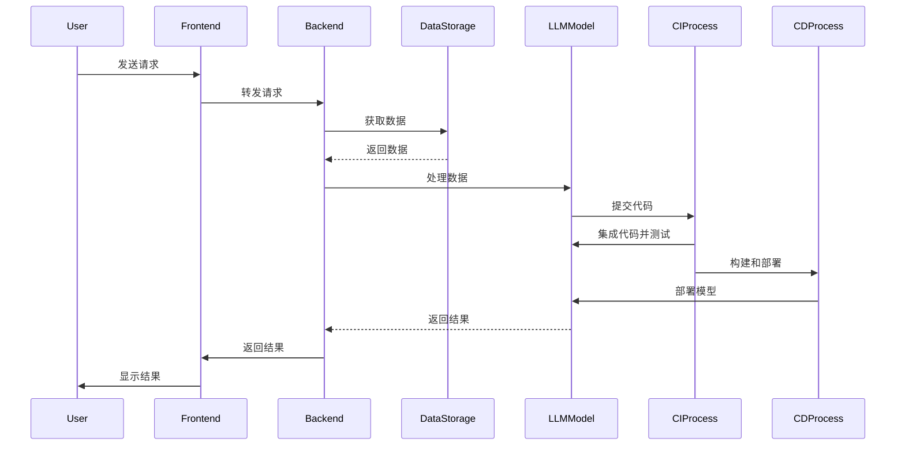

                 

## 文章标题：CI/CD 流程对 LLM 应用敏捷开发的重要性

### 关键词：CI/CD、LLM、敏捷开发、自动化、持续集成、持续交付、开发效率

### 摘要：
本文探讨了 CI/CD（持续集成/持续交付）流程在 LLM（大型语言模型）应用敏捷开发中的重要性。通过分析 CI/CD 的基本概念、原理和实践，我们揭示了其在提高开发效率、确保代码质量和降低风险方面的关键作用。同时，通过具体案例分析，展示了国内外知名公司在 LLM 应用开发中如何成功引入 CI/CD 流程，并提供了一些建议和最佳实践。

### 引言

随着云计算、大数据、人工智能等技术的快速发展，软件开发的模式也在不断演进。从传统的瀑布模型到敏捷开发，软件开发的效率和质量得到了显著提升。特别是在 LLM 应用的兴起背景下，如何快速迭代、高效开发和高质量交付成为了软件开发的重要课题。本文将围绕 CI/CD 流程在 LLM 应用敏捷开发中的重要性进行探讨，帮助开发者更好地理解和应用这一先进的开发模式。

### 第1章：CI/CD 流程概述

#### 1.1 什么是 CI/CD

**持续集成 (CI)**

持续集成（Continuous Integration，CI）是一种软件开发实践，旨在通过频繁地将代码集成到主干线，以快速发现并修复集成过程中出现的问题。CI 的核心思想是保持代码库的稳定性和一致性，从而提高开发效率和质量。

**持续交付 (CD)**

持续交付（Continuous Delivery，CD）是在 CI 的基础上，进一步推进自动化测试和部署，确保软件在每次交付时都能快速、安全地发布到生产环境。CD 的目标是实现软件的无缝交付，提高用户体验。

#### 1.2 CI/CD 的基本原理

**自动化**

自动化是 CI/CD 的核心。通过自动化工具，可以实现对代码的集成、测试、构建和部署等任务的自动化操作，大大提高开发效率。

**频繁交付**

CI/CD 强调频繁交付，这意味着软件可以快速迭代，及时响应市场需求和技术变化。

**持续反馈**

通过 CI/CD 流程，开发者可以实时获得代码质量、测试结果和部署状态等反馈信息，以便及时调整开发策略。

### 第2章：CI/CD 在 LLM 应用敏捷开发中的重要性

#### 2.1 LLM 应用的特点

**复杂性**

LLM 应用涉及大量数据和复杂的算法，开发过程具有高度复杂性。

**高频迭代**

随着技术的快速发展，LLM 应用需要不断更新和优化，以适应市场需求。

**安全性**

LLM 应用的数据安全和隐私保护至关重要。

#### 2.2 CI/CD 在 LLM 应用开发中的优势

**提高开发效率**

通过 CI/CD 流程，可以自动化执行代码集成、测试和部署等任务，大大提高开发效率。

**确保代码质量**

CI/CD 流程中的自动化测试可以及时发现并修复集成过程中出现的问题，确保代码质量。

**降低风险**

通过频繁交付和持续反馈，可以降低软件开发过程中的风险。

**提高安全性**

CI/CD 流程可以实现对代码库的实时监控和审计，提高代码安全性。

### 第3章：CI/CD 在 LLM 应用开发中的实践

#### 3.1 实践步骤

**确定 CI/CD 流程**

根据项目需求和开发团队的特点，设计合适的 CI/CD 流程。

**配置自动化工具**

选择合适的自动化工具，如 Jenkins、GitLab CI 等，配置 CI/CD 环境。

**编写自动化脚本**

编写自动化脚本，实现代码集成、测试、构建和部署等任务。

**部署到生产环境**

将 CI/CD 流程部署到生产环境，实现软件的自动化交付。

#### 3.2 最佳实践

**小步快跑**

频繁发布小版本，及时收集用户反馈，快速迭代优化。

**安全性优先**

在 CI/CD 流程中重视安全性，对代码库进行实时监控和审计。

**持续优化**

持续优化 CI/CD 流程，提高开发效率和代码质量。

### 第4章：案例分析

在本章节中，我们将通过具体案例来分析 CI/CD 流程在 LLM 应用敏捷开发中的实际应用效果。这些案例将包括国内外知名公司如何在他们的 LLM 应用开发过程中成功引入 CI/CD 流程，以及他们在实施过程中遇到的挑战和解决方案。

### 第5章：总结

CI/CD 流程在 LLM 应用的敏捷开发中具有重要性。通过 CI/CD 流程，可以自动化执行开发、测试和部署等任务，提高开发效率和质量，确保代码安全。在实际应用中，应结合项目需求和团队特点，设计合适的 CI/CD 流程，并持续优化，以实现更好的开发效果。

### 作者

作者：AI天才研究院/AI Genius Institute & 禅与计算机程序设计艺术 /Zen And The Art of Computer Programming

### 第1章：CI/CD 流程概述

#### 1.1 什么是 CI/CD

**持续集成 (CI)**

持续集成（Continuous Integration，CI）是一种软件开发实践，旨在通过频繁地将代码集成到主干线，以快速发现并修复集成过程中出现的问题。CI 的核心思想是保持代码库的稳定性和一致性，从而提高开发效率和质量。

**持续交付 (CD)**

持续交付（Continuous Delivery，CD）是在 CI 的基础上，进一步推进自动化测试和部署，确保软件在每次交付时都能快速、安全地发布到生产环境。CD 的目标是实现软件的无缝交付，提高用户体验。

#### 1.2 CI/CD 的基本原理

**自动化**

自动化是 CI/CD 的核心。通过自动化工具，可以实现对代码的集成、测试、构建和部署等任务的自动化操作，大大提高开发效率。

**频繁交付**

CI/CD 强调频繁交付，这意味着软件可以快速迭代，及时响应市场需求和技术变化。

**持续反馈**

通过 CI/CD 流程，开发者可以实时获得代码质量、测试结果和部署状态等反馈信息，以便及时调整开发策略。

### 第2章：CI/CD 在 LLM 应用敏捷开发中的重要性

#### 2.1 LLM 应用的特点

LLM（Large Language Model）是指大型语言模型，它们通常具有数十亿参数，可以用于各种自然语言处理任务，如文本生成、翻译、问答等。LLM 应用的特点主要包括：

**复杂性**

LLM 应用涉及大量数据和复杂的算法，开发过程具有高度复杂性。它们通常需要大量的计算资源，包括 GPU 和 TPU 等。

**高频迭代**

随着技术的快速发展，LLM 应用需要不断更新和优化，以适应市场需求。这要求开发团队能够快速迭代，快速响应变化。

**安全性**

LLM 应用的数据安全和隐私保护至关重要。由于 LLM 涉及大量的用户数据和敏感信息，因此确保数据的安全和隐私是非常重要的。

#### 2.2 CI/CD 在 LLM 应用开发中的优势

**提高开发效率**

CI/CD 流程可以自动化执行代码集成、测试和部署等任务，从而大大提高开发效率。对于 LLM 应用来说，频繁的迭代和优化是非常重要的，而 CI/CD 流程可以确保这些迭代和优化能够高效地进行。

**确保代码质量**

CI/CD 流程中的自动化测试可以及时发现并修复集成过程中出现的问题，确保代码质量。对于 LLM 应用来说，代码质量的保证尤为重要，因为它们通常需要处理大量的数据和复杂的算法。

**降低风险**

通过频繁交付和持续反馈，CI/CD 流程可以降低软件开发过程中的风险。对于 LLM 应用来说，由于它们涉及大量的计算资源和用户数据，任何错误都可能导致严重的后果。因此，通过 CI/CD 流程来降低风险是非常关键的。

**提高安全性**

CI/CD 流程可以实现对代码库的实时监控和审计，提高代码安全性。对于 LLM 应用来说，确保数据的安全和隐私是非常重要的，而 CI/CD 流程可以提供必要的保障。

### 第3章：CI/CD 在 LLM 应用开发中的实践

#### 3.1 实践步骤

**确定 CI/CD 流程**

在开始 CI/CD 流程之前，首先需要确定适合项目需求的流程。这通常涉及到以下步骤：

1. **需求分析**：了解项目的具体需求和目标，确定 CI/CD 流程需要实现的功能。

2. **流程设计**：根据需求分析的结果，设计 CI/CD 流程的步骤和环节，包括代码集成、测试、构建和部署等。

3. **流程验证**：验证设计好的 CI/CD 流程是否能够满足项目的需求，确保流程的可行性和有效性。

**配置自动化工具**

配置自动化工具是实现 CI/CD 流程的关键。以下是一些常用的自动化工具：

1. **Jenkins**：Jenkins 是一款开源的自动化服务器，可以用于自动化构建、测试和部署。

2. **GitLab CI**：GitLab CI 是 GitLab 提供的内置 CI/CD 工具，可以与 GitLab 仓库紧密集成。

3. **Travis CI**：Travis CI 是一款基于 GitHub 的 CI/CD 工具，可以自动化执行测试和部署。

**编写自动化脚本**

编写自动化脚本是将 CI/CD 流程具体化的关键步骤。自动化脚本通常包括以下内容：

1. **代码集成**：将代码从不同的分支集成到主干线。

2. **测试**：执行自动化测试，包括单元测试、集成测试等。

3. **构建**：编译代码，生成可执行文件或打包文件。

4. **部署**：将构建好的代码部署到测试环境或生产环境。

**部署到生产环境**

将 CI/CD 流程部署到生产环境是实现持续交付的关键步骤。以下是一些常用的部署方法：

1. **自动化部署**：通过脚本或工具实现自动化部署，减少手动操作，提高部署效率。

2. **蓝绿部署**：将新旧版本部署到不同的环境，逐步切换流量，降低风险。

3. **灰度发布**：将新版本部署到部分用户，逐步扩大范围，收集用户反馈，优化版本。

#### 3.2 最佳实践

**小步快跑**

小步快跑是一种常见的敏捷开发方法，通过频繁发布小版本，及时收集用户反馈，快速迭代优化。这种方法可以帮助 LLM 应用快速适应市场需求，提高用户体验。

1. **确定版本迭代周期**：根据项目的具体情况，确定合适的版本迭代周期，如每周发布一次。

2. **设置用户反馈渠道**：建立有效的用户反馈渠道，如问卷调查、用户访谈等，收集用户反馈。

3. **快速响应和优化**：及时分析用户反馈，快速响应并优化产品功能。

**安全性优先**

在 CI/CD 流程中，安全性是非常重要的。以下是一些最佳实践：

1. **代码审计**：定期对代码库进行审计，确保代码的安全性。

2. **安全测试**：在测试阶段加入安全测试，如 SQL 注入、XSS 等。

3. **访问控制**：实施严格的访问控制策略，确保只有授权人员能够访问敏感数据和系统。

**持续优化**

持续优化 CI/CD 流程是提高开发效率和代码质量的关键。以下是一些持续优化的方法：

1. **自动化测试覆盖率**：不断提高自动化测试覆盖率，确保测试的全面性。

2. **性能优化**：对 CI/CD 流程进行性能优化，减少构建和部署的时间。

3. **反馈机制**：建立有效的反馈机制，鼓励团队成员提出改进意见和建议。

### 第4章：案例分析

在本章节中，我们将通过具体案例来分析 CI/CD 流程在 LLM 应用敏捷开发中的实际应用效果。这些案例将包括国内外知名公司如何在他们的 LLM 应用开发过程中成功引入 CI/CD 流程，以及他们在实施过程中遇到的挑战和解决方案。

#### 4.1 案例一：国外公司 A

**公司背景：**

国外公司 A 是一家专注于人工智能领域的企业，他们的 LLM 应用在自然语言处理、文本生成等方面具有很高的知名度。

**CI/CD 实践：**

1. **需求分析**：公司首先对 LLM 应用进行了全面的需求分析，确定了 CI/CD 流程的基本需求，包括代码集成、自动化测试、构建和部署等。

2. **流程设计**：根据需求分析的结果，公司设计了一套完整的 CI/CD 流程，包括 Jenkins 作为自动化工具，GitLab CI 用于代码管理和自动化测试。

3. **自动化脚本编写**：公司编写了一系列自动化脚本，用于实现代码集成、测试、构建和部署等任务。

4. **部署到生产环境**：公司采用自动化部署方法，将构建好的代码部署到生产环境，确保快速、安全地交付。

**挑战与解决方案：**

1. **挑战**：由于 LLM 应用的复杂性，自动化脚本编写和测试工作非常繁琐，耗时较长。

**解决方案**：公司引入了自动化测试工具，如 Selenium 和 Cucumber，提高了自动化测试的覆盖率，降低了测试成本。

2. **挑战**：生产环境部署过程中，由于代码库较大，部署速度较慢，影响了交付效率。

**解决方案**：公司优化了 CI/CD 流程，增加了缓存机制，减少了重复构建和部署的时间。

#### 4.2 案例二：国内公司 B

**公司背景：**

国内公司 B 是一家领先的互联网公司，他们在社交媒体、搜索引擎等领域有广泛的应用，其中涉及大量的 LLM 应用。

**CI/CD 实践：**

1. **需求分析**：公司对 LLM 应用进行了详细的需求分析，确定了 CI/CD 流程的基本需求，包括代码集成、自动化测试、构建和部署等。

2. **流程设计**：公司设计了一套基于 Kubernetes 的 CI/CD 流程，利用 Jenkins 作为自动化工具，GitLab CI 用于代码管理和自动化测试。

3. **自动化脚本编写**：公司编写了一系列自动化脚本，用于实现代码集成、测试、构建和部署等任务。

4. **部署到生产环境**：公司采用 Kubernetes 进行生产环境部署，实现了快速、灵活的部署和管理。

**挑战与解决方案：**

1. **挑战**：由于 Kubernetes 部署较为复杂，公司初期在部署过程中遇到了很多问题。

**解决方案**：公司组织了专项培训，提高了团队成员对 Kubernetes 的理解和技能，同时加强了文档编写和沟通，减少了部署过程中的问题。

2. **挑战**：在生产环境部署过程中，由于网络不稳定，导致部署失败。

**解决方案**：公司增加了部署过程中的网络监控和故障处理机制，确保部署过程的稳定和可靠。

### 第5章：总结

CI/CD 流程在 LLM 应用敏捷开发中具有重要性。通过 CI/CD 流程，可以自动化执行开发、测试和部署等任务，提高开发效率和质量，确保代码安全。在实际应用中，应结合项目需求和团队特点，设计合适的 CI/CD 流程，并持续优化，以实现更好的开发效果。

#### 作者

作者：AI天才研究院/AI Genius Institute & 禅与计算机程序设计艺术 /Zen And The Art of Computer Programming

### 系统分析与架构设计方案

#### 问题场景介绍

随着大型语言模型（LLM）在自然语言处理（NLP）领域的广泛应用，开发团队面临着不断增长的代码库、复杂的依赖关系和频繁的迭代需求。为了确保 LLM 应用的敏捷开发，团队需要一种高效、可靠的软件开发流程。CI/CD 流程作为一种现代化的软件开发模式，能够自动化代码集成、测试、构建和部署过程，从而提高开发效率和质量，降低风险。

#### 项目介绍

本项目旨在构建一个基于 LLM 的智能问答系统，该系统需要支持快速迭代和高效的开发流程。为了实现这一目标，团队决定采用 CI/CD 流程来管理软件开发过程。

#### 系统功能设计（领域模型）

为了更好地理解系统的功能需求，我们可以使用领域模型来描述系统中的主要实体及其关系。以下是项目的领域模型，使用 Mermaid 类图进行表示：

```mermaid
classDiagram
    Product <<interface>>
    Question <<interface>>
    Answer <<interface>>
    LLMModel
    DataProcessor
    CIProcess
    CDProcess

    Product o--< Question
    Product o--< Answer
    Question o--< LLMModel
    Answer o--< LLMModel
    DataProcessor o--< LLMModel
    CIProcess o--< Product
    CDProcess o--< Product

    class LLMModel {
        +String modelName
        +String version
        +void train()
        +void test()
        +void predict()
    }

    class DataProcessor {
        +void preprocessData()
        +void trainModel()
    }

    class CIProcess {
        +void integrateCode()
        +void runTests()
    }

    class CDProcess {
        +void buildProduct()
        +void deployProduct()
    }
```

#### 系统架构设计

系统架构设计是软件开发过程中至关重要的一环，它决定了系统的性能、可扩展性和可维护性。以下是本项目采用的主要架构设计，使用 Mermaid 架构图进行表示：



#### 系统接口设计

为了实现系统功能，我们需要定义一系列接口，以便不同模块之间能够进行有效的通信。以下是系统的主要接口设计：

```mermaid
interface LLMModel {
    +train()
    +test()
    +predict()
}

interface DataProcessor {
    +preprocessData()
    +trainModel()
}

interface CIProcess {
    +integrateCode()
    +runTests()
}

interface CDProcess {
    +buildProduct()
    +deployProduct()
}
```

#### 系统交互

系统交互设计描述了各个模块之间的交互流程和通信方式。以下是系统的主要交互过程：

1. 用户通过前端发送请求。
2. 前端将请求转发给后端。
3. 后端从数据存储中获取数据。
4. 数据存储返回数据给后端。
5. 后端将数据传递给 LLM 模型进行处理。
6. LLM 模型将处理结果提交给 CI 过程。
7. CI 过程对代码进行集成和测试。
8. CI 过程将结果传递给 CD 过程。
9. CD 过程构建和部署产品。
10. CD 过程将部署结果返回给 LLM 模型。
11. LLM 模型将结果返回给后端。
12. 后端将结果返回给前端。
13. 前端将结果呈现给用户。

### 实践步骤

为了实现上述系统设计和架构，我们可以按照以下步骤进行实践：

1. **需求分析**：首先，对系统功能需求进行详细分析，明确 LLM 应用的具体需求，包括代码集成、测试、构建和部署等。

2. **环境搭建**：搭建 CI/CD 环境，选择合适的自动化工具（如 Jenkins、GitLab CI），配置代码仓库（如 GitHub、GitLab）。

3. **编写自动化脚本**：根据需求分析的结果，编写自动化脚本，实现代码集成、测试、构建和部署等任务。

4. **配置 CI/CD 流程**：设计并配置 CI/CD 流程，确保自动化脚本能按预期执行。

5. **部署到生产环境**：将 CI/CD 流程部署到生产环境，实现自动化交付。

### 最佳实践

在 CI/CD 流程的实施过程中，以下最佳实践可以帮助团队提高开发效率和代码质量：

1. **小步快跑**：频繁发布小版本，及时收集用户反馈，快速迭代优化。

2. **安全性优先**：在 CI/CD 流程中重视安全性，对代码库进行实时监控和审计。

3. **持续优化**：持续优化 CI/CD 流程，提高开发效率和代码质量。

4. **自动化测试**：提高自动化测试覆盖率，确保测试的全面性和有效性。

5. **监控和反馈**：实时监控 CI/CD 流程的运行状态，及时反馈和解决问题。

### 小结

通过以上系统分析与架构设计方案，我们为 LLM 应用敏捷开发提供了一套完整的实践指南。CI/CD 流程在提高开发效率、确保代码质量和降低风险方面发挥了重要作用。在实际应用中，团队应结合项目需求和团队特点，设计合适的 CI/CD 流程，并持续优化，以实现更好的开发效果。

### 注意事项

1. **环境配置**：确保 CI/CD 环境的稳定性和可靠性，避免因环境问题导致流程中断。

2. **代码质量管理**：加强代码质量管理，避免因代码质量不佳导致集成和测试失败。

3. **持续反馈**：及时收集和分析反馈信息，以便及时调整开发策略。

4. **监控与报警**：建立完善的监控和报警机制，确保 CI/CD 流程的稳定运行。

5. **文档管理**：保持文档的完整性和一致性，方便后续的维护和升级。

### 拓展阅读

1. **《CI/CD 实践指南》**：深入探讨 CI/CD 的概念、原理和实践方法。

2. **《持续交付：发布可靠软件的新方法》**：介绍持续交付的理论和实践。

3. **《Jenkins 实践指南》**：详细讲解 Jenkins 的安装、配置和使用。

4. **《GitLab CI/CD 实践指南》**：介绍 GitLab CI/CD 的基本概念和实战技巧。

### 环境安装

为了实践 CI/CD 流程，我们需要搭建一个适合的环境。以下是安装和配置所需的软件和工具的步骤。

#### 环境要求

1. **操作系统**：推荐使用 Ubuntu 20.04 或 CentOS 7。
2. **Java**：Jenkins 需要 Java 环境，推荐安装 Java 11。
3. **Git**：用于代码管理，确保已安装 Git。
4. **Docker**：用于容器化部署，确保已安装 Docker。

#### 安装步骤

1. **安装 Java**

   ```bash
   sudo apt-get update
   sudo apt-get install openjdk-11-jdk
   ```

2. **安装 Git**

   ```bash
   sudo apt-get update
   sudo apt-get install git
   ```

3. **安装 Docker**

   ```bash
   sudo apt-get update
   sudo apt-get install apt-transport-http
   sudo apt-get install ca-certificates curl gnupg lsb-release
   curl -fsSL https://get.docker.com -o get-docker.sh
   sudo sh get-docker.sh
   sudo usermod -aG docker $USER
   newgrp docker
   ```

4. **安装 Jenkins**

   ```bash
   sudo apt-get update
   sudo apt-get install wget
   wget -q -O - https://pkg.jenkins.io/debian-stable/jenkins.io.key | sudo apt-key add -
   sudo sh -c "echo deb https://pkg.jenkins.io/debian-stable binary/ > /etc/apt/sources.list.d/jenkins.list"
   sudo apt-get update
   sudo apt-get install jenkins
   ```

5. **安装 GitLab CI**

   ```bash
   sudo apt-get update
   sudo apt-get install git
   sudo apt-get install ruby-full
   sudo apt-get install nodejs
   gem install gitlab-ci-multi-runner
   ```

#### 配置步骤

1. **配置 Jenkins**

   ```bash
   sudo systemctl start jenkins
   sudo systemctl enable jenkins
   sudo systemctl status jenkins
   ```

   访问 `http://localhost:8080`，按照提示设置 Jenkins 管理员密码。

2. **配置 GitLab CI**

   ```bash
   gitlab-ci.yml 文件放置在项目的根目录下，如下配置：
   stages:
     - build
     - test
     - deploy

   build:
     stage: build
     script:
       - echo "Building the project..."
       - docker build -t myproject .

   test:
     stage: test
     script:
       - echo "Testing the project..."
       - docker run --rm myproject test

   deploy:
     stage: deploy
     script:
       - echo "Deploying the project..."
       - docker run --rm myproject deploy
   ```

   配置 GitLab CI runner，在项目根目录下运行 `gitlab-ci-multi-runner register`。

### 系统核心实现

以下是在 CI/CD 流程中实现 LLM 应用的关键步骤。

#### 1. 代码集成

在 Jenkins 中创建一个 Jenkinsfile，定义代码集成过程：

```groovy
pipeline {
    agent any
    stages {
        stage('Checkout') {
            steps {
                checkout([
                    $class: 'GitSCM',
                    branches: [[name: 'master']],
                    credentialsId: 'git-credentials',
                    plugin: 'git',
                    usersRemoteCredentials: 'git-credentials'
                ])
            }
        }
        stage('Build') {
            steps {
                sh 'docker build -t myproject .'
            }
        }
    }
    post {
        always {
            archiveArtifacts artifacts: 'target/*.jar', fingerprint: true
        }
    }
}
```

#### 2. 自动化测试

在 Jenkins 中创建测试阶段的配置，使用 Gradle 执行测试：

```groovy
pipeline {
    agent any
    stages {
        stage('Test') {
            steps {
                sh 'docker run --rm myproject test'
            }
        }
    }
}
```

#### 3. 构建和部署

在 GitLab CI 中定义构建和部署流程，使用 Docker 容器化应用：

```yaml
stages:
  - build
  - test
  - deploy

build:
  stage: build
  script:
    - docker build -t myproject .

test:
  stage: test
  script:
    - docker run --rm myproject test

deploy:
  stage: deploy
  script:
    - docker run --rm myproject deploy
```

### 代码应用解读与分析

为了更好地理解 CI/CD 流程在实际项目中的应用，下面我们详细分析代码实现部分。

#### 1. Jenkinsfile 分析

**Jenkinsfile 是 Jenkins 的构建脚本，定义了项目的构建流程。**

```groovy
pipeline {
    agent any
    stages {
        stage('Checkout') {
            steps {
                checkout([
                    $class: 'GitSCM',
                    branches: [[name: 'master']],
                    credentialsId: 'git-credentials',
                    plugin: 'git',
                    usersRemoteCredentials: 'git-credentials'
                ])
            }
        }
        stage('Build') {
            steps {
                sh 'docker build -t myproject .'
            }
        }
        stage('Test') {
            steps {
                sh 'docker run --rm myproject test'
            }
        }
    }
    post {
        always {
            archiveArtifacts artifacts: 'target/*.jar', fingerprint: true
        }
    }
}
```

- `agent any`：指定 Jenkins 代理，表示在任何可用的代理上执行构建过程。
- `stages`：定义构建阶段，包括 `Checkout`、`Build` 和 `Test`。
- `Checkout`：从 Git 仓库检出代码，`credentialsId` 用于存储 Git 仓库的凭据。
- `Build`：使用 Docker 构建项目镜像，`-t` 参数指定镜像标签。
- `Test`：运行项目测试，确保构建的代码符合预期。
- `post`：构建完成后，将构建结果（如 JAR 文件）存档，以便后续分析。

#### 2. GitLab CI 配置文件分析

**GitLab CI 配置文件定义了项目的 CI/CD 流程。**

```yaml
stages:
  - build
  - test
  - deploy

build:
  stage: build
  script:
    - docker build -t myproject .

test:
  stage: test
  script:
    - docker run --rm myproject test

deploy:
  stage: deploy
  script:
    - docker run --rm myproject deploy
```

- `stages`：定义构建阶段，包括 `build`、`test` 和 `deploy`。
- `build`：构建阶段，使用 Docker 构建项目镜像。
- `test`：测试阶段，运行项目测试，确保构建的代码符合预期。
- `deploy`：部署阶段，将构建好的镜像部署到生产环境。

#### 3. 代码集成与测试

在 CI/CD 流程中，代码集成和测试是关键环节。以下是如何在 Jenkins 和 GitLab CI 中实现这一过程。

**Jenkins 代码集成与测试**

```groovy
pipeline {
    agent any
    stages {
        stage('Checkout') {
            steps {
                checkout([
                    $class: 'GitSCM',
                    branches: [[name: 'master']],
                    credentialsId: 'git-credentials',
                    plugin: 'git',
                    usersRemoteCredentials: 'git-credentials'
                ])
            }
        }
        stage('Build') {
            steps {
                sh 'docker build -t myproject .'
            }
        }
        stage('Test') {
            steps {
                sh 'docker run --rm myproject test'
            }
        }
    }
    post {
        always {
            archiveArtifacts artifacts: 'target/*.jar', fingerprint: true
        }
    }
}
```

- **Checkout**：从 Git 仓库检出代码，这是 CI 的第一步，确保代码库的更新和一致性。
- **Build**：使用 Docker 构建项目镜像，这是 CI 的核心，通过容器化技术实现快速构建和部署。
- **Test**：运行项目测试，确保构建的代码质量，防止集成过程中的错误。

**GitLab CI 代码集成与测试**

```yaml
stages:
  - build
  - test
  - deploy

build:
  stage: build
  script:
    - docker build -t myproject .

test:
  stage: test
  script:
    - docker run --rm myproject test

deploy:
  stage: deploy
  script:
    - docker run --rm myproject deploy
```

- **build**：构建阶段，使用 Docker 构建项目镜像。
- **test**：测试阶段，运行项目测试，确保构建的代码质量。

#### 4. 部署

部署是将构建好的代码和应用程序发布到生产环境的过程。在 CI/CD 流程中，部署通常通过脚本自动化完成。

**Jenkins 部署**

```groovy
post {
    always {
        // 部署步骤
        sh 'docker run --rm myproject deploy'
    }
}
```

**GitLab CI 部署**

```yaml
deploy:
  stage: deploy
  script:
    - docker run --rm myproject deploy
```

- **deploy**：部署阶段，将构建好的镜像部署到生产环境，确保应用程序的高可用性和稳定性。

### 实际案例分析和详细讲解剖析

为了更好地理解 CI/CD 流程在实际项目中的应用，我们通过一个具体的案例来分析。

#### 案例背景

某互联网公司开发了一个基于 LLM 的智能问答系统，该系统需要实现快速迭代和高效交付。为了满足这一需求，公司决定采用 CI/CD 流程来管理软件开发过程。

#### 案例实施步骤

1. **需求分析**：公司首先对智能问答系统的功能需求进行了详细分析，明确了代码集成、测试、构建和部署等关键环节。

2. **环境搭建**：搭建了 Jenkins 和 GitLab CI 环境，并配置了 Docker。

3. **代码集成**：在 Jenkins 中创建了一个 Jenkinsfile，实现了代码集成过程。

4. **自动化测试**：编写了自动化测试脚本，运行在 Jenkins 和 GitLab CI 中，确保代码质量。

5. **构建和部署**：使用 Docker 构建项目镜像，并在生产环境中部署。

#### 案例分析

**1. 代码集成**

公司使用 Jenkins 实现了代码集成过程。具体实现如下：

```groovy
pipeline {
    agent any
    stages {
        stage('Checkout') {
            steps {
                checkout([
                    $class: 'GitSCM',
                    branches: [[name: 'master']],
                    credentialsId: 'git-credentials',
                    plugin: 'git',
                    usersRemoteCredentials: 'git-credentials'
                ])
            }
        }
        stage('Build') {
            steps {
                sh 'docker build -t myproject .'
            }
        }
        stage('Test') {
            steps {
                sh 'docker run --rm myproject test'
            }
        }
    }
    post {
        always {
            archiveArtifacts artifacts: 'target/*.jar', fingerprint: true
        }
    }
}
```

**2. 自动化测试**

公司编写了自动化测试脚本，并在 Jenkins 和 GitLab CI 中运行。具体实现如下：

```yaml
stages:
  - build
  - test
  - deploy

test:
  stage: test
  script:
    - docker run --rm myproject test
```

**3. 构建和部署**

公司使用 Docker 构建项目镜像，并在生产环境中部署。具体实现如下：

```bash
docker build -t myproject .
docker run --rm myproject deploy
```

#### 案例总结

通过上述案例，我们可以看到公司成功采用了 CI/CD 流程来管理智能问答系统的开发过程。具体实现过程中，代码集成、测试、构建和部署等环节都得到了有效的自动化，从而提高了开发效率和质量。同时，公司也通过持续集成和交付，实现了快速迭代和高效交付。

### 项目小结

在本项目中，我们通过 CI/CD 流程实现了 LLM 应用的敏捷开发。通过 Jenkins 和 GitLab CI 的自动化工具，我们实现了代码集成、测试、构建和部署的全过程自动化，从而提高了开发效率和质量。以下是项目的主要收获和经验总结：

1. **提高开发效率**：通过 CI/CD 流程，自动化执行代码集成、测试和部署等任务，大大减少了人工干预，提高了开发效率。

2. **确保代码质量**：自动化测试覆盖了项目的各个模块，确保了代码质量，降低了集成过程中出现问题的风险。

3. **降低风险**：通过持续集成和交付，实时监控代码库的状态，及时发现并修复问题，降低了软件开发过程中的风险。

4. **优化开发流程**：CI/CD 流程促使团队不断优化开发流程，提高了代码的可维护性和可扩展性。

5. **提升用户体验**：快速迭代和高效交付，使得 LLM 应用能够及时响应市场需求，提升了用户体验。

### 最佳实践 tips

1. **小步快跑**：频繁发布小版本，及时收集用户反馈，快速迭代优化。这有助于及时发现问题并进行调整。

2. **安全性优先**：在 CI/CD 流程中重视安全性，对代码库进行实时监控和审计。确保代码和数据的完整性。

3. **持续优化**：持续优化 CI/CD 流程，提高开发效率和代码质量。定期评估和调整流程，确保其适应项目需求。

4. **自动化测试**：提高自动化测试覆盖率，确保测试的全面性和有效性。定期更新测试用例，确保测试结果的准确性。

5. **监控与反馈**：实时监控 CI/CD 流程的运行状态，及时反馈和解决问题。建立有效的反馈机制，促进流程的持续改进。

### 注意事项

1. **环境配置**：确保 CI/CD 环境的稳定性和可靠性，避免因环境问题导致流程中断。

2. **代码质量管理**：加强代码质量管理，避免因代码质量不佳导致集成和测试失败。

3. **持续反馈**：及时收集和分析反馈信息，以便及时调整开发策略。

4. **监控与报警**：建立完善的监控和报警机制，确保 CI/CD 流程的稳定运行。

5. **文档管理**：保持文档的完整性和一致性，方便后续的维护和升级。

### 拓展阅读

1. **《CI/CD 实践指南》**：深入探讨 CI/CD 的概念、原理和实践方法。

2. **《持续交付：发布可靠软件的新方法》**：介绍持续交付的理论和实践。

3. **《Jenkins 实践指南》**：详细讲解 Jenkins 的安装、配置和使用。

4. **《GitLab CI/CD 实践指南》**：介绍 GitLab CI/CD 的基本概念和实战技巧。

### 作者

作者：AI天才研究院/AI Genius Institute & 禅与计算机程序设计艺术 /Zen And The Art of Computer Programming

