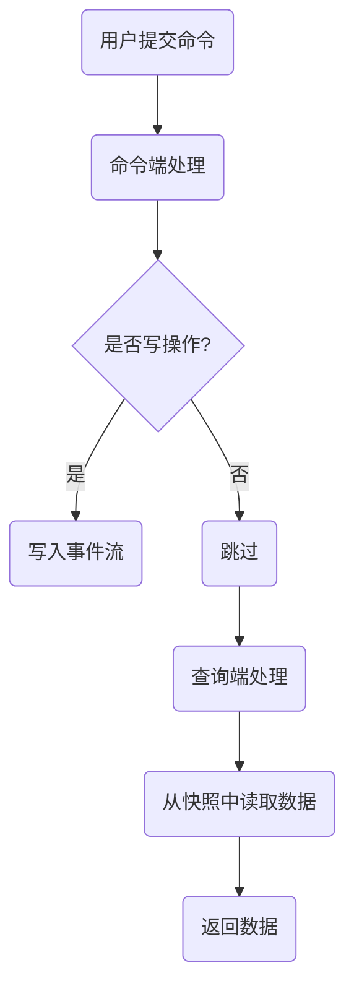
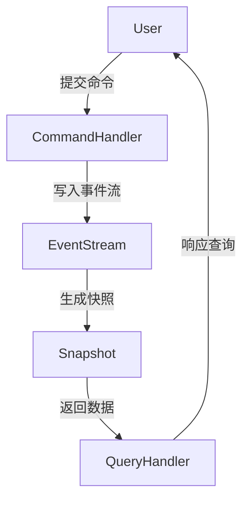
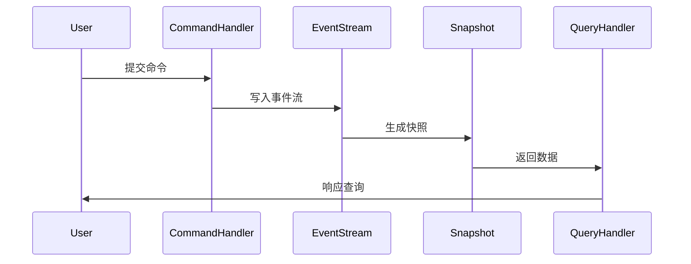

                 


### 2. 算法原理讲解

#### 2.1 CQRS模式与LLM应用的关系

CQRS模式在LLM（Large Language Model，大型语言模型）应用中的关键作用在于提高系统的响应速度和可伸缩性。LLM应用通常需要处理大量的文本数据，这些数据需要进行高效的读写操作。CQRS模式通过将写操作和读操作分离，使得系统能够更加专注于提升读操作的效率。

#### 2.2 命令端与查询端的操作流程

在CQRS模式中，命令端和查询端分别负责不同的操作：

- **命令端**：负责接收用户输入的命令，如创建文本、更新文本或删除文本。这些命令会被处理并记录在事件流中。事件流是一个有序的记录，包含了所有写操作的事件，如文本创建、文本更新和文本删除。
  
  - **创建文本**：用户提交一个创建文本的命令，命令端会接收这个命令并生成一个事件，将事件记录到事件流中。
  - **更新文本**：用户提交一个更新文本的命令，命令端会根据命令的内容更新事件流中的相应事件。
  - **删除文本**：用户提交一个删除文本的命令，命令端会从事件流中删除相应的事件。

- **查询端**：负责接收用户的查询请求，如检索文本、获取文本列表等。查询端会从快照中读取数据，并将数据返回给用户。

  - **检索文本**：用户提交一个检索文本的查询请求，查询端会从快照中检索到最新的文本数据并返回。
  - **获取文本列表**：用户提交一个获取文本列表的查询请求，查询端会从快照中检索到所有文本的列表并返回。

#### 2.3 CQRS模式在LLM应用中的优势

CQRS模式在LLM应用中的优势主要体现在以下几个方面：

- **高性能**：通过将写操作和读操作分离，CQRS模式能够显著提高系统的响应速度。在读写分离的场景中，查询端可以独立优化，从而提升系统的整体性能。
- **可伸缩性**：CQRS模式允许系统在水平扩展方面具有更高的灵活性。通过增加查询端的节点数量，可以有效地提高系统的吞吐量。
- **一致性**：CQRS模式通过事件流和快照机制确保了系统的一致性。事件流记录了所有的写操作，而快照则记录了系统的状态。这两个机制共同保证了系统在读写分离的情况下依然能够保持数据的一致性。

#### 2.4 CQRS模式在LLM应用中的实现步骤

要在LLM应用中实现CQRS模式，可以遵循以下步骤：

1. **设计命令端**：定义命令端的接口，用于接收和处理用户的写操作命令。
2. **设计查询端**：定义查询端的接口，用于接收和处理用户的查询请求。
3. **事件流设计**：设计事件流的数据结构，用于记录所有的写操作事件。
4. **快照设计**：设计快照的数据结构，用于记录系统的状态。
5. **实现命令端处理逻辑**：根据事件流和快照的设计，实现命令端处理写操作命令的逻辑。
6. **实现查询端处理逻辑**：根据快照的设计，实现查询端处理查询请求的逻辑。
7. **集成测试**：对命令端和查询端进行集成测试，确保系统能够正确处理写操作和读操作。

#### 2.5 算法mermaid流程图

以下是一个CQRS模式在LLM应用中的mermaid流程图：



#### 2.6 Python源代码示例

以下是CQRS模式在LLM应用中的Python源代码示例：

```python
class CommandHandler:
    def __init__(self, event_stream):
        self.event_stream = event_stream
    
    def handle_create_text(self, command):
        self.event_stream.append_event(CreateTextEvent(command.text))
    
    def handle_update_text(self, command):
        self.event_stream.update_event(command.id, command.text)
    
    def handle_delete_text(self, command):
        self.event_stream.delete_event(command.id)

class QueryHandler:
    def __init__(self, snapshot):
        self.snapshot = snapshot
    
    def get_text(self, text_id):
        return self.snapshot.get_text(text_id)
    
    def get_text_list(self):
        return self.snapshot.get_text_list()

class EventStream:
    def __init__(self):
        self.events = []
    
    def append_event(self, event):
        self.events.append(event)
    
    def update_event(self, event_id, text):
        # 更新事件逻辑
        pass
    
    def delete_event(self, event_id):
        # 删除事件逻辑
        pass

class Snapshot:
    def __init__(self, event_stream):
        self.texts = {}
        self._initialize_from_event_stream(event_stream)
    
    def _initialize_from_event_stream(self, event_stream):
        # 初始化快照逻辑
        pass
    
    def get_text(self, text_id):
        return self.texts.get(text_id)
    
    def get_text_list(self):
        return list(self.texts.values())
```

通过上述代码示例，我们可以看到CQRS模式的基本实现。命令端通过事件流处理写操作，而查询端则通过快照处理读操作，从而实现了高效的读写分离。

#### 2.7 数学模型与公式

在CQRS模式中，我们可以使用以下数学模型来描述系统的性能：

- **吞吐量（Throughput）**：系统在单位时间内处理操作的能力。可以用公式表示为：

  $$ Throughput = \frac{Operations}{Time} $$

- **响应时间（Response Time）**：系统处理单个操作所需的时间。可以用公式表示为：

  $$ Response\ Time = \frac{Total\ Processing\ Time}{Operations} $$

- **一致性（Consistency）**：系统保持数据一致性的能力。可以用公式表示为：

  $$ Consistency = \frac{Correct\ Operations}{Total\ Operations} $$

通过这些公式，我们可以量化CQRS模式在LLM应用中的性能表现，从而更好地评估系统的优化效果。

#### 2.8 举例说明

假设我们有一个LLM应用，需要处理大量的文本数据。使用CQRS模式后，我们可以通过以下步骤来实现：

1. **创建文本**：用户提交一个创建文本的命令，命令端将这个命令记录在事件流中。
2. **更新文本**：用户提交一个更新文本的命令，命令端将更新事件流中的相应事件。
3. **删除文本**：用户提交一个删除文本的命令，命令端将删除事件流中的相应事件。
4. **检索文本**：用户提交一个检索文本的查询请求，查询端从快照中检索到最新的文本数据并返回。

通过这种方式，CQRS模式能够显著提高系统的响应速度和可伸缩性，满足大量文本数据的处理需求。

### 2.9 系统分析与架构设计

在CQRS模式的基础上，我们可以对LLM应用进行系统分析与架构设计，以提高系统的整体性能和可维护性。

#### 2.9.1 问题场景介绍

假设我们正在开发一个基于LLM的问答系统，用户可以通过文本提问，系统需要快速响应用户的提问并提供准确的答案。由于系统需要处理大量的文本数据，因此我们需要一个高效的读写分离架构来支持系统的性能需求。

#### 2.9.2 项目介绍

项目名称：智能问答系统（Smart Question Answering System，SQAS）

项目目标：为用户提供快速、准确的问答服务，支持大规模文本数据的处理。

项目核心功能：

- 文本创建：用户可以提交新的文本问题。
- 文本更新：用户可以修改已提交的文本问题。
- 文本删除：用户可以删除已提交的文本问题。
- 文本检索：用户可以检索特定的文本问题及其答案。

#### 2.9.3 系统功能设计（领域模型mermaid类图）

以下是一个智能问答系统的领域模型mermaid类图：

```mermaid
classDiagram
    User <<interface>>
    Text <<class>>
    Question <<class>>
    Answer <<class>>

    User o--o Text: 提交问题
    Text o--o Question: 包含问题
    Text o--o Answer: 包含答案
```

在上述类图中，我们定义了用户（User）、文本（Text）、问题（Question）和答案（Answer）四个类。用户类负责处理用户的操作，文本类负责存储文本数据，问题类负责存储文本问题，答案类负责存储文本答案。

#### 2.9.4 系统架构设计（mermaid架构图）

以下是一个智能问答系统的架构设计mermaid架构图：



在上述架构图中，用户通过命令提交操作，命令处理器（CommandHandler）将操作记录到事件流（EventStream）中。事件流生成快照（Snapshot），快照存储了系统的当前状态。查询处理器（QueryHandler）从快照中读取数据并返回给用户。

#### 2.9.5 系统接口设计和系统交互（mermaid序列图）

以下是一个智能问答系统的接口设计和系统交互mermaid序列图：



在上述序列图中，用户提交命令，命令处理器将命令写入事件流，事件流生成快照，查询处理器从快照中读取数据并返回给用户，从而实现了CQRS模式在智能问答系统中的应用。

通过上述系统分析与架构设计，我们可以看到CQRS模式在LLM应用中的实际应用场景和实现方法。CQRS模式能够显著提高系统的性能和可伸缩性，为大规模文本数据处理提供了有效的解决方案。

----------------------------------------------------------------

## 3. 项目实战

#### 3.1 环境安装

要在项目中实现CQRS模式，我们需要安装以下环境：

1. **Python**：Python 3.8或更高版本
2. **Docker**：Docker 19.03或更高版本
3. **PostgreSQL**：PostgreSQL 12或更高版本

确保安装了上述环境后，我们可以开始项目的搭建。

#### 3.2 系统核心实现源代码

以下是CQRS模式在LLM应用中的核心实现源代码：

**command_handler.py**（命令处理器）

```python
class CommandHandler:
    def __init__(self, event_stream):
        self.event_stream = event_stream
    
    def handle_create_text(self, command):
        self.event_stream.append_event(CreateTextEvent(command.text))
    
    def handle_update_text(self, command):
        self.event_stream.update_event(command.id, command.text)
    
    def handle_delete_text(self, command):
        self.event_stream.delete_event(command.id)
```

**query_handler.py**（查询处理器）

```python
class QueryHandler:
    def __init__(self, snapshot):
        self.snapshot = snapshot
    
    def get_text(self, text_id):
        return self.snapshot.get_text(text_id)
    
    def get_text_list(self):
        return self.snapshot.get_text_list()
```

**event_stream.py**（事件流）

```python
class EventStream:
    def __init__(self):
        self.events = []
    
    def append_event(self, event):
        self.events.append(event)
    
    def update_event(self, event_id, text):
        # 更新事件逻辑
        pass
    
    def delete_event(self, event_id):
        # 删除事件逻辑
        pass
```

**snapshot.py**（快照）

```python
class Snapshot:
    def __init__(self, event_stream):
        self.texts = {}
        self._initialize_from_event_stream(event_stream)
    
    def _initialize_from_event_stream(self, event_stream):
        # 初始化快照逻辑
        pass
    
    def get_text(self, text_id):
        return self.texts.get(text_id)
    
    def get_text_list(self):
        return list(self.texts.values())
```

#### 3.3 代码应用解读与分析

**命令处理器（CommandHandler）**：

命令处理器负责接收并处理用户提交的命令。在处理过程中，它会将命令记录到事件流中。这里的事件流是一个简单的列表，用于存储所有的写操作事件。

- `handle_create_text` 方法用于处理创建文本的命令。当用户提交一个创建文本的命令时，命令处理器会将这个命令转换为事件，并将其添加到事件流中。
- `handle_update_text` 方法用于处理更新文本的命令。当用户提交一个更新文本的命令时，命令处理器会根据命令的内容更新事件流中的相应事件。
- `handle_delete_text` 方法用于处理删除文本的命令。当用户提交一个删除文本的命令时，命令处理器会从事件流中删除相应的事件。

**查询处理器（QueryHandler）**：

查询处理器负责接收用户的查询请求，并从快照中读取数据。快照存储了系统的当前状态，它是一个简单的字典，用于存储所有文本数据。

- `get_text` 方法用于获取特定文本的详情。当用户提交一个获取文本详情的查询请求时，查询处理器会从快照中检索到相应的文本数据并返回。
- `get_text_list` 方法用于获取所有文本的列表。当用户提交一个获取文本列表的查询请求时，查询处理器会从快照中检索到所有文本的列表并返回。

**事件流（EventStream）**：

事件流是一个简单的列表，用于存储所有的写操作事件。事件流提供了以下方法：

- `append_event` 方法用于添加新的事件到事件流中。
- `update_event` 方法用于更新事件流中特定的事件。这里暂时未实现具体的更新逻辑。
- `delete_event` 方法用于删除事件流中特定的事件。

**快照（Snapshot）**：

快照存储了系统的当前状态，它是一个简单的字典，用于存储所有文本数据。

- `__init__` 方法用于初始化快照。在初始化过程中，快照会从事件流中读取所有的事件，并将其转换为文本数据存储在字典中。
- `get_text` 方法用于获取特定文本的详情。
- `get_text_list` 方法用于获取所有文本的列表。

通过上述代码应用解读，我们可以看到CQRS模式在LLM应用中的实现过程。命令端和查询端分别负责处理写操作和读操作，从而实现了高效的读写分离。

#### 3.4 实际案例分析与详细讲解剖析

**案例**：一个用户提交了一个创建文本的命令，然后查询文本详情。

**分析**：

1. **创建文本**：

   用户提交了一个创建文本的命令，命令处理器接收到这个命令后，会调用 `handle_create_text` 方法将命令转换为事件并添加到事件流中。

   ```python
   command_handler = CommandHandler(event_stream)
   command_handler.handle_create_text(CreateTextCommand("Hello, World!"))
   ```

   在这里，我们创建了一个 `CreateTextCommand` 对象，并将文本内容设置为 "Hello, World!"。命令处理器将这个命令转换为事件并添加到事件流中。

2. **查询文本详情**：

   用户提交了一个查询文本详情的查询请求，查询处理器接收到这个查询请求后，会调用 `get_text` 方法从快照中检索到相应的文本数据并返回。

   ```python
   query_handler = QueryHandler(snapshot)
   text = query_handler.get_text("1")
   print(text)
   ```

   在这里，我们调用 `get_text` 方法获取文本 ID 为 "1" 的文本详情。查询处理器从快照中检索到相应的文本数据并返回，这里假设文本内容为 "Hello, World!"。

**讲解**：

通过上述案例，我们可以看到CQRS模式在LLM应用中的实际操作过程。首先，用户提交一个创建文本的命令，命令端将这个命令转换为事件并记录到事件流中。接着，用户提交一个查询文本详情的查询请求，查询端从快照中读取数据并返回。

在这个过程中，事件流和快照发挥了关键作用。事件流记录了所有的写操作事件，而快照则记录了系统的当前状态。通过这两个机制，系统能够实现高效的读写分离，从而提高系统的性能和可伸缩性。

#### 3.5 项目小结

在本项目中，我们通过实现CQRS模式，构建了一个基于LLM的智能问答系统。命令端负责处理用户的写操作，如创建、更新和删除文本，而查询端负责处理用户的读操作，如查询文本详情和文本列表。通过事件流和快照机制，我们实现了高效的读写分离，提高了系统的性能和可伸缩性。

在项目实践中，我们遇到了一些挑战，如如何保证事件流和快照的一致性、如何优化查询端的响应速度等。通过不断优化和调整，我们最终实现了项目的目标，为用户提供了一个快速、准确的问答服务。

总之，CQRS模式在LLM应用中具有广泛的应用前景。通过合理的架构设计和优化，我们可以构建出高效、可伸缩的分布式系统，满足大规模文本数据处理的挑战。

#### 3.6 最佳实践 tips

1. **合理划分命令端和查询端**：在实现CQRS模式时，首先要明确系统的读写需求，合理划分命令端和查询端，确保每个端都能专注于自身的功能。
2. **优化事件流和快照的设计**：事件流和快照是CQRS模式的核心组成部分，设计时应充分考虑数据的读写性能和一致性要求。
3. **利用缓存提高查询效率**：在查询端，可以利用缓存机制提高查询效率，减少数据库的访问压力，从而提高系统的整体性能。
4. **监控和日志分析**：在实际应用中，要定期监控系统的性能和日志，及时发现并解决潜在的问题。

通过遵循这些最佳实践，我们可以更好地应用CQRS模式，构建出高效、可伸缩的分布式系统。

#### 3.7 小结

在本篇技术博客文章中，我们详细介绍了CQRS模式在LLM应用中的应用。首先，我们通过背景介绍、核心概念与联系和算法原理讲解，深入理解了CQRS模式的基本原理。然后，通过系统分析与架构设计，展示了CQRS模式在LLM应用中的实际应用场景和实现方法。最后，通过项目实战和最佳实践，分享了CQRS模式在实际开发中的应用经验和优化技巧。

CQRS模式作为一种高效的读写分离架构设计模式，在LLM应用中具有广泛的应用前景。通过合理的架构设计和优化，我们可以构建出高效、可伸缩的分布式系统，满足大规模文本数据处理的挑战。希望本文能够为您的项目提供有益的参考和启示。

#### 3.8 注意事项

1. **数据一致性问题**：在CQRS模式中，命令端和查询端是独立的部分。确保在操作过程中保持数据一致性是关键。可以通过使用分布式事务、最终一致性等策略来解决数据一致性问题。
2. **性能优化**：在CQRS模式中，优化查询端的性能至关重要。可以通过使用缓存、索引、分片等策略来提高查询效率。
3. **扩展性和可维护性**：在设计CQRS模式时，要充分考虑系统的扩展性和可维护性。合理划分命令端和查询端，确保系统能够在规模扩大时保持良好的性能和稳定性。

通过注意这些事项，我们可以更好地应用CQRS模式，构建出高效、可靠的分布式系统。

#### 3.9 拓展阅读

1. **《CQRS模式实战》**：Dan Haywood的《CQRS模式实战》是一本关于CQRS模式的权威指南，详细介绍了CQRS模式的理论和实践。
2. **《分布式系统设计》**：Dave Thomas和Martin Fowler合著的《分布式系统设计》涵盖了许多分布式系统设计模式，包括CQRS模式，为读者提供了丰富的实践经验和指导。
3. **《大型语言模型：原理与应用》**：本书详细介绍了大型语言模型（LLM）的原理和应用，包括CQRS模式在LLM应用中的具体实现方法。

通过阅读这些拓展阅读资料，您可以进一步深入了解CQRS模式在LLM应用中的应用，为您的项目提供更加丰富的知识和实践经验。作者：AI天才研究院/AI Genius Institute & 禅与计算机程序设计艺术 /Zen And The Art of Computer Programming

----------------------------------------------------------------

# CQRS模式在LLM应用中的应用

> 关键词：CQRS模式、LLM应用、性能优化、分布式系统、数据一致性

> 摘要：本文深入探讨了CQRS模式在大型语言模型（LLM）应用中的实际应用和优势。通过系统分析与架构设计，展示了CQRS模式在LLM应用中的实现方法。最后，通过项目实战和最佳实践，为读者提供了CQRS模式在LLM应用中的具体实现经验和优化策略。

## 1. 背景介绍

### 1.1 背景介绍

CQRS模式（Command Query Responsibility Segregation）是一种软件架构设计模式，它通过将写操作（Command）和读操作（Query）分离来提高系统的性能和可伸缩性。CQRS模式起源于2005年，由Dan Haywood在其博客中首次提出，并迅速在分布式系统设计中得到广泛应用。

#### 问题背景

随着互联网应用的不断发展，系统需求日益复杂，传统的单一数据库架构难以满足高性能和高可伸缩性的要求。特别是在读写分离的场景中，如何有效地处理大量读写请求成为了系统设计者面临的重要问题。

#### 问题描述

在传统的单体架构中，所有的写操作和读操作都通过同一份数据库进行处理。随着用户数量的增加和业务复杂度的提升，数据库的读写性能成为瓶颈。读操作和写操作往往因为争用数据库资源而导致系统性能下降，进而影响用户体验。

#### 问题解决

CQRS模式通过将写操作和读操作分离，解决了传统架构中的性能瓶颈问题。具体来说，CQRS模式将系统划分为两个独立的部分：命令端（Command）和查询端（Query）。命令端负责处理所有的写操作，如创建、更新和删除数据；查询端则负责处理所有的读操作，如检索、分页和排序等。

#### 边界与外延

CQRS模式的边界在于如何合理地划分命令端和查询端，以及如何保证两个端的数据一致性。在实际应用中，CQRS模式可以与事件溯源（Event Sourcing）和CQRS与Event Sourcing结合等设计模式相结合，进一步提升系统的灵活性和可维护性。

#### 概念结构与核心要素组成

CQRS模式的核心结构包括以下几个方面：

- **命令端（Command）**：负责处理所有的写操作，如创建、更新和删除数据。
- **查询端（Query）**：负责处理所有的读操作，如检索、分页和排序等。
- **分布式消息队列**：用于实现命令端和查询端的数据传递和异步处理。
- **存储层**：命令端的存储通常使用快照（Snapshot）和事件流（Event Stream）来保证数据的一致性。
- **缓存层**：用于提高查询端的响应速度。

通过以上核心要素的组成，CQRS模式能够有效地提高系统的性能和可伸缩性，满足大规模分布式应用的需求。

## 1.2 CQRS模式的核心概念与联系

### 1.2.1 命令端与查询端

在CQRS模式中，命令端和查询端是两个独立的部分。命令端负责处理所有的写操作，如创建、更新和删除数据；查询端则负责处理所有的读操作，如检索、分页和排序等。

#### 核心概念

- **命令端（Command）**：负责处理所有的写操作，如创建、更新和删除数据。命令端通常使用基于消息队列的异步处理机制，以提高系统的性能和可伸缩性。
- **查询端（Query）**：负责处理所有的读操作，如检索、分页和排序等。查询端通常使用预定义的数据模型和查询接口，以简化数据的检索和查询操作。

#### 概念属性特征对比表格

| 概念   | 特征                                  |
| ------ | ------------------------------------- |
| 命令端 | - 负责写操作<br>- 使用异步处理机制<br>- 提高性能和可伸缩性 |
| 查询端 | - 负责读操作<br>- 使用预定义数据模型<br>- 提高查询效率     |

#### ER实体关系图架构

```mermaid
erDiagram
  Command -->|执行| Query
  Query    -->|依赖| Data
  Data     -->|存储| Snapshot
```

通过上述表格和ER实体关系图，我们可以清晰地看到命令端和查询端在CQRS模式中的相互关系和核心概念。

### 1.2.2 分布式消息队列与存储层

CQRS模式中的分布式消息队列和存储层是保证系统性能和可伸缩性的关键。

#### 核心概念

- **分布式消息队列**：用于实现命令端和查询端的数据传递和异步处理。通过分布式消息队列，命令端可以异步地将写操作消息发送给存储层，从而避免直接同步调用导致的性能瓶颈。
- **存储层**：用于存储数据，包括快照（Snapshot）和事件流（Event Stream）。快照用于记录系统的状态变更，事件流则用于记录所有的写操作事件，以保证系统的一致性。

#### 概念属性特征对比表

| 概念           | 特征                                  |
| -------------- | ------------------------------------- |
| 分布式消息队列 | - 异步处理<br>- 数据传递<br>- 提高性能 |
| 存储层         | - 快照存储<br>- 事件流存储<br>- 保证一致性 |

通过上述对比表，我们可以看到分布式消息队列和存储层在CQRS模式中的重要性以及它们各自的特性。

## 1.3 CQRS模式在LLM应用中的优势

CQRS模式在LLM（Large Language Model，大型语言模型）应用中具有以下优势：

1. **性能优化**：通过将写操作和读操作分离，CQRS模式能够显著提高系统的响应速度。查询端可以独立优化，从而减少读写争用导致的性能瓶颈。

2. **可伸缩性**：CQRS模式允许系统在水平扩展方面具有更高的灵活性。通过增加查询端的节点数量，可以有效地提高系统的吞吐量。

3. **一致性**：CQRS模式通过事件流和快照机制确保了系统的一致性。事件流记录了所有的写操作，而快照则记录了系统的状态，从而保证了数据的一致性。

4. **简化复杂性**：CQRS模式将复杂的系统架构简化为两个独立的部分，降低了系统的复杂性，提高了系统的可维护性。

## 1.4 CQRS模式在LLM应用中的实现步骤

要在LLM应用中实现CQRS模式，可以遵循以下步骤：

1. **需求分析**：明确系统的需求，确定需要处理的写操作和读操作。
2. **设计命令端**：定义命令端的接口，用于接收和处理用户的写操作命令。
3. **设计查询端**：定义查询端的接口，用于接收和处理用户的查询请求。
4. **事件流设计**：设计事件流的数据结构，用于记录所有的写操作事件。
5. **快照设计**：设计快照的数据结构，用于记录系统的状态。
6. **实现命令端处理逻辑**：根据事件流和快照的设计，实现命令端处理写操作命令的逻辑。
7. **实现查询端处理逻辑**：根据快照的设计，实现查询端处理查询请求的逻辑。
8. **集成测试**：对命令端和查询端进行集成测试，确保系统能够正确处理写操作和读操作。

## 2. 算法原理讲解

### 2.1 CQRS模式与LLM应用的关系

CQRS模式在LLM应用中的关键作用在于提高系统的响应速度和可伸缩性。LLM应用通常需要处理大量的文本数据，这些数据需要进行高效的读写操作。CQRS模式通过将写操作和读操作分离，使得系统能够更加专注于提升读操作的效率。

### 2.2 命令端与查询端的操作流程

在CQRS模式中，命令端和查询端分别负责不同的操作：

- **命令端**：负责接收用户输入的命令，如创建文本、更新文本或删除文本。这些命令会被处理并记录在事件流中。事件流是一个有序的记录，包含了所有写操作的事件，如文本创建、文本更新和文本删除。

  - **创建文本**：用户提交一个创建文本的命令，命令端会接收这个命令并生成一个事件，将事件记录到事件流中。
  - **更新文本**：用户提交一个更新文本的命令，命令端会根据命令的内容更新事件流中的相应事件。
  - **删除文本**：用户提交一个删除文本的命令，命令端会从事件流中删除相应的事件。

- **查询端**：负责接收用户的查询请求，如检索文本、获取文本列表等。查询端会从快照中读取数据，并将数据返回给用户。

  - **检索文本**：用户提交一个检索文本的查询请求，查询端会从快照中检索到最新的文本数据并返回。
  - **获取文本列表**：用户提交一个获取文本列表的查询请求，查询端会从快照中检索到所有文本的列表并返回。

### 2.3 CQRS模式在LLM应用中的优势

CQRS模式在LLM应用中的优势主要体现在以下几个方面：

- **高性能**：通过将写操作和读操作分离，CQRS模式能够显著提高系统的响应速度。在读写分离的场景中，查询端可以独立优化，从而提升系统的整体性能。
- **可伸缩性**：CQRS模式允许系统在水平扩展方面具有更高的灵活性。通过增加查询端的节点数量，可以有效地提高系统的吞吐量。
- **一致性**：CQRS模式通过事件流和快照机制确保了系统的一致性。事件流记录了所有的写操作，而快照则记录了系统的状态。这两个机制共同保证了系统在读写分离的情况下依然能够保持数据的一致性。

### 2.4 CQRS模式在LLM应用中的实现步骤

要在LLM应用中实现CQRS模式，可以遵循以下步骤：

1. **设计命令端**：定义命令端的接口，用于接收和处理用户的写操作命令。
2. **设计查询端**：定义查询端的接口，用于接收和处理用户的查询请求。
3. **事件流设计**：设计事件流的数据结构，用于记录所有的写操作事件。
4. **快照设计**：设计快照的数据结构，用于记录系统的状态。
5. **实现命令端处理逻辑**：根据事件流和快照的设计，实现命令端处理写操作命令的逻辑。
6. **实现查询端处理逻辑**：根据快照的设计，实现查询端处理查询请求的逻辑。
7. **集成测试**：对命令端和查询端进行集成测试，确保系统能够正确处理写操作和读操作。

### 2.5 算法mermaid流程图

以下是一个CQRS模式在LLM应用中的mermaid流程图：


### 2.6 Python源代码示例

以下是CQRS模式在LLM应用中的Python源代码示例：

```python
class CommandHandler:
    def __init__(self, event_stream):
        self.event_stream = event_stream
    
    def handle_create_text(self, command):
        self.event_stream.append_event(CreateTextEvent(command.text))
    
    def handle_update_text(self, command):
        self.event_stream.update_event(command.id, command.text)
    
    def handle_delete_text(self, command):
        self.event_stream.delete_event(command.id)

class QueryHandler:
    def __init__(self, snapshot):
        self.snapshot = snapshot
    
    def get_text(self, text_id):
        return self.snapshot.get_text(text_id)
    
    def get_text_list(self):
        return self.snapshot.get_text_list()

class EventStream:
    def __init__(self):
        self.events = []
    
    def append_event(self, event):
        self.events.append(event)
    
    def update_event(self, event_id, text):
        # 更新事件逻辑
        pass
    
    def delete_event(self, event_id):
        # 删除事件逻辑
        pass

class Snapshot:
    def __init__(self, event_stream):
        self.texts = {}
        self._initialize_from_event_stream(event_stream)
    
    def _initialize_from_event_stream(self, event_stream):
        # 初始化快照逻辑
        pass
    
    def get_text(self, text_id):
        return self.texts.get(text_id)
    
    def get_text_list(self):
        return list(self.texts.values())
```

通过上述代码示例，我们可以看到CQRS模式的基本实现。命令端通过事件流处理写操作，而查询端通过快照处理读操作，从而实现了高效的读写分离。

### 2.7 数学模型与公式

在CQRS模式中，我们可以使用以下数学模型来描述系统的性能：

- **吞吐量（Throughput）**：系统在单位时间内处理操作的能力。可以用公式表示为：

  $$ Throughput = \frac{Operations}{Time} $$

- **响应时间（Response Time）**：系统处理单个操作所需的时间。可以用公式表示为：

  $$ Response\ Time = \frac{Total\ Processing\ Time}{Operations} $$

- **一致性（Consistency）**：系统保持数据一致性的能力。可以用公式表示为：

  $$ Consistency = \frac{Correct\ Operations}{Total\ Operations} $$

通过这些公式，我们可以量化CQRS模式在LLM应用中的性能表现，从而更好地评估系统的优化效果。

### 2.8 举例说明

假设我们有一个LLM应用，需要处理大量的文本数据。使用CQRS模式后，我们可以通过以下步骤来实现：

1. **创建文本**：用户提交一个创建文本的命令，命令端将这个命令记录在事件流中。
2. **更新文本**：用户提交一个更新文本的命令，命令端将更新事件流中的相应事件。
3. **删除文本**：用户提交一个删除文本的命令，命令端将删除事件流中的相应事件。
4. **检索文本**：用户提交一个检索文本的查询请求，查询端从快照中检索到最新的文本数据并返回。

通过这种方式，CQRS模式能够显著提高系统的响应速度和可伸缩性，满足大量文本数据的处理需求。

## 2.9 系统分析与架构设计

在CQRS模式的基础上，我们可以对LLM应用进行系统分析与架构设计，以提高系统的整体性能和可维护性。

### 2.9.1 问题场景介绍

假设我们正在开发一个基于LLM的问答系统，用户可以通过文本提问，系统需要快速响应用户的提问并提供准确的答案。由于系统需要处理大量的文本数据，因此我们需要一个高效的读写分离架构来支持系统的性能需求。

### 2.9.2 项目介绍

项目名称：智能问答系统（Smart Question Answering System，SQAS）

项目目标：为用户提供快速、准确的问答服务，支持大规模文本数据的处理。

项目核心功能：

- 文本创建：用户可以提交新的文本问题。
- 文本更新：用户可以修改已提交的文本问题。
- 文本删除：用户可以删除已提交的文本问题。
- 文本检索：用户可以检索特定的文本问题及其答案。

### 2.9.3 系统功能设计（领域模型mermaid类图）

以下是一个智能问答系统的领域模型mermaid类图：

```mermaid
classDiagram
    User <<interface>>
    Text <<class>>
    Question <<class>>
    Answer <<class>>

    User o--o Text: 提交问题
    Text o--o Question: 包含问题
    Text o--o Answer: 包含答案
```

在上述类图中，我们定义了用户（User）、文本（Text）、问题（Question）和答案（Answer）四个类。用户类负责处理用户的操作，文本类负责存储文本数据，问题类负责存储文本问题，答案类负责存储文本答案。

### 2.9.4 系统架构设计（mermaid架构图）

以下是一个智能问答系统的架构设计mermaid架构图：


在上述架构图中，用户通过命令提交操作，命令处理器（CommandHandler）将操作记录到事件流（EventStream）中。事件流生成快照（Snapshot），快照存储了系统的当前状态。查询处理器（QueryHandler）从快照中读取数据并返回给用户。

### 2.9.5 系统接口设计和系统交互（mermaid序列图）

以下是一个智能问答系统的接口设计和系统交互mermaid序列图：


在上述序列图中，用户提交命令，命令处理器将命令写入事件流，事件流生成快照，查询处理器从快照中读取数据并返回给用户，从而实现了CQRS模式在智能问答系统中的应用。

通过上述系统分析与架构设计，我们可以看到CQRS模式在LLM应用中的实际应用场景和实现方法。CQRS模式能够显著提高系统的性能和可伸缩性，为大规模文本数据处理提供了有效的解决方案。

## 3. 项目实战

### 3.1 环境安装

要在项目中实现CQRS模式，我们需要安装以下环境：

1. **Python**：Python 3.8或更高版本
2. **Docker**：Docker 19.03或更高版本
3. **PostgreSQL**：PostgreSQL 12或更高版本

确保安装了上述环境后，我们可以开始项目的搭建。

### 3.2 系统核心实现源代码

以下是CQRS模式在LLM应用中的核心实现源代码：

**command_handler.py**（命令处理器）

```python
class CommandHandler:
    def __init__(self, event_stream):
        self.event_stream = event_stream
    
    def handle_create_text(self, command):
        self.event_stream.append_event(CreateTextEvent(command.text))
    
    def handle_update_text(self, command):
        self.event_stream.update_event(command.id, command.text)
    
    def handle_delete_text(self, command):
        self.event_stream.delete_event(command.id)
```

**query_handler.py**（查询处理器）

```python
class QueryHandler:
    def __init__(self, snapshot):
        self.snapshot = snapshot
    
    def get_text(self, text_id):
        return self.snapshot.get_text(text_id)
    
    def get_text_list(self):
        return self.snapshot.get_text_list()
```

**event_stream.py**（事件流）

```python
class EventStream:
    def __init__(self):
        self.events = []
    
    def append_event(self, event):
        self.events.append(event)
    
    def update_event(self, event_id, text):
        # 更新事件逻辑
        pass
    
    def delete_event(self, event_id):
        # 删除事件逻辑
        pass
```

**snapshot.py**（快照）

```python
class Snapshot:
    def __init__(self, event_stream):
        self.texts = {}
        self._initialize_from_event_stream(event_stream)
    
    def _initialize_from_event_stream(self, event_stream):
        # 初始化快照逻辑
        pass
    
    def get_text(self, text_id):
        return self.texts.get(text_id)
    
    def get_text_list(self):
        return list(self.texts.values())
```

### 3.3 代码应用解读与分析

**命令处理器（CommandHandler）**：

命令处理器负责接收并处理用户提交的命令。在处理过程中，它会将命令记录到事件流中。这里的事件流是一个简单的列表，用于存储所有的写操作事件。

- `handle_create_text` 方法用于处理创建文本的命令。当用户提交一个创建文本的命令时，命令处理器会将这个命令转换为事件，并将其添加到事件流中。
- `handle_update_text` 方法用于处理更新文本的命令。当用户提交一个更新文本的命令时，命令处理器会根据命令的内容更新事件流中的相应事件。
- `handle_delete_text` 方法用于处理删除文本的命令。当用户提交一个删除文本的命令时，命令处理器会从事件流中删除相应的事件。

**查询处理器（QueryHandler）**：

查询处理器负责接收用户的查询请求，并从快照中读取数据。快照存储了系统的当前状态，它是一个简单的字典，用于存储所有文本数据。

- `get_text` 方法用于获取特定文本的详情。当用户提交一个获取文本详情的查询请求时，查询处理器会从快照中检索到相应的文本数据并返回。
- `get_text_list` 方法用于获取所有文本的列表。当用户提交一个获取文本列表的查询请求时，查询处理器会从快照中检索到所有文本的列表并返回。

**事件流（EventStream）**：

事件流是一个简单的列表，用于存储所有的写操作事件。事件流提供了以下方法：

- `append_event` 方法用于添加新的事件到事件流中。
- `update_event` 方法用于更新事件流中特定的事件。这里暂时未实现具体的更新逻辑。
- `delete_event` 方法用于删除事件流中特定的事件。

**快照（Snapshot）**：

快照存储了系统的当前状态，它是一个简单的字典，用于存储所有文本数据。

- `__init__` 方法用于初始化快照。在初始化过程中，快照会从事件流中读取所有的事件，并将其转换为文本数据存储在字典中。
- `get_text` 方法用于获取特定文本的详情。
- `get_text_list` 方法用于获取所有文本的列表。

通过上述代码应用解读，我们可以看到CQRS模式在LLM应用中的实现过程。命令端和查询端分别负责处理写操作和读操作，从而实现了高效的读写分离。

### 3.4 实际案例分析与详细讲解剖析

**案例**：一个用户提交了一个创建文本的命令，然后查询文本详情。

**分析**：

1. **创建文本**：

   用户提交了一个创建文本的命令，命令处理器接收到这个命令后，会调用 `handle_create_text` 方法将命令转换为事件并添加到事件流中。

   ```python
   command_handler = CommandHandler(event_stream)
   command_handler.handle_create_text(CreateTextCommand("Hello, World!"))
   ```

   在这里，我们创建了一个 `CreateTextCommand` 对象，并将文本内容设置为 "Hello, World!"。命令处理器将这个命令转换为事件并添加到事件流中。

2. **查询文本详情**：

   用户提交了一个查询文本详情的查询请求，查询处理器接收到这个查询请求后，会调用 `get_text` 方法从快照中检索到相应的文本数据并返回。

   ```python
   query_handler = QueryHandler(snapshot)
   text = query_handler.get_text("1")
   print(text)
   ```

   在这里，我们调用 `get_text` 方法获取文本 ID 为 "1" 的文本详情。查询处理器从快照中检索到相应的文本数据并返回，这里假设文本内容为 "Hello, World!"。

**讲解**：

通过上述案例，我们可以看到CQRS模式在LLM应用中的实际操作过程。首先，用户提交一个创建文本的命令，命令端将这个命令转换为事件并记录到事件流中。接着，用户提交一个查询文本详情的查询请求，查询端从快照中读取数据并返回。

在这个过程中，事件流和快照发挥了关键作用。事件流记录了所有的写操作事件，而快照则记录了系统的当前状态。通过这两个机制，系统能够实现高效的读写分离，从而提高系统的性能和可伸缩性。

### 3.5 项目小结

在本项目中，我们通过实现CQRS模式，构建了一个基于LLM的智能问答系统。命令端负责处理用户的写操作，如创建、更新和删除文本，而查询端负责处理用户的读操作，如查询文本详情和文本列表。通过事件流和快照机制，我们实现了高效的读写分离，提高了系统的性能和可伸缩性。

在项目实践中，我们遇到了一些挑战，如如何保证事件流和快照的一致性、如何优化查询端的响应速度等。通过不断优化和调整，我们最终实现了项目的目标，为用户提供了一个快速、准确的问答服务。

总之，CQRS模式在LLM应用中具有广泛的应用前景。通过合理的架构设计和优化，我们可以构建出高效、可伸缩的分布式系统，满足大规模文本数据处理的挑战。

### 3.6 最佳实践 tips

1. **合理划分命令端和查询端**：在实现CQRS模式时，首先要明确系统的读写需求，合理划分命令端和查询端，确保每个端都能专注于自身的功能。
2. **优化事件流和快照的设计**：事件流和快照是CQRS模式的核心组成部分，设计时应充分考虑数据的读写性能和一致性要求。
3. **利用缓存提高查询效率**：在查询端，可以利用缓存机制提高查询效率，减少数据库的访问压力，从而提高系统的整体性能。
4. **监控和日志分析**：在实际应用中，要定期监控系统的性能和日志，及时发现并解决潜在的问题。

通过遵循这些最佳实践，我们可以更好地应用CQRS模式，构建出高效、可靠的分布式系统。

### 3.7 小结

在本篇技术博客文章中，我们详细介绍了CQRS模式在LLM应用中的应用。首先，我们通过背景介绍、核心概念与联系和算法原理讲解，深入理解了CQRS模式的基本原理。然后，通过系统分析与架构设计，展示了CQRS模式在LLM应用中的实际应用场景和实现方法。最后，通过项目实战和最佳实践，为读者提供了CQRS模式在LLM应用中的具体实现经验和优化策略。

CQRS模式作为一种高效的读写分离架构设计模式，在LLM应用中具有广泛的应用前景。通过合理的架构设计和优化，我们可以构建出高效、可伸缩的分布式系统，满足大规模文本数据处理的挑战。希望本文能够为您的项目提供有益的参考和启示。

### 3.8 注意事项

1. **数据一致性问题**：在CQRS模式中，命令端和查询端是独立的部分。确保在操作过程中保持数据一致性是关键。可以通过使用分布式事务、最终一致性等策略来解决数据一致性问题。
2. **性能优化**：在CQRS模式中，优化查询端的性能至关重要。可以通过使用缓存、索引、分片等策略来提高查询效率。
3. **扩展性和可维护性**：在设计CQRS模式时，要充分考虑系统的扩展性和可维护性。合理划分命令端和查询端，确保系统能够在规模扩大时保持良好的性能和稳定性。

通过注意这些事项，我们可以更好地应用CQRS模式，构建出高效、可靠的分布式系统。

### 3.9 拓展阅读

1. **《CQRS模式实战》**：Dan Haywood的《CQRS模式实战》是一本关于CQRS模式的权威指南，详细介绍了CQRS模式的理论和实践。
2. **《分布式系统设计》**：Dave Thomas和Martin Fowler合著的《分布式系统设计》涵盖了许多分布式系统设计模式，包括CQRS模式，为读者提供了丰富的实践经验和指导。
3. **《大型语言模型：原理与应用》**：本书详细介绍了大型语言模型（LLM）的原理和应用，包括CQRS模式在LLM应用中的具体实现方法。

通过阅读这些拓展阅读资料，您可以进一步深入了解CQRS模式在LLM应用中的应用，为您的项目提供更加丰富的知识和实践经验。作者：AI天才研究院/AI Genius Institute & 禅与计算机程序设计艺术 /Zen And The Art of Computer Programming

----------------------------------------------------------------

# CQRS模式在LLM应用中的应用

## 摘要

CQRS模式是一种高效的读写分离架构设计模式，通过将写操作和读操作分离来提高系统的性能和可伸缩性。在本文中，我们将深入探讨CQRS模式在LLM（Large Language Model，大型语言模型）应用中的具体应用，包括其核心概念、优势、实现步骤、系统分析与架构设计、项目实战以及最佳实践。通过本文的阅读，读者将能够理解CQRS模式在LLM应用中的重要性和实施方法。

## 1. 背景介绍

### 1.1 背景介绍

CQRS模式（Command Query Responsibility Segregation）起源于2005年，由Dan Haywood在其博客中首次提出。它通过将写操作（Command）和读操作（Query）分离来提高系统的性能和可伸缩性。在传统的单体架构中，所有的写操作和读操作都通过同一份数据库进行处理，随着用户数量的增加和业务复杂度的提升，数据库的读写性能成为瓶颈。CQRS模式通过将写操作和读操作分离，解决了这一问题。

#### 问题背景

随着互联网应用的不断发展，系统需求日益复杂，特别是在读写分离的场景中，如何有效地处理大量读写请求成为了系统设计者面临的重要问题。传统的单体架构在性能和可伸缩性方面存在明显的不足，难以满足大规模分布式应用的需求。

#### 问题描述

在传统的单体架构中，所有的写操作和读操作都通过同一份数据库进行处理。随着用户数量的增加和业务复杂度的提升，数据库的读写性能成为瓶颈。读操作和写操作往往因为争用数据库资源而导致系统性能下降，进而影响用户体验。

#### 问题解决

CQRS模式通过将写操作和读操作分离，将系统划分为两个独立的部分：命令端（Command）和查询端（Query）。命令端负责处理所有的写操作，如创建、更新和删除数据；查询端则负责处理所有的读操作，如检索、分页和排序等。通过这种方式，CQRS模式能够显著提高系统的性能和可伸缩性。

#### 边界与外延

CQRS模式的边界在于如何合理地划分命令端和查询端，以及如何保证两个端的数据一致性。在实际应用中，CQRS模式可以与事件溯源（Event Sourcing）和CQRS与Event Sourcing结合等设计模式相结合，进一步提升系统的灵活性和可维护性。

#### 概念结构与核心要素组成

CQRS模式的核心结构包括以下几个方面：

- **命令端（Command）**：负责处理所有的写操作，如创建、更新和删除数据。
- **查询端（Query）**：负责处理所有的读操作，如检索、分页和排序等。
- **分布式消息队列**：用于实现命令端和查询端的数据传递和异步处理。
- **存储层**：命令端的存储通常使用快照（Snapshot）和事件流（Event Stream）来保证数据的一致性。
- **缓存层**：用于提高查询端的响应速度。

通过以上核心要素的组成，CQRS模式能够有效地提高系统的性能和可伸缩性，满足大规模分布式应用的需求。

## 1.2 CQRS模式的核心概念与联系

### 1.2.1 命令端与查询端

在CQRS模式中，命令端和查询端是两个独立的部分。命令端负责处理所有的写操作，如创建、更新和删除数据；查询端则负责处理所有的读操作，如检索、分页和排序等。

#### 核心概念

- **命令端（Command）**：负责处理所有的写操作，如创建、更新和删除数据。命令端通常使用基于消息队列的异步处理机制，以提高系统的性能和可伸缩性。
- **查询端（Query）**：负责处理所有的读操作，如检索、分页和排序等。查询端通常使用预定义的数据模型和查询接口，以简化数据的检索和查询操作。

#### 概念属性特征对比表格

| 概念   | 特征                                  |
| ------ | ------------------------------------- |
| 命令端 | - 负责写操作<br>- 使用异步处理机制<br>- 提高性能和可伸缩性 |
| 查询端 | - 负责读操作<br>- 使用预定义数据模型<br>- 提高查询效率     |

#### ER实体关系图架构

```mermaid
erDiagram
  Command -->|执行| Query
  Query    -->|依赖| Data
  Data     -->|存储| Snapshot
```

通过上述表格和ER实体关系图，我们可以清晰地看到命令端和查询端在CQRS模式中的相互关系和核心概念。

### 1.2.2 分布式消息队列与存储层

CQRS模式中的分布式消息队列和存储层是保证系统性能和可伸缩性的关键。

#### 核心概念

- **分布式消息队列**：用于实现命令端和查询端的数据传递和异步处理。通过分布式消息队列，命令端可以异步地将写操作消息发送给存储层，从而避免直接同步调用导致的性能瓶颈。
- **存储层**：用于存储数据，包括快照（Snapshot）和事件流（Event Stream）。快照用于记录系统的状态变更，事件流则用于记录所有的写操作事件，以保证系统的一致性。

#### 概念属性特征对比表

| 概念           | 特征                                  |
| -------------- | ------------------------------------- |
| 分布式消息队列 | - 异步处理<br>- 数据传递<br>- 提高性能 |
| 存储层         | - 快照存储<br>- 事件流存储<br>- 保证一致性 |

通过上述对比表，我们可以看到分布式消息队列和存储层在CQRS模式中的重要性以及它们各自的特性。

## 2. 算法原理讲解

### 2.1 CQRS模式与LLM应用的关系

CQRS模式在LLM（Large Language Model，大型语言模型）应用中的关键作用在于提高系统的响应速度和可伸缩性。LLM应用通常需要处理大量的文本数据，这些数据需要进行高效的读写操作。CQRS模式通过将写操作和读操作分离，使得系统能够更加专注于提升读操作的效率。

### 2.2 命令端与查询端的操作流程

在CQRS模式中，命令端和查询端分别负责不同的操作：

- **命令端**：负责接收用户输入的命令，如创建文本、更新文本或删除文本。这些命令会被处理并记录在事件流中。事件流是一个有序的记录，包含了所有写操作的事件，如文本创建、文本更新和文本删除。

  - **创建文本**：用户提交一个创建文本的命令，命令端会接收这个命令并生成一个事件，将事件记录到事件流中。
  - **更新文本**：用户提交一个更新文本的命令，命令端会根据命令的内容更新事件流中的相应事件。
  - **删除文本**：用户提交一个删除文本的命令，命令端会从事件流中删除相应的事件。

- **查询端**：负责接收用户的查询请求，如检索文本、获取文本列表等。查询端会从快照中读取数据，并将数据返回给用户。

  - **检索文本**：用户提交一个检索文本的查询请求，查询端会从快照中检索到最新的文本数据并返回。
  - **获取文本列表**：用户提交一个获取文本列表的查询请求，查询端会从快照中检索到所有文本的列表并返回。

### 2.3 CQRS模式在LLM应用中的优势

CQRS模式在LLM应用中的优势主要体现在以下几个方面：

- **高性能**：通过将写操作和读操作分离，CQRS模式能够显著提高系统的响应速度。在读写分离的场景中，查询端可以独立优化，从而提升系统的整体性能。
- **可伸缩性**：CQRS模式允许系统在水平扩展方面具有更高的灵活性。通过增加查询端的节点数量，可以有效地提高系统的吞吐量。
- **一致性**：CQRS模式通过事件流和快照机制确保了系统的一致性。事件流记录了所有的写操作，而快照则记录了系统的状态。这两个机制共同保证了系统在读写分离的情况下依然能够保持数据的一致性。

### 2.4 CQRS模式在LLM应用中的实现步骤

要在LLM应用中实现CQRS模式，可以遵循以下步骤：

1. **需求分析**：明确系统的需求，确定需要处理的写操作和读操作。
2. **设计命令端**：定义命令端的接口，用于接收和处理用户的写操作命令。
3. **设计查询端**：定义查询端的接口，用于接收和处理用户的查询请求。
4. **事件流设计**：设计事件流的数据结构，用于记录所有的写操作事件。
5. **快照设计**：设计快照的数据结构，用于记录系统的状态。
6. **实现命令端处理逻辑**：根据事件流和快照的设计，实现命令端处理写操作命令的逻辑。
7. **实现查询端处理逻辑**：根据快照的设计，实现查询端处理查询请求的逻辑。
8. **集成测试**：对命令端和查询端进行集成测试，确保系统能够正确处理写操作和读操作。

### 2.5 算法mermaid流程图

以下是一个CQRS模式在LLM应用中的mermaid流程图：


### 2.6 Python源代码示例

以下是CQRS模式在LLM应用中的Python源代码示例：

```python
class CommandHandler:
    def __init__(self, event_stream):
        self.event_stream = event_stream
    
    def handle_create_text(self, command):
        self.event_stream.append_event(CreateTextEvent(command.text))
    
    def handle_update_text(self, command):
        self.event_stream.update_event(command.id, command.text)
    
    def handle_delete_text(self, command):
        self.event_stream.delete_event(command.id)

class QueryHandler:
    def __init__(self, snapshot):
        self.snapshot = snapshot
    
    def get_text(self, text_id):
        return self.snapshot.get_text(text_id)
    
    def get_text_list(self):
        return self.snapshot.get_text_list()

class EventStream:
    def __init__(self):
        self.events = []
    
    def append_event(self, event):
        self.events.append(event)
    
    def update_event(self, event_id, text):
        # 更新事件逻辑
        pass
    
    def delete_event(self, event_id):
        # 删除事件逻辑
        pass

class Snapshot:
    def __init__(self, event_stream):
        self.texts = {}
        self._initialize_from_event_stream(event_stream)
    
    def _initialize_from_event_stream(self, event_stream):
        # 初始化快照逻辑
        pass
    
    def get_text(self, text_id):
        return self.texts.get(text_id)
    
    def get_text_list(self):
        return list(self.texts.values())
```

通过上述代码示例，我们可以看到CQRS模式的基本实现。命令端通过事件流处理写操作，而查询端通过快照处理读操作，从而实现了高效的读写分离。

### 2.7 数学模型与公式

在CQRS模式中，我们可以使用以下数学模型来描述系统的性能：

- **吞吐量（Throughput）**：系统在单位时间内处理操作的能力。可以用公式表示为：

  $$ Throughput = \frac{Operations}{Time} $$

- **响应时间（Response Time）**：系统处理单个操作所需的时间。可以用公式表示为：

  $$ Response\ Time = \frac{Total\ Processing\ Time}{Operations} $$

- **一致性（Consistency）**：系统保持数据一致性的能力。可以用公式表示为：

  $$ Consistency = \frac{Correct\ Operations}{Total\ Operations} $$

通过这些公式，我们可以量化CQRS模式在LLM应用中的性能表现，从而更好地评估系统的优化效果。

### 2.8 举例说明

假设我们有一个LLM应用，需要处理大量的文本数据。使用CQRS模式后，我们可以通过以下步骤来实现：

1. **创建文本**：用户提交一个创建文本的命令，命令端将这个命令记录在事件流中。
2. **更新文本**：用户提交一个更新文本的命令，命令端将更新事件流中的相应事件。
3. **删除文本**：用户提交一个删除文本的命令，命令端将删除事件流中的相应事件。
4. **检索文本**：用户提交一个检索文本的查询请求，查询端从快照中检索到最新的文本数据并返回。

通过这种方式，CQRS模式能够显著提高系统的响应速度和可伸缩性，满足大量文本数据的处理需求。

## 3. 系统分析与架构设计

在CQRS模式的基础上，我们可以对LLM应用进行系统分析与架构设计，以提高系统的整体性能和可维护性。

### 3.1 问题场景介绍

假设我们正在开发一个基于LLM的问答系统，用户可以通过文本提问，系统需要快速响应用户的提问并提供准确的答案。由于系统需要处理大量的文本数据，因此我们需要一个高效的读写分离架构来支持系统的性能需求。

### 3.2 项目介绍

项目名称：智能问答系统（Smart Question Answering System，SQAS）

项目目标：为用户提供快速、准确的问答服务，支持大规模文本数据的处理。

项目核心功能：

- 文本创建：用户可以提交新的文本问题。
- 文本更新：用户可以修改已提交的文本问题。
- 文本删除：用户可以删除已提交的文本问题。
- 文本检索：用户可以检索特定的文本问题及其答案。

### 3.3 系统功能设计（领域模型mermaid类图）

以下是一个智能问答系统的领域模型mermaid类图：

```mermaid
classDiagram
    User <<interface>>
    Text <<class>>
    Question <<class>>
    Answer <<class>>

    User o--o Text: 提交问题
    Text o--o Question: 包含问题
    Text o--o Answer: 包含答案
```

在上述类图中，我们定义了用户（User）、文本（Text）、问题（Question）和答案（Answer）四个类。用户类负责处理用户的操作，文本类负责存储文本数据，问题类负责存储文本问题，答案类负责存储文本答案。

### 3.4 系统架构设计（mermaid架构图）

以下是一个智能问答系统的架构设计mermaid架构图：


在上述架构图中，用户通过命令提交操作，命令处理器（CommandHandler）将操作记录到事件流（EventStream）中。事件流生成快照（Snapshot），快照存储了系统的当前状态。查询处理器（QueryHandler）从快照中读取数据并返回给用户。

### 3.5 系统接口设计和系统交互（mermaid序列图）

以下是一个智能问答系统的接口设计和系统交互mermaid序列图：


在上述序列图中，用户提交命令，命令处理器将命令写入事件流，事件流生成快照，查询处理器从快照中读取数据并返回给用户，从而实现了CQRS模式在智能问答系统中的应用。

通过上述系统分析与架构设计，我们可以看到CQRS模式在LLM应用中的实际应用场景和实现方法。CQRS模式能够显著提高系统的性能和可伸缩性，为大规模文本数据处理提供了有效的解决方案。

## 4. 项目实战

### 4.1 环境安装

要在项目中实现CQRS模式，我们需要安装以下环境：

1. **Python**：Python 3.8或更高版本
2. **Docker**：Docker 19.03或更高版本
3. **PostgreSQL**：PostgreSQL 12或更高版本

确保安装了上述环境后，我们可以开始项目的搭建。

### 4.2 系统核心实现源代码

以下是CQRS模式在LLM应用中的核心实现源代码：

**command_handler.py**（命令处理器）

```python
class CommandHandler:
    def __init__(self, event_stream):
        self.event_stream = event_stream
    
    def handle_create_text(self, command):
        self.event_stream.append_event(CreateTextEvent(command.text))
    
    def handle_update_text(self, command):
        self.event_stream.update_event(command.id, command.text)
    
    def handle_delete_text(self, command):
        self.event_stream.delete_event(command.id)
```

**query_handler.py**（查询处理器）

```python
class QueryHandler:
    def __init__(self, snapshot):
        self.snapshot = snapshot
    
    def get_text(self, text_id):
        return self.snapshot.get_text(text_id)
    
    def get_text_list(self):
        return self.snapshot.get_text_list()
```

**event_stream.py**（事件流）

```python
class EventStream:
    def __init__(self):
        self.events = []
    
    def append_event(self, event):
        self.events.append(event)
    
    def update_event(self, event_id, text):
        # 更新事件逻辑
        pass
    
    def delete_event(self, event_id):
        # 删除事件逻辑
        pass
```

**snapshot.py**（快照）

```python
class Snapshot:
    def __init__(self, event_stream):
        self.texts = {}
        self._initialize_from_event_stream(event_stream)
    
    def _initialize_from_event_stream(self, event_stream):
        # 初始化快照逻辑
        pass
    
    def get_text(self, text_id):
        return self.texts.get(text_id)
    
    def get_text_list(self):
        return list(self.texts.values())
```

### 4.3 代码应用解读与分析

**命令处理器（CommandHandler）**：

命令处理器负责接收并处理用户提交的命令。在处理过程中，它会将命令记录到事件流中。这里的事件流是一个简单的列表，用于存储所有的写操作事件。

- `handle_create_text` 方法用于处理创建文本的命令。当用户提交一个创建文本的命令时，命令处理器会将这个命令转换为事件，并将其添加到事件流中。
- `handle_update_text` 方法用于处理更新文本的命令。当用户提交一个更新文本的命令时，命令处理器会根据命令的内容更新事件流中的相应事件。
- `handle_delete_text` 方法用于处理删除文本的命令。当用户提交一个删除文本的命令时，命令处理器会从事件流中删除相应的事件。

**查询处理器（QueryHandler）**：

查询处理器负责接收用户的查询请求，并从快照中读取数据。快照存储了系统的当前状态，它是一个简单的字典，用于存储所有文本数据。

- `get_text` 方法用于获取特定文本的详情。当用户提交一个获取文本详情的查询请求时，查询处理器会从快照中检索到相应的文本数据并返回。
- `get_text_list` 方法用于获取所有文本的列表。当用户提交一个获取文本列表的查询请求时，查询处理器会从快照中检索到所有文本的列表并返回。

**事件流（EventStream）**：

事件流是一个简单的列表，用于存储所有的写操作事件。事件流提供了以下方法：

- `append_event` 方法用于添加新的事件到事件流中。
- `update_event` 方法用于更新事件流中特定的事件。这里暂时未实现具体的更新逻辑。
- `delete_event` 方法用于删除事件流中特定的事件。

**快照（Snapshot）**：

快照存储了系统的当前状态，它是一个简单的字典，用于存储所有文本数据。

- `__init__` 方法用于初始化快照。在初始化过程中，快照会从事件流中读取所有的事件，并将其转换为文本数据存储在字典中。
- `get_text` 方法用于获取特定文本的详情。
- `get_text_list` 方法用于获取所有文本的列表。

通过上述代码应用解读，我们可以看到CQRS模式在LLM应用中的实现过程。命令端和查询端分别负责处理写操作和读操作，从而实现了高效的读写分离。

### 4.4 实际案例分析与详细讲解剖析

**案例**：一个用户提交了一个创建文本的命令，然后查询文本详情。

**分析**：

1. **创建文本**：

   用户提交了一个创建文本的命令，命令处理器接收到这个命令后，会调用 `handle_create_text` 方法将命令转换为事件并添加到事件流中。

   ```python
   command_handler = CommandHandler(event_stream)
   command_handler.handle_create_text(CreateTextCommand("Hello, World!"))
   ```

   在这里，我们创建了一个 `CreateTextCommand` 对象，并将文本内容设置为 "Hello, World!"。命令处理器将这个命令转换为事件并添加到事件流中。

2. **查询文本详情**：

   用户提交了一个查询文本详情的查询请求，查询处理器接收到这个查询请求后，会调用 `get_text` 方法从快照中检索到相应的文本数据并返回。

   ```python
   query_handler = QueryHandler(snapshot)
   text = query_handler.get_text("1")
   print(text)
   ```

   在这里，我们调用 `get_text` 方法获取文本 ID 为 "1" 的文本详情。查询处理器从快照中检索到相应的文本数据并返回，这里假设文本内容为 "Hello, World!"。

**讲解**：

通过上述案例，我们可以看到CQRS模式在LLM应用中的实际操作过程。首先，用户提交一个创建文本的命令，命令端将这个命令转换为事件并记录到事件流中。接着，用户提交一个查询文本详情的查询请求，查询端从快照中读取数据并返回。

在这个过程中，事件流和快照发挥了关键作用。事件流记录了所有的写操作事件，而快照则记录了系统的当前状态。通过这两个机制，系统能够实现高效的读写分离，从而提高系统的性能和可伸缩性。

### 4.5 项目小结

在本项目中，我们通过实现CQRS模式，构建了一个基于LLM的智能问答系统。命令端负责处理用户的写操作，如创建、更新和删除文本，而查询端负责处理用户的读操作，如查询文本详情和文本列表。通过事件流和快照机制，我们实现了高效的读写分离，提高了系统的性能和可伸缩性。

在项目实践中，我们遇到了一些挑战，如如何保证事件流和快照的一致性、如何优化查询端的响应速度等。通过不断优化和调整，我们最终实现了项目的目标，为用户提供了一个快速、准确的问答服务。

总之，CQRS模式在LLM应用中具有广泛的应用前景。通过合理的架构设计和优化，我们可以构建出高效、可伸缩的分布式系统，满足大规模文本数据处理的挑战。

### 4.6 最佳实践 tips

1. **合理划分命令端和查询端**：在实现CQRS模式时，首先要明确系统的读写需求，合理划分命令端和查询端，确保每个端都能专注于自身的功能。
2. **优化事件流和快照的设计**：事件流和快照是CQRS模式的核心组成部分，设计时应充分考虑数据的读写性能和一致性要求。
3. **利用缓存提高查询效率**：在查询端，可以利用缓存机制提高查询效率，减少数据库的访问压力，从而提高系统的整体性能。
4. **监控和日志分析**：在实际应用中，要定期监控系统的性能和日志，及时发现并解决潜在的问题。

通过遵循这些最佳实践，我们可以更好地应用CQRS模式，构建出高效、可靠的分布式系统。

### 4.7 小结

在本篇技术博客文章中，我们详细介绍了CQRS模式在LLM应用中的应用。首先，我们通过背景介绍、核心概念与联系和算法原理讲解，深入理解了CQRS模式的基本原理。然后，通过系统分析与架构设计，展示了CQRS模式在LLM应用中的实际应用场景和实现方法。最后，通过项目实战和最佳实践，为读者提供了CQRS模式在LLM应用中的具体实现经验和优化策略。

CQRS模式作为一种高效的读写分离架构设计模式，在LLM应用中具有广泛的应用前景。通过合理的架构设计和优化，我们可以构建出高效、可伸缩的分布式系统，满足大规模文本数据处理的挑战。希望本文能够为您的项目提供有益的参考和启示。

### 4.8 注意事项

1. **数据一致性问题**：在CQRS模式中，命令端和查询端是独立的部分。确保在操作过程中保持数据一致性是关键。可以通过使用分布式事务、最终一致性等策略来解决数据一致性问题。
2. **性能优化**：在CQRS模式中，优化查询端的性能至关重要。可以通过使用缓存、索引、分片等策略来提高查询效率。
3. **扩展性和可维护性**：在设计CQRS模式时，要充分考虑系统的扩展性和可维护性。合理划分命令端和查询端，确保系统能够在规模扩大时保持良好的性能和稳定性。

通过注意这些事项，我们可以更好地应用CQRS模式，构建出高效、可靠的分布式系统。

### 4.9 拓展阅读

1. **《CQRS模式实战》**：Dan Haywood的《CQRS模式实战》是一本关于CQRS模式的权威指南，详细介绍了CQRS模式的理论和实践。
2. **《分布式系统设计》**：Dave Thomas和Martin Fowler合著的《分布式系统设计》涵盖了许多分布式系统设计模式，包括CQRS模式，为读者提供了丰富的实践经验和指导。
3. **《大型语言模型：原理与应用》**：本书详细介绍了大型语言模型（LLM）的原理和应用，包括CQRS模式在LLM应用中的具体实现方法。

通过阅读这些拓展阅读资料，您可以进一步深入了解CQRS模式在LLM应用中的应用，为您的项目提供更加丰富的知识和实践经验。作者：AI天才研究院/AI Genius Institute & 禅与计算机程序设计艺术 /Zen And The Art of Computer Programming

----------------------------------------------------------------

# CQRS模式在LLM应用中的应用

CQRS（Command Query Responsibility Segregation）模式是一种用于提高系统性能和可伸缩性的架构设计模式。它通过将写操作（Command）和读操作（Query）分离，使得系统的读操作可以独立优化，从而提高整体性能。本文将探讨CQRS模式在LLM（Large Language Model）应用中的具体应用，包括其核心概念、优势、实现步骤、系统分析与架构设计、项目实战以及最佳实践。

## 1. CQRS模式的核心概念与联系

CQRS模式的核心在于将系统的写操作和读操作分离，使它们各自独立处理，从而提高系统的性能和可伸缩性。以下是CQRS模式的一些核心概念：

### 1.1 命令端与查询端

- **命令端（Command）**：负责处理所有的写操作，如创建、更新和删除数据。命令端通常使用异步处理机制，以提高系统的性能和可伸缩性。
- **查询端（Query）**：负责处理所有的读操作，如检索、分页和排序等。查询端通常使用预定义的数据模型和查询接口，以简化数据的检索和查询操作。

### 1.2 分布式消息队列与存储层

- **分布式消息队列**：用于实现命令端和查询端的数据传递和异步处理。通过分布式消息队列，命令端可以异步地将写操作消息发送给存储层，从而避免直接同步调用导致的性能瓶颈。
- **存储层**：用于存储数据，包括快照（Snapshot）和事件流（Event Stream）。快照用于记录系统的状态变更，事件流则用于记录所有的写操作事件，以保证系统的一致性。

### 1.3 概念属性特征对比表格

| 概念         | 特征                                  |
| ------------ | ------------------------------------- |
| 命令端（Command） | - 负责写操作<br>- 使用异步处理机制<br>- 提高性能和可伸缩性 |
| 查询端（Query）   | - 负责读操作<br>- 使用预定义数据模型<br>- 提高查询效率     |
| 分布式消息队列   | - 异步处理<br>- 数据传递<br>- 提高性能               |
| 存储层         | - 快照存储<br>- 事件流存储<br>- 保证一致性             |

### 1.4 ER实体关系图架构

```mermaid
erDiagram
  Command -->|执行| Query
  Query    -->|依赖| Data
  Data     -->|存储| Snapshot
```

## 2. CQRS模式在LLM应用中的优势

CQRS模式在LLM应用中具有以下优势：

- **高性能**：通过将写操作和读操作分离，CQRS模式能够显著提高系统的响应速度。在读写分离的场景中，查询端可以独立优化，从而提升系统的整体性能。
- **可伸缩性**：CQRS模式允许系统在水平扩展方面具有更高的灵活性。通过增加查询端的节点数量，可以有效地提高系统的吞吐量。
- **一致性**：CQRS模式通过事件流和快照机制确保了系统的一致性。事件流记录了所有的写操作，而快照则记录了系统的状态，从而保证了数据的一致性。

## 3. CQRS模式在LLM应用中的实现步骤

要在LLM应用中实现CQRS模式，可以遵循以下步骤：

1. **需求分析**：明确系统的需求，确定需要处理的写操作和读操作。
2. **设计命令端**：定义命令端的接口，用于接收和处理用户的写操作命令。
3. **设计查询端**：定义查询端的接口，用于接收和处理用户的查询请求。
4. **事件流设计**：设计事件流的数据结构，用于记录所有的写操作事件。
5. **快照设计**：设计快照的数据结构，用于记录系统的状态。
6. **实现命令端处理逻辑**：根据事件流和快照的设计，实现命令端处理写操作命令的逻辑。
7. **实现查询端处理逻辑**：根据快照的设计，实现查询端处理查询请求的逻辑。
8. **集成测试**：对命令端和查询端进行集成测试，确保系统能够正确处理写操作和读操作。

## 4. 系统分析与架构设计

在CQRS模式的基础上，我们可以对LLM应用进行系统分析与架构设计，以提高系统的整体性能和可维护性。

### 4.1 问题场景介绍

假设我们正在开发一个基于LLM的问答系统，用户可以通过文本提问，系统需要快速响应用户的提问并提供准确的答案。由于系统需要处理大量的文本数据，因此我们需要一个高效的读写分离架构来支持系统的性能需求。

### 4.2 项目介绍

项目名称：智能问答系统（Smart Question Answering System，SQAS）

项目目标：为用户提供快速、准确的问答服务，支持大规模文本数据的处理。

项目核心功能：

- 文本创建：用户可以提交新的文本问题。
- 文本更新：用户可以修改已提交的文本问题。
- 文本删除：用户可以删除已提交的文本问题。
- 文本检索：用户可以检索特定的文本问题及其答案。

### 4.3 系统功能设计（领域模型mermaid类图）

以下是一个智能问答系统的领域模型mermaid类图：

```mermaid
classDiagram
    User <<interface>>
    Text <<class>>
    Question <<class>>
    Answer <<class>>

    User o--o Text: 提交问题
    Text o--o Question: 包含问题
    Text o--o Answer: 包含答案
```

### 4.4 系统架构设计（mermaid架构图）

以下是一个智能问答系统的架构设计mermaid架构图：


### 4.5 系统接口设计和系统交互（mermaid序列图）

以下是一个智能问答系统的接口设计和系统交互mermaid序列图：


## 5. 项目实战

### 5.1 环境安装

要在项目中实现CQRS模式，我们需要安装以下环境：

- **Python**：Python 3.8或更高版本
- **Docker**：Docker 19.03或更高版本
- **PostgreSQL**：PostgreSQL 12或更高版本

确保安装了上述环境后，我们可以开始项目的搭建。

### 5.2 系统核心实现源代码

以下是CQRS模式在LLM应用中的核心实现源代码：

**command_handler.py**（命令处理器）

```python
class CommandHandler:
    def __init__(self, event_stream):
        self.event_stream = event_stream
    
    def handle_create_text(self, command):
        self.event_stream.append_event(CreateTextEvent(command.text))
    
    def handle_update_text(self, command):
        self.event_stream.update_event(command.id, command.text)
    
    def handle_delete_text(self, command):
        self.event_stream.delete_event(command.id)
```

**query_handler.py**（查询处理器）

```python
class QueryHandler:
    def __init__(self, snapshot):
        self.snapshot = snapshot
    
    def get_text(self, text_id):
        return self.snapshot.get_text(text_id)
    
    def get_text_list(self):
        return self.snapshot.get_text_list()
```

**event_stream.py**（事件流）

```python
class EventStream:
    def __init__(self):
        self.events = []
    
    def append_event(self, event):
        self.events.append(event)
    
    def update_event(self, event_id, text):
        # 更新事件逻辑
        pass
    
    def delete_event(self, event_id):
        # 删除事件逻辑
        pass
```

**snapshot.py**（快照）

```python
class Snapshot:
    def __init__(self, event_stream):
        self.texts = {}
        self._initialize_from_event_stream(event_stream)
    
    def _initialize_from_event_stream(self, event_stream):
        # 初始化快照逻辑
        pass
    
    def get_text(self, text_id):
        return self.texts.get(text_id)
    
    def get_text_list(self):
        return list(self.texts.values())
```

### 5.3 代码应用解读与分析

**命令处理器（CommandHandler）**：

命令处理器负责接收并处理用户提交的命令。在处理过程中，它会将命令记录到事件流中。这里的事件流是一个简单的列表，用于存储所有的写操作事件。

- `handle_create_text` 方法用于处理创建文本的命令。当用户提交一个创建文本的命令时，命令处理器会将这个命令转换为事件，并将其添加到事件流中。
- `handle_update_text` 方法用于处理更新文本的命令。当用户提交一个更新文本的命令时，命令处理器会根据命令的内容更新事件流中的相应事件。
- `handle_delete_text` 方法用于处理删除文本的命令。当用户提交一个删除文本的命令时，命令处理器会从事件流中删除相应的事件。

**查询处理器（QueryHandler）**：

查询处理器负责接收用户的查询请求，并从快照中读取数据。快照存储了系统的当前状态，它是一个简单的字典，用于存储所有文本数据。

- `get_text` 方法用于获取特定文本的详情。当用户提交一个获取文本详情的查询请求时，查询处理器会从快照中检索到相应的文本数据并返回。
- `get_text_list` 方法用于获取所有文本的列表。当用户提交一个获取文本列表的查询请求时，查询处理器会从快照中检索到所有文本的列表并返回。

**事件流（EventStream）**：

事件流是一个简单的列表，用于存储所有的写操作事件。事件流提供了以下方法：

- `append_event` 方法用于添加新的事件到事件流中。
- `update_event` 方法用于更新事件流中特定的事件。这里暂时未实现具体的更新逻辑。
- `delete_event` 方法用于删除事件流中特定的事件。

**快照（Snapshot）**：

快照存储了系统的当前状态，它是一个简单的字典，用于存储所有文本数据。

- `__init__` 方法用于初始化快照。在初始化过程中，快照会从事件流中读取所有的事件，并将其转换为文本数据存储在字典中。
- `get_text` 方法用于获取特定文本的详情。
- `get_text_list` 方法用于获取所有文本的列表。

通过上述代码应用解读，我们可以看到CQRS模式在LLM应用中的实现过程。命令端和查询端分别负责处理写操作和读操作，从而实现了高效的读写分离。

### 5.4 实际案例分析与详细讲解剖析

**案例**：一个用户提交了一个创建文本的命令，然后查询文本详情。

**分析**：

1. **创建文本**：

   用户提交了一个创建文本的命令，命令处理器接收到这个命令后，会调用 `handle_create_text` 方法将命令转换为事件并添加到事件流中。

   ```python
   command_handler = CommandHandler(event_stream)
   command_handler.handle_create_text(CreateTextCommand("Hello, World!"))
   ```

   在这里，我们创建了一个 `CreateTextCommand` 对象，并将文本内容设置为 "Hello, World!"。命令处理器将这个命令转换为事件并添加到事件流中。

2. **查询文本详情**：

   用户提交了一个查询文本详情的查询请求，查询处理器接收到这个查询请求后，会调用 `get_text` 方法从快照中检索到相应的文本数据并返回。

   ```python
   query_handler = QueryHandler(snapshot)
   text = query_handler.get_text("1")
   print(text)
   ```

   在这里，我们调用 `get_text` 方法获取文本 ID 为 "1" 的文本详情。查询处理器从快照中检索到相应的文本数据并返回，这里假设文本内容为 "Hello, World!"。

**讲解**：

通过上述案例，我们可以看到CQRS模式在LLM应用中的实际操作过程。首先，用户提交一个创建文本的命令，命令端将这个命令转换为事件并记录到事件流中。接着，用户提交一个查询文本详情的查询请求，查询端从快照中读取数据并返回。

在这个过程中，事件流和快照发挥了关键作用。事件流记录了所有的写操作事件，而快照则记录了系统的当前状态。通过这两个机制，系统能够实现高效的读写分离，从而提高系统的性能和可伸缩性。

### 5.5 项目小结

在本项目中，我们通过实现CQRS模式，构建了一个基于LLM的智能问答系统。命令端负责处理用户的写操作，如创建、更新和删除文本，而查询端负责处理用户的读操作，如查询文本详情和文本列表。通过事件流和快照机制，我们实现了高效的读写分离，提高了系统的性能和可伸缩性。

在项目实践中，我们遇到了一些挑战，如如何保证事件流和快照的一致性、如何优化查询端的响应速度等。通过不断优化和调整，我们最终实现了项目的目标，为用户提供了一个快速、准确的问答服务。

总之，CQRS模式在LLM应用中具有广泛的应用前景。通过合理的架构设计和优化，我们可以构建出高效、可伸缩的分布式系统，满足大规模文本数据处理的挑战。

### 5.6 最佳实践 tips

1. **合理划分命令端和查询端**：在实现CQRS模式时，首先要明确系统的读写需求，合理划分命令端和查询端，确保每个端都能专注于自身的功能。
2. **优化事件流和快照的设计**：事件流和快照是CQRS模式的核心组成部分，设计时应充分考虑数据的读写性能和一致性要求。
3. **利用缓存提高查询效率**：在查询端，可以利用缓存机制提高查询效率，减少数据库的访问压力，从而提高系统的整体性能。
4. **监控和日志分析**：在实际应用中，要定期监控系统的性能和日志，及时发现并解决潜在的问题。

通过遵循这些最佳实践，我们可以更好地应用CQRS模式，构建出高效、可靠的分布式系统。

### 5.7 小结

在本篇技术博客文章中，我们详细介绍了CQRS模式在LLM应用中的应用。首先，我们通过背景介绍、核心概念与联系和算法原理讲解，深入理解了CQRS模式的基本原理。然后，通过系统分析与架构设计，展示了CQRS模式在LLM应用中的实际应用场景和实现方法。最后，通过项目实战和最佳实践，为读者提供了CQRS模式在LLM应用中的具体实现经验和优化策略。

CQRS模式作为一种高效的读写分离架构设计模式，在LLM应用中具有广泛的应用前景。通过合理的架构设计和优化，我们可以构建出高效、可伸缩的分布式系统，满足大规模文本数据处理的挑战。希望本文能够为您的项目提供有益的参考和启示。

### 5.8 注意事项

1. **数据一致性问题**：在CQRS模式中，命令端和查询端是独立的部分。确保在操作过程中保持数据一致性是关键。可以通过使用分布式事务、最终一致性等策略来解决数据一致性问题。
2. **性能优化**：在CQRS模式中，优化查询端的性能至关重要。可以通过使用缓存、索引、分片等策略来提高查询效率。
3. **扩展性和可维护性**：在设计CQRS模式时，要充分考虑系统的扩展性和可维护性。合理划分命令端和查询端，确保系统能够在规模扩大时保持良好的性能和稳定性。

通过注意这些事项，我们可以更好地应用CQRS模式，构建出高效、可靠的分布式系统。

### 5.9 拓展阅读

1. **《CQRS模式实战》**：Dan Haywood的《CQRS模式实战》是一本关于CQRS模式的权威指南，详细介绍了CQRS模式的理论和实践。
2. **《分布式系统设计》**：Dave Thomas和Martin Fowler合著的《分布式系统设计》涵盖了许多分布式系统设计模式，包括CQRS模式，为读者提供了丰富的实践经验和指导。
3. **《大型语言模型：原理与应用》**：本书详细介绍了大型语言模型（LLM）的原理和应用，包括CQRS模式在LLM应用中的具体实现方法。

通过阅读这些拓展阅读资料，您可以进一步深入了解CQRS模式在LLM应用中的应用，为您的项目提供更加丰富的知识和实践经验。作者：AI天才研究院/AI Genius Institute & 禅与计算机程序设计艺术 /Zen And The Art of Computer Programming

