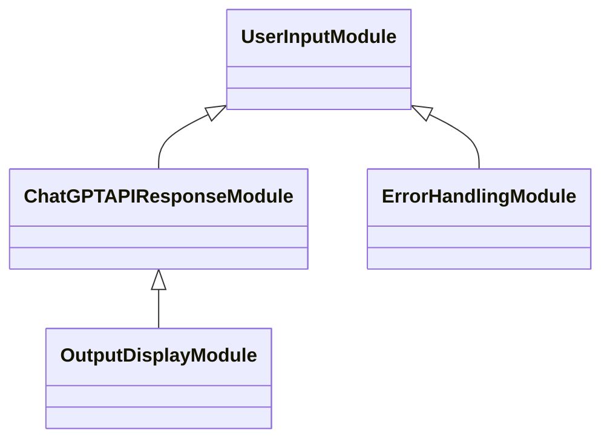
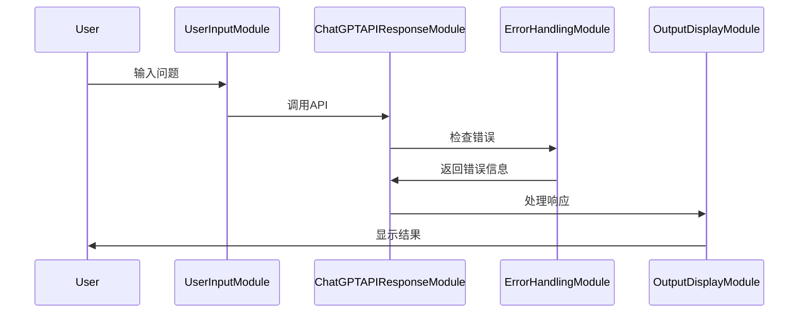
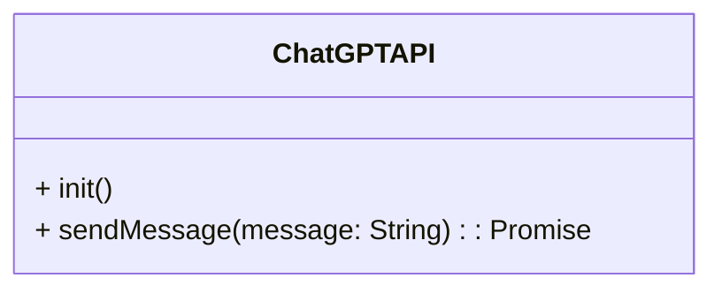
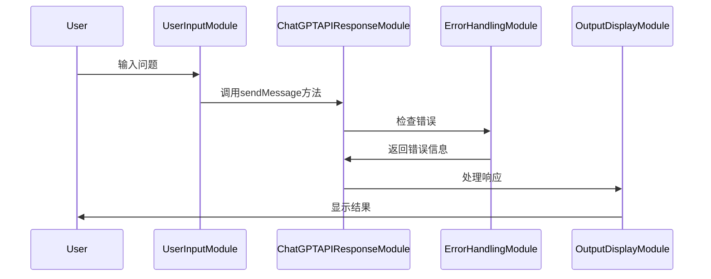
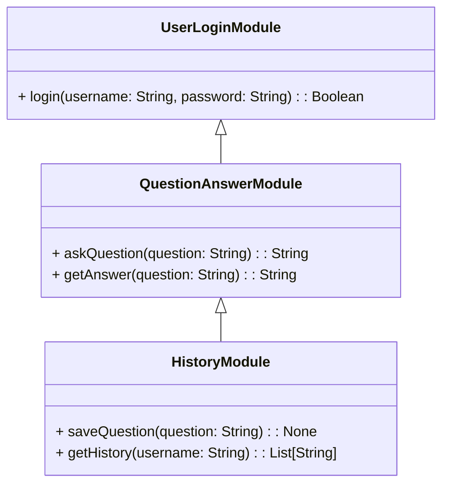
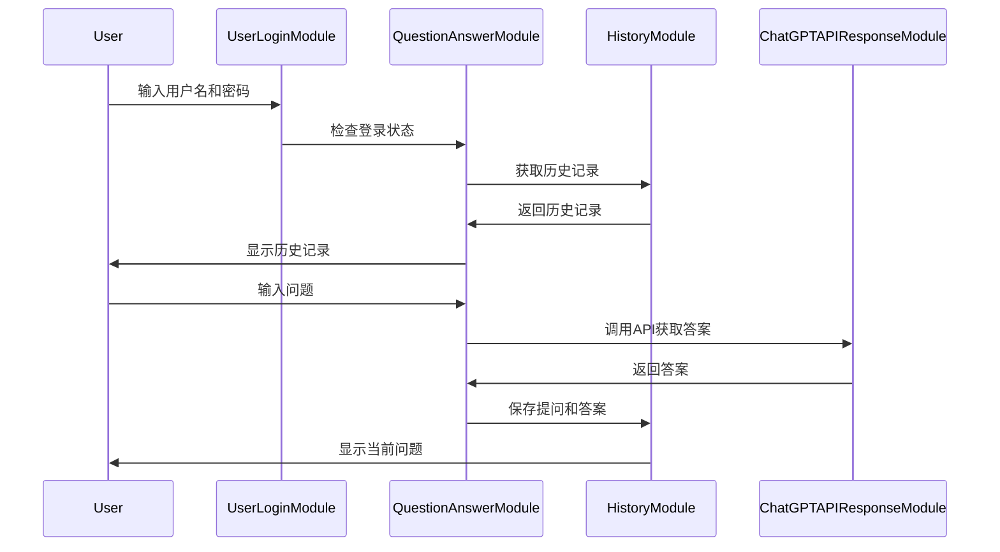
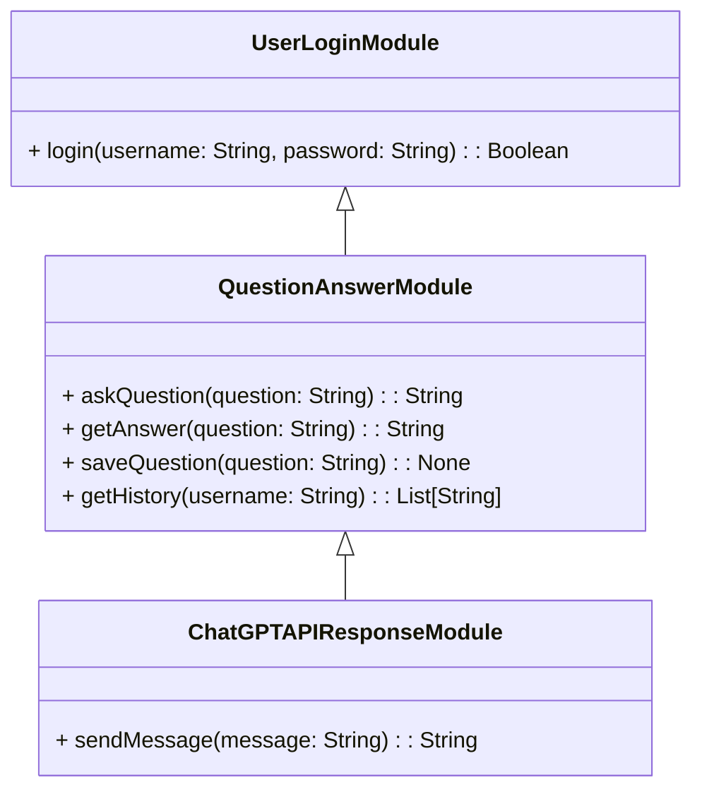
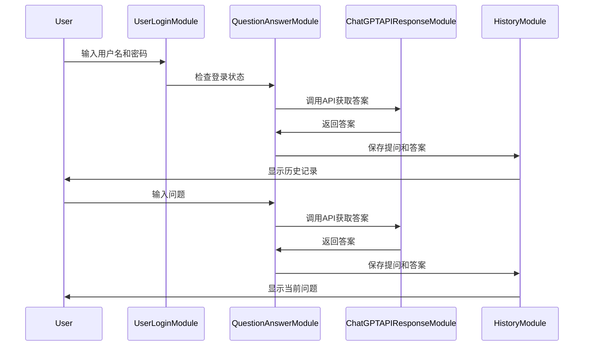

                 


### 第3章: 系统环境搭建

#### 3.1 开发环境配置

##### 3.1.1 环境要求

在进行ChatGPT API集成之前，我们首先需要配置一个适合开发的环境。以下是集成ChatGPT所需的基本环境要求：

- **操作系统**：Windows、macOS 或 Linux。
- **Python 版本**：Python 3.7 或更高版本。
- **第三方库**：`openai`、`requests`、`json`。

##### 3.1.2 环境安装步骤

**1. 安装Python**

确保您已安装了Python 3.7或更高版本。如果没有，请从Python官方网站下载并安装：https://www.python.org/downloads/

**2. 激活Python环境**

打开命令提示符或终端，输入以下命令激活Python环境：

```bash
python --version
```

如果命令行中显示Python版本信息，则说明Python已成功安装。

**3. 安装第三方库**

在Python环境中，使用pip命令安装所需的第三方库。打开命令提示符或终端，依次输入以下命令：

```bash
pip install openai
pip install requests
pip install json
```

等待命令执行完成，即完成了第三方库的安装。

#### 3.2 OpenAI API注册与配置

##### 3.2.1 注册流程

要使用ChatGPT API，您需要首先注册一个OpenAI账户。以下是注册流程：

**1. 访问OpenAI官网**

打开浏览器，访问OpenAI官网：https://openai.com/

**2. 注册账户**

在OpenAI官网首页，点击右上角的“Sign Up”按钮，进入注册页面。填写注册信息，包括邮箱地址、密码和验证码，然后点击“Create Account”按钮。

**3. 完成邮件验证**

注册后，OpenAI会向您填写的邮箱地址发送一封验证邮件。点击邮件中的验证链接，完成邮箱验证。

##### 3.2.2 配置API Key

完成注册后，您需要获取并配置API Key。以下是配置步骤：

**1. 登录OpenAI账户**

访问OpenAI官网，使用注册的邮箱地址和密码登录账户。

**2. 获取API Key**

登录后，点击导航栏中的“Account”按钮，进入账户设置页面。在下拉菜单中，选择“API Keys”。在此页面上，您可以查看和管理API Key。

**3. 配置API Key**

选择一个API Key，点击“View Key”按钮。复制API Key，然后将其添加到Python代码中的配置文件中。以下是一个简单的示例：

```python
openai.api_key = 'your-api-key'
```

确保将`your-api-key`替换为您刚刚复制的API Key。

#### 3.3 系统架构设计

##### 3.3.1 系统功能设计

在本项目中，我们设计了一个简单的ChatGPT集成系统，主要包含以下功能模块：

1. **用户输入模块**：接收用户输入，并将其发送给ChatGPT API。
2. **API响应模块**：接收ChatGPT API的响应，并将其处理为可读的格式。
3. **输出显示模块**：将处理后的响应显示给用户。

**4. **错误处理模块**：捕获并处理API调用过程中的错误。

以下是一个使用Mermaid绘制的系统功能模块类图：



##### 3.3.2 系统架构设计

接下来，我们设计一个简单的系统架构图，以展示各个模块之间的关系和工作流程。

以下是一个使用Mermaid绘制的系统架构图：



#### 3.3.3 系统接口设计

在本项目中，我们主要使用了OpenAI的ChatGPT API。以下是一个简单的接口设计，以展示API的主要调用方法和参数：



##### 3.3.4 系统交互设计

最后，我们设计一个系统交互序列图，以展示用户与系统之间的交互过程。

以下是一个使用Mermaid绘制的系统交互序列图：



#### 3.4 本章小结

在本章中，我们介绍了系统环境搭建的过程，包括Python环境配置、第三方库安装、OpenAI API注册与配置以及系统架构设计。通过这些步骤，我们为ChatGPT API集成打下了坚实的基础。接下来，我们将进入下一章，开始具体的代码实现部分。

### 第4章: ChatGPT API代码实现

#### 4.1 初始化ChatGPT API

在本章中，我们将首先实现一个ChatGPT API的初始化方法，以便在后续代码中方便地调用API。

以下是一个简单的Python类实现，用于初始化ChatGPT API：

```python
import openai

class ChatGPTAPI:
    def __init__(self, api_key):
        openai.api_key = api_key

    def sendMessage(self, message):
        response = openai.Completion.create(
            engine="text-davinci-002",
            prompt=message,
            max_tokens=50
        )
        return response.choices[0].text.strip()
```

在这个类中，我们定义了一个构造函数`__init__`，用于初始化API Key，以及一个`sendMessage`方法，用于发送消息并返回响应。

#### 4.2 用户输入与响应处理

接下来，我们将实现用户输入与响应处理的部分，以完成整个ChatGPT集成系统的核心功能。

以下是一个简单的用户交互实现，用于接收用户输入并调用ChatGPT API：

```python
def start_chat(api):
    print("欢迎与ChatGPT进行对话。请开始提问：")
    while True:
        user_input = input()
        if user_input.lower() == 'exit':
            print("谢谢，对话已结束。")
            break
        response = api.sendMessage(user_input)
        print("ChatGPT:", response)
```

在这个函数中，我们创建了一个循环，用于不断接收用户输入，并在用户输入“exit”时退出循环。对于每次用户输入，我们调用`sendMessage`方法发送消息，并打印ChatGPT的响应。

#### 4.3 错误处理

在实际应用中，我们可能需要处理API调用过程中可能出现的错误。以下是一个简单的错误处理实现：

```python
import sys

def safe_send_message(api, message):
    try:
        response = api.sendMessage(message)
        return response.choices[0].text.strip()
    except Exception as e:
        print(f"发生错误：{e}", file=sys.stderr)
        return None
```

在这个函数中，我们使用`try-except`语句捕获异常，并在发生错误时打印错误信息。如果发生错误，函数将返回`None`。

#### 4.4 测试代码

最后，我们可以编写一个简单的测试代码，以验证我们的ChatGPT API集成是否正常工作：

```python
def main():
    api_key = 'your-api-key'
    api = ChatGPTAPI(api_key)
    start_chat(api)

if __name__ == "__main__":
    main()
```

在这个测试代码中，我们首先获取API Key并创建一个ChatGPTAPI实例，然后调用`start_chat`函数开始与ChatGPT的对话。

#### 4.5 本章小结

在本章中，我们实现了ChatGPT API的初始化、用户输入与响应处理以及错误处理。这些代码构成了ChatGPT集成系统的核心部分。接下来，我们将探讨如何在实际项目中使用ChatGPT API。

### 第5章: ChatGPT API集成实践

#### 5.1 项目介绍

在本章中，我们将结合一个实际项目，详细讲解如何将ChatGPT API集成到我们的项目中。这个项目是一个简单的问答系统，用户可以通过系统向ChatGPT提问，并获取相应的答案。

#### 5.2 系统功能设计

在集成ChatGPT之前，我们需要明确系统的功能需求。以下是一个简单的系统功能设计：

1. **用户登录**：允许用户登录系统，以便跟踪用户的历史提问和答案。
2. **提问与回答**：允许用户输入问题，ChatGPT生成回答，并将回答显示给用户。
3. **历史记录**：记录用户的历史提问和回答，方便用户查看和管理。

以下是一个使用Mermaid绘制的系统功能模块类图：



#### 5.3 系统架构设计

接下来，我们设计一个简单的系统架构图，以展示各个模块之间的关系和工作流程。

以下是一个使用Mermaid绘制的系统架构图：



#### 5.4 系统接口设计

在本项目中，我们使用了多个模块，每个模块都有自己的接口。以下是一个简单的接口设计，以展示各个模块的主要方法和参数：



#### 5.5 系统交互设计

最后，我们设计一个系统交互序列图，以展示用户与系统之间的交互过程。

以下是一个使用Mermaid绘制的系统交互序列图：



#### 5.6 实际案例分析与详细讲解

下面，我们通过一个实际案例，详细讲解如何实现这个问答系统，并分析关键代码和概念。

##### 5.6.1 登录模块实现

首先，我们实现用户登录模块。这个模块负责检查用户输入的用户名和密码是否与数据库中的记录匹配。

```python
class UserLoginModule:
    def __init__(self, database):
        self.database = database

    def login(self, username, password):
        user = self.database.get_user(username)
        if user and user.password == password:
            return True
        return False
```

在这个模块中，我们使用了一个简单的数据库接口`get_user`来获取用户记录，并检查密码是否匹配。

##### 5.6.2 提问与回答模块实现

接下来，我们实现提问与回答模块。这个模块负责接收用户的问题，调用ChatGPT API获取答案，并将答案返回给用户。

```python
class QuestionAnswerModule:
    def __init__(self, api, history):
        self.api = api
        self.history = history

    def ask_question(self, question):
        answer = self.api.sendMessage(question)
        self.history.save_question(question, answer)
        return answer

    def get_answer(self, question):
        return self.history.get_answer(question)
```

在这个模块中，我们使用了`ChatGPTAPI`实例和`HistoryModule`实例，分别用于发送问题和获取历史记录。

##### 5.6.3 历史记录模块实现

最后，我们实现历史记录模块。这个模块负责保存用户的历史提问和答案，并提供查询功能。

```python
class HistoryModule:
    def __init__(self, database):
        self.database = database

    def save_question(self, question, answer):
        self.database.save_question(question, answer)

    def get_answer(self, question):
        return self.database.get_answer(question)

    def get_history(self, username):
        return self.database.get_user_history(username)
```

在这个模块中，我们使用了一个简单的数据库接口来保存和查询历史记录。

##### 5.6.4 关键代码分析

在实现问答系统的过程中，有几个关键代码片段需要详细分析。

**1. ChatGPT API调用**

```python
def sendMessage(self, message):
    response = openai.Completion.create(
        engine="text-davinci-002",
        prompt=message,
        max_tokens=50
    )
    return response.choices[0].text.strip()
```

这个函数是调用ChatGPT API的核心，它接收用户输入的问题，并使用OpenAI的`Completion.create`方法生成答案。我们设置了`max_tokens`参数，以限制返回答案的长度。

**2. 用户输入与响应处理**

```python
def start_chat(api):
    print("欢迎与ChatGPT进行对话。请开始提问：")
    while True:
        user_input = input()
        if user_input.lower() == 'exit':
            print("谢谢，对话已结束。")
            break
        response = api.sendMessage(user_input)
        print("ChatGPT:", response)
```

这个函数是用户与系统交互的主要入口。它接收用户输入，调用`sendMessage`函数获取答案，并打印答案。如果用户输入“exit”，则退出循环。

**3. 错误处理**

```python
def safe_send_message(api, message):
    try:
        response = api.sendMessage(message)
        return response.choices[0].text.strip()
    except Exception as e:
        print(f"发生错误：{e}", file=sys.stderr)
        return None
```

这个函数是一个安全的发送消息函数，用于处理API调用过程中可能出现的错误。如果发生错误，它将打印错误信息并返回`None`。

##### 5.6.5 项目小结

在本章中，我们通过一个实际项目，详细讲解了如何将ChatGPT API集成到我们的系统中。我们设计了系统的功能模块、架构图、接口设计和交互序列图，并实现了关键代码。通过这个项目，我们了解了ChatGPT API的使用方法，并学会了如何在实际项目中集成和使用它。

### 第6章: 最佳实践与注意事项

#### 6.1 最佳实践

在ChatGPT API集成过程中，以下是一些最佳实践，可以帮助您更好地使用ChatGPT并优化用户体验：

1. **合理设置API Key**：确保您的API Key保密，并避免将其暴露在公共代码库中。
2. **优化提问方式**：为了获得更好的回答，请确保您的提问清晰、具体，并包含足够的上下文信息。
3. **处理API调用异常**：使用适当的错误处理机制，以确保在API调用失败时系统能够优雅地处理错误。
4. **优化API调用频率**：避免频繁调用API，以免造成不必要的开销和延迟。
5. **使用线程或异步调用**：为了提高系统的响应速度，可以考虑使用线程或异步调用来并行处理多个API请求。

#### 6.2 注意事项

在集成ChatGPT API时，您需要注意以下几点：

1. **API调用费用**：使用ChatGPT API可能产生费用，请在使用前了解费用结构和相关费用，以避免不必要的开支。
2. **API限制**：OpenAI对API调用有一定的限制，例如请求频率和最大并发请求数。请确保您的代码符合这些限制。
3. **数据隐私**：确保遵守数据隐私法规，并在使用ChatGPT API时保护用户的隐私。
4. **系统稳定性**：在使用ChatGPT API时，请注意系统的稳定性和可扩展性，以应对高并发和大数据量的情况。

#### 6.3 拓展阅读

以下是一些拓展阅读资源，可以帮助您深入了解ChatGPT API和相关技术：

1. **OpenAI官方文档**：https://developer.openai.com/docs/api-reference/introduction
2. **Python OpenAI客户端库文档**：https://github.com/openai/openai-python
3. **自然语言处理（NLP）基础教程**：https://www.nltk.org/
4. **异步编程与并发编程教程**：https://python-asyncio Texans tutorial
5. **API设计和最佳实践**：https://restfulapi.com/api-design-principles/

### 第7章: 总结与展望

#### 7.1 内容总结

在本篇文章中，我们系统地介绍了ChatGPT API的集成过程，包括从概念理解到具体实现。首先，我们了解了ChatGPT的背景和核心功能，探讨了其在不同领域中的应用前景。然后，我们详细讲解了如何使用OpenAI提供的API进行集成，包括环境搭建、API调用、错误处理等。接着，我们通过一个实际项目案例，展示了如何将ChatGPT集成到问答系统中，并分析了关键代码和概念。最后，我们提供了最佳实践和注意事项，以及拓展阅读资源，帮助读者更好地应用ChatGPT API。

#### 7.2 展望

随着人工智能技术的不断发展，ChatGPT等大型语言模型的应用前景十分广阔。未来，我们可以期待以下发展趋势：

1. **性能提升**：随着计算能力的提升，ChatGPT等模型的响应速度和准确性将进一步提高。
2. **应用场景扩展**：ChatGPT将在更多的领域得到应用，如智能客服、虚拟助手、内容创作等。
3. **隐私保护与安全**：如何在确保用户隐私的前提下，安全地使用大型语言模型，将是一个重要的研究方向。
4. **多模态交互**：结合图像、音频等多模态数据，实现更丰富、更自然的交互体验。

总之，ChatGPT API的集成和应用为我们带来了巨大的机遇和挑战。通过深入了解和实践，我们可以更好地利用这一先进技术，为用户创造更多价值。作者：AI天才研究院/AI Genius Institute & 禅与计算机程序设计艺术 /Zen And The Art of Computer Programming。

