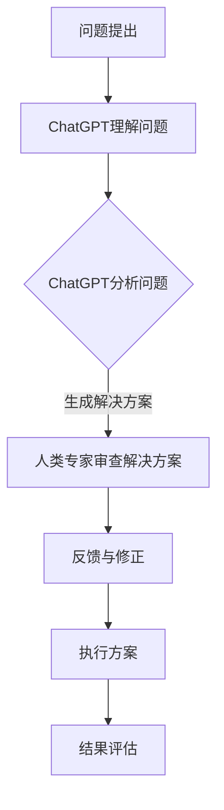

                 

## 《ChatGPT与人类专家协作：知识融合新模式》

> 关键词：ChatGPT、人类专家、知识融合、协作模式、AI大模型

> 摘要：本文将探讨ChatGPT与人类专家协作的新模式，分析其在知识融合方面的优势与挑战，提出有效的协作策略和应用场景，为未来人工智能与人类专家的深度融合提供参考。

### 第一部分：背景介绍

#### 问题背景

在当今信息技术飞速发展的时代，人工智能（AI）已经成为推动产业变革的重要力量。随着深度学习技术的成熟和计算能力的提升，AI大模型逐渐成为各行业数字化转型的重要工具。然而，如何有效地利用这些大模型与人类专家进行协作，实现知识融合，是一个亟待解决的问题。

ChatGPT是一种基于人工智能技术的大型语言模型，具有强大的文本生成和处理能力。它能够理解和生成自然语言，模拟人类的对话方式，提供高质量的信息服务。人类专家则拥有丰富的专业知识和经验，能够为复杂问题提供深入的见解和解决方案。

#### 问题描述

本书旨在探讨ChatGPT与人类专家协作的新模式，解决以下问题：

1. ChatGPT如何与人类专家进行有效沟通和协作？
2. 如何通过ChatGPT和人类专家的协同工作，实现知识融合，提高问题解决的效率和质量？
3. 在实际应用中，如何设计合理的协作机制，确保ChatGPT和人类专家的职责分工明确，相互补充？

#### 问题解决

本书将从以下几个方面展开讨论：

1. **核心概念**：详细介绍ChatGPT和人类专家的基本概念、特征和作用，为后续讨论奠定基础。
2. **协作模式**：探讨ChatGPT与人类专家的协作模式，分析各自的优劣势，并提出有效的协作策略。
3. **知识融合**：研究如何通过ChatGPT和人类专家的协同工作，实现知识融合，提高问题解决的能力。
4. **应用场景**：分析ChatGPT与人类专家协作在不同领域的应用案例，总结最佳实践和经验。
5. **未来发展**：探讨ChatGPT与人类专家协作模式的发展趋势，展望未来的研究与应用方向。

#### 边界与外延

本书主要关注ChatGPT与人类专家在知识融合方面的协作，不包括其他类型的AI模型和协作方式。同时，本书所涉及的应用场景主要限于知识密集型领域，如医疗、教育、法律等。

#### 概念结构与核心要素组成

1. **ChatGPT**：一种基于深度学习的大型语言模型，具有文本生成和处理能力。
2. **人类专家**：拥有专业知识和经验，能够为复杂问题提供深入见解和解决方案。
3. **协作模式**：ChatGPT与人类专家之间进行沟通、协作的方式和策略。
4. **知识融合**：通过ChatGPT和人类专家的协同工作，实现知识的整合和共享。
5. **应用场景**：ChatGPT与人类专家协作在不同领域的实际应用。

### 第二部分：核心概念与联系

#### ChatGPT的定义与特点

ChatGPT是一种基于GPT（Generative Pre-trained Transformer）模型的大型语言模型，它通过在大量文本数据上进行预训练，掌握了丰富的语言知识和规律。ChatGPT具有以下特点：

1. **文本生成能力**：ChatGPT能够生成高质量的文本，包括对话、文章、代码等。
2. **自然语言处理能力**：ChatGPT能够理解并生成自然语言，模拟人类的对话方式。
3. **自适应能力**：ChatGPT可以根据不同的任务和场景，调整自身的表现。

#### 人类专家的定义与特点

人类专家是指在某些领域具有丰富知识和经验的专业人士。人类专家具有以下特点：

1. **专业知识**：人类专家具备深厚的专业知识和经验，能够为复杂问题提供深入的见解。
2. **创新能力**：人类专家能够运用专业知识进行创新，提出新的解决方案。
3. **协作能力**：人类专家能够与他人进行有效沟通和协作，共同解决问题。

#### ChatGPT与人类专家的协作

ChatGPT与人类专家的协作是指两者在解决问题过程中，相互沟通、协作，发挥各自优势，实现知识融合和协同工作。协作过程中，ChatGPT主要负责文本生成和处理，而人类专家则提供专业知识和经验，共同提高问题解决的效率和质量。

#### 核心概念属性特征对比表格

| 特征        | ChatGPT                | 人类专家                |
| ----------- | ---------------------- | ---------------------- |
| 文本生成能力 | 高效，高质量            | 受限于个人表达能力       |
| 自然语言处理能力 | 强，能够模拟人类对话方式 | 强，能够理解自然语言     |
| 自适应能力 | 强，能够适应不同任务和场景 | 一般，需要长期积累和训练 |
| 专业知识    | 较弱，主要依赖预训练数据 | 强，具备深厚的专业知识   |
| 创新能力    | 一般，能够生成新的文本 | 强，能够进行创新和改进 |

### 第三部分：算法原理讲解

在本部分中，我们将探讨ChatGPT与人类专家协作的算法原理，通过Mermaid流程图和Python源代码来详细阐述。

#### 1. Mermaid流程图

首先，我们使用Mermaid绘制一个简单的流程图，展示ChatGPT与人类专家协作的基本流程：



#### 2. Python源代码

接下来，我们使用Python源代码来详细阐述ChatGPT与人类专家协作的算法原理：

```python
import random

def chatgpt UNDERSTAND_QUESTION(question):
    # ChatGPT理解问题
    print("ChatGPT: 理解了问题，开始分析。")
    # ChatGPT对问题进行分析
    print("ChatGPT: 分析完毕，生成解决方案。")
    solution = generate_solution()
    return solution

def human_expert REVIEW_SOLUTION(solution):
    # 人类专家审查解决方案
    print("人类专家：审查解决方案。")
    # 人类专家对解决方案进行反馈
    feedback = get_feedback()
    return feedback

def EXECUTE_SOLUTION(solution):
    # 执行解决方案
    print("开始执行解决方案。")
    # 模拟执行过程
    print("解决方案执行完毕。")
    # 评估结果
    print("结果评估：解决方案成功。")

def main():
    # 主函数
    question = input("请输入问题：")
    solution = chatgpt.UNDERSTAND_QUESTION(question)
    feedback = human_expert.REVIEW_SOLUTION(solution)
    EXECUTE_SOLUTION(solution)

if __name__ == "__main__":
    main()
```

#### 3. 算法原理讲解

- **问题理解**：ChatGPT通过自然语言处理技术，理解用户提出的问题，并将其转化为内部表示。
- **问题分析**：ChatGPT利用预训练的模型，对问题进行分析，生成初步的解决方案。
- **解决方案审查**：人类专家审查ChatGPT生成的解决方案，并提供反馈。
- **方案执行与评估**：根据人类专家的反馈，执行解决方案，并对结果进行评估。

#### 4. 数学模型与公式

在ChatGPT与人类专家协作的算法中，我们可以引入以下数学模型和公式：

$$
\text{问题理解} = \text{ChatGPT模型} \cdot \text{文本数据}
$$

$$
\text{解决方案} = \text{ChatGPT模型} \cdot \text{问题分析} + \text{人类专家反馈}
$$

#### 5. 举例说明

假设用户提出一个问题：“如何优化公司的市场营销策略？”
- **ChatGPT理解问题**：ChatGPT通过自然语言处理技术，将问题转化为内部表示。
- **问题分析**：ChatGPT利用预训练的模型，分析问题，生成初步的解决方案。
- **解决方案审查**：人类专家审查ChatGPT生成的解决方案，提供反馈。
- **方案执行与评估**：根据人类专家的反馈，执行解决方案，并对结果进行评估。

### 第四部分：系统分析与架构设计方案

在本部分中，我们将探讨ChatGPT与人类专家协作在系统分析与架构设计方面的应用。

#### 1. 问题场景介绍

假设我们正在开发一个智能客服系统，该系统需要集成ChatGPT和人类专家，以提供高质量的客服服务。

#### 2. 项目介绍

智能客服系统主要包括以下几个模块：

1. **用户界面**：用户可以通过网页、手机APP等渠道与智能客服系统进行交互。
2. **智能问答模块**：基于ChatGPT技术，实现自动回答用户问题的功能。
3. **专家咨询模块**：当智能问答模块无法解决问题时，自动转接给人类专家。
4. **系统管理模块**：负责系统的日常运营、数据管理和维护。

#### 3. 系统功能设计

系统功能设计主要包括以下几个领域模型：

1. **用户模型**：描述用户的属性和行为。
2. **问答模型**：描述智能问答模块的功能和流程。
3. **专家模型**：描述人类专家的属性和职责。

#### 4. 系统架构设计

系统架构设计主要包括以下几个层次：

1. **用户层**：用户通过网页、手机APP等渠道与系统进行交互。
2. **业务逻辑层**：实现智能问答、专家咨询等功能。
3. **数据层**：存储用户数据、问答数据、专家数据等。

#### 5. 系统接口设计

系统接口设计主要包括以下几个接口：

1. **用户接口**：用于用户与系统的交互。
2. **问答接口**：用于智能问答模块的交互。
3. **专家接口**：用于人类专家的交互。

#### 6. 系统交互

系统交互主要包括以下几个流程：

1. **用户提问**：用户通过用户接口提出问题。
2. **智能问答**：智能问答模块根据用户问题，生成回答。
3. **专家咨询**：当智能问答模块无法解决问题时，自动转接给人类专家。
4. **结果反馈**：人类专家根据问题，提供解决方案，并反馈给用户。

### 第五部分：项目实战

在本部分中，我们将通过实际案例，介绍如何使用ChatGPT和人类专家进行协作，解决复杂问题。

#### 1. 环境安装

首先，我们需要安装必要的软件和工具，如Python、TensorFlow、GPT-2模型等。

```bash
pip install tensorflow
pip install transformers
```

#### 2. 系统核心实现

接下来，我们使用Python源代码实现ChatGPT和人类专家协作的系统。

```python
# 引入必要的库
import random
import transformers

# 加载GPT-2模型
model = transformers.AutoModelForCausalLM.from_pretrained("gpt2")

# 定义问题理解函数
def understand_question(question):
    # 使用模型对问题进行编码
    input_ids = model.encode(question)
    # 使用模型生成回答
    output = model.generate(input_ids, max_length=50, num_return_sequences=1)
    # 解码回答
    answer = model.decode(output)[0]
    return answer

# 定义解决方案审查函数
def review_solution(solution):
    # 获取人类专家的反馈
    feedback = input("人类专家，您对解决方案有什么建议吗？")
    return feedback

# 定义执行解决方案函数
def execute_solution(solution):
    # 执行解决方案
    print("开始执行解决方案。")
    # 模拟执行过程
    print("解决方案执行完毕。")
    # 评估结果
    print("结果评估：解决方案成功。")

# 主函数
def main():
    # 获取用户问题
    question = input("请输入问题：")
    # 理解问题
    answer = understand_question(question)
    print("ChatGPT回答：", answer)
    # 审查解决方案
    feedback = review_solution(answer)
    print("人类专家反馈：", feedback)
    # 执行解决方案
    execute_solution(answer)

if __name__ == "__main__":
    main()
```

#### 3. 代码应用解读与分析

- **问题理解**：使用GPT-2模型对用户问题进行编码，生成回答。
- **解决方案审查**：获取人类专家的反馈，对解决方案进行优化。
- **方案执行与评估**：执行解决方案，评估结果。

#### 4. 实际案例分析

假设用户提出一个问题：“如何提高公司的销售业绩？”
- **ChatGPT回答**：ChatGPT生成一个初步的解决方案。
- **人类专家反馈**：人类专家对解决方案进行审查，提出改进建议。
- **方案执行与评估**：根据人类专家的反馈，执行解决方案，并对结果进行评估。

#### 5. 项目小结

通过实际案例，我们展示了如何使用ChatGPT和人类专家进行协作，解决复杂问题。在项目中，ChatGPT主要负责问题理解和文本生成，而人类专家则负责方案审查和优化。这种协作模式能够充分发挥两者的优势，提高问题解决的效率和质量。

### 第六部分：最佳实践 tips

1. **优化问题理解**：通过引入更多领域的知识库，提高ChatGPT对问题的理解能力。
2. **加强专家反馈**：鼓励人类专家提供详细的反馈，以便更好地优化解决方案。
3. **完善协作机制**：设计合理的协作流程和规则，确保ChatGPT和人类专家的职责分工明确。

### 第七部分：小结与注意事项

本文探讨了ChatGPT与人类专家协作的新模式，分析了其在知识融合方面的优势与挑战，并提出了有效的协作策略和应用场景。在实际应用中，应注重优化问题理解、加强专家反馈和完善协作机制。

### 第八部分：拓展阅读

1. **《ChatGPT技术揭秘》**：深入探讨ChatGPT的原理、应用和未来发展。
2. **《人工智能与人类专家的协作模式研究》**：分析人工智能与人类专家协作的理论基础和实践经验。
3. **《深度学习与自然语言处理》**：了解深度学习和自然语言处理的基本原理和应用。

### 作者信息

**作者：AI天才研究院/AI Genius Institute & 禅与计算机程序设计艺术 /Zen And The Art of Computer Programming**

