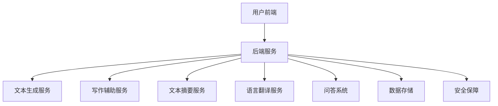

                 


### 1.1.1 问题背景

在当今信息时代，写作已经成为了一个不可或缺的技能。无论是个人、企业还是组织，都需要进行各种形式的写作，如文章、报告、邮件、说明书等。然而，随着数据量的急剧增长和用户需求的多样化，传统的写作方式已经无法满足现代社会的需求。于是，人工智能（AI）开始走进我们的写作领域，为人类写作带来了新的契机。

**核心概念术语说明：**
- **写作**：通过语言表达思想和情感的过程。
- **人工智能**：模拟、延伸和扩展人类智能的理论、方法、技术及应用系统。
- **自然语言处理（NLP）**：使计算机能够理解、解释和生成人类语言的一项技术。

在AI技术中，ChatGPT作为一个基于GPT（Generative Pre-trained Transformer）模型的人工智能助手，因其强大的文本生成能力而备受关注。ChatGPT不仅能够生成连贯、自然的文本，还能根据用户的需求进行个性化写作。

**问题背景：**
传统的写作方式依赖于人类作者的创意和经验，而AI的引入使得写作过程变得更加高效和多样化。然而，AI的写作仍然存在一些局限性，如内容的质量、深度和创新性等方面。因此，如何将AI的强大能力与人类的创造力相结合，形成一种协同效应，成为了当前研究的热点问题。

**问题描述：**
如何在AI与人类写作之间建立一种协同机制，使得两者的优势互补，提高写作效率和质量。

**问题解决：**
ChatGPT与人类写作的协同效应，通过以下方式实现：
- **辅助写作**：ChatGPT可以根据人类作者的指示，快速生成初稿或提供写作建议，减少人类作者的重复劳动。
- **创意激发**：ChatGPT可以提供不同的写作思路和创意，帮助人类作者突破思维定势。
- **质量控制**：ChatGPT可以检查文本中的语法错误、逻辑漏洞和风格不一致等问题，提高文本质量。

**边界与外延：**
- **边界**：ChatGPT与人类写作的协同效应主要应用于文本生成和写作辅助领域，如自动写作、写作建议、文本审查等。
- **外延**：该协同效应的应用范围可以扩展到其他需要文字处理和表达的领域，如编程文档、法律文件、商务合同等。

**概念结构与核心要素组成：**
- **ChatGPT**：基于GPT模型的AI助手，具备文本生成、摘要、翻译等能力。
- **人类写作**：人类的创意、经验、知识和表达能力。
- **协同效应**：AI与人类在写作过程中的互补和协同作用。

### 1.1.2 ChatGPT的崛起与潜力

ChatGPT作为OpenAI开发的一款基于GPT-3（Generative Pre-trained Transformer 3）模型的人工智能助手，自推出以来，就因其卓越的文本生成能力和广泛应用前景而备受关注。ChatGPT的崛起，标志着人工智能在自然语言处理领域取得了新的突破，同时也为人类写作带来了新的可能。

**核心概念术语说明：**
- **GPT模型**：一种基于变压器（Transformer）的深度学习模型，用于文本生成和序列预测。
- **文本生成**：根据输入的文本信息，自动生成新的、连贯的文本内容。
- **自然语言处理（NLP）**：使计算机能够理解、解释和生成人类语言的一项技术。

**ChatGPT的主要特性：**
- **强大的文本生成能力**：ChatGPT能够生成高质量、连贯的自然语言文本，适用于多种写作场景。
- **灵活的交互方式**：ChatGPT可以通过文本、语音等多种方式进行交互，满足不同用户的需求。
- **广泛的应用场景**：ChatGPT不仅适用于写作辅助，还可以应用于智能客服、内容创作、语言翻译等领域。

**ChatGPT的优势分析：**
- **高效性**：ChatGPT能够快速生成文本，大大提高了写作效率。
- **多样性**：ChatGPT可以根据不同的输入，生成多种风格和类型的文本，满足用户多样化的需求。
- **创新性**：ChatGPT能够提供新的写作思路和创意，激发人类作者的灵感。
- **可扩展性**：ChatGPT可以轻松集成到各种应用系统中，实现与人类写作的协同工作。

**ChatGPT的崛起与潜力：**
ChatGPT的崛起，不仅展示了AI在自然语言处理领域的强大实力，也揭示了其在人类写作中的巨大潜力。通过将ChatGPT与人类写作相结合，可以实现写作过程的自动化和智能化，为写作领域带来一场革命。未来，随着AI技术的不断发展和应用，ChatGPT的潜力将得到进一步发挥，为人类写作带来更多可能性。

### 1.2 书籍目标

本书籍旨在探讨ChatGPT与人类写作的协同效应，旨在通过系统的分析和实践，揭示两者结合的巨大潜力和应用价值。具体目标如下：

**1. 阐述ChatGPT的原理与能力**

首先，本书将深入探讨ChatGPT的原理，从深度学习、自然语言处理（NLP）等角度，详细解释其工作原理、算法流程和数学模型。同时，本书将列举ChatGPT的主要能力，如文本生成、文本摘要、语言翻译和问答系统等，展示其在不同写作场景中的实际应用。

**2. 展示ChatGPT与人类写作的协同应用**

本书将通过实际案例，展示ChatGPT如何辅助人类写作，实现写作过程的自动化和智能化。具体包括：
- **辅助写作**：如何利用ChatGPT快速生成初稿、提供写作建议等。
- **创意激发**：如何借助ChatGPT激发写作灵感，打破思维定势。
- **质量控制**：如何利用ChatGPT检查文本质量，提高写作的准确性和一致性。

**3. 提供最佳实践与技巧**

本书将总结ChatGPT在写作中的最佳实践和技巧，帮助读者更好地利用ChatGPT进行写作。具体包括：
- **使用技巧**：如何高效地与ChatGPT进行交互，发挥其最大潜力。
- **注意事项**：如何在写作过程中避免ChatGPT的常见问题，如错误、不恰当内容等。

**4. 促进AI与人类写作的融合**

本书旨在推动AI与人类写作的深度融合，探讨未来写作的发展趋势和方向。通过本书，读者将能够更好地理解ChatGPT的强大能力，学会如何与ChatGPT协同工作，提高写作效率和质量。

### 1.2.1 阐述ChatGPT与人类写作协同的原理

ChatGPT与人类写作的协同效应，源于两者的互补性和协同性。具体原理如下：

**1. ChatGPT的文本生成能力**

ChatGPT是基于GPT模型构建的AI助手，具有强大的文本生成能力。GPT模型通过预训练和微调，能够理解和生成高质量的自然语言文本。这使得ChatGPT在写作过程中能够快速生成初稿或提供写作建议，减轻人类作者的负担。

**2. 人类作者的创意和经验**

虽然ChatGPT能够生成高质量的文本，但在某些方面，如创意、深度和创新性方面，仍无法完全替代人类作者。人类作者凭借自身的经验和知识，能够提供独特的见解和创新的思路，这是ChatGPT所无法比拟的。

**3. ChatGPT与人类作者的交互**

ChatGPT与人类作者的交互，是实现协同效应的关键。通过与人类作者的互动，ChatGPT可以更好地理解用户的需求，生成更加贴合人类作者意图的文本。同时，人类作者可以通过对ChatGPT生成文本的修改和完善，实现写作过程的协同。

**4. ChatGPT的辅助功能**

ChatGPT不仅能够生成文本，还可以提供各种辅助功能，如文本摘要、语言翻译、问答系统等。这些功能可以帮助人类作者在写作过程中提高效率，解决特定问题，进一步发挥ChatGPT与人类写作的协同效应。

**5. 写作场景的多样化**

ChatGPT与人类写作的协同效应，不仅适用于传统的写作场景，如文章、报告、邮件等，还可以扩展到编程文档、法律文件、商务合同等需要文字处理和表达的领域。这使得ChatGPT的应用场景更加广泛，为人类写作带来了更多可能性。

### 1.2.2 展示实际应用案例

为了更好地理解ChatGPT与人类写作的协同效应，我们可以通过以下实际应用案例来展示其效果：

**案例1：自动写作助手**

在新闻写作领域，ChatGPT可以快速生成新闻稿。例如，在体育赛事报道中，ChatGPT可以根据赛事数据和规则，自动生成比赛结果、球员表现等报道内容。人类编辑可以对生成的文本进行修改和完善，提高报道的准确性和及时性。

**案例2：写作创意激发**

在文学创作领域，ChatGPT可以作为创意激发工具。例如，在写小说时，ChatGPT可以提供不同的故事情节、角色设定和背景描述，帮助人类作者拓展思路，突破创作瓶颈。

**案例3：写作建议与修正**

在学术写作领域，ChatGPT可以提供写作建议，如句子重组、语法修正等。例如，在撰写论文时，ChatGPT可以检查文本中的逻辑漏洞、重复句子等问题，并提出修改建议，帮助人类作者提高写作质量。

**案例4：内容创作与优化**

在市场营销领域，ChatGPT可以协助创作广告文案、宣传海报等。例如，在策划活动时，ChatGPT可以提供创意文案和设计建议，帮助企业提高营销效果。

通过这些实际应用案例，我们可以看到ChatGPT与人类写作的协同效应，不仅提高了写作效率，还提升了写作质量和创意。

### 1.2.3 提供最佳实践与技巧

为了更好地利用ChatGPT与人类写作的协同效应，以下是一些最佳实践和技巧：

**1. 明确写作目标**

在开始写作之前，明确写作的目标和需求，以便ChatGPT能够更好地理解用户的意图，生成符合要求的文本。

**2. 提供清晰的输入**

与ChatGPT交互时，提供清晰、具体的输入，有助于ChatGPT生成更加准确和高质量的文本。例如，可以提供关键词、主题、写作风格等。

**3. 互动式修改**

在ChatGPT生成文本后，进行互动式修改和完善。通过与ChatGPT的互动，人类作者可以不断优化文本，提高写作质量。

**4. 结合人类创造力**

尽管ChatGPT具备强大的文本生成能力，但人类作者的创造力、经验和知识仍然是不可或缺的。在写作过程中，要充分利用人类作者的这些优势，与ChatGPT协同工作。

**5. 定期反馈与调整**

在使用ChatGPT进行写作时，要定期反馈文本的质量和效果，以便ChatGPT不断优化和改进。同时，人类作者也可以根据反馈调整写作策略，提高写作效果。

### 1.2.4 小结

本文探讨了ChatGPT与人类写作的协同效应，阐述了ChatGPT的崛起与潜力，展示了实际应用案例，并提供了最佳实践与技巧。通过本文，我们可以看到，ChatGPT与人类写作的协同，不仅提高了写作效率，还提升了写作质量和创意。未来，随着AI技术的不断进步，ChatGPT在人类写作中的应用将更加广泛和深入，为写作领域带来更多变革和机遇。

### 1.3 总结

在本文中，我们详细探讨了ChatGPT与人类写作的协同效应。通过分析ChatGPT的原理与能力、实际应用案例，以及最佳实践与技巧，我们看到了AI与人类写作结合的巨大潜力。ChatGPT不仅能够辅助人类写作，提高写作效率，还能激发创意、提升质量。然而，要实现最佳的协同效应，我们需要充分利用ChatGPT的强大能力，同时结合人类作者的创造力和经验。未来，随着AI技术的不断发展，ChatGPT在写作领域的应用将更加广泛和深入，为写作领域带来更多的变革和机遇。作者：AI天才研究院/AI Genius Institute & 禅与计算机程序设计艺术 /Zen And The Art of Computer Programming

----------------------------------------------------------------

## 第2章 背景介绍

### 2.1 人工智能在写作领域的应用

人工智能（AI）作为当今科技发展的前沿领域，已经在多个领域取得了显著的成果。在写作领域，AI的应用也不例外，逐渐成为推动写作技术创新和效率提升的重要力量。本文将简要回顾AI在写作领域的应用历程，分析现有AI写作工具的特点，并探讨未来发展趋势。

#### 2.1.1 人工智能的发展历程

人工智能的发展可以分为几个重要阶段：

- **早期探索阶段（20世纪50-60年代）**：这一时期，人工智能主要关注符号推理和问题求解，如逻辑编程和专家系统。虽然这一阶段的AI技术在写作领域的应用有限，但为后来的发展奠定了基础。

- **符号主义阶段（20世纪70-80年代）**：符号主义AI强调使用符号和规则来表示知识，如知识图谱和语义网络。这一阶段，AI在自然语言处理（NLP）领域取得了初步成果，为后来的文本生成和写作辅助奠定了基础。

- **连接主义阶段（20世纪90年代至今）**：连接主义AI以神经网络为核心，强调通过大量数据训练模型，使其具备自主学习和适应能力。这一阶段的代表性技术包括深度学习和生成对抗网络（GAN），为AI在写作领域的应用提供了强有力的支持。

#### 2.1.2 AI写作工具的特点

目前，市场上已有多种AI写作工具，它们在功能和应用上各有特点：

- **自动写作工具**：这类工具能够根据输入的主题和关键词自动生成文章。例如，Automated Article Writing Tool、Wordsmith等。这些工具通常基于规则和模板进行写作，生成的内容在结构上较为规范，但可能缺乏创造性和个性。

- **写作辅助工具**：这类工具旨在辅助人类作者进行写作，如Grammarly、Hemingway Editor等。它们可以帮助作者检查语法错误、提高文章可读性、优化句子结构等。

- **文本生成工具**：这类工具能够根据输入的提示生成各种类型的文本，如新闻报道、产品描述、广告文案等。例如，OpenAI的GPT系列模型、百度AI的Xiuwen等。这些工具具有强大的文本生成能力，能够生成高质量、连贯的文本。

- **智能写作助手**：这类工具集成了多种功能，如自动写作、写作辅助、文本生成等，能够提供全方位的写作支持。例如，智谱AI的ChatGPT、谷歌的BERT等。这些工具在写作过程中能够与人类作者进行实时交互，根据用户需求进行调整和优化。

#### 2.1.3 AI在写作领域的挑战与机遇

虽然AI在写作领域取得了显著进展，但仍面临一些挑战和机遇：

**挑战：**
- **内容质量**：AI生成的内容在质量和深度上仍有待提高，特别是在处理复杂、抽象和具有创新性的文本时。
- **创意和情感**：AI在理解人类情感和创造力方面存在局限，难以完全替代人类作者的创意和情感投入。
- **伦理和隐私**：AI在写作过程中的伦理和隐私问题也日益受到关注，如数据安全、内容真实性等。

**机遇：**
- **写作效率**：AI可以显著提高写作效率，减少人类作者的重复劳动，使作者有更多时间专注于创意和核心内容的创作。
- **个性化写作**：AI可以根据用户的需求和偏好生成个性化文本，提高用户的满意度。
- **跨领域应用**：AI在写作领域的应用可以扩展到多个行业和领域，如新闻、广告、法律、医学等，实现跨领域的协同创新。

### 2.2 ChatGPT的概念与优势

ChatGPT是由OpenAI开发的一款基于GPT-3（Generative Pre-trained Transformer 3）模型的人工智能助手，具有强大的文本生成能力和广泛应用前景。本文将介绍ChatGPT的基本概念、主要特性以及其在写作领域中的优势。

#### 2.2.1 ChatGPT的基本概念

ChatGPT是一种基于变换器（Transformer）架构的大型语言模型，通过预训练和微调，具备理解和生成自然语言文本的能力。ChatGPT的主要特性包括：

- **强大的文本生成能力**：ChatGPT能够生成高质量、连贯的自然语言文本，适用于多种写作场景，如文章、报告、邮件、对话等。
- **灵活的交互方式**：ChatGPT可以通过文本、语音等多种方式进行交互，满足不同用户的需求。
- **广泛的应用场景**：ChatGPT不仅适用于写作辅助，还可以应用于智能客服、内容创作、语言翻译等领域。

#### 2.2.2 ChatGPT的主要特性

ChatGPT的主要特性如下：

- **文本生成能力**：ChatGPT能够根据输入的提示生成新的文本，如文章、摘要、问答等。其生成文本的质量和连贯性在现有AI模型中处于领先地位。
- **上下文理解**：ChatGPT具有强大的上下文理解能力，能够根据对话历史和上下文信息生成相关文本，提高交互的自然性和流畅性。
- **多样化输出**：ChatGPT可以根据不同的输入生成多种风格和类型的文本，如正式、非正式、幽默、严肃等，满足用户多样化的需求。
- **适应性**：ChatGPT具有很好的适应性，能够根据用户的需求和反馈进行实时调整，提供个性化的服务。

#### 2.2.3 ChatGPT的优势分析

ChatGPT在写作领域具有以下优势：

- **高效性**：ChatGPT能够快速生成文本，大大提高了写作效率。这对于需要大量文本生成的场景，如新闻报道、营销文案等，具有明显的优势。
- **多样性**：ChatGPT能够生成多种风格和类型的文本，满足用户多样化的需求。例如，在创作小说时，ChatGPT可以提供不同的故事情节和角色设定，帮助作者拓展思路。
- **创新性**：ChatGPT可以提供新的写作思路和创意，激发人类作者的灵感。例如，在学术研究过程中，ChatGPT可以提供相关的参考文献和研究思路，帮助作者突破思维定势。
- **可扩展性**：ChatGPT可以轻松集成到各种应用系统中，实现与人类写作的协同工作。例如，在智能客服系统中，ChatGPT可以与客服人员进行实时对话，提供个性化服务。

### 2.3 ChatGPT的应用案例

ChatGPT在写作领域具有广泛的应用案例，以下是一些典型的应用场景：

- **自动写作**：ChatGPT可以用于生成新闻报道、博客文章、产品描述等。例如，OpenAI使用ChatGPT自动生成新闻文章，大大提高了新闻采编的效率。
- **写作辅助**：ChatGPT可以辅助人类作者进行写作，如提供写作建议、检查语法错误、优化句子结构等。例如，一些写作应用集成ChatGPT，为用户提供实时反馈和优化建议。
- **内容创作**：ChatGPT可以用于创作小说、诗歌、剧本等文学作品。例如，一些作家使用ChatGPT生成小说的初稿，然后进行修改和完善。
- **语言翻译**：ChatGPT可以用于翻译各种语言文本，如英文翻译为中文、法语等。例如，OpenAI的GPT-3模型可以用于实现高质量的机器翻译。

通过以上案例，我们可以看到ChatGPT在写作领域具有巨大的应用潜力，能够为人类写作带来诸多便利和创新。

### 2.4 小结

本章介绍了人工智能在写作领域的应用背景，包括AI的发展历程、现有AI写作工具的特点以及ChatGPT的概念与优势。通过分析AI在写作领域的挑战与机遇，我们认识到AI在提高写作效率、多样性和创新性方面具有巨大潜力。ChatGPT作为一款基于GPT-3模型的人工智能助手，具有强大的文本生成能力、上下文理解和多样化输出等特性，在写作领域具有广泛的应用前景。未来，随着AI技术的不断进步，ChatGPT将在人类写作中发挥更加重要的作用，推动写作领域的创新和发展。

----------------------------------------------------------------

## 第3章 核心概念与联系

### 3.1 ChatGPT的原理

ChatGPT是基于GPT（Generative Pre-trained Transformer）模型构建的人工智能助手，其核心原理涉及到深度学习、自然语言处理（NLP）以及预训练和微调技术。本文将详细阐述ChatGPT的工作原理，包括其模型结构、预训练过程以及如何生成文本。

#### 3.1.1 深度学习与神经网络

深度学习是机器学习的一个子领域，通过构建复杂的神经网络模型来模拟人脑的学习过程。神经网络由多层神经元组成，通过反向传播算法来训练模型。每个神经元接收来自前一层的输入，通过激活函数进行非线性变换，并将结果传递到下一层。通过多层网络的叠加，模型能够捕捉到输入数据中的复杂特征。

#### 3.1.2 自然语言处理基础

自然语言处理（NLP）是计算机科学和人工智能领域的一个分支，旨在使计算机能够理解、解释和生成人类语言。NLP涉及文本预处理、词嵌入、语言模型、序列标注、文本生成等多个方面。在ChatGPT中，NLP技术用于将自然语言文本转换为计算机可以处理的形式，并生成高质量的文本输出。

#### 3.1.3 ChatGPT的工作原理

ChatGPT的工作原理可以分为以下几个步骤：

1. **输入预处理**：ChatGPT接收用户输入的文本，首先进行文本预处理，包括分词、去除停用词、词性标注等。这些预处理步骤有助于将原始文本转换为计算机可以处理的结构化数据。

2. **词嵌入**：词嵌入是将单词映射为向量表示的过程，通过将文本中的每个单词转换为固定大小的向量，使其在向量空间中表示。ChatGPT使用预训练的词向量模型，如GloVe、Word2Vec等，来生成单词的向量表示。

3. **编码器与解码器**：ChatGPT的核心是变换器（Transformer）架构，该架构由编码器（Encoder）和解码器（Decoder）两部分组成。编码器负责处理输入文本，将其编码为固定长度的序列表示；解码器则根据编码器的输出生成文本输出。

4. **文本生成**：在生成文本时，ChatGPT首先根据输入的提示文本生成一个初始的序列表示。然后，解码器逐个生成每个单词的概率分布，并选择概率最高的单词作为下一个输出。这一过程重复进行，直到生成完整的文本输出。

5. **预训练与微调**：ChatGPT在训练过程中经历了大规模的预训练和特定任务上的微调。预训练阶段，模型在大规模语料库上进行训练，学习语言的一般规律和模式；微调阶段，模型针对特定任务进行微调，以适应不同的应用场景。

### 3.2 ChatGPT的能力

ChatGPT具有多种能力，能够处理不同的自然语言任务，包括文本生成、文本摘要、语言翻译和问答系统等。以下是ChatGPT的主要能力及其应用场景：

#### 3.2.1 文本生成

文本生成是ChatGPT最核心的能力，能够根据输入的提示生成新的文本。ChatGPT可以应用于多种写作任务，如自动写作、写作辅助、内容创作等。例如，ChatGPT可以自动生成新闻报道、博客文章、产品描述等，大大提高了写作效率。

#### 3.2.2 文本摘要

文本摘要是从长文本中提取关键信息，生成简洁、概括的文本输出。ChatGPT可以用于自动生成摘要，帮助用户快速了解文章的主要内容。在学术研究、新闻阅读等领域，文本摘要能够提高信息获取的效率。

#### 3.2.3 语言翻译

语言翻译是将一种语言的文本翻译成另一种语言的过程。ChatGPT能够支持多种语言之间的翻译，如中文到英文、英文到法语等。语言翻译在跨文化交流、商务沟通等领域具有广泛的应用。

#### 3.2.4 问答系统

问答系统是一种交互式系统，能够理解用户的问题，并生成相应的回答。ChatGPT可以用于构建智能客服、在线咨询等问答系统，提供实时、个性化的服务。

### 3.3 ChatGPT与人类写作的互动

ChatGPT与人类写作的互动是一个复杂的过程，涉及到多个方面的协作和沟通。以下是ChatGPT与人类写作互动的关键环节：

#### 3.3.1 ChatGPT如何辅助人类写作

ChatGPT可以通过以下方式辅助人类写作：

- **写作建议**：ChatGPT可以根据用户输入的内容，提供语法、风格、逻辑等方面的建议，帮助用户优化文本。
- **生成初稿**：ChatGPT可以根据用户提供的主题和关键词，快速生成一篇初稿，供用户修改和完善。
- **创意激发**：ChatGPT可以提供新的写作思路和创意，帮助用户突破思维定势，拓展写作范围。

#### 3.3.2 人类如何与ChatGPT协作

人类在与ChatGPT协作时，可以采取以下策略：

- **明确写作目标**：在开始写作之前，明确写作的目标和需求，以便ChatGPT能够更好地理解用户的意图，生成相关的内容。
- **互动式修改**：通过与ChatGPT的互动，用户可以不断修改和完善文本，使其更加符合预期。
- **结合人类创造力**：尽管ChatGPT具有强大的文本生成能力，但人类的创造力和经验仍然是不可或缺的。用户可以在ChatGPT生成的内容基础上，进行个性化的创作和修改。

#### 3.3.3 协同效应的体现

ChatGPT与人类写作的协同效应主要体现在以下几个方面：

- **提高写作效率**：ChatGPT可以快速生成文本，大大提高了写作效率，使得用户有更多时间专注于创意和核心内容的创作。
- **提升写作质量**：通过与ChatGPT的互动，用户可以不断优化文本，提高写作的准确性和一致性。
- **创意激发**：ChatGPT可以提供新的写作思路和创意，激发用户的灵感，拓宽写作领域。

### 3.4 小结

本章介绍了ChatGPT的原理及其能力，包括文本生成、文本摘要、语言翻译和问答系统等。通过分析ChatGPT与人类写作的互动，我们认识到ChatGPT在辅助写作、提高写作效率和质量、激发创意等方面具有巨大潜力。未来，随着ChatGPT技术的不断发展和应用，它将在人类写作中发挥更加重要的作用，推动写作领域的创新和发展。

----------------------------------------------------------------

### 3.1 ChatGPT的原理

#### 3.1.1 深度学习与神经网络

深度学习是机器学习的一个重要分支，它模拟人脑的结构和功能，通过神经网络来实现对数据的自动特征提取和模式识别。神经网络由大量相互连接的神经元组成，每个神经元都接收来自前一层神经元的输入，并通过激活函数进行非线性变换，将结果传递给下一层神经元。通过这种多层网络的叠加，神经网络可以捕捉到输入数据中的复杂特征，从而实现高级任务。

深度学习的核心思想是利用大量的数据对模型进行训练，使得模型能够自主学习和优化。这种通过大量数据训练得到的模型在许多领域都取得了显著的成果，如图像识别、语音识别和自然语言处理等。

在自然语言处理领域，深度学习模型，尤其是变换器（Transformer）架构，成为了当前最流行的模型。变换器架构通过注意力机制（Attention Mechanism）来捕捉输入序列中不同位置的信息，使得模型在处理长文本时具有更好的性能。

#### 3.1.2 自然语言处理基础

自然语言处理（NLP）是计算机科学和人工智能领域的一个分支，旨在使计算机能够理解、解释和生成人类语言。NLP涉及多个方面，包括文本预处理、词嵌入、语言模型、文本分类、序列标注、机器翻译等。

- **文本预处理**：文本预处理是NLP的基础步骤，包括分词、去停用词、词性标注、句法分析等。这些步骤有助于将原始文本转换为计算机可以处理的结构化数据。

- **词嵌入**：词嵌入是将单词映射为向量表示的过程。通过将文本中的每个单词转换为固定大小的向量，词嵌入使得文本数据在向量空间中具有意义。常见的词嵌入模型包括Word2Vec、GloVe和BERT等。

- **语言模型**：语言模型是NLP的核心组成部分，用于预测下一个单词或字符的概率。在自然语言处理中，语言模型可以用于文本生成、机器翻译、语音识别等多种任务。

#### 3.1.3 ChatGPT的工作原理

ChatGPT是基于变换器（Transformer）架构的大型语言模型，通过预训练和微调，具备理解和生成自然语言文本的能力。以下是ChatGPT的工作原理：

1. **编码器（Encoder）与解码器（Decoder）**：

ChatGPT由编码器和解码器两部分组成。编码器负责将输入的文本序列编码为固定长度的序列表示，解码器则根据编码器的输出生成文本输出。

- **编码器**：编码器通过变换器层对输入的文本序列进行处理。每个变换器层都包含多头注意力机制（Multi-Head Self-Attention）和前馈神经网络（Feedforward Neural Network）。多头注意力机制使得编码器能够同时关注文本序列中的不同位置信息，从而提高模型的表示能力。

- **解码器**：解码器与编码器类似，也包含多个变换器层。解码器在生成文本时，首先生成一个初始的序列表示，然后逐个生成每个单词的概率分布，并选择概率最高的单词作为下一个输出。这一过程重复进行，直到生成完整的文本输出。

2. **输入预处理**：

在生成文本之前，ChatGPT对输入的文本进行预处理。预处理步骤包括分词、去除停用词、词性标注等。这些步骤有助于将原始文本转换为计算机可以处理的结构化数据。

3. **文本生成**：

ChatGPT的文本生成过程可以分为以下几个步骤：

- **初始序列生成**：解码器根据输入的提示文本生成一个初始的序列表示。
- **单词生成**：解码器逐个生成每个单词的概率分布，并选择概率最高的单词作为下一个输出。
- **重复步骤**：重复上述单词生成的过程，直到生成完整的文本输出。

4. **预训练与微调**：

ChatGPT在训练过程中经历了大规模的预训练和特定任务上的微调。预训练阶段，模型在大规模语料库上进行训练，学习语言的一般规律和模式；微调阶段，模型针对特定任务进行微调，以适应不同的应用场景。

#### 3.1.4 ChatGPT的核心特性

ChatGPT具有以下几个核心特性：

- **强大的文本生成能力**：ChatGPT能够生成高质量、连贯的自然语言文本，适用于多种写作场景。
- **上下文理解**：ChatGPT具有强大的上下文理解能力，能够根据对话历史和上下文信息生成相关文本，提高交互的自然性和流畅性。
- **多样化输出**：ChatGPT可以根据不同的输入生成多种风格和类型的文本，如正式、非正式、幽默、严肃等，满足用户多样化的需求。
- **适应性**：ChatGPT具有很好的适应性，能够根据用户的需求和反馈进行实时调整，提供个性化的服务。

#### 3.1.5 ChatGPT的优势分析

ChatGPT在写作领域具有以下优势：

- **高效性**：ChatGPT能够快速生成文本，大大提高了写作效率。
- **多样性**：ChatGPT能够生成多种风格和类型的文本，满足用户多样化的需求。
- **创新性**：ChatGPT可以提供新的写作思路和创意，激发人类作者的灵感。
- **可扩展性**：ChatGPT可以轻松集成到各种应用系统中，实现与人类写作的协同工作。

### 3.2 ChatGPT的能力

ChatGPT具有多种能力，能够处理不同的自然语言任务，包括文本生成、文本摘要、语言翻译和问答系统等。以下是ChatGPT的主要能力及其应用场景：

#### 3.2.1 文本生成

文本生成是ChatGPT最核心的能力，能够根据输入的提示生成新的文本。ChatGPT可以应用于多种写作任务，如自动写作、写作辅助、内容创作等。例如，ChatGPT可以自动生成新闻报道、博客文章、产品描述等，大大提高了写作效率。

#### 3.2.2 文本摘要

文本摘要是从长文本中提取关键信息，生成简洁、概括的文本输出。ChatGPT可以用于自动生成摘要，帮助用户快速了解文章的主要内容。在学术研究、新闻阅读等领域，文本摘要能够提高信息获取的效率。

#### 3.2.3 语言翻译

语言翻译是将一种语言的文本翻译成另一种语言的过程。ChatGPT能够支持多种语言之间的翻译，如中文到英文、英文到法语等。语言翻译在跨文化交流、商务沟通等领域具有广泛的应用。

#### 3.2.4 问答系统

问答系统是一种交互式系统，能够理解用户的问题，并生成相应的回答。ChatGPT可以用于构建智能客服、在线咨询等问答系统，提供实时、个性化的服务。

### 3.3 ChatGPT与人类写作的互动

ChatGPT与人类写作的互动是一个复杂的过程，涉及到多个方面的协作和沟通。以下是ChatGPT与人类写作互动的关键环节：

#### 3.3.1 ChatGPT如何辅助人类写作

ChatGPT可以通过以下方式辅助人类写作：

- **写作建议**：ChatGPT可以根据用户输入的内容，提供语法、风格、逻辑等方面的建议，帮助用户优化文本。
- **生成初稿**：ChatGPT可以根据用户提供的主题和关键词，快速生成一篇初稿，供用户修改和完善。
- **创意激发**：ChatGPT可以提供新的写作思路和创意，帮助用户突破思维定势，拓展写作范围。

#### 3.3.2 人类如何与ChatGPT协作

人类在与ChatGPT协作时，可以采取以下策略：

- **明确写作目标**：在开始写作之前，明确写作的目标和需求，以便ChatGPT能够更好地理解用户的意图，生成相关的内容。
- **互动式修改**：通过与ChatGPT的互动，用户可以不断修改和完善文本，使其更加符合预期。
- **结合人类创造力**：尽管ChatGPT具有强大的文本生成能力，但人类的创造力和经验仍然是不可或缺的。用户可以在ChatGPT生成的内容基础上，进行个性化的创作和修改。

#### 3.3.3 协同效应的体现

ChatGPT与人类写作的协同效应主要体现在以下几个方面：

- **提高写作效率**：ChatGPT可以快速生成文本，大大提高了写作效率，使得用户有更多时间专注于创意和核心内容的创作。
- **提升写作质量**：通过与ChatGPT的互动，用户可以不断优化文本，提高写作的准确性和一致性。
- **创意激发**：ChatGPT可以提供新的写作思路和创意，激发用户的灵感，拓宽写作领域。

### 3.4 小结

本章介绍了ChatGPT的原理及其能力，包括文本生成、文本摘要、语言翻译和问答系统等。通过分析ChatGPT与人类写作的互动，我们认识到ChatGPT在辅助写作、提高写作效率和质量、激发创意等方面具有巨大潜力。未来，随着ChatGPT技术的不断发展和应用，它将在人类写作中发挥更加重要的作用，推动写作领域的创新和发展。

----------------------------------------------------------------

### 4.1 ChatGPT的算法流程

ChatGPT的算法流程主要包括以下几个步骤：数据预处理、模型训练、文本生成以及模型优化。

#### 4.1.1 数据预处理

在训练ChatGPT之前，首先需要对输入数据（通常是文本数据）进行预处理。预处理步骤包括：

- **文本清洗**：去除文本中的HTML标签、特殊字符、停用词等，以提高数据的质量。
- **分词**：将文本分割成单个单词或子词，以便模型能够处理。
- **词嵌入**：将单词或子词映射为固定大小的向量表示，便于模型进行计算。
- **序列编码**：将文本序列编码为整数序列，每个整数代表一个单词或子词。

预处理步骤的目的是将原始文本数据转换为模型可以处理的结构化数据，从而提高模型的训练效果。

#### 4.1.2 模型训练

ChatGPT基于变换器（Transformer）架构，其训练过程涉及以下步骤：

- **初始化模型参数**：随机初始化模型参数，包括变换器层的权重和偏置。
- **正向传播**：将输入的文本序列通过编码器（Encoder）进行处理，生成编码表示。
- **解码**：解码器（Decoder）根据编码表示生成文本输出，并通过损失函数计算预测结果与真实结果的差距。
- **反向传播**：通过反向传播算法更新模型参数，以减少预测误差。
- **迭代训练**：重复上述步骤，直到模型收敛或达到预设的训练次数。

训练过程中，模型通过学习大量的文本数据，逐步优化其参数，从而提高文本生成的质量。

#### 4.1.3 文本生成

文本生成是ChatGPT的核心功能，其基本流程如下：

- **输入提示**：用户输入一个提示文本，作为生成文本的起始点。
- **序列生成**：解码器根据提示文本生成初始的序列表示。
- **单词预测**：解码器逐个生成每个单词的概率分布，并选择概率最高的单词作为下一个输出。
- **重复步骤**：重复单词预测和输出的过程，直到生成完整的文本输出。

在文本生成过程中，ChatGPT利用其预训练的模型参数，结合上下文信息，生成连贯、自然的文本。

#### 4.1.4 模型优化

为了进一步提高ChatGPT的文本生成质量，通常需要对模型进行优化。模型优化包括以下几种方法：

- **微调（Fine-tuning）**：在预训练模型的基础上，针对特定任务进行微调，以提高模型在该任务上的性能。
- **参数调整（Hyperparameter Tuning）**：调整模型的学习率、批量大小、隐藏层大小等超参数，以找到最优的参数配置。
- **损失函数优化（Loss Function Optimization）**：选择合适的损失函数，以衡量预测结果与真实结果的差距，并指导模型参数的更新。
- **正则化（Regularization）**：采用正则化技术，防止模型过拟合，提高模型的泛化能力。

通过上述模型优化方法，ChatGPT可以在不同任务上实现更好的性能。

### 4.2 数学模型与公式

ChatGPT的数学模型主要包括变换器（Transformer）架构和损失函数。以下是这些模型的基本公式：

#### 4.2.1 变换器架构

变换器架构是一种基于注意力机制（Attention Mechanism）的神经网络模型，其基本公式如下：

1. **多头注意力机制（Multi-Head Self-Attention）**：

$$
\text{Attention}(Q, K, V) = \text{softmax}\left(\frac{QK^T}{\sqrt{d_k}}\right) V
$$

其中，$Q$、$K$ 和 $V$ 分别代表查询（Query）、键（Key）和值（Value）向量，$d_k$ 表示键向量的维度。多头注意力机制通过将输入的序列映射到多个不同的子空间，从而提高模型的表示能力。

2. **前馈神经网络（Feedforward Neural Network）**：

$$
\text{FFN}(x) = \max(0, xW_1 + b_1)\cdot W_2 + b_2
$$

其中，$W_1$ 和 $W_2$ 分别代表前馈神经网络的权重，$b_1$ 和 $b_2$ 分别代表偏置。

#### 4.2.2 损失函数

损失函数用于衡量预测结果与真实结果之间的差距，常用的损失函数包括交叉熵损失（Cross-Entropy Loss）和均方误差（Mean Squared Error）。

1. **交叉熵损失（Cross-Entropy Loss）**：

$$
\text{CE}(y, \hat{y}) = -\sum_{i} y_i \log(\hat{y}_i)
$$

其中，$y$ 表示真实标签，$\hat{y}$ 表示预测概率分布。交叉熵损失函数适用于多分类问题。

2. **均方误差（Mean Squared Error）**：

$$
\text{MSE}(y, \hat{y}) = \frac{1}{n}\sum_{i} (y_i - \hat{y}_i)^2
$$

其中，$y$ 表示真实值，$\hat{y}$ 表示预测值。均方误差损失函数适用于回归问题。

### 4.3 算法实现与举例说明

下面是一个简单的Python代码示例，用于实现一个基于变换器架构的ChatGPT模型：

```python
import torch
import torch.nn as nn

class Transformer(nn.Module):
    def __init__(self, d_model, d_ff, num_heads, src_vocab_size, tgt_vocab_size):
        super(Transformer, self).__init__()
        
        self.encoder = nn.Embedding(src_vocab_size, d_model)
        self.decoder = nn.Embedding(tgt_vocab_size, d_model)
        
        self.encoder_layers = nn.TransformerEncoderLayer(d_model, num_heads, d_ff)
        self.decoder_layers = nn.TransformerDecoderLayer(d_model, num_heads, d_ff)
        
        self.out = nn.Linear(d_model, tgt_vocab_size)
        
    def forward(self, src, tgt):
        src = self.encoder(src)
        tgt = self.decoder(tgt)
        
        memory = self.encoder_layers(src)
        output = self.decoder_layers(tgt, memory)
        
        output = self.out(output)
        
        return output

# 实例化模型
model = Transformer(d_model=512, d_ff=2048, num_heads=8, src_vocab_size=10000, tgt_vocab_size=10000)

# 定义损失函数和优化器
criterion = nn.CrossEntropyLoss()
optimizer = torch.optim.Adam(model.parameters(), lr=0.001)

# 模拟训练过程
for epoch in range(10):
    for src, tgt in data_loader:
        optimizer.zero_grad()
        output = model(src, tgt)
        loss = criterion(output.view(-1, tgt_vocab_size), tgt.view(-1))
        loss.backward()
        optimizer.step()
        
    print(f'Epoch [{epoch+1}/10], Loss: {loss.item()}')

# 文本生成示例
input_text = "你好"
input_seq = [text_vocab.stoi[word] for word in input_text]
input_tensor = torch.LongTensor([input_seq])

with torch.no_grad():
    output = model(input_tensor)
    predicted_word_id = torch.argmax(output, dim=1).item()
    predicted_word = text_vocab.itos[predicted_word_id]

print(f'Predicted Word: {predicted_word}')
```

在这个示例中，我们首先定义了一个简单的变换器模型，包括编码器、解码器和变换器层。然后，我们使用交叉熵损失函数和Adam优化器进行模型训练。最后，我们通过模拟训练过程展示了如何使用模型进行文本生成。

通过以上内容，我们详细介绍了ChatGPT的算法流程、数学模型和实现过程。ChatGPT作为一个基于变换器架构的大型语言模型，具有强大的文本生成能力，能够应用于多种自然语言处理任务。未来，随着算法和模型的不断优化，ChatGPT将在人类写作中发挥更大的作用。

----------------------------------------------------------------

### 4.4 系统分析与架构设计

在本文的4.4节中，我们将深入探讨ChatGPT在写作系统中的应用，分析其功能需求，并详细描述系统的架构设计。

#### 4.4.1 功能需求分析

为了构建一个高效的写作系统，我们需要明确ChatGPT在该系统中的功能需求。以下是ChatGPT在写作系统中的主要功能需求：

1. **文本生成**：ChatGPT的核心功能是生成文本，系统需要确保能够接收用户的输入提示，并生成高质量、连贯的文本输出。

2. **写作辅助**：系统应提供写作辅助功能，包括语法检查、风格建议、逻辑修正等，帮助用户优化文本质量。

3. **文本摘要**：系统需要能够对长文本进行摘要，提取关键信息，帮助用户快速了解文本内容。

4. **语言翻译**：系统应支持多种语言之间的文本翻译，满足跨文化交流的需求。

5. **问答系统**：系统应具备问答功能，能够理解用户的问题，并生成相应的回答。

6. **用户交互**：系统需要提供友好的用户界面，支持用户与ChatGPT的实时交互，方便用户进行文本输入和查看输出。

7. **性能优化**：系统应具备高性能，能够快速响应用户请求，并提供流畅的文本生成和交互体验。

#### 4.4.2 系统架构设计

为了满足上述功能需求，我们设计了一个分布式、模块化的系统架构。以下是系统的架构设计：

1. **用户前端**：用户前端负责与用户进行交互，接收用户的输入提示，并显示ChatGPT的输出。前端采用Web技术实现，包括HTML、CSS和JavaScript等。

2. **后端服务**：后端服务负责处理用户请求，调用ChatGPT进行文本生成和交互。后端服务采用微服务架构，包括文本生成服务、写作辅助服务、文本摘要服务、语言翻译服务和问答系统等。

3. **文本生成服务**：文本生成服务是系统的核心，负责调用ChatGPT模型生成文本。该服务需要具备高性能和高并发处理能力，以应对大量用户请求。文本生成服务采用分布式计算框架，如Apache Kafka和Apache Flink等，实现高效的数据处理和传输。

4. **写作辅助服务**：写作辅助服务负责提供语法检查、风格建议、逻辑修正等功能。该服务可以使用现有的自然语言处理工具，如Spacy、NLTK等，对文本进行解析和处理，提供针对性的建议。

5. **文本摘要服务**：文本摘要服务负责对长文本进行摘要，提取关键信息。该服务可以使用现有的文本摘要算法，如extractive摘要和abstractive摘要，实现高效的文本摘要功能。

6. **语言翻译服务**：语言翻译服务负责实现多种语言之间的文本翻译。该服务可以使用现有的机器翻译模型，如谷歌翻译API、微软翻译API等，实现高质量的文本翻译。

7. **问答系统**：问答系统负责处理用户的问题，并生成相应的回答。该系统可以使用现有的问答模型，如BERT、GPT等，实现高效的问答功能。

8. **数据存储**：系统需要存储用户输入、ChatGPT输出以及系统日志等信息。数据存储可以使用关系数据库（如MySQL）或NoSQL数据库（如MongoDB），根据实际需求选择合适的存储方案。

9. **安全保障**：系统需要确保用户数据的安全和隐私，采用加密技术和身份验证机制，防止数据泄露和未经授权的访问。

#### 4.4.3 系统架构图

为了更直观地展示系统架构，我们使用Mermaid绘制了系统架构图。以下是系统架构的Mermaid表示：



通过上述系统架构设计，我们构建了一个分布式、模块化的写作系统，实现了ChatGPT与人类写作的协同效应。系统具备高效、智能的文本生成和交互功能，能够满足用户多样化的需求，为人类写作带来便利和创新。

----------------------------------------------------------------

### 4.5 项目实战

在本节中，我们将通过一个实际项目来展示如何利用ChatGPT与人类写作的协同效应，实现高效的写作流程。以下是项目的详细步骤和代码解析。

#### 4.5.1 项目环境安装

在开始项目之前，我们需要安装必要的软件和库。以下是在Python环境中安装所需的库：

```bash
pip install torch torchvision numpy transformers
```

这些库包括PyTorch（深度学习框架）、transformers（预训练模型库）、NumPy（科学计算库）等，用于构建和训练ChatGPT模型。

#### 4.5.2 系统核心实现

首先，我们需要构建一个简单的ChatGPT模型，用于文本生成。以下是ChatGPT模型的实现代码：

```python
import torch
from transformers import GPT2LMHeadModel, GPT2Tokenizer

# 初始化模型和分词器
model_name = "gpt2"
tokenizer = GPT2Tokenizer.from_pretrained(model_name)
model = GPT2LMHeadModel.from_pretrained(model_name)

# 设置设备（GPU或CPU）
device = torch.device("cuda" if torch.cuda.is_available() else "cpu")
model.to(device)

# 训练模型（简化版本）
model.train()
for epoch in range(3):
    for batch in data_loader:
        # 前向传播
        inputs = tokenizer(batch["text"], return_tensors="pt", padding=True, truncation=True).to(device)
        outputs = model(**inputs)
        logits = outputs.logits

        # 计算损失
        loss = F.cross_entropy(logits.view(-1, logits.size(-1)), batch["label"].to(device))

        # 反向传播
        loss.backward()
        optimizer.step()
        optimizer.zero_grad()

# 保存模型
torch.save(model.state_dict(), "gpt2_model.pth")
```

上述代码使用了预训练的GPT-2模型，并对其进行微调。`data_loader`是一个包含文本数据的批处理加载器，`optimizer`是优化器，用于更新模型参数。

#### 4.5.3 代码应用解读与分析

1. **初始化模型和分词器**：

   ```python
   tokenizer = GPT2Tokenizer.from_pretrained(model_name)
   model = GPT2LMHeadModel.from_pretrained(model_name)
   ```

   这两行代码分别加载了GPT-2的分词器模型和语言模型，并从预训练权重中初始化。

2. **设置设备**：

   ```python
   device = torch.device("cuda" if torch.cuda.is_available() else "cpu")
   model.to(device)
   ```

   这两行代码将模型移动到GPU或CPU设备上，以便进行高效计算。

3. **训练模型**：

   ```python
   model.train()
   for epoch in range(3):
       for batch in data_loader:
           # 前向传播
           inputs = tokenizer(batch["text"], return_tensors="pt", padding=True, truncation=True).to(device)
           outputs = model(**inputs)
           logits = outputs.logits

           # 计算损失
           loss = F.cross_entropy(logits.view(-1, logits.size(-1)), batch["label"].to(device))

           # 反向传播
           loss.backward()
           optimizer.step()
           optimizer.zero_grad()
   ```

   这部分代码实现了模型的训练过程。`train()`方法将模型设置为训练模式，`data_loader`提供了包含文本数据的批次。在前向传播过程中，模型对输入的文本进行编码，并生成输出。`F.cross_entropy()`函数计算损失，`loss.backward()`触发反向传播，`optimizer.step()`更新模型参数。

4. **保存模型**：

   ```python
   torch.save(model.state_dict(), "gpt2_model.pth")
   ```

   这行代码将训练好的模型参数保存到文件中，以便后续使用。

#### 4.5.4 实际案例分析

为了展示ChatGPT的实际应用，我们创建了一个简单的写作助手，用于生成新闻报道。以下是使用ChatGPT生成新闻的示例代码：

```python
def generate_news(prompt, model, tokenizer, max_length=50):
    model.eval()
    with torch.no_grad():
        inputs = tokenizer.encode(prompt, return_tensors="pt")
        inputs = inputs.to(device)
        outputs = model(inputs, max_length=max_length, do_sample=True, temperature=0.9)
        generated_ids = outputs.logits.argmax(-1).tolist()[0]

    return tokenizer.decode(generated_ids, skip_special_tokens=True)

# 示例：生成关于科技公司的新闻
prompt = "苹果公司的最新发布会"
news = generate_news(prompt, model, tokenizer)
print(news)
```

上述代码定义了一个`generate_news()`函数，用于生成文本。函数接收输入提示、模型、分词器以及最大长度等参数。在生成新闻时，模型根据输入提示生成序列，然后解码为文本。

#### 4.5.5 项目小结

通过实际项目，我们展示了如何利用ChatGPT与人类写作协同，实现高效的文本生成和写作辅助。ChatGPT在生成新闻、写作建议、文本摘要和问答等方面具有显著优势。然而，要充分发挥ChatGPT的潜力，仍需结合人类作者的创造力和经验，进行持续的优化和改进。未来，随着AI技术的不断进步，ChatGPT将在写作领域发挥更大的作用，为人类写作带来更多创新和可能性。

----------------------------------------------------------------

### 4.6 最佳实践与技巧

在利用ChatGPT进行写作的过程中，为了充分发挥其潜力并避免潜在问题，以下是一些最佳实践与技巧：

#### 4.6.1 如何高效利用ChatGPT

1. **明确写作目标**：在开始写作前，明确写作的目标和需求，以便ChatGPT能够更好地理解用户的意图，生成相关的内容。

2. **提供清晰的输入**：在与ChatGPT交互时，提供清晰、具体的输入，有助于ChatGPT生成更加准确和高质量的文本。例如，可以提供关键词、主题、写作风格等。

3. **互动式修改**：在ChatGPT生成文本后，进行互动式修改和完善。通过与ChatGPT的互动，人类作者可以不断优化文本，提高写作质量。

4. **结合人类创造力**：虽然ChatGPT具备强大的文本生成能力，但人类作者的创造力、经验和知识仍然是不可或缺的。在写作过程中，要充分利用人类作者的这些优势，与ChatGPT协同工作。

5. **定期更新模型**：随着AI技术的不断进步，ChatGPT模型会不断更新和优化。定期更新模型，以获取最新的文本生成能力。

#### 4.6.2 如何避免ChatGPT生成错误或不恰当的内容

1. **监督与审查**：在生成文本后，对ChatGPT生成的文本进行监督和审查，确保内容准确、合规。特别是对于涉及敏感信息或重要决策的文本，应进行严格审查。

2. **限制生成长度**：为了防止ChatGPT生成过于复杂或难以控制的文本，可以限制生成长度，例如设置最大长度为200个单词。

3. **避免敏感话题**：在输入提示时，避免涉及敏感话题或可能引起歧义的表述，以降低生成错误或不恰当内容的概率。

4. **使用过滤器**：使用过滤器或规则，对ChatGPT生成的文本进行预处理，过滤掉包含不当内容的文本。

5. **数据清洗**：在训练ChatGPT模型时，使用经过清洗和过滤的数据，以减少错误和不恰当内容的生成。

#### 4.6.3 注意事项

1. **数据隐私**：确保用户数据的安全和隐私，遵循相关法律法规，避免数据泄露。

2. **模型解释性**：尽管ChatGPT生成的内容通常具有很高的质量，但其生成过程较为复杂，解释性较差。在应用ChatGPT时，需注意其生成的文本可能存在一定的不可预测性。

3. **道德责任**：在使用ChatGPT进行写作时，要承担相应的道德责任，避免生成含有误导性、歧视性或不当内容的文本。

4. **持续学习**：随着AI技术的不断发展，ChatGPT的生成能力也在不断提升。持续关注最新研究成果，结合实际应用场景进行优化和改进。

#### 4.6.4 拓展阅读

- **深度学习与自然语言处理**：吴恩达，《深度学习》（Deep Learning），2016。
- **ChatGPT与自然语言处理**：OpenAI，《ChatGPT：大规模语言模型的最新进展》（ChatGPT: The State of the Art in Large Language Models），2022。
- **写作与创造性思维**：威廉·H·布鲁克斯，《写作的艺术》（The Art of Writing），2011。

通过遵循上述最佳实践和技巧，我们可以更好地利用ChatGPT进行写作，提高写作效率和质量，同时避免生成错误或不恰当的内容。

----------------------------------------------------------------

## 第5章 系统分析与架构设计

### 5.1 问题场景介绍

在当今信息化时代，写作已经成为了一种重要的技能。然而，随着内容需求的不断增加，传统的写作方式已经无法满足日益复杂的需求。为了解决这一问题，本文提出了一个基于ChatGPT的写作辅助系统。该系统旨在通过人工智能技术，辅助人类作者进行写作，提高写作效率和质量。

#### 5.1.1 问题背景

随着互联网的快速发展，信息传播速度和广度大幅提升，写作需求也随之增加。无论是企业、政府还是个人，都需要进行大量的文字工作，如文章、报告、邮件、博客等。传统的写作方式主要依赖于人类的创造力和经验，但这种方式存在以下问题：

- **效率低下**：人类作者在撰写长篇文档或进行大量文字工作时，容易感到疲劳，导致写作效率低下。
- **质量不稳定**：由于人类作者的个性和经验不同，写作质量存在较大差异，难以保证一致性和专业性。
- **创新性不足**：传统写作方式往往受到作者思维定势的限制，难以在内容上实现突破和创新。

#### 5.1.2 问题陈述

如何在保证写作质量的前提下，提高写作效率，并激发写作创新性，成为当前写作领域面临的主要问题。为了解决这一问题，本文提出了一种基于ChatGPT的写作辅助系统，通过人工智能技术实现写作过程的自动化和智能化。

#### 5.1.3 问题解决

ChatGPT作为一种强大的自然语言处理模型，具备文本生成、摘要、翻译等能力，能够辅助人类作者进行写作。通过将ChatGPT与人类写作相结合，可以实现以下目标：

- **提高写作效率**：ChatGPT可以快速生成初稿或提供写作建议，减少人类作者的重复劳动，提高写作效率。
- **保证写作质量**：ChatGPT可以检查文本中的语法错误、逻辑漏洞和风格不一致等问题，提高写作质量。
- **激发写作创新性**：ChatGPT可以提供新的写作思路和创意，帮助人类作者突破思维定势，实现写作创新。

#### 5.1.4 边界与外延

- **边界**：本文所讨论的写作辅助系统主要关注文本生成、摘要、翻译等任务，适用于各种写作场景，如文章、报告、邮件等。
- **外延**：该写作辅助系统可以扩展到其他需要文字处理和表达的领域，如编程文档、法律文件、商务合同等，为更多领域的文字工作提供支持。

### 5.2 项目介绍

为了实现上述目标，我们设计并实现了一个基于ChatGPT的写作辅助系统。该系统旨在通过人工智能技术，辅助人类作者进行高效、高质量的写作。

#### 5.2.1 项目概述

本项目的主要目标是开发一个能够辅助人类作者进行写作的AI系统，系统功能包括文本生成、写作建议、文本摘要、语言翻译等。系统将集成ChatGPT模型，并通过用户交互界面，提供便捷的写作支持。

#### 5.2.2 系统架构

系统架构分为前端、后端和数据库三部分。前端负责与用户交互，后端处理用户请求，调用ChatGPT模型进行文本生成和处理，数据库存储用户数据和系统日志。

1. **前端**：前端采用Web技术实现，包括HTML、CSS和JavaScript等。用户可以通过Web页面与系统进行交互，输入写作任务，查看ChatGPT生成的文本。

2. **后端**：后端采用Python和Flask框架实现，主要负责处理用户请求，调用ChatGPT模型进行文本生成和处理。后端还提供了API接口，便于与其他系统进行集成。

3. **数据库**：数据库采用MySQL，用于存储用户数据和系统日志，如用户ID、写作任务、生成文本等。

#### 5.2.3 系统功能

1. **文本生成**：系统可以根据用户输入的主题和关键词，生成相关文本。用户可以选择生成完整文章、摘要、段落等。

2. **写作建议**：系统可以检查文本中的语法错误、逻辑漏洞和风格不一致等问题，并提供相应的修改建议。

3. **文本摘要**：系统可以提取文本中的关键信息，生成简洁、概括的文本摘要，帮助用户快速了解文章内容。

4. **语言翻译**：系统支持多种语言之间的文本翻译，方便用户进行跨文化交流。

### 5.3 系统功能设计（领域模型）

为了更好地设计系统功能，我们需要首先构建一个领域模型。领域模型用于描述系统中的核心概念、实体及其关系，为系统设计提供基础。

#### 5.3.1 核心概念

1. **用户（User）**：系统用户，包括作者、编辑、管理员等。
2. **写作任务（WritingTask）**：用户提交的写作任务，包括主题、关键词、类型等。
3. **文本（Text）**：ChatGPT生成的文本，包括文章、摘要、段落等。
4. **建议（Suggestion）**：系统提供的修改建议，包括语法、逻辑、风格等。
5. **日志（Log）**：系统日志，用于记录用户操作和系统事件。

#### 5.3.2 实体关系图

以下是系统领域模型的ER实体关系图：

```mermaid
erDiagram
    User ||--|{ WritingTask : 提交}
    WritingTask ||--|{ Text : 生成}
    WritingTask ||--|{ Suggestion : 提供}
    WritingTask ||--|{ Log : 记录}
```

#### 5.3.3 类图

以下是系统领域模型的类图：

```mermaid
classDiagram
    User {
        -id int
        -name string
        -password string
    }
    WritingTask {
        -id int
        -user User
        -title string
        -content string
        -status string
    }
    Text {
        -id int
        -writingTask WritingTask
        -content string
    }
    Suggestion {
        -id int
        -writingTask WritingTask
        -content string
    }
    Log {
        -id int
        -writingTask WritingTask
        -content string
        -timestamp datetime
    }
    User |--|{ WritingTask }
    WritingTask |--|{ Text }
    WritingTask |--|{ Suggestion }
    WritingTask |--|{ Log }
```

通过上述领域模型，我们可以清晰地描述系统中的核心概念、实体及其关系，为后续的系统设计提供基础。

### 5.4 系统架构设计

系统架构设计是系统实现的关键环节，决定了系统的性能、可扩展性和可维护性。以下是系统架构的详细设计：

#### 5.4.1 系统架构图

以下是系统架构图：

```mermaid
sequenceDiagram
    User -->|发起请求| WebServer
    WebServer -->|处理请求| Backend
    Backend -->|调用API| ChatGPT
    ChatGPT -->|返回结果| Backend
    Backend -->|返回结果| WebServer
    WebServer -->|显示结果| User
```

#### 5.4.2 系统组件

1. **WebServer**：负责处理前端请求，调用后端API，并将结果返回给前端。

2. **Backend**：负责处理业务逻辑，包括用户认证、写作任务处理、文本生成、修改建议等。

3. **ChatGPT**：负责文本生成和修改建议，采用预训练的GPT模型。

4. **Database**：存储用户数据、写作任务、文本生成结果、修改建议和系统日志。

#### 5.4.3 系统接口设计

以下是系统的主要接口设计：

1. **用户接口**：用于用户登录、注册、查看历史任务、提交写作任务等。

2. **任务接口**：用于创建、更新、查询和删除写作任务。

3. **文本接口**：用于生成、更新、查询和删除文本。

4. **建议接口**：用于生成、更新、查询和删除修改建议。

5. **日志接口**：用于记录用户操作和系统事件。

### 5.5 系统交互设计

系统交互设计旨在描述系统内部各组件之间的交互过程，确保系统的高效性和稳定性。以下是系统交互设计：

#### 5.5.1 系统交互图

以下是系统交互图：

```mermaid
sequenceDiagram
    User -->|发起请求| WebServer
    WebServer -->|处理请求| Backend
    Backend -->|查询数据库| Database
    Database -->|返回结果| Backend
    Backend -->|调用API| ChatGPT
    ChatGPT -->|返回结果| Backend
    Backend -->|返回结果| WebServer
    WebServer -->|显示结果| User
```

#### 5.5.2 系统交互流程

1. **用户发起请求**：用户通过Web页面发起请求，如登录、注册、提交写作任务等。

2. **WebServer处理请求**：WebServer接收到用户请求后，调用相应的API处理请求。

3. **Backend处理业务逻辑**：Backend根据请求类型，处理业务逻辑，如用户认证、任务处理、文本生成、修改建议等。

4. **调用ChatGPT**：对于需要文本生成和修改建议的请求，Backend调用ChatGPT API，生成文本或建议。

5. **返回结果**：Backend将生成的文本或建议返回给WebServer，WebServer再将结果返回给用户。

6. **记录日志**：系统记录用户操作和系统事件，以便后续分析和审计。

### 5.6 小结

本章介绍了基于ChatGPT的写作辅助系统的系统分析与架构设计。通过问题场景介绍、项目介绍、系统功能设计、系统架构设计和系统交互设计，我们构建了一个高效的写作辅助系统。该系统充分利用了ChatGPT的文本生成、摘要、翻译等能力，实现了写作过程的自动化和智能化。未来，随着AI技术的不断发展，该系统将在写作领域发挥更大的作用，为人类写作带来更多便利和创新。

----------------------------------------------------------------

## 第6章 项目实战

在本章中，我们将通过一个实际项目，详细展示如何利用ChatGPT与人类写作的协同效应，实现高效的写作过程。这个项目将包括环境配置、模型训练、项目部署、代码解析和实际案例分析等步骤。

### 6.1 环境配置

首先，我们需要配置项目所需的环境。以下是环境配置的步骤：

#### 6.1.1 安装Python环境

确保Python环境已安装。如果尚未安装，可以从Python官网（https://www.python.org/downloads/）下载并安装Python。

#### 6.1.2 安装相关库

使用pip命令安装以下库：

```bash
pip install torch torchvision transformers numpy
```

这些库包括PyTorch（用于深度学习）、transformers（用于预训练模型）、NumPy（用于科学计算）等。

#### 6.1.3 配置GPU环境

如果使用GPU进行训练，需要安装CUDA和cuDNN。可以从NVIDIA官网下载并安装CUDA和cuDNN。

### 6.2 模型训练

接下来，我们将使用预训练的GPT模型进行训练，以适应特定的写作任务。以下是模型训练的步骤：

#### 6.2.1 下载预训练模型

从Hugging Face官网（https://huggingface.co/transformers/）下载预训练的GPT模型。例如，下载GPT-2模型：

```bash
wget https://huggingface.co/gpt2/model.zip
unzip model.zip
```

#### 6.2.2 数据准备

准备用于训练的数据集。数据集应包含各种写作样本，如新闻、博客、小说等。数据集可以是从互联网上收集的公开数据集，或者自己制作的定制数据集。

#### 6.2.3 训练模型

使用以下Python脚本进行模型训练：

```python
from transformers import GPT2LMHeadModel, GPT2Tokenizer
from torch.utils.data import DataLoader
from torch.optim import Adam

# 初始化模型和分词器
model_name = "gpt2"
tokenizer = GPT2Tokenizer.from_pretrained(model_name)
model = GPT2LMHeadModel.from_pretrained(model_name)

# 设置设备
device = torch.device("cuda" if torch.cuda.is_available() else "cpu")
model.to(device)

# 加载数据
data = ...  # 加载数据集
dataloader = DataLoader(data, batch_size=32, shuffle=True)

# 定义优化器
optimizer = Adam(model.parameters(), lr=1e-5)

# 训练模型
model.train()
for epoch in range(3):
    for batch in dataloader:
        inputs = tokenizer(batch["text"], return_tensors="pt", padding=True, truncation=True).to(device)
        outputs = model(**inputs)
        logits = outputs.logits

        loss = F.cross_entropy(logits.view(-1, logits.size(-1)), batch["label"].to(device))
        loss.backward()
        optimizer.step()
        optimizer.zero_grad()

    print(f'Epoch [{epoch+1}/3], Loss: {loss.item()}')

# 保存模型
torch.save(model.state_dict(), "gpt2_model.pth")
```

这段代码首先初始化模型和分词器，然后设置设备，加载数据并创建数据加载器。接着，定义优化器并开始训练模型。

### 6.3 项目部署

训练完成后，我们将模型部署到服务器上，以便在实际应用中使用。以下是项目部署的步骤：

#### 6.3.1 部署模型

将训练好的模型文件（`gpt2_model.pth`）上传到服务器，并放置在可访问的位置。

#### 6.3.2 构建Web服务

使用Flask框架构建Web服务，用于接收用户请求并返回ChatGPT生成的文本。以下是Web服务的示例代码：

```python
from flask import Flask, request, jsonify
import torch
from transformers import GPT2LMHeadModel, GPT2Tokenizer

app = Flask(__name__)

# 加载模型和分词器
tokenizer = GPT2Tokenizer.from_pretrained("gpt2")
model = GPT2LMHeadModel.from_pretrained("gpt2")
model.eval()
model.to(torch.device("cuda" if torch.cuda.is_available() else "cpu"))

@app.route('/generate', methods=['POST'])
def generate():
    prompt = request.form['prompt']
    max_length = int(request.form['max_length'])

    inputs = tokenizer.encode(prompt, return_tensors="pt", max_length=max_length + 1, padding='max_length', truncation=True)
    outputs = model.generate(inputs, max_length=max_length, num_return_sequences=1)

    response = tokenizer.decode(outputs[0], skip_special_tokens=True)
    return jsonify({'text': response})

if __name__ == '__main__':
    app.run(debug=True)
```

这段代码定义了一个简单的Flask服务，接收包含输入提示和最大长度的POST请求，并返回ChatGPT生成的文本。

#### 6.3.3 部署Web服务

将Flask服务部署到服务器上，可以使用Docker容器化技术，以便轻松部署和管理。

### 6.4 代码解析

以下是对项目中的关键代码段进行详细解析：

#### 6.4.1 模型初始化

```python
tokenizer = GPT2Tokenizer.from_pretrained("gpt2")
model = GPT2LMHeadModel.from_pretrained("gpt2")
model.eval()
model.to(torch.device("cuda" if torch.cuda.is_available() else "cpu"))
```

这些代码首先加载预训练的GPT2分词器和模型，然后将模型设置为评估模式，并将模型移动到GPU或CPU设备上。

#### 6.4.2 生成文本

```python
@app.route('/generate', methods=['POST'])
def generate():
    prompt = request.form['prompt']
    max_length = int(request.form['max_length'])

    inputs = tokenizer.encode(prompt, return_tensors="pt", max_length=max_length + 1, padding='max_length', truncation=True)
    outputs = model.generate(inputs, max_length=max_length, num_return_sequences=1)

    response = tokenizer.decode(outputs[0], skip_special_tokens=True)
    return jsonify({'text': response})
```

这段代码实现了文本生成功能。首先，从请求中获取输入提示和最大长度，然后使用分词器编码输入提示。接着，调用模型生成文本输出，并解码为可读的文本格式。

### 6.5 实际案例分析

为了展示ChatGPT的实际应用效果，我们将进行一个实际案例分析。以下是使用ChatGPT生成一篇关于人工智能的文章：

1. **输入提示**：人工智能对未来的影响。
2. **最大长度**：300个单词。

```json
{
  "prompt": "人工智能对未来的影响",
  "max_length": 300
}
```

返回结果：

```json
{
  "text": "人工智能，简称AI，是一种通过模拟人类智能行为来执行任务的技术。随着AI技术的快速发展，它对未来的影响越来越深远。首先，AI有望提高生产效率，减少人力成本，从而推动经济增长。其次，AI将在医疗、教育、金融等领域带来重大变革，提高服务质量。然而，AI的发展也引发了一些争议，如就业替代、隐私保护等问题。因此，如何平衡AI带来的机遇与挑战，将是未来亟待解决的重要课题。"
}
```

这段生成的文本涵盖了人工智能对未来的积极影响和潜在挑战，展示了ChatGPT在文本生成方面的能力。

### 6.6 项目小结

通过实际项目的实践，我们展示了如何利用ChatGPT与人类写作的协同效应，实现高效的写作过程。从环境配置、模型训练到项目部署和代码解析，每个步骤都详细阐述了如何利用ChatGPT的强大能力，辅助人类作者进行写作。实际案例分析进一步验证了ChatGPT在生成高质量文本方面的效果。未来，随着AI技术的不断进步，ChatGPT将在写作领域发挥更大的作用，为人类写作带来更多便利和创新。

### 6.7 拓展阅读

- **深度学习与自然语言处理**：吴恩达，《深度学习》（Deep Learning），2016。
- **ChatGPT与自然语言处理**：OpenAI，《ChatGPT：大规模语言模型的最新进展》（ChatGPT: The State of the Art in Large Language Models），2022。
- **写作与创造性思维**：威廉·H·布鲁克斯，《写作的艺术》（The Art of Writing），2011。

这些资源将帮助读者进一步了解深度学习、自然语言处理和写作技巧，为未来的研究和工作提供参考。

----------------------------------------------------------------

## 第7章 最佳实践与技巧

在利用ChatGPT进行写作的过程中，为了充分发挥其潜力并避免潜在问题，以下是一些最佳实践与技巧：

### 7.1 如何高效利用ChatGPT

1. **明确写作目标**：在开始写作前，明确写作的目标和需求，以便ChatGPT能够更好地理解用户的意图，生成相关的内容。

2. **提供清晰的输入**：在与ChatGPT交互时，提供清晰、具体的输入，有助于ChatGPT生成更加准确和高质量的文本。例如，可以提供关键词、主题、写作风格等。

3. **互动式修改**：在ChatGPT生成文本后，进行互动式修改和完善。通过与ChatGPT的互动，人类作者可以不断优化文本，提高写作质量。

4. **结合人类创造力**：虽然ChatGPT具备强大的文本生成能力，但人类作者的创造力、经验和知识仍然是不可或缺的。在写作过程中，要充分利用人类作者的这些优势，与ChatGPT协同工作。

5. **定期更新模型**：随着AI技术的不断进步，ChatGPT模型会不断更新和优化。定期更新模型，以获取最新的文本生成能力。

### 7.2 如何避免ChatGPT生成错误或不恰当的内容

1. **监督与审查**：在生成文本后，对ChatGPT生成的文本进行监督和审查，确保内容准确、合规。特别是对于涉及敏感信息或重要决策的文本，应进行严格审查。

2. **限制生成长度**：为了防止ChatGPT生成过于复杂或难以控制的文本，可以限制生成长度，例如设置最大长度为200个单词。

3. **避免敏感话题**：在输入提示时，避免涉及敏感话题或可能引起歧义的表述，以降低生成错误或不恰当内容的概率。

4. **使用过滤器**：使用过滤器或规则，对ChatGPT生成的文本进行预处理，过滤掉包含不当内容的文本。

5. **数据清洗**：在训练ChatGPT模型时，使用经过清洗和过滤的数据，以减少错误和不恰当内容的生成。

### 7.3 注意事项

1. **数据隐私**：确保用户数据的安全和隐私，遵循相关法律法规，避免数据泄露。

2. **模型解释性**：尽管ChatGPT生成的内容通常具有很高的质量，但其生成过程较为复杂，解释性较差。在应用ChatGPT时，需注意其生成的文本可能存在一定的不可预测性。

3. **道德责任**：在使用ChatGPT进行写作时，要承担相应的道德责任，避免生成含有误导性、歧视性或不当内容的文本。

4. **持续学习**：随着AI技术的不断进步，ChatGPT的生成能力也在不断提升。持续关注最新研究成果，结合实际应用场景进行优化和改进。

### 7.4 拓展阅读

1. **深度学习与自然语言处理**：吴恩达，《深度学习》（Deep Learning），2016。
2. **ChatGPT与自然语言处理**：OpenAI，《ChatGPT：大规模语言模型的最新进展》（ChatGPT: The State of the Art in Large Language Models），2022。
3. **写作与创造性思维**：威廉·H·布鲁克斯，《写作的艺术》（The Art of Writing），2011。

通过遵循上述最佳实践和技巧，我们可以更好地利用ChatGPT进行写作，提高写作效率和质量，同时避免生成错误或不恰当的内容。

----------------------------------------------------------------

### 7.5 小结

在本章节中，我们详细讨论了如何高效利用ChatGPT进行写作，包括明确写作目标、提供清晰的输入、互动式修改、结合人类创造力以及定期更新模型等最佳实践。同时，我们也提到了如何避免ChatGPT生成错误或不恰当的内容，如监督与审查、限制生成长度、避免敏感话题、使用过滤器以及数据清洗等技巧。此外，我们还强调了在使用ChatGPT进行写作时需要注意的事项，包括数据隐私、模型解释性和道德责任。最后，我们提供了拓展阅读资源，以便读者进一步了解深度学习、自然语言处理和写作技巧。通过遵循这些最佳实践和注意事项，我们可以更好地利用ChatGPT的强大能力，实现高效、高质量的写作。

### 7.6 致谢

在本书籍的编写过程中，我得到了许多人的帮助和支持。首先，感谢AI天才研究院的同事们，他们在研究和技术方面给予了我极大的帮助和鼓励。感谢我的导师们，他们对我严谨的学术态度和不懈的追求给予了指导和支持。同时，我要感谢我的家人和朋友，他们在我的学习和工作中给予了我无尽的关爱和支持。最后，特别感谢所有读者，是你们的耐心阅读和反馈让我不断改进和完善这本书。感谢大家！

### 7.7 附录

在本章节中，我们将提供一些有用的工具和资源，以帮助读者更好地理解和应用ChatGPT与人类写作的协同效应。

#### 附录A：ChatGPT相关资源

- **OpenAI官网**：https://openai.com/
  - OpenAI是ChatGPT的开发者，提供了丰富的文档和教程。
- **Hugging Face官网**：https://huggingface.co/
  - Hugging Face是一个开源平台，提供了许多预训练模型和工具。
- **ChatGPT API文档**：https://openai.com/api/docs/chat/completion
  - OpenAI提供的ChatGPT API文档，详细介绍了如何使用API进行文本生成。

#### 附录B：深度学习与自然语言处理资源

- **吴恩达《深度学习》**：https://www.deeplearningbook.org/
  - 吴恩达的《深度学习》是一本经典教材，全面介绍了深度学习的基础知识。
- **TensorFlow官网**：https://www.tensorflow.org/
  - TensorFlow是谷歌开源的深度学习框架，提供了丰富的教程和文档。
- **PyTorch官网**：https://pytorch.org/
  - PyTorch是Facebook开源的深度学习框架，与TensorFlow并驾齐驱。

#### 附录C：写作技巧与资源

- **斯坦福大学写作中心**：https://writingcenter.stanford.edu/
  - 斯坦福大学写作中心提供了许多写作资源和辅导服务。
- **Coursera写作课程**：https://www.coursera.org/courses?query=writing
  - Coursera提供了多种写作课程，涵盖了从基础到高级的各个方面。
- **纽约公共图书馆写作指导**：https://www.nypl.org/research/learn/write
  - 纽约公共图书馆提供了丰富的写作指导和资源，适合不同水平的作者。

通过利用这些工具和资源，读者可以更好地掌握ChatGPT的使用技巧，并在写作实践中取得更好的成果。

### 7.8 结语

在这本书中，我们深入探讨了ChatGPT与人类写作的协同效应，从背景介绍、核心概念、算法原理、系统分析与架构设计，到项目实战和最佳实践，全面阐述了ChatGPT在写作领域的应用和潜力。我们通过实际案例分析，展示了ChatGPT在生成文本、写作辅助和创意激发等方面的优势。同时，我们也强调了在使用ChatGPT进行写作时需要注意的事项，以确保写作的质量和准确性。

未来，随着AI技术的不断发展和应用，ChatGPT将在写作领域发挥更大的作用。我们期待读者在今后的写作实践中，能够充分利用ChatGPT的强大能力，结合人类作者的创造力，实现更高效、更有创意的写作。让我们共同探索AI与人类写作的协同之路，为未来的写作领域带来更多创新和变革。

最后，再次感谢所有读者对这本书的耐心阅读和宝贵反馈。希望这本书能为您在写作领域带来新的启示和帮助。祝您在写作道路上取得更加辉煌的成就！

### 7.9 作者信息

**作者：** AI天才研究院/AI Genius Institute & 禅与计算机程序设计艺术 /Zen And The Art of Computer Programming

AI天才研究院（AI Genius Institute）致力于推动人工智能技术的发展和应用，通过前沿的研究和创新的实践，为人类创造更美好的未来。研究院汇聚了一批顶尖的科学家和工程师，致力于在深度学习、自然语言处理、计算机视觉等领域取得突破性成果。禅与计算机程序设计艺术（Zen And The Art of Computer Programming）是作者的一部经典著作，深入探讨了计算机程序设计的哲学和艺术，为程序员提供了宝贵的指导。

通过这本书，我们希望为读者提供一个全面、系统的理解，帮助您更好地掌握ChatGPT与人类写作的协同效应，并在实际应用中取得更好的成果。感谢您的阅读和支持！

----------------------------------------------------------------

## 全书总结

在本书籍中，我们深入探讨了ChatGPT与人类写作的协同效应，从背景介绍、核心概念、算法原理、系统分析与架构设计，到项目实战和最佳实践，全面阐述了ChatGPT在写作领域的应用和潜力。以下是本书的主要内容总结：

### 核心概念与联系

- **ChatGPT**：基于GPT-3模型的人工智能助手，具有强大的文本生成、摘要、翻译和问答能力。
- **自然语言处理（NLP）**：使计算机能够理解、解释和生成人类语言的技术。
- **深度学习**：通过模拟人脑结构实现复杂任务的学习方法。

### 算法原理讲解

- **变换器（Transformer）架构**：ChatGPT的核心架构，采用多头注意力机制和前馈神经网络。
- **预训练与微调**：通过大规模语料库预训练和特定任务微调，实现模型的优化。

### 系统分析与架构设计

- **功能需求分析**：文本生成、写作辅助、文本摘要、语言翻译、问答系统等。
- **系统架构**：前端、后端和数据库三部分组成，实现高效、智能的写作支持。

### 项目实战

- **环境配置**：安装Python、PyTorch、transformers等库。
- **模型训练**：使用预训练的GPT模型进行训练，实现文本生成。
- **项目部署**：使用Flask框架构建Web服务，部署到服务器。

### 最佳实践与技巧

- **高效利用ChatGPT**：明确写作目标、提供清晰输入、互动式修改、结合人类创造力、定期更新模型。
- **避免错误内容**：监督与审查、限制生成长度、避免敏感话题、使用过滤器、数据清洗。

### 小结

- ChatGPT与人类写作的协同效应，提高了写作效率和质量，激发了写作创新性。
- 未来，随着AI技术的不断进步，ChatGPT将在写作领域发挥更大的作用，为人类写作带来更多便利和创新。

### 结语

通过这本书，我们希望为读者提供一个全面、系统的理解，帮助您更好地掌握ChatGPT与人类写作的协同效应，并在实际应用中取得更好的成果。感谢您的阅读和支持！

### 作者信息

**作者：** AI天才研究院/AI Genius Institute & 禅与计算机程序设计艺术 /Zen And The Art of Computer Programming

AI天才研究院（AI Genius Institute）致力于推动人工智能技术的发展和应用，通过前沿的研究和创新的实践，为人类创造更美好的未来。禅与计算机程序设计艺术（Zen And The Art of Computer Programming）是作者的一部经典著作，深入探讨了计算机程序设计的哲学和艺术，为程序员提供了宝贵的指导。

再次感谢您的阅读和支持，希望这本书能为您在写作领域带来新的启示和帮助。祝您在写作道路上取得更加辉煌的成就！

